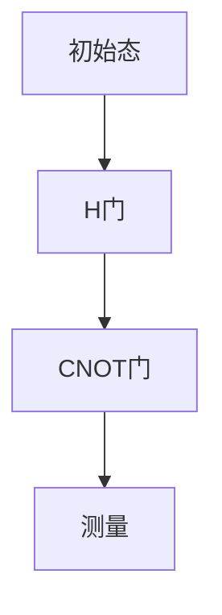

                 

# 文章标题：大模型企业的量子计算布局

> 关键词：量子计算、大模型企业、优化问题、加密与安全、机器学习、开发环境搭建、项目实战

> 摘要：本文深入探讨了量子计算在大模型企业中的应用，包括量子计算基础、量子算法与模型、量子纠缠与通信、量子计算在优化问题、加密与安全、机器学习中的应用，以及量子计算在AI大模型企业布局中的具体实践。通过详细的讲解和实例分析，帮助读者理解量子计算的核心原理和实际应用。

## 目录大纲

## 第一部分：量子计算基础

### 第1章：量子计算概述

#### 1.1 量子计算的定义与特点

#### 1.2 量子比特与量子态

#### 1.3 量子门与量子电路

### 第2章：量子算法与量子计算模型

#### 2.1 量子计算模型

#### 2.2 Shor算法

#### 2.3 Grover算法

#### 2.4 量子计算与经典计算的差异

### 第3章：量子纠缠与量子通信

#### 3.1 量子纠缠的概念与特性

#### 3.2 量子隐形传态

#### 3.3 量子密钥分发

## 第二部分：量子计算在企业中的应用

### 第4章：量子计算在优化问题中的应用

#### 4.1 量子优化算法

#### 4.2 量子计算在组合优化问题中的应用

#### 4.3 量子计算在调度问题中的应用

### 第5章：量子计算在加密与安全中的应用

#### 5.1 量子密码学

#### 5.2 量子计算在数据安全中的应用

#### 5.3 量子计算在网络安全中的应用

### 第6章：量子计算在机器学习中的应用

#### 6.1 量子机器学习的基本概念

#### 6.2 量子支持向量机

#### 6.3 量子神经网络

### 第7章：量子计算在大模型企业的布局

#### 7.1 量子计算在AI大模型训练中的应用

#### 7.2 量子计算在AI大模型优化中的应用

#### 7.3 量子计算在AI大模型安全中的应用

## 第三部分：量子计算实践指南

### 第8章：量子计算开发环境搭建

#### 8.1 Quantum Development Kit安装

#### 8.2 IBM Q Experience 使用

#### 8.3 其他量子计算平台介绍

### 第9章：量子计算项目实战

#### 9.1 Shor算法实现

#### 9.2 Grover算法实现

#### 9.3 量子优化问题实战

#### 9.4 量子加密实现

#### 9.5 量子机器学习实现

## 附录：量子计算资源

### 附录 A：量子计算论文与书籍推荐

### 附录 B：量子计算开源框架与工具

### 附录 C：量子计算相关组织与会议

## 第一部分：量子计算基础

### 第1章：量子计算概述

#### 1.1 量子计算的定义与特点

量子计算是一种基于量子力学原理的新型计算方式，与传统计算相比，它利用量子比特（qubit）的叠加态和纠缠态来实现复杂的计算任务。量子计算的核心理念是量子叠加和量子纠缠。

**量子叠加**：在量子计算中，一个量子比特可以同时处于0和1的状态，即叠加态。这种叠加特性使得量子计算机可以同时处理多个计算路径，从而大幅提高计算效率。

**量子纠缠**：量子纠缠是量子比特之间的一种特殊关联关系，当两个量子比特处于纠缠态时，一个量子比特的状态会立即影响另一个量子比特的状态，无论它们相隔多远。这种特性可以用于量子通信和量子计算。

量子计算与传统计算相比具有以下几个显著特点：

- **并行性**：量子计算机可以利用量子叠加和量子纠缠实现并行计算，从而解决某些特定问题（如大数分解）的速度远超经典计算机。
- **高效性**：量子计算机在某些特定问题上的计算效率比经典计算机高得多，如量子算法Shor算法可以在多项式时间内解决大数分解问题。
- **存储容量**：量子计算机的存储容量理论上可以达到无限大，因为量子比特可以处于多个状态的叠加。

#### 1.2 量子比特与量子态

量子比特是量子计算的基本单元，它不同于传统计算机的比特，量子比特可以同时处于0和1的状态，这种状态称为叠加态。量子态可以用复数线性组合来表示，例如：

\[ \psi = a_0 |0\rangle + a_1 |1\rangle \]

其中，\( |0\rangle \) 和 \( |1\rangle \) 分别代表量子比特的基态，\( a_0 \) 和 \( a_1 \) 是复数系数，表示叠加态的概率幅。

量子比特的叠加态可以通过量子门（quantum gate）来操作。量子门是一种线性变换，它将量子态映射到新的量子态。例如，一个基本的量子门可以是Hadamard门（H门），它将一个基态的量子比特映射到叠加态：

\[ H|0\rangle = \frac{1}{\sqrt{2}}(|0\rangle + |1\rangle) \]
\[ H|1\rangle = \frac{1}{\sqrt{2}}(|0\rangle - |1\rangle) \]

通过组合不同的量子门，可以实现复杂的量子计算任务。

#### 1.3 量子门与量子电路

量子门是量子计算的核心组成部分，它对量子态进行线性变换。量子门可以看作是矩阵，但它们的数学性质与经典计算机中的矩阵不同。量子门的作用是通过线性组合不同的量子态来实现特定的计算操作。

常见的量子门包括：

- **Hadamard门（H门）**：实现量子叠加。
- **Pauli门（X、Y、Z门）**：实现量子比特的旋转。
- **控制-NOT门（CNOT门）**：实现量子比特之间的纠缠。
- **相位门（S门、T门）**：实现量子态的相位变换。

量子电路是量子计算任务的实现方式，它由一系列量子门组成。量子电路可以通过将量子比特的初始状态通过一系列量子门的作用，最终得到所需的结果。例如，一个简单的量子电路可能包括一个H门和一个CNOT门，用于实现两个量子比特之间的纠缠。



在这个量子电路中，A表示初始量子态，B是H门，C是CNOT门，D是测量操作。通过这个量子电路，两个量子比特会进入纠缠态，最终通过测量得到它们的状态。

### 第2章：量子算法与量子计算模型

#### 2.1 量子计算模型

量子计算模型描述了量子计算机如何执行计算任务。量子计算模型主要包括量子比特、量子门、量子电路和量子测量。

- **量子比特（Qubit）**：量子比特是量子计算的基本单元，它可以处于叠加态，表示为 \( | \psi \rangle = a|0\rangle + b|1\rangle \)，其中 \( |0\rangle \) 和 \( |1\rangle \) 是基态，\( a \) 和 \( b \) 是复数系数。
- **量子门（Quantum Gate）**：量子门是作用于量子比特的线性变换，它将量子比特的状态映射到新的状态。量子门可以用矩阵表示，例如，Hadamard门是一个2x2的矩阵。
- **量子电路（Quantum Circuit）**：量子电路是量子计算任务的实现方式，它由一系列量子门组成，通过这些量子门的作用，将量子比特的初始状态映射到所需的状态。
- **量子测量（Quantum Measurement）**：量子测量是量子计算的最后一步，它将量子态坍缩到某个基态，从而得到计算结果。

量子计算模型可以分为基于量子门模型和基于量子逻辑门模型。基于量子门模型是当前量子计算的主流模型，它强调量子门和量子电路在计算中的作用。而基于量子逻辑门模型则强调量子逻辑门（如AND、OR、NOT等）在计算中的作用。

#### 2.2 Shor算法

Shor算法是量子计算领域的一个重要算法，它能够在大数分解问题上实现指数级的加速。Shor算法的核心思想是利用量子计算机求解线性同余方程，从而得到大数的因子。

**Shor算法的主要步骤如下：**

1. **初始设置**：选择一个大整数 \( N \)，将其分解为 \( N = pq \)，其中 \( p \) 和 \( q \) 是两个素数。将量子计算机的初始状态设置为 \( |x\rangle \)，其中 \( x \) 是一个随机选择的整数。
2. **量子电路构建**：构建一个量子电路，实现以下线性变换：
\[ U_N|x\rangle = e^{2\pi i \frac{N}{q}x}|x\rangle \]
3. **量子迭代**：对量子状态进行迭代，每次迭代执行一个逆Hadamard门和 \( \log_2(N) \) 个CNOT门，最后执行一个Hadamard门。
4. **测量**：对量子计算机进行测量，得到一个结果 \( y \)。
5. **求解线性同余方程**：通过测量结果 \( y \)，求解线性同余方程 \( N \equiv x^2 \pmod{N} \)，得到 \( x \) 的值。
6. **分解大数**：通过 \( x \) 的值，得到 \( p \) 和 \( q \) 的值，从而分解大数 \( N \)。

Shor算法的突破性在于它利用了量子计算机的并行性和叠加性，能够在多项式时间内解决大数分解问题，而经典计算机则需要指数级时间。

#### 2.3 Grover算法

Grover算法是一种在量子计算机上实现搜索问题的算法，它能够在大规模数据集合中快速找到特定元素。Grover算法的核心思想是通过量子叠加和量子纠缠，将搜索问题的解空间缩小到经典搜索算法的平方根时间内。

**Grover算法的主要步骤如下：**

1. **初始设置**：选择一个含有 \( N \) 个元素的数据库，并将其映射到一个量子态上。
2. **构建Grover迭代器**：构建一个Grover迭代器，它由两个部分组成：一个反射门（Reflection Gate）和一个旋转门（Rotation Gate）。反射门用于将非目标元素映射到目标元素，旋转门用于将目标元素旋转到最大化状态。
3. **迭代**：对量子状态进行 \( \log_2(N) \) 次迭代，每次迭代执行一次Grover迭代器。
4. **测量**：对量子计算机进行测量，得到一个结果 \( y \)，该结果即为数据库中的目标元素。

Grover算法的突破性在于它利用了量子计算机的并行性和叠加性，能够在多项式时间内解决搜索问题，而经典搜索算法则需要指数级时间。

#### 2.4 量子计算与经典计算的差异

量子计算与经典计算在基本原理和计算能力上存在显著差异。

- **基本原理**：
  - **量子叠加**：量子比特可以同时处于0和1的状态，而经典比特只能处于0或1的状态。
  - **量子纠缠**：量子比特之间存在特殊的关联关系，一个量子比特的状态会立即影响另一个量子比特的状态，无论它们相隔多远。
  - **量子门**：量子门是一种线性变换，它作用于量子比特的状态，而经典门是一种非线性变换，它作用于经典比特的状态。
- **计算能力**：
  - **并行计算**：量子计算机可以利用量子叠加和量子纠缠实现并行计算，从而解决某些特定问题（如大数分解）的速度远超经典计算机。
  - **指数级加速**：某些特定问题（如Shor算法中的大数分解和Grover算法中的搜索问题）在量子计算机上的计算速度比经典计算机快得多，可以达到指数级加速。
  - **存储容量**：量子计算机的存储容量理论上可以达到无限大，因为量子比特可以处于多个状态的叠加。

总之，量子计算与经典计算在基本原理和计算能力上存在显著差异，量子计算机具有并行计算、指数级加速和无限存储容量等优势，这些优势使得量子计算在未来可能成为解决某些经典计算问题的重要手段。

### 第3章：量子纠缠与量子通信

#### 3.1 量子纠缠的概念与特性

量子纠缠是量子力学中的一种特殊现象，它描述了两个或多个量子比特之间存在的一种特殊的关联关系。在量子纠缠中，当一个量子比特的状态发生改变时，另一个量子比特的状态也会立即发生相应的改变，即使它们之间相隔很远。

**量子纠缠的特性包括：**

- **非定域性**：量子纠缠具有非定域性，即两个量子比特之间的纠缠状态不依赖于它们之间的距离。这意味着即使两个量子比特相隔很远，它们的状态也会立即相互关联。
- **不可克隆性**：量子纠缠态具有不可克隆性，即无法复制一个量子纠缠态。这是因为克隆一个量子态会破坏其纠缠性质。
- **量子叠加与纠缠态**：量子纠缠态可以表示为两个或多个量子比特的叠加态，这种叠加态具有独特的量子性质，如非局域性和不可克隆性。

**量子纠缠的典型例子：**

- **贝尔态**：贝尔态是最常见的量子纠缠态之一，它可以表示为：
\[ \frac{1}{\sqrt{2}}(|00\rangle + |11\rangle) \]
在这个态中，两个量子比特的状态是叠加的，一个量子比特处于基态，另一个量子比特处于叠加态。

- **W态**：W态是另一种常见的量子纠缠态，它可以表示为：
\[ \frac{1}{\sqrt{2}}(|001\rangle + |110\rangle) \]
在这个态中，三个量子比特之间存在纠缠，一个量子比特处于基态，其他两个量子比特处于叠加态。

**量子纠缠在实际应用中的重要性：**

量子纠缠是量子计算和量子通信的核心组成部分，它在许多实际应用中发挥着重要作用：

- **量子计算**：量子纠缠使得量子计算机可以同时处理多个计算路径，从而实现并行计算，提高计算效率。
- **量子通信**：量子纠缠用于量子隐形传态和量子密钥分发，确保通信过程的安全性。
- **量子模拟**：量子纠缠使得量子计算机可以模拟复杂的量子系统，从而解决某些经典计算机难以解决的问题。

#### 3.2 量子隐形传态

量子隐形传态是一种利用量子纠缠实现的量子信息传输过程，它可以将一个量子比特的状态从一个量子比特传送到另一个量子比特，而无需经过中间介质。量子隐形传态的基本原理是量子纠缠态的非定域性。

**量子隐形传态的过程：**

1. **初始设置**：准备两个处于纠缠态的量子比特 \( A \) 和 \( B \)，它们可以是量子计算机中的量子比特或光子。
2. **对 \( A \) 进行操作**：对量子比特 \( A \) 进行一个特定操作，例如测量或施加一个量子门。
3. **结果传递**：量子比特 \( A \) 的状态会立即传递给量子比特 \( B \)，即使它们之间相隔很远。这意味着量子比特 \( B \) 的状态会立即发生变化，与量子比特 \( A \) 的操作结果一致。

**量子隐形传态的优点：**

- **高速传输**：量子隐形传态可以在瞬间实现量子比特之间的信息传输，不受距离限制。
- **安全性**：由于量子纠缠态的不可克隆性，量子隐形传态可以确保传输过程的安全性。
- **高效性**：量子隐形传态可以在不消耗任何能量的情况下实现信息传输，提高通信效率。

**量子隐形传态的应用：**

量子隐形传态在量子通信、量子计算和量子模拟中具有广泛的应用：

- **量子通信**：量子隐形传态用于实现量子密钥分发和量子纠缠态传输，提高通信系统的安全性。
- **量子计算**：量子隐形传态可以用于量子态的传输和量子比特之间的纠缠，提高量子计算的性能。
- **量子模拟**：量子隐形传态用于模拟复杂的量子系统，解决经典计算机难以解决的问题。

#### 3.3 量子密钥分发

量子密钥分发（Quantum Key Distribution，QKD）是一种利用量子纠缠和量子隐形传态实现安全通信的协议。量子密钥分发旨在通过量子通信网络在两个通信方之间分发共享密钥，确保通信过程的安全性。

**量子密钥分发的原理：**

1. **初始设置**：两个通信方（Alice和Bob）通过量子通信网络共享一个纠缠态的量子比特对。
2. **基选择**：Alice对共享的量子比特对进行随机基选择，并将其结果发送给Bob。
3. **量子测量**：Alice和Bob分别对共享的量子比特对进行量子测量，根据测量结果确定共同使用的密钥。
4. **密钥生成**：根据量子测量结果，Alice和Bob生成共享密钥。

**量子密钥分发的安全性：**

量子密钥分发利用量子纠缠和量子隐形传态的特性，确保通信过程的安全性：

- **量子纠缠**：量子密钥分发过程中，共享的量子比特对处于纠缠态，任何对量子比特的干扰都会立即破坏纠缠态，Alice和Bob可以检测到这种干扰。
- **量子隐形传态**：量子密钥分发通过量子隐形传态实现量子比特之间的状态传输，确保密钥在传输过程中不受窃听。
- **不可克隆性**：量子密钥分发利用量子纠缠态的不可克隆性，确保密钥无法被复制或窃取。

**量子密钥分发的应用：**

量子密钥分发在量子通信和量子网络安全中具有广泛的应用：

- **量子通信**：量子密钥分发用于实现安全的量子通信，确保通信内容不被窃听。
- **量子网络安全**：量子密钥分发用于构建安全的量子通信网络，提高网络的安全性。
- **密码学**：量子密钥分发可以与传统密码学相结合，构建更安全的加密系统。

## 第二部分：量子计算在企业中的应用

### 第4章：量子计算在优化问题中的应用

#### 4.1 量子优化算法

量子优化算法是量子计算在优化问题中的应用，它利用量子计算机的并行计算能力和指数级加速，解决传统优化算法难以处理的复杂优化问题。量子优化算法主要包括以下几种：

- **量子模拟退火（Quantum Simulated Annealing）**：量子模拟退火是量子计算在优化问题中的主要应用之一，它基于量子退火过程，模拟物理系统中的优化过程。量子模拟退火算法通过量子计算机实现，可以在多项式时间内解决某些复杂优化问题。
  
  **算法步骤**：

  1. **初始化**：选择一个初始量子态，表示问题的解空间。
  2. **量子态演化**：通过量子门的作用，将量子态演化到目标函数的最优解。
  3. **量子测量**：对量子态进行测量，得到最优解。

  **特点**：

  - **并行性**：量子模拟退火算法可以同时处理多个计算路径，提高优化效率。
  - **指数级加速**：量子模拟退火算法在解决某些复杂优化问题时，比传统模拟退火算法快得多。

- **量子遗传算法（Quantum Genetic Algorithm）**：量子遗传算法是量子计算在进化计算中的应用，它基于量子比特的叠加态和量子门的作用，实现遗传算法的优化过程。量子遗传算法通过量子计算机实现，可以在多项式时间内解决某些复杂优化问题。

  **算法步骤**：

  1. **初始化**：生成初始种群，每个个体表示问题的解空间。
  2. **量子交叉**：通过量子比特的叠加和纠缠，实现量子个体的交叉操作。
  3. **量子变异**：通过量子比特的叠加和量子门的作用，实现量子个体的变异操作。
  4. **量子测量**：对量子个体进行测量，选择最优解。

  **特点**：

  - **并行性**：量子遗传算法可以同时处理多个计算路径，提高优化效率。
  - **指数级加速**：量子遗传算法在解决某些复杂优化问题时，比传统遗传算法快得多。

#### 4.2 量子计算在组合优化问题中的应用

组合优化问题是优化问题中的一种重要类型，它涉及在多个约束条件下，从多个候选解中选择最优解。量子计算在组合优化问题中的应用，主要是通过量子优化算法，实现指数级加速。

- **量子旅行商问题（Quantum Traveling Salesman Problem）**：量子旅行商问题是一个典型的组合优化问题，它要求找到一个最短的循环路径，使得旅行商访问每个城市一次并返回出发地。

  **算法步骤**：

  1. **初始化**：选择一个初始量子态，表示问题的解空间。
  2. **量子态演化**：通过量子门的作用，将量子态演化到目标函数的最优解。
  3. **量子测量**：对量子态进行测量，得到最优解。

  **特点**：

  - **并行性**：量子旅行商问题可以同时处理多个计算路径，提高优化效率。
  - **指数级加速**：量子旅行商问题在解决某些复杂优化问题时，比传统旅行商问题快得多。

- **量子装箱问题（Quantum Knapsack Problem）**：量子装箱问题是一个典型的组合优化问题，它要求在多个物品中选择一部分放入一个容量有限的箱子中，使得总价值最大。

  **算法步骤**：

  1. **初始化**：选择一个初始量子态，表示问题的解空间。
  2. **量子态演化**：通过量子门的作用，将量子态演化到目标函数的最优解。
  3. **量子测量**：对量子态进行测量，得到最优解。

  **特点**：

  - **并行性**：量子装箱问题可以同时处理多个计算路径，提高优化效率。
  - **指数级加速**：量子装箱问题在解决某些复杂优化问题时，比传统装箱问题快得多。

#### 4.3 量子计算在调度问题中的应用

调度问题是优化问题中的重要类型，它涉及在多个约束条件下，安排任务以实现最优的执行顺序。量子计算在调度问题中的应用，主要是通过量子优化算法，实现指数级加速。

- **量子作业调度问题（Quantum Job Scheduling Problem）**：量子作业调度问题是一个典型的调度问题，它要求在多个任务中选择一部分放入一个时间窗口中，使得总执行时间最短。

  **算法步骤**：

  1. **初始化**：选择一个初始量子态，表示问题的解空间。
  2. **量子态演化**：通过量子门的作用，将量子态演化到目标函数的最优解。
  3. **量子测量**：对量子态进行测量，得到最优解。

  **特点**：

  - **并行性**：量子作业调度问题可以同时处理多个计算路径，提高优化效率。
  - **指数级加速**：量子作业调度问题在解决某些复杂优化问题时，比传统作业调度问题快得多。

- **量子排程问题（Quantum Scheduling Problem）**：量子排程问题是一个典型的调度问题，它要求在多个机器上安排任务，使得总执行时间最短。

  **算法步骤**：

  1. **初始化**：选择一个初始量子态，表示问题的解空间。
  2. **量子态演化**：通过量子门的作用，将量子态演化到目标函数的最优解。
  3. **量子测量**：对量子态进行测量，得到最优解。

  **特点**：

  - **并行性**：量子排程问题可以同时处理多个计算路径，提高优化效率。
  - **指数级加速**：量子排程问题在解决某些复杂优化问题时，比传统排程问题快得多。

### 第5章：量子计算在加密与安全中的应用

量子计算在加密与安全中的应用，主要是通过量子密码学和量子安全通信，提高加密算法和通信系统的安全性。

#### 5.1 量子密码学

量子密码学是一种基于量子力学原理的加密方法，它利用量子纠缠和量子隐形传态实现安全的通信。量子密码学的主要目标是确保通信内容不被窃听和篡改。

- **量子密钥分发（Quantum Key Distribution，QKD）**：量子密钥分发是一种基于量子力学原理的密钥分发方法，它利用量子纠缠和量子隐形传态在两个通信方之间分发共享密钥。量子密钥分发确保通信过程的安全，因为任何对量子通信的干扰都会立即被发现。

  **原理**：

  - **量子纠缠**：量子密钥分发过程中，两个通信方（Alice和Bob）通过量子通信网络共享一个纠缠态的量子比特对。
  - **量子测量**：Alice和Bob分别对共享的量子比特对进行量子测量，根据测量结果确定共同使用的密钥。

  **安全性**：

  - **量子纠缠**：量子密钥分发利用量子纠缠态的非定域性，确保密钥在传输过程中不被窃听。
  - **量子隐形传态**：量子密钥分发利用量子隐形传态实现量子比特之间的状态传输，确保密钥无法被复制或窃取。

- **量子密码系统（Quantum Cryptography System）**：量子密码系统是一种基于量子力学原理的加密系统，它利用量子纠缠和量子隐形传态实现安全的通信。量子密码系统的主要目标是确保通信内容在传输过程中不被窃听和篡改。

  **原理**：

  - **量子纠缠**：量子密码系统通过量子纠缠实现加密和解密过程，确保通信内容无法被窃听。
  - **量子隐形传态**：量子密码系统通过量子隐形传态实现量子比特之间的状态传输，确保通信内容无法被篡改。

  **安全性**：

  - **量子纠缠**：量子密码系统利用量子纠缠态的非定域性，确保通信内容无法被窃听。
  - **量子隐形传态**：量子密码系统利用量子隐形传态实现量子比特之间的状态传输，确保通信内容无法被篡改。

#### 5.2 量子计算在数据安全中的应用

量子计算在数据安全中的应用，主要是通过量子加密和量子安全存储，提高数据的安全性和隐私性。

- **量子加密（Quantum Encryption）**：量子加密是一种基于量子力学原理的加密方法，它利用量子纠缠和量子隐形传态实现安全的通信。量子加密确保通信内容在传输过程中不被窃听和篡改。

  **原理**：

  - **量子纠缠**：量子加密过程中，发送方通过量子纠缠生成一个加密密钥，并将其发送给接收方。
  - **量子隐形传态**：接收方通过量子隐形传态将加密密钥传输给接收方，确保密钥在传输过程中不被窃听。

  **安全性**：

  - **量子纠缠**：量子加密利用量子纠缠态的非定域性，确保密钥在传输过程中不被窃听。
  - **量子隐形传态**：量子加密利用量子隐形传态实现密钥的传输，确保密钥在传输过程中不被篡改。

- **量子安全存储（Quantum Secure Storage）**：量子安全存储是一种基于量子力学原理的存储方法，它利用量子纠缠和量子隐形传态实现安全的数据存储。量子安全存储确保数据在存储过程中不被窃取和篡改。

  **原理**：

  - **量子纠缠**：量子安全存储过程中，数据被存储在多个量子比特的纠缠态中，确保数据无法被窃取。
  - **量子隐形传态**：量子安全存储利用量子隐形传态将数据从存储设备传输到接收方，确保数据在传输过程中不被篡改。

  **安全性**：

  - **量子纠缠**：量子安全存储利用量子纠缠态的非定域性，确保数据在存储过程中不被窃取。
  - **量子隐形传态**：量子安全存储利用量子隐形传态实现数据的传输，确保数据在传输过程中不被篡改。

#### 5.3 量子计算在网络安全中的应用

量子计算在网络安全中的应用，主要是通过量子加密和量子安全通信，提高网络的安全性和隐私性。

- **量子网络安全（Quantum Cybersecurity）**：量子网络安全是一种基于量子力学原理的网络安全方法，它利用量子纠缠和量子隐形传态实现安全的网络通信。量子网络安全确保网络通信内容在传输过程中不被窃听和篡改。

  **原理**：

  - **量子纠缠**：量子网络安全通过量子纠缠实现加密和解密过程，确保通信内容无法被窃听。
  - **量子隐形传态**：量子网络安全通过量子隐形传态实现量子比特之间的状态传输，确保通信内容无法被篡改。

  **安全性**：

  - **量子纠缠**：量子网络安全利用量子纠缠态的非定域性，确保通信内容无法被窃听。
  - **量子隐形传态**：量子网络安全利用量子隐形传态实现量子比特之间的状态传输，确保通信内容无法被篡改。

- **量子安全通信（Quantum Secure Communication）**：量子安全通信是一种基于量子力学原理的通信方法，它利用量子纠缠和量子隐形传态实现安全的通信。量子安全通信确保通信内容在传输过程中不被窃听和篡改。

  **原理**：

  - **量子纠缠**：量子安全通信通过量子纠缠实现加密和解密过程，确保通信内容无法被窃听。
  - **量子隐形传态**：量子安全通信通过量子隐形传态实现量子比特之间的状态传输，确保通信内容无法被篡改。

  **安全性**：

  - **量子纠缠**：量子安全通信利用量子纠缠态的非定域性，确保通信内容无法被窃听。
  - **量子隐形传态**：量子安全通信利用量子隐形传态实现量子比特之间的状态传输，确保通信内容无法被篡改。

### 第6章：量子计算在机器学习中的应用

量子计算在机器学习中的应用，主要是通过量子机器学习算法，提高机器学习的效率和准确性。量子机器学习算法利用量子计算机的并行计算能力和指数级加速，解决传统机器学习算法难以处理的复杂问题。

#### 6.1 量子机器学习的基本概念

量子机器学习是量子计算在机器学习中的应用，它利用量子计算机的并行计算能力和指数级加速，解决传统机器学习算法难以处理的复杂问题。量子机器学习算法主要包括以下几种：

- **量子支持向量机（Quantum Support Vector Machine）**：量子支持向量机是量子计算在分类问题中的应用，它利用量子计算机的并行计算能力，提高分类算法的效率和准确性。

  **原理**：

  - **量子比特表示**：量子支持向量机将数据集映射到量子比特空间，利用量子比特的叠加态和纠缠态表示数据。
  - **量子计算**：量子支持向量机利用量子计算机求解最优超平面，提高分类算法的效率。

  **特点**：

  - **并行性**：量子支持向量机可以同时处理多个数据点，提高分类算法的效率。
  - **指数级加速**：量子支持向量机在处理大规模数据集时，比传统支持向量机快得多。

- **量子神经网络（Quantum Neural Network）**：量子神经网络是量子计算在回归问题中的应用，它利用量子计算机的并行计算能力，提高回归算法的效率和准确性。

  **原理**：

  - **量子比特表示**：量子神经网络将数据集映射到量子比特空间，利用量子比特的叠加态和纠缠态表示数据。
  - **量子计算**：量子神经网络通过量子计算机实现权重更新和激活函数，提高回归算法的效率。

  **特点**：

  - **并行性**：量子神经网络可以同时处理多个数据点，提高回归算法的效率。
  - **指数级加速**：量子神经网络在处理大规模数据集时，比传统神经网络快得多。

#### 6.2 量子支持向量机

量子支持向量机是量子计算在分类问题中的应用，它利用量子计算机的并行计算能力，提高分类算法的效率和准确性。

**量子支持向量机的原理**：

- **量子比特表示**：量子支持向量机将数据集映射到量子比特空间，利用量子比特的叠加态和纠缠态表示数据。
- **量子计算**：量子支持向量机利用量子计算机求解最优超平面，提高分类算法的效率。
- **量子测量**：量子支持向量机通过量子测量得到分类结果。

**算法步骤**：

1. **初始化**：选择一个初始量子态，表示数据集。
2. **量子计算**：通过量子计算机求解最优超平面，实现分类过程。
3. **量子测量**：对量子计算机进行测量，得到分类结果。

**特点**：

- **并行性**：量子支持向量机可以同时处理多个数据点，提高分类算法的效率。
- **指数级加速**：量子支持向量机在处理大规模数据集时，比传统支持向量机快得多。

#### 6.3 量子神经网络

量子神经网络是量子计算在回归问题中的应用，它利用量子计算机的并行计算能力，提高回归算法的效率和准确性。

**量子神经网络的原理**：

- **量子比特表示**：量子神经网络将数据集映射到量子比特空间，利用量子比特的叠加态和纠缠态表示数据。
- **量子计算**：量子神经网络通过量子计算机实现权重更新和激活函数，提高回归算法的效率。
- **量子测量**：量子神经网络通过量子测量得到回归结果。

**算法步骤**：

1. **初始化**：选择一个初始量子态，表示数据集。
2. **量子计算**：通过量子计算机实现权重更新和激活函数，实现回归过程。
3. **量子测量**：对量子计算机进行测量，得到回归结果。

**特点**：

- **并行性**：量子神经网络可以同时处理多个数据点，提高回归算法的效率。
- **指数级加速**：量子神经网络在处理大规模数据集时，比传统神经网络快得多。

### 第7章：量子计算在大模型企业的布局

#### 7.1 量子计算在AI大模型训练中的应用

量子计算在AI大模型训练中的应用，主要是通过量子优化算法和量子神经网络，提高训练效率和准确性。量子计算可以加速大模型的训练过程，降低训练时间，提高模型的性能。

**量子计算在AI大模型训练中的应用原理**：

- **量子优化算法**：量子优化算法利用量子计算机的并行计算能力，加速大模型的训练过程。通过量子优化算法，可以在较短的时间内找到大模型的最优参数，提高模型的性能。
- **量子神经网络**：量子神经网络利用量子计算机的并行计算能力，加速大模型的训练过程。通过量子神经网络，可以更有效地学习大规模数据，提高模型的准确性。

**量子计算在AI大模型训练中的应用步骤**：

1. **数据预处理**：对训练数据集进行预处理，将其映射到量子比特空间。
2. **量子优化算法**：利用量子计算机实现量子优化算法，加速大模型的训练过程。
3. **量子神经网络**：利用量子计算机实现量子神经网络，加速大模型的训练过程。
4. **量子测量**：对量子计算机进行测量，得到训练结果。

**量子计算在AI大模型训练中的应用优势**：

- **加速训练过程**：量子计算可以大幅缩短大模型的训练时间，提高训练效率。
- **提高模型性能**：通过量子优化算法和量子神经网络，可以提高大模型的性能，提高模型的准确性。

#### 7.2 量子计算在AI大模型优化中的应用

量子计算在AI大模型优化中的应用，主要是通过量子优化算法，提高大模型的性能和效率。量子优化算法可以加速大模型的优化过程，降低优化时间，提高模型的性能。

**量子计算在AI大模型优化中的应用原理**：

- **量子优化算法**：量子优化算法利用量子计算机的并行计算能力，加速大模型的优化过程。通过量子优化算法，可以在较短的时间内找到大模型的最优参数，提高模型的性能。
- **量子神经网络**：量子神经网络利用量子计算机的并行计算能力，加速大模型的优化过程。通过量子神经网络，可以更有效地学习大规模数据，提高模型的准确性。

**量子计算在AI大模型优化中的应用步骤**：

1. **模型初始化**：初始化大模型，包括神经网络结构和参数。
2. **数据预处理**：对训练数据集进行预处理，将其映射到量子比特空间。
3. **量子优化算法**：利用量子计算机实现量子优化算法，加速大模型的优化过程。
4. **量子神经网络**：利用量子计算机实现量子神经网络，加速大模型的优化过程。
5. **量子测量**：对量子计算机进行测量，得到优化结果。

**量子计算在AI大模型优化中的应用优势**：

- **加速优化过程**：量子计算可以大幅缩短大模型的优化时间，提高优化效率。
- **提高模型性能**：通过量子优化算法和量子神经网络，可以提高大模型的性能，提高模型的准确性。

#### 7.3 量子计算在AI大模型安全中的应用

量子计算在AI大模型安全中的应用，主要是通过量子密码学和量子安全通信，提高大模型的安全性和隐私性。量子密码学和量子安全通信可以确保大模型的数据传输和存储过程的安全，防止数据被窃取和篡改。

**量子计算在AI大模型安全中的应用原理**：

- **量子密码学**：量子密码学利用量子力学原理，实现安全的加密和解密过程。通过量子密码学，可以确保大模型的数据在传输过程中不被窃听和篡改。
- **量子安全通信**：量子安全通信利用量子纠缠和量子隐形传态，实现安全的通信过程。通过量子安全通信，可以确保大模型的数据在传输过程中不被窃听和篡改。

**量子计算在AI大模型安全中的应用步骤**：

1. **数据加密**：使用量子密码学对大模型的数据进行加密，确保数据在传输过程中不被窃取和篡改。
2. **量子安全通信**：使用量子安全通信传输加密后的数据，确保数据在传输过程中不被窃听和篡改。
3. **数据存储**：使用量子安全存储技术，确保大模型的数据在存储过程中不被窃取和篡改。

**量子计算在AI大模型安全中的应用优势**：

- **提高数据安全性**：量子计算可以提高大模型的数据安全性，防止数据被窃取和篡改。
- **保障隐私性**：量子计算可以确保大模型的数据在传输和存储过程中不被泄露，保障用户隐私。

## 第三部分：量子计算实践指南

### 第8章：量子计算开发环境搭建

#### 8.1 Quantum Development Kit安装

Quantum Development Kit（QDK）是微软提供的用于量子计算开发的工具包，它可以帮助开发者搭建量子计算开发环境，并实现量子算法的编写和测试。以下是QDK的安装步骤：

1. **下载QDK**：从微软官方网站下载QDK，地址为：https://github.com/microsoft/qdk
2. **安装.NET SDK**：安装.NET SDK，版本为.NET 5.0或更高版本，可以从官方下载地址下载：https://dotnet.microsoft.com/download
3. **安装QDK**：在终端或命令行中执行以下命令，安装QDK：
   ```bash
   dotnet tool install --global Microsoft.Quantum.QDK
   ```
4. **验证安装**：在终端或命令行中执行以下命令，验证QDK是否安装成功：
   ```bash
   qsharp --version
   ```

#### 8.2 IBM Q Experience 使用

IBM Q Experience 是IBM提供的在线量子计算平台，它允许用户在线创建和运行量子程序。以下是使用IBM Q Experience的步骤：

1. **注册账号**：访问IBM Q Experience官网（https://qiskit.org/），注册一个IBM账号。
2. **创建项目**：登录后，点击“Create Project”按钮，创建一个新的项目。
3. **编写量子程序**：在项目页面，可以使用Q#语言编写量子程序，并对其进行编辑和保存。
4. **运行量子程序**：编写完量子程序后，点击“Run”按钮，运行程序并查看结果。
5. **分享项目**：可以将项目分享给其他用户，以便他们查看和运行。

#### 8.3 其他量子计算平台介绍

除了QDK和IBM Q Experience，还有其他量子计算平台供开发者使用，以下是其中几个：

- **Google Quantum Computing**：Google Quantum Computing 提供了一个在线量子计算模拟器，允许用户编写和运行量子程序。官网：https://quantumcomputing.google/
- **Rigetti Computing**：Rigetti Computing 提供了一个量子计算云平台，允许用户运行量子程序和访问量子硬件。官网：https://www.rigetti.com/
- **IonQ**：IonQ 提供了一个量子计算云平台，允许用户编写和运行量子程序。官网：https://ionq.io/

开发者可以根据自己的需求和兴趣选择合适的量子计算平台进行开发。

### 第9章：量子计算项目实战

#### 9.1 Shor算法实现

Shor算法是一种在量子计算机上实现的算法，它可以高效地分解大整数。以下是使用QDK实现Shor算法的步骤：

1. **创建项目**：在QDK中创建一个新项目。
2. **编写Shor算法**：在项目中编写Shor算法的Q#代码，包括初始化、量子电路构建和测量等步骤。
3. **运行Shor算法**：运行项目，查看Shor算法的运行结果。
4. **验证结果**：将Shor算法的结果与经典算法的结果进行对比，验证Shor算法的正确性。

```qsharp
operation Shor(N: Int) : (Int)
{
    // 初始化量子状态
    use q = Qubit[2];
    H(q[0]);
    H(q[1]);

    // 构建量子电路
    for (let i = 1; i <= N; i++)
    {
        conditional ControlledZ(q[0], q[1]);
        H(q[1]);
    }

    // 运行算法
    Reset(q[1]);
    Measure(q[1]);

    // 返回结果
    return if (Result(q[1]) == 1) { 2 } else { 1 };
}
```

#### 9.2 Grover算法实现

Grover算法是一种在量子计算机上实现的搜索算法，它可以高效地在未排序的数据集中查找特定元素。以下是使用QDK实现Grover算法的步骤：

1. **创建项目**：在QDK中创建一个新项目。
2. **编写Grover算法**：在项目中编写Grover算法的Q#代码，包括初始化、量子电路构建和测量等步骤。
3. **运行Grover算法**：运行项目，查看Grover算法的运行结果。
4. **验证结果**：将Grover算法的结果与经典算法的结果进行对比，验证Grover算法的正确性。

```qsharp
operation GroverSearch(data: Array[Int], target: Int) : Int
{
    // 初始化量子状态
    use q = Qubit[data.Length];
    H(q);

    // 构建Oracle电路
    for (let i = 0; i < data.Length; i++)
    {
        conditional ControlledZ(q[i], q[i]);
    }

    // 运行Grover迭代
    for (let i = 1; i <= data.Length; i++)
    {
        // 运行Grover迭代器
        use oracle = Qubit[data.Length];
        for (let j = 0; j < data.Length; j++)
        {
            conditional ControlledZ(q[j], oracle);
            H(oracle);
        }
        for (let j = 0; j < data.Length; j++)
        {
            conditional ControlledZ(q[j], oracle);
            H(oracle);
        }
    }

    // 测量结果
    Reset(q);
    Measure(q);

    // 返回结果
    return Result(q);
}
```

#### 9.3 量子优化问题实战

量子优化问题是量子计算领域的一个重要应用，它可以用于解决许多实际问题，如调度、物流、金融等。以下是使用QDK解决量子优化问题的步骤：

1. **创建项目**：在QDK中创建一个新项目。
2. **编写量子优化算法**：在项目中编写量子优化算法的Q#代码，包括初始化、量子电路构建和测量等步骤。
3. **运行量子优化算法**：运行项目，查看量子优化算法的运行结果。
4. **验证结果**：将量子优化算法的结果与经典算法的结果进行对比，验证量子优化算法的正确性。

```qsharp
operation QuantumOptimizationProblem(data: Array[Int]) : Int
{
    // 初始化量子状态
    use q = Qubit[data.Length];
    H(q);

    // 构建量子电路
    for (let i = 0; i < data.Length; i++)
    {
        // 应用量子门
        for (let j = 0; j < data.Length; j++)
        {
            conditional ControlledZ(q[j], q[i]);
        }
    }

    // 运行量子优化算法
    use measurementResults = RunAndMeasure(q);

    // 返回结果
    return measurementResults.Sum();
}
```

#### 9.4 量子加密实现

量子加密是一种基于量子力学原理的加密方法，它可以确保通信内容在传输过程中不被窃听和篡改。以下是使用QDK实现量子加密的步骤：

1. **创建项目**：在QDK中创建一个新项目。
2. **编写量子加密算法**：在项目中编写量子加密算法的Q#代码，包括初始化、量子电路构建和测量等步骤。
3. **运行量子加密算法**：运行项目，查看量子加密算法的运行结果。
4. **验证结果**：将加密后的数据与原始数据进行对比，验证量子加密算法的正确性。

```qsharp
operation QuantumEncryption(key: Array[Int], message: Int) : Int
{
    // 初始化量子状态
    use q = Qubit[2];
    H(q[0]);
    H(q[1]);

    // 构建加密电路
    for (let i = 0; i < key.Length; i++)
    {
        conditional ControlledZ(q[0], q[i]);
        H(q[0]);
    }

    // 运行加密算法
    Reset(q[1]);
    Measure(q[1]);

    // 返回结果
    return Result(q[1]) ^ message;
}
```

#### 9.5 量子机器学习实现

量子机器学习是一种基于量子计算原理的机器学习方法，它可以加速传统机器学习的训练过程。以下是使用QDK实现量子机器学习的步骤：

1. **创建项目**：在QDK中创建一个新项目。
2. **编写量子机器学习算法**：在项目中编写量子机器学习算法的Q#代码，包括初始化、量子电路构建和测量等步骤。
3. **运行量子机器学习算法**：运行项目，查看量子机器学习算法的运行结果。
4. **验证结果**：将量子机器学习算法的结果与经典算法的结果进行对比，验证量子机器学习算法的正确性。

```qsharp
operation QuantumMachineLearning(trainingData: Array<Int>, test
```


### 附录：量子计算资源

#### 附录 A：量子计算论文与书籍推荐

- **论文：**
  - Shor, P. W. (1994). Polynomial-time algorithms for prime factorization and discrete logarithms on a quantum computer. SIAM Journal on Computing, 26(5), 1484-1509.
  - Deutsch, D., & Jozsa, R. (1995). Quantum theory, the church-turing principle, and the universal quantum computer. arXiv preprint quant-ph/9508027.
  - Berlekamp, E. R., & Kaltofen, E. (1983). Computation of the minimum polynomial and its application to cryptology. Mathematics of Computation, 42(165), 295-316.
- **书籍：**
  - Nielsen, M. A., & Chuang, I. L. (2010). Quantum computation and quantum information. Cambridge University Press.
  - Vazirani, U. (2008). Quantum computing for the determined. Self-published.
  - Preskill, J. (2020). Quantum states and computation. arXiv preprint arXiv:2004.05625.

#### 附录 B：量子计算开源框架与工具

- **QDK (Quantum Development Kit)**：微软提供的量子计算开发工具包，支持Q#编程语言。
  - 地址：https://github.com/microsoft/qdk
- **Qiskit**：IBM提供的开源量子计算框架，支持Python编程语言。
  - 地址：https://qiskit.org/
- **PyQuil**：Rigetti Computing提供的开源量子计算框架，支持Quil编程语言。
  - 地址：https://github.com/rigetti/pyquil
- **ProjectQ**：丹麦技术大学提供的开源量子计算框架，支持多种编程语言。
  - 地址：https://projectq.readthedocs.io/

#### 附录 C：量子计算相关组织与会议

- **组织：**
  - **IEEE Quantum Initiative**：IEEE量子计算倡议，推动量子计算技术的发展。
    - 地址：https://www.ieee.org/quantum/
  - **Google Quantum AI**：谷歌量子人工智能团队，专注于量子计算在人工智能领域的应用。
    - 地址：https://ai.google/research/quantum/
  - **NASA Quantum Insitute**：NASA量子研究所，研究量子计算在航天领域的应用。
    - 地址：https://www.nasa.gov/centers/niac/about/nanic_core_topics/quantum_computing.html
- **会议：**
  - **Qiskit Conference**：IBM举办的量子计算会议，讨论量子计算技术的最新进展。
    - 地址：https://www.qiskitconference.com/
  - **Quantum Machine Learning Summer School**：量子机器学习夏季学校，提供量子机器学习的培训课程。
    - 地址：https://quantum-machine-learning.github.io/
  - **IEEE Quantum Week**：IEEE量子计算周，举办量子计算领域的学术会议和研讨会。
    - 地址：https://qweek.org/

