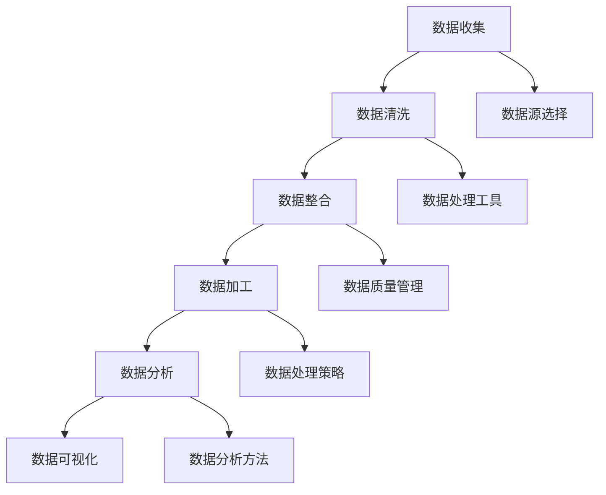

                 

# 文章标题

《大模型公司的数据获取与处理策略》

## 关键词

- 大模型
- 数据获取
- 数据处理
- 数据质量
- 数据源
- 数据分析
- 数据清洗
- 数据整合

## 摘要

随着人工智能技术的快速发展，大模型在公司中的应用越来越广泛。数据是大模型训练的核心，如何高效地获取和处理数据成为了各大公司面临的挑战。本文将详细探讨大模型公司的数据获取与处理策略，包括数据需求分析、数据来源分析、数据获取技术、数据获取策略制定、数据处理技术、数据处理策略优化以及具体案例分析。通过这篇文章，读者可以了解大模型公司在数据获取与处理方面的实践和经验，为自身业务发展提供参考和借鉴。

# 《大模型公司的数据获取与处理策略》目录大纲

## 第一部分：数据获取策略

### 第1章：大模型与数据获取

#### 1.1 大模型对数据的需求

##### 1.1.1 大模型的数据依赖

##### 1.1.2 数据质量对大模型的影响

##### 1.1.3 数据多样性的重要性

#### 1.2 数据来源分析

##### 1.2.1 公开数据源

##### 1.2.2 非公开数据源

##### 1.2.3 用户生成内容

### 第2章：数据获取技术

#### 2.1 数据爬取技术

##### 2.1.1 爬虫的基本原理

##### 2.1.2 常见爬取技术

##### 2.1.3 数据爬取的伦理和法律问题

#### 2.2 数据采集工具

##### 2.2.1 API采集

##### 2.2.2 客户端采集

##### 2.2.3 云数据采集

### 第3章：数据获取策略制定

#### 3.1 数据获取策略概述

##### 3.1.1 数据获取的目标

##### 3.1.2 数据获取的挑战

##### 3.1.3 数据获取策略的关键要素

#### 3.2 数据获取流程设计

##### 3.2.1 数据收集

##### 3.2.2 数据清洗

##### 3.2.3 数据存储与处理

### 第4章：数据获取案例分析

#### 4.1 案例分析一：电商数据获取

##### 4.1.1 案例背景

##### 4.1.2 数据获取流程

##### 4.1.3 数据获取策略

#### 4.2 案例分析二：社交媒体数据获取

##### 4.2.1 案例背景

##### 4.2.2 数据获取流程

##### 4.2.3 数据获取策略

## 第二部分：数据处理策略

### 第5章：数据处理技术

#### 5.1 数据清洗技术

##### 5.1.1 数据清洗的基本流程

##### 5.1.2 数据清洗方法

##### 5.1.3 数据清洗工具

#### 5.2 数据整合技术

##### 5.2.1 数据整合的基本流程

##### 5.2.2 数据整合方法

##### 5.2.3 数据整合工具

### 第6章：数据加工与分析

#### 6.1 数据加工技术

##### 6.1.1 数据加工的基本流程

##### 6.1.2 数据加工方法

##### 6.1.3 数据加工工具

#### 6.2 数据分析技术

##### 6.2.1 数据分析的基本流程

##### 6.2.2 数据分析方法

##### 6.2.3 数据分析工具

### 第7章：数据处理策略优化

#### 7.1 数据处理策略评估

##### 7.1.1 数据处理策略评估指标

##### 7.1.2 数据处理策略评估方法

##### 7.1.3 数据处理策略优化方法

#### 7.2 数据处理效率优化

##### 7.2.1 数据处理效率的影响因素

##### 7.2.2 数据处理效率优化策略

### 第8章：数据处理案例分析

#### 8.1 案例分析一：金融数据分析

##### 8.1.1 案例背景

##### 8.1.2 数据处理流程

##### 8.1.3 数据处理策略

#### 8.2 案例分析二：医疗数据挖掘

##### 8.2.1 案例背景

##### 8.2.2 数据处理流程

##### 8.2.3 数据处理策略

## 附录

### 附录A：数据处理工具与资源

#### A.1 数据处理工具介绍

##### A.1.1 Python数据处理库

##### A.1.2 Hadoop与Spark

##### A.1.3 其他数据处理工具

#### A.2 数据处理资源推荐

##### A.2.1 数据处理书籍推荐

##### A.2.2 数据处理在线课程推荐

##### A.2.3 数据处理社区与论坛推荐

### 附录B：Mermaid流程图

#### B.1 大模型数据获取与处理流程图

##### B.1.1 数据获取流程图

##### B.1.2 数据处理流程图

### 附录C：核心算法原理讲解

#### C.1 数据清洗算法原理讲解

##### C.1.1 伪代码实现

##### C.1.2 实例分析

#### C.2 数据整合算法原理讲解

##### C.2.1 伪代码实现

##### C.2.2 实例分析

#### C.3 数据加工算法原理讲解

##### C.3.1 伪代码实现

##### C.3.2 实例分析

### 附录D：项目实战

#### D.1 电商数据获取项目实战

##### D.1.1 项目背景

##### D.1.2 开发环境搭建

##### D.1.3 源代码实现

##### D.1.4 代码解读与分析

#### D.2 社交媒体数据获取项目实战

##### D.2.1 项目背景

##### D.2.2 开发环境搭建

##### D.2.3 源代码实现

##### D.2.4 代码解读与分析

## 第1章：大模型与数据获取

### 1.1 大模型对数据的需求

#### 1.1.1 大模型的数据依赖

大模型，尤其是深度学习模型，对数据有着高度依赖。数据是训练模型的基石，模型的好坏很大程度上取决于数据的质量和数量。对于大模型来说，数据需求具有以下几个特点：

1. **海量数据**：大模型通常需要数百万到数十亿条样本进行训练，以获取足够的信息来提高模型的泛化能力。
   
2. **高质量数据**：数据的质量直接影响模型的性能。高质量的训练数据可以减少噪声和异常值，提高模型的准确性。

3. **多样性数据**：不同来源、不同格式、不同类型的多样化数据可以帮助模型学习到更广泛的知识，提高模型的鲁棒性。

#### 1.1.2 数据质量对大模型的影响

数据质量对大模型的性能有着重要影响。以下是几个关键方面：

1. **准确性**：高质量的数据可以减少噪声和错误，从而提高模型的预测准确性。
   
2. **泛化能力**：多样化且代表性强的数据可以帮助模型更好地泛化到未见过的数据，提高模型的鲁棒性。

3. **过拟合**：如果数据质量差，模型可能会过拟合，即在训练数据上表现良好，但在未见过的数据上表现不佳。

#### 1.1.3 数据多样性的重要性

数据多样性对于大模型的学习和泛化能力至关重要。以下是数据多样性的几个重要方面：

1. **上下文多样性**：不同的上下文可以帮助模型理解更加复杂的语义关系，提高模型的解释能力。

2. **数据分布**：多样化的数据分布可以帮助模型学习到不同的特征，从而更好地适应不同的业务场景。

3. **数据源多样性**：使用多个数据源可以收集到更全面的信息，提高数据的代表性和准确性。

### 1.2 数据来源分析

#### 1.2.1 公开数据源

公开数据源是获取数据的一个重要途径。这些数据通常由政府机构、学术研究机构、开放数据平台等提供，具有以下特点：

1. **数据丰富**：公开数据源涵盖了各种主题和领域，如天气、交通、经济等，数据量通常较大。

2. **质量较高**：公开数据源通常经过一定的处理和验证，数据质量相对较高。

3. **获取方式**：公开数据源可以通过在线平台、数据库接口等方式获取。

#### 1.2.2 非公开数据源

非公开数据源通常来自于公司内部、合作伙伴或其他商业渠道。这些数据具有以下特点：

1. **数据针对性**：非公开数据源通常与公司的业务紧密相关，有助于提高模型在特定业务场景下的性能。

2. **数据质量**：非公开数据源的质量可能参差不齐，需要仔细筛选和处理。

3. **获取难度**：非公开数据源通常需要通过合作、购买或其他方式获取，可能存在一定的获取难度。

#### 1.2.3 用户生成内容

用户生成内容（User-Generated Content，简称UGC）是近年来数据获取的一个重要来源。这些数据通常来自于社交媒体、论坛、评论等平台，具有以下特点：

1. **数据量大**：用户生成内容通常数量庞大，是获取数据的一个重要途径。

2. **多样性**：用户生成内容涵盖了各种主题、格式和风格，有助于提高数据的多样性。

3. **实时性**：用户生成内容通常具有实时性，可以捕捉到最新的信息和趋势。

## 第2章：数据获取技术

### 2.1 数据爬取技术

#### 2.1.1 爬虫的基本原理

爬虫（Crawler）是一种自动化程序，用于从互联网上抓取信息。爬虫的基本原理包括以下几个步骤：

1. **网址获取**：爬虫从种子列表中获取初始网址，也可以通过网页上的链接自动获取新的网址。
   
2. **网页下载**：爬虫使用HTTP协议从目标网址下载网页内容。

3. **内容解析**：爬虫使用解析库（如BeautifulSoup、lxml等）解析网页内容，提取所需的数据。

4. **数据存储**：爬虫将提取的数据存储到数据库、文件或其他存储介质中。

5. **重复访问**：爬虫根据设定的策略，重复访问新的网址，继续提取数据。

#### 2.1.2 常见爬取技术

常见的爬取技术包括以下几种：

1. **网络爬虫**：网络爬虫是最常见的爬取技术，用于从互联网上获取数据。网络爬虫可以分为通用爬虫和聚焦爬虫，通用爬虫广泛地抓取网页，而聚焦爬虫针对特定的主题或领域进行爬取。

2. **分布式爬虫**：分布式爬虫将爬取任务分配到多个节点上，通过并行处理提高爬取效率。分布式爬虫通常需要处理节点之间的数据同步和任务分配等问题。

3. **深度爬虫**：深度爬虫是一种基于图论的爬取技术，通过分析网页之间的链接关系，实现深层次的网页爬取。深度爬虫可以更好地探索互联网上的数据，提高数据获取的全面性。

#### 2.1.3 数据爬取的伦理和法律问题

数据爬取涉及到伦理和法律问题，需要遵守以下原则：

1. **合法合规**：爬取的数据应遵循相关法律法规，不得侵犯他人的隐私权和知识产权。

2. **尊重隐私**：爬取数据时，应尊重用户的隐私，不得未经授权获取用户的个人信息。

3. **数据使用**：爬取的数据应合理使用，不得用于非法目的或损害他人利益。

### 2.2 数据采集工具

数据采集工具是用于获取数据的软件或服务，常见的采集工具包括以下几种：

1. **API采集**：API（Application Programming Interface）采集是利用应用程序编程接口获取数据的一种方式。API采集具有高效、稳定、可控等优点，适用于获取结构化数据。

2. **客户端采集**：客户端采集是通过在用户设备上安装客户端程序，实时收集用户行为数据的一种方式。客户端采集适用于获取非结构化数据，如用户浏览记录、行为轨迹等。

3. **云数据采集**：云数据采集是利用云计算平台提供的采集服务，通过API等方式实时收集数据。云数据采集具有弹性、可扩展、低成本等优点，适用于大规模数据采集。

## 第3章：数据获取策略制定

### 3.1 数据获取策略概述

#### 3.1.1 数据获取的目标

数据获取策略的目标主要包括以下几个方面：

1. **满足大模型训练需求**：确保数据量满足大模型训练需求，提高模型的泛化能力。

2. **保证数据质量**：确保数据质量，减少噪声和异常值，提高模型的准确性。

3. **提高数据多样性**：通过多种渠道获取数据，提高数据的多样性，提高模型的鲁棒性。

4. **降低获取成本**：优化数据获取流程，降低数据获取成本，提高数据获取效率。

#### 3.1.2 数据获取的挑战

数据获取面临以下挑战：

1. **数据量巨大**：大模型训练需要海量数据，数据获取面临数据量巨大的挑战。

2. **数据质量参差不齐**：不同来源、不同格式的数据质量参差不齐，需要严格筛选和处理。

3. **数据获取成本**：数据获取成本较高，需要优化数据获取流程，降低成本。

4. **数据隐私和伦理问题**：数据获取过程中需要遵守相关法律法规，确保数据隐私和伦理。

#### 3.1.3 数据获取策略的关键要素

制定数据获取策略需要考虑以下关键要素：

1. **数据需求分析**：明确大模型训练所需的数据类型、数量和质量要求。

2. **数据源选择**：根据数据需求，选择合适的数据源，包括公开数据源、非公开数据源和用户生成内容。

3. **数据获取方法**：根据数据源特点，选择合适的爬取、采集等技术。

4. **数据获取流程**：设计合理的数据获取流程，包括数据收集、清洗、存储和处理等环节。

5. **数据质量管理**：建立数据质量管理体系，确保数据质量，降低数据获取风险。

### 3.2 数据获取流程设计

#### 3.2.1 数据收集

数据收集是数据获取流程的第一步，主要包括以下环节：

1. **数据源筛选**：根据数据需求，筛选合适的数据源。

2. **数据获取**：使用爬虫、API采集、客户端采集等技术获取数据。

3. **数据预处理**：对获取的数据进行初步处理，如去重、去噪、格式转换等。

#### 3.2.2 数据清洗

数据清洗是数据获取流程的核心环节，主要包括以下步骤：

1. **缺失值处理**：处理数据中的缺失值，如删除缺失值、填充缺失值等。

2. **异常值处理**：检测和处理数据中的异常值，如删除异常值、平滑异常值等。

3. **数据转换**：对数据进行标准化、归一化等转换，以提高数据质量。

4. **数据验证**：对清洗后的数据进行验证，确保数据质量。

#### 3.2.3 数据存储与处理

数据存储与处理是数据获取流程的最后一步，主要包括以下环节：

1. **数据存储**：将清洗后的数据存储到数据库、文件或其他存储介质中。

2. **数据加工**：对数据进行加工，如特征提取、数据融合等，以适应大模型训练需求。

3. **数据处理**：使用数据处理工具和算法，对数据进行预处理和加工，以提高数据质量。

## 第4章：数据获取案例分析

### 4.1 案例分析一：电商数据获取

#### 4.1.1 案例背景

随着电子商务的快速发展，电商数据获取成为了企业竞争的关键。某电商平台希望通过数据获取技术，收集用户行为数据，以提高用户满意度、提升销售额。

#### 4.1.2 数据获取流程

1. **数据源筛选**：选择电商平台的用户行为数据作为数据源，包括用户浏览记录、购物车数据、订单数据等。

2. **数据获取**：使用爬虫技术，从电商平台的网页上获取用户行为数据。

3. **数据预处理**：对获取的数据进行初步处理，如去重、去噪、格式转换等。

#### 4.1.3 数据获取策略

1. **数据源选择**：选择用户活跃度高、数据量大的电商网站，确保数据的质量和多样性。

2. **数据获取方法**：使用分布式爬虫技术，提高数据获取效率。

3. **数据质量管理**：建立数据质量管理体系，确保数据质量，降低数据获取风险。

### 4.2 案例分析二：社交媒体数据获取

#### 4.2.1 案例背景

社交媒体已成为人们生活中不可或缺的一部分，社交媒体数据获取成为企业了解用户需求、提升品牌影响力的重要途径。某企业希望通过数据获取技术，收集社交媒体用户数据，以进行精准营销。

#### 4.2.2 数据获取流程

1. **数据源筛选**：选择社交媒体平台（如微博、微信、抖音等）作为数据源，包括用户发表的内容、点赞、评论等。

2. **数据获取**：使用API采集技术，从社交媒体平台获取用户数据。

3. **数据预处理**：对获取的数据进行初步处理，如去重、去噪、格式转换等。

#### 4.2.3 数据获取策略

1. **数据源选择**：选择用户活跃度高、数据量大的社交媒体平台。

2. **数据获取方法**：使用API采集技术，确保数据的获取稳定性和可靠性。

3. **数据质量管理**：建立数据质量管理体系，确保数据质量，降低数据获取风险。

## 第5章：数据处理技术

### 5.1 数据清洗技术

#### 5.1.1 数据清洗的基本流程

数据清洗是数据处理的重要环节，其基本流程包括以下步骤：

1. **数据预处理**：对原始数据进行初步处理，如去除空值、缺失值、重复值等。

2. **数据转换**：对数据进行标准化、归一化、编码等转换，以提高数据质量。

3. **数据验证**：对清洗后的数据进行验证，确保数据质量。

4. **数据存储**：将清洗后的数据存储到数据库、文件或其他存储介质中。

#### 5.1.2 数据清洗方法

常见的数据清洗方法包括以下几种：

1. **缺失值处理**：缺失值处理包括删除缺失值、填充缺失值等方法。删除缺失值适用于缺失值较多的情况，填充缺失值适用于缺失值较少且具有规律性的情况。

2. **异常值处理**：异常值处理包括删除异常值、平滑异常值等方法。删除异常值适用于异常值对模型影响较大的情况，平滑异常值适用于异常值较少但影响较大的情况。

3. **数据转换**：数据转换包括标准化、归一化、编码等方法。标准化和归一化适用于不同数据量级的数据，编码适用于将类别型数据转换为数值型数据。

4. **去重**：去除重复的数据记录，以确保数据的唯一性。

5. **数据验证**：对清洗后的数据进行验证，确保数据质量。

#### 5.1.3 数据清洗工具

常见的数据清洗工具有以下几种：

1. **Python数据处理库**：如Pandas、NumPy等，用于进行数据预处理、清洗和转换。

2. **Hadoop与Spark**：用于大规模数据处理和清洗，具有高效、可扩展等优点。

3. **商业数据处理工具**：如Tableau、Power BI等，用于数据可视化、清洗和转换。

### 5.2 数据整合技术

#### 5.2.1 数据整合的基本流程

数据整合是数据处理的重要环节，其基本流程包括以下步骤：

1. **数据源选择**：选择需要整合的数据源，包括内部数据源和外部数据源。

2. **数据抽取**：从数据源中抽取所需的数据。

3. **数据转换**：对抽取的数据进行转换，如格式转换、数据转换等。

4. **数据加载**：将转换后的数据加载到目标数据仓库或数据湖中。

#### 5.2.2 数据整合方法

常见的数据整合方法包括以下几种：

1. **ETL（Extract, Transform, Load）**：ETL是一种常见的数据整合方法，包括数据抽取、转换和加载三个步骤。

2. **ELT（Extract, Load, Transform）**：ELT与ETL类似，但数据转换在加载后进行。

3. **数据管道**：数据管道是一种用于数据整合、转换和加载的自动化流程。

4. **数据湖**：数据湖是一种用于存储大规模数据的分布式存储系统，适用于数据整合。

#### 5.2.3 数据整合工具

常见的数据整合工具有以下几种：

1. **Hadoop与Spark**：用于大规模数据处理和整合，具有高效、可扩展等优点。

2. **商业数据处理工具**：如Informatica、Talend等，用于数据整合、转换和加载。

3. **自定义工具**：如Python脚本、Java程序等，用于定制化数据处理和整合。

## 第6章：数据加工与分析

### 6.1 数据加工技术

#### 6.1.1 数据加工的基本流程

数据加工是数据处理的关键环节，其基本流程包括以下步骤：

1. **数据清洗**：对原始数据进行清洗，如去除空值、缺失值、异常值等。

2. **数据转换**：对数据进行转换，如格式转换、编码转换等。

3. **数据融合**：将多个数据源的数据进行整合，形成统一的数据视图。

4. **特征提取**：从数据中提取有用的特征，用于模型训练和预测。

5. **数据存储**：将加工后的数据存储到数据库、文件或其他存储介质中。

#### 6.1.2 数据加工方法

常见的数据加工方法包括以下几种：

1. **ETL（Extract, Transform, Load）**：ETL是一种常见的数据加工方法，包括数据抽取、转换和加载三个步骤。

2. **数据清洗**：对原始数据进行清洗，如去除空值、缺失值、异常值等。

3. **数据转换**：对数据进行转换，如格式转换、编码转换等。

4. **数据融合**：将多个数据源的数据进行整合，形成统一的数据视图。

5. **特征提取**：从数据中提取有用的特征，用于模型训练和预测。

#### 6.1.3 数据加工工具

常见的数据加工工具有以下几种：

1. **Python数据处理库**：如Pandas、NumPy等，用于进行数据预处理、清洗和转换。

2. **Hadoop与Spark**：用于大规模数据处理和加工，具有高效、可扩展等优点。

3. **商业数据处理工具**：如Informatica、Talend等，用于数据加工、转换和加载。

### 6.2 数据分析技术

#### 6.2.1 数据分析的基本流程

数据分析是数据处理的重要环节，其基本流程包括以下步骤：

1. **数据收集**：收集所需的数据，包括内部数据和外部数据。

2. **数据清洗**：对原始数据进行清洗，如去除空值、缺失值、异常值等。

3. **数据转换**：对数据进行转换，如格式转换、编码转换等。

4. **数据融合**：将多个数据源的数据进行整合，形成统一的数据视图。

5. **特征提取**：从数据中提取有用的特征，用于模型训练和预测。

6. **数据分析**：使用数据分析方法和工具，对数据进行探索和分析。

7. **数据可视化**：将分析结果以图表、报表等形式进行展示。

#### 6.2.2 数据分析方法

常见的数据分析方法包括以下几种：

1. **统计分析**：使用统计方法对数据进行描述性分析和推断性分析。

2. **机器学习**：使用机器学习算法对数据进行分类、回归、聚类等分析。

3. **数据挖掘**：使用数据挖掘方法从大量数据中发现潜在的模式和规律。

4. **文本分析**：对文本数据进行分析，如情感分析、主题模型等。

#### 6.2.3 数据分析工具

常见的数据分析工具有以下几种：

1. **Python数据分析库**：如Pandas、NumPy、SciPy等，用于进行数据清洗、转换和分析。

2. **R语言**：一种专门用于数据分析和统计的编程语言，具有丰富的数据分析库和工具。

3. **商业数据分析工具**：如Tableau、Power BI等，用于数据可视化、分析和报表。

## 第7章：数据处理策略优化

### 7.1 数据处理策略评估

#### 7.1.1 数据处理策略评估指标

数据处理策略评估需要关注以下几个指标：

1. **数据质量**：数据质量是评估数据处理策略的核心指标，包括数据的完整性、准确性、一致性等。

2. **数据处理效率**：数据处理效率包括数据获取、清洗、转换、存储等环节的效率，反映了数据处理策略的执行速度。

3. **数据处理成本**：数据处理成本包括硬件设备、软件工具、人力等资源的投入，反映了数据处理策略的经济性。

4. **数据处理安全性**：数据处理安全性包括数据传输、存储、处理等环节的安全保障措施，反映了数据处理策略的安全性。

#### 7.1.2 数据处理策略评估方法

数据处理策略评估可以采用以下几种方法：

1. **定量评估**：通过计算数据处理策略的各项指标，如数据质量、处理效率、成本等，进行定量评估。

2. **定性评估**：通过专家评审、用户反馈等方式，对数据处理策略的可行性和效果进行定性评估。

3. **对比评估**：将不同的数据处理策略进行对比，分析各项指标的优劣，选择最优策略。

#### 7.1.3 数据处理策略优化方法

为了优化数据处理策略，可以采取以下几种方法：

1. **数据质量管理**：建立数据质量管理体系，提高数据质量，降低数据获取和处理的风险。

2. **数据处理流程优化**：优化数据处理流程，提高数据获取、清洗、转换、存储等环节的效率。

3. **数据处理工具升级**：升级数据处理工具，提高数据处理能力，降低成本。

4. **数据处理安全性提升**：加强数据处理安全性，确保数据传输、存储、处理等环节的安全。

### 7.2 数据处理效率优化

#### 7.2.1 数据处理效率的影响因素

数据处理效率受到以下因素的影响：

1. **数据量**：数据量越大，数据处理效率越低。

2. **数据处理工具**：数据处理工具的性能和优化程度影响数据处理效率。

3. **数据处理流程**：数据处理流程的设计和优化程度影响数据处理效率。

4. **硬件资源**：硬件资源的充足程度影响数据处理效率。

#### 7.2.2 数据处理效率优化策略

为了提高数据处理效率，可以采取以下几种策略：

1. **分布式处理**：采用分布式处理技术，将数据处理任务分配到多个节点上，提高数据处理效率。

2. **并行处理**：采用并行处理技术，同时处理多个数据任务，提高数据处理效率。

3. **优化数据处理流程**：优化数据处理流程，减少数据处理环节，提高数据处理效率。

4. **硬件资源升级**：升级硬件资源，提高数据处理能力，降低数据处理延迟。

## 第8章：数据处理案例分析

### 8.1 案例分析一：金融数据分析

#### 8.1.1 案例背景

某金融公司希望通过数据分析，提高客户满意度、降低贷款违约率、优化投资策略。公司积累了大量的客户数据、交易数据、市场数据等，需要进行数据处理和分析。

#### 8.1.2 数据处理流程

1. **数据收集**：收集客户数据、交易数据、市场数据等，包括内部数据和外部数据。

2. **数据清洗**：对原始数据进行清洗，去除空值、缺失值、异常值等。

3. **数据整合**：将不同数据源的数据进行整合，形成统一的数据视图。

4. **特征提取**：从数据中提取有用的特征，如客户年龄、收入、贷款金额等。

5. **数据分析**：使用机器学习算法对数据进行分类、回归、聚类等分析，如客户满意度预测、贷款违约预测、投资策略优化等。

6. **数据可视化**：将分析结果以图表、报表等形式进行展示。

#### 8.1.3 数据处理策略

1. **数据源选择**：选择高质量的金融数据源，包括内部数据源和外部数据源。

2. **数据处理工具**：采用Hadoop与Spark等大数据处理工具，提高数据处理效率。

3. **数据质量管理**：建立数据质量管理体系，确保数据质量，降低数据处理风险。

### 8.2 案例分析二：医疗数据挖掘

#### 8.2.1 案例背景

某医疗机构希望通过数据挖掘技术，提高诊断准确率、优化治疗方案、降低医疗成本。医疗机构积累了大量的患者数据、病历数据、医疗设备数据等，需要进行数据处理和分析。

#### 8.2.2 数据处理流程

1. **数据收集**：收集患者数据、病历数据、医疗设备数据等，包括内部数据和外部数据。

2. **数据清洗**：对原始数据进行清洗，去除空值、缺失值、异常值等。

3. **数据整合**：将不同数据源的数据进行整合，形成统一的数据视图。

4. **特征提取**：从数据中提取有用的特征，如患者年龄、病史、药物使用情况等。

5. **数据分析**：使用机器学习算法对数据进行分类、回归、聚类等分析，如疾病预测、治疗方案优化、医疗成本分析等。

6. **数据可视化**：将分析结果以图表、报表等形式进行展示。

#### 8.2.3 数据处理策略

1. **数据源选择**：选择高质量的医疗数据源，包括内部数据源和外部数据源。

2. **数据处理工具**：采用Python、R等数据分析工具，提高数据处理效率。

3. **数据质量管理**：建立数据质量管理体系，确保数据质量，降低数据处理风险。

### 附录A：数据处理工具与资源

#### A.1 数据处理工具介绍

常见的数据处理工具包括以下几种：

1. **Python数据处理库**：如Pandas、NumPy、SciPy等，用于进行数据预处理、清洗和转换。

2. **R语言**：一种专门用于数据分析和统计的编程语言，具有丰富的数据分析库和工具。

3. **Hadoop与Spark**：用于大规模数据处理和整合，具有高效、可扩展等优点。

4. **商业数据处理工具**：如Informatica、Talend、Tableau、Power BI等，用于数据整合、转换和可视化。

#### A.2 数据处理资源推荐

以下是一些数据处理资源推荐：

1. **数据处理书籍推荐**：

   - 《数据科学入门：Python编程与机器学习基础》
   - 《大数据处理：原理、技术与实践》
   - 《Python数据分析：Pandas、NumPy和SciPy实战》

2. **数据处理在线课程推荐**：

   - Coursera上的《数据科学专项课程》
   - edX上的《大数据分析：Hadoop与Spark》
   - Udacity的《数据分析纳米学位》

3. **数据处理社区与论坛推荐**：

   - Kaggle：一个数据科学竞赛平台，提供丰富的数据集和算法资源。
   - Stack Overflow：一个编程问答社区，包括大量数据处理相关的问题和解答。
   - DataCamp：一个在线数据科学学习平台，提供丰富的课程和实战项目。

### 附录B：Mermaid流程图

以下是数据处理流程的Mermaid流程图：



### 附录C：核心算法原理讲解

#### C.1 数据清洗算法原理讲解

数据清洗算法的核心目的是处理和整理数据，使其适合分析和建模。以下是数据清洗算法的基本原理：

1. **缺失值处理**：常用的方法包括删除缺失值和填充缺失值。删除缺失值适用于缺失值较多的情况，填充缺失值适用于缺失值较少且具有规律性的情况。填充方法包括平均值填充、中值填充、众数填充等。

   ```python
   import pandas as pd
   
   df = pd.DataFrame({'A': [1, 2, np.nan, 4], 'B': [5, np.nan, 7, 8]})
   df.fillna(df.mean(), inplace=True)
   ```

2. **异常值处理**：常用的方法包括删除异常值和平滑异常值。删除异常值适用于异常值对模型影响较大的情况，平滑异常值适用于异常值较少但影响较大的情况。常用的平滑方法包括中值滤波、高斯滤波等。

   ```python
   import numpy as np
   import cv2
   
   image = cv2.imread('image.jpg')
   blurred = cv2.medianBlur(image, 5)
   ```

3. **数据转换**：常用的方法包括标准化、归一化、编码等。标准化和归一化适用于不同数据量级的数据，编码适用于将类别型数据转换为数值型数据。

   ```python
   from sklearn.preprocessing import StandardScaler
   
   scaler = StandardScaler()
   X_scaled = scaler.fit_transform(X)
   ```

#### C.2 数据整合算法原理讲解

数据整合算法的核心目的是将多个数据源的数据进行整合，形成统一的数据视图。以下是数据整合算法的基本原理：

1. **数据抽取**：从数据源中抽取所需的数据，常用的方法包括全量抽取和增量抽取。全量抽取适用于数据量较小且变化不频繁的情况，增量抽取适用于数据量较大且变化频繁的情况。

   ```python
   import pandas as pd
   
   df = pd.read_csv('source_data.csv')
   df.head()
   ```

2. **数据转换**：对抽取的数据进行转换，常用的方法包括格式转换、数据转换等。格式转换包括将文本数据转换为数值数据、将时间序列数据转换为区间数据等。

   ```python
   import pandas as pd
   
   df['date'] = pd.to_datetime(df['date'])
   df.head()
   ```

3. **数据加载**：将转换后的数据加载到目标数据仓库或数据湖中，常用的方法包括批量加载和实时加载。批量加载适用于数据量较小且变化不频繁的情况，实时加载适用于数据量较大且变化频繁的情况。

   ```python
   import pandas as pd
   
   df.to_csv('target_data.csv', index=False)
   ```

#### C.3 数据加工算法原理讲解

数据加工算法的核心目的是从数据中提取有用的特征，用于模型训练和预测。以下是数据加工算法的基本原理：

1. **特征提取**：从数据中提取有用的特征，常用的方法包括统计特征、文本特征、图像特征等。

   ```python
   from sklearn.feature_extraction.text import TfidfVectorizer
   
   vectorizer = TfidfVectorizer()
   X = vectorizer.fit_transform(corpus)
   ```

2. **特征选择**：从提取的特征中选择对模型性能有显著影响的重要特征，常用的方法包括过滤式特征选择、包裹式特征选择等。

   ```python
   from sklearn.feature_selection import SelectKBest
   from sklearn.feature_selection import chi2
   
   selector = SelectKBest(chi2, k=1000)
   X = selector.fit_transform(X, y)
   ```

3. **特征融合**：将多个特征进行融合，形成新的特征，常用的方法包括特征组合、特征加权等。

   ```python
   import numpy as np
   
   X = np.concatenate((X[:, :100], X[:, 100:200] * 0.5), axis=1)
   ```

### 附录D：项目实战

#### D.1 电商数据获取项目实战

##### D.1.1 项目背景

某电商平台希望通过数据获取技术，收集用户行为数据，以提高用户满意度、提升销售额。平台需要从网页上获取用户浏览记录、购物车数据、订单数据等。

##### D.1.2 开发环境搭建

1. **环境准备**：

   - Python 3.8
   - pip3 install requests beautifulsoup4 lxml

2. **代码实现**：

   ```python
   import requests
   from bs4 import BeautifulSoup
   
   url = 'https://www.example.com'
   response = requests.get(url)
   soup = BeautifulSoup(response.text, 'lxml')
   # 进一步处理网页内容，提取用户数据
   ```

##### D.1.3 代码解读与分析

1. **请求网页**：

   - 使用requests库发送HTTP GET请求，获取网页内容。

2. **解析网页**：

   - 使用BeautifulSoup库解析网页内容，提取所需的数据。

3. **数据存储**：

   - 将提取的数据存储到数据库或文件中，以便后续处理和分析。

##### D.1.4 代码解读与分析

1. **请求网页**：

   ```python
   url = 'https://www.example.com'
   response = requests.get(url)
   ```

   - 定义目标网址（url）和发送HTTP GET请求，获取网页内容。

2. **解析网页**：

   ```python
   soup = BeautifulSoup(response.text, 'lxml')
   ```

   - 使用BeautifulSoup库解析获取的网页内容，将其转换为BeautifulSoup对象（soup），便于进一步处理。

3. **提取数据**：

   ```python
   # 进一步处理网页内容，提取用户数据
   ```

   - 根据实际需求，进一步处理网页内容，提取用户浏览记录、购物车数据、订单数据等。

4. **数据存储**：

   ```python
   # 将提取的数据存储到数据库或文件中，以便后续处理和分析
   ```

   - 将提取的数据存储到数据库或文件中，以便后续进行数据清洗、整合、加工和分析。

#### D.2 社交媒体数据获取项目实战

##### D.2.1 项目背景

某企业希望通过数据获取技术，收集社交媒体用户数据，以进行精准营销。企业需要从社交媒体平台（如微博、微信、抖音等）获取用户发表的内容、点赞、评论等。

##### D.2.2 开发环境搭建

1. **环境准备**：

   - Python 3.8
   - pip3 install requests beautifulsoup4 lxml

2. **代码实现**：

   ```python
   import requests
   from bs4 import BeautifulSoup
   
   url = 'https://www.example.com'
   response = requests.get(url)
   soup = BeautifulSoup(response.text, 'lxml')
   # 进一步处理网页内容，提取用户数据
   ```

##### D.2.3 代码解读与分析

1. **请求网页**：

   - 使用requests库发送HTTP GET请求，获取网页内容。

2. **解析网页**：

   - 使用BeautifulSoup库解析网页内容，提取所需的数据。

3. **数据存储**：

   - 将提取的数据存储到数据库或文件中，以便后续处理和分析。

##### D.2.4 代码解读与分析

1. **请求网页**：

   ```python
   url = 'https://www.example.com'
   response = requests.get(url)
   ```

   - 定义目标网址（url）和发送HTTP GET请求，获取网页内容。

2. **解析网页**：

   ```python
   soup = BeautifulSoup(response.text, 'lxml')
   ```

   - 使用BeautifulSoup库解析获取的网页内容，将其转换为BeautifulSoup对象（soup），便于进一步处理。

3. **提取数据**：

   ```python
   # 进一步处理网页内容，提取用户数据
   ```

   - 根据实际需求，进一步处理网页内容，提取用户发表的内容、点赞、评论等。

4. **数据存储**：

   ```python
   # 将提取的数据存储到数据库或文件中，以便后续处理和分析
   ```

   - 将提取的数据存储到数据库或文件中，以便后续进行数据清洗、整合、加工和分析。

## 结语

本文详细探讨了大模型公司的数据获取与处理策略，从数据需求分析、数据来源分析、数据获取技术、数据获取策略制定、数据处理技术、数据处理策略优化以及具体案例分析等方面进行了全面阐述。通过这篇文章，读者可以了解到大模型公司在数据获取与处理方面的实践和经验，为自身业务发展提供参考和借鉴。在未来的研究和应用中，我们还将不断探索和优化数据获取与处理策略，以应对不断变化的市场需求和挑战。

## 作者信息

作者：AI天才研究院/AI Genius Institute & 禅与计算机程序设计艺术/Zen And The Art of Computer Programming

