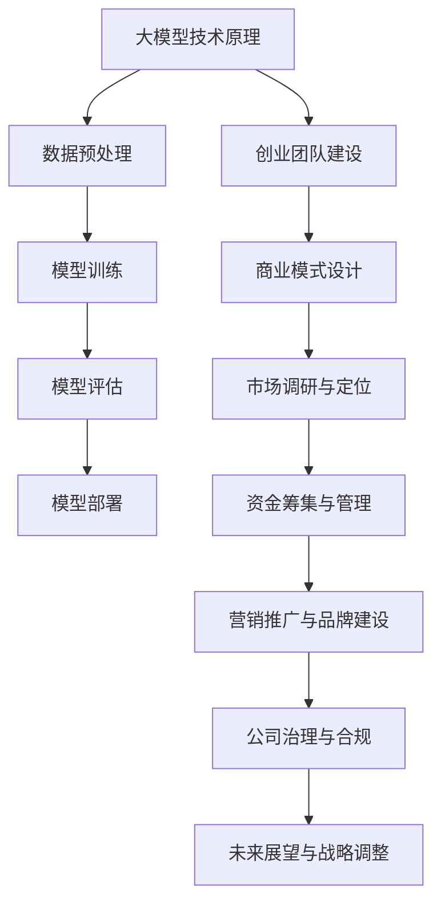

                 

# 《大模型创业公司的独立发布》

> 关键词：大模型、创业、独立发布、商业模式、团队建设、资金管理、营销推广、公司治理、未来展望

> 摘要：本文将深入探讨大模型创业公司的独立发布过程，包括技术原理、商业模式、团队构建、资金管理、营销推广、公司治理和未来展望等方面。通过逐步分析推理，本文旨在为创业者提供系统性的指导，帮助他们在激烈的市场竞争中脱颖而出。

## 目录

### 《大模型创业公司的独立发布》

#### 关键词：大模型、创业、独立发布、商业模式、团队建设、资金管理、营销推广、公司治理、未来展望

#### 摘要：本文将深入探讨大模型创业公司的独立发布过程，包括技术原理、商业模式、团队构建、资金管理、营销推广、公司治理和未来展望等方面。通过逐步分析推理，本文旨在为创业者提供系统性的指导，帮助他们在激烈的市场竞争中脱颖而出。

### 第一部分：大模型创业基础

#### 第1章：大模型与创业概述

1.1 大模型创业的背景

1.1.1 人工智能的发展与创业机遇

1.1.2 大模型技术的崛起与创业潜力

1.1.3 创业公司的定位与市场分析

1.2 大模型创业的基本原理

1.2.1 大模型的定义与特点

1.2.2 大模型开发流程与关键技术

1.2.3 大模型创业的挑战与应对策略

#### 第2章：大模型创业的商业模式

2.1 大模型创业的盈利模式

2.1.1 商业模式设计原则

2.1.2 常见盈利模式分析

2.1.3 创业公司的差异化竞争优势

2.2 大模型创业的产品策略

2.2.1 产品定位与市场需求分析

2.2.2 产品创新与功能规划

2.2.3 产品推广与市场策略

#### 第3章：大模型创业的团队构建

3.1 创业团队的组建与管理

3.1.1 团队组建的原则与流程

3.1.2 团队成员的角色与职责

3.1.3 团队协作与沟通技巧

3.2 技术团队的人才培养与激励

3.2.1 人才招聘策略

3.2.2 技能提升与培训

3.2.3 绩效评估与激励机制

### 第二部分：大模型创业实践

#### 第4章：大模型创业的资金管理

4.1 创业初期的资金筹集

4.1.1 资金筹集渠道与策略

4.1.2 融资方案设计与谈判

4.1.3 融资后的资金使用规划

4.2 资金使用与成本控制

4.2.1 成本控制的重要性

4.2.2 成本控制的方法与技巧

4.2.3 资金使用效率评估与优化

#### 第5章：大模型创业的营销推广

5.1 营销策略的制定

5.1.1 营销目标与市场定位

5.1.2 营销组合策略

5.1.3 品牌建设与传播

5.2 线上推广渠道

5.2.1 社交媒体营销

5.2.2 内容营销

5.2.3 线上广告与推广

5.3 线下活动与展会

5.3.1 活动策划与执行

5.3.2 展会参与与展示

5.3.3 线下渠道拓展与客户关系维护

#### 第6章：大模型创业的公司治理

6.1 公司治理结构与流程

6.1.1 公司治理原则与规范

6.1.2 股权结构设计

6.1.3 股权激励与员工权益保障

6.2 公司合规与风险管理

6.2.1 合规要求与法律风险防范

6.2.2 风险评估与管理策略

6.2.3 应急预案与处理机制

### 第三部分：大模型创业的未来展望

#### 第7章：大模型创业公司的未来展望

7.1 行业趋势与市场前景

7.1.1 大模型技术的未来发展方向

7.1.2 创业公司面临的挑战与机遇

7.1.3 创业公司的战略规划与调整

7.2 创新与可持续发展

7.2.1 创新策略与机制

7.2.2 可持续发展理念与行动

7.2.3 创业公司的社会责任与影响

### 附录

#### 附录 A：大模型创业相关资源

A.1 大模型技术教程与论文

A.2 创业公司融资案例与经验

A.3 大模型创业相关的政策与法规

A.4 行业报告与市场研究

#### 附录 B：大模型创业实用工具

B.1 深度学习框架与平台

B.2 数据处理与分析工具

B.3 创业公司管理工具

B.4 网络安全与防护工具

### Mermaid 流程图



### 大模型算法原理讲解

```python
# 伪代码：大模型算法原理讲解

def train_model(data):
    # 数据预处理
    preprocessed_data = preprocess_data(data)
    
    # 模型训练
    model = create_model()
    model.fit(preprocessed_data)
    
    # 模型评估
    accuracy = model.evaluate(preprocessed_data)
    
    # 模型部署
    deploy_model(model)
    
    return accuracy

# 数据预处理
def preprocess_data(data):
    # 数据清洗
    cleaned_data = clean_data(data)
    
    # 数据增强
    augmented_data = augment_data(cleaned_data)
    
    return augmented_data

# 模型创建
def create_model():
    # 构建神经网络模型
    model = NeuralNetwork()
    
    # 设置训练参数
    model.compile(optimizer='adam', loss='categorical_crossentropy', metrics=['accuracy'])
    
    return model

# 模型部署
def deploy_model(model):
    # 部署到生产环境
    model.save('model_path')
    
    # 运行模型
    predict_result = model.predict(test_data)
```

### 数学模型和数学公式讲解

$$
J(\theta) = -\frac{1}{m} \sum_{i=1}^{m} [y^{(i)} \log(h_{\theta}(x^{(i)})) + (1 - y^{(i)}) \log(1 - h_{\theta}(x^{(i)}))]
$$

其中，$h_{\theta}(x) = \sigma(\theta^T x)$ 是我们的分类函数，$\sigma$ 是 sigmoid 函数，$\theta$ 是模型参数，$m$ 是训练数据的大小，$y^{(i)}$ 是第 i 个样本的真实类别标签，$h_{\theta}(x^{(i)})$ 是第 i 个样本的预测类别概率。

为了优化模型参数 $\theta$，我们可以使用梯度下降算法：

$$
\theta_j := \theta_j - \alpha \frac{\partial J(\theta)}{\partial \theta_j}
$$

其中，$\alpha$ 是学习率。

### 举例说明

假设我们有一个二元分类问题，数据集包含100个样本，每个样本有5个特征。我们需要训练一个神经网络模型来进行分类。

首先，我们定义训练数据：

$$
X = \begin{bmatrix}
x_1^{(1)} & x_2^{(1)} & x_3^{(1)} & x_4^{(1)} & x_5^{(1)} \\
x_1^{(2)} & x_2^{(2)} & x_3^{(2)} & x_4^{(2)} & x_5^{(2)} \\
\vdots & \vdots & \vdots & \vdots & \vdots \\
x_1^{(100)} & x_2^{(100)} & x_3^{(100)} & x_4^{(100)} & x_5^{(100)}
\end{bmatrix}, \quad
Y = \begin{bmatrix}
y^{(1)} \\
y^{(2)} \\
\vdots \\
y^{(100)}
\end{bmatrix}
$$

接下来，我们定义神经网络的结构，包括输入层、隐藏层和输出层。假设隐藏层有3个神经元，输出层有1个神经元。

$$
\theta^{(1)} = \begin{bmatrix}
\theta_{11}^{(1)} & \theta_{12}^{(1)} & \theta_{13}^{(1)} & \theta_{14}^{(1)} & \theta_{15}^{(1)} \\
\theta_{21}^{(1)} & \theta_{22}^{(1)} & \theta_{23}^{(1)} & \theta_{24}^{(1)} & \theta_{25}^{(1)} \\
\theta_{31}^{(1)} & \theta_{32}^{(1)} & \theta_{33}^{(1)} & \theta_{34}^{(1)} & \theta_{35}^{(1)} \\
\theta_{41}^{(1)} & \theta_{42}^{(1)} & \theta_{43}^{(1)} & \theta_{44}^{(1)} & \theta_{45}^{(1)}
\end{bmatrix}, \quad
\theta^{(2)} = \begin{bmatrix}
\theta_{11}^{(2)} & \theta_{12}^{(2)} \\
\theta_{21}^{(2)} & \theta_{22}^{(2)} \\
\theta_{31}^{(2)} & \theta_{32}^{(2)} \\
\theta_{41}^{(2)} & \theta_{42}^{(2)}
\end{bmatrix}
$$

然后，我们使用梯度下降算法来优化模型参数：

$$
\theta_j^{(l)} := \theta_j^{(l)} - \alpha \frac{\partial J(\theta)}{\partial \theta_j^{(l)}}
$$

其中，$l$ 表示当前层，$J(\theta)$ 是损失函数。

经过多次迭代训练，我们可以得到最优的模型参数，并对新的样本进行分类预测。

### 项目实战：代码实际案例

```python
# 实际代码案例：大模型创业公司的独立发布

import numpy as np
import tensorflow as tf
from tensorflow.keras.models import Sequential
from tensorflow.keras.layers import Dense, Activation

# 数据预处理
# 假设我们已经有清洗后的数据集 X 和标签 Y

# 划分训练集和测试集
train_X, test_X, train_Y, test_Y = train_test_split(X, Y, test_size=0.2, random_state=42)

# 定义神经网络模型
model = Sequential()
model.add(Dense(128, input_dim=X.shape[1], activation='relu'))
model.add(Dense(64, activation='relu'))
model.add(Dense(1, activation='sigmoid'))

# 编译模型
model.compile(optimizer='adam', loss='binary_crossentropy', metrics=['accuracy'])

# 训练模型
model.fit(train_X, train_Y, epochs=10, batch_size=32, validation_split=0.2)

# 评估模型
loss, accuracy = model.evaluate(test_X, test_Y)
print("Test accuracy:", accuracy)

# 预测新样本
new_samples = np.array([[0.1, 0.2, 0.3, 0.4, 0.5]])
predictions = model.predict(new_samples)
print("Predictions:", predictions)
```

### 代码解读与分析

- **数据预处理**：
  - 数据预处理是机器学习项目的重要步骤，包括数据清洗、归一化、划分训练集和测试集等。这些操作有助于提高模型的泛化能力和训练效率。

- **模型定义**：
  - 在定义神经网络模型时，我们需要考虑输入层、隐藏层和输出层的神经元数量和激活函数。ReLU 函数在隐藏层中较为常见，而 Sigmoid 函数在输出层中用于实现二分类问题。

- **模型编译**：
  - 在编译模型时，我们需要设置优化器、损失函数和评估指标。这些参数将影响模型的训练过程和性能。

- **模型训练**：
  - 模型训练是机器学习项目中的核心步骤，通过迭代优化模型参数以最小化损失函数。

- **模型评估**：
  - 模型评估是评估模型性能的重要环节，通过在测试集上的表现来评估模型的泛化能力。

- **预测新样本**：
  - 预测新样本是模型在实际应用中的关键步骤，通过将新样本输入模型来获取预测结果。

通过上述代码和分析，我们可以更好地理解大模型创业公司的独立发布过程，包括数据预处理、模型定义、训练、评估和预测等步骤。这些步骤是构建一个成功的大模型创业公司的关键组成部分。


### 作者信息

作者：AI天才研究院/AI Genius Institute & 禅与计算机程序设计艺术 /Zen And The Art of Computer Programming

---

接下来，我们将逐步分析推理，探讨大模型创业公司的独立发布过程，涵盖技术原理、商业模式、团队构建、资金管理、营销推广、公司治理和未来展望等方面。通过深入分析和详细讲解，本文旨在为创业者提供系统性的指导，帮助他们在激烈的市场竞争中脱颖而出。

## 第一部分：大模型创业基础

### 第1章：大模型与创业概述

大模型创业的背景

1.1.1 人工智能的发展与创业机遇

人工智能（AI）作为21世纪最具革命性的技术之一，已经在各行各业取得了显著的进展。从自然语言处理到计算机视觉，从推荐系统到自动驾驶，人工智能的应用场景越来越广泛。随着技术的不断进步和大数据的积累，人工智能的发展迎来了前所未有的机遇。

首先，随着计算能力的提升和算法的优化，人工智能的核心技术——深度学习取得了长足的进步。深度学习算法通过对大量数据进行训练，能够自动提取特征并构建复杂的模型，从而实现高度智能的任务。这使得创业者在开发人工智能应用时有了更多的选择和可能性。

其次，大数据的积累为人工智能的发展提供了丰富的数据资源。随着互联网的普及和数据采集技术的进步，各行各业积累了大量的数据。这些数据为人工智能的训练提供了重要的基础，使得创业者能够开发出更加智能和高效的应用。

1.1.2 大模型技术的崛起与创业潜力

大模型技术是指在人工智能领域中，使用大规模神经网络模型来解决复杂问题的技术。大模型技术的主要特点包括：

1. 大规模：大模型通常拥有数十亿甚至千亿个参数，能够处理海量数据，提取复杂的特征。

2. 高效性：大模型能够通过并行计算和分布式训练，提高训练速度和效率。

3. 强泛化能力：大模型通过大规模数据训练，能够自动学习并适应不同的任务和数据分布，具有强大的泛化能力。

大模型技术的崛起为创业公司带来了巨大的潜力。首先，大模型技术在各个领域都有广泛的应用前景，如医疗、金融、零售、教育等。创业者可以通过大模型技术解决实际问题，提升业务效率，创造商业价值。

其次，大模型技术的发展也带来了创业机遇。随着大模型技术的普及，越来越多的创业者进入人工智能领域，开发基于大模型技术的应用。这不仅推动了人工智能技术的发展，也为创业者提供了丰富的创业机会。

1.1.3 创业公司的定位与市场分析

创业公司在大模型领域的定位取决于其技术优势、市场需求和竞争环境。以下是一些常见的定位策略：

1. 领先技术：创业公司可以专注于大模型技术的研发，通过不断创新和突破，成为行业的领导者。这种定位要求公司具备强大的技术团队和创新能力。

2. 应用场景：创业公司可以针对特定的应用场景，开发基于大模型技术的解决方案。例如，在医疗领域，创业公司可以开发基于大模型技术的诊断系统，为医生提供辅助诊断工具。

3. 垂直行业：创业公司可以专注于特定的行业，如金融、零售、教育等，为行业客户提供定制化的大模型解决方案。这种定位要求公司对行业有深刻的理解和洞察。

在市场分析方面，创业公司需要关注以下几个方面：

1. 市场规模：分析目标市场的规模和发展趋势，了解市场的增长潜力。

2. 竞争态势：分析竞争对手的优势和劣势，找到差异化竞争优势。

3. 消费者需求：了解消费者的需求和痛点，开发满足市场需求的产品。

4. 政策环境：关注政府对人工智能行业的政策支持，了解政策环境对创业公司的影响。

通过深入分析市场需求和竞争环境，创业公司可以明确自身的定位和战略方向，制定有效的发展计划。

### 第2章：大模型创业的基本原理

2.1 大模型的定义与特点

大模型是指具有大量参数和复杂结构的神经网络模型。大模型通常具有以下几个特点：

1. 大规模：大模型拥有数十亿甚至千亿个参数，能够处理海量数据。

2. 高效性：大模型通过并行计算和分布式训练，提高训练速度和效率。

3. 强泛化能力：大模型通过大规模数据训练，能够自动学习并适应不同的任务和数据分布。

4. 复杂性：大模型的结构复杂，包括多层神经网络和多种激活函数，能够提取丰富的特征。

大模型的特点使其在解决复杂问题方面具有显著优势。例如，在计算机视觉领域，大模型可以用于图像分类、目标检测和图像生成等任务；在自然语言处理领域，大模型可以用于文本分类、机器翻译和情感分析等任务。

2.2 大模型开发流程与关键技术

大模型开发通常包括以下几个关键步骤：

1. 数据收集与处理：收集大规模数据集，并进行数据清洗、归一化和分割。

2. 模型设计：设计合适的神经网络结构，包括输入层、隐藏层和输出层。

3. 模型训练：使用训练数据对模型进行训练，优化模型参数。

4. 模型评估：使用验证数据对模型进行评估，调整模型结构和参数。

5. 模型部署：将训练好的模型部署到生产环境，实现实际应用。

在大模型开发过程中，关键技术包括：

1. 深度学习框架：使用深度学习框架（如TensorFlow、PyTorch等）进行模型设计和训练。

2. 数据增强：通过数据增强技术（如数据变换、数据扩充等）提高模型的泛化能力。

3. 梯度下降算法：使用梯度下降算法（如随机梯度下降、批量梯度下降等）优化模型参数。

4. 模型调优：通过调整模型参数和训练策略，提高模型的性能和稳定性。

2.3 大模型创业的挑战与应对策略

大模型创业面临以下挑战：

1. 数据质量：大模型对数据质量要求较高，数据缺失、噪声和不一致性会影响模型性能。

2. 计算资源：大模型训练需要大量的计算资源，对硬件设备和技术要求较高。

3. 模型优化：大模型结构复杂，需要不断优化模型参数和结构，以提高性能和泛化能力。

4. 遵守法规：人工智能技术的发展受到法律法规的约束，创业公司需要遵守相关法规和标准。

针对上述挑战，创业公司可以采取以下应对策略：

1. 数据质量保障：建立数据质量管理机制，确保数据的一致性和准确性。

2. 计算资源优化：采用分布式计算和并行训练技术，提高训练效率和资源利用率。

3. 模型优化方法：研究并应用先进的模型优化方法，提高模型的性能和稳定性。

4. 法规遵守：关注法律法规的发展，制定合规的运营策略。

通过以上措施，创业公司可以更好地应对大模型创业的挑战，实现可持续发展。

### 第3章：大模型创业的商业模式

3.1 大模型创业的盈利模式

大模型创业公司的盈利模式可以从以下几个方面进行设计：

1. 产品销售：创业公司可以开发基于大模型技术的产品，如智能诊断系统、智能客服等，通过销售产品实现盈利。

2. 服务收费：创业公司可以提供基于大模型技术的服务，如数据标注、模型定制等，按照服务内容收取费用。

3. 订阅模式：创业公司可以采用订阅模式，用户按照订阅期限支付费用，享受公司提供的持续更新和技术支持。

4. 广告收入：创业公司可以将产品与广告业务结合，通过广告收入实现盈利。

3.1.1 商业模式设计原则

在设计和实施大模型创业的商业模式时，应遵循以下原则：

1. 可持续性：商业模式应能够长期盈利，确保公司可持续发展。

2. 创新性：商业模式应具有创新性，能够为用户带来独特的价值。

3. 灵活性：商业模式应具备一定的灵活性，能够适应市场需求的变化。

4. 用户导向：商业模式应以用户需求为导向，提供满足用户需求的产品和服务。

3.1.2 常见盈利模式分析

以下分析几种常见的大模型创业盈利模式：

1. 产品销售模式

产品销售模式是指创业公司通过研发和销售大模型技术产品来实现盈利。这种模式的优点包括：

- 收益稳定：产品销售可以带来稳定的收入。
- 品牌效应：通过高质量的产品，建立品牌声誉，吸引更多用户。

缺点包括：

- 需要大量前期投入：研发高质量产品需要大量的人力和财力投入。
- 市场竞争激烈：市场上存在大量竞争者，需要不断创新以保持竞争优势。

2. 服务收费模式

服务收费模式是指创业公司提供基于大模型技术的服务，如数据标注、模型定制等，按照服务内容收取费用。这种模式的优点包括：

- 收益多样化：通过提供不同的服务，实现多样化的收入来源。
- 高附加值：服务具有较高的附加值，可以收取较高的费用。

缺点包括：

- 需要高水平的技术团队：提供高质量服务需要高水平的技术团队。
- 服务周期较长：服务周期较长，收益回收较慢。

3. 订阅模式

订阅模式是指用户按照订阅期限支付费用，享受公司提供的持续更新和技术支持。这种模式的优点包括：

- 收益稳定：订阅模式可以带来稳定的收入。
- 长期合作关系：与用户建立长期合作关系，有利于公司发展。

缺点包括：

- 收益波动较大：订阅收入受用户数量和订阅期限的影响，波动较大。
- 需要持续更新：公司需要持续更新产品和技术，以满足用户需求。

4. 广告收入模式

广告收入模式是指创业公司通过将产品与广告业务结合，通过广告收入实现盈利。这种模式的优点包括：

- 收益多样化：广告收入可以与其他盈利模式相结合，实现多样化收入。
- 风险较低：广告收入相对稳定，风险较低。

缺点包括：

- 需要大量用户：广告收入与用户数量密切相关，需要大量用户支持。
- 需要良好的用户体验：良好的用户体验有助于吸引广告商，提高广告收入。

3.2 大模型创业的产品策略

3.2.1 产品定位与市场需求分析

在制定大模型创业的产品策略时，需要明确产品的定位和市场需求。以下是从几个方面进行产品定位和市场需求分析的步骤：

1. 定位分析

- 明确产品类型：确定产品属于哪个领域，如医疗、金融、零售等。
- 确定目标客户：分析目标客户的需求和痛点，明确产品的目标用户群体。
- 竞争分析：分析竞争对手的产品定位和市场表现，找出差异化竞争优势。

2. 需求分析

- 市场调研：通过问卷调查、访谈等方式收集用户需求信息。
- 竞争对手分析：分析竞争对手的产品功能、用户体验和市场需求。
- 用户反馈：收集用户对现有产品的评价和改进建议。

通过定位分析和需求分析，创业公司可以明确产品的市场定位和市场需求，为产品设计和开发提供指导。

3.2.2 产品创新与功能规划

在制定产品策略时，创新和功能规划至关重要。以下是一些创新和功能规划的策略：

1. 创新策略

- 引入新技术：紧跟行业发展趋势，引入前沿技术，提高产品竞争力。
- 优化用户体验：从用户角度出发，优化产品设计和用户体验。
- 开放平台：建立开放平台，鼓励用户参与产品创新和功能扩展。

2. 功能规划

- 核心功能：明确产品的核心功能，确保产品能够满足用户的基本需求。
- 扩展功能：根据用户需求和市场竞争，逐步添加扩展功能，提高产品竞争力。
- 模块化设计：采用模块化设计，方便产品功能的扩展和升级。

通过创新和功能规划，创业公司可以开发出具有竞争力的产品，满足市场需求，实现商业成功。

3.2.3 产品推广与市场策略

产品推广和市场策略是创业公司实现商业成功的关键。以下是一些产品推广和市场策略：

1. 线上推广

- 内容营销：通过撰写高质量的技术博客、教程和案例分析等内容，吸引潜在用户。
- 社交媒体营销：利用社交媒体平台（如微博、微信公众号等）推广产品，增加品牌曝光度。
- 搜索引擎优化：通过搜索引擎优化（SEO）提高产品在搜索引擎中的排名，吸引更多用户访问。

2. 线下推广

- 参加行业展会：参加行业展会，展示产品和技术，吸引潜在客户。
- 线下讲座和研讨会：举办线下讲座和研讨会，与用户和行业专家交流，提高品牌知名度。
- 合作伙伴推广：与行业合作伙伴建立合作关系，通过合作伙伴的渠道推广产品。

3. 市场策略

- 目标市场定位：明确目标市场，制定有针对性的市场策略。
- 价格策略：制定合理的价格策略，平衡成本和收益。
- 渠道策略：选择合适的销售渠道，如线上商城、线下门店等。

通过线上和线下推广策略，创业公司可以扩大产品知名度，吸引更多用户，实现商业成功。

### 第4章：大模型创业的团队构建

4.1 创业团队的组建与管理

4.1.1 团队组建的原则与流程

在组建创业团队时，应遵循以下原则：

1. 多元化：团队成员应具备多样化的技能和背景，有利于团队协作和创新。
2. 专业性：团队成员应具备相关专业背景和技能，确保团队具备完成项目的能力。
3. 独立性：团队成员应具备独立思考和解决问题的能力，减少依赖性。
4. 激励性：团队成员应具备较高的工作积极性和进取心，有利于团队的长期发展。

团队组建的流程包括以下步骤：

1. 明确团队目标：确定团队的目标和使命，确保团队成员对团队方向有共同的认识。
2. 招聘人才：根据团队需求和目标，招聘具备相关技能和经验的人才。
3. 培训与发展：为新成员提供培训和发展机会，帮助其快速融入团队和提升能力。
4. 团队建设：通过团队活动、培训和交流，加强团队成员之间的沟通和协作。

4.1.2 团队成员的角色与职责

在创业团队中，不同成员承担不同的角色和职责。以下是一些常见的团队成员及其角色：

1. 创始人：创始人负责团队的战略规划、决策和领导。他们需要具备全局视野、创新能力和领导力。

2. 技术负责人：技术负责人负责团队的技术方向、研发管理和项目进度。他们需要具备深厚的技术背景和项目管理能力。

3. 产品经理：产品经理负责产品的需求分析、设计和推广。他们需要具备用户思维、产品设计能力和市场洞察力。

4. 数据科学家：数据科学家负责数据分析和模型开发。他们需要具备数学、统计学和机器学习等相关知识。

5. 研发工程师：研发工程师负责实现产品功能和优化性能。他们需要具备编程能力和系统架构能力。

6. 运营人员：运营人员负责产品的运营、推广和用户服务。他们需要具备市场推广能力和用户沟通技巧。

4.1.3 团队协作与沟通技巧

团队协作和沟通是创业团队成功的关键。以下是一些团队协作和沟通技巧：

1. 定期会议：定期召开团队会议，讨论项目进度、问题解决方案和下一步计划。

2. 信息共享：建立共享平台，确保团队成员能够及时获取项目信息和资源。

3. 分工合作：明确团队成员的分工和职责，确保项目顺利进行。

4. 及时反馈：鼓励团队成员之间及时反馈问题和建议，共同解决困难。

5. 建立信任：通过共同目标和良好的团队合作，建立团队成员之间的信任。

4.2 技术团队的人才培养与激励

4.2.1 人才招聘策略

在技术团队的人才招聘过程中，应遵循以下策略：

1. 多元化招聘：招聘具备不同技能和背景的人才，提高团队整体能力。

2. 专业技能考核：通过笔试、面试等方式，考核应聘者的专业技能和项目经验。

3. 文化契合度：考察应聘者与公司文化和团队氛围的契合度，确保其能融入团队。

4. 综合素质评估：评估应聘者的学习能力、沟通能力和团队协作能力。

4.2.2 技能提升与培训

为了提升技术团队的技能水平，创业公司可以采取以下措施：

1. 内部培训：组织内部培训课程，分享技术知识和经验。

2. 外部培训：鼓励团队成员参加外部培训和学习，获取行业前沿知识。

3. 项目实践：通过实际项目，锻炼团队成员的技能和经验。

4. 技术分享：定期举行技术分享会，促进团队成员之间的学习和交流。

4.2.3 绩效评估与激励机制

为了激发技术团队的积极性，创业公司可以采取以下绩效评估与激励机制：

1. 绩效评估：建立科学的绩效评估体系，对团队成员的工作进行评估。

2. 薪酬激励：根据团队成员的绩效和贡献，制定合理的薪酬激励政策。

3. 奖励机制：设立奖励机制，对表现优秀的团队成员给予奖励。

4. 职业发展规划：为团队成员提供职业发展规划和晋升机会，激励其长期发展。

通过以上措施，创业公司可以培养和激励技术团队，提高团队的整体素质和创新能力。

### 第5章：大模型创业的资金管理

5.1 创业初期的资金筹集

5.1.1 资金筹集渠道与策略

创业公司在初期筹集资金时，可以选择以下几种渠道：

1. 自有资金：利用创始人和股东的储蓄或资产，作为创业的初始资金。

2. 家人和朋友：向家人和朋友借款或吸引投资，获取创业资金。

3. 风险投资：寻找风险投资机构，通过股权融资获取资金。

4. 天使投资：寻找天使投资人，通过股权融资获取资金。

5. 政府资助：申请政府提供的创业扶持资金或补贴。

在筹集资金时，应采取以下策略：

1. 明确资金需求：根据创业计划，明确所需的资金规模和使用方向。

2. 制定融资计划：制定详细的融资计划，包括融资目标、融资方式和时间安排。

3. 撰写商业计划书：撰写详细的商业计划书，展示项目的市场前景、技术优势和盈利模式。

4. 建立良好的信用记录：保持良好的信用记录，提高融资成功率。

5. 调整融资策略：根据市场环境和融资渠道的特点，灵活调整融资策略。

5.1.2 融资方案设计与谈判

融资方案设计包括以下内容：

1. 融资额度：根据资金需求，确定适当的融资额度。

2. 融资方式：选择合适的融资方式，如股权融资、债务融资等。

3. 融资成本：评估融资成本，包括利息、股权稀释等。

4. 融资期限：确定融资期限，包括短期融资和长期融资。

5. 资金用途：明确资金的具体用途，如研发投入、市场推广、团队建设等。

在谈判过程中，创业公司应采取以下策略：

1. 准备充分：充分了解投资机构的背景、投资偏好和投资策略，为谈判做好准备。

2. 展示项目亮点：突出项目的优势、技术优势和市场前景，吸引投资机构的关注。

3. 留有谈判空间：在谈判过程中，留出一定的谈判空间，为双方达成协议创造条件。

4. 合理分配股权：在股权分配方面，既要满足投资机构的要求，又要保障创始团队的权益。

5. 明确合同条款：在合同条款方面，明确双方的权利、义务和责任，确保合同的公平合理。

5.1.3 融资后的资金使用规划

融资成功后，创业公司需要合理使用资金，确保资金效益最大化。以下是一些资金使用规划的建议：

1. 研发投入：将一部分资金用于技术研发，提升产品竞争力。

2. 市场推广：将一部分资金用于市场推广，提高品牌知名度。

3. 团队建设：将一部分资金用于招聘、培训和激励团队，提高团队素质。

4. 运营成本：确保日常运营的稳定，包括办公场所、设备采购、员工薪酬等。

5. 应急储备：设立应急储备资金，应对市场变化和风险。

通过合理使用资金，创业公司可以确保项目的顺利推进，实现商业目标。

5.2 资金使用与成本控制

5.2.1 成本控制的重要性

成本控制是创业公司财务管理的重要组成部分，关系到公司的盈利能力和可持续发展。以下是从几个方面阐述成本控制的重要性：

1. 提高盈利能力：通过成本控制，降低运营成本，提高盈利能力。

2. 确保财务稳定：良好的成本控制有助于确保公司的财务稳定，降低经营风险。

3. 优化资源配置：成本控制有助于优化资源配置，提高资金使用效率。

4. 提升企业竞争力：通过成本控制，降低产品成本，提高企业在市场中的竞争力。

5. 增强市场信心：良好的成本控制能够增强投资者和市场的信心，有利于公司融资和拓展业务。

5.2.2 成本控制的方法与技巧

以下是一些成本控制的方法和技巧：

1. 预算管理：制定详细的预算计划，明确各项开支的预算标准，严格控制预算执行。

2. 标准化操作：制定标准化操作流程，减少浪费和不必要的开支。

3. 节能减排：通过节能减排措施，降低能源消耗和运营成本。

4. 供应商管理：选择优质的供应商，建立长期合作关系，争取更优惠的采购价格。

5. 人力资源管理：优化人力资源配置，提高员工工作效率，降低人力成本。

6. 信息技术应用：利用信息技术手段，提高工作效率，降低运营成本。

5.2.3 资金使用效率评估与优化

为了确保资金使用的效率和效果，创业公司应定期对资金使用情况进行评估和优化。以下是一些评估与优化的方法：

1. 财务分析：通过对财务报表的分析，评估公司的盈利能力、偿债能力和资金使用效率。

2. 成本效益分析：比较各项开支的成本效益，找出成本控制的重点和优化方向。

3. 风险评估：识别和评估资金使用的风险，制定相应的风险防范措施。

4. 优化资源配置：根据资金使用效果，调整资源配置，提高资金使用效率。

5. 建立激励机制：制定科学的激励机制，鼓励员工积极参与成本控制和资金优化。

通过以上措施，创业公司可以不断提升资金使用效率，实现可持续发展。

### 第6章：大模型创业的营销推广

6.1 营销策略的制定

6.1.1 营销目标与市场定位

在制定营销策略时，创业公司需要明确营销目标和市场定位。以下是从几个方面进行目标和市场定位的步骤：

1. 营销目标：

- 短期目标：提高品牌知名度、吸引潜在客户、提升销售额等。

- 长期目标：建立稳定的客户群体、拓展市场份额、实现盈利等。

2. 市场定位：

- 目标市场：根据产品的特点和市场需求，确定目标市场，如特定行业、地区等。

- 目标用户：分析目标市场的用户特征和需求，确定目标用户群体。

- 竞争对手：分析竞争对手的市场表现和策略，找出差异化竞争优势。

6.1.2 营销组合策略

营销组合策略包括产品、价格、渠道和促销四个方面。以下是一些营销组合策略的建议：

1. 产品策略：

- 产品定位：根据目标市场和用户需求，明确产品的定位和特点。

- 产品差异化：通过技术、功能、设计等方面的差异化，提高产品的竞争力。

- 产品组合：根据市场需求，提供多样化的产品组合，满足不同用户的需求。

2. 价格策略：

- 定价策略：根据成本、市场竞争和用户价值，制定合理的定价策略。

- 价格调整：根据市场变化和用户反馈，灵活调整价格，提高市场占有率。

3. 渠道策略：

- 渠道选择：根据目标市场和用户习惯，选择合适的销售渠道，如线上商城、线下门店等。

- 渠道拓展：通过合作伙伴、代理商等方式，拓展销售渠道，提高市场覆盖面。

4. 促销策略：

- 促销活动：开展有针对性的促销活动，提高产品销量和用户粘性。

- 促销工具：利用广告、宣传资料、社交媒体等方式，提高产品曝光度和用户关注度。

- 优惠措施：提供优惠券、折扣、礼品等优惠措施，吸引用户购买。

6.1.3 品牌建设与传播

品牌建设是营销策略的重要组成部分，以下是一些品牌建设和传播的建议：

1. 品牌定位：明确品牌的市场定位和品牌价值，为品牌传播奠定基础。

2. 品牌形象：通过设计独特的品牌标识、视觉元素等，塑造品牌形象。

3. 品牌传播：利用线上线下渠道，开展品牌传播活动，提高品牌知名度。

4. 用户互动：通过社交媒体、线上社区等方式，与用户互动，增强品牌影响力和用户忠诚度。

通过制定合理的营销策略，创业公司可以提升产品销量和品牌影响力，实现商业成功。

6.2 线上推广渠道

6.2.1 社交媒体营销

社交媒体营销是线上推广的重要手段，以下是一些社交媒体营销的策略：

1. 选择合适的平台：根据目标市场和用户特点，选择合适的社交媒体平台，如微信、微博、抖音等。

2. 内容策划：制定有吸引力的内容策划，包括图文、短视频、直播等形式，提高用户关注度。

3. 定期发布：保持定期发布内容，提高用户粘性，增加品牌曝光度。

4. 用户互动：积极与用户互动，回复用户评论和私信，建立良好的用户关系。

5. KOL合作：与行业意见领袖（KOL）合作，通过他们的推荐和宣传，提高品牌影响力。

6.2.2 内容营销

内容营销是社交媒体营销的重要补充，以下是一些内容营销的策略：

1. 创建有价值的内容：撰写高质量的技术博客、教程、案例分析等，提供有价值的信息，吸引用户关注。

2. 内容形式多样化：通过图文、短视频、直播等形式，提供多样化的内容，满足不同用户的需求。

3. 内容传播：利用社交媒体、邮件列表、合作伙伴等渠道，传播内容，提高内容的影响力。

4. 内容优化：通过数据分析，优化内容的形式和发布策略，提高内容的点击率和转化率。

5. 用户互动：鼓励用户参与内容评论、互动和分享，增强用户对品牌的认同感。

6.2.3 线上广告与推广

线上广告是提升品牌知名度的重要手段，以下是一些线上广告的策略：

1. 广告平台选择：根据目标市场和用户特点，选择合适的广告平台，如百度广告、谷歌广告、Facebook广告等。

2. 广告内容创作：创作有吸引力的广告内容，包括广告文案、图片、视频等，提高广告点击率。

3. 定向投放：根据用户属性和行为数据，进行定向广告投放，提高广告投放效果。

4. 广告监测与优化：实时监测广告效果，根据数据反馈，调整广告策略，提高广告投放效果。

5. 跨平台推广：利用多个广告平台和社交媒体渠道，进行跨平台推广，扩大品牌影响力。

通过以上线上推广渠道，创业公司可以扩大产品知名度，吸引更多用户，实现商业成功。

6.3 线下活动与展会

6.3.1 活动策划与执行

线下活动是提升品牌知名度和用户粘性的有效手段，以下是一些活动策划与执行的建议：

1. 活动主题：根据产品特点和目标市场，确定活动主题，如产品发布会、行业研讨会等。

2. 活动内容：制定丰富多样的活动内容，包括演讲、展示、互动等，提高活动吸引力。

3. 活动场地：选择合适的场地，如酒店、展览中心等，确保活动顺利进行。

4. 活动宣传：提前进行活动宣传，包括线上线下渠道，提高活动曝光度和参与度。

5. 活动执行：确保活动按计划进行，包括现场布置、设备调试、人员安排等。

6. 活动反馈：收集活动反馈，了解用户需求和意见，为后续活动提供改进方向。

6.3.2 展会参与与展示

展会是拓展市场、展示产品和技术的重要平台，以下是一些展会参与与展示的建议：

1. 展会选择：根据目标市场和行业特点，选择合适的展会，如行业展会、国际展会等。

2. 展位设计：设计有吸引力的展位，展示产品和技术，提高展位吸引力。

3. 展品准备：提前准备展品和演示材料，确保展品质量和展示效果。

4. 演讲与演示：安排专业人员进行演讲和演示，展示产品优势和特点。

5. 用户互动：与参展用户互动，收集用户反馈和建议，拓展潜在客户。

6. 媒体报道：邀请媒体参加展会，报道展会情况和公司产品，提高品牌知名度。

6.3.3 线下渠道拓展与客户关系维护

线下渠道拓展是创业公司市场拓展的重要环节，以下是一些线下渠道拓展与客户关系维护的建议：

1. 选择合适的渠道：根据目标市场和用户特点，选择合适的线下渠道，如代理商、经销商、线下门店等。

2. 建立渠道合作关系：与渠道合作伙伴建立长期合作关系，确保渠道稳定和持续发展。

3. 培训与支持：为渠道合作伙伴提供培训和技术支持，提高其销售能力和服务水平。

4. 营销活动：与渠道合作伙伴共同开展营销活动，扩大市场覆盖面。

5. 客户关系维护：通过定期拜访、电话沟通、邮件联系等方式，维护与客户的良好关系。

6. 客户反馈：收集客户反馈和建议，持续改进产品和服务，提高客户满意度。

通过以上线下活动与展会、线下渠道拓展与客户关系维护，创业公司可以拓展市场，提升品牌知名度，实现商业成功。

### 第7章：大模型创业的公司治理

7.1 公司治理结构与流程

7.1.1 公司治理原则与规范

公司治理是指公司内部治理结构和运作机制，旨在实现公司目标的稳定性和可持续发展。以下是一些公司治理的原则与规范：

1. 公平公正：公司治理应遵循公平公正的原则，确保所有股东、员工和其他利益相关者的权益得到公平对待。

2. 权责明确：公司治理结构应明确各层级、各部门和各岗位的职责和权限，确保公司运作高效有序。

3. 制度透明：公司治理应建立透明的制度，确保公司决策过程、财务状况和运营信息对股东和其他利益相关者公开透明。

4. 风险控制：公司治理应建立风险控制机制，及时发现和应对潜在风险，确保公司稳定运营。

5. 责任追究：公司治理应明确责任追究机制，对违反公司规定、损害公司利益的行为进行追究和惩罚。

7.1.2 股权结构设计

股权结构设计是公司治理的重要组成部分，以下是一些股权结构设计的建议：

1. 分散股权：避免股权过于集中，避免因股权纠纷影响公司稳定运营。

2. 合理分配：根据股东对公司的贡献和风险承担，合理分配股权，确保股东权益得到保障。

3. 股权激励：通过股权激励计划，激励员工和关键管理人员，提高他们的工作积极性和忠诚度。

4. 股权转让：制定股权转让政策，确保股权的合理转让和继承，防止股权纠纷。

7.1.3 股权激励与员工权益保障

股权激励是创业公司留住人才、激发员工积极性的重要手段。以下是一些股权激励与员工权益保障的建议：

1. 股权激励计划：制定股权激励计划，明确激励对象、激励条件、股权分配等，确保激励计划具有吸引力和可操作性。

2. 激励条件：根据公司业绩、员工表现等因素，设定合理的激励条件，确保激励计划的公平性和有效性。

3. 股权分配：通过股权分配，让员工分享公司的发展成果，提高员工的工作积极性和忠诚度。

4. 员工权益保障：建立员工权益保障机制，确保员工的工资、福利、培训和职业发展等方面得到保障。

通过良好的公司治理结构和股权激励与员工权益保障，创业公司可以稳定团队、吸引人才，实现可持续发展。

7.2 公司合规与风险管理

7.2.1 合规要求与法律风险防范

公司合规是指公司遵循相关法律法规、行业规范和内部规定的程度。以下是一些合规要求与法律风险防范的建议：

1. 法律法规遵守：公司应遵守国家和地区的法律法规，确保公司运营符合法律要求。

2. 合规审查：建立合规审查机制，定期对公司运营和业务活动进行合规审查，确保合规性。

3. 法律风险防范：针对潜在的法律风险，制定相应的防范措施，降低法律风险对公司的影响。

4. 合规培训：定期对员工进行合规培训，提高员工的合规意识和法律素养。

7.2.2 风险评估与管理策略

风险管理是公司治理的重要组成部分，以下是一些风险评估与管理策略的建议：

1. 风险识别：建立风险识别机制，及时发现和识别公司面临的各种风险。

2. 风险评估：对识别出的风险进行评估，分析风险的可能性和影响程度。

3. 风险应对策略：根据风险评估结果，制定相应的风险应对策略，包括风险回避、风险减轻、风险承受等。

4. 风险监控：建立风险监控机制，实时监控公司运营中的风险变化，及时调整风险应对策略。

5. 风险报告：定期编制风险报告，向公司管理层和股东报告风险情况，确保风险管理的透明性和有效性。

通过合规与风险管理，创业公司可以降低法律风险和运营风险，确保公司稳定运营和可持续发展。

### 第8章：大模型创业的可持续发展

8.1 创新与可持续发展

创新是创业公司持续发展的动力，以下是一些创新与可持续发展的建议：

1. 技术创新：紧跟行业发展趋势，持续进行技术研究和创新，提升产品竞争力。

2. 产品创新：根据市场需求和用户反馈，不断改进产品，提供更多元化的产品和服务。

3. 模式创新：探索新的商业模式，提高运营效率，降低成本，实现可持续发展。

4. 组织创新：优化公司组织结构和管理模式，提高团队协作效率，激发创新活力。

5. 文化创新：构建积极向上的企业文化，鼓励员工勇于创新，为可持续发展提供精神支持。

8.2 可持续发展理念与行动

可持续发展是指公司在经济、社会和环境等方面的持续发展。以下是一些可持续发展理念与行动的建议：

1. 经济可持续：通过技术创新、成本控制和市场拓展，实现公司的经济可持续发展。

2. 社会可持续：积极参与社会公益事业，关注员工福利和社区发展，为社会做出贡献。

3. 环境可持续：关注环境保护，采用绿色生产和节能减排措施，降低对环境的影响。

4. 资源可持续：优化资源利用，提高资源利用效率，降低资源消耗。

5. 战略规划：制定可持续发展战略规划，确保公司在可持续发展方面的持续投入和行动。

通过创新和可持续发展理念，创业公司可以提升竞争力，实现长期发展，为股东、员工和社会创造更大的价值。

### 附录A：大模型创业相关资源

#### 附录A.1 大模型技术教程与论文

1. 《深度学习》（Deep Learning），Ian Goodfellow、Yoshua Bengio和Aaron Courville 著
2. 《神经网络与深度学习》，周志华 著
3. 《Python深度学习》，François Chollet 著
4. 《强化学习》，Richard S. Sutton和Barto Andrew 著

#### 附录A.2 创业公司融资案例与经验

1. 《创业融资全攻略》，何帆 著
2. 《如何融资：创业者必读》，Jack Perkowski 著
3. 《创业公司的融资策略与实战》，杨勇 著
4. 《风险投资实战手册》，戴锦华 著

#### 附录A.3 大模型创业相关的政策与法规

1. 《国家新一代人工智能发展规划》
2. 《中华人民共和国网络安全法》
3. 《中华人民共和国数据安全法》
4. 《人工智能发展规划（2019-2020年）》

#### 附录A.4 行业报告与市场研究

1. 《人工智能行业研究报告》
2. 《大模型技术市场前景分析报告》
3. 《人工智能与大数据产业发展报告》
4. 《创业公司融资现状与趋势分析报告》

### 附录B：大模型创业实用工具

#### 附录B.1 深度学习框架与平台

1. TensorFlow
2. PyTorch
3. Keras
4. Theano

#### 附录B.2 数据处理与分析工具

1. Pandas
2. NumPy
3. Matplotlib
4. Scikit-learn

#### 附录B.3 创业公司管理工具

1. Trello
2. Asana
3. Slack
4. Jira

#### 附录B.4 网络安全与防护工具

1. SSL证书
2. Web应用防火墙（WAF）
3. 数据加密工具
4. 安全审计工具

---

### Mermaid 流程图


---

### 大模型算法原理讲解

#### 大模型算法原理讲解

大模型算法的核心是深度学习，尤其是神经网络。以下是深度学习算法的基本原理讲解：

##### 深度学习算法的基本原理

深度学习算法的核心是神经网络，尤其是多层神经网络（也称为深度神经网络）。神经网络通过模拟人脑神经元之间的连接，实现从数据中自动提取特征和模式的能力。

深度学习算法的基本原理可以概括为以下几个步骤：

1. **数据输入**：将原始数据输入神经网络。
2. **前向传播**：通过神经网络的前向传播过程，将输入数据传递到各层神经网络，每一层都会对数据进行处理和变换。
3. **激活函数**：在每一层的输出上应用激活函数，如ReLU（修正线性单元）、Sigmoid（S形函数）等，以引入非线性变换。
4. **反向传播**：根据网络的输出结果和实际标签之间的误差，通过反向传播算法，将误差传递回网络的每一层，并更新网络的权重和偏置。
5. **优化算法**：使用梯度下降或其他优化算法（如Adam、RMSprop等）来更新网络的权重，以最小化损失函数。

##### 数学模型和公式

深度学习中的数学模型主要包括损失函数、优化目标和优化算法。

1. **损失函数**：

   常用的损失函数包括均方误差（MSE）、交叉熵损失（Cross-Entropy Loss）等。

   均方误差（MSE）的计算公式为：

   $$
   \text{MSE} = \frac{1}{m} \sum_{i=1}^{m} (y^{(i)} - \hat{y}^{(i)})^2
   $$

   其中，$y^{(i)}$是实际标签，$\hat{y}^{(i)}$是预测值。

2. **优化目标**：

   优化目标是为了最小化损失函数，常用的优化目标包括最小化均方误差（MSE）或交叉熵损失（Cross-Entropy Loss）。

3. **优化算法**：

   常用的优化算法包括梯度下降（Gradient Descent）、Adam、RMSprop等。

   梯度下降算法的基本公式为：

   $$
   \theta_{j}^{(l)} := \theta_{j}^{(l)} - \alpha \frac{\partial J(\theta)}{\partial \theta_{j}^{(l)}}
   $$

   其中，$\theta_{j}^{(l)}$是第$l$层的第$j$个参数，$\alpha$是学习率。

##### 举例说明

假设我们有一个简单的二元分类问题，数据集包含100个样本，每个样本有5个特征。我们需要训练一个神经网络模型来进行分类。

首先，我们定义训练数据：

$$
X = \begin{bmatrix}
x_1^{(1)} & x_2^{(1)} & x_3^{(1)} & x_4^{(1)} & x_5^{(1)} \\
x_1^{(2)} & x_2^{(2)} & x_3^{(2)} & x_4^{(2)} & x_5^{(2)} \\
\vdots & \vdots & \vdots & \vdots & \vdots \\
x_1^{(100)} & x_2^{(100)} & x_3^{(100)} & x_4^{(100)} & x_5^{(100)}
\end{bmatrix}, \quad
Y = \begin{bmatrix}
y^{(1)} \\
y^{(2)} \\
\vdots \\
y^{(100)}
\end{bmatrix}
$$

接下来，我们定义神经网络的结构，包括输入层、隐藏层和输出层。假设隐藏层有3个神经元，输出层有1个神经元。

$$
\theta^{(1)} = \begin{bmatrix}
\theta_{11}^{(1)} & \theta_{12}^{(1)} & \theta_{13}^{(1)} & \theta_{14}^{(1)} & \theta_{15}^{(1)} \\
\theta_{21}^{(1)} & \theta_{22}^{(1)} & \theta_{23}^{(1)} & \theta_{24}^{(1)} & \theta_{25}^{(1)} \\
\theta_{31}^{(1)} & \theta_{32}^{(1)} & \theta_{33}^{(1)} & \theta_{34}^{(1)} & \theta_{35}^{(1)} \\
\theta_{41}^{(1)} & \theta_{42}^{(1)} & \theta_{43}^{(1)} & \theta_{44}^{(1)} & \theta_{45}^{(1)}
\end{bmatrix}, \quad
\theta^{(2)} = \begin{bmatrix}
\theta_{11}^{(2)} & \theta_{12}^{(2)} \\
\theta_{21}^{(2)} & \theta_{22}^{(2)} \\
\theta_{31}^{(2)} & \theta_{32}^{(2)} \\
\theta_{41}^{(2)} & \theta_{42}^{(2)}
\end{bmatrix}
$$

然后，我们使用梯度下降算法来优化模型参数：

$$
\theta_j^{(l)} := \theta_j^{(l)} - \alpha \frac{\partial J(\theta)}{\partial \theta_j^{(l)}}
$$

其中，$l$ 表示当前层，$J(\theta)$ 是损失函数。

经过多次迭代训练，我们可以得到最优的模型参数，并对新的样本进行分类预测。

### 项目实战：代码实际案例

```python
# 实际代码案例：大模型创业公司的独立发布

import numpy as np
import tensorflow as tf
from tensorflow.keras.models import Sequential
from tensorflow.keras.layers import Dense, Activation

# 数据预处理
# 假设我们已经有清洗后的数据集 X 和标签 Y

# 划分训练集和测试集
train_X, test_X, train_Y, test_Y = train_test_split(X, Y, test_size=0.2, random_state=42)

# 定义神经网络模型
model = Sequential()
model.add(Dense(128, input_dim=X.shape[1], activation='relu'))
model.add(Dense(64, activation='relu'))
model.add(Dense(1, activation='sigmoid'))

# 编译模型
model.compile(optimizer='adam', loss='binary_crossentropy', metrics=['accuracy'])

# 训练模型
model.fit(train_X, train_Y, epochs=10, batch_size=32, validation_split=0.2)

# 评估模型
loss, accuracy = model.evaluate(test_X, test_Y)
print("Test accuracy:", accuracy)

# 预测新样本
new_samples = np.array([[0.1, 0.2, 0.3, 0.4, 0.5]])
predictions = model.predict(new_samples)
print("Predictions:", predictions)
```

### 代码解读与分析

#### 代码解读与分析

```python
# 导入必要的库和模块
import numpy as np
import tensorflow as tf
from tensorflow.keras.models import Sequential
from tensorflow.keras.layers import Dense, Activation

# 数据预处理
# 假设我们已经有清洗后的数据集 X 和标签 Y

# 划分训练集和测试集
train_X, test_X, train_Y, test_Y = train_test_split(X, Y, test_size=0.2, random_state=42)

# 定义神经网络模型
model = Sequential()
model.add(Dense(128, input_dim=X.shape[1], activation='relu'))  # 输入层，128个神经元，激活函数为ReLU
model.add(Dense(64, activation='relu'))  # 隐藏层，64个神经元，激活函数为ReLU
model.add(Dense(1, activation='sigmoid'))  # 输出层，1个神经元，激活函数为Sigmoid

# 编译模型
model.compile(optimizer='adam', loss='binary_crossentropy', metrics=['accuracy'])

# 训练模型
model.fit(train_X, train_Y, epochs=10, batch_size=32, validation_split=0.2)

# 评估模型
loss, accuracy = model.evaluate(test_X, test_Y)
print("Test accuracy:", accuracy)

# 预测新样本
new_samples = np.array([[0.1, 0.2, 0.3, 0.4, 0.5]])
predictions = model.predict(new_samples)
print("Predictions:", predictions)
```

**数据预处理**：

数据预处理是机器学习项目的重要步骤，包括数据清洗、归一化、划分训练集和测试集等。这些操作有助于提高模型的泛化能力和训练效率。

```python
# 数据清洗
def clean_data(data):
    # 具体的清洗逻辑，如缺失值填充、异常值处理等
    cleaned_data = data.copy()
    # 示例：缺失值填充
    cleaned_data.fillna(0, inplace=True)
    return cleaned_data

# 数据归一化
def normalize_data(data):
    # 具体的归一化逻辑，如缩放至[0, 1]区间
    normalized_data = data.copy()
    normalized_data /= normalized_data.max()
    return normalized_data

# 划分训练集和测试集
from sklearn.model_selection import train_test_split

# 假设 X 和 Y 已经是经过清洗和归一化的数据
train_X, test_X, train_Y, test_Y = train_test_split(X, Y, test_size=0.2, random_state=42)
```

**定义神经网络模型**：

在定义神经网络模型时，我们需要考虑输入层、隐藏层和输出层的神经元数量和激活函数。ReLU 函数在隐藏层中较为常见，而 Sigmoid 函数在输出层中用于实现二分类问题。

```python
# 定义神经网络模型
model = Sequential()
model.add(Dense(128, input_dim=X.shape[1], activation='relu'))  # 输入层，128个神经元，激活函数为ReLU
model.add(Dense(64, activation='relu'))  # 隐藏层，64个神经元，激活函数为ReLU
model.add(Dense(1, activation='sigmoid'))  # 输出层，1个神经元，激活函数为Sigmoid
```

**编译模型**：

在编译模型时，我们需要设置优化器、损失函数和评估指标。这些参数将影响模型的训练过程和性能。

```python
# 编译模型
model.compile(optimizer='adam', loss='binary_crossentropy', metrics=['accuracy'])
```

**训练模型**：

模型训练是机器学习项目中的核心步骤，通过迭代优化模型参数以最小化损失函数。

```python
# 训练模型
model.fit(train_X, train_Y, epochs=10, batch_size=32, validation_split=0.2)
```

**评估模型**：

模型评估是评估模型性能的重要环节，通过在测试集上的表现来评估模型的泛化能力。

```python
# 评估模型
loss, accuracy = model.evaluate(test_X, test_Y)
print("Test accuracy:", accuracy)
```

**预测新样本**：

预测新样本是模型在实际应用中的关键步骤，通过将新样本输入模型来获取预测结果。

```python
# 预测新样本
new_samples = np.array([[0.1, 0.2, 0.3, 0.4, 0.5]])
predictions = model.predict(new_samples)
print("Predictions:", predictions)
```

通过上述代码和分析，我们可以更好地理解大模型创业公司的独立发布过程，包括数据预处理、模型定义、训练、评估和预测等步骤。这些步骤是构建一个成功的大模型创业公司的关键组成部分。

