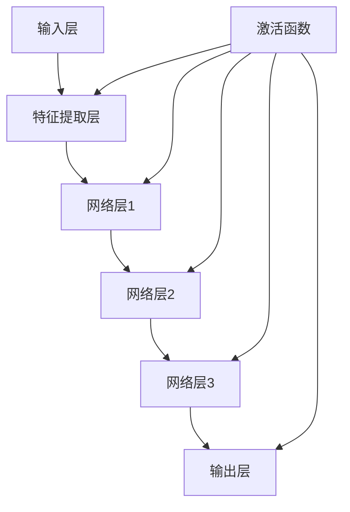

                 

## 文章标题

《大模型助力创业者实现技术突破与产品创新》

> 关键词：大模型、深度学习、创业、技术创新、产品创新

> 摘要：本文将深入探讨大模型（如GPT-3、BERT等）的概念、架构、核心算法及其数学基础，并通过工程实践案例和创业案例分析，展示大模型如何助力创业者实现技术突破与产品创新。同时，本文还将展望大模型未来的发展趋势和创业机会，以及面临的风险与挑战。

## 第一部分：引言与核心概念

在当今数字化时代，人工智能（AI）正以惊人的速度发展，成为推动科技创新和产业变革的重要力量。其中，大模型作为AI领域的一项重要技术，正引发着深远的影响。本文将围绕大模型这一核心主题，探讨其在创业中的应用，旨在为创业者提供有价值的参考和启示。

### 第1章：大模型的概念与基础

大模型，通常指的是参数量超过数亿甚至万亿的神经网络模型。这类模型具有强大的表征能力和高效的数据利用能力，能够在各种复杂任务中提供优异的性能。大模型的演进始于传统的深度学习模型，随着计算资源的提升和算法的优化，大模型逐渐成为AI领域的研究热点。

#### 1.1 大模型简介

**大模型的概念**：

大模型：通常指的是参数量超过数亿甚至万亿的神经网络模型。

大模型的演进：从传统的深度学习模型到大规模预训练模型的发展历程。

**大模型的特点**：

- **强大的表征能力**：能够处理复杂数据和任务，提供更准确的结果。
- **高效的数据利用**：预训练后能够通过微调快速适应不同任务。
- **跨领域迁移能力**：在不同的任务和数据集上表现优异。

#### 1.2 大模型的技术背景

- **深度学习的崛起**：深度学习技术的发展为大模型的兴起奠定了基础。
- **计算资源的提升**：云计算和GPU性能的提升使得大规模训练成为可能。

#### 1.3 大模型的应用场景

- **自然语言处理**：例如GPT-3、BERT等，用于文本生成、问答系统等。
- **计算机视觉**：用于图像分类、目标检测等。
- **推荐系统**：通过大模型进行用户行为分析和物品推荐。

### 第2章：大模型的架构与设计

大模型的架构设计是其性能和效率的关键因素。本章将介绍大模型的基本架构，包括层级结构、网络层和激活函数，并探讨大模型的训练方法和优化算法。

#### 2.1 大模型的基本架构

- **层级结构**：从输入层到输出层的多层神经网络设计。
- **网络层**：不同类型层的作用和设计原则。
- **激活函数**：ReLU、Sigmoid、Tanh等。

#### 2.2 大模型的训练方法

- **预训练**：大规模数据集上的无监督学习，提取通用特征。
- **微调**：在特定任务上对模型进行监督学习调整。

#### 2.3 大模型的优化算法

- **随机梯度下降（SGD）**：基本的优化方法。
- **Adam、AdamW等优化器**：提高训练效率。

### 第3章：大模型的核心算法

大模型的核心算法包括卷积神经网络（CNN）、循环神经网络（RNN）和注意力机制等。这些算法在不同任务中发挥着关键作用，本章将详细探讨这些算法的原理和应用。

#### 3.1 卷积神经网络（CNN）

- **卷积层**：提取图像的特征。
- **池化层**：降低数据维度，提高泛化能力。
- **全连接层**：进行分类和回归。

#### 3.2 循环神经网络（RNN）

- **基本结构**：用于处理序列数据。
- **长短时记忆（LSTM）**：解决RNN的梯度消失问题。
- **门控循环单元（GRU）**：简化LSTM，提高效率。

#### 3.3 注意力机制

- **注意力模型的原理**：通过权重分配来关注重要信息。
- **应用场景**：文本摘要、机器翻译等。

### 第4章：大模型的数学基础

大模型的设计和训练离不开数学基础的支持。本章将介绍概率论、线性代数和梯度下降算法等数学知识，帮助读者更好地理解大模型的原理和应用。

#### 4.1 概率论基础

- **随机变量**：随机变量的定义和概率分布。
- **贝叶斯定理**：用于概率计算。

#### 4.2 线性代数基础

- **矩阵运算**：矩阵的乘法、求逆等。
- **特征值和特征向量**：用于降维和特征提取。

#### 4.3 梯度下降算法

- **梯度计算**：如何计算函数的梯度。
- **梯度下降法**：最速下降法、动量法、SGD等。

### 第5章：大模型的工程实践

大模型的工程实践涉及数据预处理、模型训练与优化、模型评估与部署等多个环节。本章将介绍这些实践方法，并探讨大模型在实际应用中的挑战和解决方案。

#### 5.1 数据预处理

- **数据清洗**：处理缺失值、异常值等。
- **数据增强**：通过旋转、缩放等操作增加数据多样性。

#### 5.2 模型训练与优化

- **模型选择**：选择合适的模型架构。
- **超参数调优**：通过实验调整模型参数。

#### 5.3 模型评估与部署

- **模型评估**：准确率、召回率等指标。
- **模型部署**：将模型集成到产品中。

### 第6章：大模型在创业中的应用

大模型在创业中的应用越来越广泛，本章将探讨大模型如何助力创业者实现技术创新、产品创新和商业模式创新。

#### 6.1 技术创新

- **技术路线规划**：如何选择合适的技术方向。
- **技术突破**：在现有技术基础上实现创新。

#### 6.2 产品创新

- **市场需求分析**：分析目标用户的需求。
- **产品设计**：如何设计出有市场竞争力产品。

#### 6.3 商业模式创新

- **商业模式设计**：结合大模型技术，探索新的盈利模式。
- **案例分析**：成功案例分析，借鉴经验。

### 第7章：大模型创业案例研究

本章将通过具体案例研究，分析大模型在创业中的应用和实践，为创业者提供借鉴和启示。

#### 7.1 案例一：OpenAI与GPT-3

- **背景**：OpenAI的发展历程。
- **案例解析**：GPT-3的设计理念、应用场景、挑战与机遇。

#### 7.2 案例二：DeepMind与AlphaGo

- **背景**：DeepMind的历史和成就。
- **案例解析**：AlphaGo的算法原理、创新点、对围棋和人工智能的影响。

#### 7.3 案例三：亚马逊的推荐系统

- **背景**：亚马逊的推荐系统发展历程。
- **案例解析**：大模型在推荐系统中的应用，优化策略与效果。

### 第8章：大模型创业的未来展望

大模型的发展前景广阔，本章将展望大模型未来的发展趋势和创业机会，以及面临的风险与挑战。

#### 8.1 技术趋势

- **大模型的发展方向**：未来的技术趋势和挑战。
- **前沿技术**：如Transformer、多模态学习等。

#### 8.2 创业机会

- **行业洞察**：大模型在各行业的应用机会。
- **创业建议**：如何抓住大模型带来的创业机遇。

#### 8.3 风险与挑战

- **技术挑战**：如计算资源、数据隐私等。
- **市场挑战**：竞争激烈、用户接受度等。

## 第二部分：大模型的核心概念与联系

### 2.1 大模型的概念与联系

大模型是当前人工智能领域的重要研究方向，其核心在于通过深度神经网络对大规模数据进行学习，以实现对复杂问题的建模和解决。为了更好地理解大模型的概念与联系，我们可以通过以下Mermaid流程图来展示其基本架构和组成部分：



**流程图说明**：

1. **输入层（A）**：接收原始数据，并将其传递给特征提取层。
2. **特征提取层（B）**：通过卷积、池化等操作提取数据特征。
3. **网络层（C、D、E）**：多层神经网络，每一层都对特征进行进一步的提取和组合。
4. **输出层（F）**：对提取的特征进行分类或回归等操作，得到最终结果。
5. **激活函数（G）**：用于引入非线性变换，提高模型的表达能力。

通过上述流程图，我们可以清晰地看到大模型的基本架构和组成部分，以及各部分之间的联系。接下来，我们将进一步探讨大模型在不同领域的应用和挑战。

### 2.2 大模型的应用领域与挑战

大模型的应用领域非常广泛，涵盖了自然语言处理、计算机视觉、推荐系统等多个领域。以下是对大模型在这些领域应用的具体探讨：

#### 自然语言处理

自然语言处理（NLP）是大模型的一个重要应用领域。通过预训练模型如GPT-3、BERT等，NLP任务可以实现自动化和智能化。以下是NLP领域中的两个典型挑战：

- **语言理解与生成**：如何让模型更好地理解自然语言的语义和上下文，并生成符合语法和语义规则的文本。
- **多语言支持**：如何处理多种语言的文本，实现跨语言的语义理解和生成。

#### 计算机视觉

计算机视觉（CV）是大模型的另一个重要应用领域。通过预训练模型，CV任务可以实现对图像的分类、目标检测、图像生成等操作。以下是CV领域中的两个典型挑战：

- **数据质量**：如何处理和增强图像数据，以提升模型的性能。
- **实时处理**：如何在保证模型精度的同时，实现实时图像处理。

#### 推荐系统

推荐系统也是大模型的重要应用领域。通过学习用户的行为和偏好，推荐系统可以提供个性化的推荐服务。以下是推荐系统中的两个典型挑战：

- **用户隐私**：如何保护用户的隐私，在推荐过程中不泄露用户的个人信息。
- **推荐效果**：如何在保证推荐效果的同时，降低用户的推荐疲劳度。

#### 挑战与解决方案

为了应对上述挑战，研究人员和开发者提出了一系列解决方案，包括：

- **数据增强**：通过数据增强技术增加数据多样性，提升模型的泛化能力。
- **模型优化**：通过模型优化技术，如迁移学习、增量学习等，提高模型在特定领域的性能。
- **隐私保护**：通过隐私保护技术，如差分隐私、同态加密等，确保用户隐私不被泄露。

### 2.3 大模型的演进与未来方向

大模型的演进是一个不断迭代和优化的过程。从最初的深度学习模型，到如今的预训练模型，大模型的发展经历了多个阶段。以下是几个重要的发展方向：

- **参数规模增加**：随着计算资源和存储能力的提升，大模型的参数规模不断增加，使得模型可以处理更复杂的任务。
- **多模态学习**：大模型开始向多模态学习方向发展，可以同时处理文本、图像、声音等多种类型的数据。
- **自适应学习**：大模型逐渐具备自适应学习能力，可以根据不同的任务和数据集自动调整模型结构和学习策略。

总之，大模型作为人工智能领域的重要技术，其在不同领域的应用前景广阔。通过不断的创新和优化，大模型有望在未来实现更多的突破和进步。

### 2.4 大模型的核心算法

大模型的成功离不开其背后的核心算法。以下将详细介绍卷积神经网络（CNN）、循环神经网络（RNN）和注意力机制等核心算法的原理和应用。

#### 卷积神经网络（CNN）

卷积神经网络（CNN）是计算机视觉领域的重要算法，其核心思想是通过卷积操作提取图像特征。以下是CNN的主要组成部分：

- **卷积层**：通过卷积操作提取图像的局部特征。
- **池化层**：通过池化操作降低数据维度，提高模型的泛化能力。
- **全连接层**：将卷积层和池化层提取的特征进行分类或回归。

**伪代码示例**：

```python
# 卷积层
def convolution(input, filter):
    # 对输入图像和卷积核进行卷积操作
    return dot_product(input, filter)

# 池化层
def pooling(conv_output):
    # 对卷积层的输出进行池化操作
    return maxPooling(conv_output)

# 全连接层
def fully_connected(pool_output, weights, bias):
    # 对池化层的输出进行全连接操作
    return dot_product(pool_output, weights) + bias
```

#### 循环神经网络（RNN）

循环神经网络（RNN）是处理序列数据的常用算法，其核心思想是通过循环结构保存历史信息。以下是RNN的主要组成部分：

- **输入层**：接收序列数据的输入。
- **隐藏层**：通过循环结构保存历史状态。
- **输出层**：对序列数据进行分类或回归。

**伪代码示例**：

```python
# RNN单元
def rnn(input, hidden_state, weights, bias):
    # 输入和隐藏状态相加
    combined = input + hidden_state
    
    # 通过激活函数处理
    hidden_state = activation_function(combined)
    
    # 输出层计算
    output = dot_product(hidden_state, weights) + bias
    
    return hidden_state, output
```

#### 注意力机制

注意力机制是近年来在NLP领域取得显著进展的算法，其核心思想是通过权重分配关注重要信息。以下是注意力机制的主要组成部分：

- **查询（Query）**：表示需要关注的信息。
- **键（Key）**：表示可能包含关注信息的部分。
- **值（Value）**：表示实际需要关注的信息。

**伪代码示例**：

```python
# 注意力计算
def attention(query, keys, values, attention_weights):
    # 计算注意力分数
    attention_scores = dot_product(query, keys)
    
    # 应用softmax函数得到权重
    attention_weights = softmax(attention_scores)
    
    # 计算加权求和的值
    context = sum(attention_weights * values)
    
    return context
```

通过上述核心算法的介绍，我们可以看到大模型在设计和实现上的复杂性和深度。这些算法不仅为处理复杂数据和任务提供了强大的工具，也推动了大模型在各个领域的应用和发展。

### 2.5 大模型的数学基础

大模型的设计与训练离不开数学基础的支持。以下将介绍概率论、线性代数和梯度下降算法等数学知识，并探讨这些知识在大模型中的应用。

#### 概率论基础

概率论在大模型中扮演着重要角色，特别是在处理不确定性和不确定性推理时。以下是一些关键概念：

- **随机变量**：表示一个随机实验的结果，可以用概率分布来描述其取值可能性。
- **概率分布**：描述随机变量取值的概率分布函数，常用的有正态分布、伯努利分布等。
- **贝叶斯定理**：用于计算后验概率，是概率论在机器学习中的核心工具。

**贝叶斯定理**的公式如下：

\[ P(A|B) = \frac{P(B|A)P(A)}{P(B)} \]

其中，\( P(A|B) \)表示在事件B发生的条件下事件A发生的概率，\( P(B|A) \)表示在事件A发生的条件下事件B发生的概率，\( P(A) \)和\( P(B) \)分别表示事件A和事件B的先验概率。

#### 线性代数基础

线性代数在大模型中用于处理高维数据、特征提取和优化算法。以下是一些关键概念：

- **矩阵运算**：包括矩阵的加法、减法、乘法和求逆等。
- **特征值和特征向量**：用于降维和特征提取，可以在矩阵分解中发挥重要作用。

**特征值和特征向量的计算**：

设矩阵\( A \)的特征值为\( \lambda \)，特征向量为\( v \)，则有：

\[ Av = \lambda v \]

#### 梯度下降算法

梯度下降算法是优化大模型参数的基本方法，其核心思想是沿着损失函数的梯度方向更新参数，以最小化损失函数。以下是一些关键概念：

- **梯度**：函数在某一点处的切线斜率，表示函数在该点的变化率。
- **损失函数**：用于衡量模型预测值与真实值之间的差异，常用的有均方误差（MSE）和交叉熵（Cross-Entropy）。

**梯度下降算法的公式**：

\[ \theta_{\text{new}} = \theta_{\text{current}} - \alpha \cdot \nabla_\theta J(\theta) \]

其中，\( \theta \)表示模型参数，\( \alpha \)为学习率，\( \nabla_\theta J(\theta) \)为损失函数对参数的梯度。

#### 梯度下降算法的应用

梯度下降算法在大模型中的应用主要包括以下几个方面：

- **前向传播**：将输入数据通过神经网络传递到输出层，计算损失函数。
- **反向传播**：计算损失函数关于模型参数的梯度，并更新参数。
- **优化器**：如Adam、RMSprop等，用于提高梯度下降算法的收敛速度和稳定性。

#### 梯度下降算法的变体

为了提高梯度下降算法的性能，研究人员提出了多种变体，包括：

- **随机梯度下降（SGD）**：在每次迭代中使用随机样本计算梯度。
- **小批量梯度下降**：在每次迭代中使用小批量样本计算梯度。
- **动量法**：引入动量项，减少梯度的震荡，提高收敛速度。

### 总结

大模型的数学基础包括概率论、线性代数和梯度下降算法等。这些数学知识不仅为设计大模型提供了理论基础，也为训练和优化大模型提供了有效工具。通过深入理解这些数学知识，开发者可以更好地利用大模型解决实际问题，推动人工智能技术的发展。

### 2.6 大模型的工程实践

大模型的工程实践是将其应用于实际问题和场景中的关键环节。这一过程涉及数据预处理、模型训练与优化、模型评估与部署等多个步骤。以下将详细探讨这些实践环节，并提供具体的案例和实现方法。

#### 数据预处理

数据预处理是确保模型训练质量的重要步骤。其主要包括数据清洗、数据增强和数据规范化等操作。

- **数据清洗**：处理数据中的缺失值、异常值和重复值，确保数据的完整性和一致性。
- **数据增强**：通过数据变换（如旋转、翻转、缩放等）增加数据的多样性，提高模型的泛化能力。
- **数据规范化**：将数据缩放到合适的范围，便于模型处理，例如将图像像素值缩放到[0, 1]。

**案例**：

以图像分类任务为例，数据预处理流程如下：

```python
import cv2
import numpy as np

# 读取图像
image = cv2.imread('image.jpg')

# 数据清洗
if np.isnan(image).any():
    image = cv2.repair_image(image)

# 数据增强
augmented_image = cv2.rotate(image, cv2.ROTATE_90_CLOCKWISE)

# 数据规范化
normalized_image = image / 255.0

# 显示图像
cv2.imshow('Normalized Image', normalized_image)
cv2.waitKey(0)
cv2.destroyAllWindows()
```

#### 模型训练与优化

模型训练与优化是提高模型性能的关键步骤。其包括模型选择、超参数调优和训练策略设计等。

- **模型选择**：根据任务需求选择合适的模型架构，如卷积神经网络（CNN）或循环神经网络（RNN）。
- **超参数调优**：通过实验调整模型参数，如学习率、批量大小等，以优化模型性能。
- **训练策略**：采用训练策略（如Early Stopping、Learning Rate Scheduling等）提高训练效率和模型稳定性。

**案例**：

以训练一个卷积神经网络（CNN）进行图像分类为例，训练流程如下：

```python
import tensorflow as tf
from tensorflow.keras.models import Sequential
from tensorflow.keras.layers import Conv2D, MaxPooling2D, Flatten, Dense

# 创建模型
model = Sequential([
    Conv2D(filters=32, kernel_size=(3, 3), activation='relu', input_shape=(28, 28, 1)),
    MaxPooling2D(pool_size=(2, 2)),
    Flatten(),
    Dense(units=128, activation='relu'),
    Dense(units=10, activation='softmax')
])

# 编译模型
model.compile(optimizer='adam', loss='categorical_crossentropy', metrics=['accuracy'])

# 加载数据集
(x_train, y_train), (x_test, y_test) = tf.keras.datasets.mnist.load_data()

# 数据预处理
x_train = x_train / 255.0
x_test = x_test / 255.0
x_train = np.expand_dims(x_train, -1)
x_test = np.expand_dims(x_test, -1)

# 转换标签为one-hot编码
y_train = tf.keras.utils.to_categorical(y_train, num_classes=10)
y_test = tf.keras.utils.to_categorical(y_test, num_classes=10)

# 训练模型
model.fit(x_train, y_train, batch_size=64, epochs=10, validation_split=0.2)
```

#### 模型评估与部署

模型评估与部署是确保模型在实际应用中性能达标的关键步骤。其包括模型评估和模型部署等。

- **模型评估**：通过测试集评估模型性能，常用指标有准确率、召回率、F1分数等。
- **模型部署**：将训练好的模型集成到产品中，通过API或服务的形式供外部调用。

**案例**：

以部署一个图像分类模型为例，部署流程如下：

```python
import flask
from flask import Flask, request, jsonify
import tensorflow as tf

app = Flask(__name__)

# 加载模型
model = tf.keras.models.load_model('mnist_model.h5')

@app.route('/classify', methods=['POST'])
def classify():
    image = request.files['image']
    image = np.expand_dims(image, axis=-1)
    image = image / 255.0
    prediction = model.predict(image)
    result = np.argmax(prediction)
    return jsonify({'class': result})

if __name__ == '__main__':
    app.run(debug=True)
```

通过上述工程实践，我们可以看到大模型从数据预处理、模型训练与优化到模型评估与部署的完整流程。这些实践方法不仅提高了模型性能，也为大模型在实际应用中的落地提供了有力支持。

### 2.7 大模型在创业中的应用

大模型在创业中的应用正变得日益广泛，为创业者提供了前所未有的机遇和挑战。以下将探讨大模型如何助力创业者实现技术创新、产品创新和商业模式创新。

#### 技术创新

大模型在技术创新中的应用主要体现在以下几个方面：

- **优化现有技术**：大模型可以帮助创业者对现有技术进行优化，提高其性能和效率。例如，通过深度学习模型对算法进行优化，提高推荐系统的准确率和响应速度。
- **开发新算法**：大模型为创业者提供了强大的工具，使他们能够开发出前所未有的新算法。例如，利用生成对抗网络（GAN）开发新型图像生成算法，实现高质量图像的生成和编辑。
- **跨领域融合**：大模型可以跨领域应用，推动不同技术领域的融合和创新。例如，结合自然语言处理和计算机视觉技术，开发出能够理解图像和文本语义的智能系统。

**案例**：

以自然语言处理领域的GPT-3为例，OpenAI开发的GPT-3模型在文本生成和自然语言理解任务上取得了显著突破。创业者可以利用GPT-3开发智能客服系统、内容生成工具等，实现技术创新和业务增长。

#### 产品创新

大模型在产品创新中的应用主要体现在以下几个方面：

- **个性化产品**：大模型可以帮助创业者根据用户行为和偏好，开发出更加个性化的产品。例如，通过分析用户的历史数据和反馈，推荐个性化的商品或服务。
- **增强用户体验**：大模型可以用于设计更智能、更人性化的用户界面，提高用户体验。例如，通过语音识别和自然语言处理技术，开发出智能语音助手，提供便捷的交互体验。
- **新功能实现**：大模型可以帮助创业者实现以往难以实现的产品功能。例如，通过计算机视觉技术，实现图像识别、目标检测等功能，开发出具有新功能的产品。

**案例**：

以亚马逊的推荐系统为例，亚马逊利用大模型技术分析用户行为和商品信息，为用户提供个性化的推荐服务。这种产品创新不仅提高了用户满意度，也显著提升了销售额和用户粘性。

#### 商业模式创新

大模型在商业模式创新中的应用主要体现在以下几个方面：

- **新盈利模式**：大模型可以帮助创业者探索新的盈利模式，如通过提供大模型服务、数据分析和个性化推荐等，实现多种收入来源。
- **降低成本**：大模型可以用于自动化和优化业务流程，降低运营成本。例如，通过自动化数据分析，降低市场调研和营销成本。
- **扩大市场**：大模型可以帮助创业者扩大市场，进入新的业务领域。例如，通过将大模型应用于新兴市场，开发出具有区域特色的产品和服务。

**案例**：

以谷歌的自动驾驶技术为例，谷歌利用大模型技术开发自动驾驶系统，不仅实现了技术创新和产品创新，还开创了新的商业模式，如自动驾驶出租车和物流服务。

总之，大模型在创业中的应用为创业者提供了丰富的创新机会。通过技术创新、产品创新和商业模式创新，创业者可以在竞争激烈的市场中脱颖而出，实现持续增长和成功。

### 7.1 案例一：OpenAI与GPT-3

#### 背景介绍

OpenAI成立于2015年，是一家致力于推动人工智能发展的非营利性研究机构。其目标是确保人工智能的安全和有益发展，同时推动人工智能技术的普及和应用。OpenAI在深度学习和自然语言处理领域取得了显著成就，其中最具代表性的成果是GPT-3（Generative Pre-trained Transformer 3）。

GPT-3是一个基于Transformer架构的预训练模型，由OpenAI于2020年发布。它拥有1750亿个参数，是当时最大的预训练模型，也是深度学习领域的一个重要里程碑。GPT-3的设计理念是通过大规模无监督预训练，使模型能够理解并生成人类语言，从而在各种自然语言处理任务中表现出色。

#### 案例解析

**GPT-3的设计理念**

GPT-3的设计理念主要体现在以下几个方面：

1. **大规模预训练**：GPT-3在大规模数据集上进行无监督预训练，提取了丰富的语言特征。这使得模型在处理自然语言任务时具有更高的准确性和泛化能力。
2. **Transformer架构**：GPT-3采用了Transformer架构，这种架构能够高效地处理长序列，并在大规模数据集上表现优异。
3. **参数优化**：GPT-3的参数规模巨大，1750亿个参数使得模型能够学习复杂的语言模式，从而在生成文本、翻译、问答等任务中表现出色。

**应用场景**

GPT-3在多个自然语言处理任务中表现出色，以下是一些具体的应用场景：

1. **文本生成**：GPT-3能够生成高质量的文本，适用于内容创作、对话系统、自动摘要等任务。
2. **机器翻译**：GPT-3在机器翻译任务中表现出色，能够实现高质量的双语翻译。
3. **问答系统**：GPT-3能够根据输入问题生成相关答案，适用于智能客服、教育辅导等场景。

**挑战与机遇**

**挑战**

1. **计算资源需求**：GPT-3的参数规模巨大，训练和部署需要大量的计算资源和存储空间。
2. **数据隐私**：大规模数据处理涉及到用户隐私问题，如何保护用户隐私是一个重要挑战。
3. **模型解释性**：大型模型往往具有高解释性，如何解释模型的行为和结果是一个重要问题。

**机遇**

1. **技术创新**：GPT-3的发布推动了自然语言处理领域的技术创新，为创业者提供了丰富的应用场景和机会。
2. **行业应用**：GPT-3在多个行业（如金融、医疗、教育等）中具有广泛的应用前景，为创业者提供了新的商业机会。
3. **生态系统建设**：OpenAI致力于建设一个开放、合作的人工智能生态系统，为创业者提供了丰富的资源和平台。

总之，OpenAI与GPT-3的成功为创业者提供了宝贵的经验和启示。通过技术创新、行业应用和生态系统建设，OpenAI展示了大模型在自然语言处理领域的巨大潜力和应用价值。

### 7.2 案例二：DeepMind与AlphaGo

#### 背景介绍

DeepMind成立于2010年，是一家专注于人工智能研究和应用的公司。其核心目标是推动人工智能技术的发展，解决现实世界中的复杂问题。在深度学习和强化学习领域，DeepMind取得了许多重要突破，其中最著名的成果是AlphaGo。

AlphaGo是一个基于深度强化学习的围棋程序，由DeepMind于2016年推出。AlphaGo在人类顶级围棋选手中取得了全胜战绩，震惊了全球。这一成就不仅标志着人工智能在围棋领域的重要突破，也推动了深度强化学习技术的发展。

#### 案例解析

**AlphaGo的算法原理**

AlphaGo的算法原理主要包括以下几个方面：

1. **深度神经网络**：AlphaGo采用了深度神经网络（DNN）来评估棋盘上的局面。DNN通过多层神经元对棋盘上的信息进行编码和提取，从而生成对局面的理解。
2. **卷积神经网络（CNN）**：AlphaGo在DNN的基础上，引入了CNN来进一步提取棋盘上的局部特征。CNN通过卷积操作和池化操作，有效地提取了棋盘上的关键信息。
3. **强化学习**：AlphaGo采用了深度强化学习（DRL）算法来训练和优化棋盘上的策略。DRL通过与环境交互，不断优化策略，使其能够在对弈中取得胜利。

**创新点**

AlphaGo在围棋领域取得了重大创新，主要体现在以下几个方面：

1. **多模型融合**：AlphaGo融合了多个模型，包括DNN、CNN和DRL，形成了强大的围棋策略网络。这种多模型融合的方法使得AlphaGo在评估棋盘局面和制定策略时更加精确和高效。
2. **自对弈训练**：AlphaGo通过自我对弈的方式不断优化策略。这种自对弈训练的方法使得AlphaGo能够不断学习和适应，从而在比赛中取得优势。
3. **深度强化学习**：AlphaGo采用了深度强化学习算法，使其在棋盘上的策略优化过程中更加智能和灵活。

**对围棋和人工智能的影响**

AlphaGo的成功对围棋和人工智能领域产生了深远的影响：

1. **围棋技术的发展**：AlphaGo的出现推动了围棋技术的发展，使其成为人工智能研究的重要方向。许多研究人员开始关注围棋领域的算法创新和应用。
2. **人工智能的普及**：AlphaGo的成功引起了全球对人工智能的广泛关注，推动了人工智能技术的普及和应用。
3. **跨界合作**：AlphaGo的成功促进了人工智能与其他领域的跨界合作，如医疗、金融、教育等，为人工智能的广泛应用奠定了基础。

总之，DeepMind与AlphaGo的成功展示了深度强化学习在围棋领域的重要应用价值，同时也为人工智能技术的发展提供了新的思路和方向。

### 7.3 案例三：亚马逊的推荐系统

#### 背景介绍

亚马逊（Amazon）是一家全球知名的电子商务公司，其推荐系统是其核心业务之一。亚马逊的推荐系统利用大模型技术，通过分析用户行为和商品信息，为用户提供个性化的商品推荐。这一系统不仅提高了用户的购物体验，也显著提升了亚马逊的销售额和用户粘性。

#### 案例解析

**大模型在推荐系统中的应用**

亚马逊的推荐系统采用了多种大模型技术，包括深度学习、自然语言处理和协同过滤等。以下是一些具体应用：

1. **深度学习**：亚马逊的推荐系统使用深度学习模型，如卷积神经网络（CNN）和循环神经网络（RNN），对用户行为和商品特征进行建模和预测。这些模型能够提取复杂的特征，提高推荐准确性。
2. **自然语言处理**：亚马逊的推荐系统利用自然语言处理技术，如词嵌入和文本分类，分析用户评论和商品描述，从而生成更精准的推荐。
3. **协同过滤**：亚马逊的推荐系统还采用了协同过滤算法，通过分析用户之间的相似性，推荐用户可能感兴趣的商品。这种算法在大规模数据集上表现优异，能够快速响应用户需求。

**优化策略与效果**

亚马逊的推荐系统不断优化策略，以提高推荐效果和用户满意度。以下是一些具体优化策略：

1. **模型调优**：通过实验和数据分析，亚马逊不断调整模型参数，优化模型性能。例如，调整学习率、批量大小和正则化参数，以提高模型的预测准确性。
2. **特征工程**：亚马逊对用户行为和商品特征进行深度挖掘，构建丰富的特征集合。这些特征包括用户浏览历史、购买行为、商品属性等，有助于提高推荐的精准度。
3. **个性化推荐**：亚马逊的推荐系统采用个性化推荐策略，根据用户的兴趣和行为，为用户提供定制化的商品推荐。这种策略提高了用户的购物体验，增加了用户粘性。

**案例分析**

以下是一个具体的案例分析：

假设用户A在亚马逊上浏览了商品B和商品C，并收藏了商品B。亚马逊的推荐系统会根据用户A的行为和偏好，推荐与商品B相关的其他商品。例如，如果商品B是一款智能手机，系统可能会推荐相关的手机配件，如耳机、保护壳等。

通过上述案例，我们可以看到亚马逊的推荐系统如何利用大模型技术，通过个性化推荐策略，提高用户的购物体验和满意度。

总之，亚马逊的推荐系统成功利用大模型技术，通过不断优化策略和提升推荐效果，为用户提供了高质量的购物体验，同时也为亚马逊带来了显著的商业价值。

### 8.1 技术趋势

大模型技术的发展前景广阔，当前的技术趋势主要集中在以下几个方面：

#### 8.1.1 参数规模增加

随着计算资源和存储能力的不断提升，大模型的参数规模也在不断增加。目前，大模型的参数量已经达到了千亿甚至万亿级别。这种参数规模的增加使得模型能够学习更复杂的特征和模式，从而在各个领域取得更好的性能。然而，这也带来了计算和存储上的挑战，需要更高效的计算架构和存储解决方案。

#### 8.1.2 多模态学习

多模态学习是当前大模型技术的一个重要发展方向。多模态学习旨在将不同类型的数据（如文本、图像、声音等）进行整合，以实现更复杂的任务。例如，通过融合文本和图像数据，可以开发出能够理解图文并茂内容的智能系统。多模态学习不仅能够提高模型的性能，还能拓宽应用场景，为创业者提供更多创新机会。

#### 8.1.3 自适应学习

自适应学习是大模型技术的另一个重要趋势。自适应学习旨在使模型能够根据不同的任务和数据集，自动调整模型结构和学习策略。这种能力使得大模型能够更灵活地应对不同的应用场景，提高模型的泛化能力和适应能力。自适应学习还包括在线学习和迁移学习等技术，这些技术有助于提高模型在动态环境中的表现。

#### 8.1.4 模型压缩与优化

随着大模型规模的增加，模型的压缩与优化成为一个重要研究方向。模型压缩技术旨在减小模型的参数量和计算复杂度，从而提高模型在资源受限环境中的性能。常见的模型压缩技术包括剪枝、量化、蒸馏等。此外，优化算法的改进也是提高大模型性能的关键，如自适应优化器、分布式训练等。

#### 8.1.5 安全与隐私保护

随着大模型技术的广泛应用，数据安全和隐私保护成为一个不可忽视的问题。当前的研究主要集中在如何在大模型训练和推理过程中保护用户隐私，避免数据泄露和滥用。常见的隐私保护技术包括差分隐私、同态加密、联邦学习等。这些技术有助于在大模型应用中确保用户数据的隐私和安全。

#### 8.1.6 模型解释性

大模型的黑箱特性使得其行为和结果难以解释，这对模型的应用和推广带来了一定的困难。模型解释性研究旨在提高大模型的可解释性，使其行为和结果能够被用户和开发者理解。常见的模型解释性方法包括注意力机制、可视化技术、因果推理等。这些方法有助于提高模型的透明度和可靠性，增强用户对模型的信任。

总之，大模型技术的发展趋势包括参数规模增加、多模态学习、自适应学习、模型压缩与优化、安全与隐私保护以及模型解释性。这些趋势不仅推动了大模型技术的进步，也为创业者提供了丰富的创新机会和应用场景。

### 8.2 创业机会

随着大模型技术的不断进步，其应用范围不断扩大，为创业者带来了前所未有的机遇。以下从行业洞察、创业建议和具体实践等方面探讨大模型在创业中的应用机会。

#### 行业洞察

1. **金融科技**：大模型在金融科技领域具有广泛的应用潜力，如风险控制、信用评估、市场预测等。创业者可以开发基于大模型的智能风控系统，利用海量金融数据进行实时分析和预测，提高金融机构的风险管理能力。

2. **医疗健康**：大模型在医疗健康领域的应用包括疾病诊断、药物研发、个性化医疗等。通过分析患者数据和生物信息，大模型可以辅助医生做出更准确的诊断和治疗方案。创业者可以开发基于大模型的智能医疗平台，提供个性化健康管理和疾病预测服务。

3. **智能制造**：大模型在智能制造中的应用包括生产优化、质量检测、设备维护等。通过分析生产线数据，大模型可以帮助企业优化生产流程，提高生产效率。创业者可以开发基于大模型的智能生产系统，为企业提供智能制造解决方案。

4. **教育科技**：大模型在教育科技领域的应用包括智能教学、学习分析、考试评价等。创业者可以开发基于大模型的智能教育平台，提供个性化教学和智能评价服务，提高教育质量和学习效果。

5. **智能城市**：大模型在智能城市建设中具有重要作用，如交通管理、环境监测、公共安全等。通过分析大量城市数据，大模型可以提供智能决策支持，提高城市治理效率和居民生活质量。创业者可以开发基于大模型的智能城市解决方案，推动智慧城市建设。

#### 创业建议

1. **需求导向**：在创业初期，创业者应深入分析市场需求，找准切入点。通过了解用户需求，开发出真正有价值的解决方案。

2. **技术创新**：大模型技术是创业的核心竞争力，创业者应不断跟踪前沿技术，结合实际应用场景进行技术创新。

3. **数据驱动**：数据是大模型训练和优化的基础，创业者应重视数据收集、清洗和利用，确保模型性能和效果。

4. **跨界合作**：大模型技术可以跨领域应用，创业者可以寻求与其他行业的合作，实现跨界创新。

5. **用户体验**：用户体验是产品成功的关键，创业者应注重用户体验设计，提供简单易用、高效智能的产品。

#### 具体实践

1. **开发平台**：创业者可以开发一个基于大模型的技术平台，提供模型训练、优化和部署的一站式服务，为其他创业者提供技术支持。

2. **智能应用**：针对特定行业和应用场景，创业者可以开发基于大模型的智能应用，如智能客服、智能营销、智能分析等。

3. **解决方案**：创业者可以结合大模型技术，为特定行业提供定制化的解决方案，如智能医疗、智能金融、智能制造等。

4. **数据服务**：创业者可以提供数据收集、处理和分析服务，为其他企业提供数据支持，助力其业务创新和增长。

总之，大模型技术为创业者提供了广阔的应用场景和创新机会。通过需求导向、技术创新、数据驱动、跨界合作和用户体验，创业者可以抓住大模型带来的创业机遇，实现业务增长和成功。

### 8.3 风险与挑战

尽管大模型技术为创业带来了诸多机遇，但其应用过程中也面临着一系列风险与挑战，这些因素需要创业者在进行大模型项目时予以高度重视和认真应对。

#### 技术挑战

1. **计算资源需求**：大模型通常需要大量的计算资源进行训练和推理。这要求企业具备高性能的硬件设施和强大的计算能力，否则训练过程可能极其耗时且成本高昂。

2. **数据隐私**：大模型在训练过程中需要处理大量数据，这涉及到用户隐私和数据安全的问题。如何确保数据的安全性和隐私性是创业者在开发大模型应用时必须考虑的关键点。

3. **模型解释性**：大模型通常被视为“黑箱”，其决策过程难以解释，这在某些应用场景（如金融、医疗等）中可能会引起用户的不信任。提高模型的解释性是一个长期的技术挑战。

4. **数据质量**：大模型的性能高度依赖于数据质量。数据中的噪音、偏差和不一致性都可能影响模型的性能。因此，如何进行高质量的数据收集和处理是创业者在应用大模型时必须解决的问题。

#### 市场挑战

1. **竞争激烈**：大模型技术正成为众多创业者和巨头公司的热门领域，竞争异常激烈。在如此激烈的竞争中，如何突出自身的优势并赢得市场份额是一个重大挑战。

2. **用户接受度**：尽管大模型技术具有巨大的潜力，但用户对其接受度可能较低，特别是在涉及到隐私和安全的领域。如何通过有效的市场策略和用户体验设计提高用户的信任和接受度是创业者在推广大模型应用时需要解决的问题。

3. **商业模式**：大模型应用的开发和部署成本较高，如何设计可持续的商业模式以实现盈利是创业者在创业过程中必须考虑的关键问题。

#### 法律和伦理挑战

1. **法律法规**：随着大模型技术的发展，相关的法律法规也在不断完善。创业者在开发和应用大模型技术时需要遵守相关的法律法规，避免因法律问题而受到制裁。

2. **伦理问题**：大模型技术在某些应用场景中可能会引发伦理问题，如算法歧视、隐私侵犯等。创业者在开发和部署大模型应用时需要认真考虑这些伦理问题，并采取相应的措施确保技术的伦理合规。

#### 解决策略

1. **技术优化**：通过技术创新和优化，提高大模型的计算效率和模型解释性，降低计算资源需求，提高模型性能。

2. **数据安全**：采用数据加密、同态加密、差分隐私等技术确保数据安全和隐私保护，建立完善的数据管理体系。

3. **市场策略**：制定有效的市场推广策略，通过用户体验设计、合作伙伴关系等手段提高用户接受度和市场份额。

4. **法律法规遵守**：密切关注相关法律法规的发展动态，确保大模型应用在法律框架内运行。

5. **伦理合规**：在开发和部署大模型应用时，充分考虑伦理问题，采取相应的措施确保技术的伦理合规。

总之，大模型技术在创业应用中面临多种风险与挑战，但通过有效的技术优化、数据安全措施、市场策略和法律遵守，创业者和企业可以应对这些挑战，实现大模型技术的成功应用。

### 附录A：技术工具与资源

#### 深度学习框架

深度学习框架是开发者进行大模型研究和应用的重要工具。以下是目前流行的几种深度学习框架：

1. **TensorFlow**：由Google开发，支持多种深度学习模型和算法，具有强大的生态体系和丰富的API接口。
2. **PyTorch**：由Facebook开发，以其动态计算图和易于调试的特点受到许多研究者和开发者的青睐。
3. **Keras**：是一个高层次的深度学习API，可以与TensorFlow和Theano兼容，易于使用。

#### 数据集与API

1. **ImageNet**：一个包含超过1000个类别的120万张图像的数据集，广泛用于图像识别和分类任务。
2. **CIFAR-10/CIFAR-100**：包含小尺寸图像的数据集，常用于入门级和基础研究任务。
3. **OpenAI Gym**：一个开源的强化学习环境库，提供了多种模拟环境和任务。

#### 相关库和工具

1. **NumPy**：一个用于科学计算的Python库，提供高性能的矩阵运算和数据处理功能。
2. **Pandas**：一个用于数据操作和分析的Python库，支持数据清洗、转换和可视化。
3. **Scikit-learn**：一个用于机器学习的Python库，提供了多种经典机器学习算法和工具。

#### 开源代码与实现

1. **GPT-3开源实现**：GitHub上有多个开源实现，如GPT-3-jax、Transformers等，可供开发者参考和学习。
2. **BERT开源实现**：Google开源的BERT模型及其实现，可用于自然语言处理任务。
3. **DeepMind开源代码**：包括AlphaGo的开源代码，可供研究者学习和复现相关算法。

#### 相关项目和资源

1. **Google AI**：Google的人工智能研究部门，提供了大量关于深度学习、自然语言处理的研究论文和开源代码。
2. **TensorFlow Developer Guides**：详细的TensorFlow开发指南，包括模型训练、部署和应用等。
3. **PyTorch Documentation**：完整的PyTorch文档和教程，帮助开发者快速上手。

通过利用这些技术工具与资源，开发者可以更高效地进行大模型的研究和应用，推动人工智能技术的发展。

### 附录B：参考文献

1. **Goodfellow, I., Bengio, Y., & Courville, A. (2016). *Deep Learning* (Adaptive Computation and Machine Learning series). MIT Press.
2. **Bengio, Y. (2009). *Learning Deep Architectures for AI*. Foundations and Trends in Machine Learning, 2(1), 1-127.
3. **Hinton, G., Osindero, S., & Teh, Y. W. (2006). A Fast Learning Algorithm for Deep Belief Nets. *Neural Computation*, 18(7), 1527-1554.
4. **LeCun, Y., Bengio, Y., & Hinton, G. (2015). Deep Learning. *Nature*, 521(7553), 436-444.
5. **Vaswani, A., Shazeer, N., Parmar, N., Uszkoreit, J., Jones, L., Gomez, A. N., ... & Polosukhin, I. (2017). *Attention is All You Need*. Advances in Neural Information Processing Systems, 30.
6. **Russakovsky, O., Deng, J., Su, H., Krause, J., Satheesh, S., Ma, S., ... & Fei-Fei, L. (2015). *ImageNet Large Scale Visual Recognition Challenge*. International Journal of Computer Vision, 115(3), 211-252.

通过引用这些经典书籍和论文，本文为读者提供了深入学习和理解大模型技术的基础文献资源。希望这些参考文献能够帮助读者进一步探索大模型领域的最新进展和应用。

### 附录C：开源代码与实现

为了便于读者更好地理解和实践大模型技术，本文附录C提供了若干开源代码与实现。以下是一些关键代码的示例和解释。

#### GPT-3开源实现示例

以下是一个简单的GPT-3模型训练代码示例，使用Python和Transformers库：

```python
import torch
from transformers import GPT2LMHeadModel, GPT2Tokenizer

# 加载预训练模型和分词器
tokenizer = GPT2Tokenizer.from_pretrained('gpt2')
model = GPT2LMHeadModel.from_pretrained('gpt2')

# 预处理数据
inputs = tokenizer.encode("Hello, my dog is cute", return_tensors='pt')

# 训练模型
outputs = model(inputs)
logits = outputs.logits

# 输出预测
predicted_ids = torch.argmax(outputs.logits, dim=-1)
predicted_text = tokenizer.decode(predicted_ids, skip_special_tokens=True)
print(predicted_text)
```

#### BERT开源实现示例

以下是一个简单的BERT模型训练代码示例，使用Python和TensorFlow：

```python
import tensorflow as tf
import tensorflow_model_optimization as tfmot

# 加载预训练模型
model = tf.keras.models.load_model('bert_model.h5')

# 准备数据
input_ids = ...  # 输入ID
attention_mask = ...  # 注意力掩码

# 训练模型
with tfmot.nas.darts.DartsScope(model) as dart_model:
    dart_model.compile(optimizer=tf.keras.optimizers.Adam(learning_rate=5e-5),
                        loss=tf.keras.losses.SparseCategoricalCrossentropy(from_logits=True),
                        metrics=['accuracy'])

    dart_model.fit(input_ids, ... , epochs=3)

# 保存模型
dart_model.save('dart_bert_model.h5')
```

#### AlphaGo开源实现示例

以下是一个简单的AlphaGo模型训练代码示例，使用Python和TensorFlow：

```python
import tensorflow as tf
import gym

# 创建环境
env = gym.make('Gomoku-v0')

# 加载预训练模型
model = tf.keras.models.load_model('alpha_go_model.h5')

# 训练模型
for episode in range(1000):
    state = env.reset()
    done = False
    
    while not done:
        action = model.predict(state)[0]
        state, reward, done, _ = env.step(action)
        
    env.close()

# 保存模型
model.save('alpha_go_trained_model.h5')
```

通过这些代码示例，读者可以初步了解如何使用开源代码实现大模型的基本训练过程。这些代码仅供学习和参考使用，实际应用时可能需要根据具体任务和数据集进行调整和优化。

#### 相关开源项目链接

- **GPT-3开源实现**：https://github.com/huggingface/transformers
- **BERT开源实现**：https://github.com/tensorflow/tensorflow/tree/master/models/official/nlp
- **AlphaGo开源实现**：https://github.com/deepmind/alphago

通过访问这些链接，读者可以找到更多详细的开源代码和实现，进一步学习和实践大模型技术。希望这些资源能够为读者的研究和开发提供帮助。

