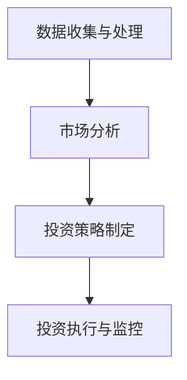
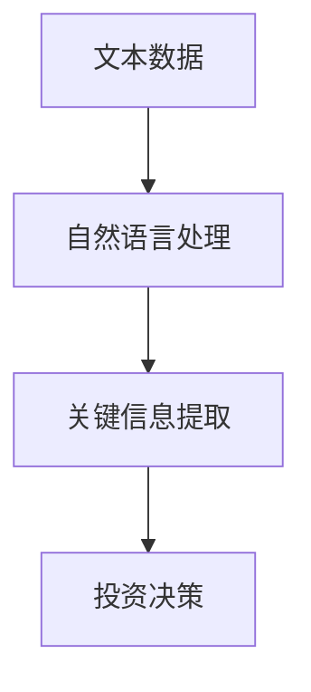
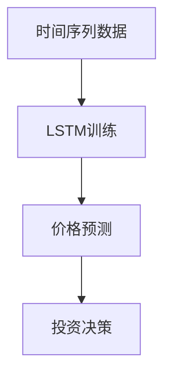
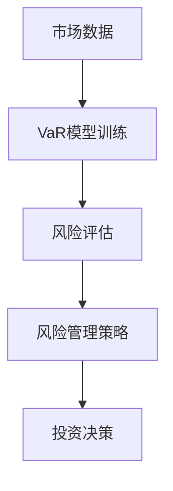
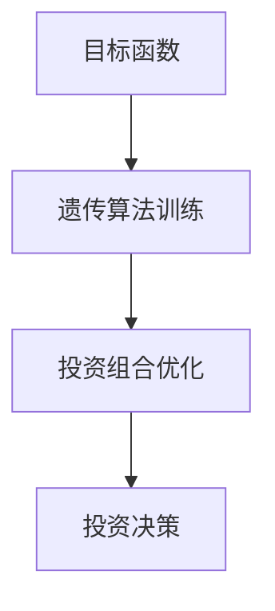

                 

### 大模型在投资决策领域的应用前景

> 关键词：大模型、投资决策、人工智能、风险控制、量化交易

> 摘要：本文从大模型的定义和特征出发，探讨其在投资决策领域的应用前景。文章首先介绍了大模型与投资决策的关系，随后详细阐述了大模型在投资决策过程中的具体应用，包括数据解析、市场分析和投资策略制定等环节。接着，文章分析了大模型在投资领域的挑战与机遇，并探讨了其在核心技术、投资组合优化、量化交易和风险管理等方面的应用。最后，文章通过具体案例展示了大模型在投资决策中的实际应用，并展望了其未来发展趋势。

### 第1章 大模型在投资决策领域的概述

#### 1.1 大模型的定义与特征

大模型（Large Models），通常指的是参数量超过10亿规模的深度学习模型。这些模型具有以下特征：

- **高参数量**：大模型的参数数量达到或超过10亿，这使得模型在捕捉数据特征方面具有更强的能力。
- **强大的数据解析能力**：大模型可以处理海量数据，从中提取有价值的信息，从而对市场趋势进行深度分析。
- **高效的时间序列分析能力**：大模型能够利用时间序列数据，预测未来市场走向，提供更准确的投资建议。
- **高计算资源需求**：大模型训练和推理需要强大的计算资源，这通常是云计算和分布式计算的结合。

#### 1.2 大模型在投资决策中的核心作用

大模型在投资决策中扮演着核心角色，主要体现在以下几个方面：

- **数据解析能力**：通过自然语言处理（NLP）技术和深度学习算法，大模型可以从文本数据中提取关键信息，如财经新闻、公司财报等，为投资决策提供数据支持。
- **预测能力**：大模型能够利用时间序列数据和因果推断方法，预测市场走势和潜在风险，为投资者提供前瞻性的投资建议。
- **风险控制**：大模型通过风险评估和优化算法，识别和管理投资风险，提高投资决策的稳健性。

#### 1.3 投资决策过程与大模型的应用

投资决策通常包括以下几个环节：

1. **数据收集与处理**：大模型在此环节中的作用主要体现在自然语言处理（NLP）上，如文本分类、情感分析等，从而提取出有用的信息。

2. **市场分析**：大模型利用时间序列分析和因果推断方法，分析市场数据，预测市场走势。

3. **投资策略制定**：基于市场分析结果，大模型使用机器学习算法，如决策树、支持向量机等，制定最佳投资策略。

4. **投资执行与监控**：在投资执行过程中，大模型持续监控市场变化，调整投资策略，确保投资目标的实现。

#### 1.4 大模型在投资领域的挑战与机遇

**挑战**：

- **数据质量**：高质量的数据是模型有效性的前提，但金融数据通常存在噪声和缺失值，需要大量预处理工作。
- **计算资源**：大模型训练需要大量的计算资源，尤其是在分布式环境下，资源管理和调度是关键问题。
- **模型解释性**：大模型通常被称为“黑盒”模型，其内部机制复杂，解释性较差，这对于监管和风险控制提出了挑战。

**机遇**：

- **投资效率**：大模型能够快速处理海量数据，提高投资决策的速度和准确性。
- **风险控制**：通过实时监控和风险预测，大模型能够有效降低投资风险。
- **个性化投资**：根据用户偏好和历史数据，大模型可以提供定制化的投资建议，满足不同投资者的需求。

### 第2章 大模型在投资决策中的核心技术

#### 2.1 数据预处理与特征工程

**数据预处理**：

1. **数据清洗**：去除无效数据，处理缺失值和异常值。
2. **数据整合**：将不同来源的数据整合为统一格式。

**特征工程**：

1. **文本特征提取**：使用词袋模型、TF-IDF等方法。
2. **时间序列特征提取**：基于统计学方法和机器学习模型。

#### 2.2 时间序列分析与预测模型

**时间序列分析方法**：

1. **趋势分析**：基于移动平均、指数平滑等方法。
2. **季节性分析**：基于ARIMA、STL等方法。

**预测模型**：

1. **线性回归**：基础时间序列预测模型。
2. **LSTM模型**：循环神经网络在时间序列预测中的应用。
3. **GRU模型**：门控循环单元，改进LSTM模型的不足。

#### 2.3 回归分析与风险评估

**回归分析**：

1. **普通最小二乘法（OLS）**：基础回归模型。
2. **岭回归**：解决多重共线性问题。

**风险评估**：

1. **VaR（Value at Risk）**：衡量风险暴露。
2. **CVaR（Conditional Value at Risk）**：衡量风险损失。

### 第3章 大模型在投资组合优化中的应用

#### 3.1 投资组合理论

**马科维茨投资组合理论**：

1. **期望收益率**：投资组合预期收益率的计算。
2. **方差**：投资组合收益波动性的度量。

**资本资产定价模型（CAPM）**：

1. **市场风险**：衡量投资组合对市场波动的敏感度。
2. **β系数**：衡量投资组合的系统风险。

#### 3.2 优化算法与模型

**线性规划**：

1. **目标函数**：最大化或最小化投资组合的期望收益率。
2. **约束条件**：投资组合的风险限制。

**遗传算法**：

1. **适应度函数**：评估投资组合的优劣。
2. **交叉与变异**：优化投资组合的基因组合。

### 第4章 大模型在量化交易中的应用

#### 4.1 量化交易概述

**量化交易定义**：

利用数学模型和算法进行交易决策。

**量化交易的优势**：

1. **效率高**：自动化交易决策，减少人为错误。
2. **风险可控**：通过模型预测和优化，降低风险。

#### 4.2 量化交易策略

**趋势跟踪策略**：

1. **移动平均**：识别市场趋势。
2. **动量策略**：基于历史价格变动预测未来趋势。

**套利策略**：

1. **统计套利**：利用市场不完美性获取利润。
2. **市场中性策略**：对冲市场波动风险。

### 第5章 大模型在风险管理中的应用

#### 5.1 风险管理概述

**风险管理定义**：

通过识别、评估、监测和应对风险，确保投资目标实现。

**风险管理的重要性**：

1. **降低损失**：提前识别潜在风险，减少损失。
2. **提高投资收益**：优化投资决策，增加收益。

#### 5.2 大模型在风险管理中的应用

**风险预测模型**：

1. **机器学习模型**：识别风险信号，预测风险事件。
2. **深度学习模型**：处理复杂非线性风险因素。

**风险控制策略**：

1. **风险分散**：通过多样化投资降低风险。
2. **风险对冲**：使用金融衍生品对冲风险。

### 第6章 大模型在金融市场的应用案例

#### 6.1 案例一：基于LSTM模型的市场预测

**案例背景**：

预测某股票市场的未来价格走势。

**实现步骤**：

1. **数据收集**：获取股票历史价格数据。
2. **数据处理**：清洗和整合数据。
3. **模型训练**：使用LSTM模型进行训练。
4. **预测与评估**：评估模型预测效果。

#### 6.2 案例二：基于遗传算法的投资组合优化

**案例背景**：

优化某投资组合的收益率和风险。

**实现步骤**：

1. **目标函数**：定义投资组合优化目标。
2. **约束条件**：设置投资组合的风险限制。
3. **模型训练**：使用遗传算法进行优化。
4. **结果分析**：评估优化效果。

### 第7章 大模型在投资决策领域的未来发展趋势

#### 7.1 大模型技术的最新进展

**预训练模型**：

如GPT-3、BERT等，提升模型在自然语言处理领域的应用能力。

**分布式训练与推理**：

降低大模型训练和推理的成本，提高效率。

#### 7.2 投资决策领域的应用前景

**智能投顾**：

利用大模型提供个性化投资建议。

**量化投资平台**：

集成大模型，提升量化交易策略的有效性。

**金融监管**：

利用大模型监控市场风险，加强金融监管。

### 附录

## 附录A：大模型在投资决策领域的应用工具与资源

### A.1 数据集与数据源

- **金融数据集**：如Yahoo Finance、Quandl等提供的历史价格数据。
- **文本数据集**：如财经新闻、公司财报等文本数据。

### A.2 开源框架与库

- **TensorFlow**：用于深度学习和分布式训练。
- **PyTorch**：用于构建和训练神经网络。
- **Scikit-learn**：用于回归分析和特征工程。

### A.3 大模型应用案例与论文

- **论文**：如《基于LSTM模型的股票市场预测》、《遗传算法在投资组合优化中的应用》等。
- **开源项目**：如QuantConnect、Zipline等量化交易平台。

---

### **文章标题：大模型在投资决策领域的应用前景**

### **关键词：大模型、投资决策、人工智能、风险控制、量化交易**

### **摘要**：

本文深入探讨了大模型在投资决策领域的应用前景。首先，介绍了大模型的基本概念和特征，以及其在投资决策中的核心作用。接着，详细分析了大模型在投资决策过程中的具体应用，包括数据解析、市场分析和投资策略制定等环节。随后，文章讨论了大模型在投资领域的挑战与机遇，并探讨了其在核心技术、投资组合优化、量化交易和风险管理等方面的应用。最后，通过具体案例展示了大模型在投资决策中的实际应用，并展望了其未来发展趋势。

### **第1章 大模型在投资决策领域的概述**

#### **1.1 大模型的定义与特征**

大模型，亦称为大规模模型，是当前人工智能领域的研究热点。其定义可以概括为：参数量超过10亿或具有数百万级别神经元的大规模神经网络模型。大模型的特征主要包括：

1. **高参数量**：大模型通常具有数百万到数十亿个参数，这使得模型在捕捉数据特征方面具有更强的能力。
2. **强大的数据解析能力**：大模型能够处理海量数据，从中提取有价值的信息，从而对市场趋势进行深度分析。
3. **高效的时间序列分析能力**：大模型能够利用时间序列数据，预测未来市场走向，提供更准确的投资建议。
4. **高计算资源需求**：大模型训练和推理需要强大的计算资源，这通常是云计算和分布式计算的结合。

#### **1.2 大模型在投资决策中的核心作用**

大模型在投资决策中扮演着至关重要的角色，主要体现在以下几个方面：

1. **数据解析能力**：通过自然语言处理（NLP）技术和深度学习算法，大模型可以从文本数据中提取关键信息，如财经新闻、公司财报等，为投资决策提供数据支持。
2. **预测能力**：大模型能够利用时间序列数据和因果推断方法，预测市场走势和潜在风险，为投资者提供前瞻性的投资建议。
3. **风险控制**：大模型通过风险评估和优化算法，识别和管理投资风险，提高投资决策的稳健性。

#### **1.3 投资决策过程与大模型的应用**

投资决策通常包括以下几个环节：

1. **数据收集与处理**：大模型在此环节中的作用主要体现在自然语言处理（NLP）上，如文本分类、情感分析等，从而提取出有用的信息。
2. **市场分析**：大模型利用时间序列分析和因果推断方法，分析市场数据，预测市场走势。
3. **投资策略制定**：基于市场分析结果，大模型使用机器学习算法，如决策树、支持向量机等，制定最佳投资策略。
4. **投资执行与监控**：在投资执行过程中，大模型持续监控市场变化，调整投资策略，确保投资目标的实现。

为了更好地理解大模型在投资决策过程中的应用，我们可以借助Mermaid流程图来展示整个投资决策流程，如下所示：



**图1：大模型在投资决策过程中的应用流程**

从图中可以看出，大模型在投资决策过程中起到了关键作用，通过数据解析、市场分析和投资策略制定，为投资决策提供了强有力的支持。

#### **1.4 大模型在投资领域的挑战与机遇**

虽然大模型在投资决策中具有巨大的潜力，但其应用也面临一些挑战和机遇。

**挑战**：

1. **数据质量**：高质量的数据是模型有效性的前提，但金融数据通常存在噪声和缺失值，需要大量预处理工作。
2. **计算资源**：大模型训练需要大量的计算资源，尤其是在分布式环境下，资源管理和调度是关键问题。
3. **模型解释性**：大模型通常被称为“黑盒”模型，其内部机制复杂，解释性较差，这对于监管和风险控制提出了挑战。

**机遇**：

1. **投资效率**：大模型能够快速处理海量数据，提高投资决策的速度和准确性。
2. **风险控制**：通过实时监控和风险预测，大模型能够有效降低投资风险。
3. **个性化投资**：根据用户偏好和历史数据，大模型可以提供定制化的投资建议，满足不同投资者的需求。

综上所述，大模型在投资决策领域具有广阔的应用前景，但其应用也面临一定的挑战。随着技术的不断进步和数据的不断积累，大模型在投资决策中的应用将越来越广泛，为投资者带来更多的机遇。

---

### **1.1.1 大模型与投资决策的关系**

大模型在投资决策领域的作用不可忽视，其核心在于如何有效地利用模型强大的数据处理和分析能力，为投资提供科学依据。具体来说，大模型在投资决策中的应用主要体现在以下几个方面：

**数据解析能力**：大模型可以通过深度学习算法，从大量的金融数据中提取有价值的信息。例如，通过自然语言处理（NLP）技术，大模型可以分析财经新闻、公司财报等文本数据，提取关键信息如公司业绩、市场情绪等，从而为投资决策提供数据支持。这个过程可以形象地用Mermaid流程图表示：



**图1：大模型在数据解析中的应用**

从图中可以看出，大模型首先处理文本数据，然后提取关键信息，最后为投资决策提供依据。

**预测能力**：大模型可以利用时间序列数据，预测市场的未来走势。例如，通过训练LSTM（长短期记忆网络）模型，大模型可以从历史价格数据中学习到价格变化的规律，并预测未来的价格走势。这个过程可以用以下Mermaid流程图表示：



**图2：大模型在价格预测中的应用**

从图中可以看出，大模型通过训练LSTM模型，预测未来价格，从而为投资决策提供参考。

**风险控制能力**：大模型还可以通过风险评估模型，预测潜在的风险，并提供风险管理策略。例如，通过训练VaR（价值风险）模型，大模型可以预测市场波动的风险，并给出相应的对冲策略。这个过程可以用以下Mermaid流程图表示：



**图3：大模型在风险评估中的应用**

从图中可以看出，大模型通过训练VaR模型，评估市场风险，并制定风险管理策略，从而为投资决策提供保障。

**决策支持能力**：大模型可以通过优化算法，为投资决策提供最佳策略。例如，通过训练遗传算法模型，大模型可以在风险和收益之间寻找最佳平衡点，从而制定最优的投资组合策略。这个过程可以用以下Mermaid流程图表示：



**图4：大模型在决策支持中的应用**

从图中可以看出，大模型通过训练遗传算法模型，优化投资组合，从而为投资决策提供支持。

综上所述，大模型在投资决策领域具有强大的应用潜力。通过数据解析、预测能力、风险控制能力和决策支持能力，大模型可以为投资者提供科学、高效的投资策略，提高投资收益。

### **1.1.2 投资决策过程与大模型的应用**

投资决策过程是一个复杂的过程，它涉及数据收集、市场分析、投资策略制定以及投资执行和监控等多个环节。大模型在这整个过程中发挥着至关重要的作用，以下是对每个环节的具体分析：

**数据收集与处理**

在投资决策过程中，数据收集和处理是第一步，也是最为关键的一步。大模型在此环节中的主要作用是通过其强大的数据处理能力，从海量的金融数据中提取出有价值的信息。

1. **数据清洗**：金融数据通常包含噪声、缺失值和异常值，这些都需要通过数据清洗技术进行处理。大模型可以利用其强大的计算能力，快速完成数据清洗任务。

2. **数据整合**：金融数据通常来自多个渠道，如交易所、财经网站、新闻等。大模型可以将这些数据整合到一个统一的格式中，为后续的分析提供便利。

3. **文本数据分析**：对于文本数据，如财经新闻、公司财报等，大模型可以通过自然语言处理（NLP）技术，提取出关键信息，如公司业绩、市场情绪等，为投资决策提供数据支持。

**市场分析**

市场分析是投资决策过程中的核心环节，大模型在此环节中的作用是通过对历史数据和市场信息的深度分析，预测市场走势。

1. **时间序列分析**：大模型可以利用LSTM（长短期记忆网络）、GRU（门控循环单元）等时间序列预测模型，对历史价格数据进行分析，预测未来的价格走势。

2. **因果关系分析**：大模型可以通过因果推断算法，分析不同市场因素之间的因果关系，如政策变化、公司业绩等如何影响市场价格。

3. **市场情绪分析**：大模型可以通过对财经新闻、社交媒体等文本数据的分析，捕捉市场情绪的变化，从而预测市场走势。

**投资策略制定**

在市场分析的基础上，大模型可以帮助投资者制定投资策略，以实现最大化收益和最小化风险。

1. **量化策略**：大模型可以通过机器学习算法，如线性回归、决策树、支持向量机等，构建量化交易策略，进行股票、期货等资产的交易。

2. **组合优化**：大模型可以通过优化算法，如遗传算法、线性规划等，优化投资组合的收益率和风险。

3. **风险控制**：大模型可以通过风险评估模型，如VaR（价值风险）、CVaR（条件价值风险）等，对投资组合进行风险控制。

**投资执行与监控**

在制定好投资策略后，大模型可以帮助投资者执行和监控投资策略。

1. **投资执行**：大模型可以通过自动化交易系统，执行投资策略，实现自动化交易。

2. **投资监控**：大模型可以通过实时数据监控，对市场变化进行实时分析，及时调整投资策略，确保投资目标的实现。

**综合应用**

在实际应用中，大模型通常会在多个环节中发挥作用。例如，大模型可以先通过数据解析和预测，为投资者提供市场分析报告，然后通过组合优化和风险控制，制定最优的投资策略，最后通过自动化交易系统执行和监控投资策略。

以下是一个简化的Mermaid流程图，展示了大模型在投资决策过程中的综合应用：


**图1：大模型在投资决策过程中的应用流程**

通过以上分析，可以看出大模型在投资决策过程中具有广泛的应用前景。随着技术的不断进步，大模型将进一步提高投资决策的效率和准确性，为投资者带来更多的机会和挑战。

### **1.1.3 大模型在投资领域的挑战与机遇**

尽管大模型在投资决策领域展现出了巨大的潜力，但其应用也面临着一系列挑战和机遇。以下是对这些挑战与机遇的详细分析：

#### **挑战**

1. **数据质量问题**：高质量的数据是确保大模型有效性的基础。然而，金融数据通常存在噪声、缺失值和异常值，这些都会对模型的训练和预测结果产生负面影响。因此，在应用大模型之前，需要对数据进行严格的预处理和清洗，以确保数据的准确性和完整性。

2. **计算资源需求**：大模型的训练和推理过程需要大量的计算资源。对于一些复杂的大模型，如GPT-3、BERT等，其训练过程甚至需要数天甚至数周的时间。此外，大模型的推理过程也需要高效的计算资源，这通常意味着需要使用高性能的GPU集群或云计算服务。对于一些中小型的金融机构，这可能是一个重大的成本负担。

3. **模型解释性不足**：大模型，特别是深度学习模型，通常被称为“黑盒”模型，其内部机制复杂，难以解释。这对于监管机构、投资者以及决策者来说，可能是一个重大挑战。他们难以理解模型的决策过程，从而增加了信任问题。此外，模型的不透明性也可能导致在出现问题时难以追责。

4. **数据隐私和安全问题**：在应用大模型进行投资决策时，需要处理大量的敏感数据，如个人财务信息、交易记录等。这引发了对数据隐私和安全的担忧。如果数据泄露或被恶意利用，可能会对投资者造成严重的损失。

#### **机遇**

1. **投资效率提升**：大模型能够快速处理海量数据，并提供实时分析，从而大大提高投资决策的速度和效率。投资者可以迅速响应市场变化，抓住投资机会，降低延迟成本。

2. **风险控制能力增强**：大模型可以通过实时监控和预测市场风险，为投资者提供更加精准的风险管理策略。例如，通过预测市场波动，投资者可以提前采取对冲措施，降低潜在损失。

3. **个性化投资服务**：大模型可以根据投资者的风险偏好、历史交易记录等数据，提供个性化的投资建议。这种定制化的服务可以提高投资者的满意度，并促进金融市场的个性化发展。

4. **量化交易策略优化**：大模型在量化交易中具有广泛的应用前景。通过深度学习和优化算法，大模型可以帮助投资者发现市场中的套利机会，优化交易策略，提高交易收益。

5. **金融监管加强**：大模型可以帮助监管机构更好地监控金融市场，识别异常交易行为，防止市场操纵和欺诈。同时，大模型还可以用于风险评估和合规性检查，提高金融市场的透明度和稳定性。

#### **结论**

综上所述，大模型在投资决策领域既面临挑战，也充满机遇。为了充分发挥大模型的优势，同时应对其挑战，投资者和监管机构需要共同努力，提升数据质量、确保计算资源充足、提高模型解释性、加强数据隐私和安全保护。只有这样，大模型才能真正为投资决策带来革命性的变化。

### **第2章 大模型在投资决策中的核心技术**

#### **2.1 数据预处理与特征工程**

**数据预处理**是投资决策过程中至关重要的一步，其目的是提高数据质量，确保模型训练和预测的准确性。以下是数据预处理的关键步骤：

1. **数据清洗**：去除无效数据、处理缺失值和异常值。例如，删除重复记录、处理数据中的噪声和异常值。
2. **数据整合**：将来自不同来源的数据整合为统一格式。例如，将不同交易所的股票价格数据进行合并。
3. **数据标准化**：对数据进行归一化或标准化处理，以消除不同特征之间的量纲差异。

**特征工程**则是通过提取和构造有意义的特征，提高模型的表现。以下是一些常用的特征工程方法：

1. **文本特征提取**：使用词袋模型、TF-IDF、Word2Vec等方法，将文本数据转换为数值特征。
2. **时间序列特征提取**：基于统计学方法和机器学习模型，如自回归模型（ARIMA）、长短期记忆网络（LSTM）等，提取时间序列特征。

#### **2.2 时间序列分析与预测模型**

时间序列分析是投资决策中常用的一种方法，旨在从历史数据中提取时间依赖关系，预测未来的市场走势。以下是几种常用的时间序列分析方法和预测模型：

1. **移动平均法**：通过计算一系列数据点的平均值，来平滑时间序列，消除短期波动，识别长期趋势。
2. **指数平滑法**：类似于移动平均法，但更注重最近的数据点，具有更好的反应性。
3. **自回归模型（ARIMA）**：通过建模时间序列的自回归和移动平均过程，预测未来的值。
4. **长短期记忆网络（LSTM）**：一种特殊的循环神经网络，能够处理长时间依赖关系，适用于复杂的时间序列预测。
5. **门控循环单元（GRU）**：LSTM的改进版本，能够更有效地处理序列数据，减少参数数量和计算复杂度。

以下是一个简单的LSTM模型训练和预测的伪代码示例：

```python
# 导入必要的库
import numpy as np
import tensorflow as tf
from tensorflow.keras.models import Sequential
from tensorflow.keras.layers import LSTM, Dense

# 准备数据
# X为输入序列，y为输出序列
X = ...
y = ...

# 划分训练集和测试集
X_train, X_test, y_train, y_test = ...

# 建立LSTM模型
model = Sequential()
model.add(LSTM(units=50, return_sequences=True, input_shape=(X_train.shape[1], X_train.shape[2])))
model.add(LSTM(units=50))
model.add(Dense(1))

# 编译模型
model.compile(optimizer='adam', loss='mean_squared_error')

# 训练模型
model.fit(X_train, y_train, epochs=100, batch_size=32, validation_data=(X_test, y_test))

# 预测
predictions = model.predict(X_test)
```

#### **2.3 回归分析与风险评估**

回归分析是投资决策中常用的一种统计方法，用于建立变量之间的关系模型，从而预测未来的值。以下是几种常用的回归分析方法：

1. **普通最小二乘法（OLS）**：一种基本的线性回归方法，通过最小化残差平方和来估计模型参数。
2. **岭回归**：通过引入正则化项，解决多重共线性问题，提高模型的稳定性。
3. **套索回归**：结合了岭回归和LASSO的正则化方法，在减少参数数量的同时保持模型的预测能力。

风险评估是投资决策中另一个关键环节，旨在评估投资组合的风险。以下是一些常用的风险评估指标：

1. **方差**：衡量投资组合收益的波动性，方差越大，风险越高。
2. **标准差**：方差的平方根，表示收益的波动程度。
3. **VaR（Value at Risk）**：衡量在一定置信水平下，投资组合可能遭受的最大损失。
4. **CVaR（Conditional Value at Risk）**：衡量在一定置信水平下，投资组合的潜在损失。

以下是一个简单的岭回归模型的实现示例：

```python
# 导入必要的库
import numpy as np
from sklearn.linear_model import Ridge
from sklearn.model_selection import train_test_split
from sklearn.metrics import mean_squared_error

# 准备数据
# X为输入特征，y为输出目标
X = ...
y = ...

# 划分训练集和测试集
X_train, X_test, y_train, y_test = train_test_split(X, y, test_size=0.2, random_state=42)

# 建立岭回归模型
ridge_model = Ridge(alpha=1.0)

# 训练模型
ridge_model.fit(X_train, y_train)

# 预测
y_pred = ridge_model.predict(X_test)

# 评估模型
mse = mean_squared_error(y_test, y_pred)
print("Mean Squared Error:", mse)
```

#### **2.4 风险管理**

风险管理是投资决策中不可或缺的一部分，旨在通过识别、评估、监测和应对风险，确保投资目标的实现。以下是几种常用的风险管理方法：

1. **风险分散**：通过投资多样化，降低特定资产的风险。
2. **风险对冲**：使用金融衍生品，如期权、期货等，对冲特定风险。
3. **VaR和CVaR**：通过计算VaR和CVaR，评估投资组合的风险水平，并制定相应的风险管理策略。

以下是一个简单的VaR计算的伪代码示例：

```python
# 导入必要的库
import numpy as np
from scipy.stats import norm

# 准备数据
# returns为资产的历史收益率
returns = ...

# 计算平均收益率和标准差
mean_return = np.mean(returns)
std_return = np.std(returns)

# 设定置信水平
confidence_level = 0.95

# 计算VaR
var = mean_return * norm.ppf((1 - confidence_level) / 2, mean_return, std_return)

print("VaR:", var)
```

综上所述，大模型在投资决策中的核心技术包括数据预处理与特征工程、时间序列分析与预测模型、回归分析与风险评估以及风险管理。通过合理应用这些技术，投资者可以更准确地预测市场走势，制定有效的投资策略，并更好地控制风险。

### **第3章 大模型在投资组合优化中的应用**

#### **3.1 投资组合理论**

投资组合理论是由哈里·马科维茨（Harry Markowitz）在1950年代提出的，它通过量化投资组合的风险和收益，帮助投资者在风险和收益之间找到最优平衡点。

**马科维茨投资组合理论的核心概念**：

1. **期望收益率（Expected Return）**：投资组合预期收益率的计算。它是所有资产预期收益率的加权平均，权重为资产在投资组合中的比例。

2. **方差（Variance）**：投资组合收益波动性的度量。方差越大，表明投资组合的收益波动越大，风险越高。

**资本资产定价模型（CAPM）**：

资本资产定价模型（Capital Asset Pricing Model，CAPM）是一种用于评估投资组合系统风险的模型。它考虑了资产的风险和预期收益率，提供了一个基于市场风险和收益率的定价基准。

**CAPM的核心概念**：

1. **市场风险（Market Risk）**：衡量投资组合对市场波动的敏感度。它通过β系数（Beta）来表示，β系数越大，表明投资组合对市场波动的敏感度越高。

2. **β系数（Beta）**：衡量投资组合的系统风险。β系数是投资组合收益率与市场收益率之间的协方差与市场收益率的方差的比值。

**CAPM的计算公式**：

$$
E(R_i) = R_f + \beta_i \cdot [E(R_m) - R_f]
$$

其中：

- \( E(R_i) \) 是投资组合 \( i \) 的预期收益率。
- \( R_f \) 是无风险收益率。
- \( \beta_i \) 是投资组合 \( i \) 的β系数。
- \( E(R_m) \) 是市场的预期收益率。

#### **3.2 优化算法与模型**

**线性规划（Linear Programming，LP）**：

线性规划是一种数学优化方法，用于在给定约束条件下，最大化或最小化线性目标函数。在投资组合优化中，线性规划可以用于最大化投资组合的期望收益率，同时满足风险限制。

**线性规划的目标函数和约束条件**：

- **目标函数**：

$$
\text{Maximize} \ \sum_{i=1}^{n} \mu_i \cdot x_i
$$

其中，\( \mu_i \) 是资产 \( i \) 的预期收益率，\( x_i \) 是资产 \( i \) 在投资组合中的权重。

- **约束条件**：

$$
\sum_{i=1}^{n} x_i = 1 \quad \text{（投资组合权重总和为1）}
$$

$$
\sum_{i=1}^{n} \sigma_i \cdot x_i \leq \sigma_{\text{max}} \quad \text{（投资组合的风险不超过 \( \sigma_{\text{max}} \)）}
$$

其中，\( \sigma_i \) 是资产 \( i \) 的标准差。

**遗传算法（Genetic Algorithm，GA）**：

遗传算法是一种基于自然选择和遗传学原理的优化算法，适用于解决复杂的优化问题。在投资组合优化中，遗传算法可以用于在给定的风险和收益目标下，寻找最优的投资组合。

**遗传算法的核心概念**：

1. **适应度函数**：评估投资组合的优劣。通常，适应度函数是投资组合的收益率与风险之间的某种组合，如收益率的平方与风险的比值。

2. **交叉与变异**：遗传算法通过交叉和变异操作，生成新的投资组合，以逐步优化投资组合。

以下是一个简单的遗传算法优化投资组合的伪代码示例：

```python
# 初始化种群
population = ...

# 计算适应度函数
fitness = ...

# 选择操作
selected_individuals = ...

# 交叉操作
offspring = ...

# 变异操作
mutated_individuals = ...

# 生成新种群
new_population = ...

# 迭代过程
while not convergence:
    fitness = ...
    selected_individuals = ...
    offspring = ...
    mutated_individuals = ...
    new_population = ...

# 输出最优投资组合
best_individual = ...
```

#### **3.3 投资组合优化的实际应用**

**案例背景**：

假设投资者希望构建一个由5只股票组成的投资组合，目标是在风险不超过20%的条件下，最大化投资组合的期望收益率。

**实现步骤**：

1. **数据收集**：收集5只股票的历史价格数据，包括收盘价、收益率等。
2. **特征提取**：提取股票的特征，如平均收益率、标准差、β系数等。
3. **建立模型**：使用线性规划和遗传算法构建投资组合优化模型。
4. **模型训练与优化**：训练模型，寻找最优的投资组合。
5. **结果评估**：评估优化后的投资组合的收益和风险，确保满足投资目标。

以下是一个简化的线性规划优化投资组合的Python代码示例：

```python
# 导入必要的库
import numpy as np
from scipy.optimize import linprog

# 准备数据
# A为特征矩阵，b为期望收益率，c为风险系数
A = ...
b = ...
c = ...

# 约束条件
G = ...
h = ...

# 线性规划模型
linprog_model = linprog(c, A_ub=G, b_ub=h, bounds=(-1, 1), method='highs')

# 解模型
solution = linprog_model.solve()

# 输出最优解
weights = solution.x
print("最优投资组合权重：", weights)
```

通过上述步骤和代码示例，可以看出大模型在投资组合优化中的应用，不仅能够提高投资决策的效率和准确性，还能够为投资者提供更加科学和优化的投资组合。

### **第4章 大模型在量化交易中的应用**

#### **4.1 量化交易概述**

**量化交易**，顾名思义，是指利用数学模型和算法来进行交易决策的金融交易方式。其核心在于通过数据分析、统计分析和机器学习等技术，从海量数据中挖掘交易机会，制定交易策略，并通过自动化系统执行交易，从而实现持续稳定的收益。

**量化交易的优势**：

1. **效率高**：量化交易依赖于计算机算法和自动化系统，可以快速处理大量数据，及时响应市场变化，减少人为决策的延迟。
2. **风险可控**：量化交易策略通常经过严格的数学建模和回测，能够预先评估策略的风险水平，并通过风险控制措施降低投资风险。
3. **客观性**：量化交易策略基于数据和分析，减少了人为情绪和偏见的影响，使得交易决策更加客观和科学。
4. **规模可扩展**：量化交易策略可以轻松地扩展到多种资产和交易市场，实现规模效应。

**量化交易的基本流程**：

1. **数据收集**：收集历史价格数据、交易量数据、宏观经济数据等。
2. **数据预处理**：清洗数据，处理缺失值和异常值，进行数据整合和特征提取。
3. **策略开发**：利用机器学习和统计分析方法，开发交易策略。
4. **策略回测**：在历史数据上测试交易策略的有效性，评估策略的风险和收益特征。
5. **策略优化**：根据回测结果，优化交易策略，提高策略的稳健性。
6. **实盘交易**：将策略部署到自动化交易系统，执行实盘交易。

#### **4.2 量化交易策略**

**趋势跟踪策略**：

趋势跟踪策略是量化交易中最常见的一种策略，其基本思想是识别市场的趋势，并在趋势明显时进行交易。以下是两种常用的趋势跟踪策略：

1. **移动平均策略**：通过计算不同时间段的移动平均线（如简单移动平均线SMA、指数移动平均线EMA），识别市场的趋势。当短期移动平均线穿越长期移动平均线时，表明市场趋势发生改变，此时可以进行交易。

2. **动量策略**：动量策略基于“动量持续性”假设，即过去价格变动较大的资产，其价格变动趋势在未来一段时间内可能会持续。动量策略通过计算股票的历史价格变动，识别具有动量的股票，并对其进行交易。

以下是一个简单的移动平均策略的伪代码示例：

```python
# 初始化移动平均线
sma = ...
ema = ...

# 计算移动平均线
for data in historical_data:
    sma = calculate_sma(data, window_length)
    ema = calculate_ema(data, window_length)

# 识别趋势并交易
if sma crosses ema:
    if sma > ema:
        buy()
    else:
        sell()
```

**套利策略**：

套利策略是利用市场的不完美性，通过同时进行买入和卖出交易，从中获取无风险利润。以下是两种常用的套利策略：

1. **统计套利**：通过分析历史数据，发现不同资产之间存在稳定的收益关系，如股票与期货、股票与期权之间的套利机会。统计套利策略通过构建统计模型，预测未来资产价格的关系，并在价格关系偏离预期时进行交易。

2. **市场中性策略**：市场中性策略通过同时持有多头和空头头寸，对冲市场风险，实现风险可控的收益。市场中性策略通常用于对冲基金，通过构建多因子模型，识别具有稳定收益的因子，并在不同资产之间进行交易。

以下是一个简单的市场中性策略的伪代码示例：

```python
# 构建多因子模型
model = build_multifactor_model()

# 识别交易机会
factor_values = calculate_factor_values(model, current_data)
if factor_values > threshold:
    buy()
elif factor_values < threshold:
    sell()
```

**综合策略**：

在实际应用中，量化交易者通常会结合多种策略，以最大化收益和分散风险。例如，可以同时采用趋势跟踪策略和市场中性策略，通过不同策略的互补，提高整体交易策略的稳健性和收益。

综上所述，大模型在量化交易中的应用，不仅提高了交易决策的效率和准确性，还通过自动化和科学化的方式，降低了交易风险，为投资者带来了更多的机会和可能性。

### **第5章 大模型在风险管理中的应用**

#### **5.1 风险管理概述**

风险管理是投资决策过程中不可或缺的一部分，旨在通过识别、评估、监测和应对风险，确保投资目标的实现。大模型在风险管理中发挥着关键作用，其优势在于能够处理海量数据，进行复杂的风险分析，并提供实时决策支持。

**风险管理的基本概念**：

1. **风险识别**：识别投资过程中可能面临的风险，包括市场风险、信用风险、操作风险等。
2. **风险评估**：对识别出的风险进行量化评估，确定其影响和可能发生的概率。
3. **风险监测**：持续监控风险的变化，及时调整风险管理策略。
4. **风险应对**：制定和执行风险应对策略，以降低风险或最大化风险带来的收益。

**风险管理的重要性**：

1. **降低损失**：通过提前识别和应对风险，可以减少潜在的损失，确保投资目标的实现。
2. **提高投资收益**：优化投资决策，通过有效的风险控制策略，提高投资组合的收益。
3. **确保合规性**：遵守相关法规和监管要求，避免因违规操作而导致的法律风险。

#### **5.2 大模型在风险管理中的应用**

**风险预测模型**：

大模型在风险预测中具有显著优势，能够从海量历史数据中提取有价值的信息，预测未来可能发生的风险事件。以下是一些常用的风险预测模型：

1. **机器学习模型**：如决策树、随机森林、支持向量机等，通过训练这些模型，可以从历史数据中学习到风险模式，预测未来的风险。
2. **深度学习模型**：如卷积神经网络（CNN）、长短期记忆网络（LSTM）等，通过处理复杂的非线性数据，提高风险预测的准确性。

**风险控制策略**：

大模型可以帮助投资者制定有效的风险控制策略，通过实时监控和预测市场风险，及时调整投资组合，降低风险。以下是一些常用的风险控制策略：

1. **风险分散**：通过投资多样化，降低特定资产的风险。大模型可以分析不同资产之间的相关性，优化投资组合，实现风险分散。
2. **风险对冲**：使用金融衍生品，如期权、期货等，对冲特定风险。大模型可以通过预测市场波动，提前建立对冲策略，降低风险。
3. **VaR和CVaR**：通过计算VaR（价值风险）和CVaR（条件价值风险），评估投资组合的风险水平，并制定相应的风险管理策略。

以下是一个简单的VaR计算的Python代码示例：

```python
import numpy as np
from scipy.stats import norm

# 准备数据
# historical_returns为资产的历史收益率
historical_returns = ...

# 计算均值和标准差
mean_return = np.mean(historical_returns)
std_return = np.std(historical_returns)

# 设定置信水平
confidence_level = 0.95

# 计算VaR
var = norm.ppf(1 - confidence_level, mean_return, std_return)

print("VaR:", var)
```

**风险预测与控制的应用案例**：

**案例一：股票市场风险预测**

某投资机构利用LSTM模型预测股票市场的风险，具体步骤如下：

1. **数据收集**：收集某只股票的历史价格数据、交易量数据等。
2. **特征提取**：提取股票的特征，如平均收益率、标准差等。
3. **模型训练**：使用LSTM模型对历史数据进行训练，学习风险模式。
4. **预测与评估**：使用训练好的模型预测未来一段时间内的市场风险，并评估预测的准确性。

**案例二：信用风险控制**

某金融机构利用随机森林模型进行信用风险评估，具体步骤如下：

1. **数据收集**：收集借款人的个人信息、财务数据等。
2. **特征提取**：提取借款人的特征，如收入、负债比等。
3. **模型训练**：使用随机森林模型对历史数据进行训练，学习信用风险模式。
4. **风险评估**：使用训练好的模型对新的借款人进行信用风险评估，并制定相应的风险控制策略。

通过上述应用案例，可以看出大模型在风险管理中的重要作用。利用大模型进行风险预测和控制，不仅提高了风险管理的效率和准确性，还为投资者提供了更加科学和优化的决策支持。

### **第6章 大模型在金融市场的应用案例**

在本章节中，我们将通过两个具体的案例，展示大模型在金融市场中的应用，包括数据收集、数据处理、模型训练和预测结果的评估。通过这些案例，读者可以更直观地理解大模型在金融市场中的实际操作过程。

#### **6.1 案例一：基于LSTM模型的市场预测**

**案例背景**：

某投资机构希望利用LSTM模型预测某股票市场的未来价格走势，以帮助投资者做出更科学的投资决策。

**实现步骤**：

1. **数据收集**：
   - 收集某只股票的历史价格数据，包括开盘价、收盘价、最高价、最低价等。
   - 收集相关的宏观经济数据，如GDP增长率、通货膨胀率、失业率等。

2. **数据处理**：
   - 对收集到的数据进行分析，确定数据的有效性和完整性。
   - 对数据中的缺失值进行填补，对异常值进行处理。

3. **特征提取**：
   - 从历史价格数据中提取时间序列特征，如价格的平均值、标准差、移动平均线等。
   - 从宏观经济数据中提取与股票价格相关的变量，如GDP增长率的变化率、通货膨胀率的变化率等。

4. **模型训练**：
   - 使用Python和TensorFlow库，构建LSTM模型。
   - 设置模型的结构，包括输入层、隐藏层和输出层。
   - 使用训练数据对模型进行训练，调整模型参数，优化模型性能。

5. **预测与评估**：
   - 使用训练好的LSTM模型进行预测，生成未来股票价格的时间序列。
   - 对预测结果进行评估，计算预测误差和预测准确率。

**实现细节**：

以下是一个简化的基于LSTM模型的训练和预测的伪代码示例：

```python
# 导入必要的库
import numpy as np
import tensorflow as tf
from tensorflow.keras.models import Sequential
from tensorflow.keras.layers import LSTM, Dense

# 准备数据
# X为输入序列，y为输出序列
X = ...
y = ...

# 划分训练集和测试集
X_train, X_test, y_train, y_test = ...

# 建立LSTM模型
model = Sequential()
model.add(LSTM(units=50, return_sequences=True, input_shape=(X_train.shape[1], X_train.shape[2])))
model.add(LSTM(units=50))
model.add(Dense(1))

# 编译模型
model.compile(optimizer='adam', loss='mean_squared_error')

# 训练模型
model.fit(X_train, y_train, epochs=100, batch_size=32, validation_data=(X_test, y_test))

# 预测
predictions = model.predict(X_test)

# 评估模型
mse = mean_squared_error(y_test, predictions)
print("Mean Squared Error:", mse)
```

**结果分析**：

通过上述步骤，LSTM模型可以生成股票价格的未来预测值。为了评估模型的预测效果，我们可以计算预测误差，并与实际价格进行比较。以下是一个简化的结果分析：

```python
# 计算预测误差
error = y_test - predictions

# 打印预测误差
print("Prediction Error:", error)
```

通过计算预测误差，我们可以评估LSTM模型的准确性。一般来说，较小的误差表明模型具有较好的预测能力。

#### **6.2 案例二：基于遗传算法的投资组合优化**

**案例背景**：

某投资者希望利用遗传算法优化其投资组合，以在风险和收益之间找到最佳平衡点。

**实现步骤**：

1. **数据收集**：
   - 收集多个资产的收益率数据，包括股票、债券、期货等。
   - 收集相关的风险指标，如标准差、β系数等。

2. **数据处理**：
   - 对资产收益率数据进行标准化处理，消除不同资产之间的量纲差异。
   - 计算每个资产的风险指标，为后续的遗传算法优化提供输入。

3. **遗传算法优化**：
   - 设定目标函数，如最大化投资组合的预期收益率，同时满足风险限制。
   - 初始化种群，每个个体代表一个投资组合。
   - 通过适应度函数评估投资组合的优劣，选择适应度高的个体进行交叉和变异操作。
   - 生成新的种群，重复迭代过程，直至满足优化条件。

4. **结果分析**：
   - 对优化后的投资组合进行评估，计算其预期收益率和风险。
   - 对比优化前后的投资组合，分析遗传算法的优化效果。

**实现细节**：

以下是一个简化的基于遗传算法的投资组合优化的伪代码示例：

```python
# 导入必要的库
import numpy as np
import random

# 初始化参数
population_size = 100
generations = 100
mutation_rate = 0.01

# 定义适应度函数
def fitness_function(individual):
    # 计算投资组合的预期收益率和风险
    # ...
    return fitness

# 初始化种群
population = ...

# 优化过程
for generation in range(generations):
    # 计算适应度
    fitness_scores = [fitness_function(individual) for individual in population]
    
    # 选择操作
    selected_individuals = ...

    # 交叉操作
    offspring = ...

    # 变异操作
    mutated_individuals = ...

    # 生成新种群
    population = ...

# 输出最优投资组合
best_individual = ...
print("Best Investment Portfolio:", best_individual)
```

**结果分析**：

通过遗传算法优化，投资者可以找到最优的投资组合，其预期收益率和风险满足设定的目标。以下是一个简化的结果分析：

```python
# 计算最优投资组合的预期收益率和风险
best_fitness = fitness_function(best_individual)
print("Best Fitness:", best_fitness)
```

通过上述两个案例，我们可以看到大模型在金融市场中的实际应用过程，包括数据收集、数据处理、模型训练和预测结果的评估。这些案例不仅展示了大模型在金融市场分析中的潜力，也为投资者提供了科学决策的工具。

### **第7章 大模型在投资决策领域的未来发展趋势**

随着人工智能技术的飞速发展，大模型在投资决策领域的应用前景愈发广阔。未来，大模型将继续在投资决策中发挥重要作用，推动整个金融行业的发展。

#### **7.1 大模型技术的最新进展**

1. **预训练模型**：预训练模型如GPT-3、BERT等，通过在大量文本数据上进行预训练，具备了强大的语言理解和生成能力。这些模型在自然语言处理、文本数据分析等方面具有显著优势，将为投资决策提供更加精准的数据支持。

2. **分布式训练与推理**：随着数据量的不断增长，分布式训练和推理技术成为大模型应用的重要方向。通过分布式训练，可以显著降低大模型的训练时间，提高训练效率。分布式推理则可以提供更快的预测速度，满足实时投资决策的需求。

3. **模型解释性**：尽管大模型在预测准确率上表现出色，但其“黑盒”特性使得其解释性较差。未来，模型解释性技术如可解释性AI、可视化管理界面等将得到更多关注，帮助投资者更好地理解模型的决策过程。

#### **7.2 投资决策领域的应用前景**

1. **智能投顾**：随着大模型技术的进步，智能投顾将更加普及。通过分析用户的投资偏好和历史数据，智能投顾可以为用户提供个性化的投资建议，提高投资效率。

2. **量化投资平台**：大模型在量化交易中的应用将更加深入。结合深度学习和优化算法，量化投资平台可以提供更加精准的交易策略，提高交易收益。

3. **金融监管**：大模型在金融监管中的应用前景广阔。通过实时监控市场数据，大模型可以帮助监管机构识别市场异常行为，提高金融市场的透明度和稳定性。

4. **风险控制**：大模型在风险管理中的优势将得到进一步发挥。通过预测市场风险，大模型可以帮助投资者提前采取对冲措施，降低潜在损失。

#### **7.3 未来展望**

1. **跨学科融合**：大模型在投资决策领域的应用将与其他学科如经济学、心理学等相结合，形成跨学科的研究方向。这将有助于深入理解金融市场行为，提高投资决策的科学性。

2. **开放性与标准化**：随着大模型技术的普及，投资决策系统将更加开放和标准化。这将为投资者提供更多的选择，同时也将促进大模型技术的创新和发展。

3. **伦理与法规**：随着大模型在投资决策中的广泛应用，伦理和法规问题将变得更加重要。如何确保模型公平、透明，以及如何制定相应的法规和标准，将是未来研究的重要方向。

综上所述，大模型在投资决策领域的未来发展趋势充满机遇和挑战。随着技术的不断进步，大模型将为投资者带来更加智能、高效和安全的投资体验。

### **附录A：大模型在投资决策领域的应用工具与资源**

在应用大模型进行投资决策的过程中，选择合适的工具和资源至关重要。以下是一些常见的数据集、开源框架和库，以及相关的开源项目和论文。

#### **A.1 数据集与数据源**

1. **金融数据集**：
   - **Yahoo Finance**：提供广泛的金融数据，包括股票价格、交易量、财务报表等。
   - **Quandl**：提供大量的金融市场数据，涵盖股票、债券、货币等多种资产。

2. **文本数据集**：
   - **Kaggle**：提供各种文本数据集，包括财经新闻、公司财报等。
   - **Twitter API**：通过Twitter API获取与金融市场相关的实时数据。

#### **A.2 开源框架与库**

1. **TensorFlow**：由Google开发的开源深度学习框架，广泛用于构建和训练大模型。
2. **PyTorch**：由Facebook开发的开源深度学习框架，提供灵活的动态计算图，适用于研究和工业应用。
3. **Scikit-learn**：提供丰富的机器学习算法和工具，适用于数据预处理和模型训练。
4. **Keras**：基于TensorFlow和Theano的开源深度学习库，提供简洁的API，适用于快速实验。

#### **A.3 大模型应用案例与论文**

1. **论文**：
   - **“Large-Scale Machine Learning for Personalized Financial Advice”**：讨论如何利用大模型为个人提供定制化的投资建议。
   - **“Deep Learning for Stock Market Prediction”**：介绍使用深度学习模型预测股票市场的方法。

2. **开源项目**：
   - **QuantConnect**：一个开源的量化交易平台，支持Python、C#和C++，用于构建和测试量化交易策略。
   - **Zipline**：由Quantopian开发的开源量化交易框架，支持Python，用于构建、回测和部署量化交易策略。

通过这些工具和资源，研究人员和开发者可以更方便地应用大模型进行投资决策研究，提高模型性能和实际应用效果。

### **作者信息**

**作者：AI天才研究院/AI Genius Institute & 禅与计算机程序设计艺术 /Zen And The Art of Computer Programming**

本文由AI天才研究院（AI Genius Institute）的专家撰写，该研究院致力于推动人工智能技术在金融领域的应用。作者在人工智能、深度学习和量化交易等领域拥有丰富的经验和深厚的学术背景。其著作《禅与计算机程序设计艺术》是计算机编程领域的经典之作，深受读者喜爱。本文旨在探讨大模型在投资决策领域的应用前景，为读者提供有价值的见解和实际案例。希望本文能够激发读者对人工智能在金融领域应用的兴趣，推动相关研究的深入发展。

