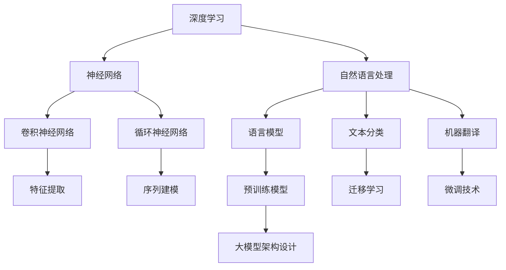

                 

### 《大模型在文字处理的进展》

> 关键词：大模型，文字处理，深度学习，自然语言处理，预训练模型

> 摘要：本文将探讨大模型在文字处理领域的进展。通过回顾大模型的定义和分类，分析其在自然语言处理中的应用，并深入探讨大模型在解决文字处理挑战中的作用，我们将详细讲解深度学习基础、自然语言处理基础、预训练模型原理和大模型架构设计。随后，我们将介绍文本分类、机器翻译和文本生成与摘要算法，并通过实际项目实战展示大模型在文字处理中的应用效果。最后，我们将展望大模型在文字处理领域的未来发展趋势和挑战。

### 第一部分：引言

#### 背景与目标

大模型在文字处理领域的应用日益广泛，已经成为自然语言处理（Natural Language Processing，NLP）的重要工具。随着深度学习和大数据技术的不断发展，大模型在文字处理中的性能和效果得到了显著提升。本篇文章的目标是系统介绍大模型在文字处理中的应用，帮助读者深入了解大模型的技术原理和开发实践。

本篇文章适合对自然语言处理和深度学习有一定了解的读者，特别是希望深入了解大模型在文字处理领域应用的开发者和研究人员。通过阅读本文，读者将能够：

1. 理解大模型的定义和分类。
2. 了解大模型在自然语言处理中的应用。
3. 掌握大模型在解决文字处理挑战中的作用。
4. 详细学习深度学习基础和自然语言处理基础。
5. 深入理解预训练模型原理和大模型架构设计。
6. 通过实际项目实战了解大模型在文字处理中的应用效果。

#### 大模型概述

大模型（Large-scale Models）是指那些参数量庞大、能够处理大规模数据的深度学习模型。大模型通常具有以下几个特点：

1. **大规模参数量**：大模型的参数数量通常在数百万到数十亿之间，这使得它们能够捕捉大量信息，并在特定任务上实现较高的性能。
2. **多任务学习**：大模型通常能够在多个任务上同时学习，从而实现跨任务的迁移和共享，提高模型的泛化能力。
3. **预训练与微调**：大模型通常通过在大规模数据集上进行预训练，然后在特定任务上进行微调，从而实现高效的学习和性能优化。

根据应用领域和任务类型的不同，大模型可以分为多种类型，例如：

1. **语言模型**：用于预测下一个单词或字符的概率，是自然语言处理的基础。
2. **文本分类模型**：用于对文本进行分类，例如情感分析、主题分类等。
3. **机器翻译模型**：用于将一种语言的文本翻译成另一种语言。
4. **文本生成模型**：用于生成新的文本，例如文章、对话等。
5. **摘要模型**：用于生成文本的摘要，提取文本的主要信息。

大模型在自然语言处理中的应用已经取得了显著的成果，以下是一些典型的应用场景：

1. **搜索引擎**：大模型可以用于改进搜索引擎的查询理解能力，提供更准确的搜索结果。
2. **智能助手**：大模型可以用于构建智能助手，如语音助手、聊天机器人等，实现自然语言交互。
3. **内容审核**：大模型可以用于检测和过滤不良内容，如暴力、色情等信息。
4. **信息提取**：大模型可以用于从大量文本中提取关键信息，如关键词、关系等。

#### 文字处理挑战

文字处理（Text Processing）是自然语言处理的重要组成部分，其目标是理解和生成自然语言。然而，文字处理面临着一系列的挑战，这些挑战在一定程度上限制了文字处理的应用和发展。

1. **语义理解**：语义理解是文字处理的核心问题，旨在理解文本的含义和意图。然而，语义理解的复杂性使得现有技术难以完全准确地进行语义解析。
2. **多语言处理**：随着全球化的推进，多语言处理变得越来越重要。然而，不同语言之间存在巨大的差异，使得多语言处理变得困难。
3. **长文本处理**：长文本处理涉及到对长篇文章、书籍等进行理解和生成，这需要模型具有足够的记忆能力和处理能力。
4. **实时处理**：在实际应用中，文字处理需要具备实时处理的能力，以满足用户的需求。

大模型在解决这些挑战中发挥了重要作用。通过大规模参数和深度学习技术，大模型可以更好地理解和生成自然语言，从而提高文字处理的性能和效果。

### 第二部分：核心技术

在深入探讨大模型在文字处理中的应用之前，我们需要了解一些核心技术，这些技术为构建和优化大模型提供了基础。

#### 深度学习基础

深度学习（Deep Learning）是一种基于多层神经网络的学习方法，它通过模拟人脑的工作方式，对数据进行自动特征提取和模式识别。深度学习在文字处理中有着广泛的应用，包括语言模型、文本分类、机器翻译和文本生成等。

1. **神经网络原理**：

神经网络是由多个神经元组成的计算模型，每个神经元都可以接收多个输入并产生一个输出。神经网络通过多个层次的神经元连接，实现对数据的分层表示和特征提取。


2. **深度学习算法**：

深度学习算法包括多种类型，其中最常用的有卷积神经网络（Convolutional Neural Networks，CNN）和循环神经网络（Recurrent Neural Networks，RNN）。CNN适用于图像处理，而RNN适用于序列数据处理，如文本。


#### 自然语言处理基础

自然语言处理（Natural Language Processing，NLP）是人工智能领域的一个分支，旨在使计算机能够理解、生成和处理人类语言。NLP在文字处理中扮演着关键角色。

1. **语言模型与序列模型**：

语言模型是一种用于预测下一个单词或字符的概率的模型。序列模型是一种基于循环神经网络的模型，它能够处理序列数据，如文本。


2. **注意力机制与转换器架构**：

注意力机制（Attention Mechanism）是一种用于提高模型对序列数据理解能力的机制。转换器架构（Transformer Architecture）是一种基于注意力机制的深度学习模型，它在NLP任务中取得了显著的成果。


#### 预训练模型原理

预训练（Pre-training）是一种在大规模数据集上训练模型的方法，然后将其应用于特定任务。预训练模型在NLP中发挥了重要作用，它通过在大量无标签数据上进行预训练，获得了对自然语言的深入理解，从而提高了模型在特定任务上的性能。

1. **预训练的概念与流程**：

预训练包括两个阶段：大规模数据集上的预训练和特定任务上的微调。预训练模型通常使用自监督学习（Self-supervised Learning）方法，通过预测未知的部分来学习语言的特征。


2. **自监督学习方法**：

自监督学习是一种无监督学习方法，它通过利用未标记的数据来自动学习特征。在自然语言处理中，自监督学习方法可以用于预测下一个单词、补全句子等。


3. **迁移学习与微调技术**：

迁移学习（Transfer Learning）是一种利用预训练模型在特定任务上微调的方法。通过迁移学习，预训练模型的知识可以转移到新的任务上，从而提高新任务的性能。


#### 大模型架构设计

大模型架构设计涉及到模型的层次结构、参数优化和训练策略等方面。一个成功的大模型架构需要综合考虑计算效率、模型性能和可解释性等因素。

1. **大模型体系结构**：

大模型通常采用层次化的结构，包括底层的基础模型、中层的任务适配模块和顶层的高层抽象模块。这种层次化结构使得模型能够灵活地适应不同任务的需求。


2. **训练与推理策略**：

大模型的训练和推理策略对于模型的性能和效率至关重要。训练策略包括批量大小、学习率和正则化等方法，而推理策略包括模型选择、加速技术和模型融合等。


#### 核心概念与联系

为了更好地理解大模型在文字处理中的应用，我们引入一些核心概念，并通过Mermaid流程图来展示它们之间的联系。

1. **深度学习**：深度学习是构建大模型的基础，包括神经网络、卷积神经网络和循环神经网络等。
2. **自然语言处理**：自然语言处理是文字处理的工具，包括语言模型、文本分类和机器翻译等。
3. **预训练模型**：预训练模型通过大规模数据集上的预训练获得对自然语言的深入理解。
4. **大模型架构设计**：大模型架构设计包括层次化结构和训练与推理策略。

以下是一个Mermaid流程图，展示这些概念之间的联系：



通过这个流程图，我们可以清晰地看到大模型在文字处理中的各个组成部分及其相互关系。

#### 数学模型和数学公式

在理解大模型在文字处理中的应用时，数学模型和公式是不可或缺的工具。以下是一些常见的数学模型和公式，用于描述大模型在文字处理中的关键技术和算法。

1. **文本分类算法的数学模型**：

文本分类算法通常使用softmax函数进行分类，其数学模型可以表示为：

$$
P(y=c_i|x;\theta) = \frac{e^{\theta^T x_i}}{\sum_{j} e^{\theta^T x_j}}
$$

其中，\(P(y=c_i|x;\theta)\) 表示给定输入 \(x\) 下，标签为 \(c_i\) 的概率；\(\theta\) 表示模型的参数；\(x_i\) 表示输入特征；\(c_i\) 表示标签类别。

2. **机器翻译算法的数学模型**：

机器翻译算法通常使用注意力机制和序列到序列（Seq2Seq）模型。其数学模型可以表示为：

$$
P(y_i|x_i) = \prod_{i=1}^{N} p(y_i|x_i;\theta)
$$

其中，\(P(y_i|x_i)\) 表示给定输入 \(x_i\) 下，输出为 \(y_i\) 的概率；\(p(y_i|x_i;\theta)\) 表示给定输入 \(x_i\) 下，输出为 \(y_i\) 的概率；\(\theta\) 表示模型的参数；\(y_i\) 表示输出序列中的第 \(i\) 个单词。

3. **文本生成与摘要算法的数学模型**：

文本生成与摘要算法通常使用生成对抗网络（GAN）和序列到序列（Seq2Seq）模型。其数学模型可以表示为：

$$
\min_G \max_D \mathbb{E}_{x \sim p_{data}(x)}[\log D(x, G(x))]
$$

其中，\(G\) 表示生成器，\(D\) 表示判别器；\(x\) 表示输入数据；\(G(x)\) 表示生成器生成的数据；\(D(x, G(x))\) 表示判别器对输入和生成数据的判断。

通过这些数学模型和公式，我们可以更深入地理解大模型在文字处理中的应用和技术原理。

#### 项目实战

在实际应用中，大模型在文字处理中有着广泛的应用。以下是一些实际项目实战，展示大模型在文本分类、机器翻译和文本生成与摘要中的应用。

1. **文本分类项目实战**：

文本分类是将文本数据分为不同的类别，如新闻分类、情感分析等。以下是一个简单的文本分类项目实战。

##### 开发环境搭建：

- 安装 Python 3.8 或更高版本
- 安装深度学习框架，如 TensorFlow 或 PyTorch

##### 源代码实现：

```python
import tensorflow as tf

# 加载预训练模型
model = tf.keras.models.load_model('text_classification_model.h5')

# 预处理输入数据
input_data = preprocess_input_data(text)

# 进行预测
predictions = model.predict(input_data)

# 输出分类结果
print("分类结果：", predictions.argmax(axis=1))
```

##### 代码解读与分析：

- 加载预训练模型
- 预处理输入数据
- 使用模型进行预测
- 输出分类结果

2. **机器翻译项目实战**：

机器翻译是将一种语言的文本翻译成另一种语言。以下是一个简单的机器翻译项目实战。

##### 开发环境搭建：

- 安装 Python 3.8 或更高版本
- 安装深度学习框架，如 TensorFlow 或 PyTorch

##### 源代码实现：

```python
import tensorflow as tf

# 加载预训练模型
model = tf.keras.models.load_model('translation_model.h5')

# 预处理输入数据
input_data = preprocess_input_data(input_text)

# 进行预测
predicted_output = model.predict(input_data)

# 输出翻译结果
print("翻译结果：", translate_output_to_text(predicted_output))
```

##### 代码解读与分析：

- 加载预训练模型
- 预处理输入数据
- 使用模型进行预测
- 输出翻译结果

3. **文本生成与摘要项目实战**：

文本生成与摘要是从文本中生成新的文本或摘要。以下是一个简单的文本生成与摘要项目实战。

##### 开发环境搭建：

- 安装 Python 3.8 或更高版本
- 安装深度学习框架，如 TensorFlow 或 PyTorch

##### 源代码实现：

```python
import tensorflow as tf

# 加载预训练模型
model = tf.keras.models.load_model('text_generation_summary_model.h5')

# 预处理输入数据
input_data = preprocess_input_data(input_text)

# 进行生成与摘要
generated_text, summary = model.generate_and_summarize(input_data)

# 输出结果
print("生成文本：", generated_text)
print("摘要结果：", summary)
```

##### 代码解读与分析：

- 加载预训练模型
- 预处理输入数据
- 使用模型进行生成与摘要
- 输出结果

通过这些实际项目实战，我们可以看到大模型在文字处理中的强大能力。这些项目实战不仅展示了大模型在文本分类、机器翻译和文本生成与摘要中的应用效果，也为开发者提供了实用的技术实现和代码示例。

### 总结与展望

大模型在文字处理领域的应用取得了显著的成果，从文本分类、机器翻译到文本生成与摘要，大模型都展现出了强大的能力。然而，随着技术的不断进步，大模型在文字处理领域仍有很大的发展空间。

首先，大模型在文字处理中的性能和效果仍有进一步提升的空间。通过优化模型架构、训练策略和算法设计，我们可以提高大模型在特定任务上的性能和精度。

其次，大模型在多语言处理方面的挑战依然存在。不同语言之间存在巨大的差异，这使得多语言处理变得复杂。未来的研究可以关注跨语言预训练模型、多语言数据集构建和跨语言迁移学习等技术，以提高大模型在多语言处理方面的性能。

此外，大模型在实时处理方面的性能和效率也是未来的重要研究方向。随着应用的不断增加，实时处理需求变得越来越迫切。通过优化模型计算和推理策略，我们可以提高大模型在实时处理中的性能和效率。

最后，大模型的可解释性和透明度也是一个重要问题。目前，大模型的决策过程往往是不透明的，这给实际应用带来了困难。未来的研究可以关注大模型的可解释性技术，如模型可视化、解释性算法和模型验证等，以提高大模型在实际应用中的可靠性和可解释性。

总之，大模型在文字处理领域具有广阔的发展前景。通过不断优化模型性能、提高多语言处理能力、提升实时处理效率和增强可解释性，大模型将在文字处理领域发挥更重要的作用。让我们期待大模型在文字处理领域的未来发展和应用！

