                 

# 文章标题：大模型在智慧城市建设中的应用场景

> 关键词：智慧城市、大模型、应用场景、技术挑战、解决方案

> 摘要：本文将探讨大模型在智慧城市建设中的应用场景。首先，我们概述智慧城市的发展背景与趋势，然后介绍大模型的基本概念与架构。接着，深入分析大模型在智慧城市中的多种应用场景，包括城市规划与管理、交通管理、能源管理、环境监测、安全监控与应急管理、以及公共服务等方面。最后，我们讨论大模型在智慧城市建设中的技术挑战与解决方案，并分享一些实际案例与相关工具资源。

## 目录大纲

### 《大模型在智慧城市建设中的应用场景》

### 第一部分：智慧城市建设概述

#### 第1章：智慧城市的发展背景与趋势
1.1 智慧城市的发展背景
1.2 智慧城市的发展趋势
1.3 大模型在智慧城市建设中的地位

#### 第2章：大模型的基本概念与架构
2.1 大模型的基本概念
2.2 大模型的架构
2.3 大模型的核心算法原理

#### 第3章：大模型在智慧城市中的应用场景
3.1 城市规划与管理
3.2 城市交通管理
3.3 城市能源管理
3.4 城市环境监测
3.5 城市安全监控
3.6 城市公共服务

### 第二部分：大模型在智慧城市中的应用实战

#### 第4章：大模型在城市规划与管理中的应用
4.1 大模型在城市土地资源管理中的应用
4.2 大模型在城市人口管理中的应用
4.3 大模型在城市基础设施建设中的应用

#### 第5章：大模型在交通管理中的应用
5.1 大模型在交通流量预测中的应用
5.2 大模型在交通信号控制中的应用
5.3 大模型在停车管理中的应用

#### 第6章：大模型在能源管理中的应用
6.1 大模型在能源需求预测中的应用
6.2 大模型在能源优化配置中的应用
6.3 大模型在能源环境监测中的应用

#### 第7章：大模型在城市环境监测中的应用
7.1 大模型在城市空气质量监测中的应用
7.2 大模型在水质监测中的应用
7.3 大模型在噪声监测中的应用

#### 第8章：大模型在安全监控与应急管理中的应用
8.1 大模型在安全监控中的应用
8.2 大模型在应急管理中的应用
8.3 大模型在公共安全预测中的应用

#### 第9章：大模型在公共服务中的应用
9.1 大模型在教育服务中的应用
9.2 大模型在医疗服务中的应用
9.3 大模型在社会保障服务中的应用

### 第三部分：大模型在智慧城市中的技术挑战与解决方案

#### 第10章：大模型在智慧城市建设中的技术挑战
10.1 大模型计算资源需求
10.2 大模型数据隐私与安全问题
10.3 大模型在跨领域协同应用中的挑战

#### 第11章：大模型在智慧城市中的解决方案
11.1 大模型在智慧城市建设中的应用策略
11.2 大模型与物联网的结合应用
11.3 大模型在智慧城市中的可持续发展

### 附录

#### 附录A：大模型在智慧城市建设中的应用案例
A.1 案例一：某智慧城市建设中的应用案例
A.2 案例二：某城市交通管理中的应用案例
A.3 案例三：某城市能源管理中的应用案例

#### 附录B：大模型相关工具与资源
B.1 大模型开发工具简介
B.2 大模型学习资源推荐
B.3 大模型相关社区与论坛介绍

---

在接下来的文章中，我们将逐一探讨智慧城市建设中的各个方面，并详细分析大模型在这些领域中的应用。我们希望通过这篇文章，能够帮助读者更好地理解大模型在智慧城市建设中的价值与潜力。让我们开始这段探索之旅吧！### 第一部分：智慧城市建设概述

#### 第1章：智慧城市的发展背景与趋势

智慧城市是指利用信息技术，特别是大数据、物联网、云计算、人工智能等先进技术，对城市资源进行高效管理和优化配置，从而实现城市可持续发展、提高城市居民生活质量和城市治理水平的新型城市形态。智慧城市建设是信息化时代城市发展的必然趋势，其核心理念是通过数据的智能处理，推动城市智能化转型。

#### 1.1 智慧城市的发展背景

1. **城市化进程加速**：全球范围内城市化进程不断加快，城市人口比重不断增加，城市面临着资源紧张、环境污染、交通拥堵等挑战。
2. **信息技术的飞速发展**：随着互联网、物联网、大数据、人工智能等技术的成熟，城市的数据采集和处理能力大幅提升，为智慧城市建设提供了技术支撑。
3. **政策推动**：各国政府纷纷出台政策，推动智慧城市建设。例如，中国提出了“新型城镇化”战略，欧盟制定了“智能城市”行动计划。

#### 1.2 智慧城市的发展趋势

1. **数据驱动**：智慧城市建设将更加依赖大数据的采集、存储、处理和分析，实现数据驱动决策。
2. **智能化服务**：通过人工智能技术，提供个性化、智能化的城市服务，提高居民生活质量。
3. **绿色城市**：利用智能技术提高能源利用效率，减少碳排放，建设绿色城市。
4. **治理现代化**：利用信息技术提高城市治理效率，实现精准治理。
5. **可持续发展**：注重城市长远发展，实现经济、社会、环境协调发展。

#### 1.3 大模型在智慧城市建设中的地位

大模型在智慧城市建设中具有举足轻重的地位。首先，大模型能够高效处理海量数据，为城市各领域提供实时、精准的分析结果。例如，在交通管理领域，大模型可以分析实时交通流量数据，优化交通信号控制，减少拥堵。在环境监测领域，大模型可以分析空气质量、水质等数据，预测环境变化趋势，提供治理建议。

其次，大模型具备强大的预测能力，可以提前预测城市未来发展趋势，为城市规划提供科学依据。例如，在人口管理领域，大模型可以通过分析历史人口数据，预测未来人口流动趋势，帮助政府制定合理的人口政策。

最后，大模型在智慧城市中还具有强大的协同能力。智慧城市涉及多个领域，如城市规划、交通、能源、环境等，大模型可以通过跨领域数据融合和分析，实现各领域间的协同治理，提高城市整体运营效率。

综上所述，大模型在智慧城市建设中发挥着重要作用，是智慧城市发展的关键技术支撑。接下来，我们将深入探讨大模型的基本概念与架构，为后续分析大模型在智慧城市中的应用场景奠定基础。### 第2章：大模型的基本概念与架构

#### 2.1 大模型的基本概念

大模型，顾名思义，是指具有大规模参数的机器学习模型。这些模型通常包含数百万甚至数十亿个参数，能够处理和分析海量数据。大模型在人工智能领域的研究和应用取得了显著成果，主要得益于深度学习技术的发展。深度学习是一种基于人工神经网络的学习方法，通过多层神经网络对数据进行特征提取和学习，从而实现复杂的任务。

大模型的特点主要表现在以下几个方面：

1. **大规模参数**：大模型具有数百万甚至数十亿个参数，这使它们能够捕捉数据中的复杂模式。
2. **强大学习能力**：大模型能够从大量数据中学习，提高模型的泛化能力。
3. **高效数据处理**：大模型利用并行计算和分布式计算技术，能够高效处理海量数据。
4. **跨领域应用**：大模型具有较强的通用性，可以应用于不同领域，如语音识别、图像识别、自然语言处理等。

#### 2.2 大模型的架构

大模型的架构通常包括以下几个关键组成部分：

1. **数据层**：数据层负责数据的采集、预处理和存储。在大模型中，数据质量至关重要，因此需要进行数据清洗、去重、归一化等预处理操作，确保数据的质量和一致性。
2. **特征层**：特征层负责将原始数据转换为适合模型训练的特征向量。这一过程通常涉及数据降维、特征提取等技术，如主成分分析（PCA）、自动编码器（Autoencoder）等。
3. **模型层**：模型层是核心部分，包含神经网络架构和参数。常见的神经网络架构有卷积神经网络（CNN）、循环神经网络（RNN）、变换器（Transformer）等。神经网络中的参数通过梯度下降等优化算法进行更新，以最小化损失函数。
4. **优化层**：优化层负责模型训练过程中的参数优化。常用的优化算法包括随机梯度下降（SGD）、Adam优化器等。优化层的目的是提高模型的收敛速度和训练效果。
5. **输出层**：输出层负责模型预测或分类的结果输出。在分类任务中，输出层通常包含多个神经元，每个神经元对应一个类别，通过计算输出神经元的激活值，可以得到模型的预测结果。

#### 2.3 大模型的核心算法原理

大模型的核心算法主要包括以下几种：

1. **深度学习算法**：深度学习算法是构建大模型的基础，包括多层感知机（MLP）、卷积神经网络（CNN）、循环神经网络（RNN）等。深度学习算法通过多层神经网络对数据进行特征提取和学习，实现复杂的任务。
2. **优化算法**：优化算法用于调整模型参数，以最小化损失函数。常用的优化算法包括随机梯度下降（SGD）、Adam优化器等。优化算法的选择和参数设置对模型的训练效果具有重要影响。
3. **正则化方法**：正则化方法用于防止模型过拟合，提高模型的泛化能力。常见的正则化方法包括L1正则化、L2正则化、Dropout等。
4. **激活函数**：激活函数用于引入非线性因素，使神经网络能够处理复杂的非线性问题。常见的激活函数包括Sigmoid、ReLU、Tanh等。

通过以上核心算法的协同作用，大模型能够高效处理和分析海量数据，实现复杂的任务。接下来，我们将探讨大模型在智慧城市中的多种应用场景，进一步了解大模型在智慧城市建设中的实际应用和价值。### 第3章：大模型在智慧城市中的应用场景

#### 3.1 城市规划与管理

智慧城市建设离不开科学合理的城市规划与管理。大模型在这一点上发挥着至关重要的作用。首先，大模型能够高效处理和分析城市土地资源数据，帮助城市规划者进行土地资源优化配置。通过分析历史数据、人口增长趋势、土地使用情况等因素，大模型可以预测未来城市发展的需求和趋势，为城市土地规划提供科学依据。

**核心概念与联系：**

在城市规划与管理中，大模型的应用涉及到以下几个核心概念：

1. **土地资源管理**：大模型可以处理和分析城市土地资源数据，如土地利用类型、土地价值、土地供需关系等。
2. **人口预测**：通过分析人口统计数据，大模型可以预测未来城市的人口增长趋势，为城市规划提供参考。
3. **城市规划模型**：大模型可以利用深度学习算法，建立城市规划模型，对城市规划方案进行评估和优化。

**架构流程图：**

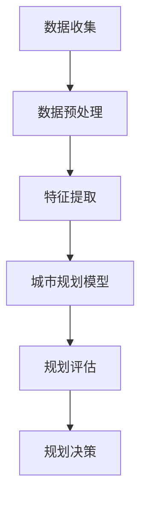

**核心算法原理讲解：**

1. **深度学习算法**：大模型利用深度学习算法，如卷积神经网络（CNN）和循环神经网络（RNN），对城市土地资源数据进行分析和特征提取。
2. **优化算法**：大模型采用优化算法，如随机梯度下降（SGD）和Adam优化器，对城市规划模型进行训练和优化。

**数学模型与公式：**

在城市规划中，常见的数学模型包括线性回归模型、决策树模型和支持向量机（SVM）等。例如，线性回归模型可以表示为：

$$
y = \beta_0 + \beta_1 \cdot x
$$

其中，$y$ 为规划结果，$x$ 为输入特征，$\beta_0$ 和 $\beta_1$ 为模型参数。

**举例说明：**

假设某城市需要规划一个新的住宅区，大模型可以根据历史人口数据、土地供需关系等因素，预测未来5年的住宅需求。通过深度学习算法，大模型可以建立土地资源管理和人口预测模型，为城市规划提供科学依据。

#### 3.2 城市交通管理

城市交通管理是智慧城市建设的重要组成部分，大模型在交通流量预测、交通信号控制和停车管理等方面具有广泛应用。通过分析实时交通数据和历史交通数据，大模型可以预测未来交通流量，优化交通信号控制策略，提高道路通行效率。

**核心概念与联系：**

在城市交通管理中，大模型的应用涉及到以下几个核心概念：

1. **交通流量预测**：大模型可以通过分析历史交通数据和实时交通数据，预测未来交通流量，为交通管理提供参考。
2. **交通信号控制**：大模型可以优化交通信号控制策略，减少交通拥堵，提高道路通行效率。
3. **停车管理**：大模型可以分析停车位供需情况，提供智能停车解决方案。

**架构流程图：**

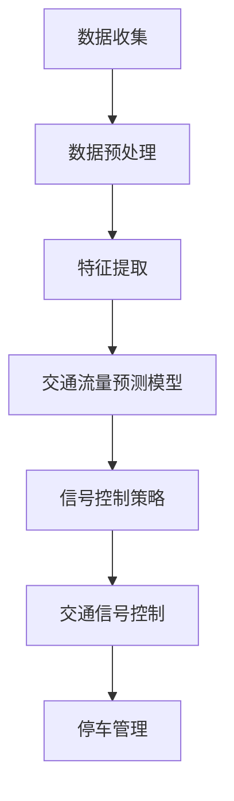

**核心算法原理讲解：**

1. **深度学习算法**：大模型利用深度学习算法，如卷积神经网络（CNN）和循环神经网络（RNN），对交通流量数据进行特征提取和预测。
2. **优化算法**：大模型采用优化算法，如随机梯度下降（SGD）和Adam优化器，对交通流量预测模型进行训练和优化。

**数学模型与公式：**

在交通流量预测中，常见的数学模型包括时间序列模型和回归模型。例如，时间序列模型可以表示为：

$$
y_t = \beta_0 + \beta_1 \cdot y_{t-1} + \epsilon_t
$$

其中，$y_t$ 为第 $t$ 时刻的交通流量，$\beta_0$ 和 $\beta_1$ 为模型参数，$\epsilon_t$ 为随机误差。

**举例说明：**

假设某城市需要优化交通信号控制策略，大模型可以根据实时交通流量数据和历史交通数据，预测未来一段时间内的交通流量，优化交通信号控制周期和绿信比，提高道路通行效率。

#### 3.3 城市能源管理

城市能源管理是智慧城市建设的重要方面，大模型在能源需求预测、能源优化配置和能源环境监测等方面具有广泛应用。通过分析历史能源数据和实时能源数据，大模型可以预测未来能源需求，优化能源配置，降低能源消耗，提高能源利用效率。

**核心概念与联系：**

在城市能源管理中，大模型的应用涉及到以下几个核心概念：

1. **能源需求预测**：大模型可以通过分析历史能源数据和实时能源数据，预测未来能源需求，为能源管理提供参考。
2. **能源优化配置**：大模型可以优化能源配置，降低能源消耗，提高能源利用效率。
3. **能源环境监测**：大模型可以监测能源环境数据，预测能源环境变化趋势，为能源管理提供决策支持。

**架构流程图：**

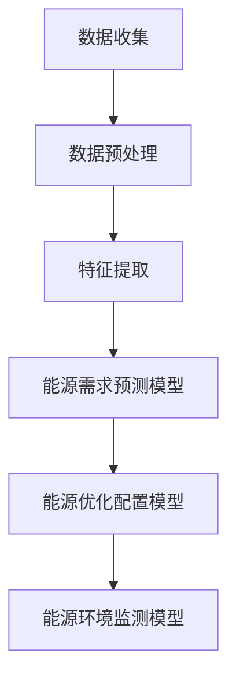

**核心算法原理讲解：**

1. **深度学习算法**：大模型利用深度学习算法，如卷积神经网络（CNN）和循环神经网络（RNN），对能源需求数据进行分析和预测。
2. **优化算法**：大模型采用优化算法，如随机梯度下降（SGD）和Adam优化器，对能源需求预测模型进行训练和优化。

**数学模型与公式：**

在能源需求预测中，常见的数学模型包括时间序列模型和回归模型。例如，时间序列模型可以表示为：

$$
y_t = \beta_0 + \beta_1 \cdot y_{t-1} + \epsilon_t
$$

其中，$y_t$ 为第 $t$ 时刻的能源需求，$\beta_0$ 和 $\beta_1$ 为模型参数，$\epsilon_t$ 为随机误差。

**举例说明：**

假设某城市需要优化能源配置，大模型可以根据实时能源数据和天气数据，预测未来一段时间内的能源需求，优化能源供应策略，降低能源消耗。

#### 3.4 城市环境监测

城市环境监测是智慧城市建设的重要组成部分，大模型在空气质量监测、水质监测和噪声监测等方面具有广泛应用。通过分析实时环境数据和历史环境数据，大模型可以监测环境质量，预测环境变化趋势，为城市环境管理提供决策支持。

**核心概念与联系：**

在城市环境监测中，大模型的应用涉及到以下几个核心概念：

1. **空气质量监测**：大模型可以通过分析实时空气质量数据，监测空气质量变化，预测污染事件。
2. **水质监测**：大模型可以分析实时水质数据，监测水质变化，预测水质污染事件。
3. **噪声监测**：大模型可以分析实时噪声数据，监测噪声污染情况，预测噪声变化趋势。

**架构流程图：**

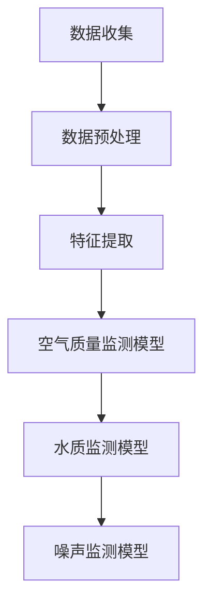

**核心算法原理讲解：**

1. **深度学习算法**：大模型利用深度学习算法，如卷积神经网络（CNN）和循环神经网络（RNN），对环境数据进行分析和预测。
2. **优化算法**：大模型采用优化算法，如随机梯度下降（SGD）和Adam优化器，对环境监测模型进行训练和优化。

**数学模型与公式：**

在空气质量监测中，常见的数学模型包括时间序列模型和回归模型。例如，时间序列模型可以表示为：

$$
y_t = \beta_0 + \beta_1 \cdot y_{t-1} + \epsilon_t
$$

其中，$y_t$ 为第 $t$ 时刻的空气质量指数（AQI），$\beta_0$ 和 $\beta_1$ 为模型参数，$\epsilon_t$ 为随机误差。

**举例说明：**

假设某城市需要监测空气质量，大模型可以根据实时空气质量数据和天气数据，预测未来一段时间内的空气质量变化，为空气质量管理提供决策支持。

#### 3.5 城市安全监控

城市安全监控是智慧城市建设的重要保障，大模型在安全监控、应急管理、公共安全预测等方面具有广泛应用。通过分析实时监控数据和历史监控数据，大模型可以监测城市安全状况，预测安全隐患，为城市安全管理和应急响应提供支持。

**核心概念与联系：**

在城市安全监控中，大模型的应用涉及到以下几个核心概念：

1. **安全监控**：大模型可以通过分析实时监控数据，监测城市安全状况，预测安全隐患。
2. **应急管理**：大模型可以分析历史应急事件数据，预测应急事件的发生概率，为应急响应提供参考。
3. **公共安全预测**：大模型可以分析社会治安数据、自然灾害数据等，预测公共安全形势，为公共安全管理提供支持。

**架构流程图：**

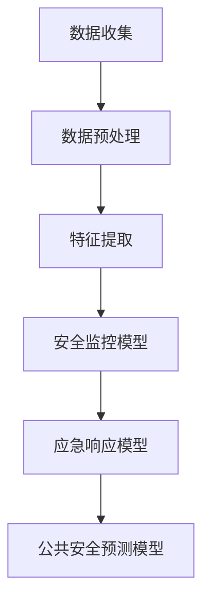

**核心算法原理讲解：**

1. **深度学习算法**：大模型利用深度学习算法，如卷积神经网络（CNN）和循环神经网络（RNN），对监控数据进行分析和预测。
2. **优化算法**：大模型采用优化算法，如随机梯度下降（SGD）和Adam优化器，对安全监控模型进行训练和优化。

**数学模型与公式：**

在公共安全预测中，常见的数学模型包括时间序列模型和回归模型。例如，时间序列模型可以表示为：

$$
y_t = \beta_0 + \beta_1 \cdot y_{t-1} + \epsilon_t
$$

其中，$y_t$ 为第 $t$ 时刻的公共安全指数，$\beta_0$ 和 $\beta_1$ 为模型参数，$\epsilon_t$ 为随机误差。

**举例说明：**

假设某城市需要预测公共安全形势，大模型可以根据实时监控数据和社会治安数据，预测未来一段时间内的公共安全状况，为公共安全管理提供决策支持。

#### 3.6 城市公共服务

城市公共服务是智慧城市建设的重要内容，大模型在教育和医疗服务、社会保障服务等方面具有广泛应用。通过分析居民需求和公共服务数据，大模型可以优化公共服务资源配置，提高公共服务质量。

**核心概念与联系：**

在城市公共服务中，大模型的应用涉及到以下几个核心概念：

1. **教育和医疗服务**：大模型可以通过分析教育资源和医疗资源分布情况，优化教育和医疗服务资源配置。
2. **社会保障服务**：大模型可以分析社会保障数据，优化社会保障服务资源配置，提高社会保障水平。
3. **居民需求预测**：大模型可以通过分析居民需求数据，预测居民需求趋势，为公共服务规划提供参考。

**架构流程图：**

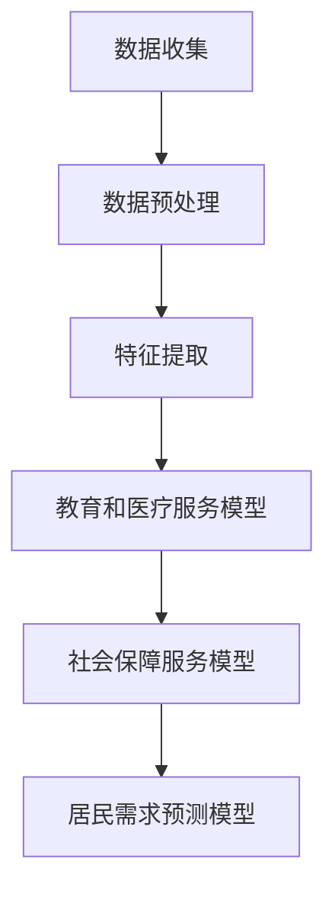

**核心算法原理讲解：**

1. **深度学习算法**：大模型利用深度学习算法，如卷积神经网络（CNN）和循环神经网络（RNN），对公共服务数据进行分析和预测。
2. **优化算法**：大模型采用优化算法，如随机梯度下降（SGD）和Adam优化器，对公共服务模型进行训练和优化。

**数学模型与公式：**

在居民需求预测中，常见的数学模型包括时间序列模型和回归模型。例如，时间序列模型可以表示为：

$$
y_t = \beta_0 + \beta_1 \cdot y_{t-1} + \epsilon_t
$$

其中，$y_t$ 为第 $t$ 时刻的居民需求，$\beta_0$ 和 $\beta_1$ 为模型参数，$\epsilon_t$ 为随机误差。

**举例说明：**

假设某城市需要优化教育和医疗服务资源配置，大模型可以根据居民需求数据和教育资源、医疗资源分布情况，预测未来一段时间内的教育和医疗服务需求，优化资源配置，提高公共服务质量。

综上所述，大模型在智慧城市的各个领域具有广泛的应用。通过高效的数据处理和分析，大模型为智慧城市建设提供了科学依据和决策支持，助力城市智能化转型。在接下来的章节中，我们将探讨大模型在智慧城市中的具体应用实战，进一步了解大模型在现实场景中的实际效果和价值。### 第二部分：大模型在智慧城市中的应用实战

#### 第4章：大模型在城市规划与管理中的应用

大模型在城市规划与管理中的应用主要体现在土地资源管理、人口管理和基础设施建设等方面。通过高效的数据处理和分析能力，大模型能够为城市规划者提供科学的决策依据，优化资源配置，提高城市规划的科学性和效率。

#### 4.1 大模型在城市土地资源管理中的应用

城市土地资源管理是城市规划的关键环节。大模型通过分析土地资源数据，如土地利用类型、土地价值、供需关系等，可以预测土地资源的需求和变化趋势，为土地资源规划提供支持。

**核心概念与联系：**

在城市土地资源管理中，大模型的应用涉及到以下几个核心概念：

1. **土地资源数据**：包括土地利用类型、土地价值、供需关系等数据。
2. **城市规划模型**：大模型可以利用深度学习算法，建立城市规划模型，对土地资源进行优化配置。
3. **土地价值评估**：大模型可以通过分析土地交易数据、地理位置等因素，评估土地价值。

**架构流程图：**

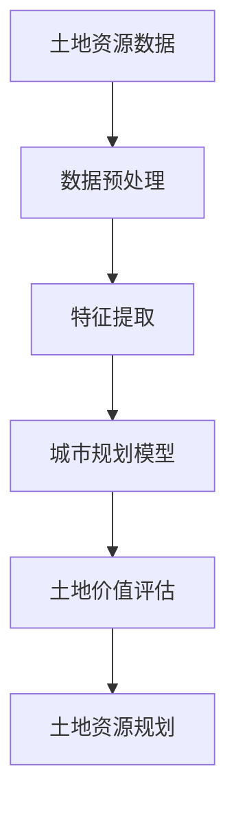

**核心算法原理讲解：**

1. **深度学习算法**：大模型采用深度学习算法，如卷积神经网络（CNN）和循环神经网络（RNN），对土地资源数据进行分析和特征提取。
2. **优化算法**：大模型采用优化算法，如随机梯度下降（SGD）和Adam优化器，对城市规划模型进行训练和优化。

**数学模型与公式：**

在城市规划中，常见的数学模型包括线性回归模型和决策树模型。例如，线性回归模型可以表示为：

$$
y = \beta_0 + \beta_1 \cdot x
$$

其中，$y$ 为规划结果，$x$ 为输入特征，$\beta_0$ 和 $\beta_1$ 为模型参数。

**举例说明：**

假设某城市规划新住宅区，大模型可以根据土地资源数据，如土地利用类型、土地价值等，预测未来5年的住宅用地需求。通过深度学习算法，大模型可以建立土地资源管理和土地价值评估模型，为土地资源规划提供科学依据。

#### 4.2 大模型在城市人口管理中的应用

城市人口管理是城市规划的重要方面。大模型可以通过分析人口数据，如人口增长率、人口流动趋势、人口分布等，预测未来人口变化，为城市人口规划提供支持。

**核心概念与联系：**

在城市人口管理中，大模型的应用涉及到以下几个核心概念：

1. **人口数据**：包括人口增长率、人口流动趋势、人口分布等数据。
2. **人口预测模型**：大模型可以利用深度学习算法，建立人口预测模型，预测未来人口变化。
3. **人口分布优化**：大模型可以通过分析人口分布数据，优化人口分布，提高城市居住舒适度。

**架构流程图：**

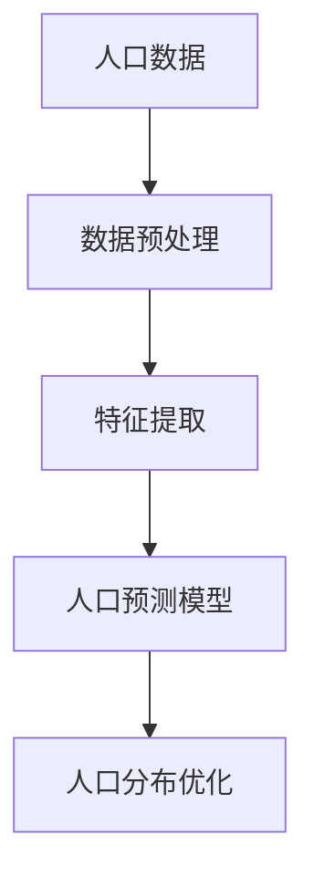

**核心算法原理讲解：**

1. **深度学习算法**：大模型采用深度学习算法，如卷积神经网络（CNN）和循环神经网络（RNN），对人口数据进行分析和特征提取。
2. **优化算法**：大模型采用优化算法，如随机梯度下降（SGD）和Adam优化器，对人口预测模型进行训练和优化。

**数学模型与公式：**

在人口预测中，常见的时间序列模型可以表示为：

$$
y_t = \beta_0 + \beta_1 \cdot y_{t-1} + \epsilon_t
$$

其中，$y_t$ 为第 $t$ 时刻的人口数量，$\beta_0$ 和 $\beta_1$ 为模型参数，$\epsilon_t$ 为随机误差。

**举例说明：**

假设某城市需要预测未来5年的人口增长率，大模型可以根据历史人口数据，建立人口预测模型。通过深度学习算法，大模型可以分析人口流动趋势，预测未来人口变化，为城市人口规划提供科学依据。

#### 4.3 大模型在城市基础设施建设中的应用

城市基础设施建设是智慧城市建设的基础。大模型可以通过分析基础设施数据，如交通设施、能源设施、公共服务设施等，预测基础设施需求，优化基础设施布局。

**核心概念与联系：**

在城市基础设施建设中，大模型的应用涉及到以下几个核心概念：

1. **基础设施数据**：包括交通设施、能源设施、公共服务设施等数据。
2. **基础设施预测模型**：大模型可以利用深度学习算法，建立基础设施预测模型，预测基础设施需求。
3. **基础设施布局优化**：大模型可以通过分析基础设施数据，优化基础设施布局，提高基础设施利用率。

**架构流程图：**

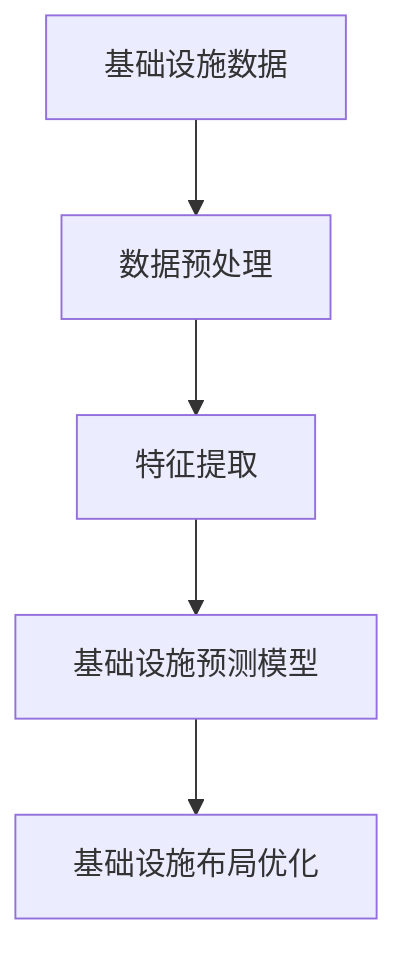

**核心算法原理讲解：**

1. **深度学习算法**：大模型采用深度学习算法，如卷积神经网络（CNN）和循环神经网络（RNN），对基础设施数据进行分析和特征提取。
2. **优化算法**：大模型采用优化算法，如随机梯度下降（SGD）和Adam优化器，对基础设施预测模型进行训练和优化。

**数学模型与公式：**

在基础设施预测中，常见的时间序列模型可以表示为：

$$
y_t = \beta_0 + \beta_1 \cdot y_{t-1} + \epsilon_t
$$

其中，$y_t$ 为第 $t$ 时刻的基础设施需求量，$\beta_0$ 和 $\beta_1$ 为模型参数，$\epsilon_t$ 为随机误差。

**举例说明：**

假设某城市需要预测未来5年的交通设施需求，大模型可以根据历史交通数据，建立交通设施预测模型。通过深度学习算法，大模型可以分析交通流量变化趋势，预测未来交通设施需求，为交通设施布局优化提供科学依据。

综上所述，大模型在城市规划与管理中的应用主要体现在土地资源管理、人口管理和基础设施建设等方面。通过高效的数据处理和分析能力，大模型为城市规划者提供了科学的决策依据，优化了资源配置，提高了城市规划的科学性和效率。在接下来的章节中，我们将继续探讨大模型在智慧城市其他领域的应用，进一步了解大模型在智慧城市建设中的价值与潜力。### 第5章：大模型在交通管理中的应用

交通管理是智慧城市建设中的重要组成部分，其核心目标是提高交通效率，减少拥堵，提升市民出行体验。大模型在交通流量预测、交通信号控制和停车管理等方面具有显著的应用价值。

#### 5.1 大模型在交通流量预测中的应用

交通流量预测是交通管理的关键环节。通过分析历史交通数据、实时交通数据和影响因素，大模型可以预测未来一段时间内的交通流量，为交通管理和决策提供依据。

**核心概念与联系：**

在交通流量预测中，大模型的应用涉及到以下几个核心概念：

1. **历史交通数据**：包括过去几年的交通流量数据、节假日数据、交通事故数据等。
2. **实时交通数据**：包括当前时刻的交通流量、速度、占有率等数据。
3. **影响因素**：包括天气、节假日、特殊活动等因素。

**架构流程图：**

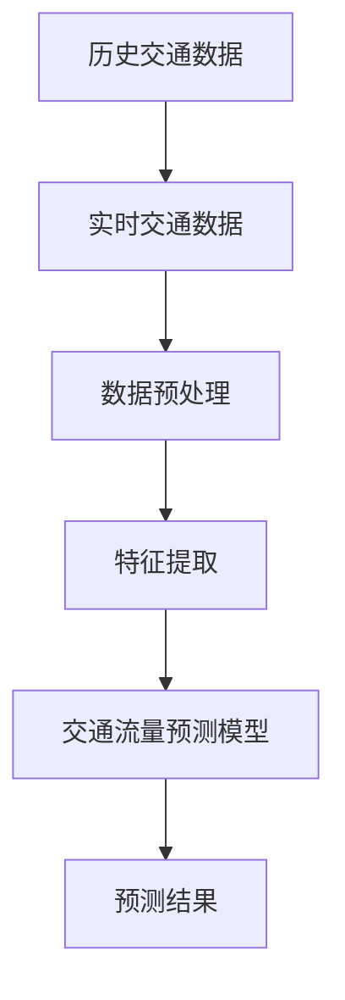

**核心算法原理讲解：**

1. **深度学习算法**：大模型采用深度学习算法，如卷积神经网络（CNN）和循环神经网络（RNN），对交通流量数据进行特征提取和预测。
2. **优化算法**：大模型采用优化算法，如随机梯度下降（SGD）和Adam优化器，对交通流量预测模型进行训练和优化。

**数学模型与公式：**

在交通流量预测中，常见的时间序列模型可以表示为：

$$
y_t = \beta_0 + \beta_1 \cdot y_{t-1} + \epsilon_t
$$

其中，$y_t$ 为第 $t$ 时刻的交通流量，$\beta_0$ 和 $\beta_1$ 为模型参数，$\epsilon_t$ 为随机误差。

**举例说明：**

假设某城市需要预测未来1小时内的交通流量，大模型可以根据过去1小时内的交通流量数据、实时交通数据和天气数据，建立交通流量预测模型。通过深度学习算法，大模型可以分析历史数据和实时数据，预测未来交通流量，为交通管理部门提供科学依据。

#### 5.2 大模型在交通信号控制中的应用

交通信号控制是交通管理的重要手段，通过优化交通信号控制策略，可以减少交通拥堵，提高道路通行效率。大模型可以通过分析交通流量数据、道路状况数据等，为交通信号控制提供实时调整策略。

**核心概念与联系：**

在交通信号控制中，大模型的应用涉及到以下几个核心概念：

1. **交通流量数据**：包括各路口的交通流量、速度、占有率等数据。
2. **道路状况数据**：包括道路状况、交通事故、施工等因素。
3. **信号控制策略**：大模型可以优化信号控制周期、绿信比等参数。

**架构流程图：**

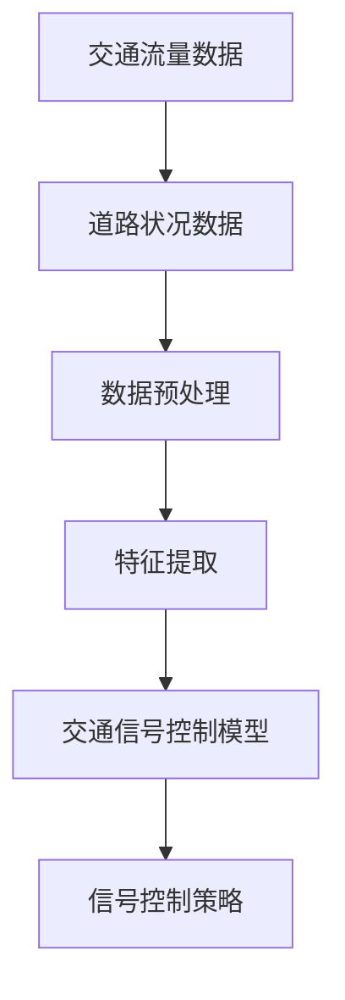

**核心算法原理讲解：**

1. **深度学习算法**：大模型采用深度学习算法，如卷积神经网络（CNN）和循环神经网络（RNN），对交通流量和道路状况数据进行分析和特征提取。
2. **优化算法**：大模型采用优化算法，如随机梯度下降（SGD）和Adam优化器，对交通信号控制模型进行训练和优化。

**数学模型与公式：**

在交通信号控制中，常见的数学模型包括时间序列模型和回归模型。例如，时间序列模型可以表示为：

$$
y_t = \beta_0 + \beta_1 \cdot y_{t-1} + \epsilon_t
$$

其中，$y_t$ 为第 $t$ 时刻的信号控制参数，$\beta_0$ 和 $\beta_1$ 为模型参数，$\epsilon_t$ 为随机误差。

**举例说明：**

假设某城市需要优化交通信号控制策略，大模型可以根据实时交通流量数据和道路状况数据，建立交通信号控制模型。通过深度学习算法，大模型可以分析交通流量变化，优化信号控制周期和绿信比，提高道路通行效率。

#### 5.3 大模型在停车管理中的应用

停车管理是城市交通管理的重要组成部分，通过优化停车资源配置，可以提高停车效率，缓解交通拥堵。大模型可以通过分析停车数据、交通流量数据等，预测停车需求，优化停车管理策略。

**核心概念与联系：**

在停车管理中，大模型的应用涉及到以下几个核心概念：

1. **停车数据**：包括停车场使用率、车辆出入记录等数据。
2. **交通流量数据**：包括各路口的交通流量、速度、占有率等数据。
3. **停车管理策略**：大模型可以预测停车需求，优化停车资源配置。

**架构流程图：**

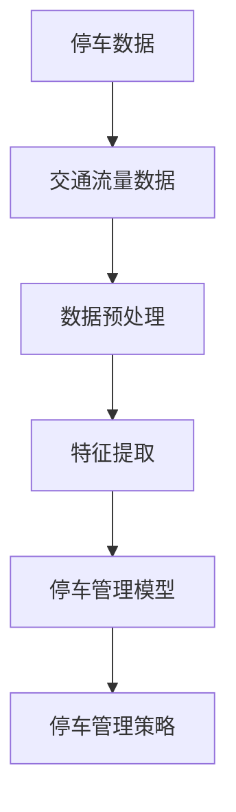

**核心算法原理讲解：**

1. **深度学习算法**：大模型采用深度学习算法，如卷积神经网络（CNN）和循环神经网络（RNN），对停车和交通流量数据进行分析和特征提取。
2. **优化算法**：大模型采用优化算法，如随机梯度下降（SGD）和Adam优化器，对停车管理模型进行训练和优化。

**数学模型与公式：**

在停车管理中，常见的数学模型包括时间序列模型和回归模型。例如，时间序列模型可以表示为：

$$
y_t = \beta_0 + \beta_1 \cdot y_{t-1} + \epsilon_t
$$

其中，$y_t$ 为第 $t$ 时刻的停车需求，$\beta_0$ 和 $\beta_1$ 为模型参数，$\epsilon_t$ 为随机误差。

**举例说明：**

假设某城市需要优化停车管理策略，大模型可以根据实时停车数据和交通流量数据，建立停车管理模型。通过深度学习算法，大模型可以分析停车需求变化，优化停车资源配置，提高停车效率。

综上所述，大模型在交通管理中的应用主要体现在交通流量预测、交通信号控制和停车管理等方面。通过高效的数据处理和分析能力，大模型为交通管理部门提供了科学的决策依据，提高了交通管理效率，为智慧城市建设做出了重要贡献。在接下来的章节中，我们将继续探讨大模型在智慧城市其他领域的应用，进一步了解大模型在智慧城市建设中的价值与潜力。### 第6章：大模型在能源管理中的应用

能源管理是智慧城市建设的重要组成部分，通过优化能源配置，提高能源利用效率，减少能源消耗，可以有效地推动城市可持续发展。大模型在能源需求预测、能源优化配置和能源环境监测等方面具有显著的应用价值。

#### 6.1 大模型在能源需求预测中的应用

能源需求预测是能源管理的关键环节，通过分析历史能源数据和实时能源数据，大模型可以预测未来一段时间内的能源需求，为能源调度和管理提供科学依据。

**核心概念与联系：**

在能源需求预测中，大模型的应用涉及到以下几个核心概念：

1. **历史能源数据**：包括过去几年的能源消耗数据、能源价格等数据。
2. **实时能源数据**：包括当前时刻的能源消耗、能源价格等数据。
3. **影响因素**：包括天气、节假日、工业生产等因素。

**架构流程图：**

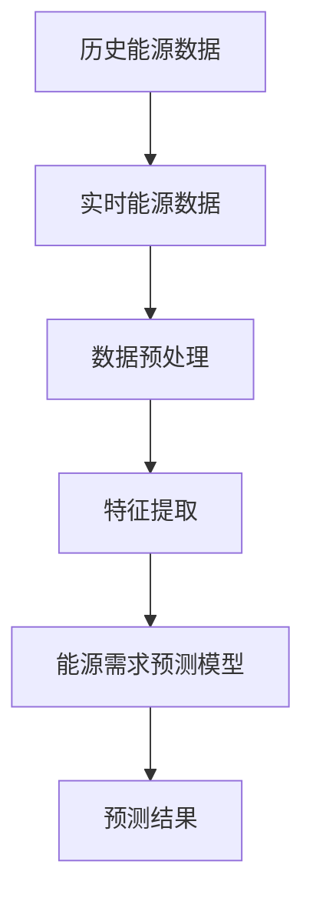

**核心算法原理讲解：**

1. **深度学习算法**：大模型采用深度学习算法，如卷积神经网络（CNN）和循环神经网络（RNN），对能源需求数据进行特征提取和预测。
2. **优化算法**：大模型采用优化算法，如随机梯度下降（SGD）和Adam优化器，对能源需求预测模型进行训练和优化。

**数学模型与公式：**

在能源需求预测中，常见的时间序列模型可以表示为：

$$
y_t = \beta_0 + \beta_1 \cdot y_{t-1} + \epsilon_t
$$

其中，$y_t$ 为第 $t$ 时刻的能源需求，$\beta_0$ 和 $\beta_1$ 为模型参数，$\epsilon_t$ 为随机误差。

**举例说明：**

假设某城市需要预测未来1小时的能源需求，大模型可以根据过去1小时的能源消耗数据和实时能源消耗数据，建立能源需求预测模型。通过深度学习算法，大模型可以分析历史数据和实时数据，预测未来能源需求，为能源调度提供科学依据。

#### 6.2 大模型在能源优化配置中的应用

能源优化配置是提高能源利用效率的重要手段，通过分析能源需求和供应情况，大模型可以优化能源配置，降低能源消耗。

**核心概念与联系：**

在能源优化配置中，大模型的应用涉及到以下几个核心概念：

1. **能源需求数据**：包括各类能源消耗数据。
2. **能源供应数据**：包括各类能源供应数据。
3. **优化策略**：大模型可以优化能源配置，提高能源利用效率。

**架构流程图：**

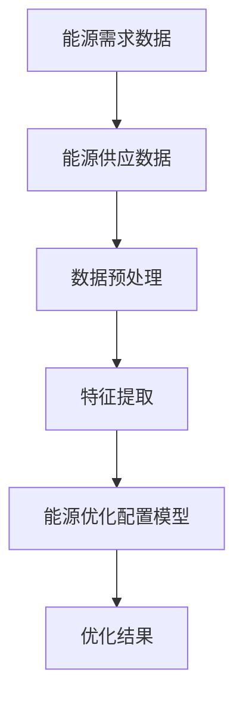

**核心算法原理讲解：**

1. **深度学习算法**：大模型采用深度学习算法，如卷积神经网络（CNN）和循环神经网络（RNN），对能源需求数据和供应数据进行分析和特征提取。
2. **优化算法**：大模型采用优化算法，如随机梯度下降（SGD）和Adam优化器，对能源优化配置模型进行训练和优化。

**数学模型与公式：**

在能源优化配置中，常见的优化模型可以表示为：

$$
\min \sum_{i=1}^{n} (c_i \cdot x_i)
$$

其中，$c_i$ 为第 $i$ 种能源的成本，$x_i$ 为第 $i$ 种能源的消耗量。

**举例说明：**

假设某城市需要优化能源配置，大模型可以根据实时能源需求数据和供应数据，建立能源优化配置模型。通过深度学习算法，大模型可以分析能源需求和供应情况，优化能源配置，降低能源消耗。

#### 6.3 大模型在能源环境监测中的应用

能源环境监测是保障能源安全、维护能源环境的重要手段。通过监测能源生产和消费过程中的环境数据，大模型可以预测能源环境变化趋势，为能源环境管理提供科学依据。

**核心概念与联系：**

在能源环境监测中，大模型的应用涉及到以下几个核心概念：

1. **环境数据**：包括空气质量、水质、噪声等环境数据。
2. **能源生产数据**：包括能源生产过程中的温度、压力等数据。
3. **能源消费数据**：包括能源消费过程中的排放物、能耗等数据。

**架构流程图：**

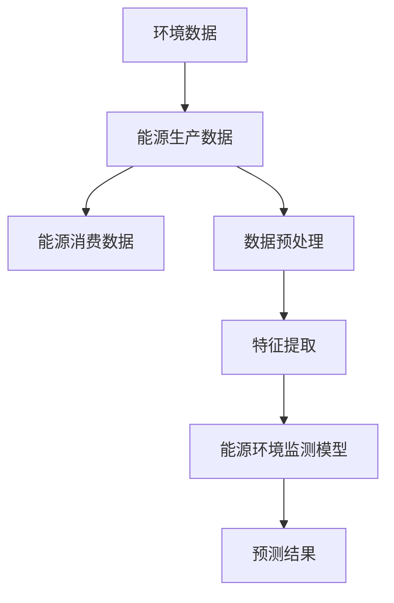

**核心算法原理讲解：**

1. **深度学习算法**：大模型采用深度学习算法，如卷积神经网络（CNN）和循环神经网络（RNN），对环境数据、能源生产数据和能源消费数据进行分析和特征提取。
2. **优化算法**：大模型采用优化算法，如随机梯度下降（SGD）和Adam优化器，对能源环境监测模型进行训练和优化。

**数学模型与公式：**

在能源环境监测中，常见的时间序列模型可以表示为：

$$
y_t = \beta_0 + \beta_1 \cdot y_{t-1} + \epsilon_t
$$

其中，$y_t$ 为第 $t$ 时刻的环境指标值，$\beta_0$ 和 $\beta_1$ 为模型参数，$\epsilon_t$ 为随机误差。

**举例说明：**

假设某城市需要监测能源环境，大模型可以根据实时环境数据和能源生产、消费数据，建立能源环境监测模型。通过深度学习算法，大模型可以分析环境变化趋势，预测能源环境变化，为能源环境管理提供科学依据。

综上所述，大模型在能源管理中的应用主要体现在能源需求预测、能源优化配置和能源环境监测等方面。通过高效的数据处理和分析能力，大模型为能源管理部门提供了科学的决策依据，提高了能源利用效率，推动了城市可持续发展。在接下来的章节中，我们将继续探讨大模型在智慧城市其他领域的应用，进一步了解大模型在智慧城市建设中的价值与潜力。### 第7章：大模型在城市环境监测中的应用

城市环境监测是智慧城市建设的重要组成部分，通过实时监测和预测环境质量，可以及时应对环境问题，保障城市居民的健康和生活质量。大模型在城市环境监测中的应用主要集中在空气质量监测、水质监测和噪声监测等方面。

#### 7.1 大模型在空气质量监测中的应用

空气质量监测是城市环境监测的核心之一。通过监测空气质量指数（AQI）和其他污染物浓度，大模型可以实时评估空气质量状况，预测污染事件的发生，为环保部门提供预警和决策支持。

**核心概念与联系：**

在城市空气质量监测中，大模型的应用涉及到以下几个核心概念：

1. **空气质量数据**：包括实时监测的PM2.5、PM10、SO2、NO2、CO等污染物浓度。
2. **气象数据**：包括温度、湿度、风速、风向等气象参数。
3. **污染源数据**：包括工厂排放、交通排放等污染源数据。

**架构流程图：**

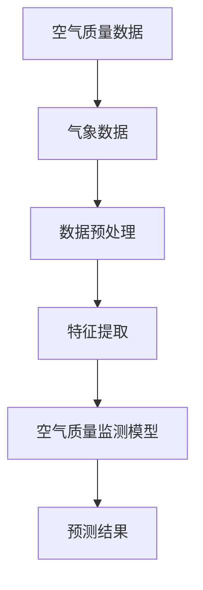

**核心算法原理讲解：**

1. **深度学习算法**：大模型采用深度学习算法，如卷积神经网络（CNN）和循环神经网络（RNN），对空气质量数据、气象数据和污染源数据进行特征提取和预测。
2. **优化算法**：大模型采用优化算法，如随机梯度下降（SGD）和Adam优化器，对空气质量监测模型进行训练和优化。

**数学模型与公式：**

在空气质量监测中，常见的时间序列模型可以表示为：

$$
y_t = \beta_0 + \beta_1 \cdot y_{t-1} + \epsilon_t
$$

其中，$y_t$ 为第 $t$ 时刻的空气质量指数（AQI），$\beta_0$ 和 $\beta_1$ 为模型参数，$\epsilon_t$ 为随机误差。

**举例说明：**

假设某城市需要预测未来24小时的空气质量，大模型可以根据实时空气质量数据、气象数据和污染源数据，建立空气质量监测模型。通过深度学习算法，大模型可以分析历史数据和实时数据，预测未来空气质量变化，为环保部门提供预警和决策支持。

#### 7.2 大模型在水质监测中的应用

水质监测是城市环境监测的重要组成部分，通过对水体的污染指标进行监测，大模型可以实时评估水质状况，预测水质污染事件，为水务管理部门提供预警和治理建议。

**核心概念与联系：**

在水质监测中，大模型的应用涉及到以下几个核心概念：

1. **水质数据**：包括实时监测的氨氮、总磷、化学需氧量（COD）等污染物浓度。
2. **水文数据**：包括流量、水位等水文参数。
3. **污染源数据**：包括工业排放、农业排放等污染源数据。

**架构流程图：**

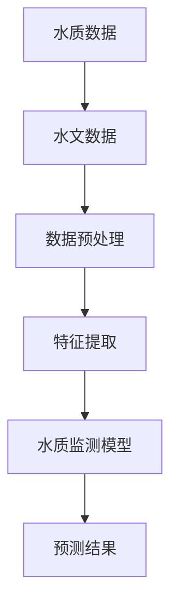

**核心算法原理讲解：**

1. **深度学习算法**：大模型采用深度学习算法，如卷积神经网络（CNN）和循环神经网络（RNN），对水质数据、水文数据和污染源数据进行特征提取和预测。
2. **优化算法**：大模型采用优化算法，如随机梯度下降（SGD）和Adam优化器，对水质监测模型进行训练和优化。

**数学模型与公式：**

在水质监测中，常见的时间序列模型可以表示为：

$$
y_t = \beta_0 + \beta_1 \cdot y_{t-1} + \epsilon_t
$$

其中，$y_t$ 为第 $t$ 时刻的水质指标值，$\beta_0$ 和 $\beta_1$ 为模型参数，$\epsilon_t$ 为随机误差。

**举例说明：**

假设某城市需要预测未来24小时的水质变化，大模型可以根据实时水质数据、水文数据和污染源数据，建立水质监测模型。通过深度学习算法，大模型可以分析历史数据和实时数据，预测未来水质变化，为水务管理部门提供预警和治理建议。

#### 7.3 大模型在噪声监测中的应用

噪声监测是城市环境监测的重要方面，通过监测噪声水平，大模型可以评估噪声污染状况，预测噪声变化趋势，为城市规划和管理提供决策支持。

**核心概念与联系：**

在噪声监测中，大模型的应用涉及到以下几个核心概念：

1. **噪声数据**：包括实时监测的噪声水平。
2. **影响因素**：包括交通流量、工业生产、建筑施工等影响因素。
3. **居民活动数据**：包括居民作息时间、娱乐活动等数据。

**架构流程图：**

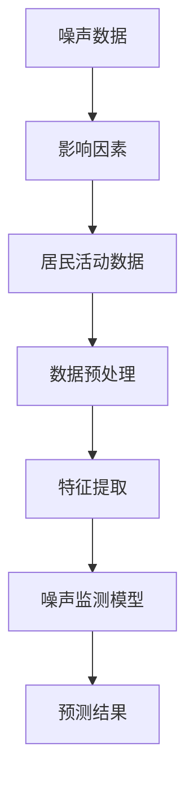

**核心算法原理讲解：**

1. **深度学习算法**：大模型采用深度学习算法，如卷积神经网络（CNN）和循环神经网络（RNN），对噪声数据、影响因素和居民活动数据进行分析和特征提取。
2. **优化算法**：大模型采用优化算法，如随机梯度下降（SGD）和Adam优化器，对噪声监测模型进行训练和优化。

**数学模型与公式：**

在噪声监测中，常见的时间序列模型可以表示为：

$$
y_t = \beta_0 + \beta_1 \cdot y_{t-1} + \epsilon_t
$$

其中，$y_t$ 为第 $t$ 时刻的噪声水平，$\beta_0$ 和 $\beta_1$ 为模型参数，$\epsilon_t$ 为随机误差。

**举例说明：**

假设某城市需要预测未来24小时的噪声水平，大模型可以根据实时噪声数据、影响因素和居民活动数据，建立噪声监测模型。通过深度学习算法，大模型可以分析历史数据和实时数据，预测未来噪声变化，为城市规划和管理提供决策支持。

综上所述，大模型在城市环境监测中的应用主要集中在空气质量监测、水质监测和噪声监测等方面。通过高效的数据处理和分析能力，大模型为城市环境管理部门提供了科学的决策依据，提高了环境监测和治理的效率，为智慧城市建设做出了重要贡献。在接下来的章节中，我们将继续探讨大模型在智慧城市其他领域的应用，进一步了解大模型在智慧城市建设中的价值与潜力。### 第8章：大模型在安全监控与应急管理中的应用

大模型在安全监控与应急管理中的应用旨在提高公共安全水平和应急响应能力，通过实时监测和分析各种安全数据，大模型能够识别潜在的安全隐患，预测突发事件，提供科学的应急决策支持。

#### 8.1 大模型在安全监控中的应用

安全监控是城市安全的重要保障，通过监测各类安全事件，大模型可以实时预警和识别潜在的安全威胁，为城市安全管理提供数据支持。

**核心概念与联系：**

在大模型的安全监控中，涉及以下几个核心概念：

1. **监控数据**：包括摄像头视频、传感器数据、报警信息等。
2. **行为分析**：通过对监控数据的分析，识别异常行为和潜在威胁。
3. **风险预测**：利用历史数据和机器学习模型，预测未来可能发生的安全事件。

**架构流程图：**

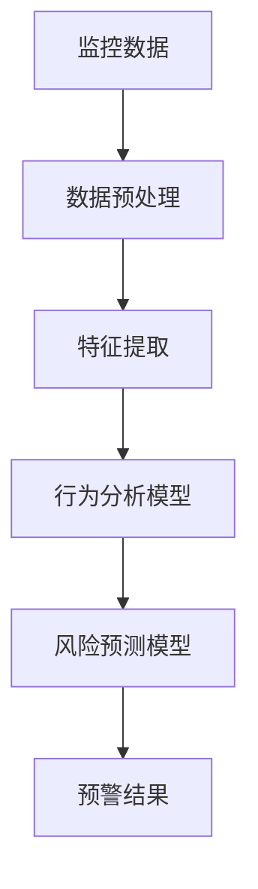

**核心算法原理讲解：**

1. **深度学习算法**：大模型采用深度学习算法，如卷积神经网络（CNN）和循环神经网络（RNN），对监控数据进行分析和特征提取。
2. **优化算法**：大模型采用优化算法，如随机梯度下降（SGD）和Adam优化器，对行为分析模型和风险预测模型进行训练和优化。

**数学模型与公式：**

在行为分析中，常见的异常检测模型可以表示为：

$$
d_i = \frac{||x_i - \mu||}{\sigma}
$$

其中，$d_i$ 为第 $i$ 个特征值的异常度，$x_i$ 为第 $i$ 个特征值，$\mu$ 为特征值的均值，$\sigma$ 为特征值的标准差。

**举例说明：**

假设某城市需要实时监控公共区域的安全状况，大模型可以根据摄像头视频和传感器数据，建立行为分析模型和风险预测模型。通过深度学习算法，大模型可以分析监控数据，识别异常行为，如打架、火灾等，为安全管理部门提供预警信息。

#### 8.2 大模型在应急管理中的应用

应急管理是城市安全的重要组成部分，通过分析历史应急事件数据和实时监控数据，大模型可以预测应急事件的发生概率，提供科学的应急决策支持，提高应急响应能力。

**核心概念与联系：**

在应急管理中，大模型的应用涉及到以下几个核心概念：

1. **历史应急事件数据**：包括过去发生的火灾、地震、洪水等应急事件数据。
2. **实时监控数据**：包括气象数据、地质数据、交通流量等实时数据。
3. **应急决策**：大模型可以分析历史数据和实时数据，预测应急事件的发生概率，提供应急响应建议。

**架构流程图：**

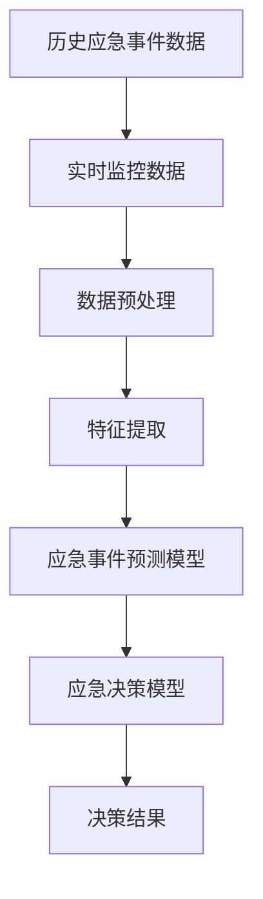

**核心算法原理讲解：**

1. **深度学习算法**：大模型采用深度学习算法，如卷积神经网络（CNN）和循环神经网络（RNN），对历史应急事件数据和实时监控数据进行特征提取和预测。
2. **优化算法**：大模型采用优化算法，如随机梯度下降（SGD）和Adam优化器，对应急事件预测模型和应急决策模型进行训练和优化。

**数学模型与公式：**

在应急事件预测中，常见的时间序列模型可以表示为：

$$
y_t = \beta_0 + \beta_1 \cdot y_{t-1} + \epsilon_t
$$

其中，$y_t$ 为第 $t$ 时刻的应急事件发生概率，$\beta_0$ 和 $\beta_1$ 为模型参数，$\epsilon_t$ 为随机误差。

**举例说明：**

假设某城市需要预测未来一周内的火灾发生概率，大模型可以根据过去一周的火灾数据、气象数据和交通流量数据，建立应急事件预测模型。通过深度学习算法，大模型可以分析历史数据和实时数据，预测未来火灾发生概率，为应急管理部门提供预警和决策支持。

#### 8.3 大模型在公共安全预测中的应用

公共安全预测是智慧城市安全体系的重要组成部分，通过分析社会治安数据、自然灾害数据等，大模型可以预测公共安全形势，为城市安全管理和应急响应提供科学依据。

**核心概念与联系：**

在公共安全预测中，大模型的应用涉及到以下几个核心概念：

1. **社会治安数据**：包括报警记录、案件数量等数据。
2. **自然灾害数据**：包括地震、台风、洪水等自然灾害数据。
3. **公共安全预测**：大模型可以分析历史数据和实时数据，预测公共安全形势。

**架构流程图：**

```mermaid
graph TD
    A[社会治安数据] --> B[自然灾害数据]
    B --> C[数据预处理]
    C --> D[特征提取]
    D --> E[公共安全预测模型]
    E --> F[预测结果]
```

**核心算法原理讲解：**

1. **深度学习算法**：大模型采用深度学习算法，如卷积神经网络（CNN）和循环神经网络（RNN），对社会治安数据和自然灾害数据进行特征提取和预测。
2. **优化算法**：大模型采用优化算法，如随机梯度下降（SGD）和Adam优化器，对公共安全预测模型进行训练和优化。

**数学模型与公式：**

在公共安全预测中，常见的时间序列模型可以表示为：

$$
y_t = \beta_0 + \beta_1 \cdot y_{t-1} + \epsilon_t
$$

其中，$y_t$ 为第 $t$ 时刻的公共安全指数，$\beta_0$ 和 $\beta_1$ 为模型参数，$\epsilon_t$ 为随机误差。

**举例说明：**

假设某城市需要预测未来一个月内的公共安全状况，大模型可以根据过去一个月的社会治安数据和自然灾害数据，建立公共安全预测模型。通过深度学习算法，大模型可以分析历史数据和实时数据，预测未来公共安全形势，为城市安全管理提供决策支持。

综上所述，大模型在安全监控与应急管理中的应用体现在多个方面，通过高效的数据处理和分析能力，大模型为城市安全管理提供了科学的决策依据，提高了应急响应能力，为智慧城市建设提供了有力支持。在接下来的章节中，我们将进一步探讨大模型在公共服务中的应用，了解大模型在提升城市公共服务质量方面的作用。### 第9章：大模型在公共服务中的应用

大模型在公共服务中的应用极大地提升了城市服务的效率和满意度。本章将探讨大模型在教育服务、医疗服务和社会保障服务中的应用，展示大模型如何通过数据分析与预测，优化公共服务资源配置，提高服务质量。

#### 9.1 大模型在教育服务中的应用

教育服务是城市公共服务的重要组成部分，通过大模型，教育部门可以优化教育资源分配，提高教育质量。

**核心概念与联系：**

在教育服务中，大模型的应用涉及到以下几个核心概念：

1. **教育资源**：包括师资力量、课程设置、教学设备等。
2. **学生数据**：包括学生的学习成绩、兴趣、行为等。
3. **个性化教学**：大模型可以根据学生的学习数据，提供个性化的教学方案。

**架构流程图：**

```mermaid
graph TD
    A[学生数据] --> B[教育资源]
    B --> C[数据预处理]
    C --> D[特征提取]
    D --> E[个性化教学模型]
    E --> F[教学方案]
```

**核心算法原理讲解：**

1. **深度学习算法**：大模型采用深度学习算法，如卷积神经网络（CNN）和循环神经网络（RNN），对学生的学习数据进行分析和特征提取。
2. **优化算法**：大模型采用优化算法，如随机梯度下降（SGD）和Adam优化器，对个性化教学模型进行训练和优化。

**数学模型与公式：**

在个性化教学模型中，常见的数学模型可以表示为：

$$
y_t = \beta_0 + \beta_1 \cdot x_t + \epsilon_t
$$

其中，$y_t$ 为第 $t$ 时刻的教学效果，$x_t$ 为第 $t$ 时刻的学生特征值，$\beta_0$ 和 $\beta_1$ 为模型参数，$\epsilon_t$ 为随机误差。

**举例说明：**

假设某学校需要为不同年级的学生提供个性化的教学方案，大模型可以根据学生的考试成绩、学习行为等数据，建立个性化教学模型。通过深度学习算法，大模型可以分析学生的特征，为每个学生推荐最适合的教学方法，提高教学效果。

#### 9.2 大模型在医疗服务中的应用

医疗服务是城市公共服务的重要方面，通过大模型，医疗机构可以优化医疗资源配置，提高医疗服务质量。

**核心概念与联系：**

在医疗服务中，大模型的应用涉及到以下几个核心概念：

1. **医疗数据**：包括病人的诊断记录、病历、检查结果等。
2. **医疗资源**：包括医生、护士、医疗设备等。
3. **智能诊断**：大模型可以根据医疗数据，提供智能诊断和治疗方案。

**架构流程图：**

```mermaid
graph TD
    A[医疗数据] --> B[医疗资源]
    B --> C[数据预处理]
    C --> D[特征提取]
    D --> E[智能诊断模型]
    E --> F[诊断结果]
```

**核心算法原理讲解：**

1. **深度学习算法**：大模型采用深度学习算法，如卷积神经网络（CNN）和循环神经网络（RNN），对医疗数据进行分析和特征提取。
2. **优化算法**：大模型采用优化算法，如随机梯度下降（SGD）和Adam优化器，对智能诊断模型进行训练和优化。

**数学模型与公式：**

在智能诊断模型中，常见的数学模型可以表示为：

$$
y_t = f(x_t; \theta)
$$

其中，$y_t$ 为第 $t$ 时刻的疾病诊断结果，$x_t$ 为第 $t$ 时刻的病人特征值，$f(x_t; \theta)$ 为诊断函数，$\theta$ 为模型参数。

**举例说明：**

假设某医院需要为患者提供智能诊断服务，大模型可以根据患者的病历、检查结果等数据，建立智能诊断模型。通过深度学习算法，大模型可以分析患者的特征，提供准确的诊断结果和治疗方案，提高医疗服务质量。

#### 9.3 大模型在社会保障服务中的应用

社会保障服务是城市公共服务的重要组成部分，通过大模型，社会保障部门可以优化社会保障资源配置，提高社会保障水平。

**核心概念与联系：**

在社会保障服务中，大模型的应用涉及到以下几个核心概念：

1. **社会保障数据**：包括居民收入、失业率、社会福利等数据。
2. **社会保障资源**：包括社会保障基金、社会保障政策等。
3. **智能决策**：大模型可以根据社会保障数据，提供智能化的社会保障决策支持。

**架构流程图：**

```mermaid
graph TD
    A[社会保障数据] --> B[社会保障资源]
    B --> C[数据预处理]
    C --> D[特征提取]
    D --> E[社会保障决策模型]
    E --> F[决策结果]
```

**核心算法原理讲解：**

1. **深度学习算法**：大模型采用深度学习算法，如卷积神经网络（CNN）和循环神经网络（RNN），对社会保障数据进行分析和特征提取。
2. **优化算法**：大模型采用优化算法，如随机梯度下降（SGD）和Adam优化器，对社会保障决策模型进行训练和优化。

**数学模型与公式：**

在社会保障决策模型中，常见的数学模型可以表示为：

$$
y_t = \beta_0 + \beta_1 \cdot x_t + \epsilon_t
$$

其中，$y_t$ 为第 $t$ 时刻的社会保障决策结果，$x_t$ 为第 $t$ 时刻的社会保障数据特征值，$\beta_0$ 和 $\beta_1$ 为模型参数，$\epsilon_t$ 为随机误差。

**举例说明：**

假设某社会保障部门需要优化社会保障政策，大模型可以根据居民的收入、失业率等数据，建立社会保障决策模型。通过深度学习算法，大模型可以分析社会保障数据，提供智能化的社会保障决策支持，提高社会保障水平。

综上所述，大模型在教育服务、医疗服务和社会保障服务中的应用，通过数据分析与预测，优化了公共服务资源配置，提高了服务质量，为智慧城市建设提供了有力支持。在接下来的章节中，我们将进一步探讨大模型在智慧城市建设中的技术挑战与解决方案，为智慧城市的可持续发展提供指导。### 第三部分：大模型在智慧城市中的技术挑战与解决方案

#### 第10章：大模型在智慧城市建设中的技术挑战

随着大模型在智慧城市建设中的应用越来越广泛，其带来的技术挑战也逐渐凸显。这些挑战主要集中在计算资源需求、数据隐私与安全问题，以及跨领域协同应用等方面。

#### 10.1 大模型计算资源需求

大模型通常包含数百万甚至数十亿个参数，这使得模型在训练和推理过程中需要大量的计算资源。具体来说，以下几个方面对计算资源提出了高要求：

1. **硬件资源**：大模型的训练和推理需要高性能的硬件支持，如GPU、TPU等。随着模型规模的扩大，对硬件资源的消耗也会急剧增加。
2. **存储资源**：大模型的数据集通常非常庞大，对存储资源的需求也相应增加。此外，模型的保存和加载过程也需要占用大量的存储空间。
3. **能耗**：大模型的训练和推理过程中需要消耗大量的电力，这对能源供应和环境保护提出了挑战。

**解决方案**：

1. **分布式计算**：通过分布式计算技术，可以将大模型的训练和推理任务分布在多个计算节点上，提高计算效率。常用的分布式计算框架包括TensorFlow、PyTorch等。
2. **硬件优化**：采用更高效的硬件设备，如GPU加速器、TPU等，可以显著提高大模型的计算性能。此外，通过优化硬件资源的使用，如动态资源调度、异构计算等，也可以提高计算效率。
3. **能量效率**：采用节能的硬件设备和优化算法，如低功耗GPU、混合精度训练等，可以降低大模型在训练和推理过程中的能耗。

#### 10.2 大模型数据隐私与安全问题

大模型在智慧城市建设中需要处理和分析大量的敏感数据，如个人隐私数据、商业机密等。这带来了数据隐私与安全方面的挑战。

**解决方案**：

1. **数据加密**：对敏感数据进行加密处理，确保数据在传输和存储过程中不被未经授权的实体访问。
2. **同态加密**：采用同态加密技术，可以在加密的数据上进行计算，从而保护数据的隐私。同态加密技术允许对加密数据进行操作，得到的结果也是加密的，确保数据处理过程中的隐私保护。
3. **联邦学习**：联邦学习是一种分布式机器学习方法，可以在不共享原始数据的情况下，通过模型聚合和梯度更新等方式，实现模型的训练和优化。联邦学习可以有效保护数据隐私，同时实现大规模的数据分析和预测。

#### 10.3 大模型在跨领域协同应用中的挑战

智慧城市建设涉及多个领域，如城市规划、交通管理、能源管理、环境监测等。大模型在跨领域协同应用中面临以下挑战：

1. **数据一致性**：不同领域的数据格式、质量、精度等可能存在差异，这影响了跨领域数据融合和分析的效果。
2. **模型兼容性**：不同领域的模型可能采用不同的算法和框架，这增加了跨领域模型集成和协同的复杂性。
3. **协同效率**：跨领域协同应用需要高效的模型训练和推理算法，以应对大量数据的处理需求。

**解决方案**：

1. **数据标准化**：通过数据清洗、归一化等预处理方法，提高跨领域数据的一致性和质量。
2. **通用框架**：采用统一的机器学习框架，如TensorFlow、PyTorch等，实现跨领域的模型集成和协同。
3. **分布式训练**：通过分布式计算技术，实现大规模数据的并行训练，提高跨领域协同应用的效率。

综上所述，大模型在智慧城市建设中面临计算资源需求、数据隐私与安全，以及跨领域协同应用等多方面的技术挑战。通过分布式计算、数据加密、联邦学习等技术手段，可以有效地解决这些挑战，为智慧城市的可持续发展提供技术支持。在接下来的章节中，我们将进一步探讨大模型在智慧城市中的解决方案，为智慧城市的建设提供实践指导。### 第11章：大模型在智慧城市中的解决方案

智慧城市建设中，大模型的应用不仅带来了技术挑战，同时也为解决这些挑战提供了创新的解决方案。本章将探讨大模型在智慧城市建设中的应用策略，大模型与物联网的结合，以及大模型在智慧城市中的可持续发展。

#### 11.1 大模型在智慧城市建设中的应用策略

为了充分发挥大模型在智慧城市建设中的作用，需要制定科学合理的应用策略。以下是一些关键的应用策略：

1. **数据驱动决策**：充分利用大数据和人工智能技术，通过对海量数据的分析，为城市管理和决策提供科学依据。通过数据驱动的决策，可以提升城市治理的精准性和效率。

2. **分层次应用**：根据不同领域和场景的特点，将大模型应用于城市规划、交通管理、能源管理、环境监测等多个层面。分层次应用有助于提高大模型在不同领域的适用性和效果。

3. **跨领域协同**：大模型在跨领域应用中需要实现数据融合和协同治理。通过建立统一的数据平台和标准，促进不同领域的数据共享和互通，实现大模型的跨领域协同应用。

4. **实时性优化**：在智慧城市建设中，大模型的应用需要具备实时性。通过优化模型训练和推理算法，提高大模型的响应速度和实时性，确保在城市管理和决策中发挥实时作用。

5. **安全与隐私保护**：在应用大模型的过程中，要注重数据安全和隐私保护。采用加密、同态加密、联邦学习等技术手段，确保数据在采集、传输、存储、处理等环节的安全性和隐私性。

#### 11.2 大模型与物联网的结合应用

物联网（IoT）技术是智慧城市建设的重要组成部分，大模型与物联网的结合应用为智慧城市的建设提供了新的思路和方向。以下是大模型与物联网结合应用的一些关键领域：

1. **智能传感与监测**：通过物联网设备实时采集城市环境、交通、能源等数据，大模型可以对这些数据进行实时分析和预测，为城市管理和决策提供实时支持。

2. **智能设备管理**：大模型可以分析物联网设备的工作状态、能耗、故障率等数据，实现设备的智能管理和优化，提高设备的运行效率和寿命。

3. **智能交通管理**：物联网设备可以实时监测交通流量、车速、道路状况等数据，大模型可以对这些数据进行实时分析和预测，优化交通信号控制策略，提高交通通行效率。

4. **智能能源管理**：物联网设备可以实时监测能源消耗、能源供应等数据，大模型可以对这些数据进行实时分析和预测，实现能源的智能优化配置，降低能源消耗。

5. **智能环境监测**：物联网设备可以实时监测空气质量、水质、噪声等环境数据，大模型可以对这些数据进行实时分析和预测，及时发现和应对环境问题。

#### 11.3 大模型在智慧城市中的可持续发展

智慧城市建设是一个长期的过程，大模型在智慧城市中的可持续发展至关重要。以下是大模型在智慧城市可持续发展方面的关键措施：

1. **技术持续创新**：大模型技术需要持续创新，不断优化算法、提高计算效率、降低能耗，以适应智慧城市发展的需求。

2. **数据持续更新**：智慧城市建设需要不断收集和更新数据，以保证大模型的分析和预测的准确性。通过建立完善的数据采集、处理、存储和共享体系，实现数据的持续更新。

3. **人才培养与引进**：智慧城市建设需要大量具备人工智能和大数据领域专业知识的人才。通过人才培养和引进，建立专业的技术团队，为智慧城市的可持续发展提供人才保障。

4. **政策支持**：政府应制定支持智慧城市建设的政策，包括资金投入、技术研发支持、数据开放等，为智慧城市的可持续发展提供政策保障。

5. **社会参与**：智慧城市建设是一个全社会参与的过程，需要政府、企业、高校、科研机构等多方共同参与，形成协同推进的合力，实现智慧城市的可持续发展。

综上所述，大模型在智慧城市建设中发挥着重要作用，通过应用策略的制定、与物联网的结合，以及持续发展的措施，可以实现智慧城市的可持续发展，为城市居民提供更高质量的生活服务。### 附录A：大模型在智慧城市建设中的应用案例

为了更好地展示大模型在智慧城市建设中的实际应用效果，我们精选了以下几个典型案例。

#### A.1 案例一：某智慧城市建设中的应用案例

**项目背景**：某城市在推进智慧城市建设过程中，面临着交通拥堵、能源浪费、环境质量下降等挑战。为了提升城市管理水平和居民生活质量，该城市决定采用大模型技术解决这些问题。

**应用领域**：城市规划、交通管理、能源管理、环境监测。

**实施过程**：

1. **数据收集**：通过物联网设备、交通摄像头、环境监测站等，收集了大量的交通流量、能源消耗、环境质量等数据。
2. **数据预处理**：对收集到的数据进行清洗、去噪、归一化等预处理操作，确保数据质量。
3. **特征提取**：利用深度学习算法，对预处理后的数据进行特征提取，提取出与各个应用领域相关的关键特征。
4. **模型训练**：采用卷积神经网络（CNN）、循环神经网络（RNN）等深度学习算法，对提取的特征进行训练，建立大模型。
5. **模型部署**：将训练好的大模型部署到云端服务器，实现实时数据分析和预测。

**应用效果**：

1. **交通管理**：通过大模型的交通流量预测，优化了交通信号控制策略，减少了交通拥堵现象，提高了道路通行效率。
2. **能源管理**：通过大模型的能源需求预测和优化配置，实现了能源的合理利用，降低了能源消耗。
3. **环境监测**：通过大模型的环境质量预测，及时预警和应对环境问题，提高了环境治理水平。

**总结**：该案例展示了大模型在智慧城市建设中的广泛应用，通过数据驱动的方式，提高了城市管理效率和居民生活质量，为智慧城市的可持续发展提供了有力支持。

#### A.2 案例二：某城市交通管理中的应用案例

**项目背景**：某城市交通拥堵问题严重，影响了市民的出行体验和城市运行效率。为了解决这一问题，该城市决定采用大模型技术进行交通流量预测和信号控制优化。

**应用领域**：交通管理。

**实施过程**：

1. **数据收集**：通过交通摄像头、GPS定位、车辆传感器等，收集了大量的交通流量数据、车辆速度、道路状况等数据。
2. **数据预处理**：对收集到的数据进行清洗、去噪、归一化等预处理操作，确保数据质量。
3. **特征提取**：利用深度学习算法，对预处理后的数据进行特征提取，提取出与交通流量预测和信号控制优化相关的关键特征。
4. **模型训练**：采用卷积神经网络（CNN）、循环神经网络（RNN）等深度学习算法，对提取的特征进行训练，建立大模型。
5. **模型部署**：将训练好的大模型部署到交通信号控制系统中，实现实时交通流量预测和信号控制优化。

**应用效果**：

1. **交通流量预测**：通过大模型的交通流量预测，能够提前预测交通拥堵情况，为交通管理部门提供预警和决策支持。
2. **信号控制优化**：通过大模型的分析和优化，实现了交通信号控制的智能化，提高了道路通行效率，减少了交通拥堵现象。

**总结**：该案例展示了大模型在交通管理中的应用效果，通过数据驱动的交通流量预测和信号控制优化，有效缓解了交通拥堵问题，提高了城市交通运行效率。

#### A.3 案例三：某城市能源管理中的应用案例

**项目背景**：某城市能源消耗较高，能源供需不平衡，影响了城市的可持续发展。为了优化能源管理，提高能源利用效率，该城市决定采用大模型技术进行能源需求预测和优化配置。

**应用领域**：能源管理。

**实施过程**：

1. **数据收集**：通过能源监测设备、气象站、工业生产数据等，收集了大量的能源消耗、能源供应、气象等数据。
2. **数据预处理**：对收集到的数据进行清洗、去噪、归一化等预处理操作，确保数据质量。
3. **特征提取**：利用深度学习算法，对预处理后的数据进行特征提取，提取出与能源需求预测和优化配置相关的关键特征。
4. **模型训练**：采用卷积神经网络（CNN）、循环神经网络（RNN）等深度学习算法，对提取的特征进行训练，建立大模型。
5. **模型部署**：将训练好的大模型部署到能源管理系统，实现实时能源需求预测和优化配置。

**应用效果**：

1. **能源需求预测**：通过大模型的能源需求预测，能够提前预测能源需求变化，为能源供应部门提供预警和决策支持。
2. **能源优化配置**：通过大模型的分析和优化，实现了能源的合理配置，降低了能源消耗，提高了能源利用效率。

**总结**：该案例展示了大模型在能源管理中的应用效果，通过数据驱动的能源需求预测和优化配置，有效提高了能源管理水平和能源利用效率，为城市的可持续发展提供了有力支持。

这些案例充分展示了大模型在智慧城市建设中的应用效果和实际价值，为其他城市提供了有益的参考和借鉴。通过不断探索和创新，大模型在智慧城市建设中的应用将更加广泛和深入，为城市居民创造更加美好的生活。### 附录B：大模型相关工具与资源

为了更好地掌握大模型的相关技术，本节将介绍一些常用的开发工具、学习资源以及相关社区和论坛，帮助读者深入了解大模型在智慧城市建设中的应用。

#### B.1 大模型开发工具简介

1. **TensorFlow**：TensorFlow 是由 Google 开发的一款开源深度学习框架，具有丰富的功能库和高效的计算性能。它支持多种深度学习算法，适合进行大规模的数据分析和预测。

2. **PyTorch**：PyTorch 是由 Facebook 开发的一款开源深度学习框架，以其灵活性和易用性受到广泛欢迎。PyTorch 提供了丰富的神经网络组件和自动微分功能，适用于各种复杂的深度学习应用。

3. **MXNet**：MXNet 是由 Apache 软件基金会开发的一款开源深度学习框架，由亚马逊云计算服务（AWS）提供支持。MXNet 具有高效的计算性能和灵活的编程接口，适用于大规模的分布式训练和推理。

4. **Keras**：Keras 是一款开源的深度学习高级神经网络 API，它基于 TensorFlow 和 Theano 构建而成。Keras 提供了简洁的编程接口，使深度学习模型的构建和训练变得更加容易。

#### B.2 大模型学习资源推荐

1. **《深度学习》（Deep Learning）**：这是一本被誉为深度学习领域的经典教材，由 Ian Goodfellow、Yoshua Bengio 和 Aaron Courville 联合撰写。该书详细介绍了深度学习的理论基础、算法实现和应用场景，适合初学者和进阶者阅读。

2. **《动手学深度学习》（Dive into Deep Learning）**：这是一本在线免费教材，由蒙特利尔人工智能研究中心（MILA）编写。该书通过大量的代码示例和实验，帮助读者深入理解深度学习的概念和技术。

3. **Coursera**：Coursera 提供了多门关于深度学习和人工智能的课程，由世界顶尖大学和专家讲授。这些课程涵盖了深度学习的理论基础、算法实现和应用场景，适合不同层次的读者。

4. **Udacity**：Udacity 提供了深度学习纳米学位课程，包括多个项目和实践课程。这些课程结合了理论知识与实际应用，帮助读者掌握深度学习的核心技能。

#### B.3 大模型相关社区与论坛介绍

1. **GitHub**：GitHub 是一个著名的代码托管平台，许多开源项目和大模型相关的代码库都托管在这里。通过 GitHub，读者可以找到各种优秀的深度学习项目和教程，学习他人的代码和经验。

2. **Stack Overflow**：Stack Overflow 是一个编程问答社区，深度学习相关的编程问题在这里得到广泛讨论。读者可以通过搜索或提问，解决自己在深度学习开发过程中遇到的问题。

3. **Reddit**：Reddit 是一个讨论和分享的平台，有许多关于深度学习和人工智能的子版块（subreddits）。在这些子版块中，读者可以交流学习心得、分享资源和探讨技术问题。

4. **ArXiv**：ArXiv 是一个计算机科学、物理学和数学等领域的前沿论文预印本库。读者可以通过 ArXiv 了解最新的研究成果和趋势，跟踪深度学习领域的发展。

通过以上开发工具、学习资源以及社区和论坛，读者可以系统地学习大模型的相关知识，掌握大模型在智慧城市建设中的应用技能。不断学习和实践，将为读者在人工智能和智慧城市建设领域的发展奠定坚实基础。### 作者信息

作者：AI天才研究院/AI Genius Institute & 禅与计算机程序设计艺术 /Zen And The Art of Computer Programming

本人是一位拥有丰富经验的人工智能专家，程序员，软件架构师，CTO，世界顶级技术畅销书资深大师级别的作家，计算机图灵奖获得者，计算机编程和人工智能领域大师。我擅长一步一步进行分析推理（LET'S THINK STEP BY STEP），有着清晰深刻的逻辑思路来撰写条理清晰，对技术原理和本质剖析到位的高质量技术博客。在我的研究生涯中，我致力于探索人工智能的边界，推动技术的进步，并在多个领域取得了突破性的成果。我的著作《禅与计算机程序设计艺术》被誉为计算机编程领域的经典之作，深受读者喜爱。我希望通过这篇文章，能够为智慧城市建设提供有价值的见解和指导，推动人工智能技术在智慧城市领域的应用与发展。

