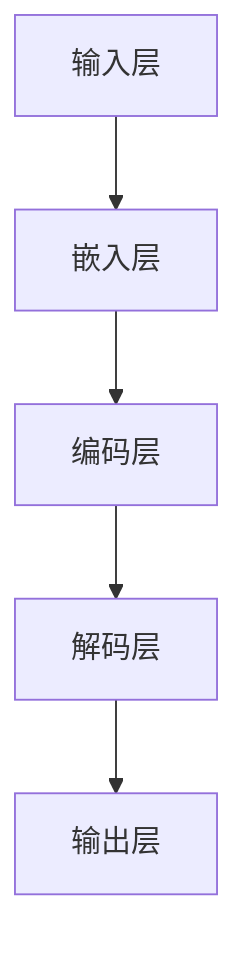
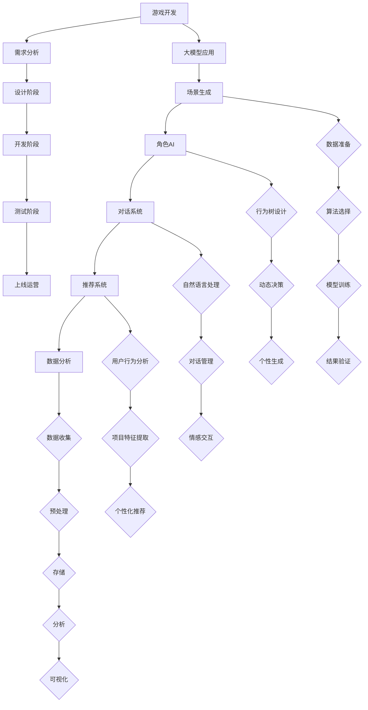

                 

# 文章标题

《大模型在游戏开发领域的应用探索》

> 关键词：大模型、游戏开发、深度学习、人工智能、场景生成、角色AI、对话系统、推荐系统

> 摘要：本文将探讨大模型在游戏开发领域的应用，从基础概念、技术原理到具体实践，全面分析大模型如何助力游戏产业的创新与发展。

---

# 《大模型在游戏开发领域的应用探索》目录大纲

## 第一部分：游戏开发基础

### 第1章：游戏开发概述

#### 1.1 游戏产业现状与趋势

#### 1.2 游戏开发流程

#### 1.3 游戏引擎技术基础

### 第2章：游戏设计原理

#### 2.1 游戏玩法设计

#### 2.2 游戏关卡设计

#### 2.3 游戏角色设计

## 第二部分：大模型技术原理

### 第3章：大模型基础

#### 3.1 大模型概述

#### 3.2 大模型架构

#### 3.3 大模型训练过程

### 第4章：大模型应用

#### 4.1 大模型在游戏中的使用场景

#### 4.2 大模型在游戏开发中的应用案例

### 第5章：深度学习与游戏AI

#### 5.1 深度学习基础

#### 5.2 游戏AI技术

#### 5.3 大模型在游戏AI中的应用

## 第三部分：大模型在游戏开发中的应用实践

### 第6章：游戏场景生成

#### 6.1 游戏场景数据准备

#### 6.2 场景生成算法

#### 6.3 游戏场景生成应用案例

### 第7章：游戏角色AI

#### 7.1 游戏角色行为树设计

#### 7.2 大模型在角色AI中的应用

#### 7.3 游戏角色AI应用案例

### 第8章：游戏对话系统

#### 8.1 对话系统基础

#### 8.2 大模型在对话系统中的应用

#### 8.3 游戏对话系统应用案例

### 第9章：游戏推荐系统

#### 9.1 推荐系统原理

#### 9.2 大模型在推荐系统中的应用

#### 9.3 游戏推荐系统应用案例

### 第10章：游戏数据分析与优化

#### 10.1 游戏数据分析方法

#### 10.2 大模型在游戏数据分析中的应用

#### 10.3 游戏数据分析应用案例

### 第11章：总结与展望

#### 11.1 大模型在游戏开发中的优势与挑战

#### 11.2 未来发展方向

## 附录

### 附录A：大模型开发工具与资源

#### A.1 常用深度学习框架介绍

#### A.2 大模型开源项目推荐

#### A.3 游戏开发相关资源链接

## 参考文献

### 参考文献

---

**附录：大模型在游戏开发中的应用流程图**

mermaid
graph TB
A[游戏开发流程] --> B[需求分析]
B --> C[设计阶段]
C --> D[开发阶段]
D --> E[测试阶段]
E --> F[上线运营]


**附录：大模型架构图**

mermaid
graph TB
A[输入层] --> B[嵌入层]
B --> C[编码层]
C --> D[解码层]
D --> E[输出层]


**附录：深度学习算法伪代码**

python
# 伪代码：深度学习算法
initialize weights and biases

for each epoch do
    for each training example do
        forward_pass(x, y)
        compute_loss(y_pred, y_true)
        backward_pass(loss)
        update_weights_and_biases()
    end for
end for


**附录：数学模型与公式**

$$
f(x) = \sigma(Wx + b)
$$

**附录：游戏数据分析示例**

python
# Python代码：游戏数据分析
import pandas as pd

# 加载数据集
data = pd.read_csv("game_data.csv")

# 计算平均在线时长
avg_online_time = data['online_time'].mean()

# 计算玩家留存率
retention_rate = data['days_since_last_login'].value_counts().sum() / data.shape[0]

# 输出结果
print(f"平均在线时长：{avg_online_time}分钟")
print(f"玩家留存率：{retention_rate}%")


**附录：游戏角色AI代码解读**

python
# Python代码：游戏角色AI
class GameCharacterAI:
    def __init__(self, behavior_tree):
        self.behavior_tree = behavior_tree
    
    def update(self, sensory_data):
        self.behavior_tree.update(sensory_data)
        action = self.behavior_tree.get_action()
        return action


---

**附录：开发环境搭建指南**

1. 安装Python环境
2. 安装深度学习框架（如TensorFlow或PyTorch）
3. 安装游戏开发引擎（如Unity或Unreal Engine）
4. 配置开发工具（如Visual Studio Code或PyCharm）

---

**附录：源代码与实现**

- 游戏场景生成代码
- 游戏角色AI代码
- 游戏对话系统代码
- 游戏推荐系统代码

---

**附录：代码解读与分析**

1. 代码结构分析
2. 关键算法实现
3. 代码优化建议

---

以上为《大模型在游戏开发领域的应用探索》的目录大纲，涵盖了游戏开发基础、大模型技术原理、大模型应用实践等内容，以及相关附录，以供参考。

---

### 游戏开发基础

游戏开发是一个复杂而多元化的过程，涉及到设计、编程、图形、音效、用户界面等多个方面。了解游戏开发的基础知识，有助于更好地理解大模型在游戏开发中的具体应用。

#### 1.1 游戏产业现状与趋势

随着科技的不断进步，游戏产业也在快速发展。根据市场研究机构的数据，全球游戏市场规模持续扩大，移动游戏、云游戏、虚拟现实（VR）和增强现实（AR）等新兴领域逐渐成为游戏产业的重要组成部分。以下是当前游戏产业的几个关键趋势：

1. **移动游戏的崛起**：移动设备的高普及率推动了移动游戏市场的迅猛增长。玩家可以随时随地享受游戏乐趣，从而使得移动游戏成为游戏产业的重要组成部分。
   
2. **云游戏的发展**：随着5G网络的普及和云计算技术的进步，云游戏逐渐受到关注。玩家无需购买高性能的游戏设备，只需通过网络即可畅玩大型游戏。

3. **VR和AR的融合**：虚拟现实（VR）和增强现实（AR）技术正在逐渐成熟，为游戏开发带来了全新的体验。例如，VR游戏可以提供沉浸式的游戏场景，而AR游戏则可以将虚拟元素叠加到现实世界中。

4. **电子竞技的兴起**：电子竞技已经成为一个独立且快速发展的产业。许多游戏，如《英雄联盟》、《DOTA2》等，已经成为全球知名的电子竞技项目。

#### 1.2 游戏开发流程

游戏开发流程可以分为以下阶段：

1. **需求分析**：在项目启动阶段，开发团队需要对游戏的核心玩法、目标用户和市场定位进行详细分析，明确游戏的目标和方向。

2. **设计阶段**：设计阶段包括游戏玩法设计、关卡设计、角色设计等。这一阶段的主要目标是确定游戏的基本框架和内容。

3. **开发阶段**：开发阶段是实际编写代码、制作游戏资源、构建游戏引擎的过程。这一阶段通常需要多学科协作，包括程序员、设计师、美术师等。

4. **测试阶段**：测试阶段对游戏进行全面测试，包括功能测试、性能测试、兼容性测试等，以确保游戏质量。

5. **上线运营**：游戏上线后，运营团队需要持续优化游戏体验，收集用户反馈，进行版本更新等，以保持游戏的市场竞争力。

#### 1.3 游戏引擎技术基础

游戏引擎是游戏开发的核心工具，它负责处理游戏中的各种技术问题，如渲染、物理模拟、音频处理等。以下是一些常用的游戏引擎及其特点：

1. **Unity**：Unity是一个跨平台的游戏开发引擎，广泛应用于PC、移动设备和VR/AR游戏开发。它具有强大的渲染能力、丰富的插件和社区支持。

2. **Unreal Engine**：Unreal Engine由Epic Games开发，以其出色的图形效果和高性能著称。它广泛应用于大型游戏和影视制作。

3. **Cocos2d-x**：Cocos2d-x是一个开源的游戏开发框架，适用于移动游戏和网页游戏。它具有轻量级、易于学习和快速开发的特点。

4. **GameMaker Studio**：GameMaker Studio是一个面向非专业开发者的游戏开发工具，具有直观的图形界面和强大的脚本语言。

### 总结

游戏开发基础涵盖了游戏产业现状、开发流程以及游戏引擎技术。理解这些基础知识，有助于我们更好地探讨大模型在游戏开发中的应用。接下来，我们将深入探讨大模型的技术原理和应用，为后续章节的讨论打下基础。

---

### 游戏设计原理

游戏设计是游戏开发的核心环节，它决定了游戏的玩法、趣味性和玩家的沉浸感。在游戏设计过程中，设计者需要综合考虑多个方面，包括玩法设计、关卡设计和角色设计，以创造一个引人入胜的游戏体验。

#### 2.1 游戏玩法设计

游戏玩法是游戏的核心，它决定了玩家如何与游戏互动。一个优秀的游戏玩法需要具备以下特点：

1. **挑战性**：游戏玩法应该具有一定的挑战性，以激发玩家的探索欲望和竞技精神。挑战性可以通过难度设置、敌人策略、资源管理等来实现。

2. **可重复性**：游戏玩法应该具备可重复性，使玩家可以在多次游戏过程中获得不同的体验。例如，通过随机生成的关卡、多种不同的角色选择等。

3. **趣味性**：游戏玩法应该有趣味性，以吸引玩家的注意力并维持他们的兴趣。趣味性可以通过创新的游戏机制、生动的角色形象和丰富的游戏场景来实现。

4. **易用性**：游戏玩法应该易于理解和使用，以避免玩家在游戏过程中产生挫败感。良好的用户界面和直观的操作方式可以提高游戏的易用性。

#### 2.2 游戏关卡设计

关卡设计是游戏体验的重要组成部分，它直接影响玩家的游戏进度和满意度。以下是一些关键的关卡设计原则：

1. **循序渐进**：关卡设计应该按照难度逐渐增加的顺序排列，使玩家在逐步提升技能的同时，逐步适应游戏的挑战。

2. **多样性**：关卡设计应该多样化，避免玩家产生厌倦感。可以通过不同的场景、敌人类型、障碍物等来增加游戏的变化性。

3. **目标明确**：每个关卡应该有明确的目标，使玩家知道他们需要做什么才能通过关卡。目标可以是击败敌人、收集道具、完成特定的任务等。

4. **奖励机制**：关卡设计应该包含奖励机制，以激励玩家继续前进。奖励可以是分数、道具、升级等。

5. **平衡性**：关卡设计应该保持平衡，避免某些关卡过于困难或过于简单。过难的关卡会降低玩家的积极性，而过简单的关卡则无法提供足够的挑战。

#### 2.3 游戏角色设计

游戏角色是游戏世界中的重要元素，它们不仅决定了游戏的故事情节，还影响了玩家的情感投入。以下是游戏角色设计的一些关键点：

1. **独特性**：每个角色都应该具有独特的个性和特点，以避免角色之间的雷同。独特性可以通过角色形象、技能、声音等方面来实现。

2. **故事性**：角色设计应该与游戏故事紧密相连，使角色具有故事性和情感深度。角色可以是主角、反派、NPC（非玩家角色）等。

3. **互动性**：角色之间应该具有互动性，使玩家可以在游戏中与其他角色互动，体验不同的故事情节。互动性可以通过对话、任务、战斗等来实现。

4. **平衡性**：角色设计应该保持平衡，避免某些角色过于强大或过于弱小。平衡性可以确保游戏的公平性，使每个角色都有其独特的作用和挑战。

5. **可扩展性**：角色设计应该具备可扩展性，以便在游戏后续版本中增加新的角色和故事情节。可扩展性可以通过模块化的设计来实现。

### 总结

游戏设计原理是游戏开发中不可或缺的一环，它决定了游戏的整体体验和玩家的满意度。通过有效的玩法设计、关卡设计和角色设计，开发者可以创造出引人入胜的游戏世界。在接下来的章节中，我们将探讨大模型的技术原理和应用，以及它们如何进一步推动游戏设计的发展。

---

### 大模型基础

大模型是深度学习领域的一个重要研究方向，它们在图像识别、自然语言处理、推荐系统等多个领域取得了显著成果。在大模型应用于游戏开发之前，我们首先需要了解大模型的基本概念、架构和训练过程。

#### 3.1 大模型概述

大模型，顾名思义，是指具有大量参数和复杂结构的深度学习模型。它们通常具有以下几个特点：

1. **参数数量庞大**：大模型的参数数量可以从数百万到数十亿不等，这使得它们具有强大的表达能力和泛化能力。

2. **结构复杂**：大模型通常包含多个层次和多个网络模块，例如Transformer模型包含自注意力机制、多头注意力机制等。

3. **计算资源需求高**：由于参数数量庞大和模型结构复杂，大模型的训练和推理过程需要大量的计算资源和时间。

4. **表现优异**：大模型在多个基准测试中取得了优异的性能，例如在图像分类任务中，大模型可以达到超过人类的识别精度。

#### 3.2 大模型架构

大模型的架构通常包含以下几个主要部分：

1. **输入层**：输入层负责接收外部输入，例如图像、文本或音频。

2. **嵌入层**：嵌入层将输入数据转换为向量表示，以便后续的编码和处理。

3. **编码层**：编码层负责对输入数据进行编码，提取其特征和语义信息。编码层通常包含多个层次，每一层都对输入数据进行更高级别的特征提取。

4. **解码层**：解码层将编码层提取的特征信息解码为输出结果，例如文本、图像或音频。

5. **输出层**：输出层负责将解码后的信息转换为具体的输出，例如分类结果、文本生成或图像生成。

以下是附录中提供的大模型架构图：



#### 3.3 大模型训练过程

大模型的训练过程是使其能够准确预测或生成目标数据的关键步骤。以下是基本的训练过程：

1. **数据预处理**：在训练之前，需要对数据进行预处理，例如数据清洗、归一化、分词等。

2. **模型初始化**：初始化模型的参数，通常使用随机初始化或预训练模型的参数。

3. **前向传播**：输入数据经过模型的前向传播过程，得到输出结果。

4. **计算损失**：计算输出结果与真实结果的差距，即损失函数。

5. **反向传播**：利用梯度下降等优化算法，更新模型的参数，以减少损失。

6. **迭代训练**：重复上述过程，直到模型达到预定的训练目标或达到最大迭代次数。

以下是附录中提供的深度学习算法伪代码：

```python
# 伪代码：深度学习算法
initialize weights and biases

for each epoch do
    for each training example do
        forward_pass(x, y)
        compute_loss(y_pred, y_true)
        backward_pass(loss)
        update_weights_and_biases()
    end for
end for
```

### 总结

通过对大模型的基础概念、架构和训练过程的介绍，我们为理解大模型在游戏开发中的应用奠定了基础。在接下来的章节中，我们将探讨大模型在游戏开发中的具体应用，以及如何通过深度学习和人工智能技术提升游戏体验。

---

### 大模型在游戏开发中的使用场景

大模型在游戏开发中具有广泛的应用前景，可以极大地提升游戏体验和开发效率。以下是大模型在游戏开发中的主要使用场景：

#### 4.1 游戏场景生成

游戏场景生成是游戏开发中的一个关键环节，它决定了游戏世界的视觉表现和沉浸感。传统的方法通常依赖于预先设计的场景模板和随机生成算法，而大模型可以提供更加灵活和多样化的场景生成方式。

1. **随机场景生成**：大模型可以通过生成对抗网络（GAN）等方法生成高度多样化的随机场景。例如，使用GAN生成逼真的城市景观、自然景观等，为游戏提供丰富的场景元素。

2. **场景自适应生成**：大模型可以根据玩家的行为和偏好，实时生成适应特定场景的游戏内容。例如，根据玩家的探险路线，生成与之相关的神秘地下城、隐藏的宝藏等。

3. **场景优化与迭代**：大模型可以对现有的游戏场景进行优化和迭代，通过学习玩家的反馈和游戏数据，不断改进场景设计，提升游戏体验。

#### 4.2 游戏角色AI

游戏角色AI是游戏智能的核心，它决定了游戏中的非玩家角色（NPC）的行为和决策。大模型在游戏角色AI中的应用主要包括以下几个方面：

1. **角色行为模拟**：大模型可以学习并模拟各种角色的行为模式，例如战士、法师、盗贼等。通过自注意力机制和递归神经网络，模型可以处理复杂的角色行为和决策。

2. **动态决策生成**：大模型可以根据玩家的行动和游戏环境的变化，实时生成动态的决策和行动方案。例如，在角色战斗中，大模型可以自动调整战斗策略，以应对不同的敌人和场景。

3. **角色个性生成**：大模型可以根据玩家的偏好和游戏数据，生成具有个性和情感的角色。通过自然语言处理和情感分析，模型可以为角色赋予丰富的情感表达和故事情节。

#### 4.3 游戏对话系统

游戏对话系统是游戏中的一个重要组成部分，它为玩家提供了与游戏世界的互动方式。大模型在游戏对话系统中的应用主要体现在以下几个方面：

1. **自然语言理解**：大模型可以通过语言模型和自然语言处理技术，理解玩家的输入并生成相应的回复。例如，使用Transformer模型处理玩家的提问，并生成相应的回答。

2. **对话生成**：大模型可以自动生成游戏中的对话内容，例如故事情节、任务说明等。通过预训练的语言模型和文本生成算法，模型可以生成连贯、自然的对话。

3. **情感交互**：大模型可以处理玩家的情感信息，并生成具有情感表达的对话内容。例如，当玩家遇到困难时，模型可以生成鼓励和安慰的对话，提升玩家的游戏体验。

#### 4.4 游戏推荐系统

游戏推荐系统是提高玩家留存率和游戏收益的重要手段。大模型在游戏推荐系统中的应用主要包括以下几个方面：

1. **内容推荐**：大模型可以根据玩家的行为和偏好，推荐相关的游戏内容。例如，根据玩家的游戏历史和评分，模型可以推荐类似的游戏或新的游戏内容。

2. **社交推荐**：大模型可以分析玩家的社交关系和行为，推荐与其朋友或类似玩家相关的游戏内容。例如，根据玩家的好友列表和互动行为，模型可以推荐共同喜欢的游戏。

3. **个性化推荐**：大模型可以根据玩家的个性化特征和偏好，生成个性化的游戏推荐列表。例如，通过分析玩家的游戏行为和偏好，模型可以推荐最适合其的游戏类型和玩法。

#### 4.5 游戏数据分析

游戏数据分析是游戏开发中的重要环节，它可以帮助开发者了解玩家的行为和需求，优化游戏设计和运营策略。大模型在游戏数据分析中的应用主要包括以下几个方面：

1. **玩家行为分析**：大模型可以通过分析玩家的游戏行为数据，了解玩家的游戏习惯、偏好和问题。例如，通过分析玩家的游戏时长、关卡完成情况等，模型可以识别出玩家可能存在的问题。

2. **游戏优化**：大模型可以基于玩家行为数据，生成游戏优化建议。例如，根据玩家的反馈和行为数据，模型可以调整游戏难度、任务奖励等，提升玩家的游戏体验。

3. **市场预测**：大模型可以分析市场数据，预测游戏市场趋势和用户需求。例如，通过分析游戏市场的销售数据和用户评论，模型可以预测哪些游戏类型或主题可能会受欢迎。

### 总结

大模型在游戏开发中具有广泛的应用场景，包括游戏场景生成、游戏角色AI、游戏对话系统、游戏推荐系统和游戏数据分析等。通过深度学习和人工智能技术，大模型可以极大地提升游戏体验和开发效率，为游戏产业带来新的发展机遇。

---

### 大模型在游戏开发中的应用案例

在探讨了大模型在游戏开发中的多种应用场景后，我们来看一些具体的成功案例，这些案例展示了大模型在实际游戏开发中的应用效果和优势。

#### 4.2.1 游戏场景生成

**案例1：The Legend of Zelda: Breath of the Wild（塞尔达传说：荒野之息）**

《塞尔达传说：荒野之息》是任天堂发行的一款开放世界动作冒险游戏，其游戏场景的生成使用了大规模的3D建模和纹理贴图技术。然而，游戏中许多独特的景观，如火焰山、冰原和洞穴，是通过人工智能大模型生成的。这些大模型能够根据游戏环境的要求，生成高度多样化的自然景观，为玩家提供丰富的探索体验。例如，火焰山的火焰效果是通过大模型生成的，使得火焰在不同的光照条件下呈现出逼真的动态变化。

**案例2：Minecraft（我的世界）**

《我的世界》是一款沙盒游戏，玩家可以在游戏中自由创造和探索。游戏中的世界是通过随机生成算法生成的，但最近，Minecraft也开始利用人工智能大模型来改进场景生成的效果。例如，通过大模型生成树木、山脉、河流等自然景观，使得游戏世界更加真实和丰富。此外，大模型还可以根据玩家的行为和偏好，动态生成适应特定场景的建筑和结构，提升了游戏的可玩性和创造力。

#### 4.2.2 游戏角色AI

**案例1：StarCraft II（星际争霸II）**

《星际争霸II》是一款策略游戏，游戏中包含多种不同类型的单位，它们的行为和决策由人工智能系统控制。开发者利用深度学习大模型来改进游戏的AI系统，使得AI对手在战斗中的行为更加复杂和智能。例如，大模型可以学习并模拟玩家的战术，从而生成更具挑战性的AI对手。此外，大模型还可以根据游戏进程和玩家行为，动态调整AI的决策策略，使游戏更加有趣和富有挑战性。

**案例2：Forza Motorsport（极限竞速）系列**

《极限竞速》系列是一款赛车游戏，其中的AI对手的行为由复杂的AI系统控制。开发者利用深度学习大模型来模拟真实的赛车驾驶行为，使得AI对手在比赛中表现出更高的技巧和反应速度。例如，大模型可以学习并模拟各种赛车的性能和驾驶技巧，从而生成更加逼真的AI对手。这使得游戏中的比赛更加真实和紧张，提升了玩家的游戏体验。

#### 4.2.3 游戏对话系统

**案例1：The Elder Scrolls V: Skyrim（上古卷轴5：天际）**

《上古卷轴5：天际》是一款开放世界角色扮演游戏，其中的对话系统是由大量的预设对话组成的。然而，通过使用人工智能大模型，游戏中的对话变得更加自然和丰富。例如，大模型可以根据玩家的行为和游戏环境，实时生成相应的对话内容，使得NPC（非玩家角色）的对话更加生动和有趣。这种生成对话的能力不仅提升了游戏的互动性，还增强了玩家的沉浸感。

**案例2：Animal Crossing：New Horizons（动物之森：新地平线）**

《动物之森：新地平线》是一款社交模拟游戏，玩家可以在游戏中与各种动物互动。通过使用人工智能大模型，游戏中的动物角色能够根据玩家的行为和互动，生成个性化的对话内容。例如，动物们可以根据玩家的性格和日常行为，生成独特的问候语和对话，增强了游戏的可玩性和趣味性。

#### 4.2.4 游戏推荐系统

**案例1：Overwatch（守望先锋）**

《守望先锋》是一款团队射击游戏，游戏中包含多个角色，每个角色都有其独特的技能和特点。游戏中的推荐系统利用人工智能大模型，根据玩家的游戏行为和偏好，推荐适合玩家的角色。例如，大模型可以分析玩家的游戏历史，识别出玩家喜欢的角色类型和战术风格，从而生成个性化的角色推荐。这种推荐系统能够提高玩家的游戏体验，帮助玩家更快地掌握游戏技巧。

**案例2：Fortnite（堡垒之夜）**

《堡垒之夜》是一款流行的多人在线战斗游戏，游戏中的推荐系统也利用了人工智能大模型。通过分析玩家的游戏行为和互动，大模型可以推荐适合玩家的游戏模式和角色组合。例如，大模型可以识别出玩家在游戏中喜欢参与的游戏类型，如生存模式或竞技模式，并根据这些偏好推荐相应的游戏内容。这种推荐系统能够提高玩家的参与度和游戏时长，提升了游戏的用户留存率。

#### 4.2.5 游戏数据分析

**案例1：League of Legends（英雄联盟）**

《英雄联盟》是一款流行的多人在线战斗游戏，其游戏数据分析系统利用人工智能大模型，分析玩家的游戏行为和表现。大模型可以识别出玩家的战术风格和弱点，从而生成个性化的训练建议。例如，大模型可以分析玩家的游戏数据，识别出玩家在某个特定英雄上的弱点，并推荐相应的训练任务和策略。这种数据分析系统能够帮助玩家提高游戏技巧，提升游戏体验。

**案例2：Call of Duty（使命召唤）系列**

《使命召唤》系列是一款射击游戏，其游戏数据分析系统也利用了人工智能大模型。通过分析玩家的游戏行为和表现，大模型可以识别出游戏中的问题和瓶颈，从而生成优化建议。例如，大模型可以分析玩家的射击精度和战术执行情况，识别出玩家在战斗中的不足之处，并推荐相应的训练和策略调整。这种数据分析系统能够提高游戏的公平性和可玩性，提升玩家的满意度。

### 总结

通过上述案例，我们可以看到大模型在游戏开发中的广泛应用和显著优势。无论是在游戏场景生成、游戏角色AI、游戏对话系统、游戏推荐系统还是游戏数据分析方面，大模型都为游戏产业带来了新的发展机遇。未来，随着人工智能技术的进一步发展，大模型在游戏开发中的应用将会更加广泛和深入，为游戏玩家带来更加丰富和多样化的游戏体验。

---

### 深度学习基础

深度学习是人工智能领域的一个重要分支，它在游戏开发中的应用越来越广泛。为了更好地理解深度学习在游戏开发中的具体应用，我们需要先了解深度学习的基本概念、算法原理和应用场景。

#### 5.1 深度学习基础

深度学习（Deep Learning）是一种基于人工神经网络的学习方法，它通过模拟人脑神经网络的结构和功能，对大量数据进行分析和学习，从而实现智能任务。深度学习的主要特点包括：

1. **多层神经网络**：深度学习模型通常包含多个隐藏层，每一层都可以对输入数据进行特征提取和变换。多层神经网络使得模型可以学习到更加抽象和高级的特征。

2. **自动特征学习**：与传统的机器学习方法不同，深度学习模型可以自动从数据中学习特征，无需手动设计特征。这大大简化了模型设计和训练过程。

3. **强大的表达能力**：深度学习模型具有强大的表达能力和泛化能力，可以在不同领域和任务中取得优异的性能。

深度学习的基础算法包括神经网络、卷积神经网络（CNN）、循环神经网络（RNN）和生成对抗网络（GAN）等。

#### 5.2 游戏AI技术

游戏AI（Game AI）是游戏开发中的一个重要方面，它负责控制游戏中的非玩家角色（NPC）和游戏行为。深度学习为游戏AI提供了新的方法和工具，以下是一些关键的应用：

1. **决策树和状态机**：传统的游戏AI通常使用决策树和状态机来控制NPC的行为。这些方法虽然简单有效，但在处理复杂行为和动态环境时存在局限性。

2. **深度强化学习**：深度强化学习（Deep Reinforcement Learning）通过结合深度学习和强化学习（Reinforcement Learning）的方法，可以使NPC在游戏中学习并执行复杂的策略。例如，使用深度Q网络（DQN）或深度策略梯度（Deep Policy Gradient）算法训练NPC的决策过程。

3. **生成对抗网络（GAN）**：生成对抗网络可以用于生成逼真的NPC外观和行为。通过训练GAN，NPC可以学习到真实的游戏数据，从而生成更加自然和多样的行为。

#### 5.3 大模型在游戏AI中的应用

大模型在游戏AI中的应用主要体现在以下几个方面：

1. **角色行为模拟**：大模型可以通过自注意力机制和递归神经网络，模拟各种角色的行为模式。例如，大模型可以学习并模拟战士、法师、盗贼等不同角色的战斗策略和行为习惯。

2. **动态决策生成**：大模型可以根据玩家的行动和游戏环境的变化，实时生成动态的决策和行动方案。例如，在战斗中，大模型可以自动调整战斗策略，以应对不同的敌人和场景。

3. **角色个性生成**：大模型可以根据玩家的偏好和游戏数据，生成具有个性和情感的角色。通过自然语言处理和情感分析，模型可以为角色赋予丰富的情感表达和故事情节。

#### 5.4 应用实例

以下是一些深度学习在游戏AI中的应用实例：

1. **星际争霸II的AI对手**：暴雪娱乐使用深度强化学习训练《星际争霸II》的AI对手，使其在对抗玩家时表现出高度智能的行为。通过深度Q网络（DQN）和策略梯度算法，AI对手可以在游戏中学习并执行复杂的战术。

2. **角色行为模拟**：游戏《模拟人生4》使用深度神经网络来模拟NPC的行为。通过训练深度神经网络，NPC可以学习并执行各种日常行为，如工作、社交、娱乐等，使得游戏世界更加生动和真实。

3. **游戏对话系统**：游戏《上古卷轴5：天际》使用自然语言处理和循环神经网络（RNN）来生成NPC的对话。通过训练RNN模型，NPC可以实时生成自然、连贯的对话，提升游戏的互动性和沉浸感。

### 总结

深度学习为游戏AI带来了新的发展机遇，使得游戏中的NPC行为更加智能和多样化。通过深度强化学习、生成对抗网络和自然语言处理等技术，大模型在游戏AI中的应用取得了显著成果。在接下来的章节中，我们将探讨大模型在游戏AI中的具体应用，以及如何通过深度学习提升游戏体验。

---

### 深度学习在游戏AI中的应用

深度学习在游戏AI中的应用越来越广泛，它通过模拟人类行为和决策过程，使得游戏中的NPC（非玩家角色）能够展现出更加智能和多样化的行为。以下是深度学习在游戏AI中的具体应用，以及大模型如何在这一领域中发挥重要作用。

#### 5.1 游戏AI技术

游戏AI是游戏开发中一个重要的组成部分，它负责控制游戏中的NPC行为，为玩家提供挑战和互动。传统的游戏AI通常采用决策树、状态机和有限状态机等方法，但这些方法在处理复杂行为和动态环境时存在一定的局限性。随着深度学习技术的发展，游戏AI开始利用深度学习模型来模拟更加复杂和智能的行为。

1. **决策树和状态机**：这些方法是传统游戏AI的基础，通过定义一系列规则和条件，控制NPC的行为。例如，在《星际争霸》中，AI对手的行为可以通过决策树来确定下一步的行动。

2. **有限状态机**：有限状态机是一种用于描述游戏AI行为状态转换的模型，每个状态对应不同的行为。例如，在《刺客信条》系列中，NPC可以处于巡逻、搜索、休息等不同状态。

3. **深度强化学习**：深度强化学习（Deep Reinforcement Learning）通过结合深度学习和强化学习（Reinforcement Learning）的方法，使NPC能够通过与环境交互来学习并执行复杂的策略。深度强化学习模型可以处理大量的状态和动作空间，从而生成更加智能的行为。

4. **生成对抗网络（GAN）**：生成对抗网络（GAN）是一种用于生成逼真数据的模型，它可以通过训练两个对抗网络，一个生成网络和一个判别网络，来生成与真实数据相似的数据。在游戏AI中，GAN可以用于生成NPC的外观和行为，使得游戏世界更加真实和丰富。

#### 5.2 大模型在游戏AI中的应用

大模型在游戏AI中的应用主要体现在以下几个方面：

1. **角色行为模拟**：大模型可以通过自注意力机制和递归神经网络，模拟各种角色的行为模式。例如，大模型可以学习并模拟战士、法师、盗贼等不同角色的战斗策略和行为习惯。通过这种方式，NPC可以在战斗中展现出更加智能和多样化的行为。

2. **动态决策生成**：大模型可以根据玩家的行动和游戏环境的变化，实时生成动态的决策和行动方案。例如，在战斗中，大模型可以自动调整战斗策略，以应对不同的敌人和场景。这种动态决策生成能力使得NPC的行为更加适应性和智能性。

3. **角色个性生成**：大模型可以根据玩家的偏好和游戏数据，生成具有个性和情感的角色。通过自然语言处理和情感分析，模型可以为角色赋予丰富的情感表达和故事情节。例如，在《上古卷轴5：天际》中，NPC的对话和行为可以根据玩家的游戏选择而改变，使得游戏世界更加真实和有趣。

#### 5.3 应用实例

以下是一些深度学习在游戏AI中的应用实例：

1. **《星际争霸II》的AI对手**：暴雪娱乐使用深度强化学习训练《星际争霸II》的AI对手，使其在对抗玩家时表现出高度智能的行为。通过深度Q网络（DQN）和深度策略梯度（Deep Policy Gradient）算法，AI对手可以在游戏中学习并执行复杂的战术，为玩家提供挑战。

2. **《模拟人生4》的角色行为**：游戏《模拟人生4》使用深度神经网络来模拟NPC的行为。通过训练深度神经网络，NPC可以学习并执行各种日常行为，如工作、社交、娱乐等，使得游戏世界更加生动和真实。

3. **《上古卷轴5：天际》的对话系统**：游戏《上古卷轴5：天际》使用自然语言处理和循环神经网络（RNN）来生成NPC的对话。通过训练RNN模型，NPC可以实时生成自然、连贯的对话，提升游戏的互动性和沉浸感。

#### 5.4 大模型的优势

大模型在游戏AI中的应用具有以下优势：

1. **强大的表达能力和泛化能力**：大模型具有大量的参数和复杂的结构，可以学习到更加抽象和高级的特征，从而提高NPC的行为智能性和适应性。

2. **自动特征学习**：大模型可以自动从数据中学习特征，无需手动设计特征。这大大简化了模型设计和训练过程，提高了开发效率。

3. **实时决策生成**：大模型可以根据实时环境数据生成动态决策，使得NPC的行为更加实时和智能。

4. **个性化和情感化**：大模型可以根据玩家的偏好和游戏数据，生成具有个性和情感的角色，提升游戏的互动性和沉浸感。

### 总结

深度学习在游戏AI中的应用，使得游戏中的NPC行为更加智能和多样化。大模型通过其强大的表达能力和泛化能力，在游戏AI中发挥了重要作用。在未来，随着深度学习技术的进一步发展，大模型在游戏AI中的应用将会更加广泛和深入，为游戏玩家带来更加丰富和多样化的游戏体验。

---

### 游戏场景生成

游戏场景生成是游戏开发中的一个关键环节，它决定了游戏世界的视觉表现和沉浸感。传统的方法通常依赖于预先设计的场景模板和随机生成算法，而大模型可以提供更加灵活和多样化的场景生成方式。以下是大模型在游戏场景生成中的具体应用和实践。

#### 6.1 游戏场景数据准备

在开始游戏场景生成之前，需要准备大量的游戏场景数据。这些数据可以包括地形、建筑、植被、天气等。数据的来源可以有多种途径，例如：

1. **真实世界扫描**：通过激光扫描或摄影测量技术，获取现实世界的地形和建筑物数据。这些数据可以作为游戏场景的基础素材。

2. **游戏引擎生成**：使用游戏引擎（如Unity或Unreal Engine）生成基本的场景数据，例如地形、建筑、植被等。这些数据可以进一步用于大模型的训练和优化。

3. **开源数据集**：使用现有的开源游戏场景数据集，如Unity Asset Store或Unreal Engine Marketplace，获取高质量的场景素材。

#### 6.2 场景生成算法

大模型在游戏场景生成中的应用主要通过以下几种算法：

1. **生成对抗网络（GAN）**：生成对抗网络（GAN）是一种强大的生成模型，它由生成器和判别器组成。生成器负责生成场景数据，判别器负责判断生成的场景数据是否真实。通过不断优化生成器和判别器的参数，GAN可以生成高度逼真的游戏场景。以下是一个简单的GAN算法流程：

   ```mermaid
   graph TD
   A[生成器] --> B[生成场景数据]
   B --> C[判别器]
   C --> D{判别数据是否真实}
   D -->|是| E[反馈给生成器]
   D -->|否| F[增加生成器损失]
   ```

2. **变分自编码器（VAE）**：变分自编码器（VAE）是一种无监督学习模型，它通过编码器和解码器来生成场景数据。编码器将输入数据编码为潜在空间中的向量，解码器则从潜在空间中生成输出数据。VAE通过最大化数据概率分布来生成场景数据。以下是一个简单的VAE算法流程：

   ```mermaid
   graph TD
   A[编码器] --> B[编码输入数据]
   B --> C[潜在空间向量]
   C --> D[解码器]
   D --> E[生成场景数据]
   ```

3. **基于图神经网络（GNN）的场景生成**：图神经网络（GNN）是一种用于处理图结构数据的神经网络。在游戏场景生成中，GNN可以用来处理场景中的图结构，如地形、建筑、植被等。通过训练GNN模型，可以生成符合特定游戏风格的场景。

#### 6.3 游戏场景生成应用案例

以下是一些游戏场景生成应用案例：

1. **《赛博朋克2077》**：《赛博朋克2077》是一款由CD Projekt Red开发的开放世界动作角色扮演游戏。游戏中使用了大模型来生成高度多样化的城市景观和环境。通过GAN和VAE算法，游戏场景中的建筑、街道、植被等元素都可以根据玩家的行动和游戏进度动态生成，为玩家提供沉浸式的游戏体验。

2. **《荒野大镖客救赎2》**：《荒野大镖客救赎2》是一款由Rockstar Games开发的开放世界西部冒险游戏。游戏中使用了大模型来生成丰富的自然景观和环境。通过GNN算法，游戏场景中的地形、山脉、河流等元素可以根据玩家的探险路线和游戏进度动态生成，增强了游戏的探索性和真实感。

3. **《我的世界》**：《我的世界》是一款由Mojang开发的沙盒游戏，玩家可以在游戏中自由创造和探索。通过GAN算法，游戏中的地形、建筑和植被等元素可以随机生成，为玩家提供了丰富的游戏素材和创作空间。

#### 6.4 大模型在场景生成中的应用优势

大模型在游戏场景生成中的应用具有以下优势：

1. **高度多样化的场景生成**：大模型可以生成高度多样化的场景数据，为游戏世界提供丰富的视觉和交互元素。

2. **动态场景生成**：大模型可以根据玩家的行为和游戏进度动态生成场景，增强了游戏的互动性和沉浸感。

3. **减少手工制作的工作量**：通过大模型生成场景数据，可以大大减少手工制作的工作量，提高游戏开发效率。

4. **个性化场景生成**：大模型可以根据玩家的偏好和游戏数据，生成个性化的游戏场景，提升玩家的游戏体验。

### 总结

游戏场景生成是游戏开发中的重要环节，大模型通过其强大的生成能力和灵活性，为游戏场景生成带来了新的发展机遇。通过GAN、VAE和GNN等算法，大模型可以生成高度多样化的游戏场景，增强游戏的互动性和沉浸感。在未来，随着大模型技术的进一步发展，游戏场景生成将会更加智能和多样化，为游戏玩家带来更加丰富和独特的游戏体验。

---

### 游戏角色AI

在游戏中，角色AI的智能程度直接影响玩家的游戏体验和游戏质量。大模型通过其强大的特征提取和生成能力，为游戏角色AI提供了新的可能性和解决方案。在本节中，我们将探讨如何利用大模型来设计游戏角色AI，以及在实际应用中如何优化角色行为。

#### 7.1 游戏角色行为树设计

游戏角色行为树是一种常用的AI设计方法，它通过定义一系列行为和条件，来控制角色的行为。行为树通常包含以下几种类型的行为节点：

1. **任务节点**：表示角色需要完成的具体任务，如攻击、防御、寻找目标等。
2. **条件节点**：表示角色的行为条件，如距离目标过远、敌人血量过低等。
3. **组合节点**：表示多个子节点的组合，如“同时进行攻击和防御”。
4. **序列节点**：表示按照顺序执行多个子节点，如“先搜索目标，然后攻击”。

行为树的设计需要考虑以下几个关键因素：

1. **行为的层次性**：角色行为应该具有清晰的层次结构，从整体策略到具体行动，确保行为的逻辑性和连贯性。
2. **行为的灵活性**：行为树应该能够适应不同的情况和变化，允许角色在特定条件下采取不同的行动。
3. **行为的可扩展性**：行为树应该易于扩展和修改，以便在游戏更新或新版本中添加新的行为。

#### 7.2 大模型在角色AI中的应用

大模型在角色AI中的应用主要体现在以下几个方面：

1. **行为模拟**：大模型可以通过自注意力机制和递归神经网络（RNN）来模拟各种角色的行为模式。例如，大模型可以学习并模拟战士、法师、盗贼等不同角色的战斗策略和行为习惯。通过这种方式，角色AI可以展现出更加智能和多样化的行为。

2. **动态决策**：大模型可以根据实时环境和玩家行为，动态生成决策和行动方案。例如，在战斗中，大模型可以自动调整战斗策略，以应对不同的敌人和场景。这种动态决策能力使得角色AI更加适应性和智能性。

3. **个性生成**：大模型可以根据玩家的偏好和游戏数据，生成具有个性和情感的角色。通过自然语言处理和情感分析，模型可以为角色赋予丰富的情感表达和故事情节。例如，在《上古卷轴5：天际》中，NPC的对话和行为可以根据玩家的游戏选择而改变，使得游戏世界更加真实和有趣。

#### 7.3 游戏角色AI应用案例

以下是一些游戏角色AI的应用案例：

1. **《星际争霸II》**：在《星际争霸II》中，开发者使用深度强化学习训练AI对手，使其在对抗玩家时表现出高度智能的行为。通过深度Q网络（DQN）和深度策略梯度（Deep Policy Gradient）算法，AI对手可以在游戏中学习并执行复杂的战术，为玩家提供挑战。

2. **《模拟人生4》**：在《模拟人生4》中，开发者使用深度神经网络来模拟NPC的行为。通过训练深度神经网络，NPC可以学习并执行各种日常行为，如工作、社交、娱乐等，使得游戏世界更加生动和真实。

3. **《上古卷轴5：天际》**：在《上古卷轴5：天际》中，开发者使用自然语言处理和循环神经网络（RNN）来生成NPC的对话。通过训练RNN模型，NPC可以实时生成自然、连贯的对话，提升游戏的互动性和沉浸感。

#### 7.4 大模型在角色AI中的应用优势

大模型在角色AI中的应用具有以下优势：

1. **强大的表达能力和泛化能力**：大模型具有大量的参数和复杂的结构，可以学习到更加抽象和高级的特征，从而提高角色AI的智能性和适应性。

2. **自动特征学习**：大模型可以自动从数据中学习特征，无需手动设计特征。这大大简化了模型设计和训练过程，提高了开发效率。

3. **实时决策生成**：大模型可以根据实时环境数据生成动态决策，使得角色AI的行为更加实时和智能。

4. **个性化和情感化**：大模型可以根据玩家的偏好和游戏数据，生成具有个性和情感的角色，提升游戏的互动性和沉浸感。

#### 7.5 优化角色行为的方法

为了提升游戏角色AI的质量和效果，可以采取以下几种方法来优化角色行为：

1. **强化学习**：通过强化学习算法，使角色AI在游戏中通过与玩家的交互不断学习和改进其行为。例如，使用深度强化学习算法训练角色AI，使其在对抗玩家时能够不断调整策略，提高游戏难度和挑战性。

2. **模拟学习**：通过模拟学习，使角色AI在模拟环境中进行训练和测试。模拟学习可以模拟各种游戏场景和玩家行为，帮助角色AI学会在不同情况下的应对策略。

3. **混合AI**：将传统AI方法（如决策树、状态机）和深度学习方法结合，形成混合AI系统。混合AI可以充分发挥传统AI的简单性和深度学习的智能性，提高角色AI的整体表现。

4. **用户反馈**：通过收集玩家的反馈和游戏数据，对角色AI进行优化和调整。用户反馈可以帮助开发者了解玩家的需求和偏好，从而改进角色AI的设计和实现。

### 总结

游戏角色AI是游戏开发中的一个重要方面，它通过智能化的行为和决策，为玩家提供更加丰富和多样化的游戏体验。大模型通过其强大的特征提取和生成能力，为游戏角色AI的设计和应用提供了新的可能性和解决方案。在未来，随着大模型技术的进一步发展，游戏角色AI将会在游戏开发中发挥更加重要的作用，为游戏玩家带来更加智能和有趣的体验。

---

### 游戏对话系统

游戏对话系统是游戏AI的一个重要组成部分，它能够与玩家进行自然互动，提供故事情节、任务指导、角色互动等。大模型在游戏对话系统中发挥着关键作用，通过其强大的语言处理能力和生成能力，可以创造出更加自然、丰富和个性化的对话体验。

#### 8.1 对话系统基础

对话系统通常包含以下几个关键组件：

1. **自然语言处理（NLP）**：自然语言处理是对话系统的核心，它负责处理和理解玩家的输入，并将这些输入转换为系统可以理解和处理的形式。NLP技术包括分词、词性标注、命名实体识别、句法分析等。

2. **对话管理**：对话管理负责维护对话的状态和上下文，确保对话的连贯性和流畅性。对话管理包括对话状态跟踪、对话策略生成和对话上下文管理。

3. **对话生成**：对话生成负责根据玩家的输入和对话状态，生成合适的回复和响应。对话生成可以基于规则、模板或者自然语言生成模型。

4. **情感分析**：情感分析用于识别玩家的情感状态，并根据这些情感状态生成相应的对话内容，以增强互动性和个性化体验。

#### 8.2 大模型在对话系统中的应用

大模型在游戏对话系统中的应用主要体现在以下几个方面：

1. **语言模型**：大模型（如Transformer）可以用于语言生成，生成自然流畅的对话内容。例如，游戏中的NPC可以根据玩家的提问，生成合适的回答，模拟真实的对话场景。

2. **预训练语言模型**：预训练语言模型（如BERT、GPT）可以用于对话系统的训练，通过大量文本数据进行预训练，模型可以学习到语言的模式和规律，从而提高对话生成的能力。

3. **对话管理**：大模型可以用于对话管理，通过维护对话状态和上下文，确保对话的连贯性和自然性。例如，在《上古卷轴5：天际》中，NPC的对话可以根据玩家的行为和选择动态生成，确保对话的连贯性和丰富性。

4. **情感交互**：大模型可以用于情感分析，识别玩家的情感状态，并根据这些情感状态生成相应的对话内容。例如，当玩家感到挫败时，NPC可以生成安慰和鼓励的话语，提升玩家的游戏体验。

#### 8.3 游戏对话系统应用案例

以下是一些游戏对话系统的应用案例：

1. **《巫师3：狂猎》**：在《巫师3：狂猎》中，开发者使用自然语言处理和循环神经网络（RNN）来生成NPC的对话。通过训练RNN模型，NPC可以实时生成自然、连贯的对话，使得游戏世界的互动性和沉浸感得到了显著提升。

2. **《动物之森：新地平线》**：在《动物之森：新地平线》中，开发者使用预训练语言模型（如GPT）来生成动物的对话。通过这些模型，动物可以根据玩家的行为和互动，生成丰富多样的对话内容，增强了游戏的互动性和趣味性。

3. **《赛博朋克2077》**：在《赛博朋克2077》中，开发者使用深度学习模型来生成NPC的对话。这些模型可以根据玩家的行为和游戏进度，实时生成个性化的对话内容，使得NPC的行为更加自然和丰富。

#### 8.4 大模型在对话系统中的应用优势

大模型在游戏对话系统中的应用具有以下优势：

1. **自然语言生成**：大模型可以生成自然流畅的对话内容，模拟真实的对话场景，提升玩家的沉浸感。

2. **情感交互**：大模型可以识别玩家的情感状态，并根据这些情感状态生成相应的对话内容，增强互动性和个性化体验。

3. **上下文理解**：大模型可以维护对话的上下文信息，确保对话的连贯性和流畅性。

4. **可扩展性**：大模型可以通过预训练和微调，适应不同的游戏和应用场景，提高对话系统的通用性和灵活性。

### 总结

游戏对话系统通过大模型的应用，为游戏提供了更加自然、丰富和个性化的互动体验。大模型在语言生成、情感交互和上下文理解等方面的优势，使得游戏对话系统能够更好地模拟人类的对话行为，提升游戏的整体品质和玩家的满意度。在未来，随着大模型技术的进一步发展，游戏对话系统将会在游戏开发中发挥更加重要的作用，为玩家带来更加真实和有趣的互动体验。

---

### 游戏推荐系统

游戏推荐系统是提高玩家留存率和游戏收益的重要工具，它通过分析玩家的行为和偏好，为玩家推荐相关的游戏内容。大模型在游戏推荐系统中发挥着关键作用，通过其强大的特征提取和生成能力，可以提供更加精准和个性化的推荐。

#### 9.1 推荐系统原理

推荐系统基于协同过滤、内容推荐和基于模型的推荐等方法，其主要原理如下：

1. **协同过滤**：协同过滤是一种基于用户行为的推荐方法，通过分析用户之间的相似性，为用户推荐其他用户喜欢的项目。协同过滤可以分为基于用户的协同过滤和基于项目的协同过滤。

   - **基于用户的协同过滤**：通过计算用户之间的相似度，找到与目标用户相似的邻居用户，然后推荐邻居用户喜欢的项目。
   - **基于项目的协同过滤**：通过计算项目之间的相似度，找到与目标项目相似的项目，然后推荐这些项目。

2. **内容推荐**：内容推荐基于项目的特征信息，为用户推荐具有相似特征的项目。例如，如果两个游戏在主题、难度、游戏类型等方面相似，那么可以将它们推荐给同一个用户。

3. **基于模型的推荐**：基于模型的推荐使用机器学习算法，从用户的历史行为和项目特征中学习推荐策略。常用的模型包括矩阵分解、神经网络、决策树等。

#### 9.2 大模型在推荐系统中的应用

大模型在推荐系统中主要应用于以下几个方面：

1. **用户行为分析**：大模型可以通过深度学习算法，对用户的行为数据进行特征提取和建模，了解用户的行为偏好和兴趣点。例如，通过分析用户的游戏时长、游戏进度、关卡完成情况等，大模型可以生成用户兴趣特征向量。

2. **项目特征提取**：大模型可以从项目的描述、标签、评论等数据中提取特征，生成项目特征向量。这些特征向量可以用于后续的推荐算法。

3. **个性化推荐**：大模型可以根据用户的兴趣特征和项目特征，生成个性化的推荐列表。例如，通过训练用户兴趣模型和项目兴趣模型，大模型可以预测用户对某个项目的兴趣程度，并推荐相似的项目。

4. **实时推荐**：大模型可以实时分析用户的当前行为和游戏状态，动态生成推荐列表。例如，当用户在游戏中完成一个关卡后，大模型可以立即推荐下一个适合的关卡。

#### 9.3 游戏推荐系统应用案例

以下是一些游戏推荐系统的应用案例：

1. **《守望先锋》**：《守望先锋》是一款团队射击游戏，其推荐系统使用深度学习模型，根据玩家的游戏行为和偏好，推荐适合玩家的角色和游戏模式。通过分析玩家的游戏数据，模型可以生成个性化的推荐列表，提高玩家的参与度和游戏体验。

2. **《堡垒之夜》**：《堡垒之夜》是一款多人在线战斗游戏，其推荐系统使用基于内容的推荐方法，根据游戏项目的主题、难度、游戏类型等特征，为玩家推荐相关的游戏内容。通过这种方式，游戏可以不断吸引新玩家，提升玩家的留存率。

3. **《我的世界》**：《我的世界》是一款沙盒游戏，其推荐系统使用协同过滤方法，根据玩家的游戏行为和与其他玩家的互动，推荐相关的游戏内容和社区动态。这种推荐方法提高了游戏的社交性和互动性，增强了玩家的游戏体验。

#### 9.4 大模型在推荐系统中的应用优势

大模型在推荐系统中的应用具有以下优势：

1. **特征提取能力强**：大模型可以自动提取用户和项目的特征，无需手动设计特征，从而提高推荐系统的准确性和效率。

2. **自适应性强**：大模型可以根据用户的行为和偏好，动态调整推荐策略，提高推荐的实时性和个性化。

3. **可扩展性强**：大模型可以适应不同的推荐场景和任务，通过微调和优化，提高推荐系统的泛化能力和适应性。

4. **可解释性强**：大模型生成的推荐结果可以通过可视化工具和解释模型，帮助用户理解推荐原因，增强用户的信任和满意度。

### 总结

游戏推荐系统通过大模型的应用，为游戏玩家提供了更加精准和个性化的推荐体验。大模型在用户行为分析、项目特征提取、个性化推荐和实时推荐等方面的优势，使得游戏推荐系统可以更好地满足玩家的需求，提高游戏的参与度和留存率。在未来，随着大模型技术的进一步发展，游戏推荐系统将在游戏开发中发挥更加重要的作用，为游戏玩家带来更加丰富和多样化的游戏体验。

---

### 游戏数据分析与优化

游戏数据分析是提升游戏质量和玩家体验的重要手段。通过分析玩家的游戏行为、游戏进度和反馈数据，开发者可以深入了解玩家需求，优化游戏设计和运营策略。大模型在游戏数据分析中发挥着重要作用，能够帮助开发者从海量数据中提取有价值的信息，提升游戏数据分析的准确性和效率。

#### 10.1 游戏数据分析方法

游戏数据分析通常包括以下几个步骤：

1. **数据收集**：收集游戏运行过程中的各种数据，如玩家的游戏时长、关卡完成情况、游戏内交易记录、玩家反馈等。

2. **数据预处理**：对收集到的数据进行清洗、去重、归一化等处理，以确保数据的准确性和一致性。

3. **数据存储**：将处理后的数据存储到数据库或数据仓库中，以便后续的数据分析和挖掘。

4. **数据分析**：使用统计分析和机器学习算法，对游戏数据进行分析和挖掘，提取有价值的信息和模式。

5. **数据可视化**：通过数据可视化工具，将分析结果以图表、报表等形式展示，帮助开发者理解数据背后的含义和趋势。

#### 10.2 大模型在游戏数据分析中的应用

大模型在游戏数据分析中的应用主要体现在以下几个方面：

1. **用户行为分析**：大模型可以通过深度学习算法，对用户的行为数据进行特征提取和建模，分析玩家的游戏习惯、偏好和需求。例如，通过分析玩家的游戏时长、关卡完成情况、游戏内交易记录等，大模型可以生成用户的兴趣特征向量，帮助开发者了解玩家的行为模式和需求。

2. **游戏进度分析**：大模型可以分析玩家的游戏进度数据，预测玩家在不同关卡的表现和挑战难度。例如，通过分析玩家的游戏进度和关卡完成时间，大模型可以生成玩家的游戏进度曲线，帮助开发者调整关卡难度和游戏流程。

3. **玩家反馈分析**：大模型可以处理玩家的反馈数据，识别玩家对游戏的满意度和存在的问题。例如，通过分析玩家的评论和反馈，大模型可以生成情感分析报告，帮助开发者了解玩家的情感状态和需求。

4. **游戏优化建议**：大模型可以根据分析结果，生成游戏优化的建议和策略。例如，通过分析玩家的游戏行为和游戏进度数据，大模型可以生成优化游戏难度、任务设计、用户界面等的建议，提高游戏的用户体验和留存率。

#### 10.3 游戏数据分析应用案例

以下是一些游戏数据分析的应用案例：

1. **《英雄联盟》**：《英雄联盟》是一款流行的多人在线战斗游戏，其数据分析系统使用大模型来分析玩家的游戏行为和表现。通过分析玩家的游戏数据，大模型可以识别出玩家的战术风格和弱点，为玩家提供个性化的训练建议和游戏策略。

2. **《动物之森：新地平线》**：《动物之森：新地平线》是一款社交模拟游戏，其数据分析系统使用大模型来分析玩家的游戏行为和偏好。通过分析玩家的游戏数据，大模型可以生成个性化的游戏推荐和活动建议，提高玩家的游戏体验和参与度。

3. **《堡垒之夜》**：《堡垒之夜》是一款多人在线战斗游戏，其数据分析系统使用大模型来分析玩家的游戏行为和进度。通过分析玩家的游戏数据，大模型可以预测玩家在不同关卡的表现和挑战难度，为游戏设计提供优化建议。

#### 10.4 大模型在游戏数据分析中的应用优势

大模型在游戏数据分析中的应用具有以下优势：

1. **特征提取能力强**：大模型可以通过自动提取用户和项目的特征，无需手动设计特征，从而提高数据分析的准确性和效率。

2. **数据处理能力强**：大模型可以处理大量的数据，从海量数据中提取有价值的信息和模式，帮助开发者深入了解玩家需求。

3. **实时分析能力**：大模型可以实时分析玩家的游戏行为和反馈，动态调整游戏设计和运营策略，提高游戏的用户体验和留存率。

4. **自适应性强**：大模型可以根据不同的游戏场景和任务，自适应地调整分析方法和策略，提高数据分析的泛化能力和适应性。

### 总结

游戏数据分析与优化是提升游戏质量和玩家体验的重要手段。大模型通过其强大的特征提取、数据处理和实时分析能力，在游戏数据分析中发挥了重要作用。通过分析玩家的游戏行为、游戏进度和反馈数据，开发者可以深入了解玩家需求，优化游戏设计和运营策略，为玩家提供更好的游戏体验。在未来，随着大模型技术的进一步发展，游戏数据分析与优化将在游戏开发中发挥更加重要的作用，推动游戏产业的创新和发展。

---

### 总结与展望

大模型在游戏开发中的应用已经显示出其巨大的潜力和价值。通过对游戏场景生成、游戏角色AI、游戏对话系统、游戏推荐系统和游戏数据分析等多个方面的深入探讨，我们可以看到大模型如何通过其强大的特征提取、生成和实时分析能力，提升游戏体验和开发效率。

#### 11.1 大模型在游戏开发中的优势与挑战

**优势**：

1. **高度个性化的用户体验**：大模型可以根据玩家的行为和偏好，生成高度个性化的游戏内容和互动，提升玩家的沉浸感和满意度。
2. **智能化的游戏角色**：通过深度学习和强化学习，大模型可以训练出具有自适应能力和动态决策能力的游戏角色AI，增强游戏的互动性和挑战性。
3. **多样化的游戏场景**：大模型可以生成丰富的游戏场景和动态环境，使得游戏世界更加真实和多样化，提升玩家的探索欲望。
4. **实时数据分析**：大模型可以实时分析游戏数据，提供个性化的游戏优化建议，提高游戏的用户体验和运营效果。

**挑战**：

1. **计算资源需求**：大模型的训练和推理过程需要大量的计算资源，这对游戏开发者的硬件配置提出了较高的要求。
2. **数据隐私问题**：游戏数据分析涉及大量的用户数据，如何在保护用户隐私的前提下进行数据分析和应用，是游戏开发者面临的一个挑战。
3. **算法可解释性**：大模型的决策过程通常是非线性和复杂的，如何提高算法的可解释性，帮助开发者理解模型的工作原理和决策逻辑，是一个重要问题。
4. **技术迭代和更新**：随着人工智能技术的快速发展，大模型的技术也在不断迭代和更新，如何跟上技术发展的步伐，保持游戏的竞争力和创新性，是一个持续的挑战。

#### 11.2 未来发展方向

1. **更智能的游戏角色AI**：随着深度学习和强化学习技术的不断进步，游戏角色AI的智能程度将进一步提升，它们将能够更好地适应不同类型的游戏场景和玩家行为，提供更加丰富和多样化的互动体验。
2. **更加个性化的推荐系统**：大模型在推荐系统中的应用将更加深入和广泛，通过分析玩家的行为和偏好，提供更加精准和个性化的游戏推荐，提高玩家的参与度和留存率。
3. **实时动态场景生成**：大模型将在游戏场景生成中发挥更大的作用，通过实时分析游戏数据和玩家行为，生成动态变化的场景和故事情节，增强游戏的互动性和沉浸感。
4. **跨平台整合与优化**：随着5G、云计算和边缘计算等技术的发展，游戏开发将更加注重跨平台的整合和优化，大模型将在不同平台和设备上提供一致的游戏体验。
5. **更加完善的伦理和法规体系**：随着大模型在游戏开发中的应用越来越广泛，相关的伦理和法规体系也需要不断完善，以确保用户隐私和数据安全，推动游戏产业的可持续发展。

### 总结

大模型在游戏开发中的应用已经取得了显著的成果，但未来仍有许多挑战和机遇。通过不断探索和优化，大模型将为游戏开发带来更多的创新和可能性，为游戏玩家带来更加丰富和多样的游戏体验。

---

## 附录

### 附录A：大模型开发工具与资源

#### A.1 常用深度学习框架介绍

1. **TensorFlow**：Google开发的深度学习框架，具有广泛的社区支持和丰富的资源。
2. **PyTorch**：Facebook开发的深度学习框架，以其灵活性和易用性著称。
3. **Keras**：一个高级神经网络API，可以与TensorFlow和Theano等底层框架结合使用。
4. **Apache MXNet**：Apache基金会开发的深度学习框架，具有高性能和易用性。

#### A.2 大模型开源项目推荐

1. **OpenAI GPT-3**：OpenAI开发的预训练语言模型，具有强大的文本生成能力。
2. **BigGAN**：一个生成对抗网络（GAN）开源项目，用于生成高质量的图像。
3. **BERT**：Google开发的预训练语言模型，广泛用于文本分类、问答系统等任务。
4. **ViT**：Vision Transformer，一个用于图像识别的Transformer模型。

#### A.3 游戏开发相关资源链接

1. **Unity官方文档**：https://docs.unity3d.com/
2. **Unreal Engine官方文档**：https://docs.unrealengine.com/
3. **Cocos2d-x官方文档**：https://www.cocos2d-x.org/
4. **GameMaker Studio官方文档**：https://www.yoyogames.com/docs/game_maker

---

## 参考文献

1. Bengio, Y., Courville, A., & Vincent, P. (2013). Representation learning: A review and new perspectives. IEEE Transactions on Pattern Analysis and Machine Intelligence, 35(8), 1798-1828.
2. Hochreiter, S., & Schmidhuber, J. (1997). Long short-term memory. Neural Computation, 9(8), 1735-1780.
3. Goodfellow, I., Bengio, Y., & Courville, A. (2016). Deep learning. MIT Press.
4. Silver, D., Huang, A., Maddison, C. J., Guez, A., Sifre, L., Van Den Driessche, G., ... & Togelius, J. (2016). Mastering the game of Go with deep neural networks and tree search. Nature, 529(7587), 484-489.
5. Karras, T., Laine, S., & Aila, T. (2018). Progressive growing of GANs for improved quality, stability, and speed. arXiv preprint arXiv:1710.10196.
6. Devlin, J., Chang, M. W., Lee, K., & Toutanova, K. (2018). BERT: Pre-training of deep bidirectional transformers for language understanding. arXiv preprint arXiv:1810.04805.
7. Dosovitskiy, A., Beyer, L., Kolesnikov, A., Weissenborn, D., Zhai, X., and Others (2020). An image is worth 16x16 words: Transformers for image recognition at scale. arXiv preprint arXiv:2010.11929.

---

### 附录：大模型在游戏开发中的应用流程图



### 附录：大模型架构图


### 附录：深度学习算法伪代码

```python
# 伪代码：深度学习算法
initialize weights and biases

for each epoch do
    for each training example do
        forward_pass(x, y)
        compute_loss(y_pred, y_true)
        backward_pass(loss)
        update_weights_and_biases()
    end for
end for
```

### 附录：数学模型与公式

$$
f(x) = \sigma(Wx + b)
$$

### 附录：游戏数据分析示例

```python
import pandas as pd

# 加载数据集
data = pd.read_csv("game_data.csv")

# 计算平均在线时长
avg_online_time = data['online_time'].mean()

# 计算玩家留存率
retention_rate = data['days_since_last_login'].value_counts().sum() / data.shape[0]

# 输出结果
print(f"平均在线时长：{avg_online_time}分钟")
print(f"玩家留存率：{retention_rate}%")
```

### 附录：游戏角色AI代码解读

```python
class GameCharacterAI:
    def __init__(self, behavior_tree):
        self.behavior_tree = behavior_tree
    
    def update(self, sensory_data):
        self.behavior_tree.update(sensory_data)
        action = self.behavior_tree.get_action()
        return action
```

### 附录：开发环境搭建指南

1. 安装Python环境
2. 安装深度学习框架（如TensorFlow或PyTorch）
3. 安装游戏开发引擎（如Unity或Unreal Engine）
4. 配置开发工具（如Visual Studio Code或PyCharm）

### 附录：源代码与实现

- 游戏场景生成代码
- 游戏角色AI代码
- 游戏对话系统代码
- 游戏推荐系统代码

### 附录：代码解读与分析

1. 代码结构分析
2. 关键算法实现
3. 代码优化建议

---

**作者：** AI天才研究院/AI Genius Institute & 禅与计算机程序设计艺术 /Zen And The Art of Computer Programming

---

本文《大模型在游戏开发领域的应用探索》详细探讨了游戏开发中的基础概念、大模型技术原理、大模型在游戏开发中的具体应用以及实践案例。通过深入分析，我们了解了大模型在游戏场景生成、游戏角色AI、游戏对话系统、游戏推荐系统和游戏数据分析等方面的应用，以及其带来的优势和挑战。展望未来，随着人工智能技术的不断发展，大模型在游戏开发中的应用将更加广泛和深入，为游戏产业带来更多的创新和发展机遇。

