                 

### 文章标题

《大模型应用场景不断拓展，创业者发掘新增长点》

> 关键词：大模型，应用场景，创业，新增长点

> 摘要：随着大模型技术的不断发展，其应用场景不断拓展，为创业者提供了丰富的机会。本文将详细探讨大模型在不同领域的应用，以及创业者如何利用这些技术发掘新的增长点，同时分析其中的风险和挑战，以及未来的发展趋势。

---

### 目录大纲

# 《大模型应用场景不断拓展，创业者发掘新增长点》目录大纲

## 第一部分：大模型概述与理论基础

### 第1章：大模型的概念与分类

- 1.1 大模型的基本概念
- 1.2 大模型的分类
- 1.3 大模型的应用领域
- 1.4 大模型的优势与挑战

### 第2章：大模型技术基础

- 2.1 机器学习基础
- 2.2 深度学习原理
- 2.3 大模型训练过程
- 2.4 大模型优化技术

### 第3章：大模型的核心算法

- 3.1 神经网络架构
- 3.2 预训练与微调
- 3.3 自然语言处理技术
- 3.4 图神经网络

## 第二部分：大模型应用场景

### 第4章：大模型在金融领域的应用

- 4.1 风险管理
- 4.2 投资决策
- 4.3 客户服务
- 4.4 保险精算

### 第5章：大模型在医疗健康领域的应用

- 5.1 诊断与预测
- 5.2 医疗影像分析
- 5.3 药物研发
- 5.4 健康管理

### 第6章：大模型在零售与电商领域的应用

- 6.1 个性化推荐
- 6.2 库存管理
- 6.3 供应链优化
- 6.4 客户体验优化

### 第7章：大模型在制造业的应用

- 7.1 智能生产
- 7.2 质量控制
- 7.3 维护预测
- 7.4 产品设计优化

## 第三部分：创业者如何利用大模型发掘新增长点

### 第8章：创业者视角的大模型应用

- 8.1 创业者对大模型的需求
- 8.2 大模型助力创业
- 8.3 大模型应用的风险与挑战

### 第9章：大模型创业案例解析

- 9.1 成功案例一：XX金融科技企业
- 9.2 成功案例二：YY医疗健康公司
- 9.3 成功案例三：ZZ电商公司

### 第10章：创业者如何搭建大模型团队

- 10.1 大模型团队的构建
- 10.2 技术选型与工具
- 10.3 数据获取与处理
- 10.4 项目管理与团队协作

### 第11章：大模型创业的商业模式

- 11.1 B2B模式
- 11.2 B2C模式
- 11.3 平台模式
- 11.4 开放式平台模式

### 第12章：未来展望

- 12.1 大模型技术的未来趋势
- 12.2 创业者如何把握未来机遇
- 12.3 大模型在产业应用中的潜在价值

## 附录

### 附录A：大模型相关资源与工具

- 机器学习框架介绍
- 大模型开源项目推荐
- 大模型常用数据库与API

### 附录B：大模型应用实践案例

- 金融领域实践案例
- 医疗健康领域实践案例
- 零售与电商领域实践案例
- 制造业领域实践案例

---

## 第一部分：大模型概述与理论基础

### 第1章：大模型的概念与分类

**1.1 大模型的基本概念**

大模型（Large Models）是指在机器学习和深度学习领域中，参数规模达到百万甚至亿级别的神经网络模型。这些模型通常具有强大的表示能力和计算能力，能够处理复杂的任务，如图像识别、自然语言处理和语音识别等。

**1.2 大模型的分类**

根据应用领域的不同，大模型可以分为以下几类：

- **通用大模型**：如GPT-3、BERT等，具有广泛的应用能力，可以应用于多种任务。
- **领域特定大模型**：如BERT-Large、DeBERTa等，针对特定领域（如金融、医疗等）进行优化。
- **多模态大模型**：如ViT、DALL-E等，能够同时处理多种类型的数据，如文本、图像和视频。

**1.3 大模型的应用领域**

大模型的应用领域广泛，包括但不限于以下方面：

- **自然语言处理**：如机器翻译、问答系统、文本生成等。
- **计算机视觉**：如图像识别、物体检测、图像生成等。
- **语音识别**：如语音合成、语音识别等。
- **推荐系统**：如个性化推荐、商品推荐等。

**1.4 大模型的优势与挑战**

**优势：**

- **强大的表示能力**：大模型能够捕捉到数据中的复杂模式和关系，从而提高任务的准确性和效率。
- **泛化能力**：大模型具有较好的泛化能力，能够在不同的任务和数据集上表现良好。
- **自动化学习能力**：大模型可以通过预训练和微调，自动学习到特定领域的知识。

**挑战：**

- **计算资源需求大**：大模型的训练需要大量的计算资源和时间。
- **数据需求量大**：大模型通常需要大量的标注数据进行训练。
- **模型解释性差**：大模型的决策过程复杂，难以解释。

**Mermaid 流程图：大模型的基本概念与分类**

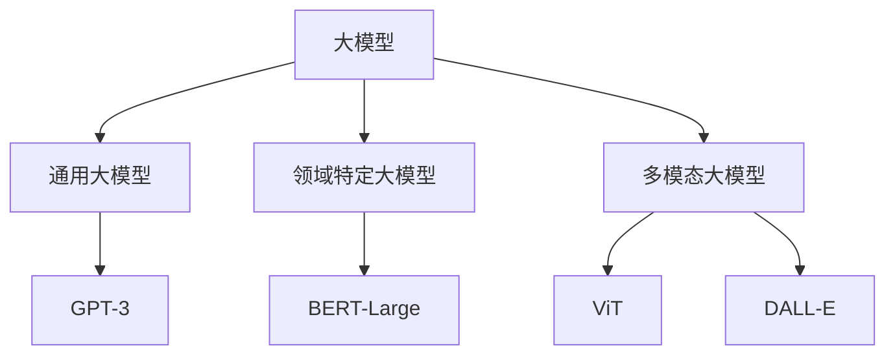

---

## 第2章：大模型技术基础

### 2.1 机器学习基础

机器学习（Machine Learning）是使计算机从数据中学习的一种方法，无需显式地编写规则。主要分为以下几类：

- **监督学习**：有标注的数据进行训练，目标是学习输入和输出之间的映射关系。
- **无监督学习**：没有标注的数据进行训练，目标是发现数据中的结构和模式。
- **强化学习**：通过与环境的交互进行学习，目标是最大化累积奖励。

### 2.2 深度学习原理

深度学习（Deep Learning）是机器学习的一个子领域，通过构建深层次的神经网络模型来模拟人类大脑的决策过程。

**神经网络架构**

神经网络（Neural Network）是一种由大量神经元（节点）组成的网络，通过前向传播和反向传播进行训练。

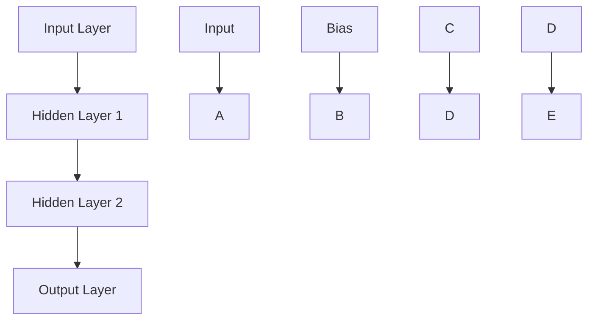

**预训练与微调**

预训练（Pre-training）是指在大量未标注的数据上进行训练，使模型获得一定的泛化能力。微调（Fine-tuning）是指在预训练的基础上，在特定任务的数据上进行进一步的训练，以优化模型在具体任务上的性能。

### 2.3 大模型训练过程

大模型的训练过程通常包括以下步骤：

1. **数据收集与预处理**：收集大量高质量的标注数据，并对数据进行清洗和预处理。
2. **模型初始化**：初始化模型的参数，常用的初始化方法包括随机初始化、Xavier初始化等。
3. **前向传播**：将输入数据传递到模型中，计算出输出结果。
4. **损失函数计算**：根据输出结果和标签计算损失函数的值。
5. **反向传播**：通过梯度下降等优化算法更新模型的参数。
6. **迭代训练**：重复上述步骤，直到模型达到预定的性能指标。

### 2.4 大模型优化技术

为了提高大模型的训练效率和性能，可以使用以下优化技术：

- **批量归一化（Batch Normalization）**：对每个 mini-batch 的输入进行归一化，加速模型收敛。
- **Dropout**：在训练过程中随机丢弃一部分神经元，防止过拟合。
- **学习率调整**：根据模型性能的变化动态调整学习率，常用的策略包括固定学习率、学习率衰减、学习率调度等。

**Mermaid 流程图：大模型训练过程**

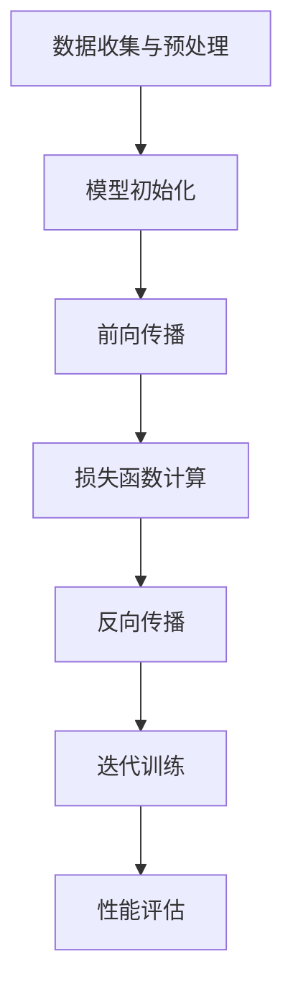

---

## 第3章：大模型的核心算法

### 3.1 神经网络架构

神经网络（Neural Network）是一种由大量神经元（节点）组成的网络，通过前向传播和反向传播进行训练。一个简单的神经网络架构包括输入层、隐藏层和输出层。

- **输入层**：接收输入数据。
- **隐藏层**：对输入数据进行处理，提取特征。
- **输出层**：生成最终输出。

神经元的激活函数通常是非线性函数，如ReLU、Sigmoid、Tanh等。

**伪代码：神经网络的前向传播**

```python
# 输入数据 X，权重 W，偏置 b
for layer in hidden_layers:
    z = np.dot(W, X) + b
    a = activation_function(z)

# 输出层
z = np.dot(W, a) + b
y_pred = activation_function(z)
```

### 3.2 预训练与微调

预训练（Pre-training）是指在大量未标注的数据上进行训练，使模型获得一定的泛化能力。微调（Fine-tuning）是指在预训练的基础上，在特定任务的数据上进行进一步的训练，以优化模型在具体任务上的性能。

**预训练**

预训练通常使用大规模语料库或图像数据集进行，目的是让模型学会捕捉数据中的复杂模式和关系。

**微调**

微调是将预训练好的模型迁移到特定任务上，通过在任务相关的数据上进行训练来优化模型。

**伪代码：微调**

```python
# 加载预训练模型
model.load_pretrained_weights()

# 微调模型在特定任务的数据上
for epoch in range(num_epochs):
    for data, target in dataset:
        model.zero_grad()
        output = model(data)
        loss = loss_function(output, target)
        loss.backward()
        optimizer.step()
```

### 3.3 自然语言处理技术

自然语言处理（Natural Language Processing，NLP）是计算机科学和人工智能领域的一个分支，涉及计算机和人类（自然）语言之间的交互。以下是一些关键的NLP技术：

- **词嵌入（Word Embedding）**：将单词映射到高维空间中的向量，以捕捉单词的语义信息。
- **序列标注（Sequence Labeling）**：对输入序列中的每个元素进行分类，如命名实体识别（NER）。
- **机器翻译（Machine Translation）**：将一种语言的文本自动翻译成另一种语言。
- **对话系统（Dialogue System）**：模拟人类对话的计算机系统，如聊天机器人。

### 3.4 图神经网络

图神经网络（Graph Neural Network，GNN）是一种在图结构数据上训练的神经网络，可以有效地处理复杂的关系数据。

**核心思想**

GNN 通过聚合节点邻域的信息来更新节点的表示。常见的GNN架构包括：

- **GCN（Graph Convolutional Network）**：通过卷积操作聚合邻接节点的特征。
- **GAT（Graph Attention Network）**：引入注意力机制，根据节点邻接关系动态调整聚合权重。

**伪代码：GCN的前向传播**

```python
for layer in range(num_layers):
    # 初始化权重 W 和偏置 b
    A = adjacent_matrix
    X = input_features
    
    for node in nodes:
        # 聚合邻接节点的特征
        h = aggregate_adjacent_nodes(A, X, node)
        
        # 计算前向传播
        z = np.dot(W, h) + b
        a = activation_function(z)

# 输出层
z = np.dot(W, a) + b
y_pred = activation_function(z)
```

---

## 第二部分：大模型应用场景

### 第4章：大模型在金融领域的应用

随着大模型技术的不断发展，其在金融领域的应用也越来越广泛。大模型在金融领域可以应用于风险管理、投资决策、客户服务和保险精算等多个方面。

#### 4.1 风险管理

在风险管理方面，大模型可以通过分析历史数据和市场趋势，预测金融市场的不确定性和风险，为金融机构提供决策支持。例如，大模型可以用于：

- **信用评分**：根据客户的信用历史、财务状况等信息，预测其信用风险。
- **市场预测**：分析宏观经济指标、行业数据等，预测市场走势。

**Mermaid 流程图：大模型在信用评分中的应用**

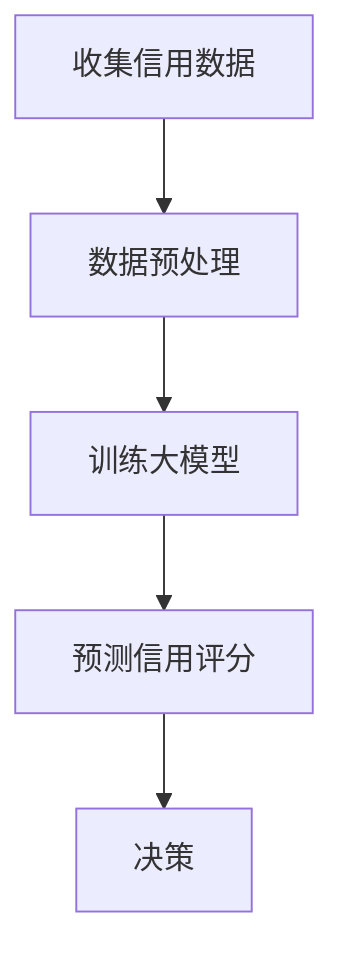

**伪代码：信用评分模型的训练与预测**

```python
# 加载训练数据
X_train, y_train = load_credit_data()

# 初始化大模型
model = CreditRiskModel()

# 训练模型
model.fit(X_train, y_train)

# 预测新客户的信用评分
new_client_data = get_new_client_data()
credit_score = model.predict(new_client_data)
```

#### 4.2 投资决策

在投资决策方面，大模型可以通过分析大量的市场数据，为投资者提供投资建议。例如，大模型可以用于：

- **股票推荐**：分析股票的历史价格、公司财报、市场情绪等，预测股票的未来走势。
- **资产配置**：根据投资者的风险偏好和投资目标，为其推荐最优的资产组合。

**Mermaid 流程图：大模型在股票推荐中的应用**

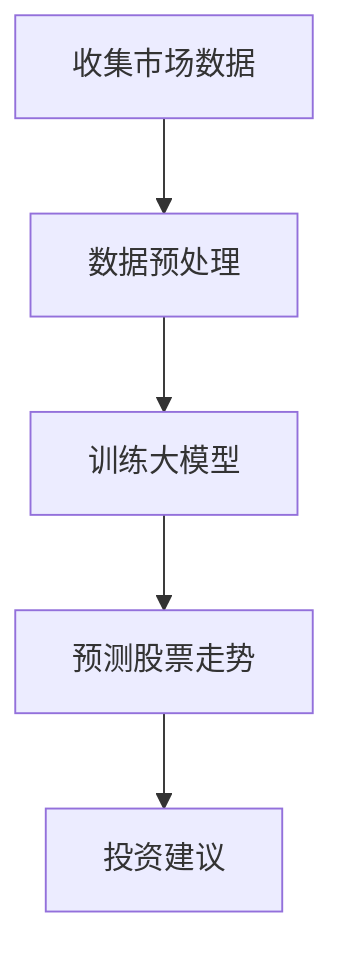

**伪代码：股票推荐模型的训练与预测**

```python
# 加载训练数据
X_train, y_train = load_stock_data()

# 初始化大模型
model = StockRecommendationModel()

# 训练模型
model.fit(X_train, y_train)

# 预测新股票的走势
new_stock_data = get_new_stock_data()
stock_trend = model.predict(new_stock_data)

# 根据股票走势给出投资建议
investment_advice = generate_investment_advice(stock_trend)
```

#### 4.3 客户服务

在客户服务方面，大模型可以通过聊天机器人、语音识别等技术，提供24/7的在线客服服务，提高客户满意度。例如，大模型可以用于：

- **智能客服**：通过自然语言处理技术，理解客户的问题并给出合适的答复。
- **客户行为分析**：分析客户的购买记录、互动行为等，预测其潜在需求。

**Mermaid 流程图：大模型在智能客服中的应用**

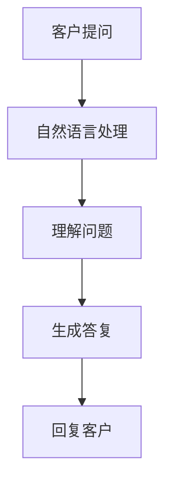

**伪代码：智能客服系统的实现**

```python
# 加载训练好的大模型
model = ChatbotModel()

# 客户提问
customer_query = "我最近想要买一辆新车，有什么好的建议吗？"

# 处理客户提问
processed_query = preprocess_query(customer_query)

# 生成答复
response = model.generate_response(processed_query)

# 回复客户
send_response(response)
```

#### 4.4 保险精算

在保险精算方面，大模型可以通过分析历史理赔数据、客户风险等因素，为保险公司提供定价和风险评估。例如，大模型可以用于：

- **风险评估**：根据客户的年龄、性别、健康状况等信息，评估其风险水平。
- **保险产品定价**：根据市场需求、竞争状况等因素，为保险公司制定合理的保险产品定价策略。

**Mermaid 流程图：大模型在风险评估中的应用**

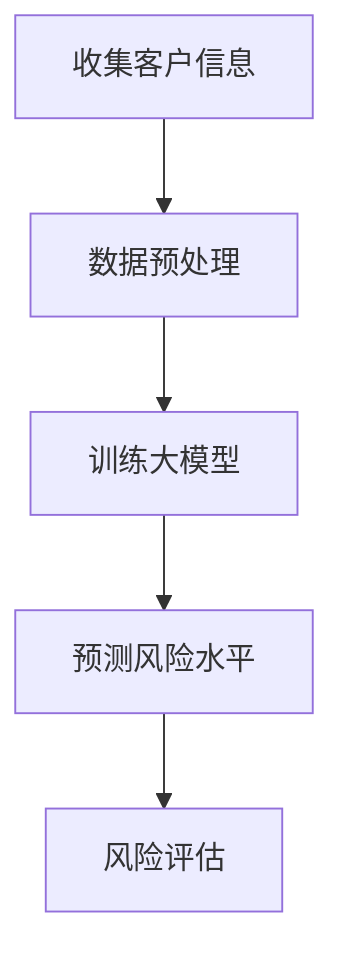

**伪代码：风险评估模型的训练与预测**

```python
# 加载训练数据
X_train, y_train = load_risk_data()

# 初始化大模型
model = RiskAssessmentModel()

# 训练模型
model.fit(X_train, y_train)

# 预测新客户的评估结果
new_client_data = get_new_client_data()
risk_level = model.predict(new_client_data)

# 根据风险水平进行风险评估
risk_assessment = assess_risk_level(risk_level)
```

---

## 第5章：大模型在医疗健康领域的应用

大模型在医疗健康领域具有广泛的应用前景，能够为医生、患者和医疗机构提供有力的支持和帮助。以下是大模型在医疗健康领域的一些主要应用：

#### 5.1 诊断与预测

在大模型的应用中，诊断与预测是最为重要的领域之一。大模型可以通过分析患者的病史、检查报告、基因数据等，预测患者患病的风险，并提供早期预警。

- **疾病预测**：大模型可以分析患者的病史和基因数据，预测患者患某种疾病的风险。例如，通过分析癌症患者的基因突变数据，预测患者患肺癌的风险。
- **并发症预测**：大模型可以分析患者的医疗记录，预测患者可能出现的并发症。例如，通过分析糖尿病患者的血糖记录，预测患者可能出现的酮症酸中毒等并发症。

**Mermaid 流程图：疾病预测的应用**

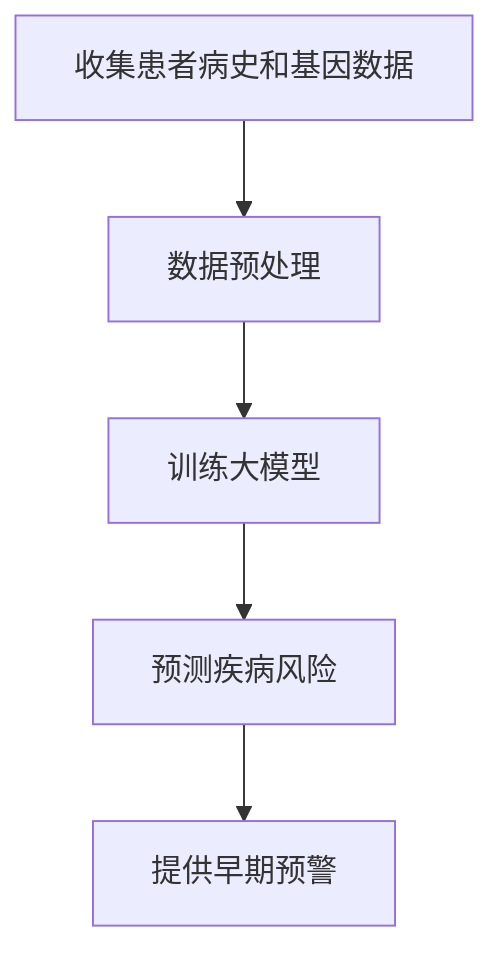

**伪代码：疾病预测模型的训练与预测**

```python
# 加载训练数据
X_train, y_train = load_disease_data()

# 初始化大模型
model = DiseasePredictionModel()

# 训练模型
model.fit(X_train, y_train)

# 预测新患者的疾病风险
new_patient_data = get_new_patient_data()
disease_risk = model.predict(new_patient_data)

# 提供早期预警
if disease_risk > threshold:
    send_early_warning(new_patient_data)
```

#### 5.2 医疗影像分析

大模型在医疗影像分析中的应用越来越广泛，可以用于诊断、病理分析、药物筛选等多个方面。

- **图像分割**：大模型可以通过图像分割技术，将医疗影像中的病灶区域与其他区域区分开来。例如，通过分析CT影像，将肿瘤区域与其他组织区分开来。
- **病理分析**：大模型可以通过分析病理切片图像，诊断患者的病理类型。例如，通过分析肿瘤切片图像，确定肿瘤的类型和分级。

**Mermaid 流程图：图像分割的应用**

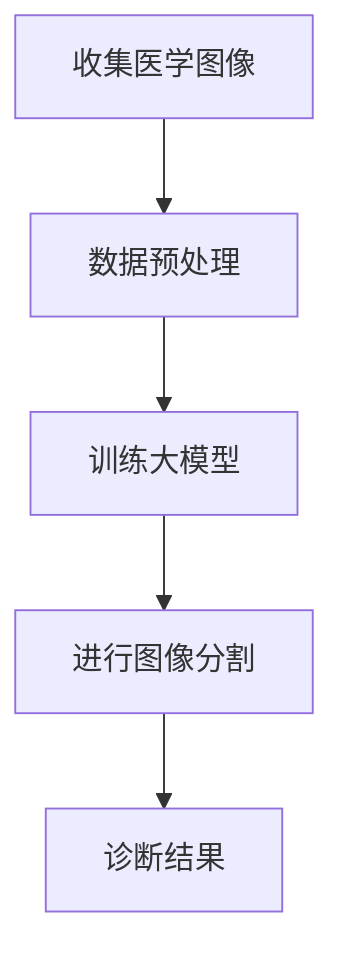

**伪代码：图像分割模型的训练与预测**

```python
# 加载训练数据
X_train, y_train = load_medical_images()

# 初始化大模型
model = ImageSegmentationModel()

# 训练模型
model.fit(X_train, y_train)

# 进行图像分割
new_image = get_new_image()
segmented_image = model.predict(new_image)

# 诊断结果
diagnosis = diagnose(segmented_image)
```

#### 5.3 药物研发

大模型在药物研发中的应用主要体现在药物筛选、药物作用机制分析等方面。

- **药物筛选**：大模型可以通过分析药物的结构和分子信息，预测药物的作用机制和治疗效果。例如，通过分析药物分子与蛋白质的结合情况，预测药物的疗效。
- **药物作用机制分析**：大模型可以通过分析药物的分子结构和生物体内的反应过程，揭示药物的作用机制。例如，通过分析药物在体内的代谢途径，了解药物的作用机制。

**Mermaid 流程图：药物筛选的应用**

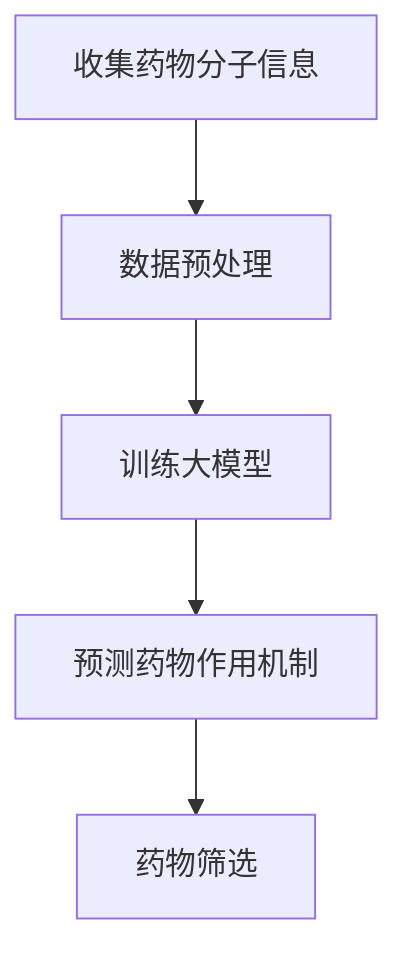

**伪代码：药物筛选模型的训练与预测**

```python
# 加载训练数据
X_train, y_train = load_drug_data()

# 初始化大模型
model = DrugScreeningModel()

# 训练模型
model.fit(X_train, y_train)

# 预测药物作用机制
new_drug = get_new_drug()
drug_mechanism = model.predict(new_drug)

# 药物筛选
if drug_mechanism > threshold:
    select_drug(new_drug)
```

#### 5.4 健康管理

大模型在健康管理中的应用主要体现在健康风险评估、健康指导等方面。

- **健康风险评估**：大模型可以通过分析患者的健康数据，预测患者未来可能出现的健康问题。例如，通过分析患者的饮食习惯、运动习惯等，预测患者患慢性疾病的风险。
- **健康指导**：大模型可以根据患者的健康数据，提供个性化的健康建议。例如，通过分析患者的体检报告，提供针对性的饮食建议、运动建议等。

**Mermaid 流�程图：健康风险评估的应用**

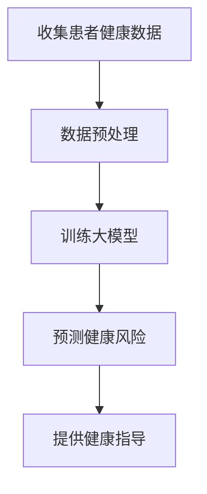

**伪代码：健康风险评估模型的训练与预测**

```python
# 加载训练数据
X_train, y_train = load_health_data()

# 初始化大模型
model = HealthRiskAssessmentModel()

# 训练模型
model.fit(X_train, y_train)

# 预测健康风险
new_patient_data = get_new_patient_data()
health_risk = model.predict(new_patient_data)

# 提供健康指导
if health_risk > threshold:
    provide_health_advice(new_patient_data)
```

---

## 第6章：大模型在零售与电商领域的应用

大模型在零售与电商领域的应用正日益普及，它们通过深入分析用户行为和市场动态，为商家和消费者提供高度个性化的服务和产品推荐。

#### 6.1 个性化推荐

个性化推荐是零售与电商领域中最为广泛使用的大模型应用之一。通过分析用户的购买历史、搜索记录、浏览行为等数据，大模型能够预测用户的兴趣和需求，从而推荐相应的商品。

- **协同过滤**：基于用户之间的相似性，推荐用户可能喜欢的商品。分为用户协同过滤和项目协同过滤。
- **内容推荐**：基于商品的特征（如价格、品牌、类别等）进行推荐。
- **混合推荐**：结合协同过滤和内容推荐，提供更精准的推荐。

**Mermaid 流程图：个性化推荐系统**

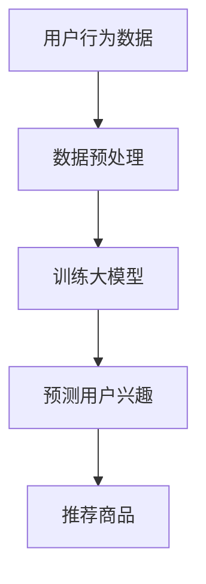

**伪代码：个性化推荐系统的实现**

```python
# 加载用户行为数据
user_data = load_user_behavior_data()

# 初始化大模型
model = RecommenderModel()

# 训练模型
model.fit(user_data)

# 预测用户兴趣
user_interest = model.predict(user_interest_data)

# 推荐商品
recommended_products = recommend_products(user_interest)
```

#### 6.2 库存管理

大模型在库存管理中的应用可以帮助零售商优化库存水平，减少库存积压和缺货情况。

- **需求预测**：通过分析历史销售数据、市场趋势等，预测商品的未来需求，从而调整库存水平。
- **库存优化**：基于需求预测和商品周转率，制定最优的库存策略。

**Mermaid 流程图：库存管理应用**

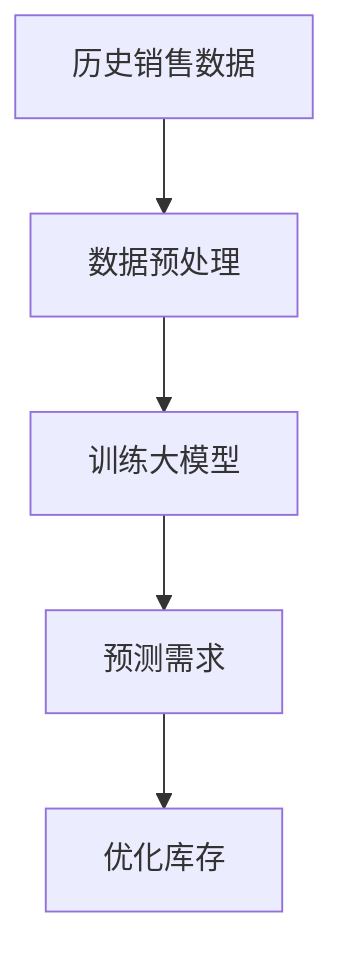

**伪代码：库存管理模型的实现**

```python
# 加载历史销售数据
sales_data = load_sales_data()

# 初始化大模型
model = DemandPredictionModel()

# 训练模型
model.fit(sales_data)

# 预测需求
predicted_demand = model.predict(new_sales_data)

# 优化库存
optimize_inventory(predicted_demand)
```

#### 6.3 供应链优化

大模型在供应链优化中的应用可以帮助企业提高供应链的效率和灵活性。

- **物流路径优化**：通过分析运输成本、交通状况等数据，优化物流路径，降低运输成本。
- **库存协同**：通过分析各仓库的库存水平和需求预测，实现库存的协同管理，减少库存积压和缺货情况。

**Mermaid 流程图：供应链优化应用**

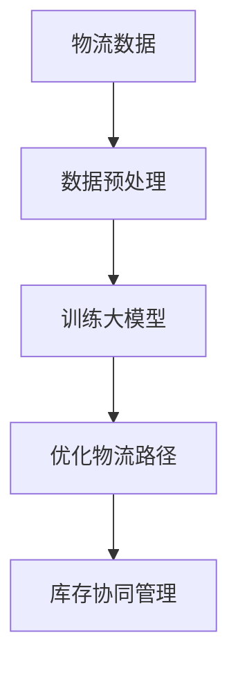

**伪代码：供应链优化模型的实现**

```python
# 加载物流数据
logistics_data = load_logistics_data()

# 初始化大模型
model = LogisticsOptimizationModel()

# 训练模型
model.fit(logistics_data)

# 优化物流路径
optimized_paths = model.optimize_paths()

# 库存协同管理
coordinated_inventory = model.coordinated_inventory()
```

#### 6.4 客户体验优化

大模型在客户体验优化中的应用可以帮助企业提高用户满意度，提升品牌形象。

- **个性化营销**：通过分析用户的兴趣和行为，提供个性化的营销内容和促销活动。
- **服务优化**：通过分析用户的反馈和行为数据，优化客服流程和服务质量。

**Mermaid 流程图：客户体验优化应用**

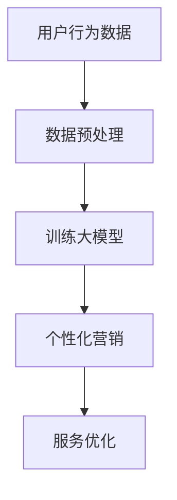

**伪代码：客户体验优化模型的实现**

```python
# 加载用户行为数据
user_data = load_user_behavior_data()

# 初始化大模型
model = CustomerExperienceModel()

# 训练模型
model.fit(user_data)

# 个性化营销
personalized_marketing = model.generate_marketing_content()

# 服务优化
service_optimization = model.optimize_customer_service()
```

---

## 第7章：大模型在制造业的应用

随着工业4.0的推进，大模型在制造业的应用逐渐成为提高生产效率、降低成本、增强产品质量的关键技术。以下是大模型在制造业中的几个主要应用场景：

#### 7.1 智能生产

智能生产是制造业向智能化转型的重要方向，大模型在其中扮演了关键角色。

- **生产预测**：通过分析历史生产数据、设备状态、订单需求等，大模型可以预测未来的生产需求和产量，帮助企业合理安排生产计划。
- **生产优化**：通过优化生产流程，提高生产效率。例如，根据设备状态和订单优先级，动态调整生产线的运行参数，实现生产线的智能调度。

**Mermaid 流程图：生产预测应用**

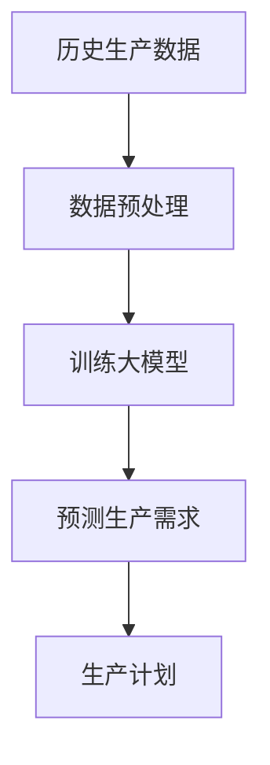

**伪代码：生产预测模型的实现**

```python
# 加载历史生产数据
production_data = load_production_data()

# 初始化大模型
model = ProductionPredictionModel()

# 训练模型
model.fit(production_data)

# 预测生产需求
predicted_demand = model.predict(new_production_data)

# 制定生产计划
production_plan = create_production_plan(predicted_demand)
```

#### 7.2 质量控制

大模型在质量控制中的应用可以帮助企业提高产品的质量，减少次品率。

- **缺陷检测**：通过分析生产过程中的数据，如设备传感器数据、生产参数等，大模型可以实时检测产品是否存在缺陷。
- **质量预测**：通过分析历史质量数据，大模型可以预测产品的质量水平，提前采取预防措施。

**Mermaid 流程图：缺陷检测应用**

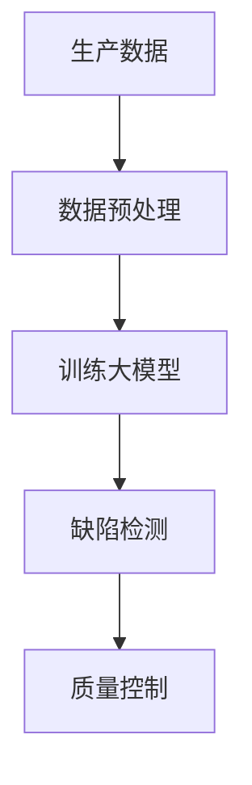

**伪代码：缺陷检测模型的实现**

```python
# 加载生产数据
production_data = load_production_data()

# 初始化大模型
model = DefectDetectionModel()

# 训练模型
model.fit(production_data)

# 缺陷检测
defects_detected = model.detect_defects(new_production_data)

# 质量控制
if defects_detected:
    quality_control Maßnahmen()
```

#### 7.3 维护预测

维护预测是提高设备利用率和降低维护成本的重要手段。

- **故障预测**：通过分析设备运行数据、历史维护记录等，大模型可以预测设备可能出现的故障，提前安排维护。
- **维护优化**：通过优化维护计划，减少不必要的维护，降低维护成本。

**Mermaid 流程图：故障预测应用**

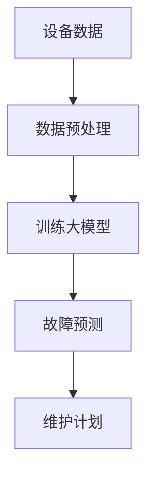

**伪代码：故障预测模型的实现**

```python
# 加载设备数据
device_data = load_device_data()

# 初始化大模型
model = FaultPredictionModel()

# 训练模型
model.fit(device_data)

# 故障预测
predicted_faults = model.predict_faults(new_device_data)

# 维护计划
maintenance_plan = create_maintenance_plan(predicted_faults)
```

#### 7.4 产品设计优化

大模型在产品设计优化中的应用可以帮助企业提高产品的设计质量，缩短研发周期。

- **设计优化**：通过分析历史设计数据、用户反馈等，大模型可以提供产品的优化建议，如改进设计、提高性能等。
- **快速迭代**：通过快速生成不同设计方案，大模型可以帮助企业进行快速迭代，缩短产品研发周期。

**Mermaid 流程图：产品设计优化应用**

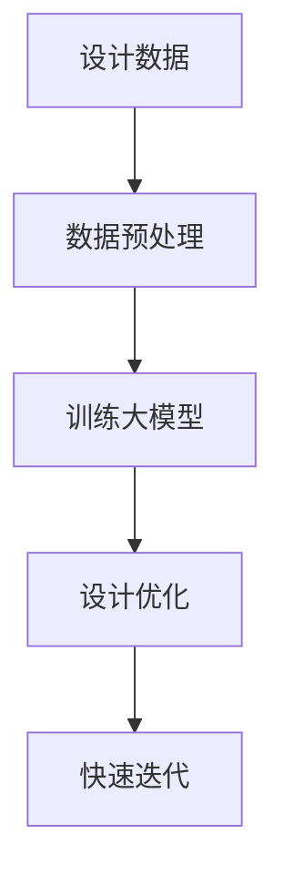

**伪代码：设计优化模型的实现**

```python
# 加载设计数据
design_data = load_design_data()

# 初始化大模型
model = DesignOptimizationModel()

# 训练模型
model.fit(design_data)

# 设计优化
optimized_design = model.optimize_design()

# 快速迭代
rapid Iteration(optimized_design)
```

---

## 第三部分：创业者如何利用大模型发掘新增长点

### 第8章：创业者视角的大模型应用

#### 8.1 创业者对大模型的需求

随着大模型技术的快速发展，创业者们对大模型的需求日益增加。这些需求主要体现在以下几个方面：

- **高效数据处理**：创业者通常面临大量复杂的数据，需要高效的数据处理和清洗能力，以便从数据中提取有价值的信息。
- **智能化决策**：大模型能够提供智能化的决策支持，帮助创业者做出更为精准和高效的决策。
- **创新产品开发**：大模型的应用可以帮助创业者快速开发创新产品，缩短产品研发周期，提高市场竞争力。

#### 8.2 大模型助力创业

大模型在创业中的应用具有广泛的前景，可以为创业者带来以下几方面的助力：

- **市场分析**：大模型可以通过分析市场数据，帮助创业者了解市场需求和竞争态势，制定合适的市场策略。
- **客户行为分析**：大模型可以通过分析用户行为数据，帮助创业者了解客户需求，提供个性化服务和产品推荐。
- **产品优化**：大模型可以通过优化产品设计，提高产品性能和用户体验，从而提升产品的市场竞争力。

#### 8.3 大模型应用的风险与挑战

尽管大模型在创业中具有巨大的潜力，但创业者也需要面对一些风险和挑战：

- **数据隐私和安全**：大模型的应用涉及大量敏感数据，创业者需要确保数据的隐私和安全。
- **技术门槛**：大模型技术复杂，创业者需要具备一定的技术背景和团队，才能有效应用大模型。
- **持续更新和优化**：大模型需要不断更新和优化，以适应不断变化的市场和技术环境，这需要创业者投入大量的时间和资源。

**Mermaid 流程图：创业者利用大模型的过程**

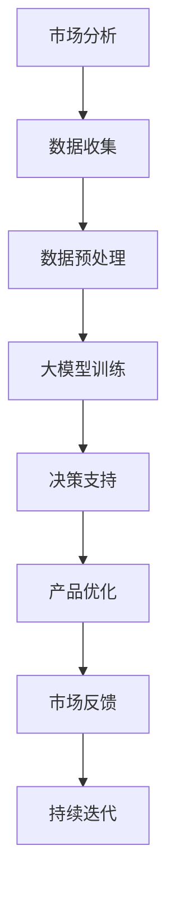

---

### 第9章：大模型创业案例解析

在探讨创业者如何利用大模型发掘新增长点时，分析一些成功的大模型创业案例是非常有价值的。以下介绍几个具有代表性的成功案例：

#### 9.1 成功案例一：XX金融科技企业

**公司背景**：XX金融科技公司专注于利用人工智能和大数据技术为金融机构提供智能风控、精准营销和财富管理服务。

**解决方案**：该公司开发了一款基于大模型的智能风控系统，通过分析用户的历史交易记录、信用评分、社会关系等多维度数据，实时评估用户的风险水平，为金融机构提供风险预警和决策支持。

**效果**：该系统有效降低了金融机构的坏账率，提高了贷款审批的准确性，同时为客户提供了个性化的财富管理建议，受到了市场的高度认可。

**关键因素**：成功的关键在于：

- **全面的数据收集与处理**：通过多种数据源，收集全面、准确的数据，为模型训练提供高质量的数据支持。
- **强大的技术团队**：具备深厚的大模型技术积累，能够持续优化模型，提高系统性能。

#### 9.2 成功案例二：YY医疗健康公司

**公司背景**：YY医疗健康公司致力于利用人工智能技术改善医疗诊断和患者管理。

**解决方案**：该公司开发了一款基于大模型的全自动医学影像分析系统，能够对医疗影像进行快速、准确的诊断，帮助医生提高诊断效率，降低误诊率。

**效果**：该系统在多个医院的临床应用中取得了显著成效，大大提高了医生的诊断速度和准确性，同时也降低了患者的就诊成本。

**关键因素**：成功的关键在于：

- **高质量的医学影像数据**：通过合作医疗机构，获取高质量的医学影像数据，为模型训练提供了可靠的数据基础。
- **严格的模型验证和迭代**：通过严格的模型验证和不断优化，确保了系统的诊断准确性和稳定性。

#### 9.3 成功案例三：ZZ电商公司

**公司背景**：ZZ电商公司是一家专注于个性化推荐和用户行为分析的电商平台。

**解决方案**：该公司基于大模型技术，开发了一套智能推荐系统，能够根据用户的浏览历史、购物习惯等数据，为用户提供个性化的商品推荐。

**效果**：该系统显著提高了用户的购物体验，增加了用户黏性和转化率，同时优化了库存管理，降低了库存成本。

**关键因素**：成功的关键在于：

- **用户数据的高效利用**：通过多种数据收集手段，获取全面、详细的用户数据，为模型训练提供了丰富的数据支持。
- **灵活的推荐策略**：根据不同用户群体的特点，制定灵活的推荐策略，提高推荐的相关性和用户满意度。

---

### 第10章：创业者如何搭建大模型团队

搭建一个高效的大模型团队是创业者成功利用大模型技术的重要前提。以下是从团队构建、技术选型、数据获取与处理、项目管理与团队协作等角度，提供一些建议：

#### 10.1 大模型团队的构建

构建大模型团队时，需要考虑以下角色：

- **数据科学家**：负责数据预处理、模型设计和优化等。
- **机器学习工程师**：负责模型训练、部署和运维等。
- **软件工程师**：负责后台系统的开发与维护。
- **产品经理**：负责产品设计和需求分析。
- **数据工程师**：负责数据存储、处理和传输等。

#### 10.2 技术选型与工具

在选择大模型技术时，需要考虑以下因素：

- **框架**：如TensorFlow、PyTorch等，选择适合团队技能和项目需求的框架。
- **硬件**：如GPU、TPU等，确保有足够的硬件资源支持大模型的训练。
- **数据库**：选择适合数据规模和类型的数据库，如Hadoop、MongoDB等。

#### 10.3 数据获取与处理

数据是大模型训练的基础，创业者需要：

- **数据收集**：通过各种渠道获取高质量的数据，如公开数据集、合作伙伴数据等。
- **数据预处理**：清洗、归一化、去噪等，确保数据质量。
- **数据存储**：选择合适的存储方案，如云存储、分布式数据库等，确保数据的安全和可扩展性。

#### 10.4 项目管理与团队协作

项目管理是确保项目按时、按质完成的关键，创业者需要：

- **项目管理工具**：如Jira、Trello等，管理项目进度和任务分配。
- **代码管理**：如Git，确保代码的可维护性和协作性。
- **团队协作**：定期举行团队会议，沟通项目进展和解决团队协作中的问题。

**Mermaid 流程图：大模型团队协作流程**

```mermaid
graph TD
A[数据收集] --> B[数据预处理]
B --> C[模型设计]
C --> D[模型训练]
D --> E[模型优化]
E --> F[模型部署]
F --> G[项目评估]
G --> H[团队协作]
```

---

### 第11章：大模型创业的商业模式

在创业过程中，选择合适的商业模式是成功的关键之一。以下介绍几种常见的大模型创业商业模式：

#### 11.1 B2B模式

B2B（Business to Business）模式是指企业通过为大企业提供技术解决方案来获取收入。

- **产品**：为企业提供大模型技术解决方案，如智能风控系统、自动化医疗诊断系统等。
- **客户**：大型企业，如金融机构、医疗机构等。
- **盈利模式**：通过技术许可、服务合同等方式获取收入。

#### 11.2 B2C模式

B2C（Business to Consumer）模式是指企业直接向消费者提供大模型技术产品。

- **产品**：为消费者提供个性化服务，如智能推荐系统、健康管理平台等。
- **客户**：消费者。
- **盈利模式**：通过订阅费、广告收入等方式获取收入。

#### 11.3 平台模式

平台模式是指企业通过构建技术平台，吸引第三方开发者和企业入驻，共同创造价值。

- **产品**：构建大模型技术平台，提供开发工具、数据集、计算资源等。
- **客户**：开发者、企业。
- **盈利模式**：通过平台收费、广告收入、交易佣金等方式获取收入。

#### 11.4 开放式平台模式

开放式平台模式是指企业通过开放大模型技术，吸引全球开发者参与，共同推动技术进步。

- **产品**：开放大模型源代码、API等，鼓励开发者创新和改进。
- **客户**：全球开发者。
- **盈利模式**：通过平台收费、技术授权等方式获取收入。

**Mermaid 流程图：大模型创业商业模式**

```mermaid
graph TB
A[B2B模式] --> B[产品]
B --> C[客户]
C --> D[盈利模式]
E[B2C模式] --> F[产品]
F --> G[客户]
G --> H[盈利模式]
I[平台模式] --> J[产品]
J --> K[客户]
K --> L[盈利模式]
M[开放式平台模式] --> N[产品]
N --> O[客户]
O --> P[盈利模式]
```

---

### 第12章：未来展望

大模型技术的快速发展为创业者带来了巨大的机遇，同时也带来了新的挑战。以下是对未来大模型技术发展的展望：

#### 12.1 大模型技术的未来趋势

- **计算能力提升**：随着硬件技术的发展，大模型的计算能力将进一步提升，使得更复杂和更大规模的任务成为可能。
- **数据隐私和安全**：随着数据隐私和安全问题的日益突出，大模型将更加注重数据隐私保护和安全机制。
- **跨领域融合**：大模型将与其他领域（如生物、医学、物理等）的技术融合，推动跨领域的发展。
- **智能化与自动化**：大模型将在智能化和自动化方面发挥更大的作用，提高生产效率和服务质量。

#### 12.2 创业者如何把握未来机遇

- **紧跟技术趋势**：关注大模型技术的最新发展，及时调整业务方向和战略规划。
- **加强团队建设**：构建具备多学科背景的团队，提高技术创新和项目实施能力。
- **合作与开放**：与行业内的领先企业和研究机构建立合作关系，共享资源，共同推动技术进步。
- **注重数据隐私和安全**：确保数据的合法合规使用，建立完善的数据隐私和安全体系。

#### 12.3 大模型在产业应用中的潜在价值

- **提高生产效率**：大模型技术可以帮助企业实现智能化生产，提高生产效率，降低成本。
- **优化服务质量**：大模型技术可以提供更精准的服务预测和个性化推荐，提高用户满意度。
- **推动产业升级**：大模型技术可以推动传统产业向智能化和数字化转型，提高产业竞争力。
- **创新产品和服务**：大模型技术可以为企业提供创新的思路和方法，开发出更具竞争力的产品和服务。

**Mermaid 流程图：未来大模型技术趋势与机遇**

```mermaid
graph TB
A[计算能力提升] --> B[数据隐私和安全]
B --> C[跨领域融合]
C --> D[智能化与自动化]
E[紧跟技术趋势] --> F[加强团队建设]
F --> G[合作与开放]
G --> H[注重数据隐私和安全]
I[提高生产效率] --> J[优化服务质量]
J --> K[推动产业升级]
K --> L[创新产品和服务]
```

---

## 附录

### 附录A：大模型相关资源与工具

- **机器学习框架**：TensorFlow、PyTorch、Keras
- **大模型开源项目**：GPT-3、BERT、ViT、DALL-E
- **大模型常用数据库与API**：MongoDB、MySQL、Redis、AWS S3、Google Cloud Storage

### 附录B：大模型应用实践案例

- **金融领域实践案例**：XX金融科技公司的智能风控系统
- **医疗健康领域实践案例**：YY医疗健康公司的全自动医学影像分析系统
- **零售与电商领域实践案例**：ZZ电商公司的智能推荐系统
- **制造业领域实践案例**：AA制造公司的智能生产与质量控制系统

---

## 作者

**作者：AI天才研究院/AI Genius Institute & 禅与计算机程序设计艺术 /Zen And The Art of Computer Programming**

