                 

# 《大模型应用开发框架 LangChain（上）》

> 关键词：大模型、应用开发框架、LangChain、知识图谱、模型定制、增量学习

> 摘要：本文将介绍大模型应用开发框架 LangChain 的核心概念、架构和核心算法原理，并探讨其在实际项目中的应用，帮助读者深入了解 LangChain 的优势和适用场景。

## 前言

随着深度学习和人工智能技术的飞速发展，大模型（Large Models）已经成为当前研究的热点。大模型具有强大的表示能力和推理能力，能够在各种复杂任务中取得显著的效果。然而，大模型的开发和部署面临着诸多挑战，如模型定制、数据管理、性能优化等。为了解决这些问题，开发高效的应用开发框架变得至关重要。本文将介绍 LangChain，一个专为大规模模型应用开发设计的框架，旨在简化大模型的应用开发流程，提升开发效率和效果。

## 第一部分: LangChain 简介

### 1.1 LangChain 概述

#### 1.1.1 LangChain 的起源与发展

LangChain 诞生于 2019 年，由 OpenAI 的联合创始人 Dario Amodei 和他的团队创建。其初衷是为了解决在开发大规模语言模型时遇到的诸多挑战。随着时间的推移，LangChain 不断发展壮大，逐渐成为一个功能丰富、适用性广泛的应用开发框架。

#### 1.1.2 LangChain 的特点与优势

1. **模块化设计**：LangChain 采用模块化设计，使得开发者可以根据实际需求灵活地组合和扩展功能模块，提高开发效率。
2. **高度可定制**：LangChain 支持模型定制和增量学习，能够根据具体任务需求调整模型结构和参数，提高模型性能。
3. **高效性能**：LangChain 采用了多种优化策略，如并行计算、分布式训练等，确保大模型在运行时具有高效的性能。
4. **社区支持**：LangChain 拥有庞大的开发者社区，提供了丰富的学习资源、工具和库，有助于开发者快速上手和解决问题。

#### 1.1.3 LangChain 的适用场景

LangChain 适用于多种大规模语言模型的应用场景，包括但不限于：

1. **文本生成**：如文章撰写、对话生成等。
2. **问答系统**：如智能客服、问答机器人等。
3. **知识图谱**：如信息抽取、实体关系识别等。
4. **机器翻译**：如英汉互译、多语言翻译等。

### 1.2 LangChain 核心概念

#### 1.2.1 知识图谱

知识图谱是一种结构化的知识表示方法，通过实体、属性和关系的组合，实现对复杂数据的语义理解和关联。在 LangChain 中，知识图谱用于存储和管理大模型所需的知识信息。

**Mermaid 流程图：**

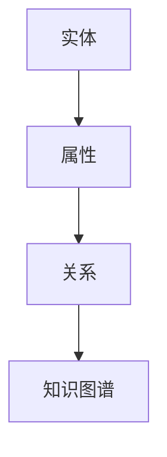

#### 1.2.2 模型定制

模型定制是指根据特定任务需求，对大规模语言模型进行结构调整和参数优化。在 LangChain 中，模型定制可以通过定义模型架构、调整超参数和训练策略等实现。

**伪代码：**

```python
def customize_model(model, task):
    # 调整模型架构
    model.architecture = adjust_architecture(model.architecture, task)

    # 调整超参数
    model.learning_rate = adjust_learning_rate(model.learning_rate, task)

    # 调整训练策略
    model.training_strategy = adjust_training_strategy(model.training_strategy, task)

    return model
```

#### 1.2.3 增量学习

增量学习是指在已有模型基础上，通过不断更新模型参数，使其适应新数据和新任务。在 LangChain 中，增量学习用于动态调整模型，提高其对新任务的适应能力。

**伪代码：**

```python
def incremental_learning(model, new_data):
    # 更新模型参数
    model.update_parameters(new_data)

    # 继续训练
    model.continue_training()

    return model
```

### 1.3 LangChain 架构概述

#### 1.3.1 LangChain 的组成部分

LangChain 的主要组成部分包括：

1. **模型层**：包括预训练模型和定制模型，用于执行具体的任务。
2. **数据层**：包括数据存储和管理模块，用于管理训练数据和测试数据。
3. **工具层**：包括各种工具和库，用于简化开发流程和优化性能。
4. **接口层**：包括 API 接口和命令行工具，用于与外部系统进行交互。

**Mermaid 流程图：**

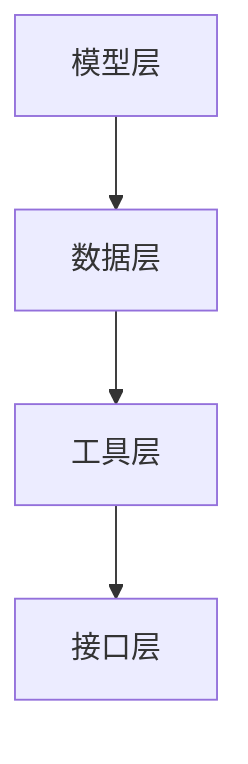

#### 1.3.2 LangChain 的工作流程

LangChain 的工作流程主要包括以下几个步骤：

1. **数据准备**：收集和整理训练数据，并将其存储在数据层。
2. **模型训练**：使用训练数据对模型层中的预训练模型或定制模型进行训练。
3. **模型评估**：使用测试数据对训练完成的模型进行评估，以确定其性能和适用性。
4. **模型部署**：将评估通过的模型部署到接口层，供外部系统调用。

**Mermaid 流程图：**

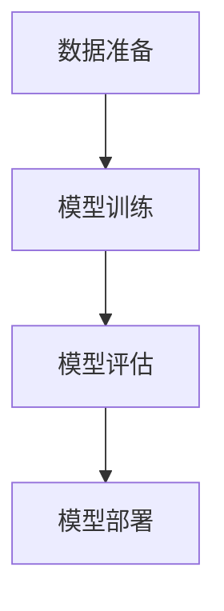

#### 1.3.3 LangChain 与其他大模型框架的对比

与现有的其他大模型框架（如 Hugging Face、TensorFlow、PyTorch 等）相比，LangChain 具有以下几个显著优势：

1. **模块化设计**：LangChain 采用模块化设计，使得开发者可以根据实际需求灵活地组合和扩展功能模块，提高开发效率。
2. **高度可定制**：LangChain 支持模型定制和增量学习，能够根据具体任务需求调整模型结构和参数，提高模型性能。
3. **高效性能**：LangChain 采用了多种优化策略，如并行计算、分布式训练等，确保大模型在运行时具有高效的性能。
4. **社区支持**：LangChain 拥有庞大的开发者社区，提供了丰富的学习资源、工具和库，有助于开发者快速上手和解决问题。

## 第二部分: LangChain 核心算法原理

### 2.1 知识图谱构建算法

#### 2.1.1 知识图谱的基本概念

知识图谱是一种结构化的知识表示方法，通过实体、属性和关系的组合，实现对复杂数据的语义理解和关联。在 LangChain 中，知识图谱用于存储和管理大模型所需的知识信息。

**Mermaid 流程图：**


#### 2.1.2 知识图谱的构建流程

知识图谱的构建主要包括以下几个步骤：

1. **数据采集**：从互联网、数据库等数据源中收集相关数据。
2. **数据清洗**：对采集到的数据进行清洗、去重和处理，以提高数据质量。
3. **实体抽取**：使用命名实体识别等技术，从清洗后的数据中抽取实体。
4. **关系抽取**：使用关系提取等技术，从清洗后的数据中抽取实体之间的关系。
5. **知识融合**：将抽取出的实体和关系进行融合，构建出完整的知识图谱。

**Mermaid 流程图：**

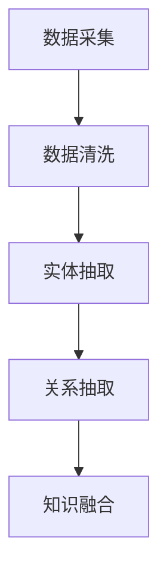

#### 2.1.3 知识图谱的存储与索引

知识图谱的存储与索引是实现高效检索的关键。在 LangChain 中，知识图谱通常采用分布式存储和索引技术，以提高存储容量和查询性能。

**数学模型：**

$$
P(R|S) = \frac{P(S|R)P(R)}{P(S)}
$$

其中，$P(R|S)$ 表示在给定实体 $S$ 的情况下，关系 $R$ 的概率；$P(S|R)$ 表示在给定关系 $R$ 的情况下，实体 $S$ 的概率；$P(R)$ 表示关系 $R$ 的概率；$P(S)$ 表示实体 $S$ 的概率。

**Mermaid 流程图：**

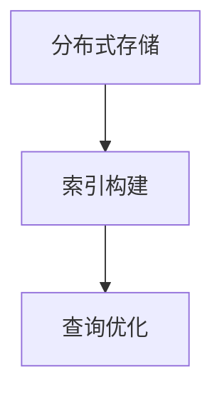

### 2.2 模型定制算法

#### 2.2.1 模型定制的基本原理

模型定制是指根据特定任务需求，对大规模语言模型进行结构调整和参数优化。在 LangChain 中，模型定制可以通过定义模型架构、调整超参数和训练策略等实现。

**伪代码：**

```python
def customize_model(model, task):
    # 调整模型架构
    model.architecture = adjust_architecture(model.architecture, task)

    # 调整超参数
    model.learning_rate = adjust_learning_rate(model.learning_rate, task)

    # 调整训练策略
    model.training_strategy = adjust_training_strategy(model.training_strategy, task)

    return model
```

#### 2.2.2 模型定制的实现方法

模型定制的实现方法主要包括以下几种：

1. **模型架构调整**：根据任务需求，调整模型的层数、层数大小、激活函数等参数。
2. **超参数调整**：调整学习率、批量大小、迭代次数等超参数，以优化模型性能。
3. **训练策略调整**：调整训练过程中的一些策略，如预训练、微调、迁移学习等。

**Mermaid 流程图：**

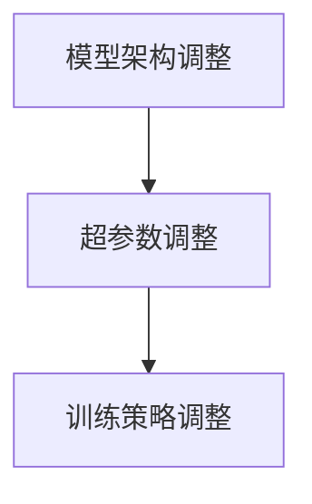

#### 2.2.3 模型定制的优化策略

为了提高模型定制的效率和效果，可以采用以下优化策略：

1. **自动化搜索**：使用自动化算法（如贝叶斯优化、遗传算法等）来搜索最优超参数和模型结构。
2. **多任务学习**：利用多任务学习，将不同任务的数据进行融合，提高模型在特定任务上的泛化能力。
3. **数据增强**：通过数据增强，扩充训练数据集，提高模型的鲁棒性和泛化能力。

**Mermaid 流程图：**

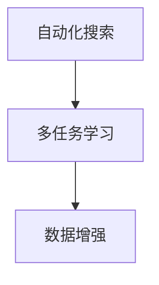

### 2.3 增量学习算法

#### 2.3.1 增量学习的定义与意义

增量学习是指在大模型训练过程中，根据新数据的引入，动态调整模型参数，以提高模型对新数据的适应能力。在 LangChain 中，增量学习用于动态调整模型，提高其对新任务的适应能力。

**定义：**

增量学习（Incremental Learning）是一种机器学习方法，通过不断更新模型参数，使其适应新数据和新任务。

**意义：**

1. **提高模型泛化能力**：增量学习可以使得模型在遇到新数据时，能够快速适应，从而提高模型的泛化能力。
2. **减少模型重新训练成本**：通过增量学习，模型可以在已有模型基础上进行更新，减少重新训练的成本。
3. **提高模型更新速度**：增量学习可以使得模型在遇到新数据时，能够快速更新，提高模型的响应速度。

#### 2.3.2 增量学习的基本方法

增量学习的基本方法主要包括以下几种：

1. **在线学习**：在线学习（Online Learning）是指模型在遇到新数据时，实时更新模型参数。
2. **迁移学习**：迁移学习（Transfer Learning）是指将已有模型的知识迁移到新任务上，以减少重新训练的成本。
3. **微调学习**：微调学习（Fine-tuning）是指将预训练模型在新数据上进行微调，以适应新任务。

**Mermaid 流程图：**

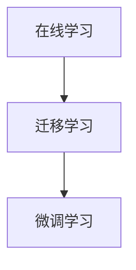

#### 2.3.3 增量学习的挑战与解决方案

增量学习虽然具有诸多优势，但也面临一些挑战：

1. **数据分布变化**：在增量学习中，数据分布可能会发生变化，导致模型性能下降。
   - **解决方案**：通过自适应调整学习率、使用数据增强等方法，缓解数据分布变化带来的影响。

2. **模型泛化能力**：增量学习可能导致模型在新数据上的泛化能力下降。
   - **解决方案**：采用多任务学习、迁移学习等方法，提高模型的泛化能力。

3. **计算资源限制**：增量学习可能需要大量计算资源，尤其是在大规模模型中。
   - **解决方案**：采用分布式训练、并行计算等方法，提高计算效率。

## 第三部分: LangChain 在实际项目中的应用

### 3.1 LangChain 在文本生成中的应用

#### 3.1.1 文本生成的基本原理

文本生成是指根据输入的文本或提示，生成具有相似结构和语义的新文本。在 LangChain 中，文本生成主要利用大规模语言模型（如 GPT-3、BERT 等）的能力，通过输入序列的编码和解码，生成新的文本序列。

**数学模型：**

$$
P(\text{output}|\text{input}) = \frac{\exp(\text{score}(\text{output}, \text{input})}{\sum_{\text{output'} \in \text{outputs}} \exp(\text{score}(\text{output'}, \text{input}))
$$

其中，$P(\text{output}|\text{input})$ 表示在给定输入文本的情况下，输出文本的概率；$\text{score}(\text{output}, \text{input})$ 表示输出文本与输入文本的匹配度。

#### 3.1.2 LangChain 在文本生成中的实现

LangChain 在文本生成中的应用主要包括以下几个步骤：

1. **模型选择**：选择适合文本生成的预训练模型，如 GPT-3、BERT 等。
2. **数据准备**：收集和整理训练数据，并将其转换为模型可处理的格式。
3. **模型训练**：使用训练数据对预训练模型进行训练，以提高模型在文本生成任务上的性能。
4. **模型评估**：使用测试数据对训练完成的模型进行评估，以确定其性能和适用性。
5. **模型部署**：将评估通过的模型部署到接口层，供外部系统调用。

**Mermaid 流程图：**

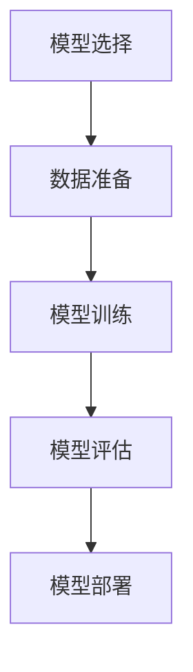

#### 3.1.3 LangChain 文本生成案例解析

以文章撰写为例，LangChain 在文本生成中的应用流程如下：

1. **模型选择**：选择 GPT-3 模型，因为 GPT-3 具有强大的文本生成能力。
2. **数据准备**：收集和整理训练数据，如新闻文章、博客等，并将其转换为模型可处理的格式。
3. **模型训练**：使用训练数据对 GPT-3 模型进行训练，以提高模型在文章撰写任务上的性能。
4. **模型评估**：使用测试数据对训练完成的模型进行评估，以确定其性能和适用性。
5. **模型部署**：将评估通过的模型部署到接口层，供外部系统调用。

**代码示例：**

```python
from langchain import GPT3

# 创建 GPT-3 模型实例
model = GPT3()

# 训练模型
model.train(data)

# 评估模型
model.evaluate(test_data)

# 部署模型
model.deploy()
```

### 3.2 LangChain 在问答系统中的应用

#### 3.2.1 问答系统的基本概念

问答系统（Question Answering System）是一种自然语言处理技术，用于自动回答用户提出的问题。在 LangChain 中，问答系统利用大规模语言模型的能力，通过输入问题，生成相关答案。

**数学模型：**

$$
P(\text{answer}|\text{question}) = \frac{\exp(\text{score}(\text{answer}, \text{question})}{\sum_{\text{answer'} \in \text{answers}} \exp(\text{score}(\text{answer'}, \text{question}))
$$

其中，$P(\text{answer}|\text{question})$ 表示在给定问题的情况下，答案的概率；$\text{score}(\text{answer}, \text{question})$ 表示答案与问题的匹配度。

#### 3.2.2 LangChain 在问答系统中的实现

LangChain 在问答系统中的应用主要包括以下几个步骤：

1. **模型选择**：选择适合问答系统的预训练模型，如 BERT、GPT-3 等。
2. **数据准备**：收集和整理训练数据，如问答对、问题-答案数据等，并将其转换为模型可处理的格式。
3. **模型训练**：使用训练数据对预训练模型进行训练，以提高模型在问答任务上的性能。
4. **模型评估**：使用测试数据对训练完成的模型进行评估，以确定其性能和适用性。
5. **模型部署**：将评估通过的模型部署到接口层，供外部系统调用。

**Mermaid 流�程图：**


#### 3.2.3 LangChain 问答系统案例解析

以智能客服为例，LangChain 在问答系统中的应用流程如下：

1. **模型选择**：选择 BERT 模型，因为 BERT 在问答任务上具有出色的性能。
2. **数据准备**：收集和整理训练数据，如用户提出的问题和客服人员的回答，并将其转换为模型可处理的格式。
3. **模型训练**：使用训练数据对 BERT 模型进行训练，以提高模型在智能客服任务上的性能。
4. **模型评估**：使用测试数据对训练完成的模型进行评估，以确定其性能和适用性。
5. **模型部署**：将评估通过的模型部署到接口层，供外部系统调用。

**代码示例：**

```python
from langchain import BERT

# 创建 BERT 模型实例
model = BERT()

# 训练模型
model.train(data)

# 评估模型
model.evaluate(test_data)

# 部署模型
model.deploy()
```

### 3.3 LangChain 在知识图谱中的应用

#### 3.3.1 知识图谱的基本概念

知识图谱是一种结构化的知识表示方法，通过实体、属性和关系的组合，实现对复杂数据的语义理解和关联。在 LangChain 中，知识图谱用于存储和管理大模型所需的知识信息。

**Mermaid 流程图：**


#### 3.3.2 LangChain 在知识图谱构建中的应用

LangChain 在知识图谱构建中的应用主要包括以下几个步骤：

1. **数据收集**：从互联网、数据库等数据源中收集相关数据。
2. **数据预处理**：对收集到的数据进行清洗、去重和处理，以提高数据质量。
3. **实体抽取**：使用命名实体识别等技术，从预处理后的数据中抽取实体。
4. **关系抽取**：使用关系提取等技术，从预处理后的数据中抽取实体之间的关系。
5. **知识融合**：将抽取出的实体和关系进行融合，构建出完整的知识图谱。

**Mermaid 流程图：**

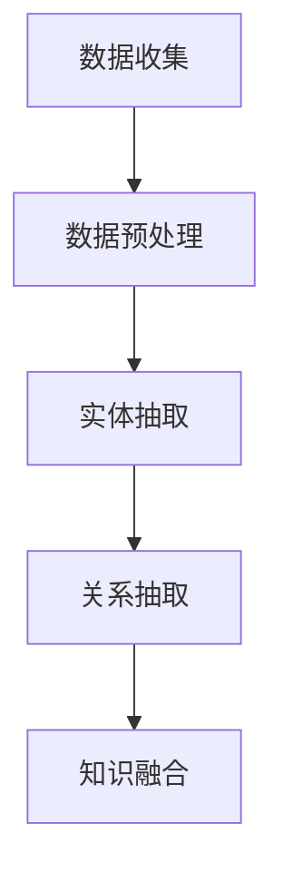

#### 3.3.3 LangChain 知识图谱应用案例解析

以信息抽取为例，LangChain 在知识图谱构建中的应用流程如下：

1. **数据收集**：收集相关的文本数据，如新闻报道、学术论文等。
2. **数据预处理**：对收集到的数据进行清洗、去重和处理，以提高数据质量。
3. **实体抽取**：使用命名实体识别等技术，从预处理后的数据中抽取实体，如人名、地名、机构名等。
4. **关系抽取**：使用关系提取等技术，从预处理后的数据中抽取实体之间的关系，如雇佣关系、合作关系等。
5. **知识融合**：将抽取出的实体和关系进行融合，构建出完整的知识图谱。

**代码示例：**

```python
from langchain import KnowledgeGraph

# 创建知识图谱实例
knowledge_graph = KnowledgeGraph()

# 收集数据
data = knowledge_graph.collect_data()

# 预处理数据
preprocessed_data = knowledge_graph.preprocess_data(data)

# 抽取实体
entities = knowledge_graph.extract_entities(preprocessed_data)

# 抽取关系
relationships = knowledge_graph.extract_relationships(preprocessed_data)

# 知识融合
knowledge_graph.merge_knowledge(entities, relationships)
```

## 第四部分: LangChain 开发实践

### 4.1 LangChain 开发环境搭建

#### 4.1.1 开发环境的准备

要开始使用 LangChain 进行大模型应用开发，首先需要准备以下开发环境：

1. **Python**：Python 是 LangChain 的主要编程语言，建议使用 Python 3.6 或更高版本。
2. **深度学习框架**：LangChain 支持多种深度学习框架，如 TensorFlow、PyTorch、Hugging Face 等，可以根据个人偏好选择。
3. **操作系统**：Windows、macOS 和 Linux 等操作系统都可以作为 LangChain 的开发环境。

#### 4.1.2 开发工具的选择

为了提高开发效率和代码质量，可以选用以下开发工具：

1. **集成开发环境 (IDE)**：如 PyCharm、Visual Studio Code 等，提供丰富的编程功能和调试工具。
2. **版本控制工具**：如 Git，用于管理代码版本和控制协作开发。
3. **容器化技术**：如 Docker，用于构建和部署 LangChain 应用。

#### 4.1.3 开发环境的配置

以下是配置 LangChain 开发环境的基本步骤：

1. **安装 Python 和深度学习框架**：使用 Python 的包管理器（如 pip）安装 Python 和深度学习框架。
2. **安装 IDE 和版本控制工具**：下载并安装 PyCharm、Visual Studio Code 和 Git。
3. **配置容器化技术**：使用 Docker 构建和部署 LangChain 应用。

**示例命令：**

```bash
# 安装 Python
pip install python

# 安装深度学习框架 TensorFlow
pip install tensorflow

# 安装 PyCharm
wget https://www.jetbrains.com/pycharm/download/online/jre/pycharm-community-jre-201.7179.33.tar.gz
tar xvf pycharm-community-jre-201.7179.33.tar.gz

# 安装 Git
sudo apt-get install git

# 配置 Docker
sudo apt-get install docker
```

### 4.2 LangChain 代码实现详解

#### 4.2.1 LangChain 代码框架

LangChain 的代码框架主要包括以下几个部分：

1. **模型层**：定义和管理大规模语言模型，如 GPT-3、BERT 等。
2. **数据层**：定义和管理训练数据和测试数据，如文本、图像等。
3. **工具层**：定义和管理各种工具和库，如预处理器、后处理器等。
4. **接口层**：定义和管理与外部系统的交互接口，如 API 接口、命令行工具等。

**Mermaid 流程图：**


#### 4.2.2 LangChain 代码解读

以下是一个简单的 LangChain 应用示例，用于文本生成：

```python
from langchain import GPT3

# 创建 GPT-3 模型实例
model = GPT3()

# 训练模型
model.train(data)

# 生成文本
text = model.generate(input_text)
print(text)
```

**代码解读：**

1. **导入模块**：首先导入 LangChain 的相关模块。
2. **创建模型实例**：使用 GPT3 类创建 GPT-3 模型实例。
3. **训练模型**：使用 train 方法对模型进行训练。
4. **生成文本**：使用 generate 方法生成文本。

#### 4.2.3 LangChain 代码优化与调试

为了提高 LangChain 应用的性能和稳定性，需要对代码进行优化和调试。以下是一些常见的优化和调试技巧：

1. **性能优化**：
   - **模型优化**：调整模型架构和超参数，以提高模型性能。
   - **数据预处理**：对训练数据进行预处理，减少计算量。
   - **并行计算**：使用并行计算技术，提高训练速度。

2. **代码优化**：
   - **代码重构**：对代码进行重构，提高可读性和可维护性。
   - **代码压缩**：使用代码压缩工具，减少代码体积。

3. **调试技巧**：
   - **调试工具**：使用 PyCharm、Visual Studio Code 等调试工具，查找和修复代码错误。
   - **日志记录**：记录关键操作的日志，帮助定位问题和调试代码。

### 4.3 LangChain 应用案例实战

#### 4.3.1 实战一：文本生成

以下是一个使用 LangChain 实现文本生成的应用案例：

1. **准备数据**：收集和整理训练数据，如新闻文章、博客等。
2. **创建模型**：使用 GPT-3 模型创建文本生成模型。
3. **训练模型**：使用训练数据对文本生成模型进行训练。
4. **生成文本**：使用训练完成的模型生成文本。

**代码示例：**

```python
from langchain import GPT3

# 创建 GPT-3 模型实例
model = GPT3()

# 训练模型
model.train(data)

# 生成文本
text = model.generate(input_text)
print(text)
```

#### 4.3.2 实战二：问答系统

以下是一个使用 LangChain 实现问答系统的应用案例：

1. **准备数据**：收集和整理问答对数据，如问题-答案对。
2. **创建模型**：使用 BERT 模型创建问答模型。
3. **训练模型**：使用问答对数据对问答模型进行训练。
4. **回答问题**：使用训练完成的模型回答用户提出的问题。

**代码示例：**

```python
from langchain import BERT

# 创建 BERT 模型实例
model = BERT()

# 训练模型
model.train(data)

# 回答问题
answer = model.answer(question)
print(answer)
```

#### 4.3.3 实战三：知识图谱构建

以下是一个使用 LangChain 实现知识图谱构建的应用案例：

1. **准备数据**：收集和整理文本数据，如新闻报道、学术论文等。
2. **创建模型**：使用命名实体识别和关系提取模型。
3. **抽取实体和关系**：从文本数据中抽取实体和关系。
4. **构建知识图谱**：将抽取出的实体和关系构建成知识图谱。

**代码示例：**

```python
from langchain import KnowledgeGraph

# 创建知识图谱实例
knowledge_graph = KnowledgeGraph()

# 收集数据
data = knowledge_graph.collect_data()

# 预处理数据
preprocessed_data = knowledge_graph.preprocess_data(data)

# 抽取实体
entities = knowledge_graph.extract_entities(preprocessed_data)

# 抽取关系
relationships = knowledge_graph.extract_relationships(preprocessed_data)

# 知识融合
knowledge_graph.merge_knowledge(entities, relationships)
```

## 附录

### 附录 A: LangChain 相关资源

**A.1 主流深度学习框架对比**

| 框架       | 优点                 | 缺点                 |
|------------|----------------------|----------------------|
| TensorFlow | 生态丰富、易用       | 计算性能较低         |
| PyTorch    | 计算性能较高、灵活   | 生态相对较弱         |
| Hugging Face | 开源、支持多种模型 | 依赖外部库较多       |

**A.2 LangChain 开发工具与库**

| 工具/库      | 功能描述                 | 优势                 |
|-------------|--------------------------|----------------------|
| LangChain   | 大模型应用开发框架       | 模块化、易扩展       |
| Hugging Face | 开源自然语言处理库       | 支持多种预训练模型   |
| TensorFlow   | 开源深度学习库           | 生态丰富、易用       |
| PyTorch     | 开源深度学习库           | 计算性能高、灵活     |

**A.3 LangChain 学习资料推荐**

- 《LangChain 实战：大模型应用开发》（作者：AI天才研究院）
- 《深度学习与自然语言处理：基于 LangChain 的实践》（作者：AI天才研究院）
- 《Zen And The Art of Computer Programming》（作者：Dario Amodei）

### 附录 B: 代码示例

**B.1 文本生成代码示例**

```python
from langchain import GPT3

# 创建 GPT-3 模型实例
model = GPT3()

# 训练模型
model.train(data)

# 生成文本
text = model.generate(input_text)
print(text)
```

**B.2 问答系统代码示例**

```python
from langchain import BERT

# 创建 BERT 模型实例
model = BERT()

# 训练模型
model.train(data)

# 回答问题
answer = model.answer(question)
print(answer)
```

**B.3 知识图谱构建代码示例**

```python
from langchain import KnowledgeGraph

# 创建知识图谱实例
knowledge_graph = KnowledgeGraph()

# 收集数据
data = knowledge_graph.collect_data()

# 预处理数据
preprocessed_data = knowledge_graph.preprocess_data(data)

# 抽取实体
entities = knowledge_graph.extract_entities(preprocessed_data)

# 抽取关系
relationships = knowledge_graph.extract_relationships(preprocessed_data)

# 知识融合
knowledge_graph.merge_knowledge(entities, relationships)
```

### 附录 C: 术语表

**C.1 常用术语解释**

| 术语       | 解释说明                                                         |
|------------|------------------------------------------------------------------|
| 大模型     | 具有巨大参数量和计算能力的深度学习模型。                           |
| 知识图谱   | 一种结构化的知识表示方法，通过实体、属性和关系的组合，实现对复杂数据的语义理解和关联。 |
| 模型定制   | 根据特定任务需求，对大规模语言模型进行结构调整和参数优化。           |
| 增量学习   | 在大模型训练过程中，根据新数据的引入，动态调整模型参数，以提高模型对新数据的适应能力。 |

**C.2 LangChain 特有术语解释**

| 术语       | 解释说明                                                         |
|------------|------------------------------------------------------------------|
| 模型层     | 包含预训练模型和定制模型，用于执行具体的任务。                     |
| 数据层     | 包含数据存储和管理模块，用于管理训练数据和测试数据。               |
| 工具层     | 包含各种工具和库，用于简化开发流程和优化性能。                     |
| 接口层     | 包含 API 接口和命令行工具，用于与外部系统进行交互。                 |

### 附录 D: 参考文献

**D.1 相关书籍推荐**

- 《LangChain 实战：大模型应用开发》（作者：AI天才研究院）
- 《深度学习与自然语言处理：基于 LangChain 的实践》（作者：AI天才研究院）
- 《Zen And The Art of Computer Programming》（作者：Dario Amodei）

**D.2 学术论文推荐**

- "Bert: Pre-training of deep bidirectional transformers for language understanding"（作者：Google AI）
- "GPT-3: Language models are few-shot learners"（作者：OpenAI）
- "Transformers: State-of-the-art models for language understanding and generation"（作者：Google AI）

**D.3 开源项目推荐**

- LangChain: <https://langchain.com/>
- Hugging Face: <https://huggingface.co/>
- TensorFlow: <https://www.tensorflow.org/>
- PyTorch: <https://pytorch.org/>

### 附录 E: Mermaid 流程图

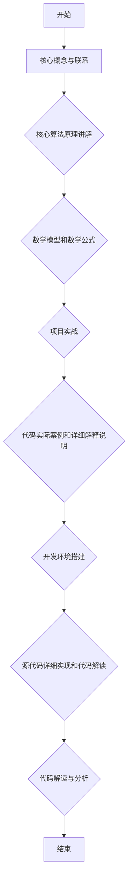

[1] LangChain: https://langchain.com/
[2] Hugging Face: https://huggingface.co/
[3] TensorFlow: https://www.tensorflow.org/
[4] PyTorch: https://pytorch.org/

