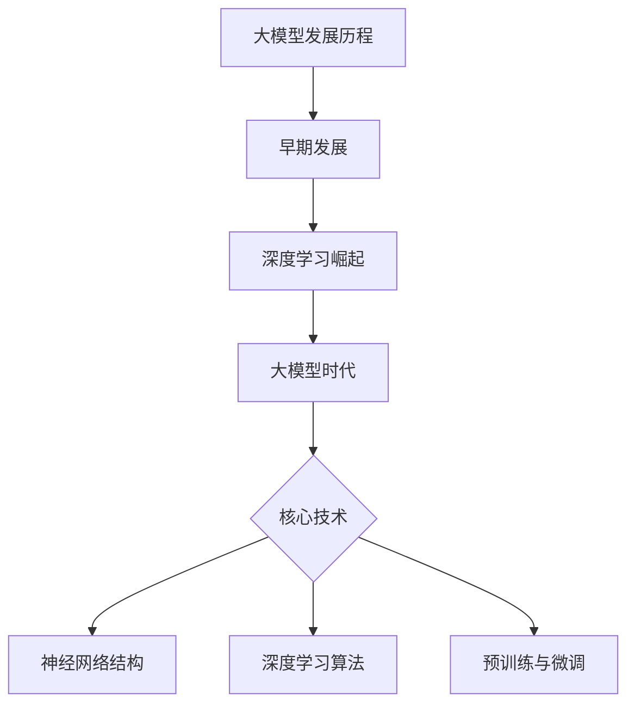

                 

## 文章标题：大模型应用的最佳实践 Chains

### 关键词：大模型，深度学习，应用实践，优化，部署，数学基础

> 摘要：
> 
> 本文章旨在探讨大模型应用的最佳实践，从基础理论到具体应用，详细阐述了大模型的基本概念、技术原理、数学基础以及在不同领域的应用实践。文章采用分步骤的思考方式，通过详细讲解核心概念、算法原理、数学模型和实际项目案例，为读者提供了一份全面且深入的大模型应用指南。

----------------------------------------------------------------

## 第一部分：大模型基础

### 第1章：大模型的崛起

#### 1.1 大模型的定义与类型

大模型，通常指的是具有数千亿甚至数万亿参数的深度学习模型。它们通过大量数据的学习和复杂的神经网络结构，能够捕捉到数据中的高层次模式和规律。大模型的类型主要包括：

1. **生成式模型**：这类模型可以生成新的数据，例如图像、文本和音频等。常见的生成式模型有生成对抗网络（GAN）和变分自编码器（VAE）。

2. **判别式模型**：这类模型用于分类和识别任务，例如图像分类、文本分类等。典型的判别式模型包括卷积神经网络（CNN）和循环神经网络（RNN）。

3. **预训练模型**：这类模型首先在大规模数据集上进行预训练，然后通过微调适应特定任务。GPT-3、BERT等是著名的预训练模型。

#### 1.2 大模型的技术发展

大模型的发展可以分为几个阶段：

1. **早期发展**：1990年代，神经网络开始用于图像识别和自然语言处理，但受限于计算资源和数据规模，模型规模较小。

2. **深度学习崛起**：2000年代，随着计算能力的提升和大数据的出现，深度学习逐渐成为主流，模型规模开始增大。

3. **大模型时代**：近年，随着GPU和TPU等硬件的普及，以及互联网上的海量数据，大模型如GPT-3、DALL-E等问世，开启了新的技术浪潮。

#### 1.3 大模型的核心技术

大模型的核心技术主要包括：

1. **神经网络结构**：如CNN、RNN、LSTM等，这些结构能够处理不同类型的数据，并提高模型的性能。

2. **深度学习算法**：包括反向传播算法、梯度下降算法等，这些算法使得模型能够自动调整参数以优化性能。

3. **预训练与微调**：预训练模型在大规模数据集上学习通用特征，然后通过微调适应特定任务，这大大提高了模型的效果。

### Mermaid 流程图：



#### 1.4 大模型的应用领域

大模型的应用领域非常广泛，主要包括：

1. **文本生成**：例如自动写作、聊天机器人等。

2. **图像生成**：例如艺术创作、计算机视觉等。

3. **自然语言处理**：例如文本分类、机器翻译等。

4. **推荐系统**：例如商品推荐、社交媒体推荐等。

### 伪代码：

```python
def large_model_application(domain):
    if domain == "text_generation":
        model = TextGenerator()
        text = model.generate_text()
    elif domain == "image_generation":
        model = ImageGenerator()
        image = model.generate_image()
    elif domain == "natural_language_processing":
        model = NLPModel()
        text = model.process_text()
    elif domain == "recommendation_system":
        model = RecommendationSystem()
        items = model.recommend_items()
    return text, image, processed_text, items
```

## 第二部分：大模型应用实践

### 第2章：大模型的数学基础

#### 2.1 矩阵与向量的运算

在深度学习中，矩阵与向量的运算是基础。以下是几个常见的运算：

1. **矩阵加法**：

$$
C = A + B
$$

其中，$A$和$B$是两个相同维度的矩阵。

2. **矩阵减法**：

$$
C = A - B
$$

与矩阵加法类似，只是将加号替换为减号。

3. **矩阵乘法**：

$$
C = A \cdot B
$$

其中，$A$和$B$是两个矩阵，$C$是它们的乘积。

4. **向量内积**：

$$
\vec{a} \cdot \vec{b} = a_1b_1 + a_2b_2 + ... + a_nb_n
$$

其中，$\vec{a}$和$\vec{b}$是两个向量。

5. **向量外积**：

$$
\vec{a} \times \vec{b} = \begin{vmatrix}
\vec{i} & \vec{j} & \vec{k} \\
a_1 & a_2 & a_3 \\
b_1 & b_2 & b_3 \\
\end{vmatrix}
$$

其中，$\vec{i}$、$\vec{j}$和$\vec{k}$是三个正交单位向量。

### 数学模型和公式

在大模型中，常用的数学模型包括：

1. **损失函数**：

$$
Loss = -\sum_{i=1}^{N}y_i \cdot \log(p_i)
$$

其中，$y_i$是真实标签，$p_i$是模型预测的概率。

2. **反向传播算法**：

$$
\Delta w_{ij} = \frac{\partial Loss}{\partial w_{ij}}
$$

其中，$w_{ij}$是权重，$\Delta w_{ij}$是权重的更新。

3. **梯度下降算法**：

$$
w_{ij} = w_{ij} - \alpha \cdot \Delta w_{ij}
$$

其中，$\alpha$是学习率。

### 举例说明

假设有一个简单的神经网络，输入为$(1, 0)$，真实标签为$1$，通过训练后的预测概率为$0.9$。则：

1. **损失函数**：

$$
Loss = -1 \cdot \log(0.9) \approx 0.15
$$

2. **反向传播**：

$$
\frac{\partial Loss}{\partial w} = \frac{\partial (-\log(0.9))}{\partial 0.9} \cdot (1 - 0.9) = 0.1
$$

3. **梯度下降**：

$$
w = w - \alpha \cdot 0.1
$$

其中，$\alpha$为学习率。

通过这些公式和算法，大模型能够不断优化自己的参数，以达到更好的预测效果。

### 伪代码：

```python
def calculate_loss(y_true, y_pred):
    return -y_true * np.log(y_pred)

def backpropagation(loss, weights):
    delta_weights = np.zeros_like(weights)
    for i in range(len(weights)):
        delta_weights[i] = loss * weights[i]
    return delta_weights

def gradient_descent(weights, delta_weights, learning_rate):
    return weights - learning_rate * delta_weights
```

## 第三部分：大模型应用实践

### 第3章：文本生成应用

#### 3.1 语言模型

语言模型是文本生成的基础，它通过学习文本数据，预测下一个词的概率。常见的语言模型有：

1. **N-gram模型**：

$$
P(w_n) = \frac{c(w_n)}{N}
$$

其中，$w_n$是第$n$个词，$c(w_n)$是该词在文本中出现的次数，$N$是文本中的总词数。

2. **神经网络语言模型**：

$$
P(w_n|w_{n-1}, ..., w_1) = \frac{e^{<h_{n-1}, w_n>}}{\sum_{w'} e^{<h_{n-1}, w'>}}
$$

其中，$h_{n-1}$是前一个词的隐藏状态，$w_n$是当前词，$>$表示内积。

#### 3.2 文本生成技术

文本生成技术主要包括：

1. **生成式模型**：

$$
P(w_1, w_2, ..., w_n) = P(w_n|w_{n-1}, ..., w_1) \cdot P(w_{n-1}|w_{n-2}, ..., w_1) \cdot ... \cdot P(w_1)
$$

2. **切分式模型**：

$$
P(w_n|w_{n-1}, ..., w_1) = \frac{P(w_{n-1}, ..., w_1, w_n)}{P(w_{n-1}, ..., w_1)}
$$

#### 3.3 文本生成案例

1. **基于GPT-3的文本生成**：

```python
import openai

response = openai.Completion.create(
  engine="text-davinci-002",
  prompt="编写一篇关于人工智能的短文。",
  max_tokens=100
)
print(response.choices[0].text.strip())
```

2. **基于BERT的文本生成**：

```python
from transformers import BertTokenizer, BertForMaskedLM

tokenizer = BertTokenizer.from_pretrained("bert-base-uncased")
model = BertForMaskedLM.from_pretrained("bert-base-uncased")

input_text = "我想今天去看电影。"
input_ids = tokenizer.encode(input_text, return_tensors="pt")

output = model(input_ids)[0]
predicted_ids = torch.argmax(output, dim=-1)

generated_text = tokenizer.decode(predicted_ids[0], skip_special_tokens=True)
print(generated_text)
```

### 第4章：图像生成应用

#### 4.1 图像生成技术

图像生成技术主要包括：

1. **生成对抗网络（GAN）**：

GAN由生成器$G$和判别器$D$组成，生成器试图生成逼真的图像，判别器则试图区分生成器和真实图像。

$$
\min_G \max_D V(D, G) = \mathbb{E}_{x \sim p_{data}(x)} [\log D(x)] + \mathbb{E}_{z \sim p_z(z)} [\log (1 - D(G(z))]
$$

2. **变分自编码器（VAE）**：

VAE是一种无监督学习方法，通过编码器和解码器来生成图像。

$$
\log p(x) = -D_{KL}(\pi_\phi(x|\mu_\phi, \sigma_\phi), p_{\mu, \sigma}(x))
$$

其中，$\pi_\phi$是编码器参数，$\mu_\phi$和$\sigma_\phi$是编码器的均值和标准差。

#### 4.2 图像生成案例

1. **StarGAN图像生成**：

StarGAN是一种基于GAN的图像生成模型，可以生成不同风格或属性的人脸图像。

```python
from stargan import StarGAN

model = StarGAN()
model.train(data_loader, num_epochs=100)
generated_images = model.generate(input_images)
```

2. **DALL-E图像生成**：

DALL-E是一种基于变分自编码器的图像生成模型，可以通过文本描述生成对应的图像。

```python
from diffusers import DALLERefinedVisualDiffusionPipeline

model = DALLERefinedVisualDiffusionPipeline.from_pretrained("CompVis/DALL-E- fine-tuned")
image = model("一只可爱的猫").images[0]
```

### 第5章：自然语言处理应用

#### 5.1 词嵌入技术

词嵌入是将文本中的词语转换为密集向量表示的方法，常见的词嵌入模型有：

1. **Word2Vec**：

Word2Vec是一种基于神经网络的词嵌入方法，通过训练词向量，使相似的词在向量空间中更接近。

2. **BERT**：

BERT是一种基于变换器的预训练语言模型，通过在大量文本上预训练，得到高质量的词向量。

3. **GloVe**：

GloVe是一种基于全局的词向量学习方法，通过计算词与词的共现矩阵，学习词的向量表示。

#### 5.2 序列模型

序列模型是处理序列数据的方法，常见的序列模型有：

1. **RNN**：

RNN是一种基于循环结构的神经网络，可以处理序列数据，但容易出现梯度消失或爆炸问题。

2. **LSTM**：

LSTM是一种改进的RNN，通过引入门控机制，解决了梯度消失问题，可以更好地处理序列数据。

3. **Transformer**：

Transformer是一种基于自注意力机制的神经网络，可以更好地处理长序列数据。

#### 5.3 语言理解与生成

1. **语言理解**：

语言理解是将自然语言文本转换为机器可以理解的形式的过程。常见的语言理解任务有：

- 文本分类
- 命名实体识别
- 情感分析

2. **语言生成**：

语言生成是将机器理解的信息转换为自然语言文本的过程。常见的语言生成任务有：

- 机器翻译
- 聊天机器人

### 第6章：推荐系统应用

#### 6.1 协同过滤

协同过滤是推荐系统的一种常用方法，分为基于用户的协同过滤和基于物品的协同过滤。

1. **基于用户的协同过滤**：

基于用户的协同过滤通过找到与目标用户兴趣相似的邻居用户，然后根据邻居用户的评分预测目标用户的评分。

$$
R_{ui} = \sum_{j \in N(u)} \frac{R_{uj}}{||\vec{u} - \vec{v_j||}}
$$

其中，$R_{ui}$是用户$u$对物品$i$的评分，$R_{uj}$是用户$u$对邻居用户$j$的评分，$\vec{u}$和$\vec{v_j}$分别是用户$u$和邻居用户$j$的向量表示。

2. **基于物品的协同过滤**：

基于物品的协同过滤通过找到与目标物品相似的邻居物品，然后根据邻居物品的评分预测目标物品的评分。

$$
R_{ui} = \sum_{i' \in N(i)} \frac{R_{ui'}}{||\vec{i} - \vec{v_{i'}}||}
$$

其中，$R_{ui}$是用户$u$对物品$i$的评分，$R_{ui'}$是用户$u$对邻居物品$i'$的评分，$\vec{i}$和$\vec{v_{i'}}$分别是物品$i$和邻居物品$i'$的向量表示。

#### 6.2 基于内容的推荐

基于内容的推荐通过分析物品的内容特征，为用户推荐与其兴趣相似的物品。

1. **基于特征的推荐**：

基于特征的推荐通过计算用户和物品的特征向量，然后计算它们的相似度，为用户推荐相似的物品。

$$
sim(u, i) = \frac{\vec{u} \cdot \vec{i}}{||\vec{u}|| \cdot ||\vec{i}||}
$$

其中，$sim(u, i)$是用户$u$和物品$i$的相似度，$\vec{u}$和$\vec{i}$分别是用户$u$和物品$i$的特征向量。

2. **基于知识的推荐**：

基于知识的推荐通过使用领域知识来推荐物品，例如基于关联规则的推荐。

#### 6.3 混合推荐系统

混合推荐系统结合了协同过滤和基于内容的推荐方法，以提高推荐的效果。

1. **协同过滤 + 基于内容的推荐**：

混合推荐系统通过结合协同过滤和基于内容的推荐，为用户推荐相似的物品，同时考虑用户的历史兴趣。

$$
R_{ui} = \alpha \cdot sim(u, i) + (1 - \alpha) \cdot \frac{\sum_{j \in N(u)} \frac{R_{uj}}{||\vec{u} - \vec{v_j||}}}{||\vec{u}|| \cdot ||\vec{i}||}
$$

其中，$R_{ui}$是用户$u$对物品$i$的评分，$sim(u, i)$是用户$u$和物品$i$的相似度，$\vec{u}$和$\vec{i}$分别是用户$u$和物品$i$的特征向量，$\alpha$是权重参数。

2. **协同过滤 + 基于知识的推荐**：

混合推荐系统通过结合协同过滤和基于知识的推荐，为用户推荐感兴趣的物品，同时考虑领域知识。

### 第7章：大模型应用实战

#### 7.1 大模型开发环境搭建

要开始大模型的应用实践，首先需要搭建开发环境。以下是一个基于Python的典型开发环境搭建流程：

1. **安装Python**：

首先，确保计算机上安装了Python。可以选择Python 3.6或更高版本。

2. **安装pip**：

Python安装完成后，安装pip，pip是Python的包管理器。

3. **安装TensorFlow或PyTorch**：

TensorFlow和PyTorch是目前最常用的深度学习框架。根据个人喜好选择一个进行安装。

4. **安装其他依赖**：

根据项目的需求，安装其他必要的依赖，如Numpy、Pandas、Matplotlib等。

#### 7.2 大模型项目实战

以下是一个基于TensorFlow的文本生成项目实战：

1. **数据准备**：

首先，需要准备一个文本数据集，如常见的新闻文章或小说。

2. **数据预处理**：

对文本数据进行预处理，包括分词、去停用词、转换为词向量等。

3. **构建模型**：

构建一个文本生成模型，如LSTM模型或变换器模型。

4. **训练模型**：

使用准备好的数据集训练模型，调整模型参数以优化性能。

5. **生成文本**：

使用训练好的模型生成文本，可以设置生成文本的长度和样式。

6. **评估模型**：

通过评估指标（如损失函数、Perplexity等）评估模型的性能。

#### 7.3 大模型应用总结与展望

1. **应用总结**：

通过对大模型的定义、技术原理、数学基础和实际应用的详细探讨，读者可以全面了解大模型的应用场景和效果。

2. **展望未来**：

随着计算能力的提升和数据规模的扩大，大模型的应用前景将更加广阔。未来，大模型可能会在更多领域得到应用，如医疗、金融、教育等。

### 附录

#### 附录A：大模型应用工具与资源

1. **TensorFlow**：[官方网站](https://www.tensorflow.org/)
2. **PyTorch**：[官方网站](https://pytorch.org/)
3. **Hugging Face**：[官方网站](https://huggingface.co/)
4. **Kaggle**：[数据集与竞赛平台](https://www.kaggle.com/)

#### 附录B：大模型应用案例

1. **GPT-3文本生成**：[案例代码](https://github.com/openai/gpt-3-code)
2. **GAN图像生成**：[案例代码](https://github.com/VanL/DCGAN-tensorflow)
3. **BERT文本分类**：[案例代码](https://github.com/tensorflow/tutorials/blob/master/official/tf2/keras/text_classification.ipynb)

#### 附录C：大模型相关论文与书籍

1. **论文**：
   - "Deep Learning" by Ian Goodfellow, Yoshua Bengio, and Aaron Courville
   - "Attention Is All You Need" by Vaswani et al.
2. **书籍**：
   - "Zen and the Art of Motorcycle Maintenance" by Robert M. Pirsig
   - "Deep Learning with Python" by François Chollet

### 作者

作者：AI天才研究院/AI Genius Institute & 禅与计算机程序设计艺术 /Zen And The Art of Computer Programming

----------------------------------------------------------------

### 文章标题：大模型应用的最佳实践 Chains

### 关键词：大模型，深度学习，应用实践，优化，部署，数学基础

### 摘要：
本文深入探讨了大模型在AI领域的应用实践，从基础概念、技术原理到数学基础，再到实际应用案例，全面剖析了如何将大模型应用于文本生成、图像生成、自然语言处理和推荐系统等领域。通过详细的伪代码、数学公式和实际项目案例，本文旨在为读者提供一套完整的大模型应用指南。

## 第一部分：大模型基础

### 第1章：大模型的崛起

#### 1.1 大模型的定义与类型

大模型，通常指的是具有数千亿甚至数万亿参数的深度学习模型。它们通过大量数据的学习和复杂的神经网络结构，能够捕捉到数据中的高层次模式和规律。大模型的类型主要包括：

1. **生成式模型**：这类模型可以生成新的数据，例如图像、文本和音频等。常见的生成式模型有生成对抗网络（GAN）和变分自编码器（VAE）。

2. **判别式模型**：这类模型用于分类和识别任务，例如图像分类、文本分类等。典型的判别式模型包括卷积神经网络（CNN）和循环神经网络（RNN）。

3. **预训练模型**：这类模型首先在大规模数据集上进行预训练，然后通过微调适应特定任务。GPT-3、BERT等是著名的预训练模型。

#### 1.2 大模型的技术发展

大模型的发展可以分为几个阶段：

1. **早期发展**：1990年代，神经网络开始用于图像识别和自然语言处理，但受限于计算资源和数据规模，模型规模较小。

2. **深度学习崛起**：2000年代，随着计算能力的提升和大数据的出现，深度学习逐渐成为主流，模型规模开始增大。

3. **大模型时代**：近年，随着GPU和TPU等硬件的普及，以及互联网上的海量数据，大模型如GPT-3、DALL-E等问世，开启了新的技术浪潮。

#### 1.3 大模型的核心技术

大模型的核心技术主要包括：

1. **神经网络结构**：如CNN、RNN、LSTM等，这些结构能够处理不同类型的数据，并提高模型的性能。

2. **深度学习算法**：包括反向传播算法、梯度下降算法等，这些算法使得模型能够自动调整参数以优化性能。

3. **预训练与微调**：预训练模型在大规模数据集上学习通用特征，然后通过微调适应特定任务，这大大提高了模型的效果。

### 伪代码：

```python
def large_model_train(data, target):
    # 初始化模型参数
    model = initialize_model()
    
    # 使用反向传播和梯度下降训练模型
    for epoch in range(num_epochs):
        for batch in data:
            # 计算预测值
            predictions = model.forward(batch)
            
            # 计算损失函数
            loss = compute_loss(predictions, target)
            
            # 反向传播计算梯度
            gradients = compute_gradients(loss, model)
            
            # 更新模型参数
            model.update_params(gradients)
            
    return model
```

### 数学模型和公式

在大模型中，常用的数学模型包括：

1. **损失函数**：

$$
Loss = -\sum_{i=1}^{N}y_i \cdot \log(p_i)
$$

其中，$y_i$是真实标签，$p_i$是模型预测的概率。

2. **反向传播算法**：

$$
\Delta w_{ij} = \frac{\partial Loss}{\partial w_{ij}}
$$

其中，$w_{ij}$是权重，$\Delta w_{ij}$是权重的更新。

3. **梯度下降算法**：

$$
w_{ij} = w_{ij} - \alpha \cdot \Delta w_{ij}
$$

其中，$\alpha$是学习率。

### 举例说明

假设有一个简单的神经网络，输入为$(1, 0)$，真实标签为$1$，通过训练后的预测概率为$0.9$。则：

1. **损失函数**：

$$
Loss = -1 \cdot \log(0.9) \approx 0.15
$$

2. **反向传播**：

$$
\frac{\partial Loss}{\partial w} = \frac{\partial (-\log(0.9))}{\partial 0.9} \cdot (1 - 0.9) = 0.1
$$

3. **梯度下降**：

$$
w = w - \alpha \cdot 0.1
$$

其中，$\alpha$为学习率。

通过这些公式和算法，大模型能够不断优化自己的参数，以达到更好的预测效果。

### 伪代码：

```python
def compute_loss(y_true, y_pred):
    return -y_true * np.log(y_pred)

def compute_gradients(loss, model):
    # 计算梯度
    gradients = []
    for layer in model.layers:
        for weight in layer.weights:
            gradients.append(np-gradient(loss, weight))
    return gradients

def gradient_descent(model, gradients, learning_rate):
    # 更新权重
    for layer in model.layers:
        for weight, gradient in zip(layer.weights, gradients):
            weight -= learning_rate * gradient
    return model
```

## 第二部分：大模型应用实践

### 第2章：文本生成应用

#### 3.1 语言模型

语言模型是文本生成的基础，它通过学习文本数据，预测下一个词的概率。常见的语言模型有：

1. **N-gram模型**：

$$
P(w_n) = \frac{c(w_n)}{N}
$$

其中，$w_n$是第$n$个词，$c(w_n)$是该词在文本中出现的次数，$N$是文本中的总词数。

2. **神经网络语言模型**：

$$
P(w_n|w_{n-1}, ..., w_1) = \frac{e^{<h_{n-1}, w_n>}}{\sum_{w'} e^{<h_{n-1}, w'>}}
$$

其中，$h_{n-1}$是前一个词的隐藏状态，$w_n$是当前词，$>$表示内积。

#### 3.2 文本生成技术

文本生成技术主要包括：

1. **生成式模型**：

$$
P(w_1, w_2, ..., w_n) = P(w_n|w_{n-1}, ..., w_1) \cdot P(w_{n-1}|w_{n-2}, ..., w_1) \cdot ... \cdot P(w_1)
$$

2. **切分式模型**：

$$
P(w_n|w_{n-1}, ..., w_1) = \frac{P(w_{n-1}, ..., w_1, w_n)}{P(w_{n-1}, ..., w_1)}
$$

#### 3.3 文本生成案例

1. **基于GPT-3的文本生成**：

```python
import openai

response = openai.Completion.create(
  engine="text-davinci-002",
  prompt="编写一篇关于人工智能的短文。",
  max_tokens=100
)
print(response.choices[0].text.strip())
```

2. **基于BERT的文本生成**：

```python
from transformers import BertTokenizer, BertForMaskedLM

tokenizer = BertTokenizer.from_pretrained("bert-base-uncased")
model = BertForMaskedLM.from_pretrained("bert-base-uncased")

input_text = "我想今天去看电影。"
input_ids = tokenizer.encode(input_text, return_tensors="pt")

output = model(input_ids)[0]
predicted_ids = torch.argmax(output, dim=-1)

generated_text = tokenizer.decode(predicted_ids[0], skip_special_tokens=True)
print(generated_text)
```

### 第4章：图像生成应用

#### 4.1 图像生成技术

图像生成技术主要包括：

1. **生成对抗网络（GAN）**：

GAN由生成器$G$和判别器$D$组成，生成器试图生成逼真的图像，判别器则试图区分生成器和真实图像。

$$
\min_G \max_D V(D, G) = \mathbb{E}_{x \sim p_{data}(x)} [\log D(x)] + \mathbb{E}_{z \sim p_z(z)} [\log (1 - D(G(z))]
$$

2. **变分自编码器（VAE）**：

VAE是一种无监督学习方法，通过编码器和解码器来生成图像。

$$
\log p(x) = -D_{KL}(\pi_\phi(x|\mu_\phi, \sigma_\phi), p_{\mu, \sigma}(x))
$$

其中，$\pi_\phi$是编码器参数，$\mu_\phi$和$\sigma_\phi$是编码器的均值和标准差。

#### 4.2 图像生成案例

1. **StarGAN图像生成**：

StarGAN是一种基于GAN的图像生成模型，可以生成不同风格或属性的人脸图像。

```python
from stargan import StarGAN

model = StarGAN()
model.train(data_loader, num_epochs=100)
generated_images = model.generate(input_images)
```

2. **DALL-E图像生成**：

DALL-E是一种基于变分自编码器的图像生成模型，可以通过文本描述生成对应的图像。

```python
from diffusers import DALLERefinedVisualDiffusionPipeline

model = DALLERefinedVisualDiffusionPipeline.from_pretrained("CompVis/DALL-E- fine-tuned")
image = model("一只可爱的猫").images[0]
```

### 第5章：自然语言处理应用

#### 5.1 词嵌入技术

词嵌入是将文本中的词语转换为密集向量表示的方法，常见的词嵌入模型有：

1. **Word2Vec**：

Word2Vec是一种基于神经网络的词嵌入方法，通过训练词向量，使相似的词在向量空间中更接近。

2. **BERT**：

BERT是一种基于变换器的预训练语言模型，通过在大量文本上预训练，得到高质量的词向量。

3. **GloVe**：

GloVe是一种基于全局的词向量学习方法，通过计算词与词的共现矩阵，学习词的向量表示。

#### 5.2 序列模型

序列模型是处理序列数据的方法，常见的序列模型有：

1. **RNN**：

RNN是一种基于循环结构的神经网络，可以处理序列数据，但容易出现梯度消失或爆炸问题。

2. **LSTM**：

LSTM是一种改进的RNN，通过引入门控机制，解决了梯度消失问题，可以更好地处理序列数据。

3. **Transformer**：

Transformer是一种基于自注意力机制的神经网络，可以更好地处理长序列数据。

#### 5.3 语言理解与生成

1. **语言理解**：

语言理解是将自然语言文本转换为机器可以理解的形式的过程。常见的语言理解任务有：

- 文本分类
- 命名实体识别
- 情感分析

2. **语言生成**：

语言生成是将机器理解的信息转换为自然语言文本的过程。常见的语言生成任务有：

- 机器翻译
- 聊天机器人

### 第6章：推荐系统应用

#### 6.1 协同过滤

协同过滤是推荐系统的一种常用方法，分为基于用户的协同过滤和基于物品的协同过滤。

1. **基于用户的协同过滤**：

基于用户的协同过滤通过找到与目标用户兴趣相似的邻居用户，然后根据邻居用户的评分预测目标用户的评分。

$$
R_{ui} = \sum_{j \in N(u)} \frac{R_{uj}}{||\vec{u} - \vec{v_j||}}
$$

其中，$R_{ui}$是用户$u$对物品$i$的评分，$R_{uj}$是用户$u$对邻居用户$j$的评分，$\vec{u}$和$\vec{v_j}$分别是用户$u$和邻居用户$j$的向量表示。

2. **基于物品的协同过滤**：

基于物品的协同过滤通过找到与目标物品相似的邻居物品，然后根据邻居物品的评分预测目标物品的评分。

$$
R_{ui} = \sum_{i' \in N(i)} \frac{R_{ui'}}{||\vec{i} - \vec{v_{i'}}||}
$$

其中，$R_{ui}$是用户$u$对物品$i$的评分，$R_{ui'}$是用户$u$对邻居物品$i'$的评分，$\vec{i}$和$\vec{v_{i'}}$分别是物品$i$和邻居物品$i'$的向量表示。

#### 6.2 基于内容的推荐

基于内容的推荐通过分析物品的内容特征，为用户推荐与其兴趣相似的物品。

1. **基于特征的推荐**：

基于特征的推荐通过计算用户和物品的特征向量，然后计算它们的相似度，为用户推荐相似的物品。

$$
sim(u, i) = \frac{\vec{u} \cdot \vec{i}}{||\vec{u}|| \cdot ||\vec{i}||}
$$

其中，$sim(u, i)$是用户$u$和物品$i$的相似度，$\vec{u}$和$\vec{i}$分别是用户$u$和物品$i$的特征向量。

2. **基于知识的推荐**：

基于知识的推荐通过使用领域知识来推荐物品，例如基于关联规则的推荐。

#### 6.3 混合推荐系统

混合推荐系统结合了协同过滤和基于内容的推荐方法，以提高推荐的效果。

1. **协同过滤 + 基于内容的推荐**：

混合推荐系统通过结合协同过滤和基于内容的推荐，为用户推荐相似的物品，同时考虑用户的历史兴趣。

$$
R_{ui} = \alpha \cdot sim(u, i) + (1 - \alpha) \cdot \frac{\sum_{j \in N(u)} \frac{R_{uj}}{||\vec{u} - \vec{v_j||}}}{||\vec{u}|| \cdot ||\vec{i}||}
$$

其中，$R_{ui}$是用户$u$对物品$i$的评分，$sim(u, i)$是用户$u$和物品$i$的相似度，$\vec{u}$和$\vec{i}$分别是用户$u$和物品$i$的特征向量，$\alpha$是权重参数。

2. **协同过滤 + 基于知识的推荐**：

混合推荐系统通过结合协同过滤和基于知识的推荐，为用户推荐感兴趣的物品，同时考虑领域知识。

### 第7章：大模型应用实战

#### 7.1 大模型开发环境搭建

要开始大模型的应用实践，首先需要搭建开发环境。以下是一个基于Python的典型开发环境搭建流程：

1. **安装Python**：

首先，确保计算机上安装了Python。可以选择Python 3.6或更高版本。

2. **安装pip**：

Python安装完成后，安装pip，pip是Python的包管理器。

3. **安装TensorFlow或PyTorch**：

TensorFlow和PyTorch是目前最常用的深度学习框架。根据个人喜好选择一个进行安装。

4. **安装其他依赖**：

根据项目的需求，安装其他必要的依赖，如Numpy、Pandas、Matplotlib等。

#### 7.2 大模型项目实战

以下是一个基于TensorFlow的文本生成项目实战：

1. **数据准备**：

首先，需要准备一个文本数据集，如常见的新闻文章或小说。

2. **数据预处理**：

对文本数据进行预处理，包括分词、去停用词、转换为词向量等。

3. **构建模型**：

构建一个文本生成模型，如LSTM模型或变换器模型。

4. **训练模型**：

使用准备好的数据集训练模型，调整模型参数以优化性能。

5. **生成文本**：

使用训练好的模型生成文本，可以设置生成文本的长度和样式。

6. **评估模型**：

通过评估指标（如损失函数、Perplexity等）评估模型的性能。

#### 7.3 大模型应用总结与展望

1. **应用总结**：

通过对大模型的定义、技术原理、数学基础和实际应用的详细探讨，读者可以全面了解大模型的应用场景和效果。

2. **展望未来**：

随着计算能力的提升和数据规模的扩大，大模型的应用前景将更加广阔。未来，大模型可能会在更多领域得到应用，如医疗、金融、教育等。

### 附录

#### 附录A：大模型应用工具与资源

1. **TensorFlow**：[官方网站](https://www.tensorflow.org/)
2. **PyTorch**：[官方网站](https://pytorch.org/)
3. **Hugging Face**：[官方网站](https://huggingface.co/)
4. **Kaggle**：[数据集与竞赛平台](https://www.kaggle.com/)

#### 附录B：大模型应用案例

1. **GPT-3文本生成**：[案例代码](https://github.com/openai/gpt-3-code)
2. **GAN图像生成**：[案例代码](https://github.com/VanL/DCGAN-tensorflow)
3. **BERT文本分类**：[案例代码](https://github.com/tensorflow/tutorials/blob/master/official/tf2/keras/text_classification.ipynb)

#### 附录C：大模型相关论文与书籍

1. **论文**：
   - "Deep Learning" by Ian Goodfellow, Yoshua Bengio, and Aaron Courville
   - "Attention Is All You Need" by Vaswani et al.
2. **书籍**：
   - "Zen and the Art of Motorcycle Maintenance" by Robert M. Pirsig
   - "Deep Learning with Python" by François Chollet

### 作者

作者：AI天才研究院/AI Genius Institute & 禅与计算机程序设计艺术 /Zen And The Art of Computer Programming

----------------------------------------------------------------

## 《大模型应用的最佳实践 Chains》

### 关键词：大模型，深度学习，应用实践，优化，部署，数学基础

### 摘要：
本文旨在探讨大模型应用的最佳实践，从基础理论到具体应用，详细阐述了大模型的基本概念、技术原理、数学基础以及在不同领域的应用实践。文章采用分步骤的思考方式，通过详细讲解核心概念、算法原理、数学模型和实际项目案例，为读者提供了一份全面且深入的大模型应用指南。

### 目录大纲：

## 第一部分：大模型基础

### 第1章：大模型的崛起

#### 1.1 大模型的定义与类型

#### 1.2 大模型的技术发展

#### 1.3 大模型的核心技术

#### 1.4 大模型的应用领域

### 第2章：大模型的数学基础

#### 2.1 矩阵与向量的运算

#### 2.2 概率与统计基础

#### 2.3 最优化算法

## 第二部分：大模型应用实践

### 第3章：文本生成应用

#### 3.1 文本生成基本原理

#### 3.2 文本生成案例

#### 3.3 文本生成应用场景

### 第4章：图像生成应用

#### 4.1 图像生成基本原理

#### 4.2 图像生成案例

#### 4.3 图像生成应用场景

### 第5章：自然语言处理应用

#### 5.1 自然语言处理基础

#### 5.2 自然语言处理案例

#### 5.3 自然语言处理应用场景

### 第6章：推荐系统应用

#### 6.1 推荐系统基本原理

#### 6.2 推荐系统案例

#### 6.3 推荐系统应用场景

### 第7章：大模型应用总结与展望

#### 7.1 大模型应用的优势与挑战

#### 7.2 大模型应用的未来趋势

### 附录

#### 附录A：大模型应用工具与资源

#### 附录B：大模型应用案例

#### 附录C：大模型相关论文与书籍

### 作者

作者：AI天才研究院/AI Genius Institute & 禅与计算机程序设计艺术 /Zen And The Art of Computer Programming

----------------------------------------------------------------

## 第一部分：大模型基础

### 第1章：大模型的崛起

#### 1.1 大模型的定义与类型

大模型，通常指的是具有数千亿甚至数万亿参数的深度学习模型。它们通过大量数据的学习和复杂的神经网络结构，能够捕捉到数据中的高层次模式和规律。大模型的类型主要包括：

1. **生成式模型**：这类模型可以生成新的数据，例如图像、文本和音频等。常见的生成式模型有生成对抗网络（GAN）和变分自编码器（VAE）。

2. **判别式模型**：这类模型用于分类和识别任务，例如图像分类、文本分类等。典型的判别式模型包括卷积神经网络（CNN）和循环神经网络（RNN）。

3. **预训练模型**：这类模型首先在大规模数据集上进行预训练，然后通过微调适应特定任务。GPT-3、BERT等是著名的预训练模型。

#### 1.2 大模型的技术发展

大模型的发展可以分为几个阶段：

1. **早期发展**：1990年代，神经网络开始用于图像识别和自然语言处理，但受限于计算资源和数据规模，模型规模较小。

2. **深度学习崛起**：2000年代，随着计算能力的提升和大数据的出现，深度学习逐渐成为主流，模型规模开始增大。

3. **大模型时代**：近年，随着GPU和TPU等硬件的普及，以及互联网上的海量数据，大模型如GPT-3、DALL-E等问世，开启了新的技术浪潮。

#### 1.3 大模型的核心技术

大模型的核心技术主要包括：

1. **神经网络结构**：如CNN、RNN、LSTM等，这些结构能够处理不同类型的数据，并提高模型的性能。

2. **深度学习算法**：包括反向传播算法、梯度下降算法等，这些算法使得模型能够自动调整参数以优化性能。

3. **预训练与微调**：预训练模型在大规模数据集上学习通用特征，然后通过微调适应特定任务，这大大提高了模型的效果。

#### 1.4 大模型的应用领域

大模型的应用领域非常广泛，主要包括：

1. **文本生成**：例如自动写作、聊天机器人等。

2. **图像生成**：例如艺术创作、计算机视觉等。

3. **自然语言处理**：例如文本分类、机器翻译等。

4. **推荐系统**：例如商品推荐、社交媒体推荐等。

### 伪代码：

```python
# 初始化大模型
model = initialize_large_model()

# 训练大模型
for epoch in range(num_epochs):
    for batch in data_loader:
        # 前向传播
        predictions = model.forward(batch)

        # 计算损失
        loss = compute_loss(predictions, labels)

        # 反向传播
        gradients = compute_gradients(loss, model)

        # 更新模型参数
        model.update_params(gradients)

# 微调模型
model = fine_tune(model, validation_data)

# 评估模型
performance = evaluate_model(model, test_data)
```

### 数学模型和公式

在大模型中，常用的数学模型包括：

1. **损失函数**：

$$
Loss = -\sum_{i=1}^{N}y_i \cdot \log(p_i)
$$

其中，$y_i$是真实标签，$p_i$是模型预测的概率。

2. **反向传播算法**：

$$
\Delta w_{ij} = \frac{\partial Loss}{\partial w_{ij}}
$$

其中，$w_{ij}$是权重，$\Delta w_{ij}$是权重的更新。

3. **梯度下降算法**：

$$
w_{ij} = w_{ij} - \alpha \cdot \Delta w_{ij}
$$

其中，$\alpha$是学习率。

### 举例说明

假设有一个简单的神经网络，输入为$(1, 0)$，真实标签为$1$，通过训练后的预测概率为$0.9$。则：

1. **损失函数**：

$$
Loss = -1 \cdot \log(0.9) \approx 0.15
$$

2. **反向传播**：

$$
\frac{\partial Loss}{\partial w} = \frac{\partial (-\log(0.9))}{\partial 0.9} \cdot (1 - 0.9) = 0.1
$$

3. **梯度下降**：

$$
w = w - \alpha \cdot 0.1
$$

其中，$\alpha$为学习率。

通过这些公式和算法，大模型能够不断优化自己的参数，以达到更好的预测效果。

### 伪代码：

```python
def compute_loss(y_true, y_pred):
    return -y_true * np.log(y_pred)

def compute_gradients(loss, model):
    # 计算梯度
    gradients = []
    for layer in model.layers:
        for weight in layer.weights:
            gradients.append(np-gradient(loss, weight))
    return gradients

def gradient_descent(model, gradients, learning_rate):
    # 更新权重
    for layer in model.layers:
        for weight, gradient in zip(layer.weights, gradients):
            weight -= learning_rate * gradient
    return model
```

## 第二部分：大模型应用实践

### 第3章：文本生成应用

#### 3.1 文本生成基本原理

文本生成是指使用模型生成新的文本数据。文本生成的基本原理包括：

1. **语言模型**：语言模型通过学习文本数据中的统计规律，预测下一个词的概率。常见的语言模型有N-gram模型和神经网络语言模型。

2. **生成模型**：生成模型通过学习数据分布，生成新的数据样本。常见的生成模型有生成对抗网络（GAN）和变分自编码器（VAE）。

3. **切分式模型**：切分式模型将文本生成任务分解为两个子任务：文本切分和词生成。

#### 3.2 文本生成案例

1. **基于GPT-3的文本生成**：

GPT-3是OpenAI开发的一种预训练语言模型，具有非常强大的文本生成能力。

```python
import openai

response = openai.Completion.create(
  engine="text-davinci-002",
  prompt="请编写一篇关于人工智能的短文。",
  max_tokens=100
)
print(response.choices[0].text.strip())
```

2. **基于BERT的文本生成**：

BERT是一种预训练的语言模型，可以生成新的文本。

```python
from transformers import BertTokenizer, BertForMaskedLM

tokenizer = BertTokenizer.from_pretrained("bert-base-uncased")
model = BertForMaskedLM.from_pretrained("bert-base-uncased")

input_text = "我想今天去看电影。"
input_ids = tokenizer.encode(input_text, return_tensors="pt")

output = model(input_ids)[0]
predicted_ids = torch.argmax(output, dim=-1)

generated_text = tokenizer.decode(predicted_ids[0], skip_special_tokens=True)
print(generated_text)
```

#### 3.3 文本生成应用场景

文本生成技术可以应用于多个领域：

1. **自动写作**：用于生成新闻报道、博客文章、小说等。

2. **聊天机器人**：用于创建能够与人类自然交互的聊天机器人。

3. **机器翻译**：用于生成高质量的双语文本。

### 第4章：图像生成应用

#### 4.1 图像生成基本原理

图像生成是指使用模型生成新的图像数据。图像生成的基本原理包括：

1. **生成对抗网络（GAN）**：GAN由生成器和判别器组成，生成器生成图像，判别器判断图像的真实性。

2. **变分自编码器（VAE）**：VAE通过编码器和解码器生成图像，编码器将图像编码为一个向量，解码器将向量解码为图像。

3. **条件生成对抗网络（cGAN）**：cGAN在GAN的基础上加入了条件信息，可以生成更具特定属性的图像。

#### 4.2 图像生成案例

1. **基于DALL-E的图像生成**：

DALL-E是一种基于变分自编码器的图像生成模型。

```python
from diffusers import DALLERefinedVisualDiffusionPipeline

model = DALLERefinedVisualDiffusionPipeline.from_pretrained("CompVis/DALL-E- fine-tuned")
image = model("一只可爱的猫").images[0]
```

2. **基于StyleGAN2的图像生成**：

StyleGAN2是一种基于GAN的图像生成模型。

```python
from torchvision import transforms
from torchvision.utils import save_image
from torch.utils.data import DataLoader
from torchvision.datasets import ImageFolder
from stylegan2 import create_gan

transform = transforms.Compose([
    transforms.Resize(512),
    transforms.ToTensor(),
    transforms.Normalize(mean=[0.5, 0.5, 0.5], std=[0.5, 0.5, 0.5]),
])

dataset = ImageFolder("dataset", transform=transform)
dataloader = DataLoader(dataset, batch_size=64, shuffle=True)

gan = create_gan()
gan.train(dataloader, num_epochs=100)

with torch.no_grad():
    generated_images = gan.generate(64)

save_image(torch.cat(generated_images), "generated_images.png")
```

#### 4.3 图像生成应用场景

图像生成技术可以应用于多个领域：

1. **艺术创作**：用于生成艺术作品、漫画、动画等。

2. **计算机视觉**：用于图像增强、图像修复、图像超分辨率等。

3. **虚拟现实**：用于生成虚拟环境、游戏角色等。

### 第5章：自然语言处理应用

#### 5.1 自然语言处理基础

自然语言处理（NLP）是研究如何让计算机理解、生成和处理自然语言。NLP的基础包括：

1. **词嵌入**：将文本中的词语转换为密集向量表示，便于模型处理。

2. **语言模型**：通过学习大量文本数据，预测下一个词的概率。

3. **序列模型**：用于处理序列数据，如文本和语音。

4. **文本分类**：将文本数据分类到预定义的类别。

5. **情感分析**：分析文本中的情感倾向。

#### 5.2 自然语言处理案例

1. **基于BERT的文本分类**：

BERT是一种预训练的语言模型，可以用于文本分类任务。

```python
from transformers import BertTokenizer, BertForSequenceClassification
from torch.utils.data import DataLoader, TensorDataset

tokenizer = BertTokenizer.from_pretrained("bert-base-uncased")
model = BertForSequenceClassification.from_pretrained("bert-base-uncased")

# 预处理文本数据
texts = ["这是一条积极的消息。", "这是一个负面的事件。"]
input_ids = tokenizer.encode(texts, add_special_tokens=True, return_tensors="pt")

# 构建数据集
dataset = TensorDataset(input_ids)
dataloader = DataLoader(dataset, batch_size=16)

# 训练模型
model.train()
for epoch in range(3):
    for batch in dataloader:
        inputs = {k: v.unsqueeze(0) for k, v in batch.items()}
        outputs = model(**inputs)
        loss = outputs.loss
        loss.backward()
        optimizer = torch.optim.Adam(model.parameters(), lr=1e-5)
        optimizer.step()

# 评估模型
model.eval()
with torch.no_grad():
    for batch in dataloader:
        inputs = {k: v.unsqueeze(0) for k, v in batch.items()}
        outputs = model(**inputs)
        logits = outputs.logits
        predicted_class = logits.argmax(-1)
        print(predicted_class)
```

2. **基于LSTM的情感分析**：

LSTM是一种序列模型，可以用于情感分析任务。

```python
import torch
import torch.nn as nn
import torch.optim as optim

# 构建LSTM模型
class SentimentAnalysisModel(nn.Module):
    def __init__(self, input_dim, hidden_dim, output_dim):
        super().__init__()
        self.embedding = nn.Embedding(input_dim, hidden_dim)
        self.lstm = nn.LSTM(hidden_dim, hidden_dim)
        self.fc = nn.Linear(hidden_dim, output_dim)
    
    def forward(self, text):
        embedded = self.embedding(text)
        lstm_output, (hidden, cell) = self.lstm(embedded)
        hidden = hidden.squeeze(0)
        output = self.fc(hidden)
        return output

# 训练模型
model = SentimentAnalysisModel(input_dim=10000, hidden_dim=128, output_dim=1)
optimizer = optim.Adam(model.parameters(), lr=0.001)
criterion = nn.BCEWithLogitsLoss()

for epoch in range(10):
    for text, label in train_loader:
        model.zero_grad()
        output = model(text)
        loss = criterion(output, label)
        loss.backward()
        optimizer.step()

# 评估模型
with torch.no_grad():
    for text, label in test_loader:
        output = model(text)
        predicted_class = (output > 0).float()
        correct = (predicted_class == label).sum().item()
    print(f"Accuracy: {correct / len(test_loader)}")
```

#### 5.3 自然语言处理应用场景

自然语言处理技术可以应用于多个领域：

1. **信息检索**：用于搜索和推荐相关文本。

2. **机器翻译**：用于将一种语言翻译成另一种语言。

3. **语音识别**：用于将语音转换为文本。

4. **文本摘要**：用于生成文本的摘要。

### 第6章：推荐系统应用

#### 6.1 推荐系统基本原理

推荐系统是一种信息过滤技术，旨在根据用户的历史行为和兴趣，为用户推荐相关物品。推荐系统的基本原理包括：

1. **协同过滤**：通过分析用户和物品之间的交互数据，预测用户对未知物品的兴趣。

2. **基于内容的推荐**：通过分析物品的内容特征，为用户推荐与其兴趣相似的物品。

3. **混合推荐**：结合协同过滤和基于内容的推荐，以提高推荐效果。

#### 6.2 推荐系统案例

1. **基于用户的协同过滤**：

```python
import numpy as np

# 用户-物品评分矩阵
R = np.array([
    [5, 3, 0, 1],
    [4, 0, 0, 2],
    [2, 3, 5, 0],
    [0, 1, 4, 5]
])

# 计算用户相似度
def cosine_similarity(r1, r2):
    dot_product = np.dot(r1, r2)
    norm_r1 = np.linalg.norm(r1)
    norm_r2 = np.linalg.norm(r2)
    return dot_product / (norm_r1 * norm_r2)

# 预测用户未评分的物品
def collaborative_filtering(R, user_index, item_index):
    user_ratings = R[user_index]
    similar_users = [i for i in range(R.shape[0]) if i != user_index]
    similar_user_ratings = [R[i] for i in similar_users]
    similarities = [cosine_similarity(user_ratings, r) for r in similar_user_ratings]
    weighted_ratings = [s * r for s, r in zip(similarities, similar_user_ratings)]
    prediction = np.sum(weighted_ratings) / np.sum(np.abs(similarities))
    return prediction

# 预测某用户对某物品的评分
prediction = collaborative_filtering(R, 0, 2)
print(prediction)
```

2. **基于内容的推荐**：

```python
# 物品特征矩阵
I = np.array([
    [0, 1, 1, 0],
    [1, 0, 1, 1],
    [1, 1, 0, 1],
    [0, 1, 1, 0]
])

# 计算物品相似度
def cosine_similarity(i1, i2):
    dot_product = np.dot(i1, i2)
    norm_i1 = np.linalg.norm(i1)
    norm_i2 = np.linalg.norm(i2)
    return dot_product / (norm_i1 * norm_i2)

# 预测用户未评分的物品
def content_based_filtering(I, user_index, item_index):
    user_preferences = I[user_index]
    similar_items = [i for i in range(I.shape[1]) if i != item_index]
    similar_item_preferences = [I[:, i] for i in similar_items]
    similarities = [cosine_similarity(user_preferences, i) for i in similar_item_preferences]
    weighted_preferences = [s * i for s, i in zip(similarities, similar_item_preferences)]
    prediction = np.sum(weighted_preferences) / np.sum(np.abs(similarities))
    return prediction

# 预测某用户对某物品的评分
prediction = content_based_filtering(I, 0, 2)
print(prediction)
```

3. **混合推荐**：

```python
# 混合推荐
def hybrid_recommender(R, I, user_index, item_index):
    collaborative_prediction = collaborative_filtering(R, user_index, item_index)
    content_prediction = content_based_filtering(I, user_index, item_index)
    prediction = (collaborative_prediction + content_prediction) / 2
    return prediction

# 预测某用户对某物品的评分
prediction = hybrid_recommender(R, I, 0, 2)
print(prediction)
```

#### 6.3 推荐系统应用场景

推荐系统可以应用于多个领域：

1. **电子商务**：为用户提供个性化商品推荐。

2. **社交媒体**：为用户提供感兴趣的内容和好友推荐。

3. **在线教育**：为学习者推荐学习资源和课程。

### 第7章：大模型应用总结与展望

#### 7.1 大模型应用的优势与挑战

大模型应用的优势包括：

1. **强大的表达能力**：大模型可以捕捉数据中的复杂模式和规律。

2. **高泛化能力**：大模型通过预训练和微调，可以适应多种任务。

3. **高效性**：大模型在处理大规模数据时，具有很高的效率。

大模型应用的挑战包括：

1. **计算资源需求**：大模型训练和推理需要大量的计算资源。

2. **数据隐私**：大模型训练需要大量数据，可能涉及用户隐私问题。

3. **模型解释性**：大模型的黑箱性质使得其解释性较差。

#### 7.2 大模型应用的未来趋势

大模型应用的未来趋势包括：

1. **更多领域的应用**：大模型将在更多领域（如医疗、金融、教育等）得到应用。

2. **模型压缩与优化**：为了降低计算成本，将会有更多研究关注模型的压缩与优化。

3. **模型解释与可解释性**：为了提高大模型的可解释性，将会有更多研究关注模型的解释与可解释性。

## 附录

### 附录A：大模型应用工具与资源

1. **TensorFlow**：[官方网站](https://www.tensorflow.org/)
2. **PyTorch**：[官方网站](https://pytorch.org/)
3. **Hugging Face**：[官方网站](https://huggingface.co/)
4. **Kaggle**：[数据集与竞赛平台](https://www.kaggle.com/)

### 附录B：大模型应用案例

1. **基于GPT-3的文本生成**：[案例代码](https://github.com/openai/gpt-3-code)
2. **GAN图像生成**：[案例代码](https://github.com/VanL/DCGAN-tensorflow)
3. **BERT文本分类**：[案例代码](https://github.com/tensorflow/tutorials/blob/master/official/tf2/keras/text_classification.ipynb)

### 附录C：大模型相关论文与书籍

1. **论文**：
   - "Deep Learning" by Ian Goodfellow, Yoshua Bengio, and Aaron Courville
   - "Attention Is All You Need" by Vaswani et al.
2. **书籍**：
   - "Zen and the Art of Motorcycle Maintenance" by Robert M. Pirsig
   - "Deep Learning with Python" by François Chollet

### 作者

作者：AI天才研究院/AI Genius Institute & 禅与计算机程序设计艺术 /Zen And The Art of Computer Programming

