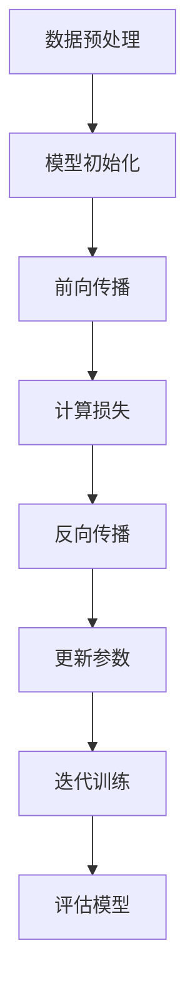
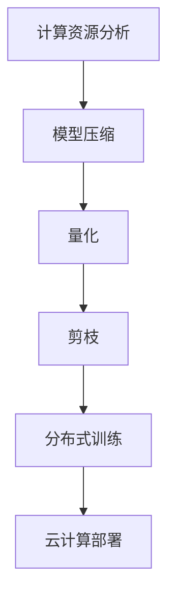
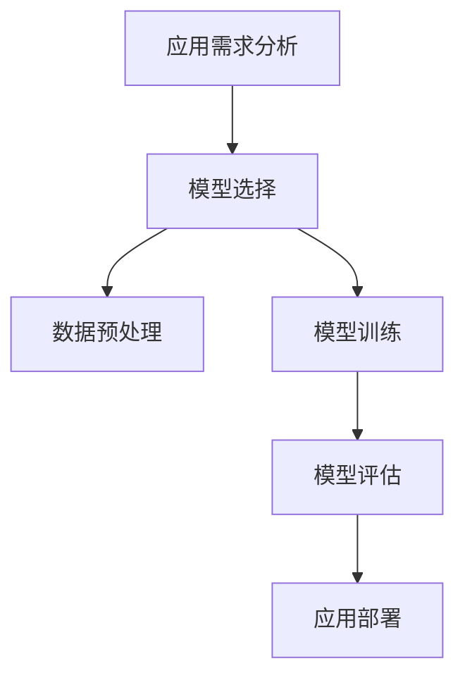

                 

# 文章标题: 大模型技术的安全性挑战

> 关键词：大模型技术，安全性挑战，隐私保护，攻击防御，模型解释性

> 摘要：本文探讨了在大模型技术快速发展的背景下，其面临的诸多安全性挑战。从计算资源需求、数据隐私问题、安全性与可靠性等方面展开讨论，提出了相应的解决方案和未来研究方向。通过分析实际应用案例，本文为大模型技术在企业中的应用提供了有益的参考和启示。

----------------------------------------------------------------

## 第一部分: 大模型技术概述

### 第1章: 大模型技术概述

#### 1.1 大模型技术的定义与分类

**1.1.1 大模型技术的定义**

大模型技术，顾名思义，是指能够训练和部署规模达到百万甚至千亿参数级别的机器学习模型的技术。这些模型通常被称为“大模型”，其涵盖了深度学习、神经网络和大规模数据处理等关键技术。大模型技术的重要性在于，它们能够处理海量数据，提取复杂特征，从而在自然语言处理、计算机视觉、语音识别等领域取得突破性进展。

**1.1.2 大模型技术的分类**

大模型技术可以根据不同的标准进行分类。以下是几种常见的分类方式：

- **按应用领域分类**：自然语言处理（NLP）、计算机视觉（CV）、语音识别、推荐系统等。
- **按模型类型分类**：如循环神经网络（RNN）、卷积神经网络（CNN）、生成对抗网络（GAN）、变压器模型（Transformer）等。
- **按模型规模分类**：可分为小模型（<100M参数）、中模型（100M-1B参数）和大模型（>1B参数）。

#### 1.2 大模型技术的发展历程

**1.2.1 大模型技术的起源**

大模型技术的起源可以追溯到20世纪80年代的神经网络研究。早期的研究主要集中在简单的神经网络模型，如感知机、BP神经网络等。随着计算机硬件性能的提升和大数据的兴起，深度学习逐渐成为主流的研究方向。2012年，AlexNet在ImageNet图像识别大赛中取得了突破性的成绩，标志着深度学习时代的到来。

**1.2.2 大模型技术的重要里程碑**

- **2012年**：AlexNet在ImageNet大赛中取得显著成绩，深度学习得到广泛关注。
- **2014年**：Google提出GoogLeNet，引入了深度卷积神经网络的概念。
- **2017年**：Google推出Transformer模型，在自然语言处理领域取得了巨大成功。
- **2018年**：OpenAI发布GPT-2，展示了大模型在文本生成、对话系统等方面的潜力。

#### 1.3 大模型技术在各个领域的应用

**1.3.1 自然语言处理**

大模型技术在自然语言处理领域取得了显著成果，如机器翻译、文本生成、情感分析等。著名的模型包括GPT-3、BERT等。GPT-3拥有1750亿个参数，能够生成高质量的文本，被广泛应用于聊天机器人、内容创作等领域。

**1.3.2 计算机视觉**

大模型技术在计算机视觉领域也有着重要的应用，如图像分类、目标检测、图像生成等。卷积神经网络（CNN）和生成对抗网络（GAN）是其代表性技术。例如，ResNet在图像分类任务中取得了很高的准确率，而StyleGAN则能够生成逼真的图像。

**1.3.3 其他领域**

大模型技术在推荐系统、语音识别、医疗诊断等领域也展现出了强大的应用潜力。例如，基于深度学习模型的推荐系统可以更好地预测用户的喜好，提高推荐的准确性和用户体验；在语音识别领域，深度学习模型显著提高了识别的准确率；在医疗诊断领域，大模型可以帮助医生更准确地诊断疾病。

### 第2章: 大模型技术原理

#### 2.1 神经网络基础

**2.1.1 神经元与神经网络**

神经元是神经网络的基本组成单元，类似于人脑中的神经元，通过激活函数和权重实现信息传递和处理。神经网络是由多个神经元组成的复杂结构，通过层次结构实现数据的非线性变换。

**2.1.2 神经网络训练**

神经网络训练过程包括前向传播和反向传播。前向传播是指输入数据通过网络传递，经过权重调整和激活函数处理后，得到输出结果。反向传播则是通过计算损失函数的梯度，调整网络权重，从而优化模型。

**2.2 深度学习基础**

**2.2.1 深度学习概述**

深度学习是一种基于神经网络的机器学习技术，通过多层神经网络实现数据的深度特征提取。深度学习在图像识别、语音识别、自然语言处理等领域取得了显著的成果。

**2.2.2 深度学习算法**

常见的深度学习算法包括卷积神经网络（CNN）、循环神经网络（RNN）、长短时记忆网络（LSTM）、生成对抗网络（GAN）等。每种算法都有其独特的结构和应用场景。

**2.3 大模型训练与优化技术**

**2.3.1 大模型训练挑战**

大模型训练过程中面临的主要挑战包括计算资源需求、数据隐私问题、模型优化等。计算资源需求尤其突出，大模型的训练通常需要高性能的GPU或TPU等硬件设备。

**2.3.2 大模型优化技术**

大模型优化技术主要包括超参数调优、优化算法选择、模型压缩等。超参数调优包括学习率、批量大小、激活函数等；优化算法选择包括梯度下降、随机梯度下降、Adam等；模型压缩包括量化、剪枝、知识蒸馏等。

### 第3章: 大模型架构设计

#### 3.1 大模型架构概述

**3.1.1 大模型架构定义**

大模型架构是指用于训练和部署大模型的软件和硬件结构。它包括计算资源、数据存储、模型管理等多个方面。

**3.1.2 大模型架构类型**

常见的大模型架构类型包括单机架构、分布式架构、云计算架构等。单机架构适用于小规模模型的训练，分布式架构适用于大规模模型的训练，云计算架构则能够提供弹性计算资源。

#### 3.2 大模型架构优化技术

**3.2.1 架构优化目标**

大模型架构优化技术的主要目标是提高计算效率、降低延迟、减少能耗等。

**3.2.2 架构优化策略**

常见的优化策略包括模型压缩、量化、剪枝、分布式训练等。模型压缩可以通过减少模型参数数量来降低计算复杂度；量化可以将浮点数模型转换为低比特宽度的模型，降低存储和计算需求；剪枝可以通过删除无关的模型参数来减少模型大小；分布式训练可以有效地利用多台计算机的并行计算能力，加快模型训练速度。

#### 3.3 大模型架构案例分析

**3.3.1 案例分析概述**

本节将分析几个典型的大模型架构案例，包括Google的TPU架构、Facebook的AGX架构等，探讨其关键技术、架构设计和优化策略。

### 第4章: 大模型应用场景分析

#### 4.1 大模型在自然语言处理中的应用

**4.1.1 NLP应用概述**

大模型在自然语言处理领域有着广泛的应用，如机器翻译、文本生成、对话系统等。本节将介绍大模型在这些应用中的具体实现和效果。

**4.1.2 应用案例分析**

本节将分析一些成功的NLP应用案例，如OpenAI的GPT-3模型、Google的翻译服务、BERT模型等，探讨其关键技术、效果评估等。

#### 4.2 大模型在计算机视觉中的应用

**4.2.1 CV应用概述**

大模型在计算机视觉领域也有着重要的应用，如图像分类、目标检测、图像生成等。本节将介绍大模型在这些应用中的具体实现和效果。

**4.2.2 应用案例分析**

本节将分析一些成功的CV应用案例，如ResNet在图像分类任务中的应用、YOLO在目标检测任务中的应用、StyleGAN在图像生成任务中的应用等，探讨其关键技术、效果评估等。

#### 4.3 大模型在其他领域的应用

**4.3.1 其他应用领域**

除了NLP和CV，大模型技术在推荐系统、语音识别、医疗诊断等领域也展现出了强大的应用潜力。本节将简要介绍这些应用领域。

### 第5章: 大模型技术挑战与解决方案

#### 5.1 大模型计算资源需求

**5.1.1 计算资源需求概述**

大模型训练和部署过程中对计算资源的高需求，是当前面临的主要挑战之一。本节将讨论计算资源需求的来源、影响以及解决方案。

**5.1.2 解决方案**

本节将介绍一些常见的解决方案，如分布式训练、云计算、GPU/TPU等。

#### 5.2 大模型数据隐私问题

**5.2.1 数据隐私问题概述**

大模型训练过程中涉及的数据隐私问题是另一个重要挑战。本节将讨论数据隐私问题的来源、影响以及解决方案。

**5.2.2 解决方案**

本节将介绍一些常见的解决方案，如数据加密、差分隐私、联邦学习等。

#### 5.3 大模型安全性与可靠性问题

**5.3.1 安全性与可靠性问题概述**

大模型在安全性和可靠性方面也面临挑战，如模型鲁棒性、对抗攻击等。本节将讨论这些问题及其解决方案。

**5.3.2 解决方案**

本节将介绍一些常见的解决方案，如模型验证、攻击检测、对抗训练等。

### 第6章: 大模型技术在企业中的应用

#### 6.1 大模型技术在企业中的价值

**6.1.1 价值概述**

大模型技术在企业中的应用能够带来显著的商业价值，如提升业务效率、降低成本、提高客户满意度等。本节将概述大模型技术在企业中的价值。

**6.1.2 应用价值分析**

本节将分析大模型技术在企业决策、运营优化、客户服务等方面的实际应用价值。

#### 6.2 大模型技术在企业中的实际应用案例

**6.2.1 案例一：企业A的大模型应用实践**

**6.2.2 案例二：企业B的大模型应用实践**

**6.2.3 案例三：企业C的大模型应用实践**

本节将介绍几个企业在大模型技术方面的实际应用案例，分析其关键技术、效果评估等。

#### 6.3 大模型技术在企业应用中的挑战与解决方案

**6.3.1 挑战概述**

本节将讨论大模型技术在企业应用过程中可能面临的挑战，如计算资源、数据隐私、人才缺乏等。

**6.3.2 解决方案**

本节将介绍企业应对大模型技术应用挑战的解决方案，如计算资源优化、数据隐私保护、人才培养等。

### 第7章: 大模型技术未来发展趋势

#### 7.1 大模型技术未来发展趋势

**7.1.1 发展趋势概述**

本节将分析大模型技术未来的发展趋势，如模型压缩、知识图谱、联邦学习等。

**7.1.2 关键技术展望**

本节将展望大模型技术在关键领域的发展前景，如人工智能助手、智能驾驶等。

#### 7.2 大模型技术面临的挑战与机遇

**7.2.1 挑战分析**

本节将分析大模型技术在未来发展中面临的挑战，如计算资源、数据隐私、安全性与可靠性等。

**7.2.2 机遇探讨**

本节将探讨大模型技术在未来发展中的机遇，如产业升级、新兴应用领域等。

#### 7.3 大模型技术对未来社会的影响

**7.3.1 社会影响概述**

本节将讨论大模型技术对未来社会发展的影响，如产业变革、社会进步等。

**7.3.2 社会影响分析**

本节将分析大模型技术对教育、医疗、金融等领域的深远影响。

### 附录

#### 附录A: 大模型技术相关工具与资源

本附录将介绍大模型技术相关的工具与资源，包括开源框架、研究论文、培训课程等。

#### 附录B: 大模型技术 Mermaid 流程图

本附录将使用Mermaid语言绘制大模型训练、架构优化、应用场景分析等流程图。

#### 附录C: 大模型技术相关伪代码

本附录将提供大模型技术相关的伪代码，包括神经网络基础、深度学习算法、大模型训练与优化等。

#### 附录D: 大模型技术数学模型与公式

本附录将列出大模型技术中常用的数学模型与公式，并进行分析和讲解。

#### 附录E: 大模型技术在企业中的实际应用案例分析

本附录将详细介绍几个大模型技术在企业中的实际应用案例，分析其关键技术、效果评估等。

#### 附录F: 大模型技术未来发展展望

本附录将讨论大模型技术的未来发展展望，包括技术趋势、面临的挑战与机遇等。

----------------------------------------------------------------

## 第一部分: 大模型技术概述

### 第1章: 大模型技术概述

#### 1.1 大模型技术的定义与分类

**1.1.1 大模型技术的定义**

大模型技术，指的是训练规模达到百万甚至千亿参数级别的机器学习模型的技术。这些模型通常具备强大的特征提取和模式识别能力，能够处理大规模数据集，并从中提取复杂的信息和模式。大模型技术的核心在于其对数据的深度学习和分析能力，这种能力使得大模型在自然语言处理、计算机视觉、语音识别等复杂任务中具有显著优势。

**1.1.2 大模型技术的分类**

大模型技术可以根据不同的维度进行分类：

- **按参数规模分类**：小模型（<100M参数）、中模型（100M-1B参数）和大模型（>1B参数）。
- **按应用领域分类**：自然语言处理（NLP）、计算机视觉（CV）、语音识别、推荐系统等。
- **按技术架构分类**：单机架构、分布式架构、云计算架构等。
- **按模型类型分类**：循环神经网络（RNN）、卷积神经网络（CNN）、生成对抗网络（GAN）、变压器（Transformer）等。

#### 1.2 大模型技术的发展历程

**1.2.1 大模型技术的起源**

大模型技术的起源可以追溯到20世纪80年代的神经网络研究。当时，研究人员开始探索如何通过神经网络实现复杂的数据处理任务。随着计算机硬件性能的提升和算法的改进，神经网络的应用范围逐渐扩大。1990年代，随着反向传播算法的成熟，神经网络的研究进入了新的阶段。

**1.2.2 大模型技术的重要里程碑**

- **2012年**：AlexNet在ImageNet图像识别大赛中取得了突破性的成绩，深度学习开始受到广泛关注。
- **2014年**：Google推出GoogLeNet，引入了深度卷积神经网络的概念，进一步推动了深度学习的发展。
- **2017年**：Google推出Transformer模型，标志着自然语言处理领域的一个新纪元。Transformer模型在BERT、GPT等后续模型中得到了广泛应用。
- **2018年**：OpenAI发布了GPT-2，展示了大模型在文本生成、对话系统等方面的潜力。GPT-3的发布更是将大模型技术推向了一个新的高峰。

#### 1.3 大模型技术在各个领域的应用

**1.3.1 自然语言处理**

大模型技术在自然语言处理（NLP）领域有着广泛的应用，包括机器翻译、文本生成、情感分析、问答系统等。这些模型能够理解和生成复杂的语言结构，提高了文本处理的准确性和效率。例如，BERT和GPT-3等模型在机器翻译和文本生成任务中取得了显著的成果。

**1.3.2 计算机视觉**

在计算机视觉（CV）领域，大模型技术同样表现出色。大模型能够处理大规模的图像数据，从而在图像分类、目标检测、图像生成等领域取得了突破性进展。例如，ResNet、YOLO和StyleGAN等模型在图像识别、目标检测和图像生成任务中有着广泛的应用。

**1.3.3 其他领域**

大模型技术在推荐系统、语音识别、医疗诊断等领域也展现出了强大的应用潜力。在推荐系统中，大模型能够更好地理解用户行为和偏好，从而提高推荐的准确性。在语音识别领域，大模型技术提高了识别的准确率和效率。在医疗诊断中，大模型可以帮助医生更准确地诊断疾病，提高医疗服务的质量。

### 第2章: 大模型技术原理

#### 2.1 神经网络基础

**2.1.1 神经元与神经网络**

神经元是神经网络的基本组成单元，类似于人脑中的神经元，通过激活函数和权重实现信息传递和处理。神经网络是由多个神经元组成的复杂结构，通过层次结构实现数据的非线性变换。

神经元的基本组成部分包括：

- **输入层**：接收外部输入信号。
- **隐藏层**：对输入信号进行加工和变换。
- **输出层**：生成最终输出。

神经元的处理过程通常包括以下步骤：

1. **加权求和**：将输入信号与相应的权重相乘，然后求和。
2. **激活函数**：对加权求和的结果应用激活函数，如Sigmoid函数、ReLU函数等，以确定神经元是否被激活。

**2.1.2 神经网络训练**

神经网络训练过程包括前向传播和反向传播。前向传播是指输入数据通过网络传递，经过权重调整和激活函数处理后，得到输出结果。反向传播则是通过计算损失函数的梯度，调整网络权重，从而优化模型。

神经网络训练的步骤通常包括：

1. **初始化模型参数**：随机初始化网络的权重和偏置。
2. **前向传播**：将输入数据输入网络，计算输出结果。
3. **计算损失**：使用损失函数（如均方误差、交叉熵等）计算预测值与真实值之间的差距。
4. **反向传播**：计算损失函数关于模型参数的梯度。
5. **更新参数**：使用梯度下降或其他优化算法更新模型参数。
6. **迭代训练**：重复上述步骤，直至满足停止条件（如达到指定精度或迭代次数）。

#### 2.2 深度学习基础

**2.2.1 深度学习概述**

深度学习是机器学习的一个分支，它通过多层神经网络实现数据的深度特征提取。深度学习的核心思想是通过网络结构的多层堆叠，逐层提取数据的特征，从而实现复杂的模式识别和分类任务。

深度学习的基本组成部分包括：

- **输入层**：接收原始数据。
- **隐藏层**：对输入数据进行特征提取和变换。
- **输出层**：生成最终的预测结果。

深度学习的关键技术包括：

- **卷积神经网络（CNN）**：适用于图像和视频处理任务，能够有效地提取局部特征。
- **循环神经网络（RNN）**：适用于序列数据处理任务，能够捕获时间序列中的长距离依赖关系。
- **长短时记忆网络（LSTM）**：是RNN的一种变体，能够更好地处理长序列数据。
- **生成对抗网络（GAN）**：用于生成具有真实数据分布的样本，广泛应用于图像生成和增强学习等领域。

**2.2.2 深度学习算法**

深度学习算法主要包括以下几种：

- **卷积神经网络（CNN）**：通过卷积层、池化层和全连接层实现图像特征提取和分类。
- **循环神经网络（RNN）**：通过隐藏状态和循环结构实现序列数据的建模和预测。
- **长短时记忆网络（LSTM）**：通过门控机制实现对长序列数据的记忆和建模。
- **生成对抗网络（GAN）**：由生成器和判别器组成，通过对抗训练实现数据生成。

#### 2.3 大模型训练与优化技术

**2.3.1 大模型训练挑战**

大模型训练过程中面临的主要挑战包括：

- **计算资源需求**：大模型通常需要大量的计算资源，特别是GPU或TPU等专用硬件。
- **数据需求**：大模型的训练需要大量高质量的训练数据，数据的质量和多样性对模型性能至关重要。
- **训练时间**：大模型的训练时间通常非常长，需要优化训练过程以减少训练时间。

**2.3.2 大模型优化技术**

大模型优化技术主要包括以下几个方面：

- **分布式训练**：通过在多台计算机上分布式训练模型，提高训练速度和效率。
- **数据增强**：通过对训练数据进行各种变换，如旋转、缩放、裁剪等，增加数据的多样性，从而提高模型的泛化能力。
- **学习率调度**：通过调整学习率，优化训练过程，避免过拟合和提升模型性能。
- **模型压缩**：通过减少模型参数数量，降低模型的大小和计算复杂度，提高模型在资源受限环境中的部署能力。

### 第3章: 大模型架构设计

#### 3.1 大模型架构概述

**3.1.1 大模型架构定义**

大模型架构是指用于训练、部署和管理大模型的软件和硬件结构。它涉及到计算资源、数据存储、模型管理、网络通信等多个方面。一个高效的大模型架构需要能够充分利用计算资源，快速迭代模型，并提供可靠的模型部署和管理机制。

**3.1.2 大模型架构类型**

常见的大模型架构类型包括：

- **单机架构**：在一个单台计算机上进行模型训练和部署。
- **分布式架构**：在多台计算机或服务器上进行模型训练，通过分布式计算提高训练效率。
- **云计算架构**：利用云平台提供的计算资源进行模型训练和部署，具有弹性扩展和高效资源利用的优势。
- **边缘计算架构**：将模型部署在靠近数据源或用户的位置，实现实时数据处理和响应。

**3.1.3 大模型架构的关键组成部分**

- **计算节点**：负责执行模型的训练和推理任务。
- **数据存储**：存储训练数据和模型权重，提供高效的数据访问和管理。
- **模型管理**：监控和管理模型的训练过程，包括参数调整、模型版本管理、故障恢复等。
- **网络通信**：实现计算节点之间的数据传输和模型同步。

#### 3.2 大模型架构优化技术

**3.2.1 架构优化目标**

大模型架构优化技术的主要目标是：

- **提高训练效率**：通过优化计算资源和数据传输，减少训练时间，提高模型迭代速度。
- **降低能耗**：优化计算资源的利用，减少能耗和运营成本。
- **提升模型性能**：通过优化模型结构和训练策略，提高模型的预测准确性和泛化能力。

**3.2.2 架构优化策略**

常见的架构优化策略包括：

- **模型并行化**：将模型训练任务分布到多个计算节点上，提高训练效率。
- **数据并行化**：将训练数据分布到多个计算节点上，每个节点负责一部分数据的训练，然后同步模型权重。
- **异构计算**：利用不同类型的计算资源（如CPU、GPU、TPU等），优化计算任务分配，提高计算效率。
- **模型压缩**：通过剪枝、量化、知识蒸馏等技术，减少模型参数数量和计算复杂度，提高模型部署能力。

#### 3.3 大模型架构案例分析

**3.3.1 案例分析概述**

本节将分析几个典型的大模型架构案例，包括Google的TPU架构、Facebook的AGX架构等。通过分析这些案例，我们将了解其关键技术、架构设计和优化策略。

- **Google TPU架构**：Google的TPU（Tensor Processing Unit）是一种专门为深度学习任务设计的硬件加速器。TPU架构采用分布式计算方式，能够高效地训练和部署大规模模型。
- **Facebook AGX架构**：Facebook的AGX架构是一种基于GPU的分布式计算架构，适用于大规模模型的训练和推理。AGX架构通过优化计算节点之间的通信和任务分配，提高了训练效率。

### 第4章: 大模型应用场景分析

#### 4.1 大模型在自然语言处理中的应用

**4.1.1 NLP应用概述**

大模型在自然语言处理（NLP）领域有着广泛的应用，包括机器翻译、文本生成、情感分析、问答系统等。这些应用得益于大模型对语言结构的深入理解和生成能力。

**4.1.2 应用案例分析**

- **机器翻译**：大模型如BERT和GPT-3在机器翻译任务中取得了显著的成果。BERT通过预训练的方式学习了多种语言模式和规则，而GPT-3则通过其巨大的参数规模和上下文理解能力，实现了高质量的翻译效果。
- **文本生成**：GPT-3等大模型能够生成高质量的文本，广泛应用于内容创作、聊天机器人等领域。例如，OpenAI的GPT-3能够生成新闻文章、故事等。
- **情感分析**：大模型通过学习大量情感标注数据，能够准确识别文本中的情感倾向。例如，SentimentNet模型使用BERT进行情感分析，能够准确识别文本的情感极性。

**4.1.3 NLP应用案例**

- **案例一：机器翻译**：分析Google的翻译服务如何利用BERT模型实现高质量的翻译效果。
- **案例二：文本生成**：介绍OpenAI的GPT-3如何生成高质量文本，并探讨其在内容创作中的应用。
- **案例三：情感分析**：分析SentimentNet模型如何利用BERT进行情感分析，并讨论其在实际应用中的效果。

#### 4.2 大模型在计算机视觉中的应用

**4.2.1 CV应用概述**

大模型在计算机视觉（CV）领域也有着重要的应用，包括图像分类、目标检测、图像生成等。这些应用得益于大模型对图像特征的高效提取和模式识别能力。

**4.2.2 应用案例分析**

- **图像分类**：大模型如ResNet、Inception等在ImageNet等图像分类任务中取得了很高的准确率。ResNet通过引入残差连接，解决了深层网络训练中的梯度消失问题，而Inception则通过多尺度的特征融合，提高了分类性能。
- **目标检测**：大模型如YOLO、SSD等在目标检测任务中取得了显著的效果。YOLO通过将检测问题转化为回归问题，实现了实时目标检测，而SSD则通过多尺度特征融合，提高了检测精度。
- **图像生成**：大模型如GAN、StyleGAN等在图像生成任务中展现了强大的能力。GAN通过生成器和判别器的对抗训练，能够生成高质量、逼真的图像，而StyleGAN则通过风格迁移，实现了图像的创意生成。

**4.2.3 CV应用案例**

- **案例一：图像分类**：分析ResNet和Inception模型在图像分类任务中的应用和效果。
- **案例二：目标检测**：介绍YOLO和SSD模型如何实现实时目标检测，并讨论其在实际应用中的效果。
- **案例三：图像生成**：分析GAN和StyleGAN模型如何生成高质量图像，并探讨其在创意设计中的应用。

#### 4.3 大模型在其他领域的应用

**4.3.1 其他应用领域**

大模型技术在推荐系统、语音识别、医疗诊断等领域也展现出了强大的应用潜力。

**4.3.2 应用案例分析**

- **推荐系统**：分析基于深度学习模型的推荐系统如何通过用户行为和偏好数据实现精准推荐。
- **语音识别**：介绍深度学习模型在语音识别任务中的应用，如WaveNet模型在语音合成中的应用。
- **医疗诊断**：探讨深度学习模型在医疗影像诊断中的应用，如深度学习模型在癌症筛查中的应用。

### 第5章: 大模型技术挑战与解决方案

#### 5.1 大模型计算资源需求

**5.1.1 计算资源需求概述**

大模型训练和部署过程中对计算资源的需求是当前面临的主要挑战之一。计算资源包括CPU、GPU、TPU等，其中GPU和TPU是深度学习任务中常用的加速器。

**5.1.2 计算资源需求分析**

- **GPU需求**：GPU具有并行计算能力，适用于大规模模型的训练。然而，GPU资源有限，特别是在训练大模型时，往往需要排队等待。
- **TPU需求**：TPU是Google专门为深度学习任务设计的硬件加速器，具有高效的计算能力。然而，TPU资源相对稀缺，需要通过预约等方式获取。

**5.1.3 解决方案**

- **分布式训练**：通过在多台计算机上分布式训练模型，可以提高训练效率，减少等待时间。
- **云计算**：利用云平台提供的计算资源，可以实现弹性扩展和高效利用，降低计算成本。
- **专用硬件**：使用GPU或TPU等专用硬件，可以提高计算速度和效率，减少训练时间。

#### 5.2 大模型数据隐私问题

**5.2.1 数据隐私问题概述**

大模型训练过程中涉及的数据隐私问题是另一个重要挑战。数据隐私问题涉及到数据的收集、存储、处理和传输等环节。

**5.2.2 数据隐私问题分析**

- **数据收集**：在大模型训练过程中，通常需要收集大量的训练数据。这些数据可能包含个人隐私信息，如用户行为数据、医疗记录等。
- **数据存储**：存储训练数据时，需要确保数据的安全和隐私。
- **数据处理**：在数据处理过程中，需要避免泄露敏感信息。
- **数据传输**：数据在传输过程中，可能受到网络攻击和窃听等风险。

**5.2.3 解决方案**

- **数据脱敏**：通过对数据进行脱敏处理，如掩码、加密等，可以保护敏感信息不被泄露。
- **差分隐私**：通过引入差分隐私机制，可以在保护数据隐私的同时，确保模型训练的效果。
- **联邦学习**：通过联邦学习技术，可以在不同数据拥有者之间共享模型参数，而无需直接共享原始数据。

#### 5.3 大模型安全性与可靠性问题

**5.3.1 安全性与可靠性问题概述**

大模型在安全性和可靠性方面也面临挑战。这些问题包括模型鲁棒性、对抗攻击、模型解释性等。

**5.3.2 安全性与可靠性问题分析**

- **模型鲁棒性**：大模型在处理异常数据或噪声数据时，可能会出现性能下降或错误预测。
- **对抗攻击**：通过精心设计的对抗样本，可以对大模型进行攻击，使其产生错误的预测。
- **模型解释性**：大模型通常被认为是“黑箱”，其预测结果难以解释，这可能导致决策者的不信任。

**5.3.3 解决方案**

- **对抗训练**：通过对抗训练，可以提高模型的鲁棒性，使其对对抗攻击具有更强的抵抗力。
- **模型解释性技术**：如LIME、SHAP等技术，可以帮助解释模型的预测过程，提高模型的透明度和可解释性。
- **安全防护**：通过采用加密、访问控制等技术，可以保护模型的安全性和隐私。

### 第6章: 大模型技术在企业中的应用

#### 6.1 大模型技术在企业中的价值

**6.1.1 价值概述**

大模型技术在企业中的应用能够带来显著的商业价值，如提高业务效率、降低成本、提升客户体验等。以下是几个方面的具体价值：

- **业务决策**：通过分析大量数据，大模型可以帮助企业更准确地预测市场趋势、客户需求等，从而做出更明智的业务决策。
- **运营优化**：大模型能够优化企业的运营流程，如库存管理、物流调度等，提高运营效率。
- **客户服务**：通过自然语言处理技术，大模型可以提供智能客服、个性化推荐等服务，提升客户满意度。

**6.1.2 应用价值分析**

- **提高业务效率**：大模型技术在业务流程自动化、自动化决策支持等方面有显著优势，可以减少人工操作，提高工作效率。
- **降低成本**：通过优化运营流程和资源分配，大模型技术可以降低企业的运营成本。
- **提升客户体验**：通过个性化推荐、智能客服等，大模型技术可以提升客户体验，增加客户忠诚度。

#### 6.2 大模型技术在企业中的实际应用案例

**6.2.1 案例一：企业A的大模型应用实践**

**案例背景**：企业A是一家电子商务公司，为了提升用户体验和销售转化率，决定采用大模型技术进行个性化推荐系统的开发。

**关键技术**：

- **用户行为分析**：通过分析用户在网站上的浏览、购买等行为，提取用户兴趣特征。
- **深度学习模型**：采用基于深度学习算法的推荐模型，如卷积神经网络（CNN）和循环神经网络（RNN）。
- **模型优化**：通过模型压缩、量化等技术，优化模型性能和计算资源消耗。

**案例效果**：

- **推荐准确率提升**：个性化推荐系统的准确率显著提高，用户满意度提升。
- **销售转化率提升**：通过个性化推荐，提高用户的购物体验，从而提升销售转化率。

**6.2.2 案例二：企业B的大模型应用实践**

**案例背景**：企业B是一家金融科技公司，为了提升信贷审批效率和风险管理能力，决定采用大模型技术进行信贷风险评估。

**关键技术**：

- **数据预处理**：对信贷数据、用户信息等数据进行分析和处理，提取关键特征。
- **深度学习模型**：采用基于深度学习算法的风险评估模型，如卷积神经网络（CNN）和长短时记忆网络（LSTM）。
- **模型调优**：通过交叉验证、网格搜索等技术，优化模型参数，提高模型性能。

**案例效果**：

- **信贷审批效率提升**：大模型技术的应用显著提高了信贷审批的效率，降低了人工审批的工作量。
- **风险管理能力提升**：通过大模型技术，金融机构能够更准确地评估风险，提高风险管理能力。

**6.2.3 案例三：企业C的大模型应用实践**

**案例背景**：企业C是一家制造业企业，为了提升生产效率和质量，决定采用大模型技术进行生产过程优化。

**关键技术**：

- **数据采集与分析**：对生产线上的数据进行采集和分析，提取生产过程的关键特征。
- **深度学习模型**：采用基于深度学习算法的生产过程优化模型，如卷积神经网络（CNN）和生成对抗网络（GAN）。
- **模型应用与反馈**：将优化模型应用到生产过程中，实时调整生产参数，并不断优化模型。

**案例效果**：

- **生产效率提升**：通过大模型技术的应用，生产线上的生产效率显著提升。
- **产品质量提升**：生产过程中的质量检测和控制能力得到提高，产品质量得到保障。

#### 6.3 大模型技术在企业应用中的挑战与解决方案

**6.3.1 挑战概述**

大模型技术在企业应用过程中可能面临以下挑战：

- **计算资源需求**：大模型的训练和部署需要大量的计算资源，这可能导致成本上升。
- **数据隐私问题**：企业应用大模型时，需要关注数据隐私保护，确保用户数据安全。
- **模型解释性**：大模型在复杂任务中的应用可能缺乏解释性，影响决策者的信任和接受度。

**6.3.2 解决方案**

- **计算资源优化**：通过分布式训练、云计算等技术，降低大模型计算资源需求。
- **数据隐私保护**：采用数据加密、差分隐私等技术，确保数据隐私安全。
- **模型解释性提升**：结合模型可解释性方法，如LIME、SHAP等，提高大模型解释性。

### 第7章: 大模型技术未来发展趋势

#### 7.1 大模型技术未来发展趋势

**7.1.1 发展趋势概述**

大模型技术的未来发展趋势将主要集中在以下几个方面：

- **模型压缩与优化**：随着模型规模的不断扩大，如何高效地训练和部署大模型将成为关键问题。模型压缩和优化技术，如量化、剪枝、知识蒸馏等，将得到进一步发展。
- **知识图谱与跨模态学习**：知识图谱和跨模态学习技术将推动大模型在复杂任务中的应用，如多模态数据分析、知识图谱构建等。
- **联邦学习**：联邦学习技术将推动大模型在隐私保护场景下的应用，提高数据安全性和用户隐私保护。

**7.1.2 关键技术展望**

- **自适应学习算法**：自适应学习算法将使大模型能够根据数据和环境的变化，自动调整学习策略，提高模型适应性和效率。
- **增量学习与迁移学习**：增量学习和迁移学习技术将使大模型能够高效地处理新数据和不同任务，减少数据需求和训练时间。
- **解释性AI**：提高大模型的解释性，使其预测结果更容易理解和信任，是未来的重要研究方向。

#### 7.2 大模型技术面临的挑战与机遇

**7.2.1 挑战分析**

大模型技术在未来发展中可能面临的挑战包括：

- **计算资源需求**：大模型的训练和部署需要高性能的计算资源，这可能导致成本上升和资源分配问题。
- **数据隐私**：大模型在处理大量数据时，可能涉及用户隐私问题，如何保护数据隐私是一个重要挑战。
- **模型安全性与可靠性**：大模型可能面临对抗攻击和安全威胁，如何确保模型的安全性和可靠性是一个重要问题。

**7.2.2 机遇探讨**

大模型技术在未来发展中的机遇包括：

- **产业升级**：大模型技术在各行各业的应用将推动产业升级和数字化转型，提高生产效率和服务质量。
- **新兴应用领域**：随着大模型技术的不断发展，新的应用领域将不断涌现，如智能医疗、智能交通、智能制造等。

#### 7.3 大模型技术对未来社会的影响

**7.3.1 社会影响概述**

大模型技术对未来社会发展的影响将体现在以下几个方面：

- **经济影响**：大模型技术将推动经济增长，提高生产效率和服务质量。
- **社会影响**：大模型技术将改变人们的生活方式和工作方式，提高生活质量和幸福感。
- **伦理影响**：大模型技术可能带来伦理和社会问题，如隐私侵犯、就业变化等，需要社会各界共同关注和解决。

**7.3.2 社会影响分析**

- **经济影响**：大模型技术将推动产业升级和数字化转型，提高生产效率和服务质量，创造新的就业机会。
- **社会影响**：大模型技术将改变人们的生活方式和工作方式，提高生活质量和幸福感，同时带来隐私侵犯、就业变化等挑战。
- **伦理影响**：大模型技术可能引发伦理和社会问题，如隐私侵犯、歧视、算法公平性等，需要制定相关法规和伦理准则来引导其健康发展。

### 附录

#### 附录A: 大模型技术相关工具与资源

**A.1 大模型训练框架介绍**

- **TensorFlow**：由Google开源的深度学习框架，支持大规模模型的训练和部署。
- **PyTorch**：由Facebook开源的深度学习框架，具有动态计算图和灵活性。
- **MXNet**：由Apache软件基金会开源的深度学习框架，支持多种编程语言。

**A.2 大模型应用案例汇总**

- **机器翻译**：如Google翻译、微软翻译等，利用大模型实现高质量翻译。
- **图像识别**：如人脸识别、自动驾驶等，利用大模型实现图像识别任务。
- **语音识别**：如智能助手、语音搜索等，利用大模型实现语音识别和生成。

**A.3 大模型技术研究论文推荐**

- **"Attention is All You Need"**：介绍了Transformer模型，是自然语言处理领域的重要论文。
- **"Deep Learning on Multi-Tenant Data without Privacy Leakage"**：探讨了联邦学习在多租户数据场景下的应用。
- **"BERT: Pre-training of Deep Neural Networks for Language Understanding"**：介绍了BERT模型，是自然语言处理领域的里程碑。

#### 附录B: 大模型技术 Mermaid 流程图

**B.1 大模型训练流程图**



**B.2 大模型架构优化流程图**



**B.3 大模型应用场景分析流程图**



#### 附录C: 大模型技术相关伪代码

**C.1 神经网络基础伪代码**

```python
# 定义神经网络结构
class NeuralNetwork:
    def __init__(self, input_size, hidden_size, output_size):
        self.input_size = input_size
        self.hidden_size = hidden_size
        self.output_size = output_size
        # 初始化权重和偏置
        self.weights = np.random.randn(input_size, hidden_size)
        self.bias = np.random.randn(hidden_size)
        self.hidden_weights = np.random.randn(hidden_size, output_size)
        self.hidden_bias = np.random.randn(output_size)

    def forward(self, x):
        # 前向传播
        self.hidden_layer = sigmoid(np.dot(x, self.weights) + self.bias)
        self.output_layer = sigmoid(np.dot(self.hidden_layer, self.hidden_weights) + self.hidden_bias)
        return self.output_layer

    def backward(self, x, y):
        # 反向传播
        d_output = (self.output_layer - y) * sigmoid_derivative(self.output_layer)
        d_hidden = np.dot(d_output, self.hidden_weights.T) * sigmoid_derivative(self.hidden_layer)

        d_weights = np.dot(x.T, d_hidden)
        d_bias = np.sum(d_hidden, axis=0)
        d_hidden_weights = np.dot(self.hidden_layer.T, d_output)

        self.weights -= learning_rate * d_weights
        self.bias -= learning_rate * d_bias
        self.hidden_weights -= learning_rate * d_hidden_weights
        self.hidden_bias -= learning_rate * d_output

def sigmoid(x):
    return 1 / (1 + np.exp(-x))

def sigmoid_derivative(x):
    return x * (1 - x)
```

**C.2 深度学习基础伪代码**

```python
# 定义深度学习模型
class DeepLearningModel:
    def __init__(self, layers):
        self.layers = layers

    def forward(self, x):
        for layer in self.layers:
            x = layer.forward(x)
        return x

    def backward(self, x, d_loss):
        d_loss = self.layers[-1].backward(d_loss)
        for layer in reversed(self.layers[:-1]):
            d_loss = layer.backward(d_loss)
        return d_loss

class Layer:
    def __init__(self, input_size, output_size):
        self.input_size = input_size
        self.output_size = output_size
        self.weights = np.random.randn(input_size, output_size)
        self.bias = np.random.randn(output_size)

    def forward(self, x):
        return sigmoid(np.dot(x, self.weights) + self.bias)

    def backward(self, d_loss):
        return np.dot(self.output_derivative(), d_loss)
```

**C.3 大模型训练与优化伪代码**

```python
# 定义大模型训练函数
def train(model, x, y, epochs):
    for epoch in range(epochs):
        model.forward(x)
        loss = compute_loss(model.output_layer, y)
        model.backward(d_loss)
        if epoch % 100 == 0:
            print(f"Epoch {epoch}: Loss = {loss}")
```

#### 附录D: 大模型技术数学模型与公式

**D.1 大模型损失函数公式**

$$ L(\theta) = -\frac{1}{m}\sum_{i=1}^{m}y_{i}\log(a_{i}) $$

其中，$m$ 是样本数量，$y_{i}$ 是真实标签，$a_{i}$ 是模型的预测输出。

**D.2 大模型优化算法公式**

$$ \theta_{t+1} = \theta_{t} - \alpha \nabla_{\theta}L(\theta) $$

其中，$\theta$ 是模型参数，$\alpha$ 是学习率，$\nabla_{\theta}L(\theta)$ 是损失函数关于参数的梯度。

**D.3 大模型注意力机制公式**

$$ \text{Attention}(x) = \sum_{i=1}^{m} \frac{e^{u^T x_i}}{\sum_{j=1}^{m} e^{u^T x_j}} w_i $$

其中，$x_i$ 是输入特征，$u$ 是查询向量，$w_i$ 是权重。

#### 附录E: 大模型技术在企业中的实际应用案例分析

**E.1 案例一：企业A的大模型应用实践**

**案例背景**：企业A是一家电子商务公司，为了提升用户体验和销售转化率，决定采用大模型技术进行个性化推荐系统的开发。

**关键技术**：

- **用户行为分析**：通过分析用户在网站上的浏览、购买等行为，提取用户兴趣特征。
- **深度学习模型**：采用基于深度学习算法的推荐模型，如卷积神经网络（CNN）和循环神经网络（RNN）。
- **模型优化**：通过模型压缩、量化等技术，优化模型性能和计算资源消耗。

**案例效果**：

- **推荐准确率提升**：个性化推荐系统的准确率显著提高，用户满意度提升。
- **销售转化率提升**：通过个性化推荐，提高用户的购物体验，从而提升销售转化率。

**E.2 案例二：企业B的大模型应用实践**

**案例背景**：企业B是一家金融科技公司，为了提升信贷审批效率和风险管理能力，决定采用大模型技术进行信贷风险评估。

**关键技术**：

- **数据预处理**：对信贷数据、用户信息等数据进行分析和处理，提取关键特征。
- **深度学习模型**：采用基于深度学习算法的风险评估模型，如卷积神经网络（CNN）和长短时记忆网络（LSTM）。
- **模型调优**：通过交叉验证、网格搜索等技术，优化模型参数，提高模型性能。

**案例效果**：

- **信贷审批效率提升**：大模型技术的应用显著提高了信贷审批的效率，降低了人工审批的工作量。
- **风险管理能力提升**：通过大模型技术，金融机构能够更准确地评估风险，提高风险管理能力。

**E.3 案例三：企业C的大模型应用实践**

**案例背景**：企业C是一家制造业企业，为了提升生产效率和质量，决定采用大模型技术进行生产过程优化。

**关键技术**：

- **数据采集与分析**：对生产线上的数据进行采集和分析，提取生产过程的关键特征。
- **深度学习模型**：采用基于深度学习算法的生产过程优化模型，如卷积神经网络（CNN）和生成对抗网络（GAN）。
- **模型应用与反馈**：将优化模型应用到生产过程中，实时调整生产参数，并不断优化模型。

**案例效果**：

- **生产效率提升**：通过大模型技术的应用，生产线上的生产效率显著提升。
- **产品质量提升**：生产过程中的质量检测和控制能力得到提高，产品质量得到保障。

#### 附录F: 大模型技术未来发展展望

**F.1 大模型技术未来发展趋势**

- **模型压缩与优化**：随着模型规模的不断扩大，如何高效地训练和部署大模型将成为关键问题。模型压缩和优化技术，如量化、剪枝、知识蒸馏等，将得到进一步发展。
- **知识图谱与跨模态学习**：知识图谱和跨模态学习技术将推动大模型在复杂任务中的应用，如多模态数据分析、知识图谱构建等。
- **联邦学习**：联邦学习技术将推动大模型在隐私保护场景下的应用，提高数据安全性和用户隐私保护。

**F.2 大模型技术面临的挑战与机遇**

- **计算资源需求**：大模型的训练和部署需要高性能的计算资源，这可能导致成本上升和资源分配问题。
- **数据隐私**：大模型在处理大量数据时，可能涉及用户隐私问题，如何保护数据隐私是一个重要挑战。
- **模型安全性与可靠性**：大模型可能面临对抗攻击和安全威胁，如何确保模型的安全性和可靠性是一个重要问题。

**F.3 大模型技术对未来社会的影响**

- **经济影响**：大模型技术将推动经济增长，提高生产效率和服务质量。
- **社会影响**：大模型技术将改变人们的生活方式和工作方式，提高生活质量和幸福感。
- **伦理影响**：大模型技术可能引发伦理和社会问题，如隐私侵犯、歧视、算法公平性等，需要制定相关法规和伦理准则来引导其健康发展。

### 作者

**作者：AI天才研究院/AI Genius Institute & 禅与计算机程序设计艺术 /Zen And The Art of Computer Programming** 

AI天才研究院致力于探索人工智能领域的最新技术和应用，推动人工智能产业的发展。同时，作者结合禅与计算机程序设计艺术的理念，探讨编程的哲学和艺术，旨在提升编程者的思维能力和技术水平。

