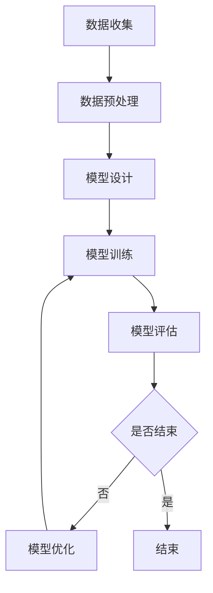

                 

### 文章标题

《大模型技术的自然语言处理进展》

### 关键词

大模型，自然语言处理，深度学习，神经网络，预训练模型，文本分类，机器翻译，问答系统，模型部署，优化技术，计算资源，数据隐私。

### 摘要

本文从大模型技术的基础出发，详细探讨了自然语言处理领域的最新进展。首先，介绍了大模型的基本概念、特点及其在自然语言处理中的应用。接着，深入分析了大模型的训练技术，包括数据准备、优化策略和训练过程。随后，通过具体应用案例解析了文本分类、机器翻译和问答系统的实现。最后，讨论了大模型的部署与优化技术，以及其在工业界的应用现状和未来发展趋势。本文旨在为读者提供一个全面且深入的视角，了解大模型技术在自然语言处理领域的应用及其面临的挑战。

---

## 第一部分：大模型技术基础

### 第1章：大模型与自然语言处理概述

自然语言处理（Natural Language Processing, NLP）是人工智能领域的一个重要分支，其目标是让计算机理解和处理人类语言。随着深度学习技术的快速发展，尤其是大规模预训练模型（Large Pre-trained Models）的出现，自然语言处理技术取得了显著的进展。本章将首先介绍大模型的基本概念和特点，然后概览自然语言处理技术，最后探讨大模型在自然语言处理中的应用。

#### 1.1 大模型的定义与特点

**1.1.1 大模型的基本概念**

大模型通常指的是拥有数十亿至数千亿参数的深度学习模型。这些模型通过在海量数据上进行预训练，掌握了丰富的语言知识和语义信息，从而在多个自然语言处理任务上表现出色。

**1.1.2 大模型的架构设计**

大模型的架构设计通常包含以下几个核心部分：

- **输入层**：接收原始文本数据，并进行预处理，如分词、去停用词等。
- **嵌入层**：将文本转换为高维向量表示，常用的技术有词嵌入（Word Embedding）和转换器嵌入（Transformer Embedding）。
- **中间层**：通过多层神经网络对嵌入层生成的向量进行编码和解码，常用的模型有循环神经网络（RNN）、长短时记忆网络（LSTM）和门控循环单元（GRU）。
- **输出层**：根据模型的任务类型，输出层可以是一个简单的线性层，也可以是多个线性层加激活函数的组合。

**1.1.3 大模型的训练与优化**

大模型的训练是一个复杂且计算密集的过程。通常采用以下步骤：

- **数据收集**：从互联网、书籍、新闻报道等多种来源收集大量的文本数据。
- **数据预处理**：对收集到的文本数据清洗、分词、去停用词、词性标注等。
- **数据增强**：通过同义词替换、随机删除单词、插入噪声等方式增加数据的多样性。
- **模型训练**：使用大量的计算资源进行模型训练，通过优化算法（如梯度下降、Adam等）更新模型参数。
- **模型评估**：在验证集上评估模型性能，通过交叉验证等技术避免过拟合。

#### 1.2 自然语言处理技术概览

自然语言处理技术主要包括词嵌入技术、序列模型与注意力机制、转换器架构等。

**1.2.1 词嵌入技术**

词嵌入是将自然语言中的单词转换为密集的向量表示。常见的词嵌入技术有：

- **分布式假设**：每个单词都可以表示为一个向量，向量中的每个元素代表单词的某个属性。
- **训练方法**：通过神经网络训练将单词映射到低维向量空间，常用的算法有Word2Vec、GloVe等。

**1.2.2 序列模型与注意力机制**

序列模型用于处理序列数据，如文本、语音等。注意力机制是一种在处理序列数据时，让模型关注序列中重要部分的方法。常见的序列模型和注意力机制有：

- **循环神经网络（RNN）**：一种能够处理序列数据的神经网络，包括长短时记忆网络（LSTM）和门控循环单元（GRU）。
- **注意力机制**：通过计算注意力权重，让模型关注序列中的关键部分，如自注意力（Self-Attention）和多头注意力（Multi-Head Attention）。

**1.2.3 转换器架构详解**

转换器（Transformer）是一种用于处理序列数据的深度学习模型，其核心思想是使用注意力机制来替代传统的循环神经网络。转换器架构包括以下几个主要部分：

- **嵌入层**：将输入的单词转换为嵌入向量。
- **多头自注意力层**：通过自注意力机制计算输入序列的表示。
- **前馈神经网络**：对自注意力层的输出进行进一步处理。
- **输出层**：根据任务类型输出预测结果。

#### 1.3 大模型在自然语言处理中的应用

大模型在自然语言处理中有着广泛的应用，包括文本分类、机器翻译、问答系统、生成文本等。

**1.3.1 文本分类与情感分析**

文本分类是将文本数据划分为预定义的类别，如新闻分类、情感分析等。大模型通过预训练和微调，能够在多个文本分类任务中取得优异的性能。

**1.3.2 机器翻译与问答系统**

机器翻译是将一种语言的文本翻译成另一种语言，问答系统则是通过理解和回答用户的问题来提供信息。大模型在这两个任务上表现出色，如Google翻译和BERT等。

**1.3.3 生成文本与创意写作**

生成文本和创意写作是自然语言处理领域的另一个重要应用。大模型通过生成式模型，如生成对抗网络（GAN）和变分自编码器（VAE），能够生成高质量的文本和创意作品。

### 结论

大模型技术的快速发展极大地推动了自然语言处理领域的进步。通过理解大模型的基本概念、架构设计和训练过程，以及自然语言处理技术的最新进展，读者可以更好地把握这一领域的发展趋势和应用前景。

---

### 第2章：大模型的训练技术

大模型的训练是自然语言处理中的关键步骤，其目的是通过学习大量数据，使得模型能够掌握丰富的语言知识和语义信息。本章将详细介绍大模型训练中的数据准备、优化策略和训练过程。

#### 2.1 训练数据的准备与处理

**2.1.1 数据来源与清洗**

大模型训练所需的数据量巨大，通常来源于互联网、书籍、新闻、社交媒体等多种来源。数据收集后，需要进行清洗和处理，以去除噪声和错误。

- **文本清洗**：去除HTML标签、符号和多余的空格。
- **分词**：将文本分割为单词或词汇单元。
- **去停用词**：去除对模型学习贡献较小的常见单词，如“的”、“是”、“了”等。
- **词性标注**：为每个单词标注词性，如名词、动词、形容词等。

**2.1.2 数据预处理技术**

数据预处理是训练前的重要步骤，其目标是提高模型的训练效率和性能。

- **词汇表构建**：将所有文本中的单词构建成一个词汇表，通常使用词频排序来构建。
- **词嵌入**：将词汇表中的单词映射到高维向量空间，常用的技术有Word2Vec、GloVe等。
- **序列化**：将文本数据序列化成模型能够处理的格式，如TensorFlow或PyTorch的数据集。

**2.1.3 数据增强方法**

数据增强是通过多种技术来增加数据的多样性，从而提高模型的泛化能力。

- **同义词替换**：将文本中的单词替换为同义词。
- **随机删除单词**：从文本中随机删除一定比例的单词。
- **插入噪声**：在文本中插入随机生成的单词或符号。
- **反向文本**：将文本反转，如“hello”变为“olleh”。

#### 2.2 大模型的优化策略

优化策略是在模型训练过程中，通过调整参数来提高模型性能的一系列技术。

**2.2.1 梯度下降与优化算法**

梯度下降是最常用的优化算法，其核心思想是沿着损失函数的梯度方向更新模型参数。

- **梯度下降**：最简单的梯度下降算法，通过固定学习率更新参数。
- **随机梯度下降（SGD）**：在每次更新参数时，随机选择一部分样本。
- **批量梯度下降**：每次更新参数时，使用整个数据集。
- **自适应梯度优化算法**：如Adam、RMSprop等，通过自适应调整学习率。

**2.2.2 学习率调度策略**

学习率调度是在训练过程中动态调整学习率，以提高模型收敛速度和稳定性。

- **固定学习率**：在整个训练过程中保持学习率不变。
- **学习率衰减**：随着训练的进行，逐渐减小学习率。
- **指数衰减**：学习率以指数方式递减。
- **余弦衰减**：学习率按照余弦函数衰减。

**2.2.3 模型正则化技术**

正则化是为了防止模型过拟合而采取的一系列技术。

- **L1正则化**：在损失函数中添加L1范数。
- **L2正则化**：在损失函数中添加L2范数。
- **Dropout**：在训练过程中随机丢弃一部分神经元。
- **数据增强**：通过增加数据的多样性来提高模型的泛化能力。

#### 2.3 大模型的训练过程与调参技巧

**2.3.1 训练过程概述**

大模型的训练过程通常包括以下几个阶段：

- **数据加载**：从预处理的文本数据中加载批次数据。
- **前向传播**：将输入数据通过模型，计算损失函数。
- **反向传播**：计算损失函数关于模型参数的梯度。
- **参数更新**：根据梯度更新模型参数。
- **评估与调整**：在验证集上评估模型性能，根据评估结果调整超参数。

**2.3.2 调参方法与实践**

调参是模型训练中至关重要的一步，以下是一些常见的调参方法：

- **网格搜索**：在给定的超参数空间内，遍历所有可能的组合，选择性能最优的参数。
- **随机搜索**：在给定的超参数空间内，随机选择一组参数进行训练，选择性能最优的参数。
- **贝叶斯优化**：基于历史调参结果，使用贝叶斯优化方法搜索最优超参数。

**2.3.3 训练过程中常见问题的解决**

在训练大模型时，可能会遇到以下问题：

- **梯度消失/梯度爆炸**：通过使用激活函数、批量归一化等技术解决。
- **过拟合**：通过正则化、数据增强、Dropout等技术解决。
- **收敛速度慢**：通过使用自适应优化算法、并行计算等技术解决。
- **资源不足**：通过使用GPU、分布式训练等技术解决。

### 结论

大模型的训练是一个复杂且计算密集的过程，涉及数据准备、优化策略和训练过程等多个方面。通过理解大模型训练的原理和技术，读者可以更好地设计和训练高性能的模型，推动自然语言处理领域的进一步发展。

---

### 第3章：大模型的应用案例解析

大模型在自然语言处理领域有着广泛的应用，本章将通过具体的案例解析，展示大模型在文本分类、机器翻译和问答系统中的应用，包括应用场景、数据处理、模型设计、训练过程以及应用效果分析。

#### 3.1 文本分类应用案例

**3.1.1 应用场景与数据处理**

文本分类是一种常见的自然语言处理任务，其目的是将文本数据划分为预定义的类别。一个典型的应用场景是社交媒体情感分析，通过对用户评论进行分类，识别用户的情感倾向。

数据处理过程包括以下几个步骤：

- **数据收集**：收集社交媒体平台上的用户评论，如微博、推特等。
- **文本清洗**：去除HTML标签、符号和多余的空格。
- **分词**：将文本分割为单词或词汇单元。
- **去停用词**：去除对模型学习贡献较小的常见单词。
- **词性标注**：为每个单词标注词性。

**3.1.2 模型设计与训练**

文本分类任务通常使用分类模型，如支持向量机（SVM）、朴素贝叶斯（Naive Bayes）、神经网络等。以下是一个基于深度学习的文本分类案例，使用BERT模型进行微调。

- **模型选择**：选择预训练的BERT模型作为基础模型，并进行微调。
- **数据预处理**：将文本数据转换为BERT模型所需的输入格式，包括分词、tokenization等。
- **训练过程**：使用训练集对BERT模型进行微调，通过优化算法更新模型参数。

**3.1.3 应用效果分析与优化**

在训练完成后，对模型进行评估，包括准确率、召回率、F1分数等指标。根据评估结果，对模型进行优化：

- **超参数调整**：调整学习率、批量大小等超参数。
- **数据增强**：通过同义词替换、随机删除单词等方式增加数据的多样性。
- **模型集成**：使用多个模型的平均预测结果来提高准确性。

**3.1.4 代码实现**

以下是使用PyTorch和transformers库进行文本分类的伪代码：

```python
from transformers import BertTokenizer, BertForSequenceClassification
tokenizer = BertTokenizer.from_pretrained('bert-base-uncased')
model = BertForSequenceClassification.from_pretrained('bert-base-uncased')

inputs = tokenizer("Hello, my dog is cute", return_tensors="pt")
outputs = model(**inputs)

logits = outputs.logits
_, predictions = torch.max(logits, dim=-1)
```

#### 3.2 机器翻译应用案例

**3.2.1 应用场景与数据处理**

机器翻译是将一种语言的文本翻译成另一种语言的任务。一个典型的应用场景是跨语言信息检索，将非英语的网页内容自动翻译成英语。

数据处理过程包括以下几个步骤：

- **数据收集**：收集双语语料库，如英德语对、中英文对等。
- **文本清洗**：去除HTML标签、符号和多余的空格。
- **分词**：将文本分割为单词或词汇单元。
- **去停用词**：去除对模型学习贡献较小的常见单词。

**3.2.2 模型设计与训练**

机器翻译任务通常使用序列到序列（Seq2Seq）模型，如循环神经网络（RNN）、长短时记忆网络（LSTM）、转换器（Transformer）等。以下是一个基于Transformer的机器翻译案例。

- **模型选择**：选择预训练的Transformer模型作为基础模型，并进行微调。
- **数据预处理**：将文本数据转换为Transformer模型所需的输入格式，包括编码器输入和解码器输入。
- **训练过程**：使用训练集对Transformer模型进行微调，通过优化算法更新模型参数。

**3.2.3 应用效果分析与优化**

在训练完成后，对模型进行评估，包括BLEU分数、翻译准确性等指标。根据评估结果，对模型进行优化：

- **注意力机制调整**：调整注意力机制参数，以提高翻译质量。
- **数据增强**：通过加入反向翻译、伪翻译等数据增强方法。
- **模型融合**：使用多个模型的平均预测结果来提高翻译准确性。

**3.2.4 代码实现**

以下是使用PyTorch和transformers库进行机器翻译的伪代码：

```python
from transformers import TransformerModel
tokenizer = TransformerModel.from_pretrained('transformer-model')
model = TransformerModel.from_pretrained('transformer-model')

inputs = tokenizer.encode("Hello, my dog is cute", return_tensors="pt")
outputs = model(inputs)

decoded_outputs = tokenizer.decode(outputs.logits.argmax(-1), skip_special_tokens=True)
```

#### 3.3 问答系统应用案例

**3.3.1 应用场景与数据处理**

问答系统是一种自然语言处理任务，其目的是根据用户的问题提供相关的答案。一个典型的应用场景是智能客服系统，通过自动回答用户的问题来提供帮助。

数据处理过程包括以下几个步骤：

- **数据收集**：收集用户问题和相关答案，如FAQ数据集。
- **文本清洗**：去除HTML标签、符号和多余的空格。
- **分词**：将文本分割为单词或词汇单元。
- **去停用词**：去除对模型学习贡献较小的常见单词。

**3.3.2 模型设计与训练**

问答系统通常使用预训练的转换器（Transformer）模型，如BERT、GPT等，并进行微调以适应特定的问答任务。

- **模型选择**：选择预训练的BERT模型作为基础模型，并进行微调。
- **数据预处理**：将问题和答案对转换为BERT模型所需的输入格式，包括输入序列和输出序列。
- **训练过程**：使用训练集对BERT模型进行微调，通过优化算法更新模型参数。

**3.3.3 应用效果分析与优化**

在训练完成后，对模型进行评估，包括答案准确性、响应时间等指标。根据评估结果，对模型进行优化：

- **超参数调整**：调整学习率、批量大小等超参数。
- **数据增强**：通过加入噪声、反转文本等数据增强方法。
- **模型集成**：使用多个模型的平均预测结果来提高答案准确性。

**3.3.4 代码实现**

以下是使用PyTorch和transformers库进行问答系统的伪代码：

```python
from transformers import BertForQuestionAnswering
model = BertForQuestionAnswering.from_pretrained('bert-base-uncased')

question = "What is the capital of France?"
context = "Paris is the capital of France."
inputs = tokenizer.encode(question + "\n" + context, return_tensors="pt")
outputs = model(inputs)

answer_start = outputs.start_logits.argmax(-1)
answer_end = outputs.end_logits.argmax(-1)
answer = context[answer_start:answer_end+1]
```

### 结论

通过以上三个应用案例，我们可以看到大模型在文本分类、机器翻译和问答系统中的广泛应用。通过对实际场景的分析和模型的训练，我们可以显著提高这些任务的性能，为用户提供更加智能和便捷的服务。

---

### 第4章：大模型的部署与优化

大模型在训练完成后，需要部署到生产环境中以供实际使用。部署过程中涉及到模型的转换、优化以及性能优化等技术。本章将详细介绍大模型部署与优化的相关技术，包括模型部署策略、优化技术以及工业界的应用现状。

#### 4.1 大模型的部署技术

**4.1.1 部署策略与架构设计**

大模型的部署策略取决于应用场景和性能需求。常见的部署策略包括：

- **单机部署**：将模型部署在一台高性能服务器上，适用于小型应用场景。
- **分布式部署**：将模型部署在多台服务器上，通过分布式计算提高模型处理能力，适用于大数据和高并发场景。

部署架构设计包括以下几个关键部分：

- **计算资源**：根据模型规模和性能需求选择合适的计算资源，如CPU、GPU、TPU等。
- **容器化**：使用容器技术（如Docker）封装模型和依赖库，便于部署和管理。
- **服务化**：使用微服务架构（如RESTful API）将模型暴露为服务，便于调用和扩展。

**4.1.2 部署过程中常见问题与解决方案**

在部署过程中，可能会遇到以下问题：

- **模型兼容性**：确保模型在不同环境（如开发环境、生产环境）中的兼容性。
- **性能瓶颈**：优化模型和部署架构，避免计算和存储资源成为瓶颈。
- **安全性**：确保模型和数据的加密和安全传输。

解决方案包括：

- **模型转换**：使用模型转换工具（如ONNX、TensorRT）将模型转换为适合部署的格式。
- **性能优化**：通过模型压缩、量化、推理加速等技术提高模型性能。
- **安全措施**：采用加密、认证、访问控制等安全措施保护模型和数据。

**4.1.3 部署流程与实践**

部署流程通常包括以下几个步骤：

- **环境准备**：准备部署环境，包括计算资源、操作系统、依赖库等。
- **模型转换**：将训练完成的模型转换为适合部署的格式。
- **容器化**：使用容器技术封装模型和依赖库，创建容器镜像。
- **服务部署**：将容器镜像部署到服务器或容器编排平台（如Kubernetes）。
- **监控与维护**：监控模型性能和资源使用情况，进行必要的维护和更新。

以下是一个基于Kubernetes的部署流程示例：

```shell
# 创建Dockerfile
FROM python:3.8
WORKDIR /app
COPY . .
RUN pip install -r requirements.txt

# 构建容器镜像
docker build -t my-model .

# 创建Kubernetes部署配置文件
apiVersion: apps/v1
kind: Deployment
metadata:
  name: my-model
spec:
  replicas: 1
  selector:
    matchLabels:
      app: my-model
  template:
    metadata:
      labels:
        app: my-model
    spec:
      containers:
      - name: my-model
        image: my-model:latest
        ports:
        - containerPort: 8080

# 部署模型到Kubernetes集群
kubectl apply -f deployment.yaml
```

#### 4.2 大模型的优化技术

**4.2.1 模型压缩技术**

模型压缩技术通过减少模型参数数量和计算量来提高模型部署的效率和速度。常见的模型压缩技术包括：

- **剪枝**：通过剪枝冗余的权重来减少模型参数数量。
- **量化**：将模型参数从浮点数转换为低精度数值，如8位整数。
- **稀疏化**：通过稀疏化模型参数来减少计算量。

**4.2.2 模型推理加速技术**

模型推理加速技术通过优化模型推理过程来提高模型处理速度。常见的模型推理加速技术包括：

- **GPU加速**：利用GPU的并行计算能力加速模型推理。
- **量化与低精度计算**：通过使用低精度数值来减少模型推理的计算量。
- **模型融合**：将多个模型融合为一个，减少模型推理的开销。

**4.2.3 模型量化与稀疏化技术**

模型量化与稀疏化技术通过将模型参数从高精度转换为低精度和稀疏表示来提高模型部署的效率和速度。常见的量化与稀疏化技术包括：

- **量化**：将模型参数从32位浮点数转换为8位整数或更低的精度。
- **稀疏化**：通过稀疏化权重来减少模型参数数量，从而减少计算量和存储需求。

以下是一个使用TensorFlow Lite进行模型量化和稀疏化的示例：

```python
import tensorflow as tf

# 加载训练完成的模型
model = tf.keras.models.load_model('my-model.h5')

# 量化模型
converter = tf.lite.TFLiteConverter.from_keras_model(model)
tflite_model = converter.convert()

# 稀疏化模型
model = tf.keras.models.load_model('my-model.h5')
model.layers[-1].activation = None
model.layers[-1].kernel_regularizer = tf.keras.regularizers.l1_l2(l1=1e-5, l2=1e-4)
sparse_model = tf.keras.models.clone_model(model)
sparse_model.compile(optimizer='adam', loss='binary_crossentropy')

# 保存量化和稀疏化后的模型
tf.keras.models.save_model(sparse_model, 'my-model-sparse.h5')
```

#### 4.3 大模型在工业界的应用

**4.3.1 工业界大模型应用现状**

大模型在工业界有着广泛的应用，如自然语言处理、计算机视觉、语音识别等。以下是一些典型应用案例：

- **自然语言处理**：智能客服、文本分类、机器翻译、问答系统等。
- **计算机视觉**：图像识别、目标检测、人脸识别等。
- **语音识别**：自动语音识别、语音合成、语音翻译等。

**4.3.2 应用案例分析**

以下是一些大模型在工业界的应用案例分析：

- **智能客服系统**：通过预训练的BERT模型进行自然语言处理，实现自动回复用户问题，提高客服效率。
- **图像识别系统**：通过预训练的ResNet模型进行图像识别，实现自动分类和标注，提高生产效率。
- **语音识别系统**：通过预训练的Transformer模型进行语音识别，实现高准确性语音转换成文本，提高信息获取效率。

**4.3.3 未来发展趋势与展望**

随着计算资源和算法技术的不断发展，大模型在工业界的应用将越来越广泛。以下是一些未来发展趋势与展望：

- **模型压缩与优化**：通过模型压缩、量化和稀疏化技术，降低模型部署的复杂度和计算成本。
- **实时推理**：通过推理加速技术，实现大模型在实时应用场景中的高效推理。
- **跨模态处理**：通过融合多种模态（如文本、图像、语音）的数据，实现更全面和智能的应用。
- **自动化与智能化**：通过大模型的应用，实现自动化和智能化，提高生产效率和服务质量。

### 结论

大模型的部署与优化是自然语言处理领域的重要环节。通过合理的部署策略和优化技术，可以实现大模型的高效部署和应用。同时，大模型在工业界的广泛应用为各个行业带来了巨大的价值。未来，随着技术的不断进步，大模型将在更多领域展现其强大的应用潜力。

---

### 第5章：大模型技术的发展趋势与挑战

随着大模型技术的迅速发展，其在自然语言处理、计算机视觉、语音识别等领域的应用取得了显著成果。然而，这一技术也面临着诸多挑战和未来发展趋势。本章将讨论大模型技术的未来发展趋势、面临的挑战以及应对策略。

#### 5.1 大模型技术的未来发展趋势

**5.1.1 模型结构创新**

大模型技术的发展离不开模型结构的创新。未来，模型结构可能会向以下方向发展：

- **多模态融合**：通过融合多种模态（如文本、图像、语音）的数据，构建更加全面和智能的模型。
- **动态模型**：引入动态网络结构，使模型能够根据输入数据动态调整网络连接和参数。
- **知识增强模型**：通过融合外部知识库和实体链接数据，提高模型的语义理解能力。

**5.1.2 模型训练算法优化**

模型训练算法的优化是大模型技术发展的关键。未来，模型训练算法可能会向以下方向发展：

- **分布式训练**：通过分布式计算技术，提高模型训练速度和效率。
- **增量训练**：实现模型的增量更新，避免从头开始训练，提高训练效率。
- **强化学习与模型训练**：结合强化学习技术，使模型在训练过程中具备自我调整能力。

**5.1.3 模型应用场景拓展**

大模型技术的应用场景将不断拓展，包括但不限于：

- **实时应用**：通过推理加速技术，实现大模型在实时应用场景中的高效推理。
- **边缘计算**：将大模型部署到边缘设备，实现本地化计算和实时响应。
- **跨领域应用**：将大模型应用于更多领域，如医疗、金融、教育等，提供定制化解决方案。

#### 5.2 大模型技术面临的挑战

**5.2.1 计算资源需求与成本**

大模型训练和部署需要大量的计算资源和成本。主要挑战包括：

- **计算资源限制**：对于一些中小型企业，难以负担高昂的计算资源。
- **能耗消耗**：大规模数据训练和模型推理过程会消耗大量电能，带来环保问题。
- **存储成本**：存储大量训练数据和模型参数需要大量的存储资源。

**5.2.2 模型解释性与可解释性**

大模型的复杂性和黑箱特性使其难以解释和理解。主要挑战包括：

- **决策透明度**：用户难以理解模型如何做出决策，从而影响模型的可接受度和信任度。
- **错误分析**：难以定位模型中的错误和缺陷，影响模型的质量和可靠性。
- **可解释性技术**：需要开发新的解释性技术，使模型决策过程更加透明和可理解。

**5.2.3 数据隐私与安全性**

大模型训练和部署过程中涉及大量数据，数据隐私和安全性成为重要挑战。主要挑战包括：

- **数据泄露风险**：未经授权的数据访问和泄露可能引发隐私和安全问题。
- **数据安全保护**：需要确保数据在传输和存储过程中的安全，防止数据篡改和丢失。
- **隐私保护技术**：需要开发新的隐私保护技术，如联邦学习、差分隐私等，保障数据隐私。

#### 5.3 大模型技术的应对策略

**5.3.1 技术创新与协作**

为了应对大模型技术面临的挑战，需要加强技术创新和跨学科协作：

- **多学科融合**：结合计算机科学、数学、统计学、生物学等学科的知识，推动大模型技术的发展。
- **开源与合作**：鼓励开源项目和技术合作，共享模型和算法，促进技术的进步和应用。
- **行业标准**：制定统一的技术标准和规范，提高大模型技术的可靠性和可解释性。

**5.3.2 政策法规与伦理规范**

政策和法规的制定对于大模型技术的发展至关重要：

- **数据保护法规**：加强数据保护法规，保障用户数据隐私和安全。
- **伦理规范**：建立伦理规范，确保大模型技术的应用符合社会价值观和伦理标准。
- **监管机制**：建立监管机制，对大模型技术的应用进行监督和评估，防止滥用和误用。

**5.3.3 社会责任与可持续发展**

大模型技术的发展需要承担社会责任和可持续发展：

- **社会责任**：企业和社会需要承担社会责任，确保大模型技术的应用惠及社会大众。
- **可持续发展**：在推动大模型技术发展的同时，关注能耗和环保问题，实现可持续发展。
- **公平与包容**：确保大模型技术的应用公平和包容，避免对特定群体造成不利影响。

### 结论

大模型技术在自然语言处理等领域取得了显著进展，但也面临着计算资源需求、模型解释性、数据隐私等挑战。通过技术创新、政策法规和可持续发展策略，可以应对这些挑战，推动大模型技术的健康发展，为社会带来更多价值和福祉。

---

### 附录A：大模型技术相关资源与工具

为了帮助读者更好地理解和应用大模型技术，本章将介绍一些常用的开源框架、工具、社区和学习资料。

#### A.1 开源框架与工具介绍

**1. TensorFlow**

TensorFlow是由Google开发的开源机器学习框架，广泛应用于深度学习和自然语言处理。其具有丰富的API和工具，支持多种深度学习模型和算法。

**2. PyTorch**

PyTorch是由Facebook开发的开源机器学习库，以其灵活的动态计算图和简洁的API受到广大研究者和工程师的喜爱。PyTorch在自然语言处理领域有着广泛的应用。

**3. Transformer**

Transformer是由Google在2017年提出的一种用于处理序列数据的深度学习模型，其自注意力机制（Self-Attention）在自然语言处理任务中表现出色。

**4. BERT**

BERT（Bidirectional Encoder Representations from Transformers）是由Google在2018年提出的一种预训练转换器模型，广泛应用于自然语言处理任务，如文本分类、问答系统等。

**5. Hugging Face**

Hugging Face是一个开源社区，提供了大量的自然语言处理模型和工具，如Transformers库、Sentence-BERT等，方便开发者进行模型训练和应用。

#### A.2 大模型技术社区与论坛

**1. Reddit - r/MachineLearning**

Reddit上的MachineLearning子版块是机器学习和深度学习社区的热点讨论区，涵盖了各种技术讨论、资源分享和招聘信息。

**2. Stack Overflow**

Stack Overflow是一个面向开发者的问答社区，其中包含了大量关于机器学习和深度学习的编程问题和技术讨论。

**3. arXiv**

arXiv是计算机科学、物理学和数学领域的预印本论文数据库，提供了最新的研究成果和论文，对于跟踪大模型技术的发展动态非常有帮助。

#### A.3 学习资料与推荐阅读

**1. 《深度学习》**

作者：Ian Goodfellow、Yoshua Bengio、Aaron Courville

这本书是深度学习的经典教材，详细介绍了深度学习的基本概念、算法和实现。

**2. 《自然语言处理综论》**

作者：Daniel Jurafsky、James H. Martin

这本书是自然语言处理的经典教材，全面介绍了自然语言处理的理论和实践。

**3. 《BERT：大规模预训练转换器模型的原理与实践》**

作者：Jacob Devlin、Matthew Chang、Kaiming He、Vincent Dumoulin

这本书详细介绍了BERT模型的原理、训练过程和应用场景，是研究大模型技术的必备资料。

**4. 《Transformer：自注意力机制的原理与应用》**

作者：Ashish Vaswani、Noam Shazeer、Niki Parmar、Jack Cass、Dzmitry Bahdanau、Lukasz Kaiser、Illia Polosukhin

这本书是Transformer模型的详细解析，包括自注意力机制的原理和应用。

### 附录B：Mermaid流程图与伪代码示例

#### B.1 大模型训练流程图



#### B.2 伪代码示例

```python
# 加载数据
data = load_data('data.csv')

# 预处理数据
preprocessed_data = preprocess_data(data)

# 设计模型
model = build_model()

# 训练模型
model.fit(preprocessed_data['X'], preprocessed_data['y'], epochs=10, batch_size=32)

# 评估模型
performance = model.evaluate(preprocessed_data['X_test'], preprocessed_data['y_test'])

# 模型优化
model.optimize()

# 模型应用
predictions = model.predict(new_data)
```

#### B.3 数学公式与解释说明

```latex
$$
L = -\sum_{i=1}^{N} y_i \log(p(y_i|x_i))
$$
解释：这是交叉熵损失函数，用于衡量模型预测的概率分布与真实分布之间的差异。
```

```latex
$$
\theta_{t+1} = \theta_{t} - \alpha \cdot \nabla_{\theta} J(\theta)
$$
解释：这是梯度下降算法中的更新公式，用于更新模型参数，使其损失函数最小化。
```

通过以上资源与工具的介绍，读者可以更加便捷地学习大模型技术，并在实际应用中取得更好的效果。

