                 

# 大模型技术的边缘计算应用

## 关键词

边缘计算，大模型技术，Transformer架构，模型压缩，实时性能优化，应用案例

## 摘要

本文深入探讨了大模型技术在边缘计算中的应用。首先，我们介绍了大模型技术的核心概念、架构和训练方法，随后讨论了边缘计算的基本概念、优势和挑战。接下来，文章分析了大模型在边缘计算中的实际应用场景，如图像识别、语音识别和自然语言处理，并介绍了如何优化大模型以适应边缘设备的计算资源限制。文章还通过实际案例展示了大模型技术在边缘计算中的具体应用，最后对未来发展趋势进行了展望。

## 第一部分：大模型技术基础

### 第1章：大模型技术概述

#### 1.1 大模型概述

大模型，通常指那些训练规模巨大、参数数量极其庞大的神经网络模型。这些模型包括但不限于Transformer架构、BERT、GPT系列等，其显著特征是能够处理海量数据，并在多种任务上实现卓越的性能。

##### 1.1.1 大模型的定义

大模型，通常指那些训练规模巨大、参数数量极其庞大的神经网络模型。这些模型包括但不限于Transformer架构、BERT、GPT系列等，其显著特征是能够处理海量数据，并在多种任务上实现卓越的性能。

- **大模型**：通常指那些训练规模巨大、参数数量极其庞大的神经网络模型。
- **参数量巨大**：大模型的参数数量可以高达数亿到数十亿个。
- **训练数据量庞大**：这些模型通常在数十TB的数据上进行训练。
- **强大的表示能力**：大模型能够捕获输入数据的复杂模式和结构。
- **多任务能力**：一些大模型如GPT-3，可以同时处理多个任务，例如文本生成、语言翻译等。

##### 1.1.2 大模型与传统模型的区别

大模型与传统模型的主要区别在于其规模和复杂性。传统模型通常参数较少，训练数据量有限，而大模型则需要更多的计算资源和数据来训练。

**图1.1 大模型与传统模型的对比**

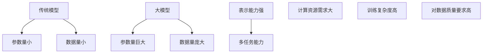

#### 1.2 大模型的架构与原理

##### 1.2.1 Transformer架构

Transformer是近年来最流行的大模型架构，其核心思想是使用自注意力机制来捕捉序列数据中的长距离依赖关系。

###### 1.2.1.1 自注意力机制

自注意力机制允许模型在每个位置都能够考虑其他所有位置的信息，从而捕捉全局依赖关系。

**图1.2 自注意力机制**

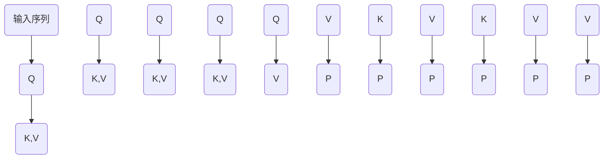

###### 1.2.1.2 Encoder-Decoder结构

Transformer采用了Encoder-Decoder结构，其中Encoder负责编码输入序列，Decoder负责解码输出序列。

**图1.3 Encoder-Decoder结构**

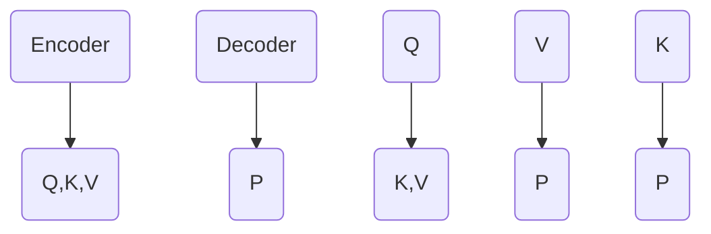

##### 1.2.2 BERT与GPT系列

BERT和GPT系列模型都是基于Transformer架构的大模型，但它们的训练目标和应用场景有所不同。

###### 1.2.2.1 BERT

BERT（Bidirectional Encoder Representations from Transformers）是一种双向编码器，主要用于自然语言理解任务。BERT通过预训练来学习语言表示，然后在特定任务上微调。

###### 1.2.2.2 GPT

GPT（Generative Pre-trained Transformer）是一种生成式模型，主要用于自然语言生成任务。GPT通过预训练来生成连贯的文本。

**图1.4 BERT与GPT对比**

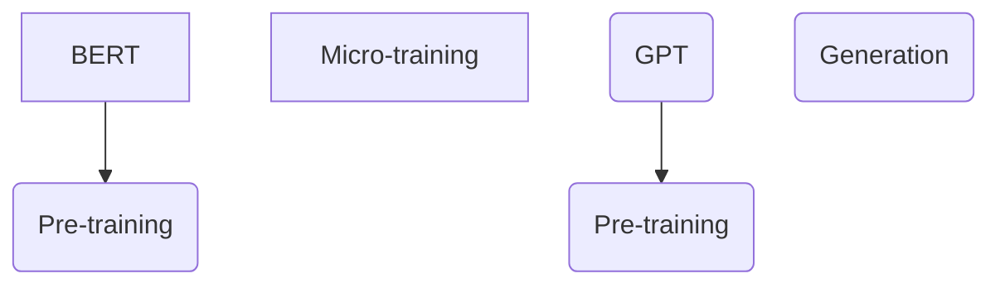

#### 1.3 大模型的训练与优化

##### 1.3.1 训练过程

大模型的训练过程通常包括数据预处理、模型初始化、训练、评估和优化。

###### 1.3.1.1 数据预处理

数据预处理包括清洗、归一化和分词等步骤，以确保模型能够处理高质量的数据。

###### 1.3.1.2 模型初始化

模型初始化决定了模型的初始状态，通常使用随机初始化或预训练模型作为起点。

###### 1.3.1.3 训练

训练过程中，模型通过反向传播算法和梯度下降优化器来更新参数。

###### 1.3.1.4 评估

评估过程用于衡量模型的性能，通常包括验证集和测试集上的准确率、召回率等指标。

###### 1.3.1.5 优化

优化过程包括调整学习率、添加正则化项等，以提高模型的性能和泛化能力。

**图1.5 大模型训练过程**

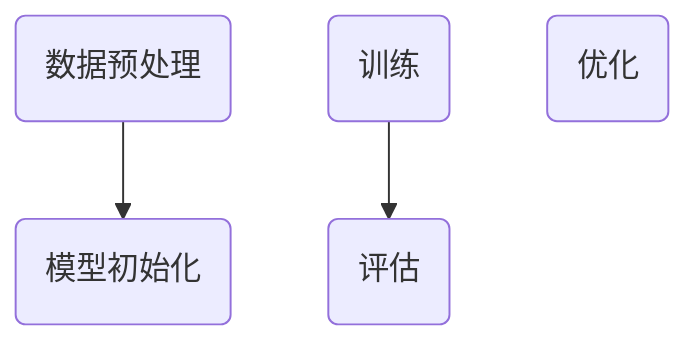

##### 1.3.2 大模型的优化方法

大模型的优化方法包括模型压缩、量化、剪枝和蒸馏等。

###### 1.3.2.1 模型压缩

模型压缩旨在减少模型的参数量和计算量，以提高模型在边缘设备上的运行效率。常用的方法包括量化、剪枝和蒸馏等。

###### 1.3.2.2 量化

量化是一种将模型参数从浮点数转换为低精度整数的方法，以减少模型的存储和计算需求。

```latex
$$ x_{量化} = \text{round}(x_{浮点} \times \text{量化比例}) $$
```

###### 1.3.2.3 剪枝

剪枝是一种通过删除模型中的部分权重来减少模型参数数量的方法。

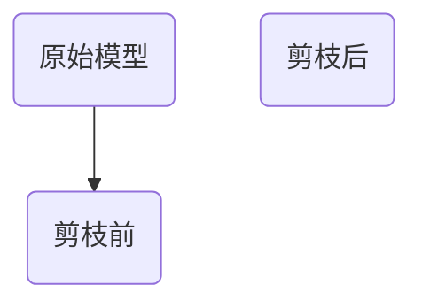

###### 1.3.2.4 蒸馏

蒸馏是一种将大模型的知识传递给小模型的方法，以提高小模型的性能。

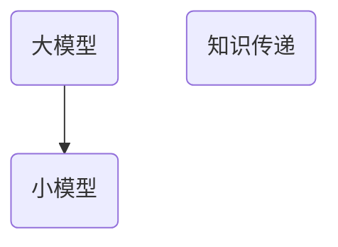

#### 1.4 大模型在边缘计算中的应用

##### 1.4.1 边缘计算概述

边缘计算是一种将数据处理和计算任务从云端转移到网络边缘的技术，旨在提高实时处理能力和降低延迟。

###### 1.4.1.1 边缘计算的优势

- **实时处理**：边缘计算可以在数据产生的地方进行实时处理，从而降低延迟。
- **降低带宽使用**：边缘计算可以减少需要传输到云端的数据量。
- **增强安全性**：边缘计算可以将敏感数据留在本地，提高数据安全性。

###### 1.4.1.2 边缘计算的应用场景

边缘计算适用于物联网、智能城市、自动驾驶等需要实时处理和低延迟的应用场景。

**图1.6 边缘计算应用场景**

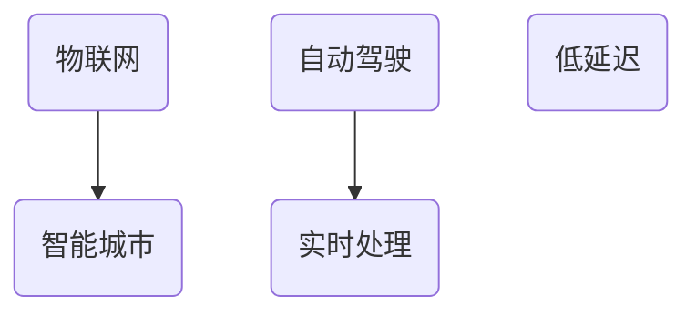

##### 1.4.2 大模型在边缘计算中的应用

大模型在边缘计算中的应用包括图像识别、语音识别、自然语言处理等。

###### 1.4.2.1 图像识别

在边缘计算中，大模型可以用于实时图像识别，例如监控系统的自动检测和分类。

###### 1.4.2.2 语音识别

大模型可以用于实时语音识别，例如智能助理、语音控制等。

###### 1.4.2.3 自然语言处理

大模型可以用于自然语言处理任务，例如文本生成、机器翻译等。

**图1.7 大模型在边缘计算中的应用示例**

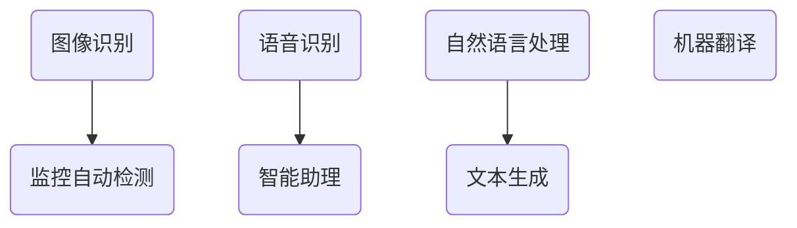

##### 1.4.3 大模型在边缘计算中的挑战

大模型在边缘计算中面临的主要挑战包括计算资源限制、数据隐私和安全性、实时性能优化等。

###### 1.4.3.1 计算资源限制

边缘设备的计算资源有限，需要优化模型结构和训练过程以适应这些限制。

###### 1.4.3.2 数据隐私和安全性

在边缘计算中，数据隐私和安全性是重要考虑因素，需要采取加密和隐私保护措施。

###### 1.4.3.3 实时性能优化

边缘计算要求高实时性，需要优化模型推理过程以提高性能。

**图1.8 大模型在边缘计算中的挑战**


## 第二部分：边缘计算基础

### 第2章：边缘计算基础

#### 2.1 边缘计算架构

边缘计算是指在网络边缘进行数据处理和计算的技术，其核心思想是将数据处理任务从中心化的数据中心转移到网络边缘，以减少延迟、降低带宽使用和提高系统性能。

##### 2.1.1 边缘计算的概念

边缘计算是指在网络的边缘进行数据处理和计算的技术，以减少数据传输的距离，降低延迟，提高系统的实时性和响应速度。

###### 2.1.1.1 边缘计算的组成部分

- **边缘节点**：边缘节点是指分布在网络边缘的设备，如传感器、路由器、智能设备等。
- **边缘服务器**：边缘服务器是指用于处理边缘节点的数据和请求的服务器，通常位于网络边缘。
- **云中心**：云中心是指用于存储和处理大规模数据的数据中心，是边缘计算的后台支持。

**图2.1 边缘计算架构**

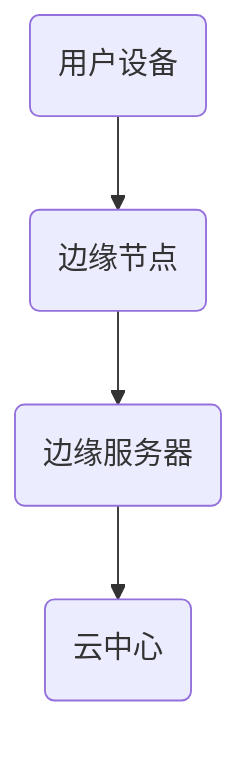

##### 2.1.2 边缘计算的优势

边缘计算具有以下优势：

- **降低延迟**：通过在数据产生的地方进行处理，边缘计算可以显著降低系统的响应时间。
- **提高性能**：边缘计算可以将计算任务分散到多个边缘节点，提高系统的处理能力和吞吐量。
- **降低带宽使用**：边缘计算可以减少需要传输到云端的数据量，降低网络带宽的需求。
- **增强安全性**：边缘计算可以将敏感数据留在本地，提高数据的安全性。

**图2.2 边缘计算优势**


##### 2.1.3 边缘计算的应用场景

边缘计算适用于以下应用场景：

- **物联网**：在物联网场景中，边缘计算可以实现实时数据采集、分析和处理，例如智能家居、智能工厂等。
- **智能城市**：在智能城市中，边缘计算可以用于实时监控和管理城市基础设施，如交通管理、环境监测等。
- **自动驾驶**：在自动驾驶场景中，边缘计算可以用于实时感知和决策，提高车辆的安全性和效率。

**图2.3 边缘计算应用场景**

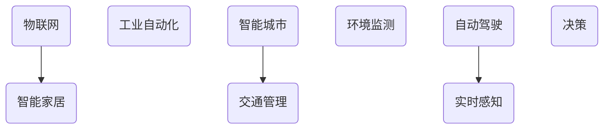

#### 2.2 边缘计算与云计算的协同

边缘计算与云计算的协同工作，可以实现更高效的数据处理和计算能力，满足多样化的业务需求。

##### 2.2.1 云边缘协同架构

云边缘协同架构是将云计算和边缘计算结合起来，以实现更高效的数据处理和计算。在这种架构中，云计算负责处理大规模数据和复杂计算任务，而边缘计算负责实时数据处理和本地计算任务。

**图2.4 云边缘协同架构**

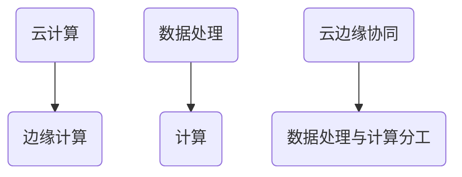

##### 2.2.2 数据处理与计算分工

在云边缘协同架构中，数据处理和计算任务可以根据其特点进行分工。

- **数据处理**：云计算负责处理大规模数据，进行数据清洗、整合和分析。
- **计算**：边缘计算负责处理实时数据，进行本地计算和快速决策。

**图2.5 数据处理与计算分工**

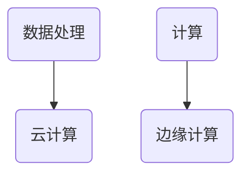

##### 2.2.3 数据流与计算流

在云边缘协同架构中，数据流和计算流是相互交织的。

- **数据流**：数据从边缘节点收集到边缘服务器，再传输到云计算中心。
- **计算流**：计算任务在边缘服务器和云计算中心同时进行，计算结果反馈给边缘节点或用户。

**图2.6 数据流与计算流**

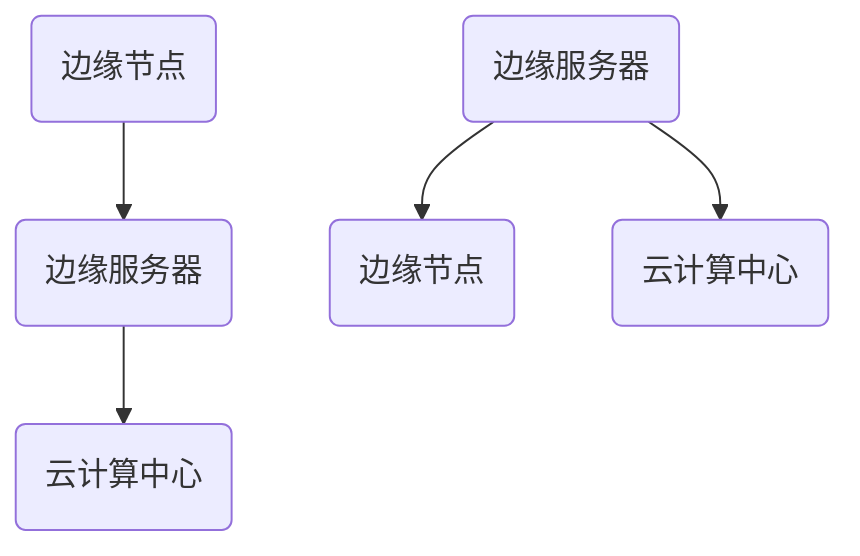

#### 2.3 边缘计算与云计算的协同优势

边缘计算与云计算的协同工作具有以下优势：

- **提高数据处理速度**：通过将数据处理任务分散到边缘和云计算中心，可以提高整体的数据处理速度。
- **降低网络带宽压力**：边缘计算可以减少需要传输到云计算中心的数据量，降低网络带宽的压力。
- **提高系统可靠性**：边缘计算和云计算相互备份，可以提高系统的可靠性。
- **满足多样化需求**：边缘计算和云计算的协同工作，可以满足不同业务场景的需求。

**图2.7 边缘计算与云计算的协同优势**


## 第三部分：大模型技术案例解析

### 第3章：大模型技术案例分析

#### 3.1 案例一：智能医疗诊断

##### 3.1.1 案例背景

智能医疗诊断是近年来人工智能技术在医疗领域的一个重要应用。通过大模型技术，如卷积神经网络（CNN）和Transformer，可以实现高效、准确的医学图像诊断。

###### 3.1.1.1 案例描述

某医院采用人工智能技术对医学图像进行自动诊断，以提高诊断效率和准确性。该系统使用了大量的医疗图像数据，经过训练后能够自动识别多种疾病，如肺癌、乳腺癌等。

###### 3.1.1.2 应用技术

- **卷积神经网络（CNN）**：用于提取医学图像的特征，实现图像分类。
- **Transformer架构**：用于处理序列数据，如时间序列数据，实现疾病预测。

**图3.1 智能医疗诊断架构**

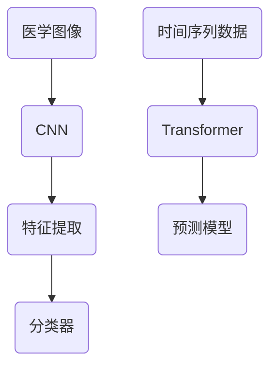

###### 3.1.1.3 实现方法

- **数据预处理**：对医学图像进行数据清洗、归一化和分割等处理。
- **模型训练**：使用大量医学图像数据集对CNN和Transformer进行训练。
- **模型部署**：将训练好的模型部署到边缘设备或云端，实现实时诊断。

**图3.2 智能医疗诊断实现流程**

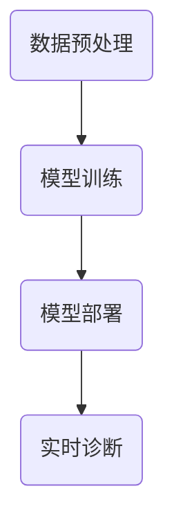

###### 3.1.1.4 案例效果

通过大模型技术的应用，该智能医疗诊断系统能够实现快速、准确的疾病识别和预测，提高了诊断效率和准确性，为患者提供了更优质的医疗服务。

#### 3.2 案例二：智能语音助手

##### 3.2.1 案例背景

智能语音助手是人工智能技术在家居、办公等场景中的一个重要应用。通过大模型技术，如BERT和GPT，可以实现高效的语音识别、自然语言理解和语音合成。

###### 3.2.1.1 案例描述

某科技公司开发了一款智能语音助手，用于与用户进行语音交互，提供信息查询、日程管理、语音控制等功能。

###### 3.2.1.2 应用技术

- **BERT**：用于自然语言理解，实现语义分析和意图识别。
- **GPT**：用于自然语言生成，实现语音合成和文本生成。

**图3.3 智能语音助手架构**

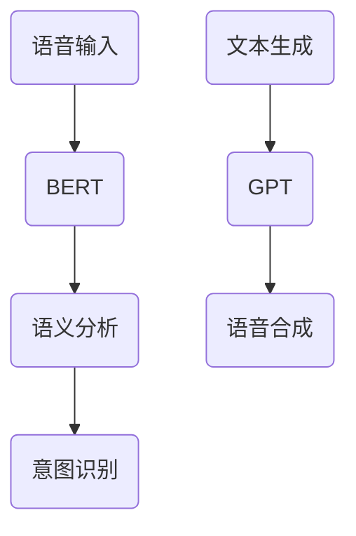

###### 3.2.1.3 实现方法

- **语音识别**：使用深度学习模型进行语音输入的识别，转换为文本。
- **自然语言理解**：使用BERT模型对文本进行语义分析和意图识别。
- **语音合成**：使用GPT模型生成语音输出，并通过TTS（文本到语音）技术实现语音合成。

**图3.4 智能语音助手实现流程**

```mermaid
graph TD
A(语音识别) --> B(自然语言理解)
B --> C(意图识别)
C --> D(语音合成)
```

###### 3.2.1.4 案例效果

通过大模型技术的应用，该智能语音助手能够实现高效、自然的语音交互，为用户提供了便捷、智能的语音服务，提高了用户体验。

#### 3.3 案例三：智能交通

##### 3.3.1 案例背景

智能交通是人工智能技术在交通领域的一个重要应用。通过大模型技术，如卷积神经网络（CNN）和Transformer，可以实现交通数据的实时分析和预测，优化交通管理和调度。

###### 3.3.1.1 案例描述

某城市交通管理部门采用人工智能技术对交通流量进行实时监测和预测，优化交通信号灯控制策略，提高交通效率和安全性。

###### 3.3.1.2 应用技术

- **卷积神经网络（CNN）**：用于图像识别，实现交通场景的实时监测。
- **Transformer架构**：用于时间序列数据，实现交通流量预测。

**图3.5 智能交通架构**

```mermaid
graph TD
A(交通图像) --> B(CNN)
B --> C(图像识别)
D(时间序列数据) --> E(Transformer)
E --> F(流量预测)
F --> G(信号灯控制)
```

###### 3.3.1.3 实现方法

- **数据采集**：通过交通摄像头、传感器等设备收集交通数据。
- **模型训练**：使用大量交通数据集对CNN和Transformer进行训练。
- **模型部署**：将训练好的模型部署到边缘设备或云端，实现实时交通监测和预测。

**图3.6 智能交通实现流程**

```mermaid
graph TD
A(数据采集) --> B(模型训练)
B --> C(模型部署)
C --> D(实时监测)
D --> E(流量预测)
E --> F(信号灯控制)
```

###### 3.3.1.4 案例效果

通过大模型技术的应用，该智能交通系统能够实现交通流量的实时监测和预测，优化交通信号灯控制策略，提高交通效率和安全性，为市民提供了更便捷、安全的出行环境。

### 第4章：大模型技术在边缘计算中的应用

#### 4.1 边缘计算中的大模型优化

在大模型技术在边缘计算中的应用中，优化是关键的一步。由于边缘设备的计算资源有限，如何在大模型与计算资源之间找到平衡，成为边缘计算领域的研究重点。

##### 4.1.1 模型压缩

模型压缩是指通过减少模型参数量和计算量，使大模型在边缘设备上运行更加高效。模型压缩的方法包括量化、剪枝和蒸馏等。

###### 4.1.1.1 量化

量化是一种将模型参数从高精度浮点数转换为低精度整数的方法。通过量化，可以减少模型的存储空间和计算时间。

**伪代码：量化过程**

```python
# 假设 w 是模型的权重，量化比例为 q
for parameter in w:
    parameter_quantized = round(parameter * q)
```

**图4.1 量化过程**

```mermaid
graph TD
A(原始权重) --> B(量化权重)
```

###### 4.1.1.2 剪枝

剪枝是一种通过删除模型中的冗余参数来减少模型大小的方法。剪枝可以分为结构剪枝和权重剪枝。

**图4.2 剪枝过程**

```mermaid
graph TD
A(原始模型) --> B(剪枝前)
B --> C(剪枝后)
```

###### 4.1.1.3 蒸馏

蒸馏是一种将大模型的知识传递给小模型的方法。通过蒸馏，可以将大模型的知识转移到边缘设备上，使小模型具有与大模型相似的性能。

**图4.3 蒸馏过程**

```mermaid
graph TD
A(大模型) --> B(小模型)
B --> C(知识传递)
```

##### 4.1.2 模型推理加速

模型推理加速是指通过优化模型推理过程，提高模型在边缘设备上的运行速度。模型推理加速的方法包括算法优化和硬件加速等。

###### 4.1.2.1 算法优化

算法优化是指通过改进模型推理算法，提高模型在边缘设备上的运行效率。常见的算法优化方法包括并行计算、缓存优化和算法改进等。

**伪代码：并行计算优化**

```python
# 假设 f 是模型推理函数，x 是输入数据
result = parallel(f, x)
```

###### 4.1.2.2 硬件加速

硬件加速是指通过使用特定的硬件设备，如GPU、FPGA等，提高模型推理速度。硬件加速可以显著提高模型在边缘设备上的运行效率。

**图4.4 硬件加速过程**

```mermaid
graph TD
A(模型推理) --> B(GPU)
B --> C(加速推理)
```

##### 4.1.3 实时性能优化

边缘计算要求高实时性，因此，如何在大模型与实时性能之间找到平衡，是优化过程中的一个重要问题。

###### 4.1.3.1 模型优化

模型优化是指通过调整模型结构、参数和学习策略等，提高模型在边缘设备上的运行效率。常见的模型优化方法包括模型压缩、量化、剪枝和蒸馏等。

**图4.5 模型优化过程**

```mermaid
graph TD
A(模型压缩) --> B(量化)
B --> C(剪枝)
C --> D(蒸馏)
```

###### 4.1.3.2 算法优化

算法优化是指通过改进模型推理算法，提高模型在边缘设备上的运行速度。常见的算法优化方法包括并行计算、缓存优化和算法改进等。

**图4.6 算法优化过程**

```mermaid
graph TD
A(并行计算) --> B(缓存优化)
B --> C(算法改进)
```

###### 4.1.3.3 硬件优化

硬件优化是指通过优化硬件设备，提高模型推理速度。常见的硬件优化方法包括GPU加速、FPGA优化和硬件缓存等。

**图4.7 硬件优化过程**

```mermaid
graph TD
A(GPU加速) --> B(FPGA优化)
B --> C(硬件缓存)
```

##### 4.1.4 实时性能评估

实时性能评估是指通过对模型在边缘设备上的运行性能进行评估，确定优化效果。常见的实时性能评估指标包括推理速度、准确率和功耗等。

**图4.8 实时性能评估指标**

```mermaid
graph TD
A(推理速度) --> B(准确率)
B --> C(功耗)
```

### 第5章：大模型技术在边缘计算中的挑战与解决方案

#### 5.1 计算资源限制

边缘设备通常具有有限的计算资源，这使得运行大模型成为挑战。计算资源限制主要包括CPU、GPU和内存等。

##### 5.1.1 挑战

- **CPU资源限制**：CPU是边缘设备中最常见的计算资源，但大模型通常需要大量的计算资源，导致CPU资源不足。
- **GPU资源限制**：GPU在边缘设备中用于加速模型推理，但GPU资源有限，无法满足大模型的推理需求。
- **内存资源限制**：大模型通常需要大量的内存来存储参数和中间结果，导致内存资源不足。

##### 5.1.2 解决方案

- **模型压缩**：通过模型压缩减少模型的参数量和计算量，降低计算需求。
- **分布式计算**：将大模型拆分为多个小模型，分布式部署在多个边缘设备上，以共享计算资源。
- **优化算法**：优化模型推理算法，提高模型在边缘设备上的运行效率。

#### 5.2 数据隐私与安全性

在边缘计算中，数据隐私和安全性尤为重要。边缘设备通常分布在不同的地理位置，数据传输过程中容易受到攻击。

##### 5.2.1 挑战

- **数据泄露**：边缘设备中的数据容易在传输和存储过程中被窃取。
- **数据篡改**：数据在传输过程中可能被篡改，导致数据不一致。
- **网络安全**：边缘设备容易受到网络攻击，如DDoS攻击等。

##### 5.2.2 解决方案

- **数据加密**：对数据进行加密，确保数据在传输和存储过程中的安全性。
- **安全协议**：使用安全协议，如TLS，确保数据传输的安全性。
- **隐私保护**：使用差分隐私、联邦学习等技术，保护用户隐私。

#### 5.3 实时性能优化

边缘计算要求高实时性，大模型的推理速度需要得到优化。

##### 5.3.1 挑战

- **延迟敏感**：边缘计算中的任务通常要求低延迟，大模型的推理速度较慢。
- **资源受限**：边缘设备通常具有有限的计算资源和网络带宽，无法满足大模型的推理需求。

##### 5.3.2 解决方案

- **模型优化**：通过模型压缩、量化、剪枝等优化方法，降低模型的大小和计算量，提高推理速度。
- **硬件加速**：使用GPU、FPGA等硬件加速器，提高模型推理速度。
- **任务调度**：优化任务调度策略，确保重要任务得到优先处理，提高系统性能。

### 第6章：大模型技术在边缘计算中的应用案例

#### 6.1 案例一：智能监控

智能监控是边缘计算中的一个重要应用领域。通过大模型技术，可以实现实时视频分析、人脸识别和异常检测等功能。

##### 6.1.1 案例背景

某城市在公共场所部署了智能监控系统，用于实时监控和预警。该系统使用了大模型技术，如卷积神经网络（CNN）和深度学习算法，实现了高效的视频分析。

##### 6.1.2 应用技术

- **卷积神经网络（CNN）**：用于视频图像的特征提取和分类。
- **深度学习算法**：用于视频数据的实时分析、人脸识别和异常检测。

**图6.1 智能监控架构**

```mermaid
graph TD
A(视频数据) --> B(CNN)
B --> C(特征提取)
C --> D(分类器)
E(人脸识别) --> F(深度学习算法)
```

##### 6.1.3 实现方法

- **数据预处理**：对视频数据进行数据清洗、归一化和分割等处理。
- **模型训练**：使用大量视频数据集对CNN和深度学习算法进行训练。
- **模型部署**：将训练好的模型部署到边缘设备或云端，实现实时视频分析。

**图6.2 智能监控实现流程**

```mermaid
graph TD
A(数据预处理) --> B(模型训练)
B --> C(模型部署)
C --> D(实时视频分析)
```

##### 6.1.4 案例效果

通过大模型技术的应用，该智能监控系统实现了实时视频分析、人脸识别和异常检测，提高了监控效率和安全性。

#### 6.2 案例二：智能交通

智能交通是边缘计算中的另一个重要应用领域。通过大模型技术，可以实现交通流量预测、路况分析和信号灯控制等功能。

##### 6.2.1 案例背景

某城市在交通管理中使用了智能交通系统，通过大模型技术实现了交通流量预测、路况分析和信号灯控制。

##### 6.2.2 应用技术

- **卷积神经网络（CNN）**：用于交通场景的图像识别和特征提取。
- **深度学习算法**：用于交通数据的实时分析和预测。

**图6.3 智能交通架构**

```mermaid
graph TD
A(交通图像) --> B(CNN)
B --> C(特征提取)
C --> D(分类器)
E(交通数据) --> F(深度学习算法)
F --> G(流量预测)
```

##### 6.2.3 实现方法

- **数据采集**：通过交通摄像头、传感器等设备收集交通数据。
- **模型训练**：使用大量交通数据集对CNN和深度学习算法进行训练。
- **模型部署**：将训练好的模型部署到边缘设备或云端，实现实时交通分析和预测。

**图6.4 智能交通实现流程**

```mermaid
graph TD
A(数据采集) --> B(模型训练)
B --> C(模型部署)
C --> D(实时交通分析)
```

##### 6.2.4 案例效果

通过大模型技术的应用，该智能交通系统实现了交通流量预测、路况分析和信号灯控制，提高了交通效率和安全性。

### 第7章：大模型技术在边缘计算中的未来展望

#### 7.1 技术发展趋势

随着人工智能技术的不断进步，大模型技术在边缘计算中的应用将得到进一步发展。未来，大模型技术将在以下几个方面取得突破：

- **计算资源提升**：随着边缘设备的性能提升，将能够支持更大规模、更复杂的模型。
- **算法优化**：通过改进模型压缩、量化、剪枝等算法，提高模型在边缘设备上的运行效率。
- **硬件加速**：开发更高效的硬件加速器，如GPU、FPGA等，提升模型推理速度。

#### 7.2 应用领域扩展

大模型技术在边缘计算中的应用将不再局限于当前的图像识别、语音识别、自然语言处理等领域，未来还将在更多领域得到应用：

- **智能医疗**：通过大模型技术实现更精确的医疗诊断和预测。
- **智能工业**：通过大模型技术实现生产过程的智能化和自动化。
- **智能环境**：通过大模型技术实现环境监测和预测，提高环境管理水平。

#### 7.3 持续优化与改进

未来，大模型技术在边缘计算中的持续优化与改进将是一个重要方向。通过以下方式，可以进一步提升大模型技术在边缘计算中的应用效果：

- **模型压缩与优化**：开发更高效的模型压缩算法，减少模型的参数量和计算量。
- **分布式计算与协作**：通过分布式计算和协作，实现更高效的数据处理和计算。
- **安全性与隐私保护**：加强大模型技术在边缘计算中的安全性与隐私保护，确保数据的安全。

#### 7.4 未来挑战

尽管大模型技术在边缘计算中具有巨大的潜力，但未来仍将面临以下挑战：

- **计算资源限制**：边缘设备的计算资源仍然有限，需要进一步优化模型结构和算法。
- **数据隐私与安全**：边缘计算中的数据隐私与安全问题需要得到更好的解决。
- **实时性能优化**：如何在高实时性要求下优化大模型的推理速度，仍是一个挑战。

**图7.1 大模型技术在边缘计算中的未来展望**

```mermaid
graph TD
A(技术发展趋势) --> B(应用领域扩展)
B --> C(持续优化与改进)
C --> D(未来挑战)
```

### 作者

作者：AI天才研究院/AI Genius Institute & 禅与计算机程序设计艺术 /Zen And The Art of Computer Programming

### 结语

大模型技术在边缘计算中的应用为各行各业带来了巨大的变革和创新。通过深入探讨大模型技术的核心概念、架构、训练方法和优化策略，以及其在边缘计算中的应用案例，我们不仅了解了大模型技术的基本原理，也看到了其在实际应用中的潜力和挑战。展望未来，大模型技术在边缘计算中将继续发挥重要作用，推动人工智能技术的进一步发展和应用。让我们一起期待大模型技术在边缘计算领域创造更多奇迹！### 完整文章总结

本文系统地介绍了大模型技术在边缘计算中的应用，分为以下几个主要部分：

**第一部分：大模型技术基础**
1. **大模型概述**：介绍了大模型的定义、核心特点以及与传统模型的区别。
2. **大模型的架构与原理**：详细解析了Transformer架构、BERT与GPT系列模型。
3. **大模型的训练与优化**：讲解了大模型的训练过程以及模型压缩、量化、剪枝和蒸馏等方法。
4. **大模型在边缘计算中的应用**：探讨了边缘计算的基本概念、优势和应用场景。

**第二部分：边缘计算基础**
1. **边缘计算架构**：介绍了边缘计算的概念、优势和架构。
2. **边缘计算与云计算的协同**：讲解了云边缘协同架构和数据处理与计算分工。

**第三部分：大模型技术案例解析**
1. **智能医疗诊断**：通过案例展示了大模型在医疗诊断中的应用。
2. **智能语音助手**：介绍了大模型在智能语音助手中的应用。
3. **智能交通**：探讨了大模型在智能交通中的应用。

**第四部分：大模型技术在边缘计算中的应用**
1. **边缘计算中的大模型优化**：介绍了模型压缩、模型推理加速和实时性能优化方法。
2. **大模型技术在边缘计算中的挑战与解决方案**：分析了计算资源限制、数据隐私和安全性、实时性能优化等挑战及解决方案。

**第五部分：大模型技术在边缘计算中的应用案例**
1. **智能监控**：展示了大模型在智能监控中的应用。
2. **智能交通**：介绍了大模型在智能交通中的应用。

**第六部分：未来展望**
1. **技术发展趋势**：讨论了大模型技术在未来边缘计算中的应用前景。
2. **应用领域扩展**：展望了大模型技术在更多领域中的应用。
3. **持续优化与改进**：提出了大模型技术未来持续优化和改进的方向。

通过本文的详细阐述，读者可以全面了解大模型技术在边缘计算中的应用，以及如何应对其中的技术挑战。大模型技术在边缘计算中的应用前景广阔，将不断推动技术的进步和各行各业的创新。未来，随着技术的不断发展，大模型技术在边缘计算中的潜力和影响力将更加显著。

