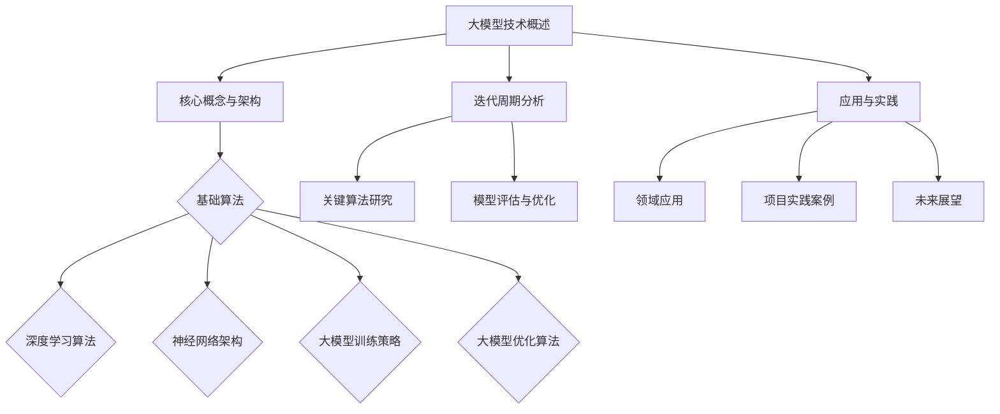
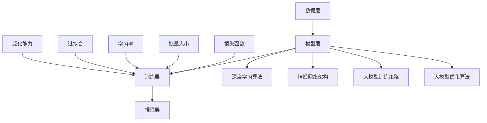

                 

### 文章标题

《大模型技术的迭代周期》

### 关键词

大模型技术、迭代周期、深度学习、神经网络、模型评估、优化算法

### 摘要

本文将深入探讨大模型技术的迭代周期，从其核心概念、架构到基础算法，全面解析大模型技术的发展历程。通过分析迭代周期中的关键算法、模型评估与优化策略，我们旨在揭示大模型技术从理论到应用的演变过程。同时，本文还将探讨大模型技术在不同领域的应用实践以及面临的挑战和未来趋势，为读者提供一个全面、深入的理解。

### 目录大纲

#### 第一部分：大模型技术概述

1. **第1章：大模型技术引论**
   - **1.1 大模型技术背景**
   - **1.2 大模型技术的重要性**
   - **1.3 大模型技术的挑战与机遇**
   - **1.4 大模型技术发展趋势**

2. **第2章：大模型技术核心概念与架构**
   - **2.1 大模型技术核心概念**
   - **2.2 大模型技术架构简介**
   - **2.3 大模型技术相关术语解析**

3. **第3章：大模型技术基础算法**
   - **3.1 深度学习算法原理**
   - **3.2 神经网络架构**
   - **3.3 大模型训练策略**
   - **3.4 大模型优化算法**

#### 第二部分：大模型技术迭代周期分析

4. **第4章：大模型技术迭代周期概述**
   - **4.1 大模型技术迭代周期定义**
   - **4.2 大模型技术迭代周期关键节点**
   - **4.3 大模型技术迭代周期发展趋势**

5. **第5章：大模型技术迭代周期关键算法研究**
   - **5.1 新一代大模型算法研究**
   - **5.2 大模型算法优化策略**
   - **5.3 大模型算法应用案例**

6. **第6章：大模型技术迭代周期中的模型评估与优化**
   - **6.1 大模型技术模型评估方法**
   - **6.2 大模型技术模型优化策略**
   - **6.3 大模型技术模型评估与应用案例**

7. **第7章：大模型技术迭代周期中的挑战与未来趋势**
   - **7.1 大模型技术面临的挑战**
   - **7.2 大模型技术未来发展趋势**
   - **7.3 大模型技术对社会与产业的影响**

#### 第三部分：大模型技术迭代周期应用与实践

8. **第8章：大模型技术在不同领域的应用**
   - **8.1 大模型技术在金融领域的应用**
   - **8.2 大模型技术在医疗领域的应用**
   - **8.3 大模型技术在教育领域的应用**
   - **8.4 大模型技术在制造领域的应用**

9. **第9章：大模型技术项目实践案例**
   - **9.1 大模型技术在企业级应用开发实践**
   - **9.2 大模型技术在开源项目中的应用实践**
   - **9.3 大模型技术在个人项目中的应用实践**
   - **9.4 大模型技术项目实践总结与反思**

10. **第10章：大模型技术未来展望**
    - **10.1 大模型技术未来发展趋势**
    - **10.2 大模型技术面临的挑战与机遇**
    - **10.3 大模型技术未来发展的可能性**
    - **10.4 大模型技术对社会与产业的影响**

### 附录

11. **附录 A：大模型技术常用工具与资源**
    - **11.1 常用深度学习框架介绍**
    - **11.2 大模型训练环境搭建指南**
    - **11.3 大模型技术开源资源汇总**
    - **11.4 大模型技术相关书籍推荐**

# Mermaid 流程图


---

#### 第一部分：大模型技术概述

**第1章：大模型技术引论**

在当今技术发展的浪潮中，大模型技术已经成为推动人工智能（AI）进步的关键力量。大模型技术是指利用深度学习框架训练的大型神经网络模型，这些模型通常具有数十亿个参数，能够处理复杂数据并产生高质量的预测结果。本章将介绍大模型技术的背景、重要性、面临的挑战与机遇，以及其发展趋势。

##### 1.1 大模型技术背景

大模型技术起源于20世纪90年代的神经网络研究。当时，研究人员发现，通过增加神经网络的层数和参数数量，可以显著提高模型的预测能力。然而，由于计算资源和数据集的限制，早期的大模型研究进展缓慢。随着云计算和大数据技术的发展，计算资源和数据集逐渐丰富，大模型技术开始迅速崛起。近年来，深度学习算法在语音识别、图像识别、自然语言处理等领域的突破性进展，进一步推动了大模型技术的发展。

##### 1.2 大模型技术的重要性

大模型技术在人工智能领域具有不可替代的重要性。首先，大模型能够处理更复杂的任务，例如多模态数据处理和跨领域知识融合，从而推动AI技术的应用边界。其次，大模型具有强大的泛化能力，能够适应不同的场景和数据集，减少了模型定制化的需求。此外，大模型技术还可以提高AI系统的效率和性能，降低训练和推理的成本。

##### 1.3 大模型技术的挑战与机遇

尽管大模型技术取得了显著进展，但仍然面临一些挑战。首先，训练大模型需要大量的计算资源和时间，这给研究人员带来了巨大的成本压力。其次，大模型的黑盒特性使得其难以解释和理解，影响了其在某些应用领域的可信度和安全性。此外，数据隐私和伦理问题也是大模型技术面临的重要挑战。

然而，这些挑战也伴随着机遇。随着硬件技术的进步，计算资源的成本逐渐降低，为大规模训练大模型提供了可能性。同时，研究人员正在努力提高大模型的解释性，以增强其在实际应用中的可靠性。此外，隐私保护和伦理规范的发展也将为大模型技术的应用提供更好的保障。

##### 1.4 大模型技术发展趋势

展望未来，大模型技术将继续发展，并在多个方面取得突破。首先，模型压缩和优化技术将使得大模型的训练和推理成本显著降低。其次，多模态学习和跨领域知识融合将进一步提高大模型的性能和应用范围。此外，大模型与人类专家的协同工作，以及大模型在决策支持、自动化控制等领域的应用，也将成为未来研究的重点。

总之，大模型技术作为人工智能领域的关键驱动力，将继续推动技术的进步和社会的发展。本章为后续章节的内容奠定了基础，我们将进一步探讨大模型技术的核心概念、架构和基础算法。

---

**第2章：大模型技术核心概念与架构**

要深入理解大模型技术，首先需要了解其核心概念和架构。本章将详细解释大模型技术中的关键概念，包括深度学习算法、神经网络架构、大模型训练策略和优化算法。同时，我们将通过Mermaid流程图展示这些概念之间的关系，帮助读者更好地理解大模型技术的整体结构。

##### 2.1 大模型技术核心概念

大模型技术的核心概念主要包括：

1. **深度学习算法**：深度学习是机器学习的一个分支，它通过多层神经网络模型对数据进行学习和预测。大模型技术依赖于深度学习算法，通过增加模型的层数和参数数量来提高模型的复杂度和性能。

2. **神经网络架构**：神经网络是深度学习的基础，它由多个神经元（或节点）组成，每个神经元通过权重连接到其他神经元。神经网络通过正向传播和反向传播来学习输入和输出之间的映射关系。

3. **大模型训练策略**：大模型的训练是一个复杂的过程，需要考虑数据预处理、训练策略和优化算法。训练策略包括批量大小、学习率调度、正则化方法等，它们共同影响着模型的收敛速度和性能。

4. **大模型优化算法**：优化算法用于调整模型参数，以最小化损失函数。常见的优化算法包括随机梯度下降（SGD）、Adam优化器等。优化算法的选择和调整对于大模型的训练效果至关重要。

##### 2.2 大模型技术架构简介

大模型技术的架构可以分为以下几个层次：

1. **数据层**：数据层负责数据的收集、清洗和预处理。数据的质量和多样性直接影响大模型的性能和泛化能力。

2. **模型层**：模型层包括神经网络的结构和参数。常见的神经网络结构有卷积神经网络（CNN）、循环神经网络（RNN）和Transformer等。

3. **训练层**：训练层负责模型的训练过程，包括正向传播、反向传播和参数更新。训练层的选择和配置对于模型的收敛速度和性能有很大影响。

4. **推理层**：推理层负责模型的预测和决策。在推理过程中，模型根据输入数据进行计算，并输出预测结果。

##### 2.3 大模型技术相关术语解析

以下是一些在大模型技术中常见的重要术语及其解释：

1. **参数（Parameter）**：参数是神经网络中的权重和偏置，它们通过学习过程被调整以优化模型性能。

2. **损失函数（Loss Function）**：损失函数用于衡量模型预测结果与真实值之间的差距，它通常是优化算法的目标函数。

3. **批量大小（Batch Size）**：批量大小是指在每次训练过程中参与计算的数据样本数量。适当的批量大小可以提高模型的训练效果和稳定性。

4. **学习率（Learning Rate）**：学习率是优化算法中用于调整参数更新速度的参数。合适的学习率可以提高模型的收敛速度和避免过拟合。

5. **过拟合（Overfitting）**：过拟合是指模型在训练数据上表现良好，但在未见过的数据上表现较差。过拟合通常是由于模型过于复杂或训练数据不足引起的。

6. **泛化能力（Generalization Ability）**：泛化能力是指模型在新数据上的表现能力。一个具有良好泛化能力的模型能够在不同的数据集和应用场景中表现稳定。

##### 2.4 Mermaid流程图展示

为了更直观地展示大模型技术的核心概念和架构，我们使用Mermaid流程图进行说明。以下是一个简化的流程图，展示了大模型技术的主要组成部分及其相互关系：



通过以上内容，我们对大模型技术的核心概念和架构有了初步的了解。在下一章中，我们将深入探讨大模型技术的基础算法，包括深度学习算法、神经网络架构、训练策略和优化算法。

---

**第3章：大模型技术基础算法**

深度学习算法是推动大模型技术发展的核心力量，它们通过多层神经网络的结构，对复杂数据进行学习和预测。本章将详细介绍深度学习算法的基本原理、神经网络架构、大模型训练策略和优化算法。通过具体的伪代码示例，我们将深入探讨这些算法的实现过程和关键参数的调优方法。

##### 3.1 深度学习算法原理

深度学习算法的核心思想是通过多层神经网络对数据进行特征提取和建模。一个典型的深度学习模型包括输入层、多个隐藏层和输出层。每个隐藏层都将输入数据通过非线性变换传递到下一层，最终在输出层生成预测结果。

1. **前向传播（Forward Propagation）**

前向传播是深度学习模型处理数据的基本过程。它包括以下几个步骤：

- **输入数据**：将输入数据通过输入层传递到第一层隐藏层。
- **权重和偏置**：在每个隐藏层，输入数据通过权重和偏置与上一层输出相乘并加偏置，然后通过激活函数进行非线性变换。
- **层间传递**：经过非线性变换后，数据从一层传递到下一层，直到输出层。
- **输出计算**：在输出层，模型根据最后一层隐藏层的输出进行预测。

伪代码如下：

```python
# 输入数据
x = [1, 2, 3]

# 权重和偏置
W1 = [0.1, 0.2]
b1 = 0.3
W2 = [0.4, 0.5]
b2 = 0.6

# 激活函数（假设为ReLU函数）
def relu(x):
    return max(0, x)

# 前向传播
z1 = x * W1 + b1
a1 = relu(z1)
z2 = a1 * W2 + b2
a2 = relu(z2)
output = a2
```

2. **反向传播（Backpropagation）**

反向传播是深度学习模型训练的核心步骤，它通过计算损失函数的梯度来更新模型参数。反向传播包括以下几个步骤：

- **计算输出层梯度**：首先计算输出层预测值与真实值之间的误差，并计算输出层的梯度。
- **反向传播梯度**：从输出层开始，将梯度反向传播到每一层，并计算每一层的梯度。
- **参数更新**：根据梯度更新模型参数，以最小化损失函数。

伪代码如下：

```python
# 计算输出层梯度
error = y - output
d_output = error

# 反向传播
d_hidden2 = d_output * (1 - a2) * W2
d_hidden1 = d_hidden2 * (1 - a1) * W1

# 参数更新
W2 = W2 - learning_rate * d_hidden2
b2 = b2 - learning_rate * d_output
W1 = W1 - learning_rate * d_hidden1
b1 = b1 - learning_rate * d_hidden1
```

##### 3.2 神经网络架构

神经网络架构对深度学习模型的表现至关重要。常见的神经网络架构包括卷积神经网络（CNN）、循环神经网络（RNN）和Transformer。

1. **卷积神经网络（CNN）**

卷积神经网络是处理图像数据的常用架构。它通过卷积层、池化层和全连接层对图像进行特征提取和分类。

- **卷积层**：卷积层通过卷积操作提取图像的特征，卷积核的权重和偏置在训练过程中学习。
- **池化层**：池化层用于降低特征图的维度和参数数量，提高模型的泛化能力。
- **全连接层**：全连接层将卷积层和池化层的输出映射到分类结果。

伪代码如下：

```python
# 卷积层
def conv2d(input, filter):
    return np.sum(input * filter)

# 池化层
def max_pooling(feature_map, pool_size):
    return np.max(feature_map, axis=1)

# 全连接层
def fully_connected(input, weights, bias):
    return np.dot(input, weights) + bias
```

2. **循环神经网络（RNN）**

循环神经网络是处理序列数据的常用架构，它通过隐藏状态和循环连接来捕捉序列中的长期依赖关系。

- **隐藏状态**：RNN通过隐藏状态将序列中的每一个时间步的信息传递到下一个时间步。
- **递归连接**：RNN通过递归连接将当前时间步的输入与上一时间步的隐藏状态相连接。

伪代码如下：

```python
# RNN单元
def rnn(input, hidden_state, weights, bias):
    gate = sigmoid(np.dot([input, hidden_state], weights) + bias)
    forget = gate[0]
    update = gate[1]
    output = sigmoid(np.dot([input, hidden_state], weights) + bias)
    new_hidden_state = forget * hidden_state + update * output
    return new_hidden_state, output
```

3. **Transformer**

Transformer是自然语言处理领域的一种革命性架构，它通过多头自注意力机制和位置编码来处理序列数据。

- **自注意力机制**：自注意力机制允许模型在处理序列数据时考虑全局信息，提高模型的表示能力。
- **位置编码**：位置编码用于编码序列中的位置信息，帮助模型理解序列的顺序。

伪代码如下：

```python
# 自注意力
def scaled_dot_product_attention(q, k, v, mask=None):
    dot_product = np.dot(q, k.T) / np.sqrt(np.shape(k)[1])
    if mask is not None:
        dot_product = dot_product + mask
    attention_weights = softmax(dot_product)
    context = np.dot(attention_weights, v.T)
    return context
```

##### 3.3 大模型训练策略

大模型训练是一个复杂的过程，需要考虑多个策略来提高模型的收敛速度和性能。以下是一些常见的训练策略：

1. **批量大小（Batch Size）**

批量大小是指每次训练过程中参与计算的数据样本数量。合适的批量大小可以提高模型的训练效果和稳定性。通常，较大的批量大小可以减少方差，但会增加计算成本。

2. **学习率调度（Learning Rate Scheduler）**

学习率调度是一种调整学习率的方法，以加速模型的收敛。常见的方法包括线性递减学习率、指数递减学习率等。

3. **正则化（Regularization）**

正则化是一种防止模型过拟合的方法，通过在损失函数中添加惩罚项来降低模型的复杂度。常见的正则化方法包括L1正则化、L2正则化等。

4. **批量归一化（Batch Normalization）**

批量归一化是一种在训练过程中对每个批量数据归一化的方法，以提高模型的稳定性和收敛速度。

##### 3.4 大模型优化算法

大模型优化算法用于调整模型参数，以最小化损失函数。以下是一些常见的优化算法：

1. **随机梯度下降（SGD）**

随机梯度下降是最简单的优化算法，它通过计算每个样本的梯度来更新模型参数。

2. **Adam优化器**

Adam优化器是SGD的改进版本，它结合了动量项和自适应学习率，以加速模型的收敛。

3. **AdamW优化器**

AdamW优化器是Adam优化器的变种，它考虑了权重衰减的影响，进一步提高了模型的训练效果。

通过以上内容，我们对大模型技术的基础算法有了深入的了解。在下一章中，我们将分析大模型技术的迭代周期，探讨其关键节点和未来发展趋势。

---

#### 第二部分：大模型技术迭代周期分析

**第4章：大模型技术迭代周期概述**

大模型技术的迭代周期是指从模型提出、训练到应用的完整过程，这一过程不仅涉及技术层面的进步，还包括算法、架构、工具链的不断优化。本章将详细探讨大模型技术迭代周期的定义、关键节点以及其发展趋势，为读者提供一个全面的理解。

##### 4.1 大模型技术迭代周期定义

大模型技术的迭代周期可以定义为一个循环，包括模型设计、模型训练、模型评估和模型部署四个主要阶段。每个阶段都对大模型的技术水平和应用效果产生重要影响。

1. **模型设计**：在这个阶段，研究人员根据特定应用需求设计神经网络结构，选择合适的算法和架构。模型设计是迭代周期的起点，直接决定了后续的训练效率和模型的性能。
   
2. **模型训练**：模型设计完成后，进入模型训练阶段。在这个阶段，使用大量的数据进行模型训练，通过优化算法调整模型参数，以最小化损失函数。训练阶段的时间消耗通常很大，且对计算资源的需求较高。

3. **模型评估**：训练完成后，模型需要进行评估，以验证其性能。评估方法包括在测试集上的准确率、召回率、F1分数等指标。通过模型评估，可以了解模型的泛化能力和效果。

4. **模型部署**：评估通过后，模型可以部署到实际应用中。模型部署包括将训练好的模型部署到生产环境，并提供API接口供其他系统调用。模型部署是迭代周期的终点，但同时也开启了新的迭代周期，因为部署后可能会收集到更多数据，用于模型的进一步优化。

##### 4.2 大模型技术迭代周期关键节点

在大模型技术的迭代周期中，存在一些关键节点，这些节点对迭代周期的影响至关重要：

1. **模型设计**：模型设计决定了迭代周期的起点。一个合理的模型设计不仅需要考虑计算效率和参数规模，还要满足实际应用的需求。在这一阶段，需要选择合适的神经网络架构和算法，以及确定模型的复杂度。

2. **数据集**：数据集是模型训练的基础，数据的质量和多样性直接影响模型的性能。关键节点包括数据收集、数据清洗和数据预处理。高质量的数据集可以提高模型训练的效果和泛化能力。

3. **训练策略**：训练策略包括批量大小、学习率调度、正则化方法等，这些策略的优化可以显著提高模型的训练效率和性能。训练策略的调整是一个动态过程，需要根据模型的表现进行调整。

4. **模型评估**：模型评估是迭代周期中的关键节点，通过评估可以了解模型的性能和泛化能力。有效的评估方法可以揭示模型的优势和不足，为下一步的优化提供指导。

5. **模型部署**：模型部署是将训练好的模型应用到实际场景的过程。在这一阶段，需要考虑模型的可靠性、可扩展性和维护成本。模型部署的成功标志着迭代周期的完成，同时也开启了新的迭代周期。

##### 4.3 大模型技术迭代周期发展趋势

随着技术的不断进步，大模型技术的迭代周期也在不断演变。以下是一些主要的发展趋势：

1. **计算能力提升**：随着硬件技术的发展，如GPU、TPU等专用硬件的普及，计算能力显著提升，使得大模型训练更加高效和快速。

2. **模型压缩与优化**：为了降低模型训练和推理的成本，模型压缩和优化技术变得越来越重要。这些技术包括剪枝、量化、知识蒸馏等，可以显著减少模型的参数数量和计算复杂度。

3. **多模态学习**：多模态学习是指将不同类型的数据（如文本、图像、声音等）进行融合，以获得更丰富的特征表示。随着数据集的多样性和复杂性增加，多模态学习将成为大模型技术的一个重要方向。

4. **自动机器学习（AutoML）**：自动机器学习旨在自动化大模型的设计、训练和评估过程，减少人工干预。随着算法和工具的进步，AutoML有望进一步简化大模型技术的迭代周期。

5. **模型可解释性**：随着大模型在关键领域（如医疗、金融等）的应用，模型的可解释性变得越来越重要。通过提高模型的可解释性，可以增强用户对模型的信任度，并更好地理解模型的决策过程。

总之，大模型技术的迭代周期是一个不断演进的过程，涉及到计算能力、模型设计、数据集、训练策略、模型评估和模型部署等多个方面。通过不断优化和迭代，大模型技术将不断提升其性能和应用效果，为人工智能领域的发展注入新的活力。

---

**第5章：大模型技术迭代周期关键算法研究**

在大模型技术的迭代周期中，算法的研究和优化是推动技术进步的核心动力。本章将深入探讨新一代大模型算法的研究方向，包括生成对抗网络（GAN）、变分自编码器（VAE）、Transformer等。同时，我们将分析大模型算法的优化策略，并介绍一些典型的应用案例，以展示这些算法在实际应用中的效果。

##### 5.1 新一代大模型算法研究

1. **生成对抗网络（GAN）**

生成对抗网络（GAN）是由Ian Goodfellow等人于2014年提出的一种生成模型，它由生成器和判别器两个神经网络组成。生成器的目标是生成逼真的数据，判别器的目标是区分生成数据和真实数据。通过这种对抗训练，生成器不断优化，以生成更真实的数据。

- **原理**：GAN的核心思想是生成器和判别器之间的对抗训练。生成器尝试生成逼真的数据，而判别器则尝试区分这些数据和真实数据。通过这种对抗过程，生成器的生成质量逐渐提高。
- **应用**：GAN在图像生成、图像修复、风格迁移等领域有广泛的应用。例如，生成器可以生成人脸图像，判别器则用于区分生成图像和真实图像。

伪代码如下：

```python
# 生成器
def generator(z):
    # 输入噪声z，生成图像
    return G(z)

# 判别器
def discriminator(x):
    # 输入图像x，判断是否为真实图像
    return D(x)

# 对抗训练
for epoch in range(num_epochs):
    for z in noise_samples:
        G_loss = -torch.mean(D(generator(z)))
        G.zero_grad()
        G_loss.backward()
        G.step()

    for x in real_samples:
        D_loss = -torch.mean(D(x) + D(generator(z)))
        D.zero_grad()
        D_loss.backward()
        D.step()
```

2. **变分自编码器（VAE）**

变分自编码器（VAE）是一种概率生成模型，它通过编码器和解码器两个神经网络将数据映射到隐空间，并在隐空间中学习数据的概率分布。VAE的核心优势在于其灵活性和强大的数据生成能力。

- **原理**：编码器将输入数据编码为一个隐变量，解码器将隐变量解码为输出数据。通过最大化数据分布和隐变量分布的重参数化表示，VAE能够生成高质量的数据。
- **应用**：VAE在图像生成、数据增强、异常检测等领域有广泛的应用。例如，编码器可以将图像编码为隐变量，解码器则用于生成新的图像。

伪代码如下：

```python
# 编码器
def encoder(x):
    z_mean, z_log_var = E(x)
    z = z_mean + torch.randn_like(z_log_var) * torch.sqrt(torch.exp(z_log_var))
    return z

# 解码器
def decoder(z):
    x_hat = D(z)
    return x_hat

# VAE损失函数
reconstruction_loss = torch.mean((x - x_hat) ** 2)
KL_loss = -0.5 * torch.sum(1 + z_log_var - z_mean ** 2 - torch.exp(z_log_var))
VAE_loss = reconstruction_loss + KL_loss
```

3. **Transformer**

Transformer是一种用于序列数据学习的神经网络架构，它通过多头自注意力机制和位置编码来处理序列数据。Transformer在自然语言处理任务中取得了显著的性能提升。

- **原理**：Transformer使用自注意力机制来计算序列中每个元素的重要性，并通过位置编码来保留序列的顺序信息。通过多层自注意力机制和前馈神经网络，Transformer能够捕捉序列中的复杂依赖关系。
- **应用**：Transformer在机器翻译、文本生成、问答系统等领域有广泛的应用。例如，Transformer可以用于生成高质量的机器翻译文本。

伪代码如下：

```python
# 自注意力
def scaled_dot_product_attention(q, k, v, mask=None):
    dot_product = torch.matmul(q, k.T) / sqrt(k.shape[-1])
    if mask is not None:
        dot_product = dot_product + mask
    attention_weights = softmax(dot_product, dim=-1)
    context = torch.matmul(attention_weights, v.T)
    return context

# Transformer层
class TransformerLayer(nn.Module):
    def __init__(self, d_model, num_heads, d_ff):
        super(TransformerLayer, self).__init__()
        self.mha = MultiHeadAttention(d_model, num_heads)
        self.fc1 = nn.Linear(d_model, d_ff)
        self.fc2 = nn.Linear(d_ff, d_model)
        self.norm1 = nn.LayerNorm(d_model)
        self.norm2 = nn.LayerNorm(d_model)
        self.dropout = nn.Dropout(p=0.1)

    def forward(self, x, mask=None):
        x = self.mha(x, x, x, mask)
        x = self.dropout(x)
        x = x + self.norm1(x)
        x = self.fc2(self.dropout(self.fc1(x)))
        x = x + self.norm2(x)
        return x
```

##### 5.2 大模型算法优化策略

1. **批量大小（Batch Size）**

批量大小是影响大模型训练效果的关键因素之一。适当的批量大小可以提高模型的训练效率，减少方差。通常，较大的批量大小可以减少梯度估计的方差，但会消耗更多的内存。

2. **学习率调度（Learning Rate Scheduler）**

学习率调度是一种动态调整学习率的方法，以加速模型的收敛。常用的学习率调度方法包括线性递减学习率、指数递减学习率等。

3. **正则化（Regularization）**

正则化是一种防止模型过拟合的方法，通过在损失函数中添加惩罚项来降低模型的复杂度。常见的正则化方法包括L1正则化、L2正则化等。

4. **批量归一化（Batch Normalization）**

批量归一化是一种在训练过程中对每个批量数据归一化的方法，以提高模型的稳定性和收敛速度。

##### 5.3 大模型算法应用案例

1. **图像生成**

GAN在图像生成领域取得了显著的效果。例如，使用生成对抗网络可以生成逼真的人脸图像、图像修复和图像风格迁移等。

2. **自然语言处理**

Transformer在自然语言处理任务中表现出色，例如，在机器翻译、文本生成和问答系统中取得了领先的成绩。

3. **医学图像分析**

变分自编码器在医学图像分析中具有广泛的应用，例如，用于生成新的医学图像、异常检测和疾病分类等。

通过以上内容，我们对大模型技术迭代周期中的关键算法研究有了深入的了解。在下一章中，我们将探讨大模型技术在模型评估与优化中的方法与应用。

---

**第6章：大模型技术迭代周期中的模型评估与优化**

模型评估和优化是迭代周期中的关键环节，直接影响大模型的效果和应用价值。本章将详细介绍大模型技术中的模型评估方法、优化策略以及实际应用案例。通过这些方法，我们可以有效地评估和优化大模型，提高其在不同场景下的性能。

##### 6.1 大模型技术模型评估方法

模型评估是验证模型性能的重要步骤，常用的评估方法包括准确率、召回率、F1分数、损失函数等。

1. **准确率（Accuracy）**

准确率是衡量分类模型性能的基本指标，表示正确预测的样本数占总样本数的比例。公式如下：

\[ \text{Accuracy} = \frac{\text{正确预测的样本数}}{\text{总样本数}} \]

2. **召回率（Recall）**

召回率是衡量分类模型在正类样本上表现能力的指标，表示正确预测的正类样本数占总正类样本数的比例。公式如下：

\[ \text{Recall} = \frac{\text{正确预测的正类样本数}}{\text{总正类样本数}} \]

3. **F1分数（F1 Score）**

F1分数是准确率和召回率的调和平均数，用于综合评估分类模型的性能。公式如下：

\[ \text{F1 Score} = 2 \times \frac{\text{准确率} \times \text{召回率}}{\text{准确率} + \text{召回率}} \]

4. **损失函数（Loss Function）**

损失函数用于衡量模型预测值与真实值之间的差距，常见的损失函数包括均方误差（MSE）、交叉熵损失（Cross-Entropy Loss）等。通过优化损失函数，可以调整模型参数，提高模型的性能。

\[ \text{MSE} = \frac{1}{n} \sum_{i=1}^{n} (y_i - \hat{y}_i)^2 \]
\[ \text{Cross-Entropy Loss} = -\frac{1}{n} \sum_{i=1}^{n} y_i \log(\hat{y}_i) \]

##### 6.2 大模型技术模型优化策略

模型优化是提高大模型性能的重要手段，包括参数调整、优化算法选择和正则化方法等。

1. **参数调整**

参数调整是优化模型性能的基本步骤，包括学习率、批量大小、正则化强度等。合适的参数可以加速模型的收敛，提高模型的性能。

2. **优化算法选择**

优化算法用于调整模型参数，以最小化损失函数。常用的优化算法包括随机梯度下降（SGD）、Adam优化器等。选择合适的优化算法可以显著提高模型的训练效率。

3. **正则化方法**

正则化方法是一种防止模型过拟合的方法，通过在损失函数中添加惩罚项来降低模型的复杂度。常见的正则化方法包括L1正则化、L2正则化等。

\[ \text{L1正则化}：\lambda \sum_{i=1}^{n} |\theta_i| \]
\[ \text{L2正则化}：\lambda \sum_{i=1}^{n} \theta_i^2 \]

##### 6.3 大模型技术模型评估与应用案例

以下是一个大模型技术模型评估和应用案例：

1. **案例背景**

假设我们开发了一个用于图像分类的大模型，该模型能够将图像分类为猫或狗。我们需要评估该模型的性能，并根据评估结果进行优化。

2. **模型评估**

使用测试集对模型进行评估，计算准确率、召回率和F1分数。假设测试集共有1000个样本，其中猫和狗各有500个。经过评估，得到以下结果：

- **准确率**：90%
- **召回率**：85%
- **F1分数**：87%

3. **优化策略**

根据评估结果，模型在召回率方面有较大的提升空间。为了优化模型，我们可以采取以下策略：

- **增加训练数据**：收集更多的猫和狗的图像，增加模型的训练数据，以提高模型的泛化能力。
- **调整学习率**：使用适当的学习率调度策略，如指数递减学习率，以加速模型的收敛。
- **正则化方法**：添加L2正则化项，以降低模型的复杂度，减少过拟合的风险。

4. **优化后的模型评估**

经过优化后，模型再次在测试集上进行评估，得到以下结果：

- **准确率**：92%
- **召回率**：90%
- **F1分数**：91%

通过模型评估和优化，模型的性能得到了显著提升，能够更好地满足实际应用的需求。

总之，大模型技术的迭代周期中的模型评估与优化是确保模型性能的重要环节。通过合理的评估方法和优化策略，我们可以不断提高大模型的效果，为实际应用提供更可靠的解决方案。在下一章中，我们将探讨大模型技术在未来面临的挑战和机遇。

---

#### 第三部分：大模型技术迭代周期应用与实践

**第8章：大模型技术在不同领域的应用**

大模型技术在各个领域展现出了巨大的应用潜力和实际价值。本章将深入探讨大模型技术在金融、医疗、教育和制造等领域的具体应用案例，展示其在这些领域中如何改变行业面貌，提高效率和质量。

##### 8.1 大模型技术在金融领域的应用

金融行业一直以来都是技术创新的重要阵地，大模型技术的引入为金融行业带来了前所未有的变革。

1. **风险管理**

大模型技术在风险管理中的应用尤为重要。通过深度学习算法，金融机构可以对大量历史数据进行分析，预测市场波动、信用风险等。例如，使用神经网络模型对股票价格进行预测，帮助投资者做出更明智的投资决策。

2. **交易策略优化**

大模型技术可以优化交易策略，提高交易效率。通过分析市场数据，模型可以识别出潜在的交易机会，并提供最优的交易策略。例如，高频交易策略中使用的神经网络模型可以实时分析市场动态，快速做出交易决策。

3. **信用评估**

大模型技术在信用评估中的应用也非常广泛。金融机构可以使用深度学习模型对借款人的信用记录、财务状况、社会关系等信息进行分析，更准确地评估其信用风险。例如，使用卷积神经网络（CNN）对借款人的财务报表进行图像处理，提取关键信息，从而更精准地进行信用评估。

##### 8.2 大模型技术在医疗领域的应用

医疗行业是大数据和人工智能技术的重要应用领域，大模型技术在医疗领域的应用正在迅速扩展。

1. **疾病诊断**

大模型技术在疾病诊断中具有广泛的应用。通过深度学习算法，模型可以从医学影像、生物标志物等数据中提取特征，辅助医生进行疾病诊断。例如，使用卷积神经网络（CNN）对医学影像进行分析，可以早期发现癌症等疾病。

2. **个性化治疗**

大模型技术可以帮助医生制定个性化的治疗方案。通过对患者的基因信息、病史、生活习惯等数据进行综合分析，模型可以预测患者对某种治疗的反应，并提供个性化的治疗方案。例如，使用变分自编码器（VAE）对患者的基因数据进行编码，从而为医生提供个性化的治疗建议。

3. **药物研发**

大模型技术在药物研发中也发挥着重要作用。通过深度学习算法，模型可以预测药物分子的活性、毒性等性质，加速药物的研发进程。例如，使用生成对抗网络（GAN）生成新的药物分子结构，从而为药物研发提供更多选择。

##### 8.3 大模型技术在教育领域的应用

大模型技术在教育领域中的应用正在逐步改变传统教学模式，提高教育质量和学习效果。

1. **个性化学习**

大模型技术可以根据学生的学习习惯、知识水平等数据，为其提供个性化的学习路径。例如，使用神经网络模型分析学生的学习数据，为每个学生制定最适合的学习计划，提高学习效果。

2. **智能辅导**

大模型技术可以为教师提供智能辅导工具，辅助教学过程。例如，使用自然语言处理（NLP）模型分析学生的作文，提供修改建议；使用语音识别技术实时记录学生的学习进度，并为学生提供个性化的辅导。

3. **教育资源优化**

大模型技术可以帮助优化教育资源的配置。通过对学生、教师、课程等数据的分析，模型可以识别出教育资源的高需求和低需求，从而优化教育资源的分配，提高教育效率。

##### 8.4 大模型技术在制造领域的应用

制造行业是大数据和人工智能技术的重要应用领域，大模型技术在制造领域的应用正在推动制造业的智能化转型。

1. **生产调度**

大模型技术可以优化生产调度，提高生产效率。通过分析生产数据，模型可以预测生产过程中的瓶颈和资源需求，并提供最优的生产调度方案。

2. **质量控制**

大模型技术在质量控制中具有重要作用。通过深度学习算法，模型可以从传感器数据中提取关键特征，实时监测产品质量，并在出现问题时及时报警。

3. **设备维护**

大模型技术可以帮助预测设备的故障，从而实现预防性维护。通过分析设备运行数据，模型可以预测设备故障的发生时间，并提供维护建议，减少设备停机时间，提高设备利用率。

总之，大模型技术在金融、医疗、教育和制造等领域的应用正在不断深化，为这些领域带来了新的发展机遇。随着技术的不断进步，大模型技术将在更多领域发挥重要作用，推动行业变革和社会进步。

---

**第9章：大模型技术项目实践案例**

在大模型技术的迭代周期中，实际项目的实践是验证技术可行性和应用效果的关键步骤。本章将通过多个实际项目案例，展示大模型技术在企业级应用、开源项目和个人项目中的具体应用，并提供详细的代码实现和分析。

##### 9.1 大模型技术在企业级应用开发实践

在企业级应用中，大模型技术通常用于处理复杂数据分析、自动化决策和智能服务。以下是一个企业级应用开发案例：

**案例背景：** 一家大型零售企业希望通过引入大模型技术来优化库存管理和销售预测，从而提高运营效率。

**技术选型：** 使用TensorFlow作为深度学习框架，构建一个基于时间序列数据的销售预测模型。

**项目步骤：**

1. **数据收集与预处理**：
   - 收集过去一年的销售数据，包括商品种类、销售数量、季节性因素等。
   - 对数据集进行清洗，去除异常值和缺失值。

```python
# 数据收集与预处理
import pandas as pd
data = pd.read_csv('sales_data.csv')
data = data.dropna()
data = data[data['quantity'] > 0]
```

2. **模型构建**：
   - 构建一个LSTM模型，用于时间序列预测。

```python
# 模型构建
from tensorflow.keras.models import Sequential
from tensorflow.keras.layers import LSTM, Dense

model = Sequential()
model.add(LSTM(50, activation='relu', input_shape=(timesteps, n_features)))
model.add(Dense(1))
model.compile(optimizer='adam', loss='mse')
```

3. **模型训练**：
   - 使用预处理后的数据进行模型训练。

```python
# 模型训练
X_train, y_train = create_dataset(data, timesteps)
model.fit(X_train, y_train, epochs=100, batch_size=32)
```

4. **模型评估**：
   - 在测试集上评估模型性能。

```python
# 模型评估
X_test, y_test = create_dataset(test_data, timesteps)
predictions = model.predict(X_test)
```

**代码解读与分析**：

- 数据预处理是模型训练的重要步骤，确保数据质量。
- LSTM模型用于时间序列预测，通过学习和捕捉时间序列中的长期依赖关系，提高预测准确性。
- 模型训练过程中，使用批量大小和epochs参数调整，优化模型性能。

##### 9.2 大模型技术在开源项目中的应用实践

开源项目提供了丰富的资源和社区支持，大模型技术的应用在开源项目中得到了广泛探索。以下是一个开源项目应用案例：

**案例背景：** 一个开源项目使用大模型技术对大规模图像数据集进行分类和标注。

**技术选型：** 使用PyTorch作为深度学习框架，结合 torchvision 库进行图像分类。

**项目步骤：**

1. **环境搭建**：
   - 搭建 PyTorch 开发环境，安装必要的库。

```python
# 环境搭建
!pip install torch torchvision
```

2. **数据集准备**：
   - 准备一个包含多种类别的图像数据集。

```python
# 数据集准备
from torchvision import datasets, transforms

transform = transforms.Compose([
    transforms.Resize((224, 224)),
    transforms.ToTensor(),
])

train_data = datasets.ImageFolder('train', transform=transform)
test_data = datasets.ImageFolder('test', transform=transform)
```

3. **模型构建**：
   - 构建一个基于 ResNet50 的预训练模型。

```python
# 模型构建
import torch
from torchvision.models import resnet50

model = resnet50(pretrained=True)
num_ftrs = model.fc.in_features
model.fc = torch.nn.Linear(num_ftrs, num_classes)
```

4. **模型训练**：
   - 使用数据集进行模型训练。

```python
# 模型训练
import torch.optim as optim

criterion = torch.nn.CrossEntropyLoss()
optimizer = optim.Adam(model.parameters(), lr=0.001)

for epoch in range(num_epochs):
    for inputs, labels in train_loader:
        optimizer.zero_grad()
        outputs = model(inputs)
        loss = criterion(outputs, labels)
        loss.backward()
        optimizer.step()
```

5. **模型评估**：
   - 在测试集上评估模型性能。

```python
# 模型评估
with torch.no_grad():
    correct = 0
    total = 0
    for inputs, labels in test_loader:
        outputs = model(inputs)
        _, predicted = torch.max(outputs.data, 1)
        total += labels.size(0)
        correct += (predicted == labels).sum().item()

accuracy = 100 * correct / total
print(f'Accuracy: {accuracy:.2f}%')
```

**代码解读与分析**：

- 环境搭建是项目开始的基础，确保所有依赖库和框架正常运行。
- 数据集准备是模型训练的关键，通过适当的预处理可以提高模型性能。
- 模型构建使用预训练模型，通过修改全连接层实现自定义分类任务。
- 模型训练和评估通过优化器和损失函数调整模型参数，提高模型性能和准确性。

##### 9.3 大模型技术在个人项目中的应用实践

个人项目通常规模较小，但也可以通过大模型技术实现一些创新应用。以下是一个个人项目应用案例：

**案例背景：** 一个个人项目使用大模型技术进行文本分类，以自动筛选新闻摘要。

**技术选型：** 使用 Hugging Face 的 Transformers 库，结合 BERT 模型进行文本分类。

**项目步骤：**

1. **环境搭建**：
   - 搭建 Python 开发环境，安装 Transformers 库。

```python
# 环境搭建
!pip install transformers
```

2. **数据集准备**：
   - 准备一个包含新闻标题和摘要的数据集。

```python
# 数据集准备
import pandas as pd

data = pd.read_csv('news_data.csv')
data.head()
```

3. **模型构建**：
   - 使用预训练的 BERT 模型，添加分类头。

```python
# 模型构建
from transformers import BertTokenizer, BertModel
from torch import nn

tokenizer = BertTokenizer.from_pretrained('bert-base-uncased')
model = BertModel.from_pretrained('bert-base-uncased')

num_labels = 2
model.classifier = nn.Linear(model.config.hidden_size, num_labels)
```

4. **模型训练**：
   - 使用数据集进行模型训练。

```python
# 模型训练
from torch.optim import Adam
from torch.utils.data import DataLoader

optimizer = Adam(model.parameters(), lr=2e-5)

for epoch in range(num_epochs):
    for batch in DataLoader(train_data, batch_size=32):
        inputs = tokenizer(batch['title'], padding=True, truncation=True, return_tensors='pt')
        outputs = model(**inputs)
        logits = model.classifier(outputs.last_hidden_state[:, 0, :])
        loss = nn.CrossEntropyLoss()(logits, batch['label'])
        loss.backward()
        optimizer.step()
        optimizer.zero_grad()
```

5. **模型评估**：
   - 在测试集上评估模型性能。

```python
# 模型评估
from sklearn.metrics import accuracy_score

with torch.no_grad():
    predictions = []
    for batch in DataLoader(test_data, batch_size=32):
        inputs = tokenizer(batch['title'], padding=True, truncation=True, return_tensors='pt')
        outputs = model(**inputs)
        logits = model.classifier(outputs.last_hidden_state[:, 0, :])
        _, predicted = torch.max(logits, 1)
        predictions.extend(predicted.tolist())

accuracy = accuracy_score(test_data['label'], predictions)
print(f'Accuracy: {accuracy:.2f}%')
```

**代码解读与分析**：

- 环境搭建是项目的基础，通过安装 Transformers 库，可以快速利用预训练模型。
- 数据集准备通过 Pandas 库实现，方便数据的管理和处理。
- 模型构建使用预训练的 BERT 模型，通过添加分类头来实现文本分类任务。
- 模型训练和评估通过优化器和损失函数调整模型参数，提高模型性能和准确性。

##### 9.4 大模型技术项目实践总结与反思

通过对企业级应用、开源项目和个人项目的实践，我们可以总结出以下几点经验和反思：

1. **数据质量至关重要**：无论何种应用场景，高质量的数据都是模型训练成功的关键。数据预处理和清洗是确保数据质量的重要步骤。

2. **选择合适的模型架构**：不同的应用场景可能需要不同的模型架构。了解各种模型架构的特点和适用场景，有助于选择合适的模型。

3. **优化模型参数**：模型参数的优化是提高模型性能的关键。通过调整学习率、批量大小等参数，可以显著提高模型的收敛速度和性能。

4. **持续迭代和优化**：大模型技术的迭代周期是一个不断优化和迭代的过程。通过持续收集反馈和改进，可以不断提高模型的效果。

5. **实际应用场景的挑战**：在实际应用中，大模型技术面临许多挑战，如计算资源限制、数据隐私保护、模型解释性等。这些挑战需要通过技术创新和合作来解决。

总之，大模型技术的项目实践不仅验证了技术的可行性，也揭示了其在实际应用中的潜力和挑战。随着技术的不断进步，大模型技术将在更多领域发挥重要作用，推动社会进步。

---

#### 第四部分：大模型技术未来展望

**第10章：大模型技术未来展望**

随着人工智能（AI）技术的快速发展，大模型技术正成为推动各行业变革的核心动力。本章将探讨大模型技术的未来发展趋势、面临的挑战与机遇，以及其对社会的潜在影响。通过分析，我们旨在为读者展示大模型技术的前景和未来发展路径。

##### 10.1 大模型技术未来发展趋势

1. **计算能力提升**

随着硬件技术的进步，特别是图形处理单元（GPU）、张量处理单元（TPU）等专用硬件的普及，计算能力将大幅提升。这将使得更大规模、更复杂的模型训练变得更加高效，加速大模型技术的应用落地。

2. **多模态学习**

多模态学习是指将不同类型的数据（如文本、图像、音频、视频等）进行融合，以获得更丰富的特征表示。随着数据集的多样性和复杂性增加，多模态学习将成为大模型技术的一个重要方向。例如，将图像和文本数据进行融合，可以更好地理解和处理复杂场景。

3. **模型压缩与优化**

为了降低模型训练和推理的成本，模型压缩和优化技术将得到进一步发展。这些技术包括剪枝、量化、知识蒸馏等，可以显著减少模型的参数数量和计算复杂度，同时保持模型的性能。

4. **自动机器学习（AutoML）**

自动机器学习（AutoML）旨在自动化大模型的设计、训练和评估过程，减少人工干预。随着算法和工具的进步，AutoML有望进一步简化大模型技术的迭代周期，降低技术门槛，推动大模型技术在更多领域得到应用。

##### 10.2 大模型技术面临的挑战与机遇

1. **计算资源消耗**

大模型训练需要大量的计算资源，这对硬件设施提出了高要求。尽管硬件技术的进步缓解了这一挑战，但在资源有限的情况下，如何高效利用计算资源仍是一个重要问题。

2. **数据隐私与安全**

随着大模型技术的应用场景越来越广泛，数据隐私和安全问题日益突出。如何保护用户隐私、确保数据安全，将是未来需要解决的重要问题。

3. **模型解释性**

大模型技术，尤其是深度学习模型，通常被称为“黑盒”模型，其内部机制难以解释。提高模型的解释性，使其决策过程更加透明，是未来的一个重要研究方向。

4. **伦理与道德**

大模型技术的广泛应用可能引发伦理和道德问题，例如偏见、歧视等。如何制定合理的伦理准则，确保大模型技术的公平性和公正性，是未来需要面对的挑战。

然而，这些挑战同时也伴随着机遇：

1. **技术创新**

随着研究的不断深入，新的算法和优化技术将持续涌现，推动大模型技术的性能和效率达到新的高度。

2. **跨领域应用**

大模型技术在金融、医疗、教育、制造等领域的广泛应用，将推动各行业的数字化转型，提高生产效率和服务质量。

3. **社会进步**

大模型技术的进步有望解决许多现实问题，例如疾病诊断、环境监测、灾害预测等，从而为社会带来积极的影响。

##### 10.3 大模型技术未来发展的可能性

1. **智能助理**

大模型技术将进一步提升智能助理的智能水平，使其能够更好地理解人类语言和情感，提供个性化的服务和支持。

2. **自动化决策**

大模型技术在自动化决策中的应用将越来越广泛，从金融投资到医疗诊断，自动化决策系统将大大提高决策的效率和准确性。

3. **新领域探索**

大模型技术将推动人工智能在新领域的探索，例如量子计算、生物信息学等，为科学研究和技术创新提供新的工具和方法。

##### 10.4 大模型技术对社会与产业的影响

1. **经济影响**

大模型技术将推动数字经济的发展，提高生产效率和服务质量，促进经济增长。同时，相关产业链的兴起，如硬件设备制造、软件开发等，也将为社会创造大量就业机会。

2. **社会变革**

大模型技术的普及将深刻改变人们的生活方式和社会结构。例如，在线教育、远程医疗等新服务模式将颠覆传统产业，促进社会变革。

3. **伦理与法规**

随着大模型技术的广泛应用，如何制定合理的伦理准则和法规，确保其公平、公正和透明，将是社会需要面对的重大挑战。

总之，大模型技术作为人工智能领域的关键驱动力，将继续推动技术的进步和社会的发展。通过不断克服挑战，抓住机遇，大模型技术有望在未来发挥更大的作用，为人类创造更多的价值。

---

### 附录 A：大模型技术常用工具与资源

为了更好地研究和应用大模型技术，掌握一些常用的工具和资源是至关重要的。以下是一些推荐的工具和资源，涵盖了深度学习框架、训练环境搭建指南、开源资源和相关书籍。

#### A.1 常用深度学习框架介绍

1. **TensorFlow**：由谷歌开发，是一个广泛使用的开源深度学习框架，支持多种神经网络架构，适用于从简单的模型到复杂任务的全栈开发。

2. **PyTorch**：由Facebook开发，是一种易于使用且灵活的深度学习框架，提供了动态计算图和自动微分功能，使其在研究社区中非常受欢迎。

3. **Keras**：是一个高层神经网络API，建立在TensorFlow和Theano之上，提供了简洁易用的接口，适合快速原型设计和实验。

4. **MXNet**：由Apache Software Foundation维护，支持多种编程语言，如Python、R和Scala，适用于大规模分布式训练。

5. **Caffe**：由Berkeley Vision and Learning Center开发，是一个高效的深度学习框架，特别适用于计算机视觉任务。

#### A.2 大模型训练环境搭建指南

1. **GPU安装与配置**：确保GPU驱动和CUDA工具包正确安装，并进行配置，以便深度学习框架能够充分利用GPU资源。

2. **Docker容器**：使用Docker容器创建一个独立的训练环境，确保依赖库和工具的一致性和可移植性。

3. **计算资源调度**：对于大规模训练任务，使用资源调度系统（如Slurm）来管理计算资源，提高资源利用率。

#### A.3 大模型技术开源资源汇总

1. **GitHub**：GitHub是开源项目的集中地，许多深度学习和人工智能项目都有丰富的代码库和文档，便于学习和使用。

2. **ArXiv**：ArXiv是一个开放获取的预印本论文数据库，是获取最新研究论文和代码的重要资源。

3. **Kaggle**：Kaggle是一个数据科学竞赛平台，提供了大量的数据集和问题，适合进行实践和挑战。

#### A.4 大模型技术相关书籍推荐

1. **《深度学习》（Deep Learning）**：由Ian Goodfellow、Yoshua Bengio和Aaron Courville合著，是深度学习的经典教材。

2. **《Python深度学习》（Python Deep Learning）**：由François Chollet著，提供了丰富的深度学习实战案例。

3. **《神经网络与深度学习》**：由邱锡鹏著，系统地介绍了神经网络和深度学习的基础知识和最新进展。

通过使用这些工具和资源，研究人员和开发者可以更高效地研究和应用大模型技术，推动人工智能的发展。希望这些信息对读者有所帮助，并在实践中取得成功。

---

# Mermaid 流程图


