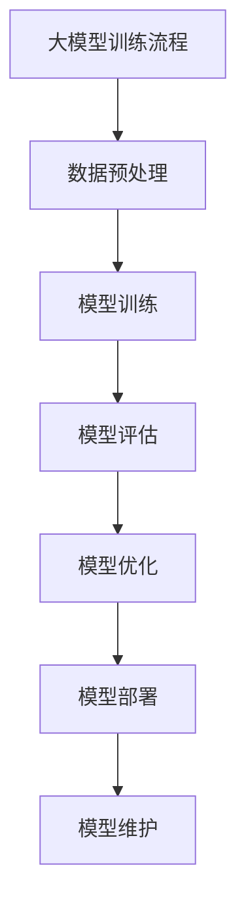

                 

### 文章标题：大模型时代创业新挑战：数据壁垒与算力瓶颈

### 关键词：大模型、数据壁垒、算力瓶颈、创业、深度学习

### 摘要：

随着人工智能技术的飞速发展，大模型成为推动各行各业变革的重要力量。然而，对于创业者而言，大模型的兴起也带来了新的挑战。本文将深入探讨数据壁垒和算力瓶颈对大模型创业的影响，通过分析核心概念、技术原理和实践案例，为创业者提供应对策略和未来展望。

### 目录大纲

#### 第一部分：背景与核心概念

1. **引言：大模型时代的来临**
   - **1.1 数据壁垒与算力瓶颈**
     - **数据壁垒**
       - 数据积累与隐私保护
       - 数据质量与数据治理
     - **算力瓶颈**
       - 硬件技术挑战
       - 算法效率优化
   - **1.2 大模型创业环境分析**
     - **创业机会分析**
       - 应用场景拓展
       - 行业需求与趋势
     - **创业挑战**
       - 技术门槛
       - 竞争态势

#### 第二部分：核心技术原理

2. **深度学习与神经网络基础**
   - **2.1 深度学习基本概念**
     - **神经网络结构**
       - 前馈神经网络
       - 卷积神经网络
       - 循环神经网络
     - **优化算法**
       - 梯度下降法
       - 随机梯度下降
       - Adam优化器
   - **2.2 自然语言处理技术概览**
     - **词嵌入技术**
       - One-hot编码
       - 词袋模型
       - 词嵌入算法（Word2Vec、GloVe）
     - **序列模型与注意力机制**
       - RNN与LSTM
       - GRU
       - Transformer与多注意力机制

3. **大模型训练与优化**
   - **3.1 大规模预训练模型原理**
     - **预训练的概念**
       - 有监督预训练
       - 无监督预训练
       - 自监督学习
     - **模型微调与迁移学习**
       - 微调技术
       - 迁移学习
       - 细粒度调整与超参数优化
   - **3.2 模型评估与性能优化**
     - **评估指标**
       - 准确率、召回率、F1值
       - 平均绝对误差、均方误差
       - 模型解析度与泛化能力
     - **模型压缩与加速**
       - 知识蒸馏
       - 模型剪枝
       - 运算加速（GPU、TPU）

4. **大模型架构设计与实践**
   - **4.1 大模型架构设计原则**
     - **模型架构的选择**
       - 网络层结构
       - 模型参数调优
       - 模型训练策略
     - **分布式训练与部署**
       - 数据并行
       - 模型并行
       - 混合并行
   - **4.2 大模型项目实战**
     - **项目案例介绍**
       - 文本分类项目
       - 对话系统项目
       - 图像识别项目
     - **项目开发流程**
       - 数据收集与预处理
       - 模型训练与评估
       - 模型部署与运维

#### 第三部分：创业策略与实践

5. **创业机会与策略分析**
   - **5.1 数据壁垒应对策略**
     - **数据共享与协同**
       - 数据开放平台
       - 数据联盟与合作
     - **隐私保护与合规**
       - 数据加密与隐私保护算法
       - 合规框架与政策解读
   - **5.2 算力瓶颈破解策略**
     - **硬件升级与优化**
       - 高性能计算资源
       - 软硬件协同优化
     - **算法创新与优化**
       - 算法效率优化
       - 算法创新与应用

6. **创业案例分析**
   - **6.1 成功案例分析**
     - **行业领先企业案例分析**
       - 谷歌的BERT模型
       - 微软的GPT模型
     - **创业公司案例分析**
       - ChatGPT的成功之路
       - OpenAI的发展策略
   - **6.2 创业挑战与解决方案**
     - **技术挑战**
       - 模型开发与优化
       - 数据获取与处理
     - **市场挑战**
       - 产品定位与市场推广
       - 竞争态势与差异化策略

#### 第四部分：未来展望

7. **大模型时代的发展趋势**
   - **7.1 技术发展趋势**
     - **大模型技术演进**
       - 新模型架构
       - 模型压缩与优化
     - **AI生态体系**
       - 开源平台发展
       - 产业生态合作
   - **7.2 创业机会与挑战**
     - **未来创业趋势**
       - 新兴应用场景
       - 跨领域融合创新
     - **长期发展挑战**
       - 数据与算力可持续性
       - 法律法规与伦理问题

### 附录

8. **附录 A: 常用工具与资源**
   - **A.1 深度学习框架介绍**
     - TensorFlow
     - PyTorch
     - JAX
   - **A.2 数据集与资源链接**
     - 公开数据集资源
     - 特定领域数据集
   - **A.3 开发环境搭建指南**
     - 硬件要求
     - 软件安装与配置
   - **A.4 技术社区与交流平台**
     - 论坛与社区介绍
     - 技术交流与协作平台

#### Mermaid 流�程图



### 核心算法原理讲解

**深度学习基础算法：**

```python
# 梯度下降法伪代码
def gradient_descent_weights(parameters, learning_rate, gradient):
    """
    参数更新函数
    parameters: 模型参数
    learning_rate: 学习率
    gradient: 参数的梯度
    """
    updated_parameters = parameters - learning_rate * gradient
    return updated_parameters

# 梯度下降过程
while not convergence:
    gradients = compute_gradients(model, inputs, outputs)
    parameters = gradient_descent_weights(parameters, learning_rate, gradients)
    model.update_parameters(parameters)
```

**数学模型和公式讲解：**

$$
\text{损失函数} = \frac{1}{2}\sum_{i=1}^{n} (\hat{y_i} - y_i)^2
$$

**举例说明：**

假设我们有一个简单的线性回归模型，目标是预测房价。输入为房子的特征（如面积、房间数等），输出为房价。我们可以用下面的公式计算每个预测值和实际值之间的误差：

$$
\hat{y_i} = w_0 + w_1 \cdot \text{area}_i + w_2 \cdot \text{rooms}_i
$$

其中，$\hat{y_i}$ 为预测的房价，$w_0, w_1, w_2$ 为模型参数，$\text{area}_i, \text{rooms}_i$ 为输入的特征值。

### 第一部分：背景与核心概念

#### 引言：大模型时代的来临

在过去的几年中，人工智能技术取得了显著的进展，尤其是大模型的兴起，为各行各业带来了前所未有的变革。大模型，通常指的是那些拥有数十亿甚至千亿参数的神经网络模型，它们能够通过海量数据的学习，实现前所未有的准确度和表现力。从语言模型如GPT到图像识别模型如BERT，再到多模态模型如DALL-E，大模型的应用已经渗透到了自然语言处理、计算机视觉、语音识别等多个领域。

大模型的出现不仅改变了传统算法的性能上限，也为创业公司提供了前所未有的机会。这些机会主要体现在以下几个方面：

1. **应用场景拓展**：大模型可以应用于更多复杂的任务，如问答系统、机器翻译、情感分析等，这些任务在以前由于数据集和计算资源的限制难以实现。
2. **行业需求与趋势**：随着数字化转型的推进，各行各业对人工智能技术的需求不断增加，大模型的出现能够更好地满足这些需求。
3. **技术创新与突破**：大模型推动了深度学习技术的不断演进，为创业者提供了更多的创新机会。

然而，随着大模型时代的来临，创业公司也面临着新的挑战，其中最为显著的就是数据壁垒和算力瓶颈。本文将详细探讨这两个挑战，并分析它们对大模型创业的影响。

#### 1.1 数据壁垒与算力瓶颈

**数据壁垒**

**数据积累与隐私保护**

在大模型时代，数据成为推动模型训练和优化的核心资源。然而，数据的积累面临着巨大的挑战。一方面，高质量的数据往往需要大量的人力和物力去收集、清洗和标注。另一方面，随着数据隐私保护法规的加强，如何在不违反隐私保护的前提下利用数据也成为一大难题。

**数据质量与数据治理**

除了数据的积累，数据质量也是大模型训练的关键。高质量的数据能够提升模型的准确性和稳定性，而低质量的数据则可能导致模型过拟合、泛化能力差等问题。因此，数据治理成为大模型创业中的重要环节。这包括数据清洗、数据标注、数据质量控制等步骤。

**算力瓶颈**

**硬件技术挑战**

随着大模型规模的扩大，计算需求也呈现指数级增长。传统的CPU已经难以满足大规模模型训练的需求，而GPU和TPU等专用硬件成为了主流选择。然而，硬件技术的提升也面临着成本、功耗、散热等挑战。

**算法效率优化**

除了硬件限制，算法效率也成为了算力瓶颈的关键。优化算法的效率和性能，如并行计算、分布式训练、模型压缩等，是突破算力瓶颈的重要手段。这些技术不仅能够提升模型训练的效率，还能降低成本和能耗。

#### 1.2 大模型创业环境分析

**创业机会分析**

**应用场景拓展**

大模型的强大能力为创业者提供了丰富的应用场景。无论是自然语言处理、计算机视觉，还是语音识别，大模型的应用都在不断拓展。例如，基于大模型的问答系统能够提供更准确、更自然的交互体验；基于大模型的图像识别系统能够实现更精细、更准确的图像处理。

**行业需求与趋势**

随着数字化转型的推进，各行各业对人工智能技术的需求不断增加。尤其是那些数据密集型的行业，如金融、医疗、零售等，对大模型的应用有着迫切的需求。创业公司可以通过开发基于大模型的应用，满足这些行业的需求，抢占市场先机。

**创业挑战**

**技术门槛**

大模型的训练和优化需要深厚的专业知识和丰富的实践经验。创业者需要掌握深度学习、自然语言处理、计算机视觉等领域的知识，同时需要具备模型训练、调优、部署等技能。这对于很多创业公司来说是一个巨大的挑战。

**竞争态势**

大模型的兴起吸引了大量创业者和巨头公司的关注，市场竞争日益激烈。如何在竞争中脱颖而出，成为创业者需要考虑的重要问题。创新、差异化、市场定位等策略都成为创业者必须掌握的技能。

### 第二部分：核心技术原理

#### 2.1 深度学习与神经网络基础

深度学习是人工智能的一个重要分支，它通过多层神经网络来模拟人脑的决策过程，从而实现复杂的数据处理和模式识别。以下将介绍深度学习的基本概念，包括神经网络结构、优化算法和自然语言处理技术。

**2.1.1 深度学习基本概念**

**神经网络结构**

神经网络（Neural Network，NN）是深度学习的基础。一个简单的神经网络由输入层、隐藏层和输出层组成。每个层包含多个神经元（节点），神经元之间通过权重（weights）连接。

- **前馈神经网络**：前馈神经网络是最简单的神经网络结构，数据从输入层流向隐藏层，最后到达输出层。每个神经元的输出只影响下一层的神经元。

- **卷积神经网络**：卷积神经网络（Convolutional Neural Network，CNN）主要用于图像处理。其特点是引入了卷积层，通过局部感知和权重共享来提高模型的效率和性能。

- **循环神经网络**：循环神经网络（Recurrent Neural Network，RNN）适用于序列数据。它通过循环结构来维持信息状态，实现序列数据的建模。

**优化算法**

优化算法用于调整网络中的权重，以最小化损失函数。以下是几种常用的优化算法：

- **梯度下降法**：梯度下降法是最基础的优化算法。它通过计算损失函数关于权重的梯度，并沿着梯度的反方向更新权重，以降低损失。

- **随机梯度下降**：随机梯度下降（Stochastic Gradient Descent，SGD）是在梯度下降法的基础上，每次更新权重时使用整个训练集的一个随机样本的梯度。

- **Adam优化器**：Adam优化器是一种结合了SGD和Momentum优化器的自适应优化算法。它通过自适应调整学习率，提高了模型的收敛速度和稳定性。

**2.1.2 自然语言处理技术概览**

自然语言处理（Natural Language Processing，NLP）是深度学习的应用领域之一，它涉及文本的表示、处理和理解。以下介绍几种关键的NLP技术：

**词嵌入技术**

词嵌入（Word Embedding）是将词汇映射到向量空间的技术，用于文本数据的数值化表示。

- **One-hot编码**：One-hot编码是将每个词汇映射到一个向量，该向量除了对应词汇的位置为1，其余位置均为0。

- **词袋模型**：词袋模型是将文本表示为一个向量，该向量中的每个维度表示词汇在文本中出现的频率。

- **词嵌入算法**：词嵌入算法（如Word2Vec、GloVe）通过训练神经网络来学习词汇的向量表示，使得语义相近的词汇在向量空间中更接近。

**序列模型与注意力机制**

序列模型（Sequence Model）用于处理序列数据，如文本、语音等。以下介绍几种常用的序列模型和注意力机制：

- **RNN与LSTM**：循环神经网络（RNN）和长短期记忆网络（LSTM）是处理序列数据的有效方法。LSTM通过引入门控机制，解决了传统RNN在处理长序列时出现的梯度消失和梯度爆炸问题。

- **GRU**：门控循环单元（Gated Recurrent Unit，GRU）是LSTM的简化版，它通过合并输入门和遗忘门，减少了参数数量。

- **Transformer与多注意力机制**：Transformer是近年来提出的一种基于自注意力机制的序列模型，它在机器翻译、文本生成等领域取得了显著的成果。自注意力机制通过计算序列中每个元素的相关性，实现了全局信息的有效利用。

#### 2.2 大模型训练与优化

大模型的训练与优化是深度学习领域的一个核心问题。以下将介绍大规模预训练模型、模型微调与迁移学习、模型评估与性能优化以及模型压缩与加速。

**2.2.1 大规模预训练模型原理**

大规模预训练模型（Large-scale Pre-trained Model）是通过在大量数据上进行预训练，然后针对特定任务进行微调，从而实现高性能的模型。以下介绍预训练的概念和常用技术：

**预训练的概念**

预训练是指在训练特定任务之前，先在大规模数据集上进行训练，以学习通用特征和知识。预训练模型可以显著提高模型在不同任务上的性能，减少对大量标注数据的依赖。

**预训练技术**

1. **有监督预训练**：有监督预训练是在标注数据上进行预训练。常见的任务包括语言建模、分类和序列标注等。预训练模型在通用数据集上学习，然后在特定领域上进行微调。

2. **无监督预训练**：无监督预训练是在无标注数据上进行预训练。常见的技术包括自编码器（Autoencoder）和生成对抗网络（GAN）。无监督预训练可以帮助模型学习到更丰富的特征，提高模型的表达能力。

3. **自监督学习**：自监督学习是一种无需标注数据就能进行预训练的方法。常见的技术包括预测下一个单词、图像修复等。自监督学习可以通过利用数据中的内在结构，提高模型的学习能力。

**模型微调与迁移学习**

模型微调（Fine-tuning）和迁移学习（Transfer Learning）是大规模预训练模型在特定任务上的应用方法。以下介绍这两种技术：

**模型微调**：模型微调是指在预训练模型的基础上，针对特定任务进行微调。微调的主要目的是调整模型的参数，使其在特定任务上达到更好的性能。微调通常包括以下步骤：

1. 初始化：将预训练模型加载到GPU或TPU上。
2. 调整层：根据特定任务的需求，调整模型的层，如删除某些层或增加新层。
3. 微调：在训练数据上对模型进行微调，同时保持预训练模型的权重。
4. 评估：在验证集上评估模型的性能，并调整超参数。

**迁移学习**：迁移学习是指将一个任务学到的知识应用到另一个相关任务上。迁移学习可以显著减少对新任务的训练数据的需求，提高模型在少量数据上的性能。常见的迁移学习方法包括：

1. **权重共享**：将预训练模型的权重直接应用于新任务，并在新任务上进行微调。
2. **特征提取**：将预训练模型视为特征提取器，使用其输出的特征进行新任务的分类或回归。
3. **辅助任务**：在新任务上添加辅助任务，以提高模型在新任务上的性能。

**2.2.2 模型评估与性能优化**

模型评估与性能优化是确保大模型在实际应用中表现良好的关键步骤。以下介绍评估指标、模型解析度与泛化能力以及模型压缩与加速：

**评估指标**

评估指标用于衡量模型在不同任务上的性能。以下是一些常用的评估指标：

1. **分类任务**：
   - **准确率**（Accuracy）：模型预测正确的样本占总样本的比例。
   - **召回率**（Recall）：模型预测正确的正样本占总正样本的比例。
   - **精确率**（Precision）：模型预测正确的正样本占总预测为正样本的比例。
   - **F1值**（F1 Score）：精确率和召回率的调和平均。

2. **回归任务**：
   - **平均绝对误差**（Mean Absolute Error，MAE）：预测值与真实值之间的平均绝对差。
   - **均方误差**（Mean Squared Error，MSE）：预测值与真实值之间的平均平方差。

**模型解析度与泛化能力**

模型解析度（Model Resolution）和泛化能力（Generalization Ability）是衡量模型性能的重要指标。解析度越高，模型对训练数据的拟合度越好；泛化能力越强，模型对未知数据的适应能力越强。

**模型压缩与加速**

模型压缩与加速是提高大模型应用效率的重要方法。以下介绍几种常见的模型压缩与加速技术：

1. **知识蒸馏**（Knowledge Distillation）：知识蒸馏是一种将大模型的知识传递给小模型的方法。大模型作为教师模型，小模型作为学生模型，通过学习教师模型的输出分布来提高自己的性能。

2. **模型剪枝**（Model Pruning）：模型剪枝是通过删除网络中的冗余连接或节点来减小模型规模的方法。剪枝可以显著降低模型的计算量和存储需求，同时保持或提高模型的性能。

3. **运算加速**（Computation Acceleration）：运算加速是通过优化算法和硬件来提高模型训练和推理速度的方法。常见的加速技术包括并行计算、分布式训练、GPU/TPU优化等。

#### 2.3 大模型架构设计与实践

大模型架构设计与实践是确保模型在实际应用中高效、稳定运行的关键环节。以下将介绍大模型架构设计原则、分布式训练与部署以及大模型项目实战。

**2.3.1 大模型架构设计原则**

大模型架构设计原则是确保模型高效、稳定运行的基础。以下介绍大模型架构设计原则的关键要素：

**模型架构的选择**

1. **网络层结构**：选择合适的网络层结构是模型架构设计的关键。常见的网络层结构包括前馈神经网络、卷积神经网络和循环神经网络。

2. **模型参数调优**：模型参数调优是提高模型性能的重要手段。通过调整学习率、批量大小、优化算法等参数，可以优化模型的训练过程。

3. **模型训练策略**：模型训练策略包括训练数据的预处理、训练过程的监控和调整。常见的训练策略包括数据增强、训练曲线分析和模型调整等。

**分布式训练与部署**

分布式训练与部署是应对大规模数据处理和高效模型训练的关键技术。以下介绍分布式训练与部署的关键技术：

1. **数据并行**：数据并行是指将训练数据分成多个子集，并在不同的GPU或TPU上进行训练。数据并行可以提高模型训练的速度。

2. **模型并行**：模型并行是指将模型拆分成多个部分，并在不同的GPU或TPU上进行训练。模型并行适用于大型模型，可以提高模型的训练效率。

3. **混合并行**：混合并行是将数据并行和模型并行相结合的一种分布式训练方法。通过合理分配数据和模型计算任务，可以最大化利用计算资源。

4. **模型部署**：模型部署是将训练好的模型部署到生产环境进行推理的过程。常见的模型部署方法包括服务器部署、容器化和边缘计算等。

**2.3.2 大模型项目实战**

大模型项目实战是验证模型性能和实际应用价值的关键环节。以下介绍大模型项目实战的关键步骤：

1. **项目案例介绍**：介绍一些典型的大模型项目，如文本分类、对话系统和图像识别等。通过项目案例，可以了解大模型在不同领域的应用场景和实现方法。

2. **项目开发流程**：介绍大模型项目开发的流程，包括数据收集与预处理、模型训练与评估、模型部署与运维等步骤。通过项目开发流程，可以系统地了解大模型项目的实施过程。

3. **项目案例实现**：通过具体的代码实现，展示大模型项目的开发过程。包括开发环境搭建、模型训练、模型评估和模型部署等步骤。

4. **代码解读与分析**：对项目案例的代码进行解读和分析，解释关键代码的实现原理和优化方法。通过代码解读与分析，可以深入理解大模型项目的实现细节。

### 第三部分：创业策略与实践

#### 5.1 创业机会与策略分析

随着人工智能技术的不断发展，大模型在各个行业中的应用变得越来越广泛。这为创业者提供了前所未有的机会，同时也带来了新的挑战。以下将分析大模型创业中的主要机会和策略。

**数据壁垒应对策略**

**数据共享与协同**

数据壁垒是制约大模型创业的一个重要因素。为了克服这一挑战，创业者可以采取以下策略：

- **数据开放平台**：建立数据开放平台，鼓励数据共享和协同。通过开放数据，创业者可以获取更多的数据资源，提升模型训练效果。

- **数据联盟与合作**：与其他公司或研究机构建立数据联盟，共同开发和共享数据。通过合作，创业者可以获取更广泛的数据资源，降低数据获取成本。

**隐私保护与合规**

随着数据隐私保护法规的加强，如何在不违反隐私保护的前提下利用数据成为创业者需要考虑的重要问题。以下是一些可行的策略：

- **数据加密与隐私保护算法**：采用数据加密和隐私保护算法，确保数据在传输和存储过程中的安全性。这包括差分隐私、同态加密等技术。

- **合规框架与政策解读**：深入了解相关法律法规和政策，确保数据处理和利用的合规性。通过合规框架，创业者可以规避法律风险，提升数据利用的合法性。

**算力瓶颈破解策略**

**硬件升级与优化**

随着大模型规模的不断扩大，算力需求也呈现指数级增长。为了应对算力瓶颈，创业者可以采取以下策略：

- **高性能计算资源**：投资于高性能计算资源，如GPU、TPU等。这些硬件能够提供更高的计算能力，满足大规模模型训练的需求。

- **软硬件协同优化**：优化软件算法和硬件资源的协同，提高计算效率。通过并行计算、分布式训练等技术，创业者可以充分利用计算资源，降低计算成本。

**算法创新与优化**

除了硬件升级，算法创新和优化也是破解算力瓶颈的关键。以下是一些可行的策略：

- **算法效率优化**：通过改进算法结构和优化计算过程，提高模型训练和推理的效率。这包括优化神经网络结构、优化矩阵运算等。

- **算法创新与应用**：探索新的算法和技术，如深度强化学习、生成对抗网络等。这些算法可以在特定场景下提供更好的性能和效果。

#### 5.2 创业案例分析

**成功案例分析**

**行业领先企业案例分析**

以下分析两个行业领先企业在大模型创业中的成功案例：

- **谷歌的BERT模型**：谷歌的BERT（Bidirectional Encoder Representations from Transformers）模型是一种基于Transformer架构的大规模预训练模型。BERT通过预训练和微调，在自然语言处理任务上取得了显著的成果。谷歌通过开放BERT模型和代码，吸引了大量开发者和应用场景，推动了自然语言处理技术的普及和应用。

- **微软的GPT模型**：微软的GPT（Generative Pre-trained Transformer）模型是一种基于Transformer架构的语言生成模型。GPT在文本生成、对话系统等领域取得了重要突破。微软通过不断迭代和优化GPT模型，推出了GPT-2和GPT-3等版本，为开发者提供了强大的文本生成和自然语言处理能力。

**创业公司案例分析**

以下分析两个创业公司在大模型创业中的成功案例：

- **ChatGPT的成功之路**：ChatGPT是一个基于GPT模型的大型对话系统。通过结合自然语言处理和对话生成技术，ChatGPT实现了高质量的对话交互。ChatGPT的成功得益于其对模型架构的优化和应用场景的创新。公司通过不断迭代和优化模型，提升了对话系统的性能和用户体验。

- **OpenAI的发展策略**：OpenAI是一个专注于人工智能研究和应用的公司。OpenAI通过自主研发和合作，推出了多个大型预训练模型，如GPT-2和GPT-3。OpenAI的成功策略包括持续的技术创新、广泛的合作和开放的数据与模型。公司通过不断优化和推广模型，吸引了大量开发者和应用场景，推动了人工智能技术的发展和应用。

**创业挑战与解决方案**

**技术挑战**

在大模型创业中，技术挑战是创业者需要面对的重要问题。以下介绍一些常见的技术挑战和解决方案：

- **模型开发与优化**：大模型开发需要深厚的专业知识和丰富的实践经验。创业者需要掌握深度学习、自然语言处理、计算机视觉等领域的知识，并具备模型训练、调优、部署等技能。

- **数据获取与处理**：大模型的训练需要大量高质量的数据。创业者需要寻找可靠的数据来源，并进行数据清洗、标注和处理，以确保数据的准确性和完整性。

**市场挑战**

除了技术挑战，市场挑战也是大模型创业中不可忽视的问题。以下介绍一些常见的市场挑战和解决方案：

- **产品定位与市场推广**：创业者需要明确产品的市场定位和目标用户，并通过有效的市场推广策略，将产品推向市场。

- **竞争态势与差异化策略**：在大模型创业中，市场竞争非常激烈。创业者需要通过差异化策略，如技术创新、应用场景创新等，在竞争中脱颖而出。

### 第四部分：未来展望

#### 7.1 大模型时代的发展趋势

随着人工智能技术的不断发展，大模型时代的发展趋势也变得越来越明确。以下从技术发展趋势和创业机会与挑战两个方面进行探讨。

**技术发展趋势**

**大模型技术演进**

大模型技术在未来将继续演进，主要体现在以下几个方面：

1. **新模型架构**：随着计算资源和算法的进步，新的模型架构将不断涌现。例如，多模态模型、增量学习模型等，将提供更强大的模型能力和更广泛的应用场景。

2. **模型压缩与优化**：模型压缩与优化是提升大模型应用效率的重要手段。未来，模型压缩技术将更加成熟，如知识蒸馏、模型剪枝、量化等，将广泛应用于模型部署和优化。

3. **泛化能力提升**：大模型在训练过程中容易过拟合，泛化能力相对较弱。未来，通过数据增强、领域自适应等技术，大模型的泛化能力将得到显著提升。

**AI生态体系**

随着大模型技术的普及，AI生态体系也将不断成熟。以下是一些发展趋势：

1. **开源平台发展**：开源平台将成为大模型研发和应用的重要基础设施。未来，更多高质量的开源工具、框架和模型将涌现，推动大模型技术的发展和应用。

2. **产业生态合作**：AI技术与各行各业的深度融合将推动产业生态的建立。未来，更多的产业联盟、合作项目将涌现，促进大模型技术在各个领域的应用和发展。

**创业机会与挑战**

**未来创业趋势**

大模型时代的创业机会将主要体现在以下几个方面：

1. **新兴应用场景**：随着大模型技术的不断成熟，新的应用场景将不断涌现。例如，自动驾驶、智能医疗、智慧城市等，将为创业者提供丰富的创新机会。

2. **跨领域融合创新**：大模型技术与其他领域的深度融合，将推动跨领域创新。例如，将AI技术应用于生物科学、金融科技等领域，将带来新的商业机会。

**长期发展挑战**

尽管大模型时代为创业者提供了丰富的机会，但也面临一些长期发展的挑战：

1. **数据与算力可持续性**：数据资源的获取和处理、算力资源的可持续性是制约大模型技术发展的重要因素。未来，如何解决数据隐私保护和算力资源分配问题，将成为创业者的关键挑战。

2. **法律法规与伦理问题**：随着大模型技术的普及，法律法规和伦理问题也将受到更多关注。未来，如何确保大模型技术的合规性和伦理性，将是创业者需要面对的重要问题。

### 附录

#### A.1 深度学习框架介绍

深度学习框架是开发和实现深度学习模型的重要工具。以下介绍几个常用的深度学习框架：

1. **TensorFlow**：TensorFlow是Google开发的开源深度学习框架，广泛应用于各种深度学习任务。TensorFlow提供了丰富的API，支持模型定义、训练、评估和部署等全过程。

2. **PyTorch**：PyTorch是Facebook开发的开源深度学习框架，以其灵活、动态的计算图机制和易于调试的特点受到广泛关注。PyTorch广泛应用于计算机视觉、自然语言处理等领域。

3. **JAX**：JAX是Google开发的开源自动微分库，支持自动微分、并行计算和优化算法等。JAX与深度学习框架结合，为深度学习模型的训练和优化提供了强大的支持。

#### A.2 数据集与资源链接

以下介绍一些常用的数据集和资源链接：

1. **公开数据集资源**：许多公开数据集可用于深度学习模型的训练和评估。例如，CIFAR-10、ImageNet、COCO等，涵盖了图像识别、目标检测、语义分割等任务。

2. **特定领域数据集**：针对特定领域的数据集，如医疗影像数据集、金融交易数据集等，可用于领域特定任务的模型训练和应用。

3. **数据集下载链接**：以下是一些数据集的下载链接：

   - CIFAR-10: https://www.cs.toronto.edu/~kriz/cifar.html
   - ImageNet: https://www.image-net.org/
   - COCO: https://cocodataset.org/

#### A.3 开发环境搭建指南

以下是一个基本的深度学习开发环境搭建指南：

**硬件要求**：

- CPU：Intel i5或更高
- GPU：NVIDIA GPU（推荐CUDA 10.0或更高版本）
- 内存：至少16GB

**软件安装与配置**：

1. **操作系统**：推荐Linux或macOS系统。

2. **Python**：安装Python 3.6或更高版本。

3. **pip**：安装pip，用于安装Python包。

4. **深度学习框架**：安装TensorFlow、PyTorch或JAX等深度学习框架。

5. **其他依赖包**：根据具体需求安装其他Python依赖包。

#### A.4 技术社区与交流平台

以下是一些深度学习和技术社区：

1. **深度学习论坛**：CSDN、GitHub、Stack Overflow等。

2. **技术博客**：博客园、简书、知乎等。

3. **开源项目**：GitHub、GitLab等。

4. **技术会议**：NeurIPS、ICML、CVPR等。

通过参与这些社区和平台，可以了解最新的技术动态，交流学习经验，获取项目资源和支持。

