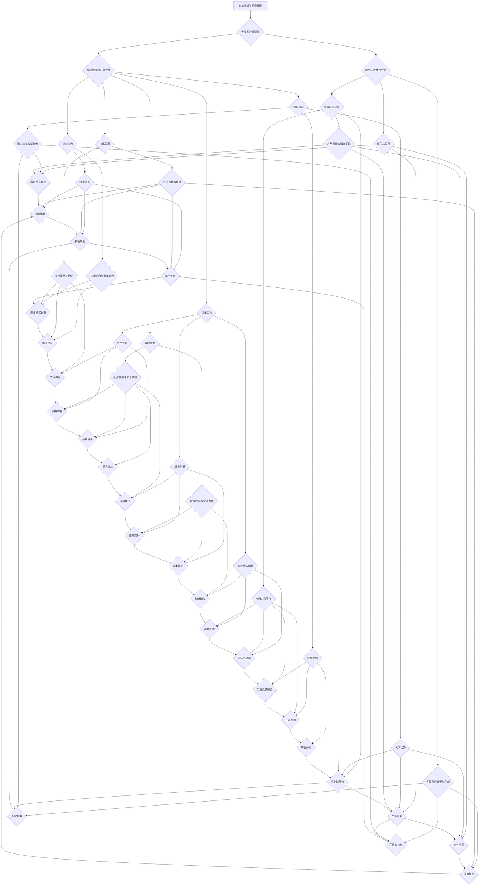
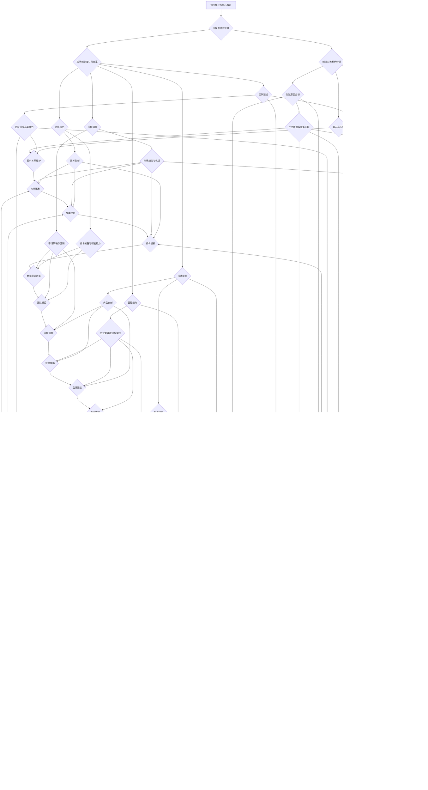

                 

### 文章标题

《大模型时代的创业者创业心得总结：经验教训、成功要素与发展建议》

> 关键词：大模型时代、创业者、创业心得、成功要素、发展建议

> 摘要：本文围绕大模型时代的创业主题，从背景、经验教训、成功要素和发展建议四个方面，详细探讨了创业者在大模型时代下的创业策略和实践。文章旨在为创业者和有意创业的人士提供有价值的参考和指导。

#### 第一部分：创业概述与核心概念

##### 第1章：大模型时代背景

**1.1 大模型时代的崛起**

随着人工智能技术的飞速发展，大模型（如GPT-3、BERT等）逐渐成为当今科技领域的明星。大模型以其强大的数据处理和智能推理能力，广泛应用于自然语言处理、计算机视觉、语音识别等多个领域。大模型的崛起不仅推动了人工智能技术的进步，也深刻影响了创业生态。

**大模型对创业生态的影响**

1. **技术创新的加速**：大模型的出现使得创业者能够更快速地实现技术创新，缩短研发周期，提高市场竞争力。
2. **应用场景的拓展**：大模型为创业者提供了丰富的应用场景，从智能客服、智能推荐到智能医疗等，为创业提供了更多的可能性。
3. **数据价值的挖掘**：大模型对数据的依赖性促使创业者更加关注数据的收集、处理和应用，从而提升数据的价值。

**1.2 大模型技术的发展趋势**

1. **模型规模的扩大**：大模型的规模将不断增大，计算能力将进一步提高。
2. **多模态处理能力**：未来大模型将具备更强的多模态处理能力，能够同时处理文本、图像、声音等多种类型的数据。
3. **实时性提升**：大模型的实时性将得到显著提升，使得实时决策和交互成为可能。

**1.3 创业者与大模型**

**大模型在创业中的应用**

1. **产品创新**：创业者可以利用大模型实现产品的创新，例如开发智能客服、智能推荐等应用。
2. **数据挖掘**：大模型能够帮助创业者从大量数据中提取有价值的信息，指导产品设计和市场策略。
3. **商业模式创新**：大模型的应用可以改变传统的商业模式，例如通过智能合约实现去中心化的交易。

**创业者与大模型结合的优势**

1. **降低研发成本**：大模型提供了现成的算法和工具，创业者可以节省大量的研发成本和时间。
2. **提高市场竞争力**：大模型的强大能力使得创业者的产品在市场上更具竞争力。
3. **快速迭代**：大模型使得产品可以快速迭代，及时响应市场变化。

**1.4 大模型时代的创业机会**

**创业热点领域分析**

1. **智能医疗**：大模型在医学影像、基因分析等领域的应用，为智能医疗提供了新的可能性。
2. **智能教育**：大模型在教育领域的应用，例如智能辅导、自适应学习等，将改变传统的教育模式。
3. **智能客服**：大模型在客服领域的应用，可以实现更高效、更个性化的服务。

**创业者如何抓住机遇**

1. **关注技术动态**：创业者需要密切关注大模型技术的最新动态，及时了解技术趋势。
2. **建立数据优势**：创业者需要积累和利用海量数据，提高大模型的应用效果。
3. **创新商业模式**：创业者需要创新商业模式，利用大模型实现商业价值的最大化。

### 总结与思考

大模型时代的到来为创业者带来了前所未有的机遇和挑战。创业者需要紧跟技术发展趋势，积极应用大模型技术，创新商业模式，以实现持续发展和竞争优势。

---

#### 第二部分：经验教训

##### 第2章：成功创业者心得分享

**2.1 创业者的心路历程**

**创业初期的困惑与挑战**

创业初期，许多创业者都会面临以下困惑和挑战：

1. **市场定位不清晰**：很多创业者不知道如何确定自己的市场定位，导致产品缺乏明确的目标用户。
2. **资源匮乏**：初创企业通常面临资金、人才、技术等资源匮乏的问题，使得发展受限。
3. **竞争压力**：市场上已有大量的竞争者，如何在激烈的市场竞争中脱颖而出，成为创业者需要解决的重要问题。

**如何保持创业激情**

1. **明确愿景和目标**：创业者需要明确自己的创业愿景和目标，时刻保持对未来的激情和动力。
2. **积极心态**：创业者需要培养积极的心态，面对困难和挑战时保持乐观和坚定。
3. **团队支持**：一个有共同目标和价值观的团队是创业者保持激情的重要支持。

**2.2 创业策略与运营**

**定位与市场分析**

1. **市场调研**：在创业初期，创业者需要进行充分的市场调研，了解目标市场的需求、竞争对手和行业趋势。
2. **用户画像**：根据市场调研结果，创业者需要明确目标用户群体，进行用户画像分析。
3. **市场定位**：基于用户画像和市场调研结果，创业者需要明确自己的市场定位，制定合适的市场策略。

**产品策略与营销**

1. **产品创新**：创业者需要持续进行产品创新，以应对不断变化的市场需求。
2. **用户体验**：良好的用户体验是产品成功的关键，创业者需要重视用户体验设计。
3. **营销策略**：创业者需要根据市场定位和产品特点，制定有效的营销策略，包括线上和线下的推广活动。

**2.3 团队建设与管理**

**人才引进与培养**

1. **招聘策略**：创业者需要制定合适的招聘策略，吸引高素质的人才加入团队。
2. **人才培养**：创业者需要关注员工的职业发展和个人成长，提供培训和学习机会。
3. **激励机制**：合理的激励机制能够激发员工的积极性和创造力。

**组织结构与团队协作**

1. **扁平化管理**：初创企业通常采用扁平化管理，以提高决策效率和团队协作。
2. **分工明确**：团队成员的分工需要明确，确保每个人都清楚自己的职责和任务。
3. **团队协作**：创业者需要促进团队协作，建立良好的沟通和合作机制。

**2.4 融资与资本运作**

**融资渠道与策略**

1. **天使投资**：天使投资是初创企业常见的融资渠道，创业者需要积极寻找天使投资人。
2. **风险投资**：风险投资是初创企业获得大规模资金支持的重要途径，创业者需要了解风险投资的市场规律。
3. **政府支持**：政府通常会提供各种创业支持政策，包括资金补贴、税收优惠等，创业者需要充分利用这些资源。

**资本运营与风险管理**

1. **资金管理**：创业者需要建立严格的资金管理制度，确保资金的有效利用和风险控制。
2. **投资组合**：创业者可以通过投资组合来分散风险，降低单一投资带来的风险。
3. **风险预警**：创业者需要建立风险预警机制，及时发现和应对潜在的风险。

### 总结与思考

成功创业者的心路历程和创业策略为我们提供了宝贵的经验和启示。创业者需要明确市场定位，持续创新产品，建设高效团队，同时积极寻求融资和资本运作。这些策略和经验教训对于创业者具有重要的指导意义。

---

##### 第3章：创业失败案例分析

**3.1 失败原因分析**

创业失败的原因多种多样，以下是一些常见的失败原因及分析：

**市场定位不准**

1. **产品不符合市场需求**：创业者没有准确了解目标用户的需求，导致产品无法满足市场需求。
2. **市场调研不足**：创业者没有进行充分的市场调研，缺乏对市场的深入理解。

**产品质量与服务问题**

1. **产品质量差**：创业者忽视产品质量，导致用户满意度低。
2. **服务不到位**：创业者缺乏完善的服务体系，无法提供优质的客户服务。

**资金链断裂**

1. **融资不足**：创业者无法获得足够的融资支持，导致资金链断裂。
2. **资金管理不善**：创业者没有建立有效的资金管理制度，导致资金流失和浪费。

**3.2 启示与反思**

**从失败中汲取经验**

1. **重视市场调研**：创业者需要重视市场调研，了解目标用户的需求，制定准确的市场定位。
2. **注重产品质量**：创业者需要将产品质量放在首位，确保产品能够满足用户需求。
3. **合理管理资金**：创业者需要建立严格的资金管理制度，确保资金的有效利用。

**如何避免重蹈覆辙**

1. **建立风险预警机制**：创业者需要建立风险预警机制，及时发现和应对潜在的风险。
2. **培养团队协作精神**：创业者需要培养团队协作精神，提高团队的整体执行力。
3. **持续创新**：创业者需要持续创新，以适应市场的变化和需求。

**3.3 失败后的转型与创新**

**失败后的调整策略**

1. **产品调整**：根据市场反馈，创业者需要对产品进行调整，以更好地满足用户需求。
2. **市场策略调整**：创业者需要根据市场环境变化，调整市场策略，以提高市场竞争力。
3. **团队调整**：创业者需要对团队进行调整，优化团队结构，提高团队执行力。

**创新与突破**

1. **技术创新**：创业者可以通过技术创新，提高产品的核心竞争力。
2. **模式创新**：创业者可以通过商业模式创新，寻找新的盈利点。
3. **市场拓展**：创业者可以通过市场拓展，开拓新的市场领域，寻找新的增长点。

### 总结与思考

创业失败是创业者面临的一大挑战，但也是宝贵的经验和教训。从失败中汲取经验，制定有效的调整策略，持续创新，是创业者避免重蹈覆辙、实现成功的关键。

---

#### 第三部分：成功要素与发展建议

##### 第4章：成功要素

**4.1 创新能力**

**创新思维与技术创新**

1. **创新思维**：创业者需要具备创新思维，敢于挑战传统观念，寻找新的解决方案。
2. **技术创新**：创业者需要不断进行技术创新，开发具有竞争力的产品。

**创新在创业成功中的作用**

1. **提升竞争力**：创新能够提升产品的竞争力，帮助创业者在市场中脱颖而出。
2. **开拓新市场**：创新能够开拓新的市场领域，为创业者带来新的商机。
3. **持续发展**：创新是创业持续发展的动力，能够帮助创业者应对市场的变化和挑战。

**4.2 技术实力**

**技术储备与研发能力**

1. **技术储备**：创业者需要具备丰富的技术储备，掌握最新的技术趋势和应用。
2. **研发能力**：创业者需要建立强大的研发团队，具备独立研发新产品和技术的能力。

**技术创新在创业中的应用**

1. **产品创新**：创业者可以利用技术创新，开发具有竞争力的产品，满足用户需求。
2. **服务创新**：创业者可以通过技术创新，提供更优质的服务，提升用户体验。
3. **商业模式创新**：创业者可以利用技术创新，改变传统的商业模式，实现商业价值的最大化。

**4.3 团队建设**

**团队结构与人才优势**

1. **团队结构**：创业者需要建立合理的团队结构，确保团队的高效运作。
2. **人才优势**：创业者需要吸引和培养优秀的人才，形成人才优势。

**团队协作与凝聚力**

1. **团队协作**：创业者需要建立良好的团队协作机制，提高团队的整体执行力。
2. **凝聚力**：创业者需要增强团队的凝聚力，确保团队成员能够团结一致，共同面对挑战。

**4.4 市场洞察**

**市场趋势与机遇**

1. **市场趋势**：创业者需要密切关注市场趋势，了解市场的发展和变化。
2. **机遇识别**：创业者需要敏锐地识别市场机遇，抓住机遇实现快速发展。

**市场策略与营销**

1. **市场策略**：创业者需要制定合适的市场策略，确保产品能够顺利进入市场。
2. **营销策略**：创业者需要制定有效的营销策略，提升品牌知名度和用户满意度。

**4.5 管理能力**

**企业管理理念与实践**

1. **企业管理理念**：创业者需要具备先进的企业管理理念，如以用户为中心、创新驱动等。
2. **企业管理实践**：创业者需要将企业管理理念付诸实践，建立高效的管理体系。

**管理效率与企业发展**

1. **管理效率**：创业者需要提高管理效率，确保企业能够高效运作。
2. **企业发展**：良好的管理能力能够促进企业的持续发展，提升企业的市场竞争力。

### 总结与思考

创新能力、技术实力、团队建设、市场洞察和管理能力是创业者成功的关键要素。创业者需要不断强化这些要素，以提高自身的竞争力，实现持续发展和成功。

---

##### 第5章：未来发展建议

**5.1 技术发展展望**

**大模型技术未来趋势**

1. **模型规模继续扩大**：随着计算能力的提升，大模型将继续扩大规模，实现更复杂的任务处理。
2. **多模态处理能力提升**：大模型将具备更强的多模态处理能力，能够同时处理多种类型的数据。
3. **实时性增强**：大模型的实时性将得到显著提升，实现更快速的反应和交互。

**技术变革对创业的影响**

1. **创业机会增加**：技术变革将带来更多的创业机会，创业者可以基于新技术开发创新产品。
2. **竞争加剧**：随着技术的普及，市场竞争将加剧，创业者需要不断提升自身的技术实力。
3. **行业变革**：技术变革将推动传统行业的变革，创业者可以寻找新的商业机会。

**5.2 市场发展策略**

**市场细分与目标客户**

1. **市场细分**：创业者需要对市场进行细分，明确目标客户群体，提供定制化的产品和服务。
2. **目标客户**：创业者需要深入了解目标客户的需求，提供符合客户期望的产品和服务。

**市场拓展与国际化**

1. **市场拓展**：创业者需要积极拓展市场，寻找新的销售渠道和合作伙伴。
2. **国际化**：创业者可以考虑国际化发展，进入新的市场，实现全球市场的布局。

**5.3 创业环境优化**

**政策环境与创业支持**

1. **政策环境**：政府需要为创业者提供良好的政策环境，包括税收优惠、资金支持等。
2. **创业支持**：政府和社会需要为创业者提供各种创业支持，包括创业培训、创业孵化等。

**创业者素养提升**

1. **专业知识**：创业者需要不断提升专业知识，掌握行业最新动态。
2. **领导力**：创业者需要具备领导力，能够带领团队克服困难，实现目标。
3. **创新能力**：创业者需要具备创新能力，能够不断创新，适应市场变化。

**5.4 创新生态建设**

**创业社区与合作网络**

1. **创业社区**：创业者可以通过加入创业社区，与其他创业者交流和合作，分享经验和资源。
2. **合作网络**：创业者需要建立广泛的合作网络，与供应商、合作伙伴等建立良好的合作关系。

**创新生态的培育与成长**

1. **创新氛围**：创业者需要营造良好的创新氛围，鼓励创新思维和实践。
2. **资源整合**：创业者需要整合各种资源，包括资金、技术、人才等，实现资源的最大化利用。
3. **持续创新**：创业者需要持续创新，以适应市场的变化和需求。

### 总结与思考

未来，创业者需要紧跟技术发展趋势，积极拓展市场，优化创业环境，构建创新生态。通过不断提升自身的技术实力、市场洞察力和管理能力，创业者将能够在竞争激烈的市场中脱颖而出，实现持续发展和成功。

---

#### 第四部分：附录

##### 第6章：创业资源与工具

**6.1 创业者必备资源**

**创业者资源获取渠道**

1. **政府支持**：政府提供的资金补贴、税收优惠等支持创业者。
2. **风险投资**：风险投资为创业者提供资金支持，助力企业发展。
3. **创业孵化器**：创业孵化器提供办公空间、培训指导等资源，帮助创业者快速成长。
4. **专业咨询**：创业者可以寻求专业咨询机构提供市场分析、技术支持等服务。

**资源整合与利用策略**

1. **资源整合**：创业者需要善于整合各种资源，包括政府支持、风险投资、合作伙伴等，实现资源的最大化利用。
2. **资源优化**：创业者需要根据自身需求，合理配置和优化资源，提高资源利用效率。

**6.2 创业工具推荐**

**创业工具类型与应用场景**

1. **项目管理工具**：如Trello、Asana，用于任务分配、进度跟踪等。
2. **数据分析工具**：如Tableau、Google Analytics，用于数据分析和可视化。
3. **协作工具**：如Slack、Zoom，用于团队协作和远程沟通。
4. **云计算平台**：如AWS、Azure，提供计算资源、存储服务、数据库等。

**工具使用技巧与案例分析**

1. **项目管理工具**：通过设置任务、跟进进度，提高团队协作效率。
2. **数据分析工具**：利用数据分析工具，深入了解用户行为和市场趋势。
3. **协作工具**：利用协作工具，实现实时沟通和协作，提高工作效率。
4. **云计算平台**：利用云计算平台，降低IT成本，提高资源利用效率。

**6.3 创业社区介绍**

**国内主要创业社区概述**

1. **创业邦**：提供创业资讯、活动、投资对接等资源。
2. **36氪**：发布创业项目，提供市场分析、投资推荐等。
3. **创业家**：聚焦创业者故事，提供创业指导和建议。
4. **创业营**：为创业者提供培训、投资、孵化等全方位服务。

**社区参与与互动方式**

1. **线上活动**：参与社区举办的线上讲座、研讨会等，学习交流。
2. **线下活动**：参加社区举办的线下活动，结识创业者，拓展人脉。
3. **项目展示**：通过社区平台展示自己的创业项目，获得投资机会。
4. **交流互动**：在社区论坛、微信群等参与讨论，分享经验和心得。

### 总结与思考

创业资源的获取和利用对于创业者至关重要。创业者需要善于利用各种资源，提高资源利用效率，以实现创业目标。同时，积极参与创业社区，与其他创业者交流互动，将有助于提升自身能力和获得更多机遇。

---

##### 第7章：案例研究

**7.1 大模型创业案例**

**成功案例分享与解析**

**案例：OpenAI的GPT-3**

1. **产品背景**：GPT-3是由OpenAI开发的一款大型语言模型，具有强大的文本生成和处理能力。
2. **成功因素**：
   - **技术创新**：OpenAI持续进行技术创新，开发出具有突破性的大模型。
   - **商业模式**：GPT-3通过API服务提供商业化应用，吸引了大量开发者和企业用户。
   - **市场拓展**：OpenAI积极拓展市场，与多个行业的企业建立合作关系。

**失败案例反思与启示**

**案例：AI科技公司的资金链断裂**

1. **背景**：一家AI科技公司因资金链断裂而失败。
2. **失败原因**：
   - **融资不足**：公司未能获得足够的融资支持，导致资金不足。
   - **市场定位不准确**：公司对市场的定位不清晰，产品难以获得市场认可。
   - **管理问题**：公司内部管理混乱，资金使用效率低下。
3. **反思与启示**：
   - **重视市场调研**：创业者需要重视市场调研，了解市场需求和竞争态势。
   - **合理管理资金**：创业者需要建立严格的资金管理制度，确保资金的有效利用。
   - **多元化融资**：创业者应寻求多元化的融资渠道，降低融资风险。

**7.2 创新创业模式探索**

**创新创业模式介绍与案例分析**

**模式一：共享经济模式**

1. **案例**：滴滴出行
   - **模式介绍**：滴滴出行通过共享经济模式，连接司机和乘客，提供便捷的出行服务。
   - **成功因素**：
     - **技术创新**：滴滴出行利用大数据和人工智能技术，优化供需匹配。
     - **用户体验**：滴滴出行提供高质量的出行服务，提升用户体验。
     - **市场拓展**：滴滴出行积极拓展市场，覆盖全国乃至全球。

**模式二：平台化模式**

1. **案例**：阿里巴巴
   - **模式介绍**：阿里巴巴通过建立电商平台，连接供应商和消费者，提供全面的电商服务。
   - **成功因素**：
     - **技术创新**：阿里巴巴持续进行技术创新，提升电商平台的效率和用户体验。
     - **生态建设**：阿里巴巴建立了强大的电商生态系统，吸引大量商家和消费者。
     - **全球化战略**：阿里巴巴积极拓展国际市场，实现全球化发展。

**创新创业模式对创业成功的影响**

1. **创新模式**：不同的创新创业模式对创业成功具有不同影响。
   - **共享经济模式**：通过共享资源，降低成本，提高效率，适用于提供共享服务的行业。
   - **平台化模式**：通过建立平台，连接供需双方，实现规模效应，适用于电商、物流等领域。
   - **技术创新驱动模式**：通过持续技术创新，提升产品竞争力，适用于高技术产业。

2. **创业成功**：创业者需要结合自身实际情况，选择合适的创新创业模式，以实现创业成功。

**7.3 创业者成长之路**

**创业者的成长历程与心路历程**

**案例：马云的创业历程**

1. **初期创业**：马云在1995年创办了中国第一家互联网公司——海博网络。
2. **发展历程**：经历多次转型和挑战，马云于1999年创立了阿里巴巴。
3. **心路历程**：马云经历了从质疑到认同的过程，始终坚持自己的创业理念。

**成长经验与未来展望**

1. **坚定信念**：马云在创业过程中面临诸多挑战，但他始终坚持自己的信念，最终取得了成功。
2. **不断学习**：创业者需要不断学习，提升自身的知识水平和技能，以应对市场的变化和挑战。
3. **适应变化**：创业者需要适应市场环境的变化，及时调整战略，以保持竞争优势。

**未来展望**：随着技术的进步和市场的发展，创业者将继续面临新的机遇和挑战。创业者需要不断提升自身能力，抓住机遇，实现持续发展和成功。

### 总结与思考

大模型创业案例和创新创业模式案例为我们提供了宝贵的经验和启示。创业者需要结合自身实际情况，选择合适的创业模式，不断提升自身能力，以应对市场的变化和挑战，实现创业成功。

---

**附录：Mermaid 流程图**

---

### 作者信息

**作者：** AI天才研究院/AI Genius Institute & 禅与计算机程序设计艺术 /Zen And The Art of Computer Programming

---

### 结语

本文围绕大模型时代的创业主题，从背景、经验教训、成功要素和发展建议四个方面，详细探讨了创业者在大模型时代下的创业策略和实践。通过分析大模型时代对创业生态的影响，分享成功创业者的心得，解析创业失败的原因，以及探讨成功要素和发展建议，本文旨在为创业者和有意创业的人士提供有价值的参考和指导。

在未来的创业道路上，创业者需要紧跟技术发展趋势，积极应用大模型技术，创新商业模式，提升自身能力，以应对市场的变化和挑战。同时，创业者需要善于整合资源，优化创业环境，构建创新生态，以实现持续发展和成功。

让我们共同迎接大模型时代的创业挑战，探索新的商业机会，创造更多的价值。祝愿每一位创业者都能在创业道路上取得辉煌的成就！

---

### 附录：Mermaid 流�程图

此Mermaid流程图展示了文章中各个章节和主题之间的逻辑关系，有助于读者更好地理解文章的结构和内容。每条线段代表了章节间的联系，节点则代表了具体的主题或概念。通过此图，读者可以一目了然地看到文章的整体框架，从而更好地把握文章的核心思想和关键点。

