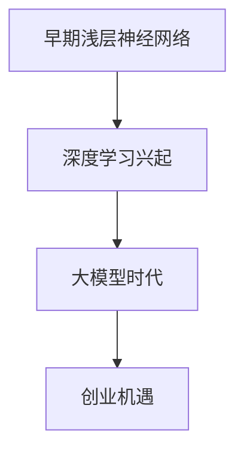

                 

# 《大模型时代的创业者创业心路历程：困惑、突破与成长》

> 关键词：大模型、创业、机遇、挑战、团队、产品、市场、融资、成长

> 摘要：本文将深入探讨大模型时代背景下的创业者创业心路历程。从创业基础篇到创业实战篇，再到创业成长篇，通过详细分析创业过程中的困惑、突破与成长，为创业者提供有价值的指导与启示。

## 目录大纲

### 第一部分：创业基础篇

### 第二部分：创业实战篇

### 第三部分：创业成长篇

### 附录

## 第一部分：创业基础篇

### 第1章：大模型时代背景与创业机遇

#### 1.1 大模型技术的发展历程与影响

大模型技术的发展经历了几个重要阶段。从早期的浅层神经网络，到深度学习，再到如今的大模型时代，人工智能技术取得了令人瞩目的进展。大模型如GPT-3、BERT、Gluon等，凭借其强大的计算能力和丰富的数据资源，正在改变着各个行业。

大模型技术对创业的影响是深远的。首先，大模型技术的出现为创业者提供了前所未有的机遇。例如，在自然语言处理、计算机视觉、语音识别等领域，创业者可以利用大模型实现以前难以实现的功能，为用户带来全新的体验。其次，大模型技术也带来了新的挑战。创业者需要具备一定的技术背景，才能充分利用大模型的优势，开发出具有竞争力的产品。

#### 1.2 大模型技术对创业的机遇与挑战

**机遇：**

1. **市场需求增长：** 大模型技术的应用领域不断扩展，市场需求持续增长。例如，在金融、医疗、教育等行业，大模型技术正在被广泛应用，为创业者提供了广阔的市场空间。

2. **技术创新：** 大模型技术为创业者提供了创新的工具和平台，使创业者能够更快速地开发出具有竞争力的产品。

3. **数据优势：** 大模型技术依赖于海量数据，创业者可以利用自身的业务数据，为模型提供高质量的数据支持，进一步提升产品的竞争力。

**挑战：**

1. **技术门槛：** 大模型技术涉及深度学习、神经网络等复杂算法，创业者需要具备一定的技术背景，才能理解和应用这些技术。

2. **数据隐私与安全：** 大模型训练需要大量数据，但数据的隐私和安全问题是创业者必须面对的挑战。

3. **竞争激烈：** 大模型技术已经成为热门领域，创业者需要面对激烈的市场竞争。

#### 1.3 创业者必备的大模型知识储备

为了充分利用大模型技术的优势，创业者需要具备以下知识储备：

1. **深度学习基础：** 了解神经网络、深度学习框架等基础知识，能够进行基本的模型训练和优化。

2. **大数据处理：** 掌握数据处理、存储和挖掘等技能，能够有效地管理和利用海量数据。

3. **编程技能：** 熟练掌握至少一门编程语言，如Python，能够进行实际的编程开发。

4. **业务理解：** 深入了解创业领域的业务逻辑，能够将大模型技术与具体业务相结合。

### 第2章：创业心路历程与心理准备

#### 2.1 创业者面临的困惑与问题

创业者通常会面临以下困惑和问题：

1. **技术方向选择：** 创业者需要在众多技术方向中做出选择，如何找到适合自己的方向？

2. **团队建设：** 创业者需要组建一支高效的团队，如何吸引和留住优秀人才？

3. **市场需求：** 创业者需要了解市场需求，如何找到目标用户，如何满足他们的需求？

4. **资金问题：** 创业者需要解决资金问题，如何获得投资，如何管理资金？

5. **竞争压力：** 创业者需要面对激烈的市场竞争，如何保持竞争优势？

#### 2.2 心理调适与应对策略

创业过程中，心理调适至关重要。以下是一些建议：

1. **积极心态：** 保持积极的心态，面对困难和挑战时，要有勇气和决心去克服。

2. **合理规划：** 创业者需要制定合理的规划，明确目标，逐步实现。

3. **学会放松：** 创业者要学会合理安排时间，学会放松，保持身心健康。

4. **寻求支持：** 创业者可以寻求家人、朋友、导师等支持，共同度过困难时期。

#### 2.3 从创业梦想到现实步骤解析

从创业梦想到现实，创业者需要经历以下几个步骤：

1. **市场调研：** 了解市场需求，分析潜在用户，确定创业方向。

2. **团队组建：** 吸引和组建一支高效的团队，明确团队成员的角色和职责。

3. **产品设计：** 根据市场需求，设计出具有竞争力的产品。

4. **技术开发：** 利用大模型技术，进行产品开发和优化。

5. **市场推广：** 制定市场推广策略，通过各种渠道宣传产品。

6. **融资计划：** 制定融资计划，寻求投资。

7. **持续优化：** 在产品上线后，持续收集用户反馈，进行产品迭代优化。

## 第二部分：创业实战篇

### 第3章：创业项目策划与市场分析

#### 3.1 创业项目定位与目标市场

创业项目的定位是创业成功的关键。创业者需要明确项目定位，确定目标市场。以下是一些步骤：

1. **确定项目定位：** 根据自身兴趣、专长和市场需求，确定创业项目的定位。

2. **分析目标市场：** 了解目标市场的规模、增长趋势、竞争对手等。

3. **确定目标用户：** 明确目标用户的特征，如年龄、性别、职业等。

4. **制定市场策略：** 根据目标市场的特点和需求，制定相应的市场策略。

#### 3.2 市场需求分析与竞争分析

市场需求分析与竞争分析是创业策划的重要环节。以下是一些步骤：

1. **市场需求分析：** 分析目标市场的需求，了解用户痛点。

2. **竞争分析：** 了解竞争对手的优势和劣势，分析竞争策略。

3. **差异化策略：** 根据市场需求和竞争分析，制定差异化策略，打造竞争优势。

#### 3.3 创业项目商业模式设计

创业项目的商业模式设计是创业成功的关键。以下是一些步骤：

1. **确定盈利模式：** 根据市场需求和目标用户，确定项目的盈利模式。

2. **设计商业模式：** 根据盈利模式，设计相应的商业模式。

3. **风险评估：** 对项目进行风险评估，制定相应的风险控制措施。

### 第4章：创业团队建设与管理

#### 4.1 团队成员选择与角色分配

创业团队建设是创业成功的关键。以下是一些步骤：

1. **选择团队成员：** 根据项目需求，选择具备相关技能和经验的团队成员。

2. **明确角色分配：** 明确团队成员的角色和职责，确保团队协作高效。

3. **培养团队协作：** 通过团队建设活动，提高团队成员的协作能力。

#### 4.2 团队沟通与协作技巧

团队沟通与协作技巧是团队高效运作的关键。以下是一些步骤：

1. **建立有效的沟通机制：** 确定沟通渠道、频率和方式，确保信息畅通。

2. **培养团队协作文化：** 通过团队活动、培训等，培养团队协作精神。

3. **解决冲突与矛盾：** 学会化解团队内部的冲突与矛盾，保持团队的稳定。

#### 4.3 团队管理与激励机制

团队管理与激励机制是团队高效运作的关键。以下是一些步骤：

1. **制定管理策略：** 根据团队特点和项目需求，制定合适的管理策略。

2. **建立激励机制：** 通过奖励、晋升等手段，激励团队成员发挥潜力。

3. **关注团队成员成长：** 定期组织培训、分享等活动，关注团队成员的成长。

### 第5章：产品设计与开发

#### 5.1 产品设计思路与原则

产品设计与开发是创业项目的核心。以下是一些步骤：

1. **明确产品设计目标：** 根据市场需求和用户痛点，确定产品设计的核心目标。

2. **遵循设计原则：** 如简洁性、易用性、稳定性等，确保产品设计符合用户需求。

3. **用户体验设计：** 关注用户使用过程中的体验，优化产品界面和交互设计。

#### 5.2 产品开发流程与工具

产品开发流程与工具是确保项目进度和质量的关键。以下是一些步骤：

1. **确定开发流程：** 如需求分析、设计、开发、测试等，确保项目有序进行。

2. **选择开发工具：** 如IDE、版本控制工具、测试工具等，提高开发效率。

3. **代码规范与文档：** 制定代码规范，编写详细的文档，确保代码的可读性和可维护性。

#### 5.3 产品测试与迭代优化

产品测试与迭代优化是确保产品质量的关键。以下是一些步骤：

1. **制定测试计划：** 根据产品需求和功能，制定详细的测试计划。

2. **进行功能测试：** 测试产品的功能是否满足需求。

3. **进行性能测试：** 测试产品的性能指标，如响应时间、并发能力等。

4. **迭代优化：** 根据测试结果，不断优化产品，提高用户体验。

### 第6章：市场推广与销售策略

#### 6.1 市场推广策略与渠道选择

市场推广策略与渠道选择是创业成功的关键。以下是一些步骤：

1. **确定推广目标：** 根据产品特点和市场定位，确定推广目标。

2. **选择推广渠道：** 如社交媒体、广告、公关等，选择适合产品的推广渠道。

3. **制定推广计划：** 根据推广目标和渠道特点，制定详细的推广计划。

#### 6.2 销售策略与技巧

销售策略与技巧是创业成功的关键。以下是一些步骤：

1. **确定销售目标：** 根据市场情况和产品特点，确定销售目标。

2. **建立销售团队：** 招募销售人才，建立销售团队。

3. **制定销售策略：** 如客户关系管理、销售技巧等，提高销售业绩。

#### 6.3 客户关系管理与维护

客户关系管理与维护是创业成功的关键。以下是一些步骤：

1. **建立客户档案：** 收集客户信息，建立客户档案。

2. **客户沟通与反馈：** 定期与客户沟通，了解客户需求和反馈。

3. **客户关怀与维护：** 通过电话、邮件、短信等方式，与客户保持联系，提供优质的售后服务。

### 第7章：创业融资与资金管理

#### 7.1 创业融资方式与渠道

创业融资方式与渠道是创业成功的关键。以下是一些步骤：

1. **了解融资方式：** 如天使投资、风险投资、股权融资等，了解各种融资方式的优缺点。

2. **选择融资渠道：** 如创业投资机构、银行贷款、政府补贴等，选择适合项目的融资渠道。

3. **制定融资计划：** 根据项目需求和市场情况，制定详细的融资计划。

#### 7.2 融资策略与技巧

融资策略与技巧是创业成功的关键。以下是一些步骤：

1. **准备融资材料：** 准备商业计划书、财务报表等融资材料。

2. **与投资人沟通：** 沟通项目愿景、商业模式、市场前景等，提高融资成功率。

3. **谈判与签约：** 与投资人进行谈判，签订投资协议，确保投资顺利。

#### 7.3 资金管理与风险控制

资金管理与风险控制是创业成功的关键。以下是一些步骤：

1. **制定资金管理计划：** 根据项目需求，制定详细的资金管理计划。

2. **合理分配资金：** 根据项目进度和资金需求，合理分配资金。

3. **风险控制：** 制定风险控制措施，如财务审计、项目监控等，确保项目安全运行。

## 第三部分：创业成长篇

### 第8章：创业过程中的突破与成长

#### 8.1 创业过程中的关键节点

创业过程中，关键节点是突破与成长的重要标志。以下是一些关键节点：

1. **产品上线：** 产品上线是创业的重要里程碑，标志着项目进入市场。

2. **用户增长：** 用户增长是衡量项目成功的重要指标，创业者需要关注用户增长情况。

3. **融资成功：** 融资成功为项目提供了资金支持，有助于项目持续发展。

4. **市场拓展：** 市场拓展是项目规模扩大的关键，创业者需要不断寻找新的市场机会。

#### 8.2 创业者如何应对挑战与危机

创业过程中，挑战与危机是不可避免的。以下是一些建议：

1. **积极应对：** 面对挑战和危机，要保持积极的态度，寻找解决方案。

2. **调整策略：** 根据实际情况，及时调整项目策略，以适应市场变化。

3. **寻求支持：** 在遇到困难时，可以寻求家人、朋友、导师等支持。

4. **持续学习：** 创业者需要不断学习新知识、新技能，提高自身能力。

#### 8.3 创业者成长与个人能力提升

创业者的成长与个人能力提升是项目成功的关键。以下是一些建议：

1. **培养领导力：** 学会领导团队，提高团队协作能力。

2. **提升沟通能力：** 学会与各种人沟通，提高沟通效果。

3. **增强执行力：** 做事有计划，提高执行力。

4. **保持创新精神：** 不断创新，寻找新的商业机会。

### 第9章：创业成果评估与持续发展

#### 9.1 创业成果评估指标与方法

创业成果评估是衡量项目成功与否的重要手段。以下是一些评估指标和方法：

1. **财务指标：** 如营业收入、净利润、现金流等。

2. **市场指标：** 如市场份额、品牌知名度、用户满意度等。

3. **运营指标：** 如用户活跃度、留存率、转化率等。

4. **创新指标：** 如技术创新、商业模式创新等。

#### 9.2 创业企业的持续发展与规划

创业企业的持续发展与规划是项目长期成功的关键。以下是一些建议：

1. **制定发展规划：** 根据项目实际情况，制定长期发展规划。

2. **优化商业模式：** 不断调整和优化商业模式，提高项目竞争力。

3. **扩大市场份额：** 通过市场拓展、产品创新等手段，扩大市场份额。

4. **提升品牌影响力：** 通过品牌建设、市场推广等手段，提升品牌影响力。

#### 9.3 创业者未来展望与职业规划

创业者未来展望与职业规划是项目长期成功的重要保障。以下是一些建议：

1. **明确职业目标：** 根据个人兴趣和市场需求，明确职业目标。

2. **持续学习与提升：** 不断学习新知识、新技能，提高自身能力。

3. **拓展人际网络：** 建立广泛的人脉关系，为项目发展提供支持。

4. **创新与创业：** 在适当的时候，尝试创新和创业，实现人生价值。

### 第10章：创业故事分享与启示

#### 10.1 成功创业者的故事分享

成功创业者的故事分享是激励和启示创业者的宝贵资源。以下是一些成功创业者的故事：

1. **李开新：** 前魅族科技总裁，带领团队成功转型，创办了荣耀手机。

2. **雷军：** 小米科技创始人，凭借独特的商业模式和优秀的团队，成功将小米打造成全球知名的科技品牌。

3. **张一鸣：** 字节跳动创始人，通过创新的算法和产品，将抖音等应用程序推向全球。

#### 10.2 创业者心路历程与感悟

创业者心路历程与感悟是创业者的宝贵财富。以下是一些创业者的感悟：

1. **坚持与耐心：** 创业过程中，坚持和耐心至关重要。

2. **团队合作：** 建立一支高效的团队，是创业成功的关键。

3. **市场洞察：** 了解市场需求，满足用户需求，是创业的核心。

4. **创新思维：** 创新思维和商业模式，是创业的源泉。

#### 10.3 启示与建议：为创业之路保驾护航

以下是一些建议，为创业之路保驾护航：

1. **充分准备：** 在创业之前，要充分准备，包括市场调研、团队组建、资金准备等。

2. **合理规划：** 制定详细的创业规划，包括短期目标和长期目标。

3. **学习与成长：** 持续学习新知识、新技能，提升自身能力。

4. **寻求支持：** 在遇到困难时，寻求家人、朋友、导师等支持。

5. **保持创新：** 创新是创业的核心，要不断寻找新的商业机会。

## 附录

### 附录A：创业相关资源与工具

以下是一些创业相关资源与工具：

1. **创业教程与课程推荐：** 
   - 《创业维艰》
   - 《创业融资攻略》
   - 网易云课堂、慕课网等在线课程平台

2. **创业社区与交流平台：**
   - 创业邦
   - 天使投资圈
   - 猎云网

3. **创业相关法律法规与政策解析：**
   - 各地创业政策汇编
   - 法律法规查询工具

4. **创业者必备书籍推荐：**
   - 《创新者的窘境》
   - 《创业的国度》
   - 《创业管理》

通过上述资源与工具，创业者可以更好地准备和推进自己的创业项目。

## 作者信息

作者：AI天才研究院/AI Genius Institute & 禅与计算机程序设计艺术 /Zen And The Art of Computer Programming

（注：本文内容仅供参考，具体创业实践请结合实际情况进行。）```markdown
# 《大模型时代的创业者创业心路历程：困惑、突破与成长》

## 文章关键词
- 大模型
- 创业
- 机遇
- 挑战
- 团队
- 产品
- 市场
- 融资
- 成长

## 文摘
本文详细探讨了在当前大模型技术迅速发展的背景下，创业者所面临的困惑、突破与成长之路。通过分析创业过程中的关键节点、应对策略以及成长经验，为创业者提供了有价值的参考和启示。

---

## 第一部分：创业基础篇

### 第1章：大模型时代背景与创业机遇

#### 1.1 大模型技术的发展历程与影响

大模型技术的发展经历了多个阶段，从初期的浅层神经网络到深度学习的兴起，再到如今的大模型时代，如GPT-3、BERT等。这些大模型的出现，极大地推动了人工智能在各领域的应用，为创业者提供了丰富的机遇。

**流程图：** 


#### 1.2 大模型技术对创业的机遇与挑战

**机遇：** 
- 市场需求增长：大模型技术的应用领域不断扩展，如自然语言处理、计算机视觉等，市场需求持续增长。
- 技术创新：大模型技术为创业者提供了创新的工具和平台，快速开发出具有竞争力的产品。

**挑战：** 
- 技术门槛：大模型技术涉及复杂的算法和大量的数据处理，对创业者的技术背景要求较高。
- 竞争激烈：大模型技术的应用已经成为热门领域，创业者需要面对激烈的市场竞争。

#### 1.3 创业者必备的大模型知识储备

创业者需要掌握以下知识储备：
- 深度学习基础：了解神经网络、深度学习框架等基础知识。
- 大数据处理：掌握数据处理、存储和挖掘等技能。
- 编程技能：熟练掌握至少一门编程语言，如Python。
- 业务理解：深入理解创业领域的业务逻辑，将大模型技术与具体业务相结合。

### 第2章：创业心路历程与心理准备

#### 2.1 创业者面临的困惑与问题

创业过程中，创业者常常面临以下困惑和问题：
- 技术方向选择：如何在众多技术方向中找到适合自己的？
- 团队建设：如何组建和留住一支高效的团队？
- 市场需求：如何准确把握市场需求，开发出满足用户需求的产品？
- 资金问题：如何解决创业初期的资金问题？
- 竞争压力：如何在激烈的市场竞争中脱颖而出？

#### 2.2 心理调适与应对策略

创业过程中，心理调适至关重要。以下是一些建议：
- 保持积极心态：面对困难和挑战时，要有勇气和决心去克服。
- 合理规划：制定合理的创业规划，明确目标，逐步实现。
- 学会放松：合理安排时间，保持身心健康。
- 寻求支持：在遇到困难时，寻求家人、朋友、导师等支持。

#### 2.3 从创业梦想到现实步骤解析

从创业梦想到现实，创业者需要经历以下步骤：
- 市场调研：了解市场需求，分析潜在用户。
- 团队组建：吸引和组建一支高效的团队。
- 产品设计：根据市场需求，设计出具有竞争力的产品。
- 开发与优化：利用大模型技术，进行产品开发和优化。
- 市场推广：制定市场推广策略，通过各种渠道宣传产品。
- 融资计划：制定融资计划，寻求投资。
- 持续优化：在产品上线后，持续收集用户反馈，进行产品迭代优化。

## 第二部分：创业实战篇

### 第3章：创业项目策划与市场分析

#### 3.1 创业项目定位与目标市场

创业者需要明确项目定位，确定目标市场：
- 项目定位：根据自身兴趣、专长和市场需求，确定创业项目的定位。
- 目标市场：分析目标市场的规模、增长趋势、竞争对手等，明确目标用户。

#### 3.2 市场需求分析与竞争分析

市场需求分析与竞争分析是创业策划的重要环节：
- 市场需求分析：分析目标市场的需求，了解用户痛点。
- 竞争分析：了解竞争对手的优势和劣势，分析竞争策略。

#### 3.3 创业项目商业模式设计

创业项目商业模式设计是创业成功的关键：
- 盈利模式：根据市场需求和目标用户，确定项目的盈利模式。
- 商业模式：设计出可行的商业模式，确保项目的可持续发展。

### 第4章：创业团队建设与管理

#### 4.1 团队成员选择与角色分配

创业团队建设是创业成功的关键：
- 成员选择：根据项目需求，选择具备相关技能和经验的团队成员。
- 角色分配：明确团队成员的角色和职责，确保团队协作高效。

#### 4.2 团队沟通与协作技巧

团队沟通与协作技巧是团队高效运作的关键：
- 沟通机制：建立有效的沟通渠道、频率和方式。
- 协作文化：培养团队协作精神，提高团队协作能力。

#### 4.3 团队管理与激励机制

团队管理与激励机制是团队高效运作的关键：
- 管理策略：根据团队特点和项目需求，制定合适的管理策略。
- 激励机制：通过奖励、晋升等手段，激励团队成员发挥潜力。

### 第5章：产品设计与开发

#### 5.1 产品设计思路与原则

产品设计与开发是创业项目的核心：
- 设计目标：根据市场需求和用户痛点，确定产品设计的核心目标。
- 设计原则：遵循简洁性、易用性、稳定性等设计原则。

#### 5.2 产品开发流程与工具

产品开发流程与工具是确保项目进度和质量的关键：
- 开发流程：确定需求分析、设计、开发、测试等开发流程。
- 开发工具：选择适合的开发工具，如IDE、版本控制工具等。

#### 5.3 产品测试与迭代优化

产品测试与迭代优化是确保产品质量的关键：
- 测试计划：根据产品需求和功能，制定详细的测试计划。
- 测试执行：进行功能测试、性能测试等。
- 迭代优化：根据测试结果，不断优化产品，提高用户体验。

### 第6章：市场推广与销售策略

#### 6.1 市场推广策略与渠道选择

市场推广策略与渠道选择是创业成功的关键：
- 推广目标：根据产品特点和目标市场，确定推广目标。
- 推广渠道：选择适合产品的推广渠道，如社交媒体、广告等。

#### 6.2 销售策略与技巧

销售策略与技巧是创业成功的关键：
- 销售目标：根据市场情况和产品特点，确定销售目标。
- 销售团队：建立销售团队，制定销售策略。
- 销售技巧：提高销售业绩，如客户关系管理、销售技巧等。

#### 6.3 客户关系管理与维护

客户关系管理与维护是创业成功的关键：
- 客户档案：建立客户档案，收集客户信息。
- 沟通与反馈：定期与客户沟通，了解客户需求和反馈。
- 客户关怀：提供优质的售后服务，保持客户关系。

### 第7章：创业融资与资金管理

#### 7.1 创业融资方式与渠道

创业融资方式与渠道是创业成功的关键：
- 融资方式：了解各种融资方式，如天使投资、风险投资、股权融资等。
- 融资渠道：选择适合项目的融资渠道，如创业投资机构、银行贷款等。

#### 7.2 融资策略与技巧

融资策略与技巧是创业成功的关键：
- 融资材料：准备商业计划书、财务报表等融资材料。
- 与投资人沟通：与投资人沟通项目愿景、商业模式等，提高融资成功率。
- 谈判与签约：与投资人进行谈判，签订投资协议，确保投资顺利。

#### 7.3 资金管理与风险控制

资金管理与风险控制是创业成功的关键：
- 资金管理计划：根据项目需求，制定详细的资金管理计划。
- 资金分配：合理分配资金，确保项目进度和需求。
- 风险控制：制定风险控制措施，如财务审计、项目监控等。

## 第三部分：创业成长篇

### 第8章：创业过程中的突破与成长

#### 8.1 创业过程中的关键节点

创业过程中的关键节点包括：
- 产品上线：标志着项目进入市场。
- 用户增长：衡量项目成功的重要指标。
- 融资成功：为项目提供资金支持。
- 市场拓展：项目规模扩大的关键。

#### 8.2 创业者如何应对挑战与危机

创业者应对挑战与危机的方法：
- 积极应对：面对困难和挑战，保持积极的态度。
- 调整策略：根据实际情况，及时调整项目策略。
- 寻求支持：在遇到困难时，寻求家人、朋友、导师等支持。
- 持续学习：不断学习新知识、新技能，提高自身能力。

#### 8.3 创业者成长与个人能力提升

创业者成长与个人能力提升的方法：
- 培养领导力：学会领导团队，提高团队协作能力。
- 提升沟通能力：学会与各种人沟通，提高沟通效果。
- 增强执行力：做事有计划，提高执行力。
- 保持创新精神：不断创新，寻找新的商业机会。

### 第9章：创业成果评估与持续发展

#### 9.1 创业成果评估指标与方法

创业成果评估的指标和方法包括：
- 财务指标：如营业收入、净利润、现金流等。
- 市场指标：如市场份额、品牌知名度、用户满意度等。
- 运营指标：如用户活跃度、留存率、转化率等。
- 创新指标：如技术创新、商业模式创新等。

#### 9.2 创业企业的持续发展与规划

创业企业的持续发展与规划的方法：
- 制定发展规划：根据项目实际情况，制定长期发展规划。
- 优化商业模式：不断调整和优化商业模式，提高项目竞争力。
- 扩大市场份额：通过市场拓展、产品创新等手段，扩大市场份额。
- 提升品牌影响力：通过品牌建设、市场推广等手段，提升品牌影响力。

#### 9.3 创业者未来展望与职业规划

创业者未来展望与职业规划的方法：
- 明确职业目标：根据个人兴趣和市场需求，明确职业目标。
- 持续学习与提升：不断学习新知识、新技能，提高自身能力。
- 拓展人际网络：建立广泛的人脉关系，为项目发展提供支持。
- 创新与创业：在适当的时候，尝试创新和创业，实现人生价值。

### 第10章：创业故事分享与启示

#### 10.1 成功创业者的故事分享

成功创业者的故事分享，包括：
- 李开新：前魅族科技总裁，带领团队成功转型，创办了荣耀手机。
- 雷军：小米科技创始人，凭借独特的商业模式和优秀的团队，成功将小米打造成全球知名的科技品牌。
- 张一鸣：字节跳动创始人，通过创新的算法和产品，将抖音等应用程序推向全球。

#### 10.2 创业者心路历程与感悟

创业者心路历程与感悟，包括：
- 坚持与耐心：创业过程中，坚持和耐心至关重要。
- 团队合作：建立一支高效的团队，是创业成功的关键。
- 市场洞察：了解市场需求，满足用户需求，是创业的核心。
- 创新思维：创新思维和商业模式，是创业的源泉。

#### 10.3 启示与建议：为创业之路保驾护航

为创业之路保驾护航的启示与建议，包括：
- 充分准备：在创业之前，要充分准备，包括市场调研、团队组建、资金准备等。
- 合理规划：制定详细的创业规划，包括短期目标和长期目标。
- 学习与成长：持续学习新知识、新技能，提升自身能力。
- 寻求支持：在遇到困难时，寻求家人、朋友、导师等支持。
- 保持创新：创新是创业的核心，要不断寻找新的商业机会。

### 附录

#### 附录A：创业相关资源与工具

创业相关资源与工具，包括：
- 创业教程与课程推荐：如《创业维艰》、《创业融资攻略》等。
- 创业社区与交流平台：如创业邦、天使投资圈、猎云网等。
- 创业相关法律法规与政策解析：如各地创业政策汇编、法律法规查询工具等。
- 创业者必备书籍推荐：如《创新者的窘境》、《创业的国度》、《创业管理》等。

## 作者信息

作者：AI天才研究院/AI Genius Institute & 禅与计算机程序设计艺术 /Zen And The Art of Computer Programming

（注：本文内容仅供参考，具体创业实践请结合实际情况进行。）```

