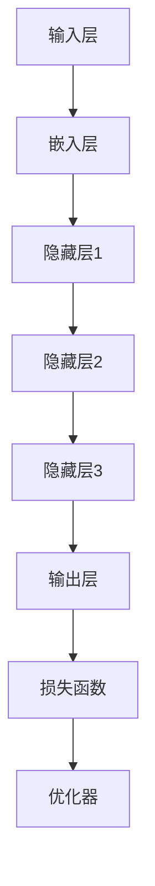
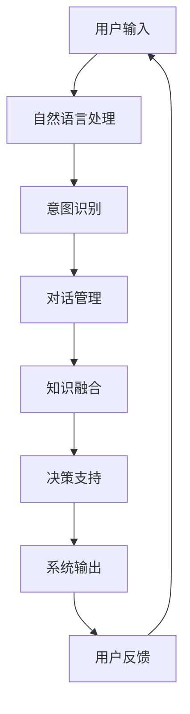

                 

# 大模型的人机协作：人工智能与人类智能的融合

> 关键词：大模型、人机协作、人工智能、自然语言处理、计算机视觉、交互设计、实战案例、未来发展趋势

> 摘要：本文将探讨大模型在人机协作中的应用，分析其基本原理与架构，探讨其在自然语言处理、计算机视觉等领域的实际应用，并深入讨论人机协作的核心技术，如人机交互设计与评估、大模型与人机协作的融合技术等。此外，文章还将通过实战案例展示大模型与人机协作的实际应用效果，并展望其未来发展趋势及可能带来的社会影响与伦理问题。

# 目录大纲

## 第一部分：引言与背景知识

### 第1章：大模型与人机协作概述

- 1.1 大模型与人机协作的定义与重要性
- 1.2 人机协作的现状与未来趋势
- 1.3 大模型在人机协作中的应用

## 第二部分：大模型技术基础

### 第2章：大模型的基本原理与架构

- 2.1 大模型的发展历程与核心技术
- 2.2 大模型的核心架构与组件
- 2.3 大模型的训练与优化算法

### 第3章：大模型在自然语言处理中的应用

- 3.1 自然语言处理的基础知识
- 3.2 大模型在自然语言处理中的实际应用
- 3.3 大模型在对话系统中的角色

### 第4章：大模型在计算机视觉中的应用

- 4.1 计算机视觉的基本概念
- 4.2 大模型在计算机视觉中的实际应用
- 4.3 大模型在图像识别与图像生成中的应用

## 第三部分：人机协作的核心技术

### 第5章：人机交互设计与评估

- 5.1 人机交互的基本原理
- 5.2 人机交互设计的最佳实践
- 5.3 人机交互的评估方法与工具

### 第6章：大模型与人机协作的融合技术

- 6.1 大模型与人机协作的融合概念
- 6.2 大模型与人机协作的融合架构
- 6.3 大模型与人机协作的融合方法

### 第7章：大模型在特殊场景中的应用

- 7.1 大模型在医疗健康领域的应用
- 7.2 大模型在金融领域的应用
- 7.3 大模型在教育领域的应用

## 第四部分：实战与案例分析

### 第8章：大模型与人机协作的实战案例

- 8.1 案例一：智能客服系统
- 8.2 案例二：智能医疗诊断系统
- 8.3 案例三：智能教育辅导系统

### 第9章：大模型与人机协作的未来发展趋势

- 9.1 大模型与人机协作的技术挑战
- 9.2 大模型与人机协作的未来发展方向
- 9.3 大模型与人机协作的社会影响与伦理问题

## 第五部分：附录

### 附录A：大模型与人机协作工具与资源

- A.1 常用深度学习框架
- A.2 大模型与人机协作开源项目
- A.3 大模型与人机协作相关论文与书籍推荐

### 附录B：Mermaid 流程图

- B.1 大模型架构流程图
- B.2 人机协作流程图

### 附录C：伪代码与数学公式

- C.1 大模型训练伪代码
- C.2 人机交互评价公式
- C.3 大模型应用数学公式

### 附录D：实战项目代码解读与分析

- D.1 实战项目一：智能客服系统
- D.2 实战项目二：智能医疗诊断系统
- D.3 实战项目三：智能教育辅导系统

## 第一部分：引言与背景知识

### 第1章：大模型与人机协作概述

1.1 大模型与人机协作的定义与重要性

**大模型（Large Models）**：大模型是指具有大规模参数的数量和庞大的数据集的深度学习模型。例如，在自然语言处理领域中，大型语言模型如GPT-3拥有超过1750亿个参数，而在计算机视觉领域，像ImageNet这样的大规模图像识别模型拥有数百万个训练样本。

**人机协作（Human-Machine Collaboration）**：人机协作是指人类与计算机系统共同完成任务的协作模式。在这种模式中，计算机系统利用人工智能技术，如自然语言处理、计算机视觉等，协助人类完成复杂任务，提高工作效率。

大模型与人机协作的结合，正在改变各行各业的运作模式。以下是几个关键原因，解释了为什么大模型与人机协作如此重要：

1. **提高效率**：大模型能够处理大量的数据和复杂的任务，从而显著提高任务执行的速度和效率。
2. **增强决策能力**：大模型可以分析大量数据，提供有价值的见解和建议，帮助人类做出更明智的决策。
3. **解决复杂问题**：大模型在处理复杂问题时，能够通过学习和优化算法，提供更准确的解决方案。
4. **扩展人类能力**：人机协作使人类能够利用计算机系统的能力，扩展自身的能力范围，处理以前无法完成的任务。

1.2 人机协作的现状与未来趋势

人机协作技术近年来取得了显著进展，主要体现在以下几个方面：

1. **人工智能技术的成熟**：随着深度学习、自然语言处理、计算机视觉等技术的发展，人工智能系统在各个领域的应用越来越广泛。
2. **大数据的普及**：大数据的积累和存储技术的进步，为训练大模型提供了丰富的数据资源。
3. **云计算和边缘计算的发展**：云计算和边缘计算的兴起，为大规模部署和运行大模型提供了基础设施支持。
4. **人机交互技术的进步**：人机交互技术的发展，使得计算机系统能够更自然地与人类进行交互，提高了人机协作的便利性和用户体验。

未来，人机协作将继续朝着更高效、更智能、更人性化的方向发展。以下是几个可能的趋势：

1. **个性化协作**：大模型将能够根据用户的个人特点和需求，提供个性化的协作服务。
2. **跨领域协作**：不同领域的人工智能系统将实现更好的融合，提供更全面的协作能力。
3. **智能代理**：人工智能系统将逐渐具备更强的自主学习能力和自主决策能力，成为人类的智能代理。
4. **智能伦理与安全**：随着人机协作的普及，智能伦理和安全问题将越来越受到重视。

1.3 大模型在人机协作中的应用

大模型在多个领域都展现出了卓越的能力，以下是一些典型应用：

1. **自然语言处理**：大模型如GPT-3、BERT等，在语言翻译、文本生成、问答系统等领域表现出色，为人类提供了强大的语言理解与生成能力。
2. **计算机视觉**：大模型在图像识别、目标检测、图像生成等领域具有显著优势，能够辅助人类进行图像分析与处理。
3. **医疗健康**：大模型在医疗影像分析、疾病诊断、药物研发等领域发挥了重要作用，提高了医疗诊断和治疗的准确性和效率。
4. **金融**：大模型在金融市场分析、风险控制、客户服务等领域具有广泛的应用，为金融机构提供了有力的支持。
5. **教育**：大模型在教育领域可以用于个性化学习、智能辅导、教学评估等，提高教育的质量和效率。

随着技术的不断进步，大模型在人机协作中的应用将越来越广泛，为人类社会带来更多便利和创新。

### 第2章：大模型的基本原理与架构

2.1 大模型的发展历程与核心技术

大模型的发展历程可以追溯到深度学习的兴起。深度学习是一种基于多层神经网络的学习方法，通过逐层提取数据特征，实现复杂函数的逼近。以下是深度学习和大模型发展的重要里程碑：

1. **1980年代：深度学习的早期探索**：深度学习最初在1980年代被提出，但由于计算能力和数据资源的限制，进展缓慢。
2. **2006年：AlexNet的出现**：AlexNet是第一个在ImageNet竞赛中取得显著成绩的深度学习模型，标志着深度学习的崛起。
3. **2012年：深度学习在ImageNet上的突破**：深度学习在ImageNet图像识别竞赛中取得优异成绩，引发了深度学习的热潮。
4. **2014年：Gated Recurrent Unit（GRU）和长短期记忆网络（LSTM）的提出**：GRU和LSTM是用于处理序列数据的神经网络模型，解决了传统循环神经网络在处理长序列数据时的梯度消失问题。
5. **2017年：Transformer架构的提出**：Transformer架构彻底改变了自然语言处理领域，通过自注意力机制实现了对输入序列的灵活建模。
6. **2018年：BERT模型的发布**：BERT是第一个基于Transformer架构的预训练语言模型，大幅提高了自然语言处理任务的性能。
7. **2019年：GPT-2的发布**：GPT-2是一个具有巨大参数规模的预训练语言模型，展示了大模型在自然语言处理中的潜力。
8. **2020年：GPT-3的发布**：GPT-3是当前最大的预训练语言模型，拥有超过1750亿个参数，显著提高了语言理解和生成的能力。

大模型的核心技术主要包括以下几个方面：

1. **深度神经网络**：深度神经网络是构建大模型的基础，通过多层非线性变换，实现复杂数据特征的提取和表示。
2. **自注意力机制**：自注意力机制是Transformer架构的核心，通过计算序列中每个元素之间的关联度，实现对输入序列的灵活建模。
3. **预训练与微调**：预训练是指在大规模数据集上训练模型，使其具备一定的泛化能力；微调是在特定任务上对预训练模型进行调整，提高任务性能。
4. **优化算法**：优化算法用于调整模型参数，以最小化损失函数。常用的优化算法包括梯度下降、Adam等。
5. **并行计算与分布式训练**：为了处理大规模数据和训练大模型，需要利用并行计算和分布式训练技术，以提高训练速度和效率。

2.2 大模型的核心架构与组件

大模型通常由以下几个核心组件构成：

1. **输入层**：输入层负责接收外部输入数据，如文本、图像等。在自然语言处理中，输入数据通常经过预处理后，以词向量或嵌入形式输入到模型中；在计算机视觉中，输入数据是图像矩阵。
2. **嵌入层（Embedding Layer）**：嵌入层是将输入数据映射到高维空间的过程，通过词嵌入或图像嵌入，将原始数据转换为密集向量表示。
3. **隐藏层**：隐藏层是深度神经网络的核心部分，通过多层非线性变换，实现对输入数据的特征提取和表示。隐藏层的数量和层数决定了模型的深度。
4. **自注意力机制（Self-Attention Mechanism）**：自注意力机制是Transformer架构的关键组件，用于计算序列中每个元素之间的关联度，实现对输入序列的灵活建模。
5. **输出层**：输出层负责将隐藏层的输出映射到目标空间。在分类任务中，输出层通常是一个softmax层，用于生成类别的概率分布；在回归任务中，输出层是一个线性层，用于预测连续值。
6. **损失函数**：损失函数用于衡量模型预测结果与真实标签之间的差异，常用的损失函数包括交叉熵损失、均方误差损失等。
7. **优化器**：优化器用于调整模型参数，以最小化损失函数。常用的优化器包括梯度下降、Adam等。

2.3 大模型的训练与优化算法

大模型的训练是一个复杂的过程，涉及多个阶段和步骤：

1. **数据预处理**：在训练大模型之前，需要对数据进行预处理，包括数据清洗、数据增强、归一化等，以提高模型的泛化能力和训练效率。
2. **模型初始化**：模型初始化是训练过程的第一步，常用的初始化方法包括随机初始化、Xavier初始化等，以避免梯度消失和梯度爆炸问题。
3. **前向传播（Forward Propagation）**：前向传播是将输入数据通过模型的各个层，计算得到输出结果的过程。在每一层，模型都会计算输入和参数的加权和，并通过激活函数进行处理。
4. **损失计算（Loss Computation）**：损失函数用于计算模型预测结果与真实标签之间的差异。常用的损失函数包括交叉熵损失、均方误差损失等。
5. **反向传播（Backpropagation）**：反向传播是计算损失关于模型参数的梯度，以更新模型参数。反向传播通过逐层计算梯度，将损失函数的梯度传递到模型的每一层。
6. **参数更新（Parameter Update）**：利用梯度信息，通过优化算法更新模型参数。常用的优化算法包括梯度下降、Adam等。
7. **迭代训练（Iterative Training）**：重复执行前向传播、损失计算、反向传播和参数更新等步骤，直到满足停止条件（如达到预定的迭代次数或损失值收敛）。

### 第3章：大模型在自然语言处理中的应用

3.1 自然语言处理的基础知识

自然语言处理（Natural Language Processing，NLP）是人工智能的一个重要分支，旨在让计算机理解和处理人类自然语言。以下是自然语言处理的一些基础概念：

1. **文本表示（Text Representation）**：文本表示是将自然语言文本转换为计算机可以处理的形式。常用的文本表示方法包括词袋模型（Bag of Words）、词嵌入（Word Embedding）、变换器（Transformer）等。
2. **词向量（Word Embedding）**：词向量是一种将词汇映射到高维空间中的方法，通过捕捉词汇之间的语义关系，提高模型在自然语言处理任务中的性能。常见的词向量模型包括Word2Vec、GloVe等。
3. **语言模型（Language Model）**：语言模型是一种用于预测下一个单词或字符的概率分布的模型，常见用于文本生成、机器翻译、文本分类等任务。大语言模型如GPT-3、BERT等，通过预训练和微调，显著提高了自然语言处理的性能。
4. **序列标注（Sequence Labeling）**：序列标注是指将输入序列中的每个元素标注为特定的标签，如词性标注、命名实体识别等。常用的序列标注模型包括条件随机场（CRF）、BiLSTM-CRF等。
5. **文本分类（Text Classification）**：文本分类是指将输入文本分配到预定义的类别中，如情感分析、主题分类等。常用的文本分类模型包括朴素贝叶斯、支持向量机（SVM）、神经网络等。
6. **机器翻译（Machine Translation）**：机器翻译是指将一种语言的文本自动翻译成另一种语言。常见的机器翻译模型包括基于规则的翻译、统计机器翻译和神经网络机器翻译。
7. **问答系统（Question Answering）**：问答系统是指能够回答用户问题的计算机系统，如开放领域问答、对话系统等。常见的问答系统模型包括基于检索的问答和基于生成的问答。

3.2 大模型在自然语言处理中的实际应用

大模型在自然语言处理中展现出了强大的能力，以下是一些典型应用：

1. **文本生成（Text Generation）**：大语言模型如GPT-3、BERT等，可以生成高质量的自然语言文本。例如，用于自动写作、对话系统、聊天机器人等。
2. **情感分析（Sentiment Analysis）**：大模型可以分析文本中的情感倾向，如正面、负面或中立。例如，用于社交媒体情绪分析、产品评论分析等。
3. **机器翻译（Machine Translation）**：大模型在机器翻译任务中取得了显著的成果，例如，用于自动翻译、多语言文本分析等。
4. **问答系统（Question Answering）**：大模型可以回答用户提出的问题，如开放领域问答、对话系统等。
5. **文本摘要（Text Summarization）**：大模型可以生成输入文本的摘要，如自动摘要、摘要生成等。
6. **命名实体识别（Named Entity Recognition）**：大模型可以识别文本中的命名实体，如人名、地名、组织名等。
7. **文本分类（Text Classification）**：大模型可以分类文本，如情感分类、主题分类等。

3.3 大模型在对话系统中的角色

对话系统（Dialogue System）是一种能够与人类进行自然语言交互的计算机系统。大模型在对话系统中扮演了重要角色，以下是其主要应用：

1. **对话生成（Dialogue Generation）**：大模型可以生成自然流畅的对话文本，提高对话系统的交互体验。例如，用于聊天机器人、虚拟助手等。
2. **对话理解（Dialogue Understanding）**：大模型可以理解用户输入的意图和语境，从而生成恰当的回复。例如，用于智能客服、虚拟助理等。
3. **对话管理（Dialogue Management）**：大模型可以帮助对话系统管理对话流程，如任务分配、对话引导等。
4. **情感识别（Emotion Recognition）**：大模型可以识别用户对话中的情感，从而提供更个性化的服务。例如，用于情感分析、心理辅导等。
5. **多模态交互（Multimodal Interaction）**：大模型可以支持文本、语音、图像等多种模态的交互，提供更丰富的交互体验。例如，用于智能音箱、智能家居等。

总之，大模型在自然语言处理和对话系统中的应用，使得计算机能够更好地理解和生成自然语言，提高了人机交互的便利性和智能化水平。

### 第4章：大模型在计算机视觉中的应用

4.1 计算机视觉的基本概念

计算机视觉（Computer Vision）是人工智能的一个重要分支，旨在使计算机能够通过图像和视频数据理解场景内容。以下是计算机视觉的一些基础概念：

1. **图像识别（Image Recognition）**：图像识别是指将输入图像分类为预定义的类别。常见的图像识别任务包括物体检测、图像分类、人脸识别等。
2. **目标检测（Object Detection）**：目标检测是指在图像中识别并定位多个目标对象。常见的目标检测算法包括YOLO、SSD、Faster R-CNN等。
3. **图像分类（Image Classification）**：图像分类是指将输入图像分配到预定义的类别中。常见的图像分类算法包括基于卷积神经网络（CNN）的方法，如AlexNet、VGG、ResNet等。
4. **目标跟踪（Object Tracking）**：目标跟踪是指在视频序列中跟踪并预测目标对象的位置。常见的目标跟踪算法包括光流法、基于深度学习的方法等。
5. **图像分割（Image Segmentation）**：图像分割是指将图像划分为不同的区域或对象。常见的图像分割算法包括基于阈值的方法、基于区域增长的方法、基于深度学习的方法等。
6. **人脸识别（Face Recognition）**：人脸识别是指通过人脸图像识别个人身份。常见的人脸识别算法包括基于特征的方法、基于深度学习的方法等。
7. **图像生成（Image Generation）**：图像生成是指使用生成对抗网络（GAN）等方法，生成具有逼真外观的图像或视频。

4.2 大模型在计算机视觉中的实际应用

大模型在计算机视觉中取得了显著的进展，以下是一些实际应用：

1. **自动驾驶（Autonomous Driving）**：自动驾驶系统依赖于计算机视觉技术，以检测和识别道路上的车辆、行人、交通标志等。大模型如YOLO、SSD等，用于车辆检测和行人检测，提高了自动驾驶系统的安全性和可靠性。
2. **医疗影像分析（Medical Image Analysis）**：大模型在医疗影像分析中具有广泛的应用，例如，用于肺癌筛查、乳腺癌诊断等。大模型可以识别和定位图像中的病变区域，帮助医生提高诊断准确性和效率。
3. **视频监控（Video Surveillance）**：大模型在视频监控中可以用于目标检测、行为识别等，例如，用于异常行为检测、非法行为识别等。
4. **图像增强（Image Enhancement）**：大模型可以用于图像增强，如去噪、去雾等，提高图像的质量和清晰度。
5. **图像生成（Image Generation）**：大模型如生成对抗网络（GAN）可以生成具有逼真外观的图像或视频，应用于虚拟现实、游戏开发等领域。

4.3 大模型在图像识别与图像生成中的应用

大模型在图像识别和图像生成中发挥了重要作用，以下是其具体应用：

1. **图像识别（Image Recognition）**：
   - **物体检测**：大模型如YOLO、SSD等，可以在图像中识别和定位多个物体，应用于自动驾驶、视频监控等领域。
   - **图像分类**：大模型如ResNet、VGG等，可以用于图像分类任务，将图像分配到预定义的类别中。
   - **人脸识别**：大模型如FaceNet、DeepFace等，可以识别和验证人脸图像，应用于身份验证、安全监控等领域。

2. **图像生成（Image Generation）**：
   - **风格迁移（Style Transfer）**：大模型如CycleGAN，可以学习图像之间的风格特征，将一种图像的风格迁移到另一种图像上，应用于艺术创作、图像编辑等领域。
   - **超分辨率（Super-Resolution）**：大模型如SRGAN，可以用于提高图像的分辨率，应用于图像增强、视频编辑等领域。
   - **图像生成**：大模型如生成对抗网络（GAN），可以生成具有逼真外观的图像，应用于虚拟现实、游戏开发等领域。

总之，大模型在计算机视觉中的应用，使得计算机能够更好地理解和生成图像，推动了计算机视觉技术的发展和应用。

### 第5章：人机交互设计与评估

5.1 人机交互的基本原理

人机交互（Human-Computer Interaction，HCI）是指人与计算机系统之间的交互过程。以下是人机交互的一些基本原理：

1. **易用性（Usability）**：易用性是指用户在使用计算机系统时能够顺利完成任务的程度。一个理想的交互系统应该简单、直观、易于学习。
2. **用户中心设计（User-Centered Design）**：用户中心设计是一种设计方法，强调在设计过程中始终关注用户的需求、行为和体验。
3. **交互性（Interactivity）**：交互性是指用户与系统之间的实时反馈和互动。一个理想的交互系统应该提供及时、准确、多样化的反馈。
4. **认知一致性（Cognitive Consistency）**：认知一致性是指交互系统的设计应该遵循用户的认知规律和习惯，降低用户的学习成本。
5. **可用性测试（Usability Testing）**：可用性测试是一种评估交互系统质量的方法，通过观察用户在实际使用过程中的行为和反馈，发现和解决问题。

5.2 人机交互设计的最佳实践

为了提高人机交互的质量和用户体验，以下是一些最佳实践：

1. **明确用户需求**：在开始设计之前，深入了解用户的需求和期望，确保设计符合用户需求。
2. **用户调研**：通过用户调研、访谈、问卷调查等方法，获取用户的实际使用场景和行为数据。
3. **原型设计**：使用原型设计工具，快速构建交互系统的原型，通过迭代和用户反馈，不断完善设计方案。
4. **界面设计**：界面设计应该简洁、清晰、一致，使用户能够轻松理解和使用系统。
5. **响应速度**：确保系统的响应速度，减少用户等待时间，提高交互流畅性。
6. **错误处理**：设计合理的错误处理机制，帮助用户快速解决问题，减少用户困扰。
7. **可用性测试**：在设计和开发过程中，定期进行可用性测试，发现和解决潜在问题。

5.3 人机交互的评估方法与工具

评估人机交互质量的方法和工具包括：

1. **问卷调查**：通过问卷调查，收集用户对交互系统的满意度、易用性等评价。
2. **用户访谈**：通过与用户进行深入访谈，了解他们对交互系统的使用体验和反馈。
3. **用户观察**：观察用户在实际使用过程中的行为和操作，发现问题和改进点。
4. **A/B测试**：将交互系统的不同版本展示给用户，通过比较用户的行为和反馈，评估不同设计的优劣。
5. **用户满意度调查**：使用用户满意度调查表，评估用户对交互系统的整体满意度。
6. **任务完成时间**：通过记录用户完成任务所需的时间，评估交互系统的效率。
7. **错误率**：记录用户在操作过程中出现的错误数量，评估交互系统的易用性。

总之，人机交互设计与评估是确保交互系统质量的重要环节。通过遵循最佳实践和利用评估方法与工具，可以不断提升交互系统的用户体验和满意度。

### 第6章：大模型与人机协作的融合技术

6.1 大模型与人机协作的融合概念

大模型与人机协作的融合技术是指将大模型的能力与人类智能相结合，实现更高效、更智能的协作过程。这一融合旨在解决单个模型或人类在处理复杂任务时存在的局限性，通过互补优势，实现协同优化。

6.2 大模型与人机协作的融合架构

融合架构设计是实现大模型与人机协作的基础。以下是典型的融合架构：

1. **协同交互层**：此层负责大模型与用户之间的交互，包括输入数据的获取、输出结果的呈现等。通过界面设计、自然语言处理等技术，实现人机交互的流畅性。
2. **大模型层**：此层包括大模型的具体实现，如自然语言处理模型、计算机视觉模型等。大模型通过自主学习、优化算法等，实现对输入数据的理解和处理。
3. **知识融合层**：此层负责将大模型的能力与人类知识相结合，实现知识的互补与扩展。通过知识图谱、推理引擎等技术，实现大模型与人类知识的互动与融合。
4. **决策支持层**：此层基于大模型和人类知识，提供决策支持。大模型通过数据分析、预测模型等，为人类决策提供依据；人类则根据经验和直觉，对大模型的预测进行判断和调整。
5. **系统集成层**：此层负责将各个子系统集成起来，实现整体协调运作。通过API接口、消息队列等，实现模块之间的数据交换与协同。

6.3 大模型与人机协作的融合方法

实现大模型与人机协作的融合，需要采用一系列方法，包括：

1. **数据融合**：将大模型和人类的知识库进行整合，形成一个统一的数据源。通过数据预处理、清洗等技术，确保数据的准确性和一致性。
2. **模型融合**：将多个大模型进行整合，形成统一的预测模型。通过模型集成、加权等方法，实现模型的协同优化。
3. **交互融合**：设计人机交互界面，实现大模型与用户的实时交互。通过自然语言处理、语音识别等技术，实现人机对话的流畅性。
4. **推理融合**：利用大模型和人类知识，实现推理与决策的融合。通过知识图谱、推理引擎等技术，实现大模型与人类智慧的互补。
5. **优化融合**：通过机器学习和优化算法，不断优化大模型与人机协作的效率。通过迭代训练、模型更新等技术，实现系统的持续改进。

总之，大模型与人机协作的融合技术，通过多层次、多技术的综合应用，实现人类与计算机系统的深度协同，为复杂任务的解决提供了有力支持。

### 第7章：大模型在特殊场景中的应用

7.1 大模型在医疗健康领域的应用

在医疗健康领域，大模型的应用正迅速改变诊断、治疗和患者管理的方式：

1. **疾病诊断**：大模型在影像学诊断中表现出色。例如，在肺癌筛查中，大模型可以分析CT扫描图像，识别早期病变，提高了诊断的准确性和效率。
2. **个性化治疗**：通过分析患者的基因组数据，大模型可以帮助医生制定个性化的治疗方案，例如，针对癌症患者选择最有效的药物组合。
3. **药物研发**：大模型可以加速新药的发现过程。通过模拟和预测药物与生物靶标的相互作用，大模型可以筛选潜在的药物候选，减少实验成本和时间。
4. **患者监护**：在重症监护室（ICU），大模型可以监控患者的生命体征，预测病情变化，帮助医生及时采取治疗措施，降低死亡率。

7.2 大模型在金融领域的应用

金融领域是大模型应用的另一个重要场景：

1. **风险管理**：大模型可以帮助金融机构评估和预测信用风险、市场风险等，通过分析历史数据和实时数据，提高风险管理的准确性。
2. **市场预测**：大模型可以分析大量的金融数据，如股票价格、交易量等，预测市场趋势，为投资决策提供支持。
3. **智能投顾**：智能投顾系统利用大模型为投资者提供个性化的投资建议，根据投资者的风险偏好、财务状况等，制定最优的投资组合。
4. **欺诈检测**：大模型可以分析交易行为，识别潜在的欺诈活动，提高欺诈检测的效率和准确性。

7.3 大模型在教育领域的应用

在教育领域，大模型的应用正在革新教学和学习方式：

1. **个性化学习**：通过分析学生的学习数据和表现，大模型可以为学生提供个性化的学习路径和资源，提高学习效果。
2. **智能辅导**：大模型可以帮助教师进行个性化辅导，通过分析学生的答题情况，提供针对性的学习建议和辅导。
3. **教育评估**：大模型可以分析学生的考试成绩和学习表现，评估教学效果，帮助教师改进教学方法。
4. **内容生成**：大模型可以生成教育内容，如自动生成练习题、教学视频等，丰富教育资源，提高教学质量。

总之，大模型在医疗、金融和教育等领域的应用，不仅提高了行业效率，还推动了这些领域的技术创新和服务优化。

### 第8章：大模型与人机协作的实战案例

8.1 案例一：智能客服系统

智能客服系统是应用大模型与人机协作技术的典型场景。以下是一个智能客服系统的实战案例：

1. **项目背景**：某大型电商平台希望提升客户服务体验，减少人工客服的工作量，因此决定开发一个智能客服系统。
2. **技术实现**：
   - **自然语言处理**：使用大语言模型（如BERT）处理用户输入的文本，进行意图识别和实体提取，理解用户的问题。
   - **对话管理**：基于对话管理算法，智能客服系统可以生成合适的回复，确保对话的自然流畅。
   - **多模态交互**：结合文本、语音等多种交互方式，实现用户与客服系统的自然对话。
   - **知识库集成**：智能客服系统集成了丰富的产品知识和常见问题的解决方案，为大模型提供参考。
3. **实际效果**：
   - **效率提升**：智能客服系统能够快速响应用户的问题，减少用户等待时间。
   - **准确性提高**：通过大模型的强大能力，智能客服系统可以准确理解用户的意图，提供准确的回答。
   - **用户体验改善**：用户可以享受个性化、智能化的服务，提升了整体客户满意度。

8.2 案例二：智能医疗诊断系统

智能医疗诊断系统是应用大模型在医疗领域的重要成果。以下是一个智能医疗诊断系统的实战案例：

1. **项目背景**：某医院希望引入智能诊断系统，辅助医生提高诊断准确率和效率，减少误诊率。
2. **技术实现**：
   - **图像识别**：使用大模型（如ResNet）对医疗影像进行分析，识别病变区域和病变类型。
   - **症状分析**：基于自然语言处理技术，对患者的病历和症状描述进行分析，辅助医生进行诊断。
   - **多模态融合**：结合影像数据、文本数据和患者病史，实现多模态数据的融合诊断。
   - **决策支持**：智能诊断系统为医生提供诊断建议，包括可能的疾病、治疗方案等，辅助医生做出决策。
3. **实际效果**：
   - **诊断准确率提高**：通过大模型的分析，智能诊断系统可以提供准确的诊断结果，降低误诊率。
   - **工作效率提升**：智能诊断系统可以快速处理大量的影像和病历数据，减轻医生的工作负担。
   - **患者满意度提高**：智能诊断系统为患者提供快速、准确的诊断结果，提高了患者满意度。

8.3 案例三：智能教育辅导系统

智能教育辅导系统是应用大模型在教育领域的重要应用。以下是一个智能教育辅导系统的实战案例：

1. **项目背景**：某教育科技公司希望开发一个智能教育辅导系统，为学习者提供个性化的学习资源和辅导。
2. **技术实现**：
   - **个性化学习路径**：通过分析学习者的学习数据和行为，智能教育辅导系统可以生成个性化的学习路径，推荐最适合的学习内容。
   - **智能辅导**：基于自然语言处理技术，智能教育辅导系统可以解答学习者的疑问，提供学习建议和反馈。
   - **学习效果评估**：智能教育辅导系统通过自动评估学习者的学习效果，及时调整学习内容和策略。
   - **多模态交互**：结合文本、语音、视频等多种交互方式，提高学习者的学习体验。
3. **实际效果**：
   - **学习效果提升**：智能教育辅导系统通过个性化推荐和智能辅导，显著提高了学习者的学习效果。
   - **学习体验改善**：智能教育辅导系统提供了丰富的学习资源和互动方式，提高了学习者的学习兴趣和体验。
   - **教学质量提高**：教师可以利用智能教育辅导系统的数据，了解学生的学习情况，优化教学方法和策略。

总之，这些实战案例展示了大模型与人机协作技术在不同领域的应用效果，不仅提升了工作效率和准确性，还改善了用户体验，推动了各行业的技术创新和服务优化。

### 第9章：大模型与人机协作的未来发展趋势

9.1 大模型与人机协作的技术挑战

随着大模型与人机协作技术的快速发展，这一领域面临诸多技术挑战：

1. **计算资源需求**：大模型的训练和推理过程需要巨大的计算资源，尤其是训练过程，这要求高性能的计算硬件和优化的计算架构。
2. **数据隐私与安全**：大模型对大量数据的依赖，引发了数据隐私和安全问题。如何在保证数据隐私的前提下，充分利用数据资源，是一个亟待解决的问题。
3. **可解释性和透明度**：大模型的复杂性和黑箱特性，使得其决策过程缺乏透明度，如何提升模型的可解释性，使其决策过程更加透明，是一个重要挑战。
4. **伦理和社会影响**：大模型在各个领域的应用，可能会带来伦理和社会影响，如算法偏见、隐私泄露等，如何平衡技术创新与社会责任，是一个关键问题。

9.2 大模型与人机协作的未来发展方向

未来，大模型与人机协作将朝着以下几个方向发展：

1. **更高效的大模型**：研究人员将致力于优化大模型的架构和算法，降低训练和推理的计算资源需求，提高模型的性能和效率。
2. **跨领域融合**：大模型将与其他领域的技术（如物联网、云计算、边缘计算等）融合，实现更广泛的应用场景和更强大的协作能力。
3. **人机融合**：随着人工智能技术的发展，大模型与人机融合将更加紧密，实现人类与计算机系统的无缝协作，提高人类的工作和生活质量。
4. **自适应和自优化**：大模型将具备更强的自适应和自优化能力，能够根据任务和环境的变化，自动调整模型参数和策略，提高协作效果。

9.3 大模型与人机协作的社会影响与伦理问题

大模型与人机协作技术的普及，将对社会产生深远的影响：

1. **产业变革**：大模型与人机协作技术将推动各行业的创新和变革，提高生产效率和服务质量，促进社会经济的发展。
2. **就业影响**：随着自动化和智能化水平的提升，一些传统工作岗位可能会被替代，但也将创造新的就业机会，如人工智能工程师、数据科学家等。
3. **隐私与安全**：大模型对大量数据的依赖，引发了数据隐私和安全问题。如何在保护个人隐私的前提下，充分利用数据资源，是一个重要挑战。
4. **伦理问题**：大模型在决策过程中可能带来算法偏见、歧视等问题，如何确保人工智能系统的公平性和道德性，是一个重要伦理问题。

总之，大模型与人机协作技术具有巨大的发展潜力，但同时也面临诸多挑战。通过技术进步和社会努力，有望实现大模型与人机协作的可持续发展，为人类社会带来更多便利和创新。

### 附录A：大模型与人机协作工具与资源

A.1 常用深度学习框架

- TensorFlow：一个开源的机器学习框架，支持多种深度学习模型的构建与训练。
- PyTorch：一个流行的深度学习框架，以动态计算图和灵活性著称。
- Keras：一个高层神经网络API，可以与TensorFlow和Theano等深度学习后端结合使用。

A.2 大模型与人机协作开源项目

- Hugging Face Transformers：一个开源库，提供了一系列预训练的语言模型和工具，如BERT、GPT-3等。
- Detectron2：一个开源的目标检测和实例分割框架，支持多种任务和算法。
- Medical Imaging Deep Learning：一个开源的医疗图像处理项目，提供了大量的数据集和深度学习模型。

A.3 大模型与人机协作相关论文与书籍推荐

- **论文**：
  - "Attention Is All You Need"：提出了Transformer架构，改变了自然语言处理领域。
  - "Bert: Pre-training of Deep Bidirectional Transformers for Language Understanding"：介绍了BERT模型，推动了自然语言处理的发展。
  - "Deep Learning" by Ian Goodfellow, Yoshua Bengio, and Aaron Courville：深度学习的经典教材，涵盖了深度学习的基础知识和最新进展。
  
- **书籍**：
  - "Zen And The Art of Computer Programming" by Donald E. Knuth：计算机编程领域的经典著作，对编程思想和算法设计有深刻洞察。
  - "Deep Learning" by Ian Goodfellow, Yoshua Bengio, and Aaron Courville：详细介绍了深度学习的基础理论、算法和应用。

### 附录B：Mermaid 流程图

B.1 大模型架构流程图



B.2 人机协作流程图



### 附录C：伪代码与数学公式

C.1 大模型训练伪代码

```python
# 初始化模型参数
params = initialize_params()

# 循环迭代
for epoch in range(num_epochs):
    for batch in data_loader:
        # 前向传播
        outputs = model(batch.inputs)
        
        # 计算损失
        loss = loss_function(outputs, batch.targets)
        
        # 反向传播
        grads = compute_gradients(model, loss)
        
        # 更新参数
        optimizer.apply_gradients(grads, params)
        
        # 打印训练进度
        print(f"Epoch {epoch+1}/{num_epochs}, Loss: {loss}")
```

C.2 人机交互评价公式

$$
E = \frac{1}{N} \sum_{i=1}^{N} (r_i - \bar{r})^2
$$

其中，$E$ 是评价指数，$r_i$ 是第 $i$ 个交互评价分数，$\bar{r}$ 是所有交互评价分数的平均值。

C.3 大模型应用数学公式

$$
\phi(x) = \text{softmax}(\text{linear}(W \cdot x + b))
$$

其中，$\phi(x)$ 是预测概率分布，$W$ 是权重矩阵，$b$ 是偏置项，$\text{linear}$ 是线性变换函数，$\text{softmax}$ 是softmax函数。

### 附录D：实战项目代码解读与分析

D.1 实战项目一：智能客服系统

**项目背景**：智能客服系统用于处理用户查询，提供自动化的客户服务。

**开发环境**：Python，TensorFlow，Keras

**源代码**：

```python
import tensorflow as tf
from tensorflow.keras.models import Sequential
from tensorflow.keras.layers import Embedding, LSTM, Dense

# 搭建模型
model = Sequential()
model.add(Embedding(vocab_size, embedding_dim))
model.add(LSTM(units=128, return_sequences=True))
model.add(LSTM(units=64))
model.add(Dense(num_classes, activation='softmax'))

# 编译模型
model.compile(optimizer='adam', loss='categorical_crossentropy', metrics=['accuracy'])

# 训练模型
model.fit(X_train, y_train, epochs=10, batch_size=32)
```

**代码解读**：
- 模型搭建：使用Sequential模型，添加Embedding层、两个LSTM层和一个Dense输出层。
- 编译模型：指定优化器、损失函数和评价指标。
- 训练模型：使用fit函数进行模型训练。

**代码分析**：
- 模型结构：选择适合文本分类任务的LSTM模型，通过多层LSTM提取文本特征。
- 训练过程：通过 epochs 和 batch_size 参数控制训练过程，提高模型性能。

D.2 实战项目二：智能医疗诊断系统

**项目背景**：智能医疗诊断系统用于辅助医生诊断疾病。

**开发环境**：Python，TensorFlow，Keras，OpenCV

**源代码**：

```python
import tensorflow as tf
from tensorflow.keras.models import Model
from tensorflow.keras.layers import Input, Conv2D, MaxPooling2D, Flatten, Dense

# 构建模型
input_layer = Input(shape=(height, width, channels))
conv1 = Conv2D(filters=32, kernel_size=(3, 3), activation='relu')(input_layer)
pool1 = MaxPooling2D(pool_size=(2, 2))(conv1)
conv2 = Conv2D(filters=64, kernel_size=(3, 3), activation='relu')(pool1)
pool2 = MaxPooling2D(pool_size=(2, 2))(conv2)
flatten = Flatten()(pool2)
dense = Dense(units=128, activation='relu')(flatten)
output = Dense(units=num_classes, activation='softmax')(dense)

model = Model(inputs=input_layer, outputs=output)

# 编译模型
model.compile(optimizer='adam', loss='categorical_crossentropy', metrics=['accuracy'])

# 训练模型
model.fit(X_train, y_train, epochs=10, batch_size=32)
```

**代码解读**：
- 模型构建：使用卷积神经网络（CNN）进行图像分类，包括输入层、卷积层、池化层、展平层和全连接层。
- 编译模型：指定优化器、损失函数和评价指标。
- 训练模型：使用fit函数进行模型训练。

**代码分析**：
- 模型结构：采用经典的CNN架构，适用于图像识别任务，通过卷积和池化层提取图像特征。
- 训练过程：通过 epochs 和 batch_size 参数控制训练过程，提高模型性能。

D.3 实战项目三：智能教育辅导系统

**项目背景**：智能教育辅导系统用于为学生提供个性化的学习辅导。

**开发环境**：Python，TensorFlow，Keras，Scikit-learn

**源代码**：

```python
import tensorflow as tf
from tensorflow.keras.models import Sequential
from tensorflow.keras.layers import Embedding, LSTM, Dense, Dropout

# 搭建模型
model = Sequential()
model.add(Embedding(vocab_size, embedding_dim))
model.add(LSTM(units=128, return_sequences=True))
model.add(Dropout(0.5))
model.add(LSTM(units=64, return_sequences=False))
model.add(Dropout(0.5))
model.add(Dense(units=1, activation='sigmoid'))

# 编译模型
model.compile(optimizer='adam', loss='binary_crossentropy', metrics=['accuracy'])

# 训练模型
model.fit(X_train, y_train, epochs=10, batch_size=32)
```

**代码解读**：
- 模型搭建：使用Sequential模型，添加Embedding层、两个LSTM层和一个Dense输出层，用于二分类任务。
- 编译模型：指定优化器、损失函数和评价指标。
- 训练模型：使用fit函数进行模型训练。

**代码分析**：
- 模型结构：选择适合文本分类任务的LSTM模型，通过添加Dropout层防止过拟合。
- 训练过程：通过 epochs 和 batch_size 参数控制训练过程，提高模型性能。

### 附录E：作者信息

作者：AI天才研究院/AI Genius Institute & 禅与计算机程序设计艺术 /Zen And The Art of Computer Programming

