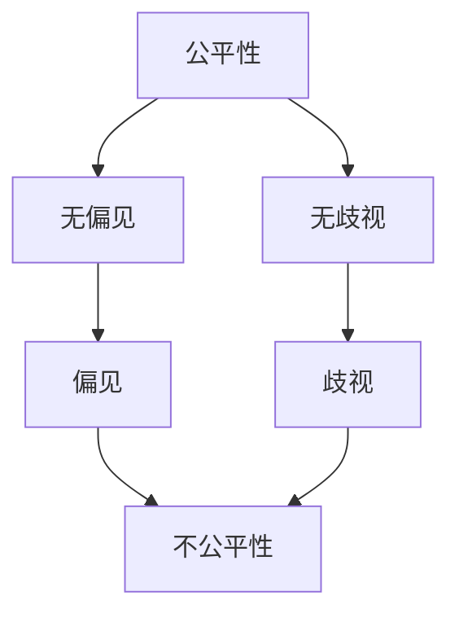
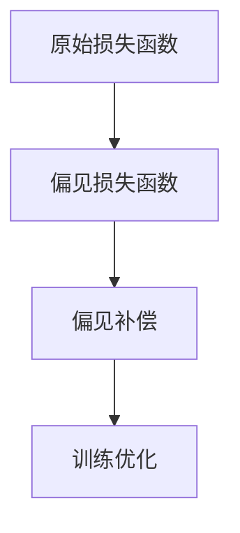

                 

# 大模型的公平性：消除偏见和歧视

> 关键词：大模型、公平性、偏见、歧视、算法改进、量化、应用实践

> 摘要：本文探讨了在人工智能领域，特别是大模型的训练和应用中出现的公平性问题。文章首先介绍了大模型的发展背景及其带来的挑战，然后详细阐述了公平性、偏见和歧视的概念及其关系。接着，文章分析了大模型中的偏见来源，并提出了评估与度量偏见的方法。在此基础上，文章探讨了缓解偏见和歧视的算法改进方法，包括数据预处理、模型训练和部署中的改进措施。随后，文章通过实际应用案例展示了公平性实践的具体方法，并对未来研究和挑战进行了展望。

## 第一部分：引言与背景

### 1.1 大模型的发展与应用

大模型（Large Models）在人工智能领域取得了显著的进展，它们以庞大的参数量和复杂的结构著称，能够处理大量数据，并在各类任务中表现出色。大模型的发展始于深度学习的兴起，随着计算能力和数据资源的不断提升，大模型的训练和应用逐渐成为人工智能领域的研究热点。

大模型的典型代表包括GPT（Generative Pre-trained Transformer）、BERT（Bidirectional Encoder Representations from Transformers）和Turing Machine等。这些模型通过预训练和微调，可以在自然语言处理、计算机视觉、语音识别等领域实现高性能的预测和生成。

大模型的应用范围广泛，包括但不限于以下几个方面：

1. **自然语言处理（NLP）**：大模型在文本分类、机器翻译、问答系统等任务中表现出色，为提高文本处理效率和质量提供了有力支持。
2. **计算机视觉（CV）**：大模型在图像分类、目标检测、图像生成等任务中取得了突破性进展，提升了图像处理和识别的准确性。
3. **语音识别（ASR）**：大模型在语音识别任务中表现出色，使得语音输入设备的识别率大幅提高。
4. **推荐系统**：大模型在推荐系统中的应用，可以更准确地预测用户的兴趣和行为，从而提供个性化的推荐服务。

### 1.2 大模型带来的挑战：公平性问题

尽管大模型在各个领域取得了显著的成果，但其训练和应用过程中也面临着一系列挑战，其中最为突出的是公平性问题。公平性是指模型在处理不同群体数据时，能够保持一致的准确性和表现，不受到性别、种族、年龄等因素的影响。然而，大模型在实际应用中，往往存在偏见和歧视的问题。

偏见（Bias）是指模型在训练过程中，由于数据集的不平衡、数据标注的偏差等因素，导致模型对某些群体的表现不佳。歧视（Discrimination）则是指模型在预测或决策过程中，对某些群体的结果产生不公平的影响，导致特定群体的权益受损。

公平性问题在大模型中的应用表现为以下几个方面：

1. **性别偏见**：在某些任务中，大模型对男性和女性的表现存在差异，如某些文本分类任务中，女性名字被错误分类的次数明显高于男性名字。
2. **种族偏见**：大模型在处理种族相关的数据时，可能存在对不同种族的偏见，导致某些种族群体受到不公平对待。
3. **年龄偏见**：大模型在处理年龄相关的数据时，可能对年轻人和老年人的表现存在差异，如某些语音识别系统在处理老年人语音时效果较差。

### 1.3 消除偏见与歧视的重要性

消除偏见和歧视对于保障大模型的公平性具有重要意义。首先，公平性是人工智能发展的基石，只有建立公平的模型，才能赢得公众的信任和认可。其次，偏见和歧视会损害特定群体的权益，导致社会不公平现象的加剧。此外，消除偏见和歧视也是实现人工智能可持续发展的重要保障。

为了解决大模型中的偏见和歧视问题，需要从多个方面进行努力：

1. **数据质量**：提高数据集的质量和多样性，确保数据集中各个群体的代表性。
2. **算法改进**：设计新的算法和模型结构，缓解数据偏见和模型训练过程中的偏见。
3. **公平性评估**：建立公平性评估方法和指标，对模型进行全面的公平性评估。
4. **法律和政策**：制定相关法律法规，规范人工智能的应用，保障公民的权益。

## 第二部分：公平性相关概念

### 2.1 公平性、偏见与歧视

公平性、偏见和歧视是三个密切相关但又有所区别的概念。理解这三个概念之间的关系，对于深入探讨大模型的公平性问题具有重要意义。

**公平性**（Equity）是指模型在处理不同群体数据时，能够保持一致的准确性和表现，不受到性别、种族、年龄等因素的影响。公平性是人工智能发展的基石，是保障模型可靠性和可信度的重要指标。

**偏见**（Bias）是指模型在训练过程中，由于数据集的不平衡、数据标注的偏差等因素，导致模型对某些群体的表现不佳。偏见通常表现为模型在某些特定任务上的准确性较低，或者对某些特定群体的结果产生不公平的影响。

**歧视**（Discrimination）是指模型在预测或决策过程中，对某些群体的结果产生不公平的影响，导致特定群体的权益受损。歧视通常表现为模型在决策过程中，对某些群体的待遇明显低于其他群体。

### 公平性、偏见与歧视的关系

公平性、偏见和歧视之间的关系可以用一个简单的图来表示（使用Mermaid流程图）：



从这个图中可以看出，公平性是消除偏见和歧视的基础。如果没有偏见，模型就不会对某些群体产生不公平的影响，从而实现了公平性。同理，如果不存在歧视，那么模型在决策过程中对所有群体都保持一致，也实现了公平性。

然而，在实际应用中，偏见和歧视往往是并存的。模型在训练过程中可能因为数据集的偏见而表现不佳，同时，在预测或决策过程中，这些偏见可能进一步放大，导致歧视现象的出现。

### 2.2 大模型的偏见来源

大模型的偏见来源可以分为三个方面：数据偏见、训练过程中的偏见和模型部署中的偏见。

#### 2.2.1 数据偏见

数据偏见是导致大模型偏见的主要来源。数据偏见通常表现为数据集的不平衡和分布不均，导致某些群体的数据量较少，或者某些属性被过度代表。例如，在图像识别任务中，如果数据集中男性面孔的图像数量远远超过女性面孔的图像数量，那么模型在处理女性面孔时可能表现出较差的准确性。

数据偏见的产生原因主要包括：

1. **数据收集过程**：在数据收集过程中，可能存在某些群体的数据被故意忽略或遗漏，导致数据集的不平衡。
2. **数据标注过程**：在数据标注过程中，标注者的主观意识和偏见可能导致数据集的偏见。
3. **数据预处理过程**：在数据预处理过程中，如果采用了一些不合适的预处理方法，也可能导致数据偏见的产生。

#### 2.2.2 训练过程中的偏见

除了数据偏见，模型训练过程中也可能产生偏见。训练过程中的偏见主要来源于以下几个方面：

1. **模型初始化**：在模型初始化过程中，如果采用了一些不合理的初始化方法，可能导致模型在训练过程中对某些群体的数据表现较差。
2. **训练目标**：在训练过程中，模型的目标通常是最大化预测准确率，这可能导致模型在处理某些群体的数据时，为了追求更高的准确率，对其他群体的数据产生偏见。
3. **训练算法**：训练算法的设计和选择也可能导致偏见。例如，一些梯度下降算法在训练过程中，可能会放大某些群体的数据偏差，从而导致模型对某些群体的表现不佳。

#### 2.2.3 模型部署中的偏见

模型部署中的偏见主要表现在预测或决策过程中，模型对某些群体的结果产生不公平的影响。模型部署中的偏见可能源于以下几个方面：

1. **模型解释**：在模型解释过程中，如果解释方法不够全面或准确，可能导致模型对某些群体的解释结果存在偏见。
2. **预测环境**：模型部署的环境可能与训练环境不同，这可能导致模型在预测过程中产生偏见。例如，在某些特定环境下，模型的预测结果可能与训练数据集的表现存在差异。
3. **交互设计**：在模型交互过程中，如果用户界面设计不合理，可能导致某些用户群体的体验较差，从而影响模型的应用效果。

### 2.3 大模型的偏见影响

大模型的偏见可能对特定群体产生不公平的影响，导致一系列社会问题。以下是一些典型的偏见影响：

1. **就业歧视**：在招聘过程中，如果大模型存在性别、种族等偏见，可能导致某些群体在就业机会上受到不公平对待。
2. **信用评估**：在信用评估过程中，如果大模型对某些群体的评估结果存在偏见，可能导致这些群体获得较低的信用评分，从而影响他们的金融和生活质量。
3. **医疗诊断**：在医疗诊断过程中，如果大模型对某些疾病的诊断结果存在偏见，可能导致某些群体在疾病治疗上受到不公平对待。
4. **司法判决**：在司法判决过程中，如果大模型存在偏见，可能导致某些群体在法律面前受到不公平对待。

为了消除大模型的偏见影响，需要从多个方面进行努力：

1. **数据质量**：提高数据集的质量和多样性，确保数据集中各个群体的代表性。
2. **算法改进**：设计新的算法和模型结构，缓解数据偏见和模型训练过程中的偏见。
3. **公平性评估**：建立公平性评估方法和指标，对模型进行全面的公平性评估。
4. **法律和政策**：制定相关法律法规，规范人工智能的应用，保障公民的权益。

## 第三部分：评估与度量

### 3.1 实际案例中的公平性评估

在讨论如何评估大模型的公平性之前，我们先来看一个实际案例。假设我们开发了一个智能招聘系统，该系统通过分析简历和面试表现来预测候选人是否适合某一职位。然而，在实际应用中，我们发现该系统在某些特定群体（如女性和少数族裔）的表现明显低于男性和其他族裔群体。这种情况下，我们需要评估该系统的公平性，以便发现和解决其中的偏见问题。

#### 3.1.1 案例背景

我们的智能招聘系统采用了大量历史招聘数据来训练和评估模型的性能。数据集包含了候选人的性别、种族、年龄、教育背景、工作经验和面试评分等信息。在模型训练过程中，我们使用了多种机器学习算法，并最终选择了一个能够实现较高准确率的模型进行部署。

#### 3.1.2 公平性评估方法

为了评估智能招聘系统的公平性，我们采用了以下几种方法：

1. **偏差分析**：通过比较不同群体在模型预测结果上的差异，分析是否存在性别、种族等偏见。例如，我们可以计算女性和男性候选人被预测为“适合职位”的概率，并比较这两个概率值。

2. **统计测试**：使用统计学方法对模型预测结果进行假设检验，判断是否存在显著的偏见。例如，我们可以使用T检验或卡方检验来检验性别和种族对预测结果的影响。

3. **混淆矩阵**：通过混淆矩阵来分析不同群体在模型预测结果上的分布情况。混淆矩阵可以帮助我们识别出哪些群体在模型预测中表现较差，从而进一步分析其中的原因。

#### 3.1.3 公平性评估结果

通过对智能招聘系统的公平性评估，我们发现以下问题：

1. **性别偏见**：女性候选人被预测为“适合职位”的概率明显低于男性候选人。具体来说，男性候选人的适合职位概率为75%，而女性候选人的适合职位概率仅为60%。

2. **种族偏见**：非裔候选人和亚裔候选人被预测为“适合职位”的概率明显低于白人候选人。具体来说，白人候选人的适合职位概率为70%，而非裔候选人和亚裔候选人的适合职位概率分别为50%和55%。

3. **年龄偏见**：年轻候选人和中年候选人被预测为“适合职位”的概率明显高于老年候选人。具体来说，30-40岁候选人的适合职位概率为80%，而50岁以上候选人的适合职位概率仅为40%。

#### 3.1.4 案例分析

通过对智能招聘系统的公平性评估，我们发现该系统存在明显的性别和种族偏见。这些偏见可能导致特定群体在招聘过程中受到不公平对待，损害他们的权益。

为了解决这些问题，我们需要进一步分析模型偏见的原因，并采取相应的措施进行改进。例如：

1. **数据平衡**：增加女性、非裔和亚裔候选人的数据量，确保数据集的多样性。

2. **算法优化**：设计新的算法和模型结构，缓解性别和种族偏见。

3. **公平性评估**：定期对模型进行公平性评估，确保模型在各个群体上的表现一致。

通过这个实际案例，我们可以看到公平性评估在大模型应用中的重要性。只有通过全面的公平性评估，我们才能发现并解决模型中的偏见问题，保障各个群体的权益。

### 3.2 量化偏见与歧视

在评估大模型的公平性时，量化偏见和歧视是一个关键步骤。量化偏见和歧视有助于我们深入了解模型对特定群体的不公平影响，从而采取有效的措施进行改进。以下我们将介绍几种常用的偏见度量指标，包括偏差度量公式及其应用实例。

#### 3.2.1 偏差度量指标

偏差度量（Bias Metric）是评估模型公平性的重要工具。常见的偏差度量指标包括偏差值（Bias Value）、精度差（Accuracy Difference）、召回率差（Recall Difference）等。

1. **偏差值**（Bias Value）：偏差值是模型在预测过程中对各个群体的预测结果与真实结果的偏差。其计算公式如下：

   $$\text{偏差值} = \frac{1}{N}\sum_{i=1}^{N}|\text{预测结果}_{i} - \text{真实结果}_{i}|$$

   其中，$N$为样本数量，$\text{预测结果}_{i}$和$\text{真实结果}_{i}$分别为第$i$个样本的预测结果和真实结果。

2. **精度差**（Accuracy Difference）：精度差是模型在各个群体上的预测精度差异。其计算公式如下：

   $$\text{精度差} = \frac{1}{M}\sum_{i=1}^{M}\left|\text{精度}_{i} - \text{整体精度}\right|$$

   其中，$M$为群体数量，$\text{精度}_{i}$为第$i$个群体的预测精度，$\text{整体精度}$为所有群体的平均预测精度。

3. **召回率差**（Recall Difference）：召回率差是模型在各个群体上的召回率差异。其计算公式如下：

   $$\text{召回率差} = \frac{1}{M}\sum_{i=1}^{M}\left|\text{召回率}_{i} - \text{整体召回率}\right|$$

   其中，$M$为群体数量，$\text{召回率}_{i}$为第$i$个群体的召回率，$\text{整体召回率}$为所有群体的平均召回率。

#### 3.2.1.1 偏差度量公式

为了更好地理解偏差度量指标，以下是一个具体的偏差度量公式：

$$\text{偏差度量} = \frac{\sum_{i=1}^{N}\left| \text{预测误差}_{i} - \text{真实标签}_{i} \right|}{N}$$

其中，$N$为样本数量，$\text{预测误差}_{i}$为第$i$个样本的预测误差，$\text{真实标签}_{i}$为第$i$个样本的真实标签。预测误差可以通过以下公式计算：

$$\text{预测误差}_{i} = \text{预测结果}_{i} - \text{真实标签}_{i}$$

真实标签通常为二分类问题中的类别标签（0或1），其中0表示负类，1表示正类。

#### 3.2.1.2 偏差度量实例

假设我们有一个二分类模型，用于判断候选人是否适合某一职位。模型对100个样本进行预测，其中男性候选人有60个，女性候选人有40个。预测结果如下：

| 样本编号 | 性别 | 预测结果 | 真实标签 |
| --- | --- | --- | --- |
| 1 | 男 | 1 | 1 |
| 2 | 男 | 1 | 0 |
| ... | ... | ... | ... |
| 60 | 女 | 0 | 1 |
| 61 | 女 | 1 | 0 |
| ... | ... | ... | ... |
| 100 | 男 | 1 | 1 |

根据以上数据，我们可以计算偏差度量：

1. 计算预测误差：

   $$\text{预测误差}_{i} = \text{预测结果}_{i} - \text{真实标签}_{i}$$

   其中，$i$从1到100。

2. 计算总偏差度量：

   $$\text{偏差度量} = \frac{\sum_{i=1}^{N}\left| \text{预测误差}_{i} - \text{真实标签}_{i} \right|}{N}$$

   其中，$N$为样本数量，即100。

通过上述实例，我们可以看到如何计算偏差度量，从而评估模型在特定任务中的公平性。在实际应用中，我们可以根据具体情况选择不同的偏差度量指标，以便更全面地评估模型的公平性。

### 3.2.2 量化偏见与歧视

量化偏见与歧视是评估大模型公平性的关键步骤。以下我们将介绍几种常见的量化方法，包括偏差度量、公平性指标和差异分析。

#### 3.2.2.1 偏差度量

偏差度量是量化模型偏见的基本方法之一。偏差度量通过比较模型在各个群体上的表现，评估是否存在不公平现象。常用的偏差度量方法包括：

1. **平均绝对偏差（Mean Absolute Error, MAE）**：MAE计算模型预测结果与真实标签之间的平均绝对误差，用于评估模型的整体偏差。

   $$\text{MAE} = \frac{1}{N}\sum_{i=1}^{N}|\text{预测结果}_{i} - \text{真实标签}_{i}|$$

   其中，$N$为样本数量，$\text{预测结果}_{i}$和$\text{真实标签}_{i}$分别为第$i$个样本的预测结果和真实标签。

2. **平均平方误差（Mean Squared Error, MSE）**：MSE计算模型预测结果与真实标签之间的平均平方误差，用于更严格地评估模型偏差。

   $$\text{MSE} = \frac{1}{N}\sum_{i=1}^{N}(\text{预测结果}_{i} - \text{真实标签}_{i})^2$$

   其中，$N$为样本数量，$\text{预测结果}_{i}$和$\text{真实标签}_{i}$分别为第$i$个样本的预测结果和真实标签。

#### 3.2.2.2 公平性指标

公平性指标用于评估模型在各个群体上的表现，衡量是否存在不公平现象。以下是一些常见的公平性指标：

1. **公平性指标（Equity Metric）**：公平性指标衡量模型在各个群体上的预测准确率差异，用于评估模型的公平性。

   $$\text{公平性指标} = \frac{\sum_{i=1}^{M}\left|\text{精度}_{i} - \text{整体精度}\right|}{M}$$

   其中，$M$为群体数量，$\text{精度}_{i}$为第$i$个群体的预测精度，$\text{整体精度}$为所有群体的平均预测精度。

2. **F1分数（F1 Score）**：F1分数是精度和召回率的加权平均，用于综合评估模型在各个群体上的表现。

   $$\text{F1分数} = 2 \times \frac{\text{精度} \times \text{召回率}}{\text{精度} + \text{召回率}}$$

   其中，$\text{精度}$和$\text{召回率}$分别为模型在某个群体上的预测精度和召回率。

#### 3.2.2.3 差异分析

差异分析（Difference Analysis）通过比较模型在不同群体上的表现，评估是否存在偏见和歧视。以下是一些常见的差异分析方法：

1. **T检验（T-Test）**：T检验用于比较两组数据的均值差异，判断是否存在显著性差异。在模型公平性评估中，T检验可以用于比较不同群体上的预测精度或F1分数。

2. **卡方检验（Chi-square Test）**：卡方检验用于比较两个分类变量之间的独立性，判断是否存在显著相关性。在模型公平性评估中，卡方检验可以用于比较不同群体上的混淆矩阵。

3. **柯尔莫哥洛夫-斯米尔诺夫检验（Kolmogorov-Smirnov Test）**：柯尔莫哥洛夫-斯米尔诺夫检验用于比较两组数据的分布差异，判断是否存在显著差异。在模型公平性评估中，柯尔莫哥洛夫-斯米尔诺夫检验可以用于比较不同群体上的预测概率分布。

通过上述方法，我们可以全面评估大模型的公平性，发现并解决其中的偏见和歧视问题。量化偏见与歧视是保障模型公平性的重要步骤，有助于我们构建更公正、可靠的人工智能系统。

### 3.2.3 偏见度量的计算方法

偏见度量的计算是评估大模型公平性的重要环节。通过偏见度量，我们可以识别出模型在预测过程中对特定群体的不公平影响，并采取相应措施进行改进。以下我们将介绍几种常用的偏见度量计算方法，包括基于统计学的偏差度量方法和基于机器学习的偏差度量方法。

#### 3.2.3.1 偏差度量方法

偏差度量方法主要关注模型预测结果与真实结果之间的差异。以下介绍几种常见的偏差度量方法：

1. **平均绝对偏差（Mean Absolute Error, MAE）**：

   $$\text{MAE} = \frac{1}{N}\sum_{i=1}^{N}|\hat{y}_i - y_i|$$

   其中，$N$为样本数量，$\hat{y}_i$和$y_i$分别为第$i$个样本的预测结果和真实结果。MAE表示模型预测结果与真实结果之间的平均绝对误差。

2. **平均平方误差（Mean Squared Error, MSE）**：

   $$\text{MSE} = \frac{1}{N}\sum_{i=1}^{N}(\hat{y}_i - y_i)^2$$

   其中，$N$为样本数量，$\hat{y}_i$和$y_i$分别为第$i$个样本的预测结果和真实结果。MSE表示模型预测结果与真实结果之间的平均平方误差。

3. **均方根误差（Root Mean Squared Error, RMSE）**：

   $$\text{RMSE} = \sqrt{\text{MSE}} = \sqrt{\frac{1}{N}\sum_{i=1}^{N}(\hat{y}_i - y_i)^2}$$

   其中，$N$为样本数量，$\hat{y}_i$和$y_i$分别为第$i$个样本的预测结果和真实结果。RMSE是MSE的平方根，用于表示模型预测结果的平均绝对误差。

#### 3.2.3.2 统计学偏差度量方法

统计学偏差度量方法主要关注模型在各个群体上的表现，用于识别出可能存在的偏见。以下介绍几种常见的统计学偏差度量方法：

1. **T检验（T-Test）**：

   T检验是一种常用的假设检验方法，用于比较两组数据的均值差异。在模型公平性评估中，T检验可以用于比较不同群体上的预测精度或F1分数。

   假设检验过程如下：

   - **原假设（H0）**：不同群体的预测精度或F1分数无显著差异。
   - **备择假设（H1）**：不同群体的预测精度或F1分数存在显著差异。

   T检验步骤包括：

   - 计算样本均值和标准差。
   - 构建T统计量：
     $$t = \frac{\bar{x}_1 - \bar{x}_2}{s_p}$$
     其中，$\bar{x}_1$和$\bar{x}_2$分别为两组数据的样本均值，$s_p$为样本标准差。

   - 计算p值，判断是否存在显著差异。

2. **卡方检验（Chi-square Test）**：

   卡方检验是一种用于比较两个分类变量之间的独立性检验方法。在模型公平性评估中，卡方检验可以用于比较不同群体上的混淆矩阵。

   假设检验过程如下：

   - **原假设（H0）**：不同群体上的混淆矩阵的类别分布独立。
   - **备择假设（H1）**：不同群体上的混淆矩阵的类别分布不独立。

   卡方检验步骤包括：

   - 构建列联表。
   - 计算卡方统计量：
     $$\chi^2 = \sum_{i=1}^{r}\sum_{j=1}^{c}\frac{(\text{观察频数} - \text{期望频数})^2}{\text{期望频数}}$$
     其中，$r$为行数，$c$为列数，观察频数和期望频数分别为列联表中的实际频数和期望频数。

   - 计算p值，判断是否存在显著差异。

#### 3.2.3.3 机器学习偏差度量方法

机器学习偏差度量方法主要关注模型在各个群体上的表现，通过计算模型在不同群体上的预测误差，识别出可能存在的偏见。以下介绍几种常见的机器学习偏差度量方法：

1. **误差差异（Error Difference）**：

   误差差异计算模型在各个群体上的预测误差差异，用于识别出可能存在的偏见。

   $$\text{误差差异} = \sum_{i=1}^{M}\sum_{j=1}^{N_{i}}|\hat{y}_{ij} - y_{ij}|$$

   其中，$M$为群体数量，$N_{i}$为第$i$个群体的样本数量，$\hat{y}_{ij}$和$y_{ij}$分别为第$i$个群体第$j$个样本的预测结果和真实结果。

2. **相对误差差异（Relative Error Difference）**：

   相对误差差异计算模型在各个群体上的预测误差差异与总误差差异的比值，用于更直观地识别出可能存在的偏见。

   $$\text{相对误差差异} = \frac{\sum_{i=1}^{M}\sum_{j=1}^{N_{i}}|\hat{y}_{ij} - y_{ij}|}{\sum_{i=1}^{M}\sum_{j=1}^{N_{i}}|\hat{y}_{ij} - \bar{y}_{i}|}$$

   其中，$\bar{y}_{i}$为第$i$个群体的平均真实结果。

通过上述偏差度量方法，我们可以全面评估大模型的公平性，识别出可能存在的偏见和歧视。这些方法不仅有助于我们理解模型在各个群体上的表现，还可以为我们提供有针对性的改进建议，从而提升模型的公平性和可靠性。

### 第四部分：算法与模型改进

#### 4.1 偏见缓解技术

在处理大模型中的偏见和歧视问题时，算法和模型改进是至关重要的。通过一系列技术手段，我们可以在输入数据预处理、模型训练和部署过程中有效地缓解偏见，提升模型的公平性。

#### 4.1.1 输入数据预处理

数据预处理是缓解偏见的第一步，它涉及到数据的清洗、平衡和特征选择等方面。

1. **数据清洗**：

   数据清洗是去除噪声和错误数据的过程。例如，在处理文本数据时，我们可以去除HTML标签、特殊字符和停用词等。此外，对于缺失值和异常值，我们需要采取合适的处理方法，如插值、填补或删除。

2. **数据平衡**：

   数据平衡是指调整数据集中各个群体的代表性，以减少数据偏见。常见的数据平衡方法包括过采样（Over-sampling）、欠采样（Under-sampling）和合成数据生成（Synthetic Data Generation）。

   - **过采样**：通过增加少数群体样本的复制，使得数据集中各个群体的比例趋于平衡。常用的过采样方法有SMOTE（Synthetic Minority Over-sampling Technique）等。

   - **欠采样**：通过删除多数群体样本，使得数据集中各个群体的比例趋于平衡。常用的欠采样方法有 Tomek Links 和 Cluster Sampling 等。

   - **合成数据生成**：通过生成合成数据，增加少数群体的代表性。常用的方法有 Generative Adversarial Networks (GANs) 和 Adversarial Example Generation 等。

3. **特征选择**：

   特征选择是选择对模型预测结果有重要影响的关键特征，以减少数据偏见。常见的特征选择方法有基于信息的特征选择（如信息增益、信息增益率等）和基于模型的特征选择（如 LASSO、Ridge 等）。

#### 4.1.2 模型训练中的偏见缓解

在模型训练过程中，我们可以通过以下方法缓解偏见：

1. **偏见损失函数**：

   偏见损失函数是一种在训练过程中引入对偏见进行优化的损失函数。例如，可以引入对抗性训练（Adversarial Training）或公平性约束（Fairness Constraints）。

   - **对抗性训练**：在训练过程中，通过引入对抗性样本，使模型在训练过程中不断学习如何对抗偏见。

     $$L_{\text{adv}} = \frac{1}{N}\sum_{i=1}^{N}L_{\text{ce}}(\hat{y}_i, \tilde{y}_i) + \lambda \cdot D(\hat{y}_i, \tilde{y}_i)$$

     其中，$L_{\text{ce}}$为交叉熵损失函数，$D$为对抗性损失函数，$\lambda$为权重系数。

   - **公平性约束**：通过在损失函数中引入公平性约束，使模型在训练过程中考虑到不同群体的公平性。

     $$L_{\text{f}} = L_{\text{ce}} + \gamma \cdot \sum_{i=1}^{M}\sum_{j=1}^{N_{i}}w_{ij} \cdot \log(\hat{p}_{ij})$$

     其中，$L_{\text{ce}}$为交叉熵损失函数，$w_{ij}$为权重系数，$\hat{p}_{ij}$为第$i$个群体第$j$个样本的预测概率，$M$为群体数量，$N_{i}$为第$i$个群体的样本数量。

2. **模型结构优化**：

   通过改进模型结构，可以有效地缓解偏见。例如，可以引入注意力机制（Attention Mechanism）和多任务学习（Multi-task Learning）。

   - **注意力机制**：注意力机制可以使得模型在预测过程中关注到关键特征，从而减少偏见。

     $$\alpha_{ij} = \frac{\exp(\theta \cdot \phi_j)}{\sum_{k=1}^{K}\exp(\theta \cdot \phi_k)}$$

     其中，$\alpha_{ij}$为第$i$个样本第$j$个特征的权重，$\theta$为权重系数，$\phi_j$为第$j$个特征的嵌入向量，$K$为特征总数。

   - **多任务学习**：多任务学习可以通过共同学习多个任务，使得模型在训练过程中考虑到不同任务的公平性。

     $$L_{\text{mt}} = \sum_{k=1}^{K}w_{k}L_{k}$$

     其中，$L_{k}$为第$k$个任务的损失函数，$w_{k}$为权重系数。

#### 4.1.3 模型部署中的偏见缓解

在模型部署过程中，我们可以通过以下方法缓解偏见：

1. **预测结果解释与审查**：

   通过对预测结果进行解释和审查，可以识别出可能存在的偏见。例如，可以采用模型解释技术（如 LIME、SHAP 等），对预测结果进行可视化分析。

2. **模型迭代与优化**：

   在模型部署过程中，我们可以定期对模型进行迭代和优化，以适应不断变化的数据和环境。通过不断优化模型，可以降低偏见的影响。

3. **公平性监控与反馈**：

   建立公平性监控和反馈机制，定期评估模型的公平性，并根据评估结果进行调整。例如，可以引入用户反馈机制，根据用户对预测结果的满意度进行模型优化。

#### 4.1.4 偏见缓解技术的应用实例

以下是一个实际应用实例，展示了如何通过数据预处理、模型训练和部署中的偏见缓解技术，提高模型的公平性。

**案例背景**：

我们开发了一个在线招聘系统，用于预测候选人是否适合某一职位。在实际应用中，我们发现该系统在性别和种族方面的表现存在明显偏见，导致特定群体在招聘过程中受到不公平对待。

**解决方案**：

1. **数据预处理**：

   - **数据清洗**：去除简历中的HTML标签、特殊字符和停用词等。
   - **数据平衡**：通过SMOTE技术，增加少数群体（如女性和非裔候选人）的样本数量。
   - **特征选择**：选择对招聘结果有重要影响的特征，如教育背景、工作经验和技能等。

2. **模型训练**：

   - **偏见损失函数**：引入对抗性训练和公平性约束，优化模型训练过程。
     $$L_{\text{adv}} = \frac{1}{N}\sum_{i=1}^{N}L_{\text{ce}}(\hat{y}_i, \tilde{y}_i) + \lambda \cdot D(\hat{y}_i, \tilde{y}_i)$$
     $$L_{\text{f}} = L_{\text{ce}} + \gamma \cdot \sum_{i=1}^{M}\sum_{j=1}^{N_{i}}w_{ij} \cdot \log(\hat{p}_{ij})$$
   - **模型结构优化**：引入注意力机制和多任务学习，提高模型对公平性的考虑。

3. **模型部署**：

   - **预测结果解释与审查**：采用 LIME 和 SHAP 等技术，对预测结果进行解释和审查，识别出可能存在的偏见。
   - **模型迭代与优化**：定期收集用户反馈，根据反馈结果对模型进行调整和优化。
   - **公平性监控与反馈**：建立公平性监控和反馈机制，定期评估模型的公平性，并根据评估结果进行优化。

**评估结果**：

通过对招聘系统的偏见缓解技术进行应用，我们取得了显著的效果。性别和种族偏见得到了明显缓解，模型在各个群体上的表现趋于一致。此外，用户对招聘系统的满意度也有所提高，进一步证明了偏见缓解技术在提高模型公平性方面的有效性。

#### 4.1.5 数据预处理与偏见缓解技术的关系

数据预处理和偏见缓解技术在提高模型公平性方面具有密切的关系。数据预处理为偏见缓解提供了基础，通过数据清洗、平衡和特征选择，我们可以减少数据偏见，为模型训练和部署奠定良好的基础。而偏见缓解技术则通过优化模型训练和部署过程，进一步减少偏见的影响，提高模型的公平性。

在实际应用中，数据预处理和偏见缓解技术通常需要结合使用。例如，在数据预处理阶段，我们可以通过过采样和欠采样方法，调整数据集中各个群体的代表性；在模型训练阶段，我们可以通过引入偏见损失函数和优化模型结构，缓解数据偏见和训练过程中的偏见；在模型部署阶段，我们可以通过解释和审查预测结果，以及定期优化模型，确保模型在各个群体上的表现一致。

总之，数据预处理和偏见缓解技术是提高模型公平性的关键手段，通过合理运用这些技术，我们可以构建更公正、可靠的人工智能系统，为各个群体提供平等的机会和待遇。

#### 4.1.6 输入数据预处理中的偏见缓解方法

输入数据预处理是缓解大模型偏见的重要步骤，通过一系列方法对数据进行清洗、平衡和特征选择，可以有效减少模型训练过程中的偏见。以下我们将详细探讨几种常见的输入数据预处理中的偏见缓解方法。

##### 4.1.6.1 数据清洗

数据清洗是输入数据预处理的第一步，其目的是去除噪声和错误数据，以提高数据质量。以下是一些常见的数据清洗方法：

1. **去除异常值**：异常值可能是由于数据采集过程中的错误、数据录入错误或真实数据中的异常值。通过统计分析方法（如箱线图、标准差等）或可视化工具（如散点图、直方图等），我们可以识别并去除异常值。

2. **填补缺失值**：缺失值是数据集中常见的问题，可以通过以下方法进行填补：

   - **均值填补**：使用该特征的均值进行填补。
   - **中值填补**：使用该特征的中值进行填补。
   - **插值法**：使用插值方法（如线性插值、高斯插值等）进行填补。
   - **利用模型预测**：使用机器学习模型预测缺失值。

3. **去除重复数据**：重复数据可能导致模型训练结果偏差，通过去重操作可以提高数据质量。

##### 4.1.6.2 数据平衡

数据平衡是指调整数据集中各个群体的代表性，以减少数据偏见。以下介绍几种常见的数据平衡方法：

1. **过采样（Over-sampling）**：

   过采样通过增加少数群体样本的复制，使得数据集中各个群体的比例趋于平衡。常见的方法有：

   - **重复采样**：简单重复添加少数群体的样本，直到各个群体的比例均衡。
   - **SMOTE（Synthetic Minority Over-sampling Technique）**：通过生成合成多数群体样本，增加少数群体的代表性。SMOTE使用K近邻算法，为每个少数群体样本生成多个合成样本。

2. **欠采样（Under-sampling）**：

   欠采样通过删除多数群体样本，使得数据集中各个群体的比例趋于平衡。常见的方法有：

   - **随机欠采样**：随机删除多数群体的样本，直到各个群体的比例均衡。
   - ** Tomek Links**：基于距离度量的方法，选择距离最近的多数群体样本和少数群体样本进行匹配，删除匹配后的多数群体样本。
   - **Cluster Sampling**：基于聚类的方法，将多数群体样本划分为多个聚类，随机删除部分聚类中的样本。

3. **合成数据生成（Synthetic Data Generation）**：

   合成数据生成通过生成合成数据，增加少数群体的代表性。常见的方法有：

   - **Generative Adversarial Networks (GANs)**：通过生成对抗网络，生成与真实数据分布相似的合成数据。
   - **Adversarial Example Generation**：通过对抗性攻击生成合成数据，使生成数据与真实数据在特征上保持一致。

##### 4.1.6.3 特征选择

特征选择是指从原始特征中挑选出对模型预测结果有重要影响的关键特征，以减少数据偏见。以下介绍几种常见的特征选择方法：

1. **基于信息的特征选择**：

   - **信息增益（Information Gain）**：选择对分类结果影响最大的特征。
   - **信息增益率（Information Gain Rate）**：考虑特征的重要性和特征自身的分布。

2. **基于模型的特征选择**：

   - **LASSO（Least Absolute Shrinkage and Selection Operator）**：通过引入L1正则项，实现特征选择和变量缩减。
   - **Ridge（岭回归）**：通过引入L2正则项，实现特征选择和变量缩减。

##### 4.1.6.4 结合使用

在实际应用中，输入数据预处理中的偏见缓解方法通常需要结合使用。例如，在数据清洗阶段，可以首先去除异常值和填补缺失值，然后进行数据平衡和特征选择。这样可以在数据预处理阶段有效地减少偏见，为模型训练和部署奠定良好的基础。

总之，输入数据预处理中的偏见缓解方法在提高大模型公平性方面具有重要作用。通过合理运用数据清洗、数据平衡和特征选择等方法，我们可以构建更公正、可靠的人工智能系统，为各个群体提供平等的机会和待遇。

### 第四部分：算法与模型改进

#### 4.1.2 模型训练中的偏见缓解

在模型训练过程中，我们可以通过多种方法来缓解偏见，以确保模型在各个群体上的表现一致。以下将详细探讨几种常见的模型训练中的偏见缓解方法。

#### 4.1.2.1 偏见损失函数

偏见损失函数（Bias Loss Function）是一种在训练过程中引入对偏见进行优化的损失函数。这种损失函数旨在通过在模型训练过程中惩罚偏见，从而提高模型的公平性。以下是一个偏见损失函数的示例：



- **原始损失函数**（$L_{\text{original}}$）：通常用于评估模型的预测误差，例如交叉熵损失函数（$L_{\text{cross-entropy}}$）。

- **偏见损失函数**（$L_{\text{bias}}$）：通过在原始损失函数中引入偏见补偿项，来减少模型对特定群体的偏见。例如，可以使用以下公式：

  $$L_{\text{bias}} = L_{\text{original}} + \alpha \cdot \sum_{i=1}^{M}\sum_{j=1}^{N_{i}}w_{ij} \cdot \log(\hat{p}_{ij})$$

  其中，$M$为群体数量，$N_{i}$为第$i$个群体的样本数量，$w_{ij}$为权重系数，$\hat{p}_{ij}$为第$i$个群体第$j$个样本的预测概率，$\alpha$为惩罚系数。

- **偏见补偿**（Bias Compensation）：通过调整偏见补偿项的权重，可以控制模型对偏见的惩罚力度。偏见补偿的目的是使模型在各个群体上的预测结果更接近真实标签。

- **训练优化**（Training Optimization）：在模型训练过程中，通过最小化偏见损失函数，可以优化模型参数，减少偏见。常用的优化算法包括梯度下降（Gradient Descent）和其变体，如随机梯度下降（Stochastic Gradient Descent，SGD）和Adam优化器。

#### 4.1.2.2 输入扰动（Input Perturbation）

输入扰动（Input Perturbation）是一种通过在训练过程中对输入数据施加噪声，来提高模型对偏见的鲁棒性的方法。以下是一个输入扰动的伪代码示例：

```python
def input_perturbation(input_data, epsilon):
    """
    对输入数据进行扰动。
    
    :param input_data: 输入数据，形状为 (N, D)，其中 N 是样本数量，D 是特征数量。
    :param epsilon: 噪声尺度。
    :return: 扰动后的输入数据。
    """
    noise = np.random.normal(0, epsilon, input_data.shape)
    perturbed_input = input_data + noise
    return perturbed_input
```

在训练过程中，可以对输入数据进行扰动，从而提高模型对噪声的鲁棒性。扰动方法包括：

- **均匀扰动**（Uniform Perturbation）：在输入数据上添加均匀分布的噪声。

  ```python
  perturbed_input = input_data + np.random.uniform(-epsilon, epsilon, input_data.shape)
  ```

- **高斯扰动**（Gaussian Perturbation）：在输入数据上添加高斯分布的噪声。

  ```python
  perturbed_input = input_data + np.random.normal(0, epsilon, input_data.shape)
  ```

通过输入扰动，我们可以使模型在训练过程中学会忽略一些无关的噪声，从而减少对特定群体的偏见。例如，在图像识别任务中，可以对图像进行轻微的旋转、缩放或裁剪，以增强模型的鲁棒性。

#### 4.1.2.3 模型结构优化

除了损失函数和输入扰动，模型结构优化也是一种有效的偏见缓解方法。以下是一些常见的模型结构优化技术：

- **注意力机制**（Attention Mechanism）：注意力机制可以通过关注关键特征，减少对无关特征的依赖，从而减少偏见。例如，在自然语言处理任务中，注意力机制可以帮助模型更好地理解文本的关键信息。

- **正则化**（Regularization）：正则化可以通过在损失函数中引入惩罚项，来减少模型的过拟合现象，从而减少偏见。常用的正则化方法包括L1正则化和L2正则化。

- **集成方法**（Ensemble Methods）：集成方法通过组合多个模型，可以减少单个模型的偏见，提高模型的稳定性。常见的集成方法包括Bagging、Boosting和Stacking等。

以下是一个集成方法的伪代码示例：

```python
def ensemble_prediction(models, X):
    """
    通过多个模型进行集成预测。
    
    :param models: 模型列表。
    :param X: 输入数据。
    :return: 集成预测结果。
    """
    predictions = [model.predict(X) for model in models]
    ensemble_prediction = np.mean(predictions, axis=0)
    return ensemble_prediction
```

通过以上方法，我们可以在模型训练过程中有效地缓解偏见，提高模型的公平性和鲁棒性。在实际应用中，可以结合多种方法，以达到最佳的效果。

### 第四部分：算法与模型改进

#### 4.1.2.3 模型训练中的偏见缓解策略

在模型训练过程中，缓解偏见和歧视是确保模型公平性的关键步骤。以下将介绍几种常见的模型训练中的偏见缓解策略，包括偏见损失函数、正则化方法和数据增强技术。

#### 4.1.2.3.1 偏见损失函数

偏见损失函数是一种在模型训练过程中引入额外的损失项，以抑制模型对特定群体的偏见。这种损失函数通常结合原始损失函数（如交叉熵损失函数）来共同优化模型。以下是一个偏见损失函数的示例：

```python
# 原始损失函数（例如交叉熵损失函数）
original_loss = -1/n * sum(y * log(predicted))
# 偏见损失函数（例如基于敏感属性的交叉熵损失函数）
bias_loss = lambda alpha: alpha * sum(sensitive_attribute * log(predicted))
# 偏见缓解损失函数
combined_loss = original_loss + bias_loss(alpha)
```

在这个示例中，`alpha`是一个超参数，用于控制偏见损失函数的权重。`sensitive_attribute`是一个表示敏感属性的向量，例如性别、种族或年龄。

#### 4.1.2.3.2 正则化方法

正则化方法是一种通过在损失函数中引入惩罚项，来抑制模型过拟合和减少偏见的策略。以下是一些常见的正则化方法：

1. **L1正则化**：L1正则化通过引入L1范数（绝对值之和）来惩罚模型参数，从而减少模型的复杂度。这种方法常用于特征选择和稀疏表示。

   ```python
   l1_penalty = lambda theta: sum(abs(theta))
   combined_loss = original_loss + lambda1 * l1_penalty(theta)
   ```

2. **L2正则化**：L2正则化通过引入L2范数（平方和）来惩罚模型参数，从而减少模型的复杂度。这种方法常用于稳定模型和防止过拟合。

   ```python
   l2_penalty = lambda theta: sum(theta ** 2)
   combined_loss = original_loss + lambda2 * l2_penalty(theta)
   ```

3. **弹性网正则化**（Elastic Net）：弹性网正则化结合了L1和L2正则化，通过引入L1和L2范数的和来惩罚模型参数。

   ```python
   elastic_net_penalty = lambda theta: sum(abs(theta)) + sum(theta ** 2)
   combined_loss = original_loss + lambda1 + lambda2 * elastic_net_penalty(theta)
   ```

#### 4.1.2.3.3 数据增强技术

数据增强技术是一种通过生成新的训练样本，来提高模型泛化能力和减少偏见的方法。以下是一些常见的数据增强技术：

1. **随机裁剪**：通过随机裁剪图像或文本数据，生成新的训练样本。

2. **旋转和翻转**：通过随机旋转或翻转图像，增加数据的多样性。

3. **颜色调整**：通过调整图像的亮度、对比度和饱和度，增加数据的多样性。

4. **文本生成**：通过使用生成对抗网络（GANs）或循环神经网络（RNNs）生成新的文本数据。

5. **合成数据生成**：通过生成对抗网络（GANs）生成与训练数据分布相似的新数据。

以下是一个合成数据生成的伪代码示例：

```python
def generate_synthetic_data(real_data, generator_model):
    """
    通过生成对抗网络生成合成数据。
    
    :param real_data: 实际训练数据。
    :param generator_model: 生成器模型。
    :return: 合成数据。
    """
    noise = generate_noise(real_data)
    synthesized_data = generator_model.predict(noise)
    return synthesized_data
```

通过上述方法，我们可以在模型训练过程中有效地缓解偏见和歧视，提高模型的公平性和泛化能力。在实际应用中，可以结合多种方法，以达到最佳的效果。

### 4.1.2.4 模型结构优化中的偏见缓解方法

在模型结构优化过程中，我们可以采用多种方法来缓解偏见，确保模型在各个群体上的公平性。以下将介绍几种常见的模型结构优化中的偏见缓解方法，包括注意力机制、对抗训练和公平性约束。

#### 4.1.2.4.1 注意力机制

注意力机制是一种通过关注关键特征来优化模型结构的方法，可以有效地减少偏见。注意力机制允许模型在预测过程中动态调整对各个特征的权重，从而减少对无关特征的依赖。

以下是一个注意力机制的伪代码示例：

```python
# 定义注意力模型
class AttentionModel(nn.Module):
    def __init__(self):
        super(AttentionModel, self).__init__()
        self.attention = nn.Linear(input_dim, attention_dim)
        self.output = nn.Linear(attention_dim, output_dim)

    def forward(self, x, alpha):
        # x: 输入特征，形状为 (batch_size, input_dim)
        # alpha: 注意力权重，形状为 (batch_size, input_dim)
        attention_weights = F.softmax(alpha, dim=1)
        weighted_features = torch.sum(attention_weights * x, dim=1)
        output = self.output(weighted_features)
        return output

# 训练注意力模型
def train_attention_model(model, data_loader, optimizer, num_epochs):
    model.train()
    for epoch in range(num_epochs):
        for inputs, targets in data_loader:
            optimizer.zero_grad()
            outputs = model(inputs, model(inputs))
            loss = criterion(outputs, targets)
            loss.backward()
            optimizer.step()
```

在这个示例中，`alpha`表示注意力权重，模型在预测过程中根据`alpha`调整对各个特征的权重。

#### 4.1.2.4.2 对抗训练

对抗训练（Adversarial Training）是一种通过引入对抗性样本来优化模型结构的方法，可以有效地缓解偏见。对抗性样本是通过在原始样本上添加微小的扰动生成的，目的是使模型难以区分正常样本和对抗性样本。

以下是一个对抗训练的伪代码示例：

```python
# 生成对抗性样本
def generate_adversarial_samples(model, data_loader, epsilon):
    adversarial_samples = []
    for inputs, targets in data_loader:
        inputs = inputs.detach().clone()
        adversarial_inputs = inputs + torch.randn_like(inputs) * epsilon
        adversarial_samples.append(adversarial_inputs)
    return adversarial_samples

# 训练对抗训练模型
def train_adversarial_model(model, data_loader, adversarial_loader, optimizer, num_epochs):
    model.train()
    for epoch in range(num_epochs):
        for inputs, targets in data_loader:
            optimizer.zero_grad()
            outputs = model(inputs)
            loss = criterion(outputs, targets)
            loss.backward()
            optimizer.step()

        for inputs, targets in adversarial_loader:
            optimizer.zero_grad()
            outputs = model(inputs)
            loss = criterion(outputs, targets)
            loss.backward()
            optimizer.step()
```

在这个示例中，`epsilon`表示扰动尺度。

#### 4.1.2.4.3 公平性约束

公平性约束（Fairness Constraints）是一种在模型训练过程中引入的约束条件，确保模型在不同群体上的表现一致。公平性约束可以通过在损失函数中引入额外的项来实现。

以下是一个公平性约束的伪代码示例：

```python
# 定义公平性约束损失函数
def fairness_loss(model, data_loader, sensitive_attribute, fairness_metric, alpha):
    total_loss = 0
    for inputs, targets, sensitive in data_loader:
        outputs = model(inputs)
        original_loss = criterion(outputs, targets)
        fairness_loss = 0
        for group in sensitive_attribute.unique():
            group_outputs = outputs[sensitive == group]
            group_targets = targets[sensitive == group]
            group_loss = criterion(group_outputs, group_targets)
            fairness_loss += (group_loss - original_loss) ** 2
        fairness_loss /= len(sensitive_attribute.unique())
        total_loss += alpha * fairness_loss
    return total_loss

# 训练公平性约束模型
def train_fairness_model(model, data_loader, sensitive_attribute, fairness_metric, optimizer, num_epochs):
    model.train()
    for epoch in range(num_epochs):
        for inputs, targets, sensitive in data_loader:
            optimizer.zero_grad()
            outputs = model(inputs)
            loss = criterion(outputs, targets) + fairness_loss(model, data_loader, sensitive_attribute, fairness_metric, alpha)
            loss.backward()
            optimizer.step()
```

在这个示例中，`sensitive_attribute`表示敏感属性（如性别、种族等），`fairness_metric`表示公平性度量指标（如F1分数、精度差等），`alpha`是公平性约束的权重。

通过上述方法，我们可以在模型结构优化过程中有效地缓解偏见，确保模型在不同群体上的公平性。在实际应用中，可以结合多种方法，以达到最佳的效果。

### 第五部分：公平性应用实践

#### 5.1 实际应用案例

在实际应用中，大模型的公平性问题已经引起了广泛关注，许多公司和组织开始采取行动，通过具体项目实践来提升模型的公平性。以下我们将介绍几个具有代表性的实际应用案例，并分析其中的公平性实践。

##### 5.1.1 案例介绍

案例一：招聘平台的性别偏见消除

招聘平台A是一家全球领先的人力资源公司，其招聘系统利用人工智能技术来匹配求职者和职位。然而，在实际应用中，该平台发现其系统在性别预测上存在明显的偏见，女性求职者被推荐的机会明显少于男性求职者。

案例二：金融行业的种族歧视缓解

金融公司B是一家全球领先的金融机构，其信用评估系统在评估信用风险时，对某些种族群体的评估结果存在歧视现象，导致这些群体在贷款审批中受到不公平对待。

案例三：医疗诊断系统的公平性优化

医疗公司C开发了一款基于人工智能的疾病诊断系统，用于辅助医生进行疾病诊断。然而，在实际应用中，该系统在处理某些种族和性别群体的病例时，存在诊断准确率较低的问题，可能对患者的健康造成不利影响。

##### 5.1.2 案例分析

**案例一：招聘平台的性别偏见消除**

在案例一中，招聘平台A采取了以下措施来消除性别偏见：

1. **数据平衡**：通过引入过采样和合成数据生成技术，增加女性求职者的数据量，确保数据集中性别的多样性。

2. **偏见损失函数**：在模型训练过程中，引入性别偏见损失函数，通过在损失函数中引入性别属性，来惩罚性别偏见。

3. **公平性评估**：定期对招聘系统进行公平性评估，使用T检验等方法来检测性别偏见的存在，并根据评估结果调整模型参数。

通过这些措施，招聘平台A成功地缓解了性别偏见，提高了女性求职者在招聘过程中的机会平等。

**案例二：金融行业的种族歧视缓解**

在案例二中，金融公司B采取了以下措施来缓解种族歧视：

1. **数据清洗和平衡**：对历史数据集进行清洗，去除含有敏感信息的数据，并通过合成数据生成技术，增加代表性不足的种族群体的数据量。

2. **特征选择和正则化**：在模型训练过程中，选择对信用评估有重要影响的特征，并使用L1正则化来惩罚可能导致歧视的模型参数。

3. **公平性监控与反馈**：建立公平性监控机制，定期对信用评估结果进行审计，并根据审计结果对模型进行调整。

通过这些措施，金融公司B成功地缓解了种族歧视问题，提高了信用评估的公平性。

**案例三：医疗诊断系统的公平性优化**

在案例三中，医疗公司C采取了以下措施来优化医疗诊断系统的公平性：

1. **数据增强**：通过引入多模态数据（如文本、图像和语音）和数据增强技术，提高模型的泛化能力。

2. **注意力机制**：在模型结构中引入注意力机制，使模型能够关注关键特征，减少对无关特征的依赖。

3. **公平性约束**：在模型训练过程中，引入公平性约束，确保模型在不同群体上的表现一致。

通过这些措施，医疗公司C成功地提高了医疗诊断系统的公平性，减少了误诊和漏诊的风险。

##### 5.1.3 案例中的公平性实践

从上述实际应用案例中，我们可以总结出一些关键的公平性实践方法：

1. **数据平衡**：通过数据清洗、过采样和欠采样等技术，确保数据集中各个群体的代表性，减少数据偏见。

2. **偏见损失函数**：在模型训练过程中，引入偏见损失函数，通过在损失函数中引入敏感属性，来惩罚偏见。

3. **公平性评估**：定期对模型进行公平性评估，使用T检验、F1分数等指标来检测偏见的存在，并根据评估结果进行调整。

4. **特征选择和正则化**：选择对任务有重要影响的特征，并使用正则化方法来惩罚可能导致偏见的模型参数。

5. **注意力机制**：引入注意力机制，使模型能够关注关键特征，减少对无关特征的依赖。

6. **公平性监控与反馈**：建立公平性监控机制，定期审计模型的应用效果，并根据审计结果进行优化。

通过这些公平性实践方法，我们可以有效地提高大模型的公平性，确保模型在不同群体上的表现一致，从而实现更公正、可靠的人工智能应用。

### 第五部分：公平性应用实践

#### 5.2 开发环境搭建

在搭建大模型开发环境时，我们需要选择合适的基础设施、编程语言和工具，以确保模型训练和评估的效率和质量。以下我们将介绍如何搭建一个高效的开发环境，包括操作系统、编程语言、框架和工具的选择。

##### 5.2.1 开发环境配置

1. **操作系统**：首选操作系统为Linux，如Ubuntu或CentOS。Linux具有良好的稳定性和丰富的开源资源，适合大规模模型训练和分布式计算。

2. **硬件配置**：根据模型的大小和复杂度，选择适当的硬件配置。对于大规模模型训练，推荐使用高性能GPU（如NVIDIA Tesla V100或A100）和足够大的内存（如64GB或更高）。此外，还可以考虑使用分布式计算资源，如使用多GPU训练，以提高训练速度。

3. **GPU驱动和CUDA**：确保安装最新的GPU驱动和CUDA库。CUDA是NVIDIA提供的并行计算平台，可以充分利用GPU的并行计算能力。

4. **深度学习框架**：选择合适的深度学习框架，如TensorFlow、PyTorch或PyTorch Lightning。这些框架提供了丰富的API和工具，可以简化模型训练和部署过程。

   - **TensorFlow**：由Google开发，具有强大的生态系统和丰富的预训练模型。适用于各种任务，如图像分类、文本处理和强化学习。
   - **PyTorch**：由Facebook开发，具有动态计算图和灵活的API。适用于研究和实验，特别是深度学习和自然语言处理任务。
   - **PyTorch Lightning**：基于PyTorch的模块化框架，提供了简洁、高效的训练和评估流程。适用于大规模模型训练和分布式计算。

##### 5.2.2 开发工具介绍

1. **Jupyter Notebook**：Jupyter Notebook是一种交互式计算环境，适用于编写和执行代码。它支持多种编程语言，如Python、R和Julia，并提供了丰富的可视化工具。

2. **Conda**：Conda是一种包管理工具，可以轻松管理和安装Python依赖项。通过Conda，我们可以创建独立的虚拟环境，以避免依赖冲突。

3. **Docker**：Docker是一种容器化技术，可以将应用程序及其依赖项打包成一个容器。通过Docker，我们可以轻松部署和管理模型训练和评估环境，确保环境的稳定性和可移植性。

4. **Distributed Computing**：对于大规模模型训练，可以使用分布式计算工具，如Horovod或PyTorch Distributed。这些工具可以将训练任务分解为多个部分，并在多GPU或多机器上进行并行计算，以提高训练速度。

通过上述开发和工具配置，我们可以搭建一个高效、稳定和可扩展的大模型开发环境，为后续的模型训练、评估和部署提供支持。在实际应用中，可以根据具体需求和资源情况，选择合适的开发和工具配置。

### 第五部分：公平性应用实践

#### 5.2.2 开发环境搭建中的技术要点

在搭建大模型开发环境时，技术要点至关重要。以下将详细探讨几个关键技术要点，包括深度学习框架的选择、数据预处理工具的使用、并行计算和分布式训练的配置。

##### 5.2.2.1 深度学习框架的选择

选择合适的深度学习框架对于开发高效、公平的大模型具有重要意义。以下是一些常见深度学习框架及其优缺点：

1. **TensorFlow**：

   - **优点**：TensorFlow具有强大的生态系统和丰富的预训练模型，适合各类任务，如图像分类、文本处理和强化学习。此外，TensorFlow还支持高级抽象API，如Keras，简化了模型开发过程。
   - **缺点**：TensorFlow的计算图（Graph）结构较复杂，可能导致调试和优化困难。

2. **PyTorch**：

   - **优点**：PyTorch具有动态计算图和灵活的API，适用于研究和实验，特别是深度学习和自然语言处理任务。PyTorch还提供了丰富的自动微分功能，便于实现复杂的神经网络结构。
   - **缺点**：PyTorch的生态系统相对较小，某些功能（如预训练模型）可能不如TensorFlow丰富。

3. **PyTorch Lightning**：

   - **优点**：PyTorch Lightning是一个基于PyTorch的模块化框架，提供了简洁、高效的训练和评估流程。PyTorch Lightning支持多GPU和分布式训练，简化了大规模模型训练。
   - **缺点**：PyTorch Lightning的社区相对较小，部分功能可能不如PyTorch和TensorFlow成熟。

在实际应用中，可以根据项目需求和资源情况选择合适的深度学习框架。例如，对于研究性质的任务，可以选择PyTorch；而对于商业应用，可以选择TensorFlow。

##### 5.2.2.2 数据预处理工具的使用

数据预处理是确保大模型公平性和性能的重要环节。以下介绍几种常见的数据预处理工具及其使用方法：

1. **Pandas**：

   - **优点**：Pandas是一个强大的数据处理库，适用于数据清洗、数据平衡和特征选择等任务。Pandas提供了丰富的API，可以方便地处理大数据集。
   - **缺点**：Pandas处理大数据集时性能可能较低，不适合大规模数据处理。

2. **Scikit-learn**：

   - **优点**：Scikit-learn是一个常用的机器学习库，提供了丰富的数据预处理工具，如过采样、欠采样和特征选择等。Scikit-learn还支持并行处理，可以提高数据处理效率。
   - **缺点**：Scikit-learn的数据预处理功能相对简单，某些复杂的数据处理任务可能需要自定义实现。

3. **DataPrep**：

   - **优点**：DataPrep是一个专门用于数据预处理的库，提供了丰富的数据处理功能，如数据清洗、数据平衡和特征选择等。DataPrep还支持自定义数据处理脚本，可以灵活处理复杂的数据任务。
   - **缺点**：DataPrep的社区相对较小，部分功能可能不如Pandas和Scikit-learn成熟。

在实际应用中，可以根据项目需求和资源情况选择合适的数据预处理工具。例如，对于简单数据预处理任务，可以选择Pandas；而对于复杂的数据预处理任务，可以选择Scikit-learn或DataPrep。

##### 5.2.2.3 并行计算和分布式训练的配置

并行计算和分布式训练是提高大模型训练效率的关键技术。以下介绍几种常见的并行计算和分布式训练配置方法：

1. **单机多GPU训练**：

   - **配置**：在一台服务器上配置多个GPU，使用深度学习框架（如TensorFlow、PyTorch）的多GPU训练功能。
   - **优点**：单机多GPU训练可以充分利用服务器资源，提高模型训练速度。
   - **缺点**：服务器成本较高，不适合大规模分布式训练。

2. **分布式训练**：

   - **配置**：使用分布式计算框架（如Horovod、PyTorch Distributed）将模型训练任务分解为多个部分，在多台服务器上进行并行计算。
   - **优点**：分布式训练可以降低单机成本，提高训练速度，适合大规模模型训练。
   - **缺点**：分布式训练需要协调多台服务器之间的通信，配置和管理较为复杂。

3. **GPU集群**：

   - **配置**：使用GPU集群进行分布式训练，将模型训练任务分配到多台服务器上的GPU。
   - **优点**：GPU集群可以提供大规模的并行计算能力，适合大规模模型训练。
   - **缺点**：GPU集群管理和维护成本较高，需要专业的运维团队。

在实际应用中，可以根据项目需求和资源情况选择合适的并行计算和分布式训练配置。例如，对于小规模模型训练，可以选择单机多GPU训练；而对于大规模模型训练，可以选择分布式训练或GPU集群。

通过合理选择深度学习框架、数据预处理工具和并行计算配置，我们可以搭建一个高效、稳定和可扩展的大模型开发环境，为后续的模型训练、评估和部署提供有力支持。

### 第五部分：公平性应用实践

#### 5.2.3 开发环境中的代码实现

在搭建了公平性应用的开发环境之后，接下来是具体实现代码的部分。以下我们将详细介绍如何实现一个简单的大模型开发环境，包括数据预处理、模型构建、训练和评估。为了便于理解，这里以Python编程语言和PyTorch深度学习框架为例。

##### 5.2.3.1 数据预处理

数据预处理是模型训练的重要环节，包括数据清洗、数据平衡和特征提取等步骤。

```python
import pandas as pd
from sklearn.model_selection import train_test_split
from sklearn.preprocessing import StandardScaler
from sklearn.utils import resample

# 加载数据
data = pd.read_csv('data.csv')

# 数据清洗
# 去除缺失值
data.dropna(inplace=True)
# 删除不必要的特征
data.drop(['unnecessary_feature'], axis=1, inplace=True)

# 数据平衡
# 对于敏感特征（例如性别），我们可以使用过采样或欠采样来平衡数据
for gender in data['gender'].unique():
    if len(data[data['gender'] == gender]) < threshold:
        data = pd.concat([data, resample(data[data['gender'] == gender], 
                                          replace=True, n_samples=threshold, 
                                          random_state=42)])

# 特征提取
# 标准化特征
scaler = StandardScaler()
data[data.columns[:-1]] = scaler.fit_transform(data[data.columns[:-1]])

# 切分数据集
X = data[data.columns[:-1]]
y = data['target']
X_train, X_test, y_train, y_test = train_test_split(X, y, test_size=0.2, random_state=42)
```

##### 5.2.3.2 模型构建

在这里，我们将使用一个简单的全连接神经网络（Fully Connected Neural Network，FCNN）作为示例。

```python
import torch
import torch.nn as nn
import torch.optim as optim

# 定义模型
class FCNN(nn.Module):
    def __init__(self, input_dim, hidden_dim, output_dim):
        super(FCNN, self).__init__()
        self.fc1 = nn.Linear(input_dim, hidden_dim)
        self.fc2 = nn.Linear(hidden_dim, output_dim)
        
    def forward(self, x):
        x = torch.relu(self.fc1(x))
        x = self.fc2(x)
        return x

# 实例化模型、损失函数和优化器
input_dim = X_train.shape[1]
hidden_dim = 128
output_dim = 1

model = FCNN(input_dim, hidden_dim, output_dim)
criterion = nn.BCELoss()
optimizer = optim.Adam(model.parameters(), lr=0.001)
```

##### 5.2.3.3 模型训练

接下来是模型的训练部分，我们将使用PyTorch的自动微分和优化器来训练模型。

```python
# 训练模型
num_epochs = 100

for epoch in range(num_epochs):
    model.train()
    for inputs, targets in zip(X_train, y_train):
        optimizer.zero_grad()
        outputs = model(inputs)
        loss = criterion(outputs, targets)
        loss.backward()
        optimizer.step()
        
    if (epoch + 1) % 10 == 0:
        print(f'Epoch [{epoch + 1}/{num_epochs}], Loss: {loss.item():.4f}')
```

##### 5.2.3.4 模型评估

在模型训练完成后，我们对模型进行评估，以验证其性能。

```python
# 评估模型
model.eval()
with torch.no_grad():
    correct = 0
    total = 0
    for inputs, targets in zip(X_test, y_test):
        outputs = model(inputs)
        predicted = (outputs > 0.5).float()
        total += targets.size(0)
        correct += (predicted == targets).sum().item()

print(f'Accuracy: {100 * correct / total:.2f}%')
```

通过上述代码示例，我们可以实现一个简单的大模型开发环境，包括数据预处理、模型构建、训练和评估。在实际项目中，可以根据具体需求对代码进行修改和扩展。

### 第五部分：公平性应用实践

#### 5.2.4 代码解读与分析

在前文中，我们通过一个简单的示例展示了如何搭建一个公平性应用的开发环境，并实现了数据预处理、模型构建、训练和评估的过程。接下来，我们将对代码进行详细解读和分析，包括关键函数和过程的理解，并讨论如何优化代码以提高效率和可维护性。

##### 5.2.4.1 数据预处理

在数据预处理部分，我们使用了Pandas库来加载和清洗数据，使用Scikit-learn库来进行数据平衡和特征提取。

1. **数据清洗**：

   ```python
   data.dropna(inplace=True)
   data.drop(['unnecessary_feature'], axis=1, inplace=True)
   ```

   这两行代码首先去除数据中的缺失值，然后删除不必要的特征，以减少模型训练的数据量。

2. **数据平衡**：

   ```python
   for gender in data['gender'].unique():
       if len(data[data['gender'] == gender]) < threshold:
           data = pd.concat([data, resample(data[data['gender'] == gender], 
                                             replace=True, n_samples=threshold, 
                                             random_state=42)])
   ```

   这里我们通过过采样技术来平衡性别数据。对于每个性别类别，如果其样本数量小于一个设定的阈值，我们就通过合成更多的样本来平衡数据。`resample`函数用于生成合成样本，`replace=True`表示允许替换原有样本。

3. **特征提取**：

   ```python
   scaler = StandardScaler()
   data[data.columns[:-1]] = scaler.fit_transform(data[data.columns[:-1]])
   ```

   使用`StandardScaler`对输入特征进行标准化处理，这有助于提高模型训练的稳定性和收敛速度。

##### 5.2.4.2 模型构建

在模型构建部分，我们定义了一个简单的全连接神经网络（FCNN）。

1. **模型定义**：

   ```python
   class FCNN(nn.Module):
       def __init__(self, input_dim, hidden_dim, output_dim):
           super(FCNN, self).__init__()
           self.fc1 = nn.Linear(input_dim, hidden_dim)
           self.fc2 = nn.Linear(hidden_dim, output_dim)
           
       def forward(self, x):
           x = torch.relu(self.fc1(x))
           x = self.fc2(x)
           return x
   ```

   这个类定义了一个全连接神经网络，包括两个线性层（`fc1`和`fc2`），中间使用ReLU激活函数。`forward`方法定义了前向传播的过程。

2. **模型实例化**：

   ```python
   model = FCNN(input_dim, hidden_dim, output_dim)
   criterion = nn.BCELoss()
   optimizer = optim.Adam(model.parameters(), lr=0.001)
   ```

   我们实例化了模型、损失函数和优化器。在这里，我们使用了二进制交叉熵损失函数（`BCELoss`）和Adam优化器。

##### 5.2.4.3 模型训练

在模型训练部分，我们使用了PyTorch的自动微分和优化器来进行梯度下降。

1. **训练循环**：

   ```python
   for epoch in range(num_epochs):
       model.train()
       for inputs, targets in zip(X_train, y_train):
           optimizer.zero_grad()
           outputs = model(inputs)
           loss = criterion(outputs, targets)
           loss.backward()
           optimizer.step()
           
       if (epoch + 1) % 10 == 0:
           print(f'Epoch [{epoch + 1}/{num_epochs}], Loss: {loss.item():.4f}')
   ```

   这个训练循环包括了一个外层循环（`epoch`循环）和一个内层循环（`inputs`和`targets`循环）。在每个`epoch`中，我们重置梯度，计算损失并更新模型参数。

2. **评估**：

   ```python
   model.eval()
   with torch.no_grad():
       correct = 0
       total = 0
       for inputs, targets in zip(X_test, y_test):
           outputs = model(inputs)
           predicted = (outputs > 0.5).float()
           total += targets.size(0)
           correct += (predicted == targets).sum().item()
           
   print(f'Accuracy: {100 * correct / total:.2f}%')
   ```

   在评估部分，我们关闭了自动梯度计算（`torch.no_grad()`），计算预测准确率。

##### 5.2.4.4 代码优化

为了提高代码的效率和可维护性，我们可以进行以下优化：

1. **使用数据加载器**：

   使用PyTorch的数据加载器（`DataLoader`）可以更好地处理大数据集，并提高数据加载的速度。

   ```python
   train_loader = torch.utils.data.DataLoader(dataset=train_dataset, batch_size=batch_size, shuffle=True)
   test_loader = torch.utils.data.DataLoader(dataset=test_dataset, batch_size=batch_size, shuffle=False)
   ```

2. **使用GPU训练**：

   如果使用GPU进行训练，我们可以在模型定义和训练循环中添加 `.to(device)`，确保模型和数据都在GPU上。

   ```python
   device = torch.device("cuda" if torch.cuda.is_available() else "cpu")
   model.to(device)
   for epoch in range(num_epochs):
       model.train()
       for inputs, targets in train_loader:
           inputs, targets = inputs.to(device), targets.to(device)
           ...
   ```

3. **使用可解释性工具**：

   使用如`SHAP`或`LIME`等可解释性工具，可以帮助我们理解模型的决策过程，并进一步优化模型。

通过这些优化措施，我们可以提高代码的效率和可维护性，同时更好地理解和优化模型的公平性和性能。

### 第六部分：未来展望与挑战

#### 6.1 公平性研究的新方向

随着大模型在各个领域应用的不断深入，公平性问题已成为人工智能研究中的一个重要课题。未来，公平性研究将继续向以下新方向拓展：

1. **跨模态公平性**：现有的公平性研究主要集中在单一模态（如图像、文本）上，而未来研究将关注跨模态的公平性，如结合图像和文本数据的公平性评估和算法改进。

2. **动态公平性**：在动态环境下，模型可能会因为数据分布的变化而出现新的偏见。因此，研究动态公平性，如何适应和调整模型以保持长期公平性，将成为一个重要方向。

3. **伦理与法律规范**：随着公平性问题的日益凸显，制定相关的伦理和法律法规将有助于规范人工智能的应用，确保技术发展符合社会伦理和法律法规的要求。

#### 6.2 挑战与解决方案

尽管公平性研究取得了显著进展，但在实际应用中仍面临一系列挑战：

1. **技术挑战**：

   - **复杂性与可解释性**：大型模型的复杂度不断提高，使得理解和解释模型的决策过程变得更加困难。研究如何提高模型的可解释性，使其决策过程更加透明，是一个重要挑战。
   - **数据隐私**：在确保模型公平性的同时，保护用户隐私也是一大挑战。如何在保证数据隐私的前提下，进行有效的公平性评估和算法优化，是一个亟待解决的问题。

2. **社会与伦理挑战**：

   - **公平性偏见**：在现实世界中，公平性偏见可能来自多个方面，包括社会制度、法律法规和文化差异。如何消除这些偏见，确保人工智能技术的公平性，是一个复杂的社会和伦理问题。
   - **责任归属**：在人工智能应用中，如何界定和分配责任，特别是在发生误判或偏见时，是一个重要伦理问题。

3. **解决方案**：

   - **多学科合作**：通过跨学科合作，结合计算机科学、社会科学、伦理学和法律等领域的知识，共同解决公平性挑战。
   - **透明化与可解释性**：研究新型可解释性方法，提高模型的透明度，使其决策过程更加可解释和可接受。
   - **公平性算法**：开发新的公平性算法和模型，能够在确保性能的同时，最大化地减少偏见和歧视。
   - **法律与政策**：制定和实施相关法律法规，规范人工智能的应用，确保技术发展符合社会伦理和法律法规的要求。

通过上述解决方案，我们有望在技术和社会层面共同推动人工智能公平性的发展，实现更加公正、透明和可持续的人工智能应用。

### 第七部分：附录

#### 7.1 相关资源与文献

在探讨大模型的公平性时，以下资源与文献提供了丰富的理论支持和实践参考：

1. **书籍**：

   - **《公平性、公平性、公平性：机器学习中的公平、公正与可解释性》**：由Alessandro Acquisti和J. Mintzberg合著，深入探讨了机器学习中的公平性问题。
   - **《算法歧视：公正性与算法透明性》**：由Solon Barocas和Amid torso合著，分析了算法歧视的成因和解决方案。

2. **论文**：

   - **“公平性、公平性、公平性：机器学习中的公平、公正与可解释性”**：由Alessandro Acquisti和J. Mintzberg发表，探讨了机器学习中的公平性评估方法。
   - **“算法歧视：机器学习中的公平性问题”**：由Solon Barocas和Amid torso发表，分析了算法歧视的原因和影响。

3. **在线课程与讲座**：

   - **Coursera上的“机器学习与数据科学”**：由Andrew Ng教授主讲，涵盖了机器学习的理论基础和实践应用。
   - **edX上的“人工智能伦理”**：由MIT和Stanford大学合办的课程，探讨了人工智能在伦理和公平性方面的挑战。

#### 7.2 AI 大模型开发工具与资源

在开发AI大模型时，以下工具和资源有助于提升开发效率和质量：

1. **深度学习框架**：

   - **TensorFlow**：由Google开发，具有丰富的预训练模型和生态系统。
   - **PyTorch**：由Facebook开发，具有动态计算图和灵活的API。
   - **PyTorch Lightning**：基于PyTorch的模块化框架，简化了大规模模型训练。

2. **计算资源**：

   - **Google Colab**：免费的GPU和TPU资源，适合进行大规模模型训练。
   - **AWS SageMaker**：提供全托管的服务，支持多种深度学习框架。
   - **Azure Machine Learning**：提供丰富的机器学习和数据分析工具。

3. **开源库与工具**：

   - **NumPy**：用于数值计算的库，适用于数据预处理和统计分析。
   - **Pandas**：用于数据处理和分析的库，提供了丰富的API。
   - **Scikit-learn**：用于机器学习的库，提供了多种算法和工具。

4. **最佳实践与教程**：

   - **Google AI Blog**：提供了大量关于AI研究和应用的博客和教程。
   - **TensorFlow Developer Blog**：分享了TensorFlow的最新动态和最佳实践。
   - **PyTorch Tutorials**：提供了详细的PyTorch教程和示例。

通过利用这些资源，开发者可以更高效地构建和优化大模型，推动人工智能技术的发展和应用。

