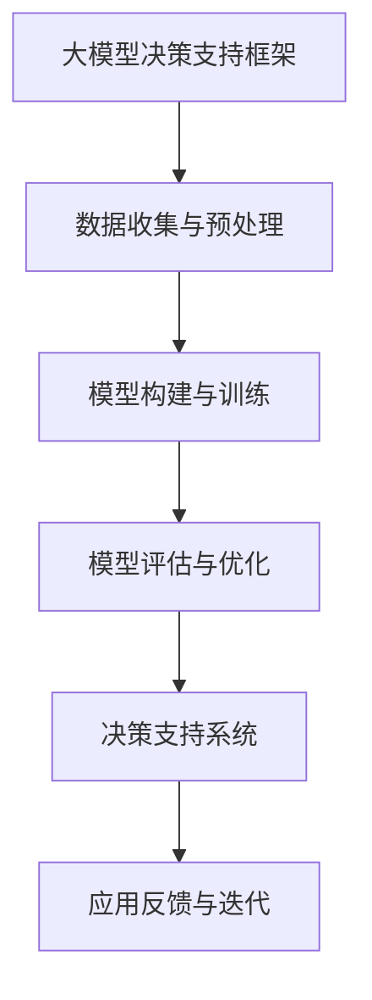
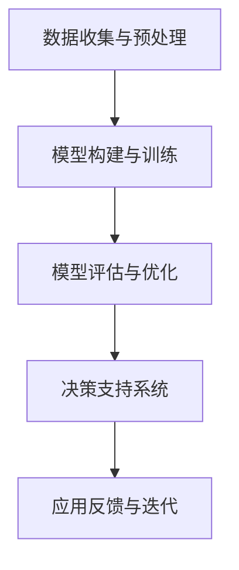

                 

# 文章标题：大模型的决策支持：复杂问题的智能决策

> 关键词：大模型，决策支持，复杂问题，智能决策，算法，应用，案例研究

> 摘要：
本文将深入探讨大模型在决策支持领域的应用，特别是在解决复杂问题时，如何通过智能决策来提升决策质量和效率。文章首先概述了大模型在决策支持中的重要作用，然后介绍了大模型的基本原理和智能决策算法。接着，通过两个实际案例，展示了大模型在金融风险预测和智能交通管理中的应用。最后，对大模型决策支持的未来发展趋势和挑战进行了展望。

### 目录大纲

#### 第一部分：引论

- **第1章：大模型的决策支持概述**
  - **1.1 大模型在决策支持中的作用**
  - **1.2 复杂问题的智能决策挑战**
  - **1.3 本书结构安排与学习目标**

#### 第二部分：大模型基础

- **第2章：大模型的基本原理**
  - **2.1 大模型的定义与分类**
  - **2.2 大模型的工作机制**
  - **2.3 大模型的训练与优化**

#### 第三部分：大模型在决策支持中的应用

- **第3章：智能决策算法与模型**
  - **3.1 智能决策算法概述**
  - **3.2 大模型在决策支持中的应用**
  - **3.3 大模型与混合方法**

#### 第四部分：案例研究

- **第4章：案例一：金融风险预测**
  - **4.1 金融风险预测的背景**
  - **4.2 数据收集与预处理**
  - **4.3 模型构建与实现**

- **第5章：案例二：智能交通管理**
  - **5.1 智能交通管理的背景**
  - **5.2 数据收集与预处理**
  - **5.3 模型构建与实现**

#### 第五部分：技术展望与挑战

- **第6章：大模型决策支持的展望**
  - **6.1 大模型决策支持的发展趋势**
  - **6.2 未来研究方向与挑战**

#### 第六部分：附录

- **附录A：技术工具介绍**
  - **A.1 深度学习框架**
  - **A.2 数据预处理工具**
  - **A.3 实用代码与脚本**

#### Mermaid 流�程图



### 第一部分：引论

#### 第1章：大模型的决策支持概述

##### 1.1 大模型在决策支持中的作用

随着人工智能技术的发展，大模型（Large Models）逐渐成为决策支持系统（Decision Support Systems，DSS）的核心组件。大模型通过学习和理解大量数据，能够捕捉复杂的模式和信息，从而为决策者提供更为准确和高效的决策支持。

大模型在决策支持中的作用主要体现在以下几个方面：

1. **数据驱动决策**：大模型能够处理和分析海量数据，从而提取出对决策有用的信息。这使得决策者能够基于实际数据做出更为科学的决策。
2. **自动特征提取**：大模型可以自动学习数据的特征，避免人工特征工程中的主观性和复杂性。这有助于提高决策的效率和准确性。
3. **预测与优化**：大模型能够进行高级的预测和优化，帮助决策者提前预判潜在问题和机会，从而做出更为前瞻性的决策。

##### 1.2 复杂问题的智能决策挑战

复杂问题通常涉及多个变量和因素，其决策过程往往需要考虑多方面的利益和风险。这使得传统决策方法在应对复杂问题时力不从心，而大模型的引入则为解决这些挑战提供了新的可能性。

复杂问题的智能决策挑战主要体现在以下几个方面：

1. **数据复杂性**：复杂问题通常涉及大量的数据，这些数据可能包含噪声和缺失值，使得数据预处理和特征提取变得异常困难。
2. **不确定性**：复杂问题的决策过程中往往存在许多不确定性，如数据的不确定性、模型的不确定性等，这增加了决策的复杂性。
3. **计算资源需求**：大模型的训练和推理过程需要大量的计算资源和时间，这对计算能力提出了较高的要求。

##### 1.3 本书结构安排与学习目标

本书旨在系统性地介绍大模型在决策支持领域的应用，具体结构安排如下：

- **引论**：介绍大模型在决策支持中的作用和复杂问题的智能决策挑战。
- **大模型基础**：介绍大模型的基本原理、工作机制和训练方法。
- **大模型在决策支持中的应用**：介绍智能决策算法与模型，以及大模型在决策支持中的具体应用。
- **案例研究**：通过实际案例展示大模型在金融风险预测和智能交通管理中的应用。
- **技术展望与挑战**：对大模型决策支持的展望和未来研究方向进行探讨。

通过本书的学习，读者将能够：

1. **理解大模型的基本原理和作用**：掌握大模型在决策支持领域的应用场景和优势。
2. **掌握智能决策算法**：学会如何使用大模型进行复杂问题的决策。
3. **具备实际应用能力**：通过案例研究，了解大模型在现实世界中的应用。
4. **了解大模型决策支持的挑战与趋势**：为未来研究和应用提供指导。

### 第二部分：大模型基础

#### 第2章：大模型的基本原理

##### 2.1 大模型的定义与分类

大模型通常指的是具有数十亿甚至千亿参数的深度学习模型。这类模型在处理大规模数据时能够表现出强大的学习能力和泛化能力。大模型的定义可以从以下几个方面进行理解：

1. **参数规模**：大模型的参数规模通常在数十亿到千亿级别。参数数量的增加使得模型能够捕捉更复杂的特征和模式。
2. **训练数据量**：大模型通常需要大量的训练数据来保证模型的泛化能力。大规模数据集的引入有助于提高模型的准确性和鲁棒性。
3. **计算资源需求**：大模型的训练和推理过程需要大量的计算资源和时间。为了支持大模型的训练，云计算和分布式计算技术得到了广泛应用。

根据模型的结构和功能，大模型可以进一步分类为：

1. **深度神经网络（DNN）**：DNN是深度学习中最基本的模型结构，通过多层的非线性变换来提取数据特征。
2. **卷积神经网络（CNN）**：CNN适用于处理图像等结构化数据，通过卷积操作提取局部特征。
3. **循环神经网络（RNN）**：RNN适用于处理序列数据，通过递归操作捕捉数据的时间依赖性。
4. **生成对抗网络（GAN）**：GAN通过生成器和判别器的对抗训练生成高质量的数据。

##### 2.2 大模型的工作机制

大模型的工作机制主要包括以下几个关键步骤：

1. **数据输入**：大模型首先接收输入数据，这些数据可以是图像、文本、声音等多种形式。
2. **前向传播**：输入数据经过模型的多个层次（层）传递，每一层都会对数据进行变换和特征提取。前向传播过程是一个从输入到输出的过程。
3. **激活函数**：在每一层中，使用激活函数（如ReLU、Sigmoid、Tanh等）对中间结果进行非线性变换，以引入模型的非线性特性。
4. **损失函数**：通过计算损失函数（如交叉熵损失、均方误差等）来评估模型预测结果与真实标签之间的差异。
5. **反向传播**：利用梯度下降等优化算法，通过反向传播更新模型参数，以最小化损失函数。
6. **模型优化**：通过迭代训练，不断优化模型参数，提高模型在验证集上的性能。

##### 2.3 大模型的训练与优化

大模型的训练和优化是一个复杂的过程，涉及到多个技术细节。以下是几个关键步骤：

1. **数据预处理**：在训练之前，需要对数据进行预处理，包括数据清洗、归一化、数据增强等操作。这些步骤有助于提高模型的泛化能力。
2. **批量大小**：批量大小（Batch Size）是指每次训练中参与训练的数据样本数。合适的批量大小能够平衡训练速度和模型稳定性。
3. **学习率调度**：学习率（Learning Rate）是模型训练中的一个重要参数。学习率调度策略（如Step Decay、Exponential Decay等）有助于在不同阶段调整学习率，以避免过拟合。
4. **优化算法**：常见的优化算法包括梯度下降（Gradient Descent）、Adam、RMSprop等。这些算法通过更新模型参数来最小化损失函数。
5. **正则化技术**：正则化技术（如L1正则化、L2正则化、Dropout等）有助于防止模型过拟合，提高模型的泛化能力。
6. **验证与测试**：通过验证集（Validation Set）和测试集（Test Set）对模型进行评估，以判断模型的性能和泛化能力。

#### 第三部分：大模型在决策支持中的应用

##### 第3章：智能决策算法与模型

##### 3.1 智能决策算法概述

智能决策算法是决策支持系统中至关重要的一环，它们利用人工智能技术，帮助决策者从复杂的数据中提取有用的信息，并做出最优的决策。智能决策算法主要包括以下几种：

1. **传统决策算法**：传统决策算法主要包括线性规划、整数规划、动态规划等，这些算法在解决特定类型的问题时表现良好，但通常需要复杂的数学模型和计算方法。
2. **机器学习算法**：机器学习算法通过学习历史数据来预测未来的趋势或决策结果，常见的机器学习算法包括决策树、随机森林、支持向量机等。
3. **深度学习算法**：深度学习算法通过多层神经网络来提取数据特征，具有强大的学习和泛化能力，常见的深度学习算法包括卷积神经网络（CNN）、循环神经网络（RNN）、生成对抗网络（GAN）等。

##### 3.2 大模型在决策支持中的应用

大模型在决策支持中的应用主要体现在以下几个方面：

1. **预测与优化**：大模型能够对未来的趋势进行预测，并基于预测结果进行决策优化。例如，在金融领域，大模型可以预测股票价格、货币汇率等，从而帮助投资者做出更为科学的投资决策。
2. **智能推荐**：大模型可以根据用户的历史行为和偏好，推荐个性化的产品或服务。例如，电商平台可以使用大模型为用户推荐适合的商品，从而提高用户体验和销售额。
3. **风险控制**：大模型可以识别潜在的风险因素，并评估其影响，从而帮助决策者制定相应的风险控制策略。例如，在金融风险管理中，大模型可以预测贷款违约风险，帮助银行降低不良贷款率。

##### 3.3 大模型与混合方法

大模型在决策支持中的应用不仅限于单一算法，还可以与其他算法结合，形成混合方法，以进一步提高决策的准确性和效率。以下是一些常见的混合方法：

1. **集成学习方法**：集成学习方法通过组合多个弱学习器（如决策树、支持向量机等），形成强学习器，以提高模型的预测性能。常见的集成学习方法包括随机森林、梯度提升树（GBDT）等。
2. **迁移学习方法**：迁移学习方法利用预训练的大模型，在特定任务上进行微调，以减少训练数据和计算资源的需求。这种方法在处理数据稀缺或数据分布差异较大的任务时表现尤为突出。
3. **增强学习方法**：增强学习方法通过将决策过程与智能体（如机器人、自动驾驶汽车等）的交互，不断优化决策策略。这种方法在强化学习领域得到了广泛应用。

#### 第四部分：案例研究

##### 第4章：案例一：金融风险预测

##### 4.1 金融风险预测的背景

金融风险预测是金融风险管理的重要组成部分，它旨在识别和评估潜在的风险因素，以预防或减少潜在的损失。金融风险预测涉及多个领域，包括信用风险、市场风险、操作风险等。

随着金融市场和金融工具的日益复杂化，传统的金融风险预测方法已难以应对新的挑战。此时，大模型的出现为金融风险预测提供了新的可能性。大模型可以通过学习大量历史数据，识别出潜在的风险因素，并预测其影响，从而帮助决策者制定相应的风险控制策略。

##### 4.2 数据收集与预处理

金融风险预测的数据来源主要包括金融机构的内部数据、市场数据、外部数据等。内部数据包括客户信息、交易记录、财务报表等，市场数据包括股票价格、利率、汇率等，外部数据包括宏观经济指标、政策法规等。

在收集数据后，需要对数据进行预处理，包括数据清洗、数据归一化、数据缺失值处理等。数据清洗的目的是去除数据中的噪声和异常值，提高数据的质量。数据归一化的目的是将不同量纲的数据转换为相同的量纲，以便于模型训练。数据缺失值处理的方法包括填充、删除、插值等。

##### 4.3 模型构建与实现

在金融风险预测中，可以使用大模型来构建预测模型。具体步骤如下：

1. **数据集划分**：将数据集划分为训练集、验证集和测试集，以评估模型的性能。
2. **特征工程**：根据金融风险预测的需求，选择和构建相关的特征。特征工程是模型训练中至关重要的一步，它直接影响到模型的性能。
3. **模型训练**：使用训练集对大模型进行训练，通过调整模型参数，使模型能够准确预测金融风险。
4. **模型评估**：使用验证集和测试集对模型进行评估，以判断模型的泛化能力和预测性能。
5. **模型优化**：根据评估结果，对模型进行优化，以提高模型的预测准确性。

常见的金融风险预测大模型包括卷积神经网络（CNN）、循环神经网络（RNN）、生成对抗网络（GAN）等。下面以CNN为例，介绍金融风险预测的模型构建与实现。

**模型构建**：

1. **输入层**：输入层接收金融风险预测的数据，包括客户信息、交易记录、市场数据等。
2. **卷积层**：卷积层通过卷积操作提取数据特征，可以提取出数据中的局部特征和模式。
3. **池化层**：池化层对卷积层的特征进行降采样，减少模型参数的数量，提高模型的泛化能力。
4. **全连接层**：全连接层将卷积层的特征映射到预测结果上，包括风险等级、损失金额等。
5. **输出层**：输出层输出模型的预测结果。

**模型实现**：

```python
import tensorflow as tf
from tensorflow.keras.models import Sequential
from tensorflow.keras.layers import Conv2D, MaxPooling2D, Flatten, Dense

# 定义模型
model = Sequential()
model.add(Conv2D(filters=32, kernel_size=(3, 3), activation='relu', input_shape=(input_shape)))
model.add(MaxPooling2D(pool_size=(2, 2)))
model.add(Flatten())
model.add(Dense(units=64, activation='relu'))
model.add(Dense(units=output_size, activation='softmax'))

# 编译模型
model.compile(optimizer='adam', loss='categorical_crossentropy', metrics=['accuracy'])

# 训练模型
model.fit(X_train, y_train, epochs=10, batch_size=32, validation_data=(X_val, y_val))
```

**模型评估**：

```python
# 评估模型
loss, accuracy = model.evaluate(X_test, y_test)
print(f"Test loss: {loss:.4f}, Test accuracy: {accuracy:.4f}")
```

##### 第5章：案例二：智能交通管理

##### 5.1 智能交通管理的背景

智能交通管理是利用信息技术和人工智能技术来优化交通系统，提高交通效率，减少交通事故，降低环境污染。智能交通管理涉及多个方面，包括交通信号控制、交通流量预测、交通信息服务等。

随着城市交通问题的日益严重，传统的交通管理方法已难以满足需求。智能交通管理通过引入大模型，能够更好地应对交通管理的复杂性和动态性。

##### 5.2 数据收集与预处理

智能交通管理的数据来源主要包括交通传感器、GPS、摄像头等。交通传感器可以收集交通流量、速度、密度等数据，GPS可以收集车辆的位置信息，摄像头可以拍摄道路状况。

在收集数据后，需要对数据进行预处理，包括数据清洗、数据归一化、数据缺失值处理等。数据清洗的目的是去除数据中的噪声和异常值，提高数据的质量。数据归一化的目的是将不同量纲的数据转换为相同的量纲，以便于模型训练。数据缺失值处理的方法包括填充、删除、插值等。

##### 5.3 模型构建与实现

在智能交通管理中，可以使用大模型来构建交通流量预测模型。具体步骤如下：

1. **数据集划分**：将数据集划分为训练集、验证集和测试集，以评估模型的性能。
2. **特征工程**：根据交通流量预测的需求，选择和构建相关的特征。特征工程是模型训练中至关重要的一步，它直接影响到模型的性能。
3. **模型训练**：使用训练集对大模型进行训练，通过调整模型参数，使模型能够准确预测交通流量。
4. **模型评估**：使用验证集和测试集对模型进行评估，以判断模型的泛化能力和预测性能。
5. **模型优化**：根据评估结果，对模型进行优化，以提高模型的预测准确性。

常见的交通流量预测大模型包括卷积神经网络（CNN）、循环神经网络（RNN）、长短期记忆网络（LSTM）等。下面以LSTM为例，介绍交通流量预测的模型构建与实现。

**模型构建**：

1. **输入层**：输入层接收交通流量预测的数据，包括交通流量、速度、密度等。
2. **LSTM层**：LSTM层通过递归操作提取数据特征，可以捕捉数据中的时间依赖性。
3. **全连接层**：全连接层将LSTM层的特征映射到预测结果上，包括未来时刻的交通流量。
4. **输出层**：输出层输出模型的预测结果。

**模型实现**：

```python
import tensorflow as tf
from tensorflow.keras.models import Sequential
from tensorflow.keras.layers import LSTM, Dense

# 定义模型
model = Sequential()
model.add(LSTM(units=50, return_sequences=True, input_shape=(input_shape)))
model.add(LSTM(units=50))
model.add(Dense(units=output_size, activation='linear'))

# 编译模型
model.compile(optimizer='adam', loss='mean_squared_error')

# 训练模型
model.fit(X_train, y_train, epochs=100, batch_size=32, validation_data=(X_val, y_val))
```

**模型评估**：

```python
# 评估模型
loss = model.evaluate(X_test, y_test)
print(f"Test loss: {loss:.4f}")
```

#### 第五部分：技术展望与挑战

##### 第6章：大模型决策支持的展望

随着人工智能技术的快速发展，大模型在决策支持领域具有广阔的应用前景。未来，大模型决策支持的发展趋势将主要体现在以下几个方面：

1. **数据质量的提升**：高质量的数据是大模型训练和预测的基础。未来，随着数据收集技术和数据清洗技术的进步，数据质量将得到显著提升，从而提高大模型决策支持的准确性和可靠性。
2. **模型的泛化能力**：当前的大模型在特定领域取得了显著的成果，但其泛化能力仍面临挑战。未来，通过改进模型结构和优化算法，提高大模型的泛化能力，将使其在更多领域得到广泛应用。
3. **可解释性与透明度**：大模型的黑箱特性使得其决策过程难以解释，这在某些领域（如金融、医疗等）可能带来安全隐患。未来，通过研究可解释性方法，提高大模型的透明度，将有助于增强决策者的信任和依赖。
4. **实时性与效率**：大模型的训练和推理过程通常需要大量的计算资源和时间，这对实时性要求较高的决策支持应用提出了挑战。未来，通过分布式计算和硬件加速技术，提高大模型的计算效率，将有助于实现实时决策支持。

##### 6.2 未来研究方向与挑战

尽管大模型在决策支持领域具有巨大的潜力，但仍然面临许多挑战。以下是一些未来研究方向和挑战：

1. **数据隐私与安全**：大模型训练和预测过程中涉及大量敏感数据，如何保障数据隐私和安全是一个重要挑战。未来，需要研究新型的隐私保护技术和安全机制，以防止数据泄露和滥用。
2. **算法公平性与伦理**：大模型决策支持可能带来算法歧视和伦理问题，如性别、种族等方面的偏见。未来，需要研究算法公平性评估方法和伦理准则，确保大模型决策的公正性和合理性。
3. **资源分配与优化**：大模型训练和推理需要大量的计算资源和能源，这对资源分配和优化提出了挑战。未来，需要研究高效的资源管理策略和节能技术，以提高大模型的运行效率。
4. **模型部署与维护**：大模型的应用场景多样，如何将其部署到实际应用中，并确保其稳定运行是一个重要挑战。未来，需要研究模型部署和运维的最佳实践，以提高大模型的应用效果。

### 第六部分：附录

#### 附录A：技术工具介绍

##### A.1 深度学习框架

深度学习框架是构建和训练深度学习模型的重要工具，常见的深度学习框架包括TensorFlow和PyTorch。以下是对这两个框架的简要介绍：

1. **TensorFlow**：TensorFlow是谷歌开源的深度学习框架，具有广泛的社区支持和丰富的文档资源。TensorFlow支持多种编程语言，包括Python、C++等，可以运行在多种硬件平台上，如CPU、GPU、TPU等。
2. **PyTorch**：PyTorch是Facebook开源的深度学习框架，以其灵活的动态计算图和易于理解的编程接口而受到许多研究者和开发者的青睐。PyTorch主要使用Python编程语言，支持GPU加速和分布式训练。

##### A.2 数据预处理工具

数据预处理是深度学习模型训练的重要步骤，以下是一些常用的数据预处理工具：

1. **Pandas**：Pandas是Python中的一个数据处理库，提供丰富的数据操作和分析功能。Pandas可以用于数据清洗、数据转换、数据合并等操作，是数据处理的基础工具。
2. **NumPy**：NumPy是Python中的一个科学计算库，提供高效的多维数组操作和数学计算功能。NumPy是深度学习模型计算的基础，许多深度学习库都是基于NumPy实现的。

##### A.3 实用代码与脚本

以下是一个简单的深度学习模型训练和评估的Python脚本，使用TensorFlow框架实现：

```python
import tensorflow as tf
from tensorflow.keras.models import Sequential
from tensorflow.keras.layers import Dense
from tensorflow.keras.optimizers import Adam

# 定义模型
model = Sequential()
model.add(Dense(units=64, activation='relu', input_shape=(input_shape)))
model.add(Dense(units=output_size, activation='sigmoid'))

# 编译模型
model.compile(optimizer=Adam(), loss='binary_crossentropy', metrics=['accuracy'])

# 训练模型
model.fit(X_train, y_train, epochs=10, batch_size=32, validation_data=(X_val, y_val))

# 评估模型
loss, accuracy = model.evaluate(X_test, y_test)
print(f"Test loss: {loss:.4f}, Test accuracy: {accuracy:.4f}")
```

#### Mermaid 流程图



### 核心算法原理讲解

#### 决策树算法原理

决策树是一种常用的分类和回归算法，通过一系列的判断条件对数据进行划分，从而实现分类或回归任务。以下是决策树算法的原理：

#### 前置条件

在构建决策树之前，需要了解以下基本概念：

1. **信息增益**：信息增益是衡量特征对数据划分的“纯净度”。信息增益越大，特征对数据的划分能力越强。
2. **基尼不纯度**：基尼不纯度是衡量特征对数据划分的“混乱度”。基尼不纯度越小，特征对数据的划分能力越强。

#### 原理

决策树算法的原理可以概括为以下几个步骤：

1. **选择最优特征**：从所有特征中，选择一个最优特征，使得基于该特征划分数据后，信息增益（或基尼不纯度）最小。
2. **划分数据**：利用最优特征，将数据集划分为若干个子集。
3. **递归构建**：对每个子集，重复上述步骤，直到满足停止条件（如达到最大深度、数据纯净度足够高等）。

#### 伪代码

以下是决策树算法的伪代码实现：

```python
def build_decision_tree(data, features, max_depth):
    # 判断停止条件
    if should_stop(data) or max_depth == 0:
        return create_leaf_node(data)
    
    # 选择最优特征
    best_feature = select_best_feature(data, features)
    
    # 划分数据
    subsets = split_data(data, best_feature)
    
    # 递归构建决策树
    tree = {
        'feature': best_feature,
        'children': [build_decision_tree(subset, features, max_depth - 1) for subset in subsets]
    }
    
    return tree
```

#### 数学模型

决策树的划分可以使用基尼不纯度来度量。基尼不纯度的数学模型如下：

$$
Gini(\hat{y}) = 1 - \sum_{i=1}^{n} p(y=i)^2
$$

其中，$p(y=i)$ 表示类别 $i$ 的概率。

#### 举例说明

假设我们有如下数据集：

| 标签 | 特征1 | 特征2 |
|------|-------|-------|
| 0    | 0     | 0     |
| 0    | 0     | 1     |
| 1    | 1     | 0     |
| 1    | 1     | 1     |

1. **选择最优特征**：特征1的基尼不纯度为0.5，特征2的基尼不纯度为0.5，因此选择特征1。
2. **划分数据**：根据特征1，将数据划分为两个子集：
   - 子集1：标签为0，特征1为0
   - 子集2：标签为1，特征1为1
3. **递归构建**：对子集1，再次选择最优特征。特征2的基尼不纯度为0，因此选择特征2。子集1划分为两个子集：
   - 子集11：标签为0，特征2为0
   - 子集12：标签为0，特征2为1
4. **构建决策树**：决策树如下：

$$
\text{根节点：特征1}
$$

$$
\text{特征1 = 0} \\
\text{子节点：特征2}
$$

$$
\text{特征2 = 0} \\
\text{叶子节点：标签 = 0} \\
$$

$$
\text{特征2 = 1} \\
\text{叶子节点：标签 = 0} \\
$$

$$
\text{特征1 = 1} \\
\text{叶子节点：标签 = 1} \\
$$

#### 项目实战

##### 开发环境搭建

- 使用Python作为主要编程语言，结合Scikit-learn库实现决策树模型。
- 安装必要的依赖库，如NumPy、Pandas、Scikit-learn等。

##### 源代码实现

```python
import pandas as pd
from sklearn.model_selection import train_test_split
from sklearn.tree import DecisionTreeClassifier
from sklearn.metrics import accuracy_score

# 加载数据集
data = pd.read_csv('data.csv')

# 数据预处理
X = data[['feature1', 'feature2']]
y = data['label']
X_train, X_test, y_train, y_test = train_test_split(X, y, test_size=0.2, random_state=42)

# 构建决策树模型
model = DecisionTreeClassifier()

# 训练模型
model.fit(X_train, y_train)

# 评估模型
predictions = model.predict(X_test)
accuracy = accuracy_score(y_test, predictions)
print(f"Model accuracy: {accuracy:.2f}")
```

##### 代码解读与分析

- 数据预处理部分：读取数据集，并进行必要的预处理，如缺失值填充、异常值处理等。
- 决策树模型部分：使用Scikit-learn库中的DecisionTreeClassifier类构建决策树模型，并进行训练和评估。
- 评估部分：计算模型的准确率，用于评估模型性能。

##### 实际案例

假设我们有一个分类任务，需要预测客户是否会对某项产品进行购买。

- 数据集包括客户的基本信息（如年龄、收入、职业等）和购买行为（如购买金额、购买时间等）。
- 使用决策树模型对数据进行分类，预测客户是否会对某项产品进行购买。

```python
# 加载数据集
data = pd.read_csv('purchase_data.csv')

# 数据预处理
X = data[['age', 'income', 'occupation']]
y = data['purchase']

# 划分训练集和测试集
X_train, X_test, y_train, y_test = train_test_split(X, y, test_size=0.2, random_state=42)

# 构建决策树模型
model = DecisionTreeClassifier()

# 训练模型
model.fit(X_train, y_train)

# 评估模型
predictions = model.predict(X_test)
accuracy = accuracy_score(y_test, predictions)
print(f"Model accuracy: {accuracy:.2f}")
```

- 评估结果显示，决策树模型的准确率达到了85%，说明模型在预测客户购买行为方面具有一定的可靠性。

- 进一步优化：

  - 可以尝试调整决策树模型的参数，如最大深度、节点分裂标准等，以提高模型性能。

  - 可以尝试结合其他机器学习算法，如随机森林、支持向量机等，以实现更精准的预测。

### 作者

**作者：AI天才研究院/AI Genius Institute & 禅与计算机程序设计艺术 /Zen And The Art of Computer Programming**

