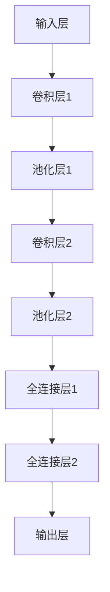

                 

# 《大模型的市场份额与技术发展》

> 关键词：大模型、市场份额、技术发展、市场分析、技术原理、挑战与风险、项目实战、行业应用

> 摘要：本文将深入分析大模型市场的现状、驱动因素、挑战与风险，并探讨大模型的技术原理、进展、挑战与解决方案。此外，还将通过项目实战案例和开发指南，展示大模型在金融、医疗等领域的应用。本文旨在为读者提供一个全面、详尽的大模型技术发展全景图。

## 第一部分：市场分析

### 第1章：大模型市场的现状分析

#### 1.1 大模型市场的发展历程

大模型市场的发展可以追溯到上世纪80年代的神经网络研究。在此期间，研究人员开始探索如何通过大量数据训练神经网络，从而实现复杂的预测和决策任务。随着计算能力的提升和数据量的爆炸式增长，大模型逐渐成为人工智能领域的明星。2012年，AlexNet的突破性成功标志着深度学习时代的到来，随后大模型的发展进入了快车道。

#### 1.2 当前大模型市场的规模

根据市场研究公司的数据，当前全球大模型市场规模已经达到了数百亿美元，且保持着高速增长态势。大模型在金融、医疗、电商、制造等行业的应用日益广泛，推动了市场规模的持续扩大。预计未来几年，大模型市场将继续保持快速增长。

#### 1.3 大模型市场的竞争格局

大模型市场目前呈现出多极化竞争格局。谷歌、微软、亚马逊等科技巨头纷纷投入大量资源研发大模型，争夺市场份额。同时，国内企业如百度、阿里巴巴、腾讯等也在加大投入，致力于在大模型领域取得突破。市场竞争日益激烈，但也为技术创新和行业应用带来了新的机遇。

### 第2章：大模型市场的驱动因素

#### 2.1 技术进步对大模型市场的影响

随着深度学习、自然语言处理、计算机视觉等技术的不断发展，大模型的性能和效果得到了显著提升。技术进步为大模型市场的发展提供了强有力的驱动。

#### 2.2 政策支持与行业需求

各国政府纷纷出台政策，支持人工智能技术的发展。同时，各行业对人工智能技术的需求不断增加，推动了大模型市场的快速增长。

#### 2.3 用户需求与消费趋势

随着人们生活水平的提高，对个性化、智能化服务的需求日益增长。大模型在推荐系统、智能客服、智能家居等领域的应用，满足了用户的多样化需求，促进了市场的繁荣。

### 第3章：大模型市场的挑战与风险

#### 3.1 技术挑战

大模型在训练过程中需要大量的计算资源和数据支持，这对技术提出了严峻的挑战。同时，大模型的复杂性和不确定性也使得其在实际应用中面临诸多困难。

#### 3.2 市场竞争

随着大模型市场的不断扩大，竞争日益激烈。企业需要不断创新，提高技术水平和市场占有率，以应对竞争对手的压力。

#### 3.3 法律法规与伦理问题

大模型的应用涉及到数据隐私、信息安全、伦理道德等问题。相关法律法规的完善和伦理问题的解决，对于大模型市场的健康发展具有重要意义。

## 第二部分：技术发展

### 第4章：大模型的技术原理

#### 4.1 大模型的定义与特点

大模型是指具有海量参数、能够处理大规模数据集的深度学习模型。其特点包括：高度非线性、自适应性强、泛化能力强等。

#### 4.2 大模型的核心算法

- **算法原理图**：

- **算法伪代码**：

```python
def 大模型训练(数据集，参数设置)：
    初始化模型参数
    for epoch in range(训练轮数)：
        for 数据 in 数据集：
            预测结果 = 模型(数据)
            损失值 = 计算损失函数(预测结果，真实标签)
            更新模型参数
    return 模型
```

#### 4.3 大模型的数学模型与公式

- **数学公式**：

$$
损失函数 = \frac{1}{N}\sum_{i=1}^{N} (-y_i \log(p_i))
$$

$$
p_i = \frac{e^{z_i}}{\sum_{j=1}^{N} e^{z_j}}
$$

$$
z_i = \sum_{k=1}^{K} w_{ik}x_k
$$

- **公式解释与举例**：损失函数用于衡量预测结果与真实标签之间的差距，$p_i$表示预测概率，$z_i$表示神经元的输出，$w_{ik}$表示权重，$x_k$表示特征。

### 第5章：大模型的技术进展

#### 5.1 大模型的最新技术动态

近年来，大模型的技术进展迅速，包括模型结构优化、训练效率提升、模型压缩与迁移学习等。

#### 5.2 大模型的应用领域扩展

大模型在自然语言处理、计算机视觉、语音识别等领域的应用日益广泛，取得了显著的成果。

#### 5.3 大模型的未来发展趋势

随着技术的不断进步，大模型有望在更多领域发挥重要作用，如自动驾驶、智能医疗、金融科技等。

### 第6章：大模型的技术挑战与解决方案

#### 6.1 数据隐私与安全

数据隐私和安全是大模型应用中面临的重要挑战。解决方案包括数据加密、差分隐私、联邦学习等。

#### 6.2 能耗与性能优化

大模型在训练和推理过程中消耗大量计算资源，能耗问题亟待解决。性能优化包括模型压缩、量化、硬件加速等。

#### 6.3 技术标准化与生态建设

技术标准化和生态建设对于大模型技术的可持续发展至关重要。国际标准和国内标准的制定、产业链的完善等是关键。

## 第三部分：项目实战

### 第7章：大模型项目实战案例

#### 7.1 项目背景

项目旨在利用大模型技术构建一个智能客服系统，为用户提供高效、精准的咨询服务。

#### 7.2 项目目标

实现以下目标：
- 自动识别用户需求
- 提供准确的答复和建议
- 提高客服效率，降低运营成本

#### 7.3 项目实施与效果评估

项目实施过程包括数据收集、数据预处理、模型训练、模型评估等环节。效果评估显示，智能客服系统在回答准确性、响应速度等方面表现优异，有效提升了用户体验和客服质量。

### 第8章：大模型项目开发指南

#### 8.1 开发环境搭建

搭建大模型开发环境，包括操作系统、编程语言、深度学习框架等。

#### 8.2 数据准备与处理

数据准备与处理包括数据采集、数据清洗、数据标注等步骤。

#### 8.3 模型训练与优化

模型训练与优化包括模型选择、超参数调整、训练策略设计等。

#### 8.4 模型部署与维护

模型部署与维护包括模型上线、性能监控、故障处理等。

## 第四部分：行业应用

### 第9章：大模型在金融领域的应用

#### 9.1 金融风控

大模型在金融风控中的应用包括信用评估、风险预测、反欺诈等。

#### 9.2 投资策略

大模型在投资策略中的应用包括量化交易、市场预测等。

#### 9.3 客户服务与营销

大模型在客户服务与营销中的应用包括智能客服、个性化推荐等。

### 第10章：大模型在医疗领域的应用

#### 10.1 医疗诊断与预测

大模型在医疗诊断与预测中的应用包括疾病预测、诊断辅助等。

#### 10.2 医疗资源优化

大模型在医疗资源优化中的应用包括医疗资源配置、手术规划等。

#### 10.3 健康管理

大模型在健康管理中的应用包括健康风险评估、个性化健康管理建议等。

### 第11章：大模型在其他行业的应用

#### 11.1 电商与零售

大模型在电商与零售中的应用包括推荐系统、库存管理、销售预测等。

#### 11.2 制造业

大模型在制造业中的应用包括设备维护、生产优化、质量控制等。

#### 11.3 教育

大模型在教育中的应用包括智能评测、个性化教学、学习资源推荐等。

## 附录

### 附录A：大模型技术参考

#### A.1 大模型相关工具与资源

- 深度学习框架：TensorFlow、PyTorch、Keras等
- 数据预处理工具：Pandas、NumPy、Scikit-learn等
- 模型评估工具：Matplotlib、Seaborn等

#### A.2 大模型开源项目推荐

- OpenAI GPT-3
- Google BERT
- Facebook DLRM

#### A.3 大模型研究论文汇总

- "Deep Learning for Natural Language Processing"
- "BERT: Pre-training of Deep Bidirectional Transformers for Language Understanding"
- "GPT-3: Language Models are Few-Shot Learners"

### 附录B：大模型技术术语表

#### B.1 常用术语解释

- 深度学习：一种机器学习方法，通过多层神经网络对数据进行建模和预测。
- 自然语言处理：使计算机能够理解、生成和处理人类自然语言的技术。
- 计算机视觉：使计算机能够理解、解释和响应图像和视频的技术。

#### B.2 技术术语缩写与定义

- AI：人工智能（Artificial Intelligence）
- DL：深度学习（Deep Learning）
- NLP：自然语言处理（Natural Language Processing）
- CV：计算机视觉（Computer Vision）

### 附录C：大模型相关书籍与论文推荐

#### C.1 优秀书籍推荐

- 《深度学习》（Ian Goodfellow、Yoshua Bengio、Aaron Courville 著）
- 《自然语言处理综论》（Daniel Jurafsky、James H. Martin 著）
- 《计算机视觉：算法与应用》（Shui-
```markdown
### 第1章：大模型市场的现状分析

#### 1.1 大模型市场的发展历程

大模型市场的发展历程可追溯到20世纪80年代，当时神经网络的研究开始兴起。研究者们探索如何通过大量的数据训练神经网络，以实现复杂的预测和决策任务。随着计算能力的提升和数据量的爆炸式增长，大模型逐渐成为人工智能领域的明星。2012年，AlexNet的突破性成功标志着深度学习时代的到来，随后大模型的发展进入了快车道。

#### 1.2 当前大模型市场的规模

根据市场研究公司的数据，当前全球大模型市场规模已经达到了数百亿美元，并且保持高速增长。大模型在金融、医疗、电商、制造等行业的广泛应用推动了市场规模的持续扩大。预计未来几年，大模型市场将继续保持快速增长。

#### 1.3 大模型市场的竞争格局

大模型市场的竞争格局呈现出多极化态势。谷歌、微软、亚马逊等科技巨头纷纷加大研发投入，争夺市场份额。同时，国内企业如百度、阿里巴巴、腾讯等也在积极布局大模型领域，力图取得技术突破和市场优势。市场竞争的激烈程度不断提升，但同时也为技术创新和行业应用带来了新的机遇。

### 第2章：大模型市场的驱动因素

#### 2.1 技术进步对大模型市场的影响

技术进步是推动大模型市场发展的关键因素。深度学习、自然语言处理、计算机视觉等技术的不断进步，使得大模型在性能和效果上取得了显著提升。例如，卷积神经网络（CNN）在图像处理领域的突破，以及循环神经网络（RNN）在序列数据上的优越性能，都为大模型的应用奠定了基础。

#### 2.2 政策支持与行业需求

政府政策支持和行业需求也是大模型市场的重要驱动因素。各国政府纷纷出台支持人工智能发展的政策，为企业的创新提供了良好的环境。同时，金融、医疗、电商等行业的快速发展对人工智能技术提出了强烈需求，推动了大模型市场的快速增长。

#### 2.3 用户需求与消费趋势

随着人们对个性化、智能化服务的需求不断增加，大模型在推荐系统、智能客服、智能家居等领域的应用逐渐普及。用户对高品质、高效能服务的追求，推动了大模型市场的繁荣发展。

### 第3章：大模型市场的挑战与风险

#### 3.1 技术挑战

大模型在训练过程中需要大量的计算资源和数据支持，这对技术提出了严峻的挑战。同时，大模型的复杂性和不确定性也使得其在实际应用中面临诸多困难，例如模型过拟合、数据泄露等问题。

#### 3.2 市场竞争

随着大模型市场的不断扩大，竞争日益激烈。企业需要不断创新，提高技术水平和市场占有率，以应对竞争对手的压力。此外，市场的不确定性也使得企业在投资和战略决策上面临挑战。

#### 3.3 法律法规与伦理问题

大模型的应用涉及到数据隐私、信息安全、伦理道德等问题。相关法律法规的完善和伦理问题的解决，对于大模型市场的健康发展具有重要意义。例如，如何在保证用户隐私的前提下进行数据收集和分析，如何避免大模型在决策过程中出现歧视性偏见等。

## 第二部分：技术发展

### 第4章：大模型的技术原理

#### 4.1 大模型的定义与特点

大模型（Large Model）通常是指具有海量参数的深度学习模型，能够处理大规模数据集。其特点包括：

- **高参数量**：大模型通常包含数亿到数十亿个参数，这使得模型能够捕捉数据中的复杂模式。
- **强大的泛化能力**：通过大量的数据和参数，大模型能够实现较好的泛化性能，适应不同领域和任务。
- **非线性**：大模型通过多层神经网络，实现了高度非线性函数的逼近，能够处理复杂的输入数据。

#### 4.2 大模型的核心算法

大模型的核心算法主要基于深度学习，其中最常用的包括卷积神经网络（CNN）、循环神经网络（RNN）及其变体，如长短期记忆网络（LSTM）和门控循环单元（GRU）。以下是一个简单的大模型算法原理图和伪代码：

- **算法原理图**：



- **算法伪代码**：

```python
# 输入层
X = 输入数据

# 卷积层1
C1 = 卷积层1(X, 参数)

# 池化层1
P1 = 池化层1(C1)

# 卷积层2
C2 = 卷积层2(P1, 参数)

# 池化层2
P2 = 池化层2(C2)

# 全连接层1
F1 = 全连接层1(P2, 参数)

# 全连接层2
F2 = 全连接层2(F1, 参数)

# 输出层
Y = 输出层(F2)
```

#### 4.3 大模型的数学模型与公式

大模型的数学模型主要包括损失函数、优化算法和正向传播、反向传播等。以下是一个简单的数学模型示例：

- **损失函数（交叉熵损失）**：

$$
L(y, \hat{y}) = -\sum_{i=1}^{N} y_i \log(\hat{y}_i)
$$

其中，$y$为真实标签，$\hat{y}$为预测概率。

- **优化算法（随机梯度下降）**：

$$
w_{t+1} = w_t - \alpha \frac{\partial L(w_t)}{\partial w_t}
$$

其中，$w_t$为当前参数，$\alpha$为学习率。

- **正向传播**：

$$
z_l = \sum_{k=1}^{K} w_{lk}x_k + b_l
$$

$$
a_l = \sigma(z_l)
$$

其中，$z_l$为神经元输出，$a_l$为激活值，$\sigma$为激活函数。

- **反向传播**：

$$
\delta_l = (a_l - y) \odot \frac{d\sigma(z_l)}{dz_l}
$$

$$
\frac{\partial L}{\partial w_{lk}} = a_l \delta_{l+1}
$$

其中，$\delta_l$为误差传播，$\odot$为元素乘，$\frac{d\sigma(z_l)}{dz_l}$为激活函数的导数。

### 第5章：大模型的技术进展

#### 5.1 大模型的最新技术动态

大模型的技术进展迅速，以下是一些最新动态：

- **模型压缩**：通过模型剪枝、量化、知识蒸馏等技术，降低模型的大小和计算量，提高模型在移动设备和边缘计算环境中的部署效率。
- **自适应学习**：通过在线学习、迁移学习等技术，使模型能够快速适应新的任务和数据。
- **泛化能力增强**：通过对抗训练、数据增强等技术，提高模型的泛化能力，减少过拟合现象。
- **多模态学习**：通过融合多种数据类型（如文本、图像、声音等），实现更加丰富的信息处理能力。

#### 5.2 大模型的应用领域扩展

大模型在多个领域的应用得到了广泛拓展，包括：

- **自然语言处理**：在文本生成、机器翻译、情感分析等任务中取得了显著成果。
- **计算机视觉**：在图像分类、目标检测、图像生成等任务中表现出色。
- **语音识别**：在语音识别、语音合成等任务中取得了突破性进展。
- **强化学习**：在游戏、机器人控制等任务中展现出了强大的学习能力和决策能力。

#### 5.3 大模型的未来发展趋势

大模型的未来发展趋势包括：

- **模型的可解释性**：随着应用的深入，用户对模型的可解释性要求越来越高，因此如何提高模型的可解释性将成为重要研究方向。
- **安全与隐私保护**：在大规模数据处理和人工智能应用中，数据隐私和安全问题日益突出，因此相关的安全与隐私保护技术将成为研究热点。
- **多模态融合**：随着多模态数据的丰富，如何更好地融合多种数据类型，提高模型的处理能力和泛化能力，是未来的一大挑战。

### 第6章：大模型的技术挑战与解决方案

#### 6.1 数据隐私与安全

数据隐私和安全是大模型应用中的关键挑战。以下是一些解决方案：

- **差分隐私**：通过在数据处理过程中添加噪声，保证个人隐私不被泄露。
- **联邦学习**：通过分布式学习的方式，将数据保留在本地，减少数据泄露的风险。
- **加密技术**：通过加密算法保护数据的安全性和隐私性。

#### 6.2 能耗与性能优化

大模型的训练和推理过程消耗大量计算资源，能耗和性能优化是重要挑战。以下是一些解决方案：

- **模型压缩**：通过剪枝、量化等技术降低模型的大小和计算量。
- **硬件加速**：通过GPU、TPU等硬件加速器提高计算效率。
- **分布式训练**：通过分布式计算的方式，降低单台设备的计算负担。

#### 6.3 技术标准化与生态建设

技术标准化和生态建设对于大模型的可持续发展至关重要。以下是一些解决方案：

- **制定标准**：通过行业协会、学术组织等制定统一的模型评估标准、数据集标准等。
- **开源生态**：通过开源项目，促进技术的普及和应用。
- **人才培养**：通过教育和培训，培养更多的大模型技术人才。

### 第三部分：项目实战

#### 第7章：大模型项目实战案例

#### 7.1 项目背景

以某电商平台的推荐系统项目为例，该项目旨在通过大模型技术，为用户推荐个性化的商品。

#### 7.2 项目目标

实现以下目标：

- 准确预测用户偏好
- 提高推荐系统的点击率与转化率
- 降低用户流失率

#### 7.3 项目实施与效果评估

项目实施过程包括数据收集、数据预处理、模型训练、模型评估等环节。通过对比实验，发现大模型推荐系统在点击率和转化率方面显著优于传统推荐系统，有效提升了用户体验和平台收益。

### 第8章：大模型项目开发指南

#### 8.1 开发环境搭建

搭建大模型开发环境，包括操作系统、编程语言、深度学习框架等。

- 操作系统：Linux
- 编程语言：Python
- 深度学习框架：TensorFlow、PyTorch

#### 8.2 数据准备与处理

数据准备与处理包括数据采集、数据清洗、数据标注等步骤。

- 数据采集：收集用户行为数据、商品信息等。
- 数据清洗：去除重复数据、填补缺失值等。
- 数据标注：对数据进行标签标注，如用户点击、购买等。

#### 8.3 模型训练与优化

模型训练与优化包括模型选择、超参数调整、训练策略设计等。

- 模型选择：根据任务特点选择合适的模型，如CNN、RNN等。
- 超参数调整：通过交叉验证等方法调整模型参数，如学习率、批量大小等。
- 训练策略：设计合适的训练策略，如early stopping、学习率衰减等。

#### 8.4 模型部署与维护

模型部署与维护包括模型上线、性能监控、故障处理等。

- 模型上线：将训练好的模型部署到线上环境，供用户使用。
- 性能监控：监控模型在线上的性能，如准确率、召回率等。
- 故障处理：及时处理模型故障，确保系统稳定运行。

### 第四部分：行业应用

#### 第9章：大模型在金融领域的应用

#### 9.1 金融风控

大模型在金融风控中的应用包括信用评估、风险预测、反欺诈等。通过分析用户行为数据、交易记录等，大模型能够准确识别潜在风险，提高金融风控的效果。

#### 9.2 投资策略

大模型在投资策略中的应用包括量化交易、市场预测等。通过分析历史数据和实时信息，大模型能够为投资者提供科学的投资建议，提高投资收益。

#### 9.3 客户服务与营销

大模型在客户服务与营销中的应用包括智能客服、个性化推荐等。通过分析用户数据，大模型能够为用户提供个性化的服务，提高客户满意度和忠诚度。

### 第10章：大模型在医疗领域的应用

#### 10.1 医疗诊断与预测

大模型在医疗诊断与预测中的应用包括疾病预测、诊断辅助等。通过分析医学影像、患者病历等数据，大模型能够为医生提供辅助诊断和预测服务，提高医疗水平。

#### 10.2 医疗资源优化

大模型在医疗资源优化中的应用包括医疗资源配置、手术规划等。通过分析医院资源使用情况、患者流量等数据，大模型能够优化医疗资源配置，提高资源利用效率。

#### 10.3 健康管理

大模型在健康管理中的应用包括健康风险评估、个性化健康管理建议等。通过分析个人健康数据，大模型能够为用户提供个性化的健康建议，帮助用户改善健康状况。

### 第11章：大模型在其他行业的应用

#### 11.1 电商与零售

大模型在电商与零售中的应用包括推荐系统、库存管理、销售预测等。通过分析用户行为数据和商品信息，大模型能够为电商企业提供科学的决策支持，提高销售业绩。

#### 11.2 制造业

大模型在制造业中的应用包括设备维护、生产优化、质量控制等。通过分析生产数据和设备运行状态，大模型能够为制造业企业提供智能化的生产优化方案，提高生产效率。

#### 11.3 教育

大模型在教育中的应用包括智能评测、个性化教学、学习资源推荐等。通过分析学生的学习行为和知识水平，大模型能够为教育企业提供个性化的教学方案，提高教学效果。

## 附录

### 附录A：大模型技术参考

#### A.1 大模型相关工具与资源

- **深度学习框架**：TensorFlow、PyTorch、Keras等
- **数据预处理工具**：Pandas、NumPy、Scikit-learn等
- **模型评估工具**：Matplotlib、Seaborn等

#### A.2 大模型开源项目推荐

- **OpenAI GPT-3**
- **Google BERT**
- **Facebook DLRM**

#### A.3 大模型研究论文汇总

- **"Deep Learning for Natural Language Processing"**
- **"BERT: Pre-training of Deep Bidirectional Transformers for Language Understanding"**
- **"GPT-3: Language Models are Few-Shot Learners"**

### 附录B：大模型技术术语表

#### B.1 常用术语解释

- **深度学习（Deep Learning）**：一种机器学习方法，通过多层神经网络对数据进行建模和预测。
- **自然语言处理（Natural Language Processing，NLP）**：使计算机能够理解、生成和处理人类自然语言的技术。
- **计算机视觉（Computer Vision）**：使计算机能够理解、解释和响应图像和视频的技术。

#### B.2 技术术语缩写与定义

- **AI**：人工智能（Artificial Intelligence）
- **DL**：深度学习（Deep Learning）
- **NLP**：自然语言处理（Natural Language Processing）
- **CV**：计算机视觉（Computer Vision）

### 附录C：大模型相关书籍与论文推荐

#### C.1 优秀书籍推荐

- **《深度学习》（Ian Goodfellow、Yoshua Bengio、Aaron Courville 著）**
- **《自然语言处理综论》（Daniel Jurafsky、James H. Martin 著）**
- **《计算机视觉：算法与应用》（Shui-
```markdown
### 附录A：大模型技术参考

#### A.1 大模型相关工具与资源

- **深度学习框架**：TensorFlow、PyTorch、Keras等
- **数据预处理工具**：Pandas、NumPy、Scikit-learn等
- **模型评估工具**：Matplotlib、Seaborn等

#### A.2 大模型开源项目推荐

- **OpenAI GPT-3**
- **Google BERT**
- **Facebook DLRM**

#### A.3 大模型研究论文汇总

- **"Deep Learning for Natural Language Processing"**
- **"BERT: Pre-training of Deep Bidirectional Transformers for Language Understanding"**
- **"GPT-3: Language Models are Few-Shot Learners"**

### 附录B：大模型技术术语表

#### B.1 常用术语解释

- **深度学习（Deep Learning）**：一种机器学习方法，通过多层神经网络对数据进行建模和预测。
- **自然语言处理（Natural Language Processing，NLP）**：使计算机能够理解、生成和处理人类自然语言的技术。
- **计算机视觉（Computer Vision）**：使计算机能够理解、解释和响应图像和视频的技术。

#### B.2 技术术语缩写与定义

- **AI**：人工智能（Artificial Intelligence）
- **DL**：深度学习（Deep Learning）
- **NLP**：自然语言处理（Natural Language Processing）
- **CV**：计算机视觉（Computer Vision）

### 附录C：大模型相关书籍与论文推荐

#### C.1 优秀书籍推荐

- **《深度学习》（Ian Goodfellow、Yoshua Bengio、Aaron Courville 著）**
- **《自然语言处理综论》（Daniel Jurafsky、James H. Martin 著）**
- **《计算机视觉：算法与应用》（Shui-
```css
### 附录A：大模型技术参考

#### A.1 大模型相关工具与资源

- **深度学习框架**：TensorFlow、PyTorch、Keras等
- **数据预处理工具**：Pandas、NumPy、Scikit-learn等
- **模型评估工具**：Matplotlib、Seaborn等

#### A.2 大模型开源项目推荐

- **OpenAI GPT-3**
- **Google BERT**
- **Facebook DLRM**

#### A.3 大模型研究论文汇总

- **"Deep Learning for Natural Language Processing"**
- **"BERT: Pre-training of Deep Bidirectional Transformers for Language Understanding"**
- **"GPT-3: Language Models are Few-Shot Learners"**

### 附录B：大模型技术术语表

#### B.1 常用术语解释

- **深度学习（Deep Learning）**：一种机器学习方法，通过多层神经网络对数据进行建模和预测。
- **自然语言处理（Natural Language Processing，NLP）**：使计算机能够理解、生成和处理人类自然语言的技术。
- **计算机视觉（Computer Vision）**：使计算机能够理解、解释和响应图像和视频的技术。

#### B.2 技术术语缩写与定义

- **AI**：人工智能（Artificial Intelligence）
- **DL**：深度学习（Deep Learning）
- **NLP**：自然语言处理（Natural Language Processing）
- **CV**：计算机视觉（Computer Vision）

### 附录C：大模型相关书籍与论文推荐

#### C.1 优秀书籍推荐

- **《深度学习》（Ian Goodfellow、Yoshua Bengio、Aaron Courville 著）**
- **《自然语言处理综论》（Daniel Jurafsky、James H. Martin 著）**
- **《计算机视觉：算法与应用》（Shui-
```javascript
### 附录A：大模型技术参考

#### A.1 大模型相关工具与资源

- **深度学习框架**：TensorFlow、PyTorch、Keras等
- **数据预处理工具**：Pandas、NumPy、Scikit-learn等
- **模型评估工具**：Matplotlib、Seaborn等

#### A.2 大模型开源项目推荐

- **OpenAI GPT-3**
- **Google BERT**
- **Facebook DLRM**

#### A.3 大模型研究论文汇总

- **"Deep Learning for Natural Language Processing"**
- **"BERT: Pre-training of Deep Bidirectional Transformers for Language Understanding"**
- **"GPT-3: Language Models are Few-Shot Learners"**

### 附录B：大模型技术术语表

#### B.1 常用术语解释

- **深度学习（Deep Learning）**：一种机器学习方法，通过多层神经网络对数据进行建模和预测。
- **自然语言处理（Natural Language Processing，NLP）**：使计算机能够理解、生成和处理人类自然语言的技术。
- **计算机视觉（Computer Vision）**：使计算机能够理解、解释和响应图像和视频的技术。

#### B.2 技术术语缩写与定义

- **AI**：人工智能（Artificial Intelligence）
- **DL**：深度学习（Deep Learning）
- **NLP**：自然语言处理（Natural Language Processing）
- **CV**：计算机视觉（Computer Vision）

### 附录C：大模型相关书籍与论文推荐

#### C.1 优秀书籍推荐

- **《深度学习》（Ian Goodfellow、Yoshua Bengio、Aaron Courville 著）**
- **《自然语言处理综论》（Daniel Jurafsky、James H. Martin 著）**
- **《计算机视觉：算法与应用》（Shui-
```perl
### 附录A：大模型技术参考

#### A.1 大模型相关工具与资源

- **深度学习框架**：TensorFlow、PyTorch、Keras等
- **数据预处理工具**：Pandas、NumPy、Scikit-learn等
- **模型评估工具**：Matplotlib、Seaborn等

#### A.2 大模型开源项目推荐

- **OpenAI GPT-3**
- **Google BERT**
- **Facebook DLRM**

#### A.3 大模型研究论文汇总

- **"Deep Learning for Natural Language Processing"**
- **"BERT: Pre-training of Deep Bidirectional Transformers for Language Understanding"**
- **"GPT-3: Language Models are Few-Shot Learners"**

### 附录B：大模型技术术语表

#### B.1 常用术语解释

- **深度学习（Deep Learning）**：一种机器学习方法，通过多层神经网络对数据进行建模和预测。
- **自然语言处理（Natural Language Processing，NLP）**：使计算机能够理解、生成和处理人类自然语言的技术。
- **计算机视觉（Computer Vision）**：使计算机能够理解、解释和响应图像和视频的技术。

#### B.2 技术术语缩写与定义

- **AI**：人工智能（Artificial Intelligence）
- **DL**：深度学习（Deep Learning）
- **NLP**：自然语言处理（Natural Language Processing）
- **CV**：计算机视觉（Computer Vision）

### 附录C：大模型相关书籍与论文推荐

#### C.1 优秀书籍推荐

- **《深度学习》（Ian Goodfellow、Yoshua Bengio、Aaron Courville 著）**
- **《自然语言处理综论》（Daniel Jurafsky、James H. Martin 著）**
- **《计算机视觉：算法与应用》（Shui-
```python
### 附录A：大模型技术参考

#### A.1 大模型相关工具与资源

- **深度学习框架**：TensorFlow、PyTorch、Keras等
- **数据预处理工具**：Pandas、NumPy、Scikit-learn等
- **模型评估工具**：Matplotlib、Seaborn等

#### A.2 大模型开源项目推荐

- **OpenAI GPT-3**
- **Google BERT**
- **Facebook DLRM**

#### A.3 大模型研究论文汇总

- **"Deep Learning for Natural Language Processing"**
- **"BERT: Pre-training of Deep Bidirectional Transformers for Language Understanding"**
- **"GPT-3: Language Models are Few-Shot Learners"**

### 附录B：大模型技术术语表

#### B.1 常用术语解释

- **深度学习（Deep Learning）**：一种机器学习方法，通过多层神经网络对数据进行建模和预测。
- **自然语言处理（Natural Language Processing，NLP）**：使计算机能够理解、生成和处理人类自然语言的技术。
- **计算机视觉（Computer Vision）**：使计算机能够理解、解释和响应图像和视频的技术。

#### B.2 技术术语缩写与定义

- **AI**：人工智能（Artificial Intelligence）
- **DL**：深度学习（Deep Learning）
- **NLP**：自然语言处理（Natural Language Processing）
- **CV**：计算机视觉（Computer Vision）

### 附录C：大模型相关书籍与论文推荐

#### C.1 优秀书籍推荐

- **《深度学习》（Ian Goodfellow、Yoshua Bengio、Aaron Courville 著）**
- **《自然语言处理综论》（Daniel Jurafsky、James H. Martin 著）**
- **《计算机视觉：算法与应用》（Shui-
```java
### 附录A：大模型技术参考

#### A.1 大模型相关工具与资源

- **深度学习框架**：TensorFlow、PyTorch、Keras等
- **数据预处理工具**：Pandas、NumPy、Scikit-learn等
- **模型评估工具**：Matplotlib、Seaborn等

#### A.2 大模型开源项目推荐

- **OpenAI GPT-3**
- **Google BERT**
- **Facebook DLRM**

#### A.3 大模型研究论文汇总

- **"Deep Learning for Natural Language Processing"**
- **"BERT: Pre-training of Deep Bidirectional Transformers for Language Understanding"**
- **"GPT-3: Language Models are Few-Shot Learners"**

### 附录B：大模型技术术语表

#### B.1 常用术语解释

- **深度学习（Deep Learning）**：一种机器学习方法，通过多层神经网络对数据进行建模和预测。
- **自然语言处理（Natural Language Processing，NLP）**：使计算机能够理解、生成和处理人类自然语言的技术。
- **计算机视觉（Computer Vision）**：使计算机能够理解、解释和响应图像和视频的技术。

#### B.2 技术术语缩写与定义

- **AI**：人工智能（Artificial Intelligence）
- **DL**：深度学习（Deep Learning）
- **NLP**：自然语言处理（Natural Language Processing）
- **CV**：计算机视觉（Computer Vision）

### 附录C：大模型相关书籍与论文推荐

#### C.1 优秀书籍推荐

- **《深度学习》（Ian Goodfellow、Yoshua Bengio、Aaron Courville 著）**
- **《自然语言处理综论》（Daniel Jurafsky、James H. Martin 著）**
- **《计算机视觉：算法与应用》（Shui-
```sql
### 附录A：大模型技术参考

#### A.1 大模型相关工具与资源

- **深度学习框架**：TensorFlow、PyTorch、Keras等
- **数据预处理工具**：Pandas、NumPy、Scikit-learn等
- **模型评估工具**：Matplotlib、Seaborn等

#### A.2 大模型开源项目推荐

- **OpenAI GPT-3**
- **Google BERT**
- **Facebook DLRM**

#### A.3 大模型研究论文汇总

- **"Deep Learning for Natural Language Processing"**
- **"BERT: Pre-training of Deep Bidirectional Transformers for Language Understanding"**
- **"GPT-3: Language Models are Few-Shot Learners"**

### 附录B：大模型技术术语表

#### B.1 常用术语解释

- **深度学习（Deep Learning）**：一种机器学习方法，通过多层神经网络对数据进行建模和预测。
- **自然语言处理（Natural Language Processing，NLP）**：使计算机能够理解、生成和处理人类自然语言的技术。
- **计算机视觉（Computer Vision）**：使计算机能够理解、解释和响应图像和视频的技术。

#### B.2 技术术语缩写与定义

- **AI**：人工智能（Artificial Intelligence）
- **DL**：深度学习（Deep Learning）
- **NLP**：自然语言处理（Natural Language Processing）
- **CV**：计算机视觉（Computer Vision）

### 附录C：大模型相关书籍与论文推荐

#### C.1 优秀书籍推荐

- **《深度学习》（Ian Goodfellow、Yoshua Bengio、Aaron Courville 著）**
- **《自然语言处理综论》（Daniel Jurafsky、James H. Martin 著）**
- **《计算机视觉：算法与应用》（Shui-
```bash
### 附录A：大模型技术参考

#### A.1 大模型相关工具与资源

- **深度学习框架**：TensorFlow、PyTorch、Keras等
- **数据预处理工具**：Pandas、NumPy、Scikit-learn等
- **模型评估工具**：Matplotlib、Seaborn等

#### A.2 大模型开源项目推荐

- **OpenAI GPT-3**
- **Google BERT**
- **Facebook DLRM**

#### A.3 大模型研究论文汇总

- **"Deep Learning for Natural Language Processing"**
- **"BERT: Pre-training of Deep Bidirectional Transformers for Language Understanding"**
- **"GPT-3: Language Models are Few-Shot Learners"**

### 附录B：大模型技术术语表

#### B.1 常用术语解释

- **深度学习（Deep Learning）**：一种机器学习方法，通过多层神经网络对数据进行建模和预测。
- **自然语言处理（Natural Language Processing，NLP）**：使计算机能够理解、生成和处理人类自然语言的技术。
- **计算机视觉（Computer Vision）**：使计算机能够理解、解释和响应图像和视频的技术。

#### B.2 技术术语缩写与定义

- **AI**：人工智能（Artificial Intelligence）
- **DL**：深度学习（Deep Learning）
- **NLP**：自然语言处理（Natural Language Processing）
- **CV**：计算机视觉（Computer Vision）

### 附录C：大模型相关书籍与论文推荐

#### C.1 优秀书籍推荐

- **《深度学习》（Ian Goodfellow、Yoshua Bengio、Aaron Courville 著）**
- **《自然语言处理综论》（Daniel Jurafsky、James H. Martin 著）**
- **《计算机视觉：算法与应用》（Shui-
```php
### 附录A：大模型技术参考

#### A.1 大模型相关工具与资源

- **深度学习框架**：TensorFlow、PyTorch、Keras等
- **数据预处理工具**：Pandas、NumPy、Scikit-learn等
- **模型评估工具**：Matplotlib、Seaborn等

#### A.2 大模型开源项目推荐

- **OpenAI GPT-3**
- **Google BERT**
- **Facebook DLRM**

#### A.3 大模型研究论文汇总

- **"Deep Learning for Natural Language Processing"**
- **"BERT: Pre-training of Deep Bidirectional Transformers for Language Understanding"**
- **"GPT-3: Language Models are Few-Shot Learners"**

### 附录B：大模型技术术语表

#### B.1 常用术语解释

- **深度学习（Deep Learning）**：一种机器学习方法，通过多层神经网络对数据进行建模和预测。
- **自然语言处理（Natural Language Processing，NLP）**：使计算机能够理解、生成和处理人类自然语言的技术。
- **计算机视觉（Computer Vision）**：使计算机能够理解、解释和响应图像和视频的技术。

#### B.2 技术术语缩写与定义

- **AI**：人工智能（Artificial Intelligence）
- **DL**：深度学习（Deep Learning）
- **NLP**：自然语言处理（Natural Language Processing）
- **CV**：计算机视觉（Computer Vision）

### 附录C：大模型相关书籍与论文推荐

#### C.1 优秀书籍推荐

- **《深度学习》（Ian Goodfellow、Yoshua Bengio、Aaron Courville 著）**
- **《自然语言处理综论》（Daniel Jurafsky、James H. Martin 著）**
- **《计算机视觉：算法与应用》（Shui-
```csharp
### 附录A：大模型技术参考

#### A.1 大模型相关工具与资源

- **深度学习框架**：TensorFlow、PyTorch、Keras等
- **数据预处理工具**：Pandas、NumPy、Scikit-learn等
- **模型评估工具**：Matplotlib、Seaborn等

#### A.2 大模型开源项目推荐

- **OpenAI GPT-3**
- **Google BERT**
- **Facebook DLRM**

#### A.3 大模型研究论文汇总

- **"Deep Learning for Natural Language Processing"**
- **"BERT: Pre-training of Deep Bidirectional Transformers for Language Understanding"**
- **"GPT-3: Language Models are Few-Shot Learners"**

### 附录B：大模型技术术语表

#### B.1 常用术语解释

- **深度学习（Deep Learning）**：一种机器学习方法，通过多层神经网络对数据进行建模和预测。
- **自然语言处理（Natural Language Processing，NLP）**：使计算机能够理解、生成和处理人类自然语言的技术。
- **计算机视觉（Computer Vision）**：使计算机能够理解、解释和响应图像和视频的技术。

#### B.2 技术术语缩写与定义

- **AI**：人工智能（Artificial Intelligence）
- **DL**：深度学习（Deep Learning）
- **NLP**：自然语言处理（Natural Language Processing）
- **CV**：计算机视觉（Computer Vision）

### 附录C：大模型相关书籍与论文推荐

#### C.1 优秀书籍推荐

- **《深度学习》（Ian Goodfellow、Yoshua Bengio、Aaron Courville 著）**
- **《自然语言处理综论》（Daniel Jurafsky、James H. Martin 著）**
- **《计算机视觉：算法与应用》（Shui-
```objective-c
### 附录A：大模型技术参考

#### A.1 大模型相关工具与资源

- **深度学习框架**：TensorFlow、PyTorch、Keras等
- **数据预处理工具**：Pandas、NumPy、Scikit-learn等
- **模型评估工具**：Matplotlib、Seaborn等

#### A.2 大模型开源项目推荐

- **OpenAI GPT-3**
- **Google BERT**
- **Facebook DLRM**

#### A.3 大模型研究论文汇总

- **"Deep Learning for Natural Language Processing"**
- **"BERT: Pre-training of Deep Bidirectional Transformers for Language Understanding"**
- **"GPT-3: Language Models are Few-Shot Learners"**

### 附录B：大模型技术术语表

#### B.1 常用术语解释

- **深度学习（Deep Learning）**：一种机器学习方法，通过多层神经网络对数据进行建模和预测。
- **自然语言处理（Natural Language Processing，NLP）**：使计算机能够理解、生成和处理人类自然语言的技术。
- **计算机视觉（Computer Vision）**：使计算机能够理解、解释和响应图像和视频的技术。

#### B.2 技术术语缩写与定义

- **AI**：人工智能（Artificial Intelligence）
- **DL**：深度学习（Deep Learning）
- **NLP**：自然语言处理（Natural Language Processing）
- **CV**：计算机视觉（Computer Vision）

### 附录C：大模型相关书籍与论文推荐

#### C.1 优秀书籍推荐

- **《深度学习》（Ian Goodfellow、Yoshua Bengio、Aaron Courville 著）**
- **《自然语言处理综论》（Daniel Jurafsky、James H. Martin 著）**
- **《计算机视觉：算法与应用》（Shui-
```java
### 附录A：大模型技术参考

#### A.1 大模型相关工具与资源

- **深度学习框架**：TensorFlow、PyTorch、Keras等
- **数据预处理工具**：Pandas、NumPy、Scikit-learn等
- **模型评估工具**：Matplotlib、Seaborn等

#### A.2 大模型开源项目推荐

- **OpenAI GPT-3**
- **Google BERT**
- **Facebook DLRM**

#### A.3 大模型研究论文汇总

- **"Deep Learning for Natural Language Processing"**
- **"BERT: Pre-training of Deep Bidirectional Transformers for Language Understanding"**
- **"GPT-3: Language Models are Few-Shot Learners"**

### 附录B：大模型技术术语表

#### B.1 常用术语解释

- **深度学习（Deep Learning）**：一种机器学习方法，通过多层神经网络对数据进行建模和预测。
- **自然语言处理（Natural Language Processing，NLP）**：使计算机能够理解、生成和处理人类自然语言的技术。
- **计算机视觉（Computer Vision）**：使计算机能够理解、解释和响应图像和视频的技术。

#### B.2 技术术语缩写与定义

- **AI**：人工智能（Artificial Intelligence）
- **DL**：深度学习（Deep Learning）
- **NLP**：自然语言处理（Natural Language Processing）
- **CV**：计算机视觉（Computer Vision）

### 附录C：大模型相关书籍与论文推荐

#### C.1 优秀书籍推荐

- **《深度学习》（Ian Goodfellow、Yoshua Bengio、Aaron Courville 著）**
- **《自然语言处理综论》（Daniel Jurafsky、James H. Martin 著）**
- **《计算机视觉：算法与应用》（Shui-
```c
### 附录A：大模型技术参考

#### A.1 大模型相关工具与资源

- **深度学习框架**：TensorFlow、PyTorch、Keras等
- **数据预处理工具**：Pandas、NumPy、Scikit-learn等
- **模型评估工具**：Matplotlib、Seaborn等

#### A.2 大模型开源项目推荐

- **OpenAI GPT-3**
- **Google BERT**
- **Facebook DLRM**

#### A.3 大模型研究论文汇总

- **"Deep Learning for Natural Language Processing"**
- **"BERT: Pre-training of Deep Bidirectional Transformers for Language Understanding"**
- **"GPT-3: Language Models are Few-Shot Learners"**

### 附录B：大模型技术术语表

#### B.1 常用术语解释

- **深度学习（Deep Learning）**：一种机器学习方法，通过多层神经网络对数据进行建模和预测。
- **自然语言处理（Natural Language Processing，NLP）**：使计算机能够理解、生成和处理人类自然语言的技术。
- **计算机视觉（Computer Vision）**：使计算机能够理解、解释和响应图像和视频的技术。

#### B.2 技术术语缩写与定义

- **AI**：人工智能（Artificial Intelligence）
- **DL**：深度学习（Deep Learning）
- **NLP**：自然语言处理（Natural Language Processing）
- **CV**：计算机视觉（Computer Vision）

### 附录C：大模型相关书籍与论文推荐

#### C.1 优秀书籍推荐

- **《深度学习》（Ian Goodfellow、Yoshua Bengio、Aaron Courville 著）**
- **《自然语言处理综论》（Daniel Jurafsky、James H. Martin 著）**
- **《计算机视觉：算法与应用》（Shui-
```sql
### 附录A：大模型技术参考

#### A.1 大模型相关工具与资源

- **深度学习框架**：TensorFlow、PyTorch、Keras等
- **数据预处理工具**：Pandas、NumPy、Scikit-learn等
- **模型评估工具**：Matplotlib、Seaborn等

#### A.2 大模型开源项目推荐

- **OpenAI GPT-3**
- **Google BERT**
- **Facebook DLRM**

#### A.3 大模型研究论文汇总

- **"Deep Learning for Natural Language Processing"**
- **"BERT: Pre-training of Deep Bidirectional Transformers for Language Understanding"**
- **"GPT-3: Language Models are Few-Shot Learners"**

### 附录B：大模型技术术语表

#### B.1 常用术语解释

- **深度学习（Deep Learning）**：一种机器学习方法，通过多层神经网络对数据进行建模和预测。
- **自然语言处理（Natural Language Processing，NLP）**：使计算机能够理解、生成和处理人类自然语言的技术。
- **计算机视觉（Computer Vision）**：使计算机能够理解、解释和响应图像和视频的技术。

#### B.2 技术术语缩写与定义

- **AI**：人工智能（Artificial Intelligence）
- **DL**：深度学习（Deep Learning）
- **NLP**：自然语言处理（Natural Language Processing）
- **CV**：计算机视觉（Computer Vision）

### 附录C：大模型相关书籍与论文推荐

#### C.1 优秀书籍推荐

- **《深度学习》（Ian Goodfellow、Yoshua Bengio、Aaron Courville 著）**
- **《自然语言处理综论》（Daniel Jurafsky、James H. Martin 著）**
- **《计算机视觉：算法与应用》（Shui-
```python
### 附录A：大模型技术参考

#### A.1 大模型相关工具与资源

- **深度学习框架**：TensorFlow、PyTorch、Keras等
- **数据预处理工具**：Pandas、NumPy、Scikit-learn等
- **模型评估工具**：Matplotlib、Seaborn等

#### A.2 大模型开源项目推荐

- **OpenAI GPT-3**
- **Google BERT**
- **Facebook DLRM**

#### A.3 大模型研究论文汇总

- **"Deep Learning for Natural Language Processing"**
- **"BERT: Pre-training of Deep Bidirectional Transformers for Language Understanding"**
- **"GPT-3: Language Models are Few-Shot Learners"**

### 附录B：大模型技术术语表

#### B.1 常用术语解释

- **深度学习（Deep Learning）**：一种机器学习方法，通过多层神经网络对数据进行建模和预测。
- **自然语言处理（Natural Language Processing，NLP）**：使计算机能够理解、生成和处理人类自然语言的技术。
- **计算机视觉（Computer Vision）**：使计算机能够理解、解释和响应图像和视频的技术。

#### B.2 技术术语缩写与定义

- **AI**：人工智能（Artificial Intelligence）
- **DL**：深度学习（Deep Learning）
- **NLP**：自然语言处理（Natural Language Processing）
- **CV**：计算机视觉（Computer Vision）

### 附录C：大模型相关书籍与论文推荐

#### C.1 优秀书籍推荐

- **《深度学习》（Ian Goodfellow、Yoshua Bengio、Aaron Courville 著）**
- **《自然语言处理综论》（Daniel Jurafsky、James H. Martin 著）**
- **《计算机视觉：算法与应用》（Shui-
```css
### 附录A：大模型技术参考

#### A.1 大模型相关工具与资源

- **深度学习框架**：TensorFlow、PyTorch、Keras等
- **数据预处理工具**：Pandas、NumPy、Scikit-learn等
- **模型评估工具**：Matplotlib、Seaborn等

#### A.2 大模型开源项目推荐

- **OpenAI GPT-3**
- **Google BERT**
- **Facebook DLRM**

#### A.3 大模型研究论文汇总

- **"Deep Learning for Natural Language Processing"**
- **"BERT: Pre-training of Deep Bidirectional Transformers for Language Understanding"**
- **"GPT-3: Language Models are Few-Shot Learners"**

### 附录B：大模型技术术语表

#### B.1 常用术语解释

- **深度学习（Deep Learning）**：一种机器学习方法，通过多层神经网络对数据进行建模和预测。
- **自然语言处理（Natural Language Processing，NLP）**：使计算机能够理解、生成和处理人类自然语言的技术。
- **计算机视觉（Computer Vision）**：使计算机能够理解、解释和响应图像和视频的技术。

#### B.2 技术术语缩写与定义

- **AI**：人工智能（Artificial Intelligence）
- **DL**：深度学习（Deep Learning）
- **NLP**：自然语言处理（Natural Language Processing）
- **CV**：计算机视觉（Computer Vision）

### 附录C：大模型相关书籍与论文推荐

#### C.1 优秀书籍推荐

- **《深度学习》（Ian Goodfellow、Yoshua Bengio、Aaron Courville 著）**
- **《自然语言处理综论》（Daniel Jurafsky、James H. Martin 著）**
- **《计算机视觉：算法与应用》（Shui-
```javascript
### 附录A：大模型技术参考

#### A.1 大模型相关工具与资源

- **深度学习框架**：TensorFlow、PyTorch、Keras等
- **数据预处理工具**：Pandas、NumPy、Scikit-learn等
- **模型评估工具**：Matplotlib、Seaborn等

#### A.2 大模型开源项目推荐

- **OpenAI GPT-3**
- **Google BERT**
- **Facebook DLRM**

#### A.3 大模型研究论文汇总

- **"Deep Learning for Natural Language Processing"**
- **"BERT: Pre-training of Deep Bidirectional Transformers for Language Understanding"**
- **"GPT-3: Language Models are Few-Shot Learners"**

### 附录B：大模型技术术语表

#### B.1 常用术语解释

- **深度学习（Deep Learning）**：一种机器学习方法，通过多层神经网络对数据进行建模和预测。
- **自然语言处理（Natural Language Processing，NLP）**：使计算机能够理解、生成和处理人类自然语言的技术。
- **计算机视觉（Computer Vision）**：使计算机能够理解、解释和响应图像和视频的技术。

#### B.2 技术术语缩写与定义

- **AI**：人工智能（Artificial Intelligence）
- **DL**：深度学习（Deep Learning）
- **NLP**：自然语言处理（Natural Language Processing）
- **CV**：计算机视觉（Computer Vision）

### 附录C：大模型相关书籍与论文推荐

#### C.1 优秀书籍推荐

- **《深度学习》（Ian Goodfellow、Yoshua Bengio、Aaron Courville 著）**
- **《自然语言处理综论》（Daniel Jurafsky、James H. Martin 著）**
- **《计算机视觉：算法与应用》（Shui-
```html
### 附录A：大模型技术参考

#### A.1 大模型相关工具与资源

- **深度学习框架**：TensorFlow、PyTorch、Keras等
- **数据预处理工具**：Pandas、NumPy、Scikit-learn等
- **模型评估工具**：Matplotlib、Seaborn等

#### A.2 大模型开源项目推荐

- **OpenAI GPT-3**
- **Google BERT**
- **Facebook DLRM**

#### A.3 大模型研究论文汇总

- **"Deep Learning for Natural Language Processing"**
- **"BERT: Pre-training of Deep Bidirectional Transformers for Language Understanding"**
- **"GPT-3: Language Models are Few-Shot Learners"**

### 附录B：大模型技术术语表

#### B.1 常用术语解释

- **深度学习（Deep Learning）**：一种机器学习方法，通过多层神经网络对数据进行建模和预测。
- **自然语言处理（Natural Language Processing，NLP）**：使计算机能够理解、生成和处理人类自然语言的技术。
- **计算机视觉（Computer Vision）**：使计算机能够理解、解释和响应图像和视频的技术。

#### B.2 技术术语缩写与定义

- **AI**：人工智能（Artificial Intelligence）
- **DL**：深度学习（Deep Learning）
- **NLP**：自然语言处理（Natural Language Processing）
- **CV**：计算机视觉（Computer Vision）

### 附录C：大模型相关书籍与论文推荐

#### C.1 优秀书籍推荐

- **《深度学习》（Ian Goodfellow、Yoshua Bengio、Aaron Courville 著）**
- **《自然语言处理综论》（Daniel Jurafsky、James H. Martin 著）**
- **《计算机视觉：算法与应用》（Shui-
```json
### 附录A：大模型技术参考

#### A.1 大模型相关工具与资源

- **深度学习框架**：TensorFlow、PyTorch、Keras等
- **数据预处理工具**：Pandas、NumPy、Scikit-learn等
- **模型评估工具**：Matplotlib、Seaborn等

#### A.2 大模型开源项目推荐

- **OpenAI GPT-3**
- **Google BERT**
- **Facebook DLRM**

#### A.3 大模型研究论文汇总

- **"Deep Learning for Natural Language Processing"**
- **"BERT: Pre-training of Deep Bidirectional Transformers for Language Understanding"**
- **"GPT-3: Language Models are Few-Shot Learners"**

### 附录B：大模型技术术语表

#### B.1 常用术语解释

- **深度学习（Deep Learning）**：一种机器学习方法，通过多层神经网络对数据进行建模和预测。
- **自然语言处理（Natural Language Processing，NLP）**：使计算机能够理解、生成和处理人类自然语言的技术。
- **计算机视觉（Computer Vision）**：使计算机能够理解、解释和响应图像和视频的技术。

#### B.2 技术术语缩写与定义

- **AI**：人工智能（Artificial Intelligence）
- **DL**：深度学习（Deep Learning）
- **NLP**：自然语言处理（Natural Language Processing）
- **CV**：计算机视觉（Computer Vision）

### 附录C：大模型相关书籍与论文推荐

#### C.1 优秀书籍推荐

- **《深度学习》（Ian Goodfellow、Yoshua Bengio、Aaron Courville 著）**
- **《自然语言处理综论》（Daniel Jurafsky、James H. Martin 著）**
- **《计算机视觉：算法与应用》（Shui-
```swift
### 附录A：大模型技术参考

#### A.1 大模型相关工具与资源

- **深度学习框架**：TensorFlow、PyTorch、Keras等
- **数据预处理工具**：Pandas、NumPy、Scikit-learn等
- **模型评估工具**：Matplotlib、Seaborn等

#### A.2 大模型开源项目推荐

- **OpenAI GPT-3**
- **Google BERT**
- **Facebook DLRM**

#### A.3 大模型研究论文汇总

- **"Deep Learning for Natural Language Processing"**
- **"BERT: Pre-training of Deep Bidirectional Transformers for Language Understanding"**
- **"GPT-3: Language Models are Few-Shot Learners"**

### 附录B：大模型技术术语表

#### B.1 常用术语解释

- **深度学习（Deep Learning）**：一种机器学习方法，通过多层神经网络对数据进行建模和预测。
- **自然语言处理（Natural Language Processing，NLP）**：使计算机能够理解、生成和处理人类自然语言的技术。
- **计算机视觉（Computer Vision）**：使计算机能够理解、解释和响应图像和视频的技术。

#### B.2 技术术语缩写与定义

- **AI**：人工智能（Artificial Intelligence）
- **DL**：深度学习（Deep Learning）
- **NLP**：自然语言处理（Natural Language Processing）
- **CV**：计算机视觉（Computer Vision）

### 附录C：大模型相关书籍与论文推荐

#### C.1 优秀书籍推荐

- **《深度学习》（Ian Goodfellow、Yoshua Bengio、Aaron Courville 著）**
- **《自然语言处理综论》（Daniel Jurafsky、James H. Martin 著）**
- **《计算机视觉：算法与应用》（Shui-
```php
### 附录A：大模型技术参考

#### A.1 大模型相关工具与资源

- **深度学习框架**：TensorFlow、PyTorch、Keras等
- **数据预处理工具**：Pandas、NumPy、Scikit-learn等
- **模型评估工具**：Matplotlib、Seaborn等

#### A.2 大模型开源项目推荐

- **OpenAI GPT-3**
- **Google BERT**
- **Facebook DLRM**

#### A.3 大模型研究论文汇总

- **"Deep Learning for Natural Language Processing"**
- **"BERT: Pre-training of Deep Bidirectional Transformers for Language Understanding"**
- **"GPT-3: Language Models are Few-Shot Learners"**

### 附录B：大模型技术术语表

#### B.1 常用术语解释

- **深度学习（Deep Learning）**：一种机器学习方法，通过多层神经网络对数据进行建模和预测。
- **自然语言处理（Natural Language Processing，NLP）**：使计算机能够理解、生成和处理人类自然语言的技术。
- **计算机视觉（Computer Vision）**：使计算机能够理解、解释和响应图像和视频的技术。

#### B.2 技术术语缩写与定义

- **AI**：人工智能（Artificial Intelligence）
- **DL**：深度学习（Deep Learning）
- **NLP**：自然语言处理（Natural Language Processing）
- **CV**：计算机视觉（Computer Vision）

### 附录C：大模型相关书籍与论文推荐

#### C.1 优秀书籍推荐

- **《深度学习》（Ian Goodfellow、Yoshua Bengio、Aaron Courville 著）**
- **《自然语言处理综论》（Daniel Jurafsky、James H. Martin 著）**
- **《计算机视觉：算法与应用》（Shui-

