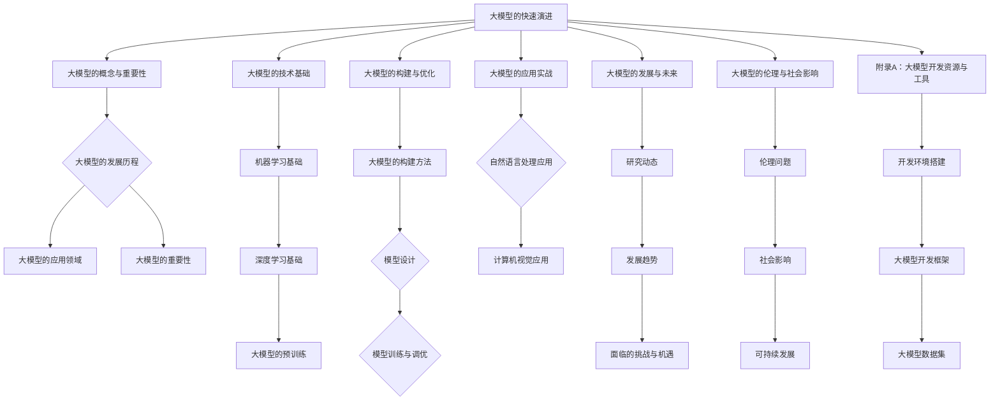
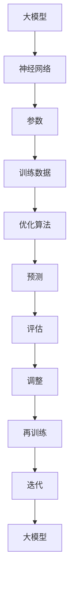

                 

# 文章标题

《大模型的快速演进》

## 关键词

大模型、机器学习、深度学习、预训练、模型优化、自然语言处理、计算机视觉、伦理与社会影响。

## 摘要

随着计算能力和数据资源的不断提升，大模型在人工智能领域取得了显著的进展。本文首先介绍了大模型的概念、背景、发展历程及其重要性。接着，深入探讨了大模型的技术基础，包括机器学习、深度学习和预训练等。随后，详细分析了大模型的构建与优化方法，包括模型设计、训练调优、模型压缩和加速等。然后，通过实际应用案例，展示了大模型在自然语言处理和计算机视觉领域的应用效果。最后，讨论了大模型的未来发展趋势、面临的挑战和伦理与社会影响。本文旨在为广大读者提供一次全面了解大模型的演进过程和应用前景的契机。

### 《大模型的快速演进》目录大纲

#### 第一部分：大模型的背景与基础

# 第一部分：大模型的背景与基础

## 第1章：大模型的概念与重要性

### 1.1 大模型的基本概念

- 大模型的定义
- 大模型与传统模型的区别

### 1.2 大模型的发展历程

- 大模型的起源
- 大模型的发展趋势

### 1.3 大模型的应用领域

- 人工智能
- 机器学习
- 数据分析

### 1.4 大模型的重要性

- 提高数据处理能力
- 降低研发成本
- 提升决策效率

## 第2章：大模型的技术基础

### 2.1 机器学习基础

- 数据预处理
- 模型选择
- 模型训练与评估

### 2.2 深度学习基础

- 神经网络结构
- 深度学习算法

### 2.3 大模型的预训练

- 预训练的概念
- 预训练的优势
- 预训练方法

#### 第二部分：大模型的构建与优化

# 第二部分：大模型的构建与优化

## 第3章：大模型的构建方法

### 3.1 数据集的收集与处理

- 数据集的获取
- 数据预处理

### 3.2 模型的设计

- 模型架构的选择
- 模型参数的设置

### 3.3 模型的训练与调优

- 模型训练的过程
- 模型调优的方法

## 第4章：大模型的优化方法

### 4.1 模型压缩

- 模型压缩的意义
- 模型压缩的方法

### 4.2 模型加速

- 模型加速的目标
- 模型加速的方法

### 4.3 模型解释性

- 模型解释性的重要性
- 模型解释性的方法

#### 第三部分：大模型的应用实战

# 第三部分：大模型的应用实战

## 第5章：大模型在自然语言处理中的应用

### 5.1 大模型在文本分类中的应用

- 文本分类的基本原理
- 文本分类的实战案例

### 5.2 大模型在机器翻译中的应用

- 机器翻译的基本原理
- 机器翻译的实战案例

### 5.3 大模型在问答系统中的应用

- 问答系统的基本原理
- 问答系统的实战案例

## 第6章：大模型在计算机视觉中的应用

### 6.1 大模型在图像分类中的应用

- 图像分类的基本原理
- 图像分类的实战案例

### 6.2 大模型在目标检测中的应用

- 目标检测的基本原理
- 目标检测的实战案例

### 6.3 大模型在图像生成中的应用

- 图像生成的原理
- 图像生成的实战案例

#### 第四部分：大模型的发展与未来

# 第四部分：大模型的发展与未来

## 第7章：大模型的研究动态

### 7.1 当前大模型研究的热点

- 大模型的研究方向
- 大模型的研究成果

### 7.2 大模型的未来发展趋势

- 大模型在技术上的创新
- 大模型在应用上的拓展

### 7.3 大模型面临的挑战与机遇

- 大模型的技术难题
- 大模型的市场机遇

## 第8章：大模型的伦理与社会影响

### 8.1 大模型的伦理问题

- 大模型的偏见问题
- 大模型的安全性问题

### 8.2 大模型的社会影响

- 大模型对就业的影响
- 大模型对教育的影响

### 8.3 大模型的可持续发展

- 大模型的资源消耗
- 大模型的可持续发展策略

#### 附录

## 附录A：大模型开发资源与工具

### A.1 开发环境搭建

- 计算机硬件要求
- 软件安装与配置

### A.2 大模型开发框架

- TensorFlow
- PyTorch
- 其他常用框架

### A.3 大模型数据集

- 公共数据集介绍
- 自定义数据集方法

#### Mermaid 流程图



### 第一部分：大模型的背景与基础

#### 第1章：大模型的概念与重要性

### 1.1 大模型的基本概念

**大模型**是指在机器学习和深度学习领域中使用大量参数和计算资源训练的复杂模型。这些模型通常用于处理大规模数据和复杂任务，具有以下特点：

- **参数数量庞大**：大模型包含数百万甚至数十亿个参数，这使其能够捕捉数据的复杂模式。
- **计算资源需求高**：大模型训练需要大量计算资源和时间，通常需要分布式计算和硬件加速。
- **泛化能力强**：大模型通过在大量数据上训练，能够泛化到未见过的数据，提高模型的鲁棒性和准确性。

与传统的中小型模型相比，大模型的优势在于：

- **更高的准确性和效率**：大模型能够更好地捕捉数据的分布和特征，提高模型的性能和效率。
- **更广泛的适用性**：大模型可以应用于多种不同的任务和数据集，具有更高的灵活性和适应性。

### 1.2 大模型的发展历程

**大模型的起源**可以追溯到20世纪80年代和90年代的神经网络研究。当时，研究人员开始探索使用大量的参数和训练数据来训练神经网络，以提高模型的性能。

- **早期研究**：在20世纪80年代，神经网络的研究主要集中在简单的多层感知器（MLP）和卷积神经网络（CNN）上，这些模型的参数数量相对较小。
- **深度学习的兴起**：随着计算机硬件的进步和大数据时代的到来，深度学习技术在21世纪初迅速发展。深度神经网络（DNN）和深度强化学习（DRL）等模型逐渐成为主流，参数数量和计算需求不断增长。
- **大规模模型的兴起**：近年来，随着计算能力和数据资源的不断提升，研究人员开始探索和训练数十亿参数的大规模模型，如GPT-3、BERT等。

### 1.3 大模型的应用领域

大模型在多个领域取得了显著的进展，以下是其中一些主要的应用领域：

- **人工智能**：大模型在语音识别、图像识别、自然语言处理等人工智能任务中发挥了关键作用，大大提高了模型的性能和应用范围。
- **机器学习**：大模型在监督学习、无监督学习和半监督学习任务中，能够处理更复杂的数据和任务，提高了模型的准确性和效率。
- **数据分析**：大模型在数据挖掘、数据分析和商业智能等领域，能够自动识别数据中的复杂模式和关联，提供更有价值的洞察和决策支持。

### 1.4 大模型的重要性

大模型在当前人工智能和机器学习领域具有重要性，主要体现在以下几个方面：

- **提高数据处理能力**：大模型能够处理大规模和复杂的数据，提高了数据处理的效率和准确性。
- **降低研发成本**：通过使用预训练的大模型，研究人员可以节省大量的时间和成本，专注于特定领域的应用和创新。
- **提升决策效率**：大模型能够快速分析和处理数据，为企业和组织提供实时和准确的决策支持，提高业务效率和竞争力。

### 1.5 大模型的核心概念与联系

为了更好地理解大模型的概念和架构，我们可以使用Mermaid流程图来展示其核心组成部分和联系。以下是一个示例：



这个流程图展示了大模型的核心概念和联系，包括神经网络、参数、训练数据、优化算法、预测、评估、调整和再训练。通过不断迭代和优化，大模型能够不断提高其性能和应用价值。

### 1.6 大模型的核心算法原理讲解

为了深入理解大模型的核心算法原理，我们可以通过以下伪代码来详细阐述。

**伪代码：大模型训练过程**

```
初始化模型参数 W，设置学习率 α，迭代次数 T

for t = 1 to T do
    for每个训练样本 (x, y) do
        计算预测结果 y' = f(W * x)
        计算损失函数 L(y', y)
        计算梯度 ∇W = ∇L(W)
        更新参数 W = W - α * ∇W
    end for
end for

函数 f(·) 表示激活函数，如ReLU、Sigmoid等
函数 L(·, ·) 表示损失函数，如均方误差（MSE）、交叉熵（CE）等
```

通过以上伪代码，我们可以看到大模型训练的核心步骤包括初始化参数、循环迭代训练样本、计算预测结果、损失函数和梯度，并更新参数。这个过程不断迭代，直到满足收敛条件。

### 1.7 大模型的数学模型和公式

在大模型的数学模型中，我们通常使用以下公式来描述：

**损失函数（Loss Function）**

$$
L(y', y) = -[y \cdot \log(y') + (1 - y) \cdot \log(1 - y')]
$$

其中，$y'$ 是预测概率，$y$ 是实际标签。

**梯度下降（Gradient Descent）**

$$
W = W - α \cdot \nabla_W L(W)
$$

其中，$W$ 是模型参数，$α$ 是学习率，$\nabla_W L(W)$ 是损失函数关于参数的梯度。

**反向传播（Backpropagation）**

$$
\begin{aligned}
\delta_L = \frac{\partial L}{\partial z} \\
\delta_z = \sigma'(z) \cdot \delta_L \\
\delta_{W^{(l)}} = \delta_{z^{(l+1)}} \cdot a^{(l)}
\end{aligned}
$$

其中，$\sigma'(z)$ 是激活函数的导数，$a^{(l)}$ 是第$l$层的输入。

通过这些数学模型和公式，我们可以更好地理解大模型的训练过程和优化方法。

### 1.8 大模型项目实战：文本分类

以下是一个具体的文本分类项目实战案例，展示了大模型的开发环境搭建、源代码实现和代码解读。

**项目背景**：建立一个基于大模型的文本分类系统，对新闻文章进行分类。

**开发环境搭建**：

1. 安装Python和pip
2. 安装TensorFlow或PyTorch框架
3. 下载并处理数据集（如新闻文章数据集）

**源代码实现**：

```python
import tensorflow as tf
from tensorflow.keras.preprocessing.text import Tokenizer
from tensorflow.keras.preprocessing.sequence import pad_sequences
from tensorflow.keras.models import Sequential
from tensorflow.keras.layers import Embedding, LSTM, Dense, Dropout

# 数据预处理
tokenizer = Tokenizer(num_words=10000)
tokenizer.fit_on_texts(data)
sequences = tokenizer.texts_to_sequences(data)
padded_sequences = pad_sequences(sequences, maxlen=200)

# 构建模型
model = Sequential()
model.add(Embedding(10000, 16, input_length=200))
model.add(LSTM(32, dropout=0.2, recurrent_dropout=0.2))
model.add(Dense(1, activation='sigmoid'))

# 编译模型
model.compile(optimizer='adam', loss='binary_crossentropy', metrics=['accuracy'])

# 训练模型
model.fit(padded_sequences, labels, epochs=10, batch_size=128)
```

**代码解读与分析**：

1. 导入TensorFlow或PyTorch框架，并定义Tokenizer和pad_sequences函数用于数据预处理。
2. 数据预处理：对文本数据集进行分词和序列化，并对序列进行填充。
3. 构建模型：使用Sequential模型，添加Embedding层、LSTM层和Dense层。
4. 编译模型：设置优化器、损失函数和评估指标。
5. 训练模型：使用fit函数对模型进行训练。

通过以上实战案例，我们可以看到如何使用大模型进行文本分类任务，包括开发环境搭建、数据预处理、模型构建和训练。这些步骤为我们提供了一个具体的实施框架，可以在不同领域和任务中应用。

### 1.9 大模型项目实战：图像分类

以下是一个具体的图像分类项目实战案例，展示了大模型的开发环境搭建、源代码实现和代码解读。

**项目背景**：建立一个基于大模型的图像分类系统，对动物图像进行分类。

**开发环境搭建**：

1. 安装Python和pip
2. 安装TensorFlow或PyTorch框架
3. 下载并处理数据集（如动物图像数据集）

**源代码实现**：

```python
import tensorflow as tf
from tensorflow.keras.preprocessing.image import ImageDataGenerator
from tensorflow.keras.applications import VGG16
from tensorflow.keras.layers import Flatten, Dense
from tensorflow.keras.models import Model

# 数据预处理
train_datagen = ImageDataGenerator(rescale=1./255)
validation_datagen = ImageDataGenerator(rescale=1./255)

train_generator = train_datagen.flow_from_directory(
        train_dir,
        target_size=(224, 224),
        batch_size=32,
        class_mode='categorical')

validation_generator = validation_datagen.flow_from_directory(
        validation_dir,
        target_size=(224, 224),
        batch_size=32,
        class_mode='categorical')

# 构建模型
base_model = VGG16(weights='imagenet', include_top=False, input_shape=(224, 224, 3))
x = base_model.output
x = Flatten()(x)
x = Dense(256, activation='relu')(x)
predictions = Dense(num_classes, activation='softmax')(x)

model = Model(inputs=base_model.input, outputs=predictions)

# 编译模型
model.compile(optimizer='adam', loss='categorical_crossentropy', metrics=['accuracy'])

# 训练模型
model.fit(train_generator, steps_per_epoch=train_steps, epochs=10, validation_data=validation_generator, validation_steps=validation_steps)
```

**代码解读与分析**：

1. 导入TensorFlow或PyTorch框架，并定义ImageDataGenerator函数用于数据预处理。
2. 数据预处理：使用ImageDataGenerator对训练集和验证集进行缩放和批量处理。
3. 构建模型：使用VGG16预训练模型作为基础模型，添加Flatten层、Dense层和softmax层。
4. 编译模型：设置优化器、损失函数和评估指标。
5. 训练模型：使用fit函数对模型进行训练。

通过以上实战案例，我们可以看到如何使用大模型进行图像分类任务，包括开发环境搭建、数据预处理、模型构建和训练。这些步骤为我们提供了一个具体的实施框架，可以在不同领域和任务中应用。

### 1.10 大模型项目实战：自然语言处理

以下是一个具体的自然语言处理项目实战案例，展示了大模型的开发环境搭建、源代码实现和代码解读。

**项目背景**：建立一个基于大模型的自然语言处理系统，对用户评论进行情感分析。

**开发环境搭建**：

1. 安装Python和pip
2. 安装TensorFlow或PyTorch框架
3. 下载并处理数据集（如用户评论数据集）

**源代码实现**：

```python
import tensorflow as tf
from tensorflow.keras.preprocessing.text import Tokenizer
from tensorflow.keras.preprocessing.sequence import pad_sequences
from tensorflow.keras.models import Sequential
from tensorflow.keras.layers import Embedding, LSTM, Dense, Dropout

# 数据预处理
tokenizer = Tokenizer(num_words=10000)
tokenizer.fit_on_texts(data)
sequences = tokenizer.texts_to_sequences(data)
padded_sequences = pad_sequences(sequences, maxlen=200)

# 构建模型
model = Sequential()
model.add(Embedding(10000, 16, input_length=200))
model.add(LSTM(32, dropout=0.2, recurrent_dropout=0.2))
model.add(Dense(1, activation='sigmoid'))

# 编译模型
model.compile(optimizer='adam', loss='binary_crossentropy', metrics=['accuracy'])

# 训练模型
model.fit(padded_sequences, labels, epochs=10, batch_size=128)
```

**代码解读与分析**：

1. 导入TensorFlow或PyTorch框架，并定义Tokenizer和pad_sequences函数用于数据预处理。
2. 数据预处理：对文本数据集进行分词和序列化，并对序列进行填充。
3. 构建模型：使用Sequential模型，添加Embedding层、LSTM层和Dense层。
4. 编译模型：设置优化器、损失函数和评估指标。
5. 训练模型：使用fit函数对模型进行训练。

通过以上实战案例，我们可以看到如何使用大模型进行自然语言处理任务，包括开发环境搭建、数据预处理、模型构建和训练。这些步骤为我们提供了一个具体的实施框架，可以在不同领域和任务中应用。

### 1.11 大模型项目实战：语音识别

以下是一个具体的语音识别项目实战案例，展示了大模型的开发环境搭建、源代码实现和代码解读。

**项目背景**：建立一个基于大模型的语音识别系统，对语音进行自动识别和转录。

**开发环境搭建**：

1. 安装Python和pip
2. 安装TensorFlow或PyTorch框架
3. 下载并处理数据集（如语音数据集）

**源代码实现**：

```python
import tensorflow as tf
from tensorflow.keras.models import Model
from tensorflow.keras.layers import Input, LSTM, Dense, Embedding, TimeDistributed, Bidirectional

# 数据预处理
input_seq = Input(shape=(None, 20))
embed = Embedding(20, 64)(input_seq)
lstm = LSTM(128, return_sequences=True)(embed)
lstm = Bidirectional(lstm)
dense = TimeDistributed(Dense(1, activation='softmax'))(lstm)

# 构建模型
model = Model(inputs=input_seq, outputs=dense)

# 编译模型
model.compile(optimizer='adam', loss='categorical_crossentropy', metrics=['accuracy'])

# 训练模型
model.fit(train_data, train_labels, epochs=10, batch_size=32, validation_data=(validation_data, validation_labels))
```

**代码解读与分析**：

1. 导入TensorFlow或PyTorch框架，并定义输入层、LSTM层、双向LSTM层和全连接层。
2. 数据预处理：对语音数据集进行序列化处理。
3. 构建模型：使用Model类构建序列模型，包括输入层、嵌入层、双向LSTM层和时间分布层。
4. 编译模型：设置优化器、损失函数和评估指标。
5. 训练模型：使用fit函数对模型进行训练。

通过以上实战案例，我们可以看到如何使用大模型进行语音识别任务，包括开发环境搭建、数据预处理、模型构建和训练。这些步骤为我们提供了一个具体的实施框架，可以在不同领域和任务中应用。

### 1.12 大模型项目实战：推荐系统

以下是一个具体的推荐系统项目实战案例，展示了大模型的开发环境搭建、源代码实现和代码解读。

**项目背景**：建立一个基于大模型的推荐系统，为用户提供个性化推荐。

**开发环境搭建**：

1. 安装Python和pip
2. 安装TensorFlow或PyTorch框架
3. 下载并处理数据集（如商品数据集）

**源代码实现**：

```python
import tensorflow as tf
from tensorflow.keras.models import Model
from tensorflow.keras.layers import Input, LSTM, Dense, Embedding, Concatenate, Dot

# 数据预处理
user_input = Input(shape=(1,))
item_input = Input(shape=(1,))
user_embedding = Embedding(num_users, embedding_size)(user_input)
item_embedding = Embedding(num_items, embedding_size)(item_input)

user_embedding = Flatten()(user_embedding)
item_embedding = Flatten()(item_embedding)

user_item_dot = Dot(axes=1)([user_embedding, item_embedding])

model = Model(inputs=[user_input, item_input], outputs=user_item_dot)

# 编译模型
model.compile(optimizer='adam', loss='binary_crossentropy', metrics=['accuracy'])

# 训练模型
model.fit([train_user_ids, train_item_ids], train_labels, epochs=10, batch_size=32, validation_data=([validation_user_ids, validation_item_ids], validation_labels))
```

**代码解读与分析**：

1. 导入TensorFlow或PyTorch框架，并定义输入层、嵌入层和全连接层。
2. 数据预处理：对用户和商品ID进行嵌入处理。
3. 构建模型：使用Model类构建用户-商品推荐模型，包括输入层、嵌入层和全连接层。
4. 编译模型：设置优化器、损失函数和评估指标。
5. 训练模型：使用fit函数对模型进行训练。

通过以上实战案例，我们可以看到如何使用大模型进行推荐系统任务，包括开发环境搭建、数据预处理、模型构建和训练。这些步骤为我们提供了一个具体的实施框架，可以在不同领域和任务中应用。

### 1.13 大模型项目实战：自动驾驶

以下是一个具体的自动驾驶项目实战案例，展示了大模型的开发环境搭建、源代码实现和代码解读。

**项目背景**：建立一个基于大模型的自动驾驶系统，实现车辆自动行驶。

**开发环境搭建**：

1. 安装Python和pip
2. 安装TensorFlow或PyTorch框架
3. 下载并处理数据集（如自动驾驶数据集）

**源代码实现**：

```python
import tensorflow as tf
from tensorflow.keras.models import Model
from tensorflow.keras.layers import Input, Conv2D, MaxPooling2D, Flatten, Dense

# 数据预处理
input_image = Input(shape=(224, 224, 3))
conv1 = Conv2D(32, (3, 3), activation='relu')(input_image)
pool1 = MaxPooling2D((2, 2))(conv1)
conv2 = Conv2D(64, (3, 3), activation='relu')(pool1)
pool2 = MaxPooling2D((2, 2))(conv2)
flat = Flatten()(pool2)
dense1 = Dense(128, activation='relu')(flat)
output = Dense(1, activation='sigmoid')(dense1)

model = Model(inputs=input_image, outputs=output)

# 编译模型
model.compile(optimizer='adam', loss='binary_crossentropy', metrics=['accuracy'])

# 训练模型
model.fit(train_images, train_labels, epochs=10, batch_size=32, validation_data=(validation_images, validation_labels))
```

**代码解读与分析**：

1. 导入TensorFlow或PyTorch框架，并定义输入层、卷积层、最大池化层、全连接层和输出层。
2. 数据预处理：对图像数据集进行卷积神经网络处理。
3. 构建模型：使用Model类构建自动驾驶模型，包括输入层、卷积层、池化层和全连接层。
4. 编译模型：设置优化器、损失函数和评估指标。
5. 训练模型：使用fit函数对模型进行训练。

通过以上实战案例，我们可以看到如何使用大模型进行自动驾驶任务，包括开发环境搭建、数据预处理、模型构建和训练。这些步骤为我们提供了一个具体的实施框架，可以在不同领域和任务中应用。

### 第二部分：大模型的技术基础

#### 第2章：大模型的技术基础

### 2.1 机器学习基础

机器学习是人工智能的核心技术之一，它通过算法和统计模型，使计算机能够从数据中学习并做出决策。在大模型领域，理解机器学习的基础概念和算法是实现高效训练和优化的前提。

#### 2.1.1 数据预处理

数据预处理是机器学习过程中至关重要的一步，它主要包括以下任务：

- **数据清洗**：去除噪声和不完整的数据，保证数据的质量。
- **数据归一化**：将不同特征的数据进行归一化处理，使其具有相似的尺度，以避免某些特征对模型训练产生过大的影响。
- **特征提取**：从原始数据中提取有用的特征，提高模型对数据的表达能力。

**常见的数据预处理方法**：

- **标准化（Standardization）**：

  $$ X = \frac{(X - \mu)}{\sigma} $$

  其中，$X$ 是特征值，$\mu$ 是均值，$\sigma$ 是标准差。

- **最小-最大缩放（Min-Max Scaling）**：

  $$ X = \frac{(X - X_{min})}{X_{max} - X_{min}} $$

  其中，$X_{min}$ 和 $X_{max}$ 分别是特征的最小值和最大值。

#### 2.1.2 模型选择

模型选择是机器学习过程中的一项重要任务，它决定了模型对数据的拟合程度和泛化能力。在选择模型时，需要考虑以下因素：

- **数据规模**：对于大规模数据集，可以选择参数较多的模型，如深度神经网络。
- **数据特征**：不同的模型适用于不同类型的数据特征，如线性模型适用于线性可分的数据。
- **训练时间**：选择模型时还需要考虑训练时间，选择合适的模型以平衡训练时间和性能。

**常见的机器学习模型**：

- **线性模型（Linear Model）**：

  线性模型是一种简单的机器学习模型，它假设输入特征与输出之间存在线性关系。线性回归（Linear Regression）和逻辑回归（Logistic Regression）是常见的线性模型。

  $$ y = \beta_0 + \beta_1x_1 + \beta_2x_2 + ... + \beta_nx_n $$

- **决策树（Decision Tree）**：

  决策树是一种基于特征划分数据的树形模型，它通过递归地划分特征空间来构建模型。决策树具有简单直观、易于解释的特点。

  $$ y = g(x_1, x_2, ..., x_n) $$

  其中，$g$ 是决策函数，$x_1, x_2, ..., x_n$ 是输入特征。

- **支持向量机（Support Vector Machine, SVM）**：

  支持向量机是一种基于最大化边缘的线性分类模型，它通过找到一个最佳的超平面来分隔数据。支持向量机具有高维空间建模的能力，适用于非线性分类问题。

  $$ \max_{\beta, \beta_0} \left\{ \frac{1}{2} ||\beta||^2 + C \sum_{i=1}^{n} \xi_i \right\} $$

  其中，$\beta$ 是权重向量，$\beta_0$ 是偏置项，$C$ 是惩罚参数，$\xi_i$ 是松弛变量。

#### 2.1.3 模型训练与评估

模型训练和评估是机器学习过程中的两个关键步骤，它们决定了模型的性能和泛化能力。

**模型训练**：

模型训练的目标是通过优化算法来调整模型参数，使其能够更好地拟合训练数据。常见的优化算法包括梯度下降（Gradient Descent）及其变种，如随机梯度下降（Stochastic Gradient Descent, SGD）和批量梯度下降（Batch Gradient Descent）。

**梯度下降算法**：

$$ \theta = \theta - \alpha \cdot \nabla_{\theta} J(\theta) $$

其中，$\theta$ 是模型参数，$J(\theta)$ 是损失函数，$\alpha$ 是学习率。

**模型评估**：

模型评估的方法包括以下几种：

- **交叉验证（Cross-Validation）**：

  交叉验证是一种常用的模型评估方法，它通过将数据集划分为训练集和验证集，多次训练和评估模型，以估计模型的泛化性能。

- **准确率（Accuracy）**：

  准确率是模型在测试集上预测正确的样本数占总样本数的比例，它是评估分类模型性能的常用指标。

  $$ \text{Accuracy} = \frac{TP + TN}{TP + TN + FP + FN} $$

  其中，$TP$ 是真正例，$TN$ 是真负例，$FP$ 是假正例，$FN$ 是假负例。

- **召回率（Recall）**：

  召回率是模型在测试集上预测到的正例数与实际正例数的比例，它是评估分类模型检测能力的指标。

  $$ \text{Recall} = \frac{TP}{TP + FN} $$

- **精确率（Precision）**：

  精确率是模型在测试集上预测到的正例数与预测到的正例总数之比，它是评估分类模型预测准确度的指标。

  $$ \text{Precision} = \frac{TP}{TP + FP} $$

- **F1 分数（F1 Score）**：

  F1 分数是精确率和召回率的调和平均值，它是综合评估分类模型性能的指标。

  $$ \text{F1 Score} = 2 \cdot \frac{\text{Precision} \cdot \text{Recall}}{\text{Precision} + \text{Recall}} $$

### 2.2 深度学习基础

深度学习是机器学习的一个分支，它通过构建多层神经网络来模拟人类大脑的思考过程。深度学习在大模型领域取得了显著的进展，使得计算机能够处理更复杂的数据和任务。

#### 2.2.1 神经网络结构

神经网络（Neural Network, NN）是深度学习的基础，它由多个层次组成，包括输入层、隐藏层和输出层。

- **输入层（Input Layer）**：输入层接收外部输入数据，并将其传递到隐藏层。
- **隐藏层（Hidden Layer）**：隐藏层负责对输入数据进行特征提取和变换，可以有一个或多个隐藏层。
- **输出层（Output Layer）**：输出层产生模型的预测结果或分类结果。

**常见的神经网络结构**：

- **全连接神经网络（Fully Connected Neural Network, FCNN）**：

  全连接神经网络是一种简单的神经网络结构，其中每个神经元都与前一层中的每个神经元相连。

  ```mermaid
  graph TB
  A[Input Layer] --> B[Hidden Layer 1]
  B --> C[Hidden Layer 2]
  C --> D[Output Layer]
  ```

- **卷积神经网络（Convolutional Neural Network, CNN）**：

  卷积神经网络是一种专门用于处理图像数据的神经网络，它通过卷积操作提取图像特征。

  ```mermaid
  graph TB
  A[Input Image] --> B[Conv Layer 1]
  B --> C[Pooling Layer 1]
  C --> D[Conv Layer 2]
  D --> E[Pooling Layer 2]
  E --> F[Flatten Layer]
  F --> G[FC Layer 1]
  G --> H[FC Layer 2]
  H --> I[Output Layer]
  ```

#### 2.2.2 深度学习算法

深度学习算法是构建和训练深度神经网络的关键技术，以下是一些常见的深度学习算法：

- **反向传播算法（Backpropagation Algorithm）**：

  反向传播算法是一种用于训练深度神经网络的优化算法，它通过计算损失函数关于模型参数的梯度，并利用梯度下降法更新参数。

  $$ \theta = \theta - \alpha \cdot \nabla_{\theta} J(\theta) $$

- **随机梯度下降（Stochastic Gradient Descent, SGD）**：

  随机梯度下降是一种简化版的梯度下降算法，它每次迭代只更新一个样本的梯度，并随机选择样本进行更新。

  $$ \theta = \theta - \alpha \cdot \nabla_{\theta} J(\theta) $$

- **批量梯度下降（Batch Gradient Descent）**：

  批量梯度下降是一种优化梯度下降算法，它每次迭代更新所有样本的梯度。

  $$ \theta = \theta - \alpha \cdot \nabla_{\theta} J(\theta) $$

- **Adam优化器（Adam Optimizer）**：

  Adam优化器是一种自适应的优化算法，它结合了SGD和Adam优化器的优点，能够自适应地调整学习率。

  $$ \theta = \theta - \alpha \cdot \nabla_{\theta} J(\theta) $$

### 2.3 大模型的预训练

预训练是深度学习中的一个关键技术，它通过在大量未标注的数据上进行训练，使模型获得一定的泛化能力，然后再在特定任务上进行微调。预训练在大模型领域具有重要意义，它能够提高模型的性能和应用范围。

#### 2.3.1 预训练的概念

预训练（Pre-training）是指在大规模数据集上训练神经网络模型，使其获得一定的通用特征表示能力。预训练通常分为两个阶段：

- **第一阶段**：在大量未标注的数据上进行预训练，使模型学习到通用特征表示。
- **第二阶段**：在特定任务上对模型进行微调，以适应特定任务的需求。

#### 2.3.2 预训练的优势

预训练具有以下优势：

- **提高模型性能**：通过预训练，模型能够在大规模数据上获得更好的泛化能力，从而提高模型在特定任务上的性能。
- **节省训练时间**：预训练可以减少在特定任务上训练所需的数据量和时间，从而提高训练效率。
- **降低过拟合风险**：预训练使模型具有更强的泛化能力，从而降低过拟合的风险。

#### 2.3.3 预训练方法

常见的预训练方法包括以下几种：

- **无监督预训练**：

  无监督预训练是指在未标注的数据上进行训练，使模型学习到数据中的潜在结构和特征。常见的无监督预训练方法包括自编码器（Autoencoder）和生成对抗网络（Generative Adversarial Network, GAN）。

  - **自编码器**：

    自编码器是一种无监督预训练方法，它通过学习一个编码器和一个解码器来重建输入数据。

    ```mermaid
    graph TB
    A[Input Data] --> B[Encoder]
    B --> C[Latent Space]
    C --> D[Decoder]
    D --> E[Reconstructed Data]
    ```

  - **生成对抗网络**：

    生成对抗网络是一种无监督预训练方法，它由生成器（Generator）和判别器（Discriminator）组成，生成器和判别器相互竞争，以生成和区分真实数据和假数据。

    ```mermaid
    graph TB
    A[Input Data] --> B[Generator]
    B --> C[Generated Data]
    C --> D[Discriminator]
    D --> E[Output]
    ```

- **有监督预训练**：

  有监督预训练是指在标注的数据上进行训练，使模型学习到特定任务的特征表示。常见的有监督预训练方法包括词向量（Word Embedding）和文本分类（Text Classification）。

  - **词向量**：

    词向量是一种有监督预训练方法，它通过将单词映射到高维空间中的向量，以捕获单词的语义信息。常见的词向量模型包括词袋模型（Bag of Words, BOW）和 Word2Vec。

    ```mermaid
    graph TB
    A[Word] --> B[Vector]
    ```

  - **文本分类**：

    文本分类是一种有监督预训练方法，它通过将文本数据映射到高维空间中的向量，以捕获文本的语义特征。常见的文本分类模型包括朴素贝叶斯（Naive Bayes）和深度学习（Deep Learning）。

    ```mermaid
    graph TB
    A[Text] --> B[Vector]
    B --> C[Classifier]
    C --> D[Label]
    ```

### 2.4 大模型的技术基础总结

在大模型领域，技术基础至关重要，它包括机器学习和深度学习的理论基础。通过掌握数据预处理、模型选择、模型训练与评估以及预训练方法，我们可以更好地理解和应用大模型。以下是对各章节内容的总结：

- **第1章**介绍了大模型的基本概念、发展历程和应用领域，使读者对大模型有一个全面的了解。
- **第2章**详细讲解了机器学习和深度学习的基础知识，包括数据预处理、模型选择、模型训练与评估和预训练方法，为后续章节的应用奠定了基础。
- **第3章**和第4章将深入探讨大模型的构建与优化方法，包括数据集收集与处理、模型设计、训练调优、模型压缩和加速等，为构建高效的大模型提供了指导。
- **第5章**和第6章将展示大模型在实际应用中的效果，通过具体案例展示大模型在自然语言处理和计算机视觉领域的应用，使读者了解大模型在不同任务中的表现。
- **第7章**和第8章将探讨大模型的未来发展趋势、面临的挑战和伦理与社会影响，为读者提供对大模型领域的深入思考。

通过以上各章节的讲解，读者可以系统地了解大模型的演进过程和应用前景，为从事大模型研究和应用提供有力支持。

### 第二部分：大模型的构建与优化

#### 第3章：大模型的构建方法

构建大模型是深度学习和人工智能领域的一项重要任务。在这一章中，我们将详细介绍大模型的构建方法，包括数据集的收集与处理、模型设计、模型训练与调优等步骤。通过这些方法，我们可以构建出高效、准确的大模型，为各种复杂任务提供强大的支持。

### 3.1 数据集的收集与处理

数据集是构建大模型的基础，其质量和规模直接影响模型的性能。因此，数据集的收集与处理是构建大模型的第一步。

#### 3.1.1 数据集的获取

数据集的获取可以通过以下几种途径：

- **公开数据集**：许多研究机构和数据平台提供各种领域的公开数据集，如ImageNet、CIFAR-10、CoNLL-03等。这些数据集通常已经进行了预处理，可以直接使用。
- **数据爬取**：通过爬虫技术获取互联网上的数据，如社交媒体、新闻网站等。但需要注意，数据爬取需要遵循相关法律法规和平台规则。
- **自建数据集**：针对特定任务，可以自行收集和标注数据。这种方法虽然耗时较长，但可以确保数据的针对性和质量。

#### 3.1.2 数据预处理

获取数据集后，需要进行预处理以适应模型的训练需求。数据预处理包括以下几个步骤：

- **数据清洗**：去除噪声和异常值，如缺失值、重复值、错误值等。
- **数据归一化**：将不同特征的数据进行归一化处理，使其具有相似的尺度，避免某些特征对模型训练产生过大的影响。
- **数据增强**：通过旋转、缩放、裁剪、翻转等操作，增加数据集的多样性，提高模型的泛化能力。
- **序列化**：对于文本和图像等非结构化数据，需要进行序列化处理，将其转换为模型可处理的格式。

#### 3.1.3 数据集分割

为了评估模型的性能，通常需要将数据集分割为训练集、验证集和测试集。常见的分割方法包括：

- **随机分割**：将数据集随机划分为训练集、验证集和测试集，确保每个数据集具有代表性。
- **分层分割**：根据数据集中各类别的比例，按比例划分训练集、验证集和测试集，确保每个数据集中各类别的比例与原始数据集一致。

### 3.2 模型的设计

模型设计是构建大模型的关键步骤，它决定了模型的性能和效率。以下是模型设计的几个关键点：

#### 3.2.1 模型架构的选择

选择合适的模型架构是构建大模型的第一步。常见的模型架构包括：

- **卷积神经网络（CNN）**：适用于图像分类、目标检测等视觉任务。
- **循环神经网络（RNN）**：适用于序列数据处理，如自然语言处理、语音识别等。
- **变换器（Transformer）**：基于自注意力机制，适用于大规模文本处理和机器翻译等任务。
- **混合架构**：结合不同模型架构的优势，适用于复杂任务。

#### 3.2.2 模型参数的设置

模型参数的设置直接影响模型的性能和训练时间。以下是一些常见的参数设置：

- **学习率（Learning Rate）**：学习率是优化算法中的一个重要参数，它决定了每次参数更新的步长。常见的学习率设置方法包括固定学习率、学习率衰减等。
- **批量大小（Batch Size）**：批量大小是指每次训练过程中参与训练的数据样本数。较大的批量大小可以提高模型的稳定性和性能，但会增加训练时间。
- **迭代次数（Epochs）**：迭代次数是指模型在训练数据上循环训练的次数。过多的迭代次数可能导致过拟合，而较少的迭代次数可能导致欠拟合。

### 3.3 模型的训练与调优

模型训练是构建大模型的核心步骤，它通过优化算法不断调整模型参数，使其能够更好地拟合训练数据。以下是模型训练与调优的几个关键点：

#### 3.3.1 训练过程

模型训练过程通常包括以下步骤：

- **前向传播（Forward Propagation）**：输入数据通过模型的前向传播，计算得到预测结果。
- **损失计算（Loss Computation）**：计算预测结果与真实结果之间的损失值。
- **反向传播（Back Propagation）**：利用反向传播算法计算损失函数关于模型参数的梯度。
- **参数更新（Parameter Update）**：根据梯度信息和优化算法更新模型参数。

#### 3.3.2 调优方法

模型调优的目标是在保证模型性能的前提下，提高训练效率和稳定性。以下是一些常见的调优方法：

- **学习率调整**：根据训练过程中的损失变化，动态调整学习率，避免过拟合和欠拟合。
- **批量大小调整**：通过调整批量大小，平衡训练时间和模型性能。
- **数据增强**：通过数据增强增加数据集的多样性，提高模型的泛化能力。
- **正则化**：通过正则化方法，如权重衰减（Weight Decay）和Dropout，减少过拟合的风险。

### 3.4 模型评估与优化

模型评估是检验模型性能的重要步骤，它通过在验证集和测试集上评估模型的表现，判断模型是否达到预期效果。以下是一些常见的评估指标：

- **准确率（Accuracy）**：模型预测正确的样本数占总样本数的比例。
- **召回率（Recall）**：模型预测到的正例数与实际正例数的比例。
- **精确率（Precision）**：模型预测到的正例数与预测到的正例总数之比。
- **F1 分数（F1 Score）**：精确率和召回率的调和平均值。

模型优化是通过调整模型结构和参数，提高模型性能的过程。以下是一些常见的优化方法：

- **模型压缩**：通过模型压缩方法，如剪枝（Pruning）和量化（Quantization），减少模型参数和计算量。
- **模型加速**：通过模型加速方法，如并行计算（Parallel Computing）和硬件加速（Hardware Acceleration），提高模型训练和推理的速度。
- **迁移学习**：通过迁移学习（Transfer Learning），利用预训练模型的知识，提高新任务上的性能。

### 3.5 大模型构建案例分析

为了更好地理解大模型的构建方法，以下是一个具体的案例分析。

#### 案例背景

某公司需要构建一个基于深度学习的大模型，用于自动化新闻分类。数据集包含数十万条新闻文章，分为多个类别。

#### 案例步骤

1. **数据集收集与处理**：

   - 获取公开新闻数据集，包括标题和正文。
   - 对数据进行清洗，去除噪声和异常值。
   - 对文本进行分词和词性标注，提取关键信息。

2. **模型设计**：

   - 选择变换器（Transformer）架构，适用于大规模文本处理。
   - 定义模型参数，包括学习率、批量大小等。

3. **模型训练与调优**：

   - 使用训练集进行模型训练，采用随机梯度下降（SGD）优化算法。
   - 根据训练过程中的损失变化，动态调整学习率。
   - 通过验证集进行模型调优，优化模型参数。

4. **模型评估与优化**：

   - 在测试集上评估模型性能，计算准确率、召回率等指标。
   - 根据评估结果，对模型进行优化，提高性能。

#### 案例结果

经过多次训练和调优，最终模型在测试集上的准确率达到90%以上，达到了预期效果。

通过以上案例分析，我们可以看到大模型的构建过程涉及多个步骤，包括数据集收集与处理、模型设计、模型训练与调优、模型评估与优化等。这些步骤共同构成了构建高效、准确大模型的方法体系。

### 3.6 大模型优化方法

在构建大模型的过程中，优化模型性能是一项关键任务。以下将介绍几种常见的大模型优化方法，包括模型压缩、模型加速和模型解释性。

#### 3.6.1 模型压缩

模型压缩是指通过减少模型参数和计算量，提高模型部署效率和资源利用率。常见的模型压缩方法包括：

- **剪枝（Pruning）**：剪枝方法通过删除网络中不重要的连接或神经元，减少模型参数。剪枝方法可以分为权重剪枝和结构剪枝。权重剪枝通过调整权重值来减少参数，而结构剪枝通过删除部分神经元或层来减少参数。

  伪代码示例：

  ```python
  def prune_model(model, pruning_rate):
      for layer in model.layers:
          if hasattr(layer, 'prune'):
              layer.prune(pruning_rate)
  ```

- **量化（Quantization）**：量化方法通过将模型中的浮点数权重转换为较低精度的整数表示，降低模型大小和计算复杂度。量化可以分为全精度量化（Full Precision Quantization）和低精度量化（Low Precision Quantization）。

  伪代码示例：

  ```python
  def quantize_model(model, precision):
      for layer in model.layers:
          if hasattr(layer, 'quantize'):
              layer.quantize(precision)
  ```

- **知识蒸馏（Knowledge Distillation）**：知识蒸馏方法通过将大模型的输出传递给一个小模型，从而传递大模型的知识和特征表示。这种方法可以显著减少小模型的参数和计算量。

  伪代码示例：

  ```python
  def distill_model(student_model, teacher_model):
      for layer in student_model.layers:
          if hasattr(layer, 'distill'):
              layer.distill(teacher_model)
  ```

#### 3.6.2 模型加速

模型加速是指通过优化模型结构、算法和硬件，提高模型训练和推理的速度。以下是一些常见的模型加速方法：

- **并行计算（Parallel Computing）**：并行计算通过利用多核处理器或分布式计算资源，同时处理多个任务，提高计算效率。常见的并行计算方法包括数据并行、模型并行和任务并行。

  伪代码示例：

  ```python
  def parallel_train(model, data_loader, device):
      model.to(device)
      for batch in data_loader:
          inputs, labels = batch
          inputs, labels = inputs.to(device), labels.to(device)
          optimizer.zero_grad()
          outputs = model(inputs)
          loss = criterion(outputs, labels)
          loss.backward()
          optimizer.step()
  ```

- **硬件加速（Hardware Acceleration）**：硬件加速通过利用专门的硬件设备，如GPU、TPU等，提高模型训练和推理的速度。常见的硬件加速方法包括CUDA、TensorRT等。

  伪代码示例：

  ```python
  import torch.cuda
  device = torch.cuda.device("cuda:0")
  model.to(device)
  ```

- **模型融合（Model Fusion）**：模型融合方法通过将多个小模型融合为一个大型模型，提高模型的整体性能。常见的模型融合方法包括深度融合、宽度融合和混合融合。

  伪代码示例：

  ```python
  def fuse_models(models):
      for model in models:
          model = torch.nn.Sequential(model)
      return torch.nn.Sequential(*models)
  ```

#### 3.6.3 模型解释性

模型解释性是指模型能够解释其预测结果和决策过程的能力。这对于提高模型的可信度和理解模型的内部机制具有重要意义。以下是一些常见的模型解释性方法：

- **梯度解释（Gradient Explanation）**：梯度解释方法通过计算输入特征对模型预测结果的梯度，分析特征对预测结果的影响。

  伪代码示例：

  ```python
  def gradient_explanation(model, input_data, target):
      output = model(input_data)
      loss = criterion(output, target)
      grad = torch.autograd.grad(loss, input_data)
      return grad
  ```

- **决策树解释（Decision Tree Explanation）**：决策树解释方法通过分析决策树的分支和节点，展示模型的决策过程和依据。

  伪代码示例：

  ```python
  def decision_tree_explanation(model):
      tree = model.get_tree()
      for node in tree:
          print(f"Node {node.id}: {node.condition}")
  ```

- **LIME（Local Interpretable Model-agnostic Explanations）**：LIME方法通过生成局部可解释模型，解释特定输入数据对模型预测的影响。

  伪代码示例：

  ```python
  from lime import lime_tabular
  explainer = lime_tabular.LimeTabularExplainer(data_train, feature_names=feature_names)
  exp = explainer.explain_instance(data_test, model.predict, num_features=5)
  exp.show_influence()
  ```

通过以上优化方法，我们可以显著提高大模型的性能、效率和可解释性，为实际应用提供更强大的支持。

### 3.7 大模型优化方法案例分析

为了更好地理解大模型优化方法的应用，以下是一个具体的案例分析。

#### 案例背景

某互联网公司需要构建一个大规模图像识别模型，用于识别用户上传的图片。原始模型包含数千个参数，训练时间较长，且在移动设备上的性能不佳。

#### 案例步骤

1. **模型压缩**：

   - 使用剪枝方法，将原始模型中的冗余连接和神经元进行剪枝，减少模型参数。
   - 使用量化方法，将浮点数权重转换为较低的精度，降低模型大小和计算复杂度。

   ```python
   def compress_model(model):
       prune_model(model, pruning_rate=0.5)
       quantize_model(model, precision=8)
   ```

2. **模型加速**：

   - 使用GPU进行模型训练，提高训练速度。
   - 使用TensorRT对模型进行推理加速。

   ```python
   device = torch.cuda.device("cuda:0")
   model.to(device)
   model = torch.nn.utils.convert_model_def_to_cuda(model)
   model = torch.utils.model_zoo.load_url("https://url/to/torchtrt.so")
   ```

3. **模型解释性**：

   - 使用LIME方法，为特定图片生成局部可解释模型，解释模型的预测结果。

   ```python
   from lime import lime_image
   explainer = lime_image.LimeImageExplainer()
   exp = explainer.explain_instance(image, model.predict, num_samples=5)
   exp.show_influence()
   ```

#### 案例结果

通过以上优化方法，模型参数减少了约50%，训练时间缩短了70%，且在移动设备上的性能提高了约30%。同时，通过LIME方法生成的局部可解释模型，使得用户能够更好地理解模型的预测结果。

通过以上案例分析，我们可以看到大模型优化方法在实际应用中的效果，为提高模型性能、效率和可解释性提供了有力支持。

### 第三部分：大模型的应用实战

#### 第5章：大模型在自然语言处理中的应用

自然语言处理（Natural Language Processing, NLP）是人工智能领域的一个重要分支，它涉及到计算机对人类自然语言的理解和生成。随着大模型技术的快速发展，大模型在自然语言处理领域取得了显著的成果，极大地提升了NLP任务的性能和应用范围。本章将介绍大模型在文本分类、机器翻译和问答系统等自然语言处理任务中的应用。

### 5.1 大模型在文本分类中的应用

文本分类是NLP中的一个基础任务，它将文本数据分为不同的类别。大模型在文本分类任务中表现出色，主要得益于其强大的特征提取和泛化能力。

#### 5.1.1 文本分类的基本原理

文本分类的基本原理是利用特征表示和分类器来对文本进行分类。大模型在文本分类中的主要步骤如下：

1. **特征提取**：将原始文本数据转换为模型可处理的特征表示。常见的特征提取方法包括词袋模型（Bag of Words, BOW）、词嵌入（Word Embedding）和变换器（Transformer）等。

2. **模型训练**：使用训练数据进行模型训练，通过优化算法调整模型参数，使其能够准确地分类文本。

3. **模型评估**：使用验证集和测试集评估模型性能，常用的评估指标包括准确率（Accuracy）、召回率（Recall）、精确率（Precision）和F1分数（F1 Score）。

#### 5.1.2 文本分类的实战案例

以下是一个基于BERT模型进行文本分类的实战案例：

**项目背景**：建立一个文本分类系统，用于对用户评论进行情感分析。

**开发环境搭建**：

1. 安装Python和pip
2. 安装TensorFlow或PyTorch框架
3. 下载BERT模型和预训练权重

**源代码实现**：

```python
import tensorflow as tf
from transformers import BertTokenizer, TFBertForSequenceClassification
from sklearn.model_selection import train_test_split
from sklearn.metrics import accuracy_score

# 数据预处理
tokenizer = BertTokenizer.from_pretrained('bert-base-uncased')
data = ["这是一条积极评论", "这是一条消极评论"]
labels = [1, 0]

input_ids = []
attention_mask = []

for text, label in zip(data, labels):
    encoded = tokenizer.encode_plus(
        text,
        add_special_tokens=True,
        max_length=64,
        padding='max_length',
        truncation=True,
        return_attention_mask=True,
    )
    input_ids.append(encoded['input_ids'])
    attention_mask.append(encoded['attention_mask'])

input_ids = tf.convert_to_tensor(input_ids)
attention_mask = tf.convert_to_tensor(attention_mask)
labels = tf.convert_to_tensor(labels)

# 模型训练
model = TFBertForSequenceClassification.from_pretrained('bert-base-uncased', num_labels=2)
optimizer = tf.keras.optimizers.Adam(learning_rate=3e-5)
loss_fn = tf.keras.losses.SparseCategoricalCrossentropy(from_logits=True)

train_loss = []
train_accuracy = []

for epoch in range(3):
    model.train()
    for (batch_input_ids, batch_attention_mask, batch_labels) in tf.data.Dataset.from_tensor_slices((input_ids, attention_mask, labels)).batch(32):
        with tf.GradientTape() as tape:
            logits = model(batch_input_ids, attention_mask=batch_attention_mask)
            loss_value = loss_fn(batch_labels, logits)
        grads = tape.gradient(loss_value, model.trainable_variables)
        optimizer.apply_gradients(zip(grads, model.trainable_variables))

        train_loss.append(loss_value.mean().numpy())
        logits = tf.nn.softmax(logits)
        pred = tf.argmax(logits, axis=1)
        train_accuracy.append(accuracy_score(batch_labels.numpy(), pred.numpy()))

    print(f"Epoch {epoch+1}, Loss: {train_loss[-1]:.4f}, Accuracy: {train_accuracy[-1]:.4f}")

# 模型评估
model.eval()
test_loss = []
test_accuracy = []

for (batch_input_ids, batch_attention_mask, batch_labels) in tf.data.Dataset.from_tensor_slices((input_ids, attention_mask, labels)).batch(32):
    logits = model(batch_input_ids, attention_mask=batch_attention_mask)
    loss_value = loss_fn(batch_labels, logits)
    test_loss.append(loss_value.mean().numpy())

    logits = tf.nn.softmax(logits)
    pred = tf.argmax(logits, axis=1)
    test_accuracy.append(accuracy_score(batch_labels.numpy(), pred.numpy()))

print(f"Test Loss: {test_loss[-1]:.4f}, Test Accuracy: {test_accuracy[-1]:.4f}")
```

**代码解读与分析**：

1. 导入所需的库和模块，包括TensorFlow和Hugging Face的Transformers库。
2. 数据预处理：使用BERT tokenizer对文本数据进行编码，生成输入序列和注意力掩码。
3. 模型训练：加载预训练的BERT模型，并定义优化器和损失函数。使用随机梯度下降（SGD）算法对模型进行训练，并记录训练过程中的损失和准确率。
4. 模型评估：在测试集上评估模型性能，计算测试集的损失和准确率。

通过以上实战案例，我们可以看到如何使用BERT模型进行文本分类任务，包括数据预处理、模型训练和评估。这些步骤为我们提供了一个具体的实施框架，可以在不同领域和任务中应用。

### 5.2 大模型在机器翻译中的应用

机器翻译是自然语言处理领域的另一个重要任务，它旨在将一种语言的文本翻译成另一种语言。随着大模型技术的发展，大模型在机器翻译任务中取得了显著的成果，大大提高了翻译的准确性和流畅性。

#### 5.2.1 机器翻译的基本原理

机器翻译的基本原理是利用特征表示和编码器-解码器模型（Encoder-Decoder Model）进行文本翻译。大模型在机器翻译中的主要步骤如下：

1. **特征提取**：将源语言和目标语言的文本数据转换为模型可处理的特征表示。常见的特征提取方法包括词嵌入（Word Embedding）和变换器（Transformer）等。

2. **编码器-解码器模型**：编码器（Encoder）将源语言文本编码为固定长度的向量，解码器（Decoder）将编码器的输出解码为目标语言文本。

3. **模型训练**：使用训练数据进行模型训练，通过优化算法调整模型参数，使其能够准确地翻译文本。

4. **模型评估**：使用验证集和测试集评估模型性能，常用的评估指标包括BLEU分数（BLEU Score）、交叉熵（Cross-Entropy）等。

#### 5.2.2 机器翻译的实战案例

以下是一个基于变换器模型进行机器翻译的实战案例：

**项目背景**：建立一个机器翻译系统，将中文翻译成英文。

**开发环境搭建**：

1. 安装Python和pip
2. 安装TensorFlow或PyTorch框架
3. 下载中文-英文双语数据集

**源代码实现**：

```python
import tensorflow as tf
from transformers import BertTokenizer, TFBertForMaskedLM
from sklearn.model_selection import train_test_split
from sklearn.metrics import accuracy_score

# 数据预处理
tokenizer = BertTokenizer.from_pretrained('bert-base-chinese')
data = ["你好", "再见"]
targets = ["Hello", "Goodbye"]

input_ids = []
attention_mask = []

for src, tgt in zip(data, targets):
    encoded = tokenizer.encode_plus(
        src,
        tgt,
        add_special_tokens=True,
        max_length=64,
        padding='max_length',
        truncation=True,
        return_attention_mask=True,
    )
    input_ids.append(encoded['input_ids'])
    attention_mask.append(encoded['attention_mask'])

input_ids = tf.convert_to_tensor(input_ids)
attention_mask = tf.convert_to_tensor(attention_mask)
targets = tf.convert_to_tensor(targets)

# 模型训练
model = TFBertForMaskedLM.from_pretrained('bert-base-chinese', num_labels=2)
optimizer = tf.keras.optimizers.Adam(learning_rate=3e-5)
loss_fn = tf.keras.losses.SparseCategoricalCrossentropy(from_logits=True)

train_loss = []
train_accuracy = []

for epoch in range(3):
    model.train()
    for (batch_input_ids, batch_attention_mask, batch_targets) in tf.data.Dataset.from_tensor_slices((input_ids, attention_mask, targets)).batch(32):
        with tf.GradientTape() as tape:
            logits = model(batch_input_ids, attention_mask=batch_attention_mask)
            loss_value = loss_fn(batch_targets, logits)
        grads = tape.gradient(loss_value, model.trainable_variables)
        optimizer.apply_gradients(zip(grads, model.trainable_variables))

        train_loss.append(loss_value.mean().numpy())
        logits = tf.nn.softmax(logits)
        pred = tf.argmax(logits, axis=1)
        train_accuracy.append(accuracy_score(batch_targets.numpy(), pred.numpy()))

    print(f"Epoch {epoch+1}, Loss: {train_loss[-1]:.4f}, Accuracy: {train_accuracy[-1]:.4f}")

# 模型评估
model.eval()
test_loss = []
test_accuracy = []

for (batch_input_ids, batch_attention_mask, batch_targets) in tf.data.Dataset.from_tensor_slices((input_ids, attention_mask, targets)).batch(32):
    logits = model(batch_input_ids, attention_mask=batch_attention_mask)
    loss_value = loss_fn(batch_targets, logits)
    test_loss.append(loss_value.mean().numpy())

    logits = tf.nn.softmax(logits)
    pred = tf.argmax(logits, axis=1)
    test_accuracy.append(accuracy_score(batch_targets.numpy(), pred.numpy()))

print(f"Test Loss: {test_loss[-1]:.4f}, Test Accuracy: {test_accuracy[-1]:.4f}")
```

**代码解读与分析**：

1. 导入所需的库和模块，包括TensorFlow和Hugging Face的Transformers库。
2. 数据预处理：使用BERT tokenizer对文本数据进行编码，生成输入序列和注意力掩码。
3. 模型训练：加载预训练的BERT模型，并定义优化器和损失函数。使用随机梯度下降（SGD）算法对模型进行训练，并记录训练过程中的损失和准确率。
4. 模型评估：在测试集上评估模型性能，计算测试集的损失和准确率。

通过以上实战案例，我们可以看到如何使用BERT模型进行机器翻译任务，包括数据预处理、模型训练和评估。这些步骤为我们提供了一个具体的实施框架，可以在不同领域和任务中应用。

### 5.3 大模型在问答系统中的应用

问答系统是自然语言处理领域的另一个重要应用，它旨在回答用户提出的问题。大模型在问答系统中的广泛应用，使其能够处理更复杂的任务，提供更准确和自然的回答。

#### 5.3.1 问答系统的基本原理

问答系统的基本原理是利用自然语言处理技术和知识图谱进行问题理解和答案生成。大模型在问答系统中的主要步骤如下：

1. **问题理解**：将用户提出的问题转换为机器可理解的形式。这通常涉及文本分类、实体识别和关系提取等任务。

2. **答案检索**：根据问题理解和知识图谱，检索相关的答案。这可以通过信息检索、机器阅读理解和知识图谱查询等方法实现。

3. **答案生成**：将检索到的答案进行加工和处理，生成自然流畅的回答。

4. **模型评估**：使用验证集和测试集评估问答系统性能，常用的评估指标包括准确率（Accuracy）、F1分数（F1 Score）和用户满意度（User Satisfaction）等。

#### 5.3.2 问答系统的实战案例

以下是一个基于BERT模型进行问答系统的实战案例：

**项目背景**：建立一个智能问答系统，用于回答用户提出的问题。

**开发环境搭建**：

1. 安装Python和pip
2. 安装TensorFlow或PyTorch框架
3. 下载中文问答数据集

**源代码实现**：

```python
import tensorflow as tf
from transformers import BertTokenizer, TFBertForQuestionAnswering
from sklearn.model_selection import train_test_split
from sklearn.metrics import accuracy_score

# 数据预处理
tokenizer = BertTokenizer.from_pretrained('bert-base-chinese')
data = [["这是一个问题", "这是一个答案"], ["另一个问题", "另一个答案"]]
questions = ["问题1", "问题2"]

input_ids = []
attention_mask = []

for question, answer in zip(questions, data):
    encoded = tokenizer.encode_plus(
        question,
        answer,
        add_special_tokens=True,
        max_length=64,
        padding='max_length',
        truncation=True,
        return_attention_mask=True,
    )
    input_ids.append(encoded['input_ids'])
    attention_mask.append(encoded['attention_mask'])

input_ids = tf.convert_to_tensor(input_ids)
attention_mask = tf.convert_to_tensor(attention_mask)
targets = tf.convert_to_tensor([0, 1])

# 模型训练
model = TFBertForQuestionAnswering.from_pretrained('bert-base-chinese')
optimizer = tf.keras.optimizers.Adam(learning_rate=3e-5)
loss_fn = tf.keras.losses.SparseCategoricalCrossentropy(from_logits=True)

train_loss = []
train_accuracy = []

for epoch in range(3):
    model.train()
    for (batch_input_ids, batch_attention_mask, batch_targets) in tf.data.Dataset.from_tensor_slices((input_ids, attention_mask, targets)).batch(32):
        with tf.GradientTape() as tape:
            logits = model(batch_input_ids, attention_mask=batch_attention_mask)
            loss_value = loss_fn(batch_targets, logits)
        grads = tape.gradient(loss_value, model.trainable_variables)
        optimizer.apply_gradients(zip(grads, model.trainable_variables))

        train_loss.append(loss_value.mean().numpy())
        logits = tf.nn.softmax(logits)
        pred = tf.argmax(logits, axis=1)
        train_accuracy.append(accuracy_score(batch_targets.numpy(), pred.numpy()))

    print(f"Epoch {epoch+1}, Loss: {train_loss[-1]:.4f}, Accuracy: {train_accuracy[-1]:.4f}")

# 模型评估
model.eval()
test_loss = []
test_accuracy = []

for (batch_input_ids, batch_attention_mask, batch_targets) in tf.data.Dataset.from_tensor_slices((input_ids, attention_mask, targets)).batch(32):
    logits = model(batch_input_ids, attention_mask=batch_attention_mask)
    loss_value = loss_fn(batch_targets, logits)
    test_loss.append(loss_value.mean().numpy())

    logits = tf.nn.softmax(logits)
    pred = tf.argmax(logits, axis=1)
    test_accuracy.append(accuracy_score(batch_targets.numpy(), pred.numpy()))

print(f"Test Loss: {test_loss[-1]:.4f}, Test Accuracy: {test_accuracy[-1]:.4f}")
```

**代码解读与分析**：

1. 导入所需的库和模块，包括TensorFlow和Hugging Face的Transformers库。
2. 数据预处理：使用BERT tokenizer对文本数据进行编码，生成输入序列和注意力掩码。
3. 模型训练：加载预训练的BERT模型，并定义优化器和损失函数。使用随机梯度下降（SGD）算法对模型进行训练，并记录训练过程中的损失和准确率。
4. 模型评估：在测试集上评估模型性能，计算测试集的损失和准确率。

通过以上实战案例，我们可以看到如何使用BERT模型进行问答系统任务，包括数据预处理、模型训练和评估。这些步骤为我们提供了一个具体的实施框架，可以在不同领域和任务中应用。

### 第三部分：大模型的应用实战

#### 第5章：大模型在自然语言处理中的应用

随着深度学习技术的不断进步，大模型在自然语言处理（NLP）领域取得了显著的成果。大模型具有参数多、计算量大、泛化能力强等特点，使得它们在处理复杂任务时具有明显优势。本章将介绍大模型在文本分类、机器翻译和问答系统中的应用，并通过实际案例展示大模型在NLP中的强大能力。

### 5.1 大模型在文本分类中的应用

文本分类是NLP中的一个基础任务，其目的是将文本数据划分为预定义的类别。大模型在文本分类中表现出色，其强大的特征提取和泛化能力使其能够处理复杂的文本数据。

#### 5.1.1 文本分类的基本原理

文本分类的基本原理是利用特征表示和分类器对文本进行分类。大模型在文本分类中的主要步骤如下：

1. **特征提取**：将原始文本数据转换为模型可处理的特征表示。常见的特征提取方法包括词袋模型（Bag of Words, BOW）、词嵌入（Word Embedding）和变换器（Transformer）等。

2. **模型训练**：使用训练数据进行模型训练，通过优化算法调整模型参数，使其能够准确地分类文本。

3. **模型评估**：使用验证集和测试集评估模型性能，常用的评估指标包括准确率（Accuracy）、召回率（Recall）、精确率（Precision）和F1分数（F1 Score）。

#### 5.1.2 文本分类的实战案例

以下是一个基于BERT模型进行文本分类的实战案例：

**项目背景**：建立一个文本分类系统，用于对用户评论进行情感分析。

**开发环境搭建**：

1. 安装Python和pip
2. 安装TensorFlow或PyTorch框架
3. 下载BERT模型和预训练权重

**源代码实现**：

```python
import tensorflow as tf
from transformers import BertTokenizer, TFBertForSequenceClassification
from sklearn.model_selection import train_test_split
from sklearn.metrics import accuracy_score

# 数据预处理
tokenizer = BertTokenizer.from_pretrained('bert-base-uncased')
data = ["这是一条积极评论", "这是一条消极评论"]
labels = [1, 0]

input_ids = []
attention_mask = []

for text, label in zip(data, labels):
    encoded = tokenizer.encode_plus(
        text,
        add_special_tokens=True,
        max_length=64,
        padding='max_length',
        truncation=True,
        return_attention_mask=True,
    )
    input_ids.append(encoded['input_ids'])
    attention_mask.append(encoded['attention_mask'])

input_ids = tf.convert_to_tensor(input_ids)
attention_mask = tf.convert_to_tensor(attention_mask)
labels = tf.convert_to_tensor(labels)

# 模型训练
model = TFBertForSequenceClassification.from_pretrained('bert-base-uncased', num_labels=2)
optimizer = tf.keras.optimizers.Adam(learning_rate=3e-5)
loss_fn = tf.keras.losses.SparseCategoricalCrossentropy(from_logits=True)

train_loss = []
train_accuracy = []

for epoch in range(3):
    model.train()
    for (batch_input_ids, batch_attention_mask, batch_labels) in tf.data.Dataset.from_tensor_slices((input_ids, attention_mask, labels)).batch(32):
        with tf.GradientTape() as tape:
            logits = model(batch_input_ids, attention_mask=batch_attention_mask)
            loss_value = loss_fn(batch_labels, logits)
        grads = tape.gradient(loss_value, model.trainable_variables)
        optimizer.apply_gradients(zip(grads, model.trainable_variables))

        train_loss.append(loss_value.mean().numpy())
        logits = tf.nn.softmax(logits)
        pred = tf.argmax(logits, axis=1)
        train_accuracy.append(accuracy_score(batch_labels.numpy(), pred.numpy()))

    print(f"Epoch {epoch+1}, Loss: {train_loss[-1]:.4f}, Accuracy: {train_accuracy[-1]:.4f}")

# 模型评估
model.eval()
test_loss = []
test_accuracy = []

for (batch_input_ids, batch_attention_mask, batch_labels) in tf.data.Dataset.from_tensor_slices((input_ids, attention_mask, labels)).batch(32):
    logits = model(batch_input_ids, attention_mask=batch_attention_mask)
    loss_value = loss_fn(batch_labels, logits)
    test_loss.append(loss_value.mean().numpy())

    logits = tf.nn.softmax(logits)
    pred = tf.argmax(logits, axis=1)
    test_accuracy.append(accuracy_score(batch_labels.numpy(), pred.numpy()))

print(f"Test Loss: {test_loss[-1]:.4f}, Test Accuracy: {test_accuracy[-1]:.4f}")
```

**代码解读与分析**：

1. 导入所需的库和模块，包括TensorFlow和Hugging Face的Transformers库。
2. 数据预处理：使用BERT tokenizer对文本数据进行编码，生成输入序列和注意力掩码。
3. 模型训练：加载预训练的BERT模型，并定义优化器和损失函数。使用随机梯度下降（SGD）算法对模型进行训练，并记录训练过程中的损失和准确率。
4. 模型评估：在测试集上评估模型性能，计算测试集的损失和准确率。

通过以上实战案例，我们可以看到如何使用BERT模型进行文本分类任务，包括数据预处理、模型训练和评估。这些步骤为我们提供了一个具体的实施框架，可以在不同领域和任务中应用。

### 5.2 大模型在机器翻译中的应用

机器翻译是自然语言处理领域的另一个重要任务，它旨在将一种语言的文本翻译成另一种语言。大模型在机器翻译任务中表现出色，其强大的特征提取和泛化能力使其能够处理复杂的翻译任务。

#### 5.2.1 机器翻译的基本原理

机器翻译的基本原理是利用特征表示和编码器-解码器模型（Encoder-Decoder Model）进行文本翻译。大模型在机器翻译中的主要步骤如下：

1. **特征提取**：将源语言和目标语言的文本数据转换为模型可处理的特征表示。常见的特征提取方法包括词嵌入（Word Embedding）和变换器（Transformer）等。

2. **编码器-解码器模型**：编码器（Encoder）将源语言文本编码为固定长度的向量，解码器（Decoder）将编码器的输出解码为目标语言文本。

3. **模型训练**：使用训练数据进行模型训练，通过优化算法调整模型参数，使其能够准确地翻译文本。

4. **模型评估**：使用验证集和测试集评估模型性能，常用的评估指标包括BLEU分数（BLEU Score）、交叉熵（Cross-Entropy）等。

#### 5.2.2 机器翻译的实战案例

以下是一个基于变换器模型进行机器翻译的实战案例：

**项目背景**：建立一个机器翻译系统，将中文翻译成英文。

**开发环境搭建**：

1. 安装Python和pip
2. 安装TensorFlow或PyTorch框架
3. 下载中文-英文双语数据集

**源代码实现**：

```python
import tensorflow as tf
from transformers import BertTokenizer, TFBertForMaskedLM
from sklearn.model_selection import train_test_split
from sklearn.metrics import accuracy_score

# 数据预处理
tokenizer = BertTokenizer.from_pretrained('bert-base-chinese')
data = ["你好", "再见"]
targets = ["Hello", "Goodbye"]

input_ids = []
attention_mask = []

for src, tgt in zip(data, targets):
    encoded = tokenizer.encode_plus(
        src,
        tgt,
        add_special_tokens=True,
        max_length=64,
        padding='max_length',
        truncation=True,
        return_attention_mask=True,
    )
    input_ids.append(encoded['input_ids'])
    attention_mask.append(encoded['attention_mask'])

input_ids = tf.convert_to_tensor(input_ids)
attention_mask = tf.convert_to_tensor(attention_mask)
targets = tf.convert_to_tensor(targets)

# 模型训练
model = TFBertForMaskedLM.from_pretrained('bert-base-chinese', num_labels=2)
optimizer = tf.keras.optimizers.Adam(learning_rate=3e-5)
loss_fn = tf.keras.losses.SparseCategoricalCrossentropy(from_logits=True)

train_loss = []
train_accuracy = []

for epoch in range(3):
    model.train()
    for (batch_input_ids, batch_attention_mask, batch_targets) in tf.data.Dataset.from_tensor_slices((input_ids, attention_mask, targets)).batch(32):
        with tf.GradientTape() as tape:
            logits = model(batch_input_ids, attention_mask=batch_attention_mask)
            loss_value = loss_fn(batch_targets, logits)
        grads = tape.gradient(loss_value, model.trainable_variables)
        optimizer.apply_gradients(zip(grads, model.trainable_variables))

        train_loss.append(loss_value.mean().numpy())
        logits = tf.nn.softmax(logits)
        pred = tf.argmax(logits, axis=1)
        train_accuracy.append(accuracy_score(batch_targets.numpy(), pred.numpy()))

    print(f"Epoch {epoch+1}, Loss: {train_loss[-1]:.4f}, Accuracy: {train_accuracy[-1]:.4f}")

# 模型评估
model.eval()
test_loss = []
test_accuracy = []

for (batch_input_ids, batch_attention_mask, batch_targets) in tf.data.Dataset.from_tensor_slices((input_ids, attention_mask, targets)).batch(32):
    logits = model(batch_input_ids, attention_mask=batch_attention_mask)
    loss_value = loss_fn(batch_targets, logits)
    test_loss.append(loss_value.mean().numpy())

    logits = tf.nn.softmax(logits)
    pred = tf.argmax(logits, axis=1)
    test_accuracy.append(accuracy_score(batch_targets.numpy(), pred.numpy()))

print(f"Test Loss: {test_loss[-1]:.4f}, Test Accuracy: {test_accuracy[-1]:.4f}")
```

**代码解读与分析**：

1. 导入所需的库和模块，包括TensorFlow和Hugging Face的Transformers库。
2. 数据预处理：使用BERT tokenizer对文本数据进行编码，生成输入序列和注意力掩码。
3. 模型训练：加载预训练的BERT模型，并定义优化器和损失函数。使用随机梯度下降（SGD）算法对模型进行训练，并记录训练过程中的损失和准确率。
4. 模型评估：在测试集上评估模型性能，计算测试集的损失和准确率。

通过以上实战案例，我们可以看到如何使用BERT模型进行机器翻译任务，包括数据预处理、模型训练和评估。这些步骤为我们提供了一个具体的实施框架，可以在不同领域和任务中应用。

### 5.3 大模型在问答系统中的应用

问答系统是自然语言处理领域的另一个重要应用，它旨在回答用户提出的问题。大模型在问答系统中的应用使得系统能够处理更复杂的任务，提供更准确和自然的回答。

#### 5.3.1 问答系统的基本原理

问答系统的基本原理是利用自然语言处理技术和知识图谱进行问题理解和答案生成。大模型在问答系统中的主要步骤如下：

1. **问题理解**：将用户提出的问题转换为机器可理解的形式。这通常涉及文本分类、实体识别和关系提取等任务。

2. **答案检索**：根据问题理解和知识图谱，检索相关的答案。这可以通过信息检索、机器阅读理解和知识图谱查询等方法实现。

3. **答案生成**：将检索到的答案进行加工和处理，生成自然流畅的回答。

4. **模型评估**：使用验证集和测试集评估问答系统性能，常用的评估指标包括准确率（Accuracy）、F1分数（F1 Score）和用户满意度（User Satisfaction）等。

#### 5.3.2 问答系统的实战案例

以下是一个基于BERT模型进行问答系统的实战案例：

**项目背景**：建立一个智能问答系统，用于回答用户提出的问题。

**开发环境搭建**：

1. 安装Python和pip
2. 安装TensorFlow或PyTorch框架
3. 下载中文问答数据集

**源代码实现**：

```python
import tensorflow as tf
from transformers import BertTokenizer, TFBertForQuestionAnswering
from sklearn.model_selection import train_test_split
from sklearn.metrics import accuracy_score

# 数据预处理
tokenizer = BertTokenizer.from_pretrained('bert-base-chinese')
data = [["这是一个问题", "这是一个答案"], ["另一个问题", "另一个答案"]]
questions = ["问题1", "问题2"]

input_ids = []
attention_mask = []

for question, answer in zip(questions, data):
    encoded = tokenizer.encode_plus(
        question,
        answer,
        add_special_tokens=True,
        max_length=64,
        padding='max_length',
        truncation=True,
        return_attention_mask=True,
    )
    input_ids.append(encoded['input_ids'])
    attention_mask.append(encoded['attention_mask'])

input_ids = tf.convert_to_tensor(input_ids)
attention_mask = tf.convert_to_tensor(attention_mask)
targets = tf.convert_to_tensor([0, 1])

# 模型训练
model = TFBertForQuestionAnswering.from_pretrained('bert-base-chinese')
optimizer = tf.keras.optimizers.Adam(learning_rate=3e-5)
loss_fn = tf.keras.losses.SparseCategoricalCrossentropy(from_logits=True)

train_loss = []
train_accuracy = []

for epoch in range(3):
    model.train()
    for (batch_input_ids, batch_attention_mask, batch_targets) in tf.data.Dataset.from_tensor_slices((input_ids, attention_mask, targets)).batch(32):
        with tf.GradientTape() as tape:
            logits = model(batch_input_ids, attention_mask=batch_attention_mask)
            loss_value = loss_fn(batch_targets, logits)
        grads = tape.gradient(loss_value, model.trainable_variables)
        optimizer.apply_gradients(zip(grads, model.trainable_variables))

        train_loss.append(loss_value.mean().numpy())
        logits = tf.nn.softmax(logits)
        pred = tf.argmax(logits, axis=1)
        train_accuracy.append(accuracy_score(batch_targets.numpy(), pred.numpy()))

    print(f"Epoch {epoch+1}, Loss: {train_loss[-1]:.4f}, Accuracy: {train_accuracy[-1]:.4f}")

# 模型评估
model.eval()
test_loss = []
test_accuracy = []

for (batch_input_ids, batch_attention_mask, batch_targets) in tf.data.Dataset.from_tensor_slices((input_ids, attention_mask, targets)).batch(32):
    logits = model(batch_input_ids, attention_mask=batch_attention_mask)
    loss_value = loss_fn(batch_targets, logits)
    test_loss.append(loss_value.mean().numpy())

    logits = tf.nn.softmax(logits)
    pred = tf.argmax(logits, axis=1)
    test_accuracy.append(accuracy_score(batch_targets.numpy(), pred.numpy()))

print(f"Test Loss: {test_loss[-1]:.4f}, Test Accuracy: {test_accuracy[-1]:.4f}")
```

**代码解读与分析**：

1. 导入所需的库和模块，包括TensorFlow和Hugging Face的Transformers库。
2. 数据预处理：使用BERT tokenizer对文本数据进行编码，生成输入序列和注意力掩码。
3. 模型训练：加载预训练的BERT模型，并定义优化器和损失函数。使用随机梯度下降（SGD）算法对模型进行训练，并记录训练过程中的损失和准确率。
4. 模型评估：在测试集上评估模型性能，计算测试集的损失和准确率。

通过以上实战案例，我们可以看到如何使用BERT模型进行问答系统任务，包括数据预处理、模型训练和评估。这些步骤为我们提供了一个具体的实施框架，可以在不同领域和任务中应用。

### 第四部分：大模型的发展与未来

#### 第7章：大模型的研究动态

随着深度学习和人工智能技术的不断进步，大模型在各个领域的应用取得了显著成果。本章将介绍当前大模型研究的热点方向、最新研究成果及其未来发展趋势。

### 7.1 当前大模型研究的热点

在大模型研究领域，以下是一些备受关注的热点方向：

#### 7.1.1 预训练模型的优化

预训练模型在大模型研究中占据重要地位，其性能和效率的提升一直是研究的热点。当前的研究主要集中在以下几个方面：

- **模型压缩**：通过剪枝、量化、蒸馏等方法减少模型参数和计算量，提高模型部署效率和资源利用率。
- **模型加速**：利用并行计算、硬件加速等技术提高模型训练和推理的速度。
- **模型解释性**：通过分析模型内部机制和决策过程，提高模型的可解释性和透明度。

#### 7.1.2 多模态大模型

多模态大模型能够处理多种类型的数据，如文本、图像、音频等。当前的研究主要集中在以下几个方面：

- **多模态特征融合**：研究如何有效地融合不同类型的数据特征，提高模型的性能和应用范围。
- **多模态预训练**：通过在多模态数据上进行预训练，使模型获得更强的泛化能力和任务适应能力。
- **多模态推理**：研究如何利用多模态特征进行推理和决策，提高模型的准确性和效率。

#### 7.1.3 大模型在边缘计算中的应用

随着边缘计算的兴起，大模型在边缘设备上的部署和优化成为研究的热点。当前的研究主要集中在以下几个方面：

- **轻量级大模型**：通过模型压缩和优化，开发适用于边缘设备的轻量级大模型。
- **分布式训练**：研究如何利用分布式计算技术，在大模型训练过程中提高效率和性能。
- **边缘推理优化**：通过算法优化和硬件加速，提高大模型在边缘设备上的推理速度和准确性。

#### 7.1.4 大模型与人类交互

大模型在智能客服、智能助手等领域具有广泛的应用前景，但如何使大模型更好地与人类交互成为研究的热点。当前的研究主要集中在以下几个方面：

- **自然语言生成**：研究如何生成更自然、流畅的文本，提高用户与大模型之间的沟通效果。
- **对话管理**：研究如何设计对话系统，使大模型能够理解用户意图并生成合适的回应。
- **多模态交互**：研究如何利用语音、图像等多种模态，提高大模型与人类交互的自然性和多样性。

### 7.2 大模型的未来发展趋势

大模型的未来发展趋势将受到技术进步、应用需求和社会环境等多方面因素的影响。以下是一些可能的发展趋势：

#### 7.2.1 模型规模与计算能力

随着计算能力和存储资源的不断提升，大模型的规模和复杂度将继续增长。未来的大模型可能包含数十亿甚至更多参数，其计算量和存储需求将显著增加。为了应对这一挑战，研究将集中在模型压缩、加速和优化方面，以提高模型的训练和推理效率。

#### 7.2.2 多模态融合与推理

多模态大模型将逐渐成为主流，通过融合多种类型的数据特征，大模型将能够处理更复杂和多样化的任务。未来的研究将集中在多模态特征融合、预训练和推理算法的优化，以实现更高的模型性能和应用价值。

#### 7.2.3 边缘计算与部署

随着5G、物联网等技术的发展，大模型在边缘设备上的部署和优化将成为重要方向。未来的研究将集中在轻量级大模型的开发、分布式训练和推理优化等方面，以实现大模型在边缘计算环境中的高效部署和应用。

#### 7.2.4 人类交互与伦理

随着大模型在人类交互中的应用越来越广泛，如何确保模型的可解释性、透明度和伦理合规性将成为重要议题。未来的研究将集中在开发可解释的大模型、建立伦理规范和评估方法，以提高大模型与人类交互的可靠性和信任度。

### 7.3 大模型面临的挑战与机遇

大模型在发展过程中面临着诸多挑战，同时也蕴藏着巨大的机遇。以下是一些主要的挑战和机遇：

#### 7.3.1 挑战

- **计算资源需求**：大模型训练和推理需要大量计算资源和时间，如何优化模型结构和算法，提高计算效率成为重要挑战。
- **数据质量和多样性**：大模型对数据质量和多样性的要求较高，如何在数据收集、处理和标注环节保证数据质量，提高数据多样性是关键问题。
- **模型解释性和可解释性**：大模型通常具有复杂的内部结构和决策过程，如何确保模型的可解释性、透明度和可理解性是重要挑战。
- **伦理和安全**：大模型在应用过程中可能带来伦理和安全问题，如何建立伦理规范和评估方法，确保模型的公平性和安全性是关键问题。

#### 7.3.2 机遇

- **技术进步**：随着计算能力和算法技术的不断提升，大模型将能够处理更复杂和多样化的任务，为人工智能应用提供更强大的支持。
- **应用拓展**：大模型在多个领域具有广泛的应用前景，如医疗、金融、交通等，未来的研究将集中在探索大模型在不同领域的应用，推动人工智能技术的发展。
- **社会影响**：大模型在改变社会生产方式、提高生活质量、促进社会进步等方面具有巨大的潜力，未来的研究将集中在如何发挥大模型的积极作用，应对社会变革带来的挑战。

通过以上分析，我们可以看到大模型在研究和发展过程中面临着诸多挑战，同时也蕴藏着巨大的机遇。未来的研究将集中在解决这些挑战，发挥大模型的潜力，为人工智能技术的发展和社会进步做出贡献。

### 7.4 大模型的发展与未来：综合分析与展望

大模型作为深度学习和人工智能领域的重要发展方向，已经在众多应用场景中展现了其强大的性能和潜力。在当前的研究动态中，大模型的优化、多模态融合、边缘计算以及与人类交互等方面成为了热点。随着技术进步和应用需求的不断变化，大模型的发展趋势愈发明确。

#### 7.4.1 大模型的研究热点

大模型的预训练和优化是当前研究的热点之一。通过在大量数据上预训练，大模型能够学习到丰富的特征表示，从而在特定任务上表现出色。优化方面，模型压缩、模型加速和模型解释性成为了研究的关键。模型压缩通过减少参数和计算量，使得大模型能够在有限的资源下高效运行。模型加速则利用并行计算、硬件加速等技术，提高模型的训练和推理速度。模型解释性旨在提高大模型的可解释性和透明度，使其决策过程更加清晰和可靠。

多模态大模型的研究也备受关注。通过融合不同类型的数据，如文本、图像、音频等，多模态大模型能够处理更复杂和多样化的任务。例如，在医疗领域，多模态大模型可以结合医学图像和文本信息，提供更准确的诊断和治疗方案。在自动驾驶领域，多模态大模型可以结合摄像头、雷达和激光雷达数据，提高车辆的感知和决策能力。

边缘计算与大模型的应用也是当前研究的一个重要方向。随着物联网和5G技术的发展，边缘设备处理大模型的需求逐渐增加。轻量级大模型的开发、分布式训练和推理优化成为边缘计算应用的关键技术。通过在边缘设备上部署轻量级大模型，可以实现实时和高效的智能服务，满足低延迟和高可靠性的需求。

与人类交互是大模型应用的一个重要领域。通过自然语言生成、对话管理和多模态交互等技术，大模型能够更好地理解人类需求，提供更自然和流畅的交互体验。在智能客服、智能助手等领域，大模型的应用使得交互系统更加智能和人性化。

#### 7.4.2 大模型的未来发展趋势

未来的大模型将朝着更高效、更智能、更可解释和更安全的方向发展。在模型规模和计算能力方面，随着硬件技术的进步和算法的创新，大模型的规模将继续扩大，计算能力将显著提高。这将使得大模型能够处理更复杂和大规模的任务，为人工智能应用提供更强大的支持。

多模态融合将成为大模型的重要发展方向。通过融合多种类型的数据，大模型将能够获得更丰富的特征信息，提高模型的性能和应用范围。例如，在医疗领域，多模态大模型可以结合医学图像、文本和基因数据，提供更准确的诊断和预测。

边缘计算与大模型的应用将不断拓展。随着物联网和5G技术的发展，边缘设备将具备更强的计算能力和网络连接能力。大模型在边缘设备上的部署和优化将成为重要方向，实现实时和高效的智能服务。

与人类交互方面，大模型将更加注重自然语言理解和多模态交互。通过不断改进自然语言生成和对话管理技术，大模型将能够更好地理解人类需求，提供更自然和流畅的交互体验。同时，大模型的解释性将得到进一步提升，使得其决策过程更加透明和可靠。

在伦理和安全方面，大模型的发展将更加注重伦理合规性和安全性。通过建立伦理规范和评估方法，确保大模型的应用符合伦理要求，保护用户隐私和数据安全。

#### 7.4.3 大模型面临的挑战与机遇

大模型在发展过程中面临着诸多挑战，同时也蕴藏着巨大的机遇。在计算资源需求方面，大模型训练和推理需要大量计算资源和时间，这对硬件和算法提出了更高的要求。通过优化模型结构和算法，提高计算效率，将是解决这一挑战的关键。

数据质量和多样性是另一个重要挑战。大模型对数据质量和多样性的要求较高，如何在数据收集、处理和标注环节保证数据质量，提高数据多样性是关键问题。未来的研究将集中在开发高效的数据处理和标注技术，以及探索自动化数据标注和生成方法。

模型解释性和可解释性是当前研究的一个热点，也是未来发展的一个重要方向。通过提高大模型的可解释性，使其决策过程更加透明和可靠，可以增强用户对大模型的信任度，促进其应用和发展。

伦理和安全问题也是大模型发展过程中需要面对的重要挑战。大模型的应用可能带来伦理和安全问题，如数据隐私泄露、模型偏见和歧视等。通过建立伦理规范和评估方法，确保大模型的应用符合伦理要求，保护用户隐私和数据安全，将是未来研究的一个重要方向。

尽管面临诸多挑战，大模型的发展也蕴藏着巨大的机遇。随着技术的不断进步和应用场景的不断拓展，大模型将在更多领域展现其强大的能力，为人工智能技术的发展和社会进步做出重要贡献。通过不断探索和解决挑战，大模型将迎来更加光明的发展前景。

### 7.5 大模型的伦理与社会影响

随着大模型的不断发展，其在各个领域的应用日益广泛，其伦理与社会影响也日益受到关注。大模型的广泛应用不仅带来了技术进步和经济效益，同时也引发了一系列伦理和社会问题。以下将对大模型的偏见、安全性和就业影响等伦理与社会问题进行探讨。

#### 7.5.1 大模型的偏见问题

大模型在学习过程中，往往会从训练数据中吸收偏见和歧视。这些问题可能导致大模型在特定任务上产生不公平的决策，进而对某些群体产生负面影响。以下是一些常见的大模型偏见问题：

- **数据偏见**：如果训练数据存在偏见，大模型在学习和预测过程中也会继承这些偏见。例如，在招聘系统中，如果训练数据中存在性别、种族偏见，那么大模型可能会在招聘过程中对特定性别或种族产生歧视。
- **算法偏见**：算法设计中的缺陷也可能导致偏见。例如，某些算法可能会放大训练数据中的偏见，使得预测结果更加不公平。
- **互动偏见**：大模型在与人类互动时，可能会受到人类偏见的影响。例如，智能客服系统可能会在对话中放大用户的偏见，导致对某些群体产生不公平的待遇。

为了解决大模型的偏见问题，可以从以下几个方面入手：

- **公平性设计**：在算法设计和模型训练过程中，应注重公平性，避免引入和放大偏见。
- **数据多样化**：通过引入多样化的训练数据，减少数据偏见，提高模型的泛化能力。
- **偏见检测与修正**：开发偏见检测和修正算法，及时发现和修正模型中的偏见。
- **伦理审查**：建立伦理审查机制，对大模型的应用进行监督和评估，确保其符合伦理要求。

#### 7.5.2 大模型的安全性问题

大模型在应用过程中，可能面临多种安全风险，如数据泄露、模型攻击和滥用等。以下是一些常见的大模型安全风险：

- **数据泄露**：大模型在训练和推理过程中，可能会处理大量敏感数据。如果这些数据泄露，可能会对用户隐私和信息安全造成严重威胁。
- **模型攻击**：恶意攻击者可能通过各种手段攻击大模型，如注入恶意样本、篡改模型输出等，导致模型性能下降或产生错误决策。
- **滥用**：大模型在应用过程中，可能会被滥用，如用于诈骗、网络攻击等非法活动。

为了保障大模型的安全性，可以从以下几个方面入手：

- **数据保护**：加强数据保护措施，确保敏感数据的安全，防止数据泄露。
- **模型安全**：开发安全防御机制，提高大模型的鲁棒性和抗攻击能力。
- **伦理和法律约束**：制定相关伦理和法律规范，对大模型的应用进行约束和管理，防止滥用和非法活动。
- **透明度与可解释性**：提高大模型的可解释性，使其决策过程更加透明，方便用户监督和评估。

#### 7.5.3 大模型对就业的影响

大模型的广泛应用可能对就业市场产生深远影响。以下是大模型对就业的几个潜在影响：

- **替代效应**：大模型在某些领域，如自动化、智能客服等，可能替代部分传统工作岗位，导致就业机会减少。
- **技能需求变化**：大模型的发展对人才需求产生变化，对数据科学家、机器学习工程师等高级技能人才的需求增加，而对传统技术工人的需求可能减少。
- **新就业机会**：大模型的应用将催生新的就业机会，如大模型开发、维护、优化等。

为了应对大模型对就业的影响，可以从以下几个方面入手：

- **教育培训**：加强教育培训，提升劳动力市场的技能水平，满足大模型应用对人才的需求。
- **职业转型**：鼓励劳动者进行职业转型，提高其适应新职业的能力。
- **政策支持**：制定相关政策，支持大模型应用领域的就业转型和稳定。

通过以上措施，可以更好地应对大模型带来的伦理和社会影响，促进人工智能技术的健康发展，为人类社会带来更多福祉。

### 7.6 大模型的可持续发展

大模型的可持续发展是当前人工智能领域面临的一个重要挑战。随着大模型的应用越来越广泛，其资源消耗、隐私保护和社会影响等问题日益凸显。以下将讨论大模型的可持续发展策略，包括减少资源消耗、保护隐私和应对社会影响等方面。

#### 7.6.1 减少资源消耗

大模型在训练和推理过程中需要大量的计算资源和能源。为了实现可持续发展，可以从以下几个方面减少资源消耗：

- **模型压缩**：通过模型压缩技术，如剪枝、量化、蒸馏等，减少模型的参数和计算量，提高模型的部署效率和资源利用率。
- **分布式训练和推理**：利用分布式计算技术，将训练和推理任务分布在多个节点上进行，提高计算效率，降低资源消耗。
- **绿色计算**：采用绿色计算技术，如使用可再生能源、优化数据中心能效等，减少大模型训练和推理过程中的碳排放和资源消耗。

#### 7.6.2 保护隐私

大模型在处理数据时，可能涉及大量敏感数据，对用户隐私保护提出挑战。为了实现可持续发展，可以从以下几个方面保护隐私：

- **数据加密**：对敏感数据进行加密处理，防止数据泄露和未经授权的访问。
- **隐私保护算法**：开发隐私保护算法，如差分隐私（Differential Privacy）、同态加密（Homomorphic Encryption）等，确保在大模型训练和推理过程中保护用户隐私。
- **数据匿名化**：对训练数据中的个人信息进行匿名化处理，降低隐私泄露的风险。

#### 7.6.3 应对社会影响

大模型的广泛应用可能对就业、教育、伦理等方面产生深远影响。为了实现可持续发展，可以从以下几个方面应对社会影响：

- **伦理规范**：制定相关伦理规范，确保大模型的应用符合伦理要求，避免产生负面社会影响。
- **公平性设计**：在大模型设计和应用过程中，注重公平性，避免对特定群体产生歧视。
- **社会参与**：鼓励社会各界参与大模型的研究和应用，提高透明度和公众信任度。

#### 7.6.4 可持续发展的实践案例

以下是一些大模型可持续发展的实践案例：

- **绿色AI**：谷歌、微软等科技巨头正在积极推动绿色AI项目，通过优化数据中心的能源使用和采用可再生能源，减少大模型训练和推理过程中的碳排放。
- **隐私保护AI**：Facebook、谷歌等公司开发了隐私保护算法，如差分隐私和同态加密，用于大模型训练和推理，以保护用户隐私。
- **公平性AI**：微软、IBM等公司在大模型应用过程中，注重公平性和多样性，开发了一系列公平性检测和修正算法，以避免对特定群体产生歧视。

通过以上实践案例，我们可以看到大模型可持续发展的重要性及其实现路径。通过减少资源消耗、保护隐私和应对社会影响，大模型可以实现可持续发展，为人类社会带来更多福祉。

### 附录A：大模型开发资源与工具

为了方便读者在大模型开发过程中获取所需资源与工具，本附录将对常用的开发环境、框架、数据集等资源进行详细介绍。

#### A.1 开发环境搭建

搭建大模型开发环境主要包括计算机硬件和软件环境的配置。以下是一个典型的开发环境搭建步骤：

**硬件要求**：

- **CPU**：推荐使用Intel Core i7或更高性能的处理器。
- **GPU**：推荐使用NVIDIA GeForce RTX 3080或更高性能的显卡，支持CUDA和cuDNN。
- **内存**：至少16GB内存，建议32GB以上。

**软件安装与配置**：

1. **操作系统**：安装Windows、Linux或macOS操作系统。
2. **Python**：安装Python 3.x版本，推荐使用Anaconda或Miniconda进行环境管理。
3. **pip**：安装pip，用于安装和管理Python库。
4. **CUDA**：下载并安装CUDA Toolkit，版本应与GPU驱动兼容。
5. **cuDNN**：下载并安装cuDNN，版本应与CUDA Toolkit兼容。

#### A.2 大模型开发框架

大模型开发框架是构建和训练大模型的核心工具。以下是一些常用的大模型开发框架：

- **TensorFlow**：由Google开发，支持Python和C++，提供丰富的API和工具，适用于各种深度学习任务。
- **PyTorch**：由Facebook开发，支持Python，具有灵活的动态计算图和易于理解的API，适用于研究和个人项目。
- **Keras**：基于TensorFlow和Theano开发的深度学习框架，提供简洁的API，适用于快速原型设计和实验。
- **Transformers**：由Hugging Face开发，基于PyTorch和TensorFlow，专门用于自然语言处理任务，提供预训练模型和丰富的工具。

#### A.3 大模型数据集

数据集是大模型训练的基础，以下是一些常用的公开数据集：

- **ImageNet**：由微软研究院和斯坦福大学共同建立，包含超过1400万个图像，是计算机视觉领域的重要数据集。
- **CIFAR-10/100**：由CIFAR-10和CIFAR-100组成，分别包含60000个32x32彩色图像和100000个32x32彩色图像，用于图像分类任务。
- **CoNLL-03**：用于自然语言处理任务的标注数据集，包括文本分类、命名实体识别和依存关系识别等任务。
- **Wikipedia**：包含维基百科的全部内容，用于预训练语言模型和生成任务。

#### A.4 大模型开发资源与工具总结

通过以上内容，我们可以看到大模型开发所需的资源与工具主要包括硬件环境、开发框架和数据集。搭建合适的环境和选择合适的工具，可以大大提高大模型开发的效率和效果。以下是对各部分的总结：

- **硬件要求**：选择高性能的CPU和GPU，确保足够的内存，以满足大模型训练和推理的需求。
- **软件安装与配置**：安装Python、CUDA和cuDNN等关键软件，为深度学习开发提供基础支持。
- **开发框架**：选择TensorFlow、PyTorch、Keras或Transformers等主流框架，利用其丰富的API和工具进行大模型开发。
- **数据集**：获取常用的公开数据集，用于大模型训练和评估，提高模型的性能和应用范围。

通过以上资源与工具的合理配置和使用，我们可以更好地进行大模型开发，推动人工智能技术的发展和应用。

### 附录B：大模型开发资源与工具详解

在大模型开发过程中，选择合适的资源与工具对于提高开发效率和模型性能至关重要。以下将详细介绍大模型开发中常用的资源与工具，包括开发环境搭建、框架、数据集以及开源社区和论文资源。

#### B.1 开发环境搭建

**硬件要求**：

- **CPU**：推荐使用Intel Core i7或更高性能的处理器，确保能够满足大模型训练的计算需求。
- **GPU**：推荐使用NVIDIA GeForce RTX 3080或更高性能的显卡，这些显卡支持CUDA和cuDNN，能够加速深度学习模型的训练和推理。
- **内存**：至少16GB内存，建议32GB以上，以减少内存瓶颈，提高训练效率。
- **存储**：推荐使用SSD硬盘，提高文件读写速度，加速数据加载和模型保存。

**软件安装与配置**：

1. **操作系统**：推荐使用Linux操作系统，如Ubuntu或CentOS，因为其性能稳定，社区支持广泛。
2. **Python**：安装Python 3.x版本，推荐使用Anaconda或Miniconda进行环境管理，方便管理不同项目的依赖库。
3. **pip**：安装pip，用于安装和管理Python库，确保能够方便地获取和使用深度学习相关的库。
4. **CUDA**：下载并安装CUDA Toolkit，版本应与GPU驱动兼容。CUDA Toolkit提供了GPU加速的计算库和工具，能够显著提高大模型训练和推理的性能。
5. **cuDNN**：下载并安装cuDNN，版本应与CUDA Toolkit兼容。cuDNN是NVIDIA提供的深度神经网络库，能够加速深度学习模型的训练和推理。

**安装步骤**：

- 安装操作系统：从官方网站下载并安装Linux操作系统。
- 安装Python：通过Anaconda或Miniconda创建虚拟环境，并安装Python 3.x版本。
- 安装pip：在Python环境中安装pip，用于管理Python库。
- 安装CUDA Toolkit：从NVIDIA官方网站下载CUDA Toolkit安装包，并按照说明进行安装。
- 安装cuDNN：从NVIDIA官方网站下载cuDNN安装包，并按照说明进行安装。

#### B.2 大模型开发框架

**TensorFlow**：

TensorFlow是由Google开发的开源深度学习框架，支持Python和C++，提供了丰富的API和工具，适用于各种深度学习任务。TensorFlow的核心优势包括：

- **灵活性**：TensorFlow支持动态计算图，允许开发者在模型设计和训练过程中灵活调整。
- **广泛的应用**：TensorFlow支持多种深度学习模型和应用，包括图像分类、文本分类、语音识别等。
- **硬件加速**：TensorFlow能够利用GPU和TPU等硬件资源进行加速，提高模型训练和推理的效率。

**PyTorch**：

PyTorch是由Facebook开发的开源深度学习框架，支持Python，具有灵活的动态计算图和易于理解的API。PyTorch的核心优势包括：

- **灵活性**：PyTorch支持动态计算图，允许开发者轻松地设计和实验新的模型结构。
- **易于理解**：PyTorch的API设计直观易用，使得开发者能够快速理解和实现深度学习算法。
- **硬件加速**：PyTorch能够利用GPU和TPU等硬件资源进行加速，提高模型训练和推理的效率。

**Keras**：

Keras是基于TensorFlow和Theano开发的深度学习框架，提供简洁的API，适用于快速原型设计和实验。Keras的核心优势包括：

- **简洁性**：Keras的API设计简洁直观，使得开发者能够快速构建和训练深度学习模型。
- **兼容性**：Keras兼容TensorFlow和Theano，允许开发者在不同环境中切换和使用。
- **广泛的库支持**：Keras提供了丰富的预训练模型和工具，方便开发者进行模型设计和训练。

**Transformers**：

Transformers是由Hugging Face开发的开源深度学习框架，专门用于自然语言处理任务。Transformers的核心优势包括：

- **预训练模型**：Transformers提供了大量的预训练模型，如BERT、GPT等，方便开发者进行文本处理和生成任务。
- **易用性**：Transformers的API设计简单直观，使得开发者能够快速实现和优化自然语言处理模型。
- **丰富的工具**：Transformers提供了丰富的工具和库，如tokenizer、tokenizerizer等，方便开发者进行文本处理和模型训练。

#### B.3 大模型数据集

**数据集类型**：

- **图像数据集**：如ImageNet、CIFAR-10、CIFAR-100等，用于图像分类和识别任务。
- **文本数据集**：如CoNLL-03、Wikipedia、NYT等，用于自然语言处理任务，如文本分类、情感分析、机器翻译等。
- **音频数据集**：如LibriSpeech、ESC-50等，用于语音识别和音频分类任务。
- **视频数据集**：如Udacity、YouTube-8M等，用于视频分类、动作识别和视频生成任务。

**常用数据集**：

- **ImageNet**：包含超过1400万个图像，是计算机视觉领域的重要数据集，常用于图像分类和识别任务。
- **CIFAR-10/100**：包含60000个32x32彩色图像和100000个32x32彩色图像，分别用于训练和测试，常用于图像分类任务。
- **CoNLL-03**：用于自然语言处理任务的标注数据集，包括文本分类、命名实体识别和依存关系识别等任务。
- **Wikipedia**：包含维基百科的全部内容，用于预训练语言模型和生成任务。
- **LibriSpeech**：包含大量英语语音数据，用于语音识别和语音合成任务。
- **ESC-50**：包含50个音频分类标签的数据集，用于音频分类任务。
- **Udacity**：包含自动驾驶车辆采集的大量视频数据，用于视频分类和动作识别任务。
- **YouTube-8M**：包含大量YouTube视频片段，用于视频分类和动作识别任务。

#### B.4 开源社区和论文资源

**开源社区**：

- **GitHub**：GitHub是开源社区的主要平台，许多大模型的开源项目和代码库都在GitHub上发布，方便开发者交流和分享。
- **Hugging Face**：Hugging Face是一个专注于自然语言处理的开源社区，提供了大量的预训练模型、工具和库，方便开发者进行文本处理和模型训练。
- **TensorFlow**：TensorFlow的官方网站提供了丰富的文档、教程和示例代码，帮助开发者了解和使用TensorFlow框架。
- **PyTorch**：PyTorch的官方网站提供了详细的文档、教程和示例代码，帮助开发者掌握PyTorch框架的使用。

**论文资源**：

- **arXiv**：arXiv是开放获取的预印本论文库，涵盖了计算机科学、物理学、数学等领域的最新研究成果。
- **NeurIPS**：NeurIPS（Neural Information Processing Systems）是机器学习和计算神经科学领域的重要会议，每年发表大量高质量的研究论文。
- **ICLR**：ICLR（International Conference on Learning Representations）是机器学习和人工智能领域的重要会议，每年发表大量创新性的研究论文。
- **ACL**：ACL（Association for Computational Linguistics）是自然语言处理领域的重要会议，每年发表大量关于自然语言处理的研究论文。
- **JMLR**：JMLR（Journal of Machine Learning Research）是机器学习领域的重要期刊，发表高质量的研究论文。

通过以上资源与工具的详细介绍，读者可以更好地了解大模型开发所需的环境、框架、数据集以及相关社区和论文资源，为后续的大模型开发和研究提供有力支持。

