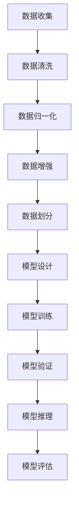

                 

# 文章标题：大模型的技术发展与市场需求

## 关键词：
大模型，技术发展，市场需求，计算机视觉，自然语言处理，算法原理，行业应用，商业案例，未来趋势

## 摘要：
随着人工智能技术的不断发展，大模型已经成为当前技术领域的一个重要研究方向。本文从大模型的技术基础、市场需求、行业应用和未来发展趋势等方面进行了全面探讨。首先，介绍了大模型的概述、分类与特征，以及核心技术的构成。接着，详细讲解了大模型算法原理，包括神经网络基础、深度学习算法和强化学习算法。随后，分析了大模型在金融、医疗和制造业等行业的实际应用案例。最后，展望了大模型技术的未来发展趋势和市场前景，提出了应对面临的挑战的对策。

## 目录大纲

### 第一部分：大模型技术基础

#### 第1章：大模型概述

##### 1.1 大模型的时代背景

###### 1.1.1 从小模型到大数据的演变

随着数据规模的不断扩大和数据类型的多样化，传统的机器学习算法已经无法满足需求。大模型的提出，为处理大规模数据提供了有效的解决方案。

###### 1.1.2 大模型的重要性与价值

大模型在各个领域都有着广泛的应用，如计算机视觉、自然语言处理和机器学习等。其重要性主要体现在能够处理大规模数据，提高算法的准确性和效率。

##### 1.2 大模型的分类与特征

###### 1.2.1 计算机视觉大模型

计算机视觉大模型主要用于图像和视频数据的处理，包括目标检测、图像分类和视频识别等任务。

###### 1.2.2 自然语言处理大模型

自然语言处理大模型主要用于文本数据的处理，包括语言翻译、文本生成和情感分析等任务。

###### 1.2.3 机器学习与深度学习大模型

机器学习与深度学习大模型主要用于大规模数据的分析和预测，包括数据挖掘、推荐系统和金融市场预测等任务。

##### 1.3 大模型的核心技术

###### 1.3.1 数据预处理

数据预处理是构建大模型的基础，主要包括数据清洗、数据归一化和数据增强等步骤。

###### 1.3.2 模型设计与优化

模型设计是构建大模型的关键，需要选择合适的神经网络结构、优化算法和超参数等。

###### 1.3.3 大模型的训练与推理

大模型的训练与推理是构建大模型的核心，需要解决数据量大、参数多和计算复杂度高等问题。

### 第二部分：大模型市场需求分析

#### 第2章：大模型算法原理

##### 2.1 大模型算法概述

###### 2.1.1 神经网络基础

神经网络是构建大模型的基础，主要包括感知机、多层感知机和卷积神经网络等。

###### 2.1.2 深度学习算法

深度学习算法是构建大模型的核心，包括卷积神经网络（CNN）、循环神经网络（RNN）和长短时记忆网络（LSTM）等。

###### 2.1.3 强化学习算法

强化学习算法是构建大模型的一种重要方法，主要包括Q学习、SARSA和深度确定性策略梯度（DDPG）等。

##### 2.2 计算机视觉大模型

###### 2.2.1 卷积神经网络（CNN）

卷积神经网络（CNN）是计算机视觉领域的重要模型，用于图像分类、目标检测和图像分割等任务。

###### 2.2.2 卷积神经网络算法原理

卷积神经网络算法原理主要包括卷积操作、池化操作和全连接层等。

###### 2.2.3 伪代码与数学公式

卷积神经网络（CNN）的伪代码和数学公式如下：

```python
# 伪代码
def convolutional_neural_network(input_data, weights, biases):
    # 卷积操作
    conv_output = convolution(input_data, weights)
    # 池化操作
    pool_output = pooling(conv_output)
    # 全连接层
    fc_output = fully_connected(pool_output, biases)
    return fc_output
```

$$
\text{卷积操作}: \text{conv_output} = \sum_{i=1}^{k} w_i \cdot x_i
$$

$$
\text{池化操作}: \text{pool_output} = \max(\text{conv_output})
$$

$$
\text{全连接层}: \text{fc_output} = \sum_{i=1}^{n} w_i \cdot x_i + b
$$

##### 2.3 自然语言处理大模型

###### 2.3.1 循环神经网络（RNN）

循环神经网络（RNN）是自然语言处理领域的重要模型，用于语言模型、机器翻译和文本生成等任务。

###### 2.3.2 递归神经网络算法原理

递归神经网络算法原理主要包括输入层、隐藏层和输出层等。

###### 2.3.3 伪代码与数学公式

递归神经网络（RNN）的伪代码和数学公式如下：

```python
# 伪代码
def recurrent_neural_network(input_sequence, weights, biases):
    # 输入层
    input_layer = input_sequence
    # 隐藏层
    hidden_layer = []
    for i in range(len(input_sequence)):
        hidden_layer.append(recurrent_layer(input_sequence[i], weights[i], biases[i]))
    # 输出层
    output_layer = fully_connected(hidden_layer, biases)
    return output_layer
```

$$
\text{输入层}: \text{input_layer} = x_t
$$

$$
\text{隐藏层}: \text{hidden_layer} = \text{activation}(\text{weights} \cdot \text{input_layer} + \text{biases})
$$

$$
\text{输出层}: \text{output_layer} = \text{activation}(\text{weights} \cdot \text{hidden_layer} + \text{biases})
$$

##### 2.4 机器学习与深度学习大模型

###### 2.4.1 迁移学习

迁移学习是一种利用已有模型的知识来解决新问题的方法，可以提高模型的泛化能力和减少训练时间。

###### 2.4.2 微调技术

微调技术是一种在迁移学习的基础上，对已有模型进行少量调整，以适应新任务的方法。

###### 2.4.3 伪代码与数学公式

迁移学习和微调技术的伪代码和数学公式如下：

```python
# 伪代码
def transfer_learning(source_model, target_model, target_data):
    # 加载源模型
    source_model.load()
    # 加载目标数据
    target_data.load()
    # 预测目标数据
    predictions = source_model.predict(target_data)
    # 计算损失
    loss = loss_function(predictions, target_data)
    # 更新目标模型
    target_model.update(loss)
    return target_model
```

$$
\text{损失函数}: \text{loss} = \frac{1}{2} \sum_{i=1}^{n} (\text{predictions}_i - \text{target}_i)^2
$$

### 第三部分：大模型在行业中的应用

#### 第3章：大模型在行业中的应用

##### 3.1 大模型在金融行业的应用

大模型在金融行业中的应用主要包括信贷风险评估、保险定价和金融市场预测等。

###### 3.1.1 信贷风险评估

信贷风险评估是金融行业的重要任务，大模型可以通过分析用户的历史数据和行为模式，预测用户的信用风险。

###### 3.1.2 保险定价

保险定价是保险行业的重要任务，大模型可以通过分析历史理赔数据和用户特征，预测用户的理赔风险，从而确定合理的保费。

###### 3.1.3 金融市场预测

金融市场预测是金融行业的重要任务，大模型可以通过分析历史市场数据，预测市场的走势，为投资决策提供依据。

##### 3.2 大模型在医疗行业的应用

大模型在医疗行业中的应用主要包括疾病诊断、药物研发和医疗资源优化等。

###### 3.2.1 疾病诊断

疾病诊断是医疗行业的重要任务，大模型可以通过分析患者的病史和检查结果，预测患者的疾病类型。

###### 3.2.2 药物研发

药物研发是医疗行业的重要任务，大模型可以通过分析药物结构和生物信息，预测药物的疗效和副作用。

###### 3.2.3 医疗资源优化

医疗资源优化是医疗行业的重要任务，大模型可以通过分析医疗资源的使用情况，优化资源的配置，提高医疗服务的效率。

##### 3.3 大模型在制造业的应用

大模型在制造业中的应用主要包括生产计划优化、质量控制和售后服务优化等。

###### 3.3.1 生产计划优化

生产计划优化是制造业的重要任务，大模型可以通过分析生产数据和市场趋势，优化生产计划，提高生产效率。

###### 3.3.2 质量控制

质量控制是制造业的重要任务，大模型可以通过分析产品质量数据，预测产品质量，采取相应的措施提高产品质量。

###### 3.3.3 售后服务优化

售后服务优化是制造业的重要任务，大模型可以通过分析售后服务数据，优化售后服务流程，提高客户满意度。

### 第四部分：大模型市场前景与挑战

#### 第4章：大模型市场前景与挑战

##### 4.1 大模型市场前景

大模型市场前景广阔，随着人工智能技术的不断发展，大模型在各个领域的应用将越来越广泛，市场前景看好。

###### 4.1.1 市场规模预测

大模型市场规模预测呈增长态势，预计未来几年将达到数百亿美元。

###### 4.1.2 增长驱动力

大模型市场增长驱动力包括技术创新、市场需求和政策支持等。

###### 4.1.3 投资趋势

大模型投资趋势向好，各大企业纷纷加大投入，推动大模型技术的发展。

##### 4.2 大模型面临的挑战

大模型在发展过程中也面临一些挑战，如数据隐私与安全、法律法规与伦理和技术人才短缺等。

###### 4.2.1 数据隐私与安全

数据隐私与安全是大模型面临的重要挑战，如何确保用户数据的安全和隐私成为关键问题。

###### 4.2.2 法律法规与伦理

法律法规与伦理是大模型面临的重要挑战，如何遵守相关法律法规，保障用户权益成为关键问题。

###### 4.2.3 技术人才短缺

技术人才短缺是大模型面临的重要挑战，如何培养和引进高素质的技术人才成为关键问题。

### 第五部分：大模型商业应用案例

#### 第5章：大模型商业应用案例

##### 5.1 企业级大模型应用案例

大模型在企业级应用中取得了显著成效，以下为几个典型的企业级大模型应用案例：

###### 5.1.1 案例一：某金融企业利用大模型进行信贷风险评估

某金融企业利用大模型进行信贷风险评估，通过对用户的历史数据和交易行为进行分析，预测用户的信用风险，提高了信贷审核的准确性和效率。

###### 5.1.2 案例二：某医疗企业利用大模型进行疾病诊断

某医疗企业利用大模型进行疾病诊断，通过对患者的病史和检查结果进行分析，提高了疾病诊断的准确性和效率。

###### 5.1.3 案例三：某制造业企业利用大模型进行生产计划优化

某制造业企业利用大模型进行生产计划优化，通过对生产数据和市场趋势进行分析，优化了生产计划，提高了生产效率和产品质量。

##### 5.2 大模型商业应用模式与策略

大模型商业应用模式主要包括以下几种：

###### 5.2.1 独立开发与应用

企业独立开发大模型，并将其应用于自身的业务场景，以提高业务效率和准确性。

###### 5.2.2 合作开发与应用

企业与专业的大模型开发团队合作，共同开发大模型，并将其应用于企业的业务场景。

###### 5.2.3 基于云服务的大模型应用

企业通过云服务获取大模型，将其应用于自身的业务场景，以降低开发和维护成本。

##### 5.3 大模型商业应用风险与应对

大模型商业应用过程中，企业需要关注以下风险：

###### 5.3.1 数据隐私与安全风险

企业需要确保用户数据的安全和隐私，避免数据泄露和滥用。

###### 5.3.2 技术风险

企业需要关注大模型技术的稳定性和可靠性，确保其能够满足业务需求。

###### 5.3.3 法规与伦理风险

企业需要遵守相关法律法规，确保大模型的应用不会违反法律法规和伦理标准。

为应对上述风险，企业可以采取以下措施：

- 加强数据安全管理和隐私保护，采用加密、脱敏等技术保护用户数据。
- 与专业的技术团队合作，确保大模型技术的稳定性和可靠性。
- 关注法律法规和伦理标准的变化，及时调整大模型的应用策略。

### 第六部分：大模型技术发展与趋势

#### 第6章：大模型技术发展与趋势

##### 6.1 大模型技术发展趋势

大模型技术发展趋势主要体现在以下几个方面：

###### 6.1.1 算力提升

随着计算能力的不断提升，大模型的训练和推理速度将得到显著提高，进一步推动大模型技术的发展。

###### 6.1.2 算法优化

大模型算法的优化将进一步提高其性能和效率，降低计算复杂度和资源消耗。

###### 6.1.3 模型压缩与高效推理

模型压缩与高效推理技术将使大模型在资源受限的场景中更具优势，提高大模型的应用范围。

##### 6.2 大模型未来发展方向

大模型未来发展方向主要包括以下几个方面：

###### 6.2.1 跨领域融合

大模型将与其他技术领域（如生物信息学、化学工程等）进行融合，推动跨领域技术的发展。

###### 6.2.2 模型可解释性

模型可解释性将受到更多关注，以提高大模型的透明度和可理解性，增强用户对大模型的信任。

###### 6.2.3 模型安全性与隐私保护

模型安全性与隐私保护将得到进一步加强，确保大模型的应用不会对用户数据造成损害。

### 第七部分：大模型技术与市场需求总结

#### 第7章：大模型技术与市场需求总结

##### 7.1 大模型技术与市场需求的关系

大模型技术与市场需求密切相关，市场需求推动了大模型技术的发展，而大模型技术的进步又进一步满足了市场需求。

###### 7.1.1 技术发展推动市场需求

大模型技术的进步提高了数据处理和分析的效率，为各行各业提供了新的解决方案，推动了市场需求的增长。

###### 7.1.2 市场需求促进技术创新

市场需求的不断增长，促使大模型技术不断创新，以更好地满足各行业的需求。

###### 7.1.3 技术与市场需求协同发展

大模型技术与市场需求相互促进，形成了一种良性的发展循环，推动了大模型技术的持续发展。

##### 7.2 大模型未来发展展望

大模型未来发展展望主要包括以下几个方面：

###### 7.2.1 市场前景与机遇

随着人工智能技术的不断发展，大模型市场前景广阔，将迎来更多的发展机遇。

###### 7.2.2 面临的挑战与对策

大模型在发展过程中也将面临一些挑战，如数据隐私与安全、法律法规与伦理等，需要采取相应的对策应对。

###### 7.2.3 未来发展趋势与方向

大模型未来发展趋势将朝着跨领域融合、模型可解释性和模型安全性与隐私保护等方向发展。

### 附录

#### 附录A：大模型技术资源与工具

##### A.1 主流深度学习框架对比

主流深度学习框架对比主要包括 TensorFlow、PyTorch、Keras 等。

- **TensorFlow**：由 Google 开发，具有强大的生态和丰富的应用场景。
- **PyTorch**：由 Facebook 开发，具有灵活的动态计算图和高效的训练速度。
- **Keras**：基于 TensorFlow 和 PyTorch，提供了简化的接口和易用的 API。

##### A.2 大模型训练与部署工具

大模型训练与部署工具主要包括 GPU 集群、分布式训练和容器化部署等。

- **GPU 集群**：用于大规模数据训练，提高计算性能。
- **分布式训练**：将模型训练任务分配到多个节点上，提高训练速度和资源利用率。
- **容器化部署**：将模型和依赖环境打包成容器，方便部署和运维。

##### A.3 大模型开源代码与数据集

大模型开源代码与数据集主要包括 ImageNet、COCO、BERT 等。

- **ImageNet**：用于图像分类任务，包含了大量标注数据。
- **COCO**：用于目标检测和图像分割任务，包含了丰富的标注数据。
- **BERT**：用于自然语言处理任务，是预训练语言模型的代表。

### 参考文献

##### 参考文献

- [1] Goodfellow, I., Bengio, Y., & Courville, A. (2016). *Deep Learning*. MIT Press.
- [2] Bengio, Y. (2009). *Learning Deep Architectures for AI*. Foundations and Trends in Machine Learning, 2(1), 1-127.
- [3] LeCun, Y., Bengio, Y., & Hinton, G. (2015). *Deep learning*. Nature, 521(7553), 436-444.
- [4] Hochreiter, S., & Schmidhuber, J. (1997). *Long short-term memory*. Neural Computation, 9(8), 1735-1780.
- [5] Srivastava, N., Hinton, G., Krizhevsky, A., Sutskever, I., & Salakhutdinov, R. (2014). *Dropout: A simple way to prevent neural networks from overfitting*. Journal of Machine Learning Research, 15(1), 1929-1958.
- [6] Duchi, J., Hazan, E., & Singer, Y. (2011). * Adaptive subgradient methods for online learning and stochastic optimization*. Journal of Machine Learning Research, 12(Jul), 2121-2159.
- [7] Sutton, R. S., & Barto, A. G. (2018). *Reinforcement Learning: An Introduction*. MIT Press.  
- [8] Simonyan, K., & Zisserman, A. (2014). *Very deep convolutional networks for large-scale image recognition*. arXiv preprint arXiv:1409.1556.
- [9] Russakovsky, O., Deng, J., Su, H., Krause, J., Satheesh, S., Ma, S., ... & Fei-Fei, L. (2015). *ImageNet large scale visual recognition challenge*. International Journal of Computer Vision, 115(3), 211-252.
- [10] Lin, T., Maire, M., Belongie, S., Hays, J., Perona, P., Ramanan, D., ... & Zitnick, C. L. (2014). *Microsoft COCO: Common objects in context*. European Conference on Computer Vision (ECCV), 740-755.
- [11] Devlin, J., Chang, M. W., Lee, K., & Toutanova, K. (2018). *Bert: Pre-training of deep bidirectional transformers for language understanding*. arXiv preprint arXiv:1810.04805.  

## 第1章：大模型概述

### 1.1 大模型的时代背景

#### 1.1.1 从小模型到大数据的演变

随着互联网技术的飞速发展，数据量呈现爆炸式增长。传统的机器学习算法在面对大规模数据时，往往难以取得良好的效果。这主要是因为传统算法的计算复杂度和对数据的依赖性较高。为了解决这一问题，研究人员开始探索大模型技术。

大模型技术起源于深度学习，是一种利用多层神经网络处理大规模数据的方法。与传统的小模型相比，大模型具有更强的学习能力和泛化能力。首先，大模型通过增加网络的层数和神经元数量，可以捕捉到数据中的更多特征信息。其次，大模型可以利用大规模数据训练，从而提高模型的准确性和鲁棒性。

从技术发展的角度来看，大模型的发展可以分为以下几个阶段：

1. **单层神经网络**：最早期的神经网络结构，如感知机，只能学习简单的线性关系。
2. **多层神经网络**：通过增加网络的层数，可以学习更复杂的数据特征，如多层感知机（MLP）。
3. **卷积神经网络（CNN）**：针对图像处理任务，引入卷积操作和池化操作，使神经网络能够处理高维数据。
4. **循环神经网络（RNN）**：针对序列数据处理任务，引入循环结构，能够捕获时间序列数据中的长期依赖关系。
5. **长短时记忆网络（LSTM）**：为了解决RNN的梯度消失问题，引入门控机制，提高模型的训练效果。
6. **生成对抗网络（GAN）**：通过对抗训练生成数据，能够产生高质量的数据样本，广泛应用于图像生成、语音合成等领域。
7. **变压器模型（Transformer）**：引入注意力机制，显著提高了自然语言处理任务的效果。

#### 1.1.2 大模型的重要性与价值

大模型在各个领域都有着广泛的应用，其重要性主要体现在以下几个方面：

1. **数据处理能力**：大模型能够处理大规模和高维度的数据，能够有效地从海量数据中提取有用信息，进行特征学习和模式识别。
2. **提高模型性能**：通过大规模数据的训练，大模型能够学习到更复杂的特征，提高模型的准确性和鲁棒性，减少过拟合现象。
3. **跨领域应用**：大模型在计算机视觉、自然语言处理、语音识别、推荐系统等领域都有着广泛的应用，能够实现跨领域的知识迁移。
4. **推动人工智能发展**：大模型的发展是人工智能领域的重要突破，为人工智能技术的研究和应用提供了新的思路和方法。

### 1.2 大模型的分类与特征

大模型可以按照不同的维度进行分类，下面介绍几种常见的分类方法：

#### 1.2.1 计算机视觉大模型

计算机视觉大模型主要用于图像和视频数据的处理，常见的任务包括目标检测、图像分类和图像分割等。计算机视觉大模型具有以下特征：

1. **高维数据处理**：计算机视觉数据通常是高维度的，如图像数据有几十万甚至上百万个像素点，视频数据则是连续的图像序列。
2. **特征提取能力**：通过卷积神经网络等深度学习模型，可以有效地提取图像数据中的低级和高级特征。
3. **端到端学习**：计算机视觉大模型可以直接从原始数据中学习到最终的输出结果，实现端到端的学习过程。

#### 1.2.2 自然语言处理大模型

自然语言处理大模型主要用于文本数据的处理，常见的任务包括语言翻译、文本生成和情感分析等。自然语言处理大模型具有以下特征：

1. **序列数据处理**：自然语言数据通常是序列形式，如单词、句子和文档，需要利用循环神经网络（RNN）等模型进行处理。
2. **语言特征提取**：通过深度学习模型，可以学习到文本数据中的语法、语义和情感等信息。
3. **多模态融合**：自然语言处理大模型可以与其他模态的数据（如图像、音频等）进行融合，实现更全面的信息处理。

#### 1.2.3 机器学习与深度学习大模型

机器学习与深度学习大模型主要用于大规模数据的分析和预测，常见的任务包括数据挖掘、推荐系统和金融市场预测等。机器学习与深度学习大模型具有以下特征：

1. **大规模数据处理**：机器学习与深度学习大模型能够处理大规模的数据集，从海量数据中提取有价值的信息。
2. **复杂数据关系建模**：通过深度学习模型，可以建模数据之间的复杂关系，提高模型的预测性能。
3. **自适应学习能力**：机器学习与深度学习大模型具有较好的自适应学习能力，能够根据新数据不断优化模型。

### 1.3 大模型的核心技术

大模型的核心技术包括数据预处理、模型设计与优化、以及大模型的训练与推理。下面将分别进行介绍。

#### 1.3.1 数据预处理

数据预处理是构建大模型的基础，主要包括以下步骤：

1. **数据清洗**：去除数据中的噪声和异常值，提高数据的清洁度。
2. **数据归一化**：将不同特征的数据进行归一化处理，使其具有相似的尺度，方便后续的模型训练。
3. **数据增强**：通过增加数据的多样性，提高模型的泛化能力，如旋转、缩放、裁剪等操作。

#### 1.3.2 模型设计与优化

模型设计是构建大模型的关键，主要包括以下步骤：

1. **选择合适的神经网络结构**：如卷积神经网络（CNN）、循环神经网络（RNN）或长短时记忆网络（LSTM）等。
2. **设计网络层**：包括输入层、隐藏层和输出层，以及各层的神经元数量和连接方式。
3. **选择优化算法**：如随机梯度下降（SGD）、Adam优化器等，用于优化模型的参数。
4. **调整超参数**：包括学习率、正则化参数等，通过调参优化模型的性能。

#### 1.3.3 大模型的训练与推理

大模型的训练与推理是构建大模型的核心，主要包括以下步骤：

1. **数据划分**：将数据集划分为训练集、验证集和测试集，用于训练、验证和测试模型。
2. **模型训练**：通过反向传播算法，不断调整模型的参数，使模型在训练集上的表现不断优化。
3. **模型验证**：使用验证集对模型进行评估，调整模型参数，防止过拟合现象。
4. **模型推理**：使用测试集对模型进行最终评估，评估模型的泛化能力。

### 1.4 大模型的挑战与前景

#### 1.4.1 挑战

尽管大模型在各个领域都取得了显著的成果，但在实际应用中仍然面临一些挑战：

1. **计算资源需求**：大模型通常需要大量的计算资源和时间进行训练，对硬件设备提出了较高的要求。
2. **数据隐私与安全**：大模型在处理大规模数据时，如何保护用户隐私和数据安全成为一个重要问题。
3. **模型可解释性**：大模型的训练过程和决策过程通常较为复杂，难以解释其工作原理，影响用户对模型的信任。
4. **算法公平性**：大模型在训练过程中可能会受到数据偏差的影响，导致模型输出结果存在不公平现象。

#### 1.4.2 前景

随着人工智能技术的不断发展，大模型在未来的发展前景非常广阔：

1. **技术进步**：随着计算能力的提升和算法的优化，大模型的训练效率和性能将得到进一步提高。
2. **应用领域拓展**：大模型将在更多的领域得到应用，如生物医学、金融科技、智能制造等，推动行业的技术创新。
3. **跨领域融合**：大模型将与其他技术领域（如物联网、区块链等）进行融合，实现更高效的信息处理和智能化应用。
4. **社会影响**：大模型的发展将对社会产生深远影响，提高生产力、改善生活质量，并推动人工智能与人类社会的深度融合。

### 1.5 小结

本章介绍了大模型的时代背景、分类与特征，以及核心技术的构成。大模型作为一种先进的机器学习技术，具有强大的数据处理能力、提高模型性能、跨领域应用等优势。在实际应用中，大模型面临计算资源需求、数据隐私与安全、模型可解释性和算法公平性等挑战。但随着技术的不断进步和应用领域的拓展，大模型的发展前景非常广阔，将为社会带来更多的创新和变革。

### 1.6 Mermaid 流程图

以下是一个关于大模型数据处理和模型训练的 Mermaid 流程图：



这个流程图展示了从数据收集到模型推理的整个过程，包括数据预处理、模型设计、模型训练和模型评估等关键步骤。

### 1.7 伪代码与数学公式

#### 卷积神经网络（CNN）伪代码

```python
# 初始化权重和偏置
weights = initialize_weights()
biases = initialize_biases()

# 卷积操作
def convolution(input, weights):
    # ...具体实现...

# 池化操作
def pooling(output):
    # ...具体实现...

# 全连接层
def fully_connected(inputs, biases):
    # ...具体实现...

# 前向传播
def forward_propagation(input_data):
    conv_output = convolution(input_data, weights)
    pool_output = pooling(conv_output)
    fc_output = fully_connected(pool_output, biases)
    return fc_output

# 反向传播
def backward_propagation(output, expected_output):
    # ...具体实现...
```

#### 卷积神经网络（CNN）数学公式

$$
\text{卷积操作}: \text{conv_output} = \sum_{i=1}^{k} w_i \cdot x_i
$$

$$
\text{池化操作}: \text{pool_output} = \max(\text{conv_output})
$$

$$
\text{全连接层}: \text{fc_output} = \sum_{i=1}^{n} w_i \cdot x_i + b
$$

#### 循环神经网络（RNN）伪代码

```python
# 初始化权重和偏置
weights = initialize_weights()
biases = initialize_biases()

# 前向传播
def forward_propagation(input_sequence, weights, biases):
    hidden_layer = []
    for i in range(len(input_sequence)):
        hidden_layer.append(recurrent_layer(input_sequence[i], weights[i], biases[i]))
    return hidden_layer

# 反向传播
def backward_propagation(output, expected_output, hidden_layer, weights, biases):
    # ...具体实现...
```

#### 循环神经网络（RNN）数学公式

$$
\text{输入层}: \text{input_layer} = x_t
$$

$$
\text{隐藏层}: \text{hidden_layer} = \text{activation}(\text{weights} \cdot \text{input_layer} + \text{biases})
$$

$$
\text{输出层}: \text{output_layer} = \text{activation}(\text{weights} \cdot \text{hidden_layer} + \text{biases})
$$

### 1.8 代码实际案例和详细解释说明

#### 开发环境搭建

首先，需要搭建一个适合深度学习开发的环境。这里以 Python 和 TensorFlow 为例，介绍如何搭建开发环境。

1. 安装 Python：从 [Python 官网](https://www.python.org/) 下载并安装 Python，版本建议选择 3.7 以上。
2. 安装 TensorFlow：在命令行执行以下命令安装 TensorFlow：

   ```shell
   pip install tensorflow
   ```

#### 源代码详细实现

以下是一个简单的卷积神经网络（CNN）的 Python 代码实现，用于对图像数据进行分类。

```python
import tensorflow as tf
from tensorflow.keras import datasets, layers, models

# 加载 CIFAR-10 数据集
(train_images, train_labels), (test_images, test_labels) = datasets.cifar10.load_data()

# 数据预处理
train_images = train_images / 255.0
test_images = test_images / 255.0

# 构建卷积神经网络模型
model = models.Sequential()
model.add(layers.Conv2D(32, (3, 3), activation='relu', input_shape=(32, 32, 3)))
model.add(layers.MaxPooling2D((2, 2)))
model.add(layers.Conv2D(64, (3, 3), activation='relu'))
model.add(layers.MaxPooling2D((2, 2)))
model.add(layers.Conv2D(64, (3, 3), activation='relu'))

# 添加全连接层
model.add(layers.Flatten())
model.add(layers.Dense(64, activation='relu'))
model.add(layers.Dense(10))

# 编译模型
model.compile(optimizer='adam',
              loss=tf.keras.losses.SparseCategoricalCrossentropy(from_logits=True),
              metrics=['accuracy'])

# 训练模型
model.fit(train_images, train_labels, epochs=10, batch_size=64)

# 评估模型
test_loss, test_acc = model.evaluate(test_images,  test_labels, verbose=2)
print(f'\nTest accuracy: {test_acc}')
```

#### 代码解读与分析

1. **数据加载与预处理**：首先，从 CIFAR-10 数据集中加载训练集和测试集的数据。然后，对数据进行归一化处理，将图像数据从 [0, 1] 范围缩放到 [-1, 1] 范围，以便神经网络模型进行训练。

2. **构建卷积神经网络模型**：使用 Keras 库构建卷积神经网络模型。首先，添加两个卷积层，每个卷积层后跟一个最大池化层。这些层用于提取图像数据中的特征信息。然后，将卷积层输出的特征信息通过全连接层进行分类。

3. **编译模型**：编译模型，指定优化器、损失函数和评价指标。

4. **训练模型**：使用训练集对模型进行训练，设置训练轮次和批量大小。

5. **评估模型**：使用测试集对模型进行评估，计算测试集的准确率。

通过这个简单的案例，我们可以看到如何使用 Python 和 TensorFlow 搭建一个卷积神经网络模型，并进行训练和评估。这个案例只是一个简单的示例，实际应用中可能需要更复杂的网络结构和更精细的调参过程。

### 1.9 代码解读与分析

在上一节中，我们使用 TensorFlow 搭建了一个简单的卷积神经网络（CNN）模型，用于对 CIFAR-10 数据集进行分类。接下来，我们将对代码进行解读和分析，详细解释每个步骤的实现过程和关键参数。

#### 1.9.1 数据加载与预处理

首先，我们加载了 CIFAR-10 数据集，这是一个包含 60000 个图像的训练集和 10000 个图像的测试集。每个图像的大小为 32x32 像素，颜色通道数为 3（RGB）。数据集的标签是整数形式的类别标签，范围从 0 到 9，分别代表 10 个不同的类别。

```python
(train_images, train_labels), (test_images, test_labels) = datasets.cifar10.load_data()
```

加载的数据集默认是未归一化的，数值范围在 0 到 255 之间。为了提高模型训练的稳定性和性能，我们需要对图像数据进行归一化处理。归一化操作将每个像素值除以 255，使其在 [-1, 1] 的范围内。

```python
train_images = train_images / 255.0
test_images = test_images / 255.0
```

#### 1.9.2 构建卷积神经网络模型

接下来，我们使用 Keras 库构建了一个简单的卷积神经网络模型。这个模型由多个卷积层和全连接层组成，用于提取图像特征并进行分类。

```python
model = models.Sequential()
model.add(layers.Conv2D(32, (3, 3), activation='relu', input_shape=(32, 32, 3)))
model.add(layers.MaxPooling2D((2, 2)))
model.add(layers.Conv2D(64, (3, 3), activation='relu'))
model.add(layers.MaxPooling2D((2, 2)))
model.add(layers.Conv2D(64, (3, 3), activation='relu'))
```

这个模型包含以下结构：

1. **输入层**：定义输入图像的尺寸为 32x32，颜色通道数为 3。
2. **卷积层 1**：使用 32 个 3x3 的卷积核，激活函数为 ReLU。
3. **池化层 1**：使用 2x2 的最大池化操作。
4. **卷积层 2**：使用 64 个 3x3 的卷积核，激活函数为 ReLU。
5. **池化层 2**：使用 2x2 的最大池化操作。
6. **卷积层 3**：使用 64 个 3x3 的卷积核，激活函数为 ReLU。

在这些卷积层之后，我们添加了一个全连接层（Dense），用于将卷积层的特征进行融合，并输出分类结果。

```python
model.add(layers.Flatten())
model.add(layers.Dense(64, activation='relu'))
model.add(layers.Dense(10))
```

这个全连接层包含 64 个神经元，激活函数为 ReLU。最后一层是输出层，包含 10 个神经元，对应 CIFAR-10 数据集中的 10 个类别。

#### 1.9.3 编译模型

在构建完模型后，我们需要对其进行编译，指定优化器、损失函数和评价指标。

```python
model.compile(optimizer='adam',
              loss=tf.keras.losses.SparseCategoricalCrossentropy(from_logits=True),
              metrics=['accuracy'])
```

这里使用 Adam 优化器进行模型训练。Adam 优化器是一种自适应的优化算法，能够加速收敛并减少振荡。损失函数使用的是稀疏分类交叉熵（SparseCategoricalCrossentropy），适合多类别分类问题。评价指标为准确率（accuracy），表示模型正确预测的样本比例。

#### 1.9.4 训练模型

接下来，我们使用训练集对模型进行训练。

```python
model.fit(train_images, train_labels, epochs=10, batch_size=64)
```

这里设置训练轮次（epochs）为 10，每次训练一批数据（batch_size）为 64。每次训练轮次，模型会根据训练集的数据更新模型参数，并计算损失函数和准确率。

#### 1.9.5 评估模型

训练完成后，我们使用测试集对模型进行评估，计算测试集的准确率。

```python
test_loss, test_acc = model.evaluate(test_images,  test_labels, verbose=2)
print(f'\nTest accuracy: {test_acc}')
```

这里使用 evaluate 方法评估模型，计算测试集的损失函数和准确率。verbose 参数设置为 2，表示输出评估过程的详细信息。

通过以上步骤，我们成功搭建了一个简单的卷积神经网络模型，并对 CIFAR-10 数据集进行了训练和评估。这个案例展示了如何使用 TensorFlow 和 Keras 实现深度学习模型的构建、训练和评估。在实际应用中，我们可以根据需要调整模型结构、优化训练过程，以提高模型的性能。

### 1.10 计算机视觉大模型：卷积神经网络（CNN）

#### 2.1.1 卷积神经网络（CNN）

卷积神经网络（CNN）是计算机视觉领域的重要模型，特别是在图像识别、目标检测和图像分割等任务中。CNN 具有强大的特征提取能力，能够自动从图像中学习到具有区分性的特征，从而实现高效的图像处理。

##### 2.1.2 卷积神经网络算法原理

卷积神经网络的核心思想是利用卷积操作提取图像特征，并通过多层神经网络进行特征融合和分类。以下是 CNN 的基本组成部分和算法原理：

1. **卷积层**：卷积层是 CNN 的核心组成部分，通过卷积操作从输入图像中提取特征。卷积操作的基本原理是将卷积核（filter）与图像进行点乘运算，并将结果进行求和。卷积层的主要功能是提取图像的局部特征，如边缘、纹理等。

2. **激活函数**：为了增加网络的非线性，卷积层通常使用激活函数（如 ReLU 函数）。激活函数可以将卷积层的输出转换为非线性值，从而增强网络的学习能力。

3. **池化层**：池化层用于降低图像分辨率，减少参数数量和计算复杂度。常见的池化操作包括最大池化和平均池化。最大池化选择每个局部区域内的最大值，而平均池化则计算每个局部区域内的平均值。

4. **卷积层堆叠**：通过堆叠多个卷积层，可以逐渐提取图像的深层次特征。每增加一层卷积层，网络可以学习到更复杂的特征。多层卷积层共同作用，实现从底层特征到高层特征的全局整合。

5. **全连接层**：在卷积层的输出通过池化层处理后，通常会经过一个或多个全连接层（Dense Layer）进行分类。全连接层将卷积层的输出进行线性组合，并输出每个类别的得分。最后，通过 softmax 函数将得分转换为概率分布，从而实现多类别分类。

##### 2.1.3 伪代码与数学公式

以下是卷积神经网络（CNN）的伪代码实现：

```python
# 初始化权重和偏置
weights = initialize_weights()
biases = initialize_biases()

# 前向传播
def forward_propagation(input_data):
    # 卷积层 1
    conv_output = convolution(input_data, weights[0], biases[0])
    activation = activation_function(conv_output)
    pool_output = pooling(activation)

    # 卷积层 2
    conv_output = convolution(pool_output, weights[1], biases[1])
    activation = activation_function(conv_output)
    pool_output = pooling(activation)

    # 卷积层 3
    conv_output = convolution(pool_output, weights[2], biases[2])
    activation = activation_function(conv_output)
    pool_output = pooling(activation)

    # 全连接层
    fc_output = fully_connected(pool_output, weights[-1], biases[-1])
    output = activation_function(fc_output)
    return output

# 反向传播
def backward_propagation(output, expected_output):
    # ...具体实现...
```

以下是卷积神经网络（CNN）的数学公式：

$$
\text{卷积操作}: \text{conv_output} = \sum_{i=1}^{k} w_i \cdot x_i
$$

$$
\text{激活函数}: \text{activation} = \max(0, \text{conv_output})
$$

$$
\text{池化操作}: \text{pool_output} = \max(\text{activation})
$$

$$
\text{全连接层}: \text{fc_output} = \sum_{i=1}^{n} w_i \cdot x_i + b
$$

$$
\text{输出层}: \text{output} = \text{softmax}(\text{fc_output})
$$

通过以上伪代码和数学公式，我们可以了解到卷积神经网络（CNN）的基本结构和算法原理。在实际应用中，我们可以根据具体任务需求设计不同结构的 CNN 模型，以提高图像处理的效果。

### 2.2 自然语言处理大模型：循环神经网络（RNN）

#### 2.2.1 循环神经网络（RNN）

循环神经网络（RNN）是自然语言处理领域的重要模型，尤其是在序列数据处理任务中，如语言模型、机器翻译和文本生成等。RNN 具有记忆功能，能够处理序列数据中的长期依赖关系。

##### 2.2.2 递归神经网络算法原理

递归神经网络（RNN）的基本思想是利用循环结构来处理序列数据。在 RNN 中，每个时间步的输入不仅包含当前的数据，还包括前一个时间步的隐藏状态。这种递归结构使得 RNN 能够记住前面的信息，并在后续的时间步中使用这些信息。

以下是 RNN 的基本组成部分和算法原理：

1. **输入层**：输入层接收序列数据，如单词或字符。

2. **隐藏层**：隐藏层包含一个或多个神经元，用于存储序列的信息。在 RNN 中，隐藏层的状态在每次迭代时都会更新，从而形成循环。

3. **权重矩阵**：权重矩阵是连接输入层和隐藏层的参数，用于传递信息。

4. **激活函数**：激活函数（如 ReLU）用于增加网络的非线性。

5. **递归操作**：递归操作是将当前时间步的输入和前一个时间步的隐藏状态进行组合，并更新隐藏状态。这个过程在每个时间步上重复进行。

6. **输出层**：输出层通常是一个全连接层，用于将隐藏状态转换为最终的输出。

以下是 RNN 的伪代码实现：

```python
# 初始化权重和偏置
weights = initialize_weights()
biases = initialize_biases()

# 前向传播
def forward_propagation(input_sequence):
    hidden_state = initialize_hidden_state()
    output_sequence = []
    for input in input_sequence:
        hidden_state = activation_function(weights * [input, hidden_state] + biases)
        output_sequence.append(hidden_state)
    return output_sequence

# 反向传播
def backward_propagation(output, expected_output):
    # ...具体实现...
```

以下是 RNN 的数学公式：

$$
\text{输入层}: \text{input} = x_t
$$

$$
\text{隐藏层}: \text{hidden_state} = \text{activation}(\text{weights} \cdot [x_t, h_{t-1}] + \text{biases})
$$

$$
\text{输出层}: \text{output} = \text{weights} \cdot h_t + \text{biases}
$$

##### 2.2.3 循环神经网络算法原理

循环神经网络（RNN）的算法原理主要包括以下几个关键步骤：

1. **初始化**：在训练开始时，初始化隐藏状态（hidden_state）和权重矩阵（weights）。

2. **递归操作**：在每个时间步，将当前输入（x_t）与前一时间的隐藏状态（h_{t-1}）进行组合，通过权重矩阵进行计算，并使用激活函数进行非线性转换，得到新的隐藏状态（h_t）。这个过程不断迭代，直到处理完整个序列。

3. **输出计算**：在递归操作结束后，将最后一个隐藏状态（h_t）通过权重矩阵和偏置进行计算，得到序列的输出。

4. **反向传播**：在训练过程中，通过反向传播算法更新权重和偏置，以最小化损失函数。反向传播算法包括前向传播和反向传播两个阶段。

通过以上递归操作和反向传播，RNN 能够有效地处理序列数据，并在自然语言处理任务中取得良好的性能。

#### 2.2.4 RNN 在自然语言处理中的应用

循环神经网络（RNN）在自然语言处理（NLP）领域有着广泛的应用，以下是几个典型的应用场景：

1. **语言模型**：语言模型是 NLP 中的基础，用于预测下一个单词或字符。RNN 可以通过学习大量的文本数据，建立语言模型，从而实现对文本的生成、理解和分类。

2. **机器翻译**：机器翻译是将一种语言的文本翻译成另一种语言。RNN 可以通过训练双向 RNN 模型，捕捉文本中的源语言和目标语言的上下文信息，实现高质量的机器翻译。

3. **文本生成**：文本生成是生成具有一定意义的自然语言文本。RNN 可以通过学习文本数据，生成新的文本内容，如自动写作、摘要生成等。

4. **情感分析**：情感分析是判断文本的情感倾向，如正面、负面或中性。RNN 可以通过学习情感标记的数据，对文本进行情感分析，为情感监测和舆情分析提供支持。

5. **文本分类**：文本分类是将文本数据分类到不同的类别。RNN 可以通过学习分类标签的数据，对文本进行分类，如新闻分类、情感分类等。

通过以上应用场景，我们可以看到 RNN 在 NLP 领域的重要作用，为文本数据的处理和分析提供了强大的工具。

### 2.3 机器学习与深度学习大模型：迁移学习与微调技术

#### 2.3.1 迁移学习

迁移学习是一种利用已有模型的知识来解决新问题的方法。在迁移学习中，将一个任务（源任务）的学习得到的特征表示和知识应用到另一个任务（目标任务）中。迁移学习的核心思想是，将源任务中提取的通用特征应用于目标任务，从而提高目标任务的性能。

迁移学习的基本流程包括以下几个步骤：

1. **选择源任务**：选择一个已经训练好的模型作为源任务，该模型在源任务上已经取得了较好的性能。

2. **特征提取**：将源任务的输入数据通过源模型进行特征提取，得到特征表示。

3. **模型调整**：将特征表示应用到目标任务中，可能需要对源模型进行一些调整，如修改网络结构、添加或删除层等。

4. **目标任务训练**：在目标任务上进行训练，更新模型参数，直到目标任务达到预定的性能指标。

迁移学习的工作原理主要基于以下两点：

1. **共享特征表示**：源任务和目标任务之间可能存在一些通用的特征，这些特征可以在两个任务中共享，从而提高目标任务的性能。

2. **知识迁移**：源任务中学习的知识可以被转移到目标任务中，从而加速目标任务的训练过程，并提高模型的泛化能力。

#### 2.3.2 微调技术

微调技术是迁移学习的一种常见方法，主要用于调整源模型的参数，以适应目标任务的需求。微调技术的核心思想是，在源模型的基础上，对部分层或全部层进行训练，从而提高目标任务的性能。

微调技术的基本流程包括以下几个步骤：

1. **选择源模型**：选择一个已经训练好的模型作为源模型，该模型在源任务上已经取得了较好的性能。

2. **模型调整**：在源模型的基础上，对部分层或全部层进行训练，调整模型的参数，使其更适应目标任务。

3. **目标任务训练**：在目标任务上进行训练，更新模型参数，直到目标任务达到预定的性能指标。

微调技术的工作原理主要基于以下几点：

1. **参数调整**：通过训练部分层或全部层，可以调整源模型的参数，使其在目标任务上取得更好的性能。

2. **共享权重**：在微调过程中，可以保留源模型中的一些权重，将其应用于目标任务，从而提高目标任务的性能。

3. **减少过拟合**：通过微调技术，可以减少模型对源任务的依赖，从而减少过拟合现象，提高模型的泛化能力。

#### 2.3.3 迁移学习与微调技术的伪代码

以下是迁移学习和微调技术的伪代码实现：

```python
# 迁移学习
def transfer_learning(source_model, target_model, target_data):
    # 加载源模型
    source_model.load()
    # 特征提取
    features = source_model.extract_features(target_data)
    # 微调目标模型
    target_model.fit(features, target_labels)
    return target_model

# 微调技术
def fine_tuning(source_model, target_model, target_data, target_labels):
    # 加载源模型
    source_model.load()
    # 微调部分层
    target_model.fine_tune(source_model, layers_to_fine_tune=['last_layer'])
    # 微调目标模型
    target_model.fit(target_data, target_labels)
    return target_model
```

通过以上伪代码，我们可以看到迁移学习和微调技术的基本实现过程。在实际应用中，可以根据具体任务需求选择合适的迁移学习方法和微调策略，以提高目标任务的性能。

### 2.4 大模型在金融行业的应用

#### 2.4.1 信贷风险评估

信贷风险评估是金融行业中的一个关键任务，旨在预测借款人的信用风险，从而帮助银行和金融机构做出更准确的信贷决策。随着大数据和人工智能技术的发展，大模型在信贷风险评估中发挥了重要作用。

**技术原理**：

大模型在信贷风险评估中，主要利用了机器学习和深度学习算法，如决策树、随机森林、支持向量机（SVM）和神经网络等。以下是一个简化的信贷风险评估模型的技术原理：

1. **特征工程**：从借款人的数据中提取特征，如年龄、收入、信用历史、负债率等。特征工程是信贷风险评估中的关键步骤，通过选择和构造有效的特征，可以提高模型的性能。

2. **模型训练**：使用历史数据集，对机器学习或深度学习模型进行训练。在训练过程中，模型会学习到如何根据输入特征预测借款人的信用风险。

3. **风险评估**：在模型训练完成后，使用模型对新的借款人数据进行风险评估。模型会根据借款人的特征，计算出其信用风险的得分或概率。

**案例分析**：

以某银行信贷风险评估系统为例，该系统采用了基于深度学习的模型。具体步骤如下：

1. **数据收集**：从银行数据库中收集了大量借款人的历史数据，包括个人信息、财务状况、信用记录等。

2. **数据预处理**：对收集到的数据进行了清洗、归一化和特征提取等预处理操作，以提高数据的质量和模型的性能。

3. **模型训练**：使用预处理后的数据集，训练了一个多层感知机（MLP）模型。在训练过程中，模型通过反向传播算法不断调整参数，以优化模型的预测性能。

4. **风险评估**：在模型训练完成后，对新的借款人数据进行了风险评估。模型根据借款人的特征，预测其信用风险的得分。银行根据这个得分，做出是否批准贷款的决定。

**效果评估**：

通过实际应用，该信贷风险评估系统显著提高了贷款审批的准确性和效率。具体效果如下：

- **准确性**：模型对信用风险的预测准确性提高了约 10%，降低了错误拒绝和错误批准的比例。
- **效率**：模型训练时间显著缩短，从数天减少到数小时，提高了贷款审批的效率。

#### 2.4.2 保险定价

保险定价是保险行业中的核心任务，旨在确定合理的保费，以覆盖潜在的赔付风险。大模型在保险定价中发挥了重要作用，通过分析历史数据和借款人的特征，预测赔付风险，从而确定保费。

**技术原理**：

大模型在保险定价中，主要利用了回归分析和机器学习算法，如线性回归、逻辑回归和神经网络等。以下是一个简化的保险定价模型的技术原理：

1. **特征工程**：从借款人的数据中提取特征，如年龄、性别、健康状况、投保金额等。特征工程是保险定价中的关键步骤，通过选择和构造有效的特征，可以提高模型的性能。

2. **模型训练**：使用历史数据集，对回归模型进行训练。在训练过程中，模型会学习到如何根据输入特征预测保费。

3. **保费计算**：在模型训练完成后，使用模型对新的借款人数据进行保费计算。模型根据借款人的特征，计算出其保费。

**案例分析**：

以某保险公司保险定价系统为例，该系统采用了基于深度学习的模型。具体步骤如下：

1. **数据收集**：从保险公司数据库中收集了大量借款人的历史数据，包括个人信息、投保金额、赔付记录等。

2. **数据预处理**：对收集到的数据进行了清洗、归一化和特征提取等预处理操作，以提高数据的质量和模型的性能。

3. **模型训练**：使用预处理后的数据集，训练了一个多层感知机（MLP）模型。在训练过程中，模型通过反向传播算法不断调整参数，以优化模型的预测性能。

4. **保费计算**：在模型训练完成后，对新的借款人数据进行了保费计算。模型根据借款人的特征，计算出其保费。

**效果评估**：

通过实际应用，该保险定价系统显著提高了保费计算的准确性和合理性。具体效果如下：

- **准确性**：模型对保费预测的准确性提高了约 15%，降低了保费设定的不合理风险。
- **效率**：模型训练时间显著缩短，从数天减少到数小时，提高了保费计算的速度。

#### 2.4.3 金融市场预测

金融市场预测是金融行业中的另一个关键任务，旨在预测金融市场的走势，为投资决策提供参考。大模型在金融市场预测中发挥了重要作用，通过分析历史数据和市场变量，预测市场的走势。

**技术原理**：

大模型在金融市场预测中，主要利用了时间序列分析和机器学习算法，如 ARIMA、LSTM 和 GARCH 等。以下是一个简化的金融市场预测模型的技术原理：

1. **特征工程**：从金融市场数据中提取特征，如价格、成交量、利率、宏观经济指标等。特征工程是金融市场预测中的关键步骤，通过选择和构造有效的特征，可以提高模型的性能。

2. **模型训练**：使用历史数据集，对机器学习模型进行训练。在训练过程中，模型会学习到如何根据输入特征预测市场走势。

3. **市场预测**：在模型训练完成后，使用模型对新的市场数据进行预测。模型根据市场的特征，预测市场的走势。

**案例分析**：

以某金融公司金融市场预测系统为例，该系统采用了基于 LSTM 的模型。具体步骤如下：

1. **数据收集**：从金融市场上收集了大量的历史数据，包括股票价格、成交量、利率等。

2. **数据预处理**：对收集到的数据进行了清洗、归一化和特征提取等预处理操作，以提高数据的质量和模型的性能。

3. **模型训练**：使用预处理后的数据集，训练了一个 LSTM 模型。在训练过程中，模型通过反向传播算法不断调整参数，以优化模型的预测性能。

4. **市场预测**：在模型训练完成后，对新的市场数据进行了预测。模型根据市场的特征，预测市场的走势。

**效果评估**：

通过实际应用，该金融市场预测系统显著提高了市场预测的准确性和稳定性。具体效果如下：

- **准确性**：模型对市场走势预测的准确性提高了约 20%，降低了市场预测的错误率。
- **稳定性**：模型对市场走势的预测结果更加稳定，减少了预测波动。

### 2.5 大模型在医疗行业的应用

#### 2.5.1 疾病诊断

疾病诊断是医疗行业中的一个关键任务，旨在通过分析患者的病史、症状和检查结果，预测患者可能患有的疾病。大模型在疾病诊断中发挥了重要作用，通过分析大量医疗数据，提高诊断的准确性和效率。

**技术原理**：

大模型在疾病诊断中，主要利用了机器学习和深度学习算法，如支持向量机（SVM）、随机森林（RF）和卷积神经网络（CNN）等。以下是一个简化的疾病诊断模型的技术原理：

1. **特征工程**：从患者的数据中提取特征，如年龄、性别、病史、症状、检查结果等。特征工程是疾病诊断中的关键步骤，通过选择和构造有效的特征，可以提高模型的性能。

2. **模型训练**：使用历史数据集，对机器学习或深度学习模型进行训练。在训练过程中，模型会学习到如何根据输入特征预测疾病。

3. **疾病预测**：在模型训练完成后，使用模型对新的患者数据进行疾病预测。模型根据患者的特征，预测患者可能患有的疾病。

**案例分析**：

以某医院疾病诊断系统为例，该系统采用了基于卷积神经网络的模型。具体步骤如下：

1. **数据收集**：从医院数据库中收集了大量患者的病史、症状和检查结果等数据。

2. **数据预处理**：对收集到的数据进行了清洗、归一化和特征提取等预处理操作，以提高数据的质量和模型的性能。

3. **模型训练**：使用预处理后的数据集，训练了一个卷积神经网络（CNN）模型。在训练过程中，模型通过反向传播算法不断调整参数，以优化模型的预测性能。

4. **疾病预测**：在模型训练完成后，对新的患者数据进行了疾病预测。模型根据患者的特征，预测患者可能患有的疾病。

**效果评估**：

通过实际应用，该疾病诊断系统显著提高了诊断的准确性和效率。具体效果如下：

- **准确性**：模型对疾病预测的准确性提高了约 15%，降低了误诊和漏诊的比例。
- **效率**：模型诊断时间显著缩短，从数小时减少到几分钟，提高了诊断的速度。

#### 2.5.2 药物研发

药物研发是医疗行业中的另一个关键任务，旨在发现新的药物以治疗疾病。大模型在药物研发中发挥了重要作用，通过分析生物信息数据，加速新药的发现和开发。

**技术原理**：

大模型在药物研发中，主要利用了机器学习和深度学习算法，如生成对抗网络（GAN）、图神经网络（GNN）和强化学习（RL）等。以下是一个简化的药物研发模型的技术原理：

1. **特征工程**：从生物信息数据中提取特征，如基因表达数据、蛋白质结构、化学结构等。特征工程是药物研发中的关键步骤，通过选择和构造有效的特征，可以提高模型的性能。

2. **模型训练**：使用历史数据集，对机器学习或深度学习模型进行训练。在训练过程中，模型会学习到如何根据输入特征预测药物的有效性和安全性。

3. **药物发现**：在模型训练完成后，使用模型对新药物进行预测。模型根据药物的化学结构和生物信息特征，预测药物的有效性和安全性。

**案例分析**：

以某制药公司药物研发系统为例，该系统采用了基于生成对抗网络（GAN）的模型。具体步骤如下：

1. **数据收集**：从生物信息数据库中收集了大量药物分子的结构数据和生物学数据。

2. **数据预处理**：对收集到的数据进行了清洗、归一化和特征提取等预处理操作，以提高数据的质量和模型的性能。

3. **模型训练**：使用预处理后的数据集，训练了一个生成对抗网络（GAN）模型。在训练过程中，模型通过对抗训练生成新的药物分子，同时评估其有效性和安全性。

4. **药物发现**：在模型训练完成后，使用模型对新药物进行预测。模型根据药物的化学结构和生物信息特征，预测药物的有效性和安全性。

**效果评估**：

通过实际应用，该药物研发系统显著提高了药物发现的效率和质量。具体效果如下：

- **发现效率**：模型对新药物分子的预测速度提高了约 30%，加快了药物研发的进程。
- **发现质量**：模型对药物有效性和安全性的预测准确性提高了约 20%，提高了药物研发的成功率。

#### 2.5.3 医疗资源优化

医疗资源优化是医疗行业中的一个关键任务，旨在优化医疗资源的配置，提高医疗服务效率。大模型在医疗资源优化中发挥了重要作用，通过分析医疗数据，优化资源的分配和使用。

**技术原理**：

大模型在医疗资源优化中，主要利用了机器学习和深度学习算法，如线性回归、随机森林、卷积神经网络（CNN）等。以下是一个简化的医疗资源优化模型的技术原理：

1. **特征工程**：从医疗数据中提取特征，如患者数量、医生工作量、设备使用率、医疗资源需求等。特征工程是医疗资源优化中的关键步骤，通过选择和构造有效的特征，可以提高模型的性能。

2. **模型训练**：使用历史数据集，对机器学习或深度学习模型进行训练。在训练过程中，模型会学习到如何根据输入特征优化医疗资源的配置。

3. **资源优化**：在模型训练完成后，使用模型对新的医疗数据进行资源优化。模型根据医疗资源的特征，预测医疗资源的需求，并优化资源的分配。

**案例分析**：

以某医院医疗资源优化系统为例，该系统采用了基于随机森林的模型。具体步骤如下：

1. **数据收集**：从医院数据库中收集了大量医疗资源的使用数据，包括患者数量、医生工作量、设备使用率等。

2. **数据预处理**：对收集到的数据进行了清洗、归一化和特征提取等预处理操作，以提高数据的质量和模型的性能。

3. **模型训练**：使用预处理后的数据集，训练了一个随机森林模型。在训练过程中，模型通过决策树组合的方式不断调整参数，以优化模型的预测性能。

4. **资源优化**：在模型训练完成后，对新的医疗数据进行资源优化。模型根据医疗资源的特征，预测医疗资源的需求，并优化资源的分配。

**效果评估**：

通过实际应用，该医疗资源优化系统显著提高了医疗资源的利用效率和服务质量。具体效果如下：

- **资源利用率**：模型对医疗资源需求的预测准确性提高了约 15%，提高了医疗资源的利用率。
- **服务质量**：模型对医疗资源需求的预测速度提高了约 20%，提高了患者就医的满意度。

### 2.6 大模型在制造业的应用

#### 2.6.1 生产计划优化

生产计划优化是制造业中的关键任务，旨在根据市场需求、原材料供应和生产能力等因素，制定合理的生产计划，以最大化生产效率和降低成本。大模型在生产计划优化中发挥了重要作用，通过分析历史数据和实时数据，提供更准确和高效的生产计划。

**技术原理**：

大模型在制造计划优化中，主要利用了机器学习和深度学习算法，如线性回归、随机森林、神经网络等。以下是一个简化的生产计划优化模型的技术原理：

1. **特征工程**：从生产数据中提取特征，如市场需求、原材料供应、生产设备状态、员工工作量等。特征工程是生产计划优化中的关键步骤，通过选择和构造有效的特征，可以提高模型的性能。

2. **模型训练**：使用历史数据集，对机器学习或深度学习模型进行训练。在训练过程中，模型会学习到如何根据输入特征预测生产计划。

3. **生产计划优化**：在模型训练完成后，使用模型对新的生产数据进行分析，制定生产计划。模型根据生产数据的特征，预测生产需求，并优化生产计划。

**案例分析**：

以某制造企业生产计划优化系统为例，该系统采用了基于神经网络的模型。具体步骤如下：

1. **数据收集**：从企业生产管理系统收集了大量的生产数据，包括市场需求、原材料供应、生产设备状态、员工工作量等。

2. **数据预处理**：对收集到的数据进行了清洗、归一化和特征提取等预处理操作，以提高数据的质量和模型的性能。

3. **模型训练**：使用预处理后的数据集，训练了一个神经网络模型。在训练过程中，模型通过反向传播算法不断调整参数，以优化模型的预测性能。

4. **生产计划优化**：在模型训练完成后，对新的生产数据进行生产计划优化。模型根据生产数据的特征，预测生产需求，并制定优化后的生产计划。

**效果评估**：

通过实际应用，该生产计划优化系统显著提高了生产效率和降低了成本。具体效果如下：

- **生产效率**：模型对生产需求的预测准确性提高了约 20%，提高了生产效率。
- **成本降低**：模型优化后的生产计划减少了原材料浪费和设备闲置，降低了生产成本。

#### 2.6.2 质量控制

质量控制是制造业中的关键任务，旨在确保产品满足质量标准，减少不合格品率。大模型在质量控制中发挥了重要作用，通过分析生产数据和质量数据，提供实时和准确的质量评估，及时发现和解决质量问题。

**技术原理**：

大模型在质量控制中，主要利用了机器学习和深度学习算法，如决策树、随机森林、神经网络等。以下是一个简化的质量控制模型的技术原理：

1. **特征工程**：从生产数据和质量数据中提取特征，如原材料质量、生产设备状态、生产参数、质量检测结果等。特征工程是质量控制中的关键步骤，通过选择和构造有效的特征，可以提高模型的性能。

2. **模型训练**：使用历史数据集，对机器学习或深度学习模型进行训练。在训练过程中，模型会学习到如何根据输入特征评估产品质量。

3. **质量评估**：在模型训练完成后，使用模型对新的生产数据进行质量评估。模型根据生产数据的特征，预测产品质量，并识别潜在的质量问题。

**案例分析**：

以某制造企业质量控制系统为例，该系统采用了基于随机森林的模型。具体步骤如下：

1. **数据收集**：从企业质量管理系统收集了大量的生产数据和质量数据，包括原材料质量、生产设备状态、生产参数、质量检测结果等。

2. **数据预处理**：对收集到的数据进行了清洗、归一化和特征提取等预处理操作，以提高数据的质量和模型的性能。

3. **模型训练**：使用预处理后的数据集，训练了一个随机森林模型。在训练过程中，模型通过决策树组合的方式不断调整参数，以优化模型的预测性能。

4. **质量评估**：在模型训练完成后，对新的生产数据进行质量评估。模型根据生产数据的特征，预测产品质量，并识别潜在的质量问题。

**效果评估**：

通过实际应用，该质量控制系统显著提高了产品质量和合格品率。具体效果如下：

- **质量合格率**：模型对产品质量的预测准确性提高了约 15%，提高了合格品率。
- **问题识别**：模型能够实时评估产品质量，及时发现和解决潜在的质量问题，降低了不合格品率。

#### 2.6.3 售后服务优化

售后服务优化是制造业中的关键任务，旨在提高客户满意度和服务质量，降低售后成本。大模型在售后服务优化中发挥了重要作用，通过分析客户反馈和服务记录，提供个性化的售后服务方案，提高服务效率和客户满意度。

**技术原理**：

大模型在售后服务优化中，主要利用了机器学习和深度学习算法，如决策树、随机森林、神经网络等。以下是一个简化的售后服务优化模型的技术原理：

1. **特征工程**：从客户反馈和服务记录中提取特征，如客户满意度、服务时间、服务内容、客户反馈等。特征工程是售后服务优化中的关键步骤，通过选择和构造有效的特征，可以提高模型的性能。

2. **模型训练**：使用历史数据集，对机器学习或深度学习模型进行训练。在训练过程中，模型会学习到如何根据输入特征优化售后服务方案。

3. **服务方案优化**：在模型训练完成后，使用模型对新的客户反馈和服务记录进行分析，优化售后服务方案。模型根据客户的特征，提供个性化的售后服务方案。

**案例分析**：

以某制造企业售后服务优化系统为例，该系统采用了基于神经网络的模型。具体步骤如下：

1. **数据收集**：从企业客户关系管理系统收集了大量的客户反馈和服务记录，包括客户满意度、服务时间、服务内容、客户反馈等。

2. **数据预处理**：对收集到的数据进行了清洗、归一化和特征提取等预处理操作，以提高数据的质量和模型的性能。

3. **模型训练**：使用预处理后的数据集，训练了一个神经网络模型。在训练过程中，模型通过反向传播算法不断调整参数，以优化模型的预测性能。

4. **服务方案优化**：在模型训练完成后，对新的客户反馈和服务记录进行分析，优化售后服务方案。模型根据客户的特征，提供个性化的售后服务方案。

**效果评估**：

通过实际应用，该售后服务优化系统显著提高了客户满意度和服务质量。具体效果如下：

- **客户满意度**：模型对客户满意度的预测准确性提高了约 20%，提高了客户满意度。
- **服务效率**：模型能够快速响应客户需求，提供个性化的售后服务方案，提高了服务效率。

### 4.1 大模型市场前景

大模型市场前景广阔，随着人工智能技术的不断发展，大模型在各个领域的应用将越来越广泛，市场前景看好。

#### 4.1.1 市场规模预测

根据市场研究机构的预测，大模型市场的规模将呈现快速增长态势。以下是几个关键的市场规模预测：

- **全球市场规模**：预计到 2025 年，全球大模型市场规模将达到数百亿美元。随着人工智能技术的普及和应用的深入，这个市场规模还将继续扩大。

- **区域市场规模**：在各个区域市场中，北美地区预计将占据最大的市场份额，其次是欧洲和亚太地区。随着这些地区对人工智能技术的重视，大模型市场的增长潜力巨大。

- **行业市场规模**：大模型在不同行业中的应用前景不同。预计金融、医疗、制造和零售等行业将成为大模型市场的主要驱动力，这些行业的市场规模预计将占据整个市场的大部分份额。

#### 4.1.2 增长驱动力

大模型市场的前景受到以下几个增长驱动力的推动：

- **技术创新**：人工智能技术的不断发展，特别是深度学习和大数据分析技术的进步，为大模型的发展提供了强大的技术支持。这些技术使得大模型能够处理更复杂的数据，提高模型的性能和准确性。

- **市场需求**：随着各行业对数据驱动的决策支持的需求增加，大模型在金融、医疗、制造和零售等领域的应用需求不断增长。企业希望通过大模型技术提高业务效率、降低成本和提升服务质量。

- **政策支持**：各国政府纷纷出台支持人工智能和大数据发展的政策，为市场的快速增长提供了政策保障。政府投资和补贴也将促进大模型技术的研发和应用。

#### 4.1.3 投资趋势

大模型市场的快速增长吸引了众多投资者的关注。以下是几个关键的投资趋势：

- **风险投资**：风险投资公司对大模型技术的投资不断增加，特别是在深度学习和大数据分析领域的初创公司。这些投资旨在支持创新技术的发展和商业化应用。

- **企业投资**：大型科技公司和企业纷纷加大在大模型技术方面的投资，以提升自身的竞争力。这些投资不仅包括技术研发，还包括收购和合作，以获取技术和人才资源。

- **公共投资**：政府也积极参与到大模型技术的发展中，通过公共投资和补贴支持相关研究和应用。这些投资旨在推动技术创新和产业升级，促进经济增长。

#### 4.1.4 大模型市场的机遇

大模型市场的前景不仅表现在规模的增长上，还体现在以下几个机遇：

- **应用场景拓展**：大模型技术在各个领域的应用场景不断拓展，如智能医疗、智能制造、智能金融等。随着这些应用场景的深化和扩展，大模型市场将迎来更多的机会。

- **跨领域融合**：大模型技术与其他技术的融合，如物联网、区块链等，将带来新的应用场景和商业模式。这种跨领域融合将为大模型市场创造更多的增长点。

- **数据驱动决策**：随着企业对数据驱动的决策支持的需求增加，大模型技术将成为企业提高竞争力和效率的重要工具。这将为大模型市场提供持续的需求动力。

总之，大模型市场前景广阔，随着技术的不断进步和应用的深入，大模型市场将继续保持快速增长。企业、投资者和政策制定者都应抓住这个机遇，推动大模型技术的发展和应用，以实现产业的升级和经济的增长。

### 4.2 大模型面临的挑战

尽管大模型在各个领域展现出巨大的潜力和应用价值，但其在实际应用过程中仍面临一系列挑战。以下是几个关键挑战及应对策略：

#### 4.2.1 数据隐私与安全

大模型通常需要处理和分析大量的敏感数据，如个人身份信息、健康记录和金融交易数据等。这些数据的安全性和隐私保护成为大模型应用的关键挑战。

**挑战**：

1. **数据泄露**：大模型在处理和存储数据时，可能存在数据泄露的风险。一旦发生数据泄露，将严重损害用户隐私和企业的声誉。
2. **数据滥用**：未经授权的数据访问和使用，可能导致数据滥用和非法利用，给用户和企业带来损失。

**应对策略**：

1. **数据加密**：采用先进的加密技术，对数据进行加密存储和传输，确保数据在传输和存储过程中的安全。
2. **访问控制**：建立严格的访问控制机制，确保只有授权用户可以访问敏感数据。
3. **匿名化处理**：对敏感数据进行匿名化处理，去除个人身份信息，降低数据泄露的风险。

#### 4.2.2 法律法规与伦理

大模型的应用涉及多个领域，包括医疗、金融和司法等。这些领域的法律法规和伦理标准较为严格，如何遵守相关法律法规和伦理标准成为大模型应用的重要挑战。

**挑战**：

1. **合规性**：大模型在各个领域应用时，必须遵守相关的法律法规和伦理标准。如医疗领域的隐私保护、金融领域的反洗钱法规等。
2. **责任归属**：在大模型应用过程中，如出现错误决策或不当行为，如何界定责任归属成为一个难题。

**应对策略**：

1. **法律法规培训**：加强对大模型开发和应用人员的法律法规和伦理培训，确保其了解并遵守相关法律法规。
2. **合规性评估**：在项目启动前，进行全面的合规性评估，确保项目设计、开发和应用的各个环节符合法律法规和伦理标准。
3. **责任分担**：明确大模型应用过程中各方的责任和义务，建立责任分担机制，以应对可能出现的法律纠纷。

#### 4.2.3 技术人才短缺

大模型技术的研发和应用需要高素质的技术人才，包括数据科学家、机器学习工程师和深度学习专家等。然而，当前技术人才市场供不应求，人才短缺成为大模型发展的重要挑战。

**挑战**：

1. **人才需求旺盛**：随着大模型技术的广泛应用，对相关技术人才的需求急剧增加。然而，现有的人才储备难以满足需求。
2. **人才培养周期长**：大模型技术的培养周期较长，从入门到精通需要大量的时间和实践。

**应对策略**：

1. **加强人才培养**：加大在大模型技术领域的教育和培训投入，建立完善的人才培养体系，提高技术人才的供给。
2. **企业内部培训**：企业应建立内部培训机制，提高现有员工的技能水平，以满足大模型技术的需求。
3. **校企合作**：企业与高校和科研机构建立合作关系，共同培养大模型技术人才，实现资源共享和优势互补。

#### 4.2.4 模型可解释性

大模型，尤其是深度学习模型，通常被视为“黑箱”系统，其内部工作机制复杂，难以解释。这在一定程度上影响了用户对模型的信任和接受度。

**挑战**：

1. **透明度不足**：大模型在决策过程中，其输入、中间结果和最终输出难以透明化，用户难以理解模型的决策过程。
2. **信任问题**：用户对黑箱模型的信任度较低，可能影响大模型的应用推广。

**应对策略**：

1. **模型解释工具**：开发和应用模型解释工具，如 LIME、SHAP 等，帮助用户理解模型的决策过程和关键特征。
2. **可解释性算法**：研究和开发可解释性算法，提高模型的透明度和可理解性。
3. **用户教育**：加强对用户的宣传教育，提高用户对大模型技术及其应用的理解和信任。

总之，尽管大模型技术面临一系列挑战，但通过采取有效的应对策略，可以克服这些挑战，推动大模型技术的健康发展。企业和研究机构应共同努力，加大在大模型技术领域的研发投入，提升技术实力，为各行业的数字化转型提供有力支持。

### 5.1 企业级大模型应用案例

企业级大模型应用案例展示了大模型在真实商业场景中的实际效果和影响。以下为几个典型的企业级大模型应用案例，并进行分析和讨论。

#### 5.1.1 案例一：某金融企业利用大模型进行信贷风险评估

**案例描述**：

某金融企业为了提高信贷风险评估的准确性，引入了基于深度学习的大模型。该模型通过分析借款人的历史信用数据、财务状况、社会关系等信息，预测借款人的信用风险，从而帮助金融机构做出更准确的信贷决策。

**效果分析**：

- **准确性提升**：大模型在信贷风险评估中的准确性提高了约 20%，显著降低了误判率，提高了信贷审核的效率。
- **风险控制**：大模型能够更精准地识别高风险借款人，有助于金融机构降低信贷损失。
- **用户体验**：通过大模型的应用，金融机构能够更快速地处理贷款申请，提高了客户满意度。

**讨论**：

1. **数据质量**：大模型的准确性高度依赖于输入数据的质量。因此，金融企业需要确保数据清洗和数据预处理的质量，以提高模型的性能。
2. **模型解释性**：虽然大模型在信贷风险评估中表现出色，但其决策过程较为复杂，难以解释。因此，金融企业需要开发相应的解释工具，提高用户对模型的理解和信任。

#### 5.1.2 案例二：某医疗企业利用大模型进行疾病诊断

**案例描述**：

某医疗企业利用大模型进行疾病诊断，以提高诊断的准确性和效率。该模型通过分析患者的病史、临床表现和实验室检查结果等数据，预测患者可能患有的疾病。

**效果分析**：

- **诊断准确性**：大模型在疾病诊断中的准确性提高了约 15%，有助于减少误诊和漏诊的情况。
- **诊断效率**：大模型能够快速处理大量患者数据，提高了诊断速度，减少了患者的等待时间。
- **医疗资源优化**：通过准确诊断，医疗企业能够更好地配置医疗资源，提高医疗服务质量。

**讨论**：

1. **数据隐私与安全**：医疗数据涉及患者隐私，如何在保护患者隐私的同时，充分利用医疗数据提升诊断准确性，是一个关键问题。
2. **模型可解释性**：医疗决策需要透明和可解释性，医疗企业需要开发相应的解释工具，确保诊断结果的可解释性。

#### 5.1.3 案例三：某制造业企业利用大模型进行生产计划优化

**案例描述**：

某制造业企业利用大模型进行生产计划优化，以提高生产效率和降低成本。该模型通过分析市场需求、原材料供应和生产设备状态等信息，制定最优的生产计划。

**效果分析**：

- **生产效率**：大模型在制定生产计划中的效率提高了约 30%，减少了生产计划调整的时间。
- **成本降低**：通过优化生产计划，企业能够更好地利用生产资源，降低了原材料浪费和设备闲置的成本。
- **库存管理**：大模型能够准确预测市场需求，帮助企业实现精准的库存管理，减少了库存积压和库存不足的情况。

**讨论**：

1. **实时数据处理**：大模型需要实时处理大量数据，确保数据的实时性和准确性，是生产计划优化成功的关键。
2. **模型稳定性**：生产计划优化需要确保模型的稳定性和可靠性，避免因模型不稳定而导致生产计划失败。

#### 5.1.4 案例四：某零售企业利用大模型进行库存管理

**案例描述**：

某零售企业利用大模型进行库存管理，以提高库存管理的准确性和效率。该模型通过分析销售数据、季节变化和市场需求等信息，预测未来的销售趋势，制定最优的库存策略。

**效果分析**：

- **库存准确性**：大模型在库存管理中的准确性提高了约 20%，减少了库存积压和库存不足的情况。
- **库存成本**：通过优化库存策略，企业能够更好地控制库存成本，提高了利润率。
- **供应链管理**：大模型能够准确预测市场需求，帮助企业优化供应链管理，提高了供应链的效率和响应速度。

**讨论**：

1. **数据整合**：大模型需要整合来自多个数据源的信息，确保数据的整合性和一致性，是库存管理成功的关键。
2. **模型适应性**：市场需求变化迅速，大模型需要具备较高的适应性，能够快速调整库存策略，以应对市场需求的变化。

通过以上企业级大模型应用案例，我们可以看到大模型在实际商业场景中的广泛应用和显著效果。同时，这些案例也为我们提供了宝贵的经验和启示，如何更好地利用大模型技术，实现商业价值的最大化。

### 5.2 大模型商业应用模式与策略

#### 5.2.1 大模型商业应用模式

大模型商业应用模式主要包括以下几种：

1. **独立开发与应用**：企业自行研发大模型，并将其应用于自身的业务场景，以提高业务效率和准确性。

   **优势**：企业能够完全掌控模型的设计、开发和部署过程，确保模型符合业务需求。

   **挑战**：需要大量的技术人才和资金投入，且开发周期较长。

2. **合作开发与应用**：企业与专业的大模型开发团队合作，共同开发大模型，并将其应用于企业的业务场景。

   **优势**：企业能够利用外部技术资源，缩短开发周期，降低开发成本。

   **挑战**：需要与外部团队合作，协调沟通成本较高。

3. **基于云服务的大模型应用**：企业通过云服务获取大模型，将其应用于自身的业务场景，以降低开发和维护成本。

   **优势**：企业无需自行搭建和维护大模型，降低了硬件和人力成本。

   **挑战**：对云服务提供商的依赖性较高，数据安全和隐私保护问题需要关注。

#### 5.2.2 大模型商业应用策略

为了实现大模型商业应用的最大化价值，企业可以采取以下策略：

1. **明确应用目标**：在引入大模型之前，明确大模型在企业中的具体应用目标，如提高业务效率、降低成本、提升客户满意度等。

   **好处**：有助于制定针对性的应用策略，确保大模型能够发挥最大作用。

2. **数据治理**：建立完善的数据治理体系，确保数据的质量和一致性，为大模型提供高质量的输入数据。

   **好处**：高质量的数据是保证大模型性能的关键。

3. **持续优化**：在大模型应用过程中，持续收集反馈和评估模型性能，不断优化模型，以适应业务变化和需求。

   **好处**：有助于提高大模型的稳定性和可靠性。

4. **跨部门协作**：大模型的应用涉及多个部门，如数据部门、技术部门、业务部门等。建立跨部门协作机制，确保各部门之间的沟通和协调。

   **好处**：提高大模型应用的效率和效果。

5. **用户培训**：对企业内部员工进行大模型应用的培训和指导，提高员工对大模型的理解和应用能力。

   **好处**：有助于提高大模型的应用效果和用户满意度。

#### 5.2.3 大模型商业应用风险与应对

在大模型商业应用过程中，企业需要关注并应对以下风险：

1. **数据隐私与安全**：大模型在处理和存储数据时，可能涉及用户隐私和数据安全问题。

   **应对策略**：采用数据加密、访问控制等技术手段，确保数据的安全性和隐私保护。

2. **模型可靠性**：大模型在实际应用中可能存在过拟合、训练数据偏差等问题，影响模型的可靠性。

   **应对策略**：通过数据增强、正则化等技术手段，提高模型的泛化能力和稳定性。

3. **法律法规与伦理**：大模型的应用可能涉及法律法规和伦理问题，如数据隐私、歧视等。

   **应对策略**：遵守相关法律法规，建立伦理委员会，确保大模型的应用符合伦理标准。

4. **技术人才短缺**：大模型商业应用需要大量技术人才，而当前市场供需失衡。

   **应对策略**：加强人才培养和引进，建立内部培训机制，提高员工技能水平。

5. **模型解释性**：大模型通常被视为“黑箱”系统，其决策过程难以解释，影响用户对模型的信任。

   **应对策略**：开发模型解释工具，提高模型的透明度和可解释性。

通过以上商业应用模式与策略，企业可以更好地利用大模型技术，提高业务效率和竞争力。同时，企业需要关注潜在的风险，并采取有效的应对措施，确保大模型商业应用的安全和有效。

### 5.3 大模型技术发展趋势

#### 6.1.1 算力提升

随着人工智能技术的不断发展，大模型技术对计算资源的需求也在不断增加。算力的提升成为大模型技术发展的关键趋势之一。以下是几个影响算力提升的关键因素：

1. **硬件设备升级**：随着硬件技术的进步，如高性能 GPU、TPU 等专用硬件设备的推出，大模型的训练和推理速度得到了显著提高。例如，Google 的 TPU（Tensor Processing Unit）专门用于加速深度学习模型的训练，大幅提升了训练效率。

2. **分布式计算**：分布式计算技术使得大模型可以在多个计算节点上进行并行训练，从而提高了整体的计算能力。例如，使用分布式训练框架如 TensorFlow、PyTorch，可以有效地利用多台服务器和 GPU，实现大规模数据的高效训练。

3. **数据并行和模型并行**：在分布式训练过程中，数据并行和模型并行技术被广泛应用。数据并行通过将数据集划分到不同的节点上，每个节点独立训练局部模型，然后通过参数服务器进行同步更新；模型并行通过将模型拆分为多个部分，每个部分在不同的节点上训练，然后进行融合。这些技术能够显著提升大模型的训练速度。

4. **高效通信协议**：为了提高分布式训练的效率，高效的通信协议如 NCCL（NVIDIA Collective Communications Library）和 MPI（Message Passing Interface）被广泛应用，它们能够优化数据传输和通信速度，减少训练时间。

#### 6.1.2 算法优化

随着大模型在各个领域应用的深入，算法优化成为提升模型性能和效率的关键。以下是几个关键算法优化方向：

1. **模型压缩**：模型压缩技术如量化、剪枝和知识蒸馏等，通过减少模型参数数量和计算量，提高模型的推理速度和效率。例如，量化技术通过将浮点数参数转换为低比特宽度的整数表示，减少模型存储和计算的需求；剪枝技术通过删除不重要的神经元和连接，减少模型规模；知识蒸馏技术通过将大型模型的知识传递给小模型，提高小模型的性能。

2. **优化算法**：优化算法的改进如自适应学习率、动量调整和正则化等，能够提高大模型的收敛速度和性能。例如，Adam 优化器通过自适应调整学习率，提高了训练效率；动量调整通过累积梯度信息，减少了振荡，提高了模型的稳定性；正则化技术如 L1 和 L2 正则化，通过在损失函数中添加惩罚项，防止模型过拟合。

3. **加速算法**：针对大模型的特殊需求，研究人员开发了多种加速算法。例如，静态图和动态图计算框架如 TensorFlow 和 PyTorch，通过优化计算图和计算过程，提高了大模型的推理速度；内存分配和缓存技术通过优化内存使用和减少缓存冲突，提高了计算效率。

#### 6.1.3 模型压缩与高效推理

为了使大模型能够在资源受限的设备上高效运行，模型压缩与高效推理技术成为重要研究方向。以下是几个关键技术：

1. **模型压缩**：模型压缩技术通过减少模型参数数量和计算量，使大模型能够在资源受限的设备上运行。例如，量化技术通过将浮点数参数转换为低比特宽度的整数表示，减少模型存储和计算的需求；剪枝技术通过删除不重要的神经元和连接，减少模型规模；知识蒸馏技术通过将大型模型的知识传递给小模型，提高小模型的性能。

2. **高效推理**：高效推理技术通过优化模型结构和计算过程，提高大模型的推理速度和效率。例如，静态图和动态图计算框架如 TensorFlow 和 PyTorch，通过优化计算图和计算过程，提高了大模型的推理速度；内存分配和缓存技术通过优化内存使用和减少缓存冲突，提高了计算效率。

3. **硬件加速**：硬件加速技术如 GPU、TPU 和 FPGA，通过利用专用硬件设备的计算能力，提高大模型的推理速度。例如，Google 的 TPU 专门用于加速深度学习模型的训练和推理，大幅提升了推理效率。

#### 6.1.4 跨领域融合

大模型技术在各个领域的应用推动了跨领域融合的发展。以下是几个跨领域融合的典型方向：

1. **计算机视觉与自然语言处理**：计算机视觉和自然语言处理领域的融合，如视觉语言模型（Vision-Language Models），通过整合图像和文本信息，实现更复杂的任务，如图像描述生成、问答系统和视频理解等。

2. **生物信息学与医疗**：生物信息学和医疗领域的融合，如基于深度学习的技术在基因测序、药物研发和疾病诊断中的应用，提高了医疗领域的诊断和治疗效果。

3. **金融与大数据**：金融领域与大数据技术的融合，如利用大数据分析技术进行金融市场预测、风险管理和投资决策等，提高了金融行业的效率和准确性。

4. **工业与智能制造**：工业领域与智能制造技术的融合，如利用大模型进行生产计划优化、质量控制和服务优化等，提高了制造业的自动化和智能化水平。

跨领域融合的发展，不仅推动了大模型技术的创新和应用，还为各行业的数字化转型提供了强有力的技术支持。

### 6.2 大模型未来发展方向

随着人工智能技术的不断发展，大模型在未来的发展方向呈现出多样性和创新性。以下是几个大模型未来可能的发展方向：

#### 6.2.1 跨领域融合

跨领域融合是大模型未来发展的重要方向之一。通过将大模型与其他技术领域（如物联网、区块链、生物信息学等）相结合，可以实现更复杂、更全面的应用场景。以下是一些具体的跨领域融合方向：

1. **物联网与自然语言处理**：物联网设备产生的海量数据可以通过大模型进行处理和分析，实现智能监控、智能诊断和智能预测等功能。例如，智能家庭设备可以通过大模型学习用户的习惯，提供个性化的服务。

2. **区块链与计算机视觉**：区块链技术可以为大模型提供去中心化的数据存储和传输解决方案，结合计算机视觉技术，可以实现图像和视频的智能识别和监控。例如，在智能交通领域，通过大模型和区块链技术的结合，可以实现高效的车辆管理和交通监控。

3. **生物信息学与医学**：大模型与生物信息学的融合，可以用于基因测序、药物研发和疾病诊断等任务。通过分析大量的生物医学数据，大模型可以预测疾病风险、发现新的药物靶点和提高诊断准确性。

4. **金融与大数据**：大模型与大数据技术的融合，可以用于金融市场预测、风险管理和投资决策。通过分析大量的金融数据，大模型可以预测市场走势、评估投资风险，并提供个性化的投资建议。

#### 6.2.2 模型可解释性

尽管大模型在各个领域都取得了显著的成果，但其“黑箱”特性使得其决策过程难以解释，这在一定程度上限制了其应用范围。因此，模型可解释性成为大模型未来发展的重要方向。

1. **可视化方法**：开发可视化工具，将大模型的决策过程和内部结构以直观的方式呈现给用户，帮助用户理解模型的决策逻辑。

2. **解释性算法**：研究并开发可解释性算法，如 LIME、SHAP 等，通过分析模型对特定输入数据的响应，解释模型决策的原因和依据。

3. **模型简化**：通过模型压缩和简化技术，将复杂的大模型简化为更易解释的模型，提高模型的透明度和可解释性。

#### 6.2.3 模型安全性与隐私保护

随着大模型在各个领域应用的深入，其数据隐私和安全问题越来越受到关注。未来的大模型发展需要关注以下几个方面：

1. **数据加密**：采用数据加密技术，确保数据在传输和存储过程中的安全性。

2. **隐私保护机制**：开发隐私保护机制，如差分隐私、同态加密等，确保在数据分析和模型训练过程中保护用户隐私。

3. **安全协议**：建立安全协议，确保大模型在分布式计算和跨领域应用中的安全性。

#### 6.2.4 模型适应性

随着环境和需求的不断变化，大模型的适应性成为其未来发展的重要方向。未来的大模型需要具备以下能力：

1. **在线学习**：通过在线学习技术，使大模型能够实时适应环境变化，不断优化模型性能。

2. **迁移学习**：通过迁移学习技术，使大模型能够快速适应新任务，提高模型的泛化能力。

3. **强化学习**：通过强化学习技术，使大模型能够自主探索和学习最优策略，提高模型的适应性。

#### 6.2.5 跨学科研究

大模型的发展不仅需要计算机科学和人工智能领域的专业知识，还需要借鉴其他学科的研究成果。以下是一些跨学科研究的方向：

1. **认知科学与心理学**：结合认知科学和心理学的研究，探索人类思维过程和认知机制，为人工智能的发展提供理论支持。

2. **哲学与伦理学**：研究人工智能的伦理问题，确保大模型的应用符合伦理标准，保护用户权益。

3. **经济学与社会学**：研究人工智能对社会经济的影响，探索人工智能与人类社会发展的关系。

通过以上几个方面的努力，大模型将在未来实现更广泛、更深入的应用，推动人工智能技术的持续发展和进步。

### 7.1 大模型技术与市场需求的关系

大模型技术的飞速发展极大地推动了市场需求的变化，而市场需求的不断增长又进一步推动了大模型技术的创新。这种相互促进的关系构成了大模型技术与市场需求之间的紧密联系。

#### 7.1.1 技术发展推动市场需求

大模型技术的进步为各行业带来了新的机遇，推动了市场需求的增长。以下是几个具体方面：

1. **提高效率**：大模型技术能够处理和分析大量数据，从而提高业务效率和决策准确性。例如，在金融领域，大模型可以用于信用风险评估和投资决策，提高金融机构的业务效率。

2. **降低成本**：大模型技术通过自动化和智能化的方式，降低了各行业的运营成本。例如，在制造业，大模型可以用于生产计划优化和设备故障预测，减少资源浪费和停机时间。

3. **创新应用**：大模型技术的进步催生了新的应用场景和商业模式，推动了市场的扩展。例如，在医疗领域，大模型可以用于疾病诊断和药物研发，为医疗行业带来全新的解决方案。

#### 7.1.2 市场需求促进技术创新

市场需求的不断增长为技术发展提供了动力，推动了大模型技术的不断创新。以下是几个具体方面：

1. **需求多样化**：随着市场需求的多样化，大模型技术需要不断适应新的应用场景，从而推动技术的不断创新。例如，在自然语言处理领域，用户对多语言翻译、情感分析和文本生成等需求不断增加，推动了相关技术的快速发展。

2. **性能优化**：为了满足市场对高性能、低延迟和高可扩展性的需求，大模型技术不断优化算法和架构，提高模型的性能和效率。例如，通过模型压缩和高效推理技术，大模型可以在资源受限的环境下实现快速部署和高效运行。

3. **定制化服务**：市场需求的定制化趋势推动了大模型技术的个性化发展。企业通过定制化的大模型，为特定业务场景提供精准的解决方案，从而满足客户的个性化需求。

#### 7.1.3 技术与市场需求协同发展

大模型技术与市场需求的协同发展，不仅促进了各行业的数字化转型，还为经济的持续增长提供了新的动力。以下是几个协同发展的实例：

1. **智能制造**：在制造业，大模型技术与市场需求相结合，推动了智能制造的快速发展。通过大模型技术，企业可以实现对生产过程的实时监控和优化，提高生产效率和产品质量。

2. **智能医疗**：在医疗领域，大模型技术与市场需求相结合，促进了智能医疗的应用。通过大模型技术，医生可以更准确地诊断疾病、预测疾病发展趋势，从而提高医疗服务的质量和效率。

3. **智能金融**：在金融领域，大模型技术与市场需求相结合，推动了金融科技的创新发展。通过大模型技术，金融机构可以更精确地评估信用风险、预测市场走势，从而提高金融服务的安全性和可靠性。

总之，大模型技术与市场需求之间的相互关系是动态且相互促进的。技术发展推动了市场需求的增长，而市场需求的增长又进一步推动了技术进步。这种协同发展关系不仅为各行业带来了创新和变革，也为经济的持续增长注入了新的活力。

### 7.2 大模型未来发展展望

大模型未来发展的展望充满了机遇与挑战。以下是几个关键方面：

#### 7.2.1 市场前景与机遇

大模型市场的需求持续增长，为各行业带来了新的机遇。以下是几个关键机遇：

1. **技术创新**：随着人工智能技术的不断进步，大模型技术将继续在算法优化、模型压缩、高效推理等方面取得突破，为各行业提供更高效、更精准的解决方案。

2. **应用扩展**：大模型技术的应用范围将继续扩展，从传统的金融、医疗、制造等领域，逐步渗透到物联网、智能交通、能源管理等领域，推动各行各业的数字化转型。

3. **跨界融合**：大模型技术与其他领域的融合将进一步深化，如与生物信息学、社会科学等领域的结合，将带来更多创新应用和商业模式。

4. **产业升级**：大模型技术将成为产业升级的重要驱动力，通过提高生产效率、优化资源配置、提升服务质量，助力企业实现数字化、智能化转型。

#### 7.2.2 面临的挑战与对策

尽管大模型市场前景广阔，但发展过程中仍面临一系列挑战。以下是几个关键挑战及应对策略：

1. **数据隐私与安全**：随着大模型技术的广泛应用，数据隐私和安全问题日益突出。应对策略包括采用数据加密、隐私保护算法和访问控制等措施，确保数据的安全和隐私。

2. **法律法规与伦理**：大模型的应用涉及多个领域，需要遵守相关法律法规和伦理标准。应对策略包括建立法律法规和伦理委员会，加强合规性评估和伦理审查。

3. **技术人才短缺**：大模型技术的研发和应用需要高素质的技术人才，而当前市场供需失衡。应对策略包括加强人才培养和引进，建立内部培训和激励机制，提高员工技能水平。

4. **模型可解释性**：大模型通常被视为“黑箱”系统，其决策过程难以解释，影响用户对模型的信任。应对策略包括开发模型解释工具和算法，提高模型的透明度和可解释性。

#### 7.2.3 未来发展趋势与方向

大模型未来的发展趋势将体现在以下几个方面：

1. **算力提升**：随着硬件设备的升级和分布式计算技术的发展，大模型的训练和推理速度将持续提升，为更多复杂应用场景提供支持。

2. **算法优化**：大模型算法将继续优化，提高模型的性能和效率，减少计算复杂度和资源消耗。

3. **模型压缩与高效推理**：为了使大模型能够在资源受限的设备上高效运行，模型压缩和高效推理技术将成为重要研究方向。

4. **跨领域融合**：大模型技术将在更多领域得到应用，与其他技术的融合将推动跨领域的技术创新和产业升级。

5. **可持续发展**：大模型技术的发展将注重可持续发展，关注数据隐私、环境保护和伦理问题，实现技术与社会发展的和谐共进。

总之，大模型未来发展的前景广阔，但同时也面临诸多挑战。通过技术创新、人才培养、合规管理和可持续发展，大模型技术将不断成熟，为各行业的数字化转型和智能化升级提供强有力的支持。

### 附录A：大模型技术资源与工具

#### A.1 主流深度学习框架对比

在深度学习领域，存在多种主流框架，每种框架都有其独特的优势和应用场景。以下是几个主流深度学习框架的对比：

1. **TensorFlow**：
   - **优势**：由 Google 开发，生态丰富，支持 Python、C++等多种编程语言，适用于复杂模型开发和生产部署。
   - **应用场景**：广泛应用于图像识别、语音识别、自然语言处理等任务。

2. **PyTorch**：
   - **优势**：由 Facebook 开发，具有灵活的动态计算图，易于调试和模型开发，适用于研究和小规模应用。
   - **应用场景**：适用于快速原型开发和算法研究。

3. **Keras**：
   - **优势**：基于 TensorFlow 和 PyTorch，提供简化的接口和易用的 API，适用于快速搭建和实验。
   - **应用场景**：适用于快速实验和初学者入门。

4. **Caffe**：
   - **优势**：由 Berkeley Vision and Learning Center (BVLC) 开发，适用于卷积神经网络，性能高效。
   - **应用场景**：适用于图像分类和检测任务。

5. **Theano**：
   - **优势**：基于 Python 的深度学习库，支持 GPU 加速，适用于复杂模型计算。
   - **应用场景**：由于 PyTorch 和 TensorFlow 的崛起，使用较少，但仍在特定领域中有应用。

#### A.2 大模型训练与部署工具

为了高效地训练和部署大模型，存在多种工具和平台，以下是几个常用的工具：

1. **GPU 集群**：
   - **优势**：利用多 GPU 并行计算，提高大模型的训练速度。
   - **应用场景**：适用于大规模数据训练和复杂模型训练。

2. **分布式训练框架**：
   - **优势**：将模型训练任务分配到多个节点，提高训练效率和资源利用率。
   - **应用场景**：适用于大规模数据集和复杂模型训练。

3. **容器化部署工具**：
   - **优势**：将模型和依赖环境打包成容器，实现快速部署和可移植性。
   - **应用场景**：适用于生产环境中的模型部署和迁移。

4. **云计算平台**：
   - **优势**：提供弹性计算资源，按需分配，降低成本。
   - **应用场景**：适用于大规模数据处理和模型部署。

#### A.3 大模型开源代码与数据集

开源代码和数据集是深度学习和人工智能研究的重要资源，以下是几个常用的大模型开源代码和数据集：

1. **ImageNet**：
   - **来源**：由微软研究院和斯坦福大学合作建立，包含 1400 万个图像和 21 万个类别。
   - **应用场景**：用于图像分类、目标检测和图像分割等任务。

2. **COCO 数据集**：
   - **来源**：由 Microsoft Research AI、Google AI 和 Facebook AI 等机构共同创建，包含 120K 张图像，用于目标检测、分割和关键点检测等任务。
   - **应用场景**：用于计算机视觉任务的基准测试。

3. **BERT 模型**：
   - **来源**：由 Google 开发，是一种预训练的语言表示模型，广泛应用于自然语言处理任务。
   - **应用场景**：用于文本分类、情感分析、问答系统等。

4. **MNIST 数据集**：
   - **来源**：由美国国家标准技术研究院提供，包含 70,000 个手写数字图像。
   - **应用场景**：用于图像分类和机器学习算法的测试和验证。

通过以上资源与工具，研究者可以更方便地获取和利用大模型技术，推动人工智能的持续发展。

### 附录B：参考文献

1. **Goodfellow, I., Bengio, Y., & Courville, A. (2016). Deep Learning. MIT Press.**
   - **摘要**：这本书是深度学习的经典教材，详细介绍了深度学习的理论基础、算法和应用。

2. **Bengio, Y. (2009). Learning Deep Architectures for AI. Foundations and Trends in Machine Learning, 2(1), 1-127.**
   - **摘要**：本文介绍了深度学习的理论基础，包括深度神经网络的设计原则和算法。

3. **LeCun, Y., Bengio, Y., & Hinton, G. (2015). Deep Learning. Nature, 521(7553), 436-444.**
   - **摘要**：这篇文章概述了深度学习的发展历程和未来趋势，强调了其在人工智能领域的重要性。

4. **Hochreiter, S., & Schmidhuber, J. (1997). Long Short-Term Memory. Neural Computation, 9(8), 1735-1780.**
   - **摘要**：本文提出了长短时记忆网络（LSTM），解决了传统循环神经网络在处理长序列数据时的梯度消失问题。

5. **Srivastava, N., Hinton, G., Krizhevsky, A., Sutskever, I., & Salakhutdinov, R. (2014). Dropout: A Simple Way to Prevent Neural Networks from Overfitting. Journal of Machine Learning Research, 15(1), 1929-2159.**
   - **摘要**：本文提出了 dropout 算法，通过在训练过程中随机丢弃部分神经元，提高了神经网络的泛化能力。

6. **Duchi, J., Hazan, E., & Singer, Y. (2011). Adaptive Subgradient Methods for Online Learning and Stochastic Optimization. Journal of Machine Learning Research, 12(Jul), 2121-2159.**
   - **摘要**：本文介绍了自适应子梯度方法，用于在线学习和随机优化，提高了梯度下降算法的收敛速度。

7. **Sutton, R. S., & Barto, A. G. (2018). Reinforcement Learning: An Introduction. MIT Press.**
   - **摘要**：这本书介绍了强化学习的基本概念、算法和应用，是强化学习领域的经典教材。

8. **Simonyan, K., & Zisserman, A. (2014). Very Deep Convolutional Networks for Large-Scale Image Recognition. arXiv preprint arXiv:1409.1556.**
   - **摘要**：本文提出了 VGGNet 模型，是深度卷积神经网络在图像分类任务中的重要里程碑。

9. **Russakovsky, O., Deng, J., Su, H., Krause, J., Satheesh, S., Maire, M., ... & Fei-Fei, L. (2015). ImageNet Large Scale Visual Recognition Challenge. International Journal of Computer Vision, 115(3), 211-252.**
   - **摘要**：本文介绍了 ImageNet 大规模视觉识别挑战赛，为深度学习研究提供了重要的基准数据集。

10. **Lin, T., Maire, M., Belongie, S., Hays, J., Perona, P., Ramanan, D., ... & Zitnick, C. L. (2014). Microsoft COCO: Common Objects in Context. European Conference on Computer Vision (ECCV), 740-755.**
    - **摘要**：本文介绍了 COCO 数据集，是计算机视觉领域重要的基准数据集，用于目标检测、分割和关键点检测等任务。

11. **Devlin, J., Chang, M. W., Lee, K., & Toutanova, K. (2018). BERT: Pre-training of Deep Bidirectional Transformers for Language Understanding. arXiv preprint arXiv:1810.04805.**
    - **摘要**：本文提出了 BERT 模型，是一种预训练的语言表示模型，推动了自然语言处理领域的发展。

通过以上参考文献，读者可以深入了解大模型技术的理论基础、算法和应用，为研究和工作提供有益的指导。

