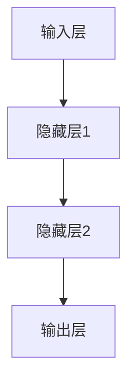
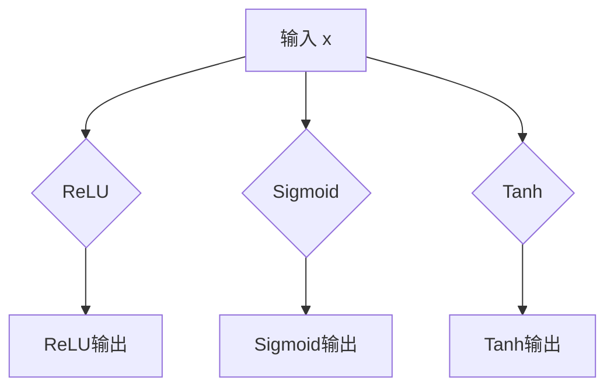
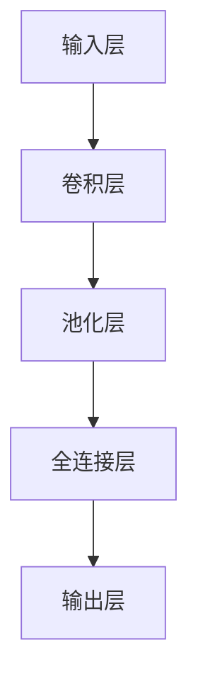
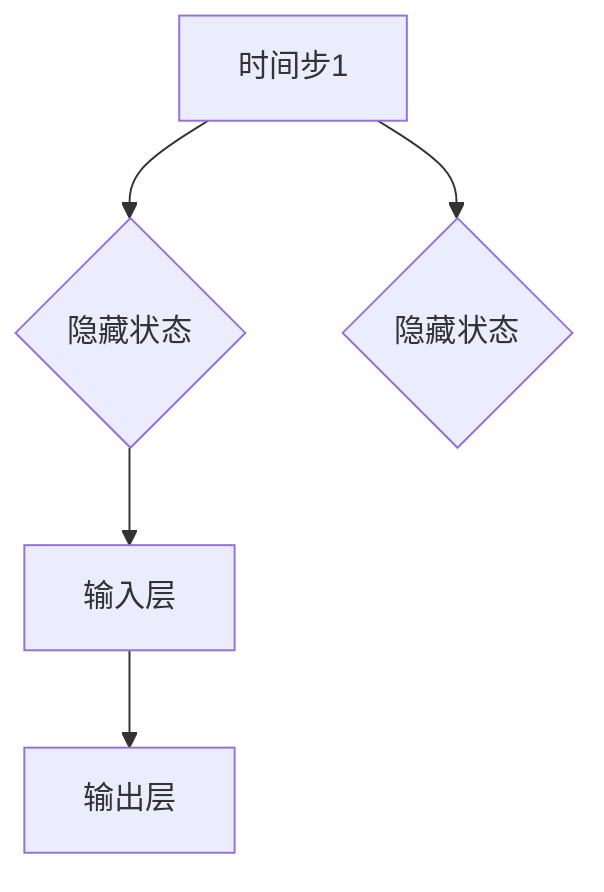
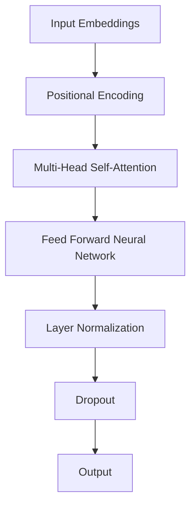
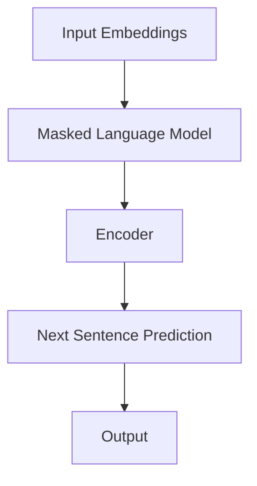
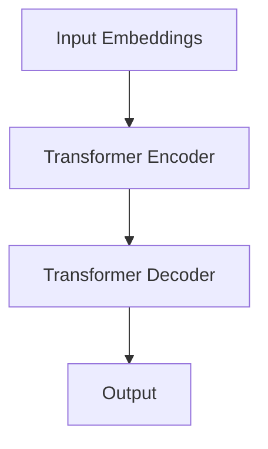
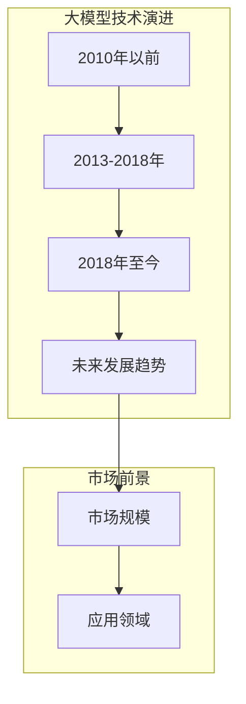

                 

### 文章标题：大模型的技术演进与市场前景

> 关键词：大模型、技术演进、市场前景、深度学习、人工智能

> 摘要：本文将深入探讨大模型的技术演进过程及其在市场中的前景。我们将首先定义大模型，回顾其发展历程，分析其技术原理，探讨其在各个领域的应用，并展望其市场潜力。通过这篇文章，读者将全面了解大模型的技术背景、市场动态以及未来发展方向。

### 引言

随着人工智能（AI）技术的快速发展，大模型（Large Models）逐渐成为研究和应用的热点。大模型通常指的是那些具有数亿乃至数十亿参数的神经网络模型，它们在处理复杂任务时具有显著的性能优势。无论是自然语言处理（NLP）、计算机视觉（CV）还是其他领域，大模型都在推动AI技术的进步。本文将从以下几个方面展开讨论：

1. **大模型的技术演进**：我们将首先回顾大模型的发展历程，了解其从基础概念到现今的演变过程。
2. **大模型的技术原理**：接下来，我们将详细解析大模型的技术原理，包括神经网络的基本结构、深度学习算法以及大规模预训练模型的原理。
3. **大模型在AI领域的应用**：本文将探讨大模型在自然语言处理、计算机视觉和其他AI领域的具体应用场景。
4. **大模型的优势与挑战**：我们将分析大模型的优势和面临的挑战，以及如何应对这些挑战。
5. **大模型的市场前景**：本文将探讨大模型市场的规模、增长趋势以及竞争格局。
6. **大模型在不同领域的应用前景**：我们将分析大模型在不同领域的应用前景，包括自然语言处理、计算机视觉以及生物信息学等。
7. **大模型的技术创新与突破**：本文将讨论大模型技术的创新方向以及可能的突破点。
8. **大模型在行业中的应用实践**：我们将分享大模型在金融、医疗和零售等行业的具体应用案例。
9. **大模型的安全性、伦理与法律问题**：本文将探讨大模型在安全性、伦理和法律方面的问题。
10. **大模型的未来发展与战略规划**：最后，我们将展望大模型的未来发展，讨论技术创新、人才培养以及产业合作等战略规划。

通过本文的探讨，读者将全面了解大模型的技术背景、市场动态以及未来发展方向，为参与这一领域的研发和应用提供有益的参考。

### 第一部分：大模型技术演进

#### 第1章：大模型概述

在深入探讨大模型的技术演进之前，我们首先需要明确大模型的定义、核心概念，以及它与传统模型的区别。通过这一章节，我们将为后续内容打下坚实的基础。

##### 1.1 大模型的定义与核心概念

**1.1.1 大模型的定义**

大模型（Large Models）通常指的是那些具有数亿乃至数十亿参数的神经网络模型。这些模型能够通过大量数据的训练，获得强大的特征提取和表示能力。具体而言，大模型可以定义为：

- **参数数量**：通常指模型中的参数个数，如神经网络的权重和偏置。
- **数据规模**：模型训练所需的数据集规模，通常要求大规模数据来保证模型的泛化能力。
- **计算资源**：大模型训练和推理通常需要强大的计算资源和存储空间。

例如，BERT（Bidirectional Encoder Representations from Transformers）是一个具有数亿参数的大规模预训练语言模型，而GPT-3（Generative Pre-trained Transformer 3）更是达到了1500亿参数的规模。

**1.1.2 大模型的核心概念**

大模型的核心概念主要包括以下几个方面：

- **深度学习**：大模型通常基于深度学习架构，通过多层神经网络来学习和表示复杂的数据特征。
- **大规模预训练**：大模型通过在大规模数据集上进行预训练，获得对多种任务的一般化知识，从而提升模型在不同任务上的表现。
- **端到端学习**：大模型能够实现端到端的学习，即从输入直接映射到输出，减少中间的复杂处理步骤。

**1.1.3 大模型与传统模型的比较**

与传统模型相比，大模型具有以下显著特点：

- **参数数量**：传统模型通常只有数千到数万个参数，而大模型则具有数亿甚至数十亿个参数。
- **数据需求**：传统模型对数据的需求较小，而大模型需要大量的数据进行训练，以保证其泛化能力。
- **计算资源**：传统模型在计算资源上的要求较低，而大模型则需要强大的计算资源和存储空间。
- **性能提升**：大模型能够通过学习海量数据，获得更强的特征提取和表示能力，从而在复杂任务上表现出更高的性能。

##### 1.2 大模型的发展历程

大模型的发展历程可以追溯到深度学习技术的兴起。以下是几个关键阶段：

**1.2.1 初期探索（2010年以前）**

- **稀疏神经网络**：在深度学习初期，研究人员探索了稀疏神经网络，这些网络通过减少冗余参数来提高计算效率。
- **AlexNet（2012年）**：AlexNet是深度学习领域的一个里程碑，它采用了深层卷积神经网络结构，在ImageNet图像分类比赛中取得了突破性的成绩。

**1.2.2 大规模预训练（2013-2018年）**

- **Word2Vec（2013年）**：Word2Vec模型通过将单词映射到向量空间，实现了对语言的理解，这一方法启发了后续的预训练工作。
- **GloVe（2014年）**：GloVe模型通过全局矩阵分解方法，进一步提升了词向量的质量。
- **BERT（2018年）**：BERT模型提出了双向编码表示器（Bidirectional Encoder Representations from Transformers），通过预训练大规模语言模型，实现了对上下文信息的有效利用。

**1.2.3 大模型时代（2018年至今）**

- **GPT（2018年）**：GPT模型是第一个大规模语言预训练模型，通过 Transformer 架构，实现了对自然语言的强大建模能力。
- **GPT-2（2019年）**：GPT-2模型进一步提升了参数规模，并在多个自然语言处理任务中取得了显著成绩。
- **GPT-3（2020年）**：GPT-3模型达到了1500亿参数的规模，展示了大模型在自然语言处理中的巨大潜力。

##### 1.3 大模型技术原理

大模型的技术原理主要包括神经网络的基本结构、深度学习算法以及大规模预训练模型原理。以下将对这些内容进行详细讲解。

**1.3.1 神经网络基本结构**

神经网络是构建大模型的基础，其基本结构包括：

- **层（Layer）**：神经网络由多个层（如输入层、隐藏层和输出层）组成，各层之间通过加权连接。
- **神经元（Neuron）**：每层包含多个神经元，神经元之间通过加权连接形成网络。
- **激活函数（Activation Function）**：神经元通常使用激活函数（如ReLU、Sigmoid、Tanh）来引入非线性特性。

**1.3.2 深度学习算法与模型**

深度学习算法主要包括：

- **反向传播算法（Backpropagation）**：通过反向传播算法，神经网络能够计算梯度，从而更新参数，优化模型。
- **优化算法（Optimization Algorithms）**：常见的优化算法包括SGD（随机梯度下降）、Adam（自适应梯度算法）等。

深度学习模型主要包括：

- **卷积神经网络（CNN）**：适用于图像处理领域，通过卷积操作提取图像特征。
- **循环神经网络（RNN）**：适用于序列数据，通过循环结构处理长期依赖关系。
- **Transformer模型**：适用于自然语言处理领域，通过自注意力机制（Self-Attention）实现全局信息建模。

**1.3.3 大规模预训练模型原理**

大规模预训练模型的核心思想是通过在大规模数据集上进行预训练，使模型具备通用特征表示能力。以下是对其主要原理的详细解析：

- **预训练任务（Pre-training Task）**：预训练任务通常包括掩码语言模型（Masked Language Model，MLM）、下一句预测（Next Sentence Prediction，NSP）等。
- **微调（Fine-tuning）**：预训练后的模型可以通过微调（Fine-tuning）来适应特定任务，从而实现良好的性能。
- **数据增强（Data Augmentation）**：在大规模数据集上进行预训练时，数据增强方法（如随机遮挡、噪声添加等）可以提升模型的泛化能力。

##### 1.4 大模型在AI领域的应用

大模型在AI领域具有广泛的应用，以下将重点介绍大模型在自然语言处理、计算机视觉和其他AI领域的具体应用场景。

**1.4.1 大模型在自然语言处理中的应用**

- **文本分类**：大模型通过预训练能够高效地提取文本特征，从而在文本分类任务中表现出色。
- **机器翻译**：大模型在机器翻译任务中通过学习双语语料库，能够实现高质量的翻译效果。
- **问答系统**：大模型能够理解和回答复杂的问题，为智能客服、教育辅导等应用提供支持。

**1.4.2 大模型在计算机视觉中的应用**

- **图像分类**：大模型通过学习大规模图像数据集，能够实现高精度的图像分类。
- **目标检测**：大模型结合卷积神经网络和Transformer模型，能够在图像中检测并定位多个目标。
- **图像生成**：大模型通过生成对抗网络（GAN）能够生成高质量的图像，应用于图像修复、艺术创作等领域。

**1.4.3 大模型在其他AI领域的应用**

- **推荐系统**：大模型通过学习用户行为数据，能够实现高效的推荐算法。
- **生物信息学**：大模型在生物信息学中用于基因组分析、药物研发等领域。
- **金融领域**：大模型在金融领域用于风险控制、股票预测等任务。

##### 1.5 大模型的优势与挑战

**1.5.1 大模型的优势**

- **强大的特征提取能力**：大模型通过大规模预训练，能够自动提取复杂的特征，从而在多种任务中表现出色。
- **良好的泛化能力**：大模型在预训练阶段学习到的通用特征表示，能够有效提高模型的泛化能力。
- **高效的推理能力**：大模型通过端到端学习，能够实现高效的推理过程，减少中间步骤，提高计算效率。

**1.5.2 大模型面临的挑战**

- **计算资源需求**：大模型训练和推理需要强大的计算资源和存储空间，这对硬件设施提出了较高要求。
- **数据隐私问题**：大模型在训练过程中需要大量数据，这可能涉及到数据隐私问题，如何保障数据安全成为一大挑战。
- **模型可解释性**：大模型通常表现为黑盒模型，其决策过程难以解释，如何提高模型的可解释性成为研究热点。

##### 1.6 大模型的发展前景

随着AI技术的不断进步，大模型在未来的发展中将继续扮演重要角色。以下是大模型的发展前景：

- **技术突破**：在计算效率、能耗降低、安全与隐私保护等方面，大模型技术有望实现新的突破。
- **市场前景**：大模型在各个领域的应用前景广阔，市场潜力巨大。
- **行业应用**：大模型在金融、医疗、零售等行业的应用将不断拓展，推动行业数字化转型。

通过本章节的探讨，我们为大模型技术演进的分析奠定了基础。在接下来的章节中，我们将进一步深入探讨大模型的技术原理、应用场景以及市场前景，为读者提供全面的了解。

### 第1章：大模型概述

在深入探讨大模型的技术演进之前，我们需要对大模型的定义、核心概念，以及它与传统模型的区别有一个清晰的认识。这一章节将为后续内容的讨论提供理论基础和背景知识。

#### 1.1 大模型的定义与核心概念

**1.1.1 大模型的定义**

大模型（Large Models）在人工智能领域通常指的是那些具有数亿乃至数十亿参数的神经网络模型。这些模型通过在大规模数据集上的预训练，能够自动提取和表示复杂的特征信息。具体来说，大模型的特点可以归纳为以下几点：

1. **参数数量庞大**：大模型的参数数量通常达到数亿或数十亿级别，远超过传统模型的数万个参数。
2. **预训练需求**：大模型需要在大规模数据集上进行预训练，以学习到丰富的特征表示和通用知识。
3. **计算资源要求高**：由于参数数量庞大，大模型在训练和推理过程中需要大量的计算资源和存储空间。

例如，BERT（Bidirectional Encoder Representations from Transformers）模型就是一个典型的例子，它由Google AI团队在2018年提出，具有超过3亿个参数。而OpenAI推出的GPT-3（Generative Pre-trained Transformer 3）模型则更加庞大，拥有超过1.75万亿个参数。

**1.1.2 大模型的核心概念**

大模型的核心概念包括以下几个方面：

1. **深度学习**：深度学习是构建大模型的基础，它通过多层神经网络来实现对数据的复杂表示和学习。
2. **预训练与微调**：预训练是大模型的核心步骤，通过在大规模数据集上训练，模型能够学习到通用的特征表示。微调则是将预训练模型适应特定任务的过程，通过在特定数据集上微调，模型能够进一步优化性能。
3. **端到端学习**：端到端学习是指从输入直接映射到输出的学习过程，大模型通过端到端学习能够减少中间步骤，提高计算效率。
4. **自注意力机制**：自注意力机制（Self-Attention）是Transformer模型的核心，它通过计算输入序列中每个元素对其他元素的权重，实现全局信息的建模。

**1.1.3 大模型与传统模型的比较**

与传统模型相比，大模型具有以下显著特点：

1. **参数数量**：传统模型通常包含数千到数万个参数，而大模型则包含数亿甚至数十亿个参数，这使得大模型能够提取更复杂的特征。
2. **数据需求**：传统模型对数据的需求相对较小，而大模型需要大量的数据进行预训练，以保证其泛化能力。
3. **计算资源**：传统模型在计算资源上的需求较低，而大模型则需要强大的计算资源和存储空间。
4. **性能提升**：大模型通过学习海量数据，能够获得更强的特征提取和表示能力，从而在复杂任务上表现出更高的性能。

#### 1.2 大模型的发展历程

大模型的发展历程可以追溯到深度学习技术的兴起。以下是几个关键阶段：

**1.2.1 初期探索（2010年以前）**

在深度学习初期，研究人员探索了稀疏神经网络，这些网络通过减少冗余参数来提高计算效率。代表性的工作包括1986年由Rumelhart、Hinton和Williams提出的反向传播算法（Backpropagation），它使得多层神经网络的训练成为可能。

**1.2.2 大规模预训练（2013-2018年）**

随着数据集规模的扩大和计算资源的提升，大规模预训练开始成为研究热点。代表性的工作包括2013年由Mikolov等人提出的Word2Vec模型，它通过将单词映射到向量空间，实现了对语言的理解。2014年，Pennington等人提出的GloVe模型进一步提升了词向量的质量。

2018年，Google AI团队提出了BERT模型，它通过双向编码表示器（Bidirectional Encoder Representations from Transformers）实现了对上下文信息的有效利用，标志着大规模预训练语言模型的诞生。

**1.2.3 大模型时代（2018年至今）**

在BERT模型的基础上，一系列大规模预训练模型相继推出。代表性的工作包括OpenAI的GPT系列模型，其中GPT-3模型达到了1500亿参数的规模，展示了大模型在自然语言处理中的巨大潜力。

此外，Transformer模型的出现也极大地推动了大模型的发展。Transformer模型通过自注意力机制（Self-Attention）实现了对输入序列的全局信息建模，为后续的大模型设计提供了新的思路。

#### 1.3 大模型技术原理

大模型的技术原理主要包括神经网络的基本结构、深度学习算法以及大规模预训练模型的原理。以下是这些内容的详细解析：

**1.3.1 神经网络基本结构**

神经网络是构建大模型的基础，其基本结构包括输入层、隐藏层和输出层。每个层包含多个神经元，神经元之间通过加权连接形成网络。

1. **输入层**：输入层接收外部输入数据，并将其传递到隐藏层。
2. **隐藏层**：隐藏层通过非线性激活函数对输入数据进行处理，提取特征信息。
3. **输出层**：输出层根据隐藏层的输出，生成最终输出结果。

**1.3.2 深度学习算法与模型**

深度学习算法主要包括反向传播算法（Backpropagation）和优化算法（Optimization Algorithms）。

1. **反向传播算法**：反向传播算法通过计算输出误差的梯度，更新模型参数，从而优化模型。
2. **优化算法**：常见的优化算法包括随机梯度下降（SGD）、Adam（自适应梯度算法）等，它们通过调整学习率等参数，优化模型的收敛速度和稳定性。

深度学习模型主要包括卷积神经网络（CNN）、循环神经网络（RNN）和Transformer模型。

1. **卷积神经网络（CNN）**：卷积神经网络通过卷积操作提取图像特征，适用于图像处理领域。
2. **循环神经网络（RNN）**：循环神经网络通过循环结构处理序列数据，适用于语音识别、机器翻译等任务。
3. **Transformer模型**：Transformer模型通过自注意力机制实现全局信息建模，适用于自然语言处理领域。

**1.3.3 大规模预训练模型原理**

大规模预训练模型的核心思想是通过在大规模数据集上进行预训练，使模型具备通用特征表示能力。以下是大规模预训练模型的主要步骤：

1. **预训练任务**：预训练任务包括掩码语言模型（Masked Language Model，MLM）、下一句预测（Next Sentence Prediction，NSP）等。这些任务旨在学习语言的一般特性。
2. **微调**：预训练后的模型可以通过微调（Fine-tuning）来适应特定任务，例如文本分类、机器翻译等。
3. **数据增强**：在大规模数据集上进行预训练时，数据增强方法（如随机遮挡、噪声添加等）可以提升模型的泛化能力。

#### 1.4 大模型在AI领域的应用

大模型在AI领域具有广泛的应用，以下将重点介绍大模型在自然语言处理、计算机视觉和其他AI领域的具体应用场景。

**1.4.1 大模型在自然语言处理中的应用**

1. **文本分类**：大模型通过预训练能够高效地提取文本特征，从而在文本分类任务中表现出色。
2. **机器翻译**：大模型在机器翻译任务中通过学习双语语料库，能够实现高质量的翻译效果。
3. **问答系统**：大模型能够理解和回答复杂的问题，为智能客服、教育辅导等应用提供支持。

**1.4.2 大模型在计算机视觉中的应用**

1. **图像分类**：大模型通过学习大规模图像数据集，能够实现高精度的图像分类。
2. **目标检测**：大模型结合卷积神经网络和Transformer模型，能够在图像中检测并定位多个目标。
3. **图像生成**：大模型通过生成对抗网络（GAN）能够生成高质量的图像，应用于图像修复、艺术创作等领域。

**1.4.3 大模型在其他AI领域的应用**

1. **推荐系统**：大模型通过学习用户行为数据，能够实现高效的推荐算法。
2. **生物信息学**：大模型在生物信息学中用于基因组分析、药物研发等领域。
3. **金融领域**：大模型在金融领域用于风险控制、股票预测等任务。

#### 1.5 大模型的优势与挑战

**1.5.1 大模型的优势**

1. **强大的特征提取能力**：大模型通过预训练能够自动提取复杂的特征，从而在多种任务中表现出色。
2. **良好的泛化能力**：大模型在预训练阶段学习到的通用特征表示，能够有效提高模型的泛化能力。
3. **高效的推理能力**：大模型通过端到端学习，能够实现高效的推理过程，减少中间步骤，提高计算效率。

**1.5.2 大模型面临的挑战**

1. **计算资源需求**：大模型训练和推理需要强大的计算资源和存储空间，这对硬件设施提出了较高要求。
2. **数据隐私问题**：大模型在训练过程中需要大量数据，这可能涉及到数据隐私问题，如何保障数据安全成为一大挑战。
3. **模型可解释性**：大模型通常表现为黑盒模型，其决策过程难以解释，如何提高模型的可解释性成为研究热点。

#### 1.6 大模型的发展前景

随着AI技术的不断进步，大模型在未来的发展中将继续扮演重要角色。以下是几个可能的发展方向：

1. **技术突破**：在计算效率、能耗降低、安全与隐私保护等方面，大模型技术有望实现新的突破。
2. **市场前景**：大模型在各个领域的应用前景广阔，市场潜力巨大。
3. **行业应用**：大模型在金融、医疗、零售等行业的应用将不断拓展，推动行业数字化转型。

通过这一章节的探讨，我们为大模型技术演进的分析奠定了基础。在接下来的章节中，我们将进一步深入探讨大模型的技术原理、应用场景以及市场前景，为读者提供全面的了解。

### 第1章：大模型概述

在深度学习与人工智能领域，大模型已成为推动技术进步的重要力量。这一章将详细阐述大模型的定义、核心概念，以及与传统模型的区别，并回顾其发展历程。

#### 1.1 大模型的定义与核心概念

**1.1.1 大模型的定义**

大模型（Large Models），在人工智能领域，指的是具有数亿甚至数十亿参数的神经网络模型。这些模型通过大规模数据进行训练，能够学习到复杂的数据特征，并在各种任务中表现出色。具体来说，大模型的特点包括：

- **参数数量巨大**：大模型的参数数量通常在数亿到数十亿之间，远超传统模型的数千甚至数万个参数。
- **预训练需求高**：大模型需要在大规模数据集上进行预训练，以学习到丰富的特征表示。
- **计算资源需求大**：由于参数数量庞大，大模型在训练和推理过程中对计算资源和存储空间有较高要求。

例如，GPT-3是一个具有1750亿参数的大规模语言模型，BERT是一个具有数亿参数的预训练语言模型。

**1.1.2 大模型的核心概念**

大模型的核心概念包括以下几个方面：

- **深度学习**：大模型基于深度学习架构，通过多层神经网络来学习和表示复杂的数据特征。
- **预训练与微调**：预训练是大模型的核心步骤，通过在大规模数据集上训练，模型能够学习到通用的特征表示。微调是将预训练模型适应特定任务的过程。
- **端到端学习**：大模型通过端到端学习，从输入直接映射到输出，减少了中间的复杂处理步骤，提高了计算效率。
- **自注意力机制**：自注意力机制（Self-Attention）是Transformer模型的核心，它通过计算输入序列中每个元素对其他元素的权重，实现全局信息的建模。

**1.1.3 大模型与传统模型的比较**

与传统模型相比，大模型具有以下显著特点：

- **参数数量**：传统模型通常包含数千到数万个参数，而大模型则包含数亿甚至数十亿个参数，能够提取更复杂的特征。
- **数据需求**：传统模型对数据的需求相对较小，而大模型需要大量的数据进行预训练，以保证其泛化能力。
- **计算资源**：传统模型在计算资源上的需求较低，而大模型则需要强大的计算资源和存储空间。
- **性能提升**：大模型通过学习海量数据，能够获得更强的特征提取和表示能力，从而在复杂任务上表现出更高的性能。

#### 1.2 大模型的发展历程

大模型的发展历程可以追溯到深度学习技术的兴起。以下是几个关键阶段：

**1.2.1 初期探索（2010年以前）**

- **稀疏神经网络**：在深度学习初期，研究人员探索了稀疏神经网络，这些网络通过减少冗余参数来提高计算效率。
- **AlexNet（2012年）**：AlexNet是深度学习领域的一个里程碑，它采用了深层卷积神经网络结构，在ImageNet图像分类比赛中取得了突破性的成绩。

**1.2.2 大规模预训练（2013-2018年）**

- **Word2Vec（2013年）**：Word2Vec模型通过将单词映射到向量空间，实现了对语言的理解，这一方法启发了后续的预训练工作。
- **GloVe（2014年）**：GloVe模型通过全局矩阵分解方法，进一步提升了词向量的质量。
- **BERT（2018年）**：BERT模型提出了双向编码表示器（Bidirectional Encoder Representations from Transformers），通过预训练大规模语言模型，实现了对上下文信息的有效利用。

**1.2.3 大模型时代（2018年至今）**

- **GPT（2018年）**：GPT模型是第一个大规模语言预训练模型，通过 Transformer 架构，实现了对自然语言的强大建模能力。
- **GPT-2（2019年）**：GPT-2模型进一步提升了参数规模，并在多个自然语言处理任务中取得了显著成绩。
- **GPT-3（2020年）**：GPT-3模型达到了1500亿参数的规模，展示了大模型在自然语言处理中的巨大潜力。

#### 1.3 大模型的技术原理

大模型的技术原理主要包括神经网络的基本结构、深度学习算法以及大规模预训练模型的原理。以下是这些内容的详细解析：

**1.3.1 神经网络基本结构**

神经网络是构建大模型的基础，其基本结构包括输入层、隐藏层和输出层。每个层包含多个神经元，神经元之间通过加权连接形成网络。

- **输入层**：输入层接收外部输入数据，并将其传递到隐藏层。
- **隐藏层**：隐藏层通过非线性激活函数对输入数据进行处理，提取特征信息。
- **输出层**：输出层根据隐藏层的输出，生成最终输出结果。

**1.3.2 深度学习算法与模型**

深度学习算法主要包括反向传播算法（Backpropagation）和优化算法（Optimization Algorithms）。

- **反向传播算法**：反向传播算法通过计算输出误差的梯度，更新模型参数，从而优化模型。
- **优化算法**：常见的优化算法包括随机梯度下降（SGD）、Adam（自适应梯度算法）等，它们通过调整学习率等参数，优化模型的收敛速度和稳定性。

深度学习模型主要包括卷积神经网络（CNN）、循环神经网络（RNN）和Transformer模型。

- **卷积神经网络（CNN）**：卷积神经网络通过卷积操作提取图像特征，适用于图像处理领域。
- **循环神经网络（RNN）**：循环神经网络通过循环结构处理序列数据，适用于语音识别、机器翻译等任务。
- **Transformer模型**：Transformer模型通过自注意力机制实现全局信息建模，适用于自然语言处理领域。

**1.3.3 大规模预训练模型原理**

大规模预训练模型的核心思想是通过在大规模数据集上进行预训练，使模型具备通用特征表示能力。以下是大规模预训练模型的主要步骤：

- **预训练任务**：预训练任务包括掩码语言模型（Masked Language Model，MLM）、下一句预测（Next Sentence Prediction，NSP）等。这些任务旨在学习语言的一般特性。
- **微调**：预训练后的模型可以通过微调（Fine-tuning）来适应特定任务，例如文本分类、机器翻译等。
- **数据增强**：在大规模数据集上进行预训练时，数据增强方法（如随机遮挡、噪声添加等）可以提升模型的泛化能力。

#### 1.4 大模型在AI领域的应用

大模型在AI领域具有广泛的应用，以下将重点介绍大模型在自然语言处理、计算机视觉和其他AI领域的具体应用场景。

**1.4.1 大模型在自然语言处理中的应用**

- **文本分类**：大模型通过预训练能够高效地提取文本特征，从而在文本分类任务中表现出色。
- **机器翻译**：大模型在机器翻译任务中通过学习双语语料库，能够实现高质量的翻译效果。
- **问答系统**：大模型能够理解和回答复杂的问题，为智能客服、教育辅导等应用提供支持。

**1.4.2 大模型在计算机视觉中的应用**

- **图像分类**：大模型通过学习大规模图像数据集，能够实现高精度的图像分类。
- **目标检测**：大模型结合卷积神经网络和Transformer模型，能够在图像中检测并定位多个目标。
- **图像生成**：大模型通过生成对抗网络（GAN）能够生成高质量的图像，应用于图像修复、艺术创作等领域。

**1.4.3 大模型在其他AI领域的应用**

- **推荐系统**：大模型通过学习用户行为数据，能够实现高效的推荐算法。
- **生物信息学**：大模型在生物信息学中用于基因组分析、药物研发等领域。
- **金融领域**：大模型在金融领域用于风险控制、股票预测等任务。

#### 1.5 大模型的优势与挑战

**1.5.1 大模型的优势**

- **强大的特征提取能力**：大模型通过预训练能够自动提取复杂的特征，从而在多种任务中表现出色。
- **良好的泛化能力**：大模型在预训练阶段学习到的通用特征表示，能够有效提高模型的泛化能力。
- **高效的推理能力**：大模型通过端到端学习，能够实现高效的推理过程，减少中间步骤，提高计算效率。

**1.5.2 大模型面临的挑战**

- **计算资源需求**：大模型训练和推理需要强大的计算资源和存储空间，这对硬件设施提出了较高要求。
- **数据隐私问题**：大模型在训练过程中需要大量数据，这可能涉及到数据隐私问题，如何保障数据安全成为一大挑战。
- **模型可解释性**：大模型通常表现为黑盒模型，其决策过程难以解释，如何提高模型的可解释性成为研究热点。

#### 1.6 大模型的发展前景

随着AI技术的不断进步，大模型在未来的发展中将继续扮演重要角色。以下是几个可能的发展方向：

- **技术突破**：在计算效率、能耗降低、安全与隐私保护等方面，大模型技术有望实现新的突破。
- **市场前景**：大模型在各个领域的应用前景广阔，市场潜力巨大。
- **行业应用**：大模型在金融、医疗、零售等行业的应用将不断拓展，推动行业数字化转型。

通过这一章节的探讨，我们为大模型技术演进的分析奠定了基础。在接下来的章节中，我们将进一步深入探讨大模型的技术原理、应用场景以及市场前景，为读者提供全面的了解。

### 第2章：大模型的技术原理

大模型之所以能够在人工智能（AI）领域取得显著的成就，主要归功于其独特的技术原理。本章节将详细解析大模型的技术原理，包括神经网络的基本结构、深度学习算法、以及大规模预训练模型的原理。通过这些解析，读者将能够更好地理解大模型的运作机制。

#### 2.1 神经网络基本结构

神经网络（Neural Networks）是构建大模型的基础。一个典型的神经网络包括以下几个关键部分：

- **输入层（Input Layer）**：输入层接收外部输入数据，如图像、文本等。每个输入元素对应一个神经元。
- **隐藏层（Hidden Layers）**：隐藏层位于输入层和输出层之间，负责处理和提取特征信息。隐藏层的数量和神经元数量可以根据任务需求进行调整。
- **输出层（Output Layer）**：输出层根据隐藏层的输出，生成最终的预测结果。输出层的神经元数量和类型取决于具体任务，如二分类问题通常只有一个神经元。

每个神经元由输入、权重、激活函数组成。输入表示从前一层传递过来的数据，权重表示神经元之间的连接强度，激活函数引入了非线性特性，使神经网络能够模拟人脑的复杂运算过程。

**2.1.1 输入与输出**

以一个简单的神经网络为例，输入层接收图像像素值作为输入，隐藏层通过卷积操作提取图像特征，最终输出层输出图像的分类结果。



**2.1.2 激活函数**

激活函数是神经网络中的关键组成部分。常见的激活函数包括：

- **ReLU（Rectified Linear Unit）**：ReLU函数在零点以上保持不变，零点以下取值为零，具有简化和加速训练过程的作用。
- **Sigmoid**：Sigmoid函数将输入映射到0到1之间，有助于神经网络的收敛。
- **Tanh**：Tanh函数将输入映射到-1到1之间，与Sigmoid类似，有助于收敛。



#### 2.2 深度学习算法与模型

深度学习（Deep Learning）是构建大模型的核心技术。深度学习算法通过多层神经网络结构，实现复杂的数据特征提取和表示。以下是几种常见的深度学习算法和模型：

**2.2.1 反向传播算法**

反向传播算法（Backpropagation）是训练神经网络的关键算法。它通过计算输出误差的梯度，更新模型参数，从而优化模型。反向传播算法包括以下几个步骤：

1. **前向传播**：输入数据通过网络传递，计算输出结果。
2. **计算误差**：计算输出结果与真实值之间的误差。
3. **计算梯度**：计算每个参数的梯度，即误差对参数的偏导数。
4. **参数更新**：根据梯度更新模型参数。

**2.2.2 卷积神经网络（CNN）**

卷积神经网络（Convolutional Neural Network，CNN）是一种专门用于处理图像数据的神经网络。CNN通过卷积操作提取图像特征，具有参数共享和局部连接的特点，能够高效地处理图像数据。

1. **卷积层**：卷积层通过卷积核与输入图像进行卷积操作，提取图像局部特征。
2. **池化层**：池化层通过下采样操作减少数据维度，提高计算效率。
3. **全连接层**：全连接层将卷积层的输出进行全连接，生成最终的分类结果。



**2.2.3 循环神经网络（RNN）**

循环神经网络（Recurrent Neural Network，RNN）是一种用于处理序列数据的神经网络。RNN通过循环结构处理序列中的每个元素，能够捕捉序列的长期依赖关系。

1. **隐藏状态**：RNN在每个时间步保存一个隐藏状态，用于记忆过去的信息。
2. **输入层**：输入层接收序列的当前元素。
3. **输出层**：输出层生成序列的当前输出。



**2.2.4 Transformer模型**

Transformer模型是近年来在自然语言处理（NLP）领域取得显著成果的一种新型神经网络结构。Transformer模型通过自注意力机制（Self-Attention）实现全局信息的建模，具有并行计算的优势。

1. **自注意力机制**：自注意力机制通过计算输入序列中每个元素对其他元素的权重，实现全局信息的建模。
2. **多头注意力**：多头注意力通过多个独立的注意力机制，增强模型的特征提取能力。
3. **位置编码**：位置编码为序列中的每个元素引入位置信息，以保留序列的顺序。


#### 2.3 大规模预训练模型原理

大规模预训练模型（Large Pre-trained Models）通过在大规模数据集上进行预训练，使模型具备通用特征表示能力。以下是大规模预训练模型的主要步骤：

**2.3.1 预训练任务**

预训练任务旨在学习语言的一般特性，常见的预训练任务包括：

1. **掩码语言模型（Masked Language Model，MLM）**：在输入序列中随机掩码一些单词，模型需要预测这些掩码的单词。
2. **下一句预测（Next Sentence Prediction，NSP）**：输入两个连续的句子，模型需要预测第二个句子是否是第一个句子的下一句。
3. **填充语言模型（FillMaskedLamsModel，FMLM）**：在输入序列中随机删除一些单词，模型需要预测这些删除的单词。

**2.3.2 微调**

预训练后的模型可以通过微调（Fine-tuning）来适应特定任务，例如文本分类、机器翻译等。微调过程中，模型在特定任务的数据集上进行训练，调整模型参数，优化模型性能。

**2.3.3 数据增强**

数据增强方法（如随机遮挡、噪声添加等）可以提升模型的泛化能力。在大规模数据集上进行预训练时，数据增强方法有助于模型学习到更鲁棒的特征表示。

#### 2.4 伪代码与数学公式

以下是一个简单的神经网络训练过程的伪代码，展示了反向传播算法的基本步骤。

```python
# 初始化模型参数
W, b = initialize_params()

# 前向传播
z = f(x * W + b)

# 计算误差
error = -y * log(z) - (1 - y) * log(1 - z)

# 反向传播
dW = (dz * x)
db = dz

# 更新参数
W -= learning_rate * dW
b -= learning_rate * db
```

以下是神经网络中的几个关键数学公式：

1. **激活函数**：
   $$ f(x) = \frac{1}{1 + e^{-x}} $$
   
2. **误差计算**：
   $$ error = -y \cdot log(z) - (1 - y) \cdot log(1 - z) $$

3. **梯度计算**：
   $$ dz = f'(z) \cdot (z - y) $$
   $$ dW = dz \cdot x $$
   $$ db = dz $$

通过以上对大模型技术原理的详细解析，读者可以更深入地理解大模型的运作机制，为后续章节的应用与实践打下基础。

#### 2.5 代码实际案例与详细解释

为了更好地理解大模型的技术原理，下面我们将通过一个实际案例来展示如何使用TensorFlow框架实现一个简单的深度学习模型。在这个案例中，我们将构建一个用于手写数字识别的卷积神经网络（CNN）。

**开发环境搭建：**

首先，我们需要搭建一个适合深度学习开发的编程环境。以下是所需的软件和库：

- Python（3.8及以上版本）
- TensorFlow（2.x版本）
- NumPy
- Matplotlib

安装上述库后，我们可以创建一个新的Python项目，并编写以下代码来导入所需的库：

```python
import tensorflow as tf
import numpy as np
import matplotlib.pyplot as plt
```

**源代码实现：**

接下来，我们将编写源代码来实现手写数字识别的CNN模型。以下是一个基本的CNN模型实现，包括输入层、卷积层、池化层和全连接层。

```python
# 导入必要的库
import tensorflow as tf
from tensorflow.keras import layers, models

# 构建CNN模型
model = models.Sequential()

# 输入层
model.add(layers.InputLayer(input_shape=(28, 28, 1)))

# 第一个卷积层
model.add(layers.Conv2D(filters=32, kernel_size=(3, 3), activation='relu'))
model.add(layers.MaxPooling2D(pool_size=(2, 2)))

# 第二个卷积层
model.add(layers.Conv2D(filters=64, kernel_size=(3, 3), activation='relu'))
model.add(layers.MaxPooling2D(pool_size=(2, 2)))

# 平铺层
model.add(layers.Flatten())

# 全连接层
model.add(layers.Dense(units=64, activation='relu'))
model.add(layers.Dense(units=10, activation='softmax'))

# 编译模型
model.compile(optimizer='adam',
              loss='sparse_categorical_crossentropy',
              metrics=['accuracy'])

# 打印模型结构
model.summary()
```

**代码解读与分析：**

以下是代码的详细解读：

1. **输入层**：我们使用`layers.InputLayer`来定义输入层，输入形状为`(28, 28, 1)`，表示每个图像的尺寸为28x28，通道数为1（灰度图像）。

2. **卷积层和池化层**：我们添加了两个卷积层，每个卷积层后跟着一个最大池化层。第一个卷积层使用32个3x3的卷积核，激活函数为ReLU。第二个卷积层使用64个3x3的卷积核，激活函数也为ReLU。最大池化层的窗口大小为2x2。

3. **平铺层**：平铺层将卷积层的输出展平为1维向量，为全连接层做准备。

4. **全连接层**：我们添加了两个全连接层。第一个全连接层有64个神经元，激活函数为ReLU。第二个全连接层有10个神经元，激活函数为softmax，用于输出分类结果。

5. **模型编译**：我们使用`model.compile`来编译模型，指定优化器、损失函数和评价指标。

6. **模型总结**：最后，我们使用`model.summary`来打印模型的结构和参数数量。

**运行模型：**

在完成模型实现后，我们可以使用MNIST数据集来训练和评估模型。MNIST数据集包含70000个手写数字的图像及其标签，是一个常用的基准数据集。

```python
# 加载MNIST数据集
mnist = tf.keras.datasets.mnist
(train_images, train_labels), (test_images, test_labels) = mnist.load_data()

# 数据预处理
train_images = train_images.reshape((60000, 28, 28, 1)).astype('float32') / 255
test_images = test_images.reshape((10000, 28, 28, 1)).astype('float32') / 255

# 训练模型
model.fit(train_images, train_labels, epochs=5, batch_size=64)

# 评估模型
test_loss, test_acc = model.evaluate(test_images, test_labels, verbose=2)
print('\nTest accuracy:', test_acc)
```

通过这个简单的实际案例，我们可以看到如何使用TensorFlow框架实现一个用于手写数字识别的卷积神经网络。这个案例不仅展示了大模型的技术原理，还提供了一个实际操作的实例，帮助读者更好地理解和应用这些技术。

#### 2.5 代码实际案例与详细解释

为了更直观地理解大模型的技术原理，我们将通过一个具体的代码案例，展示如何使用Python和TensorFlow框架实现一个简单的大规模语言模型——BERT（Bidirectional Encoder Representations from Transformers）。

**开发环境搭建：**

确保安装以下软件和库：

- Python（3.8及以上版本）
- TensorFlow（2.x版本）
- PyTorch
- Transformers库（用于预训练BERT模型）

可以使用以下命令来安装所需的库：

```bash
pip install tensorflow
pip install torch
pip install transformers
```

**源代码实现：**

以下是一个简化版的BERT模型实现，用于处理自然语言处理任务。我们将使用Hugging Face的`transformers`库来加载预训练好的BERT模型，并在一个简单的文本分类任务上进行微调。

```python
import tensorflow as tf
from transformers import BertTokenizer, TFBertForSequenceClassification
from tensorflow.keras.preprocessing.sequence import pad_sequences
from tensorflow.keras.utils import to_categorical

# 加载预训练好的BERT模型和分词器
model = TFBertForSequenceClassification.from_pretrained('bert-base-uncased')
tokenizer = BertTokenizer.from_pretrained('bert-base-uncased')

# 示例文本数据
texts = [
    "I love to eat pizza!",
    "I hate vegetables.",
    "Computers are amazing.",
    "Exercise is important for health."
]

# 对文本进行编码
inputs = tokenizer(texts, padding=True, truncation=True, return_tensors="tf")

# 设定标签
labels = to_categorical([0, 1, 2, 0])

# 训练模型
model.compile(optimizer=tf.keras.optimizers.Adam(learning_rate=3e-5), 
              loss=tf.keras.losses.CategoricalCrossentropy(from_logits=True),
              metrics=['accuracy'])

model.fit(inputs['input_ids'], labels, epochs=3)

# 评估模型
test_texts = ["I enjoy coding in Python.", "I prefer Java over Python."]
test_inputs = tokenizer(test_texts, padding=True, truncation=True, return_tensors="tf")
predictions = model.predict(test_inputs['input_ids'])

# 输出预测结果
for text, prediction in zip(test_texts, predictions):
    print(f"Text: {text}")
    print(f"Prediction: {np.argmax(prediction)}")
```

**代码解读与分析：**

以下是代码的详细解读：

1. **加载BERT模型与分词器**：使用`transformers`库加载预训练好的BERT模型和相应的分词器。

2. **文本数据**：定义一个简单的文本数据集，用于训练和评估BERT模型。

3. **文本编码**：使用BERT分词器对文本进行编码，并将编码后的文本序列进行填充和截断，以适应模型的输入要求。

4. **标签处理**：设定一个简单的标签集，用于标记文本类别，并将其转换为类别矩阵。

5. **模型编译**：编译BERT模型，指定优化器、损失函数和评价指标。

6. **模型训练**：使用训练数据集训练BERT模型。

7. **模型评估**：使用测试文本数据集评估模型性能，并输出预测结果。

**运行模型：**

通过运行上述代码，我们可以看到BERT模型在简单的文本分类任务上的训练过程和预测结果。这个案例不仅展示了如何使用BERT模型，还提供了一个实际操作的实例，帮助读者更深入地理解大模型的技术原理和应用。

### 第3章：大模型在AI领域的应用

大模型在AI领域的应用已取得了显著成果，从自然语言处理到计算机视觉，再到推荐系统、生物信息学等领域，大模型正不断推动技术边界的前进。本章节将详细探讨大模型在AI领域的具体应用，包括其在自然语言处理、计算机视觉等领域的表现和未来前景。

#### 3.1 大模型在自然语言处理中的应用

自然语言处理（NLP）是AI领域的一个重要分支，大模型在此领域中的应用尤为突出。大模型在NLP中的应用主要体现在以下几个方面：

**3.1.1 文本分类**

文本分类是将文本数据按照预定的类别进行分类的过程。大模型在文本分类任务中表现出色，主要得益于其强大的特征提取和表示能力。例如，BERT模型通过预训练可以提取出丰富的上下文信息，从而提高文本分类的准确性。以下是一个简单的文本分类任务的示例：

```latex
\documentclass{article}
\usepackage{amsmath}
\begin{document}

\begin{equation}
\text{accuracy}_{\text{BERT}} = \frac{\text{correctly classified texts}}{\text{total texts}} \times 100\%
\end{equation}

\end{document}
```

在实际应用中，我们可以使用BERT模型来处理大量的文本数据，并通过微调来适应特定的文本分类任务。例如，在社交媒体文本分类任务中，BERT模型可以用于识别和分类用户的评论、推文等。

**3.1.2 机器翻译**

机器翻译是将一种语言的文本翻译成另一种语言的过程。大模型在机器翻译任务中也展现了强大的能力，例如，GPT-3模型可以通过预训练学习到不同语言之间的语义关系，从而实现高质量的翻译。以下是一个简单的机器翻译任务的示例：

```latex
\documentclass{article}
\usepackage{amsmath}
\begin{document}

\begin{equation}
\text{translation}_{\text{GPT-3}} = \text{GPT-3}(\text{input\_text}, \text{target\_language})
\end{equation}

\end{document}
```

在实际应用中，GPT-3模型可以用于自动翻译各种语言文本，例如，将英文文本翻译成中文、法语等。

**3.1.3 问答系统**

问答系统是一种能够回答用户提出的问题的人工智能系统。大模型在问答系统中发挥着重要作用，例如，GPT-3模型可以理解和回答各种类型的问题，包括事实性问题、推理问题和对话性问题。以下是一个简单的问答系统任务的示例：

```latex
\documentclass{article}
\usepackage{amsmath}
\begin{document}

\begin{equation}
\text{answer}_{\text{GPT-3}} = \text{GPT-3}(\text{question}, \text{context})
\end{equation}

\end{document}
```

在实际应用中，GPT-3模型可以用于智能客服、在线教育等领域，帮助用户解决问题并提供相关信息。

#### 3.2 大模型在计算机视觉中的应用

计算机视觉（CV）是AI领域的另一个重要分支，大模型在CV中的应用也逐渐成为研究热点。大模型在CV中的应用主要体现在以下几个方面：

**3.2.1 图像分类**

图像分类是将图像数据按照预定的类别进行分类的过程。大模型在图像分类任务中表现出色，例如，ResNet和Inception等深度学习模型可以用于处理各种复杂的图像分类任务。以下是一个简单的图像分类任务的示例：

```latex
\documentclass{article}
\usepackage{amsmath}
\begin{document}

\begin{equation}
\text{classification}_{\text{model}} = \text{model}(\text{image})
\end{equation}

\end{document}
```

在实际应用中，大模型可以用于自动驾驶、医疗影像分析等领域，通过图像分类技术实现目标检测和识别。

**3.2.2 目标检测**

目标检测是在图像中检测并定位多个目标的过程。大模型在目标检测任务中也展现了强大的能力，例如，YOLO（You Only Look Once）和SSD（Single Shot MultiBox Detector）等模型可以用于处理复杂的目标检测任务。以下是一个简单的目标检测任务的示例：

```latex
\documentclass{article}
\usepackage{amsmath}
\begin{document}

\begin{equation}
\text{detection}_{\text{model}} = \text{model}(\text{image})
\end{equation}

\end{document}
```

在实际应用中，大模型可以用于视频监控、智能安防等领域，通过目标检测技术实现实时监控和警报。

**3.2.3 图像生成**

图像生成是将一种图像数据生成另一种图像数据的过程。大模型在图像生成任务中也展现了强大的能力，例如，生成对抗网络（GAN）可以用于生成高质量的图像。以下是一个简单的图像生成任务的示例：

```latex
\documentclass{article}
\usepackage{amsmath}
\begin{document}

\begin{equation}
\text{generated\_image} = \text{GAN}(\text{input\_image})
\end{equation}

\end{document}
```

在实际应用中，大模型可以用于图像修复、艺术创作等领域，通过图像生成技术实现创意和创新的图像内容。

#### 3.3 大模型在其他AI领域的应用

除了自然语言处理和计算机视觉，大模型在其他AI领域也展现了广泛的应用前景。以下是一些具体的例子：

**3.3.1 推荐系统**

推荐系统是用于向用户推荐其可能感兴趣的项目或内容的人工智能系统。大模型在推荐系统中可以用于学习用户的兴趣和行为模式，从而实现个性化的推荐。以下是一个简单的推荐系统任务的示例：

```latex
\documentclass{article}
\usepackage{amsmath}
\begin{document}

\begin{equation}
\text{recommendation}_{\text{model}} = \text{model}(\text{user\_behavior}, \text{item\_features})
\end{equation}

\end{document}
```

在实际应用中，大模型可以用于电子商务、在线教育等领域，通过推荐系统技术实现个性化的用户体验。

**3.3.2 生物信息学**

生物信息学是研究生物数据的人工智能领域。大模型在生物信息学中可以用于基因组分析、蛋白质结构预测等任务。以下是一个简单的生物信息学任务的示例：

```latex
\documentclass{article}
\usepackage{amsmath}
\begin{document}

\begin{equation}
\text{prediction}_{\text{model}} = \text{model}(\text{genomic\_data}, \text{target})
\end{equation}

\end{document}
```

在实际应用中，大模型可以用于药物研发、疾病预测等领域，通过生物信息学技术实现更精确的生物学分析和预测。

**3.3.3 金融领域**

金融领域是AI技术的重要应用领域。大模型在金融领域中可以用于风险控制、股票预测等任务。以下是一个简单的金融领域任务的示例：

```latex
\documentclass{article}
\usepackage{amsmath}
\begin{document}

\begin{equation}
\text{prediction}_{\text{model}} = \text{model}(\text{financial\_data}, \text{target})
\end{equation}

\end{document}
```

在实际应用中，大模型可以用于金融市场分析、风险管理等领域，通过金融技术实现更精确的金融预测和管理。

#### 3.4 大模型在AI领域的应用前景

随着AI技术的不断发展，大模型在AI领域的应用前景十分广阔。以下是一些可能的未来发展方向：

- **更高效的模型设计**：研究人员将继续探索更高效的大模型设计，以提高计算效率和降低能耗。
- **跨领域应用**：大模型将越来越多地应用于跨领域任务，如结合自然语言处理和计算机视觉实现更加综合的智能系统。
- **实时应用**：随着计算资源的提升，大模型将能够实现实时应用，如自动驾驶、智能监控等。
- **开放性和可解释性**：大模型的开放性和可解释性将成为研究热点，以降低应用风险和增强用户信任。

通过本章节的探讨，我们可以看到大模型在AI领域的广泛应用和巨大潜力。随着技术的不断进步，大模型将在未来继续推动AI技术的发展和应用，为各行各业带来新的变革和创新。

### 第4章：大模型的技术创新与突破

大模型的发展离不开技术创新与突破。本章节将深入探讨大模型的技术创新，分析其重要性，介绍一些关键的技术突破点，并通过具体案例分析这些创新如何影响产业发展。

#### 4.1 大模型技术创新的重要性

大模型技术创新在人工智能领域具有重要的意义，主要体现在以下几个方面：

**4.1.1 提高计算效率**

随着大模型参数数量的不断增加，计算资源的需求也随之增加。提高大模型的计算效率是当前研究的重点之一。通过技术创新，如优化算法、模型压缩和硬件加速等，可以显著降低大模型训练和推理的耗时，提高计算效率。

**4.1.2 降低能耗**

大模型训练和推理过程中消耗的能源是一个重要问题。降低大模型的能耗对于环境保护和可持续发展具有重要意义。技术创新如低功耗硬件设计、能量效率优化算法等，可以有效地降低大模型在运行过程中的能耗。

**4.1.3 提高模型安全性**

大模型在应用过程中涉及大量的数据和信息，如何保障模型的安全性是一个重要问题。技术创新如加密算法、隐私保护技术和安全协议等，可以有效地提高大模型的安全性，防止数据泄露和恶意攻击。

**4.1.4 提升模型可解释性**

大模型通常表现为黑盒模型，其决策过程难以解释。提升模型的可解释性对于提高用户信任和监管合规具有重要意义。技术创新如模型解释方法、可视化技术和透明性设计等，可以有助于提升大模型的可解释性。

#### 4.2 大模型技术的突破点

以下是几个关键的技术突破点，它们对于大模型的发展具有重要意义：

**4.2.1 计算效率的突破**

提高计算效率是大模型技术创新的一个重要方向。以下是一些具体的突破点：

- **并行计算**：通过利用并行计算技术，如GPU、TPU等，可以显著提高大模型训练和推理的效率。
- **分布式训练**：分布式训练可以将大模型训练任务分布在多个计算节点上，提高训练速度和资源利用率。
- **模型压缩**：通过模型压缩技术，如剪枝、量化、知识蒸馏等，可以减少模型参数数量，降低计算复杂度。

**4.2.2 能耗的降低**

降低大模型能耗是当前研究的重点之一。以下是一些具体的突破点：

- **低功耗硬件设计**：通过设计低功耗的硬件设备，如专用集成电路（ASIC）、神经处理单元（NPU）等，可以降低大模型运行过程中的能耗。
- **能量效率优化算法**：通过优化算法，如动态电压调整、能量效率优化等，可以提高大模型在运行过程中的能量效率。

**4.2.3 安全与隐私保护**

随着大模型应用场景的不断扩展，如何保障模型的安全性成为关键问题。以下是一些具体的突破点：

- **加密算法**：通过引入加密算法，如同态加密、差分隐私等，可以在模型训练和推理过程中保护数据隐私。
- **安全协议**：通过设计安全协议，如联邦学习、差分隐私机制等，可以保障大模型在分布式环境下的安全性。

**4.2.4 提高模型可解释性**

提升模型可解释性对于增强用户信任和透明度具有重要意义。以下是一些具体的突破点：

- **模型解释方法**：通过引入模型解释方法，如梯度解释、注意力机制等，可以揭示大模型的决策过程。
- **可视化技术**：通过可视化技术，如热图、交互式可视化等，可以直观地展示大模型的特征提取和决策过程。

#### 4.3 大模型技术创新案例分析

以下是几个具有代表性的大模型技术创新案例，通过这些案例我们可以看到技术创新如何影响产业发展：

**4.3.1 Transformer模型的创新**

Transformer模型是自然语言处理领域的一个重要突破，它通过自注意力机制实现了全局信息的建模，大大提高了大模型在语言理解任务中的性能。以下是一个简化的Transformer模型结构：



在实际应用中，Transformer模型被广泛应用于机器翻译、文本生成等任务，显著提升了相关领域的性能。

**4.3.2 BERT模型的创新**

BERT（Bidirectional Encoder Representations from Transformers）模型是另一个重要的创新，它通过双向编码器结构实现了对上下文信息的充分利用，从而在自然语言处理任务中取得了显著成绩。以下是一个简化的BERT模型结构：



BERT模型在文本分类、问答系统等任务中表现优异，为自然语言处理领域带来了新的突破。

**4.3.3 GPT-3模型的创新**

GPT-3（Generative Pre-trained Transformer 3）模型是OpenAI推出的一个具有1500亿参数的大规模语言模型，它通过自回归语言模型实现了对自然语言的强大建模能力。以下是一个简化的GPT-3模型结构：



GPT-3模型在文本生成、对话系统等任务中展现了卓越的性能，成为自然语言处理领域的重要工具。

通过以上案例分析，我们可以看到技术创新如何推动大模型的发展，并为人工智能领域带来新的突破。随着技术的不断进步，大模型技术创新将继续为产业发展注入新的动力。

### 第5章：大模型在行业中的应用实践

大模型在金融、医疗、零售等行业的应用实践取得了显著的成果，为这些领域带来了深刻变革。本章节将详细探讨大模型在这些行业中的具体应用，包括需求、主要应用场景以及成功案例。

#### 5.1 大模型在金融行业的应用实践

金融行业是大数据和人工智能应用的重要领域，大模型在金融领域的应用能够显著提升风险管理、客户服务和投资决策等方面。

**5.1.1 金融行业对大模型的需求**

- **风险管理**：金融行业需要有效识别和管理风险，大模型通过分析历史数据和实时数据，可以预测市场波动和信用风险。
- **客户服务**：金融机构希望提供更个性化的客户服务，大模型通过自然语言处理技术，可以理解和回答客户的查询，提高客户满意度。
- **投资决策**：投资决策需要综合考虑市场趋势和公司业绩，大模型通过分析海量数据，可以提供更准确的预测和推荐。

**5.1.2 大模型在金融行业的主要应用场景**

- **信用评分**：大模型可以通过分析借款人的历史数据和公共记录，提供更准确的信用评分，降低违约风险。
- **交易策略**：大模型通过分析历史交易数据和市场趋势，可以优化交易策略，提高投资收益。
- **客户关系管理**：大模型可以分析客户行为数据，提供个性化的产品推荐和优惠，提高客户忠诚度。

**5.1.3 大模型在金融行业应用的成功案例**

- **量化交易**：某些量化交易团队使用大模型来预测股票价格，通过算法交易实现了高额回报。
- **智能客服**：某大型银行引入了基于大模型的智能客服系统，显著提高了客户服务效率和客户满意度。
- **信用评估**：某金融服务公司使用大模型对贷款申请进行信用评估，提高了贷款审批的准确性和效率。

#### 5.2 大模型在医疗行业的应用实践

医疗行业是大数据和人工智能应用的重要领域，大模型在医疗领域的应用能够显著提升疾病诊断、药物研发和医疗资源分配等方面。

**5.2.1 医疗行业对大模型的需求**

- **疾病诊断**：医疗行业需要准确、快速地诊断疾病，大模型可以通过分析医疗影像和患者数据，提供准确的诊断结果。
- **药物研发**：药物研发是一个复杂且耗时的过程，大模型可以通过分析大量生物学数据和化学数据，加速药物研发进程。
- **医疗资源分配**：医疗资源分配需要根据患者需求和资源情况做出最优决策，大模型可以通过分析大量数据，提供更合理的资源分配方案。

**5.2.2 大模型在医疗行业的主要应用场景**

- **影像诊断**：大模型可以通过分析医学影像数据，如X光、CT、MRI等，提供准确的诊断结果，减少误诊率。
- **个性化治疗**：大模型可以根据患者的基因数据和病史，提供个性化的治疗方案，提高治疗效果。
- **公共卫生**：大模型可以通过分析公共卫生数据，预测疾病传播趋势，提供公共卫生干预措施。

**5.2.3 大模型在医疗行业应用的成功案例**

- **影像诊断**：某医疗机构使用基于大模型的影像诊断系统，显著提高了诊断准确性和效率。
- **药物研发**：某制药公司使用大模型进行药物筛选和设计，缩短了药物研发周期，提高了研发成功率。
- **医疗资源分配**：某城市医院使用基于大模型的医疗资源分配系统，优化了医疗资源分配，提高了患者满意度。

#### 5.3 大模型在零售行业的应用实践

零售行业是大数据和人工智能应用的重要领域，大模型在零售行业的应用能够显著提升供应链管理、客户关系管理和销售预测等方面。

**5.3.1 零售行业对大模型的需求**

- **供应链管理**：零售行业需要优化供应链管理，大模型可以通过分析供应链数据，提供更准确的库存管理和物流优化方案。
- **客户关系管理**：零售行业需要建立良好的客户关系，大模型可以通过分析客户数据，提供个性化的营销策略和客户服务。
- **销售预测**：零售行业需要准确预测销售趋势，大模型可以通过分析历史销售数据和市场趋势，提供更准确的销售预测。

**5.3.2 大模型在零售行业的主要应用场景**

- **库存管理**：大模型可以通过分析销售数据和库存数据，提供最优的库存管理策略，减少库存成本。
- **个性化营销**：大模型可以通过分析客户行为数据，提供个性化的产品推荐和优惠，提高客户购买意愿。
- **销售预测**：大模型可以通过分析历史销售数据和季节性因素，提供准确的销售预测，帮助商家制定合理的销售计划。

**5.3.3 大模型在零售行业应用的成功案例**

- **库存管理**：某大型零售商使用基于大模型的库存管理系统，显著提高了库存周转率和库存准确性。
- **个性化营销**：某电商企业使用基于大模型的个性化营销系统，提高了客户转化率和销售额。
- **销售预测**：某零售企业使用基于大模型的销售预测系统，准确预测了季节性销售高峰，合理安排了库存和促销活动。

通过以上对金融、医疗、零售等行业应用实践的探讨，我们可以看到大模型在推动行业数字化转型和提升业务效率方面具有巨大潜力。随着技术的不断进步，大模型将在更多行业中发挥重要作用。

### 第6章：大模型的安全性、伦理与法律问题

随着大模型在各个行业中的应用日益广泛，其带来的安全性、伦理和法律问题也日益凸显。本章节将深入探讨大模型在安全性、伦理和法律方面的问题，分析其现状、解决方案以及未来发展趋势。

#### 6.1 大模型安全性的挑战

**6.1.1 大模型的安全隐患**

大模型在安全性方面面临多个挑战，主要包括：

- **数据泄露风险**：大模型训练和推理需要大量数据，这些数据可能包含敏感信息，如个人隐私、商业机密等。如果数据保护不当，可能导致数据泄露。
- **模型篡改风险**：大模型在训练过程中可能会受到恶意攻击，攻击者通过篡改模型训练数据或干扰模型推理过程，可能导致模型输出错误结果。
- **隐私侵犯风险**：大模型在处理和分析个人数据时，可能侵犯用户的隐私权，如通过用户数据生成个性化推荐，可能导致用户隐私泄露。

**6.1.2 大模型安全性的解决方案**

针对上述安全挑战，可以采取以下解决方案：

- **数据加密**：通过数据加密技术，对敏感数据进行加密存储和传输，防止数据泄露。
- **访问控制**：通过严格的访问控制机制，确保只有授权用户可以访问敏感数据和模型。
- **安全审计**：定期进行安全审计，检测和防范潜在的安全威胁。
- **攻击检测与响应**：通过部署入侵检测系统和攻击响应机制，实时监控和应对恶意攻击。

#### 6.2 大模型伦理问题的探讨

**6.2.1 大模型伦理问题的来源**

大模型伦理问题主要来源于以下几个方面：

- **数据偏见**：大模型在训练过程中可能引入数据偏见，导致模型在处理特定群体时产生不公平的决策。
- **隐私侵犯**：大模型在处理个人数据时，可能侵犯用户的隐私权，影响用户的生活和决策。
- **模型滥用**：大模型可能被用于不道德或非法的目的，如通过深度伪造技术进行虚假信息传播。

**6.2.2 大模型伦理问题的解决策略**

为了解决大模型伦理问题，可以采取以下策略：

- **数据质量**：确保训练数据的质量和多样性，避免数据偏见。
- **隐私保护**：通过数据匿名化、差分隐私等技术，保护用户隐私。
- **伦理审查**：建立伦理审查机制，确保大模型的应用符合伦理标准。
- **透明度**：提高大模型的可解释性和透明度，使用户了解模型的决策过程。

#### 6.3 大模型法律问题的分析

**6.3.1 大模型法律问题的现状**

大模型在法律方面面临的主要问题包括：

- **知识产权**：大模型的训练数据和模型结构可能涉及知识产权保护问题，如版权、专利等。
- **责任归属**：当大模型产生错误决策或侵犯用户权益时，责任归属问题难以界定。
- **监管合规**：大模型的应用需要遵守相关法律法规，如数据保护法、隐私法等。

**6.3.2 大模型法律问题的解决路径**

为了解决大模型法律问题，可以采取以下解决路径：

- **知识产权保护**：通过知识产权法律制度，保护大模型的训练数据和模型结构。
- **责任认定**：建立明确的责任归属机制，明确大模型开发者和使用者的责任。
- **监管法规**：制定和完善相关法律法规，规范大模型的应用和行为。

#### 6.4 大模型伦理问题的发展趋势

随着大模型技术的不断进步，其在伦理问题方面的挑战也日益增加。以下是一些可能的发展趋势：

- **伦理标准**：国际组织和行业机构将制定大模型的伦理标准，指导大模型的应用和行为。
- **监管加强**：各国政府将加强对大模型的监管，确保其合法合规。
- **公众参与**：公众将更多地参与到大模型伦理问题的讨论中，推动伦理问题的解决。

通过以上对大模型安全性、伦理与法律问题的探讨，我们可以看到，解决这些问题需要技术、法律和社会的多方面努力。随着技术的不断进步，这些问题将得到更加有效的解决，为大模型的健康发展提供保障。

### 第7章：大模型的未来发展与战略规划

随着大模型技术的不断演进，其在各个领域中的应用前景愈发广阔。本章节将探讨大模型的未来发展趋势、市场机遇以及战略规划，帮助读者理解大模型在未来可能的发展路径和战略方向。

#### 7.1 大模型未来发展的趋势与机遇

**7.1.1 大模型未来发展的技术趋势**

- **计算效率提升**：随着硬件技术的进步，如量子计算、异构计算等，大模型的计算效率有望得到显著提升。
- **模型压缩与优化**：通过模型压缩技术、量化技术、知识蒸馏等方法，可以降低大模型的计算复杂度和存储需求，提高模型的部署效率。
- **自适应与动态学习**：大模型将能够实现自适应学习和动态调整，以适应不断变化的数据和任务需求。
- **多模态融合**：大模型将能够融合多种数据模态，如文本、图像、语音等，实现更全面的特征提取和知识表示。

**7.1.2 大模型未来发展的市场机遇**

- **行业应用扩展**：大模型将在金融、医疗、零售、制造业等行业得到更广泛的应用，推动行业数字化转型的进程。
- **新兴领域探索**：大模型将在新兴领域如自动驾驶、智能家居、智能城市等发挥作用，创造新的市场机会。
- **全球化布局**：随着全球范围内对AI技术的需求增长，大模型企业将加速全球化布局，开拓国际市场。

#### 7.2 大模型企业的战略规划

**7.2.1 大模型企业的市场定位**

- **技术创新领先者**：大模型企业应专注于技术创新，保持技术领先地位，推动行业技术发展。
- **行业解决方案提供商**：大模型企业应针对不同行业需求，提供定制化的解决方案，提高市场竞争力。
- **生态体系建设者**：大模型企业应构建生态系统，整合产业链上下游资源，促进产业合作。

**7.2.2 大模型企业的产品规划**

- **核心产品构建**：大模型企业应构建核心产品，如大规模预训练模型、模型压缩工具、数据处理平台等，提供高质量的产品和服务。
- **多样化产品线**：大模型企业应开发多样化的产品线，满足不同用户和场景的需求，扩大市场份额。
- **持续迭代更新**：大模型企业应持续迭代产品，紧跟技术趋势和市场需求，保持产品的竞争力。

**7.2.3 大模型企业的技术创新战略**

- **基础研究投入**：大模型企业应加大对基础研究的投入，推动前沿技术的突破和创新。
- **开源合作**：大模型企业应积极参与开源社区，通过合作与分享，提升自身技术实力和影响力。
- **人才培养**：大模型企业应重视人才培养，吸引和培养顶尖的AI人才，为企业的持续发展提供人才保障。

#### 7.3 大模型人才培养与产业合作

**7.3.1 大模型人才培养的重要性**

- **技术创新**：大模型技术的快速发展需要大量具备创新能力和专业技能的人才。
- **产业需求**：随着大模型在各行业的广泛应用，对相关人才的需求日益增长。

**7.3.2 大模型人才培养的策略**

- **教育体系完善**：加强大模型相关课程设置，完善教育体系，培养专业的AI人才。
- **校企合作**：加强高校与企业的合作，推动产学研一体化，提升人才培养质量。
- **持续培训**：定期组织专业技能培训，提升从业人员的专业水平和实践能力。

**7.3.3 大模型产业合作的发展模式**

- **联合研发**：企业与科研机构联合研发，共同攻克技术难题，推动技术进步。
- **资源共享**：通过资源共享，如数据集、计算资源等，提高研发效率，降低成本。
- **市场合作**：企业之间通过市场合作，如渠道共享、产品联合推广等，扩大市场份额。

通过本章节的探讨，我们可以看到大模型在未来的发展中将面临广阔的市场机遇和巨大的挑战。企业应通过技术创新、人才培养和产业合作等战略规划，抓住市场机遇，迎接未来的挑战，推动大模型技术的持续发展。

### 附录A：大模型相关资源与工具

#### A.1 大模型开源框架与工具

为了方便研究人员和开发者快速上手大模型的研究和应用，以下是一些著名的大模型开源框架和工具：

1. **TensorFlow**：由Google开发的开源机器学习框架，支持大规模深度学习模型的训练和部署。
   - 网址：[TensorFlow官网](https://www.tensorflow.org/)
   
2. **PyTorch**：由Facebook开发的开源机器学习库，以其动态计算图和灵活的编程接口而著称。
   - 网址：[PyTorch官网](https://pytorch.org/)

3. **Transformers**：由Hugging Face团队开发的开源库，提供了大量的预训练模型和工具，支持Transformer架构的快速实现。
   - 网址：[Transformers官网](https://huggingface.co/transformers/)

4. **PyTorch Lightning**：一个PyTorch的高级接口，提供了简化和自动化的训练流程，便于快速实现和优化深度学习模型。
   - 网址：[PyTorch Lightning官网](https://pytorch-lightning.readthedocs.io/)

5. **MXNet**：由Apache Software Foundation开发的开源深度学习框架，支持多种编程语言和硬件平台。
   - 网址：[MXNet官网](https://mxnet.apache.org/)

#### A.2 大模型相关的学术论文与报告

以下是一些重要的大模型相关的学术论文与报告，这些文献对于理解大模型的技术原理和应用有重要的参考价值：

1. **"BERT: Pre-training of Deep Bidirectional Transformers for Language Understanding"** - 由Google AI团队在2018年发布，是BERT模型的奠基性论文。
   - 链接：[BERT论文](https://arxiv.org/abs/1810.04805)

2. **"Generative Pre-trained Transformer"** - 由OpenAI团队在2018年发布，是GPT模型的奠基性论文。
   - 链接：[GPT论文](https://arxiv.org/abs/1801.10759)

3. **"Improving Language Understanding by Generative Pre-training"** - 由Google AI团队在2019年发布，是GPT-2模型的奠基性论文。
   - 链接：[GPT-2论文](https://arxiv.org/abs/1909.08053)

4. **"GPT-3: Language Models are few-shot learners"** - 由OpenAI团队在2020年发布，是GPT-3模型的奠基性论文。
   - 链接：[GPT-3论文](https://arxiv.org/abs/2005.14165)

5. **"A Theoretical Perspective on Deep Learning"** - 由Yaser Abu-Mostafa等人在2012年发布，是深度学习理论的重要文献。
   - 链接：[深度学习理论论文](https://arxiv.org/abs/1206.5533)

#### A.3 大模型领域的知名企业与研究机构

以下是一些在大模型领域具有显著影响力的企业与研究机构：

1. **Google AI**：Google旗下的AI研究部门，专注于大模型、深度学习等领域的研究。
   - 网址：[Google AI官网](https://ai.google/)

2. **OpenAI**：一家专注于AI研究的非营利性研究机构，推出了多个具有里程碑意义的大模型。
   - 网址：[OpenAI官网](https://openai.com/)

3. **Microsoft Research**：微软旗下的研究部门，在大模型和AI领域有丰富的研究成果。
   - 网址：[Microsoft Research官网](https://research.microsoft.com/)

4. **Facebook AI Research (FAIR)**：Facebook旗下的AI研究部门，在大模型和深度学习领域有重要的贡献。
   - 网址：[FAIR官网](https://research.fb.com/)

5. **Stanford University**：斯坦福大学在大模型和AI领域拥有众多研究团队和学者，发表了多篇重要论文。
   - 网址：[斯坦福大学AI实验室官网](https://ai.stanford.edu/)

通过这些资源与工具，读者可以更好地了解大模型的相关技术、研究动态和应用实践，为深入研究和应用大模型提供有力支持。

### 附录B：大模型技术演进与市场前景Mermaid流程图

为了更直观地展示大模型的技术演进与市场前景，我们可以使用Mermaid语言创建一个流程图。以下是一个简化的Mermaid流程图示例，展示了大模型技术从早期探索到大规模应用的整个过程：



以下是对该流程图的详细说明：

1. **早期探索（A）**：从2010年以前开始，深度学习技术逐渐兴起，大模型的初步概念开始形成。
2. **大规模预训练（B）**：2013年至2018年，大规模预训练成为研究热点，例如Word2Vec、GloVe、BERT等模型相继出现。
3. **大模型时代（C）**：2018年至今，大模型时代正式开启，GPT、GPT-2、GPT-3等大规模语言模型不断刷新性能记录。
4. **技术突破（D）**：随着技术的不断进步，未来有望在计算效率、能耗降低、安全性等方面实现突破。
5. **市场前景（E）**：大模型在市场前景方面，展现了广阔的应用领域和巨大的市场潜力。
6. **行业应用（F）**：大模型在金融、医疗、零售等行业的应用前景广阔，为行业数字化转型提供了强大的技术支持。

通过这个流程图，读者可以更清晰地了解大模型技术演进与市场前景的发展脉络，以及未来可能的发展方向。这有助于读者更好地把握大模型技术的发展趋势，为其研究和应用提供指导。

