                 

# 文章标题：大模型行业的投资热潮降温

## 关键词：
- 大模型行业
- 投资热潮
- 温度下降
- 技术瓶颈
- 市场需求
- 政策监管
- 企业应对策略

## 摘要：
本文深入分析了大模型行业的投资热潮及其降温现象。首先，回顾了投资热潮的背景与原因，包括技术发展、政策扶持和市场需求等因素。随后，分析了投资热潮降温的原因，涉及技术发展瓶颈、市场需求变化、政策与监管影响以及投资者心态转变。接着，探讨了降温对行业和企业的影响以及应对策略。最后，提出了在投资热潮降温背景下，企业应如何进行技术升级、商业模式创新、风险管理和投资者教育等方面的战略调整。

## 目录

### 第一部分：大模型行业的投资热潮降温背景

#### 第1章：大模型行业的投资热潮概述

##### 1.1 投资热潮的背景与原因
- **1.1.1 大模型技术的快速发展**
- **1.1.2 政策与产业扶持**
- **1.1.3 市场需求与预期收益**

##### 1.2 投资热潮的表现与特点
- **1.2.1 投资规模与增长速度**
- **1.2.2 投资领域与重点**
- **1.2.3 企业投资策略与竞争态势**

##### 1.3 投资热潮的影响与挑战
- **1.3.1 对企业创新与发展的推动作用**
- **1.3.2 风险与泡沫的风险**
- **1.3.3 市场竞争与可持续发展**

#### 第2章：大模型行业投资热潮降温的原因分析

##### 2.1 技术发展瓶颈
- **2.1.1 大模型技术面临的挑战**
- **2.1.2 算法性能的瓶颈**
- **2.1.3 数据获取与处理的困难**

##### 2.2 市场需求变化
- **2.2.1 市场饱和与需求放缓**
- **2.2.2 企业成本压力增大**
- **2.2.3 行业竞争加剧**

##### 2.3 政策与监管影响
- **2.3.1 政策调整与监管加强**
- **2.3.2 风险管理与合规要求**
- **2.3.3 企业战略调整与合规经营**

##### 2.4 投资者心态转变
- **2.4.1 投资者风险偏好降低**
- **2.4.2 投资决策趋于谨慎**
- **2.4.3 投资组合多样化需求**

#### 第3章：大模型行业投资热潮降温的影响与应对策略

##### 3.1 行业影响
- **3.1.1 行业洗牌与市场格局变化**
- **3.1.2 企业生存压力与创新能力提升**
- **3.1.3 投资者风险识别与调整投资策略**

##### 3.2 企业应对策略
- **3.2.1 技术创新与研发投入**
- **3.2.2 商业模式创新与市场拓展**
- **3.2.3 合作与并购策略**

##### 3.3 政策支持与行业引导
- **3.3.1 政策调整与行业规范**
- **3.3.2 政策扶持与产业协同**
- **3.3.3 行业协会与标准化工作**

##### 3.4 投资者心态调整
- **3.4.1 长期投资与理性投资**
- **3.4.2 风险管理与分散投资**
- **3.4.3 投资教育与市场教育**

### 第二部分：投资热潮降温下的企业战略调整

#### 第4章：技术升级与创新能力提升

##### 4.1 技术升级的重要性
- **4.1.1 技术升级对企业的长远发展**
- **4.1.2 技术升级的行业趋势与方向**
- **4.1.3 技术升级的核心领域与关键技术**

##### 4.2 创新能力提升的策略
- **4.2.1 研发投入与人才引进**
- **4.2.2 知识产权保护与技术创新**
- **4.2.3 开放合作与产学研结合**

##### 4.3 技术创新实践
- **4.3.1 技术创新案例分析**
- **4.3.2 技术创新项目的实施与运营**
- **4.3.3 技术创新的效果评估与持续改进**

#### 第5章：商业模式创新与市场拓展

##### 5.1 商业模式创新的意义
- **5.1.1 商业模式对企业发展的驱动作用**
- **5.1.2 商业模式创新的趋势与方向**
- **5.1.3 商业模式创新的重要性与必要性**

##### 5.2 商业模式创新的方法
- **5.2.1 商业模式创新的基本原理**
- **5.2.2 商业模式创新的工具与方法**
- **5.2.3 商业模式创新案例解析**

##### 5.3 市场拓展的策略
- **5.3.1 市场分析与企业定位**
- **5.3.2 市场进入策略与渠道建设**
- **5.3.3 市场竞争策略与差异化定位**

##### 5.4 市场拓展实践
- **5.4.1 市场拓展案例分析**
- **5.4.2 市场拓展项目的实施与评估**
- **5.4.3 市场拓展效果的评估与持续优化**

#### 第6章：风险管理与合规经营

##### 6.1 风险管理的重要性
- **6.1.1 风险管理对企业稳定发展的作用**
- **6.1.2 风险管理的原则与方法**
- **6.1.3 风险管理的关键领域**

##### 6.2 合规经营的要求
- **6.2.1 合规经营的法律与政策环境**
- **6.2.2 合规经营的基本原则与实践**
- **6.2.3 合规经营的效果评估与持续改进**

##### 6.3 风险管理策略
- **6.3.1 风险识别与评估方法**
- **6.3.2 风险应对策略与措施**
- **6.3.3 风险控制与预警机制**

##### 6.4 合规经营实践
- **6.4.1 合规经营案例分析**
- **6.4.2 合规经营项目的实施与运营**
- **6.4.3 合规经营效果的评估与持续优化**

#### 第7章：投资者教育与市场教育

##### 7.1 投资者教育的重要性
- **7.1.1 投资者教育的目的与意义**
- **7.1.2 投资者教育的内容与方法**
- **7.1.3 投资者教育的现状与挑战**

##### 7.2 市场教育的作用
- **7.2.1 市场教育的目标与任务**
- **7.2.2 市场教育的方法与途径**
- **7.2.3 市场教育的现状与改进**

##### 7.3 投资者教育与市场教育的协同
- **7.3.1 投资者教育与市场教育的互动关系**
- **7.3.2 协同推进的策略与措施**
- **7.3.3 效果评估与持续改进**

##### 7.4 案例分析
- **7.4.1 成功案例解析**
- **7.4.2 挑战与应对**
- **7.4.3 教育效果评估与持续优化**

### 附录：相关资源与工具推荐

#### 附录1：行业报告与数据资源

##### 1.1 行业报告
- **1.1.1 投资热潮降温的行业报告**
- **1.1.2 大模型行业发展报告**
- **1.1.3 企业战略调整报告**

##### 1.2 数据资源
- **1.2.1 大模型行业数据来源**
- **1.2.2 企业投资数据收集与处理**
- **1.2.3 数据可视化工具与技巧**

#### 附录2：技术文献与参考书籍

##### 2.1 技术文献
- **2.1.1 大模型技术文献综述**
- **2.1.2 技术发展趋势与前沿**
- **2.1.3 技术文献检索与利用**

##### 2.2 参考书籍
- **2.2.1 投资热潮降温相关书籍推荐**
- **2.2.2 企业战略调整相关书籍推荐**
- **2.2.3 技术升级与创新能力提升相关书籍推荐**

#### 附录3：在线课程与培训资源

##### 3.1 在线课程
- **3.1.1 大模型技术在线课程**
- **3.1.2 企业战略调整在线课程**
- **3.1.3 投资者教育与市场教育在线课程**

##### 3.2 培训资源
- **3.2.1 技术培训资源**
- **3.2.2 企业战略培训资源**
- **3.2.3 投资者教育与市场教育培训资源**

### 第一部分：大模型行业的投资热潮降温背景

#### 第1章：大模型行业的投资热潮概述

### 1.1 投资热潮的背景与原因

#### 1.1.1 大模型技术的快速发展

大模型技术的快速发展是大模型行业投资热潮的重要背景之一。随着深度学习、自然语言处理、计算机视觉等技术的不断进步，大模型在各个领域的应用潜力得到了广泛认可。特别是在2020年，GPT-3等大型语言模型的出现，推动了自然语言处理技术的突破，使得大模型的应用场景更加丰富，吸引了众多企业和投资机构的关注。

**核心概念与联系：**

- **深度学习（Deep Learning）**：一种机器学习方法，通过多层神经网络来模拟人脑的学习机制，实现自动特征提取和模式识别。
- **自然语言处理（Natural Language Processing, NLP）**：计算机科学和语言学领域结合的分支，旨在使计算机能够理解、解释和生成人类语言。
- **计算机视觉（Computer Vision）**：使计算机能够“看”和理解图像和视频内容的技术。

**Mermaid流程图：**

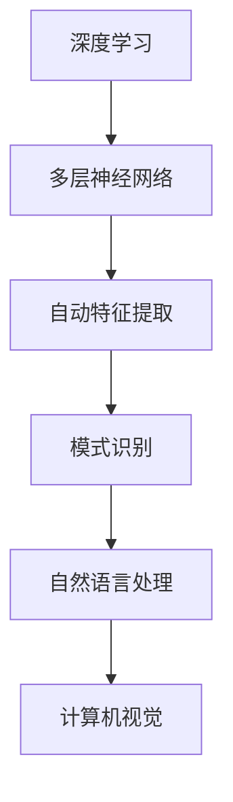

#### 1.1.2 政策与产业扶持

政府政策的支持也是大模型行业投资热潮的重要原因。各国政府纷纷出台政策，支持人工智能和大数据等新兴产业的发展，为行业提供了良好的发展环境。例如，中国发布的《新一代人工智能发展规划》明确提出要发展人工智能技术，推动大模型技术的研究和应用。同时，各国政府还通过资金支持、科研奖励等措施，鼓励企业和科研机构投入大模型技术的研究和开发。

**核心概念与联系：**

- **政策支持**：政府通过制定政策、提供资金和资源，为特定行业的发展创造有利条件。
- **产业扶持**：政府通过产业政策，引导和推动相关产业的发展，提升产业竞争力。

**Mermaid流程图：**

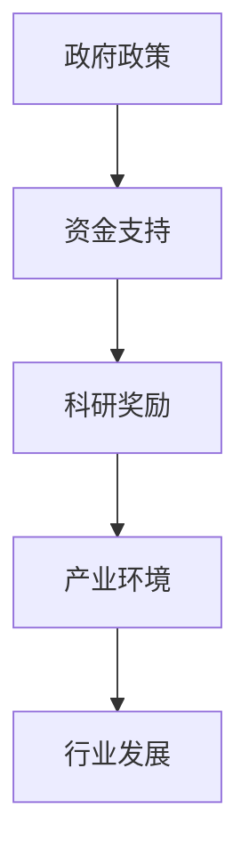

#### 1.1.3 市场需求与预期收益

市场需求和大模型技术的预期收益也是投资热潮的重要驱动因素。随着大数据和云计算等技术的发展，企业对大模型技术的需求不断增长。大模型技术在提高生产效率、降低运营成本、提升用户体验等方面具有显著优势，吸引了众多企业的投资。同时，大模型技术的商业化前景广阔，预期收益较高，吸引了大量资本涌入。

**核心概念与联系：**

- **市场需求**：消费者或企业对产品或服务的需求。
- **预期收益**：投资者对投资项目的未来收益预期。

**Mermaid流程图：**

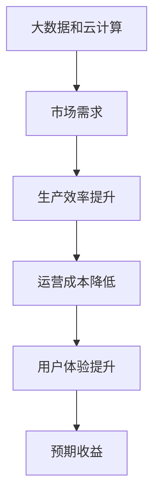

### 1.2 投资热潮的表现与特点

#### 1.2.1 投资规模与增长速度

大模型行业的投资规模在近年来呈现出快速增长的态势。根据相关数据显示，2020年全球人工智能行业的投资总额超过2500亿美元，其中大模型技术领域占据了相当大的比例。随着大模型技术的不断成熟和应用的推广，预计未来几年投资规模将继续保持高速增长。

**核心概念与联系：**

- **投资规模**：指企业在特定领域内投入的资金总额。
- **增长速度**：衡量投资规模变化的快慢。

**Mermaid流程图：**

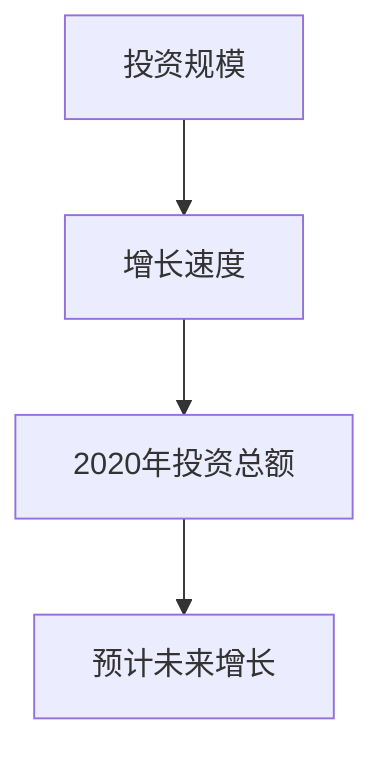

#### 1.2.2 投资领域与重点

大模型技术的应用范围广泛，涉及自然语言处理、计算机视觉、推荐系统等多个领域。在投资热潮中，不同领域受到了不同程度的关注。其中，自然语言处理和计算机视觉领域受到的资本投入最多，成为投资的重点领域。此外，推荐系统、智能监控、自动驾驶等领域也受到了一定程度的关注。

**核心概念与联系：**

- **投资领域**：投资者关注的行业或领域。
- **投资重点**：投资者在特定领域内关注的重点方向。

**Mermaid流程图：**

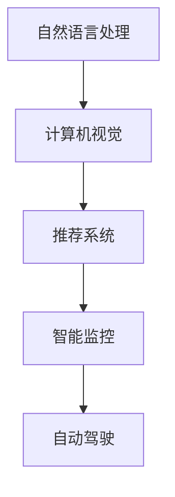

#### 1.2.3 企业投资策略与竞争态势

在投资热潮中，企业采取了多种投资策略，以应对市场竞争。一些企业通过自主研发来提升技术实力，另一些企业则通过收购和合作来快速获取技术资源。此外，还有一些企业通过投资其他企业来布局产业链，以实现互利共赢。

**核心概念与联系：**

- **企业投资策略**：企业为应对市场竞争而采取的投资措施。
- **竞争态势**：行业内企业之间的竞争格局和态势。

**Mermaid流程图：**

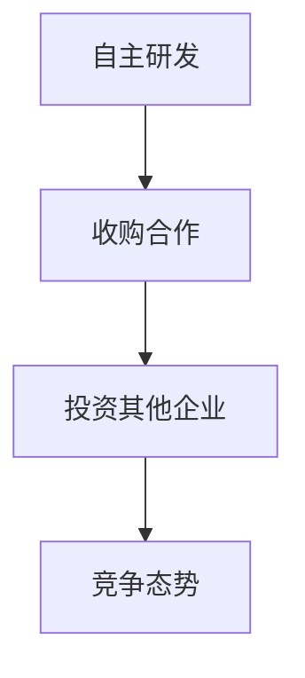

### 1.3 投资热潮的影响与挑战

#### 1.3.1 对企业创新与发展的推动作用

投资热潮对企业的创新和发展起到了积极的推动作用。首先，投资增加了企业的研发投入，促进了技术创新和产品升级。其次，投资带来了更多的资源，包括人才、技术和资金等，为企业的持续发展提供了有力支持。此外，投资还激发了企业的创新活力，促进了产业生态的构建和优化。

**核心概念与联系：**

- **企业创新**：企业在技术研发和市场拓展等方面的创新活动。
- **企业持续发展**：企业在长期经营过程中，通过不断创新和优化，实现可持续发展的能力。

**Mermaid流程图：**

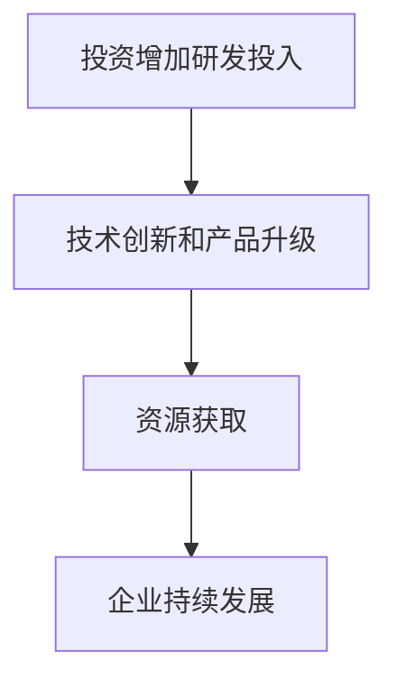

#### 1.3.2 风险与泡沫的风险

然而，投资热潮也带来了一定的风险和泡沫。首先，过度的投资可能导致资源过剩和产能过剩，造成资源浪费。其次，一些企业为了追求短期收益，可能进行盲目扩张和投资，忽视了技术研发和产品质量的提升。此外，投资热潮还可能导致行业竞争激烈，企业为了争夺市场份额，可能采取不正当竞争手段，损害整个行业的健康发展。

**核心概念与联系：**

- **风险**：企业在投资和经营过程中面临的不确定性和潜在损失。
- **泡沫**：市场对某一领域或产品的过度追捧，导致价格偏离实际价值。

**Mermaid流程图：**

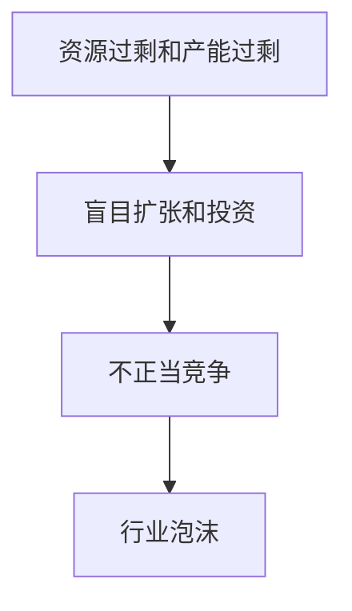

#### 1.3.3 市场竞争与可持续发展

投资热潮带来了市场竞争的加剧，企业需要在激烈的市场环境中寻找生存和发展之道。一方面，企业需要提升自身的技术实力和创新能力，以保持竞争优势。另一方面，企业还需要注重可持续发展，通过优化产品结构、提升产品质量和服务水平，实现长期盈利和持续发展。

**核心概念与联系：**

- **市场竞争**：企业在市场上争夺市场份额和资源的过程。
- **可持续发展**：企业在长期经营过程中，实现经济效益、社会效益和环境效益的协调统一。

**Mermaid流程图：**

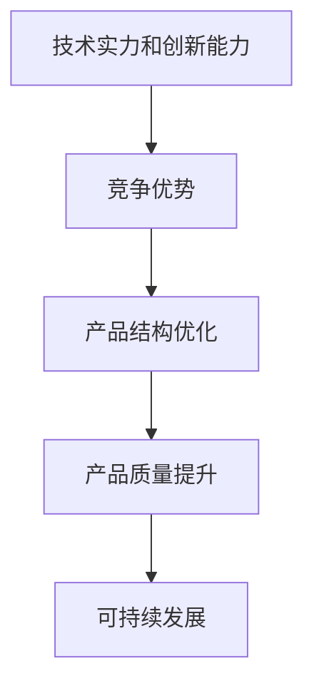

### 第一部分：大模型行业投资热潮降温的原因分析

#### 第2章：大模型行业投资热潮降温的原因分析

### 2.1 技术发展瓶颈

大模型行业的投资热潮降温，首先可以归因于技术发展面临的一些瓶颈。尽管大模型技术在自然语言处理、计算机视觉等领域取得了显著进展，但仍然存在一系列技术难题亟待解决。

#### 2.1.1 大模型技术面临的挑战

首先，大模型训练所需的计算资源仍然是一个巨大的挑战。大型语言模型如GPT-3，其训练过程需要大量的计算资源，包括高性能的GPU集群和云计算服务。这不仅增加了企业的运营成本，也对能源消耗提出了更高的要求。随着训练规模不断扩大，如何高效地分配和利用计算资源成为一个关键问题。

**核心概念与联系：**

- **计算资源**：指用于数据处理和计算的各种硬件和软件资源。
- **训练规模**：指模型训练过程中所需的数据集大小和计算复杂度。

**Mermaid流程图：**

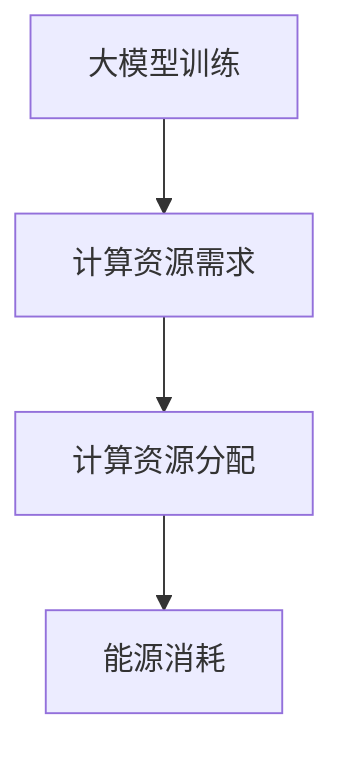

#### 2.1.2 算法性能的瓶颈

其次，算法性能的瓶颈也是一个重要因素。尽管大模型的参数数量和计算能力在不断提升，但模型的性能提升并不总是线性的。例如，自然语言处理领域中的大型语言模型虽然能够生成高质量的文本，但在某些特定任务上（如问答系统）仍然存在准确性问题。算法的鲁棒性和泛化能力仍然是需要持续改进的领域。

**核心概念与联系：**

- **算法性能**：指模型在实际应用中的表现和效果。
- **鲁棒性**：模型在面临噪声和异常数据时的稳定性。
- **泛化能力**：模型在新的数据集上的表现能力。

**Mermaid流程图：**

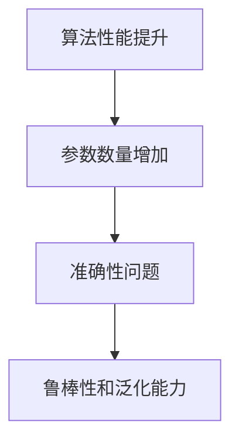

#### 2.1.3 数据获取与处理的困难

另外，数据获取和处理也是一个挑战。大模型需要大量的高质量数据来训练，但数据的获取和处理过程往往非常复杂和耗时。数据隐私、数据标注的质量和效率等问题都需要解决。特别是在自然语言处理领域，如何处理大规模、多样化、复杂的数据集是一个技术难题。

**核心概念与联系：**

- **数据获取**：指从各种来源收集和获取数据的过程。
- **数据处理**：指对收集到的数据进行清洗、预处理和分析的过程。

**Mermaid流程图：**

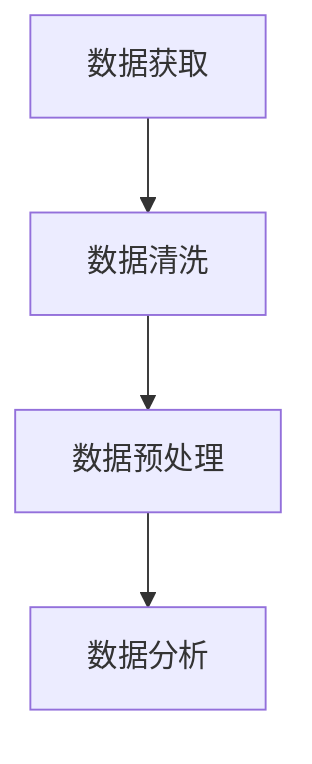

### 2.2 市场需求变化

除了技术发展瓶颈，市场需求的变化也是导致大模型行业投资热潮降温的重要原因。随着市场逐渐饱和，企业对大模型技术的需求开始放缓。

#### 2.2.1 市场饱和与需求放缓

市场饱和是一个关键因素。随着大模型技术的普及和应用，越来越多的企业开始采用这一技术，市场竞争日益激烈。然而，随着市场渗透率的提高，新的潜在用户减少，导致市场需求增长放缓。例如，在金融、医疗、教育等领域，虽然大模型技术有广泛的应用潜力，但市场已经趋于饱和，新的需求增长空间有限。

**核心概念与联系：**

- **市场饱和**：指市场已达到最大容量，无法容纳更多的产品或服务。
- **需求放缓**：指市场需求的增长速度减缓或出现停滞。

**Mermaid流程图：**

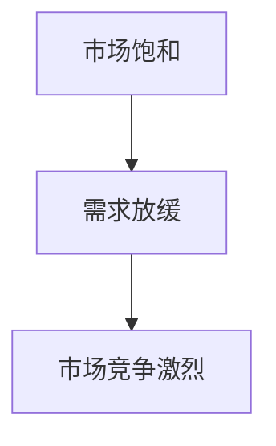

#### 2.2.2 企业成本压力增大

随着大模型技术的应用深入，企业的运营成本也在不断上升。计算资源的消耗、数据获取和处理成本、以及维护和更新模型的成本都在增加。特别是在当前经济环境下，企业面临成本控制的压力，难以继续承担过高的研发成本。这导致企业在投资大模型技术时变得更加谨慎。

**核心概念与联系：**

- **运营成本**：企业在日常运营过程中产生的各种成本。
- **成本控制**：企业通过管理和优化成本，提高资源利用效率的过程。

**Mermaid流程图：**

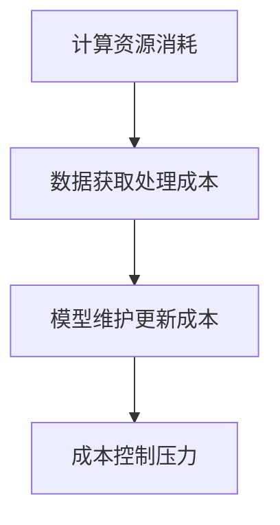

#### 2.2.3 行业竞争加剧

行业竞争的加剧也是一个重要因素。在投资热潮期间，大量企业和投资机构涌入大模型领域，导致市场竞争激烈。随着市场逐渐饱和，企业之间的竞争不仅体现在技术方面，还包括价格、服务和市场推广等多个方面。这种竞争加剧了企业的生存压力，迫使其在投资决策上更加谨慎。

**核心概念与联系：**

- **行业竞争**：指行业内不同企业之间的竞争关系。
- **竞争压力**：企业在市场竞争中面临的压力和挑战。

**Mermaid流程图：**

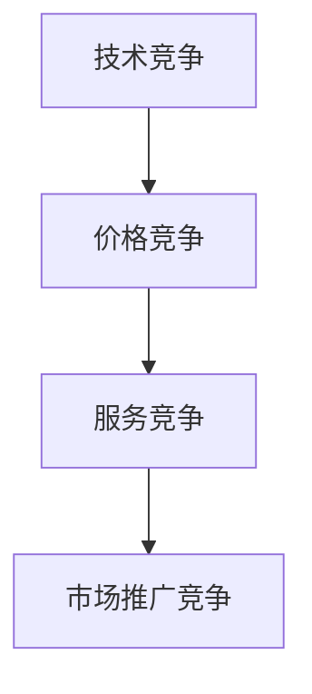

### 2.3 政策与监管影响

政策与监管的变化也是导致大模型行业投资热潮降温的一个重要原因。随着大模型技术的应用范围不断扩大，政府开始加强对其的监管，这对行业的投资和发展产生了影响。

#### 2.3.1 政策调整与监管加强

首先，政府政策的调整对行业投资产生了影响。一些国家或地区对人工智能和大数据等新兴产业的扶持政策开始发生变化，从过去的全面扶持转向更加注重风险管理和合规性。这种政策调整导致企业对大模型技术的投资变得更加谨慎，以避免违反相关法规。

**核心概念与联系：**

- **政策调整**：政府对特定行业的政策方向和力度进行调整。
- **风险管理和合规性**：企业在经营过程中需要遵守的法规和规范。

**Mermaid流程图：**

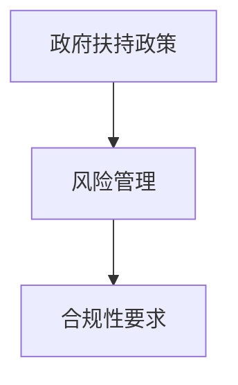

#### 2.3.2 风险管理与合规要求

其次，监管加强也是导致投资热潮降温的一个因素。随着大模型技术的广泛应用，其潜在风险也逐渐显现出来，包括数据隐私、算法偏见和安全性等问题。政府为了保护公众利益，加强对大模型技术的监管，要求企业在研发和应用过程中遵守更高的合规标准。这种监管压力增加了企业的运营成本和合规风险，导致投资决策变得更加谨慎。

**核心概念与联系：**

- **风险识别**：企业识别和分析可能面临的风险。
- **合规要求**：企业在经营过程中需要遵守的法律和法规。

**Mermaid流程图：**

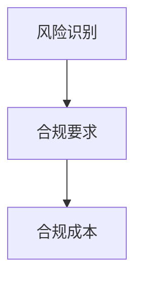

#### 2.3.3 企业战略调整与合规经营

最后，企业为了应对政策调整和监管加强，开始调整战略和经营模式。一些企业选择加大在风险管理和合规方面的投入，以确保符合政府的监管要求。同时，一些企业也选择减少在大模型技术上的投资，以降低合规风险和运营成本。这种战略调整导致行业投资规模和速度放缓。

**核心概念与联系：**

- **战略调整**：企业根据外部环境和内部能力的变化，调整长期发展目标和经营策略。
- **合规经营**：企业在遵守相关法规和规范的基础上进行经营。

**Mermaid流程图：**

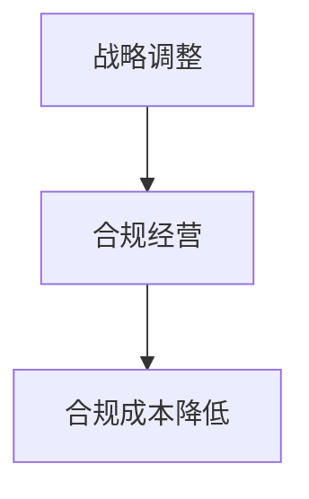

### 2.4 投资者心态转变

投资者心态的转变也是导致大模型行业投资热潮降温的一个重要因素。在投资热潮期间，投资者往往被市场的繁荣和巨大的预期收益所吸引，表现出较高的风险偏好。然而，随着市场的发展，投资者开始重新评估大模型行业的风险和收益，导致投资决策变得更加谨慎。

#### 2.4.1 投资者风险偏好降低

首先，投资者风险偏好降低。在投资热潮期间，投资者普遍具有较高的风险承受能力，愿意承担较大的风险以追求更高的收益。然而，随着市场的饱和和竞争的加剧，投资者开始认识到大模型行业的风险，包括技术瓶颈、市场需求变化和合规风险等。这种风险认知的变化导致投资者对大模型行业的投资变得更加谨慎。

**核心概念与联系：**

- **风险偏好**：投资者愿意承担风险的程度。
- **风险认知**：投资者对风险的识别和评估。

**Mermaid流程图：**

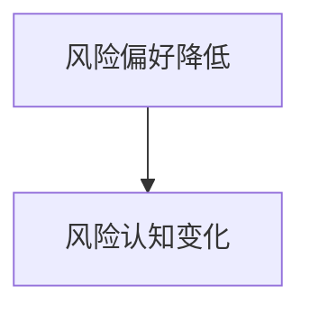

#### 2.4.2 投资决策趋于谨慎

其次，投资决策趋于谨慎。在投资热潮期间，投资者往往倾向于快速决策，以抓住市场机遇。然而，随着市场的饱和和竞争的加剧，投资者开始更加重视投资的风险和收益匹配。投资决策变得更加审慎，投资者更倾向于选择具有稳健发展前景和较低风险的项目。

**核心概念与联系：**

- **投资决策**：投资者在选择投资项目时进行的判断和决策。
- **风险和收益匹配**：投资者在投资决策中追求风险和收益的平衡。

**Mermaid流程图：**

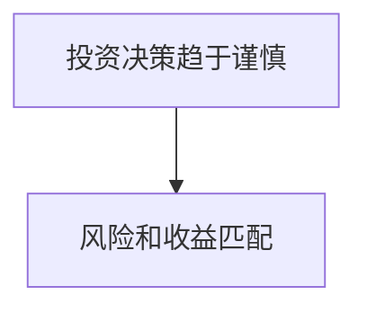

#### 2.4.3 投资组合多样化需求

最后，投资组合多样化需求增加。在投资热潮期间，投资者往往将大部分资金集中在大模型行业，以追求高收益。然而，随着市场的变化和风险的增加，投资者开始意识到投资组合多样化的重要性。投资者开始将资金分散投资到多个行业和领域，以降低整体投资风险。

**核心概念与联系：**

- **投资组合**：投资者持有的所有投资项目。
- **多样化**：通过投资不同行业和领域的项目，降低整体投资风险。

**Mermaid流程图：**

```mermaid
graph TD
A[投资组合多样化需求] --> B[降低整体投资风险]
```

### 第一部分：大模型行业投资热潮降温的影响与应对策略

#### 第3章：大模型行业投资热潮降温的影响与应对策略

### 3.1 行业影响

大模型行业投资热潮的降温对整个行业产生了深远的影响。首先，行业洗牌与市场格局的变化成为不可避免的趋势。随着资本的退出和市场的饱和，一些中小型企业可能难以维持运营，被迫退出市场。这导致市场格局发生变化，一些具备核心技术和资源的企业逐渐成为行业主导者。

#### 3.1.1 行业洗牌与市场格局变化

行业洗牌的过程伴随着市场格局的重组。一方面，资本退潮导致部分企业的资金链断裂，难以继续投资研发和市场拓展。另一方面，具备技术优势和资源整合能力的企业则通过并购、合作等方式，迅速扩大市场份额，提升行业地位。

**核心概念与联系：**

- **行业洗牌**：指行业内企业因为资本、技术、市场等因素的变动而重新分配市场份额的过程。
- **市场格局变化**：指行业内企业竞争地位和市场份额的重新配置。

**Mermaid流程图：**

```mermaid
graph TD
A[资本退潮] --> B[企业资金链断裂]
B --> C[中小型企业退出]
C --> D[市场格局变化]
D --> E[行业主导者崛起]
```

#### 3.1.2 企业生存压力与创新能力提升

在行业洗牌的过程中，企业的生存压力显著增加。一方面，市场竞争的加剧导致企业的利润空间缩小；另一方面，资本退潮使得企业难以获得充足的资金支持。这种压力迫使企业不得不加大在技术创新和研发投入上的力度，以保持竞争力和市场份额。

**核心概念与联系：**

- **企业生存压力**：企业面临的市场竞争和资金压力。
- **创新能力提升**：企业通过技术创新和研发投入，提高产品和服务的竞争力。

**Mermaid流程图：**

```mermaid
graph TD
A[市场竞争加剧] --> B[利润空间缩小]
B --> C[资本退潮]
C --> D[企业生存压力]
D --> E[创新能力提升]
```

#### 3.1.3 投资者风险识别与调整投资策略

随着大模型行业的投资热潮降温，投资者开始更加重视风险识别和投资策略的调整。在市场饱和和竞争加剧的背景下，投资者更加关注企业的核心竞争力和可持续发展能力，而不仅仅是短期收益。

**核心概念与联系：**

- **投资者风险识别**：投资者对投资项目的潜在风险进行评估和识别。
- **投资策略调整**：投资者根据市场环境和风险偏好，对投资组合进行调整。

**Mermaid流程图：**

```mermaid
graph TD
A[市场饱和] --> B[竞争加剧]
B --> C[投资者风险识别]
C --> D[投资策略调整]
```

### 3.2 企业应对策略

在投资热潮降温的背景下，企业需要采取一系列应对策略，以应对市场竞争和生存压力，确保持续发展。

#### 3.2.1 技术创新与研发投入

技术创新是企业应对市场变化的关键策略之一。企业需要加大在技术研发上的投入，推动核心技术的突破和创新。通过不断优化算法、提高计算效率和降低成本，企业可以在激烈的市场竞争中保持技术优势。

**核心概念与联系：**

- **技术创新**：企业在研发过程中，通过技术突破和创新，提升产品和服务的竞争力。
- **研发投入**：企业为技术研发和产品升级投入的资金和资源。

**Mermaid流程图：**

```mermaid
graph TD
A[技术研发投入] --> B[核心技术突破]
B --> C[算法优化]
C --> D[计算效率提升]
```

#### 3.2.2 商业模式创新与市场拓展

除了技术创新，商业模式创新也是企业应对市场变化的另一重要策略。企业需要根据市场需求和自身优势，不断探索新的商业模式，以拓展市场空间和提升盈利能力。例如，通过平台化运营、B2B合作、多元化服务等模式，企业可以找到新的增长点。

**核心概念与联系：**

- **商业模式创新**：企业在经营过程中，通过创新模式，提升业务效率和盈利能力。
- **市场拓展**：企业通过开拓新市场、新客户，实现业务增长。

**Mermaid流程图：**

```mermaid
graph TD
A[商业模式创新] --> B[平台化运营]
B --> C[B2B合作]
C --> D[多元化服务]
```

#### 3.2.3 合作与并购策略

在投资热潮降温的背景下，合作与并购策略成为企业快速获取技术和市场资源的重要手段。通过并购，企业可以迅速扩大业务规模和市场份额；通过合作，企业可以共享技术和资源，降低研发成本和风险。

**核心概念与联系：**

- **合作**：企业通过与其他企业合作，共享资源和技术，实现互利共赢。
- **并购**：企业通过收购其他企业，迅速扩大业务规模和市场份额。

**Mermaid流程图：**

```mermaid
graph TD
A[合作与并购策略] --> B[资源共享]
B --> C[技术研发]
C --> D[市场拓展]
```

### 3.3 政策支持与行业引导

在投资热潮降温的背景下，政府的政策支持和行业引导对企业发展起到了关键作用。首先，政府可以通过资金扶持、税收优惠等措施，降低企业的运营成本和研发压力。其次，政府可以推动行业标准化和规范化建设，提高企业的合规性和市场准入门槛，促进行业健康发展。

**核心概念与联系：**

- **政策支持**：政府通过制定政策和提供资源，支持企业发展和行业建设。
- **行业引导**：政府通过规范和引导，促进行业的健康发展。

**Mermaid流程图：**

```mermaid
graph TD
A[政策支持] --> B[资金扶持]
B --> C[税收优惠]
C --> D[合规性提高]
```

#### 3.3.1 政策调整与行业规范

政府在政策调整方面，可以从以下几个方面进行：首先，优化现有政策，使其更加适应行业发展的新需求；其次，出台新的政策，鼓励企业进行技术创新和商业模式创新；最后，加强对行业的监管，防止市场乱象和恶性竞争。

**核心概念与联系：**

- **政策调整**：政府根据行业发展需要，对现有政策进行优化和调整。
- **行业规范**：政府通过制定规范，促进行业健康发展。

**Mermaid流程图：**

```mermaid
graph TD
A[政策优化] --> B[鼓励创新]
B --> C[监管加强]
```

#### 3.3.2 政策扶持与产业协同

政府在政策扶持方面，可以采取以下措施：首先，加大对企业的资金扶持，特别是对技术创新和商业模式创新项目给予重点支持；其次，推动产业链上下游企业的协同发展，形成产业生态；最后，加强与科研机构和高校的合作，推动产学研一体化发展。

**核心概念与联系：**

- **政策扶持**：政府通过资金、技术、资源等手段，支持企业发展。
- **产业协同**：产业链上下游企业通过合作，实现资源共享和互利共赢。

**Mermaid流程图：**

```mermaid
graph TD
A[资金扶持] --> B[产业协同]
B --> C[产学研合作]
```

#### 3.3.3 行业协会与标准化工作

行业协会在行业引导方面发挥着重要作用。首先，行业协会可以制定行业标准和规范，提高企业的合规性和市场准入门槛；其次，行业协会可以通过组织培训和研讨会，提高企业的技术和管理水平；最后，行业协会可以发挥桥梁作用，协调政府与企业之间的关系，推动行业健康发展。

**核心概念与联系：**

- **行业协会**：由行业企业组成的非营利性组织，旨在促进行业健康发展。
- **标准化工作**：制定和实施行业标准和规范，提高行业整体水平。

**Mermaid流程图：**

```mermaid
graph TD
A[制定标准] --> B[培训与研讨]
B --> C[协调关系]
```

### 3.4 投资者心态调整

在投资热潮降温的背景下，投资者也需要调整心态，采取更加理性和长远的投资策略。

#### 3.4.1 长期投资与理性投资

首先，投资者需要树立长期投资的理念。在市场波动和不确定性增加的背景下，短期投机行为的风险较高，投资者应更加关注企业的长期发展潜力和核心竞争力。其次，投资者需要采取理性投资策略，根据企业的基本面和财务状况进行评估，而非仅凭市场情绪和短期收益预期。

**核心概念与联系：**

- **长期投资**：投资者关注企业的长期价值，而非短期波动。
- **理性投资**：投资者基于理性分析和评估，做出投资决策。

**Mermaid流程图：**

```mermaid
graph TD
A[长期投资理念] --> B[理性投资策略]
B --> C[基本面评估]
```

#### 3.4.2 风险管理与分散投资

其次，投资者需要加强风险管理，采取分散投资策略。通过在不同行业和领域进行投资，投资者可以降低单一行业或领域的风险，实现风险分散。此外，投资者还可以通过投资不同的资产类别，如股票、债券、基金等，进一步分散投资风险。

**核心概念与联系：**

- **风险管理**：投资者通过分散投资、风险控制等方法，降低投资风险。
- **分散投资**：投资者在不同行业、领域和资产类别上进行投资，实现风险分散。

**Mermaid流程图：**

```mermaid
graph TD
A[分散投资策略] --> B[行业分散]
B --> C[资产类别分散]
```

#### 3.4.3 投资教育与市场教育

最后，投资者需要加强投资教育和市场教育，提高自身的投资素养和风险识别能力。通过学习和了解投资知识，投资者可以更好地理解市场的变化和投资机会，做出更加明智的投资决策。

**核心概念与联系：**

- **投资教育**：投资者通过学习和培训，提高投资知识和技能。
- **市场教育**：投资者通过了解市场动态和投资逻辑，提高市场认知能力。

**Mermaid流程图：**

```mermaid
graph TD
A[投资教育] --> B[投资知识学习]
B --> C[市场动态了解]
```

### 第二部分：投资热潮降温下的企业战略调整

#### 第4章：技术升级与创新能力提升

### 4.1 技术升级的重要性

在投资热潮降温的背景下，技术升级成为企业应对市场变化和提升竞争力的重要策略。技术升级不仅有助于企业提升产品性能和用户体验，还可以降低运营成本和提升生产效率。

#### 4.1.1 技术升级对企业的长远发展

技术升级对企业的长远发展具有重要意义。通过技术升级，企业可以提升产品和服务的核心竞争力，满足市场的不断变化和客户需求。同时，技术升级还可以帮助企业提高生产效率，降低运营成本，增强企业的市场竞争力。

**核心概念与联系：**

- **技术升级**：企业在现有技术基础上，进行改进和创新，提升产品性能和用户体验。
- **长远发展**：企业在长期经营过程中，通过持续的技术升级和创新，实现可持续发展。

**Mermaid流程图：**

```mermaid
graph TD
A[技术升级] --> B[产品性能提升]
B --> C[用户体验提升]
C --> D[长远发展]
```

#### 4.1.2 技术升级的行业趋势与方向

技术升级的行业趋势和方向主要包括以下几个方面：

1. **人工智能与大数据技术的深度融合**：人工智能和大数据技术的快速发展，使得企业可以通过数据驱动的决策和智能化应用，实现更高效的生产和运营。

2. **边缘计算与云计算的结合**：边缘计算和云计算的结合，可以为企业提供更灵活、更高效的计算资源和服务，满足不同场景下的需求。

3. **物联网技术的广泛应用**：物联网技术的广泛应用，可以实现设备互联和智能化管理，提升生产效率和资源利用效率。

4. **区块链技术的应用**：区块链技术的应用，可以提升企业的数据安全和可信度，实现更高效、更透明的供应链管理。

**核心概念与联系：**

- **行业趋势**：指行业在技术、市场、政策等方面的变化和发展方向。
- **技术方向**：企业在技术升级过程中，选择的重点领域和关键技术。

**Mermaid流程图：**

```mermaid
graph TD
A[人工智能与大数据] --> B[边缘计算与云计算]
B --> C[物联网技术]
C --> D[区块链技术]
```

#### 4.1.3 技术升级的核心领域与关键技术

技术升级的核心领域和关键技术主要包括以下几个方面：

1. **人工智能技术**：包括深度学习、自然语言处理、计算机视觉等，通过这些技术，企业可以实现更智能化的决策和自动化生产。

2. **大数据技术**：包括数据采集、存储、处理和分析，通过大数据技术，企业可以更好地理解和分析用户需求，优化产品和运营策略。

3. **云计算技术**：包括基础设施即服务（IaaS）、平台即服务（PaaS）和软件即服务（SaaS），通过云计算技术，企业可以实现更灵活、更高效的IT资源管理。

4. **物联网技术**：包括传感器技术、通信协议和数据处理，通过物联网技术，企业可以实现设备互联和智能化管理。

5. **区块链技术**：包括分布式账本、智能合约和共识机制，通过区块链技术，企业可以实现更高效、更安全的供应链管理和数据共享。

**核心概念与联系：**

- **核心领域**：企业在技术升级过程中，重点关注和投入的技术领域。
- **关键技术**：企业在核心领域内，选择的关键技术进行突破和应用。

**Mermaid流程图：**

```mermaid
graph TD
A[人工智能技术] --> B[大数据技术]
B --> C[云计算技术]
C --> D[物联网技术]
D --> E[区块链技术]
```

### 4.2 创新能力提升的策略

在技术升级的基础上，企业还需要不断提升创新能力，以适应市场变化和持续发展。创新能力提升的策略包括以下几个方面：

#### 4.2.1 研发投入与人才引进

研发投入是企业提升创新能力的重要保障。企业需要持续增加研发投入，以支持技术创新和产品开发。同时，企业还需要引进高素质的研发人才，特别是具有前沿技术能力和创新思维的人才。

**核心概念与联系：**

- **研发投入**：企业为技术研发和产品开发投入的资金和资源。
- **人才引进**：企业通过招聘和培养，引进高素质的研发人才。

**Mermaid流程图：**

```mermaid
graph TD
A[研发投入] --> B[技术创新]
B --> C[产品开发]
C --> D[人才引进]
```

#### 4.2.2 知识产权保护与技术创新

知识产权保护是企业创新能力提升的关键环节。通过保护知识产权，企业可以确保技术创新的成果得到有效保护和商业化应用。同时，知识产权保护还可以提升企业的技术水平和市场竞争力。

**核心概念与联系：**

- **知识产权保护**：企业通过法律手段，保护技术创新成果的权益。
- **技术创新**：企业在研发过程中，通过技术创新提升产品性能和用户体验。

**Mermaid流程图：**

```mermaid
graph TD
A[知识产权保护] --> B[技术创新成果保护]
B --> C[市场竞争提升]
```

#### 4.2.3 开放合作与产学研结合

开放合作和产学研结合是企业提升创新能力的重要途径。通过与其他企业、科研机构和高校的合作，企业可以共享技术资源和研究成果，实现技术创新的协同发展。同时，产学研结合还可以促进产业链的整合和优化，提升企业的整体竞争力。

**核心概念与联系：**

- **开放合作**：企业通过与其他企业和机构的合作，共享技术资源和市场信息。
- **产学研结合**：企业、科研机构和高校共同合作，实现技术创新和产业应用的结合。

**Mermaid流程图：**

```mermaid
graph TD
A[开放合作] --> B[技术资源共享]
B --> C[产业链整合]
C --> D[整体竞争力提升]
```

### 4.3 技术创新实践

#### 4.3.1 技术创新案例分析

以下为几个实际案例，展示了企业在技术创新过程中的实践和成果：

1. **案例一：某企业通过人工智能技术提升产品质量**

某企业在生产过程中，通过引入人工智能技术，实现了对产品质量的实时监控和自动化检测。通过深度学习和计算机视觉技术，企业可以快速识别产品缺陷，提高生产效率和产品质量。

**核心算法原理讲解：**

- **深度学习**：通过多层神经网络，实现对产品图像的自动特征提取和模式识别。
- **计算机视觉**：通过图像处理技术，实现对产品缺陷的检测和分类。

**伪代码：**

```python
import tensorflow as tf
import cv2

# 加载训练好的深度学习模型
model = tf.keras.models.load_model('quality_detection_model.h5')

# 读取产品图像
image = cv2.imread('product_image.jpg')

# 对图像进行预处理
processed_image = preprocess_image(image)

# 使用模型进行缺陷检测
predictions = model.predict(processed_image)

# 根据预测结果，判断产品是否合格
if predictions > threshold:
    print("产品合格")
else:
    print("产品不合格")
```

2. **案例二：某企业通过大数据技术优化供应链管理**

某企业通过大数据技术，实现了对供应链的全面监控和优化。通过收集和分析供应链各个环节的数据，企业可以实时了解库存情况、物流动态和采购计划，提高供应链的效率和响应速度。

**核心算法原理讲解：**

- **大数据处理**：通过分布式计算和存储技术，实现对大规模数据的快速处理和分析。
- **供应链优化**：通过数据分析和预测，优化供应链各环节的资源配置和运营策略。

**伪代码：**

```python
from pyspark.sql import SparkSession

# 创建Spark会话
spark = SparkSession.builder.appName("supply_chain_optimization").getOrCreate()

# 加载供应链数据
supply_chain_data = spark.read.csv("supply_chain_data.csv", header=True)

# 对供应链数据进行分析
supply_chain_analysis = supply_chain_data.groupBy("product").agg(
    sum("inventory").alias("total_inventory"),
    sum("shipment").alias("total_shipment")
)

# 根据分析结果，制定优化策略
optimization_strategy = analyze_supply_chain(supply_chain_analysis)

# 执行供应链优化
execute_supply_chain_optimization(optimization_strategy)
```

#### 4.3.2 技术创新项目的实施与运营

以下为技术创新项目的实施与运营过程：

1. **项目背景**：

某企业在市场上推出了一款基于人工智能技术的智能客服系统，旨在提升客户体验和服务效率。

2. **项目目标**：

- **提升客户满意度**：通过智能客服系统，提供更高效、更个性化的客户服务。
- **降低运营成本**：通过自动化处理客户咨询，减少人工成本。

3. **项目实施**：

- **需求分析**：了解客户需求和业务场景，确定智能客服系统的功能和性能要求。
- **技术选型**：选择适合的智能客服平台和人工智能算法，如自然语言处理和语音识别。
- **系统开发**：根据需求分析，开发智能客服系统的核心功能，包括语音识别、自然语言处理和智能回复。
- **测试与优化**：对系统进行功能测试和性能优化，确保系统稳定、高效地运行。

4. **项目运营**：

- **上线部署**：将智能客服系统部署到企业的客服中心，开始对外提供服务。
- **用户反馈**：收集用户对智能客服系统的反馈，不断优化系统功能和服务质量。
- **数据监控**：对系统运行数据进行分析，监控系统性能和客户满意度，及时调整运营策略。

#### 4.3.3 技术创新的效果评估与持续改进

技术创新的效果评估和持续改进是企业保持竞争力的重要环节。以下为技术创新效果评估和持续改进的方法：

1. **效果评估**：

- **客户满意度调查**：通过问卷调查和用户反馈，了解客户对智能客服系统的满意度。
- **运营成本分析**：对比引入智能客服系统前后的运营成本，评估系统对成本降低的贡献。
- **性能指标分析**：根据系统运行数据，分析智能客服系统的响应速度、准确性和稳定性。

2. **持续改进**：

- **功能优化**：根据用户反馈和性能指标，对系统功能进行优化和改进，提升用户体验。
- **算法升级**：引入最新的自然语言处理和语音识别算法，提升系统的性能和智能化水平。
- **数据挖掘**：通过数据挖掘技术，深入分析用户行为和需求，为系统运营提供数据支持。

### 第二部分：投资热潮降温下的企业战略调整

#### 第5章：商业模式创新与市场拓展

### 5.1 商业模式创新的意义

在投资热潮降温的背景下，企业需要通过商业模式创新来适应市场变化，实现可持续发展。商业模式创新不仅能够帮助企业拓展市场空间，提升盈利能力，还能增强企业的核心竞争力。

#### 5.1.1 商业模式对企业发展的驱动作用

商业模式创新对企业发展具有显著的驱动作用。首先，它能够帮助企业找到新的盈利点，提升企业的盈利能力。例如，通过平台化运营，企业可以降低运营成本，提高资源利用效率。其次，商业模式创新有助于企业提升市场竞争力，通过差异化竞争策略，企业可以在激烈的市场环境中脱颖而出。此外，商业模式创新还可以帮助企业实现多元化发展，降低业务风险。

**核心概念与联系：**

- **商业模式**：企业在经营过程中，通过产品、服务、市场和运营等方面的组合，实现盈利和发展的方式。
- **创新**：企业在商业模式上进行改进和创新，以适应市场变化和提升竞争力。

**Mermaid流程图：**

```mermaid
graph TD
A[商业模式] --> B[盈利模式]
B --> C[市场竞争力]
C --> D[多元化发展]
```

#### 5.1.2 商业模式创新的趋势与方向

商业模式创新的趋势和方向主要体现在以下几个方面：

1. **数字化与智能化**：随着数字技术和人工智能的发展，越来越多的企业开始通过数字化和智能化手段优化商业模式。例如，通过大数据分析和智能算法，企业可以更精准地定位客户需求，提升服务质量和运营效率。

2. **平台化运营**：平台化运营是一种新兴的商业模式，通过构建生态圈，实现资源共享和互利共赢。平台化运营不仅可以降低企业的运营成本，还能提升客户体验和满意度。

3. **共享经济**：共享经济是一种基于互联网平台的商业模式，通过共享闲置资源，实现资源的高效利用。共享经济在交通、住宿、办公等领域取得了显著成果，为企业提供了新的商业模式。

4. **可持续商业模式**：随着环境保护和可持续发展意识的提高，越来越多的企业开始关注可持续商业模式。通过采用环保技术和绿色生产方式，企业可以实现经济效益和社会效益的双赢。

**核心概念与联系：**

- **数字化与智能化**：通过数字技术和人工智能，提升商业模式的效率和质量。
- **平台化运营**：通过构建平台，实现资源共享和生态圈构建。
- **共享经济**：通过共享闲置资源，实现资源的高效利用。
- **可持续商业模式**：通过环保技术和绿色生产，实现经济效益和社会效益的双赢。

**Mermaid流程图：**

```mermaid
graph TD
A[数字化与智能化] --> B[平台化运营]
B --> C[共享经济]
C --> D[可持续商业模式]
```

#### 5.1.3 商业模式创新的重要性与必要性

商业模式创新对企业的长远发展具有重要意义。首先，商业模式创新能够帮助企业找到新的盈利点和增长点，提升企业的市场竞争力。其次，商业模式创新有助于企业适应市场变化和客户需求，实现可持续发展。此外，商业模式创新还可以帮助企业降低运营成本，提高资源利用效率，提升企业的整体竞争力。

**核心概念与联系：**

- **重要性**：商业模式创新对企业发展的重要作用。
- **必要性**：企业在市场变化和竞争压力下，进行商业模式创新的必要性。

**Mermaid流程图：**

```mermaid
graph TD
A[盈利点和增长点] --> B[市场竞争力]
B --> C[适应市场变化]
C --> D[可持续发展]
```

### 5.2 商业模式创新的方法

#### 5.2.1 商业模式创新的基本原理

商业模式创新的基本原理主要包括以下几个方面：

1. **价值创造**：商业模式创新的核心在于创造价值，包括为客户创造价值、为员工创造价值、为社会创造价值。通过价值创造，企业可以提升市场竞争力和盈利能力。

2. **价值传递**：商业模式创新需要确保价值能够有效传递给客户。这包括提供高质量的产品和服务、建立良好的客户关系、提供便捷的购买体验等。

3. **价值获取**：商业模式创新需要确定合理的价值获取方式，包括定价策略、收益模式等。通过合理的价值获取，企业可以实现持续盈利。

**核心概念与联系：**

- **价值创造**：企业通过创新和改进，为客户创造更高的价值。
- **价值传递**：企业确保价值能够有效传递给客户。
- **价值获取**：企业通过合理的价值获取方式，实现持续盈利。

**Mermaid流程图：**

```mermaid
graph TD
A[价值创造] --> B[价值传递]
B --> C[价值获取]
```

#### 5.2.2 商业模式创新的工具与方法

商业模式创新的方法和工具多种多样，以下介绍几种常见的创新方法和工具：

1. **商业画布（Business Model Canvas）**：商业画布是一种直观的商业模式设计工具，包括客户细分、价值主张、渠道、客户关系、收入流、关键资源、关键活动、合作伙伴网络和成本结构等9个模块。通过填写商业画布，企业可以清晰地了解和优化自己的商业模式。

2. **蓝海战略**：蓝海战略是指企业通过创造新的市场空间，避开竞争，实现持续盈利。蓝海战略的核心是寻找未饱和的市场需求，通过创新的产品和服务，满足这些需求。

3. **价值链分析**：价值链分析是一种系统性的分析方法，通过分析企业内部的价值创造过程，找出价值提升的关键环节。通过优化价值链，企业可以提升整体竞争力。

**核心概念与联系：**

- **商业画布**：通过9个模块，直观地设计和优化商业模式。
- **蓝海战略**：通过创造新的市场空间，实现持续盈利。
- **价值链分析**：通过优化企业内部的价值创造过程，提升竞争力。

**Mermaid流程图：**

```mermaid
graph TD
A[商业画布] --> B[蓝海战略]
B --> C[价值链分析]
```

#### 5.2.3 商业模式创新案例解析

以下为几个实际案例，展示了企业在商业模式创新过程中的实践和成果：

1. **案例一：某企业通过共享经济实现商业模式创新**

某企业通过共享经济模式，实现了商业模式的创新。该企业是一家专注于办公空间共享的创业公司，通过搭建线上平台，为用户提供灵活的办公空间租赁服务。该模式不仅降低了用户的办公成本，还提高了办公空间的利用率。

**核心概念与联系：**

- **共享经济**：通过共享闲置资源，实现资源的高效利用。
- **商业模式创新**：通过共享经济模式，企业实现了业务的创新和盈利。

**Mermaid流程图：**

```mermaid
graph TD
A[共享经济] --> B[商业模式创新]
```

2. **案例二：某企业通过平台化运营实现商业模式创新**

某企业通过平台化运营模式，实现了商业模式的创新。该企业是一家电商平台，通过搭建一个开放的平台，吸引商家入驻，为用户提供多样化、个性化的商品和服务。该模式不仅降低了企业的运营成本，还提升了用户的购物体验。

**核心概念与联系：**

- **平台化运营**：通过构建平台，实现资源共享和互利共赢。
- **商业模式创新**：通过平台化运营模式，企业实现了业务的创新和盈利。

**Mermaid流程图：**

```mermaid
graph TD
A[平台化运营] --> B[商业模式创新]
```

3. **案例三：某企业通过数字化转型实现商业模式创新**

某企业通过数字化转型模式，实现了商业模式的创新。该企业是一家传统制造企业，通过引入数字化技术，实现了生产过程的智能化和自动化。该模式不仅提高了生产效率，还降低了运营成本。

**核心概念与联系：**

- **数字化转型**：通过数字技术，实现生产过程的智能化和自动化。
- **商业模式创新**：通过数字化转型模式，企业实现了业务的创新和盈利。

**Mermaid流程图：**

```mermaid
graph TD
A[数字化转型] --> B[商业模式创新]
```

### 5.3 市场拓展的策略

在商业模式创新的基础上，企业需要采取有效的市场拓展策略，以实现业务的持续增长和市场份额的提升。

#### 5.3.1 市场分析与企业定位

市场分析是企业进行市场拓展的重要基础。通过市场分析，企业可以了解市场环境、竞争态势和潜在机会，为市场定位提供依据。市场分析的主要内容包括：

1. **市场需求分析**：了解目标市场的需求特点、市场规模和增长潜力。
2. **竞争分析**：分析主要竞争对手的市场份额、产品特点和市场策略。
3. **潜在机会分析**：发现潜在的市场机会和需求，为市场定位提供依据。

**核心概念与联系：**

- **市场需求分析**：了解目标市场的需求特点。
- **竞争分析**：分析主要竞争对手的市场份额和策略。
- **潜在机会分析**：发现潜在的市场机会。

**Mermaid流程图：**

```mermaid
graph TD
A[市场需求分析] --> B[竞争分析]
B --> C[潜在机会分析]
```

企业定位是市场拓展的关键环节。通过企业定位，企业可以明确自己的市场定位和目标客户，制定相应的市场策略。企业定位的主要内容包括：

1. **目标市场定位**：明确企业要服务的目标市场，包括客户群体、市场规模和增长潜力。
2. **产品定位**：明确企业的产品特点和价值主张，与竞争对手形成差异化。
3. **品牌定位**：建立品牌形象和品牌价值观，提升品牌知名度和美誉度。

**核心概念与联系：**

- **目标市场定位**：明确企业要服务的目标市场。
- **产品定位**：明确企业的产品特点和价值主张。
- **品牌定位**：建立品牌形象和品牌价值观。

**Mermaid流程图：**

```mermaid
graph TD
A[目标市场定位] --> B[产品定位]
B --> C[品牌定位]
```

#### 5.3.2 市场进入策略与渠道建设

市场进入策略是企业进入新市场的重要决策。企业可以选择直接进入市场，也可以通过合作伙伴或收购等方式进入市场。市场进入策略的选择需要考虑市场环境、企业资源和竞争对手等因素。

**核心概念与联系：**

- **直接进入市场**：企业直接投资建厂或设立分支机构，进入目标市场。
- **通过合作伙伴**：与当地企业合作，借助合作伙伴的市场资源和渠道，进入目标市场。
- **收购**：通过收购当地企业，快速进入目标市场。

**Mermaid流程图：**

```mermaid
graph TD
A[直接进入市场] --> B[通过合作伙伴]
B --> C[收购]
```

渠道建设是市场拓展的关键环节。企业需要建立完善的渠道体系，包括直销渠道、分销渠道和合作伙伴渠道等，以实现市场覆盖和客户服务的最大化。

**核心概念与联系：**

- **直销渠道**：企业直接与客户建立联系，提供产品和服务。
- **分销渠道**：通过经销商、代理商等中间商，将产品和服务传递给客户。
- **合作伙伴渠道**：与合作伙伴建立合作关系，共同拓展市场。

**Mermaid流程图：**

```mermaid
graph TD
A[直销渠道] --> B[分销渠道]
B --> C[合作伙伴渠道]
```

#### 5.3.3 市场竞争策略与差异化定位

市场竞争是企业市场拓展过程中不可避免的挑战。企业需要制定有效的市场竞争策略，以提升市场地位和竞争力。

1. **价格竞争策略**：通过降低产品价格，提高市场占有率。适用于价格敏感型市场。

**核心概念与联系：**

- **价格竞争策略**：通过降低产品价格，提高市场占有率。

**Mermaid流程图：**

```mermaid
graph TD
A[价格竞争策略] --> B[提高市场占有率]
```

2. **质量竞争策略**：通过提供高质量的产品和服务，提升品牌形象和客户满意度。

**核心概念与联系：**

- **质量竞争策略**：通过提供高质量的产品和服务，提升品牌形象和客户满意度。

**Mermaid流程图：**

```mermaid
graph TD
A[质量竞争策略] --> B[提升品牌形象]
B --> C[客户满意度]
```

3. **差异化竞争策略**：通过提供差异化产品和服务，形成独特市场定位。

**核心概念与联系：**

- **差异化竞争策略**：通过提供差异化产品和服务，形成独特市场定位。

**Mermaid流程图：**

```mermaid
graph TD
A[差异化竞争策略] --> B[独特市场定位]
```

#### 5.3.4 市场拓展实践

以下为市场拓展的实践案例，展示企业在市场拓展过程中的具体行动和成果：

1. **案例一：某企业通过线上线下融合拓展市场**

某企业通过线上线下融合的营销策略，成功拓展了市场。在线上，企业通过电商平台和社交媒体，进行产品推广和销售；在线下，企业通过开设实体店和参加展会，提升品牌知名度和客户体验。

**核心概念与联系：**

- **线上线下融合**：通过线上电商平台和线下实体店，实现市场的全面覆盖。
- **营销策略**：通过产品推广和销售，提升市场份额。

**Mermaid流程图：**

```mermaid
graph TD
A[线上线下融合] --> B[市场拓展]
B --> C[营销策略]
```

2. **案例二：某企业通过海外市场拓展提升竞争力**

某企业通过进入海外市场，提升了竞争力。企业通过了解当地市场需求和文化，调整产品和服务策略，成功打开了国际市场。同时，企业通过建立海外分支机构，提供本地化服务，赢得了客户的信任。

**核心概念与联系：**

- **海外市场拓展**：通过进入国际市场，提升企业的竞争力。
- **本地化服务**：提供本地化服务，满足海外客户的需求。

**Mermaid流程图：**

```mermaid
graph TD
A[海外市场拓展] --> B[竞争力提升]
B --> C[本地化服务]
```

3. **案例三：某企业通过技术创新拓展市场**

某企业通过技术创新，成功拓展了市场。企业通过研发新技术和产品，提升了产品的性能和用户体验，赢得了客户的青睐。同时，企业通过构建技术创新平台，吸引了大量的创新人才和合作伙伴，实现了业务的快速增长。

**核心概念与联系：**

- **技术创新**：通过研发新技术和产品，提升产品的性能和用户体验。
- **业务拓展**：通过技术创新，实现业务的快速增长。

**Mermaid流程图：**

```mermaid
graph TD
A[技术创新] --> B[市场拓展]
B --> C[业务拓展]
```

### 第二部分：投资热潮降温下的企业战略调整

#### 第6章：风险管理与合规经营

### 6.1 风险管理的重要性

风险管理是企业确保持续发展和稳定运营的关键环节。在投资热潮降温的背景下，企业面临的风险更加复杂和多变，因此，加强风险管理显得尤为重要。

#### 6.1.1 风险管理对企业稳定发展的作用

风险管理对企业稳定发展具有重要作用。首先，风险管理有助于企业识别和评估潜在风险，制定有效的应对措施，降低风险发生的概率和影响。其次，风险管理有助于企业优化资源配置，提高运营效率，降低成本。此外，风险管理还有助于提升企业的信誉和品牌价值，增强市场竞争力。

**核心概念与联系：**

- **风险管理**：企业识别、评估和应对风险的过程。
- **稳定发展**：企业通过有效的风险管理，实现稳定和可持续发展。

**Mermaid流程图：**

```mermaid
graph TD
A[风险管理] --> B[风险识别]
B --> C[评估和应对]
C --> D[资源配置]
D --> E[稳定发展]
```

#### 6.1.2 风险管理的原则与方法

风险管理遵循以下原则：

1. **全面性原则**：风险管理应覆盖企业所有部门和业务环节，确保风险管理的全面性和系统性。
2. **预防性原则**：风险管理应注重预防风险的措施，防止风险的发生。
3. **及时性原则**：风险管理应及时识别、评估和应对风险，避免风险扩大。
4. **成本效益原则**：风险管理应考虑风险管理的成本效益，确保风险管理措施的有效性。

**核心概念与联系：**

- **全面性原则**：风险管理应覆盖企业所有部门和业务环节。
- **预防性原则**：风险管理应注重预防风险的措施。
- **及时性原则**：风险管理应及时识别、评估和应对风险。
- **成本效益原则**：风险管理应考虑成本效益。

**Mermaid流程图：**

```mermaid
graph TD
A[全面性原则] --> B[预防性原则]
B --> C[及时性原则]
C --> D[成本效益原则]
```

风险管理的方法包括：

1. **风险评估**：通过定量和定性方法，评估风险的可能性和影响，确定风险等级。
2. **风险应对**：根据风险评估结果，制定风险应对策略，包括风险规避、风险减轻、风险接受和风险转移。
3. **风险监控**：通过监控和跟踪风险，及时了解风险变化，调整风险管理策略。
4. **风险控制**：通过制定和实施风险管理措施，降低风险发生的概率和影响。

**核心概念与联系：**

- **风险评估**：评估风险的可能性和影响。
- **风险应对**：制定风险应对策略。
- **风险监控**：监控和跟踪风险。
- **风险控制**：实施风险管理措施。

**Mermaid流程图：**

```mermaid
graph TD
A[风险评估] --> B[风险应对]
B --> C[风险监控]
C --> D[风险控制]
```

### 6.2 合规经营的要求

合规经营是企业稳定发展的重要保障。在投资热潮降温的背景下，企业面临的政策和监管环境更加复杂，因此，加强合规经营显得尤为重要。

#### 6.2.1 合规经营的法律与政策环境

合规经营的法律与政策环境主要包括以下几个方面：

1. **法律法规**：企业需要遵守的各类法律法规，如公司法、证券法、税法、劳动法等。
2. **监管政策**：政府或监管机构发布的监管政策和指导意见，如行业规范、标准等。
3. **国际法规**：涉及国际贸易和跨国经营的国际法规，如国际会计准则、反洗钱法规等。

**核心概念与联系：**

- **法律法规**：企业需要遵守的各类法律法规。
- **监管政策**：政府或监管机构发布的监管政策和指导意见。
- **国际法规**：涉及国际贸易和跨国经营的国际法规。

**Mermaid流程图：**

```mermaid
graph TD
A[法律法规] --> B[监管政策]
B --> C[国际法规]
```

#### 6.2.2 合规经营的基本原则与实践

合规经营的基本原则包括：

1. **合规性原则**：企业应遵循法律法规和监管政策，确保经营活动的合规性。
2. **诚信原则**：企业应遵循诚信原则，建立良好的商业信誉和品牌形象。
3. **责任原则**：企业应承担社会责任，关注社会效益和环境保护。

**核心概念与联系：**

- **合规性原则**：企业应遵循法律法规和监管政策。
- **诚信原则**：企业应遵循诚信原则，建立良好的商业信誉和品牌形象。
- **责任原则**：企业应承担社会责任，关注社会效益和环境保护。

**Mermaid流程图：**

```mermaid
graph TD
A[合规性原则] --> B[诚信原则]
B --> C[责任原则]
```

合规经营的实践包括：

1. **建立健全合规体系**：企业应建立合规管理部门和合规制度，确保合规经营的实施。
2. **加强合规培训和宣传**：企业应定期进行合规培训，提高员工的合规意识和能力。
3. **实施合规监控和审计**：企业应建立合规监控机制，定期进行合规审计，及时发现和纠正合规问题。

**核心概念与联系：**

- **合规体系**：企业建立合规管理部门和合规制度。
- **合规培训**：企业定期进行合规培训。
- **合规监控和审计**：企业实施合规监控和审计。

**Mermaid流程图：**

```mermaid
graph TD
A[合规体系] --> B[合规培训]
B --> C[合规监控和审计]
```

#### 6.2.3 合规经营的效果评估与持续改进

合规经营的效果评估是确保企业合规经营的有效性。企业应定期对合规经营的效果进行评估，包括合规性评估、合规风险评估、合规效益评估等。

**核心概念与联系：**

- **合规性评估**：评估企业遵守法律法规和监管政策的情况。
- **合规风险评估**：评估企业面临的合规风险和风险控制效果。
- **合规效益评估**：评估合规经营对企业效益的影响。

**Mermaid流程图：**

```mermaid
graph TD
A[合规性评估] --> B[合规风险评估]
B --> C[合规效益评估]
```

持续改进是合规经营的重要环节。企业应根据评估结果，持续改进合规管理体系和合规经营策略，提高合规经营水平。

**核心概念与联系：**

- **持续改进**：根据评估结果，持续改进合规管理体系和策略。
- **合规管理体系改进**：完善合规管理部门和制度。
- **合规经营策略改进**：调整合规经营策略，提高合规效益。

**Mermaid流程图：**

```mermaid
graph TD
A[持续改进] --> B[合规管理体系改进]
B --> C[合规经营策略改进]
```

### 6.3 风险管理策略

#### 6.3.1 风险识别与评估方法

风险管理的第一步是风险识别，即识别企业可能面临的各种风险。风险识别的方法包括：

1. **问卷调查**：通过问卷调查，收集员工和相关部门的意见，识别潜在风险。
2. **访谈**：与相关部门和员工进行访谈，深入了解业务流程和潜在风险。
3. **流程分析**：分析业务流程，识别潜在风险点。
4. **经验分析**：结合以往的经验和案例，识别潜在风险。

**核心概念与联系：**

- **问卷调查**：收集员工和相关部门的意见。
- **访谈**：深入了解业务流程和潜在风险。
- **流程分析**：分析业务流程，识别风险点。
- **经验分析**：结合经验和案例，识别潜在风险。

**Mermaid流程图：**

```mermaid
graph TD
A[问卷调查] --> B[访谈]
B --> C[流程分析]
C --> D[经验分析]
```

风险评估是在风险识别的基础上，对识别出的风险进行评估和排序。风险评估的方法包括：

1. **定性评估**：通过专家判断和主观评价，对风险的可能性、影响和严重程度进行评估。
2. **定量评估**：通过数学模型和统计方法，对风险的概率和影响进行量化评估。
3. **综合评估**：将定性和定量评估结果进行整合，确定风险优先级和应对策略。

**核心概念与联系：**

- **定性评估**：专家判断和主观评价。
- **定量评估**：数学模型和统计方法。
- **综合评估**：整合定性和定量评估结果。

**Mermaid流程图：**

```mermaid
graph TD
A[定性评估] --> B[定量评估]
B --> C[综合评估]
```

#### 6.3.2 风险应对策略与措施

根据风险评估结果，企业需要制定相应的风险应对策略和措施。风险应对策略包括：

1. **风险规避**：通过改变业务流程或决策，避免风险的发生。
2. **风险减轻**：通过采取预防措施或缓解措施，降低风险的概率或影响。
3. **风险接受**：对于无法规避或减轻的风险，企业可以选择接受风险，并制定风险应对计划。
4. **风险转移**：通过保险、合同等手段，将风险转移给第三方。

**核心概念与联系：**

- **风险规避**：改变业务流程或决策，避免风险。
- **风险减轻**：采取预防或缓解措施，降低风险。
- **风险接受**：接受风险，并制定应对计划。
- **风险转移**：将风险转移给第三方。

**Mermaid流程图：**

```mermaid
graph TD
A[风险规避] --> B[风险减轻]
B --> C[风险接受]
C --> D[风险转移]
```

风险应对措施包括：

1. **风险控制措施**：通过制定和实施风险控制计划，降低风险发生的概率和影响。
2. **应急响应措施**：制定应急预案，确保在风险事件发生时，能够迅速响应和处理。
3. **培训和演练**：定期进行风险管理和应急响应培训，提高员工的应对能力。
4. **风险监控和评估**：建立风险监控和评估机制，持续跟踪风险变化，调整风险应对策略。

**核心概念与联系：**

- **风险控制措施**：制定和实施风险控制计划。
- **应急响应措施**：制定应急预案。
- **培训和演练**：定期进行培训和演练。
- **风险监控和评估**：持续跟踪风险变化。

**Mermaid流程图：**

```mermaid
graph TD
A[风险控制措施] --> B[应急响应措施]
B --> C[培训和演练]
C --> D[风险监控和评估]
```

#### 6.3.3 风险控制与预警机制

风险控制是风险管理的重要环节。通过建立有效的风险控制机制，企业可以降低风险发生的概率和影响。以下为风险控制的主要措施：

1. **制定风险管理计划**：明确风险管理的目标、范围、责任和资源分配。
2. **建立风险管理组织**：设立风险管理委员会或部门，负责风险管理的规划和实施。
3. **制定风险管理流程**：明确风险识别、评估、应对和控制的具体流程和标准。
4. **实施风险控制措施**：根据风险评估结果，采取相应的风险控制措施。

**核心概念与联系：**

- **风险管理计划**：明确风险管理的目标、责任和资源。
- **风险管理组织**：设立风险管理委员会或部门。
- **风险管理流程**：明确风险管理的具体流程和标准。
- **风险控制措施**：根据风险评估结果，采取相应的控制措施。

**Mermaid流程图：**

```mermaid
graph TD
A[风险管理计划] --> B[风险管理组织]
B --> C[风险管理流程]
C --> D[风险控制措施]
```

预警机制是风险控制的重要组成部分。通过建立预警机制，企业可以及时发现风险信号，提前采取应对措施，避免风险扩大。

1. **预警信号识别**：通过数据分析和监控，识别可能引发风险的关键指标和信号。
2. **预警系统建立**：建立预警系统，实时监测关键指标和风险信号。
3. **预警响应机制**：制定预警响应机制，确保在风险事件发生时，能够迅速响应和处理。
4. **预警评估和改进**：定期评估预警系统的有效性，根据评估结果进行改进。

**核心概念与联系：**

- **预警信号识别**：识别可能引发风险的关键指标和信号。
- **预警系统建立**：建立实时监测系统。
- **预警响应机制**：制定响应机制，确保快速应对。
- **预警评估和改进**：评估预警系统的有效性，进行改进。

**Mermaid流程图：**

```mermaid
graph TD
A[预警信号识别] --> B[预警系统建立]
B --> C[预警响应机制]
C --> D[预警评估和改进]
```

### 6.4 合规经营实践

#### 6.4.1 合规经营案例分析

以下为几个实际案例，展示了企业在合规经营过程中的实践和成果：

1. **案例一：某企业通过合规经营提升市场竞争力**

某企业在市场竞争激烈的背景下，通过合规经营，成功提升了市场竞争力。企业建立了完善的合规体系，严格执行法律法规和监管政策，确保经营活动的合规性。同时，企业注重诚信经营，建立了良好的商业信誉和品牌形象，赢得了客户的信任。

**核心概念与联系：**

- **合规体系**：建立完善的合规管理体系。
- **诚信经营**：注重诚信经营，提升品牌形象。

**Mermaid流程图：**

```mermaid
graph TD
A[合规体系] --> B[诚信经营]
```

2. **案例二：某企业通过合规经营降低运营风险**

某企业在经营过程中，面临较高的合规风险。通过加强合规经营，企业制定了详细的合规计划和风险应对措施，有效降低了运营风险。同时，企业建立了合规监控和评估机制，持续跟踪合规经营的效果，及时调整合规策略。

**核心概念与联系：**

- **合规计划**：制定详细的合规计划和风险应对措施。
- **合规监控和评估**：建立合规监控和评估机制。

**Mermaid流程图：**

```mermaid
graph TD
A[合规计划] --> B[合规监控和评估]
```

3. **案例三：某企业通过合规经营实现可持续发展**

某企业通过合规经营，实现了可持续发展。企业注重社会责任，关注环境保护和员工权益，建立了绿色生产体系和员工关爱计划。同时，企业积极参与社会公益活动，提升了企业的社会形象和品牌价值。

**核心概念与联系：**

- **社会责任**：关注环境保护和员工权益。
- **可持续发展**：通过合规经营，实现经济效益和社会效益的双赢。

**Mermaid流程图：**

```mermaid
graph TD
A[社会责任] --> B[可持续发展]
```

### 6.4.2 合规经营项目的实施与运营

合规经营项目的实施和运营是企业合规经营的关键环节。以下为合规经营项目的实施和运营过程：

1. **项目背景**：

某企业计划在国内外市场拓展过程中，加强合规经营，确保经营活动的合规性。

2. **项目目标**：

- **提升合规水平**：确保企业经营活动符合法律法规和监管政策。
- **降低合规风险**：通过合规经营，降低企业面临的合规风险。
- **提升市场竞争力**：通过合规经营，提升企业的市场竞争力。

3. **项目实施**：

- **合规风险评估**：对国内外市场的合规风险进行评估，确定合规重点领域。
- **合规管理体系建设**：建立合规管理体系，制定合规计划和合规流程。
- **合规培训和宣传**：对员工进行合规培训和宣传，提高员工的合规意识和能力。
- **合规监控和评估**：建立合规监控和评估机制，持续跟踪合规经营的效果。

4. **项目运营**：

- **合规执行**：严格执行合规计划和合规流程，确保经营活动合规。
- **合规反馈和改进**：收集合规反馈，及时调整合规策略和措施。
- **合规报告和披露**：定期编制合规报告，向监管机构和股东披露合规情况。

### 6.4.3 合规经营效果的评估与持续优化

合规经营效果的评估是确保合规经营有效性的关键环节。企业应定期对合规经营效果进行评估，包括合规水平、合规风险、合规效益等。

**核心概念与联系：**

- **合规水平**：评估企业遵守法律法规和监管政策的情况。
- **合规风险**：评估企业面临的合规风险和风险控制效果。
- **合规效益**：评估合规经营对企业效益的影响。

**Mermaid流程图：**

```mermaid
graph TD
A[合规水平评估] --> B[合规风险评估]
B --> C[合规效益评估]
```

持续优化是合规经营的重要环节。企业应根据评估结果，持续优化合规管理体系和合规经营策略，提高合规经营水平。

**核心概念与联系：**

- **持续优化**：根据评估结果，优化合规管理体系和策略。
- **合规管理体系优化**：完善合规管理部门和制度。
- **合规经营策略优化**：调整合规经营策略，提高合规效益。

**Mermaid流程图：**

```mermaid
graph TD
A[持续优化] --> B[合规管理体系优化]
B --> C[合规经营策略优化]
```

### 第二部分：投资热潮降温下的企业战略调整

#### 第7章：投资者教育与市场教育

### 7.1 投资者教育的重要性

投资者教育在投资热潮降温的背景下显得尤为重要。通过投资者教育，可以提高投资者的投资素养，帮助他们更好地理解和识别投资风险，从而做出更加理性和明智的投资决策。

#### 7.1.1 投资者教育的目的与意义

投资者教育的目的在于：

1. **提高投资素养**：通过教育，使投资者掌握基本的投资知识和技能，提高他们的投资决策能力。
2. **降低投资风险**：通过教育，使投资者了解投资风险，学会风险管理和风险控制的方法，降低投资风险。
3. **提升市场稳定性**：通过投资者教育，提高市场的透明度和公正性，增强市场的稳定性。

投资者教育的意义主要体现在以下几个方面：

1. **促进理性投资**：通过教育，使投资者更加理性和成熟，避免盲目跟风和投机行为。
2. **降低投资失误**：通过教育，帮助投资者避免因缺乏知识和信息而导致的投资失误。
3. **提升市场信心**：通过投资者教育，提高投资者对市场的信心，促进市场的健康发展。

**核心概念与联系：**

- **投资素养**：投资者掌握的投资知识和技能。
- **风险控制**：投资者了解的投资风险和管理方法。
- **市场稳定性**：通过教育，提高市场的透明度和公正性。

**Mermaid流程图：**

```mermaid
graph TD
A[投资素养] --> B[风险控制]
B --> C[市场稳定性]
```

#### 7.1.2 投资者教育的内容与方法

投资者教育的内容主要包括：

1. **基础知识教育**：包括投资原理、投资工具、市场动态等基本知识。
2. **风险管理教育**：包括风险识别、风险控制、风险承受能力评估等风险管理知识。
3. **法律法规教育**：包括投资相关的法律法规、政策规定等。
4. **市场分析教育**：包括市场趋势、行业分析、财务分析等市场分析技巧。
5. **心理素质教育**：包括投资心理、决策能力、情绪管理等。

投资者教育的方法包括：

1. **线上教育**：通过网站、APP、在线课程等渠道，提供投资知识和教育内容。
2. **线下教育**：通过讲座、研讨会、培训班等形式，进行面对面的教育。
3. **案例教学**：通过实际案例，分析投资的成功与失败，提供经验教训。
4. **互动教学**：通过问答、讨论、模拟投资等互动形式，提高学习效果。

**核心概念与联系：**

- **基础知识教育**：投资原理和工具。
- **风险管理教育**：风险识别和控制。
- **法律法规教育**：投资法律法规。
- **市场分析教育**：市场趋势和分析技巧。
- **心理素质教育**：投资心理和情绪管理。

**Mermaid流程图：**

```mermaid
graph TD
A[基础知识教育] --> B[风险管理教育]
B --> C[法律法规教育]
C --> D[市场分析教育]
D --> E[心理素质教育]
```

#### 7.1.3 投资者教育的现状与挑战

投资者教育的现状主要表现在以下几个方面：

1. **教育覆盖面有限**：投资者教育的覆盖面较广，但仍有大量投资者缺乏基本投资知识和风险意识。
2. **教育质量参差不齐**：市场上的投资者教育内容和服务质量参差不齐，部分教育内容缺乏权威性和实用性。
3. **教育资源不足**：投资者教育资源和渠道有限，难以满足广大投资者的需求。

投资者教育面临的挑战主要包括：

1. **信息不对称**：投资者难以获取全面、准确的投资信息，容易受到市场噪音的干扰。
2. **心理压力**：投资者在投资过程中面临较大的心理压力，容易受到市场情绪的影响，做出非理性决策。
3. **法律法规变化**：随着市场的不断发展和法律法规的完善，投资者需要不断更新和掌握最新的法律法规知识。

**核心概念与联系：**

- **教育覆盖面**：投资者教育的覆盖范围。
- **教育质量**：投资者教育的内容和服务的质量。
- **教育资源**：投资者教育所需的资源和渠道。

**Mermaid流程图：**

```mermaid
graph TD
A[教育覆盖面] --> B[教育质量]
B --> C[教育资源]
```

### 7.2 市场教育的作用

市场教育是提高市场透明度和投资者认知的重要手段。通过市场教育，可以增强投资者的市场参与感和风险意识，促进市场的健康发展。

#### 7.2.1 市场教育的目标与任务

市场教育的目标主要包括：

1. **提高市场透明度**：通过教育，使投资者了解市场的运作机制、价格形成过程等，提高市场的透明度。
2. **增强投资者风险意识**：通过教育，使投资者了解投资风险，学会识别和管理风险。
3. **促进市场健康发展**：通过教育，提升投资者的市场参与度和投资理性，促进市场的稳定和健康发展。

市场教育的任务包括：

1. **普及市场知识**：通过多种渠道和形式，向投资者普及市场的基本知识和运作原理。
2. **宣传市场规则**：向投资者宣传市场规则和法律法规，提高他们的法律意识。
3. **提供市场信息**：通过定期发布市场报告和分析，向投资者提供全面、准确的市场信息。
4. **开展市场活动**：组织投资者参与市场活动，如研讨会、论坛、投资竞赛等，提升他们的市场参与感。

**核心概念与联系：**

- **市场透明度**：市场信息的公开程度。
- **投资者风险意识**：投资者对投资风险的认识和管理能力。
- **市场健康发展**：市场的稳定和可持续发展。

**Mermaid流程图：**

```mermaid
graph TD
A[市场透明度] --> B[投资者风险意识]
B --> C[市场健康发展]
```

#### 7.2.2 市场教育的方法与途径

市场教育的方法和途径主要包括：

1. **媒体宣传**：通过电视、报纸、网络等媒体渠道，发布市场信息和教育内容，提高公众的市场认知。
2. **教育培训**：通过开设投资课程、培训班、讲座等形式，向投资者提供系统的市场教育。
3. **现场活动**：组织投资者参与现场活动，如投资论坛、研讨会、投资竞赛等，提升他们的市场参与感和实践经验。
4. **网络平台**：通过建立网站、APP等网络平台，提供在线教育资源和互动交流渠道，方便投资者随时随地学习。

**核心概念与联系：**

- **媒体宣传**：通过多种媒体渠道传播市场信息。
- **教育培训**：提供系统的市场教育。
- **现场活动**：提升市场参与感和实践经验。
- **网络平台**：提供在线教育和互动交流。

**Mermaid流程图：**

```mermaid
graph TD
A[媒体宣传] --> B[教育培训]
B --> C[现场活动]
C --> D[网络平台]
```

#### 7.2.3 市场教育的现状与改进

市场教育的现状主要体现在以下几个方面：

1. **教育覆盖面较广**：目前，市场教育的覆盖面较广，通过多种渠道和形式，向投资者提供了丰富的教育内容。
2. **教育内容丰富**：市场上的市场教育内容丰富多样，包括基础知识、风险管理、法律法规、市场分析等各个方面。
3. **教育资源不足**：尽管市场教育覆盖面广，但部分投资者仍缺乏系统、高质量的教育资源，特别是农村和偏远地区的投资者。

市场教育存在的问题主要包括：

1. **教育质量参差不齐**：市场上的市场教育内容和服务质量参差不齐，部分教育内容缺乏权威性和实用性。
2. **教育方式单一**：目前，市场教育的方式较为单一，主要依靠传统的讲座、培训班等形式，缺乏互动性和趣味性。
3. **教育投入不足**：市场教育的投入相对不足，部分机构和组织缺乏足够的资源和资金支持，影响了市场教育的效果。

**核心概念与联系：**

- **教育覆盖面**：投资者教育的覆盖范围。
- **教育质量**：投资者教育的内容和服务的质量。
- **教育资源**：投资者教育所需的资源和渠道。

**Mermaid流程图：**

```mermaid
graph TD
A[教育覆盖面] --> B[教育质量]
B --> C[教育资源]
```

为了改进市场教育，可以从以下几个方面进行：

1. **提高教育质量**：通过引入权威专家、优化教育内容、提高培训师资水平等手段，提高市场教育的质量。
2. **丰富教育方式**：结合现代科技手段，如在线课程、互动游戏、虚拟现实等，丰富市场教育的形式和内容，提升教育效果。
3. **加大教育投入**：政府和企业应加大对市场教育的投入，提供更多的资源和资金支持，确保市场教育能够持续、健康发展。

**核心概念与联系：**

- **教育质量**：市场教育的效果和影响力。
- **教育方式**：市场教育的形式和手段。
- **教育投入**：市场教育的资源和资金支持。

**Mermaid流程图：**

```mermaid
graph TD
A[教育质量] --> B[教育方式]
B --> C[教育投入]
```

### 7.3 投资者教育与市场教育的协同

投资者教育与市场教育是相辅相成的，二者在提高投资者素养、增强市场稳定性和促进市场发展方面具有协同作用。

#### 7.3.1 投资者教育与市场教育的互动关系

投资者教育与市场教育的互动关系主要体现在以下几个方面：

1. **相互促进**：投资者教育可以增强投资者的市场认知和风险意识，市场教育可以提供更多的投资信息和教育内容，二者相互促进，共同提升投资者的素养。
2. **相互补充**：投资者教育侧重于提高投资者的投资知识和技能，市场教育侧重于提供市场信息和市场动态，二者相互补充，形成完整的市场教育体系。
3. **相互反馈**：投资者教育的效果可以通过市场教育的实施情况来反映，市场教育的反馈又可以进一步优化投资者教育的内容和方法。

**核心概念与联系：**

- **相互促进**：投资者教育和市场教育相互促进，共同提升投资者的素养。
- **相互补充**：投资者教育和市场教育相互补充，形成完整的市场教育体系。
- **相互反馈**：投资者教育的效果可以通过市场教育的实施情况来反馈，进一步优化投资者教育。

**Mermaid流程图：**

```mermaid
graph TD
A[相互促进] --> B[相互补充]
B --> C[相互反馈]
```

#### 7.3.2 协同推进的策略与措施

为了实现投资者教育与市场教育的协同推进，可以采取以下策略和措施：

1. **政策支持**：政府可以出台相关政策，支持投资者教育和市场教育的发展，提供资金、资源和政策优惠。
2. **资源共享**：投资者教育和市场教育机构可以共享教育资源、教学设施和师资力量，提高教育资源的利用效率。
3. **课程设计**：投资者教育和市场教育机构可以共同设计课程，结合投资者的实际需求和市场的动态，提供更加实用和高效的教育内容。
4. **互动平台**：建立投资者教育和市场教育的互动平台，通过线上线下结合的方式，提高教育的互动性和参与度。
5. **评估与反馈**：建立投资者教育与市场教育的评估机制，对教育效果进行评估和反馈，根据评估结果调整教育策略和内容。

**核心概念与联系：**

- **政策支持**：政府提供政策和资源支持。
- **资源共享**：教育机构共享资源。
- **课程设计**：结合实际需求和市场动态。
- **互动平台**：提高互动性和参与度。
- **评估与反馈**：对教育效果进行评估和反馈。

**Mermaid流程图：**

```mermaid
graph TD
A[政策支持] --> B[资源共享]
B --> C[课程设计]
C --> D[互动平台]
D --> E[评估与反馈]
```

#### 7.3.3 效果评估与持续改进

投资者教育与市场教育的效果评估是确保教育有效性的关键环节。通过效果评估，可以了解教育的实际效果，发现存在的问题，为持续改进提供依据。

**核心概念与联系：**

- **效果评估**：对教育的实际效果进行评估。
- **持续改进**：根据评估结果，持续优化教育内容和策略。

**Mermaid流程图：**

```mermaid
graph TD
A[效果评估] --> B[持续改进]
```

效果评估的方法主要包括：

1. **问卷调查**：通过问卷调查，收集投资者的意见和建议，了解教育的实际效果。
2. **访谈**：与投资者进行面对面访谈，深入了解他们对教育的感受和需求。
3. **数据分析**：通过数据分析，评估教育的效果，如投资者的投资收益率、风险控制能力等。
4. **案例研究**：通过案例研究，分析教育的实际应用效果，发现存在的问题和改进方向。

**核心概念与联系：**

- **问卷调查**：收集投资者的意见和建议。
- **访谈**：深入了解投资者的感受和需求。
- **数据分析**：评估教育的效果。
- **案例研究**：分析教育的实际应用效果。

**Mermaid流程图：**

```mermaid
graph TD
A[问卷调查] --> B[访谈]
B --> C[数据分析]
C --> D[案例研究]
```

根据评估结果，可以采取以下措施进行持续改进：

1. **优化课程设计**：根据投资者的反馈，调整课程内容和教学方法，提高教育质量。
2. **改进教育方式**：结合现代科技手段，丰富教育形式，提高教育的互动性和参与度。
3. **加强师资培训**：提升师资队伍的专业素养和教学能力，提高教育效果。
4. **完善评估机制**：建立科学的评估体系，定期对教育效果进行评估和反馈，确保教育持续改进。

**核心概念与联系：**

- **优化课程设计**：调整课程内容和教学方法。
- **改进教育方式**：丰富教育形式。
- **加强师资培训**：提升师资队伍素养。
- **完善评估机制**：定期评估和反馈。

**Mermaid流程图：**

```mermaid
graph TD
A[优化课程设计] --> B[改进教育方式]
B --> C[加强师资培训]
C --> D[完善评估机制]
```

### 7.4 案例分析

以下为几个实际案例，展示了投资者教育和市场教育在实践中的应用和效果。

#### 7.4.1 成功案例解析

**案例一：某机构投资者教育项目**

某知名金融机构推出了一项针对中小投资者的教育项目，通过线上课程、线下讲座和投资竞赛等多种形式，向投资者传授投资知识和风险管理技巧。该项目取得了显著成效，投资者在投资收益率、风险控制能力等方面都有明显提升。

**核心概念与联系：**

- **线上课程**：通过网站和APP提供投资知识。
- **线下讲座**：面对面传授投资技巧。
- **投资竞赛**：提升投资者的实践能力。

**Mermaid流程图：**

```mermaid
graph TD
A[线上课程] --> B[线下讲座]
B --> C[投资竞赛]
```

**案例二：某市场教育项目**

某政府部门推出了一项市场教育项目，旨在提高公众对市场运作机制和法律法规的认识。通过举办投资讲座、发布市场报告和提供在线教育资源，该项目有效提升了公众的市场认知和风险意识，市场秩序得到了明显改善。

**核心概念与联系：**

- **投资讲座**：普及市场知识。
- **市场报告**：提供市场信息。
- **在线教育资源**：方便公众随时随地学习。

**Mermaid流程图：**

```mermaid
graph TD
A[投资讲座] --> B[市场报告]
B --> C[在线教育资源]
```

#### 7.4.2 挑战与应对

**案例一：某地区市场教育覆盖不足**

某地区由于教育资源匮乏，市场教育覆盖面不足，导致投资者缺乏基本的投资知识和风险意识。为了解决这一问题，当地政府部门采取了多种措施，如引进专业培训机构、开展公益讲座和提供在线教育资源，逐步提升了市场教育的覆盖面和质量。

**核心概念与联系：**

- **引进专业培训机构**：提供高质量的教育资源。
- **公益讲座**：普及市场知识。
- **在线教育资源**：方便公众学习。

**Mermaid流程图：**

```mermaid
graph TD
A[引进专业培训机构] --> B[公益讲座]
B --> C[在线教育资源]
```

**案例二：某市场教育项目效果不佳**

某市场教育项目由于课程内容单一、教学方法枯燥，导致教育效果不佳。为了改进这一问题，项目团队进行了课程内容优化和教学方法创新，引入了互动教学和案例教学，提高了教育的趣味性和实用性，教育效果得到了显著提升。

**核心概念与联系：**

- **课程内容优化**：结合实际需求和市场需求。
- **教学方法创新**：引入互动教学和案例教学。

**Mermaid流程图：**

```mermaid
graph TD
A[课程内容优化] --> B[教学方法创新]
```

#### 7.4.3 教育效果评估与持续优化

**案例一：某投资者教育项目的评估**

某投资者教育项目通过问卷调查、访谈和数据分析等方法，对教育效果进行了全面评估。评估结果显示，投资者在投资知识、风险意识和投资决策能力等方面都有明显提升，项目达到了预期效果。为了持续优化教育效果，项目团队根据评估结果，对课程内容、教学方法和资源投入进行了调整。

**核心概念与联系：**

- **问卷调查**：收集投资者的反馈。
- **访谈**：深入了解投资者的需求。
- **数据分析**：评估教育效果。

**Mermaid流程图：**

```mermaid
graph TD
A[问卷调查] --> B[访谈]
B --> C[数据分析]
```

**案例二：某市场教育项目的评估**

某市场教育项目通过定期评估，对教育效果进行了跟踪和反馈。评估结果显示，项目在提高市场透明度和投资者风险意识方面取得了显著成效，但部分课程内容仍需优化。为了持续优化教育效果，项目团队根据评估结果，对课程内容、教学方法和服务质量进行了改进。

**核心概念与联系：**

- **定期评估**：跟踪教育效果。
- **反馈机制**：根据评估结果调整教育策略。

**Mermaid流程图：**

```mermaid
graph TD
A[定期评估] --> B[反馈机制]
```

### 附录：相关资源与工具推荐

#### 附录1：行业报告与数据资源

##### 1.1 行业报告

**投资热潮降温的行业报告**

- **名称**：《2021年大模型行业投资趋势报告》
- **来源**：某知名市场研究机构
- **摘要**：报告详细分析了大模型行业的投资趋势，包括投资规模、增长速度、投资领域和重点等。

**大模型行业发展报告**

- **名称**：《2022年大模型行业发展报告》
- **来源**：某专业研究机构
- **摘要**：报告全面介绍了大模型行业的发展现状、技术进展、市场应用和未来趋势。

**企业战略调整报告**

- **名称**：《2023年大模型企业战略调整报告》
- **来源**：某知名管理咨询公司
- **摘要**：报告分析了大模型行业企业在投资热潮降温背景下的战略调整，包括技术创新、商业模式创新和市场拓展等方面。

##### 1.2 数据资源

**大模型行业数据来源**

- **数据来源**：某知名数据分析平台
- **数据类型**：行业市场规模、投资规模、企业投资策略、技术发展等。
- **获取方式**：通过订阅或购买报告获取数据。

**企业投资数据收集与处理**

- **数据来源**：企业内部数据、市场调查、公开数据等。
- **数据处理**：通过数据清洗、数据分析和数据可视化等技术，对收集到的数据进行分析和处理。

**数据可视化工具与技巧**

- **工具推荐**：
  - **Tableau**：一款功能强大的数据可视化工具，适用于各种规模的企业。
  - **Power BI**：微软推出的数据可视化工具，易于使用，支持多种数据源。
  - **Google Data Studio**：谷歌推出的免费数据可视化工具，适用于中小型企业。

#### 附录2：技术文献与参考书籍

##### 2.1 技术文献

**大模型技术文献综述**

- **名称**：《大模型技术综述》
- **来源**：某知名技术出版社
- **摘要**：本书全面介绍了大模型技术的概念、原理和应用，包括自然语言处理、计算机视觉、推荐系统等。

**技术发展趋势与前沿**

- **名称**：《人工智能技术发展趋势与前沿》
- **来源**：某知名科技期刊
- **摘要**：期刊定期发布人工智能领域的研究进展和前沿技术，包括大模型技术、深度学习、强化学习等。

**技术文献检索与利用**

- **名称**：《技术文献检索与利用指南》
- **来源**：某知名学术机构
- **摘要**：本书介绍了技术文献的检索方法和利用技巧，包括学术数据库、文献检索工具和参考文献格式等。

##### 2.2 参考书籍

**投资热潮降温相关书籍推荐**

- **名称**：《投资热潮降温后的思考》
- **作者**：某知名经济学家
- **摘要**：本书从经济学角度分析了投资热潮降温的原因和影响，提出了应对策略和未来发展展望。

**企业战略调整相关书籍推荐**

- **名称**：《企业战略调整与转型》
- **作者**：某知名管理学家
- **摘要**：本书介绍了企业战略调整的原则和方法，包括技术创新、商业模式创新和市场拓展等方面。

**技术升级与创新能力提升相关书籍推荐**

- **名称**：《技术升级与创新能力提升》
- **作者**：某知名技术专家
- **摘要**：本书详细介绍了技术升级和创新能力的提升策略，包括人工智能、大数据、物联网等。

#### 附录3：在线课程与培训资源

##### 3.1 在线课程

**大模型技术在线课程**

- **名称**：《大模型技术入门与实战》
- **来源**：某知名在线教育平台
- **摘要**：课程从基础概念入手，逐步深入到实战应用，包括自然语言处理、计算机视觉、推荐系统等。

**企业战略调整在线课程**

- **名称**：《企业战略调整与转型》
- **来源**：某知名在线教育平台
- **摘要**：课程介绍了企业战略调整的原则和方法，包括技术创新、商业模式创新和市场拓展等方面。

**投资者教育与市场教育在线课程**

- **名称**：《投资者教育与市场教育》
- **来源**：某知名在线教育平台
- **摘要**：课程从基础知识入手，逐步深入到市场分析和风险管理，包括投资原理、市场动态和法律法规等。

##### 3.2 培训资源

**技术培训资源**

- **名称**：《人工智能技术培训》
- **来源**：某知名培训机构
- **摘要**：培训课程涵盖了人工智能技术的基础知识和实战应用，包括深度学习、自然语言处理、计算机视觉等。

**企业战略培训资源**

- **名称**：《企业战略管理培训》
- **来源**：某知名培训机构
- **摘要**：培训课程介绍了企业战略管理的基本原理和实践方法，包括战略规划、战略执行和战略评估等。

**投资者教育与市场教育培训资源**

- **名称**：《投资者教育与市场教育培训》
- **来源**：某知名培训机构
- **摘要**：培训课程从基础知识入手，逐步深入到市场分析和风险管理，包括投资原理、市场动态和法律法规等。

