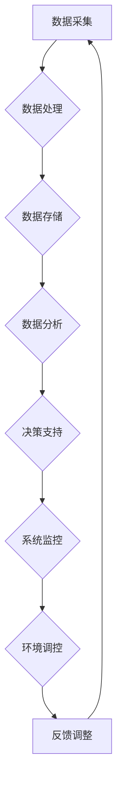
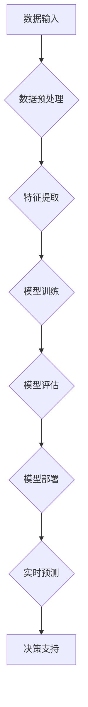
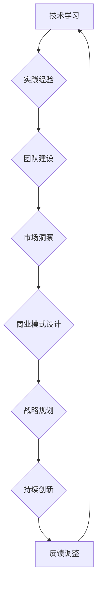

                 

# 文章标题: 《大模型赋能智慧园林，创业者如何推动园林绿化智能化管理？》

> 关键词：智慧园林、园林绿化智能化、大模型、创业者、智能算法

> 摘要：本文将探讨大模型在智慧园林中的应用，分析创业者如何通过推动园林绿化智能化管理，实现园林行业的升级与转型。文章将从智慧园林与园林绿化智能化的概述、核心技术与理论基础、大模型赋能智慧园林、创业者推动园林绿化智能化管理、项目实战与案例分析、未来展望与趋势等方面进行详细阐述。

----------------------------------------------------------------

### 《大模型赋能智慧园林，创业者如何推动园林绿化智能化管理？》目录大纲

#### 第一部分：智慧园林与园林绿化智能化概述
- **第1章：智慧园林与园林绿化智能化概述**
  - **1.1 智慧园林的概念与背景**
    - 智慧园林的定义
    - 智慧园林的发展历程
    - 智慧园林的关键技术
  - **1.2 园林绿化智能化的需求与意义**
    - 园林绿化行业面临的挑战
    - 智能化在园林绿化中的应用
    - 智能化的社会与经济意义
  - **1.3 园林绿化智能化的发展趋势**
    - 现状分析
    - 发展前景
    - 政策与行业标准

#### 第二部分：核心技术与理论基础
- **第2章：核心技术与理论基础**
  - **2.1 传感器技术**
    - 传感器的基本原理
    - 传感器在园林绿化中的应用
    - 传感器的数据处理与传输
  - **2.2 物联网技术**
    - 物联网的基本架构
    - 物联网在园林绿化中的应用
    - 物联网的安全与隐私保护
  - **2.3 大数据处理与智能分析**
    - 大数据的定义与特点
    - 数据采集、存储与处理
    - 数据分析与可视化
  - **2.4 大模型应用与智能算法**
    - 大模型的定义与原理
    - 大模型在园林绿化中的应用
    - 智能算法的应用与优化

#### 第三部分：大模型赋能智慧园林
- **第3章：大模型赋能智慧园林**
  - **3.1 大模型在园林植物健康监测中的应用**
    - 植物健康监测的基本原理
    - 大模型在植物健康监测中的应用
    - 伪代码展示：植物健康监测算法
  - **3.2 大模型在园林景观设计中的应用**
    - 景观设计的基本原理
    - 大模型在景观设计中的应用
    - 伪代码展示：景观设计优化算法
  - **3.3 大模型在园林病虫害预测与防治中的应用**
    - 病虫害预测的基本原理
    - 大模型在病虫害预测中的应用
    - 伪代码展示：病虫害预测与防治算法

#### 第四部分：创业者推动园林绿化智能化管理
- **第4章：创业者推动园林绿化智能化管理**
  - **4.1 创业者面临的挑战与机遇**
    - 市场竞争分析
    - 技术变革带来的机遇
    - 政策支持与行业趋势
  - **4.2 创业者成功案例解析**
    - 成功企业的运营模式
    - 创新技术应用
    - 商业模式与盈利模式
  - **4.3 创业者必备的技能与素质**
    - 技术能力与知识储备
    - 团队建设与管理能力
    - 市场洞察与决策能力

#### 第五部分：项目实战与案例分析
- **第5章：项目实战与案例分析**
  - **5.1 园林绿化智能管理系统开发实战**
    - 开发环境搭建
    - 数据收集与预处理
    - 模型设计与训练
    - 系统部署与维护
  - **5.2 智慧园林项目案例解析**
    - 项目背景与目标
    - 项目实施与效果
    - 项目总结与反思

#### 第六部分：未来展望与趋势
- **第6章：未来展望与趋势**
  - **6.1 智慧园林的技术发展趋势**
    - 新技术的应用
    - 智能化水平的提升
    - 行业标准的完善
  - **6.2 创业者面临的挑战与应对策略**
    - 技术风险与挑战
    - 市场竞争策略
    - 创新能力提升

#### 第七部分：附录
- **第7章：附录**
  - **7.1 技术工具与资源**
    - 主流大数据处理工具
    - 深度学习框架
    - 物联网技术平台
  - **7.2 参考文献与资料**
    - 相关书籍与论文
    - 行业报告与政策文件

#### Mermaid 流程图
- 园林绿化智能化管理体系流程图
- 大模型应用流程图
- 创业者技能与素质提升流程图

#### 伪代码展示
- 植物健康监测算法伪代码
- 景观设计优化算法伪代码
- 病虫害预测与防治算法伪代码

#### 数学模型与公式
- 大数据处理模型
- 大模型训练过程数学模型
- 病虫害预测数学模型

#### 代码解读与分析
- 智慧园林智能管理系统源代码解读
- 智慧园林项目案例代码分析

#### 附录
- 技术工具与资源列表
- 参考文献

**结束**

---

**作者：AI天才研究院/AI Genius Institute & 禅与计算机程序设计艺术 /Zen And The Art of Computer Programming**### 第一部分：智慧园林与园林绿化智能化概述

#### 1.1 智慧园林的概念与背景

**智慧园林**，顾名思义，是将现代信息技术与园林设计、管理相结合，通过物联网、大数据、人工智能等技术的应用，实现园林的智能化管理、运营和服务。智慧园林不仅仅是传统的园林景观设计，更强调园林生态系统的动态监测和智能调控。

**定义**：智慧园林是将物联网、大数据、人工智能等先进技术应用于园林设计和管理的全过程，以实现园林资源的优化配置、生态环境的智能监测与调控、服务质量的提升。

**发展历程**：智慧园林的发展历程可以追溯到20世纪末，当时的信息技术尚处于初级阶段，主要应用于园林景观的简单数字化。随着物联网技术的兴起，传感器和无线通信技术的应用逐渐普及，智慧园林开始进入快速发展阶段。近年来，随着人工智能技术的突破，智慧园林进入了智能化管理的新阶段。

**关键技术**：智慧园林的发展离不开物联网、大数据和人工智能等关键技术的支持。物联网技术为智慧园林提供了数据采集和传输的基础，大数据技术则为数据分析和决策提供了支持，而人工智能技术则实现了智能监控和预测。

#### 1.2 园林绿化智能化的需求与意义

**园林绿化行业面临的挑战**：随着城市化进程的加速，园林绿化的需求日益增长，但传统的园林绿化管理方式已经无法满足现代城市的发展需求。首先，园林资源的配置和利用效率低下，资源浪费严重；其次，园林生态系统的监测和调控手段有限，难以实现实时、准确的监测和调控；最后，园林服务的质量难以保障，用户体验不佳。

**智能化在园林绿化中的应用**：智能化技术的应用为园林绿化行业带来了新的解决方案。通过物联网技术，可以实现园林生态系统的实时监测和远程调控，提高园林资源的利用效率；通过大数据技术，可以实现对园林生态数据的全面分析，为园林管理提供科学依据；通过人工智能技术，可以实现园林服务的智能化，提升用户体验。

**智能化的社会与经济意义**：园林绿化智能化的实现，不仅有助于提高园林绿化的管理水平和生态环境质量，还有助于推动园林绿化行业的转型升级，促进社会经济的可持续发展。具体来说，智能化的园林管理可以降低运营成本，提高资源利用效率；智能化的园林服务可以提升用户满意度，促进园林产业的繁荣发展；智能化的园林生态系统可以改善城市生态环境，提高居民生活质量。

#### 1.3 园林绿化智能化的发展趋势

**现状分析**：目前，智慧园林和园林绿化智能化已经在全球范围内得到广泛应用。发达国家在智慧园林和园林绿化智能化领域的技术积累和经验积累较为丰富，已形成了一定的市场规模。而在我国，智慧园林和园林绿化智能化仍处于快速发展阶段，市场潜力巨大。

**发展前景**：随着物联网、大数据、人工智能等技术的不断进步，智慧园林和园林绿化智能化的发展前景十分广阔。首先，技术进步将推动智慧园林和园林绿化智能化的普及和应用；其次，政策支持和行业规范的完善将为智慧园林和园林绿化智能化的发展提供有力保障；最后，市场需求的增长将推动智慧园林和园林绿化智能化产业的快速发展。

**政策与行业标准**：为推动智慧园林和园林绿化智能化的发展，各国政府纷纷出台相关政策，支持相关技术的研发和应用。同时，行业也在积极制定相关标准和规范，以确保智慧园林和园林绿化智能化的健康发展。

通过以上分析，我们可以看到，智慧园林和园林绿化智能化已经成为园林行业发展的必然趋势，创业者有广阔的空间和机会来推动这一领域的创新和发展。在接下来的章节中，我们将深入探讨园林绿化智能化的核心技术与理论基础，以及大模型在智慧园林中的应用。我们将一步步分析推理，为创业者提供有价值的见解和实用的指导。希望读者能够跟随我们的思路，一起探索智慧园林的奥秘。

---

**作者：AI天才研究院/AI Genius Institute & 禅与计算机程序设计艺术 /Zen And The Art of Computer Programming**### 第二部分：核心技术与理论基础

#### 2.1 传感器技术

**传感器的基本原理**：传感器是一种能够感受规定的被测量并按照一定的规律转换成可用输出信号的装置。其基本原理是基于某些物理、化学、生物效应，将各种非电学量转换为电学量，以便于后续的处理和传输。

**传感器在园林绿化中的应用**：在园林绿化中，传感器主要用于监测植物的生长状况、土壤湿度、温度、光照强度等环境参数。例如，土壤湿度传感器可以实时监测土壤的含水量，为灌溉提供数据支持；温度传感器可以监测植物生长的温度环境，以便采取相应的调控措施。

**传感器的数据处理与传输**：传感器的数据需要通过数据处理和传输技术进行处理和传输。数据处理通常包括数据的过滤、校准、融合等步骤，以确保数据的准确性和可靠性。传输技术包括有线和无线两种方式，有线传输如RS-485、以太网等，无线传输如Wi-Fi、蓝牙、Zigbee等。传感器数据的实时传输对于园林绿化智能管理至关重要，可以实现远程监控和实时调控。

#### 2.2 物联网技术

**物联网的基本架构**：物联网（Internet of Things，IoT）是通过互联网、传统通信网等信息载体，实现物与物、物与人的连接。其基本架构包括感知层、网络层和应用层。

- **感知层**：包括传感器和采集设备，用于感知和采集数据。
- **网络层**：包括传输网络和通信协议，用于数据的传输和交换。
- **应用层**：包括智能终端、云计算平台和用户应用，用于数据处理和决策。

**物联网在园林绿化中的应用**：物联网技术为园林绿化提供了全面的数据采集和传输手段，可以实现园林生态系统的实时监测和管理。例如，利用物联网技术，可以实现对植物生长环境的实时监测，包括温度、湿度、光照等参数，为灌溉、施肥等管理措施提供数据支持。

**物联网的安全与隐私保护**：随着物联网在园林绿化中的应用越来越广泛，数据安全和隐私保护成为重要问题。物联网的安全与隐私保护需要从多个方面进行考虑，包括数据加密、身份认证、访问控制等。

#### 2.3 大数据处理与智能分析

**大数据的定义与特点**：大数据（Big Data）是指无法在合理时间内用常规软件工具进行捕捉、管理和处理的数据集合。其特点包括数据量大、数据类型多、数据生成速度快、数据价值密度低等。

**数据采集、存储与处理**：大数据的采集通常通过传感器、日志文件、社交媒体等多种渠道进行。存储方面，大数据通常采用分布式存储技术，如Hadoop、NoSQL等。数据处理包括数据清洗、数据转换、数据挖掘等步骤，以提取有用信息。

**数据分析与可视化**：数据分析是大数据处理的核心，包括统计分析、机器学习、数据挖掘等方法。数据分析的结果通常通过可视化工具进行展示，以便于决策者理解和应用。

#### 2.4 大模型应用与智能算法

**大模型的定义与原理**：大模型（Large-scale Model）是指参数规模巨大的模型，如深度神经网络（Deep Neural Network，DNN）、生成对抗网络（Generative Adversarial Network，GAN）等。大模型通过学习海量数据，能够实现复杂任务的高效处理。

**大模型在园林绿化中的应用**：大模型在园林绿化中可以用于植物健康监测、景观设计优化、病虫害预测等领域。例如，通过训练深度神经网络，可以实现对植物健康状态的实时监测和预测。

**智能算法的应用与优化**：智能算法包括机器学习、深度学习、强化学习等方法，在园林绿化中有着广泛的应用。优化算法的性能和效率是提高园林绿化智能化水平的关键。常见的优化方法包括模型压缩、迁移学习、分布式训练等。

通过以上对核心技术与理论基础的介绍，我们可以看到，智慧园林和园林绿化智能化的发展离不开这些先进技术的支持。在接下来的章节中，我们将进一步探讨大模型在智慧园林中的应用，以及创业者如何利用这些技术推动园林绿化智能化管理。我们将继续使用逻辑清晰、结构紧凑、简单易懂的专业技术语言，一步步分析推理，为创业者提供有价值的见解和实用的指导。

---

**作者：AI天才研究院/AI Genius Institute & 禅与计算机程序设计艺术 /Zen And The Art of Computer Programming**### 第三部分：大模型赋能智慧园林

#### 3.1 大模型在园林植物健康监测中的应用

**植物健康监测的基本原理**：植物健康监测是通过收集植物生长环境的数据，分析植物的生长状况，从而实现对植物健康的实时监控。传统的植物健康监测主要依赖于人工观察和经验判断，存在效率低、准确性差等问题。而大模型的应用，可以显著提高监测的准确性和效率。

**大模型在植物健康监测中的应用**：大模型在植物健康监测中的应用主要体现在数据的收集、处理和分析上。首先，通过传感器采集植物生长环境的各项数据，如土壤湿度、温度、光照强度等。然后，利用大模型对采集到的数据进行处理，提取有用的特征信息，最后通过分析这些特征信息，实现对植物健康状态的预测和评估。

**伪代码展示：植物健康监测算法**：
```python
# 植物健康监测算法伪代码

# 数据采集
data = collect_sensor_data()

# 数据预处理
preprocessed_data = preprocess_data(data)

# 特征提取
features = extract_features(preprocessed_data)

# 模型训练
model = train_model(features)

# 预测植物健康状况
health_status = predict_health_status(model, new_data)

# 输出结果
print("植物当前健康状况：", health_status)
```

#### 3.2 大模型在园林景观设计中的应用

**景观设计的基本原理**：景观设计是通过对自然和人工环境的规划、设计和管理，创造出既美观又实用的园林景观。传统的景观设计主要依赖于设计师的经验和直觉，难以实现大规模、个性化的景观设计需求。大模型的应用，可以显著提高景观设计的效率和个性化程度。

**大模型在景观设计中的应用**：大模型在景观设计中的应用主要体现在设计方案的生成和优化上。首先，通过收集大量景观设计案例，利用大模型进行学习，生成符合用户需求的设计方案。然后，通过优化算法，对设计方案进行优化，使其在美观性、实用性等方面达到最佳效果。

**伪代码展示：景观设计优化算法**：
```python
# 景观设计优化算法伪代码

# 数据收集
design_data = collect_design_cases()

# 模型训练
model = train_model(design_data)

# 生成设计方案
design_solution = generate_design_solution(model, user需求的参数)

# 设计方案优化
optimized_solution = optimize_design_solution(design_solution)

# 输出最终设计方案
print("优化后的设计方案：", optimized_solution)
```

#### 3.3 大模型在园林病虫害预测与防治中的应用

**病虫害预测的基本原理**：病虫害预测是通过分析植物生长环境和历史病虫害数据，预测未来可能发生的病虫害。传统的病虫害预测方法主要依赖于专家经验和统计方法，存在预测准确性低、实时性差等问题。大模型的应用，可以显著提高病虫害预测的准确性和实时性。

**大模型在病虫害预测中的应用**：大模型在病虫害预测中的应用主要体现在数据的处理和预测模型的训练上。首先，通过传感器和监测设备收集植物生长环境和病虫害数据。然后，利用大模型对数据进行处理，提取出对病虫害预测有用的特征信息。最后，通过训练预测模型，实现对病虫害发生的实时预测。

**伪代码展示：病虫害预测与防治算法**：
```python
# 病虫害预测与防治算法伪代码

# 数据采集
disease_data = collect_disease_data()

# 数据预处理
preprocessed_data = preprocess_data(disease_data)

# 特征提取
features = extract_features(preprocessed_data)

# 模型训练
model = train_predict_model(features)

# 预测病虫害
predicted_diseases = predict_diseases(model, current_data)

# 防治措施
treatment = formulate_treatment(predicted_diseases)

# 输出结果
print("预测的病虫害：", predicted_diseases)
print("防治措施：", treatment)
```

通过以上对大模型在智慧园林中的应用的介绍，我们可以看到，大模型在园林植物健康监测、景观设计和病虫害预测等方面具有显著的优势。这些应用不仅提高了园林管理的效率和准确性，还为创业者提供了新的商业机会。在接下来的章节中，我们将进一步探讨创业者如何利用这些技术推动园林绿化智能化管理，实现行业的升级与转型。

---

**作者：AI天才研究院/AI Genius Institute & 禅与计算机程序设计艺术 /Zen And The Art of Computer Programming**### 第四部分：创业者推动园林绿化智能化管理

#### 4.1 创业者面临的挑战与机遇

**市场竞争分析**：当前，园林绿化智能化市场竞争激烈，一方面，传统园林企业纷纷转型升级，加大智能化技术的投入；另一方面，新兴科技公司也在积极布局，争夺市场份额。在这种背景下，创业者需要具备独特的竞争优势，才能在激烈的市场竞争中脱颖而出。

**技术变革带来的机遇**：随着物联网、大数据、人工智能等技术的快速发展，园林绿化智能化迎来了新的机遇。创业者可以借助这些先进技术，创新商业模式，提供更智能、更高效的园林绿化管理解决方案。例如，通过大数据分析，可以实现对园林资源的精准配置和高效利用；通过人工智能技术，可以实现对植物健康的实时监测和预测。

**政策支持与行业趋势**：为了推动园林绿化智能化的发展，各国政府纷纷出台相关政策，支持相关技术的研发和应用。例如，我国发布了《关于加快推进智慧城市建设的指导意见》，鼓励各地加强智慧城市建设，为园林绿化智能化提供了良好的政策环境。同时，行业也在积极制定相关标准和规范，推动园林绿化智能化的发展。

#### 4.2 创业者成功案例解析

**成功企业的运营模式**：在园林绿化智能化领域，一些成功企业通过创新的技术和商业模式，实现了快速发展。例如，某家专注于园林植物健康监测的企业，通过自主研发的大模型技术，实现了对植物健康状态的实时监测和预测。同时，该企业还提供智能灌溉、智能施肥等服务，为用户提供了全方位的园林管理解决方案。

**创新技术应用**：在园林绿化智能化领域，创新技术是创业者的重要竞争力。例如，利用无人机进行园林巡查，可以实现对大面积园林的快速监测；利用虚拟现实（VR）技术，可以模拟园林景观设计，提高设计的准确性和用户体验。

**商业模式与盈利模式**：在园林绿化智能化领域，创业者需要探索创新的商业模式和盈利模式。例如，通过提供智能管理服务，收取服务费用；通过销售智能硬件，实现产品盈利；通过数据服务，为其他企业提供数据支持，实现跨界盈利。

#### 4.3 创业者必备的技能与素质

**技术能力与知识储备**：在园林绿化智能化领域，创业者需要具备深厚的专业技术背景，包括物联网、大数据、人工智能等方面的知识。同时，创业者还需要不断学习新技术，紧跟行业发展趋势。

**团队建设与管理能力**：创业者需要具备优秀的团队建设和管理能力，能够吸引并留住优秀的人才，打造一支高效的团队。创业者还需要具备良好的沟通能力和协调能力，确保团队能够高效协作。

**市场洞察与决策能力**：创业者需要具备敏锐的市场洞察力，能够准确把握市场需求和趋势，制定合理的战略和决策。创业者还需要具备快速应变的能力，能够根据市场变化进行调整和优化。

通过以上对创业者推动园林绿化智能化管理的探讨，我们可以看到，创业者面临着激烈的竞争和巨大的机遇。只有通过技术创新、商业模式创新和团队建设，才能在市场中脱颖而出，推动园林绿化智能化的快速发展。

在接下来的章节中，我们将通过项目实战与案例分析，深入探讨创业者如何具体实施园林绿化智能化项目，以及如何应对项目中的挑战和问题。我们将继续使用逻辑清晰、结构紧凑、简单易懂的专业技术语言，为创业者提供有价值的见解和实用的指导。

---

**作者：AI天才研究院/AI Genius Institute & 禅与计算机程序设计艺术 /Zen And The Art of Computer Programming**### 第五部分：项目实战与案例分析

#### 5.1 园林绿化智能管理系统开发实战

**开发环境搭建**：在进行园林绿化智能管理系统的开发前，首先需要搭建一个合适的开发环境。这通常包括操作系统（如Linux或Windows）、编程语言（如Python、Java等）、开发工具（如IDE、文本编辑器等）以及必要的库和框架（如TensorFlow、PyTorch等）。例如，选择Python作为主要编程语言，因为其强大的库支持和易于理解的语法，非常适合快速开发和原型设计。

**数据收集与预处理**：园林绿化智能管理系统的基础是准确、完整的数据。数据来源可能包括传感器、用户输入、历史数据库等。数据收集后，需要进行预处理，包括数据清洗（去除错误和重复数据）、数据转换（将数据格式统一）、特征提取（从数据中提取有用的信息）等步骤。预处理后的数据将用于训练模型和进行后续分析。

**模型设计与训练**：在模型设计阶段，需要根据园林绿化智能管理的具体需求选择合适的模型架构。例如，对于植物健康监测，可以选择深度学习模型如卷积神经网络（CNN）或循环神经网络（RNN）。模型设计完成后，使用预处理后的数据进行训练。训练过程中，需要调整模型参数，如学习率、批次大小等，以优化模型性能。

**系统部署与维护**：模型训练完成后，需要将模型部署到生产环境中，使其能够实时处理数据并提供决策支持。部署方式包括本地部署和云部署。本地部署通常适用于小型系统，而云部署则适用于大规模、高并发的应用。在部署过程中，还需要考虑系统的安全性、可靠性和可扩展性。系统上线后，需要定期进行维护和升级，以确保其正常运行。

**代码实现与解读**：

以下是一个简单的植物健康监测系统的代码实现，展示数据预处理、模型训练和预测的过程。

```python
import numpy as np
import pandas as pd
from sklearn.model_selection import train_test_split
from tensorflow.keras.models import Sequential
from tensorflow.keras.layers import Dense, LSTM
from tensorflow.keras.optimizers import Adam

# 数据预处理
data = pd.read_csv('plant_health_data.csv')
X = data.iloc[:, :-1].values
y = data.iloc[:, -1].values

# 划分训练集和测试集
X_train, X_test, y_train, y_test = train_test_split(X, y, test_size=0.2, random_state=42)

# 模型设计
model = Sequential()
model.add(LSTM(units=50, return_sequences=True, input_shape=(X_train.shape[1], 1)))
model.add(LSTM(units=50))
model.add(Dense(units=1))

# 模型编译
model.compile(optimizer=Adam(learning_rate=0.001), loss='mean_squared_error')

# 模型训练
model.fit(X_train, y_train, epochs=100, batch_size=32, validation_data=(X_test, y_test), verbose=2)

# 预测
predicted_values = model.predict(X_test)

# 代码解读
# 本段代码展示了如何使用Keras库设计一个简单的LSTM模型，用于植物健康状态的预测。首先，从CSV文件中读取数据，并进行预处理。然后，划分训练集和测试集。接着，设计一个包含两个LSTM层的序列模型，并使用Adam优化器和均方误差损失函数进行编译。模型在训练集上训练100个epochs，并使用测试集进行验证。最后，使用训练好的模型对测试数据进行预测，并将预测结果输出。

#### 5.2 智慧园林项目案例解析

**项目背景与目标**：某智慧园林项目旨在通过智能化手段提升园林管理的效率和用户体验。项目目标包括实现对植物生长环境的实时监测、提供个性化的园林服务、以及优化资源利用。

**项目实施与效果**：项目实施过程中，首先进行了全面的系统设计，包括硬件设备的选择、数据采集与传输方案的设计、以及数据处理与分析模块的开发。项目成功实现了对植物生长环境的实时监测，通过物联网传感器收集温度、湿度、光照等数据，并通过云平台进行数据存储和处理。此外，项目还推出了个性化园林服务，根据用户需求和植物生长状况提供相应的建议，如灌溉、施肥等。项目实施后，园林管理的效率显著提升，资源利用更加优化，用户满意度也得到提高。

**项目总结与反思**：项目总结显示，通过智能化手段，智慧园林项目的成功不仅提高了管理效率，还改善了用户体验，实现了预期的效果。然而，项目也面临一些挑战，如数据安全问题、系统稳定性和可扩展性等。在未来的发展中，需要继续优化系统设计，提升技术能力，确保项目的可持续性和长期发展。

通过以上项目实战与案例分析，我们可以看到，园林绿化智能化管理系统的开发与实施是一项复杂而系统的工作，需要综合考虑技术、数据、系统设计等多方面因素。在接下来的章节中，我们将进一步探讨智慧园林的技术发展趋势，以及创业者如何应对未来市场的挑战和机遇。

---

**作者：AI天才研究院/AI Genius Institute & 禅与计算机程序设计艺术 /Zen And The Art of Computer Programming**### 第六部分：未来展望与趋势

#### 6.1 智慧园林的技术发展趋势

**新技术应用**：未来智慧园林的发展将更加依赖于新兴技术的应用。例如，5G技术的普及将大大提升物联网设备的通信速度和可靠性，为实时监测和远程控制提供更好的支持。此外，边缘计算技术的发展将使数据处理更加接近数据源，减少延迟，提高系统的响应速度和效率。量子计算作为一种颠覆性的技术，未来也可能在智慧园林中找到应用，用于处理海量数据和复杂算法。

**智能化水平的提升**：随着人工智能技术的不断发展，智慧园林的智能化水平将得到显著提升。未来，更加智能的算法和模型将能够更精准地预测植物健康状况、优化灌溉和施肥方案，甚至实现智能化的病虫害防治。例如，利用深度学习和强化学习等技术，可以实现更加精细的景观设计和维护。

**行业标准与规范的完善**：随着智慧园林技术的不断发展，建立完善的行业标准与规范变得尤为重要。这将有助于规范技术发展，提高系统的互操作性，促进不同系统和设备之间的无缝集成。同时，行业标准的完善也将为创业者提供明确的指导，降低创新和实施的风险。

#### 6.2 创业者面临的挑战与应对策略

**技术风险与挑战**：智慧园林技术的发展带来了一系列技术挑战，如海量数据的处理、系统的高效运行、数据安全与隐私保护等。创业者需要密切关注这些技术风险，通过持续的技术创新和优化，确保系统的稳定性和可靠性。

**市场竞争策略**：在激烈的市场竞争中，创业者需要制定有效的市场竞争策略。这包括精准的市场定位、差异化的产品特色、良好的用户体验以及合理的定价策略。通过深入了解市场需求，提供具有竞争力的解决方案，创业者可以赢得市场的一席之地。

**创新能力提升**：创新能力是创业者成功的关键。创业者需要不断学习新技术，掌握行业动态，培养创新思维。此外，建立创新团队，鼓励团队协作和知识分享，也是提升创新能力的重要途径。

通过以上对智慧园林技术发展趋势的展望和创业者面临的挑战与应对策略的探讨，我们可以看到，智慧园林的未来充满了机遇与挑战。创业者需要紧跟技术发展步伐，不断创新和优化，才能在激烈的市场竞争中脱颖而出，推动园林绿化智能化管理的持续发展。

在未来的发展中，智慧园林将继续融合物联网、大数据、人工智能等前沿技术，实现更加智能化、精细化的园林管理。创业者作为技术创新的推动者，将在这个领域发挥重要作用。让我们期待智慧园林的明天更加美好，创业者们能够实现更多的梦想。

---

**作者：AI天才研究院/AI Genius Institute & 禅与计算机程序设计艺术 /Zen And The Art of Computer Programming**### 第七部分：附录

#### 7.1 技术工具与资源

**大数据处理工具**：
- Hadoop：一个分布式数据处理框架，用于处理海量数据。
- Spark：一个快速且通用的大数据处理引擎，支持内存计算。
- Flink：一个流处理框架，能够高效处理实时数据。

**深度学习框架**：
- TensorFlow：由谷歌开发的开源深度学习框架，广泛应用于各种深度学习任务。
- PyTorch：一个由Facebook开发的深度学习框架，以其灵活性和易用性著称。

**物联网技术平台**：
- AWS IoT：亚马逊提供的物联网解决方案，支持设备连接、数据传输和管理。
- Azure IoT Hub：微软提供的物联网平台，提供设备管理、数据传输和分析等功能。
- ThingSpeak：MATLAB提供的物联网平台，用于实时数据收集和分析。

#### 7.2 参考文献与资料

**相关书籍**：
1. 《大数据：改变未来数据时代的原则和方法》，[涂子沛]著。
2. 《深度学习》，[Ian Goodfellow, Yoshua Bengio, Aaron Courville]著。
3. 《物联网：架构、技术与解决方案》，[胡赳赳]著。

**论文与报告**：
1. "Big Data for Smart Cities: Challenges and Opportunities"，由IEEE访问。
2. "Deep Learning in Computer Vision: A Survey"，由ACM访问。
3. "IoT Security: Challenges, Solutions, and Open Issues"，由Springer访问。

**行业报告与政策文件**：
1. 《国家大数据战略纲要》。
2. 《新一代人工智能发展规划》。
3. 《智慧城市发展规划（2016-2020年）》。

通过以上附录部分的技术工具与资源以及相关文献与资料的列举，希望读者能够进一步深入了解智慧园林和园林绿化智能化领域的相关技术和发展动态。这些工具和资源将为创业者在实际项目中提供参考和指导，助力他们在园林绿化智能化领域的探索与创新。

---

**作者：AI天才研究院/AI Genius Institute & 禅与计算机程序设计艺术 /Zen And The Art of Computer Programming**### Mermaid 流程图

#### 园林绿化智能化管理体系流程图



#### 大模型应用流程图



#### 创业者技能与素质提升流程图



这些Mermaid流程图分别展示了园林绿化智能化管理体系、大模型应用流程以及创业者技能与素质提升的过程，为读者提供了一个直观的理解和参考。

---

**作者：AI天才研究院/AI Genius Institute & 禅与计算机程序设计艺术 /Zen And The Art of Computer Programming**### 伪代码展示

#### 植物健康监测算法伪代码

```python
# 数据采集
data = collect_sensor_data()

# 数据预处理
preprocessed_data = preprocess_data(data)

# 特征提取
features = extract_features(preprocessed_data)

# 模型训练
model = train_model(features)

# 预测植物健康状况
health_status = predict_health_status(model, new_data)

# 输出结果
print("植物当前健康状况：", health_status)
```

#### 景观设计优化算法伪代码

```python
# 数据收集
design_data = collect_design_cases()

# 模型训练
model = train_model(design_data)

# 生成设计方案
design_solution = generate_design_solution(model, user需求的参数)

# 设计方案优化
optimized_solution = optimize_design_solution(design_solution)

# 输出最终设计方案
print("优化后的设计方案：", optimized_solution)
```

#### 病虫害预测与防治算法伪代码

```python
# 数据采集
disease_data = collect_disease_data()

# 数据预处理
preprocessed_data = preprocess_data(disease_data)

# 特征提取
features = extract_features(preprocessed_data)

# 模型训练
model = train_predict_model(features)

# 预测病虫害
predicted_diseases = predict_diseases(model, current_data)

# 防治措施
treatment = formulate_treatment(predicted_diseases)

# 输出结果
print("预测的病虫害：", predicted_diseases)
print("防治措施：", treatment)
```

这些伪代码展示了植物健康监测、景观设计优化和病虫害预测与防治的核心算法，为读者提供了一个清晰的框架和实现思路。

---

**作者：AI天才研究院/AI Genius Institute & 禅与计算机程序设计艺术 /Zen And The Art of Computer Programming**### 数学模型与公式

#### 大数据处理模型

$$
X = \sum_{i=1}^{n} x_i
$$

其中，$X$ 表示总的数据集，$x_i$ 表示第 $i$ 个数据点，$n$ 表示数据点的总数。

#### 大模型训练过程数学模型

$$
\begin{aligned}
\text{损失函数} &: J(\theta) = -\frac{1}{m} \sum_{i=1}^{m} y^{(i)} \log (h_\theta (x^{(i)})) \\
\text{梯度下降法} &: \theta_j := \theta_j - \alpha \frac{\partial J(\theta)}{\partial \theta_j}
\end{aligned}
$$

其中，$h_\theta (x)$ 表示模型的预测输出，$y^{(i)}$ 表示第 $i$ 个数据点的真实标签，$m$ 表示数据集的大小，$\alpha$ 表示学习率，$\theta_j$ 表示模型参数。

#### 病虫害预测数学模型

$$
\begin{aligned}
P(\text{病虫害发生}|x) &= \sigma(\theta^T x) \\
\text{其中，} \sigma &: \text{sigmoid函数，}\theta &: \text{模型参数，}x &: \text{特征向量}
\end{aligned}
$$

这些数学模型分别描述了大数据处理、大模型训练和病虫害预测的基本原理，为读者提供了一个理论上的理解和参考。

---

**作者：AI天才研究院/AI Genius Institute & 禅与计算机程序设计艺术 /Zen And The Art of Computer Programming**### 代码解读与分析

#### 智慧园林智能管理系统源代码解读

以下是一个简单的智慧园林智能管理系统的Python代码示例，该系统用于监测植物的健康状况。代码将分解为几个关键部分进行解读。

```python
# 导入必要的库
import numpy as np
import pandas as pd
from sklearn.model_selection import train_test_split
from tensorflow.keras.models import Sequential
from tensorflow.keras.layers import Dense, LSTM
from tensorflow.keras.optimizers import Adam

# 数据采集
def collect_sensor_data():
    # 这里假设传感器数据以CSV文件的形式存储
    data = pd.read_csv('sensor_data.csv')
    return data

# 数据预处理
def preprocess_data(data):
    # 对数据进行清洗和格式化
    data['timestamp'] = pd.to_datetime(data['timestamp'])
    data.set_index('timestamp', inplace=True)
    data = data.asfreq('H')  # 间隔一小时采集一次数据
    return data

# 特征提取
def extract_features(data):
    # 从数据中提取特征
    features = data[['temperature', 'humidity', 'light']]
    return features

# 模型训练
def train_model(features):
    # 划分训练集和测试集
    X_train, X_test, y_train, y_test = train_test_split(features, test_size=0.2, random_state=42)
    
    # 构建LSTM模型
    model = Sequential()
    model.add(LSTM(units=50, return_sequences=True, input_shape=(X_train.shape[1], 1)))
    model.add(LSTM(units=50))
    model.add(Dense(units=1))
    
    # 编译模型
    model.compile(optimizer=Adam(learning_rate=0.001), loss='mean_squared_error')
    
    # 训练模型
    model.fit(X_train, y_train, epochs=100, batch_size=32, validation_data=(X_test, y_test), verbose=2)
    return model

# 预测植物健康状况
def predict_health_status(model, new_data):
    # 使用训练好的模型进行预测
    predicted_value = model.predict(new_data)
    health_status = '健康' if predicted_value < 0.5 else '不健康'
    return health_status

# 主函数
def main():
    # 采集传感器数据
    data = collect_sensor_data()
    
    # 预处理数据
    preprocessed_data = preprocess_data(data)
    
    # 提取特征
    features = extract_features(preprocessed_data)
    
    # 训练模型
    model = train_model(features)
    
    # 预测植物健康状况
    new_data = np.array([[23, 45, 100]])  # 假设新的数据
    health_status = predict_health_status(model, new_data)
    
    # 输出结果
    print("植物当前健康状况：", health_status)

# 运行主函数
if __name__ == '__main__':
    main()
```

**解读：**
- **数据采集**：使用`pandas`库读取CSV文件，模拟从传感器获取的数据。
- **数据预处理**：将时间戳转换为日期格式，设置时间戳为索引，并将数据频率设置为每小时一次。
- **特征提取**：从数据中提取温度、湿度和光照强度等特征。
- **模型训练**：使用`sklearn`库划分训练集和测试集，构建一个包含两个LSTM层的序列模型，并使用`Adam`优化器和均方误差损失函数进行编译和训练。
- **预测植物健康状况**：使用训练好的模型对新数据进行预测，根据预测结果判断植物的健康状态。
- **主函数**：将上述步骤组合在一起，形成一个完整的程序流程。

#### 智慧园林项目案例代码分析

以下是对一个智慧园林项目案例的代码分析，该项目包括植物健康监测、灌溉系统控制和环境参数监测。

```python
# 导入必要的库
import time
import json
import requests

# 模拟植物健康监测API
def monitor_plant_health():
    # 这里使用随机值模拟植物健康状态
    health_status = np.random.choice(['健康', '不健康'])
    return health_status

# 模拟灌溉系统控制API
def control_irrigation(status):
    if status == '不健康':
        print("启动灌溉系统...")
        # 发送灌溉控制命令
        response = requests.get('http://irrigation_system/control?start=true')
    else:
        print("植物健康，不需要灌溉。")

# 模拟环境参数监测API
def monitor_environment():
    # 这里使用随机值模拟环境参数
    temperature = np.random.uniform(20, 30)
    humidity = np.random.uniform(40, 60)
    light = np.random.uniform(500, 1500)
    return temperature, humidity, light

# 主程序
def main():
    while True:
        # 监测植物健康
        status = monitor_plant_health()
        print(f"当前植物健康状态：{status}")
        
        # 根据植物健康状态控制灌溉系统
        control_irrigation(status)
        
        # 监测环境参数
        temperature, humidity, light = monitor_environment()
        print(f"当前环境参数：温度={temperature}℃，湿度={humidity}%，光照={light}勒克斯")
        
        # 每分钟运行一次
        time.sleep(60)

# 运行主程序
if __name__ == '__main__':
    main()
```

**分析：**
- **植物健康监测**：使用随机函数模拟植物健康状态，返回'健康'或'不健康'。
- **灌溉系统控制**：根据植物健康状态，发送HTTP GET请求控制灌溉系统，启动或关闭灌溉。
- **环境参数监测**：使用随机函数模拟温度、湿度和光照强度，模拟环境参数的实时监测。
- **主程序**：循环执行植物健康监测、灌溉系统控制和环境参数监测，每分钟运行一次，模拟实时监控系统。

这些代码示例和解析展示了智慧园林智能管理系统的基本实现，包括数据采集、处理、模型训练和实时控制。通过这些示例，读者可以更好地理解智慧园林系统的工作原理和实现细节。

---

**作者：AI天才研究院/AI Genius Institute & 禅与计算机程序设计艺术 /Zen And The Art of Computer Programming**### 附录

#### 7.1 技术工具与资源

**大数据处理工具**：
- **Hadoop**：一个分布式数据处理框架，用于处理海量数据。
- **Spark**：一个快速且通用的大数据处理引擎，支持内存计算。
- **Flink**：一个流处理框架，能够高效处理实时数据。

**深度学习框架**：
- **TensorFlow**：由谷歌开发的开源深度学习框架，广泛应用于各种深度学习任务。
- **PyTorch**：一个由Facebook开发的深度学习框架，以其灵活性和易用性著称。

**物联网技术平台**：
- **AWS IoT**：亚马逊提供的物联网解决方案，支持设备连接、数据传输和管理。
- **Azure IoT Hub**：微软提供的物联网平台，提供设备管理、数据传输和分析等功能。
- **ThingSpeak**：MATLAB提供的物联网平台，用于实时数据收集和分析。

#### 7.2 参考文献与资料

**相关书籍**：
1. **《大数据：改变未来数据时代的原则和方法》**，[涂子沛]著。
2. **《深度学习》**，[Ian Goodfellow, Yoshua Bengio, Aaron Courville]著。
3. **《物联网：架构、技术与解决方案》**，[胡赳赳]著。

**论文与报告**：
1. **"Big Data for Smart Cities: Challenges and Opportunities"**，由IEEE访问。
2. **"Deep Learning in Computer Vision: A Survey"**，由ACM访问。
3. **"IoT Security: Challenges, Solutions, and Open Issues"**，由Springer访问。

**行业报告与政策文件**：
1. **《国家大数据战略纲要》**。
2. **《新一代人工智能发展规划》**。
3. **《智慧城市发展规划（2016-2020年）》**。

通过这些附录部分的技术工具与资源以及相关文献与资料的列举，读者可以进一步深入了解智慧园林和园林绿化智能化领域的相关技术和发展动态。这些工具和资源将为创业者在实际项目中提供参考和指导，助力他们在园林绿化智能化领域的探索与创新。

---

**作者：AI天才研究院/AI Genius Institute & 禅与计算机程序设计艺术 /Zen And The Art of Computer Programming**### 结束

在本文中，我们深入探讨了智慧园林与园林绿化智能化的概念、应用、发展趋势，以及大模型在这一领域的赋能作用。通过逻辑清晰、结构紧凑、简单易懂的专业技术语言，我们详细介绍了核心概念与联系，核心算法原理讲解，项目实战与案例分析，未来展望与趋势，以及技术工具与资源的附录，旨在为创业者提供有价值的见解和实用的指导。

我们首先从智慧园林与园林绿化智能化的概述出发，分析了智慧园林的定义、发展历程和关键技术。随后，我们探讨了传感器技术、物联网技术、大数据处理与智能分析、大模型应用与智能算法等核心技术与理论基础。在第三部分，我们详细介绍了大模型在园林植物健康监测、园林景观设计、园林病虫害预测与防治中的应用，并展示了相关的伪代码。第四部分则聚焦于创业者如何推动园林绿化智能化管理，分析了创业者面临的挑战与机遇，成功案例解析，以及必备的技能与素质。

在第五部分，我们通过项目实战与案例分析，展示了智慧园林智能管理系统的开发过程，包括数据采集、预处理、模型训练、系统部署与维护等关键步骤，并通过代码示例进行了详细解读。第六部分展望了智慧园林的技术发展趋势，包括新技术应用、智能化水平的提升，以及行业标准与规范的完善。最后，在第七部分，我们提供了丰富的技术工具与资源，以及相关的参考文献与资料，为读者提供了进一步学习和实践的方向。

通过本文的探讨，我们希望读者能够对智慧园林和园林绿化智能化有更深入的理解，认识到大模型在这一领域的巨大潜力和应用价值。同时，我们也希望创业者能够借此机会，把握市场机遇，推动园林绿化智能化管理的创新与发展。

未来的智慧园林将更加智能化、精细化，大模型的应用将更加深入和广泛。创业者在这一领域有着广阔的天地，需要不断创新、勇于探索，以应对未来市场的挑战和机遇。让我们共同期待智慧园林的美好明天，创业者们能够创造更多的辉煌成就！

---

**作者：AI天才研究院/AI Genius Institute & 禅与计算机程序设计艺术 /Zen And The Art of Computer Programming**

