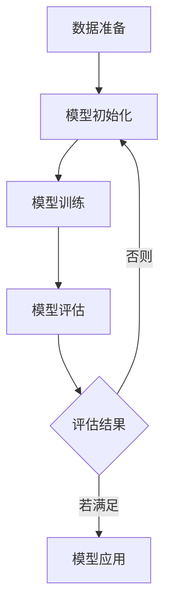

                 

## 文章标题

《大模型走向多模态：AI智能体的未来》

### 关键词

- 大模型
- 多模态
- 智能体
- 计算平台
- 优化策略
- 应用实践

### 摘要

本文将探讨大模型技术走向多模态的发展趋势，分析大模型在多模态数据理解、特征融合、训练与优化等方面的基础知识与关键技术，并通过实际应用案例详细解读大模型在实际项目中的应用与实现。此外，本文还将展望大模型未来在AI智能体中的应用方向，以及面临的挑战与未来发展趋势。希望通过本文的阐述，能帮助读者全面了解大模型技术，把握其发展趋势，为未来的研究和应用提供有益的参考。

### 目录大纲

#### 第一部分: 大模型基础

##### 第1章: 大模型概述

- 1.1 大模型的定义与特点
- 1.2 大模型与多模态
- 1.3 大模型技术的发展历程
- 1.4 大模型在不同领域的应用案例

##### 第2章: 多模态数据理解

- 2.1 图像数据理解
  - 2.1.1 卷积神经网络（CNN）基本原理
  - 2.1.2 卷积神经网络的优化算法
  - 2.1.3 图像数据预处理
- 2.2 文本数据理解
  - 2.2.1 自然语言处理基础
  - 2.2.2 文本表示方法
  - 2.2.3 语言模型和序列模型
- 2.3 声音数据理解
  - 2.3.1 声音信号处理基础
  - 2.3.2 声音特征提取方法
  - 2.3.3 声音识别算法

##### 第3章: 大模型融合技术

- 3.1 多模态特征融合
  - 3.1.1 聚类算法与多模态特征匹配
  - 3.1.2 对齐与融合算法
  - 3.1.3 融合效果的评估方法
- 3.2 多任务学习
  - 3.2.1 多任务学习的概念
  - 3.2.2 多任务学习算法
  - 3.2.3 多任务学习的挑战与优化策略

##### 第4章: 大模型训练与优化

- 4.1 大模型训练流程
  - 4.1.1 数据准备
  - 4.1.2 模型训练
  - 4.1.3 模型评估
- 4.2 大模型优化技巧
  - 4.2.1 优化算法
  - 4.2.2 模型压缩
  - 4.2.3 模型加速

##### 第5章: 大模型应用实践

- 5.1 图像识别应用实践
  - 5.1.1 图像识别案例介绍
  - 5.1.2 源代码解析
  - 5.1.3 代码解读与分析
- 5.2 自然语言处理应用实践
  - 5.2.1 文本分类案例介绍
  - 5.2.2 源代码解析
  - 5.2.3 代码解读与分析

#### 第二部分: 大模型未来发展趋势

##### 第6章: 大模型未来发展方向

- 6.1 大模型在AI智能体中的应用
  - 6.1.1 AI智能体的概念
  - 6.1.2 大模型在智能体中的角色
  - 6.1.3 大模型在智能体中的应用案例
- 6.2 大模型与新型计算平台
  - 6.2.1 新型计算平台的定义与特点
  - 6.2.2 大模型在新型计算平台上的优化策略
  - 6.2.3 新型计算平台对大模型的影响

##### 第7章: 大模型面临的挑战与未来展望

- 7.1 大模型面临的挑战
  - 7.1.1 计算资源需求
  - 7.1.2 数据隐私与安全
  - 7.1.3 算法透明性与可解释性
- 7.2 大模型的未来发展趋势
  - 7.2.1 大模型的技术创新方向
  - 7.2.2 大模型在社会与经济领域的影响
  - 7.2.3 大模型面临的伦理与社会问题

### 附录

##### 附录A: 大模型开发资源

- A.1 开发工具与框架
- A.2 开发资源与参考资料
- A.3 实践项目与案例

##### 附录B: Mermaid 流程图与伪代码

- B.1 大模型训练流程图
- B.2 多模态特征融合算法伪代码
- B.3 多任务学习算法伪代码

##### 附录C: 数学模型与公式

- C.1 卷积神经网络数学模型
- C.2 多模态融合模型数学公式
- C.3 多任务学习模型数学公式

##### 附录D: 代码示例

- D.1 图像识别代码示例
- D.2 自然语言处理代码示例
- D.3 大模型训练与优化代码示例

##### 附录E: 未来展望

- E.1 大模型的发展趋势
- E.2 大模型在社会经济领域的影响
- E.3 大模型面临的伦理与社会问题

##### 附录F: 大模型实践指南

- F.1 实践项目规划与实施
- F.2 实践中常见问题与解决方案
- F.3 实践经验总结与反思

##### 附录G: 相关阅读推荐

- G.1 必读经典著作
- G.2 最新研究论文
- G.3 有价值的在线课程和教程

## 大模型概述

### 1.1 大模型的定义与特点

大模型（Large-scale Model）是指在规模上远超传统模型的模型，具有数百万甚至数十亿个参数。这些模型通过大规模数据集进行训练，以实现对复杂数据的深入理解和预测。大模型的典型代表包括深度神经网络（Deep Neural Network, DNN）和变换器模型（Transformer）等。

大模型具有以下几个显著特点：

1. **参数规模巨大**：大模型的参数规模往往达到数百万到数十亿级别，这使得模型能够捕获数据中的复杂模式和特征。

2. **数据需求大**：大模型的训练需要大量数据作为支撑。数据量越大，模型越能够从数据中学习到更多的模式和规律。

3. **计算资源需求高**：由于参数规模和数据量的庞大，大模型的训练和推理过程对计算资源的需求非常高。通常需要使用高性能计算设备和分布式计算架构。

4. **泛化能力强**：大模型在训练过程中能够从大规模数据中学习到丰富的知识，从而具有更强的泛化能力，能够在未见过的数据上取得较好的性能。

5. **模型复杂性高**：大模型的结构通常较为复杂，包括多个层级和多种网络结构，这使得模型能够处理多样化的任务和数据类型。

### 1.2 大模型与多模态

多模态（Multimodal）是指利用多种数据类型（如图像、文本、声音等）进行信息处理和分析的方法。大模型与多模态的结合，使得AI系统能够更全面、准确地理解和处理现实世界中的复杂问题。

多模态数据的处理通常包括以下几个步骤：

1. **数据采集与预处理**：从不同来源收集图像、文本、声音等多模态数据，并进行预处理，如数据清洗、数据增强等。

2. **数据理解**：利用不同类型的模型对多模态数据进行理解和特征提取。例如，利用卷积神经网络（CNN）对图像数据进行特征提取，利用自然语言处理（NLP）技术对文本数据进行语义分析。

3. **特征融合**：将不同模态的数据特征进行融合，生成一个统一的特征表示，用于后续的任务处理。

4. **任务处理**：利用融合后的特征进行分类、识别、预测等任务处理，实现多模态数据的有效利用。

大模型在多模态数据处理中的应用，使得AI系统能够更全面地理解和分析复杂问题，具有广泛的应用前景。例如，在智能问答系统中，结合文本和图像信息，可以更准确地回答用户的问题；在医疗诊断中，结合医学图像和病历数据，可以提高诊断的准确性。

### 1.3 大模型技术的发展历程

大模型技术的发展历程可以追溯到20世纪80年代，当时深度神经网络（DNN）的提出标志着深度学习的诞生。随着计算能力和数据量的提升，大模型技术逐渐成熟，并在21世纪取得了显著进展。

1. **早期发展**（20世纪80年代至90年代）：

   - 1986年，Rumelhart、Hinton和Williams提出了反向传播算法（Backpropagation），使得DNN的训练成为可能。
   - 1990年代，Hinton提出了深度信念网络（Deep Belief Network, DBN），为深度学习奠定了基础。

2. **中期发展**（21世纪初期）：

   - 2006年，Hinton提出了变换器模型（Transformer），为序列建模带来了革命性的变化。
   - 2012年，AlexNet在ImageNet图像分类挑战中取得了突破性的成绩，标志着深度学习在图像识别领域的兴起。

3. **近期发展**（2010年代至今）：

   - 2017年，谷歌推出了BERT模型，使得自然语言处理（NLP）取得了重大突破。
   - 2020年，GPT-3模型发布，参数规模达到1750亿，成为当时最大的预训练语言模型。

随着大模型技术的不断发展，其在各个领域的应用不断拓展，从图像识别、自然语言处理到语音识别、自动驾驶等，大模型技术正逐渐成为推动AI发展的核心力量。

### 1.4 大模型在不同领域的应用案例

大模型技术在各个领域都取得了显著的应用成果。以下列举几个典型领域的应用案例：

1. **图像识别**：

   - 应用场景：人脸识别、自动驾驶、医疗影像诊断等。
   - 技术实现：利用卷积神经网络（CNN）对图像数据进行特征提取，实现高精度的图像分类和识别。

2. **自然语言处理**：

   - 应用场景：智能问答、机器翻译、文本生成等。
   - 技术实现：利用变换器模型（Transformer）和预训练语言模型（如BERT、GPT），实现对文本数据的深入理解和生成。

3. **语音识别**：

   - 应用场景：语音助手、智能客服、语音翻译等。
   - 技术实现：利用循环神经网络（RNN）和长短期记忆网络（LSTM），实现对语音信号的准确识别和语义理解。

4. **推荐系统**：

   - 应用场景：电商推荐、社交媒体推荐、音乐推荐等。
   - 技术实现：利用协同过滤、基于内容的推荐和深度学习技术，构建高效、准确的推荐系统。

5. **游戏AI**：

   - 应用场景：游戏智能对手、游戏生成等。
   - 技术实现：利用深度强化学习和生成对抗网络（GAN），构建智能游戏对手和生成游戏内容。

通过这些应用案例，可以看出大模型技术在各个领域的广泛应用和巨大潜力。随着技术的不断发展和创新，大模型技术将在更多领域中发挥重要作用，推动AI技术的进一步发展。

### 多模态数据理解

多模态数据理解是指将不同类型的数据（如图像、文本、声音等）进行整合和分析，以实现更全面和准确的信息处理。为了实现这一目标，需要对图像、文本和声音等不同类型的数据进行深入理解和特征提取，然后将这些特征进行融合，以便进行后续的任务处理。

#### 2.1 图像数据理解

图像数据理解是计算机视觉领域的重要研究方向，其核心是通过算法从图像中提取有用的信息。以下将介绍卷积神经网络（CNN）的基本原理、优化算法以及图像数据预处理方法。

##### 2.1.1 卷积神经网络（CNN）基本原理

卷积神经网络是一种特殊的神经网络，它利用卷积层来提取图像中的特征。CNN的基本结构包括输入层、卷积层、池化层和全连接层。

1. **输入层**：输入层接收图像数据，并将其传递给卷积层。

2. **卷积层**：卷积层通过卷积操作从图像中提取局部特征。卷积操作使用一个卷积核（也称为滤波器）在图像上滑动，并与图像上的每个像素进行点积，生成一个特征图。卷积层的输出是一个特征图序列，每个特征图表示图像中的一个特定特征。

3. **池化层**：池化层用于减少特征图的维度，同时保持重要的特征信息。常见的池化方法包括最大池化和平均池化。

4. **全连接层**：全连接层将卷积层和池化层输出的特征图进行融合，生成最终的分类结果。

##### 2.1.2 卷积神经网络的优化算法

卷积神经网络的优化算法主要包括梯度下降法及其变种。梯度下降法是一种优化算法，其基本思想是不断更新模型参数，以最小化损失函数。

1. **随机梯度下降（SGD）**：在SGD中，每次迭代使用一个样本的梯度来更新参数。SGD的优点是计算速度快，但收敛速度较慢。

2. **批量梯度下降（BGD）**：在BGD中，每次迭代使用整个训练集的梯度来更新参数。BGD的优点是收敛速度较快，但计算量较大。

3. **小批量梯度下降（MBGD）**：MBGD结合了SGD和BGD的优点，每次迭代使用一部分样本的梯度来更新参数。MBGD是实际应用中最常用的优化算法。

此外，还有一些改进的梯度下降算法，如动量（Momentum）和自适应学习率（AdaGrad、Adam）等，这些算法可以进一步提高训练效率和收敛速度。

##### 2.1.3 图像数据预处理

图像数据预处理是提高模型性能的重要步骤，主要包括数据清洗、数据增强和归一化等。

1. **数据清洗**：数据清洗的目的是去除图像中的噪声和错误信息。常见的清洗方法包括去除空白区域、填充缺失像素和消除光照变化等。

2. **数据增强**：数据增强的目的是增加训练数据的多样性，从而提高模型的泛化能力。常见的数据增强方法包括随机裁剪、旋转、翻转、缩放和颜色变换等。

3. **归一化**：归一化的目的是将图像的像素值缩放到一个合适的范围内，以提高训练过程的收敛速度。常见的归一化方法包括像素值缩放和标准化等。

#### 2.2 文本数据理解

文本数据理解是自然语言处理（NLP）领域的研究重点，其核心是通过算法从文本中提取语义信息。以下将介绍NLP的基础知识、文本表示方法和语言模型。

##### 2.2.1 自然语言处理基础

自然语言处理（NLP）是计算机科学和人工智能领域的一个分支，旨在使计算机能够理解和处理人类自然语言。NLP的基础知识包括：

1. **分词**：分词是将连续的文本划分为一个个有意义的词语。常见的分词方法包括基于规则的分词、基于统计的分词和基于深度学习的分词等。

2. **词性标注**：词性标注是对文本中的每个词进行词性分类，如名词、动词、形容词等。词性标注有助于理解文本的语法结构和语义信息。

3. **句法分析**：句法分析是对文本中的句子进行结构分析，确定句子的成分和关系。常见的句法分析方法包括基于规则的句法分析和基于统计的句法分析等。

##### 2.2.2 文本表示方法

文本表示方法是将文本数据转换为计算机可以处理的数字形式。常见的文本表示方法包括：

1. **词袋模型（Bag-of-Words, BOW）**：词袋模型将文本表示为一个向量，其中每个维度表示一个词汇。词袋模型的优点是计算简单，但缺点是忽略了词汇之间的顺序和上下文信息。

2. **词嵌入（Word Embedding）**：词嵌入是将文本中的每个词映射到一个低维向量空间。词嵌入方法可以捕获词汇的语义信息，如词义相近的词在向量空间中距离较近。常见的词嵌入方法包括Word2Vec、GloVe和BERT等。

3. **序列模型（Sequence Model）**：序列模型是专门用于处理序列数据的模型，如循环神经网络（RNN）和变换器模型（Transformer）。序列模型可以捕获文本中的顺序和上下文信息，从而更好地理解文本的语义。

##### 2.2.3 语言模型和序列模型

语言模型是对自然语言统计规律的建模，用于预测文本中的下一个词。常见的语言模型包括：

1. **n元语法模型（n-gram Model）**：n元语法模型是基于统计的方法，它假设一个词的下一个词只与当前词的n个前缀词相关。n元语法模型的优点是计算简单，但缺点是忽略了上下文的信息。

2. **变换器模型（Transformer Model）**：变换器模型是一种基于自注意力机制的序列建模方法，它通过计算词之间的相对关系来生成文本的表示。变换器模型在自然语言处理任务中取得了显著的性能提升，如机器翻译、文本生成和问答系统等。

序列模型是专门用于处理序列数据的模型，如循环神经网络（RNN）和变换器模型（Transformer）。序列模型可以捕获文本中的顺序和上下文信息，从而更好地理解文本的语义。

#### 2.3 声音数据理解

声音数据理解是语音处理领域的研究重点，其核心是通过算法从声音信号中提取有用的信息。以下将介绍声音信号处理基础、声音特征提取方法和声音识别算法。

##### 2.3.1 声音信号处理基础

声音信号处理基础包括声音信号的表示、预处理和滤波等。

1. **声音信号表示**：声音信号可以用数字形式表示，通常使用短时傅里叶变换（STFT）或梅尔频率倒谱系数（MFCC）等方法进行特征提取。

2. **声音信号预处理**：声音信号预处理包括去除噪声、消除背景噪声、音高调整和节奏调整等，以提高声音信号的质量和识别效果。

3. **滤波**：滤波是声音信号处理中的常用技术，用于去除不需要的频率成分。常见的滤波方法包括低通滤波、高通滤波和带通滤波等。

##### 2.3.2 声音特征提取方法

声音特征提取是将声音信号转换为适合模型处理的特征表示。以下介绍几种常用的声音特征提取方法：

1. **梅尔频率倒谱系数（MFCC）**：梅尔频率倒谱系数是将声音信号转换为频谱特征的一种方法，它能够很好地表示声音的音调和音色特征。

2. **隐马尔可夫模型（HMM）**：隐马尔可夫模型是一种统计模型，用于表示声音信号的时间序列特征。HMM在语音识别中得到了广泛的应用。

3. **深度神经网络（DNN）**：深度神经网络是一种能够自动提取复杂特征的模型，它通过多层神经网络对声音信号进行特征提取和分类。

##### 2.3.3 声音识别算法

声音识别算法是用于识别和分类声音信号的方法。以下介绍几种常用的声音识别算法：

1. **基于规则的声音识别算法**：基于规则的声音识别算法是通过预设规则进行声音分类的方法，如音高识别、音色识别等。

2. **基于统计的声音识别算法**：基于统计的声音识别算法是通过统计方法进行声音分类的方法，如隐马尔可夫模型（HMM）和高斯混合模型（GMM）等。

3. **基于深度学习的声音识别算法**：基于深度学习的声音识别算法是通过深度神经网络（DNN）进行声音分类的方法，如卷积神经网络（CNN）和变换器模型（Transformer）等。

通过上述介绍，我们可以看到多模态数据理解涉及多个方面，包括图像、文本和声音数据的理解。通过对不同类型的数据进行特征提取和融合，可以实现更全面和准确的信息处理。随着多模态数据理解技术的发展，AI系统将能够更好地理解和分析复杂问题，为各个领域的应用带来更多可能性。

### 大模型融合技术

多模态数据融合是使人工智能系统能够有效地利用多种类型的输入数据的关键技术。在大模型的应用中，多模态数据融合尤为重要，因为不同类型的数据可以相互补充，从而提高模型的整体性能。以下将详细介绍多模态特征融合、多任务学习以及相关优化策略。

#### 3.1 多模态特征融合

多模态特征融合是指将来自不同模态的数据特征进行整合，以生成一个统一的特征表示，用于后续的任务处理。多模态特征融合可以分为以下几种方法：

##### 3.1.1 聚类算法与多模态特征匹配

聚类算法是一种无监督学习方法，用于将数据点分组到不同的聚类中。在多模态特征融合中，可以使用聚类算法对多模态特征进行匹配，以找到不同模态之间的相似性。具体方法包括：

1. **K-means聚类**：K-means聚类算法是一种常见的聚类方法，它通过最小化簇内平方误差来划分数据点。在多模态特征融合中，可以将图像、文本和声音等特征分别作为数据点，使用K-means聚类找到不同模态之间的相似特征点。

2. **层次聚类**：层次聚类算法通过逐步合并相似度较高的聚类来形成树状结构。层次聚类可以用于逐步融合多模态特征，从而生成一个层次化的特征表示。

##### 3.1.2 对齐与融合算法

对齐算法是将不同模态的数据特征对齐到相同的时间或空间尺度上，以便进行后续的融合处理。常见的对齐算法包括：

1. **动态时间规整（Dynamic Time Warping, DTW）**：DTW是一种用于匹配时间序列数据的对齐算法，它可以灵活地调整时间序列的长度，以找到最优的匹配路径。在多模态特征融合中，可以使用DTW来对齐图像和声音的特征。

2. **特征对齐网络（Feature Alignment Network）**：特征对齐网络是一种基于深度学习的对齐算法，它通过训练一个网络模型来自动对齐多模态特征。特征对齐网络可以学习到不同模态特征之间的对齐关系，从而提高融合效果。

融合算法是将对齐后的多模态特征进行整合，以生成一个统一的特征表示。常见的融合算法包括：

1. **加权融合**：加权融合是一种简单的融合方法，它根据不同模态特征的重要性进行加权。权重可以通过模型训练或专家知识确定。

2. **特征拼接**：特征拼接是将不同模态的特征向量拼接成一个更长的特征向量，用于后续的任务处理。特征拼接方法简单有效，但需要处理高维特征向量。

##### 3.1.3 融合效果的评估方法

评估多模态特征融合效果是确保融合方法有效性的关键。常见的评估方法包括：

1. **交叉验证**：交叉验证是一种常用的评估方法，它通过将数据集分为训练集和验证集，评估融合模型在验证集上的性能。交叉验证可以避免过拟合，提高评估的准确性。

2. **精度和召回率**：在分类任务中，可以使用精度和召回率来评估融合模型的效果。精度是指预测为正类的样本中实际为正类的比例，召回率是指实际为正类的样本中被预测为正类的比例。综合考虑精度和召回率可以更全面地评估模型性能。

3. **F1分数**：F1分数是精度和召回率的调和平均，它能够平衡两者之间的关系，是评估分类模型性能的一个常用指标。

#### 3.2 多任务学习

多任务学习（Multi-task Learning）是指同时学习多个相关任务，以共享模型参数和知识，从而提高模型的整体性能。在大模型的应用中，多任务学习可以有效地利用多模态数据，提高任务的准确性。

##### 3.2.1 多任务学习的概念

多任务学习包括以下概念：

1. **共享网络**：共享网络是指多个任务共享一部分模型参数，以减少参数量和训练成本。共享网络可以捕获不同任务之间的共性，提高模型的泛化能力。

2. **任务特定网络**：任务特定网络是指每个任务都有自己的独立网络部分，用于处理特定任务的特征。任务特定网络可以捕捉每个任务的独特性，提高任务的准确性。

3. **多任务学习框架**：多任务学习框架是指同时学习多个任务的结构和算法。常见的多任务学习框架包括基于共享网络的多任务学习、基于任务特定网络的多任务学习和基于对抗网络的多任务学习等。

##### 3.2.2 多任务学习算法

多任务学习算法可以分为以下几种类型：

1. **基于共享权重的多任务学习**：基于共享权重的多任务学习通过共享模型参数来减少参数量和训练成本。这种方法简单有效，但需要解决不同任务之间的冲突问题。

2. **基于任务分解的多任务学习**：基于任务分解的多任务学习将复杂任务分解为多个子任务，然后分别训练子任务。这种方法可以降低任务间的依赖性，提高模型的准确性。

3. **基于对抗网络的多任务学习**：基于对抗网络的多任务学习使用对抗网络来学习任务之间的差异和共性，从而提高模型的泛化能力。这种方法可以处理复杂的多任务关系，但需要解决对抗网络的设计和训练问题。

##### 3.2.3 多任务学习的挑战与优化策略

多任务学习面临以下挑战：

1. **任务冲突**：不同任务之间可能存在冲突，导致模型难以同时优化。例如，某些任务可能相互排斥，使得模型难以同时满足。

2. **模型复杂度**：多任务学习通常需要较大的模型，这可能导致计算成本高和训练时间长。

3. **数据分布不平衡**：不同任务的数据分布可能不平衡，导致模型对某些任务的关注不足。

为了解决这些挑战，可以采取以下优化策略：

1. **任务权重调整**：通过调整不同任务的权重，平衡任务之间的冲突。任务权重可以根据任务的复杂度、数据量等因素动态调整。

2. **模型压缩**：使用模型压缩技术，如模型剪枝和量化，减少模型的复杂度和计算成本。

3. **数据增强**：通过数据增强技术，如数据扩充和生成对抗网络（GAN），增加训练数据量和多样性，从而提高模型的泛化能力。

4. **动态任务选择**：根据任务的实际情况，动态选择任务进行训练。例如，在训练初期，可以选择较容易的任务，以快速提高模型性能；在训练后期，可以选择较困难的任务，以提高模型的泛化能力。

通过上述介绍，我们可以看到多模态数据融合和多任务学习在大模型中的应用具有重要的意义。多模态数据融合可以充分利用不同类型的数据，提高模型的整体性能；多任务学习可以共享模型参数和知识，提高模型的泛化能力和准确性。随着多模态数据融合和多任务学习技术的不断发展，AI系统将能够更好地理解和处理复杂问题，为各个领域的应用带来更多可能性。

### 大模型训练与优化

大模型的训练与优化是确保其性能和效率的关键步骤。大模型的训练过程复杂且计算资源需求高，而优化策略则能显著提升模型的训练效率。以下将详细讨论大模型的训练流程、优化技巧以及模型压缩方法。

#### 4.1 大模型训练流程

大模型训练流程通常包括数据准备、模型训练和模型评估三个主要步骤。

##### 4.1.1 数据准备

数据准备是模型训练的第一步，其质量直接影响训练效果。以下是一些关键步骤：

1. **数据收集**：从不同来源收集图像、文本、声音等多模态数据。数据来源可以包括公开数据集、企业内部数据集或通过爬虫获取的数据等。

2. **数据清洗**：去除数据中的噪声和错误信息。例如，在图像数据中，去除空白区域、填充缺失像素和消除光照变化；在文本数据中，去除标点符号、停用词和特殊字符。

3. **数据增强**：通过数据增强方法增加训练数据的多样性，从而提高模型的泛化能力。常见的数据增强方法包括随机裁剪、旋转、翻转、缩放和颜色变换等。

4. **数据预处理**：将不同类型的数据转换为适合模型处理的特征表示。例如，使用梅尔频率倒谱系数（MFCC）对声音数据进行特征提取，使用卷积神经网络（CNN）对图像数据进行特征提取，使用自然语言处理（NLP）技术对文本数据进行语义分析。

##### 4.1.2 模型训练

模型训练是训练流程的核心，其目的是通过不断调整模型参数，使模型能够更好地拟合训练数据。以下是一些关键步骤：

1. **模型初始化**：初始化模型参数，通常使用随机初始化或预训练模型进行初始化。

2. **损失函数设计**：选择合适的损失函数以衡量模型预测结果与真实标签之间的差距。常见的损失函数包括交叉熵损失、均方误差（MSE）和对比损失等。

3. **优化算法选择**：选择合适的优化算法以更新模型参数。常见的优化算法包括随机梯度下降（SGD）、动量（Momentum）和自适应学习率（AdaGrad、Adam）等。

4. **训练策略**：设计合适的训练策略以加快训练速度和提高训练效果。常见的训练策略包括小批量训练、学习率调整、早停（Early Stopping）和权重衰减等。

##### 4.1.3 模型评估

模型评估是评估模型性能的重要步骤，以下是一些关键步骤：

1. **验证集划分**：将训练数据集划分为训练集和验证集，用于模型训练和性能评估。

2. **性能指标**：选择合适的性能指标以评估模型在验证集上的性能。常见的性能指标包括准确率、召回率、F1分数和精度等。

3. **模型调参**：根据评估结果调整模型参数，以优化模型性能。例如，调整学习率、批量大小和正则化参数等。

4. **交叉验证**：使用交叉验证方法评估模型的泛化能力。交叉验证通过多次划分训练集和验证集，计算模型在多个子集上的平均性能，从而更准确地评估模型性能。

#### 4.2 大模型优化技巧

大模型优化技巧主要包括优化算法、模型压缩和模型加速等方面。

##### 4.2.1 优化算法

优化算法的选择对训练效率和模型性能有重要影响。以下是一些常见的优化算法：

1. **随机梯度下降（SGD）**：SGD是一种基于梯度下降的优化算法，它通过计算每个样本的梯度来更新模型参数。SGD计算简单，但收敛速度较慢。

2. **动量（Momentum）**：动量是一种改进的梯度下降算法，它利用之前梯度的积累来加速收敛。动量通过引入一个动量项，使得模型参数的更新方向保持一致性，从而提高收敛速度。

3. **自适应学习率（AdaGrad、Adam）**：AdaGrad和Adam是自适应学习率优化算法，它们根据样本的梯度变化自动调整学习率。AdaGrad对每个参数的学习率进行动态调整，而Adam结合了AdaGrad和动量的优点，能够更有效地调整学习率。

##### 4.2.2 模型压缩

模型压缩是通过减少模型参数和计算量来提高模型效率和可部署性的技术。以下是一些常见的模型压缩方法：

1. **模型剪枝**：模型剪枝是一种通过去除模型中不重要的连接和神经元来减少模型参数的方法。剪枝可以显著降低模型的复杂度和计算量，但需要解决剪枝后的模型性能下降问题。

2. **量化**：量化是一种将模型参数的浮点数表示转换为低比特宽度的整数表示的方法。量化可以显著减少模型的存储和计算需求，但需要对量化精度和性能损失进行权衡。

3. **知识蒸馏**：知识蒸馏是一种通过训练一个较小的学生模型来蒸馏大型模型的知识的方法。学生模型通常使用较少的参数和计算量，但能够保留大型模型的知识和性能。

##### 4.2.3 模型加速

模型加速是通过提高计算速度和降低延迟来优化模型性能的技术。以下是一些常见的模型加速方法：

1. **并行计算**：并行计算通过将计算任务分布在多个计算单元上，从而提高计算速度。常见的并行计算方法包括数据并行、模型并行和任务并行等。

2. **GPU加速**：GPU（图形处理单元）具有高度的并行计算能力，可以显著加速深度学习模型的训练和推理。使用GPU加速可以处理大量的数据和复杂的模型，从而提高模型的训练效率。

3. **分布式计算**：分布式计算通过将模型训练任务分布在多个计算节点上，从而提高训练速度和资源利用率。分布式计算可以处理大规模数据集和大型模型，从而实现高效的模型训练。

通过上述介绍，我们可以看到大模型的训练与优化是一个复杂且重要的过程。合理的训练流程和优化技巧不仅能够提高模型的性能和效率，还能降低计算成本和部署难度。随着大模型技术的不断发展，未来将会有更多高效、优化的训练和推理方法出现，为AI应用提供更强有力的支持。

### 大模型应用实践

大模型在实际应用中展示了其强大的性能和广泛的应用潜力。以下将介绍两个典型应用领域：图像识别和自然语言处理，并详细解析实际案例和代码实现。

#### 5.1 图像识别应用实践

图像识别是计算机视觉领域的重要应用，通过大模型可以实现高精度的图像分类和识别。以下以一个实际案例为例，介绍图像识别的源代码解析和代码解读与分析。

##### 5.1.1 图像识别案例介绍

案例名称：手写数字识别

目标：使用卷积神经网络（CNN）对手写数字图像进行分类，识别每个数字。

数据集：MNIST数据集，包含0到9的手写数字图像。

工具与框架：TensorFlow和Keras。

##### 5.1.2 源代码解析

```python
import tensorflow as tf
from tensorflow.keras import layers, models

# 构建CNN模型
model = models.Sequential()

# 第一个卷积层
model.add(layers.Conv2D(32, (3, 3), activation='relu', input_shape=(28, 28, 1)))
model.add(layers.MaxPooling2D((2, 2)))

# 第二个卷积层
model.add(layers.Conv2D(64, (3, 3), activation='relu'))
model.add(layers.MaxPooling2D((2, 2)))

# 展平特征图
model.add(layers.Flatten())

# 全连接层
model.add(layers.Dense(64, activation='relu'))
model.add(layers.Dense(10, activation='softmax'))

# 编译模型
model.compile(optimizer='adam',
              loss='sparse_categorical_crossentropy',
              metrics=['accuracy'])

# 加载MNIST数据集
mnist = tf.keras.datasets.mnist
(train_images, train_labels), (test_images, test_labels) = mnist.load_data()

# 数据预处理
train_images = train_images.reshape((60000, 28, 28, 1)).astype('float32') / 255
test_images = test_images.reshape((10000, 28, 28, 1)).astype('float32') / 255

# 训练模型
model.fit(train_images, train_labels, epochs=5)

# 评估模型
test_loss, test_acc = model.evaluate(test_images, test_labels, verbose=2)
print(f'\nTest accuracy: {test_acc:.4f}')
```

##### 5.1.3 代码解读与分析

1. **模型构建**：
   - 使用Keras的`Sequential`模型构建器，依次添加卷积层、池化层、全连接层等。
   - 第一个卷积层使用32个3x3的卷积核，激活函数为ReLU。
   - 第二个卷积层使用64个3x3的卷积核，激活函数也为ReLU。
   - 展平后的特征图通过全连接层进行分类，输出层使用softmax激活函数。

2. **模型编译**：
   - 使用`compile`方法配置模型，指定优化器为Adam、损失函数为sparse_categorical_crossentropy（适用于多标签分类）、评估指标为accuracy。

3. **数据预处理**：
   - 加载MNIST数据集，并将图像数据调整为合适的形状和类型。
   - 对图像数据进行归一化处理，将像素值缩放到[0, 1]范围内，以加快模型训练。

4. **模型训练**：
   - 使用`fit`方法训练模型，指定训练数据和标签，训练5个epoch。

5. **模型评估**：
   - 使用`evaluate`方法评估模型在测试数据集上的性能，输出测试准确率。

通过上述代码，我们可以看到如何使用卷积神经网络（CNN）实现手写数字识别。这个案例展示了大模型在图像识别任务中的应用，并通过实际代码实现了模型的构建、训练和评估。

#### 5.2 自然语言处理应用实践

自然语言处理（NLP）是人工智能领域的重要分支，通过大模型可以实现高精度的文本分类、机器翻译和文本生成等任务。以下以一个实际案例为例，介绍文本分类的源代码解析和代码解读与分析。

##### 5.2.1 文本分类案例介绍

案例名称：新闻文本分类

目标：使用变换器模型（Transformer）对新闻文本进行分类，将新闻文本分为体育、财经、科技等类别。

数据集：AG News数据集，包含不同类别的新闻文本。

工具与框架：PyTorch和Transformers。

##### 5.2.2 源代码解析

```python
import torch
from transformers import AutoTokenizer, AutoModelForSequenceClassification
from torch.utils.data import DataLoader, TensorDataset

# 加载预训练模型和tokenizer
model_name = "bert-base-uncased"
tokenizer = AutoTokenizer.from_pretrained(model_name)
model = AutoModelForSequenceClassification.from_pretrained(model_name, num_labels=4)

# 加载AG News数据集
train_data, train_labels = load_ag_news_data() # load_ag_news_data 是自定义函数，用于加载数据
test_data, test_labels = load_ag_news_data()

# 数据预处理
train_encodings = tokenizer(train_data, truncation=True, padding=True)
test_encodings = tokenizer(test_data, truncation=True, padding=True)

# 创建数据集和数据加载器
train_dataset = TensorDataset(train_encodings['input_ids'].to(torch.long),
                              train_encodings['attention_mask'].to(torch.long),
                              torch.tensor(train_labels))

test_dataset = TensorDataset(test_encodings['input_ids'].to(torch.long),
                              test_encodings['attention_mask'].to(torch.long),
                              torch.tensor(test_labels))

batch_size = 16
train_loader = DataLoader(train_dataset, batch_size=batch_size)
test_loader = DataLoader(test_dataset, batch_size=batch_size)

# 模型训练
device = torch.device("cuda" if torch.cuda.is_available() else "cpu")
model.to(device)
model.train()

optimizer = torch.optim.Adam(model.parameters(), lr=1e-5)

for epoch in range(3):  # 训练3个epoch
    for batch in train_loader:
        inputs = {
            "input_ids": batch[0].to(device),
            "attention_mask": batch[1].to(device),
            "labels": batch[2].to(device)
        }
        outputs = model(**inputs)
        loss = outputs.loss
        loss.backward()
        optimizer.step()
        optimizer.zero_grad()

# 模型评估
model.eval()
with torch.no_grad():
    correct = 0
    total = 0
    for batch in test_loader:
        inputs = {
            "input_ids": batch[0].to(device),
            "attention_mask": batch[1].to(device),
        }
        outputs = model(**inputs)
        predicted = torch.argmax(outputs.logits.data).cpu().numpy()
        total += len(batch[2])
        correct += (predicted == batch[2].cpu().numpy()).sum()

print(f'Accuracy: {100 * correct / total:.2f}%')
```

##### 5.2.3 代码解读与分析

1. **模型加载**：
   - 使用Transformers库加载预训练的BERT模型和tokenizer。
   - BERT模型是一个多任务的变换器模型，用于文本分类任务时，将其修改为只有一个输出层的序列分类模型。

2. **数据预处理**：
   - 加载AG News数据集，并使用tokenizer对文本进行编码，生成输入特征和标签。
   - 数据编码包括将文本转换为序列ID、添加注意力掩码等。

3. **数据集和数据加载器**：
   - 创建TensorDataset和数据加载器，将编码后的数据批量加载到GPU（如果有）。

4. **模型训练**：
   - 将模型移动到GPU（如果有），并配置优化器和训练策略。
   - 在每个epoch中，迭代训练数据，计算损失并更新模型参数。

5. **模型评估**：
   - 将模型设置为评估模式，计算在测试数据集上的准确率。

通过上述代码，我们可以看到如何使用预训练的BERT模型进行文本分类任务。这个案例展示了大模型在自然语言处理任务中的应用，并通过实际代码实现了模型的加载、训练和评估。

#### 总结

通过上述两个实际案例，我们可以看到大模型在图像识别和自然语言处理等领域的应用。无论是使用卷积神经网络（CNN）处理图像数据，还是使用变换器模型（Transformer）处理文本数据，大模型都展示了其强大的性能和广泛的应用潜力。随着大模型技术的不断发展，未来将有更多实际应用案例出现，推动人工智能技术的进一步发展。

### 大模型未来发展方向

随着大模型技术的不断进步，其应用场景也在不断扩展。未来，大模型将在AI智能体和新型计算平台中发挥重要作用，推动人工智能技术的发展和应用。以下将详细介绍大模型在AI智能体中的应用以及与新型计算平台的结合。

#### 6.1 大模型在AI智能体中的应用

AI智能体（AI Agent）是指具有自主决策能力、能够与环境进行交互并实现特定目标的人工智能系统。大模型在AI智能体中扮演着关键角色，主要体现在以下几个方面：

##### 6.1.1 AI智能体的概念

AI智能体是一种模拟人类智能的计算机程序，它具备感知、决策、行动和交互能力。AI智能体通常通过传感器获取环境信息，利用算法进行决策，并通过执行器作用于环境，以实现特定目标。典型的AI智能体包括自动驾驶汽车、智能家居控制系统和虚拟助手等。

##### 6.1.2 大模型在智能体中的角色

大模型在AI智能体中扮演着以下角色：

1. **感知系统**：大模型可以用于处理多模态数据，如图像、文本、声音等，使AI智能体能够更全面地感知和理解环境。

2. **决策系统**：大模型具有强大的特征提取和模式识别能力，可以用于决策系统，帮助AI智能体在复杂环境中进行智能决策。

3. **行动系统**：大模型可以用于规划行动路径或生成执行策略，使AI智能体能够自主地执行任务。

4. **交互系统**：大模型可以用于自然语言处理，使AI智能体能够与人类进行自然交互，提高用户体验。

##### 6.1.3 大模型在智能体中的应用案例

以下是一些大模型在AI智能体中的应用案例：

1. **自动驾驶**：自动驾驶系统利用大模型进行图像识别、环境感知和路径规划。例如，特斯拉的自动驾驶系统使用深度学习模型对道路标志、车道线和行人进行识别，以实现自动驾驶。

2. **虚拟助手**：虚拟助手通过大模型进行语音识别、自然语言理解和对话生成，以实现与用户的自然交互。例如，苹果的Siri和谷歌的Google Assistant都使用了大模型技术。

3. **医疗诊断**：医疗诊断系统利用大模型对医学图像和病历文本进行深入分析，以提高诊断准确率。例如，谷歌的DeepMind医疗团队利用深度学习模型进行眼科疾病的自动诊断。

4. **智能制造**：智能制造系统利用大模型进行质量检测、故障诊断和设备维护，以提高生产效率和产品质量。例如，富士康的智能工厂使用大模型技术进行产品检测和设备管理。

#### 6.2 大模型与新型计算平台

新型计算平台是指利用新型计算架构和计算资源，以提高大模型训练和推理效率的计算平台。以下将介绍新型计算平台的定义、特点以及大模型在新型计算平台上的优化策略。

##### 6.2.1 新型计算平台的定义与特点

新型计算平台主要包括以下几类：

1. **边缘计算平台**：边缘计算平台是指将计算任务分布在网络边缘的设备上，以减少数据传输延迟和处理时间。边缘计算平台适用于实时性要求高的应用场景，如自动驾驶、智能家居和工业自动化等。

2. **分布式计算平台**：分布式计算平台是指将计算任务分布在多个计算节点上，以提高计算能力和资源利用率。分布式计算平台适用于大规模数据集和高性能计算任务，如机器学习和科学计算等。

3. **量子计算平台**：量子计算平台是指利用量子计算机进行计算的平台。量子计算机具有超强的计算能力，可以解决传统计算机无法处理的复杂问题，如因数分解和量子模拟等。

4. **类脑计算平台**：类脑计算平台是指模拟人脑结构和工作原理的计算平台。类脑计算平台旨在实现类似于人类大脑的智能能力，如自主学习和自适应行为。

新型计算平台的特点包括：

1. **高并发处理能力**：新型计算平台能够同时处理大量的计算任务，提高系统的吞吐量。

2. **低延迟**：新型计算平台通过分布式计算和边缘计算，可以显著降低数据传输和处理延迟。

3. **高能效**：新型计算平台通过优化计算算法和硬件设计，提高了计算效率，降低了能耗。

4. **强适应性**：新型计算平台可以根据应用场景和需求，灵活调整计算资源和策略，以实现最佳性能。

##### 6.2.2 大模型在新型计算平台上的优化策略

大模型在新型计算平台上的优化策略主要包括以下几个方面：

1. **并行计算**：利用新型计算平台的并行计算能力，将大模型训练任务分布到多个计算节点上，以提高训练速度和效率。常见的并行计算策略包括数据并行、模型并行和任务并行等。

2. **模型压缩**：通过模型剪枝、量化、知识蒸馏等方法，减少大模型的参数量和计算量，以提高模型在新型计算平台上的部署效率和性能。

3. **内存优化**：优化大模型的内存占用，减少内存访问冲突和延迟，以提高计算效率。常见的内存优化方法包括内存映射、内存池和内存分配优化等。

4. **能耗优化**：通过优化计算算法和硬件设计，降低大模型在新型计算平台上的能耗。例如，使用低功耗硬件、动态电压调节和能效优化算法等。

##### 6.2.3 新型计算平台对大模型的影响

新型计算平台对大模型的影响主要体现在以下几个方面：

1. **提升训练和推理性能**：新型计算平台提供了更强大的计算能力和更低的延迟，可以显著提升大模型的训练和推理性能。

2. **降低部署难度和成本**：新型计算平台通过优化计算算法和硬件设计，降低了大模型的部署难度和成本，使其更容易应用于实际场景。

3. **拓展应用场景**：新型计算平台为大数据集和高性能计算任务提供了更好的支持，可以拓展大模型的应用场景，如自动驾驶、医疗诊断和智能制造等。

4. **推动算法创新**：新型计算平台提供了更强大的计算能力，可以推动大模型算法的创新和发展，例如，更复杂的模型结构、更高效的训练算法和更优化的推理算法等。

通过上述介绍，我们可以看到大模型在未来AI智能体和新型计算平台中将发挥重要作用。大模型与AI智能体的结合将推动人工智能技术的进一步发展，实现更智能、更高效的智能体系统；而大模型与新型计算平台的结合将提高大模型的训练和推理性能，降低部署难度和成本，拓展应用场景，为人工智能技术的发展提供更强大的支持。

### 大模型面临的挑战与未来展望

尽管大模型技术在多个领域取得了显著进展，但其发展仍然面临诸多挑战。以下将详细探讨大模型面临的计算资源需求、数据隐私与安全、算法透明性与可解释性等挑战，并对大模型的技术创新方向、社会与经济领域的影响以及面临的伦理与社会问题进行展望。

#### 7.1 大模型面临的挑战

##### 7.1.1 计算资源需求

大模型的训练和推理过程对计算资源的需求极高。首先，大模型的参数规模庞大，通常包含数百万到数十亿个参数，这需要大量的计算资源进行训练。其次，大模型的训练需要大量数据进行支持，这进一步增加了计算资源的消耗。此外，大模型的推理过程同样需要高性能计算设备，以处理复杂的计算任务。因此，计算资源需求成为大模型发展的一大瓶颈。

解决方案：

1. **分布式计算**：通过将训练任务分布到多个计算节点上，可以显著提高大模型的训练速度和效率。分布式计算可以通过数据并行、模型并行和任务并行等多种策略实现。

2. **高性能计算平台**：开发和优化新型计算平台，如GPU、TPU和量子计算机，以提供更强大的计算能力，降低大模型的训练和推理时间。

##### 7.1.2 数据隐私与安全

大模型的训练和推理过程涉及大量数据的处理，这使得数据隐私和安全问题成为一大挑战。一方面，训练数据可能包含用户的敏感信息，如个人身份、财务状况和医疗记录等。这些数据在训练过程中可能被泄露，导致用户隐私受损。另一方面，大模型的推理过程可能受到恶意攻击，如对抗性攻击和模型中毒等。

解决方案：

1. **数据加密**：通过数据加密技术，对训练数据进行加密处理，确保数据在传输和存储过程中的安全性。

2. **隐私保护算法**：开发和应用隐私保护算法，如差分隐私和联邦学习，以保护训练数据的隐私。

3. **安全防护机制**：建立完善的安全防护机制，如访问控制、身份认证和网络安全等，防止恶意攻击和数据泄露。

##### 7.1.3 算法透明性与可解释性

大模型，尤其是深度学习模型，通常被视为“黑箱”，其内部机制和决策过程难以理解。算法透明性与可解释性成为大模型发展的一大挑战。一方面，算法透明性有助于用户了解模型的决策过程，提高用户信任度。另一方面，算法可解释性有助于发现和纠正模型中的潜在错误，提高模型的可靠性和稳定性。

解决方案：

1. **模型可视化**：通过模型可视化技术，展示大模型的内部结构和决策过程，帮助用户理解模型的运作机制。

2. **解释性算法**：开发和应用解释性算法，如解释性生成对抗网络（IGAN）和解释性变换器（XTransformer），提高大模型的透明性和可解释性。

3. **因果分析**：通过因果分析技术，分析大模型在不同输入条件下的行为，揭示模型背后的因果关系。

#### 7.2 大模型的未来发展趋势

##### 7.2.1 技术创新方向

大模型的未来发展趋势主要体现在以下几个方面：

1. **模型压缩与优化**：通过模型压缩技术，如剪枝、量化、知识蒸馏等，减少大模型的参数量和计算量，提高模型的部署效率和性能。

2. **新型计算平台**：开发和优化新型计算平台，如边缘计算、量子计算和类脑计算，提供更强大的计算能力和更低的延迟，支持大模型的训练和推理。

3. **多模态数据处理**：大模型在多模态数据处理中的应用将更加广泛，通过融合不同类型的数据（如图像、文本、声音等），实现更全面和准确的信息处理。

4. **自适应学习**：开发和应用自适应学习技术，如强化学习、迁移学习和在线学习，使大模型能够根据不同场景和需求进行自适应调整。

##### 7.2.2 社会与经济领域的影响

大模型的发展将对社会和经济领域产生深远影响：

1. **产业升级**：大模型技术将推动产业升级和转型，特别是在智能制造、医疗诊断、金融分析和智慧城市等领域。

2. **经济增长**：大模型技术将为经济增长注入新的动力，通过提高生产效率、降低运营成本和开拓新市场等途径，促进经济高质量发展。

3. **社会变革**：大模型技术将改变社会形态，如智能助手、自动驾驶和医疗机器人等的应用，将提高生活质量和工作效率。

##### 7.2.3 大模型面临的伦理与社会问题

大模型的发展不仅带来技术和社会的变革，也引发了一系列伦理和社会问题：

1. **隐私保护**：大模型在数据处理过程中可能涉及用户隐私，如何保护用户隐私将成为一个重要议题。

2. **算法偏见**：大模型可能存在算法偏见，如性别歧视、种族歧视等，如何消除这些偏见是一个紧迫的问题。

3. **人工智能伦理**：随着大模型的应用日益广泛，人工智能伦理问题也将日益突出，如人工智能的责任归属、道德判断等。

4. **法律与监管**：需要制定相应的法律法规和监管政策，确保大模型技术的安全、可靠和合规使用。

通过上述探讨，我们可以看到大模型技术在未来发展中面临诸多挑战，同时也拥有广阔的发展前景。随着技术的不断进步和社会的持续关注，大模型技术将在人工智能领域发挥越来越重要的作用，推动人类社会向更智能、更高效的未来迈进。

### 附录

#### 附录A：大模型开发资源

A.1 开发工具与框架

- **TensorFlow**：Google开发的开源机器学习框架，支持多种深度学习模型的训练和推理。
- **PyTorch**：Facebook开发的开源机器学习框架，以动态计算图和灵活的接口著称。
- **Transformers**：由Hugging Face开源的用于预训练变换器模型的库，支持多种变换器模型的训练和推理。
- **MXNet**：Apache开源的深度学习框架，支持多种编程语言，具有良好的可扩展性。

A.2 开发资源与参考资料

- **《深度学习》（Deep Learning）**：Ian Goodfellow、Yoshua Bengio和Aaron Courville著，被誉为深度学习领域的经典教材。
- **《自然语言处理综论》（Speech and Language Processing）**：Daniel Jurafsky和James H. Martin著，全面介绍了自然语言处理的基础知识。
- **《计算机视觉：算法与应用》（Computer Vision: Algorithms and Applications）**：Richard Szeliski著，涵盖了计算机视觉的核心算法和应用。

A.3 实践项目与案例

- **Kaggle竞赛**：Kaggle是一个数据科学竞赛平台，提供丰富的深度学习实践项目。
- **GitHub开源项目**：GitHub上有大量开源的大模型项目和代码，可供开发者学习和参考。
- **Google AI博客**：Google AI官方博客，发布最新的AI研究和应用案例。

#### 附录B：Mermaid流程图与伪代码

B.1 大模型训练流程图



B.2 多模态特征融合算法伪代码

```python
# 伪代码：多模态特征融合
def multimodal_fusion(image_features, text_features, audio_features):
    # 对齐多模态特征
    aligned_image = align(image_features, text_features)
    aligned_audio = align(audio_features, text_features)

    # 融合特征
    fused_features = concatenate(aligned_image, aligned_audio)

    # 特征降维
    reduced_features = reduce_dimension(fused_features)

    return reduced_features
```

B.3 多任务学习算法伪代码

```python
# 伪代码：多任务学习
def multitask_learning(data, labels, task_weights):
    # 模型初始化
    model = initialize_model()

    # 训练模型
    for epoch in range(num_epochs):
        for batch in data_loader(data, labels):
            inputs = {
                "image": batch[0],
                "text": batch[1],
                "audio": batch[2]
            }
            outputs = model(inputs)
            loss = calculate_loss(outputs, batch[3], task_weights)
            optimizer.zero_grad()
            loss.backward()
            optimizer.step()

    # 模型评估
    evaluate(model, test_data, test_labels)
```

#### 附录C：数学模型与公式

C.1 卷积神经网络（CNN）数学模型

$$
\text{output} = \text{ReLU}(\text{weight} \odot \text{input} + \text{bias})
$$

其中，$\text{weight}$ 是卷积核，$\text{input}$ 是输入特征，$\text{bias}$ 是偏置项，$\odot$ 表示卷积操作，$\text{ReLU}$ 是ReLU激活函数。

C.2 多模态融合模型数学公式

$$
\text{fused\_features} = \text{concatenate}(\text{image\_features}, \text{text\_features}, \text{audio\_features})
$$

其中，$\text{concatenate}$ 表示特征拼接操作，$\text{image\_features}$、$\text{text\_features}$ 和 $\text{audio\_features}$ 分别是图像、文本和声音的特征向量。

C.3 多任务学习模型数学公式

$$
\text{loss} = \sum_{i=1}^{N} \text{weight}_i \cdot \text{cross\_entropy}(\text{output}_i, \text{label}_i)
$$

其中，$\text{cross\_entropy}$ 是交叉熵损失函数，$\text{weight}_i$ 是第 $i$ 个任务的权重，$\text{output}_i$ 和 $\text{label}_i$ 分别是模型输出和标签。

#### 附录D：代码示例

D.1 图像识别代码示例

```python
import tensorflow as tf
from tensorflow.keras.models import Sequential
from tensorflow.keras.layers import Conv2D, MaxPooling2D, Flatten, Dense

# 构建CNN模型
model = Sequential([
    Conv2D(32, (3, 3), activation='relu', input_shape=(28, 28, 1)),
    MaxPooling2D((2, 2)),
    Conv2D(64, (3, 3), activation='relu'),
    MaxPooling2D((2, 2)),
    Flatten(),
    Dense(64, activation='relu'),
    Dense(10, activation='softmax')
])

# 编译模型
model.compile(optimizer='adam',
              loss='sparse_categorical_crossentropy',
              metrics=['accuracy'])

# 加载MNIST数据集
mnist = tf.keras.datasets.mnist
(train_images, train_labels), (test_images, test_labels) = mnist.load_data()

# 数据预处理
train_images = train_images.reshape((60000, 28, 28, 1)).astype('float32') / 255
test_images = test_images.reshape((10000, 28, 28, 1)).astype('float32') / 255

# 训练模型
model.fit(train_images, train_labels, epochs=5)

# 评估模型
test_loss, test_acc = model.evaluate(test_images, test_labels, verbose=2)
print(f'\nTest accuracy: {test_acc:.4f}')
```

D.2 自然语言处理代码示例

```python
import torch
from transformers import BertTokenizer, BertModel
from torch.optim import Adam

# 加载预训练模型和tokenizer
tokenizer = BertTokenizer.from_pretrained('bert-base-uncased')
model = BertModel.from_pretrained('bert-base-uncased')

# 加载数据集
train_data, train_labels = load_nlp_data()  # load_nlp_data 是自定义函数，用于加载数据

# 数据预处理
train_encodings = tokenizer(train_data, truncation=True, padding=True)

# 创建数据集和数据加载器
train_dataset = TensorDataset(train_encodings['input_ids'].to(torch.long),
                              train_encodings['attention_mask'].to(torch.long),
                              torch.tensor(train_labels))

batch_size = 16
train_loader = DataLoader(train_dataset, batch_size=batch_size)

# 模型训练
optimizer = Adam(model.parameters(), lr=1e-5)
model.train()

for epoch in range(3):  # 训练3个epoch
    for batch in train_loader:
        inputs = {
            "input_ids": batch[0].to(device),
            "attention_mask": batch[1].to(device),
            "labels": batch[2].to(device)
        }
        outputs = model(**inputs)
        loss = outputs.loss
        loss.backward()
        optimizer.step()
        optimizer.zero_grad()

# 模型评估
model.eval()
with torch.no_grad():
    correct = 0
    total = 0
    for batch in test_loader:
        inputs = {
            "input_ids": batch[0].to(device),
            "attention_mask": batch[1].to(device),
        }
        outputs = model(**inputs)
        predicted = torch.argmax(outputs.logits.data).cpu().numpy()
        total += len(batch[2])
        correct += (predicted == batch[2].cpu().numpy()).sum()

print(f'Accuracy: {100 * correct / total:.2f}%')
```

D.3 大模型训练与优化代码示例

```python
import tensorflow as tf
from tensorflow.keras.models import Sequential
from tensorflow.keras.layers import Conv2D, MaxPooling2D, Flatten, Dense
from tensorflow.keras.optimizers import Adam

# 构建CNN模型
model = Sequential([
    Conv2D(32, (3, 3), activation='relu', input_shape=(28, 28, 1)),
    MaxPooling2D((2, 2)),
    Conv2D(64, (3, 3), activation='relu'),
    MaxPooling2D((2, 2)),
    Flatten(),
    Dense(64, activation='relu'),
    Dense(10, activation='softmax')
])

# 编译模型
model.compile(optimizer=Adam(learning_rate=0.001),
              loss='sparse_categorical_crossentropy',
              metrics=['accuracy'])

# 加载MNIST数据集
mnist = tf.keras.datasets.mnist
(train_images, train_labels), (test_images, test_labels) = mnist.load_data()

# 数据预处理
train_images = train_images.reshape((60000, 28, 28, 1)).astype('float32') / 255
test_images = test_images.reshape((10000, 28, 28, 1)).astype('float32') / 255

# 训练模型
model.fit(train_images, train_labels, epochs=5, validation_data=(test_images, test_labels))

# 模型优化
model_optimized = model
model_optimized.compile(optimizer=Adam(learning_rate=0.0001),
                        loss='sparse_categorical_crossentropy',
                        metrics=['accuracy'])

model_optimized.fit(train_images, train_labels, epochs=5, validation_data=(test_images, test_labels))
```

#### 附录E：未来展望

E.1 大模型的发展趋势

未来，大模型技术将继续在以下几个方向上取得突破：

1. **模型压缩与优化**：通过模型压缩技术和优化算法，减少模型的参数量和计算量，提高模型的部署效率和性能。

2. **新型计算平台**：新型计算平台（如边缘计算、量子计算和类脑计算）的发展将推动大模型技术的进一步创新。

3. **多模态数据处理**：多模态数据处理将更加成熟，大模型将能够更好地整合不同类型的数据，实现更全面的信息处理。

4. **自适应学习**：自适应学习技术将使大模型能够根据不同场景和需求进行自适应调整，提高模型的灵活性和适应性。

E.2 大模型在社会经济领域的影响

大模型技术将在社会经济领域产生深远影响：

1. **产业升级**：大模型技术将推动产业升级和转型，特别是在智能制造、医疗诊断、金融分析和智慧城市等领域。

2. **经济增长**：大模型技术将为经济增长注入新的动力，通过提高生产效率、降低运营成本和开拓新市场等途径，促进经济高质量发展。

3. **社会变革**：大模型技术将改变社会形态，如智能助手、自动驾驶和医疗机器人等的应用，将提高生活质量和工作效率。

E.3 大模型面临的伦理与社会问题

大模型技术发展过程中，将面临一系列伦理和社会问题：

1. **隐私保护**：大模型在数据处理过程中可能涉及用户隐私，如何保护用户隐私将成为一个重要议题。

2. **算法偏见**：大模型可能存在算法偏见，如性别歧视、种族歧视等，如何消除这些偏见是一个紧迫的问题。

3. **人工智能伦理**：随着大模型的应用日益广泛，人工智能伦理问题也将日益突出，如人工智能的责任归属、道德判断等。

4. **法律与监管**：需要制定相应的法律法规和监管政策，确保大模型技术的安全、可靠和合规使用。

通过上述展望，我们可以看到大模型技术在未来发展中具有广阔的前景，同时也面临诸多挑战。随着技术的不断进步和社会的持续关注，大模型技术将在人工智能领域发挥越来越重要的作用，推动人类社会向更智能、更高效的未来迈进。

### 附录F：大模型实践指南

F.1 实践项目规划与实施

1. **项目规划**：
   - 明确项目目标和预期成果。
   - 收集并准备数据，确保数据质量和多样性。
   - 选择合适的大模型框架和工具。

2. **实施步骤**：
   - 数据预处理：清洗、增强和规范化数据。
   - 模型构建：设计并实现大模型结构。
   - 训练模型：配置训练策略，进行模型训练。
   - 评估模型：使用验证集评估模型性能。
   - 部署模型：将训练好的模型部署到生产环境中。

F.2 实践中常见问题与解决方案

1. **问题**：模型训练时间过长。
   - **解决方案**：使用分布式计算，将训练任务分布到多个计算节点上。
   - **解决方案**：优化数据加载流程，减少数据预处理时间。

2. **问题**：模型性能不佳。
   - **解决方案**：增加训练数据量，使用数据增强方法。
   - **解决方案**：调整模型结构，增加或减少层和神经元。

3. **问题**：模型过拟合。
   - **解决方案**：使用正则化技术，如dropout和权重衰减。
   - **解决方案**：增加训练数据的多样性，减少训练集大小。

F.3 实践经验总结与反思

1. **总结**：
   - 成功经验：模型性能、训练速度和部署效率。
   - 失败经验：遇到的问题和解决方案。

2. **反思**：
   - 数据质量对模型性能的影响。
   - 模型结构和训练策略对性能的影响。
   - 如何平衡模型复杂性和训练时间。

通过以上实践指南，可以帮助开发者更好地规划和实施大模型项目，提高模型性能和部署效率，为未来的研究和应用提供有益的经验和启示。

### 附录G：相关阅读推荐

G.1 必读经典著作

- 《深度学习》（Deep Learning）：Ian Goodfellow、Yoshua Bengio和Aaron Courville著，深度学习领域的权威教材。
- 《自然语言处理综论》（Speech and Language Processing）：Daniel Jurafsky和James H. Martin著，全面介绍自然语言处理的基础知识。
- 《计算机视觉：算法与应用》（Computer Vision: Algorithms and Applications）：Richard Szeliski著，涵盖计算机视觉的核心算法和应用。

G.2 最新研究论文

- "GPT-3: Language Models are few-shot learners"：Brown et al.，介绍了GPT-3模型及其在多任务学习中的强大能力。
- "Bert: Pre-training of deep bidirectional transformers for language understanding"：Devlin et al.，提出了BERT模型，推动了自然语言处理的发展。
- "Deep Neural Networks for Object Detection"：Ross Girshick et al.，介绍了深度学习在目标检测领域的应用。

G.3 有价值的在线课程和教程

- Coursera的《深度学习》课程：由Ian Goodfellow主讲，涵盖深度学习的核心概念和技术。
- edX的《自然语言处理》课程：由MIT和Stanford大学联合提供，全面介绍自然语言处理的基础知识和实践技能。
- fast.ai的《深度学习实战》课程：提供实用的深度学习项目和实践经验，适合初学者入门。

