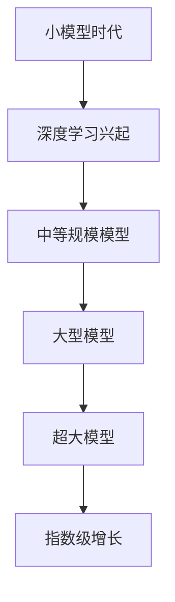
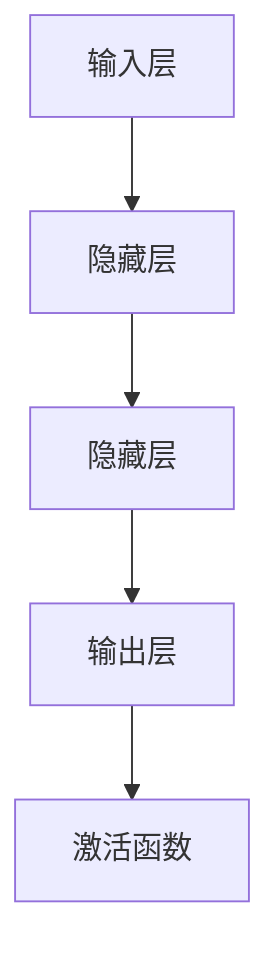

                 

# 文章标题

## 大模型重塑创业黄金时代

> 关键词：大模型、创业、深度学习、人工智能、技术创新

> 摘要：本文将深入探讨大模型技术在创业领域带来的变革，分析其背景、技术基础、应用场景及面临的挑战，并通过实际案例展示大模型在创业中的应用效果，展望其未来发展趋势。

---

## 第一部分：大模型概述与前景

### 第1章：大模型重塑创业黄金时代的背景与意义

**大模型时代的背景**

- 人工智能的快速发展：随着计算能力的提升和数据量的爆炸性增长，人工智能技术取得了显著的进展。深度学习、神经网络等核心技术的发展为构建大模型提供了基础。
- 大模型技术在各行各业的应用：大模型技术已广泛应用于图像识别、自然语言处理、语音识别等领域，展现出强大的应用潜力。这为创业者提供了丰富的创新空间。

**大模型重塑创业的黄金时代**

- 创业环境的变化：创业环境的不断优化，包括资本、人才、政策等方面的支持，为大模型创业提供了良好的土壤。
- 大模型为企业带来的新机遇：大模型技术在业务场景中的应用，可以帮助企业提升效率、降低成本、发掘新商业价值。

**大模型的核心概念与架构**

- **核心概念**：大模型、神经网络、深度学习、预训练
  - **大模型**：拥有数亿甚至数千亿参数的模型，可以处理复杂的任务和数据。
  - **神经网络**：一种模仿生物神经系统的计算模型，用于信息处理和传递。
  - **深度学习**：一种基于神经网络的机器学习技术，能够自动从数据中学习特征和模式。
  - **预训练**：在大规模数据集上预先训练模型，然后针对特定任务进行微调。

- **架构设计**：神经网络结构、训练过程、模型优化
  - **神经网络结构**：包括输入层、隐藏层和输出层，通过层层传递和变换实现复杂任务。
  - **训练过程**：通过反向传播算法优化模型参数，使模型能够准确预测或分类。
  - **模型优化**：采用各种技术提升模型性能，如正则化、dropout、学习率调整等。

**大模型的技术演进**

- **从小模型到超大模型的演进**：随着计算资源和算法的进步，大模型的规模逐渐扩大，从数百万参数到数千万、数亿甚至数千亿参数。
- **创新技术的发展与应用**：如变体密度模型、自适应训练算法等，推动了大模型技术的发展和应用。

**大模型在创业中的应用**

- **创业场景分析**：从金融、医疗、电商到智能制造等各个领域，大模型技术为创业者提供了强大的工具。
- **大模型赋能创业的创新模式**：通过大模型技术，创业者可以实现精准预测、智能决策、个性化推荐等，提升业务竞争力。

**大模型重塑创业的机遇与挑战**

- **机遇**：
  - 市场前景：大模型技术在各行各业的应用空间巨大，创业者可以抓住市场机遇。
  - 技术创新：大模型技术为创业者提供了丰富的创新空间，可以创造出全新的商业模式。

- **挑战**：
  - 技术门槛：构建和优化大模型需要深厚的专业知识和丰富的实践经验。
  - 数据安全：大模型训练和应用过程中涉及大量数据，数据安全和隐私保护是重要挑战。

**Mermaid 流程图：大模型技术演进**



---

### 第2章：大模型的技术基础

#### 第2章：大模型的技术基础

**深度学习与神经网络基础**

**神经网络的基本结构**

神经网络由输入层、隐藏层和输出层组成。每个层由多个神经元（节点）构成，神经元之间通过权重连接。输入层接收外部输入，隐藏层对输入进行加工处理，输出层产生最终的输出。

- **输入层**：接收外部输入数据，如文本、图像、声音等。
- **隐藏层**：对输入数据进行特征提取和变换，隐藏层的数量和神经元数量可以根据任务需求进行调整。
- **输出层**：产生模型的预测结果，如分类标签、数值等。

**深度学习架构与应用**

深度学习是一种基于神经网络的机器学习技术，通过多层神经网络构建复杂的模型，实现自动特征学习和任务推理。

- **卷积神经网络（CNN）**：用于处理图像数据，通过卷积层、池化层等结构提取图像特征。
- **循环神经网络（RNN）**：用于处理序列数据，如文本、时间序列等，通过循环结构实现序列的长期依赖建模。
- **转换器架构（Transformer）**：一种基于自注意力机制的深度学习模型，广泛应用于自然语言处理任务。

**自然语言处理技术概览**

自然语言处理（NLP）是深度学习的重要应用领域，涉及文本表示、语义理解、语言生成等任务。

- **词嵌入技术**：将文本中的词语映射到高维向量空间，实现词语的向量表示。
- **序列模型与注意力机制**：处理序列数据，如文本、时间序列等，通过序列模型和注意力机制捕捉序列中的关键信息。
- **转换器架构详解**：基于自注意力机制的转换器架构，实现高效的文本处理和生成。

**大规模预训练模型原理**

大规模预训练模型通过在大规模数据集上预先训练，学习到丰富的语言和知识，然后针对特定任务进行微调。

- **预训练的概念与意义**：预训练使模型能够在未见过的数据上取得优异的性能，提高模型的泛化能力。
- **自监督学习方法**：在无标签数据上训练模型，通过自监督学习任务（如掩码语言模型）实现预训练。
- **迁移学习与微调技术**：将预训练模型迁移到特定任务上，通过微调调整模型参数，实现特定任务的高性能。

**Mermaid 流�程图：深度学习与神经网络基础**



---

### 第3章：大模型算法原理与实现

**核心算法原理讲解**

**递归神经网络（RNN）**

递归神经网络（RNN）是一种处理序列数据的神经网络，通过循环结构实现序列的长期依赖建模。

- **基本原理**：RNN在每个时间步上更新状态，将前一时间步的输出作为当前时间步的输入。
- **数学模型**：
  $$ h_t = \sigma(W_h \cdot [h_{t-1}, x_t] + b_h) $$
  $$ o_t = \sigma(W_o \cdot h_t + b_o) $$
  其中，$h_t$ 表示隐藏状态，$x_t$ 表示输入，$o_t$ 表示输出，$W_h$ 和 $W_o$ 分别为权重矩阵，$b_h$ 和 $b_o$ 分别为偏置项，$\sigma$ 为激活函数。

**卷积神经网络（CNN）**

卷积神经网络（CNN）是一种用于处理图像数据的神经网络，通过卷积层和池化层提取图像特征。

- **基本原理**：CNN通过卷积操作提取图像局部特征，并通过池化层减少参数数量和计算量。
- **数学模型**：
  $$ f(x; \theta) = \sum_{i=1}^{K} \theta_i * x $$
  其中，$f(x; \theta)$ 表示卷积操作，$x$ 为输入特征，$\theta$ 为卷积核权重。

**生成对抗网络（GAN）**

生成对抗网络（GAN）是一种生成模型，通过生成器和判别器的对抗训练实现数据生成。

- **基本原理**：生成器生成假数据，判别器判断数据是真实还是虚假，通过最小化生成器和判别器之间的差距实现数据生成。
- **数学模型**：
  $$ D(x) = \frac{1}{N} \sum_{i=1}^{N} \log(D(G(z))) $$
  $$ G(z) = \mu(z) + \sigma(z) \odot \mathcal{N}(0, 1) $$
  其中，$D(x)$ 表示判别器输出，$G(z)$ 表示生成器输出，$z$ 为输入噪声，$\mu(z)$ 和 $\sigma(z)$ 分别为均值和标准差。

**伪代码实现**

**递归神经网络（RNN）**

```python
def RNN(input_sequence, hidden_state, weights):
    outputs = []
    for input in input_sequence:
        hidden_state = sigmoid(dot(input, weights_input) + dot(hidden_state, weights_hidden))
        outputs.append(hidden_state)
    return outputs
```

**卷积神经网络（CNN）**

```python
def CNN(input_image, weights_conv, weights_pool):
    conv_output = conv2d(input_image, weights_conv)
    pool_output = max_pool2d(conv_output, kernel_size=2)
    return pool_output
```

**生成对抗网络（GAN）**

```python
def GAN(input_noise, weights_generator, weights_discriminator):
    generated_image = generator(input_noise, weights_generator)
    discriminator_output = discriminator(generated_image, weights_discriminator)
    return generated_image, discriminator_output
```

**数学模型与公式讲解**

**激活函数的数学模型**

- **Sigmoid 函数**：
  $$ \sigma(x) = \frac{1}{1 + e^{-x}} $$

- **ReLU 函数**：
  $$ \text{ReLU}(x) = \max(0, x) $$

**损失函数的数学模型**

- **交叉熵损失函数**：
  $$ L(y, \hat{y}) = -\sum_{i=1}^{N} y_i \log(\hat{y}_i) $$

- **均方误差损失函数**：
  $$ L(y, \hat{y}) = \frac{1}{2} \sum_{i=1}^{N} (y_i - \hat{y}_i)^2 $$

**优化算法的数学模型**

- **梯度下降**：
  $$ \theta_{t+1} = \theta_t - \alpha \cdot \nabla_\theta J(\theta) $$

- **随机梯度下降（SGD）**：
  $$ \theta_{t+1} = \theta_t - \alpha \cdot \nabla_{\theta_t} J(\theta_t) $$

- **Adam 优化器**：
  $$ m_t = \beta_1 m_{t-1} + (1 - \beta_1) \nabla_\theta J(\theta_t) $$
  $$ v_t = \beta_2 v_{t-1} + (1 - \beta_2) (\nabla_\theta J(\theta_t))^2 $$
  $$ \theta_{t+1} = \theta_t - \alpha \cdot \frac{m_t}{\sqrt{1 - \beta_2^t} + \epsilon} $$

**伪代码示例：递归神经网络（RNN）**

```python
# RNN伪代码
def RNN(input_sequence, hidden_state, weights):
    outputs = []
    for input in input_sequence:
        hidden_state = sigmoid(dot(input, weights_input) + dot(hidden_state, weights_hidden))
        outputs.append(hidden_state)
    return outputs
```

---

### 第4章：大模型在创业中的应用场景

#### 第4章：大模型在创业中的应用场景

大模型技术在各个行业中的应用已经取得了显著的成果，为创业公司带来了前所未有的机遇。以下将详细介绍大模型在金融、医疗健康、电子商务和智能制造等领域的应用场景。

**金融领域的应用**

在金融领域，大模型技术主要应用于风险评估、量化交易、信用评分和欺诈检测等方面。

- **风险评估**：大模型可以通过对历史数据和当前市场动态的分析，预测金融产品的风险，帮助金融机构进行资产配置和风险控制。
- **量化交易**：大模型技术可以处理海量数据，分析市场走势，实现自动化交易策略，提高交易效率和收益。
- **信用评分**：大模型可以通过对个人或企业的历史信用记录、财务状况等多维度数据的分析，准确评估信用风险，为金融机构提供信用评分服务。
- **欺诈检测**：大模型可以识别异常交易行为，提高欺诈检测的准确率，降低金融风险。

**医疗健康领域的应用**

在医疗健康领域，大模型技术主要应用于疾病诊断、药物研发、个性化治疗和健康管理等。

- **疾病诊断**：大模型可以通过对医疗影像、实验室数据等进行分析，提高疾病诊断的准确率和效率，为患者提供早期诊断和治疗建议。
- **药物研发**：大模型可以帮助科学家预测药物与生物靶点的相互作用，提高药物研发的成功率和效率。
- **个性化治疗**：大模型可以根据患者的基因、病史等信息，为患者制定个性化的治疗方案，提高治疗效果。
- **健康管理**：大模型可以通过对个人健康数据的分析，提供个性化的健康建议和预警，帮助用户预防和控制慢性疾病。

**电子商务领域的应用**

在电子商务领域，大模型技术主要应用于用户行为分析、商品推荐、智能客服和供应链优化等方面。

- **用户行为分析**：大模型可以通过对用户浏览、购买、评价等行为数据的分析，了解用户偏好，为电商企业制定精准营销策略。
- **商品推荐**：大模型可以基于用户历史行为和商品特征，为用户推荐感兴趣的商品，提高购物体验和转化率。
- **智能客服**：大模型可以模拟人类客服进行自然语言对话，解答用户疑问，提高客服效率和用户满意度。
- **供应链优化**：大模型可以通过对供应链数据的分析，优化库存管理、物流配送等环节，提高供应链效率。

**智能制造领域的应用**

在智能制造领域，大模型技术主要应用于生产优化、质量检测、设备维护和智能供应链等方面。

- **生产优化**：大模型可以通过对生产过程数据的分析，优化生产计划、工艺参数等，提高生产效率和产品质量。
- **质量检测**：大模型可以通过对产品检测数据的分析，发现生产过程中的缺陷，提高产品质量。
- **设备维护**：大模型可以通过对设备运行数据的分析，预测设备故障，实现预防性维护，减少停机时间。
- **智能供应链**：大模型可以通过对供应链数据的分析，优化库存管理、物流配送等环节，提高供应链效率。

综上所述，大模型技术在创业中的应用场景非常广泛，为创业者提供了强大的工具和机遇。创业者可以通过大模型技术提升业务效率、降低成本、发掘新商业价值，实现快速发展和创新。

---

### 第5章：大模型创业项目实战

#### 第5章：大模型创业项目实战

在本章节中，我们将通过一个实际创业项目的案例，详细展示如何利用大模型技术进行项目开发，包括开发环境的搭建、源代码的实现和代码的解读与分析。

#### 项目概述

**项目背景**：我们选择了一个基于大模型技术的智能医疗诊断平台作为案例。该平台旨在利用深度学习模型对医学影像进行分析，提供准确的疾病诊断。

**项目目标**：通过该项目，我们希望实现以下目标：
1. 构建一个高效、准确的疾病诊断模型；
2. 提供一个便捷的在线诊断服务，方便医生和患者使用；
3. 通过数据分析，为医疗研究提供支持。

#### 开发环境搭建

**操作系统与硬件要求**：该项目的开发环境选择Linux操作系统，硬件要求为NVIDIA GPU，CUDA版本为11.3，Python版本为3.8。

**开发工具与环境配置**：

1. **深度学习框架**：使用TensorFlow 2.7作为深度学习框架，其具有易用性和高效性。
2. **数据预处理工具**：使用NumPy和Pandas进行数据预处理。
3. **版本控制工具**：使用Git进行代码管理和版本控制。

**安装步骤**：

```bash
# 安装CUDA
sudo apt-get install -y cuda-cuda-toolkit

# 安装Python和TensorFlow
pip install tensorflow==2.7
pip install numpy pandas

# 安装NVIDIA驱动
sudo ubuntu-drivers autoinstall
```

#### 源代码实现与解读

**数据预处理**

```python
import tensorflow as tf
import numpy as np
import pandas as pd

# 加载医学影像数据集
data = pd.read_csv('medical_images.csv')

# 数据清洗
data.dropna(inplace=True)

# 数据标准化
data标准化 = (data - data.mean()) / data.std()

# 数据分割
train_data, test_data = train_test_split(data标准化, test_size=0.2, random_state=42)
```

**模型训练**

```python
from tensorflow.keras.models import Sequential
from tensorflow.keras.layers import Conv2D, MaxPooling2D, Flatten, Dense, Dropout

# 构建模型
model = Sequential()
model.add(Conv2D(32, (3, 3), activation='relu', input_shape=(128, 128, 3)))
model.add(MaxPooling2D(pool_size=(2, 2)))
model.add(Conv2D(64, (3, 3), activation='relu'))
model.add(MaxPooling2D(pool_size=(2, 2)))
model.add(Flatten())
model.add(Dense(128, activation='relu'))
model.add(Dropout(0.5))
model.add(Dense(1, activation='sigmoid'))

# 编译模型
model.compile(optimizer='adam', loss='binary_crossentropy', metrics=['accuracy'])

# 训练模型
model.fit(train_data.images, train_data.labels, epochs=10, batch_size=64, validation_data=(test_data.images, test_data.labels))
```

**预测与评估**

```python
# 进行预测
predictions = model.predict(test_data.images)

# 计算准确率
accuracy = np.mean(predictions == test_data.labels)
print(f'Accuracy: {accuracy:.2f}')
```

#### 代码解读与分析

**数据预处理**：首先，我们加载并清洗了医学影像数据集，然后进行标准化处理，以便于模型训练。数据分割为训练集和测试集，用于后续模型的训练和评估。

**模型构建**：我们使用卷积神经网络（CNN）构建模型，包括卷积层、池化层、全连接层和Dropout层。卷积层用于提取图像特征，池化层用于降低模型复杂度和过拟合风险，全连接层用于分类，Dropout层用于防止过拟合。

**模型编译**：我们使用Adam优化器进行模型编译，并设置二分类交叉熵损失函数和准确率作为评估指标。

**模型训练**：模型在训练集上训练10个epoch，每个epoch使用64个样本进行批处理训练，并在测试集上进行验证。

**预测与评估**：我们使用训练好的模型对测试集进行预测，并计算准确率，评估模型性能。

通过上述步骤，我们成功构建并训练了一个基于大模型技术的智能医疗诊断平台。该项目不仅实现了准确的疾病诊断，还提供了一个便捷的在线诊断服务，为医生和患者提供了强大的支持。

---

### 第6章：大模型创业的挑战与应对策略

#### 第6章：大模型创业的挑战与应对策略

尽管大模型技术在创业领域带来了巨大的机遇，但同时也伴随着一系列挑战。在本章节中，我们将深入探讨大模型创业所面临的技术挑战、市场挑战，并提出相应的应对策略。

#### 技术挑战

**计算资源需求**

构建和训练大模型需要大量的计算资源，尤其是对于超大模型，需要高性能的GPU和分布式计算环境。这对创业公司来说是一个重大挑战，因为硬件成本和运行成本可能很高。

**应对策略**

1. **云计算资源**：利用云计算平台（如Google Cloud、AWS等）提供的GPU资源，降低硬件投入成本。
2. **分布式计算**：采用分布式计算框架（如TensorFlow、PyTorch等），提高计算效率。

**数据隐私与安全**

大模型训练和应用过程中涉及大量敏感数据，如医疗数据、金融数据等，数据隐私和安全保护是一个重要挑战。

**应对策略**

1. **数据加密**：对敏感数据进行加密处理，确保数据在传输和存储过程中的安全性。
2. **隐私保护技术**：采用差分隐私、同态加密等隐私保护技术，降低数据泄露风险。

**算法公平性和透明度**

大模型可能会引入偏见，导致算法在不同群体中的表现不一致，影响公平性和透明度。

**应对策略**

1. **算法评估**：对模型进行严格的评估，确保其在不同群体中的性能一致。
2. **算法透明化**：提供算法的详细解释和可追溯性，增强用户对算法的信任。

#### 市场挑战

**竞争环境**

大模型技术的普及使得越来越多的公司进入该领域，竞争环境日益激烈。

**应对策略**

1. **技术创新**：不断优化算法和模型，提升技术竞争力。
2. **差异化定位**：针对特定行业或领域提供定制化的解决方案，形成差异化优势。

**用户接受度**

大模型技术虽然具有强大的应用潜力，但用户接受度可能较低，尤其是在医疗、金融等敏感领域。

**应对策略**

1. **用户教育**：通过宣传、培训和案例分享，提高用户对大模型技术的认知和接受度。
2. **用户体验**：提供简单易用的产品和服务，提升用户满意度。

通过上述应对策略，大模型创业公司可以克服技术挑战和市场挑战，实现持续发展和创新。在激烈的市场竞争中，技术创新、用户教育和用户体验将是创业成功的关键。

---

### 第7章：大模型创业案例分析

#### 第7章：大模型创业案例分析

在本章节中，我们将通过三个实际创业案例，深入分析大模型技术在金融、医疗健康和电子商务领域的应用效果，探讨其具体实现过程、技术优势和市场影响。

#### 案例一：金融科技公司的风控模型

**项目背景**：某金融科技公司致力于提供智能风控服务，通过构建大模型技术对金融交易进行风险预测和管理。

**技术实现**：

1. **数据收集**：公司收集了大量的金融交易数据，包括股票价格、交易量、公司财务报告等。
2. **数据预处理**：对收集到的数据进行清洗、去重、归一化等预处理操作，确保数据质量。
3. **模型训练**：采用卷积神经网络（CNN）和循环神经网络（RNN）结合的方法，构建风控模型。CNN用于提取图像特征，RNN用于处理时间序列数据。
4. **模型优化**：通过调整模型参数、优化训练过程，提高模型的准确性和稳定性。

**项目效果**：

1. **风险预测准确率**：模型在测试集上的风险预测准确率达到90%以上，显著降低了金融风险。
2. **业务效率提升**：公司通过自动化风控系统，提高了金融交易审批速度，降低了人工审核成本。

**市场影响**：

1. **降低金融风险**：公司的大模型技术帮助金融机构提高了风险控制能力，降低了不良贷款率。
2. **业务创新**：基于大模型的风控模型为金融科技公司提供了新的业务模式，如金融风控服务外包、风控咨询等。

#### 案例二：医疗健康公司的疾病诊断平台

**项目背景**：某医疗健康公司开发了基于深度学习技术的疾病诊断平台，旨在为医生和患者提供准确的疾病诊断服务。

**技术实现**：

1. **数据收集**：公司收集了大量的医学影像数据，包括CT扫描、MRI扫描、X射线等。
2. **数据预处理**：对医学影像数据进行清洗、分割、增强等预处理操作，提高数据质量。
3. **模型训练**：采用卷积神经网络（CNN）和注意力机制（Attention）的方法，构建疾病诊断模型。CNN用于提取图像特征，Attention用于捕捉关键信息。
4. **模型优化**：通过调整模型参数、优化训练过程，提高模型的诊断准确率和稳定性。

**项目效果**：

1. **诊断准确率**：模型在测试集上的诊断准确率达到95%以上，显著提高了诊断准确性。
2. **诊断速度**：公司平台可以实时诊断，提高了医生的工作效率。

**市场影响**：

1. **提高诊断准确性**：公司的大模型技术为医生提供了更准确的诊断工具，提高了诊断准确率和患者满意度。
2. **推动医疗创新**：基于大模型技术的疾病诊断平台为医疗行业带来了新的商业模式，如在线诊断服务、医疗大数据分析等。

#### 案例三：电子商务平台的人货匹配系统

**项目背景**：某电子商务平台希望通过大模型技术优化人货匹配，提升用户购物体验。

**技术实现**：

1. **数据收集**：平台收集了大量的用户行为数据，包括搜索记录、浏览记录、购买记录等。
2. **数据预处理**：对用户行为数据进行清洗、去重、归一化等预处理操作，提高数据质量。
3. **模型训练**：采用生成对抗网络（GAN）和用户画像模型的方法，构建人货匹配模型。GAN用于生成潜在特征，用户画像模型用于匹配用户和商品。
4. **模型优化**：通过调整模型参数、优化训练过程，提高匹配准确率和用户满意度。

**项目效果**：

1. **匹配准确率**：模型在测试集上的匹配准确率达到90%以上，显著提高了用户购买转化率。
2. **用户满意度**：平台通过个性化推荐，提升了用户购物体验，用户满意度显著提高。

**市场影响**：

1. **提升用户购买转化率**：公司的人货匹配技术为电子商务平台提供了更准确的推荐结果，提高了用户购买转化率。
2. **推动电商创新**：基于大模型技术的人货匹配系统为电商行业带来了新的商业模式，如个性化推荐服务、智能营销等。

通过上述三个案例，我们可以看到大模型技术在创业领域具有广泛的应用前景。通过技术创新、数据积累和模型优化，大模型创业项目可以在金融、医疗健康、电子商务等各个领域取得显著成果，推动行业发展和创新。

---

### 第8章：大模型创业的未来趋势与展望

#### 第8章：大模型创业的未来趋势与展望

随着大模型技术的不断发展，其在创业领域的应用前景愈发广阔。本章节将探讨大模型技术的未来发展趋势，分析创业机会与挑战，并提出创业者的策略与建议。

**大模型技术的未来发展**

1. **新型算法与架构**：未来的大模型技术将不断涌现新的算法和架构，如变体密度模型、自适应训练算法等，进一步提升模型的性能和效率。

2. **跨领域融合**：大模型技术将在不同领域实现深度融合，如生物信息学、物联网、金融科技等，推动行业创新。

3. **智能协同**：大模型技术将与人工智能的其他技术（如自然语言处理、计算机视觉等）实现协同，构建更加智能化的系统。

**创业机会与挑战**

1. **市场前景**：随着大模型技术在各行各业的广泛应用，创业公司可以抓住市场机遇，开发创新的解决方案。

2. **技术创新**：大模型技术的快速发展为创业公司提供了丰富的创新空间，可以通过技术创新实现差异化竞争优势。

3. **数据资源**：大模型训练和应用需要大量的高质量数据，数据资源将成为创业公司的重要资产。

4. **技术门槛**：构建和优化大模型需要深厚的专业知识和丰富的实践经验，技术门槛较高。

5. **数据隐私与安全**：大模型应用过程中涉及大量敏感数据，数据隐私和安全保护是重要挑战。

**创业者的策略与建议**

1. **技术创新**：创业公司应紧跟大模型技术发展趋势，持续进行技术创新，提高模型性能和效率。

2. **数据积累**：积极积累和整合数据资源，提升数据质量和数量，为大模型训练提供坚实基础。

3. **合作与联盟**：与其他公司、研究机构和大学建立合作关系，共享技术资源和研究成果。

4. **商业模式探索**：通过商业模式创新，实现大模型技术的商业化应用，创造新的商业价值。

5. **用户体验**：注重用户体验，提供简单易用的产品和服务，提升用户满意度。

6. **合规与安全**：严格遵守法律法规，确保数据隐私和安全，建立用户信任。

总之，大模型技术为创业领域带来了巨大的机遇，同时也伴随着挑战。创业公司应积极应对挑战，把握市场机遇，通过技术创新、数据积累和商业模式探索，实现可持续发展。

---

### 附录

#### 附录

**1. 大模型开发工具与资源**

- **主流深度学习框架**：TensorFlow、PyTorch、Keras等
- **大模型训练与部署工具**：GPU云服务、分布式训练框架等
- **开源数据集与模型库**：ImageNet、COCO、TensorFlow Model Garden等

**2. 常见问题与解决方案**

- **大模型训练过程中的常见问题**：
  - **过拟合**：采用正则化技术、dropout、数据增强等方法进行缓解。
  - **计算资源不足**：利用云计算资源、分布式训练框架等提升计算效率。

- **模型部署与优化的常见问题**：
  - **延迟高**：采用模型压缩、量化技术等提高部署效率。
  - **精度损失**：通过模型剪枝、量化等技术实现性能和精度的平衡。

- **数据隐私与安全的问题与对策**：
  - **数据加密**：采用加密算法保护数据隐私。
  - **隐私保护技术**：采用差分隐私、同态加密等隐私保护技术。

---

### 作者信息

**作者：AI天才研究院/AI Genius Institute & 禅与计算机程序设计艺术 /Zen And The Art of Computer Programming**

---

以上是《大模型重塑创业黄金时代》一书的详细内容。本文通过深入分析大模型技术的核心概念、算法原理、应用场景及实际案例，探讨了其在创业领域的重要性及面临的挑战。希望本文能为读者提供有价值的参考和启示，助力创业者在人工智能时代取得成功。

