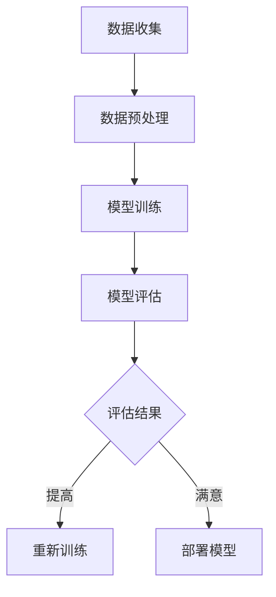

                 

# 大模型问答机器人如何实现对话

## 关键词

- 大模型
- 问答机器人
- 对话系统
- 自然语言处理
- 用户意图识别
- 对话管理

## 摘要

本文深入探讨了大模型问答机器人如何实现对话的各个方面。首先，介绍了大模型问答机器人的发展历程和基本原理，包括大模型的定义、分类、架构和训练方法。接着，详细阐述了自然语言处理的基础知识，如语言模型、语义理解和推理。然后，重点分析了对话系统的设计，包括对话系统的架构、用户意图识别、对话管理等关键技术。接下来，讨论了如何利用大模型实现问答功能，包括数据准备、算法设计和优化评估。最后，通过项目实战展示了如何构建一个完整的大模型问答机器人，并展望了该领域未来的发展趋势和挑战。

## 目录

### 第一部分：基础理论

#### 第1章：大模型问答机器人概述

##### 1.1 问答机器人的发展历程
##### 1.2 大模型在问答中的应用
##### 1.3 大模型问答机器人面临的挑战

#### 第2章：大模型基本原理

##### 2.1 大模型的定义与分类
##### 2.2 大模型的架构与技术
##### 2.3 大模型的训练与优化

#### 第3章：自然语言处理基础

##### 3.1 语言模型的基本概念
##### 3.2 语义理解与推理
##### 3.3 对话系统的任务与挑战

### 第二部分：实现技术

#### 第4章：对话系统设计

##### 4.1 对话系统的架构与流程
##### 4.2 用户意图识别
##### 4.3 对话管理

#### 第5章：大模型问答实现

##### 5.1 大模型问答的数据准备
##### 5.2 大模型问答的算法设计
##### 5.3 大模型问答的优化与评估

#### 第6章：对话机器人交互设计

##### 6.1 交互设计与用户体验
##### 6.2 语音与文本输入输出
##### 6.3 多模态对话交互

### 第三部分：项目实战

#### 第7章：大模型问答机器人项目实战

##### 7.1 项目背景与需求分析
##### 7.2 项目开发环境搭建
##### 7.3 代码实现与解析
##### 7.4 项目部署与测试

### 第四部分：前沿与展望

#### 第8章：大模型问答机器人的未来发展趋势

##### 8.1 人工智能与行业融合
##### 8.2 大模型问答机器人的新应用场景
##### 8.3 面向未来的技术挑战与机遇

### 附录

#### 附录A：大模型问答机器人开发工具与资源

##### A.1 主流对话系统框架对比
##### A.2 大模型训练与优化工具
##### A.3 自然语言处理开源库

#### 附录B：Mermaid 流程图与伪代码

##### B.1 大模型训练流程图
##### B.2 用户意图识别伪代码
##### B.3 对话管理伪代码

### 引言

随着人工智能技术的快速发展，大模型问答机器人作为一种重要的应用场景，受到了广泛关注。大模型问答机器人可以模拟人类对话，回答用户的问题，提供个性化的服务。本文将系统地探讨大模型问答机器人的实现技术，从基础理论到实际应用，全面剖析其核心技术和挑战。

首先，我们将回顾问答机器人发展历程，介绍大模型在问答中的应用和面临的挑战。然后，深入探讨大模型的基本原理，包括定义、分类、架构和训练方法。接下来，我们将介绍自然语言处理的基础知识，如语言模型、语义理解和推理。在此基础上，我们将重点分析对话系统的设计，包括架构、用户意图识别和对话管理。

随后，我们将讨论如何利用大模型实现问答功能，包括数据准备、算法设计和优化评估。此外，我们将探讨对话机器人的交互设计，包括交互设计、语音与文本输入输出以及多模态对话交互。为了更好地理解和应用这些技术，我们将通过一个实际项目展示大模型问答机器人的构建过程。

最后，我们将展望大模型问答机器人的未来发展趋势，探讨人工智能与行业融合、新应用场景以及面向未来的技术挑战和机遇。通过本文的探讨，我们希望读者能够对大模型问答机器人的实现技术有一个全面深入的理解，为实际应用提供指导。

### 第一部分：基础理论

#### 第1章：大模型问答机器人概述

##### 1.1 问答机器人的发展历程

问答机器人（Question Answering Robot）是指能够自动回答用户提出的问题的人工智能系统。其历史可以追溯到早期的人工智能研究，当时研究者们尝试使用规则系统和知识库来构建简单的问答系统。这些系统通常依赖于人工定义的规则和手动构建的知识库，以回答特定领域的问题。

20世纪90年代，随着自然语言处理（Natural Language Processing, NLP）技术的进步，问答系统开始利用统计方法和机器学习技术，如基于转换器-编码器（Transformer Encoder）的模型，进行改进。这一时期的问答系统主要以基于查询的问答（Query-based Question Answering）为主，如OpenQA和TREC QA系统。

进入21世纪，深度学习和神经网络技术的发展为问答系统带来了新的突破。以深度学习为基础的问答系统（Deep Learning-based Question Answering）开始崛起，如基于长短期记忆网络（Long Short-Term Memory, LSTM）和卷积神经网络（Convolutional Neural Networks, CNN）的模型。这一时期的问答系统在处理复杂问题和生成高质量答案方面取得了显著进展。

近年来，大模型（Large Models）的出现进一步推动了问答系统的发展。大模型，如GPT-3、BERT等，具有数十亿甚至千亿参数规模，能够自动学习和理解大量文本数据。这些大模型在问答任务上表现出了极高的准确性和鲁棒性，使得问答系统能够处理更加复杂和多样化的用户问题。

##### 1.2 大模型在问答中的应用

大模型在问答中的应用主要表现在以下几个方面：

1. **大规模语言模型**：如GPT-3、BERT等大模型，通过学习海量的文本数据，可以自动生成高质量的自然语言答案。这些模型利用深度学习技术，能够理解复杂的语义和上下文关系，从而生成更加准确和自然的回答。

2. **多语言问答**：大模型通常具有多语言能力，可以处理多种语言的问题和答案。这使得问答系统可以在全球范围内推广，为不同语言的用户提供无障碍的问答服务。

3. **自适应问答**：大模型可以根据用户的问题和历史交互记录，自适应地调整回答策略。例如，如果用户频繁提问某个特定领域的问题，大模型可以自动积累相关领域的知识，从而提供更加专业和个性化的答案。

4. **知识问答**：大模型结合知识图谱和语义理解技术，可以回答基于事实和知识的问题。这种类型的问答系统在知识密集型领域，如医学、法律和金融，具有广泛的应用潜力。

##### 1.3 大模型问答机器人面临的挑战

尽管大模型在问答任务上表现出了优异的性能，但其在实际应用中仍面临一些挑战：

1. **数据质量**：大模型需要大量的高质量数据来训练，数据的质量直接影响到模型的性能。在实际应用中，获取和标注高质量数据是一项复杂的任务。

2. **计算资源**：大模型通常需要大量的计算资源进行训练和推理。在资源受限的环境中，如何高效地部署和使用大模型是一个关键问题。

3. **鲁棒性**：大模型在面对异常输入和噪声数据时，可能会出现错误回答。如何提高大模型的鲁棒性，使其在复杂环境中仍然能够提供高质量的服务，是一个重要的研究方向。

4. **可解释性**：大模型的内部结构和决策过程通常非常复杂，难以解释。如何提高大模型的可解释性，使其能够透明和可信地工作，是一个亟待解决的问题。

5. **隐私保护**：大模型在处理用户数据时，需要保护用户的隐私。如何在保证模型性能的同时，确保用户数据的隐私安全，是一个重要的挑战。

通过深入探讨大模型问答机器人的发展历程、应用场景和面临的挑战，我们可以更好地理解这一领域的技术和前景。接下来，我们将进一步探讨大模型的基本原理，包括定义、分类、架构和训练方法。

### 第二部分：基础理论

#### 第2章：大模型基本原理

##### 2.1 大模型的定义与分类

大模型（Large Models）是指具有巨大参数量的神经网络模型，通常具有数亿甚至千亿个参数。这些模型通过深度学习技术，自动从大量数据中学习复杂的特征和模式，从而在自然语言处理、计算机视觉和语音识别等领域取得了显著的进展。大模型的定义可以从以下几个方面来理解：

1. **参数量**：大模型通常具有数十亿甚至千亿个参数，这使得模型具有更高的表示能力，能够捕捉到复杂的数据特征。

2. **数据量**：大模型通常需要大量的训练数据来训练，以保证模型能够学到普遍的规律和特征。这些数据通常来自大规模的语料库、图像库或音频库。

3. **训练时间**：大模型的训练通常需要大量的计算资源，尤其是显存和CPU/GPU资源。这可能导致训练时间非常长，甚至需要数天或数周。

大模型可以根据不同的维度进行分类：

1. **按参数量**：小模型（<10亿参数）、中等模型（10亿-100亿参数）、大模型（>100亿参数）。

2. **按训练数据量**：数据驱动的模型、知识驱动的模型、混合驱动的模型。

3. **按应用领域**：自然语言处理模型、计算机视觉模型、语音识别模型。

##### 2.2 大模型的架构与技术

大模型的架构通常基于深度神经网络，主要包括以下几个层次：

1. **输入层**：接收输入数据，如文本、图像或音频。

2. **隐藏层**：多层神经网络，通过非线性变换，将输入数据映射到高维空间，提取特征。

3. **输出层**：输出层根据模型的任务类型，输出预测结果，如文本分类、图像分类或语音识别。

常见的深度学习架构包括：

1. **卷积神经网络（Convolutional Neural Networks, CNN）**：适用于图像和语音处理，通过卷积操作提取局部特征。

2. **循环神经网络（Recurrent Neural Networks, RNN）**：适用于序列数据，通过循环机制捕捉序列信息。

3. **长短期记忆网络（Long Short-Term Memory, LSTM）**：RNN的改进版本，能够更好地处理长序列数据。

4. **变换器（Transformer）**：基于自注意力机制，适用于自然语言处理，是目前最流行的大模型架构。

大模型的训练过程通常包括以下几个步骤：

1. **数据预处理**：对输入数据进行预处理，如文本的分词、图像的缩放、音频的归一化等。

2. **模型初始化**：初始化模型参数，通常使用随机初始化或预训练模型。

3. **损失函数设计**：根据任务类型设计损失函数，如交叉熵损失、均方误差损失等。

4. **优化算法**：选择优化算法，如随机梯度下降（Stochastic Gradient Descent, SGD）、Adam优化器等。

5. **模型训练**：使用训练数据对模型进行迭代训练，通过反向传播算法更新模型参数。

6. **模型评估**：使用验证集对模型进行评估，调整模型参数，以提高模型性能。

##### 2.3 大模型的训练与优化

大模型的训练是一个复杂的过程，涉及多个方面：

1. **数据增强**：为了提高模型的泛化能力，可以通过数据增强技术，如随机裁剪、旋转、翻转等，生成更多的训练样本。

2. **正则化**：为了防止模型过拟合，可以采用正则化技术，如L1正则化、L2正则化、dropout等。

3. **学习率调整**：学习率是模型训练过程中非常重要的参数，可以通过学习率调整策略，如余弦退火（Cosine Annealing）、学习率衰减等，优化模型训练。

4. **批处理大小**：批处理大小影响模型的收敛速度和性能，通常需要在计算资源和模型性能之间进行权衡。

5. **多GPU训练**：通过多GPU训练，可以加速模型训练，提高模型性能。

6. **分布式训练**：对于非常大的模型和数据集，可以通过分布式训练，将数据分片到多个节点进行并行处理，提高训练效率。

在训练过程中，还需要监控模型性能，如准确率、召回率、F1分数等，以评估模型的效果。如果模型性能不理想，可以通过调整超参数、修改模型结构或增加训练数据等方式进行优化。

通过深入探讨大模型的定义与分类、架构与技术以及训练与优化方法，我们可以更好地理解大模型的工作原理，为构建高效的大模型问答机器人打下基础。接下来，我们将介绍自然语言处理的基础知识，包括语言模型、语义理解和推理。

### 第三部分：基础理论

#### 第3章：自然语言处理基础

##### 3.1 语言模型的基本概念

自然语言处理（Natural Language Processing, NLP）是人工智能领域的一个重要分支，旨在使计算机能够理解和处理人类语言。在NLP中，语言模型（Language Model）是一种核心技术，它用于预测给定文本序列的概率分布。语言模型的基本概念包括：

1. **词汇表**：语言模型通常使用一个词汇表（Vocabulary）来表示文本中的单词和符号。词汇表可以是一组单词的集合，也可以是更复杂的结构，如字符级别的表示。

2. **概率分布**：语言模型的核心任务是预测给定输入序列的概率分布。这种概率分布可以用于各种NLP任务，如文本分类、机器翻译和问答。

3. **统计语言模型**：早期的语言模型主要基于统计学方法，如N元语法（N-gram Model），通过统计文本中的单词序列频率来预测下一个单词。

4. **神经网络语言模型**：近年来，基于深度学习技术的神经网络语言模型（Neural Language Model）取得了显著进展。这些模型通过学习大量的文本数据，可以自动捕捉文本中的复杂结构和语义信息。

##### 3.2 语义理解与推理

语义理解（Semantic Understanding）是NLP中的关键任务，它涉及将自然语言文本转换为计算机可以理解的结构化表示。语义理解包括以下几个核心概念：

1. **词义消歧**（Word Sense Disambiguation）：在一个句子中，一个单词可能有多个含义。词义消歧的任务是确定单词在特定句子中的正确含义。

2. **实体识别**（Named Entity Recognition, NER）：实体识别的任务是识别文本中的特定类型实体，如人名、地名、组织名等。

3. **关系提取**（Relation Extraction）：关系提取的任务是识别文本中实体之间的关系，如“爱因斯坦是物理学家”中的“是”表示一种职业关系。

4. **语义角色标注**（Semantic Role Labeling, SRL）：语义角色标注的任务是识别句子中每个词的语义角色，如动作执行者、受事者、工具等。

推理（Reasoning）是语义理解的高级任务，它涉及利用已知信息推导出新信息。在NLP中，推理可以用于：

1. **常识推理**：利用常识知识库，推理出文本中隐含的信息。例如，从“小明在雨天穿着雨衣”推导出“小明今天不会感冒”。

2. **逻辑推理**：利用逻辑规则，推理出文本中的逻辑关系。例如，从“所有猫都会爬树”和“这只动物是猫”推理出“这只动物会爬树”。

3. **上下文推理**：利用上下文信息，推理出文本中的隐含含义。例如，从“我喜欢吃苹果”和“苹果对健康有好处”推理出“苹果可能对健康有好处”。

##### 3.3 对话系统的任务与挑战

对话系统（Dialogue System）是一种能够与人类进行自然语言交互的计算机系统。对话系统的任务包括：

1. **用户意图识别**（Intent Recognition）：识别用户的意图或需求，如“查找天气”、“预订餐厅”等。

2. **对话管理**（Dialogue Management）：管理对话流程，包括确定对话方向、维护对话上下文和生成适当的回复。

3. **自然语言生成**（Natural Language Generation）：根据对话上下文生成自然语言回复。

对话系统面临的挑战包括：

1. **上下文理解**：对话系统需要理解对话的上下文信息，包括用户的历史提问和系统之前的回答。

2. **多模态交互**：对话系统需要处理多种输入输出方式，如文本、语音、图像等。

3. **用户适应性**：对话系统需要适应不同的用户风格、文化和语言背景。

4. **错误处理**：对话系统需要处理用户的错误输入和系统的错误回答，提供有效的错误纠正机制。

通过介绍自然语言处理的基础知识，包括语言模型、语义理解和推理，以及对话系统的任务与挑战，我们可以更好地理解大模型问答机器人的实现技术。在接下来的部分，我们将深入探讨对话系统的设计，包括架构、用户意图识别和对话管理。

### 第二部分：实现技术

#### 第4章：对话系统设计

##### 4.1 对话系统的架构与流程

对话系统（Dialogue System）是能够与人类用户进行自然语言交互的计算机系统，其架构和流程设计直接影响到系统的性能和用户体验。对话系统通常包括以下几个核心组成部分：

1. **输入处理模块**：接收用户的输入，如文本、语音等，并将其转换为系统可以处理的格式。

2. **用户意图识别模块**：分析用户输入，识别用户的意图或需求，如查询天气、预订餐厅等。

3. **对话管理模块**：根据用户意图和对话上下文，决定系统的响应和对话流程，包括生成自然语言回复、控制对话走向等。

4. **自然语言生成模块**：将内部逻辑和决策转换为自然语言文本，以响应用户。

5. **输出处理模块**：将自然语言生成模块生成的文本转换为用户可理解的输出形式，如文本、语音、图像等。

对话系统的基本流程如下：

1. **接收用户输入**：用户通过输入设备（如键盘、语音识别设备等）向系统发送请求。

2. **预处理输入**：输入处理模块对用户输入进行预处理，包括分词、去噪、标准化等。

3. **用户意图识别**：用户意图识别模块分析预处理后的输入，通过模式匹配、深度学习模型等手段，识别用户的意图。

4. **对话管理**：对话管理模块根据用户意图和对话历史，决定系统的响应策略和对话流程。这包括查询知识库、生成回复文本、控制对话方向等。

5. **自然语言生成**：自然语言生成模块根据对话管理和用户意图识别的结果，生成自然语言回复。

6. **输出处理**：输出处理模块将自然语言生成模块生成的文本转换为用户可理解的输出形式，并通过输出设备（如屏幕、扬声器等）发送给用户。

##### 4.2 用户意图识别

用户意图识别（User Intent Recognition）是对话系统设计中的关键步骤，其目的是从用户输入中提取出用户的意图或需求。用户意图识别的主要挑战包括：

1. **多义性**：用户的输入可能具有多种含义，需要通过上下文信息来确定确切意图。

2. **隐含意图**：用户可能没有直接表达出明确的意图，需要通过推理和上下文分析来推断意图。

3. **噪声和错误输入**：用户输入可能包含拼写错误、语法错误或噪声，需要通过预处理技术来提高识别准确率。

用户意图识别的技术手段包括：

1. **规则基方法**：通过定义一系列规则，将用户输入映射到预定义的意图类别。这种方法简单直观，但容易受到规则覆盖不足的影响。

2. **机器学习方法**：使用机器学习模型，如朴素贝叶斯分类器、支持向量机（SVM）和深度学习模型（如卷积神经网络（CNN）和长短期记忆网络（LSTM）），从大量标注数据中学习意图分类模型。这种方法能够处理复杂的特征和模式，提高识别准确率。

3. **转移学习**：利用预训练的语言模型（如BERT、GPT-3），通过微调（Fine-tuning）来适应特定的意图识别任务。这种方法能够利用大规模未标注数据，提高模型的泛化能力和性能。

用户意图识别的具体实现步骤如下：

1. **数据预处理**：对用户输入进行分词、去噪、标准化等预处理操作，提取关键特征。

2. **特征提取**：使用词嵌入技术（如Word2Vec、GloVe）将词汇表中的单词转换为固定长度的向量表示。

3. **模型训练**：使用标注数据集训练意图分类模型，通过交叉熵损失函数优化模型参数。

4. **模型评估**：使用验证集对模型进行评估，调整超参数和模型结构，以提高识别准确率。

5. **意图识别**：将预处理后的用户输入输入到训练好的意图分类模型，输出用户意图的预测结果。

##### 4.3 对话管理

对话管理（Dialogue Management）是控制对话流程的核心环节，其目的是确保对话系统能够有效地理解和响应用户，同时维持对话的连贯性和流畅性。对话管理的主要任务包括：

1. **上下文维护**：对话管理需要维护对话的上下文信息，包括用户的历史提问、系统的回复以及对话的当前状态。

2. **对话策略选择**：根据用户意图和对话上下文，选择合适的对话策略，如查询知识库、提出问题、提供信息等。

3. **对话状态跟踪**：对话管理需要跟踪对话的状态，包括对话的当前主题、用户意图的满足程度等。

4. **对话中断处理**：当用户输入不确定或系统无法理解时，对话管理需要提供中断处理机制，如请求用户重新输入或提供帮助信息。

对话管理的技术实现包括以下几个方面：

1. **状态追踪器**（Dialogue State Tracker）：状态追踪器用于维护对话的上下文信息。它通常基于条件概率模型，如马尔可夫模型（Markov Model）或贝叶斯网络（Bayesian Network），来推断用户意图和对话状态的转移概率。

2. **策略生成器**（Dialogue Policy Generator）：策略生成器根据用户意图和对话上下文，生成对话策略。它通常使用决策树、强化学习或生成对抗网络（GAN）等技术来选择最优策略。

3. **对话回复生成器**（Dialogue Response Generator）：对话回复生成器根据对话策略和上下文信息，生成自然语言回复。它通常基于预训练的语言模型，如GPT-3或BERT，通过文本生成技术（如生成式对抗网络（GAN）和序列到序列（Seq2Seq）模型）生成高质量的回复文本。

4. **对话评估器**（Dialogue Evaluator）：对话评估器用于评估对话系统的性能，包括对话的连贯性、流畅性和用户满意度等。它通常使用自动化评估指标（如BLEU、ROUGE等）和人工评估相结合的方法。

对话管理的具体实现步骤如下：

1. **初始化**：初始化对话状态追踪器和策略生成器，设置初始对话状态和策略。

2. **输入处理**：对用户输入进行预处理，提取关键特征和意图。

3. **意图识别**：使用意图识别模块识别用户意图。

4. **状态更新**：更新对话状态追踪器，记录当前对话状态。

5. **策略选择**：使用策略生成器选择合适的对话策略。

6. **回复生成**：使用对话回复生成器生成自然语言回复。

7. **回复评估**：评估生成的回复文本，确保其符合对话目标和用户期望。

8. **输出处理**：将生成的回复文本转换为用户可理解的输出形式。

通过设计合理的对话系统架构和流程，实现高效的用户意图识别和对话管理，我们可以构建出具有良好用户体验的大模型问答机器人。在接下来的章节中，我们将进一步探讨如何利用大模型实现问答功能，包括数据准备、算法设计和优化评估。

### 第二部分：实现技术

#### 第5章：大模型问答实现

##### 5.1 大模型问答的数据准备

大模型问答的实现首先依赖于高质量的数据准备。数据准备的过程包括数据收集、预处理和标注，以下为具体步骤：

1. **数据收集**：
   - **文本数据**：从互联网、数据库、学术论文等多种来源收集大量文本数据。这些数据可以包括问答对、百科全书、新闻文章等。
   - **知识库**：收集结构化的知识库，如WordNet、DBpedia等，为问答提供事实信息。

2. **数据预处理**：
   - **文本清洗**：去除文本中的噪声，如HTML标签、特殊字符等。
   - **文本标准化**：统一文本格式，如统一单词大小写、去除停用词等。
   - **分词**：将文本分割成单词或子词，以便进一步处理。

3. **数据标注**：
   - **问答对标注**：将问题与答案配对，进行人工标注或使用半监督学习技术自动标注。
   - **实体标注**：为文本中的实体（人名、地名、组织名等）进行标注。
   - **关系标注**：标注实体之间的关系，如“张三生于北京”中的出生地关系。

4. **数据存储**：
   - **数据库设计**：设计合理的数据库结构，存储预处理后的文本数据、问答对、实体和关系信息。
   - **索引构建**：构建索引，提高数据检索效率。

##### 5.2 大模型问答的算法设计

大模型问答的核心算法设计包括模型选择、训练和推理三个主要步骤：

1. **模型选择**：
   - **预训练模型**：选择预训练的语言模型，如GPT-3、BERT等。这些模型已经在大规模文本数据上进行了预训练，具有强大的语言理解和生成能力。
   - **任务适配**：根据具体问答任务的需求，选择合适的模型变种或微调预训练模型。例如，BERT可以微调用于问答任务。

2. **模型训练**：
   - **训练数据集**：使用预处理和标注的数据集进行模型训练。
   - **损失函数**：设计适合问答任务的损失函数，如交叉熵损失、 masked language model（MLM）损失等。
   - **优化算法**：选择优化算法，如Adam、AdamW等，以优化模型参数。

3. **模型推理**：
   - **输入处理**：将用户输入文本进行预处理，包括分词、编码等。
   - **预测生成**：使用训练好的模型，对输入文本进行推理，生成问答结果。
   - **结果评估**：根据生成的答案，评估模型的性能，如准确性、F1分数等。

##### 5.3 大模型问答的优化与评估

为了提高大模型问答的性能，需要进行一系列优化和评估工作：

1. **模型优化**：
   - **超参数调整**：调整模型训练的超参数，如学习率、批量大小、Dropout比例等，以优化模型性能。
   - **模型蒸馏**：将大模型的知识传递给小模型，以提高小模型的性能和效率。
   - **模型压缩**：通过剪枝、量化等技术，减少模型参数和计算量，提高推理速度。

2. **数据增强**：
   - **生成对抗网络（GAN）**：使用GAN生成更多高质量的问答对，以扩充训练数据集。
   - **数据清洗**：进一步清洗和过滤训练数据，去除错误和冗余信息。

3. **结果评估**：
   - **准确率**：评估模型回答的正确性，计算答案与真实答案之间的匹配度。
   - **F1分数**：计算模型在回答问题时的精确率和召回率的平衡指标。
   - **用户满意度**：通过用户调查和反馈，评估模型回答的用户体验和满意度。

通过数据准备、算法设计和优化评估，我们可以构建一个高效的大模型问答系统，实现高质量的自然语言问答。在下一章中，我们将进一步探讨对话机器人的交互设计，包括交互设计与用户体验、语音与文本输入输出以及多模态对话交互。

### 第二部分：实现技术

#### 第6章：对话机器人交互设计

##### 6.1 交互设计与用户体验

对话机器人的交互设计（Interaction Design）是确保机器人能够与用户进行高效、自然、流畅对话的关键环节。优秀的交互设计不仅能够提高用户的满意度，还能增强用户的信任感和依赖度。以下是交互设计与用户体验的几个关键要素：

1. **界面设计**：对话机器人的界面应简洁、直观，易于用户操作。视觉设计要符合用户的心理预期，如颜色搭配、字体大小、按钮布局等。

2. **语言风格**：对话机器人的语言风格应符合目标用户群体的语言习惯和兴趣。例如，对年轻人可以使用幽默、俚语，对专业人士则使用正式、专业的语言。

3. **人性化交互**：对话机器人应具备一定的人性化特征，如能够表达情感、理解用户情绪变化等。这可以通过情感分析技术实现，使机器人具备更加自然的交互能力。

4. **交互反馈**：对话机器人在与用户交互时，应提供及时、准确的反馈。例如，当用户提出问题后，机器人应在合理时间内给出回答，并在回答过程中提供适当的提示或询问。

5. **错误处理**：对话机器人应具备良好的错误处理能力，能够识别并应对用户的错误输入，提供提示或引导用户重新输入。

6. **个性化服务**：对话机器人应能够根据用户的历史行为和偏好，提供个性化的服务和建议。这可以通过用户画像和个性化推荐技术实现。

##### 6.2 语音与文本输入输出

对话机器人通常支持语音和文本两种输入输出方式，以满足不同用户的需求和偏好。以下是语音与文本输入输出的具体实现：

1. **文本输入输出**：
   - **输入**：用户可以通过文本框或键盘输入问题或命令，对话机器人解析用户输入并提取意图。
   - **输出**：对话机器人生成自然语言文本作为回复，通过文本框或屏幕显示给用户。

2. **语音输入输出**：
   - **输入**：用户可以通过语音输入设备（如麦克风）发送语音命令，对话机器人使用语音识别技术将语音转换为文本。
   - **输出**：对话机器人使用语音合成技术（Text-to-Speech, TTS）将文本回复转换为语音，并通过扬声器播放给用户。

实现语音与文本输入输出需要以下关键技术：

1. **语音识别（Speech Recognition）**：
   - **技术原理**：语音识别技术通过分析语音信号的特征，如频谱、音高、时长等，将语音转换为文本。
   - **实现方法**：常见的语音识别算法包括隐马尔可夫模型（HMM）、高斯混合模型（GMM）、深度神经网络（DNN）等。

2. **语音合成（Text-to-Speech, TTS）**：
   - **技术原理**：语音合成技术通过将文本转换为语音，模拟人类发音，包括语音的音调、音量、节奏等。
   - **实现方法**：常见的语音合成算法包括合成波网（WaveNet）、深度递归神经网络（Deep Recurrent Neural Networks, DRNN）等。

##### 6.3 多模态对话交互

多模态对话交互是指对话机器人同时处理文本、语音、图像、视频等多种输入输出方式，以提供更加丰富、自然的交互体验。以下是多模态对话交互的实现：

1. **图像和视频输入输出**：
   - **输入**：用户可以通过上传图像或视频文件，或通过摄像头实时捕获图像或视频，对话机器人分析图像或视频内容。
   - **输出**：对话机器人可以生成与图像或视频相关的文本描述，或生成语音和文本回复。

2. **多模态融合**：
   - **技术原理**：多模态融合技术将不同模态的数据进行整合，以增强对话机器人的理解和表达能力。例如，将语音和文本数据结合，提高语音识别的准确性；将图像和文本数据结合，提高图像识别和理解能力。
   - **实现方法**：常见的多模态融合方法包括神经网络融合、特征级融合和决策级融合等。

3. **交互体验优化**：
   - **交互流畅度**：通过优化交互流程，确保不同模态的数据输入输出流畅自然，减少延迟和中断。
   - **情感表达**：通过多模态交互，对话机器人可以更好地表达情感，如通过语音的音调、语速和语调变化，图像的表情和动画等。

通过交互设计、语音与文本输入输出以及多模态对话交互，我们可以构建一个高效、自然的对话机器人，为用户提供高质量的交互体验。在下一章中，我们将通过一个实际项目，展示如何构建一个大模型问答机器人，并详细解析项目的各个环节。

### 第三部分：项目实战

#### 第7章：大模型问答机器人项目实战

##### 7.1 项目背景与需求分析

随着人工智能技术的不断进步，大模型问答机器人已经成为许多企业和组织的智能化服务工具。本节将介绍一个大模型问答机器人的项目背景与需求分析。

**项目背景**：
某大型电子商务平台希望通过引入大模型问答机器人，提高客户服务质量，提升用户体验。问答机器人需要能够回答用户关于商品信息、订单状态、售后服务等方面的问题，以减轻人工客服的负担，提高响应速度。

**需求分析**：
1. **准确回答问题**：问答机器人需要能够准确理解用户的问题，并给出相关、准确的回答。
2. **多语言支持**：问答机器人需要支持多种语言，以满足不同地区用户的需求。
3. **个性化回答**：根据用户的历史行为和偏好，提供个性化的回答和建议。
4. **快速响应**：问答机器人需要具备快速响应的能力，以减少用户等待时间。
5. **可扩展性**：问答机器人需要具备良好的可扩展性，能够适应未来业务需求的变化。

##### 7.2 项目开发环境搭建

为了构建一个大模型问答机器人，我们需要搭建一个合适的开发环境。以下是项目开发环境的搭建步骤：

1. **硬件环境**：
   - **计算资源**：配备高性能的GPU（如NVIDIA Tesla V100）和CPU（如Intel Xeon）。
   - **存储设备**：使用高性能的SSD存储设备，以支持大规模数据存储和快速数据访问。

2. **软件环境**：
   - **操作系统**：选择Linux系统，如Ubuntu 20.04。
   - **编程语言**：使用Python作为主要编程语言。
   - **深度学习框架**：选择TensorFlow 2.x作为深度学习框架。
   - **自然语言处理库**：使用NLTK、spaCy等自然语言处理库进行文本处理。
   - **语音识别库**：使用PyTorch、Keras等深度学习库实现语音识别。

##### 7.3 代码实现与解析

以下是构建大模型问答机器人的核心代码实现与解析：

**数据准备**：
```python
import pandas as pd
import numpy as np

# 读取训练数据
train_data = pd.read_csv('train_data.csv')
```

**预处理**：
```python
from sklearn.model_selection import train_test_split

# 分词和编码
def preprocess_text(text):
    # 分词
    words = nltk.word_tokenize(text)
    # 去除停用词
    words = [word for word in words if word not in stopwords.words('english')]
    # 词嵌入
    embeddings = embeddings_matrix[words]
    return embeddings

# 预处理数据
train_texts = preprocess_text(train_data['question'])
train_labels = train_data['answer']

# 划分训练集和验证集
X_train, X_val, y_train, y_val = train_test_split(train_texts, train_labels, test_size=0.2, random_state=42)
```

**模型训练**：
```python
import tensorflow as tf

# 构建模型
model = tf.keras.Sequential([
    tf.keras.layers.Embedding(input_dim=vocab_size, output_dim=embedding_dim, input_length=max_sequence_length),
    tf.keras.layers.Bidirectional(LSTM(units=128, return_sequences=True)),
    tf.keras.layers.Dense(units=1, activation='sigmoid')
])

# 编译模型
model.compile(optimizer='adam', loss='binary_crossentropy', metrics=['accuracy'])

# 训练模型
model.fit(X_train, y_train, epochs=10, batch_size=32, validation_data=(X_val, y_val))
```

**预测与回复生成**：
```python
# 预测
def predict_question(question):
    question_embedding = preprocess_text(question)
    prediction = model.predict(question_embedding)
    return 'Yes' if prediction > 0.5 else 'No'

# 回复生成
def generate_reply(question):
    reply = predict_question(question)
    return f"Do you want to {reply}?"

# 测试
print(generate_reply("Do you have a red shirt?"))
```

**解析**：
1. **数据准备**：从CSV文件中读取训练数据，包括问题和答案。预处理步骤包括分词、去除停用词和词嵌入。
2. **模型训练**：使用双向LSTM网络构建模型，并使用二分类交叉熵损失函数进行训练。模型在训练集上训练10个epoch，并在验证集上评估性能。
3. **预测与回复生成**：通过预处理函数将用户输入问题转换为词嵌入，使用训练好的模型进行预测，并根据预测结果生成回复。

##### 7.4 项目部署与测试

项目部署是将训练好的问答机器人部署到生产环境，以供实际使用。以下是项目部署与测试的步骤：

1. **环境配置**：
   - 在生产服务器上配置与开发环境相同的软件和硬件环境。
   - 部署深度学习框架、自然语言处理库和语音识别库。

2. **API接口**：
   - 创建API接口，以便前端应用能够与问答机器人进行通信。
   - 使用Flask或Django等Web框架实现API接口。

3. **监控与日志**：
   - 部署监控系统，实时监控问答机器人的运行状态和性能指标。
   - 记录日志，以便追踪问题和进行故障排查。

4. **测试与优化**：
   - 对问答机器人进行全面的测试，包括功能测试、性能测试和用户体验测试。
   - 根据测试结果对模型和系统进行优化。

通过以上步骤，我们可以成功构建并部署一个大模型问答机器人，为用户提供高质量的问答服务。在下一部分中，我们将探讨大模型问答机器人的未来发展趋势、新应用场景以及面向未来的技术挑战和机遇。

### 第四部分：前沿与展望

#### 第8章：大模型问答机器人的未来发展趋势

大模型问答机器人作为人工智能领域的一个重要分支，正不断推动着自然语言处理和对话系统的技术进步。随着人工智能技术的不断发展和应用场景的扩展，大模型问答机器人有望在未来实现以下几个方面的突破：

1. **更强大的语言理解能力**：随着大模型参数量和训练数据的不断增加，大模型问答机器人的语言理解能力将得到显著提升。未来，大模型问答机器人将能够更好地理解用户意图、情感和上下文信息，从而提供更加准确和个性化的回答。

2. **多语言支持与跨语言交互**：大模型问答机器人将具备更强大的多语言处理能力，能够支持多种语言的输入输出，实现跨语言问答。这将为全球范围内的用户和商业应用提供更广阔的应用场景。

3. **个性化服务与自适应能力**：通过用户数据的积累和分析，大模型问答机器人将能够更好地了解用户需求和偏好，提供个性化的服务。同时，大模型问答机器人将具备更强的自适应能力，能够根据用户反馈和环境变化进行调整和优化。

4. **多模态交互与融合**：随着语音识别、图像识别、视频识别等技术的不断发展，大模型问答机器人将实现多模态交互，通过融合多种输入输出方式，提供更加丰富和自然的交互体验。

5. **知识推理与决策支持**：大模型问答机器人将具备更强的知识推理和决策支持能力，能够基于大量数据和知识库，为用户提供建议和解决方案。

#### 第8.1 人工智能与行业融合

人工智能与各行各业的深度融合将为大模型问答机器人带来新的应用场景和商业机会。以下是几个典型的应用领域：

1. **金融服务**：大模型问答机器人可以用于智能客服、财富管理、风险管理等领域，为用户提供个性化的金融咨询和服务。

2. **医疗保健**：大模型问答机器人可以用于医疗咨询、健康监控、药物推荐等领域，提高医疗服务的效率和质量。

3. **教育领域**：大模型问答机器人可以用于在线教育、智能辅导、考试辅导等领域，提供个性化的学习支持和辅导。

4. **零售行业**：大模型问答机器人可以用于智能导购、客户服务、库存管理等领域，提升零售行业的运营效率和用户体验。

5. **政府与公共事务**：大模型问答机器人可以用于政府咨询服务、政策解读、民生问题解答等领域，提高政府服务效率和透明度。

#### 第8.2 大模型问答机器人的新应用场景

除了上述行业应用，大模型问答机器人还可以在以下几个新兴应用场景中发挥作用：

1. **智能助手与个人助理**：大模型问答机器人可以作为个人智能助手，为用户提供日程管理、任务提醒、信息查询等服务。

2. **智能家居**：大模型问答机器人可以与智能家居设备集成，提供家居控制、设备联动、安全监控等服务。

3. **智能交通**：大模型问答机器人可以用于交通管理、路况预测、出行建议等领域，提高交通效率和安全性。

4. **智能娱乐**：大模型问答机器人可以用于智能游戏、语音聊天、音乐推荐等领域，为用户提供丰富的娱乐体验。

5. **公共安全**：大模型问答机器人可以用于安防监控、应急响应、风险评估等领域，提高公共安全水平。

#### 第8.3 面向未来的技术挑战与机遇

尽管大模型问答机器人在未来具有巨大的发展潜力，但仍面临一系列技术挑战和机遇：

1. **计算资源与能耗**：大模型训练和推理需要大量的计算资源和能耗，如何在有限的资源下高效地部署和使用大模型是一个重要挑战。

2. **数据隐私与安全**：大模型问答机器人处理大量用户数据，如何保护用户隐私和数据安全是一个关键问题。

3. **可解释性与透明性**：大模型内部结构和决策过程复杂，如何提高模型的可解释性和透明性，使模型更加可信和可靠是一个重要研究方向。

4. **错误处理与鲁棒性**：大模型问答机器人面临各种噪声和异常输入，如何提高模型的鲁棒性，减少错误回答是一个重要挑战。

5. **跨语言与跨领域**：如何实现大模型问答机器人在跨语言和跨领域场景中的高效应用，是一个具有挑战性的课题。

通过探讨大模型问答机器人的未来发展趋势、新应用场景以及面向未来的技术挑战和机遇，我们可以更好地把握这一领域的发展方向，为实际应用提供指导。随着人工智能技术的不断进步，大模型问答机器人将在各行各业中发挥越来越重要的作用。

### 附录

#### 附录A：大模型问答机器人开发工具与资源

##### A.1 主流对话系统框架对比

1. **Rasa**：
   - **特点**：开源的对话系统框架，支持基于规则和机器学习的方法。
   - **应用场景**：适合构建复杂对话系统，如客户服务、智能家居等。

2. **Microsoft Bot Framework**：
   - **特点**：支持多种平台和语言，包括C#、JavaScript、Python等。
   - **应用场景**：适合构建跨平台的聊天机器人和虚拟助手。

3. **Google Dialogflow**：
   - **特点**：易于使用，提供丰富的自然语言处理功能。
   - **应用场景**：适合构建简单的聊天机器人和智能客服系统。

##### A.2 大模型训练与优化工具

1. **TensorFlow**：
   - **特点**：广泛使用的开源深度学习框架，支持多种神经网络模型。
   - **应用场景**：适合构建大规模语言模型和问答系统。

2. **PyTorch**：
   - **特点**：灵活的深度学习框架，支持动态计算图。
   - **应用场景**：适合研究新模型和进行深度学习实验。

3. **Hugging Face Transformers**：
   - **特点**：基于PyTorch和TensorFlow的预训练模型库，提供大量预训练模型和工具。
   - **应用场景**：适合快速部署和微调预训练大模型。

##### A.3 自然语言处理开源库

1. **NLTK**：
   - **特点**：提供丰富的自然语言处理工具和资源，如分词、词性标注等。
   - **应用场景**：适合进行自然语言处理的初步实验和研究。

2. **spaCy**：
   - **特点**：高性能的自然语言处理库，支持多种语言。
   - **应用场景**：适合构建生产环境中的自然语言处理应用。

3. **TextBlob**：
   - **特点**：简单易用的自然语言处理库，提供情感分析、文本分类等功能。
   - **应用场景**：适合快速开发和原型设计。

#### 附录B：Mermaid 流程图与伪代码

##### B.1 大模型训练流程图



##### B.2 用户意图识别伪代码

```python
def recognize_intent(user_input):
    # 预处理输入
    preprocessed_input = preprocess_input(user_input)
    
    # 加载预训练模型
    model = load_pretrained_model()
    
    # 进行意图识别
    intent = model.predict(preprocessed_input)
    
    return intent
```

##### B.3 对话管理伪代码

```python
class DialogueManager:
    def __init__(self):
        self.state = "initial"
        self.history = []

    def update_state(self, user_input):
        # 预处理输入
        preprocessed_input = preprocess_input(user_input)
        
        # 用户意图识别
        intent = recognize_intent(preprocessed_input)
        
        # 更新对话状态
        self.history.append((user_input, intent))
        self.state = update_state_based_on_intent(self.state, intent)
        
        # 生成回复
        response = generate_response(self.state, intent)
        
        return response
```

通过附录中的工具与资源和流程图与伪代码，开发者可以更好地理解和应用大模型问答机器人的开发技术。这些资源将为构建高效、智能的问答系统提供有力支持。

