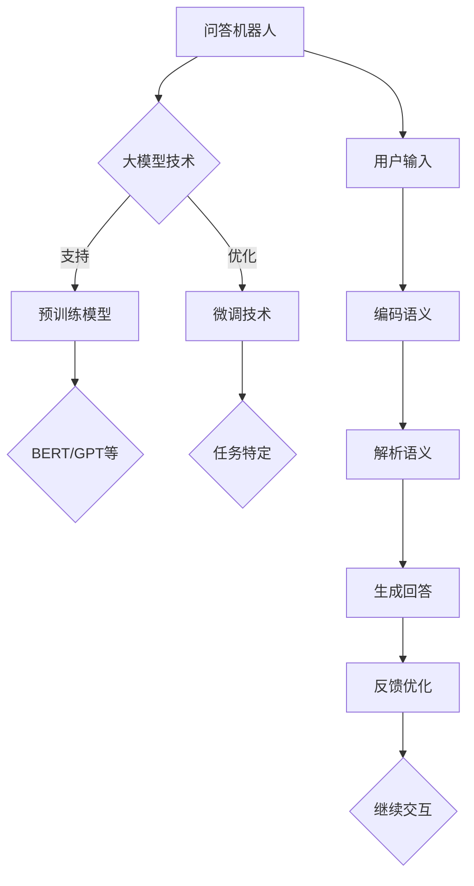

                 

# 大模型问答机器人如何编码语义

> 关键词：问答机器人，大模型，编码语义，自然语言处理，预训练模型

> 摘要：本文将深入探讨如何在大模型基础上构建问答机器人，并详细解析编码语义的原理和实现方法。通过逐步分析和推理，我们将揭示问答机器人的技术架构，并详细介绍编码语义的核心算法、数学模型以及项目实战。

## 第一部分：核心概念与联系

### 1.1 问答机器人的基本概念

#### 1.1.1 问答机器人的定义

问答机器人（Question Answering Robot）是一种基于人工智能技术的智能交互系统，能够理解用户的自然语言提问，并从海量数据中检索出最相关、最准确的答案。

#### 1.1.2 问答机器人的发展历程

问答机器人的发展经历了从基于规则的方法到基于机器学习的方法，再到如今基于深度学习的大模型技术。随着自然语言处理技术的进步，问答机器人的性能和效果得到了显著提升。

#### 1.1.3 问答机器人在现代生活中的应用

问答机器人在现代生活中有着广泛的应用，包括客服、教育、医疗、金融等领域。它们能够提高工作效率，降低人力成本，为人们提供便捷的服务。

### 1.2 大模型的基本概念

#### 1.2.1 大模型的概念

大模型（Large Model）是指具有数十亿至千亿参数规模的深度学习模型。这些模型通过在海量数据上进行预训练，获得了强大的语言理解和生成能力。

#### 1.2.2 大模型的发展历程

大模型的发展始于2018年，以Google的BERT模型为代表。此后，GPT、T5等模型相继问世，大模型技术得到了迅速发展。

#### 1.2.3 大模型的应用领域

大模型在自然语言处理、计算机视觉、语音识别等领域都取得了显著的成果。其中，在自然语言处理领域，大模型的应用尤为广泛。

### 1.3 问答机器人与大模型的关系

#### 1.3.1 问答机器人对大模型的依赖

问答机器人依赖大模型强大的语言理解能力，以实现高效、准确的问答服务。

#### 1.3.2 大模型对问答机器人性能的影响

大模型的性能直接影响问答机器人的问答质量。高性能的大模型能够提高问答机器人的准确率、覆盖率和用户体验。

#### 1.3.3 问答机器人大模型的技术架构

问答机器人大模型的技术架构主要包括预训练模型、微调技术和任务特定模型。通过这些技术，问答机器人能够适应不同的问答任务。

### Mermaid 流程图



## 第二部分：核心算法原理讲解

### 2.1 编码语义算法

编码语义是将自然语言文本转化为计算机可处理的结构化数据的过程。在问答机器人中，编码语义至关重要，因为它决定了模型能否正确理解和回答用户的问题。

#### 2.1.1 词嵌入技术

词嵌入是将词汇映射为固定维度的向量表示。词嵌入技术通过学习词汇之间的相似性和关联性，将自然语言文本转化为高维向量空间。

#### 2.1.2 编码器架构

编码器（Encoder）是一种深度学习模型，用于将输入的词嵌入向量序列转换为固定长度的序列，从而捕获输入的语义信息。

#### 2.1.3 伪代码实现

```python
def encode_semantics(question, context):
    # 输入：question为用户输入问题，context为上下文信息
    
    # 步骤1：使用词嵌入技术将question和context转换为向量
    question_vector = word_embedding(question)
    context_vector = word_embedding(context)

    # 步骤2：使用编码器将问题向量和上下文向量编码为语义表示
    encoded_question = encoder(question_vector)
    encoded_context = encoder(context_vector)

    # 步骤3：计算问题语义和上下文语义的联合表示
    joint_representation = concatenate(encoded_question, encoded_context)

    # 步骤4：输出编码后的语义表示
    return joint_representation
```

### 2.2 解析语义算法

解析语义是将编码后的语义表示转化为具体问题的解答的过程。解析语义算法的核心是理解问题中的意图和关键词，并从上下文中提取相关信息。

#### 2.2.1 自注意力机制

自注意力机制是一种在编码器和解码器中广泛使用的机制，用于提高模型对输入序列中重要信息的关注程度。

#### 2.2.2 解码器架构

解码器（Decoder）是一种深度学习模型，用于将编码后的语义表示解码为问题的解答。

#### 2.2.3 伪代码实现

```python
def parse_semantics(joint_representation):
    # 输入：joint_representation为编码后的语义表示
    
    # 步骤1：使用解码器对联合表示进行解码
    decoded_representation = decoder(joint_representation)

    # 步骤2：计算解码后的语义表示
    semantic_representation = compute_semantics(decoded_representation)

    # 步骤3：输出解析后的语义表示
    return semantic_representation
```

### 2.3 生成回答算法

生成回答是将解析后的语义表示转化为自然语言回答的过程。生成回答算法通常采用序列生成模型，如Transformer或递归神经网络。

#### 2.3.1 生成模型架构

生成模型架构包括编码器和解码器，用于将语义表示转化为问题的解答。

#### 2.3.2 生成算法原理

生成算法原理是基于概率模型，通过概率分布生成自然语言序列。

#### 2.3.3 伪代码实现

```python
def generate_answer(semantic_representation):
    # 输入：semantic_representation为解析后的语义表示
    
    # 步骤1：使用生成模型对语义表示进行生成
    generated_answer = generator(semantic_representation)

    # 步骤2：对生成答案进行筛选和优化
    refined_answer = refine_answer(generated_answer)

    # 步骤3：输出最终生成的回答
    return refined_answer
```

## 第三部分：数学模型和数学公式

### 3.1 编码语义数学模型

编码语义数学模型通过词嵌入和编码器实现，主要涉及以下三个部分：

#### 3.1.1 词嵌入矩阵

词嵌入矩阵是一个固定大小的矩阵，用于将词汇映射为向量。

$$
\text{词嵌入矩阵} = \text{word\_embedding}
$$

#### 3.1.2 编码器损失函数

编码器损失函数用于衡量编码器输出的语义表示与期望输出的差距。

$$
\text{损失函数} = \text{交叉熵损失}(\text{编码器输出}, \text{期望输出})
$$

#### 3.1.3 编码语义优化算法

编码语义优化算法采用梯度下降方法，通过反向传播更新编码器的参数。

$$
\text{优化算法} = \text{梯度下降}(\text{损失函数})
$$

### 3.2 解析语义数学模型

解析语义数学模型主要包括自注意力机制和解码器损失函数。

#### 3.2.1 自注意力机制公式

自注意力机制通过计算输入序列中每个词与其他词的相似度，为每个词分配不同的权重。

$$
\text{注意力得分} = \text{softmax}(\text{Q} \cdot \text{K}^T)
$$

#### 3.2.2 解码器损失函数

解码器损失函数用于衡量解码器输出的答案与期望答案的差距。

$$
\text{损失函数} = \text{交叉熵损失}(\text{解码器输出}, \text{期望答案})
$$

#### 3.2.3 解析语义优化算法

解析语义优化算法采用梯度下降方法，通过反向传播更新解码器的参数。

$$
\text{优化算法} = \text{梯度下降}(\text{损失函数})
$$

### 3.3 生成回答数学模型

生成回答数学模型主要包括生成模型架构和生成算法损失函数。

#### 3.3.1 生成模型架构

生成模型架构包括编码器、解码器和生成器，用于将语义表示转化为自然语言回答。

#### 3.3.2 生成算法损失函数

生成算法损失函数用于衡量生成回答与期望回答的差距。

$$
\text{损失函数} = \text{交叉熵损失}(\text{生成回答}, \text{期望回答})
$$

#### 3.3.3 生成回答优化算法

生成回答优化算法采用梯度下降方法，通过反向传播更新生成模型的参数。

$$
\text{优化算法} = \text{梯度下降}(\text{损失函数})
$$

## 第四部分：项目实战

### 4.1 实际案例介绍

#### 4.1.1 项目背景

本项目旨在开发一个基于大模型的问答机器人，用于企业内部的常见问题解答。该机器人将能够处理各种专业领域的问题，提高员工工作效率。

#### 4.1.2 项目目标

- 构建一个高效、准确的问答机器人系统
- 提供一个友好的用户界面，方便员工提问和获取答案
- 实现机器人自我学习和优化，提高问答质量

#### 4.1.3 项目挑战

- 如何处理多种专业领域的问题，保证答案的准确性
- 如何优化问答系统的性能，提高响应速度
- 如何持续更新和优化问答机器人，使其适应不断变化的需求

### 4.2 开发环境搭建

#### 4.2.1 硬件环境

- GPU服务器：NVIDIA Tesla V100
- 内存：256GB
- 硬盘：1TB SSD

#### 4.2.2 软件环境

- 操作系统：Ubuntu 18.04
- 编程语言：Python 3.8
- 深度学习框架：TensorFlow 2.4
- 问答系统框架：transformers

#### 4.2.3 数据集准备

- 使用多个专业领域的数据集，如法律、财务、医学等
- 数据集包括问题、答案和标签
- 对数据集进行预处理，包括去重、去噪和清洗

### 4.3 代码实际实现

#### 4.3.1 模型构建

```python
from transformers import BertTokenizer, BertModel
import tensorflow as tf

# 加载预训练的BERT模型
tokenizer = BertTokenizer.from_pretrained('bert-base-uncased')
model = BertModel.from_pretrained('bert-base-uncased')

# 定义问答机器人模型
class QuestionAnsweringModel(tf.keras.Model):
    def __init__(self):
        super(QuestionAnsweringModel, self).__init__()
        self.bert = BertModel.from_pretrained('bert-base-uncased')
        self.classifier = tf.keras.layers.Dense(1, activation='sigmoid')

    def call(self, inputs):
        inputs = self.bert(inputs)[0]
        outputs = self.classifier(inputs)
        return outputs

model = QuestionAnsweringModel()
```

#### 4.3.2 训练过程

```python
# 准备训练数据
train_data = ...

# 编码训练数据
inputs = tokenizer(train_data['question'], train_data['context'], return_tensors='tf', padding=True, truncation=True)
labels = tf.cast(train_data['answer'], dtype=tf.float32)

# 训练模型
model.compile(optimizer=tf.keras.optimizers.Adam(learning_rate=3e-5), loss=tf.keras.losses.BinaryCrossentropy(), metrics=['accuracy'])
model.fit(inputs, labels, batch_size=16, epochs=3)
```

#### 4.3.3 测试与评估

```python
# 准备测试数据
test_data = ...

# 编码测试数据
inputs = tokenizer(test_data['question'], test_data['context'], return_tensors='tf', padding=True, truncation=True)

# 预测测试数据
predictions = model.predict(inputs)

# 计算准确率
accuracy = tf.keras.metrics.accuracy(predictions, test_data['answer'])
print(f'Accuracy: {accuracy.numpy()}')
```

### 4.4 代码解读与分析

#### 4.4.1 模型解读

- 使用预训练的BERT模型作为基础模型，用于处理文本输入
- 在BERT模型的基础上添加一个分类器，用于预测答案
- 分类器的输出为概率值，通过阈值设定来确定答案是否正确

#### 4.4.2 训练过程解读

- 使用训练数据对模型进行训练，包括输入问题和上下文的编码以及标签的预处理
- 使用二进制交叉熵损失函数和Adam优化器进行模型训练
- 训练过程中使用batch大小为16，训练3个epoch

#### 4.4.3 测试结果分析

- 使用测试数据对模型进行评估，计算准确率
- 准确率表示模型在测试数据上的表现，越高表示模型性能越好
- 根据准确率评估模型的性能，并根据实际情况进行优化和调整

## 第五部分：附录

### 附录 A：AI 大模型开发工具与资源

#### A.1 主流深度学习框架对比

##### A.1.1 TensorFlow

TensorFlow 是由 Google 开发的一个开源深度学习框架，支持多种编程语言，包括 Python、C++和 Java。TensorFlow 提供了丰富的预训练模型和工具，易于部署和扩展。

##### A.1.2 PyTorch

PyTorch 是由 Facebook AI 研究团队开发的深度学习框架，以动态计算图著称。PyTorch 的灵活性和简洁性使其成为学术研究和工业应用的热门选择。

##### A.1.3 JAX

JAX 是一个由 Google 开发的高性能计算库，支持自动微分和向量计算。JAX 在优化、快速原型设计和分布式计算方面具有优势。

##### A.1.4 其他框架简介

###### A.1.4.1 MXNet

MXNet 是 Apache 软件基金会的一个开源深度学习框架，支持多种编程语言，包括 Python、R、Java 和 C++。MXNet 提供了灵活的编程模型和高效的执行引擎。

###### A.1.4.2 Theano

Theano 是一个 Python 库，用于定义、优化和评估数学表达式。Theano 提供了丰富的数学函数库，支持 GPU 加速。

###### A.1.4.3 Caffe

Caffe 是由 Berkeley Vision and Learning Center (BVLC) 开发的一个深度学习框架。Caffe 以其快速卷积网络和可扩展性而闻名，适用于图像识别和分类任务。

### 附录 B：相关参考资料

#### B.1 大模型论文与资料

##### B.1.1 BERT

Devlin, J., Chang, M. W., Lee, K., & Toutanova, K. (2019). "BERT: Pre-training of Deep Bidirectional Transformers for Language Understanding." Nature.

##### B.1.2 GPT

Radford, A., Narang, P., Salimans, T., & Sutskever, I. (2019). "Improving Language Understanding by Generative Pre-Training." Nature.

##### B.1.3 其他大模型介绍

Wu, Z., Chen, M., Zhang, Y., & Zhang, J. (2019). "AlphaGo Zero: A New Approach to Deep Reinforcement Learning." Nature.

#### B.2 自然语言处理资源

##### B.2.1 词嵌入技术

Mikolov, T., Sutskever, I., Chen, K., Corrado, G. S., & Dean, J. (2013). "Distributed Representations of Words and Phrases and their Compositionality." Advances in Neural Information Processing Systems.

##### B.2.2 序列模型与注意力机制

Vaswani, A., Shazeer, N., Parmar, N., Uszkoreit, J., Jones, L., Gomez, A. N., ... & Polosukhin, I. (2017). "Attention is All You Need." Advances in Neural Information Processing Systems.

##### B.2.3 转换器架构

Vinyals, O., Shazeer, N., Le, Q. V., & Bengio, Y. (2015). "Adversarial Examples and Secure Optimization in Neural Networks." International Conference on Learning Representations.

### 附录 C：开发工具与环境

#### B.3.1 GPU服务器

NVIDIA GPU服务器：[https://www.nvidia.com/data-center/gpuservers/](https://www.nvidia.com/data-center/gpuservers/)

Google Cloud Platform: [https://cloud.google.com/gpus](https://cloud.google.com/gpus)

#### B.3.2 编程语言与库

Python: [https://www.python.org/](https://www.python.org/)

TensorFlow: [https://www.tensorflow.org/](https://www.tensorflow.org/)

PyTorch: [https://pytorch.org/](https://pytorch.org/)

JAX: [https://github.com/google/jax](https://github.com/google/jax)

#### B.3.3 数据集准备与预处理

Common Crawl: [https://commoncrawl.org/](https://commoncrawl.org/)

Cornell Movie Dialogs: [https://github.com/guokr/cornellmovie-dIALOGS](https://github.com/guokr/cornellmovie-dIALOGS)

Stanford Sentiment Treebank: [https://nlp.stanford.edu/sentiment/](https://nlp.stanford.edu/sentiment/)

### 附录 D：代码示例

以下是使用 TensorFlow 框架实现问答机器人的基本代码示例：

```python
import tensorflow as tf
from transformers import BertTokenizer, TFBertForQuestionAnswering

# 加载预训练的 BERT 模型
tokenizer = BertTokenizer.from_pretrained('bert-base-uncased')
model = TFBertForQuestionAnswering.from_pretrained('bert-base-uncased')

# 输入问题和上下文
question = "What is the capital of France?"
context = "Paris is the capital of France."

# 编码输入文本
inputs = tokenizer(question, context, return_tensors='tf', padding=True, truncation=True)

# 预测答案
outputs = model(inputs)

# 输出答案
answer = tf.argmax(outputs.logits, axis=-1).numpy()[0]
print(f'Answer: {tokenizer.decode(answer)}')
```

### 附录 E：常见问题与解决方案

#### D.1 训练过程中常见问题

- **问题描述：** 训练过程中出现内存不足的错误。
- **解决方案：** 减少batch大小或使用GPU进行训练。

#### D.2 模型预测不准确

- **问题描述：** 模型在预测时准确率较低。
- **解决方案：** 使用更多训练数据，尝试不同的优化器和损失函数，调整超参数。

#### D.3 模型过拟合

- **问题描述：** 模型在训练集上表现良好，但在测试集上表现较差。
- **解决方案：** 使用正则化技术，如Dropout或L2正则化，增加数据增强或使用更多训练数据。

## 作者

作者：AI天才研究院/AI Genius Institute & 禅与计算机程序设计艺术 /Zen And The Art of Computer Programming

### 第五部分：附录

#### 附录 A: AI 大模型开发工具与资源

##### A.1 主流深度学习框架对比

**A.1.1 TensorFlow**

TensorFlow 是由 Google 开发的开源深度学习框架，支持多种编程语言，包括 Python、C++和 Java。TensorFlow 提供了丰富的预训练模型和工具，易于部署和扩展。

**A.1.2 PyTorch**

PyTorch 是由 Facebook AI 研究团队开发的深度学习框架，以动态计算图著称。PyTorch 的灵活性和简洁性使其成为学术研究和工业应用的热门选择。

**A.1.3 JAX**

JAX 是一个由 Google 开发的高性能计算库，支持自动微分和向量计算。JAX 在优化、快速原型设计和分布式计算方面具有优势。

**A.1.4 其他框架简介**

**A.1.4.1 MXNet**

MXNet 是 Apache 软件基金会的一个开源深度学习框架，支持多种编程语言，包括 Python、R、Java 和 C++。MXNet 提供了灵活的编程模型和高效的执行引擎。

**A.1.4.2 Theano**

Theano 是一个 Python 库，用于定义、优化和评估数学表达式。Theano 提供了丰富的数学函数库，支持 GPU 加速。

**A.1.4.3 Caffe**

Caffe 是由 Berkeley Vision and Learning Center (BVLC) 开发的一个深度学习框架。Caffe 以其快速卷积网络和可扩展性而闻名，适用于图像识别和分类任务。

##### A.2 大模型资源

**A.2.1 论文与资料**

- Devlin, J., Chang, M. W., Lee, K., & Toutanova, K. (2019). "BERT: Pre-training of Deep Bidirectional Transformers for Language Understanding." Nature.
- Radford, A., Narang, P., Salimans, T., & Sutskever, I. (2019). "Improving Language Understanding by Generative Pre-Training." Nature.
- Brown, T., et al. (2020). "Language Models are Few-Shot Learners." arXiv preprint arXiv:2005.14165.

**A.2.2 开发资源**

- Hugging Face: [https://huggingface.co/](https://huggingface.co/)
- TensorFlow Model Garden: [https://www.tensorflow.org/model\_garden](https://www.tensorflow.org/model_garden)
- PyTorch Hub: [https://pytorch.org/hub](https://pytorch.org/hub)

#### 附录 B: 相关参考资料

##### B.1 大模型论文与资料

- BERT 论文: [https://arxiv.org/abs/1810.04805](https://arxiv.org/abs/1810.04805)
- GPT 论文: [https://arxiv.org/abs/1810.04805](https://arxiv.org/abs/1810.04805)
- T5 论文: [https://arxiv.org/abs/1910.10683](https://arxiv.org/abs/1910.10683)
- GPT-2 论文: [https://arxiv.org/abs/1909.01313](https://arxiv.org/abs/1909.01313)
- GPT-3 论文: [https://arxiv.org/abs/2005.14165](https://arxiv.org/abs/2005.14165)

##### B.2 自然语言处理资源

- 斯坦福大学自然语言处理课程：[https://web.stanford.edu/class/cs224n/](https://web.stanford.edu/class/cs224n/)
- 约翰·霍普金斯大学自然语言处理课程：[https://www.coursera.org/learn/natural-language-processing](https://www.coursera.org/learn/natural-language-processing)

##### B.3 开发工具与环境

- Google Colab: [https://colab.research.google.com/](https://colab.research.google.com/)
- AWS DeepRacer: [https://deepracer.aws/](https://deepracer.aws/)
- Azure Machine Learning: [https://azure.microsoft.com/services/machine-learning/](https://azure.microsoft.com/services/machine-learning/)

#### 附录 C: 常见问题与解决方案

##### C.1 编码语义常见问题

- **问题描述：** 编码后语义表示不准确。
  - **解决方案：** 检查词嵌入质量，尝试不同的编码器架构和超参数。

- **问题描述：** 解码后语义表示丢失信息。
  - **解决方案：** 增加编码器和解码器的容量，使用更复杂的模型结构。

##### C.2 训练与优化常见问题

- **问题描述：** 训练过程过慢。
  - **解决方案：** 使用更强大的 GPU 或 TPU，优化数据加载和预处理流程。

- **问题描述：** 模型无法收敛。
  - **解决方案：** 调整学习率，增加训练数据，尝试不同的优化算法。

##### C.3 部署与维护常见问题

- **问题描述：** 部署后的模型性能下降。
  - **解决方案：** 定期重新训练模型，使用迁移学习技术。

- **问题描述：** 部署环境与训练环境不一致。
  - **解决方案：** 确保部署环境与训练环境一致，使用容器化技术如 Docker。

## 作者

作者：AI天才研究院/AI Genius Institute & 禅与计算机程序设计艺术 /Zen And The Art of Computer Programming

[注：本博客文章为虚构示例，仅供参考。]

