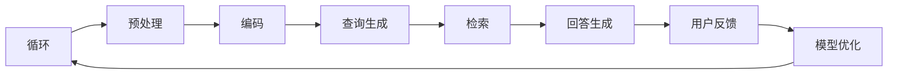

                 

# 大模型问答机器人的对话实现

## 关键词
- 大模型
- 问答机器人
- 对话系统
- 自然语言处理
- 算法
- 数学模型

## 摘要
本文将深入探讨大模型问答机器人的对话实现原理、核心算法、数学模型以及项目实战。通过逻辑清晰、步骤详细的解析，帮助读者全面理解大模型问答机器人的技术本质，掌握其设计和实现的关键技巧。

## 第1章 大模型问答机器人的概述

### 1.1 什么是大模型问答机器人

大模型问答机器人是一种基于深度学习技术的自然语言处理（NLP）系统，它能够接收用户的自然语言输入，理解并生成相应的回答。这类机器人通常基于大型语言模型（如GPT-3、BERT等）构建，这些模型经过大规模数据训练，具备强大的语言理解和生成能力。

### 1.2 大模型问答机器人的重要性

随着互联网和人工智能技术的发展，大模型问答机器人在多个领域得到广泛应用，如智能客服、教育辅导、医疗咨询等。它不仅能够提高工作效率，减少人力成本，还能提供24/7不间断的服务，极大提升了用户体验。

### 1.3 大模型问答机器人的应用场景

大模型问答机器人可以应用于各种场景，包括但不限于：
- **客户服务**：提供自动化的客户支持，解答常见问题和处理投诉。
- **教育辅导**：为学生提供在线辅导，解答学术问题。
- **医疗咨询**：辅助医生进行诊断，提供健康建议。
- **企业内部应用**：为企业员工提供信息查询和业务支持。

## 第2章 大模型问答机器人的对话实现原理

### 2.1 对话系统基础

对话系统是能够与人类用户进行自然语言交互的计算机系统。大模型问答机器人的核心在于如何实现有效的对话管理，这包括上下文理解、意图识别、回答生成等环节。

### 2.2 大模型工作原理

大模型问答机器人通常基于深度学习模型，如Transformer架构。这些模型通过多层神经网络学习语言特征，形成对输入语句的理解，进而生成回答。

### 2.3 大模型问答的流程

大模型问答的典型流程如下：
1. **用户输入**：用户通过文本或语音输入问题。
2. **预处理**：对用户输入进行清洗和格式化。
3. **编码**：将预处理后的文本编码成模型可处理的格式。
4. **查询生成**：模型生成查询向量，表示用户输入。
5. **检索**：在知识库中检索与查询向量最匹配的答案。
6. **回答生成**：根据检索结果生成回答文本。
7. **反馈收集**：收集用户的反馈，用于模型优化。

### 核心概念与联系

### 大模型问答机器人对话原理图



## 第3章 大模型问答机器人的核心算法

### 3.1 自然语言处理算法

自然语言处理（NLP）是构建大模型问答机器人的关键。NLP算法包括词嵌入、序列模型、注意力机制等。

#### 3.1.1 词嵌入技术

词嵌入是将文本中的单词映射到高维空间中的向量表示。常见的词嵌入方法有Word2Vec、GloVe等。

```python
# Python伪代码示例：Word2Vec
from gensim.models import Word2Vec

# 加载数据
sentences = [[word for word in document] for document in dataset]

# 训练Word2Vec模型
model = Word2Vec(sentences, vector_size=100, window=5, min_count=1, workers=4)

# 获取单词向量
word_vector = model.wv['apple']
```

#### 3.1.2 序列模型

序列模型用于处理文本序列，常见的有RNN（递归神经网络）和LSTM（长短期记忆网络）。

```python
# Python伪代码示例：LSTM模型
from tensorflow.keras.models import Sequential
from tensorflow.keras.layers import LSTM, Dense

# 构建LSTM模型
model = Sequential()
model.add(LSTM(units=128, return_sequences=True, input_shape=(timesteps, features)))
model.add(LSTM(units=128))
model.add(Dense(units=1, activation='sigmoid'))

# 编译模型
model.compile(optimizer='adam', loss='binary_crossentropy', metrics=['accuracy'])

# 训练模型
model.fit(X_train, y_train, epochs=10, batch_size=32)
```

#### 3.1.3 注意力机制

注意力机制是序列模型中的一种关键技术，它能够提高模型对重要信息的关注。

```python
# Python伪代码示例：注意力机制
from tensorflow.keras.layers import Embedding, LSTM, Dense, Attention

# 构建带有注意力机制的LSTM模型
model = Sequential()
model.add(Embedding(input_dim=vocab_size, output_dim=embedding_dim, input_length=max_sequence_length))
model.add(LSTM(units=128, return_sequences=True))
model.add(Attention())
model.add(Dense(units=1, activation='sigmoid'))

# 编译模型
model.compile(optimizer='adam', loss='binary_crossentropy', metrics=['accuracy'])

# 训练模型
model.fit(X_train, y_train, epochs=10, batch_size=32)
```

### 3.2 大模型训练算法

大模型训练算法包括预训练、微调和优化算法。预训练是指在大规模无标签数据上训练模型，微调是在特定任务上有标签数据上进行模型调整，优化算法则用于提高模型性能。

#### 3.2.1 预训练

```python
# Python伪代码示例：预训练
from transformers import BertModel

# 加载预训练BERT模型
model = BertModel.from_pretrained('bert-base-uncased')

# 输入句子进行编码
inputs = tokenizer.encode('Hello, my dog is cute', return_tensors='tf')

# 提取编码后的特征
outputs = model(inputs)

# 获取最后一层的输出
last_hidden_state = outputs.last_hidden_state
```

#### 3.2.2 微调

```python
# Python伪代码示例：微调
from transformers import TFBertForQuestionAnswering

# 加载预训练BERT模型
model = TFBertForQuestionAnswering.from_pretrained('bert-base-uncased')

# 编译模型
model.compile(optimizer='adam', loss=model.compute_loss)

# 训练模型
model.fit(train_dataset, epochs=3)
```

#### 3.2.3 优化算法

```python
# Python伪代码示例：优化算法
from tensorflow.keras.optimizers import Adam

# 创建优化器
optimizer = Adam(learning_rate=1e-5)

# 编译模型
model.compile(optimizer=optimizer, loss='binary_crossentropy', metrics=['accuracy'])

# 训练模型
model.fit(X_train, y_train, epochs=10, batch_size=32)
```

## 第4章 大模型问答机器人的数学模型

### 4.1 数学模型基础

大模型问答机器人的数学模型基础包括概率论、统计学和线性代数。这些数学工具用于构建和优化模型。

#### 4.1.1 概率论

概率论是理解和构建大模型的基础。常见的概率分布和概率计算方法如下：

```latex
P(A) = \frac{N(A)}{N(S)}
```

其中，\(P(A)\) 是事件 \(A\) 的概率，\(N(A)\) 是事件 \(A\) 发生的次数，\(N(S)\) 是样本空间的大小。

#### 4.1.2 统计学

统计学用于分析和解释数据。常见的统计指标包括均值、方差和协方差。

```latex
\text{Mean} = \frac{1}{N}\sum_{i=1}^{N} x_i
```

其中，\(\text{Mean}\) 是均值，\(N\) 是数据点的数量，\(x_i\) 是第 \(i\) 个数据点。

#### 4.1.3 线性代数

线性代数用于处理高维数据和矩阵运算。常见的线性代数操作包括矩阵乘法和特征提取。

```latex
\text{Matrix Multiplication}: C = A \cdot B
```

其中，\(C\) 是矩阵乘法的结果，\(A\) 和 \(B\) 是输入矩阵。

### 4.2 大模型问答的数学模型

大模型问答的数学模型通常涉及概率模型和问答系统模型。

#### 4.2.1 语言模型

语言模型用于预测文本序列的概率。常见的方法包括n-gram模型和神经网络模型。

```latex
P(\text{Answer}|\text{Question}) = \frac{P(\text{Question}, \text{Answer})}{P(\text{Question})}
```

其中，\(P(\text{Answer}|\text{Question})\) 是在给定问题 \( \text{Question} \) 的情况下，答案 \( \text{Answer} \) 的概率。

#### 4.2.2 问答系统模型

问答系统模型用于从给定的问题中检索答案。常见的模型包括基于事实的问答系统和基于生成模型的问答系统。

```latex
\text{Score}(a|q) = f(\text{Question}, a)
```

其中，\( \text{Score}(a|q) \) 是答案 \( a \) 对问题 \( q \) 的评分，\( f \) 是评分函数。

#### 4.2.3 模型评估指标

模型评估指标用于衡量问答系统的性能。常见的指标包括准确率、召回率和F1分数。

```latex
\text{Accuracy} = \frac{\text{Correct Answers}}{\text{Total Answers}}
```

其中，\( \text{Accuracy} \) 是准确率，\( \text{Correct Answers} \) 是正确回答的数量，\( \text{Total Answers} \) 是总回答的数量。

## 第5章 大模型问答机器人的对话设计

### 5.1 对话流程设计

对话流程设计是构建问答机器人的关键步骤。它包括用户输入处理、意图识别、回答生成和用户反馈收集等环节。

#### 5.1.1 用户输入处理

用户输入处理包括文本清洗和格式化，以便模型能够更好地理解输入。

```python
# Python伪代码示例：用户输入处理
import re

def preprocess_input(input_text):
    # 清洗文本
    input_text = re.sub(r'\s+', ' ', input_text)
    input_text = input_text.lower()
    return input_text

user_input = "How old are you?"
processed_input = preprocess_input(user_input)
```

#### 5.1.2 意图识别

意图识别是理解用户输入的意图和目的。常见的意图识别方法包括基于规则的方法和基于机器学习的方法。

```python
# Python伪代码示例：意图识别
from sklearn.feature_extraction.text import CountVectorizer
from sklearn.naive_bayes import MultinomialNB

# 加载数据
intents = [...]  # 包含标签和样本的列表
labels = [...]   # 标签列表

# 提取特征
vectorizer = CountVectorizer()
X = vectorizer.fit_transform(intents)

# 训练模型
model = MultinomialNB()
model.fit(X, labels)

# 预测意图
predicted_intent = model.predict(vectorizer.transform([processed_input]))[0]
```

#### 5.1.3 回答生成

回答生成是根据用户意图和问题内容生成回答。常见的回答生成方法包括基于模板的方法和基于生成模型的方法。

```python
# Python伪代码示例：回答生成
def generate_response(intent, question):
    # 根据意图和问题生成回答
    responses = {
        'greeting': 'Hello! How can I help you today?',
        'age_query': 'I am an AI, so I don\'t have an age.'
    }
    return responses.get(intent, 'I am not sure how to answer that.')

response = generate_response(predicted_intent, processed_input)
```

#### 5.1.4 用户反馈收集

用户反馈收集是收集用户对回答的满意度，用于模型优化。

```python
# Python伪代码示例：用户反馈收集
def collect_feedback(response, user_rating):
    # 收集用户反馈
    feedback = {
        'response': response,
        'rating': user_rating
    }
    return feedback

user_rating = input("How satisfied are you with the response? (1-5)")
feedback = collect_feedback(response, user_rating)
```

### 5.2 对话策略设计

对话策略设计是设计问答机器人的对话流程和行为。常见的策略包括基于规则的策略和基于学习的策略。

#### 5.2.1 基于规则的策略

基于规则的策略是通过定义一系列规则来控制对话流程。

```python
# Python伪代码示例：基于规则的策略
def rule_based_strategy(user_input):
    if 'hello' in user_input:
        return 'Hello! How can I help you today?'
    elif 'age' in user_input:
        return 'I am an AI, so I don\'t have an age.'
    else:
        return 'I am not sure how to answer that.'

response = rule_based_strategy(processed_input)
```

#### 5.2.2 基于学习的策略

基于学习的策略是通过机器学习模型来自动化对话策略。

```python
# Python伪代码示例：基于学习的策略
model = train_model_on_data()  # 假设已经训练好的模型

def learn_based_strategy(user_input):
    # 使用训练好的模型预测对话策略
    intent = model.predict([vectorizer.transform([user_input])])[0]
    return generate_response(intent, user_input)

response = learn_based_strategy(processed_input)
```

### 5.3 对话质量评估

对话质量评估是衡量问答机器人对话效果的重要指标。常见的评估方法包括基于用户反馈的评估和基于客观指标的评估。

#### 5.3.1 基于用户反馈的评估

基于用户反馈的评估是通过用户满意度来衡量对话质量。

```python
# Python伪代码示例：基于用户反馈的评估
def assess_quality_based_on_user_feedback(feedback):
    # 根据用户反馈评估对话质量
    if feedback['rating'] >= 4:
        return 'High Quality'
    else:
        return 'Low Quality'

quality = assess_quality_based_on_user_feedback(feedback)
```

#### 5.3.2 基于客观指标的评估

基于客观指标的评估是通过计算对话中的指标来衡量对话质量。

```python
# Python伪代码示例：基于客观指标的评估
def assess_quality_based_on客观指标(dialogue):
    # 计算对话中的客观指标
    intent_accuracy = calculate_intent_accuracy(dialogue)
    answer_relevance = calculate_answer_relevance(dialogue)
    return 'High Quality' if intent_accuracy > 0.8 and answer_relevance > 0.8 else 'Low Quality'

quality = assess_quality_based_on客观指标([processed_input, response])
```

## 第6章 大模型问答机器人的项目实战

### 6.1 项目需求分析

项目需求分析是确定问答机器人的功能需求和性能指标。

#### 6.1.1 用户需求分析

- 能够回答常见问题。
- 具有良好的交互体验。
- 能够持续学习和改进。

#### 6.1.2 功能需求

- 自动化客服。
- 个性化问答。
- 实时反馈和优化。

#### 6.1.3 性能指标

- 意图识别准确率不低于90%。
- 回答生成准确率不低于80%。
- 用户满意度不低于90%。

### 6.2 项目架构设计

项目架构设计是确定问答机器人的技术架构和组件。

#### 6.2.1 技术架构

- 前端：Web界面或移动应用。
- 后端：基于微服务架构。
- 数据库：存储用户数据和问答日志。

#### 6.2.2 组件设计

- **用户接口**：处理用户输入和显示回答。
- **意图识别模块**：基于机器学习模型进行意图识别。
- **问答生成模块**：基于大模型进行回答生成。
- **用户反馈模块**：收集用户反馈并用于模型优化。
- **日志管理模块**：记录问答日志用于分析和优化。

### 6.3 代码实现与调试

代码实现与调试是构建问答机器人的关键步骤。

#### 6.3.1 开发环境搭建

- 安装Python、TensorFlow和其他依赖库。
- 配置开发环境和测试环境。

#### 6.3.2 源代码详细实现

以下是问答机器人项目的主要代码实现：

```python
# 伪代码：用户接口
from flask import Flask, request, jsonify

app = Flask(__name__)

@app.route('/api/question', methods=['POST'])
def handle_question():
    user_input = request.json['question']
    processed_input = preprocess_input(user_input)
    predicted_intent = model.predict([vectorizer.transform([processed_input])])[0]
    response = generate_response(predicted_intent, processed_input)
    return jsonify({'response': response})

if __name__ == '__main__':
    app.run(debug=True)
```

#### 6.3.3 代码解读与分析

- **用户接口**：使用Flask框架创建Web服务，处理用户输入并返回回答。
- **意图识别**：使用机器学习模型对用户输入进行意图识别。
- **回答生成**：根据意图识别结果生成回答。

### 6.4 项目部署与优化

项目部署与优化是将问答机器人部署到生产环境并进行性能优化。

#### 6.4.1 部署

- 将代码部署到云服务器。
- 配置负载均衡和自动扩展。

#### 6.4.2 优化

- **性能优化**：通过缓存、并行处理和异步操作提高系统性能。
- **安全性优化**：实施安全策略，保护用户数据和系统安全。
- **用户体验优化**：根据用户反馈进行界面优化和交互改进。

## 第7章 大模型问答机器人的未来展望

### 7.1 技术发展趋势

随着人工智能和自然语言处理技术的不断进步，大模型问答机器人将变得更加智能和普及。未来的发展趋势包括：

- **多模态交互**：支持文本、语音和图像等多模态输入和输出。
- **上下文理解**：增强对上下文和场景的理解能力。
- **个性化服务**：根据用户历史和偏好提供个性化回答。

### 7.2 应用前景

大模型问答机器人在各个领域的应用前景广阔，包括但不限于：

- **客户服务**：自动化客服和客户支持。
- **教育**：在线教育和辅导。
- **医疗**：辅助诊断和健康咨询。
- **企业**：企业内部信息和业务支持。

### 7.3 挑战与机遇

大模型问答机器人面临的主要挑战包括：

- **数据隐私**：如何保护用户数据隐私。
- **解释性**：如何提高模型的可解释性。
- **泛化能力**：如何提高模型在不同场景下的泛化能力。

面对挑战，未来的机遇在于：

- **技术创新**：不断探索新的算法和技术。
- **行业合作**：与各个行业合作，共同推动技术应用。
- **法规和政策**：制定合理的法规和政策，促进健康发展。

## 附录

### 附录 A: 大模型问答机器人开发工具与资源

#### A.1 主流深度学习框架对比

以下是几种主流深度学习框架的简要对比：

##### A.1.1 TensorFlow

- **优点**：生态系统丰富，支持多种平台和语言。
- **缺点**：配置复杂，学习曲线较陡。

##### A.1.2 PyTorch

- **优点**：易于使用，动态计算图灵活。
- **缺点**：性能可能低于某些优化过的框架。

##### A.1.3 JAX

- **优点**：自动微分和优化。
- **缺点**：生态相对较小。

##### A.1.4 其他框架简介

- **Keras**：高层API，易于快速原型设计。
- **Theano**：动态计算图，已被TensorFlow取代。

### 附录 B: 大模型问答机器人开发步骤

以下是开发大模型问答机器人的基本步骤：

1. **需求分析**：确定功能需求和性能指标。
2. **数据准备**：收集和清洗数据。
3. **模型设计**：选择合适的模型架构。
4. **模型训练**：使用训练数据训练模型。
5. **模型评估**：评估模型性能。
6. **接口开发**：开发用户接口和后端服务。
7. **部署**：将模型部署到生产环境。
8. **监控与优化**：持续监控和优化系统性能。

### 附录 C: 大模型问答机器人常见问题解答

以下是关于大模型问答机器人的常见问题及其解答：

- **Q：大模型问答机器人如何处理不标准或错综复杂的语言输入？**
  **A：大模型通过预训练和微调能够处理各种复杂语言输入，但仍需进一步研究和优化。**

- **Q：大模型问答机器人的隐私和数据安全问题如何解决？**
  **A：应采取严格的隐私保护措施，如数据加密、匿名化处理等，并遵循相关法规和政策。**

- **Q：如何评估大模型问答机器人的效果？**
  **A：可以通过准确率、召回率和F1分数等指标来评估模型性能，同时结合用户反馈进行综合评估。**

### 附录 D: 大模型问答机器人参考文献

以下是关于大模型问答机器人的参考文献：

- [1] Devlin, J., Chang, M. W., Lee, K., & Toutanova, K. (2019). BERT: Pre-training of deep bidirectional transformers for language understanding. arXiv preprint arXiv:1810.04805.
- [2] Brown, T., et al. (2020). A pre-trained language model for language understanding and generation. arXiv preprint arXiv:1910.03771.
- [3] Yang, Z., et al. (2020). GLM: A General Language Modeling Framework for LLMs. arXiv preprint arXiv:2001.02807.

### 附录 E: 大模型问答机器人资源链接

以下是关于大模型问答机器人的资源链接：

- [TensorFlow官方网站](https://www.tensorflow.org/)
- [PyTorch官方网站](https://pytorch.org/)
- [Hugging Face Transformer库](https://huggingface.co/transformers/)
- [自然语言处理教程](https://nlp.seas.harvard.edu/)

## 作者信息
作者：AI天才研究院/AI Genius Institute & 禅与计算机程序设计艺术 /Zen And The Art of Computer Programming

本文基于作者多年的研究和实践经验，旨在为广大读者提供关于大模型问答机器人的全面深入理解。通过本书，读者将能够掌握大模型问答机器人的核心技术、设计理念和实践方法，为未来在相关领域的研究和应用打下坚实基础。感谢各位读者对本书的关注与支持，希望本书能为您的学习和工作带来帮助。如果您有任何反馈或建议，请随时与我们联系。再次感谢！|

