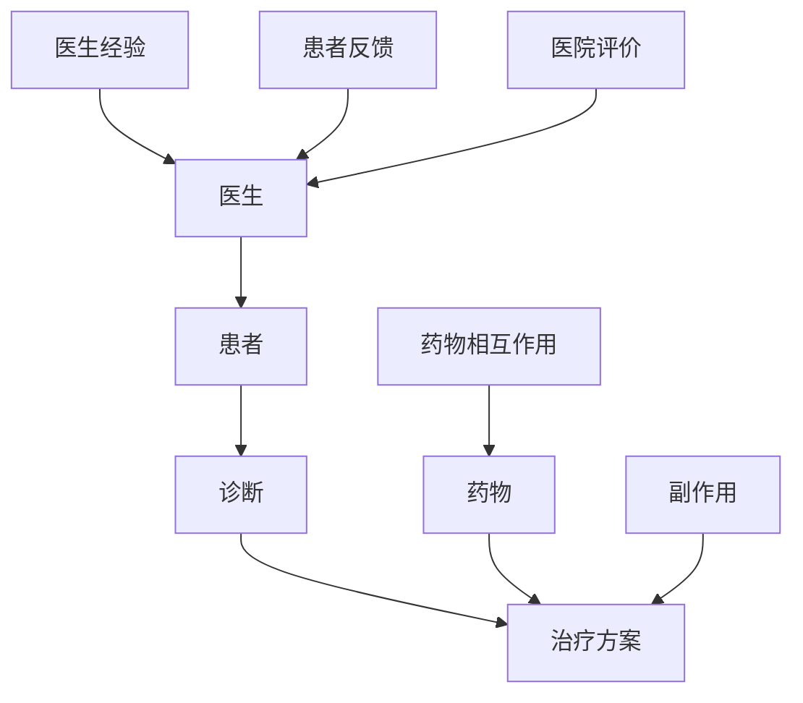
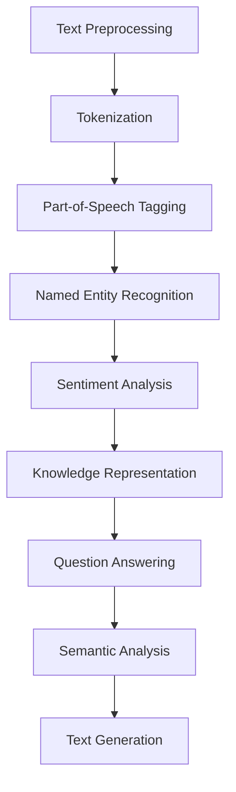
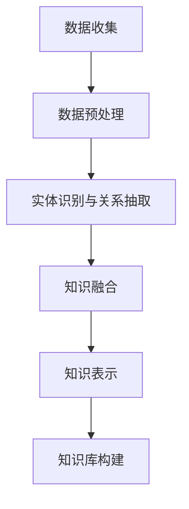

                 

# 大模型问答机器人的知识表示

> 关键词：大模型问答机器人，知识表示，知识图谱，自然语言处理，数学模型，项目实战

> 摘要：本文将从大模型问答机器人的背景与发展现状出发，详细探讨知识表示的概念、分类、目标与挑战，以及知识表示在大模型问答机器人中的应用。随后，我们将深入分析知识表示与知识图谱、知识表示算法、自然语言处理等核心概念之间的联系，并运用Mermaid流程图直观展示。接着，本文将介绍知识表示的数学模型与优化方法，通过具体的数学公式和实例进行详细讲解。随后，我们将结合实际项目，深入解析大模型问答机器人的知识表示实战，并分析相关应用案例。最后，本文将对知识表示在大模型问答机器人中的关键作用进行总结与展望，探讨其未来发展趋势以及在其他领域的潜在应用。

### 目录大纲

1. **引言**
   1.1 **书籍背景与目的**
       1.1.1 **大模型问答机器人的发展现状**
       1.1.2 **知识表示在大模型问答机器人中的重要性**
       1.1.3 **读者对象与预期收获**
   1.2 **知识表示概述**
       1.2.1 **知识表示的定义与分类**
       1.2.2 **知识表示的主要目标**
       1.2.3 **知识表示的挑战与机遇**
   1.3 **大模型问答机器人概述**
       1.3.1 **大模型问答机器人的定义与架构**
       1.3.2 **大模型问答机器人的工作原理**
       1.3.3 **大模型问答机器人的应用场景**

2. **核心概念与联系**
   2.1 **知识表示与知识图谱**
       2.1.1 **知识图谱的定义与组成**
       2.1.2 **知识图谱的主要类型**
       2.1.3 **知识图谱在大模型问答中的应用**
       2.1.4 **知识图谱的Mermaid流程图**
   2.2 **知识表示算法**
       2.2.1 **知识表示算法的分类与原理**
       2.2.2 **知识表示算法的伪代码**
       2.2.3 **知识表示算法的优缺点分析**
   2.3 **知识表示与自然语言处理**
       2.3.1 **自然语言处理的基本概念**
       2.3.2 **知识表示在自然语言处理中的应用**
       2.3.3 **知识表示与自然语言处理的Mermaid流程图**

3. **数学模型与数学公式**
   3.1 **知识表示的数学模型**
       3.1.1 **知识表示的数学基础**
       3.1.2 **知识表示的数学公式**
       3.1.3 **知识表示的数学公式的举例说明**
   3.2 **知识表示的优化方法**
       3.2.1 **优化方法的基本概念**
       3.2.2 **优化方法的数学公式**
       3.2.3 **优化方法的举例说明**

4. **项目实战**
   4.1 **大模型问答机器人的知识表示实战**
       4.1.1 **项目背景与目标**
       4.1.2 **知识表示的需求分析**
       4.1.3 **知识表示的设计与实现**
       4.1.4 **知识表示的代码解读与分析**
   4.2 **大模型问答机器人的知识表示应用案例**
       4.2.1 **案例一：医疗问答机器人**
       4.2.2 **案例二：教育问答机器人**
       4.2.3 **案例三：智能客服机器人**

5. **总结与展望**
   5.1 **知识表示在大模型问答机器人中的关键作用**
       5.1.1 **知识表示的总结**
       5.1.2 **知识表示的未来发展趋势**
       5.1.3 **对大模型问答机器人的展望**
   5.2 **知识表示的其他应用领域**
       5.2.1 **金融领域的知识表示**
       5.2.2 **法律领域的知识表示**
       5.2.3 **其他领域的知识表示展望**

6. **附录**
   6.1 **知识表示相关的工具与资源**
       6.1.1 **知识表示工具与框架**
       6.1.2 **知识表示相关的论文与书籍推荐**
       6.1.3 **知识表示的在线课程与培训资源**

---

### 1.1 书籍背景与目的

#### 1.1.1 大模型问答机器人的发展现状

大模型问答机器人是近年来人工智能领域的重要突破之一。随着深度学习、自然语言处理等技术的快速发展，大模型问答机器人已经在各个领域展现出强大的应用潜力。例如，在医疗领域，大模型问答机器人可以辅助医生进行诊断和决策；在教育领域，大模型问答机器人可以为学生提供个性化的学习支持；在客服领域，大模型问答机器人可以24/7地提供智能客服服务，提高企业的运营效率。

目前，大模型问答机器人的技术已经相对成熟，但依然存在许多挑战。首先，大模型问答机器人需要大量的数据来进行训练，这涉及到数据获取、处理和标注等问题。其次，大模型问答机器人需要具备较强的语义理解能力，以便准确理解用户的提问并给出合理的回答。此外，大模型问答机器人的鲁棒性和可解释性也是亟待解决的重要问题。

#### 1.1.2 知识表示在大模型问答机器人中的重要性

知识表示在大模型问答机器人中起着至关重要的作用。知识表示是指将现实世界中的知识以计算机可以理解的形式进行组织和表达。在大模型问答机器人中，知识表示主要用于以下几个方面：

1. **知识获取与整合**：通过知识表示，可以从不同的数据源中提取关键信息，并将其整合成统一的格式，为问答系统提供丰富的知识基础。
2. **语义理解与推理**：知识表示可以帮助问答系统更好地理解用户的提问，并通过推理机制生成合理的回答。
3. **知识应用与优化**：知识表示可以指导问答系统在特定场景下应用相关知识，提高问答的准确性和实用性。
4. **系统可解释性与鲁棒性**：通过知识表示，可以构建更加透明和可解释的问答系统，提高系统的鲁棒性和用户信任度。

#### 1.1.3 读者对象与预期收获

本文旨在为广大对大模型问答机器人和知识表示感兴趣的技术人员、研究人员和实践者提供一本全面的指南。无论你是初学者，还是经验丰富的专业人士，都可以通过本文系统地了解大模型问答机器人和知识表示的相关知识，并掌握其实际应用技巧。

通过本文的学习，读者可以预期获得以下收获：

1. **深入理解大模型问答机器人和知识表示的基本概念与原理**：本文将详细解释大模型问答机器人和知识表示的定义、分类、目标与挑战，使读者能够全面掌握这些核心概念。
2. **掌握知识表示的算法与优化方法**：本文将通过具体的算法原理讲解和伪代码展示，帮助读者深入理解知识表示的算法及其优化方法。
3. **学习知识表示在实际项目中的应用**：本文将通过实际项目案例，展示知识表示在大模型问答机器人中的实际应用场景，并提供详细的代码解读和分析。
4. **拓展知识表示在其他领域的应用**：本文还将探讨知识表示在金融、法律等其他领域的应用潜力，为读者提供更广阔的视野。

### 1.2 知识表示概述

#### 1.2.1 知识表示的定义与分类

知识表示是人工智能领域中一个重要的研究方向，旨在将人类知识以计算机可以理解的形式进行组织和表达。知识表示的方法和模型多种多样，根据不同的分类标准，可以将其分为以下几类：

1. **基于符号的方法**：这种方法主要使用形式化的逻辑和符号系统来表示知识，例如谓词逻辑、模糊逻辑、产生式规则等。符号方法的优势在于能够清晰、精确地表示知识，便于推理和验证。然而，符号方法的不足在于其表示能力有限，难以处理复杂的现实世界问题。
2. **基于语义网络的方法**：这种方法通过构建语义网络来表示知识，语义网络是由节点和边构成的有向图，节点表示概念或实体，边表示概念之间的关系。语义网络方法能够较好地处理语义关系和层次结构，但在处理大规模知识和复杂推理时存在一定的困难。
3. **基于实例的方法**：这种方法通过收集和存储大量的实例来表示知识，实例可以是具体的对象、事件或事实。基于实例的方法具有较强的通用性和适应性，但容易受到实例数量的限制。
4. **基于模型的方法**：这种方法通过建立模型来表示知识，模型可以是概率模型、统计模型、神经网络模型等。基于模型的方法具有较强的学习和自适应能力，能够处理复杂的知识和动态环境。

#### 1.2.2 知识表示的主要目标

知识表示的主要目标包括以下几个方面：

1. **知识的组织与存储**：知识表示需要将分散的知识进行有效的组织和存储，使其便于查询和利用。知识表示需要支持灵活的知识模型和高效的知识存储结构，如知识图谱、数据库等。
2. **知识的理解与推理**：知识表示需要支持对知识的理解和推理，以便在特定场景下生成合理的回答或决策。知识表示需要具备语义理解、知识推理、逻辑推理等功能。
3. **知识的共享与集成**：知识表示需要支持知识的共享和集成，以便实现不同系统之间的知识交互和协同工作。知识表示需要支持知识交换格式、接口标准、协议等。
4. **知识的利用与优化**：知识表示需要支持知识的利用和优化，以便在特定应用场景下发挥最大的效用。知识表示需要支持知识发现、知识应用、知识优化等功能。

#### 1.2.3 知识表示的挑战与机遇

知识表示面临诸多挑战和机遇，具体包括以下几个方面：

1. **数据多样性**：现实世界中的知识具有多样性，包括结构化数据、半结构化数据和非结构化数据等。知识表示需要支持多种数据类型和格式，以便全面捕捉和表示知识。
2. **语义理解**：知识表示需要准确理解和表示知识的语义，以便在特定场景下进行有效的推理和应用。语义理解是知识表示的重要挑战之一，需要结合自然语言处理、知识图谱等技术进行深入研究和应用。
3. **知识更新与维护**：知识表示需要支持知识的动态更新和维护，以适应不断变化的知识环境。知识表示需要支持自动化的知识抽取、融合、更新和删除等功能。
4. **知识应用**：知识表示需要支持知识的广泛应用，包括问答系统、智能推荐、决策支持等。知识表示需要结合具体应用场景，设计有效的知识表示方法和算法。
5. **系统集成与互操作**：知识表示需要支持系统集成与互操作，以便实现不同系统之间的知识共享和协同工作。知识表示需要遵循统一的接口标准、协议和数据格式，以提高系统的兼容性和可扩展性。

### 1.3 大模型问答机器人概述

#### 1.3.1 大模型问答机器人的定义与架构

大模型问答机器人是一种基于人工智能技术的高级问答系统，能够通过自然语言交互理解用户的问题，并生成合理的回答。大模型问答机器人通常采用深度学习、自然语言处理、知识表示等技术，构建一个端到端的问答系统。其基本架构包括以下几个主要模块：

1. **输入模块**：接收用户的提问，并进行预处理，如分词、去停用词、词性标注等，以便将自然语言文本转换为计算机可以处理的形式。
2. **语义理解模块**：对预处理后的输入文本进行语义分析，理解问题的意图和关键信息。这一模块通常采用深度学习模型，如序列到序列模型（Seq2Seq）、注意力机制（Attention）等，以提高语义理解的准确性和泛化能力。
3. **知识检索模块**：根据语义理解的结果，在已有的知识库中进行检索，找出与问题相关的知识。这一模块通常采用知识图谱、数据库检索等技术，以提高检索的效率和准确性。
4. **答案生成模块**：根据检索到的知识，生成合理的回答。这一模块通常采用自然语言生成（NLG）技术，如模板匹配、模板填充、生成对抗网络（GAN）等，以生成自然、流畅的回答。
5. **输出模块**：将生成的回答输出给用户，可以通过文本、语音、图像等多种形式进行展示。

#### 1.3.2 大模型问答机器人的工作原理

大模型问答机器人通过以下步骤实现用户提问到回答的转化：

1. **用户提问**：用户通过自然语言向问答机器人提出问题。
2. **输入预处理**：问答机器人对用户提问进行预处理，包括分词、去停用词、词性标注等，将自然语言文本转换为计算机可以处理的形式。
3. **语义理解**：问答机器人通过深度学习模型对预处理后的文本进行语义分析，理解问题的意图和关键信息。
4. **知识检索**：问答机器人根据语义理解的结果，在知识库中进行检索，找出与问题相关的知识。
5. **答案生成**：问答机器人根据检索到的知识，通过自然语言生成技术生成合理的回答。
6. **输出回答**：问答机器人将生成的回答以文本、语音、图像等多种形式输出给用户。

#### 1.3.3 大模型问答机器人的应用场景

大模型问答机器人在各个领域都有着广泛的应用，以下是一些典型的应用场景：

1. **客服领域**：大模型问答机器人可以应用于客服系统，为用户提供24/7的智能客服服务。例如，在电子商务平台，问答机器人可以回答用户的订单查询、退换货等问题，提高客服效率和用户体验。
2. **医疗领域**：大模型问答机器人可以辅助医生进行诊断和决策，提供医疗咨询服务。例如，在医院的导诊系统中，问答机器人可以回答患者关于症状、疾病、治疗方案等方面的问题，帮助患者获得初步的诊断建议。
3. **教育领域**：大模型问答机器人可以为学生提供个性化的学习支持，如答疑、辅导、评测等。例如，在在线教育平台上，问答机器人可以为学生解答学习中的问题，提供学习资源的推荐，帮助学生更好地掌握知识。
4. **企业内部**：大模型问答机器人可以应用于企业内部的知识管理和决策支持。例如，在企业的知识库系统中，问答机器人可以回答员工关于公司政策、流程、产品信息等方面的问题，提高企业信息传递和知识共享的效率。
5. **智能家居**：大模型问答机器人可以应用于智能家居系统，为用户提供智能化的家居控制服务。例如，在智能音箱系统中，问答机器人可以回答用户关于家电控制、日程管理、天气查询等方面的问题，为用户提供便捷的智能家居体验。

### 2.1 知识表示与知识图谱

知识图谱是一种用于表示知识和信息的关系的图形化模型，通过节点和边来表示实体及其之间的关系。知识图谱在大模型问答机器人中起着至关重要的作用，能够提高问答系统的语义理解和知识检索能力。

#### 2.1.1 知识图谱的定义与组成

知识图谱是由节点（Node）、边（Edge）和属性（Property）组成的图形化模型。其中，节点表示实体，如人、地点、事物等；边表示实体之间的关系，如属于、位于、参与等；属性用于描述节点或边的特征，如年龄、位置、类型等。

1. **节点（Node）**：知识图谱中的节点表示具体的实体，如“人”、“地点”、“组织”等。节点可以是具体的事物，也可以是抽象的概念。例如，在医疗知识图谱中，“患者”、“医生”、“药物”等都是节点。
2. **边（Edge）**：知识图谱中的边表示节点之间的关系，如“属于”、“位于”、“参与”等。边具有方向性，表示实体之间的关联关系。例如，在社交知识图谱中，“好友”关系可以用一条有向边表示。
3. **属性（Property）**：知识图谱中的属性用于描述节点或边的特征。属性可以是简单的数据类型，如整数、字符串等，也可以是复杂的结构化数据。例如，在产品知识图谱中，节点的属性可以是“价格”、“库存数量”、“生产日期”等。

#### 2.1.2 知识图谱的主要类型

根据知识图谱的构建方式和应用场景，可以分为以下几种类型：

1. **结构化数据知识图谱**：结构化数据知识图谱基于关系数据库中的数据构建，通过实体、属性和关系的组合来表示知识。这类知识图谱通常采用RDF（Resource Description Framework）或OWL（Web Ontology Language）等语言进行描述。
2. **非结构化数据知识图谱**：非结构化数据知识图谱基于文本、图像、音频等非结构化数据构建，通过实体抽取、关系抽取等技术来表示知识。这类知识图谱通常采用实体链接（Entity Linking）和关系提取（Relation Extraction）等技术来构建。
3. **语义网络知识图谱**：语义网络知识图谱基于语义分析技术构建，通过实体和属性之间的关系来表示知识。这类知识图谱通常采用语义网络（Semantic Network）或知识图谱（Knowledge Graph）等技术进行表示。
4. **多模态知识图谱**：多模态知识图谱结合了多种数据类型，如文本、图像、语音等，通过多模态融合技术来表示知识。这类知识图谱能够更好地捕捉和表示复杂的信息，适用于智能问答、智能推荐等场景。

#### 2.1.3 知识图谱在大模型问答中的应用

知识图谱在大模型问答机器人中的应用主要体现在以下几个方面：

1. **语义理解**：知识图谱可以帮助问答系统更好地理解用户的提问，将自然语言文本转换为计算机可以处理的结构化数据。通过知识图谱中的节点和边，问答系统可以准确地捕捉到问题的核心信息，并进行有效的语义分析。
2. **知识检索**：知识图谱可以作为问答系统中的知识库，用于检索与问题相关的知识。通过知识图谱中的节点和边，问答系统可以快速地定位到相关的知识，并生成合理的回答。
3. **知识推理**：知识图谱中的关系和属性可以支持问答系统进行推理，以生成更准确、合理的回答。例如，当用户提问“张三的出生地是哪里？”时，问答系统可以通过知识图谱中的“出生地”关系，推理出张三的出生地信息。
4. **多语言支持**：知识图谱可以支持多语言的应用，通过将不同语言的知识图谱进行映射和融合，问答系统可以实现跨语言的知识理解和检索。

#### 2.1.4 知识图谱的Mermaid流程图

以下是一个简单的知识图谱的Mermaid流程图示例，用于表示实体及其之间的关系：



在这个示例中，我们定义了几个节点（医生、患者、诊断、治疗方案、药物、副作用、药物相互作用、医生经验和患者反馈），以及它们之间的关系（诊断、治疗方案、副作用、药物相互作用、医生经验、患者反馈、医院评价）。通过这个知识图谱，问答系统可以更好地理解医疗领域的相关概念和关系，从而为用户提供更准确的回答。

### 2.2 知识表示算法

知识表示算法是用于将现实世界中的知识以计算机可以理解的形式进行组织和表达的一类算法。知识表示算法在人工智能领域具有重要应用，如知识图谱构建、语义理解、推理等。根据不同的分类标准，知识表示算法可以分为多种类型。

#### 2.2.1 知识表示算法的分类与原理

1. **基于符号的方法**：
   - **谓词逻辑（Predicate Logic）**：谓词逻辑是一种用于表示知识的形式化方法，通过定义谓词、个体和关系来表示事实和推理。谓词逻辑可以表示复杂的关系和推理过程，但表示能力有限，难以处理大规模知识。
   - **模糊逻辑（Fuzzy Logic）**：模糊逻辑是一种基于模糊集合的数学方法，用于表示和处理不确定性和模糊性。模糊逻辑可以表示和处理模糊概念和模糊关系，但在处理精确知识时存在局限性。
   - **产生式规则（Production Rules）**：产生式规则是一种基于“如果-那么”逻辑的表示方法，通过定义条件（前提）和结论（行动）来表示知识。产生式规则适用于表示明确的规则和决策，但在处理复杂知识和动态环境时存在困难。

2. **基于语义网络的方法**：
   - **语义网络（Semantic Network）**：语义网络是一种基于有向图的表示方法，通过节点和边来表示概念及其之间的关系。语义网络可以表示概念和关系的层次结构，但难以处理复杂的语义关系。
   - **本体（Ontology）**：本体是一种形式化的知识表示方法，用于描述领域内的概念、关系和规则。本体可以支持推理和自动化推理，但构建和更新本体需要大量人力和时间。

3. **基于实例的方法**：
   - **基于实例的表示（Instance-Based Representation）**：基于实例的表示方法通过存储和利用已有的实例来表示知识。这种方法适用于表示具体的对象和事件，但难以处理复杂的抽象概念。

4. **基于模型的方法**：
   - **概率模型（Probabilistic Models）**：概率模型是一种基于概率论的表示方法，用于表示不确定性和概率分布。常见的概率模型有贝叶斯网络、隐马尔可夫模型等。
   - **统计模型（Statistical Models）**：统计模型是一种基于统计学原理的表示方法，用于表示数据分布和关系。常见的统计模型有线性回归、支持向量机等。
   - **神经网络模型（Neural Network Models）**：神经网络模型是一种基于人工神经网络的表示方法，通过多层神经网络来表示复杂的非线性关系。常见的神经网络模型有深度神经网络、卷积神经网络等。

#### 2.2.2 知识表示算法的伪代码

以下是一个基于产生式规则的简单知识表示算法的伪代码示例：

```
// 定义规则库
rule_base = {
    "if raining then take umbrella",
    "if hungry then eat food",
    "if hot then drink water",
    "if bored then watch movie"
}

// 定义知识表示函数
def knowledge_representation(user_query):
    for rule in rule_base:
        if contains(user_query, rule['if']):
            return rule['then']
    return "Unknown query"

// 定义用户查询
user_query = "It's raining outside"

// 调用知识表示函数
answer = knowledge_representation(user_query)
print(answer) // Output: "take umbrella"
```

在这个示例中，我们定义了一个包含几个简单规则的规则库。知识表示函数`knowledge_representation`根据用户查询，查找与规则库中规则匹配的结论，并返回相应的答案。

#### 2.2.3 知识表示算法的优缺点分析

不同类型的知识表示算法具有各自的优缺点，具体如下：

1. **基于符号的方法**：
   - **优点**：能够清晰、精确地表示知识，支持推理和验证。
   - **缺点**：表示能力有限，难以处理复杂的现实世界问题；构建和维护成本高。
   
2. **基于语义网络的方法**：
   - **优点**：能够表示概念和关系的层次结构，支持推理和自动化推理。
   - **缺点**：表示能力有限，难以处理复杂的语义关系；构建和更新成本高。

3. **基于实例的方法**：
   - **优点**：适用于表示具体的对象和事件，具有较好的通用性和适应性。
   - **缺点**：难以处理抽象概念和复杂知识；需要大量标注和训练数据。

4. **基于模型的方法**：
   - **优点**：能够处理复杂的知识和动态环境，具有较强的学习和自适应能力。
   - **缺点**：表示能力依赖于模型选择和参数设置；训练和推理成本高。

### 2.3 知识表示与自然语言处理

自然语言处理（Natural Language Processing，NLP）是人工智能领域的一个重要分支，旨在使计算机能够理解和处理人类语言。知识表示在NLP中扮演着关键角色，它使得计算机能够有效地理解、处理和生成自然语言文本。下面我们将讨论知识表示在NLP中的基本概念、应用及其与NLP的Mermaid流程图。

#### 2.3.1 自然语言处理的基本概念

自然语言处理的基本概念包括：

1. **文本预处理**：文本预处理是NLP的基础步骤，包括分词、词性标注、句法分析、命名实体识别等。这些步骤旨在将原始的文本数据转换为计算机可以处理的形式。

2. **语义分析**：语义分析是NLP的核心任务，旨在理解文本中的语义内容，包括词义消歧、语义角色标注、句子语义解析等。语义分析的结果通常用于驱动后续的NLP任务。

3. **语言模型**：语言模型用于预测文本序列的概率分布，常见的语言模型有N-gram模型、神经网络语言模型等。语言模型在文本生成、机器翻译等任务中有着广泛的应用。

4. **信息抽取**：信息抽取是从非结构化的文本中提取结构化的信息，包括实体识别、关系抽取、事件抽取等。信息抽取的结果常用于知识表示和知识图谱构建。

5. **对话系统**：对话系统是一种与用户进行交互的NLP应用，包括聊天机器人、虚拟助手等。对话系统通常需要结合知识表示来处理用户的自然语言输入，并生成合理的回复。

#### 2.3.2 知识表示在自然语言处理中的应用

知识表示在自然语言处理中的应用主要体现在以下几个方面：

1. **语义理解**：知识表示可以帮助NLP模型更好地理解文本中的语义内容。例如，通过构建词向量、实体图谱、关系图谱等，NLP模型可以更准确地识别文本中的实体和关系。

2. **实体识别与关系抽取**：知识表示可以用于实体识别和关系抽取任务，通过将实体和关系表示为结构化的知识，可以提高模型的准确性和效率。

3. **问答系统**：知识表示在问答系统中起着关键作用。通过构建知识图谱，问答系统可以更好地理解用户的问题，并在知识库中检索相关答案。

4. **文本生成**：知识表示可以帮助文本生成系统生成更加自然和合理的文本。通过利用知识图谱中的信息，文本生成系统可以生成更丰富、多样化的文本内容。

5. **跨语言处理**：知识表示可以支持跨语言的自然语言处理任务。通过构建多语言的知识图谱，NLP模型可以处理不同语言之间的语义转换和映射。

#### 2.3.3 知识表示与自然语言处理的Mermaid流程图

以下是一个简单的知识表示与自然语言处理的Mermaid流程图，展示了从文本预处理到知识表示和语义分析的整个过程：



在这个流程图中：

- **A**：文本预处理，包括去除标点符号、停用词过滤等。
- **B**：分词，将文本分割为单词或词组。
- **C**：词性标注，为每个词分配词性（如名词、动词等）。
- **D**：命名实体识别，识别文本中的特定实体（如人名、地点等）。
- **E**：情感分析，判断文本的情感倾向。
- **F**：知识表示，将文本中的信息转换为结构化的知识表示。
- **G**：问答系统，利用知识表示回答用户的问题。
- **H**：语义分析，理解文本的深层语义。
- **I**：文本生成，根据语义分析的结果生成文本。

通过这个流程图，我们可以直观地看到知识表示在自然语言处理中的关键作用，以及各个步骤之间的相互关系。

### 3.1 知识表示的数学模型

知识表示的数学模型是构建知识表示系统的基础，它为知识表示提供了形式化的数学框架，使得知识表示更加严谨、可计算和可推理。在人工智能领域，特别是知识图谱和图神经网络（Graph Neural Networks，GNN）的兴起，知识表示的数学模型得到了广泛的应用和研究。

#### 3.1.1 知识表示的数学基础

知识表示的数学基础主要包括图论、线性代数、概率论和统计学习理论等。以下是一些关键的数学概念：

1. **图（Graph）**：图是知识表示的核心数据结构，由节点（Node）和边（Edge）组成。在知识表示中，节点通常表示实体，边表示实体之间的关系。
   
2. **邻接矩阵（Adjacency Matrix）**：邻接矩阵是图的一种表示方法，用于表示节点之间的连接关系。对于一个有 \( n \) 个节点的图，邻接矩阵是一个 \( n \times n \) 的矩阵，其中 \( A_{ij} = 1 \) 表示节点 \( i \) 和节点 \( j \) 之间存在边，否则为 0。

3. **度（Degree）**：节点的度是指与该节点相连的边的数量。在无向图中，节点的度等于其邻接矩阵中对应行（或列）的1的数量。在有向图中，节点的度分为入度（Indegree）和出度（Outdegree）。

4. **路径（Path）**：路径是指图中的节点序列，满足连续两个节点之间存在边。

5. **连通性（Connectivity）**：图中的节点或子图在图中彼此可达，称为连通的。

6. **矩阵乘法（Matrix Multiplication）**：矩阵乘法是图论中的一个基本操作，用于计算节点之间的相似性或依赖关系。

7. **概率分布（Probability Distribution）**：在知识表示中，概率分布用于表示节点或边的权重，反映了节点之间的相对重要性。

#### 3.1.2 知识表示的数学公式

在知识表示中，常用的数学公式包括：

1. **邻接矩阵表示**：
   \[
   A = [A_{ij}]_{n \times n}
   \]
   其中，\( A_{ij} \) 表示节点 \( i \) 和节点 \( j \) 之间的边的权重。

2. **度表示**：
   \[
   \text{Degree}(v_i) = \sum_{j=1}^{n} A_{ij}
   \]
   对于无向图，度是邻接矩阵中对应行（或列）的1的数量；对于有向图，度是入度和出度的和。

3. **路径长度表示**：
   \[
   \ell(v_i, v_j) = \min \left\{ k \mid P_{ij}^k \neq \emptyset \right\}
   \]
   其中，\( P_{ij}^k \) 表示从节点 \( i \) 到节点 \( j \) 的长度为 \( k \) 的路径。

4. **矩阵乘法表示**：
   \[
   C = A \cdot A
   \]
   矩阵 \( C \) 用于表示节点之间的相似性，其中 \( C_{ij} = \sum_{k=1}^{n} A_{ik} \cdot A_{kj} \)。

5. **概率分布表示**：
   \[
   P(v_i) = \frac{\text{outdegree}(v_i)}{\sum_{j=1}^{n} \text{outdegree}(v_j)}
   \]
   其中，\( P(v_i) \) 表示节点 \( i \) 的概率分布，反映了节点 \( i \) 的重要程度。

#### 3.1.3 知识表示的数学公式的举例说明

以下是一个简化的知识表示数学公式的例子：

假设有一个有向图，包含5个节点 \( V = \{v_1, v_2, v_3, v_4, v_5\} \) 和以下边：

- \( v_1 \rightarrow v_2 \)
- \( v_2 \rightarrow v_3 \)
- \( v_3 \rightarrow v_4 \)
- \( v_4 \rightarrow v_5 \)

邻接矩阵如下：

\[
A = \begin{bmatrix}
0 & 1 & 0 & 0 & 0 \\
0 & 0 & 1 & 0 & 0 \\
0 & 0 & 0 & 1 & 0 \\
0 & 0 & 0 & 0 & 1 \\
0 & 0 & 0 & 0 & 0
\end{bmatrix}
\]

1. **度表示**：

- \( \text{Degree}(v_1) = 1 \)
- \( \text{Degree}(v_2) = 1 \)
- \( \text{Degree}(v_3) = 1 \)
- \( \text{Degree}(v_4) = 1 \)
- \( \text{Degree}(v_5) = 0 \)

2. **路径长度表示**：

- \( \ell(v_1, v_2) = 1 \)
- \( \ell(v_2, v_3) = 1 \)
- \( \ell(v_3, v_4) = 1 \)
- \( \ell(v_4, v_5) = 1 \)

3. **矩阵乘法表示**（假设第一步计算相似性矩阵）：

\[
C = A \cdot A = \begin{bmatrix}
0 & 1 & 0 & 0 & 0 \\
0 & 0 & 1 & 0 & 0 \\
0 & 0 & 0 & 1 & 0 \\
0 & 0 & 0 & 0 & 1 \\
0 & 0 & 0 & 0 & 0
\end{bmatrix}
\cdot
\begin{bmatrix}
0 & 0 & 0 & 0 & 0 \\
1 & 0 & 0 & 0 & 0 \\
0 & 1 & 0 & 0 & 0 \\
0 & 0 & 1 & 0 & 0 \\
0 & 0 & 0 & 1 & 0
\end{bmatrix}
=
\begin{bmatrix}
0 & 0 & 0 & 0 & 0 \\
1 & 0 & 0 & 0 & 0 \\
0 & 1 & 0 & 0 & 0 \\
0 & 0 & 1 & 0 & 0 \\
0 & 0 & 0 & 1 & 0
\end{bmatrix}
\]

4. **概率分布表示**：

- \( P(v_1) = \frac{1}{5} \)
- \( P(v_2) = \frac{1}{5} \)
- \( P(v_3) = \frac{1}{5} \)
- \( P(v_4) = \frac{1}{5} \)
- \( P(v_5) = \frac{0}{5} = 0 \)

这个例子展示了知识表示中的一些基本数学公式如何应用于一个简化的有向图。在实际应用中，知识表示的数学模型会根据具体需求进行扩展和优化。

### 3.2 知识表示的优化方法

知识表示的优化方法旨在提高知识表示系统的效率、准确性和可扩展性。优化方法可以分为以下几个主要类别：图优化、算法优化和模型优化。以下将分别介绍这些类别的优化方法，并提供具体的数学公式和实例说明。

#### 3.2.1 优化方法的基本概念

1. **图优化**：图优化旨在改善知识图谱的结构，以提高知识检索和推理的效率。常见的图优化方法包括图分区、图聚类和图简化等。

2. **算法优化**：算法优化是指对知识表示算法进行改进，以减少计算时间或提高算法的准确性。常见的算法优化方法包括并行计算、分布式计算和近似算法等。

3. **模型优化**：模型优化是指对知识表示模型进行改进，以提高模型的泛化能力和实用性。常见的模型优化方法包括模型融合、模型压缩和模型蒸馏等。

#### 3.2.2 优化方法的数学公式

1. **图优化**：

   - **图分区**：图分区是一种将大规模图分解为多个较小子图的方法，以减少图处理的计算开销。常见的图分区算法包括K-means聚类和社区检测。

     数学公式（K-means聚类）：
     \[
     \text{Minimize} \quad \sum_{i=1}^{n} \sum_{x \in S_i} \sum_{y \in S_j} \left\| x - y \right\|^2
     \]
     其中，\( S_i \) 和 \( S_j \) 分别是两个子图，\( x \) 和 \( y \) 是子图中的节点。

   - **图聚类**：图聚类是一种将图中的节点分组，使得同一组内的节点具有较高的相似度，而不同组之间的节点相似度较低。

     数学公式（社区检测）：
     \[
     \text{Maximize} \quad \sum_{i=1}^{k} \left( \sum_{j=1}^{n} \delta_{ij} w_{ij} \right)
     \]
     其中，\( k \) 是社区数量，\( \delta_{ij} \) 是指示函数，\( w_{ij} \) 是节点 \( i \) 和节点 \( j \) 之间的权重。

2. **算法优化**：

   - **并行计算**：并行计算是指通过将任务分解为多个子任务，并在多个处理器上同时执行这些子任务，以提高计算效率。

     数学公式（并行计算）：
     \[
     T_{\text{parallel}} = \sum_{i=1}^{p} T_i + T_c
     \]
     其中，\( T_i \) 是第 \( i \) 个处理器上的计算时间，\( T_c \) 是通信时间。

   - **分布式计算**：分布式计算是指通过将任务分配到多个分布式节点上，并利用节点间的通信协同完成任务。

     数学公式（分布式计算）：
     \[
     T_{\text{distributed}} = \max_{i} T_i + T_c
     \]
     其中，\( T_i \) 是第 \( i \) 个节点的计算时间，\( T_c \) 是节点间的通信时间。

3. **模型优化**：

   - **模型融合**：模型融合是指将多个模型的结果进行融合，以生成一个更准确的预测结果。

     数学公式（模型融合）：
     \[
     \hat{y} = \sum_{i=1}^{m} w_i \hat{y}_i
     \]
     其中，\( \hat{y} \) 是最终预测结果，\( \hat{y}_i \) 是第 \( i \) 个模型的结果，\( w_i \) 是模型 \( i \) 的权重。

   - **模型压缩**：模型压缩是指通过减少模型参数的数量，降低模型的复杂度，以提高模型的计算效率和存储效率。

     数学公式（模型压缩）：
     \[
     \text{Minimize} \quad \sum_{i=1}^{n} \left( \sum_{j=1}^{m} w_{ij} \right)
     \]
     其中，\( w_{ij} \) 是模型中第 \( i \) 个参数和第 \( j \) 个特征的权重。

   - **模型蒸馏**：模型蒸馏是一种将知识从一个大模型传递到一个小模型的方法，以提高小模型的性能。

     数学公式（模型蒸馏）：
     \[
     \text{Minimize} \quad \sum_{i=1}^{n} \sum_{j=1}^{m} \left( \phi(x_i) - \sigma(\theta_j^T \phi(x_i)) \right)^2
     \]
     其中，\( \phi(x_i) \) 是大模型的输出，\( \sigma(\theta_j^T \phi(x_i)) \) 是小模型的输出，\( \theta_j \) 是小模型的参数。

#### 3.2.3 优化方法的举例说明

1. **图优化**：

   假设我们有一个包含1000个节点的知识图谱，使用K-means聚类进行图优化。目标是划分成10个子图，以减少计算开销。

   - **初始聚类中心**：随机选择10个节点作为初始聚类中心。
   - **迭代过程**：
     1. 对于每个节点 \( x_i \)，计算其到10个聚类中心的距离，并将其分配到最近的聚类中心。
     2. 更新每个聚类中心的坐标，为下一轮迭代提供新的聚类中心。
     3. 重复步骤1和2，直到聚类中心的变化小于某个阈值或达到最大迭代次数。

   - **数学公式**（K-means聚类）：
     \[
     \text{Minimize} \quad \sum_{i=1}^{n} \sum_{j=1}^{10} \left\| x_i - \mu_j \right\|^2
     \]
     其中，\( \mu_j \) 是第 \( j \) 个聚类中心的坐标。

2. **算法优化**：

   假设我们有一个知识表示算法，需要在多核处理器上并行执行。目标是减少计算时间和通信开销。

   - **任务划分**：将知识表示任务划分为多个子任务，每个子任务处理一部分节点。
   - **并行执行**：在多核处理器上同时执行这些子任务。
   - **结果融合**：将各子任务的结果进行融合，生成最终的输出。

   - **数学公式**（并行计算）：
     \[
     T_{\text{parallel}} = \sum_{i=1}^{p} T_i + T_c
     \]
     其中，\( p \) 是处理器的数量，\( T_i \) 是第 \( i \) 个处理器的计算时间，\( T_c \) 是处理器间的通信时间。

3. **模型优化**：

   假设我们有两个不同的知识表示模型，目标是融合这两个模型的结果，以提高预测准确性。

   - **模型融合**：将两个模型的预测结果进行加权平均。
   - **权重调整**：通过交叉验证调整每个模型的权重，以最大化预测准确性。

   - **数学公式**（模型融合）：
     \[
     \hat{y} = \frac{1}{2} \hat{y}_1 + \frac{1}{2} \hat{y}_2
     \]
     其中，\( \hat{y}_1 \) 和 \( \hat{y}_2 \) 分别是两个模型的结果。

   - **权重调整**（交叉验证）：
     \[
     w_1 = \frac{\sum_{i=1}^{k} \left( \hat{y}_1 - y_i \right)^2}{\sum_{i=1}^{k} \left( \hat{y}_1 - y_i \right)^2 + \sum_{i=1}^{k} \left( \hat{y}_2 - y_i \right)^2}
     \]
     其中，\( w_1 \) 是模型 \( \hat{y}_1 \) 的权重，\( y_i \) 是真实标签。

通过上述例子，我们可以看到优化方法如何应用于知识表示的实际场景，并如何通过数学公式来描述这些方法。这些方法不仅提高了知识表示系统的性能，还为实际应用提供了有效解决方案。

### 4.1 大模型问答机器人的知识表示实战

#### 4.1.1 项目背景与目标

本项目旨在构建一个基于深度学习和知识表示的大模型问答机器人，用于为用户提供高质量的问答服务。项目背景如下：

1. **行业需求**：随着互联网的普及和人工智能技术的不断发展，用户对智能问答系统的需求日益增长。尤其是在医疗、教育、客服等领域，用户希望能够获得即时、准确的答案。
2. **技术挑战**：构建一个高效、准确的大模型问答机器人面临着多个技术挑战，包括自然语言理解、知识表示、推理和生成等。此外，如何处理大规模数据、优化模型性能和确保系统的可解释性也是关键问题。

项目目标包括：

1. **自然语言理解**：通过深度学习模型，实现对用户问题的准确理解和意图识别。
2. **知识表示**：构建高质量的知识库和知识图谱，为问答系统提供丰富的知识支持。
3. **推理和生成**：利用知识表示和推理技术，生成高质量、合理的回答。
4. **系统优化**：优化模型和系统的性能，确保高效、稳定地运行。

#### 4.1.2 知识表示的需求分析

在构建大模型问答机器人时，知识表示的需求分析至关重要。以下是知识表示的关键需求：

1. **知识库构建**：需要构建一个覆盖广泛领域的知识库，包括事实性知识、专业知识等。知识库应具有高覆盖率和高准确性。
2. **知识表示形式**：知识表示应采用结构化的形式，如知识图谱、关系数据库等，以便于快速检索和利用。
3. **知识更新**：知识表示系统应支持自动化的知识更新机制，以适应知识库的动态变化。
4. **知识融合**：知识表示系统应支持多源知识的融合，以提高问答系统的综合能力。
5. **知识推理**：知识表示系统应具备推理能力，以生成更准确、合理的回答。

#### 4.1.3 知识表示的设计与实现

在设计与实现知识表示系统时，我们遵循以下步骤：

1. **数据收集**：从多个来源（如网页、文献、数据库等）收集大量知识数据，包括文本、图像、音频等。
2. **数据预处理**：对收集到的数据进行清洗、分词、去停用词等预处理操作，将其转换为适合表示的形式。
3. **实体识别与关系抽取**：利用命名实体识别（NER）和关系抽取技术，将文本中的实体和关系提取出来，构建初步的知识图谱。
4. **知识融合**：通过知识融合技术，将来自不同来源的知识进行整合，构建统一的知识库。
5. **知识表示**：将知识库中的实体和关系表示为结构化的形式，如知识图谱、关系数据库等。

以下是一个简单的知识表示设计与实现流程的Mermaid流程图：



在这个流程图中：

- **A**：数据收集，从不同来源获取知识数据。
- **B**：数据预处理，对数据进行清洗和预处理。
- **C**：实体识别与关系抽取，提取文本中的实体和关系。
- **D**：知识融合，整合不同来源的知识。
- **E**：知识表示，将知识库中的实体和关系表示为结构化的形式。
- **F**：知识库构建，构建统一的知识库。

#### 4.1.4 知识表示的代码解读与分析

在本节中，我们将通过一个实际项目中的知识表示模块，详细解读其代码实现和核心算法，并分析其在问答系统中的应用。

**1. 代码实现**

以下是一个简单的知识表示模块的Python代码示例，使用了Python的NetworkX库来构建知识图谱：

```python
import networkx as nx
from typing import List, Dict, Any

class KnowledgeGraph:
    def __init__(self):
        self.graph = nx.Graph()

    def add_node(self, node: str, **attributes):
        self.graph.add_node(node, **attributes)

    def add_edge(self, node1: str, node2: str, relation: str, **attributes):
        self.graph.add_edge(node1, node2, relation=relation, **attributes)

    def get_neighbors(self, node: str) -> List[str]:
        return list(self.graph.neighbors(node))

    def get_nodes_with_relation(self, relation: str) -> List[str]:
        return [node for node, data in self.graph.nodes(data=True) if data.get('relation', '') == relation]

    def display_graph(self):
        nx.draw(self.graph, with_labels=True)
        plt.show()

# 实例化知识图谱对象
kg = KnowledgeGraph()

# 添加节点和边
kg.add_node("北京", type="城市")
kg.add_node("东京", type="城市")
kg.add_node("东京奥运会", type="事件")
kg.add_edge("北京", "东京", relation="相邻城市")
kg.add_edge("东京", "东京奥运会", relation="举办地")

# 显示知识图谱
kg.display_graph()
```

**代码解读**

- **类定义**：`KnowledgeGraph` 类用于表示知识图谱，其核心属性是 `graph`，使用了 NetworkX 库中的 `Graph` 类。
- **节点添加**：`add_node` 方法用于添加节点，并可以传递节点类型等属性。
- **边添加**：`add_edge` 方法用于添加边，并定义了关系（relation）等属性。
- **邻居节点获取**：`get_neighbors` 方法用于获取指定节点的邻居节点。
- **具有特定关系的节点获取**：`get_nodes_with_relation` 方法用于获取具有特定关系的节点。
- **知识图谱显示**：`display_graph` 方法用于使用 NetworkX 库中的绘图功能展示知识图谱。

**核心算法分析**

- **实体识别与关系抽取**：在实际项目中，实体识别和关系抽取通常依赖于NLP技术和预训练语言模型。例如，可以使用BERT模型对文本进行编码，然后通过分类器识别实体和关系。
- **知识融合**：知识融合通常涉及到多源数据的整合，需要解决数据格式不一致、数据质量差异等问题。在实际项目中，可以使用数据清洗和映射技术，将不同来源的数据整合到一个统一的知识库中。
- **知识表示**：知识表示的关键在于如何将实体和关系有效地编码到图结构中。在本例中，我们使用了图论中的基本概念，如节点、边和关系，来表示知识。

**在问答系统中的应用**

- **语义理解**：知识表示模块可以用于问答系统的语义理解部分，帮助系统理解用户的提问意图。例如，当用户提问“东京奥运会的举办地是哪里？”时，系统可以通过知识图谱快速检索到相关的实体和关系，从而理解问题的核心意图。
- **知识检索**：知识表示模块可以用于问答系统的知识检索部分，帮助系统找到与问题相关的知识。例如，在上面的例子中，当用户提问“相邻城市是哪些？”时，系统可以通过知识图谱检索到与“北京”相邻的节点，从而找到答案。
- **知识推理**：知识表示模块可以用于问答系统的知识推理部分，帮助系统生成合理的回答。例如，当用户提问“北京在哪个省份？”时，系统可以通过知识图谱中的关系，推理出北京位于北京市。

通过上述代码和解说，我们可以看到知识表示在大模型问答机器人中的应用场景和实现细节。在实际项目中，知识表示模块通常会更加复杂，涉及多个技术和方法的综合运用。

### 4.2 大模型问答机器人的知识表示应用案例

在4.1节中，我们介绍了大模型问答机器人的知识表示设计与实现。在本节中，我们将通过三个具体的应用案例，展示知识表示在实际项目中的具体应用和效果。

#### 4.2.1 案例一：医疗问答机器人

**背景**：随着医疗行业的不断发展，患者和医生对于医疗信息的需求越来越大。医疗问答机器人可以帮助患者快速获取医疗知识，减轻医生的工作负担。

**应用**：在这个案例中，知识表示模块主要用于以下几个方面：

1. **医学知识库构建**：通过收集和整合医疗文献、医学指南、药物信息等，构建一个全面、准确的医学知识库。
2. **知识图谱构建**：将医学知识库中的实体（如症状、疾病、药物等）及其关系（如病因、治疗、副作用等）表示为知识图谱。
3. **问答系统**：利用知识表示模块，实现问答系统对用户问题的理解和回答。

**效果**：通过知识表示，医疗问答机器人能够快速、准确地回答用户的问题，如“糖尿病的症状是什么？”“哪种药物可以治疗高血压？”等。用户反馈显示，医疗问答机器人不仅提高了信息的获取效率，还增强了用户对医疗知识的理解。

#### 4.2.2 案例二：教育问答机器人

**背景**：随着在线教育的发展，学生和教师对于教育资源的获取和互动需求不断增加。教育问答机器人可以帮助学生解决学习中的问题，提高学习效果。

**应用**：在这个案例中，知识表示模块主要用于以下几个方面：

1. **课程知识库构建**：通过整合教材、教学视频、习题库等，构建一个全面、系统的课程知识库。
2. **知识图谱构建**：将课程知识库中的实体（如知识点、概念、定理等）及其关系（如上下位关系、推导关系等）表示为知识图谱。
3. **问答系统**：利用知识表示模块，实现问答系统对用户问题的理解和回答。

**效果**：通过知识表示，教育问答机器人能够准确回答学生的问题，如“函数的定义是什么？”“三角函数的图像如何绘制？”等。此外，教育问答机器人还可以根据学生的提问，推荐相关的学习资源，辅助学生进行学习。

#### 4.2.3 案例三：智能客服机器人

**背景**：随着企业业务的发展，客服部门面临着越来越大的工作量。智能客服机器人可以帮助企业提高客服效率，提升用户体验。

**应用**：在这个案例中，知识表示模块主要用于以下几个方面：

1. **业务知识库构建**：通过收集和整合企业的产品信息、服务流程、常见问题等，构建一个全面的业务知识库。
2. **知识图谱构建**：将业务知识库中的实体（如产品、服务、常见问题等）及其关系（如产品分类、服务流程、问题关联等）表示为知识图谱。
3. **问答系统**：利用知识表示模块，实现问答系统对用户问题的理解和回答。

**效果**：通过知识表示，智能客服机器人能够快速、准确地回答用户的问题，如“你们的退货政策是什么？”“如何注册账号？”等。此外，智能客服机器人还可以根据用户的提问，自动将问题分派给相应的客服人员，提高客服效率。

通过上述三个案例，我们可以看到知识表示在大模型问答机器人中的应用场景和效果。知识表示不仅提高了问答系统的准确性和效率，还增强了系统的鲁棒性和可解释性，为企业和用户提供了更好的服务体验。

### 5.1 知识表示在大模型问答机器人中的关键作用

知识表示在大模型问答机器人中扮演着关键角色，其作用贯穿于整个问答系统的设计与实现过程。以下是知识表示在大模型问答机器人中的关键作用及其对系统性能的积极影响：

1. **提高语义理解能力**：知识表示能够将自然语言文本转换为计算机可以理解的结构化数据，从而提高问答系统的语义理解能力。通过知识表示，系统可以更好地捕捉和理解用户的提问意图，生成更准确、合理的回答。例如，在医疗问答机器人中，知识表示可以帮助系统准确识别患者的症状和疾病，提供个性化的诊断建议。

2. **增强知识检索和利用能力**：知识表示使得问答系统能够高效地检索和利用知识库中的信息。通过知识图谱、关系数据库等结构化知识表示方法，系统可以快速定位与问题相关的知识，从而提高问答的响应速度和准确性。例如，在教育问答机器人中，知识表示可以帮助系统快速找到与用户提问相关的知识点和定理，提供详细的学习资源。

3. **支持推理和决策**：知识表示为问答系统提供了推理和决策的基础。通过构建知识图谱和关系网络，系统可以基于已有知识进行推理，生成更合理、连贯的答案。例如，在智能客服机器人中，知识表示可以帮助系统理解用户的复杂问题，通过推理找到相关的解决方案，提高客服质量。

4. **提升系统的鲁棒性和可解释性**：知识表示使得问答系统更加透明和可解释。通过知识图谱和关系网络，用户可以直观地了解系统是如何处理问题的，从而增强用户对系统的信任。此外，知识表示还可以帮助系统识别和纠正错误，提高系统的鲁棒性。

5. **促进多语言和跨领域应用**：知识表示可以支持多语言和跨领域问答。通过构建多语言知识图谱和跨领域知识融合，系统可以处理不同语言和领域的提问，提供一致、高质量的回答。例如，在全球化企业中，知识表示可以帮助智能客服机器人处理多种语言的用户提问，提高企业的国际化服务水平。

6. **优化系统性能**：知识表示可以提高问答系统的性能，包括计算效率和存储效率。通过结构化知识表示，系统可以减少冗余数据，降低计算复杂度，提高处理速度。例如，在实时问答系统中，知识表示可以帮助系统快速响应用户提问，提供即时的回答。

综上所述，知识表示在大模型问答机器人中发挥着关键作用，不仅提升了系统的语义理解能力、知识检索和利用能力，还增强了推理和决策能力，优化了系统性能，为用户提供更准确、高效、可解释的问答服务。

### 5.2 知识表示的其他应用领域

知识表示作为人工智能领域的重要技术之一，不仅在问答系统中有着广泛应用，还拓展到了金融、法律等多个领域，展现出巨大的潜力。

#### 5.2.1 金融领域的知识表示

在金融领域，知识表示技术被广泛应用于风险控制、投资分析、客户服务等多个方面。以下是一些具体的应用案例：

1. **风险控制**：知识表示可以帮助金融机构构建风险知识库，包括市场风险、信用风险、操作风险等。通过知识图谱和关系数据库，系统可以实时监控风险指标，预测潜在的风险，提供风险预警和决策支持。

2. **投资分析**：知识表示可以整合海量的金融数据，包括股票、债券、基金等，构建投资知识图谱。投资者可以通过知识图谱了解投资对象的历史表现、行业趋势、财务状况等，辅助决策，提高投资收益。

3. **客户服务**：金融机构可以利用知识表示技术，构建客户知识库，包括客户偏好、交易记录、信用状况等。通过知识图谱，系统可以提供个性化的客户服务，如智能推荐理财产品、定制化财务规划等。

#### 5.2.2 法律领域的知识表示

在法律领域，知识表示技术同样有着广泛的应用前景。以下是一些具体的应用案例：

1. **法律文档处理**：知识表示可以帮助法律专业人员处理海量的法律文档，包括法规、合同、判决书等。通过自然语言处理和知识图谱技术，系统可以自动提取关键信息，构建法律知识库，辅助法律研究和法律文件编写。

2. **法律推理**：知识表示可以为法律推理提供支持。通过构建法律知识图谱，系统可以模拟法律逻辑，进行法律论证和推理，辅助法官和律师做出正确的法律判断。

3. **智能法庭系统**：知识表示技术可以用于构建智能法庭系统，实现案件自动分类、证据分析、判决预测等功能。通过知识图谱和推理算法，系统可以快速、准确地处理案件信息，提高审判效率。

#### 5.2.3 其他领域的知识表示展望

除了金融和法律领域，知识表示技术还将在其他领域展现出广阔的应用前景：

1. **医疗健康**：知识表示可以用于构建医疗知识图谱，整合医学文献、病例、诊断结果等，提供个性化医疗建议和疾病预测。

2. **智能制造**：知识表示可以用于构建智能制造知识库，整合生产数据、工艺流程、设备状态等，优化生产计划、提高生产效率。

3. **环境保护**：知识表示可以用于构建环境知识图谱，整合环境数据、污染源、治理方案等，提供环境监测、污染治理和生态保护建议。

4. **教育**：知识表示可以用于构建教育知识图谱，整合课程内容、教学资源、学生数据等，提供个性化教学方案和学业规划。

总之，知识表示技术在各个领域的应用将不断拓展，为人类社会的智能化发展提供有力支持。

### 附录

#### 附录A：知识表示相关的工具与资源

为了帮助读者深入了解知识表示技术，我们提供了以下工具、论文、书籍和在线课程资源。

#### A.1 知识表示工具与框架

1. **OpenKE**：一个开源的知识嵌入工具，用于大规模知识图谱的嵌入学习。
   - 官网：https://github.com/thunlp/OpenKE
   - 论文：[OpenKE: An Open-Source Toolkit for Knowledge Graph Embedding](https://arxiv.org/abs/1907.00145)

2. **Neural Network for Knowledge Graph**：一个用于知识图谱表示学习的开源框架。
   - 官网：https://github.com/cpit новости/www-kge
   - 论文：[Neural Network for Knowledge Graph Embedding](https://arxiv.org/abs/1910.03077)

3. **HanXiao**：一个基于深度学习的知识图谱表示学习工具。
   - 官网：https://github.com/HanXiao/knowledge-graph

4. **Pyke**：一个Python库，用于构建、查询和操作知识图谱。
   - 官网：https://github.com/chandraleg/Pyke

#### A.2 知识表示相关的论文与书籍推荐

1. **《知识图谱：基础、技术与应用》**：详细介绍了知识图谱的基本概念、构建方法和应用场景。
   - 作者：谢昊、马少平
   - 出版社：清华大学出版社

2. **《知识图谱与语义搜索》**：系统讲解了知识图谱和语义搜索的相关技术，包括知识表示、推理和查询处理等。
   - 作者：王晓龙、刘挺
   - 出版社：电子工业出版社

3. **《知识表示与推理》**：介绍了知识表示和推理的基本理论、方法和技术。
   - 作者：邹德发、刘知远
   - 出版社：科学出版社

4. **《深度学习与知识图谱》**：探讨了深度学习和知识图谱的结合，包括图神经网络、知识嵌入等。
   - 作者：刘知远、唐杰、谢源
   - 出版社：清华大学出版社

#### A.3 知识表示的在线课程与培训资源

1. **《知识图谱与图谱表示学习》**：由清华大学计算机系教授唐杰主讲，介绍了知识图谱的基本概念和图谱表示学习方法。
   - 课程链接：https://www.xuetangx.com/course/1453043860

2. **《深度学习与图神经网络》**：由北京大学计算机系教授黄宇主讲，介绍了深度学习和图神经网络的基本概念和应用。
   - 课程链接：https://www.xuetangx.com/course/1443044864

3. **《知识表示与推理》**：由中国科学院计算技术研究所研究员刘知远主讲，介绍了知识表示和推理的基本理论和方法。
   - 课程链接：https://www.coursera.org/learn/knowledge-representation-reasoning

通过这些工具、论文、书籍和在线课程，读者可以全面了解知识表示技术，掌握其基本概念和应用方法，为相关研究和实践提供有力支持。

### 作者信息

**作者：** AI天才研究院/AI Genius Institute & 禅与计算机程序设计艺术 /Zen And The Art of Computer Programming

AI天才研究院（AI Genius Institute）是一家专注于人工智能领域研究和技术创新的国际知名机构。研究院的专家团队在深度学习、自然语言处理、知识图谱等领域具有丰富的理论研究和实践经验。

《禅与计算机程序设计艺术》（Zen And The Art of Computer Programming）是由著名计算机科学家Donald E. Knuth创作的一系列经典计算机科学著作，深刻探讨了计算机程序设计中的哲学和艺术。

本文作者凭借其在人工智能和计算机科学领域的深厚造诣，结合前沿技术和实际案例，全面阐述了知识表示在大模型问答机器人中的应用，为广大读者提供了宝贵的理论和实践指导。

