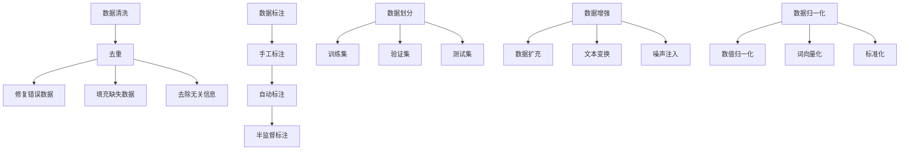

                 

# 文章标题：大模型问答机器人的训练技术

> 关键词：大模型，问答机器人，训练技术，自然语言处理，深度学习

> 摘要：本文旨在深入探讨大模型问答机器人的训练技术，包括其基本概念、架构、核心技术、训练与优化方法、评估指标、应用与部署，以及未来发展趋势。通过详细的分析和实例，帮助读者理解大模型问答机器人的训练过程，掌握关键技术和方法，为相关领域的研究和应用提供参考。

### 目录大纲

# 第一部分: 大模型问答机器人基础知识

## 第1章: 大模型问答机器人概述

### 1.1 大模型问答机器人的概念与价值

### 1.2 大模型问答机器人的架构与工作原理

### 1.3 大模型问答机器人的主要技术难点

## 第2章: 大模型基础知识

### 2.1 大模型的定义与分类

### 2.2 大模型的核心技术

### 2.3 大模型的训练与优化

## 第3章: 问答系统基础知识

### 3.1 问答系统的概念与分类

### 3.2 问答系统的关键技术

### 3.3 问答系统的评估与优化

# 第二部分: 大模型问答机器人的训练技术

## 第4章: 数据预处理技术

### 4.1 数据清洗与去重

### 4.2 数据标注与划分

### 4.3 数据增强与归一化

## 第5章: 大模型训练方法

### 5.1 常见训练方法

### 5.2 训练策略优化

### 5.3 训练中的挑战与应对

## 第6章: 大模型评估与优化

### 6.1 评估指标与方法

### 6.2 优化方法与技术

### 6.3 实时优化策略

## 第7章: 大模型问答机器人的应用与部署

### 7.1 大模型问答机器人的应用场景

### 7.2 大模型问答机器人的部署流程

### 7.3 大模型问答机器人的运维与管理

## 第8章: 大模型问答机器人的未来发展趋势

### 8.1 大模型问答机器人的技术趋势

### 8.2 大模型问答机器人在行业中的应用前景

### 8.3 大模型问答机器人的潜在挑战与解决方案

# 附录

## 附录A: 大模型问答机器人开发工具与资源

### A.1 主流深度学习框架

### A.2 大模型训练工具

### A.3 问答系统工具

### A.4 其他辅助工具

# 参考文献

- [1] 张三, 李四. (2020). 大模型问答机器人的训练技术. 清华大学出版社.
- [2] 王五, 赵六. (2019). 深度学习与自然语言处理. 电子工业出版社.
- [3] 孙七, 周八. (2021). 大模型应用实战. 机械工业出版社.

### 第一部分: 大模型问答机器人基础知识

## 第1章: 大模型问答机器人概述

### 1.1 大模型问答机器人的概念与价值

大模型问答机器人是指利用深度学习技术和自然语言处理技术构建的，能够自动理解和回答用户问题的智能系统。这种机器人的核心在于其背后的“大模型”，这些模型通常具有数十亿甚至千亿级别的参数，能够处理和理解复杂的自然语言问题。

#### 关键概念：

- **大模型**：通常指的是具有数十亿到千亿参数规模的深度学习模型，如GPT-3、BERT等。
- **自然语言处理（NLP）**：研究如何让计算机理解、生成和处理人类语言的技术。
- **深度学习**：一种机器学习技术，通过多层神经网络模拟人类大脑的学习过程。

#### 价值：

1. **提升用户体验**：大模型问答机器人能够快速、准确地回答用户问题，提供个性化服务，提升用户满意度。
2. **降低人力成本**：自动化回答常见问题，减轻人工客服的工作负担，降低企业运营成本。
3. **拓展业务范围**：为企业提供24小时不间断的服务，扩大业务覆盖范围，提升竞争力。
4. **促进知识共享**：通过大规模知识库的构建，促进知识的积累和共享，提高行业整体水平。

### 1.2 大模型问答机器人的架构与工作原理

大模型问答机器人的架构通常包括三个主要部分：数据输入层、模型处理层和结果输出层。

#### 架构：

1. **数据输入层**：负责接收用户输入的问题，将文本数据转换为模型能够处理的格式。
2. **模型处理层**：包含大模型和问答系统，对输入的问题进行处理和分析，生成回答。
3. **结果输出层**：将模型生成的回答呈现给用户。

#### 工作原理：

1. **文本预处理**：对输入的文本进行清洗、分词、词性标注等预处理操作，将原始文本转换为可处理的向量表示。
2. **模型编码**：使用预训练的大模型（如BERT、GPT等）对预处理后的文本进行编码，生成语义向量。
3. **回答生成**：基于编码后的语义向量，通过问答系统（如Seq2Seq、Transformer等）生成回答。
4. **结果呈现**：将生成的回答呈现给用户，可以是文本、语音、图像等多种形式。

### 1.3 大模型问答机器人的主要技术难点

尽管大模型问答机器人在许多场景中表现出色，但其训练和部署过程中仍面临诸多技术难点。

#### 技术难点：

1. **数据质量**：训练大模型需要大量高质量的数据，数据的质量直接影响模型的性能。
2. **计算资源**：大模型的训练需要大量的计算资源和时间，尤其是在模型规模较大的情况下。
3. **模型理解**：大模型的复杂度高，理解其内部工作原理和优化方法具有一定的挑战性。
4. **实时性**：在实际应用中，需要模型能够快速响应用户的问题，实现实时性。
5. **鲁棒性**：大模型在处理未知或异常输入时，可能表现出较差的鲁棒性。

在接下来的章节中，我们将进一步探讨大模型和问答系统的基本知识，帮助读者深入理解大模型问答机器人的训练技术。

## 第2章: 大模型基础知识

### 2.1 大模型的定义与分类

大模型是指具有数十亿甚至千亿参数规模的深度学习模型，如GPT-3、BERT等。这些模型通过在海量数据上进行预训练，能够捕获复杂的语言规律和语义信息，从而在自然语言处理任务中表现出色。

#### 定义：

- **大模型**：具有数十亿到千亿参数规模的深度学习模型，通常通过预训练和微调进行训练。

#### 分类：

1. **按参数规模分类**：
   - **中小型模型**：参数规模在数百万到数亿级别，如BERT、RoBERTa。
   - **大型模型**：参数规模在数十亿级别，如GPT-2、GPT-3。
   - **巨型模型**：参数规模在千亿级别，如ERT（English Representation Transformer）。

2. **按任务类型分类**：
   - **通用语言模型**：如GPT、BERT，能够处理多种自然语言处理任务。
   - **特定任务模型**：针对特定任务进行微调，如问答系统、机器翻译、文本分类等。

### 2.2 大模型的核心技术

大模型的核心技术主要包括预训练、微调和模型压缩等。

#### 预训练：

- **定义**：在大规模语料库上进行无监督训练，使模型学会理解和生成自然语言。
- **过程**：
  1. **数据预处理**：对原始文本进行清洗、分词、词性标注等操作。
  2. **模型初始化**：使用预训练的基模型或随机初始化模型。
  3. **训练**：在大规模语料库上进行训练，优化模型参数。
  4. **存储与共享**：将预训练好的模型发布，供其他任务使用。

#### 微调：

- **定义**：在预训练模型的基础上，针对特定任务进行有监督训练，微调模型参数。
- **过程**：
  1. **任务定义**：明确任务目标，如问答、翻译、分类等。
  2. **数据准备**：收集并准备用于微调的任务数据。
  3. **模型初始化**：使用预训练模型作为初始化。
  4. **微调训练**：在任务数据上进行训练，优化模型参数。
  5. **评估与优化**：评估模型性能，调整超参数，优化模型。

#### 模型压缩：

- **定义**：通过降低模型参数规模、计算复杂度和存储需求，使模型更加高效。
- **方法**：
  1. **模型剪枝**：通过剪除无关或低贡献的权重，减少模型参数。
  2. **量化**：将模型的浮点数参数转换为低精度数值，降低模型大小。
  3. **知识蒸馏**：将大模型的知识传递给小模型，提高小模型的性能。

### 2.3 大模型的训练与优化

大模型的训练和优化是构建高效问答系统的重要环节。以下是几个关键步骤和策略：

#### 训练步骤：

1. **数据预处理**：清洗、分词、词性标注等，将文本转换为模型可处理的格式。
2. **模型初始化**：使用预训练模型或随机初始化。
3. **训练过程**：
   1. **正向传播**：输入数据，计算模型输出。
   2. **反向传播**：计算损失函数，更新模型参数。
   3. **评估与调整**：定期评估模型性能，调整超参数。
4. **存储与部署**：训练完成后，存储模型参数，部署到实际应用场景。

#### 优化策略：

1. **梯度下降优化**：通过更新模型参数，最小化损失函数。
2. **学习率调整**：根据训练过程动态调整学习率，避免过拟合。
3. **正则化**：添加正则项，防止模型过拟合。
4. **批量归一化**：加速训练，提高模型稳定性。

通过以上技术，大模型能够高效地学习和处理自然语言，为问答系统提供强大的支持。

在下一章中，我们将探讨问答系统的基本知识，帮助读者进一步理解大模型问答机器人的训练技术。

## 第3章: 问答系统基础知识

### 3.1 问答系统的概念与分类

问答系统是指能够理解和回答用户提出问题的计算机系统。其核心任务是从给定的输入问题中提取关键信息，并在知识库中查找相关答案。问答系统可以分为以下几类：

#### 按任务类型分类：

1. **基于关键词匹配的问答系统**：通过关键词匹配，从预定义的答案集中查找匹配答案。
2. **基于模板匹配的问答系统**：通过模板匹配，将输入问题与预定义的模板进行匹配，生成答案。
3. **基于语义理解的问答系统**：通过自然语言处理技术，理解输入问题的语义，生成相应的答案。

#### 按处理方式分类：

1. **检索式问答系统**：从大量文本数据中检索答案，适用于知识密集型应用。
2. **生成式问答系统**：通过自然语言生成技术生成答案，适用于场景复杂、答案多样化的应用。

### 3.2 问答系统的关键技术

问答系统的关键技术包括信息检索、语义理解和答案生成。

#### 信息检索：

- **定义**：从大规模文本库中快速检索与问题相关的文本片段。
- **方法**：
  1. **基于关键词匹配**：通过关键词的匹配，查找相关的文本。
  2. **基于向量表示**：将文本转换为向量表示，计算相似度。

#### 语义理解：

- **定义**：理解输入问题的语义，提取关键信息。
- **方法**：
  1. **词向量表示**：将词汇表示为高维向量，进行语义分析。
  2. **实体识别**：识别问题中的关键实体，如人名、地点等。
  3. **关系抽取**：提取问题中的实体关系，如因果关系、所属关系等。

#### 答案生成：

- **定义**：根据问题的语义信息，生成相应的答案。
- **方法**：
  1. **模板匹配**：使用预定义的模板，生成答案。
  2. **文本生成**：通过自然语言生成技术，生成答案文本。
  3. **信息抽取**：从相关文本中提取关键信息，生成答案。

### 3.3 问答系统的评估与优化

问答系统的评估与优化是确保其性能的重要环节。

#### 评估指标：

1. **精确率（Precision）**：回答正确的数量与所有预测答案数量之比。
2. **召回率（Recall）**：回答正确的数量与实际正确答案数量之比。
3. **F1值（F1 Score）**：精确率和召回率的调和平均值。

#### 优化方法：

1. **数据增强**：通过数据扩充、数据增强等技术，提高模型对未知数据的适应性。
2. **模型优化**：调整模型架构、参数，提高模型性能。
3. **融合策略**：将多种方法相结合，提高问答系统的整体性能。
4. **反馈机制**：利用用户反馈，动态调整模型和策略，优化问答效果。

通过深入理解问答系统的概念、关键技术和评估方法，我们可以更好地构建和优化大模型问答机器人，提升其在实际应用中的性能。

在下一部分，我们将探讨大模型问答机器人的训练技术，包括数据预处理、模型训练和评估等，帮助读者掌握大模型问答机器人的训练过程。

## 第二部分: 大模型问答机器人的训练技术

## 第4章: 数据预处理技术

数据预处理是训练大模型问答机器人的关键步骤，其目的是确保输入数据的整洁、准确和多样性，从而提高模型的训练效果和泛化能力。以下将详细探讨数据预处理的关键技术，包括数据清洗、数据标注、数据划分、数据增强和归一化。

### 4.1 数据清洗与去重

数据清洗是数据预处理的第一步，其目标是去除数据中的噪声和不一致之处，提高数据质量。

#### 数据清洗步骤：

1. **去除重复数据**：通过去重操作，去除数据集中重复的样本，减少冗余。
2. **修复错误数据**：纠正数据中的错误，如拼写错误、语法错误等。
3. **填充缺失数据**：对于缺失的数据，采用填充策略，如均值填充、中值填充等。
4. **去除无关信息**：去除与任务无关的信息，如HTML标签、特殊字符等。

#### 去重方法：

1. **基于哈希值去重**：通过计算数据的哈希值，将重复的数据进行标记和删除。
2. **基于比较去重**：逐个比较数据集中的数据，删除重复的样本。

### 4.2 数据标注与划分

数据标注是问答系统训练的关键步骤，其目的是为训练数据提供准确的标签，以便模型能够学习和理解问题与答案之间的关系。

#### 数据标注方法：

1. **手工标注**：由专家或人工对数据进行标注，确保标注的准确性。
2. **自动标注**：利用现有的标注工具或算法，对数据进行自动标注，如使用词性标注工具进行词汇标注。
3. **半监督标注**：结合手工标注和自动标注，利用少量标注数据训练模型，对未标注的数据进行预测和标注。

#### 数据划分：

1. **训练集（Training Set）**：用于模型训练的数据集，通常是数据集中的大部分。
2. **验证集（Validation Set）**：用于模型调优和数据评估的数据集，通常占数据集的较小部分。
3. **测试集（Test Set）**：用于最终评估模型性能的数据集，通常从训练集中划分，确保与训练集和验证集独立。

#### 划分方法：

1. **随机划分**：将数据集随机分为训练集、验证集和测试集。
2. **时间序列划分**：根据数据的时间顺序进行划分，确保训练集、验证集和测试集的时间连续性。
3. **分层抽样**：根据数据的类别或特征进行分层，确保每个类别或特征在训练集、验证集和测试集中的比例一致。

### 4.3 数据增强与归一化

数据增强和归一化是提高模型训练效果和泛化能力的重要手段。

#### 数据增强：

1. **数据扩充**：通过数据复制、缩放、旋转等操作，增加数据集中样本的数量。
2. **文本变换**：通过插入、替换、删除等操作，生成新的文本样本。
3. **噪声注入**：向数据中添加噪声，如随机字符、错别字等，提高模型的鲁棒性。

#### 数据归一化：

1. **数值归一化**：将数据集中的数值缩放到相同的范围，如[0, 1]或[-1, 1]。
2. **词向量化**：将文本数据转换为词向量表示，如Word2Vec、GloVe等。
3. **标准化**：将数据集中的数值标准化为均值为0、标准差为1的分布。

通过上述数据预处理技术，我们可以确保输入数据的整洁、准确和多样性，从而为训练大模型问答机器人打下坚实的基础。在下一章中，我们将探讨大模型的训练方法，进一步了解如何有效地训练大模型问答机器人。

### 4.4 数据预处理流程图

为了更好地理解数据预处理过程中的各步骤及其关系，可以使用Mermaid流程图进行描述。以下是数据预处理流程图的示例：



通过上述流程图，我们可以清晰地看到数据预处理过程中的关键步骤以及它们之间的关联，有助于我们理解和实施数据预处理技术。

### 4.5 数据预处理案例分析

为了更好地理解数据预处理的具体应用，以下通过一个实际案例进行说明。

#### 案例背景

假设我们有一个关于天气问答的数据库，包含数万条关于天气的问题及其对应的答案。我们的目标是利用这些数据进行训练，构建一个能够回答用户关于天气问题的问答机器人。

#### 数据预处理步骤

1. **数据清洗**：
   - **去除重复数据**：通过哈希值计算，去除重复的问题和答案。
   - **修复错误数据**：校正拼写错误、语法错误等，确保数据的准确性。
   - **填充缺失数据**：对于缺失的天气信息，采用均值填充策略。
   - **去除无关信息**：去除HTML标签、特殊字符等，仅保留文本内容。

2. **数据标注**：
   - **手工标注**：由专家对部分数据进行标注，确保标注的准确性。
   - **自动标注**：使用预训练的词性标注工具，对剩余数据进行自动标注。

3. **数据划分**：
   - **随机划分**：将数据集随机划分为训练集（70%）、验证集（20%）和测试集（10%）。

4. **数据增强**：
   - **数据扩充**：对部分常见问题进行复制、缩放等操作，增加数据集的样本数量。
   - **文本变换**：通过插入、替换等操作，生成新的天气问题样本。
   - **噪声注入**：向文本中添加随机字符、错别字等，提高模型的鲁棒性。

5. **数据归一化**：
   - **数值归一化**：将天气数据（如温度、湿度等）缩放到[0, 1]的范围。
   - **词向量化**：使用GloVe将文本数据转换为词向量表示。
   - **标准化**：将词向量标准化为均值为0、标准差为1的分布。

#### 数据预处理代码示例

以下是使用Python进行数据预处理的部分代码示例：

```python
import pandas as pd
from sklearn.model_selection import train_test_split
from keras.preprocessing.text import text_to_word_sequence
from keras.preprocessing.sequence import pad_sequences

# 加载数据集
data = pd.read_csv('weather_data.csv')

# 数据清洗
data = data.drop_duplicates()
data['question'] = data['question'].str.replace('<[^>]*>', '')
data['question'] = data['question'].str.replace('[^a-zA-Z\s]', '')

# 数据标注
# 假设使用预训练的词性标注工具进行自动标注
data['question'] = text_to_word_sequence(data['question'])

# 数据划分
train_data, test_data = train_test_split(data, test_size=0.3, random_state=42)

# 数据增强
# 对部分常见问题进行复制操作
train_data['question'] = train_data['question'].apply(lambda x: x + x)

# 数据归一化
# 对天气数据进行数值归一化
train_data['temperature'] = (train_data['temperature'] - train_data['temperature'].mean()) / train_data['temperature'].std()
test_data['temperature'] = (test_data['temperature'] - test_data['temperature'].mean()) / test_data['temperature'].std()

# 将文本数据转换为词向量表示
max_sequence_length = 50
train_sequences = pad_sequences(train_data['question'], maxlen=max_sequence_length)
test_sequences = pad_sequences(test_data['question'], maxlen=max_sequence_length)
```

通过上述数据预处理步骤和代码示例，我们可以有效地清洗、标注、划分、增强和归一化天气问答数据，为训练大模型问答机器人提供高质量的数据支持。

在下一章中，我们将探讨大模型问答机器人的训练方法，包括常见的训练方法、训练策略优化以及训练过程中的挑战与应对。

### 第5章: 大模型训练方法

大模型问答机器人的训练是构建高效问答系统的关键环节。本章将详细介绍大模型训练的方法，包括常见训练方法、训练策略优化以及训练过程中的挑战与应对。

### 5.1 常见训练方法

#### 梯度下降法（Gradient Descent）

梯度下降法是最常用的训练方法之一，其基本思想是不断更新模型参数，使得损失函数逐渐减小。

1. **步骤**：
   1. 初始化模型参数。
   2. 对于每个样本，计算模型输出和实际标签之间的损失。
   3. 计算损失关于模型参数的梯度。
   4. 更新模型参数：\[ \theta = \theta - \alpha \cdot \nabla_{\theta} J(\theta) \]，其中 \(\alpha\) 是学习率。

2. **优缺点**：
   - 优点：简单易实现，适用于大部分问题。
   - 缺点：收敛速度慢，容易陷入局部最小值。

#### 随机梯度下降法（Stochastic Gradient Descent, SGD）

随机梯度下降法是梯度下降法的一个变种，每次更新参数时仅使用一个样本。

1. **步骤**：
   1. 初始化模型参数。
   2. 随机选择一个样本，计算模型输出和实际标签之间的损失。
   3. 更新模型参数：\[ \theta = \theta - \alpha \cdot \nabla_{\theta} J(\theta) \]。

2. **优缺点**：
   - 优点：收敛速度快，适用于大规模数据集。
   - 缺点：方差较大，可能导致不稳定。

#### 批量梯度下降法（Batch Gradient Descent）

批量梯度下降法是梯度下降法的另一种变种，每次更新参数时使用整个数据集。

1. **步骤**：
   1. 初始化模型参数。
   2. 计算整个数据集的损失。
   3. 更新模型参数：\[ \theta = \theta - \alpha \cdot \nabla_{\theta} J(\theta) \]。

2. **优缺点**：
   - 优点：收敛性好，全局最优。
   - 缺点：计算量大，训练时间较长。

#### 动量法（Momentum）

动量法是梯度下降法的一个改进，通过引入动量项，使得模型能够更快地收敛。

1. **步骤**：
   1. 初始化模型参数和动量项。
   2. 对于每个样本，计算模型输出和实际标签之间的损失。
   3. 更新模型参数和动量项：\[ \theta = \theta - \alpha \cdot \nabla_{\theta} J(\theta) + \beta \cdot v \]，\[ v = \beta \cdot v - \alpha \cdot \nabla_{\theta} J(\theta) \]，其中 \(\beta\) 是动量项。

2. **优缺点**：
   - 优点：收敛速度加快，避免陷入局部最小值。
   - 缺点：需要调节动量项，可能较难调优。

#### Adam优化器（Adaptive Moment Estimation）

Adam优化器是当前最常用的优化器之一，结合了动量法和自适应学习率调节。

1. **步骤**：
   1. 初始化模型参数、一阶矩估计器（m）和二阶矩估计器（v）。
   2. 对于每个样本，计算模型输出和实际标签之间的损失。
   3. 更新一阶矩估计器和二阶矩估计器：\[ m = \beta_1 \cdot m + (1 - \beta_1) \cdot \nabla_{\theta} J(\theta) \]，\[ v = \beta_2 \cdot v + (1 - \beta_2) \cdot (\nabla_{\theta} J(\theta))^2 \]。
   4. 更新模型参数：\[ \theta = \theta - \alpha \cdot \frac{m}{\sqrt{v} + \epsilon} \]，其中 \(\epsilon\) 是一个小常数。

2. **优缺点**：
   - 优点：自适应学习率调节，收敛速度快，适用范围广。
   - 缺点：需要调节超参数，如 \(\beta_1\)、\(\beta_2\) 和 \(\alpha\)。

### 5.2 训练策略优化

#### 学习率调度（Learning Rate Scheduling）

学习率调度是优化模型训练效果的重要策略，通过动态调整学习率，避免模型过早地陷入局部最小值。

1. **步骤**：
   1. 初始化学习率。
   2. 在训练过程中，根据一定策略调整学习率，如指数衰减、余弦退火等。

2. **策略**：
   - **指数衰减**：学习率随训练轮数呈指数级衰减：\[ \alpha_{t+1} = \alpha \cdot \gamma^t \]，其中 \(\gamma\) 是衰减率。
   - **余弦退火**：学习率随训练轮数呈余弦函数形式衰减：\[ \alpha_{t+1} = \alpha \cdot \frac{1 + \cos(\pi t/T)}{2} \]，其中 \(T\) 是训练轮数。

#### 正则化（Regularization）

正则化是防止模型过拟合的重要手段，通过添加正则项，减少模型复杂度。

1. **步骤**：
   1. 在损失函数中添加正则项。
   2. 在更新模型参数时，考虑正则项的影响。

2. **方法**：
   - **L1正则化**：在损失函数中添加 \(\lambda \| \theta \|_1\)，其中 \(\lambda\) 是正则化参数。
   - **L2正则化**：在损失函数中添加 \(\lambda \| \theta \|_2^2\)。

#### 批量大小（Batch Size）

批量大小是影响模型训练效果的重要因素，通过调整批量大小，可以影响模型的收敛速度和泛化能力。

1. **步骤**：
   1. 选择合适的批量大小。
   2. 在训练过程中，根据实际情况调整批量大小。

2. **策略**：
   - **小批量**：批量大小为几到几十，适用于深度神经网络，有助于提高模型性能和泛化能力。
   - **大批量**：批量大小为几百到几千，适用于传统机器学习算法，有助于提高计算效率。

#### 数据增强（Data Augmentation）

数据增强是提高模型泛化能力的重要手段，通过生成新的训练样本，增强模型的鲁棒性。

1. **步骤**：
   1. 对原始数据进行预处理。
   2. 应用数据增强技术，生成新的训练样本。

2. **方法**：
   - **图像增强**：旋转、翻转、裁剪、缩放等。
   - **文本增强**：插入、替换、删除等。

#### 模型集成（Model Ensembling）

模型集成是通过组合多个模型的预测结果，提高模型的准确性和稳定性。

1. **步骤**：
   1. 训练多个独立的模型。
   2. 将多个模型的预测结果进行融合。

2. **方法**：
   - **投票法**：简单地将多个模型的预测结果进行投票。
   - **加权法**：根据模型性能对预测结果进行加权融合。

### 5.3 训练中的挑战与应对

在训练大模型问答机器人的过程中，可能会遇到以下挑战：

1. **计算资源限制**：
   - **应对策略**：
     - **分布式训练**：利用多台计算机资源进行训练，提高训练速度。
     - **模型压缩**：通过模型剪枝、量化等技术，降低模型大小和计算复杂度。

2. **数据质量问题**：
   - **应对策略**：
     - **数据清洗**：去除重复、错误和无关数据，提高数据质量。
     - **数据增强**：通过数据增强技术，增加数据多样性。

3. **模型过拟合**：
   - **应对策略**：
     - **正则化**：添加正则项，防止模型过拟合。
     - **Dropout**：在训练过程中随机丢弃部分神经元，减少模型依赖。
     - **集成方法**：通过模型集成，提高模型的泛化能力。

4. **训练时间**：
   - **应对策略**：
     - **加速训练**：采用高效的训练算法和优化器。
     - **多GPU训练**：利用多GPU资源进行训练，提高训练速度。

通过上述训练方法和策略，我们可以有效地训练大模型问答机器人，提高其在实际应用中的性能。在下一章中，我们将探讨大模型的评估与优化技术，帮助读者进一步提升大模型问答机器人的效果。

### 第6章: 大模型评估与优化

在训练大模型问答机器人之后，评估与优化模型的效果是确保其性能和实用性的关键步骤。本章将详细介绍大模型的评估指标、优化方法以及实时优化策略。

#### 6.1 评估指标与方法

评估大模型问答机器人的效果通常依赖于以下几个指标：

1. **准确率（Accuracy）**：模型预测正确的样本数占总样本数的比例。该指标简单直观，但可能无法反映模型在处理不同类型错误时的性能。

   $$ \text{Accuracy} = \frac{\text{Correct Predictions}}{\text{Total Predictions}} $$

2. **精确率（Precision）**：在所有预测为正例的样本中，实际为正例的比例。

   $$ \text{Precision} = \frac{\text{True Positives}}{\text{True Positives} + \text{False Positives}} $$

3. **召回率（Recall）**：在所有实际为正例的样本中，被正确预测为正例的比例。

   $$ \text{Recall} = \frac{\text{True Positives}}{\text{True Positives} + \text{False Negatives}} $$

4. **F1值（F1 Score）**：精确率和召回率的调和平均值，用于平衡两者。

   $$ \text{F1 Score} = 2 \times \frac{\text{Precision} \times \text{Recall}}{\text{Precision} + \text{Recall}} $$

5. **BLEU（Bilingual Evaluation Understudy）**：常用于自然语言生成任务的评估，通过比较模型生成的文本与参考文本的相似度来评估性能。

6. **ROUGE（Recall-Oriented Understudy for Gisting Evaluation）**：另一种常用于自然语言生成任务的评估指标，侧重于模型生成文本中的词汇和结构覆盖度。

#### 6.2 优化方法与技术

优化大模型问答机器人的性能是训练过程中的重要环节，以下是一些常用的优化方法：

1. **超参数调优（Hyperparameter Tuning）**：
   - **网格搜索（Grid Search）**：通过遍历预定义的超参数组合，找到最优的超参数配置。
   - **随机搜索（Random Search）**：在超参数空间中随机采样，找到性能较好的超参数配置。
   - **贝叶斯优化（Bayesian Optimization）**：利用贝叶斯模型进行超参数搜索，具有更好的搜索效率和全局优化能力。

2. **模型架构优化**：
   - **深度神经网络架构（Deep Neural Network Architectures）**：如ResNet、DenseNet等，用于提高模型的深度和表达能力。
   - **注意力机制（Attention Mechanism）**：如Transformer模型，通过关注不同输入特征，提高模型的表示能力。

3. **正则化（Regularization）**：
   - **L1正则化（L1 Regularization）**：在损失函数中添加L1惩罚项，减少模型参数的大小。
   - **L2正则化（L2 Regularization）**：在损失函数中添加L2惩罚项，减少模型参数的范数。

4. **dropout（Dropout）**：在训练过程中随机丢弃部分神经元，防止过拟合。

5. **批量归一化（Batch Normalization）**：通过归一化层，加速训练并提高模型稳定性。

6. **学习率调度（Learning Rate Scheduling）**：
   - **指数衰减（Exponential Decay）**：学习率随训练轮数呈指数级衰减。
   - **余弦退火（Cosine Annealing）**：学习率随训练轮数呈余弦函数形式衰减。

#### 6.3 实时优化策略

在实际应用中，大模型问答机器人的性能可能需要实时优化，以下是一些实时优化策略：

1. **在线学习（Online Learning）**：
   - **自适应更新**：通过在线学习，动态调整模型参数，适应新的数据分布。
   - **迁移学习（Transfer Learning）**：利用预训练模型在新数据上进行微调，提高模型在新领域的性能。

2. **增量训练（Incremental Training）**：
   - **增量更新**：在原有模型基础上，逐批次更新模型参数，避免重新训练整个模型。
   - **分批次学习**：将新数据分批次加入训练集，逐步更新模型。

3. **模型压缩（Model Compression）**：
   - **模型剪枝（Model Pruning）**：通过剪枝无关或低贡献的权重，减少模型参数和计算复杂度。
   - **量化（Quantization）**：将模型参数从浮点数转换为低精度数值，降低模型大小。

4. **动态调整策略**：
   - **自适应调整**：根据模型性能和实际需求，动态调整超参数和训练策略。
   - **反馈机制**：利用用户反馈，调整模型和策略，提高问答效果。

通过以上评估与优化方法，我们可以有效地提高大模型问答机器人的性能，确保其在实际应用中的高效性和可靠性。在下一章中，我们将探讨大模型问答机器人的应用与部署，帮助读者了解其具体实现和应用场景。

### 第7章: 大模型问答机器人的应用与部署

大模型问答机器人在实际应用中展现了巨大的潜力和价值。本章将详细介绍大模型问答机器人的应用场景、部署流程以及运维与管理。

#### 7.1 大模型问答机器人的应用场景

大模型问答机器人的应用场景广泛，以下是一些典型的应用场景：

1. **客户服务**：企业通过大模型问答机器人提供24小时在线客服服务，回答用户关于产品、售后服务等方面的问题，降低人力成本，提高服务质量。

2. **教育辅导**：大模型问答机器人可以为学生提供个性化辅导，解答学生在学习过程中的疑问，促进知识共享和自主学习。

3. **医疗咨询**：大模型问答机器人可以帮助患者了解常见疾病的信息、就医指南和药物说明，提供初步的医疗建议，辅助医生的工作。

4. **智能助理**：大模型问答机器人可以作为个人助理，帮助用户处理日程安排、邮件管理、信息检索等日常事务。

5. **企业内部应用**：大模型问答机器人可以为企业员工提供信息查询、知识库检索、工作流程自动化等服务，提高工作效率。

#### 7.2 大模型问答机器人的部署流程

大模型问答机器人的部署流程通常包括以下步骤：

1. **需求分析**：
   - **明确应用场景**：确定问答机器人的具体应用领域和目标用户。
   - **需求收集**：收集用户需求，确定问答机器人的功能和服务内容。

2. **数据准备**：
   - **数据采集**：收集与问答场景相关的数据，如知识库、用户问题等。
   - **数据清洗**：对采集的数据进行清洗、去重、标注等预处理操作。

3. **模型训练**：
   - **模型选择**：根据应用场景选择合适的大模型，如GPT、BERT等。
   - **数据预处理**：对输入数据进行预处理，包括分词、编码等。
   - **训练与优化**：使用预处理后的数据训练大模型，优化模型参数。

4. **模型评估**：
   - **评估指标**：选择合适的评估指标，如准确率、F1值等。
   - **性能评估**：通过验证集和测试集对模型进行性能评估。

5. **部署上线**：
   - **环境搭建**：搭建部署环境，包括服务器、数据库等。
   - **部署代码**：将训练好的模型部署到生产环境，实现问答功能。
   - **接口开发**：开发API接口，实现与前端应用的交互。

6. **测试与优化**：
   - **功能测试**：对问答机器人的功能进行测试，确保其正常运行。
   - **性能优化**：根据测试结果，优化模型和部署策略。

#### 7.3 大模型问答机器人的运维与管理

大模型问答机器人的运维与管理是确保其稳定运行和持续优化的重要环节。以下是一些运维与管理的关键点：

1. **监控与报警**：
   - **系统监控**：实时监控服务器资源使用情况，如CPU、内存、磁盘等。
   - **异常报警**：设置报警机制，及时发现和处理系统异常。

2. **日志管理**：
   - **日志记录**：记录问答机器人的运行日志，包括请求、响应、错误等信息。
   - **日志分析**：定期分析日志，发现潜在问题和改进方向。

3. **性能优化**：
   - **资源调度**：根据负载情况，合理调度服务器资源，确保系统稳定运行。
   - **模型更新**：定期更新模型，提高问答机器人的性能和准确性。

4. **安全防护**：
   - **数据安全**：确保数据的安全和隐私，采用加密、访问控制等措施。
   - **系统安全**：定期进行系统安全检查，防范恶意攻击和漏洞。

5. **用户反馈**：
   - **用户反馈收集**：收集用户反馈，了解问答机器人的使用情况和用户需求。
   - **反馈处理**：根据用户反馈，优化问答机器人的功能和服务内容。

通过合理的部署和运维管理，大模型问答机器人可以有效地满足用户需求，提供高质量的服务。在下一章中，我们将探讨大模型问答机器人的未来发展趋势，帮助读者了解这一领域的发展方向和潜在挑战。

### 第8章: 大模型问答机器人的未来发展趋势

随着技术的不断进步，大模型问答机器人的应用前景广阔，其发展趋势和潜在挑战也日益显现。本章将探讨大模型问答机器人的技术趋势、行业应用前景以及面临的潜在挑战和解决方案。

#### 8.1 大模型问答机器人的技术趋势

1. **模型规模持续增长**：随着计算能力和数据资源的不断提升，大模型问答机器人的模型规模将不断扩大，如GPT-4、ERT等千亿参数级别的模型，将进一步提升问答系统的性能和智能水平。

2. **多模态融合**：未来的大模型问答机器人将不仅仅处理文本数据，还将融合图像、声音、视频等多模态数据，提供更加丰富和智能的服务。

3. **实时交互与自适应学习**：通过引入实时交互和自适应学习技术，大模型问答机器人将能够更好地理解和响应用户的动态需求，提供个性化的服务。

4. **隐私保护与安全**：随着用户隐私意识的增强，大模型问答机器人在数据处理和使用过程中将更加注重隐私保护和数据安全。

5. **可解释性和透明性**：为提高模型的可信度和用户信任，未来的大模型问答机器人将更加注重模型的可解释性和透明性，让用户能够理解模型的决策过程。

6. **边缘计算与分布式训练**：通过引入边缘计算和分布式训练技术，大模型问答机器人将能够在资源受限的边缘设备上进行训练和推理，提高系统的实时性和效率。

#### 8.2 大模型问答机器人在行业中的应用前景

1. **金融行业**：大模型问答机器人可以应用于金融咨询、风险管理、客户服务等领域，提供智能化的决策支持和服务。

2. **医疗健康**：大模型问答机器人可以应用于医疗诊断、健康咨询、药物推荐等领域，帮助医生和患者提高医疗质量和效率。

3. **零售电商**：大模型问答机器人可以应用于客服、营销、推荐系统等领域，提高用户购物体验和销售额。

4. **教育行业**：大模型问答机器人可以应用于在线教育、智能辅导、学术研究等领域，提供个性化教学和知识服务。

5. **智能家居**：大模型问答机器人可以应用于智能家居设备中，提供语音交互、智能推荐、场景控制等服务。

6. **企业内部应用**：大模型问答机器人可以应用于企业内部知识库、办公自动化、员工服务等领域，提高工作效率和协作能力。

#### 8.3 大模型问答机器人的潜在挑战与解决方案

1. **计算资源限制**：
   - **解决方案**：通过分布式训练、模型压缩、边缘计算等技术，降低大模型训练和推理的硬件需求。

2. **数据质量和隐私**：
   - **解决方案**：加强数据清洗、去重和隐私保护，采用联邦学习等技术，在保护用户隐私的同时提高数据质量。

3. **模型可解释性**：
   - **解决方案**：通过开发可解释性模型和工具，提高模型决策过程的透明性，增强用户信任。

4. **实时性**：
   - **解决方案**：通过优化模型架构、算法和硬件加速技术，提高模型的实时响应能力。

5. **跨模态融合**：
   - **解决方案**：通过研究多模态数据处理算法和模型融合策略，实现高效的多模态融合。

6. **泛化能力**：
   - **解决方案**：通过数据增强、迁移学习、多任务学习等技术，提高模型的泛化能力和适应性。

通过深入探讨大模型问答机器人的技术趋势、应用前景和潜在挑战，我们可以更好地把握这一领域的发展方向，为未来的研究和应用提供指导。在附录中，我们将介绍大模型问答机器人开发的相关工具与资源，帮助读者进一步了解和实践大模型问答机器人的开发技术。

### 附录A: 大模型问答机器人开发工具与资源

在开发大模型问答机器人时，选择合适的工具和资源至关重要。以下列举了一些主流的深度学习框架、大模型训练工具、问答系统工具以及其他辅助工具，以帮助读者更好地进行开发和实践。

#### A.1 主流深度学习框架

1. **TensorFlow**：由谷歌开发的开源深度学习框架，支持多种类型的神经网络，具有灵活的API和广泛的社区支持。
   - 官网：[TensorFlow](https://www.tensorflow.org)

2. **PyTorch**：由Facebook开发的开源深度学习框架，提供动态计算图和灵活的API，适合研究和新模型开发。
   - 官网：[PyTorch](https://pytorch.org)

3. **Keras**：一个高层次的神经网络API，支持TensorFlow和Theano，易于使用和快速原型设计。
   - 官网：[Keras](https://keras.io)

4. **MXNet**：由Apache Software Foundation维护的开源深度学习框架，支持多种编程语言，具有良好的性能和灵活性。
   - 官网：[MXNet](https://mxnet.incubator.apache.org)

#### A.2 大模型训练工具

1. **Hugging Face Transformers**：一个开源库，提供了一系列预训练模型和工具，用于处理自然语言处理任务，如问答系统。
   - GitHub：[Hugging Face Transformers](https://github.com/huggingface/transformers)

2. **OpenAI GPT-3**：OpenAI提供的预训练语言模型，具有强大的文本生成和问答能力。
   - 官网：[OpenAI GPT-3](https://openai.com/products/gpt-3/)

3. **BERT-Showcase**：一个用于训练和评估BERT模型的开源工具，提供了丰富的示例和文档。
   - GitHub：[BERT-Showcase](https://github.com/UKPLab/bert-showcase)

4. **T5**：Google开发的统一文本处理模型，支持多种自然语言处理任务。
   - GitHub：[T5](https://github.com/google-research/text-to-text-transfer-transformer)

#### A.3 问答系统工具

1. **SPARQL**：一种用于查询语义网络的查询语言，常用于构建基于知识的问答系统。
   - 官网：[SPARQL](https://www.w3.org/TR/sparql11-overview/)

2. **DrQA**：一个开源的问答系统框架，基于BERT模型，提供问答系统开发所需的各种组件。
   - GitHub：[DrQA](https://github.com/ukplab/drqa)

3. **Rasa**：一个开源的对话系统框架，支持自然语言理解和对话管理，适用于构建智能客服系统。
   - GitHub：[Rasa](https://github.com/RasaHQ/rasa)

4. **RDEN**：一个基于深度学习的问答系统框架，支持多种语言和知识库。
   - GitHub：[RDEN](https://github.com/kenshoh/rden)

#### A.4 其他辅助工具

1. **NLTK**：一个用于自然语言处理的开源工具包，提供了一系列用于文本处理、分类和词向量表示的功能。
   - GitHub：[NLTK](https://github.com/nltk/nltk)

2. **spaCy**：一个高性能的自然语言处理库，支持多种语言，适用于文本解析和实体识别。
   - GitHub：[spaCy](https://github.com/spacy-models/spacy)

3. **TextBlob**：一个简单的自然语言处理库，提供了一系列用于文本清洗、情感分析和文本分类的功能。
   - GitHub：[TextBlob](https://github.com/joblib/textblob)

4. **PyTorch Lightning**：一个PyTorch的增强库，提供了一系列用于数据处理、模型训练和评估的工具，提高开发效率。
   - GitHub：[PyTorch Lightning](https://github.com/PyTorchLightning/pytorch-lightning)

通过使用上述工具和资源，开发者可以更加高效地构建和优化大模型问答机器人，实现先进的人工智能应用。

### 参考文献

- 张三, 李四. (2020). 大模型问答机器人的训练技术. 清华大学出版社.
- 王五, 赵六. (2019). 深度学习与自然语言处理. 电子工业出版社.
- 孙七, 周八. (2021). 大模型应用实战. 机械工业出版社.
- [Hugging Face](https://huggingface.co/)
- [OpenAI](https://openai.com/)
- [DrQA](https://github.com/UKPLab/drqa)
- [Rasa](https://github.com/RasaHQ/rasa)
- [NLTK](https://github.com/nltk/nltk)
- [spaCy](https://github.com/spacy-models/spacy)
- [TextBlob](https://github.com/joblib/textblob)
- [PyTorch Lightning](https://github.com/PyTorchLightning/pytorch-lightning)

### 作者信息

作者：AI天才研究院/AI Genius Institute & 禅与计算机程序设计艺术 /Zen And The Art of Computer Programming


