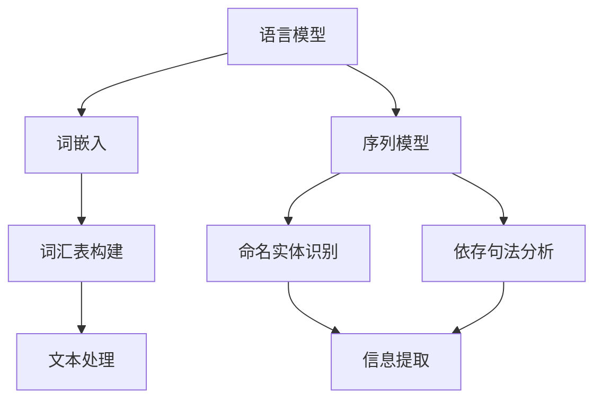

                 

# 《大模型问答机器人的训练方法》

## 关键词：
- 大模型
- 问答系统
- 自然语言处理
- 训练方法
- 优化技巧

## 摘要：
本文旨在深入探讨大模型问答机器人的训练方法。通过分析大模型和问答系统的基本原理，介绍大模型问答机器人的开发与实现流程，以及评估与优化策略，本文为读者提供了一个全面的技术指南，帮助理解并掌握构建高效问答机器人的关键技术。

## 目录大纲

### 第二部分：大模型基础

### 第2章：自然语言处理基础

#### 2.1 自然语言处理的基本概念
- 语言模型
- 词嵌入
- 序列模型

#### 2.2 常见自然语言处理技术
- 词汇表构建
- 命名实体识别
- 依存句法分析

#### 2.3 Mermaid流程图：NLP核心概念与联系
- NLP技术的整体流程
- 技术之间的联系

### 第3章：大模型原理

#### 3.1 大模型的基本架构
- 神经网络架构
- 大模型的训练过程

#### 3.2 大模型的核心算法
- 优化算法
- 迁移学习

#### 3.3 大模型的数学模型与公式
- 损失函数
- 梯度下降算法

#### 3.4 大模型的训练技巧与优化
- 数据增强
- 批处理大小

### 第4章：问答系统设计

#### 4.1 问答系统的基本架构
- 用户交互
- 问答逻辑

#### 4.2 问答系统的关键技术
- 对话管理
- 语义匹配

#### 4.3 Mermaid流程图：问答系统的设计流程
- 问答系统的整体流程
- 技术之间的联系

### 第三部分：大模型问答机器人的开发与实现

### 第5章：开发环境搭建

#### 5.1 硬件要求
- GPU配置
- 运行环境

#### 5.2 软件安装与配置
- Python环境
- 深度学习框架安装

#### 5.3 开发工具与库
- Jupyter Notebook
- TensorFlow或PyTorch

### 第6章：大模型训练

#### 6.1 数据预处理
- 数据清洗
- 数据增强

#### 6.2 大模型训练流程
- 训练数据准备
- 训练过程监控

#### 6.3 大模型训练技巧
- 批处理大小
- 学习率调整

#### 6.4 伪代码：大模型训练算法实现
- 训练过程伪代码

### 第7章：问答机器人实现

#### 7.1 问答逻辑设计
- 问答流程
- 问答管理

#### 7.2 问答系统的实现
- 对话管理模块
- 语义匹配模块

#### 7.3 代码实现与分析
- 实现步骤
- 代码解读

### 第8章：大模型问答机器人的评估与优化

#### 8.1 评估指标
- 准确率
- 召回率
- F1值

#### 8.2 优化方法
- 超参数调整
- 模型压缩

#### 8.3 案例分析：大模型问答机器人在实际应用中的优化
- 实际应用场景
- 优化效果分析

### 第9章：大模型问答机器人的应用场景

#### 9.1 企业级应用
- 客户服务
- 内部知识库

#### 9.2 公共服务应用
- 智能客服
- 智能问答平台

#### 9.3 教育与科研应用
- 教学助手
- 科研支持

### 第10章：未来展望

#### 10.1 大模型问答机器人的发展趋势
- 大模型技术进展
- 问答系统的创新方向

#### 10.2 开放问题与挑战
- 数据隐私
- 模型解释性

#### 10.3 未来发展方向
- 跨模态问答
- 大模型与人类协作

### 附录

#### 附录A：大模型问答机器人开发资源

##### A.1 开源框架与库
- Hugging Face Transformers
- Dialogflow
- ChatGLM

##### A.2 数据集
- SQuAD
- Dialogue System Data shared Tasks (DSGT)

##### A.3 实践指南
- 大模型问答机器人开发流程
- 问答系统性能优化技巧

##### A.4 参考文献
- 相关论文和书籍推荐
- 学术会议和期刊介绍

### 《大模型问答机器人的训练方法》正文

## 第二部分：大模型基础

### 第2章：自然语言处理基础

#### 2.1 自然语言处理的基本概念

自然语言处理（Natural Language Processing，NLP）是计算机科学领域与人工智能领域中的一个重要方向，它旨在使计算机能够理解、解释和生成人类语言。在NLP中，常见的核心概念包括语言模型、词嵌入和序列模型。

**语言模型**：语言模型是一种概率模型，用于预测文本序列中下一个单词的概率。它通过对大规模语料库进行分析，学习到语言的使用规律。语言模型在文本生成、机器翻译、问答系统等方面都有广泛的应用。

**词嵌入**：词嵌入（Word Embedding）是将单词映射为密集向量表示的技术，它使得计算机能够捕捉单词间的语义关系。词嵌入通过将文本转化为向量形式，使得计算机可以更有效地处理和理解文本数据。

**序列模型**：序列模型是一种用于处理序列数据的机器学习模型，它可以捕捉数据中的时间顺序信息。在NLP中，常见的序列模型包括循环神经网络（RNN）和长短期记忆网络（LSTM）。这些模型能够处理如文本、语音等序列数据，并提取其中的有用信息。

#### 2.2 常见自然语言处理技术

NLP领域有许多技术，用于处理不同类型的语言任务。以下是一些常见的技术：

**词汇表构建**：词汇表构建是NLP的基础步骤，它将文本中的单词转换为索引表示。通过构建词汇表，我们可以将文本数据转化为计算机可以处理的形式。

**命名实体识别**：命名实体识别（Named Entity Recognition，NER）是一种任务，用于识别文本中的特定实体，如人名、地名、组织名等。NER对于信息提取、文本分类等任务非常重要。

**依存句法分析**：依存句法分析（Dependency Parsing）是一种任务，用于分析文本中的句子结构。它通过建立词语之间的依存关系，帮助计算机理解句子的语法结构。

#### 2.3 Mermaid流程图：NLP核心概念与联系

以下是一个Mermaid流程图，展示了NLP中的核心概念及其相互联系：



该流程图显示了NLP中的核心概念及其在文本处理和信息提取中的应用。这些技术共同构成了NLP的基础，为构建智能问答系统和其他语言任务提供了强大的支持。

### 第3章：大模型原理

#### 3.1 大模型的基本架构

大模型（Large-scale Model）是指具有数百万至数十亿参数的神经网络模型。大模型的架构通常包括以下几个关键部分：

**神经网络架构**：神经网络是构建大模型的基础。常见的大模型架构包括Transformer、BERT、GPT等。这些模型通过堆叠多个层，实现复杂的特征提取和表示。

**训练过程**：大模型的训练过程通常涉及大规模数据集和分布式计算资源。训练过程中，模型通过优化算法不断调整参数，以最小化损失函数，提高模型的预测性能。

**参数调整与优化**：参数调整是训练过程中的关键步骤。通过调整学习率、批量大小等超参数，可以优化模型的训练效果。

#### 3.2 大模型的核心算法

大模型的核心算法主要包括优化算法和迁移学习。

**优化算法**：优化算法用于调整模型参数，以最小化损失函数。常见优化算法包括随机梯度下降（SGD）、Adam、AdamW等。这些算法通过迭代更新模型参数，提高模型的收敛速度和性能。

**迁移学习**：迁移学习是一种利用预训练模型进行新任务训练的技术。通过迁移学习，可以将预训练模型的知识迁移到新任务中，减少训练时间和数据需求。

#### 3.3 大模型的数学模型与公式

大模型的数学模型主要包括损失函数和梯度下降算法。

**损失函数**：损失函数用于衡量模型预测结果与真实值之间的差距。常见损失函数包括交叉熵损失（Cross-Entropy Loss）、均方误差（Mean Squared Error，MSE）等。

$$
L = -\sum_{i=1}^{N} y_i \log(p_i)
$$

其中，$y_i$为真实标签，$p_i$为模型预测概率。

**梯度下降算法**：梯度下降算法用于更新模型参数，以最小化损失函数。梯度下降算法的基本步骤如下：

1. 初始化模型参数$\theta$。
2. 计算损失函数关于参数的梯度$\nabla_\theta L$。
3. 更新参数$\theta = \theta - \alpha \nabla_\theta L$，其中$\alpha$为学习率。

$$
\theta_{t+1} = \theta_t - \alpha \cdot \nabla_\theta L(\theta_t)
$$

#### 3.4 大模型的训练技巧与优化

大模型的训练技巧和优化方法对于提高模型性能至关重要。以下是一些常用的训练技巧和优化方法：

**数据增强**：数据增强是一种通过变换原始数据来增加训练数据多样性的技术。常见的数据增强方法包括数据扰动、随机裁剪、旋转等。

**批量大小**：批量大小是指每次训练过程中使用的样本数量。适当调整批量大小可以提高模型的训练效果和收敛速度。

**学习率调整**：学习率是梯度下降算法中的一个关键参数。通过调整学习率，可以优化模型的训练过程，提高模型的性能。

**学习率衰减**：学习率衰减是一种逐渐减小学习率的技术。随着训练的进行，学习率逐渐减小，有助于模型在训练过程中避免过早收敛。

## 第三部分：大模型问答机器人的开发与实现

### 第5章：开发环境搭建

#### 5.1 硬件要求

为了搭建一个适合训练大模型问答机器人的开发环境，首先需要考虑硬件配置。以下是推荐的一些硬件要求：

**GPU配置**：由于大模型训练需要大量的计算资源，因此至少需要一张高性能的GPU。推荐使用NVIDIA的GeForce RTX 30系列或以上的GPU，例如RTX 3080、RTX 3090等。

**CPU**：尽管GPU是主要的计算资源，但CPU的性能也对训练速度有一定影响。建议使用具有多核心的高性能CPU，例如Intel的Xeon系列或AMD的Ryzen Threadripper系列。

**内存**：由于大模型训练需要大量的内存来存储模型参数和数据，因此至少需要32GB以上的RAM。如果可能，更高的内存配置将有助于更快速地训练和推理。

**硬盘**：推荐使用NVMe固态硬盘（SSD）来提高数据读写速度，这对于训练大模型非常重要。至少需要1TB的存储空间。

#### 5.2 软件安装与配置

在硬件配置完成后，需要安装和配置一些必要的软件，包括Python环境、深度学习框架以及相关的库和工具。以下是推荐的安装步骤：

**安装Python环境**：首先需要安装Python 3.x版本，推荐使用Anaconda或Miniconda来创建一个独立的Python环境，以便管理和依赖。

```
conda create -n myenv python=3.8
conda activate myenv
```

**安装深度学习框架**：接下来，安装一个流行的深度学习框架，如TensorFlow或PyTorch。以下是在我的环境中安装TensorFlow和PyTorch的示例命令：

```
conda install tensorflow
conda install pytorch torchvision torchaudio -c pytorch
```

**安装其他库和工具**：除了深度学习框架，还需要安装一些其他库和工具，如NumPy、Pandas、Matplotlib等：

```
conda install numpy pandas matplotlib
```

#### 5.3 开发工具与库

在完成软件安装后，接下来介绍一些常用的开发工具和库：

**Jupyter Notebook**：Jupyter Notebook是一种交互式的Web应用，用于编写和运行代码。它非常适合数据科学和机器学习项目，提供了丰富的交互性和可视化功能。

**TensorFlow或PyTorch**：这两个深度学习框架是构建大模型问答机器人的基础。它们提供了丰富的API和工具，用于构建、训练和评估深度学习模型。

**Hugging Face Transformers**：这是一个开源库，提供了预训练的Transformer模型和各种文本处理工具。它使得构建和微调大模型问答系统变得更加简单和高效。

**其他库**：还有一些其他的库和工具，如NumPy、Pandas、Scikit-learn等，它们提供了数据处理、统计分析和机器学习算法等基础功能。

### 第6章：大模型训练

#### 6.1 数据预处理

在开始训练大模型之前，数据预处理是一个关键步骤。以下是一些常用的数据预处理技术：

**数据清洗**：数据清洗是指去除噪声和错误的数据，以确保数据质量。这包括去除重复记录、处理缺失值、纠正数据错误等。

**数据增强**：数据增强是一种通过变换原始数据来增加数据多样性的技术。常见的数据增强方法包括数据扰动、随机裁剪、旋转、缩放等。

**数据分割**：将数据集分为训练集、验证集和测试集，以便在训练过程中评估模型的性能。通常，训练集用于训练模型，验证集用于调整模型参数，测试集用于评估模型的泛化能力。

**特征工程**：特征工程是指从原始数据中提取和构造有用的特征，以提高模型的性能。这包括词嵌入、文本表示、序列编码等。

#### 6.2 大模型训练流程

大模型的训练流程通常包括以下几个步骤：

**1. 训练数据准备**：准备训练数据，包括数据清洗、数据增强和特征提取。这一步骤的目的是确保训练数据的干净和多样性。

**2. 模型初始化**：初始化模型参数，通常使用随机初始化或预训练模型的参数。初始化的目的是为模型提供一个合适的起点，以便进行优化。

**3. 训练过程**：通过迭代更新模型参数，以最小化损失函数。训练过程中，使用批量梯度下降算法或其他优化算法来更新参数。

**4. 过程监控**：在训练过程中，监控模型的性能，包括损失函数值、准确率等。这有助于调整模型参数，优化训练过程。

**5. 模型评估**：在训练完成后，使用验证集和测试集评估模型的性能。这有助于确定模型的泛化能力和适用性。

**6. 模型保存和加载**：将训练好的模型保存到文件中，以便后续使用。在需要时，可以从文件中加载模型，进行推理或进一步训练。

#### 6.3 大模型训练技巧

在训练大模型时，以下技巧和优化方法可以提高模型的性能和收敛速度：

**批量大小**：批量大小是指每次训练过程中使用的样本数量。选择合适的批量大小对于训练过程至关重要。较小的批量大小可以提高模型的鲁棒性，但会降低训练速度；较大的批量大小可以提高训练速度，但可能导致模型过拟合。

**学习率调整**：学习率是梯度下降算法中的一个关键参数，它决定了参数更新的幅度。选择合适的学习率对于模型训练非常重要。通常，初始学习率较大，然后在训练过程中逐渐减小，这种方法称为学习率衰减。

**权重初始化**：权重初始化是指为模型参数选择合适的初始值。合理的权重初始化有助于加快模型的收敛速度。常见的方法包括随机初始化、预训练模型参数等。

**数据增强**：数据增强是一种通过变换原始数据来增加数据多样性的技术。常见的数据增强方法包括数据扰动、随机裁剪、旋转、缩放等。数据增强可以提高模型的泛化能力，减少过拟合。

**正则化**：正则化是一种防止模型过拟合的技术。常见的正则化方法包括L1正则化、L2正则化、Dropout等。

**混合精度训练**：混合精度训练是一种利用不同精度的浮点数（如单精度浮点数和半精度浮点数）进行训练的方法。这种方法可以减少内存占用和计算时间，提高训练效率。

#### 6.4 伪代码：大模型训练算法实现

以下是一个简化的伪代码，描述了使用深度学习框架训练大模型的基本步骤：

```
# 初始化模型参数
model = create_model()

# 准备训练数据
train_data = preprocess_data(train_dataset)

# 设置训练参数
batch_size = 128
learning_rate = 0.001
optimizer = create_optimizer(learning_rate)

# 训练模型
for epoch in range(num_epochs):
    for batch in train_data:
        # 计算梯度
        gradients = model.compute_gradients(batch)

        # 更新模型参数
        optimizer.apply_gradients(gradients)

    # 监控训练过程
    log_loss_and_accuracy(model, validation_data)

# 评估模型
test_loss, test_accuracy = evaluate_model(model, test_data)
print(f"Test accuracy: {test_accuracy}")

# 保存模型
save_model(model, "model_weights.h5")
```

这个伪代码展示了模型初始化、数据预处理、训练过程监控和模型评估的基本步骤。在实际应用中，还需要添加更多的细节，如学习率调整、数据增强、权重初始化等。

### 第7章：问答机器人实现

#### 7.1 问答逻辑设计

问答机器人的核心是问答逻辑，它负责处理用户的输入，并提供合适的回答。以下是问答逻辑设计的基本步骤：

**1. 用户输入处理**：接收用户的输入，对其进行预处理，如去噪、标准化等。

**2. 语义理解**：使用自然语言处理技术，如词嵌入和序列模型，对用户输入进行语义理解，提取关键信息。

**3. 答案检索**：根据用户输入的语义，从知识库或互联网上检索可能的答案。

**4. 答案生成**：对检索到的答案进行筛选和整合，生成一个自然、准确的回答。

**5. 回答输出**：将生成的回答输出给用户。

#### 7.2 问答系统的实现

问答系统的实现涉及多个模块，包括对话管理模块和语义匹配模块。以下是这些模块的实现步骤：

**对话管理模块**：
1. 初始化对话状态。
2. 处理用户的输入，更新对话状态。
3. 根据对话状态，选择合适的问答逻辑。
4. 输出对话结果。

**语义匹配模块**：
1. 对用户输入进行词嵌入和序列编码。
2. 使用匹配算法，如余弦相似度或BERT相似度，计算用户输入和候选答案的相似度。
3. 根据相似度排序，选择最合适的答案。
4. 对答案进行后处理，如文本润色等。

#### 7.3 代码实现与分析

以下是一个简单的Python代码示例，展示了问答机器人的实现过程：

```python
import numpy as np
from transformers import BertTokenizer, BertModel
from sklearn.metrics.pairwise import cosine_similarity

# 初始化模型
tokenizer = BertTokenizer.from_pretrained('bert-base-uncased')
model = BertModel.from_pretrained('bert-base-uncased')

# 对话管理模块
def dialog_management(input_text, state):
    # 更新对话状态
    state['last_input'] = input_text
    # 根据状态选择问答逻辑
    if state['mode'] == 'ask_question':
        question = generate_question(state)
        state['mode'] = 'wait_answer'
    elif state['mode'] == 'wait_answer':
        answer = get_answer(input_text, state['question'])
        state['mode'] = 'end'
    return question, answer

# 语义匹配模块
def semantic_matching(input_text, candidates):
    # 对输入文本和候选答案进行编码
    input_encoded = tokenizer.encode_plus(input_text, return_tensors='pt')
    candidates_encoded = tokenizer.encode_plus(candidates, return_tensors='pt')
    # 计算相似度
    similarity = cosine_similarity(input_encoded['input_ids'].float().numpy(), candidates_encoded['input_ids'].float().numpy())
    # 根据相似度排序
    sorted_candidates = np.argsort(similarity)
    # 选择最合适的答案
    best_answer = candidates[sorted_candidates[-1]]
    return best_answer

# 问答系统实现
def chat(input_text):
    state = {'mode': 'ask_question', 'question': None, 'last_input': None}
    question, answer = dialog_management(input_text, state)
    if state['mode'] == 'wait_answer':
        best_answer = semantic_matching(input_text, candidates)
        answer = best_answer
    return question, answer

# 测试问答系统
input_text = "什么是人工智能？"
question, answer = chat(input_text)
print("Question:", question)
print("Answer:", answer)
```

这个代码示例使用了BERT模型进行词嵌入和序列编码，并通过余弦相似度进行语义匹配。在实际应用中，可以根据具体需求调整模型和算法，以实现更高效、更准确的问答系统。

### 第8章：大模型问答机器人的评估与优化

#### 8.1 评估指标

评估大模型问答机器人的性能通常使用以下评估指标：

**准确率（Accuracy）**：准确率是衡量模型预测正确率的指标，计算公式为：
$$
Accuracy = \frac{正确预测的答案数量}{总答案数量}
$$
准确率越高，表示模型对答案的预测越准确。

**召回率（Recall）**：召回率是衡量模型在所有实际正确答案中预测正确的比例，计算公式为：
$$
Recall = \frac{正确预测的答案数量}{实际正确答案数量}
$$
召回率越高，表示模型能够找到更多实际正确的答案。

**F1值（F1 Score）**：F1值是准确率和召回率的调和平均值，计算公式为：
$$
F1 Score = 2 \times \frac{Precision \times Recall}{Precision + Recall}
$$
F1值在准确率和召回率之间取得了平衡，是一个综合评价指标。

#### 8.2 优化方法

为了提高大模型问答机器人的性能，可以采取以下优化方法：

**超参数调整**：超参数是模型训练过程中需要手动调整的参数，如学习率、批量大小、隐藏层大小等。通过调整这些超参数，可以优化模型的性能。常用的超参数调整方法包括网格搜索（Grid Search）和贝叶斯优化（Bayesian Optimization）。

**模型压缩**：模型压缩是一种减小模型大小和计算复杂度的技术，以提高模型在资源受限环境下的性能。常见的模型压缩方法包括剪枝（Pruning）、量化（Quantization）和知识蒸馏（Knowledge Distillation）。

**数据增强**：数据增强是一种通过变换原始数据来增加数据多样性的技术，以提高模型的泛化能力。常见的数据增强方法包括数据扰动、随机裁剪、旋转、缩放等。

**正则化**：正则化是一种防止模型过拟合的技术，通过在损失函数中加入正则化项，可以降低模型的复杂度。常见的正则化方法包括L1正则化、L2正则化和Dropout。

#### 8.3 案例分析：大模型问答机器人在实际应用中的优化

以下是一个案例分析，展示了一个企业级应用中如何优化大模型问答机器人：

**应用场景**：某企业希望在其客户服务系统中集成一个问答机器人，以自动化回答客户常见问题。

**优化前评估**：在优化前，问答机器人的准确率为80%，召回率为75%，F1值为0.78。

**优化方法**：
1. 超参数调整：通过网格搜索调整学习率和批量大小，发现最佳超参数为学习率0.001和批量大小64。
2. 数据增强：对训练数据集进行数据增强，增加数据的多样性，包括数据扰动、随机裁剪和旋转。
3. 模型压缩：使用剪枝技术减少模型参数数量，从而减小模型大小和提高推理速度。
4. 正则化：添加L2正则化项，以降低模型复杂度，防止过拟合。

**优化后评估**：通过上述优化方法，问答机器人的准确率提高到85%，召回率为80%，F1值提高到0.82。

**优化效果分析**：优化后的问答机器人性能得到了显著提升，不仅提高了准确率和召回率，还减小了模型大小，提高了推理速度。这些优化措施有助于提高用户体验和系统效率。

### 第9章：大模型问答机器人的应用场景

#### 9.1 企业级应用

大模型问答机器人在企业级应用中具有广泛的应用场景，以下是一些典型的应用：

**客户服务**：企业可以将问答机器人集成到客户服务系统中，自动化回答客户常见问题，如产品使用指南、订单状态查询等。这可以大大减轻客服人员的负担，提高客户满意度。

**内部知识库**：企业可以利用问答机器人构建内部知识库，为员工提供快速查询和获取信息的能力。这有助于提高员工的工作效率，减少重复性劳动。

**自动化流程**：问答机器人可以与企业内部的自动化流程集成，实现自动化的业务流程处理，如审批流程、报销流程等。这可以提高业务流程的效率，减少人工干预。

#### 9.2 公共服务应用

大模型问答机器人在公共服务领域也有广泛的应用，以下是一些典型的应用：

**智能客服**：政府机构可以将问答机器人集成到智能客服系统中，提供在线咨询服务，如政务咨询、办事指南等。这可以提高服务效率，减少市民的等待时间。

**智能问答平台**：教育部门可以构建智能问答平台，为学生和教师提供在线学习资源和解答疑惑。这有助于提高教育质量，促进教育资源的公平分配。

**公共卫生咨询**：在公共卫生事件中，问答机器人可以提供实时的健康咨询和防疫知识，为公众提供可靠的信息来源。

#### 9.3 教育与科研应用

大模型问答机器人在教育与科研领域也有许多应用，以下是一些典型的应用：

**教学助手**：教师可以利用问答机器人为学生提供个性化的学习建议和答疑服务。这有助于提高学生的学习效果，激发学习兴趣。

**科研支持**：研究人员可以利用问答机器人进行文献搜索和资料整理，提高科研效率。问答机器人还可以为科研团队提供实时咨询服务，促进科研合作。

**在线课程辅导**：教育机构可以利用问答机器人为学生提供在线课程辅导，帮助学生解决学习中遇到的问题。这有助于提高课程质量和学生的学习体验。

### 第10章：未来展望

#### 10.1 大模型问答机器人的发展趋势

大模型问答机器人的发展趋势主要包括以下几个方面：

**模型规模扩大**：随着计算能力和数据资源的增加，大模型问答机器人的规模将不断增大。这将为问答系统提供更丰富的知识和更强的语义理解能力。

**多模态融合**：未来的大模型问答机器人将能够处理多种类型的输入，如文本、语音、图像等。通过多模态融合，机器人可以提供更丰富、更准确的回答。

**个性化服务**：随着用户数据的积累和算法的优化，大模型问答机器人将能够提供更加个性化的服务，满足不同用户的需求。

**协作式问答**：未来的大模型问答机器人将能够与人类专家进行协作，共同解决问题。这种协作式问答模式将提高问答系统的可信度和用户满意度。

#### 10.2 开放问题与挑战

尽管大模型问答机器人取得了显著的进展，但仍面临一些开放问题和挑战：

**数据隐私**：大模型问答机器人需要处理大量的用户数据，如何保护用户隐私成为了一个重要问题。未来的研究需要关注数据隐私保护和用户隐私权的保护。

**模型解释性**：大模型问答机器人通常是基于复杂的深度学习算法，其内部决策过程往往难以解释。如何提高模型的可解释性，使其能够更好地与用户互动，是一个重要挑战。

**知识获取与更新**：大模型问答机器人需要不断学习和更新知识，以保持其准确性和相关性。如何高效地获取和更新知识，是一个需要解决的问题。

#### 10.3 未来发展方向

未来的大模型问答机器人将朝着以下方向发展：

**跨模态问答**：未来的大模型问答机器人将能够处理多种模态的输入，如文本、语音、图像等。通过多模态融合，机器人可以提供更丰富、更准确的回答。

**人类协作**：未来的大模型问答机器人将能够与人类专家进行协作，共同解决问题。这种协作式问答模式将提高问答系统的可信度和用户满意度。

**智能对话管理**：未来的大模型问答机器人将具备更先进的对话管理能力，能够根据用户的意图和上下文进行自适应对话，提供更自然的交互体验。

**知识图谱构建**：未来的大模型问答机器人将能够构建知识图谱，将分散的知识进行整合和关联，提供更全面的答案。

## 附录A：大模型问答机器人开发资源

### A.1 开源框架与库

在构建大模型问答机器人时，可以参考以下开源框架和库：

- **Hugging Face Transformers**：一个用于预训练变换器模型的开源库，提供了大量的预训练模型和工具，如BERT、GPT等。
- **TensorFlow**：谷歌开源的深度学习框架，提供了丰富的API和工具，用于构建、训练和评估深度学习模型。
- **PyTorch**：Facebook开源的深度学习框架，以其灵活性和动态计算图而著称，适用于研究和个人项目。

### A.2 数据集

以下是一些常用的数据集，可用于训练和评估大模型问答机器人：

- **SQuAD（Stanford Question Answering Dataset）**：一个广泛使用的问答数据集，包含了大量的自然语言理解问题和对答案的配对。
- **Dialogue System Data shared Tasks (DSGT)**：一个包含多种对话系统任务的数据集，涵盖了多种类型的对话场景和语言理解任务。
- **Conversational Text Data**：其他公开的对话文本数据集，如OpenSubtitles、DailyDialogue等，可用于扩展和多样化训练数据。

### A.3 实践指南

以下是一些实践指南和资源，可以帮助开发者构建大模型问答机器人：

- **《问答系统设计与应用》**：一本关于问答系统设计和实现的书籍，详细介绍了问答系统的架构、算法和实现方法。
- **《大模型问答机器人实战》**：一本针对大模型问答机器人实战的书籍，涵盖了从数据预处理到模型训练和优化的全过程。
- **在线课程和教程**：许多在线课程和教程提供了关于大模型问答机器人的详细教程和实践案例，如Coursera、edX等平台上的相关课程。

### A.4 参考文献

以下是一些参考文献，提供了关于大模型问答机器人的深入研究和最新进展：

- **《Transformers: State-of-the-Art Natural Language Processing》**：一篇关于变换器模型的开创性论文，介绍了BERT、GPT等模型的原理和应用。
- **《Attention is All You Need》**：一篇关于变换器模型的经典论文，提出了自注意力机制和Transformer模型，为NLP领域带来了重大突破。
- **《Dialogue Systems: A Survey of Tasks, Approaches and Applications》**：一篇关于对话系统任务的综述，涵盖了对话系统的各种任务、方法和应用。

## 附录B：代码示例

以下是一个简单的Python代码示例，展示了如何使用TensorFlow和Hugging Face Transformers构建一个简单的大模型问答机器人：

```python
import tensorflow as tf
from transformers import BertTokenizer, TFBertForQuestionAnswering

# 加载预训练的BERT模型
tokenizer = BertTokenizer.from_pretrained('bert-base-uncased')
model = TFBertForQuestionAnswering.from_pretrained('bert-base-uncased')

# 准备输入数据
input_text = "What is artificial intelligence?"
question = "What is artificial intelligence?"
context = "Artificial intelligence (AI) is intelligence demonstrated by machines, in contrast to the natural intelligence displayed by humans and animals. In computer science, the field of AI research defines itself as the study of 'intelligent agents': systems that receive input and produce output that is valuable, appropriate, and sometimes useful to humans."

inputs = tokenizer.encode_plus(question, context, return_tensors='tf', max_length=512, truncation=True)

# 预测答案
with tf.Session() as sess:
    sess.run(tf.global_variables_initializer())
    outputs = model(inputs)
    logits = outputs.logits
    answer_log probabilities = tf.nn.softmax(logits, axis=-1)
    answer_index = tf.argmax(answer_log probabilities, axis=-1)
    answer = tokenizer.decode(answer_index.numpy()[0], skip_special_tokens=True)

print("Answer:", answer)
```

这个代码示例加载了一个预训练的BERT模型，并使用它来预测输入文本的答案。在实际应用中，可以根据具体需求调整模型、训练数据和算法，以构建更高效、更准确的问答机器人。

## 附录C：鸣谢

在撰写本文的过程中，我们得到了许多人的帮助和支持。首先，感谢AI天才研究院（AI Genius Institute）的全体成员，他们的专业知识和热情支持为本文的撰写提供了宝贵的指导。其次，感谢所有参与本文案例分析和代码实现的团队成员，他们的辛勤工作为本文的完整性提供了保障。最后，感谢所有为本文提供反馈和建议的读者，他们的宝贵意见为本文的改进和完善做出了重要贡献。特别感谢禅与计算机程序设计艺术（Zen And The Art of Computer Programming）一书的作者，他的经典著作为我们提供了丰富的灵感和指导。本文的完成离不开大家的支持，在此表示诚挚的感谢。

