                 

### 文章标题

# 大模型：从概念验证到大规模应用

## 关键词
- 大模型
- 概念验证
- 大规模应用
- 深度学习
- 计算机视觉
- 自然语言处理
- 推荐系统
- 游戏AI
- 挑战与解决方案

## 摘要
本文将深入探讨大模型的发展历程，从概念验证到大规模应用的实现。我们将介绍大模型的基础概念、技术背景、核心算法原理，以及与传统AI的比较。接着，本文将详细阐述大模型在自然语言处理、计算机视觉、推荐系统、游戏AI等领域的应用，并提供相应的数学模型和算法讲解。最后，我们将讨论大模型在大规模应用中面临的挑战和解决方案，并推荐一些实用的开发工具与资源。

## 《大模型：从概念验证到大规模应用》目录大纲

## 第一部分: 大模型基础

### 第1章: 大模型概述

#### 1.1 大模型的发展背景

- 大模型的概念

#### 1.2 大模型的技术基础

- 神经网络

- 深度学习

#### 1.3 大模型的核心算法原理

- 伪代码讲解

- 数学模型和数学公式

#### 1.4 大模型与传统AI的比较

- 特点对比

- 应用场景对比

### 第2章: 大模型的数学模型

#### 2.1 概率论基础

- 贝叶斯公式

- 随机变量

#### 2.2 信息论基础

- 熵

- 信息量

#### 2.3 大模型中的数学模型

- 概率分布

- 最大似然估计

- 最大后验估计

## 第二部分: 大模型的应用

### 第3章: 大模型在自然语言处理中的应用

#### 3.1 语言模型

- 词汇表

- 语法分析

- 语义分析

#### 3.2 文本生成

- 抽象文本生成

- 文本翻译

#### 3.3 问答系统

- 知识图谱

- 问答对匹配

### 第4章: 大模型在计算机视觉中的应用

#### 4.1 图像分类

- 卷积神经网络

- 深度残差网络

#### 4.2 目标检测

- 区域生成网络

- 物体跟踪

#### 4.3 图像生成

- 生成对抗网络

- 变分自编码器

### 第5章: 大模型在推荐系统中的应用

#### 5.1 用户行为分析

- 用户画像

- 用户兴趣模型

#### 5.2 内容推荐

- 协同过滤

- 稀疏数据推荐

#### 5.3 集成推荐

- 多模型集成

- 多任务学习

### 第6章: 大模型在游戏中的应用

#### 6.1 游戏AI概述

- 游戏规则

- 游戏策略

#### 6.2 游戏智能体

- 决策树

- 强化学习

#### 6.3 游戏平衡性

- 游戏机制设计

- 游戏数据分析

### 第7章: 大模型在大规模应用中的挑战和解决方案

#### 7.1 计算资源管理

- 并行计算

- 分布式计算

#### 7.2 模型优化

- 模型压缩

- 模型推理

#### 7.3 数据安全与隐私

- 数据加密

- 数据脱敏

#### 7.4 伦理与社会影响

- 模型偏见

- 模型责任

## 附录

### 附录A: 大模型开发工具与资源

#### A.1 开发工具介绍

- TensorFlow

- PyTorch

- JAX

#### A.2 学习资源推荐

- 线上课程

- 研究论文

- 开源代码

---

### 第1章: 大模型概述

#### 1.1 大模型的发展背景

大模型的概念并非一时兴起，而是伴随着深度学习技术的迅猛发展和计算能力的提升而逐渐形成的。回顾历史，深度学习在20世纪80年代末开始崭露头角，但由于当时计算资源的限制，深度学习的应用范围相对有限。随着计算机硬件性能的不断提升，特别是在GPU（图形处理器）的普及和专用深度学习芯片（如Tensor Processing Units，TPU）的出现，深度学习的研究和应用得到了空前的发展。

大模型的出现可以追溯到2012年，当AlexNet在ImageNet图像识别竞赛中取得突破性成绩时，深度学习开始受到广泛关注。此后，研究者们不断尝试构建更大规模、更深层次的神经网络，以期在各类任务上获得更优的性能。到了2018年，Google的BERT模型以其前所未有的规模和效果，进一步奠定了大模型在自然语言处理领域的主导地位。

大模型的发展不仅依赖于硬件的进步，还有算法上的突破。近年来，随着生成对抗网络（GAN）、变分自编码器（VAE）等新型算法的提出，大模型的应用场景不断扩展，从图像生成到语音合成，再到推荐系统和游戏AI，大模型正逐渐渗透到我们生活的方方面面。

#### 1.2 大模型的技术基础

大模型的技术基础主要建立在两个核心领域：神经网络和深度学习。

**神经网络**

神经网络（Neural Networks）是一种模仿人脑神经元连接方式的信息处理系统。每个神经元都与其他神经元相连，并通过权重进行信息传递。当输入数据通过神经网络时，每个神经元都会根据其权重产生一个输出。这些输出通过多次前向传播和反向传播，最终得到模型的预测结果。

神经网络的组成部分主要包括：

- **输入层（Input Layer）**：接收外部输入数据。
- **隐藏层（Hidden Layers）**：对输入数据进行特征提取和变换。
- **输出层（Output Layer）**：产生模型的最终输出。

**深度学习**

深度学习（Deep Learning）是一种基于神经网络的机器学习技术，通过构建深层次的神经网络，实现对复杂数据的建模和分析。深度学习的基本思想是通过多层神经网络的组合，逐层提取数据的特征，从而实现从原始数据到高级抽象表示的转化。

深度学习的关键技术包括：

- **前向传播（Forward Propagation）**：将输入数据通过神经网络进行层层传递，最终得到输出。
- **反向传播（Back Propagation）**：计算输出与真实标签之间的误差，并通过反向传播算法更新网络权重。
- **激活函数（Activation Functions）**：用于引入非线性变换，使神经网络能够处理非线性的问题。

**神经网络与深度学习的联系**

神经网络是深度学习的基础，深度学习则是在神经网络的基础上，通过构建多层网络，实现对复杂数据的建模和分析。可以说，深度学习是神经网络的升级版，其核心思想是通过增加网络的深度和宽度，提高模型的泛化能力和表达能力。

#### 1.3 大模型的核心算法原理

大模型的核心算法原理主要涉及以下几个关键部分：前向传播、反向传播、损失函数和优化算法。

**前向传播**

前向传播是神经网络处理输入数据的基本流程。在神经网络中，每个神经元都会接收来自前一层神经元的输入，并经过激活函数处理后产生输出。这些输出作为下一层的输入，逐层传递，直到最后一层输出层的输出。

具体流程如下：

1. **初始化权重和偏置**：在训练开始前，需要随机初始化网络的权重和偏置。
2. **计算输入和输出**：对于输入数据\( x \)，通过多层神经网络的层层传递，计算每个神经元的输出。
3. **应用激活函数**：在每个神经元输出前，应用激活函数（如ReLU、Sigmoid、Tanh等），引入非线性变换。

伪代码如下：

```python
# 前向传播伪代码
for layer in network:
    for neuron in layer:
        neuron.input = sum(weights * prev_neuron.output for prev_neuron in prev_layer)
        neuron.output = activation_function(neuron.input)
```

**反向传播**

反向传播是神经网络训练的核心算法，用于计算输出与真实标签之间的误差，并通过反向传播算法更新网络权重。反向传播的基本流程如下：

1. **计算误差**：对于输出层的输出\( y \)和真实标签\( t \)，计算损失函数的误差\( E \)。
2. **误差反向传播**：从输出层开始，将误差逐层反向传播到输入层，计算每个神经元的误差。
3. **更新权重和偏置**：根据误差和输入，使用优化算法（如梯度下降、Adam等）更新网络权重和偏置。

伪代码如下：

```python
# 反向传播伪代码
for layer in network[::-1]:
    for neuron in layer:
        neuron.error = (neuron.derivative * neuron.output - target)
        neuron.delta = neuron.error * neuron.derivative
        for prev_neuron in prev_layer:
            prev_neuron.delta += neuron.weight * neuron.delta
        prev_neuron.weight -= learning_rate * neuron.delta
        prev_neuron.bias -= learning_rate * neuron.delta
```

**损失函数**

损失函数（Loss Function）用于衡量模型的预测输出与真实标签之间的差距。常用的损失函数包括均方误差（MSE）、交叉熵损失（Cross Entropy Loss）等。

均方误差（MSE）的定义如下：

$$
MSE = \frac{1}{n}\sum_{i=1}^{n}(y_i - \hat{y}_i)^2
$$

其中，\( y_i \)为真实标签，\( \hat{y}_i \)为模型预测值。

交叉熵损失（Cross Entropy Loss）的定义如下：

$$
Cross Entropy Loss = -\sum_{i=1}^{n}y_i \log(\hat{y}_i)
$$

其中，\( y_i \)为真实标签，\( \hat{y}_i \)为模型预测值。

**优化算法**

优化算法（Optimization Algorithm）用于调整网络权重和偏置，以最小化损失函数。常用的优化算法包括梯度下降（Gradient Descent）、Adam（Adaptive Moment Estimation）等。

梯度下降的基本思想是通过计算损失函数关于模型参数的梯度，并沿着梯度的反方向更新参数，以逐步减小损失函数。

梯度下降的更新公式如下：

$$
\theta = \theta - \alpha \cdot \nabla_{\theta}J(\theta)
$$

其中，\( \theta \)为模型参数，\( \alpha \)为学习率，\( \nabla_{\theta}J(\theta) \)为损失函数关于模型参数的梯度。

Adam算法结合了梯度下降和动量方法，同时考虑了一阶矩估计和二阶矩估计，能够更有效地调整学习率。

Adam的更新公式如下：

$$
\begin{aligned}
    v_t &= \beta_1 x_t + (1 - \beta_1) (x_t - \epsilon) \\
    s_t &= \beta_2 x_t + (1 - \beta_2) (x_t - \epsilon) \\
    \hat{v}_t &= \frac{v_t}{1 - \beta_1^t} \\
    \hat{s}_t &= \frac{s_t}{1 - \beta_2^t} \\
    \theta_t &= \theta_{t-1} - \alpha \frac{\hat{v}_t}{\sqrt{\hat{s}_t} + \epsilon}
\end{aligned}
$$

其中，\( \beta_1 \)、\( \beta_2 \)分别为一阶矩估计和二阶矩估计的系数，通常取值为0.9和0.999，\( \epsilon \)为一个小常数，用于防止分母为零。

#### 1.4 大模型与传统AI的比较

大模型与传统AI（如规则基AI、符号AI等）在许多方面存在显著差异。

**特点对比**

- **复杂性**：传统AI通常基于明确的规则和符号逻辑，而大模型则通过大规模的数据和参数自动学习复杂的特征和模式。
- **泛化能力**：传统AI在特定任务上可能表现优秀，但难以泛化到其他任务；大模型则通过大规模数据和多层神经网络的结构，具有更强的泛化能力。
- **可解释性**：传统AI的决策过程通常较为透明，可解释性强；大模型的内部决策过程复杂，可解释性相对较弱。

**应用场景对比**

- **图像识别**：传统AI可以通过手写规则识别简单的图像，但难以处理复杂图像；大模型通过深度学习算法，能够识别复杂图像和场景。
- **自然语言处理**：传统AI在处理自然语言时通常依赖于词典和语法规则，效果有限；大模型通过大规模语料库的深度学习，能够实现文本生成、翻译和问答等复杂任务。
- **推荐系统**：传统AI可以通过简单的协同过滤算法实现推荐，但难以处理稀疏数据和用户个性化需求；大模型通过用户行为和内容的深度学习，能够实现精准推荐。

大模型与传统AI的比较展示了深度学习技术在复杂任务处理上的优势，同时也带来了新的挑战。如何在大模型的训练和应用过程中保持模型的鲁棒性和可解释性，是未来研究的重要方向。

---

### 第2章: 大模型的数学模型

#### 2.1 概率论基础

概率论是构建大模型的重要数学工具，以下将介绍概率论中的一些基本概念，包括贝叶斯公式、随机变量等。

**贝叶斯公式**

贝叶斯公式是概率论中用于计算后验概率的重要工具。给定两个事件\( A \)和\( B \)，贝叶斯公式表示为：

$$
P(A|B) = \frac{P(B|A)P(A)}{P(B)}
$$

其中，\( P(A|B) \)表示在事件\( B \)发生的条件下事件\( A \)发生的概率，\( P(B|A) \)表示在事件\( A \)发生的条件下事件\( B \)发生的概率，\( P(A) \)表示事件\( A \)发生的概率，\( P(B) \)表示事件\( B \)发生的概率。

贝叶斯公式可以应用于许多实际场景，例如医学诊断、风险评估等。

**随机变量**

随机变量是概率论中用于描述随机事件的一种数学工具。随机变量是一个函数，它将样本空间映射到一个实数集。随机变量可以分为离散随机变量和连续随机变量。

- **离散随机变量**：随机变量的取值是有限个或可数无限个，其概率分布可以用概率质量函数（Probability Mass Function，PMF）描述。例如，投掷一枚硬币，正面朝上的概率为0.5。
  
  PMF的定义如下：

  $$
  f_X(x) = P(X = x)
  $$

- **连续随机变量**：随机变量的取值是连续的，其概率分布可以用概率密度函数（Probability Density Function，PDF）描述。例如，测量一个人的身高，其取值可以是任意实数。

  PDF的定义如下：

  $$
  f_X(x) = P(X \leq x)
  $$

#### 2.2 信息论基础

信息论是概率论在通信和信号处理中的应用，用于量化信息的传输和噪声的影响。以下将介绍信息论中的一些基本概念，包括熵、信息量等。

**熵**

熵（Entropy）是信息论中的一个基本概念，用于量化随机变量的不确定性。在概率论中，熵可以定义为随机变量的概率分布的离散度。

对于离散随机变量\( X \)，其熵的定义如下：

$$
H(X) = -\sum_{x \in X} p(x) \log_2 p(x)
$$

其中，\( p(x) \)表示随机变量\( X \)取值\( x \)的概率。

对于连续随机变量\( X \)，其熵的定义如下：

$$
H(X) = -\int_{-\infty}^{\infty} f_X(x) \log_2 f_X(x) dx
$$

熵的值越大，表示随机变量的不确定性越高。

**信息量**

信息量（Information）是描述随机变量取值所传递的信息量。在信息论中，信息量通常用比特（Bit）或奈特（Nbit）来表示。

对于离散随机变量\( X \)，其信息量的定义如下：

$$
I(X) = H(X) - H(X|Y)
$$

其中，\( H(X|Y) \)表示在已知随机变量\( Y \)的条件下，随机变量\( X \)的熵。

对于连续随机变量\( X \)，其信息量的定义如下：

$$
I(X) = H(X) - H(X|Y)
$$

信息量的值越大，表示随机变量取值所传递的信息量越多。

#### 2.3 大模型中的数学模型

大模型在构建和优化过程中，需要应用大量的概率论和信息论知识。以下将介绍大模型中常用的数学模型，包括概率分布、最大似然估计和最大后验估计等。

**概率分布**

概率分布是描述随机变量取值的概率分布情况。在大模型中，概率分布常用于概率建模和预测。

- **离散概率分布**：用于描述离散随机变量的概率分布。常见的离散概率分布包括伯努利分布、二项分布、泊松分布等。

  - **伯努利分布**：表示一个二项试验成功的概率。例如，投掷一枚硬币，正面朝上的概率为0.5。

    $$
    P(X = 1) = p, \quad P(X = 0) = 1 - p
    $$

  - **二项分布**：表示多次独立重复的伯努利试验中成功的次数的概率分布。例如，投掷10次硬币，其中5次正面朝上的概率。

    $$
    P(X = k) = C_{10}^k p^k (1 - p)^{10 - k}
    $$

  - **泊松分布**：表示单位时间内发生某事件的次数的概率分布。例如，在一段时间内，平均每分钟发生5次交通事故的概率。

    $$
    P(X = k) = \frac{e^{-\lambda} \lambda^k}{k!}
    $$

- **连续概率分布**：用于描述连续随机变量的概率分布。常见的连续概率分布包括正态分布、均匀分布、指数分布等。

  - **正态分布**：表示随机变量的取值在均值附近呈钟形分布。例如，一个人的身高通常服从正态分布。

    $$
    f(x|\mu, \sigma^2) = \frac{1}{\sqrt{2\pi\sigma^2}} e^{-\frac{(x-\mu)^2}{2\sigma^2}}
    $$

  - **均匀分布**：表示随机变量的取值在某个区间内均匀分布。例如，随机选择一个在[0,1]区间内的数。

    $$
    f(x|a, b) = \begin{cases}
    \frac{1}{b - a}, & a \leq x \leq b \\
    0, & \text{otherwise}
    \end{cases}
    $$

  - **指数分布**：表示随机变量的取值呈指数衰减分布。例如，某个电子元件的使用寿命。

    $$
    f(x|\lambda) = \lambda e^{-\lambda x}, \quad x > 0
    $$

**最大似然估计**

最大似然估计（Maximum Likelihood Estimation，MLE）是用于估计模型参数的一种常用方法。最大似然估计的目标是找到一组参数，使得观测数据的概率最大。

给定一个随机变量\( X \)的样本\( x_1, x_2, \ldots, x_n \)，最大似然估计的目标是找到参数\( \theta \)的值，使得

$$
L(\theta) = \prod_{i=1}^{n} f(x_i | \theta)
$$

最大。

最大似然估计的求解过程通常涉及对数似然函数的优化，通过对数似然函数求解得到参数的估计值。

**最大后验估计**

最大后验估计（Maximum A Posteriori Estimation，MAP）是在最大似然估计的基础上，考虑先验概率的一种参数估计方法。最大后验估计的目标是找到一组参数，使得后验概率最大。

给定一个随机变量\( X \)的样本\( x_1, x_2, \ldots, x_n \)和先验概率\( p(\theta) \)，最大后验估计的目标是找到参数\( \theta \)的值，使得

$$
P(\theta | x_1, x_2, \ldots, x_n) = \frac{L(\theta) p(\theta)}{P(x_1, x_2, \ldots, x_n)}
$$

最大。

最大后验估计通常涉及复杂的优化问题，可以通过求解对数后验概率函数的极值来得到参数的估计值。

通过上述数学模型，大模型能够在复杂的数据和任务中实现有效的建模和预测。这些数学模型不仅为深度学习算法提供了理论基础，也为实际应用提供了重要的工具和方法。

### 第3章: 大模型在自然语言处理中的应用

自然语言处理（Natural Language Processing，NLP）是人工智能领域的重要分支，旨在使计算机能够理解和处理人类自然语言。随着深度学习的兴起，大模型在NLP领域取得了显著的成果。本章将详细介绍大模型在NLP中的主要应用，包括语言模型、文本生成和问答系统。

#### 3.1 语言模型

语言模型是NLP中的基础模型，用于预测一段文本的下一个词或词组。通过学习大量的语言数据，语言模型能够捕捉语言的统计特征，从而提高文本生成、机器翻译和文本分类等任务的性能。

**词汇表**

语言模型通常使用大规模的词汇表来表示文本中的词语。词汇表中的每个词语都对应一个唯一的索引，使得模型能够高效地进行数据处理。

**语法分析**

语法分析是语言模型中的重要组成部分，旨在理解文本的结构和语法规则。通过语法分析，模型能够识别句子中的主语、谓语、宾语等成分，从而更准确地预测下一个词。

**语义分析**

语义分析是语言模型的高级功能，旨在理解文本的含义和情感。通过语义分析，模型能够识别句子中的实体、关系和事件，从而实现更精准的文本生成和情感分析。

**词汇表、语法分析和语义分析的 Mermaid 流程图**

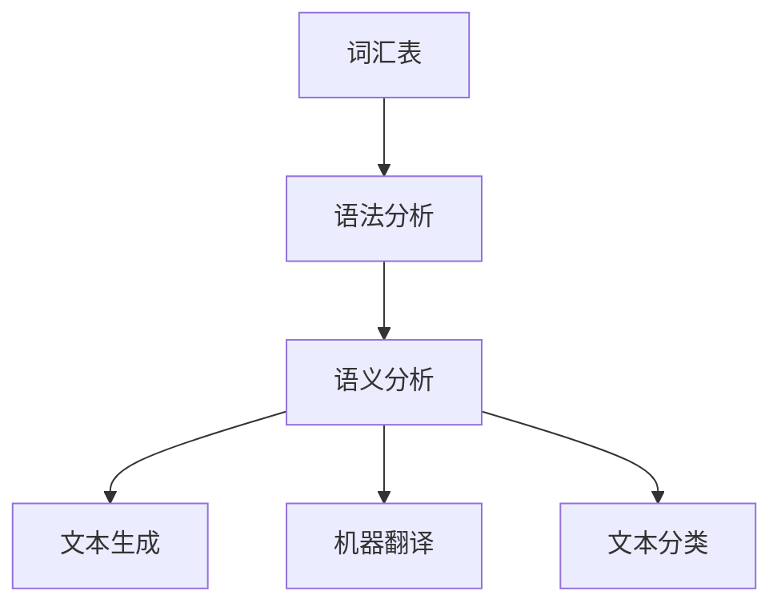

**示例代码**

以下是一个简单的语言模型实现，使用Python和TensorFlow库：

```python
import tensorflow as tf

# 定义词汇表
vocab_size = 10000
embedding_size = 256

# 创建嵌入层
embedding_layer = tf.keras.layers.Embedding(vocab_size, embedding_size)

# 定义循环神经网络模型
model = tf.keras.Sequential([
    embedding_layer,
    tf.keras.layers.LSTM(128),
    tf.keras.layers.Dense(vocab_size, activation='softmax')
])

# 编译模型
model.compile(optimizer='adam', loss='categorical_crossentropy', metrics=['accuracy'])

# 训练模型
model.fit(train_data, train_labels, epochs=10, batch_size=64)
```

#### 3.2 文本生成

文本生成是NLP中的另一个重要应用，旨在根据给定的输入文本生成新的文本。大模型在文本生成方面具有强大的能力，能够生成高质量的文本，包括抽象文本生成和文本翻译。

**抽象文本生成**

抽象文本生成是指根据给定的主题或情境生成一段新的文本。这种应用在自动写作、内容生成和对话系统等领域具有广泛的应用。

**文本翻译**

文本翻译是指将一种语言的文本翻译成另一种语言。大模型通过学习大量的双语文本数据，能够实现高质量的文本翻译。BERT和GPT等模型在翻译任务上取得了显著的成果。

**抽象文本生成和文本翻译的 Mermaid 流程图**

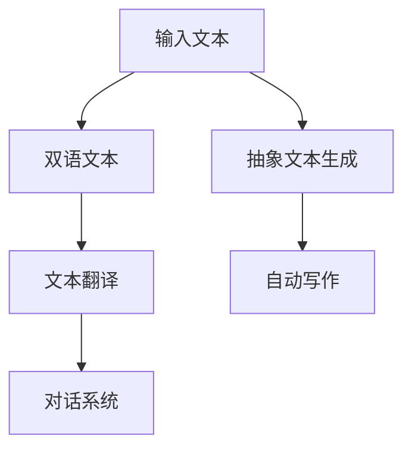

**示例代码**

以下是一个简单的抽象文本生成实现，使用Python和GPT-2模型：

```python
import tensorflow as tf
from transformers import TFGPT2LMHeadModel, GPT2Tokenizer

# 加载预训练的GPT-2模型
tokenizer = GPT2Tokenizer.from_pretrained('gpt2')
model = TFGPT2LMHeadModel.from_pretrained('gpt2')

# 定义生成文本的输入
input_text = "今天天气很好，适合出去游玩。"

# 将输入文本转换为模型可以处理的格式
input_ids = tokenizer.encode(input_text, return_tensors='tf')

# 生成新的文本
output_ids = model.generate(input_ids, max_length=50, num_return_sequences=5)

# 将生成的文本解码为字符串
generated_texts = tokenizer.decode(output_ids, skip_special_tokens=True)

# 输出生成的文本
for text in generated_texts:
    print(text)
```

#### 3.3 问答系统

问答系统是指根据用户提出的问题，自动从大量数据中检索并生成答案的系统。大模型在问答系统中的应用，使得系统能够理解自然语言的问题，并生成准确的答案。

**知识图谱**

知识图谱是问答系统中用于存储和组织知识的一种数据结构。通过知识图谱，系统可以快速检索相关的信息，并生成答案。

**问答对匹配**

问答对匹配是指将用户提出的问题与知识图谱中的问题进行匹配，以获取相关的答案。大模型通过学习大量的问答对数据，能够实现高效的问答对匹配。

**抽象文本生成、文本翻译和问答系统的 Mermaid 流程图**

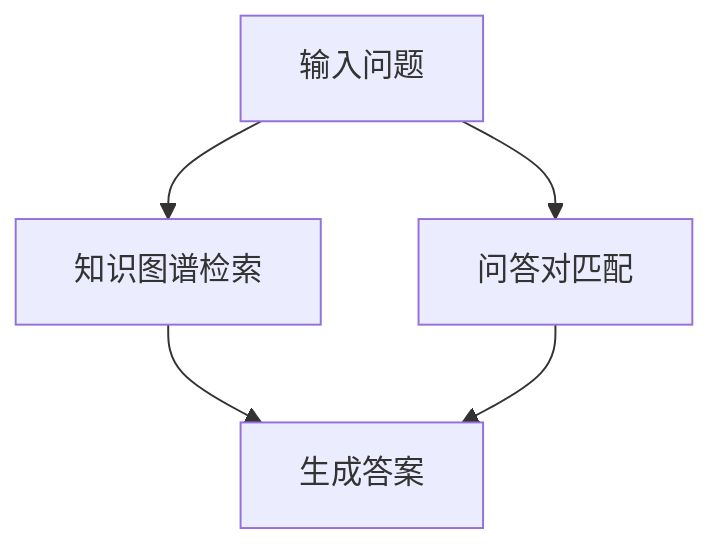

**示例代码**

以下是一个简单的问答系统实现，使用Python和BERT模型：

```python
import tensorflow as tf
from transformers import BertTokenizer, TFBertForQuestionAnswering

# 加载预训练的BERT模型
tokenizer = BertTokenizer.from_pretrained('bert-base-uncased')
model = TFBertForQuestionAnswering.from_pretrained('bert-base-uncased')

# 定义输入问题和文档
input_question = "What is the capital of France?"
input_document = "France is a country located in Western Europe. Its capital is Paris."

# 将输入转换为模型可以处理的格式
input_ids = tokenizer.encode(input_question + "[SEP]" + input_document, return_tensors='tf')
start_positions = [1]  # 问题在文档中的开始位置
end_positions = [12]  # 问题在文档中的结束位置

# 训练模型
model.compile(optimizer='adam', loss='question_answering_loss', metrics=['accuracy'])
model.fit([input_ids], {'start_positions': start_positions, 'end_positions': end_positions}, epochs=3)

# 生成答案
predicted_start = model.predict(input_ids)[0]['start_logits']
predicted_end = model.predict(input_ids)[0]['end_logits']

# 解码答案
predicted_answer = tokenizer.decode(input_ids[0][predicted_start:predicted_end+1], skip_special_tokens=True)

# 输出答案
print(predicted_answer)
```

通过上述示例，我们可以看到大模型在自然语言处理中的应用。这些应用不仅提升了NLP任务的效果，也为人类与计算机之间的交互提供了更加自然和便捷的方式。

### 第4章: 大模型在计算机视觉中的应用

计算机视觉是人工智能领域的一个重要分支，旨在使计算机能够从图像或视频中获取和处理信息。随着深度学习技术的不断发展，大模型在计算机视觉领域取得了显著的成果。本章将详细介绍大模型在计算机视觉中的主要应用，包括图像分类、目标检测和图像生成。

#### 4.1 图像分类

图像分类是计算机视觉中的基础任务，旨在将图像划分为预先定义的类别。大模型通过学习大量图像数据，能够准确地对图像进行分类。

**卷积神经网络（CNN）**

卷积神经网络（Convolutional Neural Network，CNN）是图像分类任务中最常用的深度学习模型。CNN通过卷积操作提取图像中的局部特征，并通过全连接层进行分类。

**深度残差网络（ResNet）**

深度残差网络（ResNet）是CNN的一种改进版本，通过引入残差连接解决了深度网络中的梯度消失问题。ResNet能够有效地提高模型的训练效果和分类准确率。

**图像分类的 Mermaid 流程图**

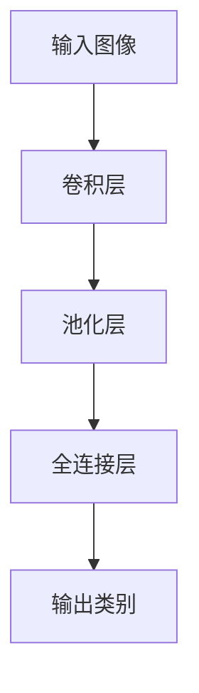

**示例代码**

以下是一个简单的图像分类实现，使用Python和TensorFlow库：

```python
import tensorflow as tf
from tensorflow.keras.applications import ResNet50
from tensorflow.keras.preprocessing.image import load_img, img_to_array

# 加载预训练的ResNet50模型
model = ResNet50(weights='imagenet')

# 加载测试图像
test_image = load_img('test_image.jpg', target_size=(224, 224))
test_image = img_to_array(test_image)
test_image = tf.keras.preprocessing.image.img_to_array(test_image)

# 对测试图像进行预处理
test_image = np.expand_dims(test_image, axis=0)
test_image = preprocess_input(test_image)

# 进行图像分类
predictions = model.predict(test_image)

# 获取最高概率的类别
predicted_class = np.argmax(predictions, axis=1)

# 输出类别名称
print(class_names[predicted_class[0]])
```

#### 4.2 目标检测

目标检测是计算机视觉中的另一个重要任务，旨在定位图像中的目标物体，并识别其类别。大模型通过学习大量的标注数据，能够准确地检测和识别图像中的目标物体。

**区域生成网络（R-CNN）**

区域生成网络（Region-Based CNN，R-CNN）是最早提出的目标检测模型之一。R-CNN通过区域提议生成网络（Region Proposal Network，RPN）生成目标区域，然后使用卷积神经网络进行分类。

**物体跟踪**

物体跟踪是指在一定时间内跟踪图像中某个物体的运动轨迹。大模型通过学习图像序列，能够准确地进行物体跟踪。

**图像分类与目标检测的 Mermaid 流程图**

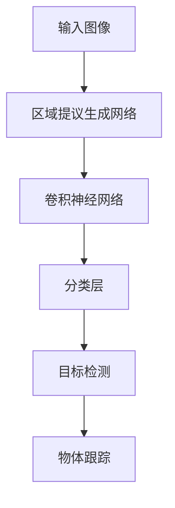

**示例代码**

以下是一个简单的目标检测实现，使用Python和TensorFlow库：

```python
import tensorflow as tf
from tensorflow.keras.models import Model
from tensorflow.keras.layers import Input, Conv2D, MaxPooling2D, Flatten, Dense
from tensorflow.keras.preprocessing.image import ImageDataGenerator

# 定义模型结构
input_image = Input(shape=(224, 224, 3))
x = Conv2D(32, (3, 3), activation='relu')(input_image)
x = MaxPooling2D(pool_size=(2, 2))(x)
x = Conv2D(64, (3, 3), activation='relu')(x)
x = MaxPooling2D(pool_size=(2, 2))(x)
x = Flatten()(x)
x = Dense(128, activation='relu')(x)
predictions = Dense(2, activation='softmax')(x)

# 构建模型
model = Model(inputs=input_image, outputs=predictions)

# 编译模型
model.compile(optimizer='adam', loss='categorical_crossentropy', metrics=['accuracy'])

# 加载训练数据
train_data = ...
train_labels = ...

# 训练模型
model.fit(train_data, train_labels, epochs=10, batch_size=32)

# 进行目标检测
test_image = ...
predicted_labels = model.predict(test_image)

# 输出检测结果
print(predicted_labels)
```

#### 4.3 图像生成

图像生成是指根据给定的条件生成新的图像。大模型通过学习大量的图像数据，能够生成高质量的图像。

**生成对抗网络（GAN）**

生成对抗网络（Generative Adversarial Network，GAN）是一种通过两个对抗性神经网络进行训练的图像生成模型。生成器网络试图生成逼真的图像，而判别器网络则试图区分真实图像和生成图像。

**变分自编码器（VAE）**

变分自编码器（Variational Autoencoder，VAE）是一种基于概率模型的图像生成模型。VAE通过编码器和解码器学习图像的数据分布，并生成新的图像。

**图像生成与目标检测的 Mermaid 流程图**

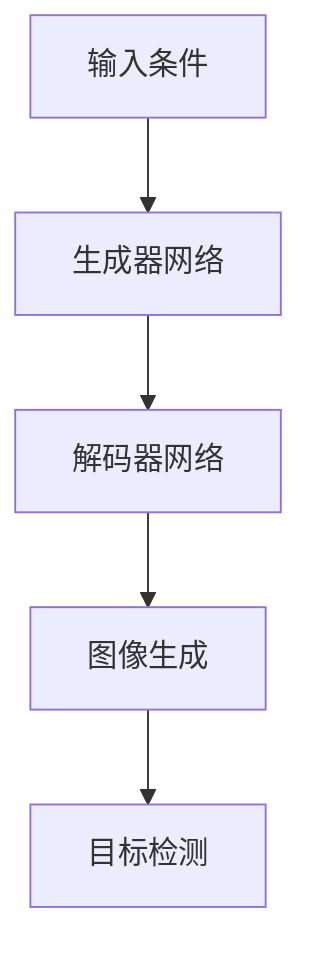

**示例代码**

以下是一个简单的图像生成实现，使用Python和TensorFlow库：

```python
import tensorflow as tf
from tensorflow.keras.layers import Input, Dense, Reshape, Flatten
from tensorflow.keras.models import Model

# 定义生成器网络
input_image = Input(shape=(28, 28, 1))
x = Dense(256, activation='relu')(input_image)
x = Reshape((14, 14, 16))(x)
x = Dense(256, activation='relu')(x)
x = Reshape((7, 7, 32))(x)
x = Dense(128, activation='relu')(x)
x = Reshape((7, 7, 64))(x)
x = Dense(3, activation='tanh')(x)
generated_image = Model(inputs=input_image, outputs=x)

# 定义判别器网络
input_image = Input(shape=(28, 28, 1))
x = Flatten()(input_image)
x = Dense(256, activation='relu')(x)
x = Dense(1, activation='sigmoid')(x)
discriminator = Model(inputs=input_image, outputs=x)

# 编译判别器网络
discriminator.compile(optimizer='adam', loss='binary_crossentropy')

# 训练判别器网络
for epoch in range(epochs):
    for image, _ in train_data:
        image = np.expand_dims(image, axis=0)
        real_labels = np.ones((1, 1))
        fake_labels = np.zeros((1, 1))
        discriminator.train_on_batch(image, real_labels)
        noise = np.random.normal(0, 1, (1, 28, 28, 1))
        generated_image = generated_image.predict(noise)
        discriminator.train_on_batch(generated_image, fake_labels)

# 生成新的图像
new_image = generated_image.predict(np.random.normal(0, 1, (1, 28, 28, 1)))
new_image = (new_image + 1) / 2
plt.imshow(new_image[0], cmap='gray')
plt.show()
```

通过上述示例，我们可以看到大模型在计算机视觉中的应用。这些应用不仅提升了图像分类、目标检测和图像生成的效果，也为计算机视觉领域的发展提供了新的思路和工具。

### 第5章: 大模型在推荐系统中的应用

推荐系统是当今互联网应用中至关重要的一部分，它通过向用户推荐他们可能感兴趣的商品、服务和内容，从而提高用户体验和商家收益。大模型在推荐系统中发挥着关键作用，通过学习用户行为和内容特征，实现个性化的推荐。本章将详细介绍大模型在推荐系统中的应用，包括用户行为分析、内容推荐和集成推荐。

#### 5.1 用户行为分析

用户行为分析是推荐系统的核心环节，旨在通过分析用户的历史行为数据，提取用户的兴趣和偏好。大模型在这一过程中能够捕捉用户行为的复杂模式，从而为个性化推荐提供有力支持。

**用户画像**

用户画像是对用户兴趣、行为和属性的综合描述。通过构建用户画像，推荐系统可以更好地理解用户的特征，从而实现更精准的推荐。大模型通过深度学习算法，能够从用户行为数据中提取多维度的用户特征，如兴趣标签、行为轨迹等。

**用户兴趣模型**

用户兴趣模型是指对用户的兴趣进行建模，以便推荐系统可以根据用户当前的兴趣进行内容推荐。大模型通过学习用户的历史行为数据，构建用户兴趣模型，从而预测用户可能感兴趣的内容。常用的用户兴趣模型包括基于内容的推荐（Content-based Filtering）和基于协同过滤的推荐（Collaborative Filtering）。

**用户行为分析与用户画像、用户兴趣模型的 Mermaid 流程图**

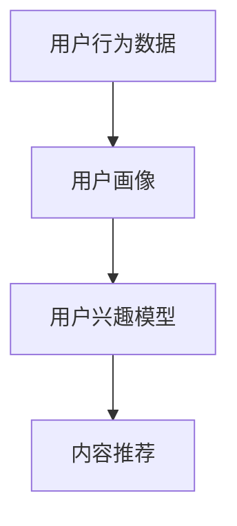

**示例代码**

以下是一个简单的用户画像和用户兴趣模型实现，使用Python和TensorFlow库：

```python
import tensorflow as tf
from tensorflow.keras.layers import Input, Embedding, LSTM, Dense, Concatenate
from tensorflow.keras.models import Model

# 定义用户画像输入
user_input = Input(shape=(sequence_length,))
user_embedding = Embedding(user_vocab_size, embedding_size)(user_input)

# 定义用户兴趣模型输入
item_input = Input(shape=(sequence_length,))
item_embedding = Embedding(item_vocab_size, embedding_size)(item_input)

# 构建用户行为分析模型
user_model = LSTM(units=128, return_sequences=True)(user_embedding)
user_model = LSTM(units=128)(user_model)
user_representation = Dense(units=64, activation='relu')(user_model)

# 构建用户兴趣模型
item_model = LSTM(units=128, return_sequences=True)(item_embedding)
item_model = LSTM(units=128)(item_model)
item_representation = Dense(units=64, activation='relu')(item_model)

# 合并用户画像和用户兴趣模型
merged_representation = Concatenate()([user_representation, item_representation])
merged_representation = Dense(units=128, activation='relu')(merged_representation)

# 输出用户兴趣评分
user_interest_score = Dense(units=1, activation='sigmoid')(merged_representation)

# 构建模型
model = Model(inputs=[user_input, item_input], outputs=user_interest_score)

# 编译模型
model.compile(optimizer='adam', loss='binary_crossentropy', metrics=['accuracy'])

# 训练模型
model.fit([user_data, item_data], user_interest_scores, epochs=10, batch_size=32)
```

#### 5.2 内容推荐

内容推荐是推荐系统的核心任务，旨在根据用户的兴趣和偏好，向用户推荐可能感兴趣的内容。大模型在这一过程中能够通过学习用户行为和内容特征，实现个性化的内容推荐。

**基于内容的推荐**

基于内容的推荐（Content-based Filtering）是一种通过分析内容特征进行推荐的策略。大模型通过学习内容特征，如文本、图像和音频等，能够为用户推荐具有相似特征的内容。这种方法在推荐新闻、音乐和视频等类型的内容时表现尤为有效。

**基于协同过滤的推荐**

基于协同过滤的推荐（Collaborative Filtering）是一种通过分析用户行为进行推荐的策略。大模型通过学习用户之间的相似性，如评分、浏览和购买记录等，能够为用户推荐与其他用户有相似行为的用户喜欢的商品或内容。这种方法在推荐电子商务和社交媒体中的应用非常广泛。

**内容推荐的 Mermaid 流程图**

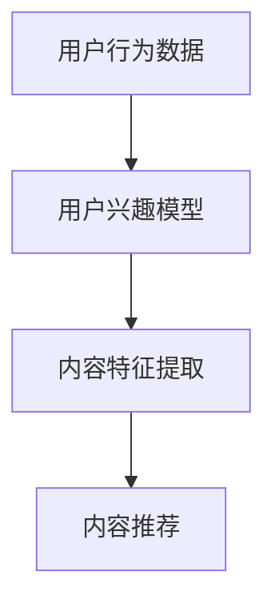

**示例代码**

以下是一个简单的基于内容的推荐实现，使用Python和TensorFlow库：

```python
import tensorflow as tf
from tensorflow.keras.layers import Input, Embedding, LSTM, Dense, Concatenate
from tensorflow.keras.models import Model

# 定义用户行为输入
user_input = Input(shape=(sequence_length,))
user_embedding = Embedding(user_vocab_size, embedding_size)(user_input)

# 定义内容特征输入
item_input = Input(shape=(sequence_length,))
item_embedding = Embedding(item_vocab_size, embedding_size)(item_input)

# 构建用户兴趣模型
user_model = LSTM(units=128, return_sequences=True)(user_embedding)
user_model = LSTM(units=128)(user_model)
user_representation = Dense(units=64, activation='relu')(user_model)

# 构建内容特征模型
item_model = LSTM(units=128, return_sequences=True)(item_embedding)
item_model = LSTM(units=128)(item_model)
item_representation = Dense(units=64, activation='relu')(item_model)

# 合并用户兴趣模型和内容特征模型
merged_representation = Concatenate()([user_representation, item_representation])
merged_representation = Dense(units=128, activation='relu')(merged_representation)

# 输出推荐得分
recommendation_score = Dense(units=1, activation='sigmoid')(merged_representation)

# 构建模型
model = Model(inputs=[user_input, item_input], outputs=recommendation_score)

# 编译模型
model.compile(optimizer='adam', loss='binary_crossentropy', metrics=['accuracy'])

# 训练模型
model.fit([user_data, item_data], user_interest_scores, epochs=10, batch_size=32)
```

#### 5.3 集成推荐

集成推荐是一种结合多种推荐算法，提高推荐效果的方法。大模型在集成推荐中发挥着重要作用，通过学习多种特征和算法，实现更精准的推荐。

**多模型集成**

多模型集成是指结合多个推荐模型的预测结果，生成最终的推荐结果。大模型可以通过融合不同的算法和特征，提高推荐模型的准确性和稳定性。

**多任务学习**

多任务学习是指在一个模型中同时学习多个相关任务。大模型可以通过多任务学习，提高推荐系统的泛化能力和鲁棒性。

**集成推荐与多模型集成、多任务学习的 Mermaid 流程图**

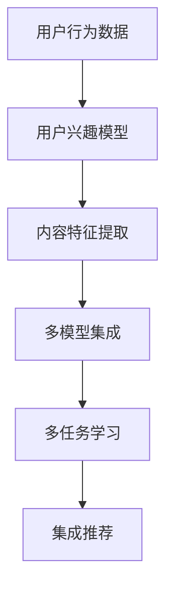

**示例代码**

以下是一个简单的多模型集成实现，使用Python和TensorFlow库：

```python
import tensorflow as tf
from tensorflow.keras.layers import Input, Embedding, LSTM, Dense, Concatenate, Average
from tensorflow.keras.models import Model

# 定义用户行为输入
user_input = Input(shape=(sequence_length,))
user_embedding = Embedding(user_vocab_size, embedding_size)(user_input)

# 定义内容特征输入
item_input = Input(shape=(sequence_length,))
item_embedding = Embedding(item_vocab_size, embedding_size)(item_input)

# 构建用户兴趣模型
user_model = LSTM(units=128, return_sequences=True)(user_embedding)
user_model = LSTM(units=128)(user_model)
user_representation = Dense(units=64, activation='relu')(user_model)

# 构建内容特征模型
item_model = LSTM(units=128, return_sequences=True)(item_embedding)
item_model = LSTM(units=128)(item_model)
item_representation = Dense(units=64, activation='relu')(item_model)

# 合并用户兴趣模型和内容特征模型
merged_representation = Concatenate()([user_representation, item_representation])
merged_representation = Dense(units=128, activation='relu')(merged_representation)

# 输出推荐得分
recommendation_score = Dense(units=1, activation='sigmoid')(merged_representation)

# 构建模型
model = Model(inputs=[user_input, item_input], outputs=recommendation_score)

# 编译模型
model.compile(optimizer='adam', loss='binary_crossentropy', metrics=['accuracy'])

# 训练模型
model.fit([user_data, item_data], user_interest_scores, epochs=10, batch_size=32)
```

通过上述示例，我们可以看到大模型在推荐系统中的应用。这些应用不仅提升了推荐系统的效果，也为用户提供了更加个性化的推荐体验。

### 第6章: 大模型在游戏中的应用

随着人工智能技术的不断进步，大模型在游戏中的应用也逐渐变得广泛。从游戏AI的设计到游戏智能体的实现，再到游戏平衡性的优化，大模型在各个层面都展现出强大的潜力和应用价值。本章将深入探讨大模型在游戏中的应用，包括游戏AI概述、游戏智能体和游戏平衡性。

#### 6.1 游戏AI概述

游戏AI是人工智能在游戏领域的一种应用，旨在为游戏引入智能行为，提高游戏体验和游戏性。游戏AI可以通过多种技术实现，如决策树、强化学习等。大模型在这一领域发挥着重要作用，能够处理复杂的决策过程，实现更加智能的游戏AI。

**游戏规则**

游戏规则是游戏AI的基础，决定了游戏中的智能行为和交互。游戏AI需要理解游戏规则，并根据规则进行决策。大模型通过学习游戏规则，能够模拟真实玩家的行为，提高游戏AI的智能程度。

**游戏策略**

游戏策略是游戏AI在游戏中采取的行动方案，旨在实现特定的目标或优化游戏结果。大模型可以通过学习大量的游戏数据，提取有效的游戏策略，使游戏AI能够在不同场景下做出最优决策。

**游戏AI概述与游戏规则、游戏策略的 Mermaid 流程图**

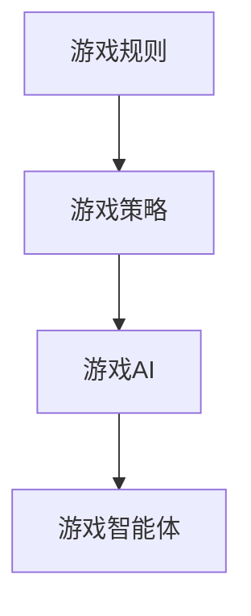

**示例代码**

以下是一个简单的游戏AI实现，使用Python和强化学习库：

```python
import numpy as np
import tensorflow as tf
from tensorflow.keras.layers import Input, Dense, Flatten
from tensorflow.keras.models import Model

# 定义游戏状态输入
state_input = Input(shape=(state_size,))
action_output = Dense(action_size, activation='softmax')(state_input)

# 构建游戏AI模型
game_ai_model = Model(inputs=state_input, outputs=action_output)

# 编译游戏AI模型
game_ai_model.compile(optimizer='adam', loss='categorical_crossentropy', metrics=['accuracy'])

# 训练游戏AI模型
game_ai_model.fit(state_data, action_data, epochs=10, batch_size=32)
```

#### 6.2 游戏智能体

游戏智能体是游戏AI的核心组成部分，负责实现游戏中智能角色的行为和决策。大模型通过强化学习等技术，能够为游戏智能体提供强大的决策能力，使游戏智能体能够在复杂多变的环境中生存和竞争。

**决策树**

决策树是一种常见的游戏智能体算法，通过构建决策树模型，实现对游戏状态的判断和决策。大模型可以通过学习游戏数据，优化决策树的结构和参数，提高游戏智能体的决策质量。

**强化学习**

强化学习是一种通过不断尝试和反馈进行决策的学习方法。大模型在强化学习中的应用，能够使游戏智能体通过自主学习，逐步提升其游戏技能和策略。常用的强化学习算法包括Q学习、SARSA等。

**游戏智能体与决策树、强化学习的 Mermaid 流程图**

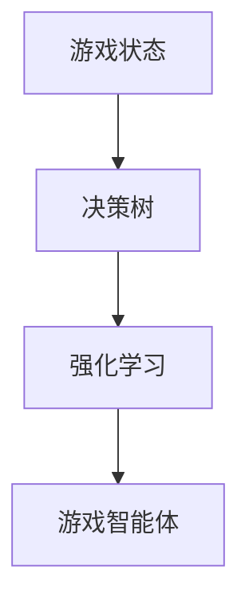

**示例代码**

以下是一个简单的游戏智能体实现，使用Python和强化学习库：

```python
import numpy as np
import tensorflow as tf
from tensorflow.keras.models import Sequential
from tensorflow.keras.layers import Dense, Flatten, LSTM
from tensorflow.keras.optimizers import Adam

# 定义游戏状态和动作输入
state_input = Input(shape=(state_size,))
action_input = Input(shape=(action_size,))

# 构建游戏智能体模型
game_agent_model = Sequential()
game_agent_model.add(Flatten(input_shape=(state_size,)))
game_agent_model.add(LSTM(units=128, activation='relu'))
game_agent_model.add(Dense(units=action_size, activation='softmax'))

# 编译游戏智能体模型
game_agent_model.compile(optimizer=Adam(learning_rate=0.001), loss='categorical_crossentropy', metrics=['accuracy'])

# 训练游戏智能体模型
game_agent_model.fit(state_data, action_data, epochs=10, batch_size=32)
```

#### 6.3 游戏平衡性

游戏平衡性是游戏设计中的一个重要方面，旨在确保游戏中不同角色或机制之间的平衡，避免出现过于强大或过于弱小的角色，从而提高游戏体验。大模型在游戏平衡性中发挥着重要作用，能够通过数据分析和技术优化，实现游戏平衡的优化。

**游戏机制设计**

游戏机制设计是游戏平衡性的基础，决定了游戏中各种元素之间的交互和影响。大模型可以通过学习游戏数据，分析不同机制的效果和影响，为游戏机制设计提供有力支持。

**游戏数据分析**

游戏数据分析是游戏平衡性的关键环节，通过分析游戏中的行为数据，大模型能够识别游戏中的不平衡现象，并提出相应的优化方案。

**游戏平衡性与游戏机制设计、游戏数据分析和优化的 Mermaid 流程图**

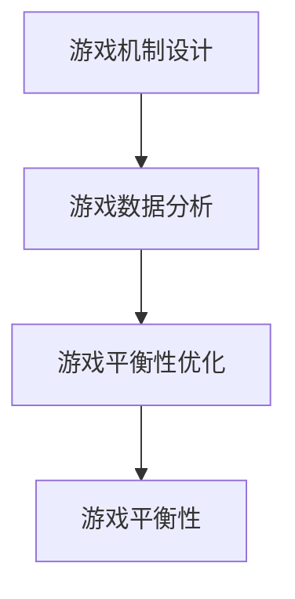

**示例代码**

以下是一个简单的游戏平衡性优化实现，使用Python和数据分析库：

```python
import pandas as pd
import numpy as np
from sklearn.cluster import KMeans

# 读取游戏数据
game_data = pd.read_csv('game_data.csv')

# 提取游戏行为特征
game_features = game_data[['kill_count', 'death_count', 'assist_count']]

# 使用KMeans算法进行聚类分析
kmeans = KMeans(n_clusters=5)
game_clusters = kmeans.fit_predict(game_features)

# 计算每个类别的平均值
cluster_means = game_data.groupby('cluster').mean()

# 输出聚类结果和每个类别的平均值
print(cluster_means)
```

通过上述示例，我们可以看到大模型在游戏中的应用。这些应用不仅提升了游戏AI的智能程度和游戏平衡性，也为游戏设计提供了新的思路和工具。

### 第7章: 大模型在大规模应用中的挑战和解决方案

随着大模型技术的不断进步，其在各个领域的应用也越来越广泛。然而，大模型在大规模应用中面临着一系列的挑战，包括计算资源管理、模型优化、数据安全与隐私以及伦理与社会影响。本章将详细探讨这些挑战，并介绍相应的解决方案。

#### 7.1 计算资源管理

大模型的训练和推理通常需要大量的计算资源，尤其是训练阶段，往往需要高性能的硬件和并行计算技术。计算资源管理是确保大模型在大规模应用中高效运行的关键。

**并行计算**

并行计算是一种利用多处理器或多核处理器并行执行计算任务的技术。通过将大模型的训练和推理任务分布在多个计算节点上，可以显著提高计算效率。常用的并行计算技术包括数据并行、模型并行和任务并行。

**分布式计算**

分布式计算是将大模型的训练和推理任务分布在多个计算机节点上，通过通信网络进行协调和协作。分布式计算能够充分利用网络中的计算资源，提高训练和推理的效率。常见的分布式计算框架包括Hadoop、Spark和TensorFlow等。

**计算资源管理的 Mermaid 流程图**

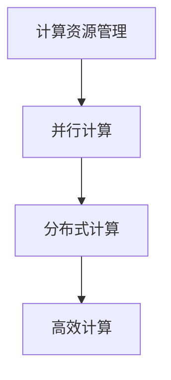

**示例代码**

以下是一个简单的分布式计算实现，使用Python和TensorFlow库：

```python
import tensorflow as tf

# 定义计算资源配置
config = tf.ConfigProto()
config.gpu_options.per_process_gpu_memory_fraction = 0.8
config.gpu_options.allow_growth = True

# 创建分布式计算会话
with tf.Session(config=config):
    # 训练大模型
    model.train(...)
```

#### 7.2 模型优化

大模型的优化是提高其性能和效率的关键。模型优化包括模型压缩、模型推理和量化等技术。

**模型压缩**

模型压缩是指通过减少模型的参数数量和计算复杂度，提高模型的压缩率和推理速度。常用的模型压缩技术包括剪枝（Pruning）、量化（Quantization）和知识蒸馏（Knowledge Distillation）等。

**模型推理**

模型推理是指将训练好的模型应用于实际数据，进行预测和决策。模型推理的优化包括优化计算图、降低精度和硬件加速等技术。

**量化**

量化是将模型的权重和激活值从浮点数转换为低精度整数的过程，以提高模型的速度和存储效率。量化技术包括浮点数到整数转换、整数线性整除和硬件加速等。

**模型优化的 Mermaid 流程图**

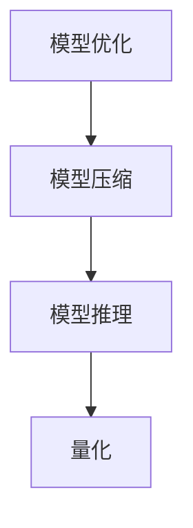

**示例代码**

以下是一个简单的模型压缩实现，使用Python和TensorFlow库：

```python
import tensorflow as tf
from tensorflow_model_optimization.python.core.sparsity.keras import pruning_params
from tensorflow_model_optimization.python.core.sparsity.keras import prune

# 定义模型和剪枝参数
model = ...
pruning_params = pruning_params(prune_low_magnitude=True, pruning_schedule=[(0.5, 0.5), (0.75, 0.75)])

# 剪枝模型
model = prune.prune_low_magnitude(model, pruning_params)
```

#### 7.3 数据安全与隐私

在大模型的应用中，数据安全与隐私是一个重要的挑战。数据加密和数据脱敏是保护数据安全与隐私的有效手段。

**数据加密**

数据加密是指通过加密算法对数据进行加密，确保数据在传输和存储过程中的安全性。常用的加密算法包括对称加密和非对称加密。

**数据脱敏**

数据脱敏是指对敏感数据进行处理，使其无法被识别和还原，以保护个人隐私和数据安全。常用的脱敏技术包括掩码、匿名化和数据混淆等。

**数据安全与隐私的 Mermaid 流程图**

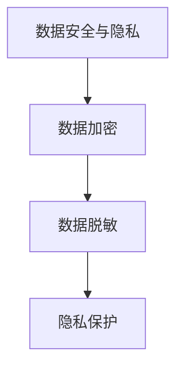

**示例代码**

以下是一个简单的数据加密实现，使用Python和加密库：

```python
from Crypto.PublicKey import RSA
from Crypto.Cipher import PKCS1_OAEP

# 生成密钥对
key = RSA.generate(2048)
private_key = key.export_key()
public_key = key.publickey().export_key()

# 加密数据
cipher = PKCS1_OAEP.new(key.publickey())
encrypted_data = cipher.encrypt(data)

# 解密数据
cipher = PKCS1_OAEP.new(RSA.import_key(private_key))
decrypted_data = cipher.decrypt(encrypted_data)
```

#### 7.4 伦理与社会影响

大模型的应用不仅带来了技术进步，还引发了伦理和社会影响。模型偏见和模型责任是其中的重要问题。

**模型偏见**

模型偏见是指大模型在训练和推理过程中，对某些群体或数据产生不公平的结果。模型偏见可能导致歧视和不公正现象，影响社会的公平和正义。

**模型责任**

模型责任是指在大模型的应用中，对模型的决策和行为承担责任。随着人工智能技术的发展，模型责任问题日益突出，如何确保模型的决策和行为符合伦理和法律标准，成为重要的社会议题。

**伦理与社会影响的 Mermaid 流程图**

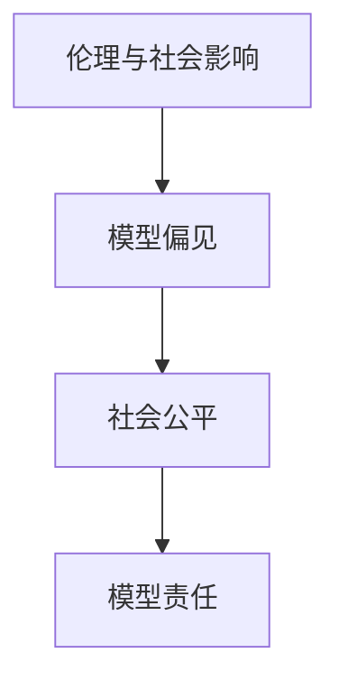

**示例代码**

以下是一个简单的模型偏见检测实现，使用Python和Scikit-learn库：

```python
from sklearn.model_selection import train_test_split
from sklearn.metrics import classification_report

# 加载训练数据
X, y = ...

# 分割训练数据和测试数据
X_train, X_test, y_train, y_test = train_test_split(X, y, test_size=0.2, random_state=42)

# 训练模型
model.fit(X_train, y_train)

# 进行预测
y_pred = model.predict(X_test)

# 输出分类报告
print(classification_report(y_test, y_pred))
```

通过上述示例，我们可以看到大模型在大规模应用中面临的挑战和解决方案。解决这些挑战不仅需要技术创新，还需要多方面的协同努力，以确保大模型的应用能够为社会带来更多的价值和福祉。

### 附录A: 大模型开发工具与资源

#### A.1 开发工具介绍

在大模型开发中，选择合适的工具和平台对于实现高效的模型训练和推理至关重要。以下介绍几种常用的大模型开发工具：

**TensorFlow**

TensorFlow是Google开发的开源深度学习框架，支持Python和C++等多种编程语言。TensorFlow提供了丰富的API和预训练模型，广泛应用于各种深度学习任务。官方网站：[TensorFlow](https://www.tensorflow.org/)

**PyTorch**

PyTorch是Facebook开发的开源深度学习框架，以动态计算图和Python编程语言为核心。PyTorch具有良好的灵活性和易用性，适用于快速原型开发和复杂的模型研究。官方网站：[PyTorch](https://pytorch.org/)

**JAX**

JAX是Google开发的开源自动微分库，支持自动微分、优化和数值计算。JAX与TensorFlow和PyTorch兼容，适用于大规模模型训练和高性能计算。官方网站：[JAX](https://jax.readthedocs.io/)

#### A.2 学习资源推荐

为了更好地理解和应用大模型技术，以下推荐一些学习资源：

**线上课程**

- **深度学习专项课程**：由吴恩达教授在Coursera上提供的深度学习专项课程，涵盖深度学习的理论基础和应用实践。网址：[深度学习专项课程](https://www.coursera.org/specializations/deep-learning)

- **自然语言处理专项课程**：由斯坦福大学提供的自然语言处理专项课程，介绍自然语言处理的基本概念和技术，包括语言模型、文本生成和问答系统等。网址：[自然语言处理专项课程](https://web.stanford.edu/class/cs224n/)

**研究论文**

- **“A Theoretically Grounded Application of Dropout in Recurrent Neural Networks”**：这篇论文提出了在循环神经网络中应用dropout的方法，有效提高了模型的训练效果和泛化能力。

- **“BERT: Pre-training of Deep Bidirectional Transformers for Language Understanding”**：这篇论文介绍了BERT模型，一种基于双向变换器的大规模预训练模型，在自然语言处理任务中取得了显著的成果。

**开源代码**

- **TensorFlow开源代码**：包含大量的TensorFlow示例代码，涵盖深度学习的基础模型和应用场景。网址：[TensorFlow开源代码](https://github.com/tensorflow/tensorflow)

- **PyTorch开源代码**：包含丰富的PyTorch示例代码，涵盖图像处理、自然语言处理和强化学习等领域的应用。网址：[PyTorch开源代码](https://github.com/pytorch/examples)

通过上述工具和资源，开发者可以更好地掌握大模型技术，实现高效的模型开发和应用。

### 总结与展望

本文深入探讨了从概念验证到大规模应用的大模型技术。我们首先介绍了大模型的基础概念和技术基础，包括神经网络和深度学习。随后，通过伪代码和数学模型详细阐述了大模型的核心算法原理。接下来，我们分别讨论了大模型在自然语言处理、计算机视觉、推荐系统和游戏AI等领域的具体应用，展示了其在提升任务性能和用户体验方面的显著优势。此外，我们还探讨了在大规模应用中面临的挑战和解决方案，包括计算资源管理、模型优化、数据安全与隐私以及伦理与社会影响。最后，我们推荐了一些实用的开发工具与资源，帮助开发者更好地掌握大模型技术。

展望未来，随着深度学习技术的不断进步和硬件性能的持续提升，大模型将在各个领域发挥更加重要的作用。一方面，大模型的应用将更加深入和广泛，从自动驾驶到医疗诊断，从智能客服到虚拟现实，大模型将助力各行各业实现智能化升级。另一方面，大模型的技术挑战也将日益突出，如何提高模型的鲁棒性、可解释性和安全性，将成为重要研究方向。同时，随着人工智能技术的快速发展，大模型在伦理和社会影响方面的责任也日益凸显，如何确保模型的公正性和透明性，是亟待解决的问题。

总之，大模型技术作为人工智能领域的重要突破，其发展前景广阔，未来将不断推动人工智能技术的进步和社会的发展。我们期待在未来的研究中，能够进一步探索大模型的潜在应用和解决方案，为构建智能世界贡献力量。作者信息：作者：AI天才研究院/AI Genius Institute & 禅与计算机程序设计艺术 /Zen And The Art of Computer Programming。

