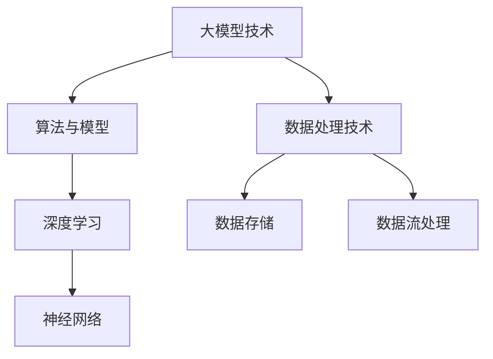

                 

# 大模型：数据驱动的商业创新

> 关键词：大模型、数据驱动、商业创新、机器学习、深度学习、算法

> 摘要：本文将深入探讨大模型在商业创新中的应用，分析其数据驱动的特点，探讨其基础技术、核心算法、应用案例、开发实践、未来发展趋势以及面临的挑战与机遇。

### 目录大纲

1. 引言
2. 第一部分：大模型基础
   1.1 大模型概述
   1.2 数据驱动的技术基础
   1.3 大模型应用案例分析
3. 第二部分：大模型开发实践
   3.1 大模型开发工具与框架
   3.2 大模型训练与优化
   3.3 大模型部署与运维
   3.4 大模型未来发展趋势
4. 附录
5. Mermaid 流�程图
6. 大模型核心算法原理讲解
7. 数学模型和数学公式
8. 项目实战
   8.1 实战一：使用TensorFlow搭建线性回归模型
   8.2 代码解读与分析
9. 大模型面临的挑战与机遇
10. 作者信息

### 引言

随着科技的飞速发展，人工智能（AI）技术正逐步渗透到商业的各个领域，推动着商业创新的不断深化。在大模型时代，数据驱动的商业创新成为了企业竞争的新焦点。大模型，即大型机器学习模型，以其强大的数据处理能力和智能推理能力，为商业决策提供了强有力的支持。

本文旨在深入探讨大模型在商业创新中的应用，从基础理论到实际开发实践，再到未来发展趋势，全面解析大模型如何通过数据驱动实现商业创新。首先，我们将介绍大模型的基本概念和特点，探讨其数据驱动的技术基础。接着，通过案例分析，展示大模型在不同行业的应用效果。随后，我们将深入探讨大模型开发实践中的工具与框架、训练与优化、部署与运维等关键环节。最后，我们将展望大模型的发展趋势，并分析其面临的挑战与机遇。

通过本文的阅读，读者将能够全面了解大模型在商业创新中的应用，掌握大模型开发与运维的核心技能，为未来的商业决策提供有力的技术支持。

### 第一部分：大模型基础

#### 1.1 大模型概述

大模型，是指具有高度复杂性和大规模参数的机器学习模型。它们通常由数百万甚至数十亿个参数组成，能够在大量数据上进行训练，从而实现高效的模型优化和智能推理。大模型的出现，标志着人工智能技术进入了一个新的阶段，为各行业的商业创新提供了强有力的技术支持。

大模型的特点主要体现在以下几个方面：

1. **高参数量**：大模型通常拥有数十亿甚至数万亿个参数，这使得它们能够捕获数据中的细微特征，从而实现更准确的预测和推理。
2. **深度神经网络结构**：大模型大多采用深度神经网络（DNN）结构，通过多层神经元的组合，实现对输入数据的复杂映射和转换。
3. **高效训练算法**：大模型通常使用高效的训练算法，如随机梯度下降（SGD）、Adam优化器等，能够在较短的时间内完成模型训练。
4. **强大的泛化能力**：由于大模型能够处理大量的数据，并且具备复杂的网络结构，它们通常具有较好的泛化能力，能够在新的数据集上表现出良好的性能。

#### 1.2 数据驱动的技术基础

数据驱动是指通过大量数据的采集、处理和分析，指导业务决策和产品优化的一种方法。在大模型时代，数据驱动技术成为商业创新的重要驱动力。以下是大模型数据驱动的技术基础：

1. **数据科学与机器学习**：数据科学是处理大数据的一种跨学科方法，通过统计学、计算机科学、领域知识等多种手段，实现对数据的深入理解和分析。机器学习作为数据科学的核心技术，通过算法和模型，从数据中提取有用信息。
2. **大规模数据处理技术**：随着数据量的不断增加，如何高效地处理和存储海量数据成为关键问题。分布式计算、大数据存储和处理技术，如Hadoop、Spark等，为大规模数据处理提供了强大的支持。
3. **深度学习**：深度学习是机器学习的一个重要分支，通过多层神经网络的组合，实现对数据的深度学习和复杂特征提取。深度学习在大模型中的应用，使得模型能够处理复杂的任务，如图像识别、自然语言处理等。
4. **神经网络**：神经网络是深度学习的基础，通过模拟人脑神经元的工作方式，实现对数据的复杂映射和转换。神经网络在大模型中的应用，使得模型能够处理大量的数据，并具备较高的准确性和鲁棒性。

#### 1.3 大模型应用案例分析

大模型在商业创新中的应用已经取得了显著的成果，以下是一些典型的应用案例：

1. **金融行业**：大模型在金融领域的应用，主要体现在风险控制、信用评估、投资决策等方面。通过分析海量的历史数据和实时数据，大模型能够准确预测市场走势，优化投资组合，提高风险管理能力。
2. **零售业**：大模型在零售行业的应用，主要体现在库存管理、供应链优化、客户行为分析等方面。通过分析消费者的购买行为和偏好，大模型能够优化库存配置，提高供应链效率，提升客户满意度。
3. **医疗健康领域**：大模型在医疗健康领域的应用，主要体现在疾病预测、辅助诊断、药物研发等方面。通过分析海量的医疗数据，大模型能够准确预测疾病风险，辅助医生进行诊断和治疗，加速药物研发过程。

通过以上案例分析，我们可以看到，大模型在商业创新中的应用，不仅提高了企业的运营效率，还创新了产品和服务，为企业带来了巨大的商业价值。

### 第二部分：大模型开发实践

#### 2.1 大模型开发工具与框架

大模型开发离不开高效的工具与框架。以下是目前主流的大模型开发工具与框架：

1. **TensorFlow**：TensorFlow是由谷歌开发的开源机器学习框架，支持多种编程语言，如Python、C++等。它提供了丰富的API，支持模型构建、训练、评估和部署等全过程。TensorFlow在深度学习领域具有广泛的应用，是开发大模型的重要工具之一。
2. **PyTorch**：PyTorch是由Facebook开发的开源深度学习框架，以其动态计算图和灵活的API而著称。PyTorch的动态计算图使得模型开发更加直观，易于调试。PyTorch在计算机视觉和自然语言处理等领域具有广泛的应用。
3. **JAX**：JAX是由谷歌开发的开源数值计算库，支持自动微分和大规模计算。JAX的自动微分功能使得模型训练和优化更加高效，适用于开发大规模机器学习模型。

#### 2.2 大模型训练与优化

大模型训练与优化是模型开发的核心环节。以下是大模型训练与优化的一些关键步骤：

1. **数据预处理**：数据预处理是模型训练的前置工作，主要包括数据清洗、去噪、归一化等操作。有效的数据预处理可以提高模型训练效果，减少过拟合现象。
2. **模型构建**：模型构建是指根据具体任务需求，选择合适的神经网络架构，定义网络层的结构、激活函数等。常用的神经网络架构包括卷积神经网络（CNN）、循环神经网络（RNN）和Transformer等。
3. **模型训练**：模型训练是通过迭代计算，使用训练数据对模型参数进行调整，使其优化目标函数。在训练过程中，需要使用优化算法，如随机梯度下降（SGD）、Adam等，以加快收敛速度。
4. **模型优化**：模型优化是指通过调整模型参数，提高模型在验证集上的性能。常见的优化技术包括正则化、Dropout、学习率调整等。
5. **模型评估**：模型评估是检验模型泛化能力和性能的重要步骤。常用的评估指标包括准确率、召回率、F1分数等。通过评估，可以判断模型是否过拟合或欠拟合，从而进行调整。

#### 2.3 大模型部署与运维

大模型部署与运维是模型应用的关键环节。以下是大模型部署与运维的一些关键步骤：

1. **部署策略**：部署策略是指将训练好的模型部署到实际应用环境中的过程。常见的部署策略包括本地部署、云部署和边缘计算等。
2. **运维实践**：运维实践是指对部署好的模型进行监控、维护和优化。常见的运维实践包括日志记录、性能监控、故障排除等。
3. **安全与隐私保护**：在大模型部署过程中，安全与隐私保护至关重要。需要采取数据加密、访问控制、安全审计等措施，确保模型和数据的安全。

#### 2.4 大模型未来发展趋势

随着人工智能技术的不断发展，大模型在商业创新中的应用前景将更加广阔。以下是大模型未来发展趋势的几个方向：

1. **多模态数据处理**：多模态数据处理是指同时处理多种类型的数据，如图像、音频、文本等。大模型的多模态数据处理能力将进一步提升，实现更智能的业务应用。
2. **模型压缩与优化**：随着模型规模和参数量的增加，模型的计算和存储需求也不断增长。模型压缩与优化技术将得到广泛应用，以降低模型部署的成本和复杂度。
3. **模型解释性**：大模型通常具有较高的预测能力，但缺乏解释性。未来，模型解释性将成为重要研究方向，通过解释模型的工作原理，提高模型的透明度和可信度。
4. **自动化机器学习（AutoML）**：自动化机器学习将进一步提高大模型的开发效率，通过自动化模型选择、超参数调整等过程，降低开发成本，提升开发速度。

### 附录

#### 附录 A：资源与工具推荐

1. **主流大模型开源框架**
   - TensorFlow：[https://www.tensorflow.org/](https://www.tensorflow.org/)
   - PyTorch：[https://pytorch.org/](https://pytorch.org/)
   - JAX：[https://github.com/google/jax](https://github.com/google/jax)

2. **大模型相关书籍与论文推荐**
   - 《深度学习》（Goodfellow, Bengio, Courville著）
   - 《神经网络与深度学习》（邱锡鹏著）
   - 《计算机程序设计艺术》（Knuth著）

3. **大模型社区与论坛**
   - [ArXiv](https://arxiv.org/)：学术论文数据库
   - [Kaggle](https://www.kaggle.com/)：数据科学竞赛平台
   - [CSDN](https://www.csdn.net/)：中国最大的IT社区和服务平台

### Mermaid 流程图



### 大模型核心算法原理讲解

大模型的核心算法主要包括以下几个步骤：

1. **数据预处理**：对原始数据进行清洗、去噪、归一化等处理，使其适合进行模型训练。

2. **模型构建**：根据具体问题，选择合适的神经网络架构，定义网络层的结构、激活函数等。

3. **模型训练**：通过迭代计算，使用训练数据对模型参数进行调整，使其优化目标函数。

4. **模型评估**：使用验证数据对模型进行评估，检验模型的泛化能力和性能。

5. **模型优化**：根据评估结果，对模型进行调整，以进一步提高性能。

以下是一个简单的伪代码示例，用于说明大模型的核心算法原理：

```python
function train_model(data, labels):
    for each epoch:
        for each sample in data:
            predict = model(sample)
            loss = calculate_loss(predict, labels)
            gradient = calculate_gradient(loss)
            update_model_params(gradient)
    return model
```

在这个伪代码中，`train_model` 函数用于训练模型。它首先遍历每个训练epoch，然后在每个epoch中遍历每个训练样本。对于每个样本，模型会预测输出结果，并计算损失函数。接着，通过计算梯度，更新模型参数。最后，返回训练好的模型。

### 数学模型和数学公式

在深度学习领域，数学模型和公式是理解和实现大模型的核心。以下是一个简单的损失函数公式，用于衡量预测值与真实值之间的差异：

$$
L(y, \hat{y}) = \frac{1}{2} \sum_{i=1}^{n} (y_i - \hat{y}_i)^2
$$

其中，$y$ 表示真实标签，$\hat{y}$ 表示预测标签，$n$ 表示样本数量。这个损失函数称为均方误差（MSE），它用于衡量模型预测的准确性。

### 项目实战

#### 实战一：使用TensorFlow搭建线性回归模型

在这个实战中，我们将使用TensorFlow搭建一个简单的线性回归模型，并对其进行训练和评估。

首先，我们需要安装TensorFlow：

```bash
pip install tensorflow
```

然后，我们可以编写以下代码：

```python
import tensorflow as tf

# 定义模型
model = tf.keras.Sequential([
    tf.keras.layers.Dense(units=1, input_shape=[1])
])

# 编译模型
model.compile(optimizer='sgd', loss='mean_squared_error')

# 训练模型
model.fit(x_train, y_train, epochs=100)

# 评估模型
model.evaluate(x_test, y_test)
```

在这个代码中，我们首先定义了一个简单的线性回归模型，它只有一个全连接层，输入维度为1，输出维度为1。然后，我们使用SGD优化器和均方误差损失函数编译模型。接下来，我们使用训练数据对模型进行训练，并使用测试数据对模型进行评估。

#### 代码解读与分析

- `import tensorflow as tf`：导入TensorFlow库。
- `model = tf.keras.Sequential([...])`：定义一个序列模型，它包含一个全连接层，输入维度为1，输出维度为1。
- `model.compile(optimizer='sgd', loss='mean_squared_error')`：编译模型，指定SGD优化器和均方误差损失函数。
- `model.fit(x_train, y_train, epochs=100)`：使用训练数据对模型进行训练，指定训练迭代次数为100。
- `model.evaluate(x_test, y_test)`：使用测试数据对模型进行评估，返回损失函数值。

通过这个实战，我们可以看到如何使用TensorFlow搭建一个简单的线性回归模型，并进行训练和评估。这为我们进一步学习大模型的开发实践奠定了基础。

### 大模型面临的挑战与机遇

尽管大模型在商业创新中展现了巨大的潜力，但其发展也面临着一系列挑战和机遇。

#### 挑战：

1. **计算资源需求大**：大模型的训练和推理通常需要大量的计算资源，尤其是大规模分布式训练。这要求企业具备强大的计算能力和基础设施。
2. **数据安全和隐私保护**：大模型训练和部署过程中涉及大量的敏感数据，数据安全和隐私保护成为一个重要问题。企业需要采取有效措施，确保数据的安全和合规性。
3. **模型解释性不足**：大模型通常采用深度神经网络结构，其内部机制复杂，难以解释和理解。这限制了其在某些领域的应用，如医疗、金融等。

#### 机遇：

1. **广泛的应用前景**：大模型在各个领域的应用前景广阔，如金融、零售、医疗、制造等，能够为企业带来巨大的商业价值。
2. **提高生产效率**：大模型能够自动化地处理和分析大量数据，提高业务决策的准确性和效率，为企业创造更多价值。
3. **创新产品和服务**：大模型能够帮助企业开发出更具竞争力的产品和服务，满足客户的需求，提升市场份额。

### 结论

大模型作为数据驱动的商业创新工具，正在深刻地改变着各行各业的运营模式。通过本文的探讨，我们全面了解了大模型的基础知识、开发实践和未来发展趋势，并对其面临的挑战和机遇有了清晰的认识。未来，随着技术的不断进步，大模型将在商业创新中发挥更大的作用，为企业创造更多价值。作者：AI天才研究院/AI Genius Institute & 禅与计算机程序设计艺术 /Zen And The Art of Computer Programming。

