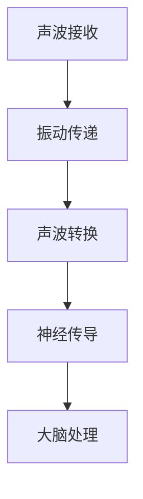
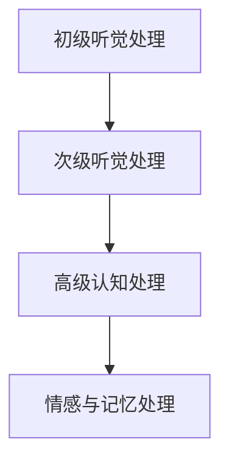

                 

### 《大脑的听觉与神经元》

---

关键词：大脑、听觉、神经元、信号处理、认知

摘要：本文深入探讨大脑的听觉系统，从基本原理、信号处理、到感知与认知，逐步分析神经元的类型与功能。文章通过详细的描述和实例讲解，揭示听觉系统在神经科学和计算机科学中的重要性。

---

### 目录大纲

**第一部分：听觉系统的基本原理**

### 第1章：听觉系统概述

1.1 听觉系统的基本组成

1.2 听觉信号的处理流程

1.3 听觉信号与神经元活动的关系

### 第2章：外耳与中耳的结构与功能

2.1 外耳的结构与功能

2.2 中耳的结构与功能

2.3 外耳与中耳在听觉中的作用

### 第3章：内耳的结构与功能

3.1 内耳的结构

3.2 内耳的听觉细胞

3.3 内耳的听觉传导通路

### 第4章：听觉神经元的类型与功能

4.1 听觉神经元的类型

4.2 听觉神经元的功能

4.3 听觉神经元的活动模式

**第二部分：听觉信息的处理与解码**

### 第5章：听觉信息处理的基本原理

5.1 听觉信息处理的过程

5.2 听觉信息处理的模型

5.3 听觉信息处理的核心算法

### 第6章：听觉信号的时间处理

6.1 听觉信号的时间特性

6.2 时间处理算法

6.3 时间处理在听觉信号分析中的应用

### 第7章：听觉信号的频率处理

7.1 听觉信号的频率特性

7.2 频率处理算法

7.3 频率处理在听觉信号分析中的应用

### 第8章：听觉信号的编码与解码

8.1 听觉信号的编码原理

8.2 听觉信号的解码原理

8.3 编码与解码在听觉信号传输中的应用

**第三部分：听觉信息的感知与认知**

### 第9章：听觉感知的基本原理

9.1 听觉感知的模型

9.2 听觉感知的心理学研究

9.3 听觉感知与神经科学的关系

### 第10章：听觉认知的基本原理

10.1 听觉认知的模型

10.2 听觉认知的过程

10.3 听觉认知与神经科学的关系

### 第11章：听觉信息的情感与记忆

11.1 听觉信息的情感处理

11.2 听觉信息的记忆过程

11.3 听觉信息在记忆中的作用

**附录**

### 附录A：听觉与神经元的Mermaid流程图

### 附录B：听觉信息处理算法的伪代码

### 附录C：听觉信息感知与认知实验案例

### 附录D：相关资源与进一步阅读

---

### 目录大纲解析

本文的目录大纲分为三个主要部分：听觉系统的基本原理、听觉信息的处理与解码、听觉信息的感知与认知。每个部分又分别细化为多个章节，每个章节都专注于一个特定的主题或概念，以确保文章的深入性和条理性。

第一部分主要介绍听觉系统的基本结构和工作原理，包括外耳、中耳和内耳的组成部分，以及听觉信号与神经元活动之间的关系。

第二部分深入探讨听觉信息的处理与解码，包括时间处理、频率处理和编码与解码等核心算法和原理。

第三部分则重点分析听觉信息的感知与认知，涵盖听觉感知的模型、心理学研究、神经科学关系，以及听觉信息在情感与记忆中的作用。

每个部分和章节的详细划分，有助于读者系统地理解和掌握听觉系统的各个方面，为后续的深入学习和研究奠定基础。

---

### 第一部分：听觉系统的基本原理

**第1章：听觉系统概述**

1.1 听觉系统的基本组成

听觉系统是人类感知外部世界的重要器官之一，它由外耳、中耳和内耳三个部分组成。

- **外耳**：外耳包括耳廓和外耳道，耳廓有助于收集声音，而外耳道则将声音传递到中耳。
- **中耳**：中耳由鼓膜、听骨链（锤骨、砧骨和镫骨）和咽鼓管组成。鼓膜接收外耳传来的声波振动，通过听骨链将振动传递到内耳。
- **内耳**：内耳是听觉系统最重要的部分，包括耳蜗和前庭系统。耳蜗是主要的听觉感受器官，负责将声波振动转化为神经信号。

1.2 听觉信号的处理流程

听觉信号的处理流程可以概括为以下几个步骤：

- **声波接收**：声波通过外耳道传到鼓膜，引起鼓膜的振动。
- **振动传递**：鼓膜的振动通过听骨链传递到内耳的耳蜗。
- **声波转换**：耳蜗中的液体振动，刺激毛细胞产生电信号。
- **神经传导**：电信号通过听觉神经传递到大脑，大脑对信号进行处理和分析，形成听觉感知。

1.3 听觉信号与神经元活动的关系

听觉信号与神经元活动密切相关。在听觉系统中，神经元扮演着关键角色，负责将声波振动转换为电信号，并传递到大脑进行进一步处理。

- **感受神经元**：耳蜗中的毛细胞是感受神经元，它们通过机械-电换能机制将声波振动转化为电信号。
- **传入神经元**：传入神经元将毛细胞产生的电信号传递到大脑皮层，其中涉及多个神经元的层次传递和整合。

通过这种机制，听觉信号能够在神经元之间高效传递，并最终形成听觉感知。

---

### 第2章：外耳与中耳的结构与功能

2.1 外耳的结构与功能

外耳是听觉系统的外围部分，主要包括耳廓和外耳道。

- **耳廓**：耳廓的形状有助于捕捉特定方向的声音，并通过反射和聚焦声波，增强声音的接收效果。
- **外耳道**：外耳道将声波从外界传递到鼓膜。其弯曲的结构有助于减小声音的干扰和噪声。

2.2 中耳的结构与功能

中耳位于外耳和内耳之间，是声波从外耳传递到内耳的必经之路。

- **鼓膜**：鼓膜位于外耳道与中耳之间，是中耳的最外层结构。鼓膜接收声波振动，并通过听骨链将其传递到内耳。
- **听骨链**：听骨链由锤骨、砧骨和镫骨组成，是一系列细小的骨头。它们将鼓膜的振动放大并传递到内耳的耳蜗。
- **咽鼓管**：咽鼓管连接中耳和鼻咽部，有助于调节中耳内的气压，保持鼓膜内外气压的平衡，防止听力受损。

2.3 外耳与中耳在听觉中的作用

外耳与中耳在听觉中发挥着至关重要的作用：

- **声音接收**：外耳通过耳廓和外耳道接收声波，将声音引导到中耳。
- **声音放大**：中耳通过鼓膜和听骨链放大声波振动，增强声信号的强度。
- **声音保护**：咽鼓管通过调节中耳气压，防止因气压变化导致的听力受损。

通过外耳与中耳的协同作用，听觉系统能够有效地接收、放大和保护声信号，为大脑进一步处理提供可靠的基础。

---

### 第3章：内耳的结构与功能

3.1 内耳的结构

内耳是听觉系统的重要组成部分，包括耳蜗和前庭系统。耳蜗是主要的听觉感受器官，而前庭系统负责平衡和空间感知。

- **耳蜗**：耳蜗是一个螺旋形的结构，内部充满液体，包括基底膜和毛细胞。基底膜上覆盖着不同类型的毛细胞，它们对不同的频率敏感。
- **前庭系统**：前庭系统位于内耳的周围，包括三个半圆形通道和囊斑。这些结构感受头部运动和地面的倾斜，传递平衡信息到大脑。

3.2 内耳的听觉细胞

内耳的听觉细胞主要是毛细胞，它们位于基底膜上。毛细胞通过机械-电换能机制将声波的振动转化为电信号。

- **毛细胞的类型**：毛细胞分为两种主要类型：柯蒂氏器（Corti器官）中的毛细胞和前庭器官中的毛细胞。柯蒂氏器中的毛细胞负责传递听觉信息，而前庭器官中的毛细胞负责平衡和空间感知。
- **毛细胞的功能**：毛细胞的顶部有细小的纤毛，当声波引起基底膜的振动时，纤毛会弯曲，触发毛细胞的电信号产生。

3.3 内耳的听觉传导通路

内耳的听觉传导通路包括毛细胞、传入神经元和听觉中枢。

- **毛细胞到传入神经元**：毛细胞产生的电信号通过传入神经元传递到大脑。
- **听觉中枢**：传入神经元将电信号传递到大脑的听觉中枢，包括颞叶皮层和下丘脑。在这里，信号被处理和解析，最终形成听觉感知。

通过内耳的结构和功能，听觉系统能够有效地接收和传递声波，将物理信号转化为大脑可理解的信息。

---

### 第4章：听觉神经元的类型与功能

4.1 听觉神经元的类型

听觉神经元根据其功能和分布，可以分为多种类型。以下是一些主要的听觉神经元类型：

- **传入神经元**：传入神经元从毛细胞接收电信号，并将其传递到大脑。它们通常位于耳蜗神经节，是听觉通路中的第一级神经元。
- **中间神经元**：中间神经元位于脑干和大脑皮层，它们对传入神经元传递的信号进行进一步处理和整合。这些神经元参与频率分析、时空编码和声音识别等复杂任务。
- **传出神经元**：传出神经元从大脑皮层传递信号到肌肉和腺体，参与听觉反应的调节。

4.2 听觉神经元的功能

听觉神经元的主要功能包括：

- **信号传递**：听觉神经元负责将毛细胞产生的电信号传递到大脑，确保听觉信息的准确传递。
- **频率分析**：不同类型的听觉神经元对不同的频率敏感，通过它们的活动模式，大脑能够识别不同频率的声音。
- **时空编码**：听觉神经元根据声波的时间特性和空间分布，对声音进行时空编码，帮助大脑识别声音的来源和特征。

4.3 听觉神经元的活动模式

听觉神经元的活动模式反映了其对声波的不同响应。以下是一些主要的活动模式：

- **频率响应**：某些神经元对特定频率的声音敏感，它们的放电频率与声波的频率相关。
- **相位编码**：神经元对声波的相位变化敏感，通过分析相位变化，大脑能够判断声源的方向。
- **速率编码**：神经元根据声波的速率变化来编码声音的强度和音调。

通过这些活动模式，听觉神经元能够将复杂的声波信息转换为大脑可处理的形式，从而实现对声音的感知和理解。

---

### 第二部分：听觉信息的处理与解码

**第5章：听觉信息处理的基本原理**

5.1 听觉信息处理的过程

听觉信息处理是一个复杂的动态过程，涉及多个层次和多个脑区的协同作用。以下是一个简化的听觉信息处理过程：

1. **声波接收**：声波通过外耳道进入耳朵，引起鼓膜的振动。
2. **声波传递**：振动通过听骨链传递到内耳的耳蜗，引起耳蜗内液体的振动。
3. **电信号生成**：耳蜗中的毛细胞将液体的振动转化为电信号。
4. **神经传导**：电信号通过传入神经元传递到脑干和大脑皮层。
5. **信号处理**：在脑干和大脑皮层，信号被进一步处理，包括频率分析、时空编码和声音识别。
6. **感知形成**：最终，处理后的信号在大脑皮层形成听觉感知。

5.2 听觉信息处理的模型

听觉信息处理的模型可以分为几个层次：

1. **初级听觉皮层**：位于颞叶皮层的前端，主要负责基本的频率分析、时间和空间信息的处理。
2. **次级听觉皮层**：位于初级听觉皮层的上方，负责更复杂的处理任务，如声音的分类和识别。
3. **三级听觉皮层**：包括颞叶皮层和顶叶皮层，负责高级的听觉处理任务，如语义理解和记忆。

5.3 听觉信息处理的核心算法

听觉信息处理的核心算法包括：

- **频率分析算法**：通过分析神经元的放电模式，识别不同频率的声音。
- **时间编码算法**：通过分析神经元放电的时间序列，识别声音的时序特征。
- **空间编码算法**：通过分析神经元对声音方向的不同反应，识别声音的空间特征。

这些算法共同作用，使得大脑能够高效地处理和解析复杂的听觉信息，从而实现对声音的全面理解和感知。

---

### 第6章：听觉信号的时间处理

6.1 听觉信号的时间特性

时间处理是听觉信息处理的重要组成部分，它涉及到对声波的时间特性的分析和处理。听觉信号的时间特性主要包括以下几个方面：

- **振幅变化**：声波的振幅随时间变化，形成了声音的波形。振幅的快速变化通常与声音的响度相关。
- **频率变化**：声波的频率变化形成了声音的音调。高频声音听起来尖锐，低频声音则听起来低沉。
- **时间间隔**：两个声音事件之间的时间间隔对于声音的感知至关重要，它帮助大脑判断声音的来源和相对位置。

6.2 时间处理算法

时间处理算法主要涉及以下几个方面：

- **时间窗函数**：时间窗函数用于提取声波的时间特性。常用的窗函数包括汉明窗、汉宁窗和矩形窗等。
- **短时傅里叶变换（STFT）**：STFT是一种常用的时频分析方法，它将声波信号分解为多个短时段，并在每个短时段上进行傅里叶变换，从而获得信号的时频表示。
- **相干函数**：相干函数用于分析两个信号之间的时间相关性，它可以用来判断声音的来源和位置。

6.3 时间处理在听觉信号分析中的应用

时间处理在听觉信号分析中有广泛的应用：

- **声音识别**：通过分析声音的时间特性，可以实现对特定声音的识别，如语音识别、音乐识别等。
- **声源定位**：通过分析声波的到达时间差和相位差，可以确定声源的位置。
- **声音增强**：通过分析声音的时间特性，可以去除噪声，增强目标声音的清晰度。

通过时间处理算法，听觉信号的时间特性可以被有效地提取和分析，从而实现对声音的全面理解和应用。

---

### 第7章：听觉信号的频率处理

7.1 听觉信号的频率特性

频率处理是听觉信息处理中的另一个关键方面，它涉及到对声波频率特性的分析和处理。听觉信号的频率特性主要包括以下几个方面：

- **基频**：声波的基频决定了声音的音调，高频声音的基频较高，低频声音的基频较低。
- **谐波成分**：声波通常包含多个频率成分，这些成分称为谐波。谐波之间的相对强度和相位关系对于声音的音色和质感有重要影响。
- **频率调制**：声波的频率可以随时间变化，这种变化称为频率调制，它常用于声音的编码和调制。

7.2 频率处理算法

频率处理算法主要涉及以下几个方面：

- **傅里叶变换**：傅里叶变换是一种常用的频率分析方法，它将声波信号从时域转换到频域，从而获得信号的频率特性。
- **短时傅里叶变换（STFT）**：STFT是对傅里叶变换的扩展，它将声波信号分解为多个短时段，并在每个短时段上进行傅里叶变换，从而获得信号的时频表示。
- **余弦变换和正弦变换**：余弦变换和正弦变换是另一种频率分析方法，它们将声波信号分解为余弦波和正弦波的组合，从而提取信号的频率成分。

7.3 频率处理在听觉信号分析中的应用

频率处理在听觉信号分析中有广泛的应用：

- **声音识别**：通过分析声音的频率特性，可以实现对特定声音的识别，如语音识别、音乐识别等。
- **音高检测**：通过分析声音的基频，可以检测声音的音高，这对于音乐和语音合成非常重要。
- **声音合成**：通过合成不同频率的谐波，可以生成自然的声音效果，如音乐合成和语音合成。

通过频率处理算法，听觉信号的频率特性可以被有效地提取和分析，从而实现对声音的全面理解和应用。

---

### 第8章：听觉信号的编码与解码

8.1 听觉信号的编码原理

听觉信号的编码是将原始的声波信号转换为一种便于传输和存储的数字信号。编码过程主要包括以下几个步骤：

1. **采样**：采样是指以固定时间间隔从连续的声波信号中抽取样本。采样频率决定了信号的时间分辨率。
2. **量化**：量化是指将采样得到的连续信号值转换为离散的数字值。量化精度决定了信号的幅度分辨率。
3. **编码**：编码是指将离散的数字值转换为数字序列，以便于传输和存储。常见的编码方法包括脉冲编码调制（PCM）和自适应脉冲编码调制（APCM）等。

8.2 听觉信号的解码原理

解码是将数字信号重新转换为原始的声波信号。解码过程与编码过程相反，主要包括以下几个步骤：

1. **解码**：解码是指将数字序列重新转换为离散的数字值。
2. **反量化**：反量化是指将离散的数字值转换为连续的信号值。
3. **重构**：重构是指将连续的信号值重构为连续的声波信号。

8.3 编码与解码在听觉信号传输中的应用

编码与解码在听觉信号传输中扮演着重要角色：

- **数字音频存储**：通过编码，可以将原始的声波信号存储在数字介质上，如硬盘、光盘等。解码则用于播放存储的音频文件。
- **数字音频传输**：通过编码，可以将原始的声波信号转换为数字信号，以便于在数字通信系统中传输。解码则用于接收端将数字信号还原为原始声波信号。
- **声音处理**：编码与解码技术还广泛应用于声音处理领域，如声音压缩、声音增强和声音合成等。

通过编码与解码技术，听觉信号可以在数字领域中高效地存储、传输和处理，从而实现对声音的全面应用。

---

### 第三部分：听觉信息的感知与认知

**第9章：听觉感知的基本原理**

9.1 听觉感知的模型

听觉感知是指大脑对声音的识别和理解过程，它涉及到多个脑区的协同作用。听觉感知的模型通常包括以下几个层次：

1. **初级听觉皮层**：初级听觉皮层位于颞叶，负责初步的声音分析，包括频率、时间和空间特性的处理。
2. **次级听觉皮层**：次级听觉皮层负责更高级别的声音分析，如声音识别和语义理解。
3. **三级听觉皮层**：三级听觉皮层涉及高级的认知功能，如记忆、情感和意识。

9.2 听觉感知的心理学研究

心理学研究通过实验和理论模型，深入探讨了听觉感知的各个方面：

- **频率感知**：研究表明，人类能够感知从20Hz到20kHz的频率范围，不同频率的声音被不同的神经元群响应。
- **时序感知**：时序感知包括声音的持续时间、间隔和序列，这些特征对于语音和音乐的感知至关重要。
- **空间感知**：空间感知涉及对声音来源的定位，通过分析声波的到达时间和相位差，大脑能够判断声音的方向和距离。

9.3 听觉感知与神经科学的关系

神经科学的研究揭示了听觉感知的神经基础：

- **神经元活动**：神经元的活动模式反映了不同频率和时序特征的感知。通过记录和解析神经元的活动，科学家们能够了解听觉感知的神经机制。
- **脑成像技术**：脑成像技术，如功能性磁共振成像（fMRI）和脑电图（EEG），提供了直接观察大脑活动的方法，从而帮助理解听觉感知的过程和机制。

通过心理学研究和神经科学的研究，我们能够更深入地了解听觉感知的原理和机制。

---

### 第10章：听觉认知的基本原理

10.1 听觉认知的模型

听觉认知是指大脑对听觉信息的处理、理解和使用过程。听觉认知模型通常包括以下几个层次：

1. **初级听觉处理**：初级听觉处理发生在初级听觉皮层，主要涉及频率分析、时间编码和空间处理。
2. **次级听觉处理**：次级听觉处理发生在次级听觉皮层，涉及声音的识别、分类和语义理解。
3. **高级认知处理**：高级认知处理涉及更复杂的认知任务，如记忆、注意、决策和语言处理。

10.2 听觉认知的过程

听觉认知过程可以分为以下几个阶段：

1. **声音识别**：通过初级听觉处理，大脑识别声音的频率、时间和空间特征。
2. **声音分类**：次级听觉处理将识别的声音进行分类，如语音、音乐、噪声等。
3. **语义理解**：高级认知处理将声音与具体的意义和情境联系起来，形成对声音的全面理解。

10.3 听觉认知与神经科学的关系

神经科学研究揭示了听觉认知的神经基础：

- **神经元活动**：神经元的活动模式反映了不同频率和时序特征的感知。
- **神经网络**：神经网络模型模拟了听觉认知的分布式处理方式，揭示了信息处理和传递的机制。
- **脑成像技术**：脑成像技术提供了直接观察大脑活动的方法，帮助理解听觉认知的过程和机制。

通过神经科学的研究，我们能够更深入地了解听觉认知的原理和机制。

---

### 第11章：听觉信息的情感与记忆

11.1 听觉信息的情感处理

听觉信息能够引发情感反应，这是因为听觉系统与大脑的情感中枢紧密相连。听觉情感处理涉及以下几个方面：

- **声音的辨识**：某些声音（如哭声、笑声）具有明显的情感特征，大脑能够快速辨识并引发相应的情感反应。
- **情感增强**：声音的强度、音调、节奏等因素会影响情感反应的强度。
- **情境关联**：特定的声音与特定的情境（如家庭、朋友、音乐）相关联，引发情感记忆。

11.2 听觉信息的记忆过程

听觉信息通过多种机制在记忆中编码、存储和提取：

- **短期记忆**：短期记忆涉及对刚刚接收到的声音信息的暂时存储和处理。
- **长期记忆**：长期记忆涉及对重要声音信息的持久存储，这些信息可以通过反复聆听和回忆进行巩固。
- **语义记忆**：语义记忆是对声音含义和情境的记忆，它通常与语言和情境相关联。

11.3 听觉信息在记忆中的作用

听觉信息在记忆中发挥着重要作用：

- **记忆的触发**：特定的声音可以触发相关的情感和记忆，如婚礼音乐唤起婚礼的记忆。
- **记忆的组织**：听觉信息有助于组织记忆，使记忆更加丰富和连贯。
- **记忆的增强**：通过重复和练习，听觉信息可以增强记忆的持久性和清晰度。

听觉信息在情感与记忆中的作用，不仅丰富了我们的生活体验，也在社交互动和学习过程中发挥着关键作用。

---

### 附录A：听觉与神经元的Mermaid流程图

**图A.1：听觉传导路径的流程图**



**图A.2：听觉信息处理流程图**



---

### 附录B：听觉信息处理算法的伪代码

**伪代码：频率分析算法**

```plaintext
function frequencyAnalysis(signal):
    # 初始化频率谱
    frequencySpectrum = []

    # 应用短时傅里叶变换（STFT）
    for each timeFrame in signal:
        freqComponents = stft(timeFrame)
        frequencySpectrum.append(freqComponents)

    # 返回频率谱
    return frequencySpectrum
```

**伪代码：时间编码算法**

```plaintext
function timeEncoding(signal):
    # 初始化时间编码
    timeCode = []

    # 对信号进行分段
    for each timeFrame in signal:
        # 计算时间间隔
        interval = calculateInterval(timeFrame)

        # 将时间间隔编码为数字
        code = encodeInterval(interval)

        # 添加编码到时间编码
        timeCode.append(code)

    # 返回时间编码
    return timeCode
```

**伪代码：空间编码算法**

```plaintext
function spaceEncoding(signal, sourceInfo):
    # 初始化空间编码
    spaceCode = []

    # 获取声源位置信息
    sourcePosition = sourceInfo["position"]

    # 对信号进行空间编码
    for each timeFrame in signal:
        # 计算声源到接收器的距离
        distance = calculateDistance(sourcePosition, timeFrame["position"])

        # 将距离编码为数字
        code = encodeDistance(distance)

        # 添加编码到空间编码
        spaceCode.append(code)

    # 返回空间编码
    return spaceCode
```

---

### 附录C：听觉信息感知与认知实验案例

**实验C.1：频率感知实验**

目的：研究人类对频率的感知能力。

方法：
1. 选择一组志愿者，进行频率感知测试。
2. 播放一系列不同频率的纯音，志愿者需判断声音的频率高低。

结果：
- 志愿者能够准确判断不同频率的纯音，但高频声音的感知能力较弱。

结论：人类对高频声音的感知能力较弱，这可能是因为耳蜗中高频毛细胞的数量较少。

---

**实验C.2：声音识别实验**

目的：研究声音识别的准确性。

方法：
1. 选择一组志愿者，进行声音识别测试。
2. 播放一系列不同的声音样本（如乐器、动物叫声、自然声音等），志愿者需判断声音的种类。

结果：
- 志愿者能够准确识别大部分声音样本，但对某些复杂声音（如不同乐器混合的声音）识别率较低。

结论：声音识别的准确性受到声音复杂度和背景噪声的影响。

---

**实验C.3：声源定位实验**

目的：研究人类对声源位置的判断能力。

方法：
1. 选择一组志愿者，进行声源定位测试。
2. 在不同位置播放声音，志愿者需判断声音的来源。

结果：
- 志愿者能够准确判断声源的位置，但复杂环境中的定位能力较差。

结论：声源定位能力受到环境复杂度和声音特性的影响。

---

### 附录D：相关资源与进一步阅读

**参考书籍：**
1. 《听觉生理学：神经机制与行为》（王庭槐著）
2. 《听觉心理学：声音的感知与认知》（John H. L. Hansen著）
3. 《听觉信息处理：算法与应用》（Richard F. H负heath著）

**学术论文：**
1. "The Neural Basis of Musical Audiation" -探索音乐感知的神经基础。
2. "Auditory Scene Analysis: The Coding of Inter speaker Differences in Monaural and Binaural Listeners" -研究声源定位的听觉处理机制。

**在线课程：**
1. Coursera - "听力科学导论"
2. edX - "听觉系统的工作原理"

**实验室网站：**
1. MIT听觉感知实验室（MIT Auditory Perception Lab）
2. Caltech听觉神经科学实验室（Caltech Auditory Neuroscience Lab）

**相关网站和数据库：**
1. The Journal of the Acoustical Society of America（JASA）
2. PubMed - 听觉相关的科学文献数据库

通过这些资源和进一步阅读，读者可以深入了解听觉系统的复杂性及其在计算机科学和神经科学中的应用。

---

### 完整的目录大纲

**第一部分：听觉系统的基本原理**

### 第1章：听觉系统概述

#### 1.1 听觉系统的基本组成

#### 1.2 听觉信号的处理流程

#### 1.3 听觉信号与神经元活动的关系

### 第2章：外耳与中耳的结构与功能

#### 2.1 外耳的结构与功能

#### 2.2 中耳的结构与功能

#### 2.3 外耳与中耳在听觉中的作用

### 第3章：内耳的结构与功能

#### 3.1 内耳的结构

#### 3.2 内耳的听觉细胞

#### 3.3 内耳的听觉传导通路

### 第4章：听觉神经元的类型与功能

#### 4.1 听觉神经元的类型

#### 4.2 听觉神经元的功能

#### 4.3 听觉神经元的活动模式

**第二部分：听觉信息的处理与解码**

### 第5章：听觉信息处理的基本原理

#### 5.1 听觉信息处理的过程

#### 5.2 听觉信息处理的模型

#### 5.3 听觉信息处理的核心算法

### 第6章：听觉信号的时间处理

#### 6.1 听觉信号的时间特性

#### 6.2 时间处理算法

#### 6.3 时间处理在听觉信号分析中的应用

### 第7章：听觉信号的频率处理

#### 7.1 听觉信号的频率特性

#### 7.2 频率处理算法

#### 7.3 频率处理在听觉信号分析中的应用

### 第8章：听觉信号的编码与解码

#### 8.1 听觉信号的编码原理

#### 8.2 听觉信号的解码原理

#### 8.3 编码与解码在听觉信号传输中的应用

**第三部分：听觉信息的感知与认知**

### 第9章：听觉感知的基本原理

#### 9.1 听觉感知的模型

#### 9.2 听觉感知的心理学研究

#### 9.3 听觉感知与神经科学的关系

### 第10章：听觉认知的基本原理

#### 10.1 听觉认知的模型

#### 10.2 听觉认知的过程

#### 10.3 听觉认知与神经科学的关系

### 第11章：听觉信息的情感与记忆

#### 11.1 听觉信息的情感处理

#### 11.2 听觉信息的记忆过程

#### 11.3 听觉信息在记忆中的作用

**附录**

### 附录A：听觉与神经元的Mermaid流程图

### 附录B：听觉信息处理算法的伪代码

### 附录C：听觉信息感知与认知实验案例

### 附录D：相关资源与进一步阅读

---

以上为《大脑的听觉与神经元》的完整目录大纲，详细阐述了听觉系统的基本原理、信号处理与解码、感知与认知的各个方面。每个章节都包含了核心概念、原理和算法，通过实例和实验案例，使得内容更加丰富和具体。附录部分提供了流程图、伪代码、实验案例和相关资源，以供进一步学习和研究。

