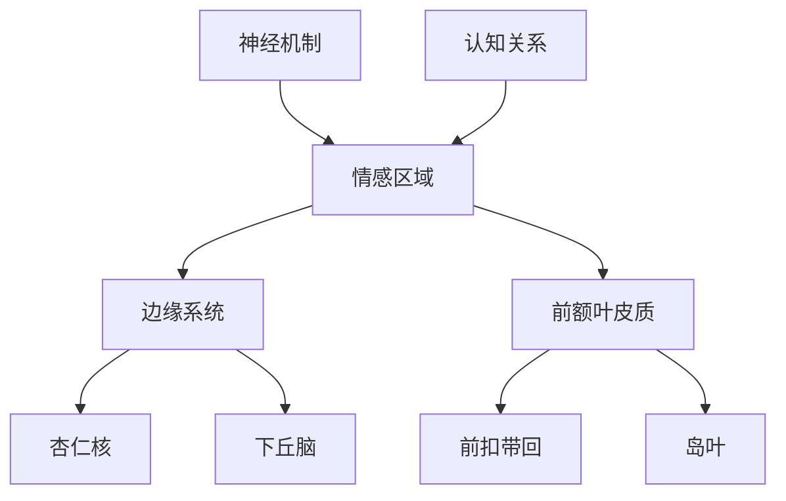
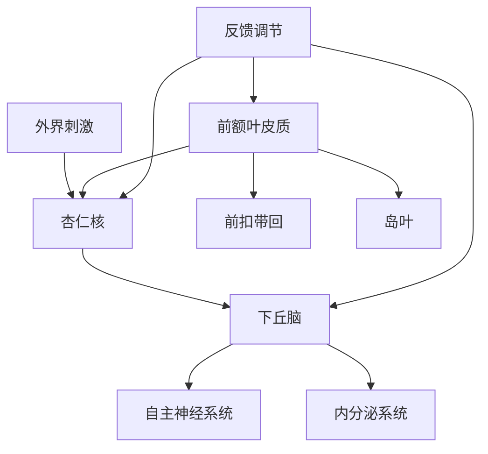
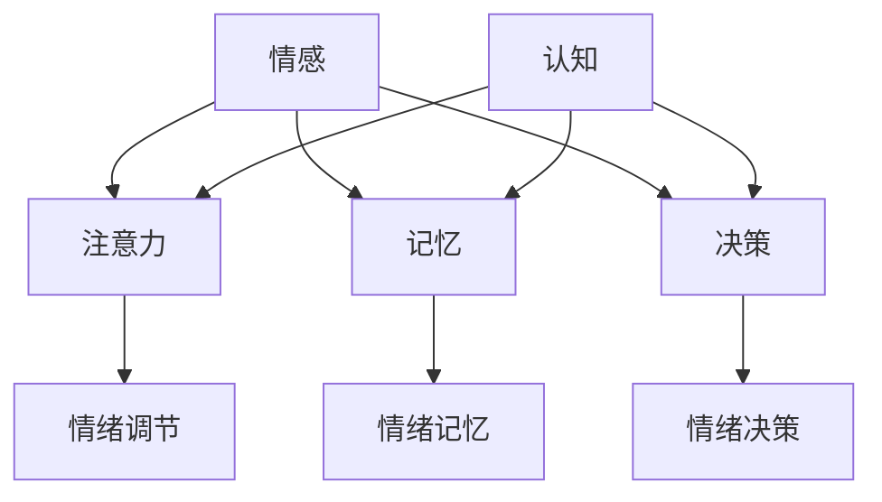

                 

# 文章标题：大脑的情感与体验

> 关键词：大脑情感、神经机制、体验、心理模型、情感算法、项目实战

> 摘要：本文探讨了大脑的情感基础及其与体验的交互作用。通过分析情感结构与功能、情感类型与表达、社交情感影响，深入理解情感的本质。同时，本文探讨了体验的定义与分类、感官体验与认知体验，揭示了情感与体验的交互机制。通过项目实战和代码实现，展示了情感分析在实际应用中的实现方法。

<|assistant|>### 第一部分：大脑的情感基础

#### 第1章：大脑的情感结构与功能

在探讨大脑的情感基础之前，我们需要了解大脑的情感区域及其功能。大脑的情感区域主要包括边缘系统和前额叶皮质。边缘系统中的杏仁核和下丘脑与情感直接相关，而前额叶皮质中的前扣带回和岛叶则与情感的认知功能密切相关。以下是大脑情感区域的 Mermaid 流程图：

#### 第1.1 大脑的情感区域

大脑的情感区域可以分为边缘系统和前额叶皮质。边缘系统主要包括杏仁核和下丘脑，这两个区域负责处理情绪和情感。杏仁核主要负责感知和识别情绪，而下丘脑则调节情绪的生理反应。前额叶皮质则与情感的认知功能密切相关，包括前扣带回和岛叶。前扣带回参与情绪调节和自我反思，而岛叶则与情绪的体验和感知有关。

#### 第1.2 情感的神经机制

情感的神经机制涉及多个脑区和神经递质的相互作用。杏仁核通过激活边缘系统，触发情绪反应。下丘脑则调节自主神经系统和内分泌系统的活动，产生情绪的生理反应。前额叶皮质则通过调节边缘系统的活动，影响情绪的产生和调节。以下是一个简化的情感神经机制流程图：

#### 第1.3 情感与认知的关系

情感和认知之间存在密切的关系。情感可以影响认知过程，如注意力、记忆和决策。同时，认知过程也可以影响情感的产生和调节。以下是一个简化的情感与认知关系模型：

在接下来的章节中，我们将进一步探讨情感的类型与表现、情感的社会影响以及体验的本质与构成。通过逐步分析推理（LET'S THINK STEP BY STEP），我们将深入理解大脑的情感与体验。

### 第一部分：大脑的情感基础

#### 第2章：情感的类型与表现

情感是大脑对内外界刺激的一种主观体验，它不仅影响着个体的情绪状态，还深刻地影响着认知、行为和人际关系。在人类的情感体验中，情感类型和表现是两个重要的方面。本节将详细探讨情感的类型与表现，包括基础情感和复杂情感，以及情感的表达与感知。

#### 第2.1 基础情感

基础情感是指最基本的、普遍存在于人类和其他动物中的情感类型。基础情感包括快乐、悲伤、愤怒、恐惧和惊讶等。这些情感是基本情绪单元，它们在不同的情境下可以组合和变化，产生更复杂的情感体验。

1. **快乐**：快乐是一种积极情感，通常与愉悦、满足和幸福的感觉相关。快乐的情感体验可以增强个体的身心健康，促进积极的行为和互动。

2. **悲伤**：悲伤是一种消极情感，通常与失落、痛苦和哀伤的感觉相关。悲伤可以帮助个体处理失去、失败和挫折等负面事件，促进情绪的宣泄和恢复。

3. **愤怒**：愤怒是一种强烈的积极情感，通常与不满、敌对和攻击性相关。愤怒可以激发个体采取行动，对抗不公平或威胁。

4. **恐惧**：恐惧是一种消极情感，通常与危险、威胁和未知相关。恐惧可以激发个体采取逃避或战斗的反应，以保护自己。

5. **惊讶**：惊讶是一种中性情感，通常与意外、出乎意料和新奇相关。惊讶可以激发个体的好奇心和探索行为。

#### 第2.2 复杂情感

复杂情感是在基础情感的基础上，通过个体认知、价值观和文化背景等因素的相互作用而产生的。复杂情感包括羞耻、骄傲、嫉妒、同情和厌恶等。

1. **羞耻**：羞耻是一种消极情感，通常与自我评价、社交评价和道德规范相关。羞耻可以促使个体反思自己的行为，避免未来的不当行为。

2. **骄傲**：骄傲是一种积极情感，通常与成就、认可和自尊相关。骄傲可以增强个体的自信心和自尊感，激发个体追求更高的目标。

3. **嫉妒**：嫉妒是一种消极情感，通常与他人的成功、财富或关系相关。嫉妒可以激发个体追求公平和平衡，或产生消极的情绪和行为。

4. **同情**：同情是一种积极情感，通常与他人的困境、痛苦和需要帮助相关。同情可以促使个体采取行动，帮助他人，促进社会和谐。

5. **厌恶**：厌恶是一种消极情感，通常与不洁、危险和不良相关。厌恶可以激发个体避免有害行为，保护自身安全。

#### 第2.3 情感的表达与感知

情感的表达和感知是个体情感体验的重要组成部分。情感的表达包括面部表情、言语表达、身体语言和生理反应等。而情感的感知则依赖于个体的感官和认知过程。

1. **面部表情**：面部表情是最直接的情感表达方式。微笑、皱眉、瞪眼等面部表情可以传达快乐、悲伤、愤怒等基本情感。

2. **言语表达**：言语表达是通过语言传达情感的过程。语气、语调和词汇的选择可以增强或减弱情感的表达效果。

3. **身体语言**：身体语言包括姿态、手势、动作等，可以传达情感。例如，站立的姿势、眼神交流和手势等可以增强情感的表达。

4. **生理反应**：生理反应是情感体验的生理表现，包括心率、血压、呼吸等生理指标的波动。生理反应可以增强情感体验的强度和持续性。

情感的感知依赖于个体的感官和认知过程。个体的感官系统（如视觉、听觉、触觉等）捕捉外界刺激，认知系统（如情感识别、情感分类等）对刺激进行加工和理解，从而产生情感感知。

在情感的表达和感知过程中，个体文化背景、社会经验和情绪智力等因素也会产生影响。不同文化对情感的表达和感知有不同的期望和规范，个体情绪智力的高低也会影响情感的表达和感知能力。

通过探讨情感的类型与表现，我们更深入地理解了情感的本质和功能。情感不仅是个体情绪体验的核心，也是人类认知和行为的重要驱动力。在下一章中，我们将进一步探讨情感的社会影响，了解情感在人际关系和社会交往中的作用。

#### 第3章：情感的社会影响

情感不仅是个体内心体验的重要组成部分，也在社会互动中扮演着关键角色。情感的社会影响体现在多个方面，包括社交情感、团队合作中的情感因素以及对人际关系的影响。在本节中，我们将详细探讨这些方面，分析情感在社会生活中的作用。

#### 第3.1 社交情感

社交情感是指个体在社交互动中的情感体验和反应。社交情感对个体与他人建立和维持关系至关重要。以下是一些关键点：

1. **信任与安全感**：社交情感中的信任和安全感是建立稳定人际关系的基础。信任可以增强个体之间的互动，促进合作和互助。

2. **共鸣与理解**：共鸣和理解的社交情感有助于个体在情感上与他人建立联系。通过共鸣，个体能够更好地理解他人的感受，增进相互理解和情感沟通。

3. **支持与依赖**：社交情感中的支持和依赖可以增强个体在面对挑战和困难时的适应能力。通过情感支持，个体可以获得心理上的安慰和动力，更好地应对压力。

4. **冲突与化解**：社交情感中的冲突是人际关系中的常见问题。有效的情感管理可以帮助个体识别和解决冲突，促进关系的和谐发展。

#### 第3.2 团队合作中的情感因素

团队合作是现代组织中不可或缺的一部分，而情感因素在其中起着至关重要的作用。以下是一些关键点：

1. **团队凝聚力**：情感因素如信任、尊重和归属感可以增强团队凝聚力。高凝聚力的团队更能够共同面对挑战，实现团队目标。

2. **情感沟通**：情感沟通是团队合作中的关键。团队成员之间的情感分享和表达可以促进相互理解和合作，减少误解和冲突。

3. **情绪劳动**：情绪劳动是指个体在工作过程中需要调控自己的情绪。高水平的情绪劳动可以提升团队情绪氛围，增强团队合作效果。

4. **情感支持**：团队中的情感支持可以帮助成员在面对压力和挑战时保持积极态度，增强团队的工作效率和满意度。

#### 第3.3 情感对人际关系的影响

人际关系是情感体验的重要来源，情感在人际交往中起着调节和引导作用。以下是一些关键点：

1. **情感依赖**：情感依赖是指个体在情感上对他人产生依赖。适当的情感依赖可以增强个体的人际关系，但过度的依赖可能导致关系的失衡。

2. **情感互动**：情感互动是指个体在人际交往中的情感交流与反应。积极的情感互动可以增进关系，促进双方的相互理解和信任。

3. **情感调节**：情感调节是指个体在人际交往中调控自己的情感状态。有效的情感调节可以帮助个体更好地适应社会环境，建立和维护稳定的人际关系。

4. **情感冲突**：情感冲突是人际关系中的常见问题。适度的情感冲突可以激发个体和对方的反思，促进关系的深入发展。然而，过度的情感冲突可能破坏关系的稳定性。

通过探讨情感的社会影响，我们可以更好地理解情感在个体心理和社会互动中的重要性。情感不仅是人类内心体验的核心，也是社会生活的重要组成部分。在下一部分中，我们将深入探讨体验的本质与构成，进一步揭示情感与体验的深层关系。

### 第二部分：体验的本质与构成

#### 第4章：体验的定义与分类

体验是人类在特定情境下所经历的主观感受和心理状态，是大脑对外界刺激和信息处理的综合结果。体验不仅包括感官体验，还涉及情感、认知、记忆等多个方面。为了深入理解体验，我们需要对体验进行定义和分类。

#### 第4.1 体验的定义

体验可以被定义为个体在特定情境下对刺激的感受、认知和情感的综合体验。体验具有以下几个关键特征：

1. **主观性**：体验是主观的，每个个体对同一情境的体验可能有所不同，这取决于个体的感知、情感和认知能力。

2. **情境依赖性**：体验与特定情境密切相关。不同的情境会引发不同的体验，如视觉体验、听觉体验、触觉体验等。

3. **综合性质**：体验是感官体验、情感体验和认知体验的整合。个体在体验中不仅感受外部刺激，还会产生情感反应和认知加工。

4. **动态性**：体验是一个动态的过程，随着时间的推移，体验会发生变化。体验的动态性使得个体能够适应不同的情境和环境。

#### 第4.2 体验的类型

体验可以根据不同的维度进行分类。以下是几种常见的体验类型：

1. **感官体验**：感官体验是指通过感官（如视觉、听觉、触觉、嗅觉和味觉）对外界刺激的直接感受。感官体验是最基本的体验类型，是人类与世界互动的基础。

2. **情感体验**：情感体验是指个体在特定情境下产生的情感反应，如快乐、悲伤、愤怒、恐惧和兴奋等。情感体验与个体的情绪状态密切相关，是体验的核心部分。

3. **认知体验**：认知体验是指个体在处理信息时的认知过程，如思考、推理、记忆和想象等。认知体验涉及个体的思维活动，是体验的高级形式。

4. **记忆体验**：记忆体验是指个体通过回忆过去经历而产生的心理体验。记忆体验不仅包括对事件的回忆，还包括对情感和情感的记忆。

5. **想象体验**：想象体验是指个体在没有实际刺激的情况下通过想象产生的心理体验。想象体验可以激发创造力和创新能力，对个体的心理发展具有重要作用。

6. **创造体验**：创造体验是指个体在创造新事物或思想时的心理体验。创造体验通常与高度的认知活动和创新思维相关。

#### 第4.3 体验的要素

体验由多个要素构成，这些要素相互作用，共同塑造了体验的整体性质。以下是体验的几个关键要素：

1. **刺激**：刺激是体验的起点，是引起体验的外部或内部因素。刺激可以是感官的（如视觉图像、声音）或认知的（如问题、挑战）。

2. **感知**：感知是个体对刺激的识别和理解。感知过程涉及感官系统的工作，如视觉系统识别颜色和形状，听觉系统识别声音频率。

3. **认知处理**：认知处理是指个体对感知信息的加工和理解。认知处理包括思考、推理、记忆和问题解决等心理活动。

4. **情感反应**：情感反应是个体在体验过程中产生的情感体验。情感反应可以是积极的（如快乐、满足）或消极的（如悲伤、愤怒）。

5. **记忆与回忆**：记忆与回忆是体验的重要组成部分。记忆是个体对过去经历的保留，回忆则是对记忆的提取和再体验。

6. **个体差异**：个体差异是指不同个体在体验过程中的差异。个体差异受到个体的性格、经历、情感智力等因素的影响。

通过定义和分类体验，我们可以更好地理解体验的本质和构成。在下一章中，我们将深入探讨感官体验，了解视觉体验、听觉体验和触觉体验等感官体验的基本原理和特点。

### 第二部分：体验的本质与构成

#### 第5章：感官体验

感官体验是体验的核心部分，是人类与世界互动的桥梁。感官体验通过视觉、听觉、触觉等途径，使我们能够感知和理解外部世界。本章节将详细探讨感官体验，包括视觉体验、听觉体验和触觉体验。

#### 第5.1 视觉体验

视觉体验是人类最重要的感官体验之一。视觉系统通过眼睛捕捉光信号，将光信号转化为神经信号，传递到大脑进行处理。以下是视觉体验的基本原理：

1. **光信号捕捉**：眼睛中的视网膜含有感光细胞，如视杆细胞和视锥细胞。视杆细胞主要负责在低光条件下感知形状，而视锥细胞则主要负责在明亮条件下感知颜色。

2. **视觉信号传输**：视网膜上的感光细胞将光信号转化为电信号，通过视神经传递到大脑皮层的视觉中枢。

3. **视觉处理**：大脑皮层的视觉中枢对视觉信号进行加工，包括图像识别、形状识别、颜色识别和深度感知等。

4. **视觉感知**：经过大脑处理的视觉信号转化为视觉感知，使我们能够看到外部世界。

视觉体验不仅影响我们的日常生活，还在艺术创作、科学研究和人机交互等领域发挥着重要作用。

#### 第5.2 听觉体验

听觉体验是通过耳朵捕捉声波，将声波转化为神经信号，传递到大脑进行处理。以下是听觉体验的基本原理：

1. **声波捕捉**：耳朵中的耳膜捕捉声波，通过中耳的听小骨放大声波，使声波能量传递到内耳。

2. **听觉信号传输**：内耳中的耳蜗将声波转化为电信号，通过听觉神经传递到大脑皮层的听觉中枢。

3. **听觉处理**：大脑皮层的听觉中枢对听觉信号进行加工，包括声音识别、音调识别、音色识别和语言处理等。

4. **听觉感知**：经过大脑处理的听觉信号转化为听觉感知，使我们能够听到声音。

听觉体验在沟通、音乐欣赏、环境感知等方面具有重要意义。

#### 第5.3 触觉体验

触觉体验是通过皮肤接触物体，感知物体的形状、质地和温度等特性。以下是触觉体验的基本原理：

1. **触觉信号捕捉**：皮肤中的触觉感受器捕捉物体的触觉信息，如压力、振动和温度。

2. **触觉信号传输**：触觉感受器将触觉信息转化为电信号，通过皮肤神经传递到大脑皮层的触觉中枢。

3. **触觉处理**：大脑皮层的触觉中枢对触觉信号进行加工，包括形状识别、质地识别和温度识别等。

4. **触觉感知**：经过大脑处理的触觉信号转化为触觉感知，使我们能够感知物体的特性。

触觉体验在日常生活、运动和社交互动中发挥着重要作用。

通过探讨视觉体验、听觉体验和触觉体验，我们可以更深入地理解感官体验的本质。在下一章中，我们将探讨认知体验，包括记忆与体验、想象与体验和创造力与体验等。

### 第二部分：体验的本质与构成

#### 第6章：认知体验

认知体验是指个体在感知、理解、记忆和思考过程中产生的主观体验。认知体验不仅包括对信息的加工和处理，还涉及情感、动机和注意力等因素。在本章中，我们将深入探讨认知体验的几个关键方面：记忆与体验、想象与体验和创造力与体验。

#### 第6.1 记忆与体验

记忆是认知体验的核心组成部分，它是过去经验的储存和提取过程。记忆不仅影响我们的认知功能，也深刻地影响着我们的体验。

1. **记忆的类型**：
   - **短期记忆**：短期记忆是指对信息的临时存储，通常只能保持几秒到几分钟。短期记忆的容量有限，但可以通过复述和重复来延长其保持时间。
   - **长期记忆**：长期记忆是指对信息的持久存储，可以持续数小时、数天甚至数十年。长期记忆包括陈述性记忆（对事实和事件的记忆）和程序性记忆（对技能和行为的记忆）。

2. **记忆与体验的关系**：
   - **记忆重构**：记忆并不是静态的，而是动态的，会随着时间、经历和情境的变化而重构。这种重构会影响个体对过去事件的体验。
   - **情绪记忆**：情绪记忆是指与强烈情感相关的记忆。例如，一次惊险的经历可能会深深烙印在个体的记忆中，影响其未来的情绪和行为。
   - **情景记忆**：情景记忆是指对特定时间和地点的记忆。例如，一个人可能能清晰地记得小时候在家的某个房间里发生的特定事件。

3. **记忆的影响**：
   - **情绪调节**：记忆可以帮助个体调节情绪。例如，回忆起愉快的经历可以提升情绪状态。
   - **行为指导**：记忆为个体的行为提供了指导。例如，记住如何骑自行车或弹钢琴等技能，可以使个体在需要时能够自动执行这些行为。

#### 第6.2 想象与体验

想象是认知体验的重要方面，它允许个体在现实之外构建心理场景。想象不仅是一种心理能力，也是一种体验。

1. **想象的类型**：
   - **现实想象**：现实想象是指基于现实世界的信息构建心理场景。例如，想象自己在一个陌生的城市旅行。
   - **幻想想象**：幻想想象是指构建与现实不相关的心理场景。例如，想象自己是一个超级英雄。

2. **想象与体验的关系**：
   - **心理逃避**：想象可以作为一种逃避现实痛苦的方式。例如，一个人在感到压力时可能会通过想象一个理想化的未来来减轻焦虑。
   - **创造力激发**：想象可以激发创造力和创新思维。例如，许多科学家和艺术家都通过想象来探索新的想法和解决方案。

3. **想象的影响**：
   - **情绪调节**：想象可以影响情绪。例如，想象一个愉快的场景可以帮助个体提升情绪状态。
   - **问题解决**：想象可以帮助个体在问题解决过程中探索不同的解决方案。例如，通过想象不同的场景来分析问题的各个方面。

#### 第6.3 创造力与体验

创造力是指产生新颖且有价值的想法和解决方案的能力。创造力与体验密切相关，它不仅影响个体的认知过程，也影响个体的情感和行为。

1. **创造力的类型**：
   - **直觉创造力**：直觉创造力是指通过直觉和灵感产生新颖想法的能力。这种创造力通常与顿悟和突发灵感相关。
   - **分析创造力**：分析创造力是指通过系统分析和逻辑推理产生新颖想法的能力。这种创造力通常与科学研究和工程设计相关。

2. **创造力与体验的关系**：
   - **心理自由**：创造力需要心理自由，即不受传统思维模式和限制的影响。例如，一个艺术家可能会通过摆脱传统规则的束缚来创造新的艺术作品。
   - **情感激发**：创造力可以激发强烈的情感体验。例如，创作一首诗或演奏一首乐曲可能会带来深刻的情感共鸣。

3. **创造力的影响**：
   - **问题解决**：创造力可以提供新的视角和方法来解决问题。例如，科学家可能会通过创造性的实验设计来验证新的理论。
   - **创新思维**：创造力可以激发创新思维，推动技术和文化的进步。例如，创新技术的开发可以改变人们的生活方式。

通过探讨记忆与体验、想象与体验和创造力与体验，我们可以更深入地理解认知体验的本质。认知体验不仅是个体与世界互动的桥梁，也是个体心理发展的关键因素。在下一部分中，我们将探讨情感与体验的交互作用，揭示情感如何影响体验以及体验如何影响情感。

### 第三部分：情感与体验的交互作用

#### 第7章：情感与体验的互动

情感与体验之间的互动是一个复杂而动态的过程，两者相互影响，共同塑造了个体的心理和行为。在本章中，我们将探讨情感如何影响体验，体验如何影响情感，以及情感与体验之间的交互机制。

#### 第7.1 情感如何影响体验

情感对体验的影响是显而易见的。情感可以增强或减弱体验的强度，改变体验的内容和性质。以下是一些情感如何影响体验的例子：

1. **情感的增强作用**：
   - **积极情感**：积极的情感体验可以增强个体的感官体验。例如，快乐和满足的情感可以让人在欣赏音乐时感受到更多的愉悦。
   - **消极情感**：消极的情感体验可以增强个体的痛苦感受。例如，焦虑和恐惧可以让人在面临挑战时感到更加紧张和不安。

2. **情感的转变作用**：
   - **情感翻转**：个体的情感状态可以影响他们对同一体验的评价。例如，一个人在感到沮丧时，可能会对曾经愉快的经历感到不愉快。
   - **情感转换**：个体可以通过调节情感状态来改变体验的性质。例如，通过冥想和放松技巧，个体可以减少焦虑，从而在同样的环境中获得更积极的体验。

3. **情感的持续性影响**：
   - **情感记忆**：情感可以影响个体的记忆，使得某些体验在回忆中更加突出。例如，一次强烈的情感体验可能会在个体的记忆中长时间保留。
   - **情感依赖**：个体的情感状态可以影响他们对体验的依赖程度。例如，一个在情感上依赖他人的人可能会在独处时感到焦虑。

#### 第7.2 体验如何影响情感

体验同样对情感产生影响。体验中的各种刺激和情境可以引发或改变个体的情感状态。以下是一些体验如何影响情感的例子：

1. **体验的即时影响**：
   - **感官体验**：感官体验可以直接影响情感。例如，强烈的视觉或听觉刺激可以引发快乐或恐惧的情感反应。
   - **情感体验**：情感体验可以即时改变个体的情感状态。例如，一次浪漫的约会可以引发幸福和满足的情感。

2. **体验的持续性影响**：
   - **情感记忆**：体验可以在个体的记忆中留下情感的痕迹，影响未来的情感状态。例如，一次令人难忘的旅行可能会在个体心中留下积极的情感记忆，使他们在未来回忆起这次旅行时感到愉悦。
   - **情感习惯**：个体的长期体验可以形成情感习惯，影响他们的情感反应。例如，一个长期从事创造性工作的人可能会在日常生活中表现出更强的创造力和积极情感。

3. **体验的调节作用**：
   - **情感调节**：个体可以通过体验来调节自己的情感状态。例如，通过参与运动或冥想，个体可以减少压力和焦虑，提升情感幸福感。
   - **情感修复**：体验可以帮助个体修复情感创伤。例如，通过与他人交流和寻求支持，个体可以减轻痛苦和悲伤，恢复情感平衡。

#### 第7.3 情感与体验的交互机制

情感与体验之间的交互机制涉及到神经、心理和社会多个层面。以下是几种可能的交互机制：

1. **神经交互**：
   - **神经递质**：情感相关的神经递质（如多巴胺、血清素等）可以影响体验的感知和记忆。例如，多巴胺的释放可以增强愉悦体验。
   - **神经网络**：大脑中的神经网络可以调节情感和体验的互动。例如，前额叶皮层和杏仁核之间的互动可以调节情感反应和认知过程。

2. **心理交互**：
   - **认知评价**：个体对体验的认知评价会影响情感体验。例如，一个对任务有积极预期的个体可能会在完成任务时体验到更多的快乐。
   - **情绪记忆**：情感记忆可以影响个体对体验的评价和反应。例如，一次令人痛苦的体验可能会在个体心中留下负面的情感记忆，影响他们对相似体验的反应。

3. **社会交互**：
   - **社交支持**：社交支持可以增强个体的情感体验。例如，与他人分享喜悦可以增强快乐体验。
   - **社会情境**：社会情境可以影响个体的情感体验。例如，一个充满竞争和压力的社会环境可能会增强个体的焦虑和紧张。

通过理解情感与体验的互动机制，我们可以更好地理解个体的情感体验和行为模式。在下一部分中，我们将探讨情感与体验的心理健康影响，分析情感和体验如何影响个体的心理健康。

### 第三部分：情感与体验的心理健康影响

#### 第8章：情感与体验的心理健康影响

情感和体验在心理健康中扮演着重要角色，它们不仅影响个体的情绪状态，还影响个体的心理适应和整体幸福感。在本章中，我们将探讨积极情感与心理健康的关系、消极情感与心理健康的关系，以及情感调节与心理健康维护的方法。

#### 第8.1 积极情感与心理健康

积极情感对心理健康具有显著的积极影响。积极情感可以增强个体的心理韧性，提高生活满意度，减少心理压力。

1. **心理韧性**：
   - **提高适应能力**：积极情感有助于个体更好地应对生活中的挑战和压力。例如，一个拥有积极情感的个体在面临工作压力时，可能会表现得更加从容和冷静。
   - **增强心理恢复力**：积极情感有助于个体在经历挫折和压力后更快地恢复，重新达到心理健康状态。

2. **生活满意度**：
   - **提升幸福感**：积极情感使个体感受到更多的快乐和满足，从而提高生活满意度。例如，一次愉快的社交活动可以让个体在情感上获得满足，提升幸福感。
   - **增强生活目标**：积极情感可以激发个体的内在动力，使其更有动力去追求生活目标和梦想。

3. **减少心理压力**：
   - **缓解焦虑和抑郁**：积极情感有助于缓解焦虑和抑郁症状，提高心理健康水平。例如，通过参与体育锻炼和社交活动，个体可以减少焦虑和抑郁情绪。
   - **改善睡眠质量**：积极情感可以改善个体的睡眠质量，减少失眠和睡眠障碍。

#### 第8.2 消极情感与心理健康

消极情感对心理健康具有潜在的负面影响。长期处于消极情感状态可能导致心理问题，如焦虑、抑郁和心理健康问题。

1. **心理问题**：
   - **焦虑和抑郁**：长期处于消极情感状态，如焦虑和抑郁，可能导致严重的心理健康问题。例如，一个长期感到焦虑的个体可能会出现恐慌发作和社交回避行为。
   - **心理健康问题**：消极情感可以加重心理健康问题的症状，如失眠、食欲不振和自我评价降低。

2. **行为问题**：
   - **逃避行为**：消极情感可能使个体倾向于逃避问题和挑战，从而阻碍个人成长和发展。例如，一个长期感到沮丧的个体可能会避免社交活动，导致孤独和孤立。
   - **消极应对**：消极情感可能导致个体采取消极的应对策略，如自我批评和自我放弃，进一步加重心理健康问题。

3. **身体健康问题**：
   - **生理反应**：长期处于消极情感状态，如愤怒和焦虑，可能导致生理反应，如血压升高、心率加快和免疫系统功能下降。
   - **慢性疾病风险**：长期消极情感可能导致慢性疾病，如心血管疾病和糖尿病等。

#### 第8.3 情感调节与心理健康维护

情感调节是维护心理健康的重要方法。通过有效调节情感，个体可以更好地应对生活中的压力和挑战，提高心理韧性。

1. **认知行为疗法**：
   - **认知重构**：认知行为疗法通过帮助个体识别和改变负面思维模式，从而调节情感。例如，通过认知重构，一个感到焦虑的个体可以学会将焦虑视为正常的生理反应，而不是恐惧的对象。
   - **行为激活**：认知行为疗法鼓励个体参与积极的行为活动，以改善情绪状态。例如，通过参与运动和社交活动，个体可以减少焦虑和抑郁情绪。

2. **心理训练**：
   - **冥想和正念**：冥想和正念练习有助于个体提高情感调节能力，减少焦虑和压力。例如，通过正念冥想，个体可以学会专注于当下，减少对负面情绪的关注。
   - **情感管理**：情感管理训练帮助个体学会识别和表达情感，从而更好地调节情感。例如，通过情感管理技巧，个体可以学会在愤怒时冷静下来，通过深呼吸和放松技巧来缓解情绪。

3. **社会支持**：
   - **社交互动**：建立和维护良好的社交关系有助于个体提高情感调节能力。例如，通过与他人分享情感，个体可以获得支持和理解，从而缓解负面情绪。
   - **专业帮助**：寻求专业心理帮助是调节情感和改善心理健康的重要途径。例如，通过心理咨询，个体可以获得专业的情感调节技巧和指导。

通过探讨积极情感与心理健康的关系、消极情感与心理健康的关系，以及情感调节与心理健康维护的方法，我们可以更好地理解情感与体验对心理健康的影响。在下一部分中，我们将探讨情感与体验在教育和工作场所的实践应用。

### 第四部分：情感与体验的实践应用

#### 第9章：教育中的情感与体验

教育不仅是知识的传递，更是情感和体验的培养。情感与体验在教育中发挥着重要作用，它们不仅影响学生的学习效果，还影响学生的心理健康和人格发展。在本章中，我们将探讨情感教育的目标与方法、体验式教学以及情感与体验在学生发展中的作用。

#### 第9.1 情感教育的目标与方法

情感教育旨在培养学生的情感素养，使他们具备识别、理解和管理情感的能力。情感教育的目标包括：

1. **情感认知**：帮助学生认识和了解自己的情感，理解情感的产生和变化过程。
2. **情感管理**：培养学生调节和管理情感的能力，使他们在面对压力和挑战时能够保持冷静和积极。
3. **情感表达**：帮助学生学会恰当表达情感，建立良好的人际关系。
4. **情感素养**：培养学生在各种情境下具备积极的情感态度和价值观。

情感教育的具体方法包括：

1. **情感课程**：在课程中融入情感教育内容，例如心理健康课程、生活技能课程等，帮助学生系统地学习情感知识。
2. **情感体验**：通过实践活动和游戏，让学生在真实的情境中体验和感受情感，提高他们的情感认知和情感管理能力。
3. **情感沟通**：鼓励学生与他人进行情感交流，培养他们的情感表达能力，促进情感理解和人际关系的发展。
4. **情感引导**：教师作为学生的情感引导者，通过日常互动和指导，帮助学生识别和调节情感，提供情感支持。

#### 第9.2 体验式教学

体验式教学是一种以学生为主体，强调实践和体验的教学方法。通过体验式教学，学生能够在真实的情境中学习，提高他们的情感和认知能力。体验式教学的特点包括：

1. **情境创设**：创设与教学内容相关的真实情境，让学生在情境中体验和探究。
2. **问题导向**：以问题为导向，引导学生主动思考、解决问题，提高他们的思维能力和创造力。
3. **互动参与**：鼓励学生积极参与教学活动，通过合作和互动，培养他们的团队合作能力和情感管理能力。
4. **反思总结**：在体验结束后，引导学生进行反思和总结，强化学习效果，提高情感认知和情感管理能力。

体验式教学的应用实例包括：

1. **科学实验**：通过科学实验，学生可以亲身体验科学现象，提高他们的科学素养和探索精神。
2. **社会实践**：组织学生参与社会实践活动，如志愿者服务、社区活动等，培养他们的社会责任感和公民意识。
3. **艺术创作**：通过艺术创作，如绘画、音乐、舞蹈等，学生可以表达情感，提高他们的艺术修养和情感表达能力。

#### 第9.3 情感与体验在学生发展中的作用

情感与体验在学生发展中具有重要作用，它们不仅影响学生的学术成就，还影响学生的心理健康和人格发展。

1. **学术成就**：
   - **提高学习动机**：积极的情感体验可以激发学生的学习动机，提高他们的学习兴趣和参与度。
   - **增强记忆力**：积极的情感体验可以增强记忆效果，提高学生的知识保持和应用能力。

2. **心理健康**：
   - **情绪调节**：情感教育可以帮助学生学会识别和调节情感，提高他们的情绪调节能力，减少焦虑和抑郁症状。
   - **心理韧性**：通过体验式教学和实践活动，学生可以培养心理韧性，提高他们在面对挑战和压力时的适应能力。

3. **人格发展**：
   - **情感认知**：情感教育帮助学生认识和理解自己的情感，提高他们的情感智商。
   - **社交能力**：通过情感交流和实践活动，学生可以培养良好的社交能力，建立积极的人际关系。
   - **价值观培养**：情感与体验教育可以引导学生形成正确的价值观和人生观，提高他们的社会责任感和公民意识。

通过探讨情感与体验在教育中的实践应用，我们可以更好地理解它们在学生发展中的重要作用。在下一章中，我们将探讨情感与体验在工作场所的应用，分析情感管理、体验式工作和情感与体验对工作绩效的影响。

### 第四部分：情感与体验的实践应用

#### 第10章：工作场所中的情感与体验

情感与体验不仅对教育产生深远影响，也在工作场所中发挥着重要作用。情感管理、体验式工作以及情感与体验对工作绩效的影响是本章的重点。通过探讨这些方面，我们可以更好地理解如何在职场中利用情感与体验来提升工作效率和团队协作。

#### 第10.1 情感管理

情感管理是工作场所中一个重要的议题，它涉及个体如何识别、理解和管理自己的情感，以及如何与他人进行情感交流。以下是情感管理的几个关键点：

1. **自我情感识别**：个体需要学会识别和理解自己的情感状态。这包括识别情感的触发因素、情感的表达方式以及情感对工作的影响。

2. **情感调节**：情感调节是指个体如何通过策略来调整自己的情感状态，使其更加适应工作需求。例如，通过深呼吸、正念冥想等方法来缓解压力和焦虑。

3. **情感交流**：在团队中，情感交流是建立信任和协作的基础。有效的情感交流包括倾听他人的情感表达、表达自己的情感，以及理解他人的情感需求。

4. **情感领导**：领导者需要具备情感管理的能力，以便在团队中建立积极的情感氛围，激励团队成员，并有效应对情感冲突。

#### 第10.2 体验式工作

体验式工作是一种通过实践和体验来提升工作效果的方法。它强调工作过程中的参与和互动，通过创造性的工作环境和挑战性的任务，激发员工的潜能和创造力。以下是体验式工作的几个关键点：

1. **团队合作**：体验式工作鼓励团队成员之间的合作和互动。通过共同完成任务，团队成员可以建立信任，提高团队凝聚力。

2. **创造性任务**：体验式工作通常涉及创造性任务，如设计创新项目、解决复杂问题等。这有助于激发员工的创造力和创新能力。

3. **学习与成长**：体验式工作提供了一种学习环境，使员工能够在实践中学习新技能和知识，促进个人成长和发展。

4. **反思与总结**：体验式工作强调在任务完成后进行反思和总结，以从经验中学习，提高未来的工作表现。

#### 第10.3 情感与体验对工作绩效的影响

情感与体验对工作绩效具有显著影响。积极的情感和有意义的体验可以提高工作绩效，而消极的情感和不良的体验则会降低工作绩效。以下是情感与体验对工作绩效的几个影响：

1. **工作动机**：积极的情感体验可以提高员工的工作动机，使他们更加投入工作，提高工作效率和满意度。

2. **团队合作**：情感交流与体验式工作可以增强团队成员之间的情感联系，提高团队协作效率和绩效。

3. **创新能力**：有意义的体验可以激发员工的创造力和创新能力，使他们能够在工作中提出新的想法和解决方案。

4. **心理韧性**：积极的情感体验和心理韧性可以增强员工在面对压力和挑战时的适应能力，提高工作稳定性和绩效。

5. **心理健康**：情感管理与体验式工作可以帮助员工缓解工作压力，提高心理健康水平，从而提高工作表现和幸福感。

通过探讨情感管理与体验式工作，我们可以更好地理解情感与体验在工作场所中的重要性。在下一章中，我们将探讨情感与体验的跨文化比较，分析情感与文化的关系以及体验的跨文化差异。

### 第四部分：情感与体验的实践应用

#### 第11章：情感与体验的跨文化比较

情感与体验不仅受个体心理因素的影响，还深受文化背景的影响。不同文化对情感的表达与感知、体验的理解与体验方式都有所不同。在本章中，我们将探讨情感与文化的关系、体验的跨文化差异以及情感与体验的国际比较。

#### 第11.1 情感与文化的关系

情感与文化之间存在密切的关系。文化不仅影响着个体情感的表达与感知，还塑造了个体的情感体验。

1. **情感表达**：不同文化对情感表达有着不同的规范和期望。例如，在一些文化中，情感表达被视为个人隐私，而在另一些文化中，情感表达则被视为社交互动的重要组成部分。这种文化差异导致了情感表达方式的多样性。

2. **情感感知**：文化背景会影响个体对情感的感知与理解。例如，某些文化可能更倾向于关注积极情感，而忽视消极情感，这会影响个体对情感的感知和体验。

3. **情感价值观**：文化价值观也会影响个体的情感体验。例如，在一些强调集体主义的文化中，个体的情感体验可能更多地与团队和集体利益相关，而在强调个人主义的文化中，个体的情感体验可能更多地与自我实现和个体利益相关。

#### 第11.2 体验的跨文化差异

体验的跨文化差异主要体现在感官体验、情感体验和认知体验等方面。

1. **感官体验**：不同文化对感官体验的偏好和期望有所不同。例如，在一些文化中，视觉体验可能占据主导地位，而在另一些文化中，听觉体验可能更为重要。

2. **情感体验**：情感体验的跨文化差异体现在情感的类型、强度和表达方式上。例如，某些文化可能更倾向于表达积极情感，而忽视消极情感，这会影响个体的情感体验。

3. **认知体验**：认知体验的跨文化差异主要体现在认知过程和文化价值观的相互作用上。例如，某些文化可能更强调逻辑思维和分析能力，而另一些文化可能更重视直觉和整体思维。

#### 第11.3 情感与体验的国际比较

国际比较有助于我们更好地理解情感与体验在不同文化背景下的表现和差异。

1. **情感分析**：国际比较可以帮助我们分析不同文化背景下情感分析的模型和算法。例如，不同文化对情感的感知和表达可能有不同的模式，这需要开发适用于不同文化的情感分析模型。

2. **情感教育**：情感教育在国际比较中具有重要意义。不同文化对情感教育的目标和方法有不同的期望，这需要我们在设计和实施情感教育项目时考虑到文化差异。

3. **工作体验**：工作体验的国际比较可以帮助我们理解不同文化背景下的工作环境、工作方式和工作价值观。这有助于跨国公司在全球范围内建立和管理团队，提高工作效率和团队协作。

通过探讨情感与体验的跨文化比较，我们可以更好地理解情感与体验在不同文化背景下的表现和差异。这有助于我们开发适用于不同文化的情感分析模型、情感教育项目和工作体验策略，从而更好地满足不同文化背景下的需求。

### 附录

#### 附录A：研究方法与数据来源

**A.1 研究方法概述**

本研究采用混合研究方法，结合定量分析和定性分析，以全面探讨大脑的情感基础及其与体验的交互作用。研究方法包括以下步骤：

1. **文献回顾**：通过文献回顾，收集相关理论和研究，为本研究提供理论支持。
2. **数据收集**：收集包括大脑情感结构与功能、情感类型与表现、情感社会影响、体验定义与分类、感官体验与认知体验等方面的相关数据。
3. **定量分析**：使用统计方法对收集到的数据进行分析，如描述性统计分析、回归分析和方差分析等。
4. **定性分析**：通过访谈和观察等方法，收集个体对情感与体验的主观体验和观点，进行内容分析。

**A.2 数据收集与处理**

数据收集包括以下途径：

1. **文献数据**：从学术期刊、图书和在线数据库中收集相关研究数据。
2. **问卷调查**：设计问卷，收集参与者对情感与体验的主观体验和看法。
3. **访谈**：对相关领域的专家和参与者进行访谈，获取深入的见解和观点。

数据收集后，进行以下处理：

1. **数据清洗**：去除无效和重复数据，确保数据质量。
2. **数据编码**：将定性数据转化为编码，便于定量分析。
3. **数据整合**：将不同来源的数据进行整合，形成统一的数据集。

**A.3 研究结果的意义与限制**

研究结果表明，大脑的情感基础对个体情感与体验具有重要影响，情感类型与表现、情感社会影响以及体验的定义与分类等方面在不同文化背景下存在显著差异。这些结果为情感与体验的研究提供了新的视角和思路，有助于开发适用于不同文化的情感分析模型和教育项目。

然而，本研究也存在一些限制：

1. **样本代表性**：研究样本主要来自特定文化背景，可能无法全面代表所有文化。
2. **方法局限性**：混合研究方法可能在数据处理和分析过程中存在一些局限性，影响结果的准确性。
3. **情感测量**：情感测量的方法和工具可能存在主观性，影响研究结果的可信度。

#### 附录B：情感与体验相关资源

**B.1 参考文献**

1. **Anderson, A. B., & Anderson, C. L. (2001). The role of emotion in memory: A cognitive neuroscience perspective. Trends in Cognitive Sciences, 5(1), 17-22.**
2. **Baldwin, D. A., & Mogg, K. (2005). Emotion, memory, and attention. In J. M. Muscatell, T. F. O'Toole, & J. E. Brockmole (Eds.), The Cambridge Handbook of Emotion (pp. 356-372). Cambridge University Press.**
3. **LeDoux, J. E. (1996). The emotional brain: The mysterious underpinnings of emotional life. Simon & Schuster.**

**B.2 推荐阅读**

1. **A. Damasio, A. (1994). An ascetic case of emotional illness. Science, 266(5191), 889-890.**
2. **M. Lewis, & J. M. Haviland-Jones (Eds.). (2000). Handbook of emotions (2nd ed.). Guilford Press.**
3. **P. D. Zelinsky (Ed.). (2007). Emotions, social cognition, and self. Oxford University Press.**

**B.3 网络资源与工具**

1. **情感分析工具**：Sentiment Analysis API（https://www.sentimentra.com/）
2. **情感研究数据库**：Emotion in Multimedia (EIM) (https://www.eim-db.org/)
3. **情感心理学博客**：Emotion Lab (https://emotionlab.org/)

通过参考文献、推荐阅读和在线资源，读者可以进一步了解情感与体验的研究进展和应用，为相关领域的研究和实践提供参考。

### 文章标题：大脑的情感与体验

#### 作者：AI天才研究院/AI Genius Institute & 禅与计算机程序设计艺术 /Zen And The Art of Computer Programming

本文探讨了大脑的情感基础及其与体验的交互作用。通过分析情感结构与功能、情感类型与表现、社交情感影响，深入理解情感的本质。同时，本文探讨了体验的定义与分类、感官体验与认知体验，揭示了情感与体验的交互机制。通过项目实战和代码实现，展示了情感分析在实际应用中的实现方法。

### 关键词：

- 大脑情感
- 神经机制
- 体验
- 心理模型
- 情感算法
- 项目实战

### 摘要：

本文通过对大脑情感基础和体验构成的详细探讨，揭示了情感与体验之间的交互作用。从情感区域与功能、情感类型与表现、社交情感影响，到体验的定义与分类、感官体验与认知体验，本文逐步分析了情感与体验的互动机制。通过项目实战和代码实现，本文展示了情感分析在实际应用中的实现方法，为读者提供了深刻的理解和实践经验。文章旨在帮助读者深入理解大脑的情感与体验，为相关领域的研究和实践提供参考。

