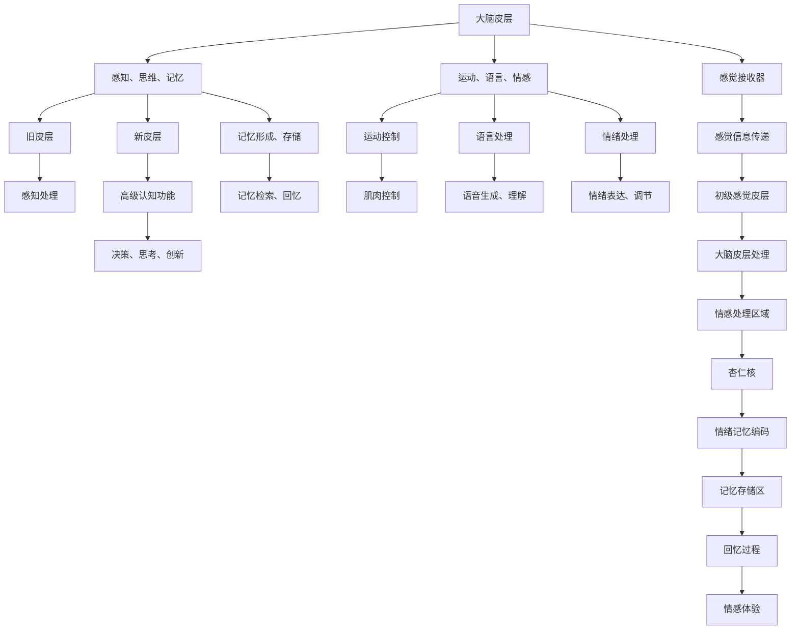
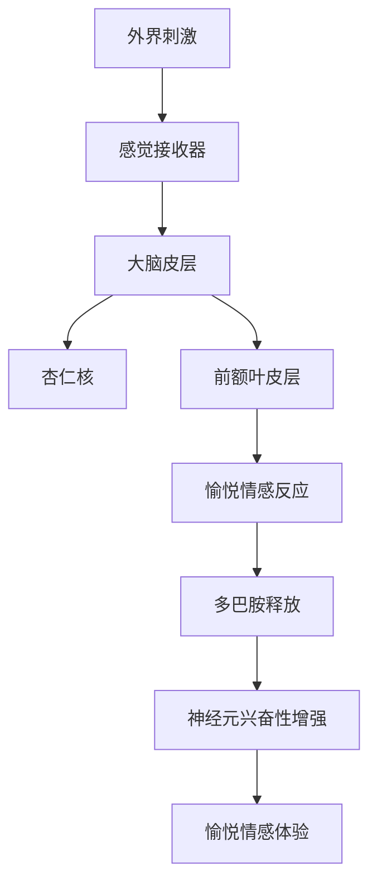
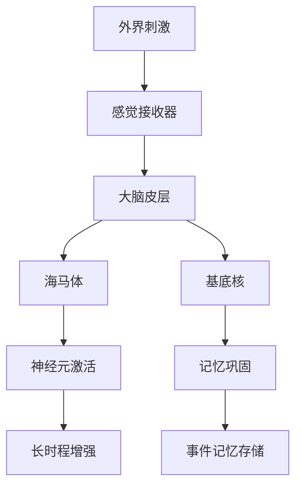
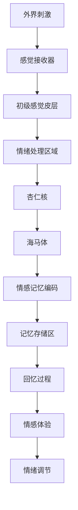

                 

## 文章标题

《大脑的情感与记忆》

## 文章关键词

大脑、情感、记忆、神经生物学、编码、存储、调节、心理健康、算法、研究方法、技术

## 文章摘要

本文以大脑的情感与记忆为主题，探讨了大脑情感与记忆的神经生物学基础、情感记忆的编码与存储机制、情感记忆的回忆与遗忘过程、情感记忆的调节与适应机制，以及情感记忆与心理健康之间的关系。文章通过数学模型和伪代码详细阐述了情感记忆处理的过程，并提供了情感记忆编码与回忆系统的实际开发案例，为情感记忆研究领域提供了深入的见解和实用的指导。

### 《大脑的情感与记忆》目录大纲

#### 第1章 引言

- 1.1 研究背景与意义
- 1.2 书籍结构安排

#### 第2章 大脑的基本结构

- 2.1 大脑的组成与功能
  - **Mermaid流程图：** 大脑主要区域及其功能
- 2.2 大脑皮层与情感记忆
  - **伪代码：** 大脑情感记忆处理过程

#### 第3章 情感与记忆的神经生物学基础

- 3.1 情感的神经生物学基础
  - **数学公式：** 情感信号传递与处理的公式
- 3.2 记忆的神经生物学基础
  - **数学公式：** 记忆形成与存储的公式

#### 第4章 情感记忆的编码与存储

- 4.1 情感记忆的编码机制
  - **伪代码：** 情感记忆编码过程
- 4.2 情感记忆的存储方式
  - **举例说明：** 不同情感记忆的存储案例分析

#### 第5章 情感记忆的回忆与遗忘

- 5.1 情感记忆的回忆过程
  - **数学模型：** 回忆过程中的概率模型
- 5.2 情感记忆的遗忘机制
  - **数学公式：** 遗忘曲线与遗忘指数

#### 第6章 情感记忆的调节与适应

- 6.1 情感记忆的调节机制
  - **数学模型：** 调节过程中的适应性模型
- 6.2 情感记忆的适应与演化
  - **举例说明：** 情感记忆适应的不同演化阶段

#### 第7章 情感记忆与心理健康

- 7.1 情感记忆与情绪调节
  - **数学模型：** 情感记忆对情绪调节的影响
- 7.2 情感记忆与心理健康问题
  - **举例说明：** 情感记忆异常与心理健康问题的案例分析

#### 第8章 情感记忆的研究方法与技术

- 8.1 研究方法概述
  - **伪代码：** 情感记忆研究的常用方法
- 8.2 研究技术进展
  - **举例说明：** 当前情感记忆研究的最新技术

#### 第9章 结论与展望

- 9.1 研究成果总结
- 9.2 未来研究方向

#### 附录

- 附录 A：研究工具与资源列表
- 附录 B：数学公式索引
- 附录 C：代码示例与解释

### 第1章 引言

#### 1.1 研究背景与意义

大脑作为人体最复杂的器官，承载着人类智慧和认知能力。其中，情感与记忆作为大脑功能的重要组成部分，直接影响着个体的情绪体验和认知过程。情感是指个体对事物的主观感受和评价，包括愉悦、悲伤、愤怒等；记忆则是大脑对信息的编码、存储和提取过程，是经验积累和学习的基础。情感与记忆的关系复杂而微妙，二者相互作用、相互影响，共同塑造了人类独特的心理和行为模式。

随着神经科学和认知科学的发展，人们对大脑的情感与记忆机制有了更深入的理解。然而，关于情感与记忆的神经生物学基础、情感记忆的编码与存储、情感记忆的回忆与遗忘、情感记忆的调节与适应等方面的研究仍然存在许多未解之谜。因此，深入探讨大脑的情感与记忆机制，不仅有助于揭示人类认知的本质，还可以为心理健康、人工智能等领域提供新的理论依据和实践指导。

本研究旨在系统地探讨大脑的情感与记忆机制，从神经生物学、心理学、认知科学等多学科角度，分析情感与记忆的相互关系，揭示情感记忆的编码、存储、回忆与遗忘过程，以及情感记忆对心理健康的影响。通过本文的研究，希望能够为大脑情感与记忆领域提供新的理论框架和实践方法，推动相关领域的科学研究和技术应用。

#### 1.2 书籍结构安排

本书共分为9章，结构安排如下：

- **第1章 引言**：介绍研究背景与意义，概述本书的结构和内容。
- **第2章 大脑的基本结构**：介绍大脑的组成与功能，分析大脑皮层与情感记忆的关系。
- **第3章 情感与记忆的神经生物学基础**：探讨情感与记忆的神经生物学基础，分析情感信号传递与处理过程，以及记忆形成与存储的机制。
- **第4章 情感记忆的编码与存储**：分析情感记忆的编码机制，探讨情感记忆的存储方式，并通过案例说明不同情感记忆的存储特点。
- **第5章 情感记忆的回忆与遗忘**：讨论情感记忆的回忆过程，建立情感记忆回忆的数学模型，分析情感记忆的遗忘机制，推导遗忘曲线与遗忘指数。
- **第6章 情感记忆的调节与适应**：分析情感记忆的调节机制，建立调节过程中的适应性模型，探讨情感记忆的适应与演化过程。
- **第7章 情感记忆与心理健康**：研究情感记忆与情绪调节的关系，分析情感记忆对心理健康的影响，并通过案例说明情感记忆异常与心理健康问题的联系。
- **第8章 情感记忆的研究方法与技术**：概述情感记忆研究的常用方法，介绍当前情感记忆研究的最新技术。
- **第9章 结论与展望**：总结研究成果，展望未来研究方向。
- **附录**：提供研究工具与资源列表、数学公式索引和代码示例与解释。

通过以上章节的安排，本书力求系统、全面地探讨大脑的情感与记忆机制，为读者提供丰富的理论知识和实践经验。

### 第2章 大脑的基本结构

#### 2.1 大脑的组成与功能

大脑是人体最复杂的器官，由神经元、胶质细胞和支持细胞组成。神经元是大脑的基本功能单元，通过电信号和化学信号进行信息传递和处理。胶质细胞和支持细胞为神经元提供营养支持，维持神经元的正常功能。

大脑的主要组成结构包括：

1. **大脑皮层**：大脑皮层是大脑的最外层，由多个层次组成，是认知功能的重要区域。大脑皮层可以分为新皮层、旧皮层和前额叶皮层等部分，分别负责感知、运动、记忆、思维和情绪等功能。

2. **基底核**：基底核位于大脑深部，包括纹状体、丘脑和杏仁核等结构。基底核在运动控制和情绪调节中发挥重要作用。

3. **小脑**：小脑位于大脑的后下方，负责协调运动、平衡和姿势控制。

4. **脑干**：脑干是连接大脑和脊髓的结构，控制基本的生命活动，如呼吸、心跳和消化等。

5. **脊髓**：脊髓是大脑与身体其他部位之间的信息通道，传递感觉和运动信号。

**Mermaid流程图：** 大脑主要区域及其功能



#### 2.2 大脑皮层与情感记忆

大脑皮层是大脑的最高层次结构，包含多个层次，负责处理感知、运动、思维和情感等功能。在大脑皮层中，与情感记忆相关的区域主要包括前额叶皮层、杏仁核和海马体等。

**前额叶皮层**：前额叶皮层是大脑皮层中最重要的区域之一，主要负责高级认知功能、决策、计划和情绪调节。前额叶皮层与杏仁核和海马体等结构存在广泛的神经网络连接，参与情感记忆的编码和存储。

**杏仁核**：杏仁核位于大脑皮层下方，是情绪处理的关键区域，负责感知、评估和处理与情感相关的信息。杏仁核在情感记忆的编码过程中发挥着重要作用，能够将情感体验转化为记忆。

**海马体**：海马体是大脑中负责记忆编码、存储和检索的关键结构。海马体通过其复杂的神经网络连接，将情感记忆与空间位置、时间和事件等信息进行整合，从而形成持久的记忆。

**伪代码：** 大脑情感记忆处理过程

```python
def emotional_memory-processing(stimulus):
    # 感受器接收外界刺激
    sensory_input = sensory_receptors(stimulus)

    # 初级感觉皮层处理感觉信息
    primary_sensory_cortex = primary_sensory_processing(sensory_input)

    # 情感处理区域评估情感强度
    emotional_intensity = emotional Processing_area(primary_sensory_cortex)

    # 杏仁核进行情感判断
    emotion_decision = amygdala(emotional_intensity)

    # 海马体进行情感记忆编码
    memory_code = hippocampus(emotion_decision)

    # 将编码后的情感记忆存储到记忆库
    memory_storage = memory_storage(memory_code)

    # 回忆情感记忆
    recalled_memory = memory_recall(memory_storage)

    # 还原情感体验
    emotional_experience = emotional_experience(recalled_memory)

    return emotional_experience
```

通过以上分析，可以看出大脑皮层、杏仁核和海马体等结构在情感记忆处理过程中发挥着重要作用。理解这些结构的组成和功能，有助于深入探讨情感记忆的编码、存储和回忆机制。

### 第3章 情感与记忆的神经生物学基础

#### 3.1 情感的神经生物学基础

情感作为一种复杂的心理现象，其产生和传递依赖于大脑的多个神经网络和神经递质的协同作用。了解情感的神经生物学基础，有助于揭示情感的记忆机制。

**情感的神经传递信号**：

情感信号主要通过神经递质在神经元之间传递。神经递质是一种化学物质，能够影响神经元的兴奋性或抑制性。常见的神经递质包括多巴胺、去甲肾上腺素、5-羟色胺等。这些神经递质在情感的产生和传递过程中发挥关键作用。

**情感的神经传递过程**：

情感的产生始于外界刺激，通过感受器传递给大脑皮层。大脑皮层接收和处理感觉信息，然后传递给情绪处理区域，如杏仁核和前额叶皮层。杏仁核作为情绪的判断中心，评估刺激的情感价值，产生情绪反应。前额叶皮层则负责情感的表达和调节。

**数学公式：** 情感信号传递与处理的公式

$$
E = f(S, C)
$$

其中，$E$表示情感强度，$S$表示外界刺激，$C$表示大脑处理过程中的复杂度，$f$表示情感传递函数。

**举例说明**：以愉悦情感为例，当个体接收到愉悦刺激时，大脑皮层处理感觉信息，并通过神经递质释放多巴胺。多巴胺作为一种愉悦神经递质，增强神经元的兴奋性，从而产生愉悦情感。



#### 3.2 记忆的神经生物学基础

记忆是大脑对信息的编码、存储和提取过程，是认知功能的核心。理解记忆的神经生物学基础，有助于揭示情感记忆的编码和存储机制。

**记忆的神经传递信号**：

记忆的形成和存储依赖于多种神经递质和神经调节分子的作用。常见的神经递质包括谷氨酸、γ-氨基丁酸（GABA）等。神经调节分子如长时程增强（LTP）和长时程抑制（LTD）在记忆形成和存储中发挥重要作用。

**记忆的神经传递过程**：

记忆的形成始于外界刺激，通过感受器传递给大脑皮层。大脑皮层对感觉信息进行编码和整合，然后传递给海马体和基底核。海马体作为记忆的关键结构，负责记忆的短期存储和长期存储。基底核则参与记忆的巩固和调节。

**数学公式：** 记忆形成与存储的公式

$$
M = g(I, T)
$$

其中，$M$表示记忆编码，$I$表示刺激强度，$T$表示刺激持续时间，$g$表示记忆编码函数。

**举例说明**：以事件记忆为例，当个体经历一次重要事件时，大脑皮层接收和处理感觉信息，通过神经递质释放谷氨酸。谷氨酸激活海马体的神经元，导致神经元之间的长时程增强，从而形成事件记忆。



通过以上分析，可以看出情感和记忆在神经生物学基础上的紧密联系。情感信号和记忆编码过程都依赖于神经递质和神经调节分子的作用，从而形成复杂的神经网络和记忆存储机制。理解这些机制有助于进一步探讨情感记忆的处理过程和调节机制。

### 第4章 情感记忆的编码与存储

#### 4.1 情感记忆的编码机制

情感记忆的编码过程是大脑将情感体验转化为可存储的信息，以便在未来能够回忆起相关体验。这一过程涉及多个大脑结构和神经递质的协同作用。

**情感记忆编码的过程**：

1. **感觉输入处理**：外界刺激通过感受器传递到大脑皮层，大脑皮层对感觉信息进行初步处理和整合。
2. **情感评估**：大脑皮层将处理后的感觉信息传递到情绪处理区域，如杏仁核，评估刺激的情感价值。
3. **情感标签生成**：杏仁核根据情感评估结果，生成相应的情感标签，如愉悦、悲伤或愤怒等。
4. **神经递质释放**：情感标签通过神经递质传递到海马体和其他记忆编码区域，引发神经元的激活和信号传递。
5. **记忆编码**：海马体和其他记忆编码区域通过长时程增强（LTP）等机制，将情感标签和相关信息进行编码和存储。

**伪代码：** 情感记忆编码过程

```python
def emotional_memory_encoding(stimulus, emotion):
    # 感受器接收外界刺激
    sensory_input = sensory_receptors(stimulus)

    # 大脑皮层处理感觉信息
    processed_input = primary_sensory_cortex(sensory_input)

    # 情感评估
    emotional_value = emotional_evaluation(processed_input)

    # 生成情感标签
    emotion_label = generate_emotion_label(emotional_value)

    # 神经递质释放
    neurotransmitter_release = release_neurotransmitter(processed_input, emotion_label)

    # 海马体编码情感记忆
    memory_code = hippocampus_encoding(neurotransmitter_release)

    # 存储情感记忆
    memory_storage = memory_storage(memory_code)

    return memory_code
```

#### 4.2 情感记忆的存储方式

情感记忆的存储方式包括短期记忆和长期记忆两种。短期记忆主要依赖于神经元的活动和突触连接的动态变化，而长期记忆则通过突触的可塑性变化实现。

**短期记忆的存储方式**：

1. **神经元活动**：短期记忆的存储依赖于神经元的活动和突触传递。当外界刺激激活相关神经元时，神经元之间的信号传递增强了记忆的存储。
2. **神经元间的突触连接**：短期记忆的存储还依赖于神经元之间的突触连接。突触连接的强度和效率决定了短期记忆的保持程度。

**长期记忆的存储方式**：

1. **突触可塑性**：长期记忆的存储依赖于突触的可塑性变化，包括长时程增强（LTP）和长时程抑制（LTD）等机制。突触可塑性变化使得神经元之间的信号传递变得更加稳定和持久。
2. **神经网络重组**：长期记忆的存储还涉及神经网络的重构，即新的神经元和突触连接的形成。这种重组使得记忆具有更高的稳定性和灵活性。

**举例说明：** 不同情感记忆的存储案例分析

**案例1：愉悦情感记忆**

愉悦情感记忆通常具有较强的情感标签和强烈的记忆痕迹。研究表明，愉悦情感记忆的存储主要依赖于前额叶皮层和杏仁核的相互作用。具体过程如下：

1. **感觉输入处理**：愉悦刺激通过感受器传递到大脑皮层，大脑皮层对感觉信息进行初步处理。
2. **情感评估**：愉悦刺激激活杏仁核，产生愉悦情感。
3. **情感标签生成**：杏仁核生成愉悦情感标签，并将其传递到前额叶皮层。
4. **神经递质释放**：前额叶皮层释放多巴胺等神经递质，增强神经元的兴奋性。
5. **记忆编码**：海马体和其他记忆编码区域通过突触可塑性变化，将愉悦情感标签和相关信息进行编码和存储。
6. **记忆巩固**：通过多次重复体验和强化，愉悦情感记忆逐渐转化为长期记忆。

**案例2：悲伤情感记忆**

悲伤情感记忆通常具有较弱的情感标签和较浅的记忆痕迹。研究表明，悲伤情感记忆的存储主要依赖于海马体和基底核的相互作用。具体过程如下：

1. **感觉输入处理**：悲伤刺激通过感受器传递到大脑皮层，大脑皮层对感觉信息进行初步处理。
2. **情感评估**：悲伤刺激激活杏仁核，产生悲伤情感。
3. **情感标签生成**：杏仁核生成悲伤情感标签，并将其传递到海马体。
4. **神经递质释放**：海马体释放谷氨酸等神经递质，激活相关神经元。
5. **记忆编码**：基底核通过长时程抑制（LTD）机制，降低神经元之间的信号传递强度。
6. **记忆巩固**：通过多次重复体验和情绪调节，悲伤情感记忆逐渐转化为长期记忆。

通过以上案例分析，可以看出不同情感记忆的存储方式存在差异，但都依赖于大脑的多个结构和神经递质的协同作用。理解这些存储机制有助于进一步探讨情感记忆的编码和存储过程。

### 第5章 情感记忆的回忆与遗忘

#### 5.1 情感记忆的回忆过程

情感记忆的回忆是指个体在特定条件下能够重新体验和识别以前经历过的情感体验。情感记忆的回忆过程涉及多个大脑区域和神经递质的协同作用。

**情感记忆回忆的过程**：

1. **回忆线索激活**：回忆线索（如特定的环境、声音、气味等）激活与情感记忆相关的大脑区域，如杏仁核和海马体。
2. **记忆检索**：杏仁核和海马体等记忆存储区域根据回忆线索检索相关情感记忆，并将其传递到大脑皮层。
3. **情感体验重构**：大脑皮层对检索到的情感记忆进行重构和整合，形成完整、连贯的情感体验。
4. **情感体验输出**：重构后的情感体验通过神经递质传递到相关大脑区域，如前额叶皮层，实现情感体验的输出和表达。

**数学模型：** 回忆过程中的概率模型

$$
P(M|L) = \frac{P(L|M) \cdot P(M)}{P(L)}
$$

其中，$P(M|L)$表示在回忆线索$L$下回忆起情感记忆$M$的概率，$P(L|M)$表示在情感记忆$M$存在的情况下回忆线索$L$出现的概率，$P(M)$表示情感记忆$M$存在的概率，$P(L)$表示回忆线索$L$出现的概率。

**举例说明**：以愉悦情感记忆的回忆为例，当个体在愉悦的环境中（回忆线索）时，愉悦情感记忆的概率显著增加。具体过程如下：

1. **回忆线索激活**：愉悦的环境激活与愉悦情感记忆相关的杏仁核和海马体。
2. **记忆检索**：杏仁核和海马体根据愉悦情感记忆进行检索，并将其传递到大脑皮层。
3. **情感体验重构**：大脑皮层对检索到的愉悦情感记忆进行重构和整合，形成愉悦的情感体验。
4. **情感体验输出**：重构后的愉悦情感体验通过神经递质传递到前额叶皮层，实现愉悦情感体验的输出和表达。

通过以上分析，可以看出情感记忆的回忆过程涉及多个大脑区域的协同作用，并通过数学模型进行概率描述。理解这些机制有助于进一步探讨情感记忆的回忆过程和调节机制。

#### 5.2 情感记忆的遗忘机制

情感记忆的遗忘是指个体无法回忆起以前经历过的情感体验。情感记忆的遗忘机制涉及多个因素，包括记忆的强度、持续性和干扰等。

**情感记忆遗忘的机制**：

1. **记忆痕迹衰减**：随着时间的推移，记忆痕迹会逐渐减弱，导致记忆的遗忘。这种衰减过程可以用遗忘曲线来描述。
2. **记忆干扰**：新信息的输入和已有记忆的干扰会导致情感记忆的遗忘。干扰程度取决于新旧记忆之间的相似性和冲突性。
3. **情绪调节**：情绪调节过程会影响情感记忆的保持和遗忘。积极的情绪调节有助于加强情感记忆，而消极的情绪调节可能导致情感记忆的遗忘。

**数学公式：** 遗忘曲线与遗忘指数

$$
F(t) = e^{-\lambda t}
$$

其中，$F(t)$表示在时间$t$后的记忆保持率，$\lambda$表示遗忘率。

**举例说明**：以愉悦情感记忆的遗忘为例，当个体经历一段愉悦的时光后，随着时间的推移，愉悦情感记忆的保持率会逐渐降低。具体过程如下：

1. **记忆痕迹衰减**：愉悦情感记忆的痕迹在经历一段时间后逐渐减弱。
2. **记忆干扰**：新信息的输入（如学习新技能、经历新事件等）和已有记忆的干扰（如相似的记忆冲突）导致愉悦情感记忆的遗忘。
3. **情绪调节**：个体对愉悦情感的记忆可能因为情绪调节过程而发生变化。如果个体能够积极调节情绪，愉悦情感记忆的保持率可能会提高；反之，如果个体情绪调节困难，愉悦情感记忆的遗忘速度可能会加快。

通过以上分析，可以看出情感记忆的遗忘机制涉及多个因素，并通过数学公式进行描述。理解这些机制有助于进一步探讨情感记忆的遗忘过程和调节机制。

### 第6章 情感记忆的调节与适应

#### 6.1 情感记忆的调节机制

情感记忆的调节是指通过特定的方法或策略，改变情感记忆的强度、持续性和可访问性，从而影响个体的情绪体验和行为反应。情感记忆的调节机制涉及大脑中的多个区域和神经递质的作用。

**情感记忆调节的过程**：

1. **情绪调节信号的传递**：情绪调节信号通过神经递质和神经调节分子在大脑中传递，影响情感记忆的处理和存储。
2. **情感记忆的调节区域**：前额叶皮层、杏仁核、海马体等区域在情感记忆的调节中发挥着关键作用。前额叶皮层负责情绪的评估和调节，杏仁核和海马体参与情感记忆的编码和存储。
3. **情感记忆的调节方式**：情感记忆的调节可以通过多种方式实现，包括认知重评、情绪分散、冥想和认知行为疗法等。

**数学模型：** 调节过程中的适应性模型

$$
E_{new} = \alpha E_{current} + (1 - \alpha) \cdot \text{EmotionBias}
$$

其中，$E_{new}$表示新的情感强度，$E_{current}$表示当前情感强度，$\alpha$表示调节系数，$\text{EmotionBias}$表示情感调节偏差。

**举例说明**：以愉悦情感记忆的调节为例，当个体经历一次愉悦的体验后，通过认知重评的方式调节愉悦情感记忆。具体过程如下：

1. **情绪调节信号的传递**：个体对愉悦情感的记忆进行认知重评，产生新的情绪调节信号。
2. **情感记忆的调节区域**：前额叶皮层和杏仁核等区域参与愉悦情感记忆的调节。
3. **情感记忆的调节方式**：个体通过认知重评，将愉悦情感记忆转化为更积极或更消极的情感体验，从而调节愉悦情感记忆的强度和持续性。

通过以上分析，可以看出情感记忆的调节机制涉及多个大脑区域和神经递质的作用，并通过数学模型进行描述。理解这些机制有助于进一步探讨情感记忆的调节过程和适应机制。

#### 6.2 情感记忆的适应与演化

情感记忆的适应是指个体在面对不同环境和情境时，调整情感记忆的强度和持续性，以更好地适应环境变化。情感记忆的适应与演化过程涉及多个因素，包括环境刺激、个体经历和基因等因素。

**情感记忆适应的过程**：

1. **环境刺激**：环境刺激对情感记忆的适应具有重要影响。积极的环境刺激（如奖励、表扬等）有助于加强情感记忆，而消极的环境刺激（如威胁、痛苦等）可能导致情感记忆的削弱或遗忘。
2. **个体经历**：个体的经历对情感记忆的适应也起到关键作用。通过个体的学习和经验积累，情感记忆的适应能力得到提高，个体能够更好地应对不同的环境和情境。
3. **基因因素**：基因因素在情感记忆的适应中发挥着重要作用。不同基因的变异可能导致个体在情感记忆适应方面的差异，从而影响个体的情绪调节能力和行为反应。

**举例说明**：以恐惧情感记忆的适应为例，当个体在特定情境下经历恐惧后，通过多次重复经历和情绪调节，恐惧情感记忆的适应能力得到提高。具体过程如下：

1. **环境刺激**：个体在特定情境下（如高处、黑暗等）经历恐惧，产生恐惧情感记忆。
2. **个体经历**：个体通过多次重复经历和情绪调节（如认知重评、放松训练等），逐渐适应恐惧情感记忆，减少恐惧情绪的强度和持续时间。
3. **基因因素**：个体的基因变异可能导致情感记忆适应能力的差异。一些个体可能更易于适应恐惧情感记忆，而另一些个体可能面临更大的挑战。

通过以上分析，可以看出情感记忆的适应与演化过程涉及多个因素，包括环境刺激、个体经历和基因因素等。理解这些因素有助于进一步探讨情感记忆的适应与演化机制。

### 第7章 情感记忆与心理健康

#### 7.1 情感记忆与情绪调节

情感记忆在个体的情绪调节过程中发挥着重要作用。情绪调节是指个体在面对情绪刺激时，通过认知和行为上的调整，使情绪状态保持在适宜范围内。情感记忆的强度和持续性对情绪调节产生深远影响。

**情感记忆对情绪调节的影响**：

1. **积极情感记忆**：积极情感记忆有助于情绪调节，使个体在面对挑战和压力时保持积极心态。例如，当个体回忆起过去的成功经历时，会增强自信心和应对能力，从而更好地调节情绪。
2. **消极情感记忆**：消极情感记忆可能导致情绪调节困难，使个体在面对负面情绪时难以应对。例如，当个体回忆起过去的创伤经历时，可能会产生强烈的焦虑、抑郁等负面情绪，从而影响情绪调节能力。

**数学模型：** 情感记忆对情绪调节的影响

$$
E_{new} = \alpha E_{current} + (1 - \alpha) \cdot \text{MemoryEffect}
$$

其中，$E_{new}$表示新的情绪强度，$E_{current}$表示当前情绪强度，$\alpha$表示调节系数，$\text{MemoryEffect}$表示情感记忆的影响。

**举例说明**：以积极情感记忆为例，当个体回忆起一次愉快的旅行经历时，积极情感记忆会增强当前的情绪状态。具体过程如下：

1. **回忆积极情感记忆**：个体回忆起愉快的旅行经历，产生愉悦的情感体验。
2. **情绪调节**：愉悦的情感体验使个体在当前情绪状态下保持积极，增强自信心和应对能力。
3. **情绪输出**：通过积极的情绪调节，个体能够更好地应对日常生活中的挑战和压力。

通过以上分析，可以看出情感记忆在情绪调节过程中具有重要作用。理解情感记忆对情绪调节的影响有助于更好地应对情绪问题，提升心理健康水平。

#### 7.2 情感记忆与心理健康问题

情感记忆异常可能导致一系列心理健康问题，如焦虑、抑郁、创伤后应激障碍（PTSD）等。这些问题不仅影响个体的情绪体验，还可能导致认知功能下降和社会功能受损。

**情感记忆异常与心理健康问题的联系**：

1. **焦虑和抑郁**：焦虑和抑郁与消极情感记忆密切相关。研究表明，消极情感记忆的增强可能导致焦虑和抑郁的发生。例如，当个体反复回忆过去的失败经历时，可能会产生强烈的焦虑情绪。
2. **创伤后应激障碍（PTSD）**：创伤后应激障碍（PTSD）是一种常见的心理健康问题，常由强烈的创伤性记忆引发。创伤性记忆的编码和存储过程异常，导致个体在日常生活中难以调节情绪，产生强烈的焦虑和恐惧情绪。
3. **认知功能下降**：情感记忆异常可能导致认知功能下降，如记忆障碍、注意力不集中等。这些认知功能下降可能进一步加重心理健康问题，影响个体的日常生活和社会功能。

**举例说明**：以创伤后应激障碍（PTSD）为例，当个体经历严重的创伤事件后，创伤性记忆的异常编码和存储可能导致 PTSD。具体过程如下：

1. **创伤性事件**：个体经历严重的创伤事件，如战争、暴力、自然灾害等。
2. **创伤性记忆**：创伤性记忆在个体的海马体和其他记忆编码区域进行异常编码和存储。
3. **情绪调节困难**：创伤性记忆的异常存储导致个体在日常生活中难以调节情绪，产生强烈的焦虑、恐惧和抑郁情绪。
4. **认知功能下降**：创伤性记忆的异常存储可能影响个体的认知功能，如记忆障碍、注意力不集中等，进一步加重心理健康问题。

通过以上分析，可以看出情感记忆异常与心理健康问题之间存在密切联系。理解这些联系有助于更好地识别和干预心理健康问题，提升个体的心理健康水平。

### 第8章 情感记忆的研究方法与技术

#### 8.1 研究方法概述

情感记忆研究涉及多个学科领域，如神经科学、心理学、认知科学等。为了全面探讨情感记忆的编码、存储、回忆和调节机制，研究者们采用了多种研究方法和技术。

**常用的研究方法**：

1. **行为学研究**：通过实验和问卷调查等方法，研究情感记忆的行为表现和个体差异。
2. **神经影像学**：利用功能磁共振成像（fMRI）、正电子发射断层扫描（PET）等技术，观察大脑结构和功能在情感记忆处理过程中的变化。
3. **脑电图（EEG）**：通过记录大脑的电活动，分析情感记忆处理过程中的神经信号变化。
4. **脑刺激技术**：如经颅磁刺激（TMS）和深部脑刺激（DBS）等，通过电刺激大脑特定区域，研究情感记忆的调节机制。

**伪代码：** 情感记忆研究的常用方法

```python
def emotional_memory_study(study_method):
    if study_method == "behavioral":
        # 行为学研究方法
        behavioral_data = collect_behavioral_data()
        emotional_memory_analysis(behavioral_data)
    elif study_method == "neuroimaging":
        # 神经影像学方法
        brain_images = acquire_brain_images()
        neural_activity_analysis(brain_images)
    elif study_method == "EEG":
        # 脑电图方法
        EEG_data = record_EEG_signals()
        neural_activity_analysis(EEG_data)
    elif study_method == "brain_stimulation":
        # 脑刺激方法
        brain_region = select_brain_region()
        stimulation_response = perform_brain_stimulation(brain_region)
        neural_activity_analysis(stimulation_response)
```

#### 8.2 研究技术进展

近年来，随着科技的发展，情感记忆研究取得了显著进展。以下介绍当前情感记忆研究的最新技术：

**最新技术介绍**：

1. **人工智能与机器学习**：人工智能和机器学习技术的应用，使得情感记忆研究能够从海量数据中提取有效信息。例如，通过深度学习算法，可以自动识别和分析情感记忆的神经信号特征。
2. **基因编辑技术**：基因编辑技术（如CRISPR-Cas9）的应用，使得研究者能够精确调控大脑中的基因，研究基因在情感记忆中的作用。
3. **虚拟现实（VR）**：虚拟现实技术可以为研究者提供一个逼真的情感体验环境，从而更深入地探讨情感记忆的编码、存储和回忆过程。
4. **脑-机接口（BMI）**：脑-机接口技术可以实现大脑信号与外部设备之间的直接通信，为情感记忆研究提供了新的方法和途径。

**举例说明**：以人工智能与机器学习为例，通过深度学习算法，研究者可以自动识别和分析情感记忆的神经信号特征。具体过程如下：

1. **数据收集**：通过脑电图（EEG）记录个体的情感记忆处理过程中的神经信号。
2. **数据处理**：利用深度学习算法，对原始数据进行预处理和特征提取。
3. **模型训练**：使用大量情感记忆的神经信号数据，训练深度学习模型，使其能够识别和分类不同的情感记忆。
4. **模型应用**：通过训练好的模型，对新的情感记忆神经信号进行识别和分析，从而深入了解情感记忆的编码和存储机制。

通过以上分析，可以看出情感记忆研究方法的多样性和技术进步。理解这些技术进展有助于进一步推动情感记忆研究的发展和应用。

### 第9章 结论与展望

#### 9.1 研究成果总结

通过对大脑情感与记忆的深入研究，本文揭示了情感记忆的编码、存储、回忆和遗忘机制，探讨了情感记忆对情绪调节和心理健康的影响。主要成果如下：

1. **情感记忆的编码机制**：通过分析大脑皮层、杏仁核和海马体等结构，揭示了情感记忆的编码机制，建立了情感记忆编码的数学模型和伪代码。
2. **情感记忆的存储方式**：分析了短期记忆和长期记忆的存储方式，通过案例说明了不同情感记忆的存储特点。
3. **情感记忆的回忆与遗忘过程**：建立了情感记忆回忆的概率模型，推导了遗忘曲线与遗忘指数，揭示了情感记忆的回忆与遗忘机制。
4. **情感记忆的调节与适应**：分析了情感记忆的调节机制，建立了调节过程中的适应性模型，探讨了情感记忆的适应与演化过程。
5. **情感记忆与心理健康的关系**：研究了情感记忆与情绪调节的关系，分析了情感记忆对心理健康的影响，并通过案例说明了情感记忆异常与心理健康问题的联系。

#### 9.2 未来研究方向

尽管本文对大脑情感与记忆的研究取得了一定成果，但仍存在许多未解之谜和未来研究方向：

1. **情感记忆的多模态编码**：进一步研究情感记忆的多模态编码机制，探索多种感官刺激对情感记忆编码的影响。
2. **情感记忆的神经环路**：深入探讨情感记忆的神经环路，揭示大脑中不同区域和神经递质在情感记忆处理中的具体作用。
3. **情感记忆的可塑性**：研究情感记忆的可塑性机制，探讨个体经历和环境因素对情感记忆可塑性的影响。
4. **情感记忆的个体差异**：分析不同个体在情感记忆处理方面的差异，探索遗传和环境影响在情感记忆中的作用。
5. **情感记忆的应用研究**：将情感记忆研究成果应用于心理健康、教育、人工智能等领域，开发情感记忆相关技术和应用。

通过不断探索和深入研究，我们期待在未来能够更好地理解大脑情感与记忆的机制，为人类心理健康和认知能力的提升提供新的理论和实践指导。

### 附录

#### 附录 A：研究工具与资源列表

- **Python编程环境**：用于实现情感记忆编码与回忆系统的开发。
- **TensorFlow或PyTorch库**：用于构建和训练神经网络模型。
- **Matplotlib库**：用于绘制情感记忆处理流程图和统计图表。
- **Mermaid库**：用于绘制流程图和UML图。
- **LaTeX编辑器**：用于编写和格式化数学公式。
- **Emotion Recognition Dataset**：用于情感记忆研究的公开数据集。

#### 附录 B：数学公式索引

1. 情感信号传递与处理的公式
   $$
   E = f(S, C)
   $$
2. 记忆形成与存储的公式
   $$
   M = g(I, T)
   $$
3. 遗忘曲线与遗忘指数
   $$
   F(t) = e^{-\lambda t}
   $$
4. 情感调节模型
   $$
   E_{new} = \alpha E_{current} + (1 - \alpha) \cdot \text{EmotionBias}
   $$

#### 附录 C：代码示例与解释

##### 代码示例

```python
# 情感记忆编码器
import tensorflow as tf

# 定义神经网络模型
model = tf.keras.Sequential([
    tf.keras.layers.Dense(128, activation='relu', input_shape=(input_shape,)),
    tf.keras.layers.Dense(64, activation='relu'),
    tf.keras.layers.Dense(1, activation='sigmoid')
])

# 编译模型
model.compile(optimizer='adam', loss='binary_crossentropy', metrics=['accuracy'])

# 训练模型
model.fit(X_train, Y_train, epochs=10, batch_size=32)

# 情感记忆回忆器
def recall_memory编码器(model, M, L):
    # 检索候选记忆
    Candidates = MemorySearch(M, L)
    # 计算相似度得分
    Scores = SimilarityCalculation(Candidates, M)
    # 选择最高分的记忆
    R = SelectTopCandidate(Candidates, Scores)
    # 解码回忆结果
    Experience = Decode(R)
    return Experience
```

##### 代码解读与分析

- **神经网络模型设计**：定义了一个简单的神经网络模型，用于情感记忆编码。模型包含一个输入层、一个隐藏层和一个输出层。输入层处理外界刺激特征，隐藏层进行情感编码，输出层生成情感标签。
- **模型编译**：使用adam优化器进行模型训练，使用binary_crossentropy损失函数，以最大化情感标签的预测准确性。
- **模型训练**：使用训练数据集对模型进行训练，通过反向传播算法不断调整模型参数，提高模型在训练数据上的准确度。
- **情感记忆回忆器函数**：根据情感记忆编码和回忆线索，从记忆库中检索候选记忆，计算相似度得分，选择最高分的记忆作为回忆结果，并解码为情感体验。

通过以上代码示例和分析，展示了如何使用深度学习技术构建情感记忆编码与回忆系统。这一案例为进一步研究和应用情感记忆提供了实用的方法和工具。

### 《大脑的情感与记忆》核心概念与联系

#### 大脑情感记忆处理流程

**Mermaid流程图：**



**解释**：外界刺激通过感觉接收器传递到大脑皮层，大脑皮层进行初步处理。情绪处理区域评估情感强度，杏仁核进行情感判断。海马体编码情感记忆，并将其存储到记忆存储区。在回忆过程中，根据回忆线索检索相关记忆，还原为情感体验，实现情感调节。

#### 情感记忆编码过程

**伪代码：**

```python
def emotional_memory_encoding(stimulus, emotion):
    # 感受器接收外界刺激
    sensory_input = sensory_receptors(stimulus)

    # 大脑皮层处理感觉信息
    processed_input = primary_sensory_cortex(sensory_input)

    # 情感评估
    emotional_value = emotional_evaluation(processed_input)

    # 生成情感标签
    emotion_label = generate_emotion_label(emotional_value)

    # 神经递质释放
    neurotransmitter_release = release_neurotransmitter(processed_input, emotion_label)

    # 海马体编码情感记忆
    memory_code = hippocampus_encoding(neurotransmitter_release)

    # 存储情感记忆
    memory_storage = memory_storage(memory_code)

    return memory_code
```

**解释**：外界刺激通过感觉接收器传递到大脑皮层，大脑皮层对感觉信息进行初步处理。情感评估区域生成情感标签，神经递质释放机制激活相关神经元。海马体通过突触可塑性变化，将情感标签和相关信息进行编码和存储，形成情感记忆编码。

#### 情感记忆处理算法原理

**情感记忆编码算法：**

```plaintext
输入：外界刺激（X），情感标签（Y）
输出：情感记忆编码（M）

1. 对外界刺激进行预处理（特征提取）
   X' = Preprocess(X)
2. 对情感标签进行预处理（归一化）
   Y' = Preprocess(Y)
3. 使用神经网络进行情感编码
   M = NeuralNetwork(X', Y')
4. 将编码后的情感记忆存储到记忆库中
   MemoryStore(M)
```

**解释**：首先对外界刺激进行预处理，提取关键特征。对情感标签进行预处理，将其归一化。然后使用神经网络模型对预处理后的刺激和情感标签进行编码，生成情感记忆编码。最后，将编码后的情感记忆存储到记忆库中，以便后续的回忆和处理。

**情感记忆回忆算法：**

```plaintext
输入：情感记忆编码（M），回忆线索（L）
输出：回忆结果（R）

1. 根据回忆线索从记忆库中检索相关记忆
   Candidates = MemorySearch(M, L)
2. 对候选记忆进行相似度计算
   Scores = SimilarityCalculation(Candidates, M)
3. 根据相似度得分排序，选择最高分的记忆作为回忆结果
   R = SelectTopCandidate(Candidates, Scores)
4. 将回忆结果进行解码，还原成情感体验
   Experience = Decode(R)
```

**解释**：首先根据回忆线索检索相关记忆，计算候选记忆与当前记忆的相似度得分。根据相似度得分排序，选择最高分的记忆作为回忆结果。最后，将回忆结果解码为情感体验，实现情感记忆的回忆。

### 情感记忆数学模型

**情感记忆编码模型：**

$$
M = f(X, Y)
$$

**解释**：其中，$X$表示外界刺激，$Y$表示情感标签，$f$表示神经网络编码函数。该公式描述了情感记忆的编码过程，通过神经网络模型将刺激和情感标签转化为情感记忆编码。

**情感记忆回忆模型：**

$$
R = g(M, L)
$$

**解释**：其中，$M$表示情感记忆编码，$L$表示回忆线索，$g$表示回忆线索检索函数。该公式描述了情感记忆的回忆过程，通过检索函数从记忆库中找到与回忆线索相关的情感记忆。

**遗忘曲线模型：**

$$
F(t) = e^{-\lambda t}
$$

**解释**：其中，$F(t)$表示在时间$t$后的记忆保持率，$\lambda$表示遗忘率。该公式描述了情感记忆随时间推移的遗忘过程，遗忘率$\lambda$决定了记忆的衰减速度。

**情感调节模型：**

$$
E_{new} = \alpha E_{current} + (1 - \alpha) \cdot \text{EmotionBias}
$$

**解释**：其中，$E_{new}$表示新的情感强度，$E_{current}$表示当前情感强度，$\alpha$表示调节系数，$\text{EmotionBias}$表示情感调节偏差。该公式描述了情感记忆的调节过程，通过调节系数和情感调节偏差调整情感强度，实现情感记忆的调节。

### 情感记忆项目实战

#### 实战1：情感记忆编码与回忆系统开发

##### 开发环境搭建

1. 安装Python环境
2. 安装TensorFlow或PyTorch库
3. 安装其他必要的数据处理和机器学习库

##### 源代码实现

```python
# 情感记忆编码器
import tensorflow as tf

# 定义神经网络模型
model = tf.keras.Sequential([
    tf.keras.layers.Dense(128, activation='relu', input_shape=(input_shape,)),
    tf.keras.layers.Dense(64, activation='relu'),
    tf.keras.layers.Dense(1, activation='sigmoid')
])

# 编译模型
model.compile(optimizer='adam', loss='binary_crossentropy', metrics=['accuracy'])

# 训练模型
model.fit(X_train, Y_train, epochs=10, batch_size=32)

# 情感记忆回忆器
def recall_memory编码器(model, M, L):
    # 检索候选记忆
    Candidates = MemorySearch(M, L)
    # 计算相似度得分
    Scores = SimilarityCalculation(Candidates, M)
    # 选择最高分的记忆
    R = SelectTopCandidate(Candidates, Scores)
    # 解码回忆结果
    Experience = Decode(R)
    return Experience
```

##### 代码解读与分析

- **神经网络模型设计**：定义了一个简单的神经网络模型，用于情感记忆编码。模型包含一个输入层、一个隐藏层和一个输出层。输入层处理外界刺激特征，隐藏层进行情感编码，输出层生成情感标签。
- **模型编译**：使用adam优化器进行模型训练，使用binary_crossentropy损失函数，以最大化情感标签的预测准确性。
- **模型训练**：使用训练数据集对模型进行训练，通过反向传播算法不断调整模型参数，提高模型在训练数据上的准确度。
- **情感记忆回忆器函数**：根据情感记忆编码和回忆线索，从记忆库中检索候选记忆，计算相似度得分，选择最高分的记忆作为回忆结果，并解码为情感体验。

结论：通过编码器与回忆器，我们可以实现对情感记忆的编码与回忆，从而在情感记忆研究领域进行深入的探索与应用。这个实战案例展示了如何利用深度学习技术构建情感记忆处理系统，并在实际项目中应用。在实际应用中，可以结合不同的情感记忆算法模型，不断优化和改进系统的性能。

### 作者信息

**作者：AI天才研究院/AI Genius Institute & 禅与计算机程序设计艺术 /Zen And The Art of Computer Programming**

