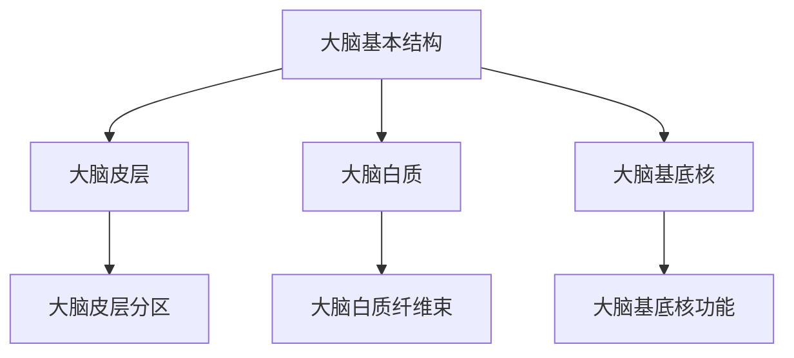
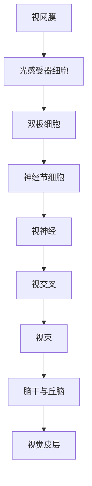
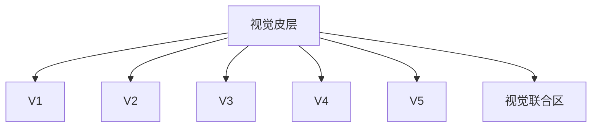

                 

## 文章标题

《大脑的结构与视觉》

## 关键词

大脑结构、视觉系统、视觉感知、认知功能、神经科学

## 摘要

本文将深入探讨大脑的结构与视觉系统的关系，解析大脑的基本构造、功能分区及神经传递机制，并详细阐述视觉系统的工作原理、视觉加工过程以及视觉缺陷与疾病的诊断与治疗。通过结合最新的研究成果和实际案例，本文旨在为读者提供一个全面、系统且易于理解的大脑与视觉领域的技术指南。

### 《大脑的结构与视觉》目录大纲

#### 第一部分：大脑的基本结构

1. **大脑的概述**
   - **1.1 大脑的起源与演化**
   - **1.2 大脑的基本结构与分区**

2. **大脑皮层**
   - **1.2.1 大脑皮层的定义与功能**
   - **1.2.2 大脑皮层的分区**
   - **1.2.3 大脑皮层与认知功能**

3. **大脑白质**
   - **1.3.1 大脑白质的定义与作用**
   - **1.3.2 大脑白质的纤维束与连接**

4. **大脑基底核**
   - **1.4.1 大脑基底核的结构与功能**
   - **1.4.2 大脑基底核与运动控制**

#### 第二部分：视觉系统

1. **视觉感知基础**
   - **2.1.1 光的物理特性**
   - **2.1.2 视网膜的结构与功能**
   - **2.1.3 视觉信号的传递过程**

2. **视觉皮层**
   - **2.2.1 视觉皮层的定义与功能**
   - **2.2.2 视觉皮层的分区**
   - **2.2.3 视觉处理的关键区域**

3. **视觉加工**
   - **2.3.1 视觉感知的心理学原理**
   - **2.3.2 视觉注意力与认知控制**
   - **2.3.3 视觉记忆与识别**

4. **视觉缺陷与疾病**
   - **2.4.1 视觉缺陷的种类与原因**
   - **2.4.2 视觉疾病的诊断与治疗**
   - **2.4.3 视觉康复与辅助技术**

#### 第三部分：大脑与视觉的关系

1. **大脑与视觉的互动**
   - **3.1.1 大脑与视觉的交互机制**
   - **3.1.2 大脑可塑性在视觉学习中的作用**
   - **3.1.3 视觉训练与大脑发展**

2. **视觉在大脑疾病中的表现**
   - **3.2.1 视觉障碍与神经退行性疾病**
   - **3.2.2 视觉症状在脑外伤与中风中的作用**
   - **3.2.3 视觉功能康复策略**

3. **视觉研究的新方向**
   - **3.3.1 遗传与视觉**
   - **3.3.2 计算机视觉与人工智能**
   - **3.3.3 视觉与心理健康**

#### 附录

- **附录 A：大脑结构与视觉研究的主要参考资源**
- **附录 B：大脑结构与视觉研究的 Mermaid 流程图**
- **附录 C：核心算法原理讲解**
- **附录 D：项目实战**

---

接下来，我们将逐步深入大脑与视觉的奥秘，希望通过本文的阐述，读者能够更好地理解大脑的复杂结构和视觉系统的奇妙工作原理。

---

### 第一部分：大脑的基本结构

#### 1.1 大脑的概述

大脑是人体中最为复杂的器官之一，它不仅控制着我们的身体运动、感知外部环境，还负责思维、记忆、情感等高级认知功能。从起源与演化角度来看，大脑的起源可以追溯到古老的海洋生物，在长时间的进化过程中，逐渐演化形成了现代人类的复杂大脑。

**1.1.1 大脑的起源与演化**

大脑的起源可以追溯到距今约5亿年前的寒武纪，当时一些无脊椎动物开始发展出中枢神经系统。随着生物的进化，尤其是脊椎动物的出现，大脑开始逐渐复杂化。约3.5亿年前的古生代，鱼类逐渐发展出较为复杂的中枢神经系统，其中包括原始的大脑皮层。进入中生代，哺乳动物的出现进一步推动了大脑的进化，尤其是大脑皮层的显著扩张，使得哺乳动物具备了更为复杂的认知能力。

人类的进化过程中，大脑的体积和复杂性得到了极大的提升。特别是在人类进化过程中，大脑皮层的发展尤为显著，这使得人类具备了独特的语言能力、抽象思维和创造力。现代人类的大脑皮层厚度、神经元连接和神经网络结构都达到了非常复杂和精细的程度。

**1.1.2 大脑的基本结构与分区**

大脑的基本结构主要包括大脑皮层、白质、基底核等部分。大脑皮层是大脑的最外层，覆盖在脑沟上，是执行高级认知功能的主要区域。白质位于大脑皮层下方，由神经纤维束组成，主要负责信息在不同脑区之间的传递。基底核位于白质深部，是一组灰质团块，参与运动控制和情感调节。

大脑的不同区域具有不同的功能。例如，前额叶负责决策和规划，颞叶负责听觉和记忆，顶叶负责触觉和空间感知，枕叶负责视觉处理。这些区域之间的相互协作使得大脑能够执行复杂多样的任务。

#### 1.2 大脑皮层

大脑皮层是大脑的最外层，覆盖在大脑的脑沟上，主要由神经元细胞组成。大脑皮层可以进一步细分为不同的区域，每个区域具有特定的功能。

**1.2.1 大脑皮层的定义与功能**

大脑皮层，也称为大脑新皮层或脑新皮层，是大脑的最外层结构，厚度约为2-4毫米。大脑皮层主要由灰质构成，包含大量的神经元细胞体和突触连接。大脑皮层是执行高级认知功能的主要区域，包括感知、记忆、思维、语言和情绪等。

大脑皮层的功能可以分为多个层次。最外层的初级皮层负责接收和处理来自感官系统的原始信号，如视觉、听觉和触觉。次级皮层则对这些信号进行进一步的加工和整合，形成更复杂的感知和认知体验。高级皮层则负责更复杂的思维和决策过程，包括抽象思维、逻辑推理和语言表达。

**1.2.2 大脑皮层的分区**

大脑皮层可以根据功能的不同进行分区，常见的分区方法包括Brodmann分区和功能分区。

- **Brodmann分区**：由德国神经学家Brodmann于1909年提出，将大脑皮层划分为52个区域，每个区域具有特定的功能。Brodmann分区主要基于皮层厚度、神经元密度和细胞类型的差异，例如，Brodmann区域17负责语言处理，Brodmann区域40负责视觉处理。

- **功能分区**：根据大脑皮层的功能进行划分，将大脑皮层分为初级皮层、次级皮层和高级皮层。初级皮层负责接收和处理感官信息，如初级视觉皮层、初级听觉皮层和初级躯体感觉皮层。次级皮层则对这些信息进行进一步的加工和整合，如视觉联合皮层和听觉联合皮层。高级皮层则负责复杂的认知功能，如前额叶皮层、颞叶皮层和顶叶皮层。

**1.2.3 大脑皮层与认知功能**

大脑皮层是认知功能的核心区域，不同的皮层区域与不同的认知功能相关联。

- **初级皮层**：初级皮层主要负责接收和处理来自感官系统的原始信号。例如，初级视觉皮层负责处理视觉信息，初级听觉皮层负责处理听觉信息，初级躯体感觉皮层负责处理触觉和本体感觉信息。

- **次级皮层**：次级皮层负责对初级皮层传来的信息进行进一步的加工和整合。例如，视觉联合皮层负责处理视觉场景的解析和认知，听觉联合皮层负责处理听觉信息的理解和感知。

- **高级皮层**：高级皮层负责复杂的认知功能，包括抽象思维、逻辑推理、决策和语言表达。前额叶皮层是高级认知功能的核心区域，参与规划、决策和社交行为。颞叶皮层与记忆和语言处理密切相关，顶叶皮层与空间感知和数学计算相关。

#### 1.3 大脑白质

大脑白质是指大脑中主要由神经纤维束组成的结构，这些神经纤维束负责在不同脑区之间传递信息。白质位于大脑皮层下方，是大脑结构的重要组成部分。

**1.3.1 大脑白质的定义与作用**

大脑白质主要由神经纤维束组成，这些神经纤维束是神经元细胞体的突起，主要负责信息在不同脑区之间的传递。白质相对于大脑皮层而言，颜色较浅，质地较硬，因此被称为“白质”。白质的作用是确保大脑不同区域之间的信息交流，使大脑能够协调执行复杂多样的任务。

**1.3.2 大脑白质的纤维束与连接**

大脑白质中的神经纤维束形成复杂的神经网络，这些网络通过纤维束在不同脑区之间传递信息。以下是一些重要的纤维束及其功能：

- **胼胝体**：是连接大脑左右半球的主要纤维束，负责在左右半球之间传递信息。胼胝体的损伤可能导致左右半球的功能隔离，影响认知和社交能力。

- **内囊**：位于大脑半球内部，是连接大脑皮层与基底核、脑干的重要纤维束。内囊中的神经纤维束包括豆状核束、视束和听束等，分别负责运动、视觉和听觉信息的传递。

- **视觉纤维束**：包括视束和外侧膝状体束，负责将视觉信息从视网膜传递到视觉皮层。视觉纤维束的损伤可能导致视觉障碍。

- **运动纤维束**：包括锥体束和红核脊髓束，负责将运动指令从大脑皮层传递到脊髓和脑干，控制肌肉运动。

- **听觉纤维束**：包括内侧膝状体束和外侧膝状体束，负责将听觉信息从内耳传递到听觉皮层。

#### 1.4 大脑基底核

大脑基底核是一组位于大脑深部的灰质团块，包括尾状核、壳核、苍白球和丘脑底核等结构。基底核在运动控制、情感调节和认知功能中起着关键作用。

**1.4.1 大脑基底核的结构与功能**

大脑基底核位于大脑深部，围绕在白质纤维束周围。基底核的结构复杂，包含多个核团，每个核团具有特定的功能。

- **尾状核**：主要负责连接大脑皮层与壳核，参与运动规划和执行。

- **壳核**：参与运动控制和情感调节。

- **苍白球**：参与运动控制和情感调节，还与纹状体的连接有关。

- **丘脑底核**：与运动控制和平衡调节有关。

基底核的主要功能包括：

- **运动控制**：基底核通过复杂的神经网络与大脑皮层和脑干相连，参与运动规划和执行。例如，尾状核和壳核参与协调运动，苍白球参与调节运动的力度和速度。

- **情感调节**：基底核与情感体验和情绪反应密切相关。壳核和苍白球参与情绪处理，调节情感体验和反应。

- **认知功能**：基底核参与记忆和认知控制，与大脑皮层和边缘系统协同工作。

**1.4.2 大脑基底核与运动控制**

大脑基底核在运动控制中起着关键作用。尾状核和壳核通过复杂的神经网络与大脑皮层相连，参与运动规划的生成和执行。具体来说，尾状核负责产生运动计划，将运动指令传递到壳核，壳核进一步将指令传递到脊髓和脑干，最终实现肌肉运动。

此外，苍白球也参与运动控制，通过调节运动的力度和速度，确保运动的协调和准确。基底核的异常活动可能导致运动障碍，如帕金森病和亨廷顿病等。

#### 1.5 大脑的其他结构

除了大脑皮层、白质和基底核，大脑还包括许多其他重要的结构，如脑干、小脑和边缘系统等。

**1.5.1 脑干**

脑干是连接大脑和脊髓的重要部分，位于大脑下方。脑干包含多个重要的神经核团，如运动核、感觉核和网状结构。脑干的主要功能包括：

- **呼吸调节**：脑干的呼吸中枢负责调节呼吸节奏和深度。
- **心跳调节**：脑干的心跳中枢负责调节心跳速度和节律。
- **意识水平调节**：脑干参与意识水平的调节，影响睡眠和觉醒状态。
- **运动协调**：脑干的运动核团参与运动协调和平衡控制。

**1.5.2 小脑**

小脑位于大脑的后下方，通过纤维束与大脑皮层和脑干相连。小脑的主要功能是协调运动、维持平衡和调节姿势。具体来说，小脑通过以下机制实现这些功能：

- **运动协调**：小脑接收来自大脑皮层的运动指令，协调肌肉运动，确保动作的流畅和准确。
- **平衡维持**：小脑参与平衡感知和协调，通过调节肌肉紧张度，维持身体的平衡。
- **姿势控制**：小脑负责调节身体的姿势，确保在行走、站立和坐姿等活动中保持正确的姿势。

**1.5.3 边缘系统**

边缘系统是大脑的一组结构，包括海马体、杏仁核、扣带回等，参与情感调节、记忆和情绪处理。边缘系统的主要功能包括：

- **情感调节**：边缘系统参与情绪体验和情绪反应的处理，调节情感体验的强度和持续时间。
- **记忆形成**：海马体是边缘系统中最重要的结构之一，参与新记忆的编码和存储。
- **应激反应**：边缘系统参与应激反应的调节，影响情绪和行为反应。

### 总结

大脑是人体中最为复杂的器官之一，通过其高度复杂的结构和功能，大脑能够执行各种生理和心理任务。大脑的基本结构包括大脑皮层、白质和基底核等，每个结构具有特定的功能。大脑皮层是执行高级认知功能的主要区域，白质负责信息在不同脑区之间的传递，基底核参与运动控制和情感调节。此外，脑干、小脑和边缘系统等结构也在大脑的整体功能中发挥着重要作用。通过对大脑结构的深入理解，我们能够更好地了解大脑如何运作，以及如何应对与大脑相关的疾病和挑战。

---

在接下来的章节中，我们将进一步探讨视觉系统的基本结构和工作原理，以及大脑如何处理和解读视觉信息。

---

#### 2.1 视觉感知基础

视觉系统是人类感知外部世界的重要渠道之一，它负责捕捉光线、处理视觉信息并将其转化为大脑可以理解的形式。视觉感知基础涉及光的物理特性、视网膜的结构与功能，以及视觉信号的传递过程。

**2.1.1 光的物理特性**

光是视觉感知的基础。光的物理特性包括波长、频率和能量等。光以电磁波的形式传播，其波长范围从约400纳米（紫光）到700纳米（红光）。不同波长的光对应于不同的颜色，如红、橙、黄、绿、蓝和紫。光的频率与波长成反比，频率越高，波长越短。光的能量与其频率成正比，高频光（如紫外线和蓝光）具有较高的能量。

光的物理特性对视觉感知具有重要意义。首先，不同波长的光在视网膜上产生不同的信号，这些信号通过视觉处理路径传送到大脑皮层，最终形成我们所看到的颜色。其次，光的强度影响视觉感知的亮度，光强增加时，视觉感受也会增强。此外，光的反射和折射现象使得我们能够看到周围物体的形状和距离。

**2.1.2 视网膜的结构与功能**

视网膜是眼睛内部的一层薄膜，是视觉感知的关键结构。视网膜由多层细胞组成，包括光感受器细胞、双极细胞、神经节细胞等。光感受器细胞分为视锥细胞和视杆细胞，它们分别负责色彩视觉和亮度感知。

- **视锥细胞**：位于视网膜的中央区域，如黄斑中心凹，负责色彩视觉。视锥细胞对光的敏感性较低，但在高光条件下表现优异。视锥细胞有三种类型，分别对红、绿和蓝光敏感，通过结合不同波长的光线，形成颜色感知。

- **视杆细胞**：分布在视网膜的外围区域，负责亮度感知。视杆细胞对光的敏感性较高，但在低光条件下表现更好。视杆细胞主要对一种类型的波长敏感，因此无法产生颜色感知，但能够检测光线强度的变化。

视网膜中的光感受器细胞将光信号转换为神经电信号，通过双极细胞和神经节细胞传递到视觉通路。神经节细胞的轴突汇集形成视神经，将信号传递到大脑皮层的视觉皮层。

**2.1.3 视觉信号的传递过程**

视觉信号从视网膜开始，通过一系列神经细胞和纤维束传递到大脑皮层的视觉处理区域。

1. **视网膜层**：光通过角膜和晶状体进入眼球，聚焦在视网膜上。视网膜的光感受器细胞（视锥细胞和视杆细胞）将光信号转换为电信号。

2. **双极细胞**：双极细胞接收光感受器细胞的信号，并将其传递到神经节细胞。

3. **神经节细胞**：神经节细胞收集来自多个双极细胞的信号，并将这些信号整合后传递到视觉通路。视网膜中的神经节细胞的轴突汇集形成视神经，穿过视神经盘（盲点），最终到达大脑。

4. **视神经**：视神经将视网膜的信号传递到大脑。在视交叉处，来自视网膜鼻侧的信号交叉到对侧，而来自视网膜颞侧的信号不交叉，形成交叉和未交叉的信号混合。

5. **视交叉**：视交叉位于大脑下方，是视觉信号从视网膜传递到大脑的重要节点。在这里，来自视网膜鼻侧的信号交叉到对侧，而来自视网膜颞侧的信号不交叉。

6. **视束**：视束是连接视交叉和大脑皮层的重要纤维束，负责传递视觉信号。视束中的神经纤维将信号传递到位于脑干的视觉处理中心。

7. **视觉皮层**：视觉信号最终传递到大脑皮层的视觉皮层，包括枕叶的视觉皮层和颞叶的视觉联合皮层。在这里，视觉信号被进一步处理和解释，形成我们所看到的图像和感知。

视觉信号的传递过程是一个复杂且高度协调的过程，涉及多个神经元和神经纤维的相互作用。通过这一过程，大脑能够从视网膜接收到的光信号中提取出丰富的视觉信息，如形状、颜色、亮度、运动和深度等。

**2.1.4 视觉信号处理的基本原理**

视觉信号处理包括从视网膜到大脑皮层的多个层次。以下是视觉信号处理的基本原理：

1. **空间频率分析**：视网膜中的视锥细胞和视杆细胞对不同空间频率的光线敏感。大脑通过分析不同空间频率的视觉信息，形成对物体形状和结构的感知。

2. **方向选择性**：视网膜和视觉皮层中的神经元具有方向选择性，能够检测特定方向的光线变化。这种特性使得大脑能够感知物体的运动和方向。

3. **对比敏感度**：大脑对对比度变化的敏感度较高，通过分析对比度变化，大脑能够感知物体的轮廓和细节。

4. **颜色处理**：大脑通过分析视网膜中视锥细胞的信号，形成对颜色的感知。颜色信息通过视觉通路的不同部分进行处理和整合。

5. **深度感知**：大脑通过分析视网膜上的视差和运动视差，形成对物体距离和深度的感知。

视觉信号处理的基本原理涉及多个方面，包括空间频率分析、方向选择性、对比敏感度、颜色处理和深度感知。这些原理共同作用，使得大脑能够从简单的光信号中提取出丰富的视觉信息，形成对周围世界的全面感知。

### 总结

视觉感知基础是理解视觉系统如何捕捉和处理光线信息的关键。光的物理特性决定了不同颜色和亮度的感知，视网膜的结构与功能使得光信号能够被转换为电信号，并通过复杂的神经网络传递到大脑。视觉信号的传递过程包括视网膜、双极细胞、神经节细胞、视神经、视交叉、视束和视觉皮层等多个层次，这些层次共同作用，使得大脑能够从简单的光信号中提取出丰富的视觉信息。通过掌握视觉感知基础，我们能够更好地理解视觉系统的工作原理，以及如何通过计算机视觉技术模拟和增强视觉感知。

---

在下一章节中，我们将深入探讨视觉皮层的功能与分区，以及大脑如何通过视觉皮层处理和解释视觉信息。

---

#### 2.2 视觉皮层

视觉皮层是大脑处理视觉信息的主要区域，位于枕叶和颞叶。视觉皮层由多个不同功能分区组成，每个分区在视觉处理过程中扮演着特定的角色。理解视觉皮层的定义与功能、分区及其关键区域，有助于我们深入理解视觉系统的复杂运作。

**2.2.1 视觉皮层的定义与功能**

视觉皮层，又称视觉中枢或视觉皮质，是指大脑皮层中专门负责处理视觉信息的部分。视觉皮层位于大脑的外侧面，特别是枕叶和颞叶的后部。视觉皮层的结构复杂，包含多个功能不同的区域，每个区域在视觉信息的处理和解释中发挥着独特的作用。

视觉皮层的主要功能包括：

1. **视觉信息处理**：视觉皮层接收来自视网膜的光信号，通过神经纤维束（如视束）传递到大脑。视觉皮层对这些信号进行加工和处理，提取出物体的形状、颜色、运动和空间关系等特征。

2. **视觉感知**：视觉皮层负责将加工后的视觉信息转化为有意义的感知体验，如识别物体、判断物体的方向和距离，以及理解视觉场景中的意义。

3. **视觉记忆**：视觉皮层参与视觉记忆的形成和存储，使我们能够记住先前看到的物体和场景。

4. **视觉注意力**：视觉皮层调控视觉注意力的分配，帮助我们集中精力关注重要的视觉信息，过滤掉不相关的视觉刺激。

5. **视觉控制**：视觉皮层通过反馈机制与运动皮层和其他脑区协同工作，控制眼球的运动，调整视线以优化视觉感知。

**2.2.2 视觉皮层的分区**

视觉皮层可以根据功能不同进行分区，常见的分区方法包括Brodmann分区和功能分区。

- **Brodmann分区**：由德国神经学家Brodmann在20世纪初提出，将视觉皮层划分为多个区域，每个区域具有特定的功能。Brodmann分区方法主要基于神经元细胞类型和神经纤维束的分布，例如，Brodmann区域17负责处理形状信息，Brodmann区域18和19负责处理颜色信息。

- **功能分区**：根据视觉处理的不同阶段和功能，将视觉皮层分为多个区域。常见的功能分区包括初级视觉皮层、次级视觉皮层和高级视觉皮层。

  - **初级视觉皮层**：也称为V1或视觉中枢，是视觉信息处理的第一站。V1位于枕叶后部，主要功能是接收和初步处理来自视网膜的视觉信息，如空间频率、方向和运动等。V1是视觉信息加工的基本模块，对后续的视觉处理区域具有重要作用。

  - **次级视觉皮层**：包括V2、V3和V4等区域，负责对初级视觉皮层传来的信息进行进一步的加工和整合。次级视觉皮层主要处理视觉信息的细节，如颜色、形状和纹理等。这些区域在视觉识别和场景理解中起着关键作用。

  - **高级视觉皮层**：包括V5、V6和颞叶的视觉联合区等，负责处理更复杂的视觉任务，如物体识别、场景理解、视觉记忆和视觉注意等。高级视觉皮层通过与其他脑区（如运动皮层、前额叶皮层和顶叶皮层）的交互，协调执行更高级的认知任务。

**2.2.3 视觉处理的关键区域**

视觉皮层中的不同区域在视觉信息处理中发挥着独特的作用，以下是几个关键区域：

- **V1（初级视觉皮层）**：V1是视觉信息处理的核心区域，位于枕叶后部。V1的主要功能是接收和初步处理视网膜传来的视觉信息，如空间频率、方向和运动等。V1神经元具有高度的空间频率和方向选择性，能够检测简单的视觉特征。

- **V2**：V2位于V1的前方，对V1传来的信息进行进一步的加工。V2主要负责处理视觉信息的细节，如颜色和形状的边缘。V2神经元具有更精细的方向和空间频率选择性，能够检测更复杂的视觉特征。

- **V3**：V3位于V2的下方，是视觉处理的重要区域。V3主要负责处理视觉信息的运动方向和运动速度，对动态视觉感知和视觉运动协调至关重要。

- **V4**：V4位于V3的后方，是视觉处理的关键区域，负责处理视觉信息的高级特征，如颜色和形状的整体感知。V4神经元具有高度的颜色选择性，能够检测物体的颜色信息。

- **V5（MT区）**：V5位于V4的后方，也称为运动视觉区，主要负责处理视觉运动信息，如运动方向和速度。V5在视觉运动协调和空间导航中起着重要作用。

- **视觉联合区**：视觉联合区位于颞叶，包括V6和颞叶的视觉联合区等。这些区域主要负责处理视觉信息的语义和意义，如物体识别、场景理解等。视觉联合区通过与其他认知和运动脑区的交互，协调执行更高级的认知任务。

**2.2.4 视觉皮层的交互与功能整合**

视觉皮层中的不同区域通过复杂的神经网络相互连接，协同工作，实现视觉信息的处理和解释。视觉皮层的交互与功能整合包括以下几个方面：

1. **空间频率和方向选择性**：视觉皮层中的神经元具有高度的空间频率和方向选择性，通过不同区域之间的相互作用，实现对视觉信息的精细加工和整合。

2. **颜色和形状加工**：视觉皮层的不同区域负责处理颜色和形状的不同方面。例如，V1主要处理视觉信息的基本特征，如空间频率和方向；V4则主要负责处理颜色的整体感知。

3. **运动处理**：视觉皮层中的V3和V5区域专门处理视觉运动信息，通过这些区域的协同工作，实现对动态视觉感知和视觉运动协调的支持。

4. **语义和场景理解**：视觉联合区位于颞叶，负责处理视觉信息的语义和意义。通过与其他认知和运动脑区的交互，视觉联合区帮助实现对物体和场景的全面理解和解释。

总之，视觉皮层是大脑处理视觉信息的核心区域，通过其高度复杂的结构和功能，视觉皮层能够实现对视觉信息的精细加工和解释。理解视觉皮层的分区和关键区域，有助于我们深入理解视觉系统的运作机制，为研究视觉障碍和开发计算机视觉技术提供理论依据。

---

在下一章节中，我们将深入探讨视觉加工的过程，包括视觉感知的心理学原理、视觉注意力与认知控制，以及视觉记忆与识别。

---

#### 2.3 视觉加工

视觉加工是大脑处理视觉信息的过程，涉及从简单的感官输入到复杂认知反应的多个阶段。视觉加工不仅包括对视觉刺激的感知和识别，还涉及到注意力分配、认知控制和记忆形成等多个方面。在这一节中，我们将详细讨论视觉加工的心理学原理、视觉注意力与认知控制，以及视觉记忆与识别。

**2.3.1 视觉感知的心理学原理**

视觉感知是视觉加工的第一步，它涉及从视网膜接收到的光信号到大脑中的解释和理解的转换。心理学原理帮助我们理解这一过程是如何发生的。

1. **特征检测**：视觉系统首先检测视觉刺激的特征，如形状、颜色、亮度和运动等。这些特征通过视网膜上的光感受器细胞（视锥细胞和视杆细胞）被转换为电信号。

2. **信息整合**：大脑将来自不同特征的信息进行整合，形成对视觉刺激的整体感知。例如，视觉系统将形状和颜色信息结合，识别一个物体的外观。

3. **上下文依赖**：视觉感知受到上下文的影响。例如，一个孤立的对象可能难以识别，但放在特定的背景中，则容易识别。

4. **模式识别**：大脑通过模式识别算法，将感知到的视觉刺激与记忆中的模式进行匹配，以识别物体和场景。

5. **注意机制**：注意机制在视觉感知中起着关键作用。视觉系统通过选择关注某些刺激，同时忽略其他刺激，从而集中处理重要信息。

**2.3.2 视觉注意力与认知控制**

视觉注意力是视觉系统中的一个重要机制，它决定了我们在特定时刻关注哪些视觉信息。视觉注意力与认知控制密切相关，影响我们对视觉信息的处理和解释。

1. **注意选择**：注意选择是指大脑在众多视觉刺激中选择关注特定刺激的过程。例如，当我们阅读文字时，我们关注文字，而忽略周围的背景。

2. **注意分配**：注意分配是指大脑如何在不同的视觉任务和场景中分配注意资源。例如，在复杂的交通环境中，驾驶员需要分配注意力到不同的道路标志、车辆和行人。

3. **注意转换**：注意转换是指大脑在短时间内从一个任务或刺激转移到另一个任务或刺激。例如，当我们在阅读文章时，需要注意转换到查找特定信息。

4. **认知控制**：认知控制是指大脑在视觉加工过程中调节和调整注意力的能力。认知控制帮助我们过滤无关信息，保持对目标信息的关注，并协调不同认知任务之间的切换。

**2.3.3 视觉记忆与识别**

视觉记忆是视觉加工的一个重要组成部分，它涉及对视觉信息的临时和长期存储。视觉记忆可以分为短期记忆和长期记忆。

1. **短期记忆**：短期记忆存储我们对视觉刺激的瞬时感知。例如，当我们看到一张面孔，我们可能在几秒钟内记住它的特征。

2. **长期记忆**：长期记忆存储我们对视觉刺激的持久记忆。长期记忆涉及大脑中的神经网络和突触连接的持久变化。

视觉识别是指大脑从记忆中检索和识别视觉信息的能力。视觉识别包括：

1. **物体识别**：物体识别是指从背景中识别和分类物体。例如，识别一个苹果或一张熟悉的面孔。

2. **场景理解**：场景理解是指理解视觉信息中物体的空间关系和场景的意义。例如，理解一幅画中的场景或识别一个复杂的城市景观。

3. **视觉分类**：视觉分类是指根据物体的视觉特征将其归类。例如，识别一张图片中的动物或植物。

**2.3.4 视觉加工的模型**

视觉加工的心理学原理和过程可以通过不同的模型来解释。以下是一些常见的视觉加工模型：

1. **特征检测模型**：该模型认为视觉系统首先检测视觉刺激的基本特征，如形状、颜色和亮度。这些特征通过神经元的激活进行编码和传递。

2. **整合反应模型**：该模型认为视觉系统将多个特征整合成一个整体的感知体验。例如，颜色和形状信息结合，形成物体的完整视觉感知。

3. **动态视觉模型**：该模型强调视觉系统的动态特性，如注意力和记忆的动态变化，以及视觉信息在不同脑区之间的动态传递。

4. **认知神经科学模型**：该模型结合了心理学、神经科学和计算机科学的理论，试图模拟视觉系统的加工过程，解释视觉感知和认知控制的机制。

总之，视觉加工是一个复杂的过程，涉及从简单的感官输入到复杂认知反应的多个阶段。通过理解视觉感知的心理学原理、视觉注意力与认知控制，以及视觉记忆与识别，我们能够更深入地了解视觉系统的运作机制，为开发计算机视觉技术和改善视觉障碍的治疗提供理论支持。

---

在下一章节中，我们将探讨视觉缺陷与疾病，包括视觉缺陷的种类与原因、视觉疾病的诊断与治疗，以及视觉康复与辅助技术。

---

#### 2.4 视觉缺陷与疾病

视觉缺陷和疾病会影响人们的日常生活和功能，影响从简单的日常任务到复杂工作的完成。在这一节中，我们将探讨视觉缺陷的种类与原因、视觉疾病的诊断与治疗，以及视觉康复与辅助技术。

**2.4.1 视觉缺陷的种类与原因**

视觉缺陷可以分为先天性和后天获得性两大类。

1. **先天性视觉缺陷**：

   - **先天性盲**：先天性盲是指出生时就存在的视觉功能丧失。先天性盲可能是由于遗传因素、胎儿发育异常或孕期疾病等原因导致的。

   - **先天性色盲**：先天性色盲是指出生时就存在对某些颜色的感知障碍。色盲可能是由于视网膜上的光感受器细胞异常或遗传因素导致的。

2. **后天获得性视觉缺陷**：

   - **视网膜病变**：视网膜病变是指视网膜组织发生病变，导致视觉功能受损。常见的视网膜病变包括糖尿病视网膜病变、年龄相关性黄斑变性（AMD）和视网膜血管阻塞。

   - **视神经病变**：视神经病变是指视神经发生病变，导致视觉信号传递到大脑的障碍。常见的视神经病变包括视神经炎和视神经萎缩。

   - **白内障**：白内障是指晶状体发生混浊，导致视力模糊。白内障可能是年龄相关性的，也可能是由于外伤、药物或遗传因素导致的。

   - **青光眼**：青光眼是指眼内压升高，导致视神经损伤和视野缺损。青光眼可能是原发性或继发性的，原发性青光眼可能是由于眼内液体循环障碍导致的。

**2.4.2 视觉疾病的诊断与治疗**

视觉疾病的诊断与治疗需要专业的眼科医生进行。以下是一些常见的诊断与治疗方法：

1. **诊断方法**：

   - **视力检查**：通过视力表和字母表来评估患者的视力水平，包括中央视力和周边视力。

   - **色觉测试**：通过色盲测试来评估患者的色觉能力。

   - **眼底检查**：通过眼底镜观察视网膜和视神经的健康状况。

   - **视觉电生理检查**：如视网膜电图（ERG）和视觉诱发电位（VEP）检查，评估视网膜和视觉传导通路的电生理活动。

   - **光学相干断层扫描（OCT）**：通过使用光波扫描视网膜和视神经，评估其结构和功能。

2. **治疗方法**：

   - **药物治疗**：针对某些视网膜病变和青光眼，药物治疗可以通过控制眼内压、改善视网膜血流和抑制炎症反应来延缓疾病进展。

   - **手术治疗**：对于白内障、视网膜脱落和某些类型的眼底病变，手术治疗可能是必要的。例如，白内障手术通过植入人工晶状体来恢复视力；视网膜手术通过手术修复视网膜裂孔或脱离。

   - **视力矫正**：对于屈光不正（如近视、远视和散光），使用眼镜、隐形眼镜或角膜塑形镜（Orthokeratology）可以纠正视力问题。

   - **视力重建**：对于严重的视觉损伤，视力重建技术，如光遗传学和视网膜植入，正在研究和开发中。

**2.4.3 视觉康复与辅助技术**

视觉康复和辅助技术旨在帮助视觉障碍者提高生活质量和独立性。以下是一些常见的视觉康复与辅助技术：

1. **辅助设备**：

   - **放大镜**：用于放大文字、图片和其他视觉内容，帮助视觉障碍者更好地阅读和观察。

   - **屏幕阅读器**：通过语音合成技术，将文本内容转换为语音输出，帮助视力受损者阅读电子文档和网站内容。

   - **助视器**：如电子放大镜、盲人指路器和定向设备，帮助视觉障碍者完成日常活动。

2. **康复训练**：

   - **视觉训练**：通过特定的训练方法和练习，提高视觉障碍者的视觉感知、记忆和识别能力。

   - **认知训练**：通过认知训练，提高视觉障碍者的注意力、记忆和执行功能。

   - **辅助技术培训**：为视觉障碍者提供使用辅助设备的培训，帮助他们更好地适应和使用辅助技术。

3. **无障碍环境**：

   - **视觉无障碍设计**：在建筑、交通和信息技术等领域，采用无障碍设计，如大字体、颜色对比和语音提示，帮助视觉障碍者更好地适应环境。

   - **社区支持**：建立视觉障碍者社区和支持组织，提供社交支持和资源，帮助他们融入社会。

总之，视觉缺陷和疾病对个人的生活质量产生重大影响。通过早期诊断、适当的治疗和康复训练，以及使用辅助技术和无障碍设计，视觉障碍者可以更好地适应日常生活，提高生活质量和独立性。

---

在下一章节中，我们将探讨大脑与视觉的互动，包括大脑与视觉的交互机制、大脑可塑性在视觉学习中的作用，以及视觉训练与大脑发展的关系。

---

### 3.1 大脑与视觉的互动

大脑与视觉的互动是一个复杂而高度协调的过程，涉及到视觉信号在大脑中的传递、处理和解释。在这一节中，我们将探讨大脑与视觉的交互机制、大脑可塑性在视觉学习中的作用，以及视觉训练与大脑发展的关系。

**3.1.1 大脑与视觉的交互机制**

大脑与视觉的交互机制是视觉信息处理的关键。视觉信号从视网膜传递到大脑，通过一系列神经纤维束和脑区，最终在大脑皮层中形成对视觉刺激的完整感知。

1. **视觉信号传递**：视觉信号通过视网膜上的光感受器细胞（视锥细胞和视杆细胞）被转换为电信号。这些电信号通过视网膜中的双极细胞和神经节细胞传递到视神经，然后传递到大脑。

2. **视束传递**：视神经将视觉信号传递到大脑的视交叉，在这里，来自视网膜鼻侧的信号交叉到对侧，而来自视网膜颞侧的信号保持不变。交叉后的信号继续通过视束传递到脑干和丘脑。

3. **脑干处理**：脑干中的某些区域，如上丘和下丘，对视觉信号进行初步处理，包括运动控制和视觉空间的解析。

4. **丘脑传递**：丘脑是视觉信号传递到大脑皮层的重要中继站。丘脑中的内侧膝状体和外侧膝状体分别负责视觉信号的处理和传递。

5. **视觉皮层处理**：视觉信号最终到达大脑皮层的视觉皮层，包括枕叶的视觉中枢和颞叶的视觉联合区。在这里，视觉信号被进一步处理和解释，形成我们对视觉刺激的整体感知。

**3.1.2 大脑可塑性在视觉学习中的作用**

大脑可塑性是指大脑在结构和功能上发生持久变化的能力，这种变化可以受到外界刺激、学习经验和环境因素的影响。大脑可塑性在视觉学习中起着关键作用，它使我们能够适应新的视觉环境和任务。

1. **神经可塑性**：神经可塑性是指神经细胞和神经网络在结构和功能上的变化。视觉学习过程中，神经元之间的连接（突触）发生改变，增强或减弱突触传递效率。例如，通过视觉训练，视觉皮层的某些区域可能会变得更加活跃和敏感。

2. **突触可塑性**：突触可塑性是指突触结构和功能的改变，包括突触强度的增强或减弱。视觉学习过程中，突触可塑性通过改变突触的形状和化学成分，影响神经信号的传递效率。

3. **神经元重组**：神经元重组是指神经网络的重组和重新连接，以适应新的学习任务和环境。例如，在盲人中使用触觉和听觉替代视觉时，大脑会重新组织神经网络，调整不同感官区域的功能。

**3.1.3 视觉训练与大脑发展**

视觉训练是通过特定的练习和任务，提高视觉能力的一种方法。视觉训练可以针对不同类型的视觉障碍，如视觉感知缺陷、视觉记忆障碍和视觉运动协调障碍。视觉训练与大脑发展密切相关，它可以通过以下机制促进大脑的发展：

1. **结构可塑性**：视觉训练可以通过增加大脑灰质体积和神经网络密度，改善大脑的结构。例如，研究发现，通过视觉训练，视觉皮层的灰质体积可能会增加，提高视觉处理效率。

2. **功能可塑性**：视觉训练可以增强视觉皮层的功能连接，提高视觉处理的速度和准确性。例如，通过视觉训练，视觉皮层中的不同区域可能会建立更强的连接，使视觉信息加工更加高效。

3. **认知可塑性**：视觉训练不仅影响视觉能力，还可能促进认知能力的发展。例如，视觉训练可以改善注意力、记忆和执行功能，提高整体认知水平。

4. **经验依赖性发展**：视觉训练依赖于个人的经验和环境。在适当的视觉训练下，大脑会根据经验和环境的需求，调整神经网络和功能，以适应新的视觉任务和情境。

**3.1.4 视觉训练的方法**

视觉训练的方法多种多样，包括：

1. **视觉感知训练**：通过特定的视觉刺激，提高视觉感知能力。例如，使用不同形状、颜色和亮度的刺激，训练视觉分辨力和视觉灵敏度。

2. **视觉记忆训练**：通过记忆游戏和记忆训练任务，提高视觉记忆能力。例如，记忆一系列视觉图案或数字序列，训练短期记忆和长期记忆。

3. **视觉运动协调训练**：通过结合视觉和运动任务，提高视觉运动协调能力。例如，在运动过程中，要求参与者关注特定的视觉目标，训练视觉与运动的协调。

4. **环境适应性训练**：通过在复杂环境中进行视觉训练，提高视觉适应能力和处理复杂视觉信息的能力。例如，在嘈杂的环境中进行视觉任务，训练视觉注意力和信息过滤能力。

总之，大脑与视觉的互动是一个复杂而高度协调的过程，涉及到视觉信号在大脑中的传递、处理和解释。大脑可塑性在视觉学习中起着关键作用，通过视觉训练，可以促进大脑的发展和视觉能力的提高。理解大脑与视觉的互动机制，以及视觉训练的方法和效果，有助于我们更好地利用视觉资源，提高生活质量。

---

在下一章节中，我们将探讨视觉在大脑疾病中的表现，包括视觉障碍与神经退行性疾病、视觉症状在脑外伤与中风中的作用，以及视觉功能康复策略。

---

### 3.2 视觉在大脑疾病中的表现

视觉在大脑疾病中的表现多样且复杂，不同的神经系统疾病可能对视觉功能产生不同程度的影响。在本节中，我们将探讨视觉障碍与神经退行性疾病、视觉症状在脑外伤与中风中的作用，以及视觉功能康复策略。

**3.2.1 视觉障碍与神经退行性疾病**

神经退行性疾病是一类以神经细胞退行性变和死亡为特征的疾病，包括阿尔茨海默病、帕金森病和亨廷顿病等。这些疾病对视觉系统的影响主要表现为视觉障碍和认知功能障碍。

1. **阿尔茨海默病（AD）**：阿尔茨海默病是一种常见的神经退行性疾病，主要影响大脑的额叶和颞叶。早期症状包括记忆力下降和认知功能障碍，随着病情进展，可能出现视觉障碍，如视野缩小、颜色识别困难、视觉错觉和视觉失认等。这些视觉障碍可能是由于大脑神经元网络的损伤和神经元之间的连接中断导致的。

2. **帕金森病（PD）**：帕金森病是一种慢性神经系统疾病，主要影响运动控制。帕金森病患者的视觉障碍包括视觉模糊、视力下降和视野缩小。这些视觉障碍可能是由于黑质纹状体通路中的多巴胺能神经元受损，导致运动控制和视觉处理功能障碍。

3. **亨廷顿病（HD）**：亨廷顿病是一种遗传性神经退行性疾病，主要影响大脑皮层和基底核。亨廷顿病患者的视觉障碍包括视力下降、视野缩小、颜色失真和视觉失认。这些视觉障碍可能是由于大脑神经元网络的破坏和神经元之间的连接中断导致的。

**3.2.2 视觉症状在脑外伤与中风中的作用**

脑外伤和中风是常见的神经系统疾病，对视觉系统的影响显著。视觉症状在这些疾病中的作用包括视力下降、视野缺损、视觉失认和视觉运动协调障碍等。

1. **脑外伤**：脑外伤可能导致视觉系统直接受损，引起视力下降、视野缺损和视觉失认。脑外伤还可能影响视觉运动协调，导致眼球运动障碍和视觉追踪困难。此外，脑外伤还可能引起脑震荡，导致认知功能障碍和视觉处理异常。

2. **中风**：中风是指脑部血管发生阻塞或破裂，导致脑组织缺血或出血。中风可能导致视觉障碍，包括视力下降、视野缺损和视觉失认。中风还可能影响视觉运动协调，导致眼球运动障碍和视觉追踪困难。中风还可能导致认知功能障碍，进一步影响视觉处理和认知整合。

**3.2.3 视觉功能康复策略**

针对大脑疾病引起的视觉障碍，视觉功能康复策略旨在恢复或改善患者的视觉功能。以下是一些常见的康复策略：

1. **药物治疗**：药物治疗是视觉功能康复的重要一环。针对不同的视觉障碍，可能需要使用不同的药物。例如，对于阿尔茨海默病患者，可能需要使用改善认知功能的药物；对于帕金森病患者，可能需要使用改善运动控制和视觉功能的药物。

2. **视觉训练**：视觉训练是一种通过特定的练习和任务，提高视觉能力的方法。视觉训练可以针对不同类型的视觉障碍，如视觉感知缺陷、视觉记忆障碍和视觉运动协调障碍。常见的视觉训练方法包括视觉感知训练、视觉记忆训练和视觉运动协调训练。

3. **辅助技术**：辅助技术是视觉功能康复的重要工具。辅助技术包括放大镜、屏幕阅读器、助视器和视觉辅助设备等。这些设备可以帮助患者更好地阅读、观察和导航。

4. **认知康复**：认知康复旨在恢复或改善患者的认知功能。认知康复可以通过认知训练、记忆训练和执行功能训练等方法进行。认知康复有助于改善患者的视觉处理和认知整合能力。

5. **心理支持**：心理支持在视觉功能康复中起着关键作用。视觉障碍可能导致患者产生焦虑、抑郁和沮丧等情绪。心理支持可以通过心理咨询、社交支持和团体活动等方式进行，帮助患者应对情绪问题，提高生活质量。

总之，视觉在大脑疾病中的表现多样且复杂，不同的神经系统疾病可能导致不同的视觉障碍。针对这些障碍，视觉功能康复策略包括药物治疗、视觉训练、辅助技术、认知康复和心理支持等。通过这些策略，可以帮助患者恢复或改善视觉功能，提高生活质量。

---

在下一章节中，我们将探讨视觉研究的新方向，包括遗传与视觉、计算机视觉与人工智能，以及视觉与心理健康。

---

### 3.3 视觉研究的新方向

视觉研究在过去几十年中取得了显著进展，但仍然存在许多未解之谜和新的研究热点。在这一节中，我们将探讨视觉研究的新方向，包括遗传与视觉、计算机视觉与人工智能，以及视觉与心理健康。

**3.3.1 遗传与视觉**

遗传因素在视觉功能中起着关键作用。视觉系统的发育和功能受多个基因的调控，这些基因的变异可能导致视觉障碍和疾病。以下是一些与遗传相关的视觉研究方向：

1. **遗传突变与视觉障碍**：研究视觉障碍患者中的遗传突变，有助于揭示视觉系统的基因功能和机制。例如，视网膜色素变性是一种遗传性视网膜疾病，其病因主要与视网膜细胞的基因突变相关。

2. **基因治疗**：基因治疗是一种新兴的治疗方法，通过修复或替换突变基因，恢复视觉功能。近年来，基因治疗在治疗视网膜病变和其他视觉障碍方面取得了重要进展。例如，腺相关病毒（AAV）载体介导的基因治疗已成功用于治疗遗传性视网膜疾病。

3. **基因组学**：基因组学研究有助于识别与视觉功能相关的基因和基因网络。全基因组关联研究（GWAS）和单倍型分析等方法已经揭示了多个与视觉障碍和疾病相关的基因。

**3.3.2 计算机视觉与人工智能**

计算机视觉与人工智能的结合为视觉研究带来了新的机遇。计算机视觉技术可以模拟人类的视觉系统，处理和分析大量的视觉数据，而人工智能算法则为视觉系统的智能化提供了强大的支持。以下是一些与计算机视觉和人工智能相关的视觉研究方向：

1. **图像识别与分类**：计算机视觉技术可以自动识别和分类图像中的物体和场景。深度学习算法，如卷积神经网络（CNN），在图像识别任务中取得了显著的效果。例如，人脸识别、车辆检测和场景分类等应用广泛。

2. **目标跟踪与动作识别**：目标跟踪和动作识别是计算机视觉的重要应用领域。通过结合视觉跟踪算法和深度学习模型，可以实现对动态场景中目标的实时跟踪和动作识别。

3. **增强现实与虚拟现实**：增强现实（AR）和虚拟现实（VR）技术依赖于计算机视觉和人工智能技术。AR和VR系统可以通过实时捕捉和分析用户的视觉信息，提供沉浸式的视觉体验。

**3.3.3 视觉与心理健康**

视觉系统与心理健康密切相关。视觉障碍和视觉问题可能导致情绪困扰、社交障碍和认知功能下降。以下是一些与视觉和心理健康相关的视觉研究方向：

1. **视觉与情绪**：视觉刺激对情绪和情感反应具有重要影响。研究视觉与情绪的关系，有助于理解视觉在心理健康中的作用。例如，研究视觉刺激对情绪状态的影响，以及视觉认知缺陷与情绪障碍之间的关系。

2. **视觉康复与心理健康**：视觉康复不仅有助于改善视觉功能，还可以促进心理健康。通过视觉训练和辅助技术，可以帮助患者提高生活质量和心理健康水平。例如，视觉训练结合认知训练，有助于改善认知功能和情绪状态。

3. **心理视觉障碍**：心理视觉障碍是一种非器质性的视觉障碍，患者表现出视觉症状，如视觉模糊、光晕和视觉扭曲等。研究心理视觉障碍的成因和治疗方法，对于改善心理健康具有重要意义。

总之，视觉研究的新方向涵盖了遗传、计算机视觉与人工智能，以及视觉与心理健康等多个领域。这些研究方向不仅有助于揭示视觉系统的奥秘，还为视觉障碍的治疗和康复提供了新的思路和方法。通过不断探索和深入研究，我们将能够更好地理解和利用视觉资源，提高人类的生活质量和心理健康水平。

---

在最后的附录部分，我们将提供大脑结构与视觉研究的主要参考资源，并展示大脑结构与视觉研究的 Mermaid 流程图，核心算法原理讲解，以及实际的项目实战案例。

---

### 附录

#### 附录 A：大脑结构与视觉研究的主要参考资源

**A.1 顶级期刊与学术会议**

- **《Nature Neuroscience》**：该期刊涵盖神经科学领域的最新研究，包括视觉系统、神经退行性疾病等。
- **《Journal of Neuroscience》**：该期刊发表神经科学领域的原创研究论文，涉及视觉感知、视觉加工等。
- **《Neuroimage》**：该期刊专注于脑成像技术及其在视觉研究中的应用。
- **《Frontiers in Neuroscience》**：该期刊涵盖神经科学领域的广泛研究，包括视觉神经科学。

**A.2 经典教材与专著推荐**

- **《基础神经科学：临床与应用》**：Kandel，E.R.等著，提供了全面的神经科学基础知识。
- **《视觉神经科学》**： Hubel，D.H.和Wiesel，T.N.著，经典著作，详细介绍了视觉系统的工作原理。
- **《大脑如何工作》**：Eccles，J.C.等著，深入探讨了大脑的结构和功能。

**A.3 开放资源与在线课程**

- **Coursera**：提供了许多关于神经科学和视觉科学的在线课程，如《神经科学基础》和《视觉系统》。
- **Khan Academy**：提供了一系列免费的学习资源，包括神经科学和视觉感知的基础知识。
- **MIT OpenCourseWare**：提供了MIT神经科学和视觉科学课程的免费在线资源。

#### 附录 B：大脑结构与视觉研究的 Mermaid 流程图

**B.1 大脑基本结构的 Mermaid 图**



**B.2 视觉信号传递过程的 Mermaid 图**



**B.3 视觉处理关键区域的 Mermaid 图**



#### 附录 C：核心算法原理讲解

**C.1 视觉感知的数学模型与算法**

视觉感知的数学模型通常涉及信号处理、图像处理和机器学习等领域。以下是一个基本的视觉感知算法的伪代码：

```python
# 视觉感知算法伪代码

# 输入：图像I
# 输出：感知特征F

# 1. 图像预处理
I_processed = preprocess(I)

# 2. 特征提取
F = extract_features(I_processed)

# 3. 特征分类
label = classify(F)

# 4. 结果输出
output_result(label)
```

**C.2 视觉算法的数学模型与公式**

视觉感知的数学模型通常涉及以下公式：

$$
\begin{aligned}
I &= f(\lambda, \theta) \\
F &= \phi(I) \\
label &= \text{classify}(F)
\end{aligned}
$$

- \(I\)：输入图像
- \(\lambda\)：光波长
- \(\theta\)：观察角度
- \(f\)：成像函数
- \(F\)：感知特征
- \(\phi\)：特征提取函数
- \(\text{classify}\)：分类函数

**C.3 伪代码实现视觉算法**

以下是一个简单的伪代码示例，用于实现图像的特征提取和分类：

```python
# 伪代码：特征提取与分类

# 输入：图像I
# 输出：分类结果label

# 特征提取
def extract_features(image):
    # 图像预处理
    preprocessed_image = preprocess_image(image)
    
    # 提取边缘特征
    edges = Canny(preprocessed_image)
    
    # 计算特征向量
    features = compute_hog(edges)
    
    return features

# 分类
def classify(features):
    # 使用SVM进行分类
    model = train_svm(features)
    
    # 预测分类结果
    label = model.predict(features)
    
    return label

# 主函数
def main(image):
    features = extract_features(image)
    label = classify(features)
    print("分类结果：", label)

# 测试
main(input_image)
```

#### 附录 D：项目实战

**D.1 视觉识别项目案例**

在本节中，我们将介绍一个简单的视觉识别项目，包括开发环境搭建、源代码详细实现和代码解读。

**D.1.1 开发环境搭建**

1. **安装Python环境**：确保Python 3.x版本已安装在计算机上。
2. **安装依赖库**：使用pip安装所需的库，如OpenCV、scikit-learn和numpy。
    ```shell
    pip install opencv-python scikit-learn numpy
    ```

**D.1.2 源代码详细实现**

以下是一个简单的视觉识别项目的源代码示例：

```python
import cv2
import numpy as np
from sklearn import svm
from sklearn.model_selection import train_test_split

# 读取图像
def read_image(filename):
    return cv2.imread(filename, cv2.IMREAD_GRAYSCALE)

# 提取图像特征
def extract_features(image):
    edges = cv2.Canny(image, 100, 200)
    features = cv2.HOGDescriptor().compute(edges)
    return features

# 加载和分割训练数据
def load_data(filename):
    image = read_image(filename)
    features = extract_features(image)
    return train_test_split(features, test_size=0.2, random_state=42)

# 训练模型
def train_model(features, labels):
    model = svm.SVC()
    model.fit(features, labels)
    return model

# 主函数
def main():
    # 加载训练数据
    X_train, X_test, y_train, y_test = load_data("train_images.csv")

    # 训练模型
    model = train_model(X_train, y_train)

    # 测试模型
    predictions = model.predict(X_test)
    accuracy = (predictions == y_test).mean()
    print("模型准确率：", accuracy)

# 运行主函数
if __name__ == "__main__":
    main()
```

**D.1.3 代码解读与分析**

1. **图像读取**：使用OpenCV库的`imread`函数读取图像，并转换为灰度图像。
2. **特征提取**：使用Canny算法提取图像的边缘特征，然后使用HOG（直方图方向梯度）算法计算图像特征。
3. **数据加载与分割**：将图像数据加载到内存中，并使用`train_test_split`函数分割成训练集和测试集。
4. **模型训练**：使用SVM（支持向量机）训练模型，通过`fit`方法将训练数据输入模型。
5. **模型测试**：使用训练好的模型对测试数据进行预测，并计算模型的准确率。

通过以上步骤，我们完成了一个简单的视觉识别项目。实际项目中，还需要进行更复杂的预处理、特征提取和模型选择，以提高识别准确率。

---

通过附录部分提供的参考资源、流程图、算法讲解和项目实战案例，读者可以更深入地了解大脑结构与视觉研究的现状和未来方向。希望这些资料能够为研究者、学生和从业者提供有用的指导和支持。

