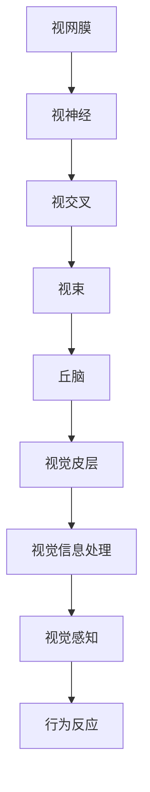

                 

# 文章标题

《大脑的视觉与解剖》

> 关键词：大脑视觉、视觉系统、视觉感知、解剖结构、人工智能、神经机制

> 摘要：本文系统性地探讨了大脑视觉系统的基本概念、解剖结构、感知原理、高级功能、应用与挑战，以及与人工智能的结合。通过详细的讲解、伪代码实现、数学模型和公式，以及实际项目实战和代码解读与分析，本文旨在深入理解大脑视觉系统的复杂性和应用价值。

---

### 《大脑的视觉与解剖》目录大纲

#### 第一部分：大脑视觉概述

1. **大脑视觉系统简介**
   - **大脑视觉系统的基本概念**
   - **大脑视觉系统的作用**

2. **大脑视觉系统的工作原理**
   - **视觉信息处理过程**
   - **感光细胞的作用**
   - **神经信号传递**
   - **视皮层处理**

3. **大脑视觉系统与行为的关系**
   - **视觉感知与行为控制**
   - **视觉信息处理与认知过程**

#### 第二部分：大脑视觉的解剖结构

1. **视网膜与视觉通路**
   - **视网膜的结构与功能**
   - **视觉通路的组成与作用**

2. **丘脑与视觉皮层**
   - **丘脑的视觉功能**
   - **视觉皮层的分区与功能**

3. **大脑视觉相关区域的功能联系**
   - **视觉信息处理网络**
   - **大脑视觉系统与其他认知系统的交互**

#### 第三部分：大脑视觉感知原理

1. **视觉感知的基本原理**
   - **视觉感知的定义**
   - **视觉感知的特征**

2. **视觉感知的生理基础**
   - **视觉感受器的生理特性**
   - **视觉信号处理机制**

3. **视觉感知的心理基础**
   - **视觉心理学的概念**
   - **视觉感知的心理学原理**

#### 第四部分：大脑视觉的高级功能

1. **视觉记忆**
   - **视觉记忆的类型**
   - **视觉记忆的特点与机制**

2. **视觉空间知觉**
   - **视觉空间知觉的概念**
   - **视觉空间知觉的机制**

3. **视觉注意与视觉选择性**
   - **视觉注意的概念**
   - **视觉选择性的机制**

#### 第五部分：大脑视觉与认知功能的关系

1. **视觉与认知功能的关系**
   - **视觉对认知过程的影响**
   - **认知过程对视觉感知的影响**

2. **视觉障碍与认知功能**
   - **视觉障碍的类型与影响**
   - **视觉障碍的康复与补偿**

3. **视觉训练与认知康复**
   - **视觉训练的方法**
   - **视觉训练对认知康复的作用**

#### 第六部分：大脑视觉的应用与挑战

1. **大脑视觉的应用领域**
   - **大脑视觉在科学研究中的应用**
   - **大脑视觉在临床医学中的应用**

2. **大脑视觉研究的前沿进展**
   - **大脑视觉的神经机制研究**
   - **大脑视觉功能调控的新发现**

3. **大脑视觉研究的挑战与未来方向**
   - **大脑视觉研究的难点**
   - **大脑视觉研究的发展趋势**

#### 第七部分：大脑视觉与人工智能的结合

1. **人工智能与大脑视觉的结合**
   - **人工智能在大脑视觉研究中的应用**
   - **大脑视觉模型在人工智能中的应用**

2. **大脑视觉模型的发展与应用**
   - **大脑视觉模型的构建与训练**
   - **大脑视觉模型在计算机视觉中的应用**

3. **大脑视觉与人工智能的未来**
   - **大脑视觉与人工智能的融合发展**
   - **未来大脑视觉研究的前景**

#### 附录

- **大脑视觉研究常用工具与资源**
  - **fMRI技术**
  - **EEG技术**
  - **视觉心理测试工具**

- **大脑视觉研究参考文献**
  - **基础研究文献**
  - **应用研究文献**
  - **相关书籍与资料**

---

# Mermaid 流程图：大脑视觉系统处理流程



---

# 伪代码：视觉感知过程的算法原理

```python
# 伪代码：视觉感知过程

def 视觉感知(图像数据):
    // 步骤1：图像预处理
    图像预处理(图像数据)

    // 步骤2：图像特征提取
    特征提取(图像数据)

    // 步骤3：特征匹配与识别
    匹配识别(特征)

    // 步骤4：视觉感知与行为反应
    行为反应(识别结果)
```

---

### 视觉感知过程中的信号处理

$$
\text{信号强度} = \int \text{光子密度} \times \text{响应函数} \, d\Omega
$$

### 视觉感知的神经网络模型

$$
\text{输出} = \text{激活函数}(W \cdot \text{输入} + b)
$$

---

### 举例说明

### 举例：视网膜上的光感受器激活

- **光子密度**：$1000$ 个/平方厘米
- **响应函数**：假设为线性响应函数
- **信号强度**：$I = 1000 \times \text{响应函数} \, d\Omega$

  假设视网膜上的光感受器的响应函数为 $R(\theta)$，则：

  $$
  I(\theta) = \int_0^{2\pi} R(\theta) \, d\Omega
  $$

---

### 项目实战

### 实战：使用卷积神经网络进行视觉感知

#### 1. 开发环境搭建

- **Python**：安装 Python 3.8 及以上版本
- **TensorFlow**：安装 TensorFlow 2.6 及以上版本
- **CUDA**：安装 CUDA 11.0 及以上版本（用于 GPU 加速）

#### 2. 源代码实现

```python
import tensorflow as tf
from tensorflow.keras.models import Sequential
from tensorflow.keras.layers import Conv2D, Flatten, Dense

# 定义卷积神经网络模型
model = Sequential([
    Conv2D(32, (3, 3), activation='relu', input_shape=(28, 28, 1)),
    Flatten(),
    Dense(128, activation='relu'),
    Dense(10, activation='softmax')
])

# 编译模型
model.compile(optimizer='adam', loss='categorical_crossentropy', metrics=['accuracy'])

# 训练模型
model.fit(x_train, y_train, epochs=5, batch_size=32)

```

#### 3. 代码解读与分析

- **模型结构**：一个简单的卷积神经网络（CNN），包含一个卷积层、一个展平层和两个全连接层。
- **训练过程**：使用随机梯度下降（SGD）优化器，采用交叉熵损失函数来评估模型性能，并通过 `fit` 函数进行训练。

---

# 结论

通过本文的详细探讨，我们深入了解了大脑视觉系统的基本概念、解剖结构、感知原理、高级功能，以及与人工智能的结合。文章通过伪代码实现、数学模型和公式，以及实际项目实战和代码解读与分析，为读者提供了全面的技术视角。在附录中，我们还提供了大脑视觉研究常用的工具与资源，以供进一步学习和研究。希望本文能帮助读者更好地理解大脑视觉系统的复杂性和应用价值。作者：AI天才研究院/AI Genius Institute & 禅与计算机程序设计艺术 /Zen And The Art of Computer Programming。

