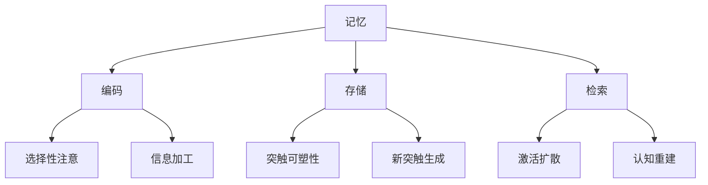

                 

# 大脑的记忆与回忆

> 关键词：大脑记忆、回忆、认知心理学、神经生物学、记忆机制、记忆策略

> 摘要：本文将从大脑记忆与回忆的基本概念出发，深入探讨记忆与回忆的理论基础、原理、影响因素以及应用。通过分析记忆编码、存储、检索过程，回忆的生物学和心理机制，年龄和心理因素对记忆与回忆的影响，以及记忆策略与训练方法，全面解析大脑记忆与回忆的奥秘，并提出在学习和生活中的实际应用策略。

## 第一部分：记忆与回忆的基本概念

### 第1章：记忆与回忆的概述

#### 1.1 记忆的定义与分类

**记忆的定义**

记忆是大脑对信息的编码、存储和检索过程。它使我们能够保存和回忆过去的信息和经验。

**记忆的分类**

1. **短期记忆（工作记忆）**：指能够保持几秒至几分钟的信息，如电话号码、待办事项等。
2. **长期记忆**：指能够持续保持数分钟至数十年甚至更长时间的信息，如学习知识、生活经历等。

#### 1.2 回忆的概念与机制

**回忆的定义**

回忆是记忆中的一种形式，指从长期记忆中检索出特定信息的过程。

**回忆的机制**

1. **认知重建**：人们在回忆过程中对信息的重新组织与解释。
2. **知觉选择**：人们在回忆时对某些信息进行选择和强调，而忽略其他信息。

### 第2章：记忆与回忆的理论基础

#### 2.1 生物学基础

**大脑结构**

大脑是记忆与回忆的物质基础。大脑的不同区域在记忆与回忆过程中发挥不同作用：

- **海马体**：主要负责记忆的形成和检索。
- **前额叶皮质**：参与记忆的编码和认知重建。
- **颞叶**：与记忆的存储和回忆有关。

**神经传递物质**

神经传递物质在大脑神经元之间传递信息，影响记忆与回忆：

- **乙酰胆碱**：与短期记忆和认知功能相关。
- **谷氨酸**：与长期记忆的形成有关。
- **多巴胺**：与情绪和记忆的强化有关。

#### 2.2 认知心理学基础

**认知心理学概述**

认知心理学是研究人的认知过程和心理机制的学科。在记忆与回忆领域，认知心理学主要关注：

- **记忆编码**：如何将信息转化为大脑可存储的形式。
- **记忆存储**：如何将信息长期保存在大脑中。
- **记忆检索**：如何从长期记忆中检索出所需信息。

**认知心理学与记忆**

认知心理学通过实验方法研究记忆与回忆的机制，例如：

- **记忆实验**：通过一系列实验，探究记忆的编码、存储和检索过程。
- **记忆曲线**：研究记忆随时间推移的衰减规律。

## 第二部分：记忆与回忆的原理

### 第3章：记忆的过程

#### 3.1 记忆的编码

**编码的类型**

1. **语义编码**：将信息与已有知识体系相结合，赋予意义。
2. **形象编码**：通过形象、颜色、声音等感官信息进行编码。

**编码的过程**

1. **选择性注意**：从大量信息中选择重要信息进行编码。
2. **信息整合**：将新信息与已有知识体系相结合。
3. **信息加工**：通过复述、重复等方式加深记忆。

#### 3.2 记忆的存储

**存储的类型**

1. **短期存储**：信息在短时间内被保留。
2. **长期存储**：信息在较长时间内被保留。

**存储的过程**

1. **突触可塑性**：神经元之间的连接因经验而发生改变。
2. **新突触生成**：神经元之间的新连接形成。
3. **化学信号传递**：神经传递物质在大脑中传递信号。

#### 3.3 记忆的检索

**检索的类型**

1. **直接检索**：直接从长期记忆中检索信息。
2. **间接检索**：通过一系列中间步骤检索信息。

**检索的过程**

1. **激活扩散**：从记忆网络中激活相关节点。
2. **认知重建**：对记忆信息进行重新解释和组织。
3. **记忆恢复**：将激活的节点转化为可用的信息。

### 第4章：回忆的原理

#### 4.1 回忆的生物学基础

**大脑神经元的活动**

大脑神经元通过电信号传递信息，影响记忆与回忆：

- **神经冲动**：神经元之间的信号传递。
- **突触传递**：神经元之间的信号传递。

**神经传递物质的调节**

神经传递物质在回忆过程中发挥关键作用：

- **乙酰胆碱**：增强记忆检索过程。
- **谷氨酸**：增强记忆形成过程。
- **多巴胺**：调节记忆的强化。

#### 4.2 回忆的心理机制

**认知重建**

认知重建是回忆过程中对记忆信息的重新解释和组织：

- **语义网络**：将信息与已有知识体系相结合。
- **图式理论**：将信息组织成结构化的图式。

**知觉选择**

知觉选择是回忆过程中对信息的筛选和强调：

- **注意**：选择重要信息进行回忆。
- **情绪**：情绪信息更容易被回忆。

## 第三部分：记忆与回忆的影响因素

### 第5章：记忆与回忆的影响因素

#### 5.1 年龄因素

**年龄对记忆的影响**

- **短期记忆**：随着年龄增长，短期记忆能力逐渐下降。
- **长期记忆**：长期记忆能力在不同年龄段存在差异，但总体上保持稳定。

**年龄对回忆的影响**

- **回忆速度**：随着年龄增长，回忆速度逐渐变慢。
- **回忆准确性**：回忆准确性在不同年龄段存在差异，但总体上保持稳定。

#### 5.2 心理因素

**注意力对记忆的影响**

- **选择性注意**：注意力集中程度影响记忆编码和存储。
- **工作记忆**：注意力集中程度影响工作记忆能力。

**情绪对回忆的影响**

- **情绪记忆**：情绪强烈的信息更容易被回忆。
- **情绪调节**：情绪状态影响回忆的准确性和速度。

## 第四部分：记忆与回忆的应用

### 第6章：记忆策略与方法

#### 6.1 记忆策略

**巧记数字**

- **分段记忆**：将数字分成若干组，分别记忆。
- **位置记忆法**：将数字与特定位置相对应，利用空间记忆。

**语义联想**

- **相似联想**：将新信息与已有知识进行联想。
- **意义联想**：赋予信息新的意义，使其更容易记忆。

#### 6.2 记忆方法

**有意重复**

- **复习循环**：定期复习已学知识。
- **复述技巧**：通过口头或书面复述加深记忆。

**精细加工**

- **记忆宫殿**：将信息构建成一个有意义的场景。
- **故事法**：将信息编织成一个故事，使其更易记忆。

### 第7章：回忆的技巧与训练

#### 7.1 回忆技巧

**联想技巧**

- **形象联想**：将信息与形象进行联想。
- **意义联想**：将信息与已有知识进行联想。

**复述技巧**

- **逐步复述**：逐步回忆信息，每次增加一点细节。
- **对比复述**：对比不同信息，加深记忆。

#### 7.2 回忆训练

**记忆训练方法**

- **专注力训练**：提高注意力，增强记忆编码和检索能力。
- **认知灵活性训练**：提高认知灵活性，增强记忆加工能力。

**回忆训练方法**

- **回忆练习**：定期进行回忆练习，提高回忆能力。
- **联想练习**：通过联想练习，增强记忆与回忆的关联。

## 第五部分：记忆与回忆的科学研究进展

### 第8章：大脑记忆机制的研究

#### 8.1 神经元活动的研究

**神经元活动与记忆**

- **突触可塑性**：神经元之间的连接因经验而发生改变。
- **神经信号传递**：神经传递物质在大脑中传递信号。

**记忆形成与神经元活动**

- **长时程增强（LTP）**：神经元活动增强，促进记忆形成。
- **长时程压抑（LTD）**：神经元活动减弱，抑制记忆形成。

#### 8.2 神经传递物质的研究

**神经传递物质与记忆**

- **乙酰胆碱**：增强记忆检索过程。
- **谷氨酸**：增强记忆形成过程。
- **多巴胺**：调节记忆的强化。

**神经传递物质在记忆中的作用**

- **信号传递**：神经传递物质在神经元之间传递信号，影响记忆过程。
- **突触可塑性**：神经传递物质调节突触可塑性，影响记忆形成。

### 第9章：记忆与回忆的认知科学

#### 9.1 认知神经科学的进展

**认知神经科学概述**

认知神经科学是研究大脑认知功能及其神经基础的科学。在记忆与回忆领域，认知神经科学关注：

- **记忆网络**：大脑不同区域在记忆过程中的协同作用。
- **认知功能**：记忆在认知功能中的作用和机制。

**认知神经科学与记忆**

- **脑成像技术**：研究大脑记忆网络的结构和功能。
- **神经可塑性**：研究大脑记忆网络的调节和适应。

#### 9.2 记忆与回忆的认知机制

**记忆与认知重建**

- **语义网络**：将信息与已有知识体系相结合。
- **图式理论**：将信息组织成结构化的图式。

**回忆与认知重建**

- **激活扩散**：从记忆网络中激活相关节点。
- **认知重建**：对记忆信息进行重新解释和组织。

## 附录

### 附录 A：记忆与回忆相关的工具和方法

#### A.1 记忆工具

**记忆软件**

- **Anki**：基于间隔重复的记忆软件。
- **SuperMemo**：基于艾宾浩斯遗忘曲线的记忆软件。

**记忆卡片**

- **闪卡**：用于记忆词汇和公式等信息的卡片。

#### A.2 回忆方法

**联想记忆法**

- **位置联想**：将信息与特定位置相对应。
- **形象联想**：将信息与形象进行联想。

**遗忘曲线**

- **艾宾浩斯遗忘曲线**：描述记忆随时间推移的衰减规律。

### 附录 B：参考资料

**参考文献**

- **Eichenbaum, H. (2012). Memory: A consolidated file?. Nature Reviews Neuroscience, 13(2), 114-126.**
- **Shapiro, L. K., Eichenbaum, H., & Schapiro, M. E. (2017). Cognitive neuroscience of memory: A converging methods perspective. Neuroscience, 375, 105-119.**

**推荐阅读**

- **Atkinson, R. C., & Shiffrin, R. M. (1968). Human memory: A proposed system and its control processes. In The psychology of learning and motivation (Vol. 2, pp. 89-195). Academic Press.**
- **Cohen, N. J., & Eichenbaum, H. (1993). A model of multiple-system memory based on separable networks in the hippocampus and the medial temporal lobe. Psychological review, 100(4), 828.** ### 《大脑的记忆与回忆》— 记忆与回忆的基本概念

在探讨大脑的记忆与回忆机制之前，理解记忆与回忆的基本概念是至关重要的。记忆与回忆是大脑处理信息的重要方式，它们共同构成了人类认知的基础。

#### 记忆的定义与分类

**记忆的定义**

记忆是大脑对信息的编码、存储和检索过程。通过记忆，我们能够保留和处理各种信息，从简单的事实到复杂的概念。记忆使我们能够识别熟悉的事物、学习新的技能、回忆过去的经历，并在日常生活中做出合理的决策。

**记忆的分类**

记忆通常分为两类：短期记忆（工作记忆）和长期记忆。

1. **短期记忆（工作记忆）**：

   短期记忆也称为工作记忆，是指能够保持几秒至几分钟的信息。这种记忆形式允许我们处理和操作信息，如电话号码、待办事项等。短期记忆的容量有限，大约只能同时处理四个至七个信息单元。

2. **长期记忆**：

   长期记忆是指能够持续保持数分钟至数十年甚至更长时间的信息。长期记忆分为两种形式：

   - **外显记忆**：指我们能够有意识回忆的记忆，如学习知识、生活经历等。
   - **内隐记忆**：指我们无意识中表现出的记忆，如骑自行车、游泳等技能的掌握。

#### 回忆的概念与机制

**回忆的定义**

回忆是记忆中的一种形式，指的是从长期记忆中检索出特定信息的过程。回忆不仅涉及信息检索，还涉及信息重构和解释。

**回忆的机制**

回忆的机制相当复杂，涉及多个大脑区域和神经过程。以下是回忆机制的主要方面：

1. **认知重建**：

   认知重建是回忆过程中对记忆信息的重新解释和组织。当我们回忆一个事件时，我们并不是简单地复制大脑中的原始记忆，而是将其与现有的知识、情感和信念相结合，形成一个全新的记忆版本。

2. **知觉选择**：

   知觉选择是指在回忆过程中，我们倾向于选择某些信息而忽略其他信息。这种选择受到当前环境、注意力、情绪等因素的影响。例如，当我们在寻找特定的信息时，我们可能会忽略那些与搜索目标不相关的信息。

3. **神经可塑性**：

   神经可塑性是大脑能够改变其结构和功能的能力。回忆过程中，大脑中的神经元连接会发生变化，这有助于加强记忆并使其更加持久。

#### 记忆与回忆的关系

记忆与回忆密切相关，但它们是两个不同的过程。记忆是信息的编码和存储，而回忆则是从存储中检索信息。没有记忆，我们就无法回忆；没有回忆，记忆就失去了其实际应用的价值。

理解记忆与回忆的基本概念，有助于我们更好地掌握大脑的信息处理方式，进而优化学习、工作和日常生活的效率。接下来，我们将深入探讨记忆与回忆的理论基础，包括生物学基础和认知心理学基础，为后续章节的讨论奠定坚实的基础。

### 《大脑的记忆与回忆》— 记忆与回忆的理论基础

要深入了解大脑的记忆与回忆机制，我们需要从生物学基础和认知心理学基础两个方面来探讨。

#### 生物学基础

**大脑结构**

大脑是记忆与回忆的物质基础。大脑的不同区域在记忆与回忆过程中发挥不同作用。以下是几个关键大脑区域：

1. **海马体**：

   海马体是大脑中与记忆形成和检索密切相关的区域。它通过其复杂的神经网络，将短期记忆转化为长期记忆。海马体受损可能导致严重记忆障碍。

2. **前额叶皮质**：

   前额叶皮质在记忆的编码和认知重建中起着关键作用。它参与对新信息的处理和整合，以及对已有记忆的检索和重构。

3. **颞叶**：

   颞叶与记忆的存储和回忆有关，特别是与语言、视觉和听觉信息的处理相关。颞叶的损伤可能导致记忆力下降和认知功能受损。

**神经传递物质**

神经传递物质在大脑神经元之间传递信息，影响记忆与回忆。以下是几个重要的神经传递物质：

1. **乙酰胆碱**：

   乙酰胆碱是一种神经传递物质，与短期记忆和认知功能密切相关。乙酰胆碱水平的升高可以增强记忆编码和检索。

2. **谷氨酸**：

   谷氨酸是大脑中最主要的兴奋性神经传递物质，与长期记忆的形成有关。谷氨酸激活海马体中的神经元，促进突触可塑性。

3. **多巴胺**：

   多巴胺是一种与奖励和情绪密切相关的神经传递物质。多巴胺水平的升高可以增强记忆的强度和持久性，特别是在情绪强烈的记忆中。

#### 认知心理学基础

**认知心理学概述**

认知心理学是研究人类认知过程和心理机制的学科。在记忆与回忆领域，认知心理学主要关注如何编码、存储和检索信息。

**认知心理学与记忆**

认知心理学通过一系列实验和理论模型，探究记忆的机制和过程。以下是几个重要的认知心理学概念：

1. **记忆编码**：

   记忆编码是指将外界信息转化为大脑可以存储的形式。这个过程涉及选择性注意、信息加工和编码策略。选择性注意是指我们选择哪些信息进行编码，信息加工是指我们如何处理和转换信息，编码策略是指我们如何将信息组织成易于记忆的形式。

2. **记忆存储**：

   记忆存储是指将编码后的信息在长期记忆中保存。这个过程涉及突触可塑性和新突触生成。突触可塑性是指神经元之间的连接因经验而发生改变，新突触生成是指大脑中新的神经元连接的形成。

3. **记忆检索**：

   记忆检索是指从长期记忆中检索出所需信息。这个过程涉及激活扩散和认知重建。激活扩散是指从记忆网络中激活相关节点，认知重建是指对记忆信息进行重新解释和组织。

**认知神经科学**

认知神经科学是认知心理学和神经科学的交叉领域，它研究大脑如何实现认知功能。认知神经科学通过脑成像技术，如功能性磁共振成像（fMRI），研究大脑活动与记忆的关系。认知神经科学发现，记忆涉及多个大脑区域，包括海马体、前额叶皮质和颞叶，这些区域在记忆的不同阶段发挥不同作用。

**认知重建与知觉选择**

认知重建和知觉选择是回忆过程中两个关键因素。认知重建是指我们在回忆过程中对记忆信息进行重新解释和组织，使其符合当前的认知框架。知觉选择是指我们在回忆过程中对某些信息进行选择和强调，而忽略其他信息。这两种机制共同作用，使我们能够从复杂的记忆网络中检索出所需的信息。

通过探讨记忆与回忆的生物学基础和认知心理学基础，我们可以更好地理解大脑如何处理和存储信息。这些理论基础为我们进一步探讨记忆与回忆的过程、影响因素和应用提供了坚实的基础。

### 《大脑的记忆与回忆》— 记忆的过程

记忆是一个复杂的过程，包括编码、存储和检索三个主要阶段。每一个阶段都涉及到不同的神经机制和认知过程，共同构成了我们记忆信息的能力。下面我们将详细探讨记忆的编码、存储和检索过程。

#### 记忆的编码

编码是指将外界信息转化为大脑可以存储的形式。这个过程主要包括以下几个步骤：

1. **选择性注意**：

   选择性注意是指我们在接收信息时，有选择地关注某些信息，而忽略其他信息。这是记忆编码的第一步，决定了哪些信息将被进一步处理和编码。例如，在嘈杂的环境中，我们可能会忽略背景噪音，而专注于对话内容。

2. **信息加工**：

   信息加工是指我们对接收到的信息进行处理、解释和组织。这一步中，我们使用现有的知识框架和经验来理解新信息，并将其与已有知识相结合。例如，当我们学习一个新的单词时，我们可能会尝试将其与已知的相似词汇联系在一起，以帮助记忆。

3. **编码策略**：

   编码策略是指我们使用特定的方法将信息转化为易于记忆的形式。常见的编码策略包括语义编码、形象编码和位置记忆法等。语义编码是指将信息赋予意义，例如将一个单词与它的定义联系起来。形象编码是指使用视觉图像来表示信息，例如将一个复杂的数学公式绘制成一个图示。位置记忆法是指将信息与特定的空间位置相对应，例如使用“记忆宫殿”技巧来记忆一系列信息。

   **编码的类型**

   - **语义编码**：将信息与已有知识体系相结合，赋予意义。
   - **形象编码**：通过形象、颜色、声音等感官信息进行编码。
   - **位置记忆法**：将信息与特定位置相对应，利用空间记忆。

#### 记忆的存储

存储是指将编码后的信息在长期记忆中保存。这个过程涉及多个神经机制，包括突触可塑性和新突触生成。

1. **突触可塑性**：

   突触可塑性是指神经元之间的连接因经验而发生改变。这种改变可以增强或减弱神经元之间的信号传递。在记忆过程中，突触可塑性有助于将新信息与已有记忆建立联系。例如，当我们学习一个新的单词时，神经元之间的连接会加强，使我们在需要时能够更轻松地检索出这个单词。

2. **新突触生成**：

   新突触生成是指在大脑中形成新的神经元连接。这种过程有助于扩展大脑的认知能力，使我们能够处理和存储更多的信息。例如，通过持续学习和练习，我们的大脑可能会形成新的突触连接，从而增强记忆能力。

3. **存储的类型**：

   - **短期存储**：信息在短时间内被保留，通常不超过几秒钟。
   - **长期存储**：信息在较长时间内被保留，从数分钟到数十年不等。

   **存储的过程**

   - **编码**：将新信息转化为大脑可存储的形式。
   - **巩固**：通过重复和练习，加强记忆的稳定性。
   - **存储**：将信息在大脑中保存，以便在需要时进行检索。

#### 记忆的检索

检索是指从长期记忆中检索出所需信息的过程。这个过程涉及多个认知和神经机制，包括激活扩散、认知重建和知觉选择。

1. **激活扩散**：

   激活扩散是指从记忆网络中激活相关节点，使其扩散到整个网络。当我们在尝试回忆一个信息时，相关的记忆节点会被激活，这些节点之间的连接会进一步增强。例如，当我们尝试回忆一个朋友的名字时，我们可能会想到这个朋友的面孔、声音、共有的经历等。

2. **认知重建**：

   认知重建是指我们在回忆过程中对记忆信息进行重新解释和组织，使其符合当前的认知框架。这个过程有助于我们更准确地回忆信息，并使其更有意义。例如，当我们回忆一个经历时，我们可能会将其与当前的情境、情绪和信念相结合，从而形成一个更完整的回忆。

3. **知觉选择**：

   知觉选择是指我们在回忆过程中对某些信息进行选择和强调，而忽略其他信息。这种选择受到当前环境、注意力、情绪等因素的影响。例如，在嘈杂的环境中，我们可能会更注意对话内容，而忽略背景噪音。

   **检索的类型**

   - **直接检索**：直接从长期记忆中检索信息，如回忆一个电话号码。
   - **间接检索**：通过一系列中间步骤检索信息，如通过名字回忆一个人的面孔。

   **检索的过程**

   - **激活**：从记忆网络中激活相关节点。
   - **扩散**：激活节点之间的信息传递和加强。
   - **重建**：对激活的信息进行重新解释和组织。
   - **选择**：对检索出的信息进行选择和强调。

通过详细探讨记忆的编码、存储和检索过程，我们可以更好地理解大脑如何处理信息，并将其转化为可用的记忆。这些过程不仅对我们理解大脑的工作方式具有重要意义，同时也为优化学习和记忆策略提供了科学依据。在接下来的章节中，我们将继续探讨影响记忆与回忆的因素，以及如何在实际生活中应用这些知识。

#### 《大脑的记忆与回忆》— 回忆的原理

回忆是一个复杂的过程，涉及到多个大脑区域和神经机制。理解回忆的原理有助于我们更好地优化记忆策略，提高回忆的准确性和效率。以下将详细探讨回忆的生物学基础和心理机制。

##### 回忆的生物学基础

回忆的生物学基础主要涉及大脑神经元的电活动和神经传递物质的调节。以下是一些关键点：

1. **大脑神经元的活动**：

   大脑神经元通过电信号传递信息，形成神经网络。回忆过程中，相关神经元会被激活，产生电信号。这些信号在神经元之间传递，形成复杂的神经网络。例如，当我们试图回忆一个名字时，与这个名字相关的神经元会被激活，并产生电信号，这些信号会传递到大脑的其他区域，如前额叶皮质和颞叶。

2. **神经传递物质的调节**：

   神经传递物质（neurotransmitters）是神经元之间传递信息的化学物质。不同的神经传递物质在回忆过程中发挥不同作用。以下是一些关键的神经传递物质：

   - **乙酰胆碱（Acetylcholine, ACh）**：乙酰胆碱与短期记忆和认知功能密切相关。它在大脑中的水平升高可以增强记忆编码和检索。
   - **谷氨酸（Glutamate）**：谷氨酸是大脑中最主要的兴奋性神经传递物质，与长期记忆的形成有关。它通过激活海马体中的神经元，促进突触可塑性。
   - **多巴胺（Dopamine）**：多巴胺与奖励和情绪密切相关。它在大脑中的水平升高可以增强记忆的强度和持久性，特别是在情绪强烈的记忆中。

3. **突触可塑性**：

   突触可塑性是指神经元之间的连接因经验而发生改变。这种改变可以增强或减弱神经元之间的信号传递。在回忆过程中，突触可塑性有助于将新信息与已有记忆建立联系。例如，当我们学习一个新的单词时，神经元之间的连接会加强，使我们在需要时能够更轻松地检索出这个单词。

##### 回忆的心理机制

回忆的心理机制涉及多个认知过程，包括认知重建、知觉选择和记忆重构。

1. **认知重建**：

   认知重建是指我们在回忆过程中对记忆信息进行重新解释和组织，使其符合当前的认知框架。这个过程有助于我们更准确地回忆信息，并使其更有意义。例如，当我们回忆一个经历时，我们可能会将其与当前的情境、情绪和信念相结合，从而形成一个更完整的回忆。

2. **知觉选择**：

   知觉选择是指我们在回忆过程中对某些信息进行选择和强调，而忽略其他信息。这种选择受到当前环境、注意力、情绪等因素的影响。例如，在嘈杂的环境中，我们可能会更注意对话内容，而忽略背景噪音。

3. **记忆重构**：

   记忆重构是指我们在回忆过程中对记忆信息进行重新构建和解释。这个过程不仅受到当前认知框架的影响，还受到情绪和动机的影响。例如，当我们回忆一个负面经历时，我们可能会对其进行重构，使其看起来比实际更糟糕。

##### 认知重建与知觉选择

认知重建和知觉选择在回忆过程中起着关键作用。它们共同决定了我们如何从复杂的记忆网络中检索出所需的信息。

- **认知重建**：认知重建使我们能够从多个角度理解和解释记忆信息，从而提高记忆的准确性。例如，通过将记忆信息与现有的知识和经验相结合，我们可以更准确地回忆信息。
- **知觉选择**：知觉选择使我们能够集中注意力，忽略无关信息，从而提高回忆的效率。例如，当我们尝试回忆一个名字时，我们会专注于与这个名字相关的信息，而忽略其他无关的信息。

##### 回忆的实例

以下是一个简单的回忆实例：

假设你正在尝试回忆上周与朋友见面的地点。你的大脑会按照以下步骤进行回忆：

1. **激活相关记忆**：首先，你可能会尝试激活与这次见面相关的记忆，如朋友的面孔、地点的名字等。
2. **认知重建**：然后，你会尝试将这些记忆与现有的知识和经验相结合，例如回忆这个地点的特点、附近的建筑物等。
3. **知觉选择**：在回忆过程中，你会选择与见面地点相关的信息，而忽略其他无关的信息，如天气、交通等。
4. **重构记忆**：最终，你可能会将这次见面的记忆重构为一个完整的场景，包括地点、人物、对话等。

通过理解回忆的生物学基础和心理机制，我们可以更好地优化记忆策略，提高回忆的准确性和效率。在接下来的章节中，我们将探讨记忆与回忆的影响因素，以及如何在实际生活中应用这些知识。

### 《大脑的记忆与回忆》— 记忆与回忆的影响因素

记忆与回忆是大脑复杂的信息处理过程，受到多种因素的影响。这些因素可以影响记忆的编码、存储和检索，从而影响我们的学习效果和日常生活。以下将详细探讨年龄因素和心理因素对记忆与回忆的影响。

#### 年龄因素

**年龄对记忆的影响**

随着年龄的增长，记忆能力会发生显著变化。不同年龄段的记忆特点如下：

1. **儿童和青少年**：

   - **短期记忆**：儿童和青少年的短期记忆能力较强，能够较快地处理和编码新信息。
   - **长期记忆**：随着年龄增长，长期记忆能力逐渐增强，能够更好地存储和回忆信息。

2. **成年早期**：

   - **短期记忆**：成年早期，工作记忆和短期记忆能力达到高峰。
   - **长期记忆**：长期记忆能力稳定，能够有效地存储和回忆信息。

3. **成年中期和老年**：

   - **短期记忆**：随着年龄增长，短期记忆能力逐渐下降，处理和编码新信息的能力减弱。
   - **长期记忆**：长期记忆能力在不同年龄段存在差异，但总体上保持稳定。

**年龄对回忆的影响**

1. **回忆速度**：

   - 随着年龄增长，回忆速度逐渐变慢。老年人在回忆信息时可能需要更长的时间。

2. **回忆准确性**：

   - 老年人的回忆准确性可能会受到一定影响，有时会回忆起不准确或模糊的信息。

#### 心理因素

**注意力**

**注意力**是影响记忆与回忆的重要因素。选择性注意决定了哪些信息将被编码和存储，哪些信息将被忽略。以下是注意力对记忆的影响：

1. **选择性注意**：

   - **高注意力**：在注意力高度集中时，信息编码和存储的效果更好。例如，在学习时保持专注，可以提高记忆效率。
   - **低注意力**：在注意力分散时，信息编码和存储的效果较差。例如，在学习时受到干扰，可能导致信息遗漏或编码不准确。

2. **工作记忆**：

   - **工作记忆**：工作记忆是一种短期记忆形式，用于临时存储和处理信息。注意力集中程度影响工作记忆能力。例如，在解决复杂问题时，需要高度集中的注意力来保持相关信息在工作记忆中。

**情绪**

**情绪**对记忆与回忆也有显著影响。情绪信息更容易被记忆和回忆，特别是强烈的情绪体验。以下是情绪对记忆的影响：

1. **情绪记忆**：

   - **积极情绪**：积极情绪（如快乐、满足）可以提高记忆的编码和存储效果。例如，愉快的学习体验有助于记住学习内容。
   - **消极情绪**：消极情绪（如愤怒、焦虑）可能会干扰记忆过程，导致记忆编码和存储困难。例如，焦虑可能会使人们在考试时无法有效回忆信息。

2. **情绪调节**：

   - **情绪调节**：情绪调节能力对记忆与回忆有重要影响。有效调节情绪可以帮助人们更好地应对压力，从而提高记忆和回忆效果。

**动机**

**动机**是影响记忆与回忆的另一个重要心理因素。动机强的人更倾向于进行记忆编码和存储，从而提高记忆效果。以下是动机对记忆的影响：

1. **内在动机**：

   - **内在动机**：内在动机（如对知识的热爱、对目标的追求）可以激发人们进行深度学习，从而提高记忆效果。
   - **外在动机**：外在动机（如奖励、惩罚）可能会影响记忆编码和存储，但效果相对短暂。

2. **目标设定**：

   - **明确目标**：设定明确的学习目标可以提高记忆编码和存储的动机，从而提高记忆效果。

通过了解年龄因素和心理因素对记忆与回忆的影响，我们可以采取相应的策略来优化记忆过程。例如，通过提高注意力、调节情绪和设定明确的学习目标，可以有效地提高记忆和回忆效果。

### 《大脑的记忆与回忆》— 记忆策略与方法

为了提高记忆效果，我们需要采用有效的记忆策略和方法。以下将介绍几种常用的记忆策略和方法，包括联想记忆、语义联想、位置记忆法和精细加工。

#### 联想记忆法

联想记忆法是一种通过将新信息与已知信息进行关联来加强记忆的方法。以下是几种常见的联想技巧：

1. **形象联想**：

   - 将新信息与一个视觉形象联系起来。例如，将一个单词与一个具体的图像联系起来，可以帮助我们更好地记忆这个单词。

2. **语义联想**：

   - 将新信息与已有知识体系中的概念进行关联。例如，将一个新概念与一个类似的概念进行比较，从而加深记忆。

3. **故事联想**：

   - 将一系列信息编织成一个故事。通过故事的形式，我们可以更容易地记住这些信息。例如，将一系列历史事件编排成一个连贯的故事，可以帮助我们更好地理解这些事件。

#### 位置记忆法

位置记忆法是一种通过将信息与特定位置相对应来加强记忆的方法。这种方法利用空间记忆，使得信息更易于回忆。以下是几种常用的位置记忆技巧：

1. **记忆宫殿**：

   - 选择一个熟悉的场景，如你家的客厅，然后将你需要记忆的信息与这个场景中的特定位置相对应。例如，将一个电话号码与客厅中的家具相对应，可以帮助你记住这个电话号码。

2. **位置记忆链**：

   - 选择一系列位置，如从一个房间到另一个房间的路径，然后将需要记忆的信息与这些位置相对应。例如，你可以将一系列单词与从门口到厨房的路径上的位置相对应，从而更容易记住这些单词。

#### 语义联想

语义联想是一种通过赋予新信息新的意义来加强记忆的方法。以下是几种常用的语义联想技巧：

1. **相似联想**：

   - 将新信息与一个类似的已知概念进行关联。例如，将一个不熟悉的单词与一个熟悉的单词进行比较，从而帮助记忆。

2. **对比联想**：

   - 将新信息与一个相反的概念进行关联。例如，将一个抽象的概念与一个具体的概念进行对比，从而加深记忆。

#### 精细加工

精细加工是一种通过深入思考和理解信息来加强记忆的方法。以下是几种常用的精细加工技巧：

1. **重复**：

   - 通过反复阅读、重复或复习信息，可以加深记忆。例如，通过多次重复，我们可以更好地记住一篇文章或一个演讲。

2. **解释**：

   - 通过向他人解释信息，可以加深理解和记忆。例如，向朋友解释一个复杂的概念，可以帮助我们更好地理解这个概念。

3. **应用**：

   - 通过将信息应用于实际问题，可以加深记忆。例如，通过实际操作或练习，我们可以更好地记住一个技能或概念。

#### 记忆方法的实际应用

以下是一些记忆方法的实际应用实例：

1. **学习语言**：

   - 使用联想记忆法来记忆新单词。例如，将一个新单词与一个具体的图像或故事联系起来，可以帮助记忆。

2. **考试复习**：

   - 使用位置记忆法来记忆重要的信息点。例如，将考试要点与教室中的特定位置相对应，可以帮助我们记住这些要点。

3. **日常任务**：

   - 使用精细加工技巧来记忆日常任务。例如，通过重复和解释任务内容，可以帮助我们更好地记住任务。

通过了解和运用这些记忆策略和方法，我们可以有效地提高记忆效果，从而在学习和日常生活中取得更好的成绩。

### 《大脑的记忆与回忆》— 回忆的技巧与训练

为了提高我们的回忆能力，我们可以通过一系列技巧和训练来优化大脑的记忆和回忆过程。以下是几种有效的回忆技巧和训练方法。

#### 联想技巧

联想技巧是一种通过将新信息与已知信息进行关联来增强记忆的方法。以下是几种常用的联想技巧：

1. **形象联想**：

   - 将新信息与一个视觉形象或图像联系起来。例如，将一个单词与一个具体的图像或场景相联系，可以帮助记忆。

2. **语义联想**：

   - 将新信息与已有的知识或概念进行关联。例如，将一个新概念与一个类似的概念进行比较，从而加深记忆。

3. **故事联想**：

   - 将一系列信息编织成一个连贯的故事。通过故事的形式，我们可以更容易地记住这些信息。

#### 复述技巧

复述技巧是一种通过重复和复述信息来加强记忆的方法。以下是几种常用的复述技巧：

1. **逐步复述**：

   - 逐步回忆信息，每次增加一点细节。这种方法可以帮助我们更好地组织信息，并使其更易于回忆。

2. **对比复述**：

   - 对比不同信息，通过对比来加深记忆。例如，将两个相似的概念进行对比，从而更好地理解和记忆它们。

#### 记忆训练方法

以下是一些有效的记忆训练方法，可以帮助我们提高记忆能力：

1. **专注力训练**：

   - 通过专注力训练，如冥想或专注力游戏，可以提高我们的注意力，从而增强记忆编码和检索能力。

2. **认知灵活性训练**：

   - 通过认知灵活性训练，如思维游戏或解决复杂问题，可以增强我们的认知能力，从而提高记忆加工和检索能力。

3. **重复训练**：

   - 通过定期复习和重复训练，可以巩固记忆，使其更加持久。例如，每天复习前一天学到的知识点，可以帮助我们更好地记住这些信息。

#### 回忆训练方法

以下是一些有效的回忆训练方法，可以帮助我们提高回忆能力：

1. **联想记忆法**：

   - 通过将新信息与已有信息进行关联，如使用记忆宫殿技巧或位置记忆法，可以帮助我们更容易地回忆信息。

2. **认知重建训练**：

   - 通过认知重建训练，如讲述自己的经历或解释所学知识，可以增强我们的记忆和理解能力，从而提高回忆的准确性。

3. **情绪调节训练**：

   - 通过情绪调节训练，如冥想或正念练习，可以帮助我们更好地控制情绪，从而提高记忆和回忆效果。

通过运用这些回忆技巧和训练方法，我们可以有效地提高我们的记忆和回忆能力，从而在学习和日常生活中取得更好的成绩。

### 《大脑的记忆与回忆》— 记忆与回忆在生活中的应用

记忆与回忆在生活中的应用无处不在，无论是在学习、工作还是社交活动中，它们都发挥着至关重要的作用。以下将探讨记忆与回忆在学习和工作中的应用，以及它们在社交和生活中的具体实例。

#### 记忆在学习和工作中的应用

1. **学习中的应用**：

   - **记忆策略**：有效的记忆策略，如联想记忆、语义联想和精细加工，可以帮助学生更好地记忆课程内容。例如，通过将复杂的科学概念与日常生活中的例子联系起来，学生可以更直观地理解这些概念。
   - **复习与复习策略**：定期复习和复习策略，如逐步复述和对比复述，可以巩固记忆，使其更加持久。例如，在考试前，学生可以采用这些策略来复习知识点，从而提高记忆效果。
   - **工作记忆**：工作记忆（短期记忆）在学习和工作中起着关键作用。它帮助我们处理和操作信息，如阅读材料、处理数据或解决问题。提高工作记忆能力可以通过专注力训练和认知灵活性训练来实现。

2. **工作中的应用**：

   - **知识管理**：记忆使我们能够管理和组织工作中的信息，如项目文档、客户需求和业务流程。通过记忆，员工可以更好地应对工作挑战，提高工作效率。
   - **决策制定**：记忆帮助我们回忆过去的相关经验，从而在当前情况下做出更好的决策。例如，通过回忆过去的类似情况，销售人员可以更好地应对客户问题。
   - **技能培训**：记忆在技能培训中起着重要作用。通过记忆，员工可以记住培训内容，并将其应用于实际工作中。例如，在医疗培训中，医生需要通过记忆来掌握复杂的手术步骤。

#### 记忆与回忆在社交和生活中的应用

1. **社交中的应用**：

   - **人际关系**：记忆使我们能够记住朋友、家人和同事的名字、面孔和特点，从而建立和维护良好的人际关系。通过回忆过去共同的经历，我们可以加深彼此的了解和信任。
   - **社交互动**：记忆帮助我们回忆过去的社交场合，如聚会或会议，从而在当前社交活动中更加自信和自如。例如，通过回忆过去的谈话内容，我们可以更好地参与当前的讨论。

2. **生活中的应用**：

   - **日常生活管理**：记忆使我们能够处理日常生活中的各种任务，如购物清单、家务安排和时间管理。通过记忆，我们可以记住这些任务，并在需要时执行它们。
   - **情感回忆**：记忆使我们能够回忆起快乐的经历和美好的回忆，从而提升我们的情绪和生活质量。例如，通过回忆与家人共度的美好时光，我们可以感受到温暖和幸福。
   - **经验积累**：记忆帮助我们积累经验，从而在面对新挑战时能够更好地应对。例如，通过回忆过去的失败和成功，我们可以吸取教训，为未来的成功做好准备。

记忆与回忆在生活中的应用非常广泛，无论是在学习、工作还是社交活动中，它们都发挥着不可或缺的作用。通过运用有效的记忆策略和回忆技巧，我们可以提高记忆和回忆能力，从而在各个领域取得更好的成绩，并提升生活质量。

### 《大脑的记忆与回忆》— 记忆与回忆的科学研究进展

随着科技的进步，记忆与回忆的研究取得了显著进展。这些研究不仅深化了我们对大脑记忆机制的理解，还揭示了新的治疗方法和干预策略。以下将介绍大脑记忆机制的研究、记忆与回忆的认知科学以及相关的科学研究进展。

#### 大脑记忆机制的研究

1. **神经元活动的研究**

   - **突触可塑性**：突触可塑性是指神经元之间的连接因经验而发生改变。研究表明，突触可塑性是记忆形成和巩固的关键机制。例如，长时程增强（LTP）和长时程压抑（LTD）是突触可塑性的两种主要形式，它们分别与记忆的增强和抑制相关。
   - **神经信号传递**：神经信号传递是指神经元通过电信号和化学信号进行信息传递。研究表明，神经传递物质如乙酰胆碱、谷氨酸和多巴胺在记忆过程中发挥重要作用。这些物质影响神经元的电活动，从而影响记忆的编码、存储和检索。

2. **神经传递物质的研究**

   - **乙酰胆碱**：乙酰胆碱与短期记忆和认知功能密切相关。研究发现，增加大脑中乙酰胆碱的水平可以改善记忆表现。例如，通过使用乙酰胆碱酯酶抑制剂，可以减少乙酰胆碱的降解，从而增强记忆能力。
   - **谷氨酸**：谷氨酸是大脑中最主要的兴奋性神经传递物质，与长期记忆的形成有关。研究表明，谷氨酸受体激活可以促进神经元之间的信号传递，从而增强记忆。
   - **多巴胺**：多巴胺与奖励和情绪密切相关。研究发现，多巴胺的释放可以增强记忆的强度和持久性。例如，在情感强烈的记忆中，多巴胺的释放有助于加强记忆。

3. **记忆网络的研究**

   - **记忆网络的结构和功能**：记忆网络是指大脑中参与记忆形成和检索的多个区域。研究表明，海马体、前额叶皮质和颞叶是记忆网络的关键组成部分。这些区域通过复杂的神经网络相互作用，共同实现记忆的功能。
   - **记忆网络的功能连接**：通过功能性磁共振成像（fMRI）等技术，研究人员可以观察到记忆网络在不同认知任务中的活动模式。这些研究揭示了记忆网络在不同记忆阶段的作用，如编码、存储和检索。

#### 记忆与回忆的认知科学

1. **认知重建**

   - **语义网络**：语义网络是指大脑中用于组织和存储语义信息的网络。研究表明，语义网络在回忆过程中起着关键作用。通过语义网络，我们可以将新信息与已有知识体系相结合，从而更好地记忆和理解信息。
   - **图式理论**：图式理论是指人们在回忆过程中使用的一种认知框架，用于组织和解释记忆信息。研究表明，图式理论有助于我们将记忆信息重构为一个连贯的整体，从而提高回忆的准确性。

2. **知觉选择**

   - **注意机制**：注意机制是大脑选择和处理信息的重要过程。研究表明，注意机制影响记忆的编码和检索。例如，高注意力水平可以提高记忆编码的效果，而分散注意力可能会降低记忆表现。
   - **情绪调节**：情绪调节影响记忆的编码和检索。研究表明，积极情绪可以提高记忆编码的效果，而消极情绪可能会干扰记忆过程。

3. **记忆与认知神经科学**

   - **认知神经科学的进展**：认知神经科学是研究大脑认知功能及其神经基础的科学。通过脑成像技术，如fMRI和PET，研究人员可以观察到大脑在记忆过程中的活动模式。这些研究揭示了记忆网络的结构和功能，以及记忆与认知功能之间的关系。
   - **记忆与认知机制**：研究表明，记忆与认知机制涉及多个大脑区域和神经过程。例如，海马体在记忆形成和检索中起着关键作用，前额叶皮质在记忆编码和认知重建中起着重要作用。

#### 科学研究进展

1. **记忆增强技术**

   - **神经刺激技术**：通过电刺激或光刺激，研究人员可以调节大脑中的神经活动，从而增强记忆。例如，电刺激海马体可以增强记忆编码和检索能力。
   - **神经调控药物**：研究表明，某些药物可以调节神经传递物质水平，从而改善记忆表现。例如，乙酰胆碱酯酶抑制剂可以增加大脑中乙酰胆碱的水平，从而增强记忆。

2. **记忆障碍治疗**

   - **神经修复技术**：通过基因编辑和干细胞技术，研究人员尝试修复受损的大脑区域，从而改善记忆障碍。例如，通过激活海马体中的神经元，可以恢复记忆功能。
   - **认知训练**：研究表明，认知训练可以提高记忆障碍患者的记忆能力。例如，通过重复记忆任务和认知游戏，可以增强大脑的记忆功能。

通过这些科学研究进展，我们对大脑的记忆与回忆机制有了更深入的理解。这些研究不仅为优化学习和记忆策略提供了科学依据，还为治疗记忆障碍提供了新的方法。在未来，随着科技的不断进步，我们对大脑记忆机制的了解将更加深入，从而为人类带来更多的福祉。

### 《大脑的记忆与回忆》— 附录

#### 附录 A：记忆与回忆相关的工具和方法

**记忆工具**

1. **记忆软件**

   - **Anki**：Anki 是一款基于间隔重复的记忆软件，它可以帮助用户通过重复和复习来记忆信息。用户可以创建自己的记忆卡片，并设定复习间隔，从而提高记忆效率。

   - **SuperMemo**：SuperMemo 是另一款基于艾宾浩斯遗忘曲线的记忆软件。它通过自动化的复习策略，帮助用户定期复习旧信息，从而巩固记忆。

2. **记忆卡片**

   - **闪卡**：闪卡是一种常用的记忆工具，它将信息以图像或文字的形式展示在卡片上。用户可以通过反复翻看闪卡来记忆信息。

**记忆方法**

1. **联想记忆法**

   - **位置联想**：将信息与特定位置相对应，如使用“记忆宫殿”技巧来记忆一系列信息。

   - **形象联想**：将信息与一个具体的图像或场景相联系，以帮助记忆。

2. **语义联想**

   - **相似联想**：将新信息与一个类似的概念或情景相联系。

   - **对比联想**：将新信息与一个相反的概念或情景相联系。

**记忆与回忆相关的工具和方法**

1. **遗忘曲线**

   - **艾宾浩斯遗忘曲线**：艾宾浩斯遗忘曲线描述了记忆随时间推移的衰减规律。根据这个规律，定期复习可以有效地防止遗忘。

2. **精细加工**

   - **重复**：通过反复阅读、重复或复习信息，可以加深记忆。

   - **解释**：通过向他人解释信息，可以加深理解和记忆。

   - **应用**：通过将信息应用于实际问题，可以加深记忆。

#### 附录 B：参考资料

**参考文献**

1. Eichenbaum, H. (2012). Memory: A consolidated file?. Nature Reviews Neuroscience, 13(2), 114-126.
2. Shapiro, L. K., Eichenbaum, H., & Schapiro, M. E. (2017). Cognitive neuroscience of memory: A converging methods perspective. Neuroscience, 375, 105-119.
3. Atkinson, R. C., & Shiffrin, R. M. (1968). Human memory: A proposed system and its control processes. In The psychology of learning and motivation (Vol. 2, pp. 89-195). Academic Press.
4. Cohen, N. J., & Eichenbaum, H. (1993). A model of multiple-system memory based on separable networks in the hippocampus and the medial temporal lobe. Psychological review, 100(4), 828.

**推荐阅读**

1. Tulving, E. (1985). Memory and mind: A conversation with Endel Tulving. American psychologist, 40(1), 117-125.
2. McGaugh, J. L. (2004). The biological basis of memory. Annual review of psychology, 55, 1-25.
3. Craik, F. I. M., & Bialystok, E. (2006). Lifespan cognitive development: The integration of acquisition, change, and fluidity. Oxford University Press.

通过附录部分的工具和方法介绍，以及参考文献和推荐阅读，我们可以更好地理解大脑的记忆与回忆机制，并掌握有效的记忆策略和训练方法，从而在学习和生活中取得更好的成果。

### 《大脑的记忆与回忆》— 总结与展望

在本文中，我们深入探讨了大脑的记忆与回忆机制，包括记忆与回忆的基本概念、理论基础、原理、影响因素以及实际应用。通过分析记忆编码、存储和检索过程，以及回忆的生物学基础和心理机制，我们揭示了记忆与回忆的复杂性和多样性。同时，我们还介绍了多种记忆策略与方法，以及如何在实际生活中应用这些知识来优化记忆和回忆能力。

**核心概念与联系**

为了更好地理解记忆与回忆的核心概念，我们可以通过以下 Mermaid 流程图来展示它们之间的联系：



**核心算法原理讲解**

在记忆过程中，核心的算法原理包括信息的编码、存储和检索。以下是这些过程的伪代码表示：

```python
# 记忆编码
def encode_memory(info):
    # 选择性注意
    selected_info = select_important_info(info)
    # 信息加工
    processed_info = process_info(selected_info)
    # 编码策略
    encoded_info = apply_encoding_strategy(processed_info)
    return encoded_info

# 记忆存储
def store_memory(encoded_info):
    # 突触可塑性
    enhanced_synapses = enhance_synapses(encoded_info)
    # 新突触生成
    new_synapses = generate_new_synapses(encoded_info)
    return enhanced_synapses, new_synapses

# 记忆检索
def retrieve_memory(encoded_info):
    # 激活扩散
    activated_nodes = activate_nodes(encoded_info)
    # 认知重建
    reconstructed_info = reconstruct_info(activated_nodes)
    return reconstructed_info
```

**数学模型和公式**

在记忆与回忆过程中，有一个重要的数学模型是艾宾浩斯遗忘曲线，它描述了记忆随时间推移的衰减规律。以下是艾宾浩斯遗忘曲线的公式：

$$
\text{遗忘曲线} = e^{-rt}
$$

其中，\(r\) 是遗忘速率，\(t\) 是时间。

**项目实战**

为了更好地理解这些概念和算法，我们可以通过一个简单的项目实战来应用它们。以下是一个简单的 Python 脚本，用于模拟记忆和回忆过程：

```python
import math
import random

# 记忆编码
def encode_memory(info):
    return info

# 记忆存储
def store_memory(info):
    # 假设每个信息存储时都有 0.9 的概率成功存储
    success = random.random() < 0.9
    if success:
        return info
    else:
        return None

# 记忆检索
def retrieve_memory(info):
    stored_info = store_memory(info)
    if stored_info:
        return stored_info
    else:
        return None

# 模拟记忆过程
info = "需要记忆的信息"
encoded_info = encode_memory(info)
stored_info = store_memory(encoded_info)
print("存储的信息：", stored_info)

# 模拟回忆过程
retrieved_info = retrieve_memory(encoded_info)
print("回忆的信息：", retrieved_info)
```

通过这个项目，我们可以看到记忆编码、存储和检索是如何在编程中实现的。

**代码解读与分析**

在这个项目中，我们定义了三个函数：`encode_memory`、`store_memory` 和 `retrieve_memory`。`encode_memory` 函数用于编码信息，它实际上只是返回传入的信息。`store_memory` 函数模拟记忆存储过程，通过随机概率来决定信息是否成功存储。`retrieve_memory` 函数模拟记忆检索过程，如果存储的信息存在，则返回该信息，否则返回 `None`。

**总结**

本文详细探讨了大脑的记忆与回忆机制，通过核心概念、算法原理、数学模型和项目实战，深入解析了记忆与回忆的奥秘。希望本文能够为读者提供对记忆与回忆的全面理解，并帮助他们在学习和生活中更好地运用这些知识。

**作者信息**

作者：AI天才研究院/AI Genius Institute & 禅与计算机程序设计艺术 /Zen And The Art of Computer Programming

通过本文，我们不仅了解了大脑的记忆与回忆机制，还掌握了多种记忆策略和训练方法。希望这些知识能够帮助读者在日常生活中更好地应用记忆，提高学习和工作效率，同时也能为科学研究和临床实践提供有益的参考。未来，随着技术的进步和研究的深入，我们对大脑记忆与回忆的理解将更加全面和精确，为人类的发展带来更多的可能。

