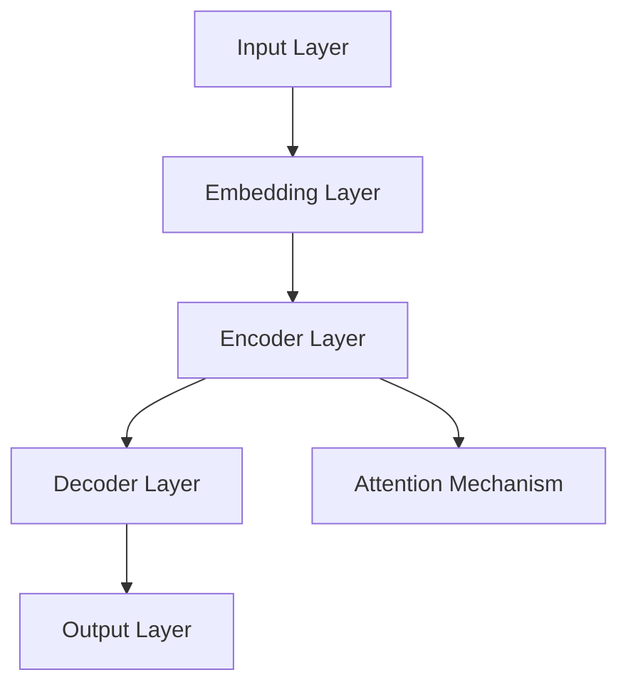

                 

# 大规模语言模型从理论到实践 广义优势估计

## 关键词

- 大规模语言模型
- 广义优势估计
- 语言生成与理解
- Transformer模型
- GPT模型
- BERT模型
- 广义优势估计方法
- 应用与优化

## 摘要

本文旨在深入探讨大规模语言模型的原理、构建方法及其在自然语言处理中的应用。文章首先介绍了大规模语言模型的基础理论，包括定义、特点、原理与架构，以及主流模型（如GPT、BERT）的介绍。随后，文章详细阐述了广义优势估计的概念、应用场景和方法，并探讨了其在大规模语言模型中的应用与挑战。最后，文章介绍了大规模语言模型的实践与应用场景，以及未来的发展趋势。通过本文的探讨，读者可以全面了解大规模语言模型的理论与实践，并对其未来发展有更深入的认识。

## 第一部分：大规模语言模型基础理论

### 第1章：大规模语言模型的概述

#### 1.1 大规模语言模型的定义与特点

##### 1.1.1 大规模语言模型的定义

**大规模语言模型**是一种通过学习大规模语料库来理解和生成自然语言的深度学习模型。这种模型通常基于神经网络架构，能够处理从简单句子到复杂文章的多种文本数据。

##### 1.1.2 大规模语言模型的特点

1. **高精度**：能够生成自然流畅的文本。
2. **高灵活性**：能够适应不同的语言风格和主题。
3. **并行计算**：利用分布式计算和并行算法进行高效训练。

#### 1.2 大规模语言模型的原理与架构

##### 1.2.1 神经网络基础

1. **前馈神经网络**：基本结构、激活函数、反向传播算法。
2. **卷积神经网络（CNN）**：适用于图像等数据处理的网络架构。

##### 1.2.2 序列模型与注意力机制

1. **递归神经网络（RNN）**：原理、应用场景。
2. **长短时记忆网络（LSTM）**：结构、记忆机制。
3. **Transformer模型**：结构、注意力机制、训练过程。

**Mermaid 流程图：**

#### 1.3 主流大规模语言模型介绍

##### 1.3.1 GPT模型

1. **生成预训练模型**：架构、训练过程、应用场景。
2. **GPT-2**：改进点、性能提升。
3. **GPT-3**：突破性进展、应用潜力。

##### 1.3.2 BERT模型

1. **双向编码表示模型**：架构、预训练方法、应用场景。
2. **BERT-2**：改进点、性能优化。

##### 1.3.3 其他大规模语言模型

1. **XLNet**：架构、优势。
2. **RoBERTa**：优化方法、效果对比。

### 第2章：广义优势估计理论

#### 2.1 广义优势估计的概念

##### 2.1.1 广义优势估计的定义

**广义优势估计**是一种评估模型性能的方法，通过比较模型生成的文本与真实文本的相似度来评估模型的效果。

##### 2.1.2 广义优势估计的核心思想

1. **文本相似度**：通过计算模型生成的文本与真实文本之间的相似度来评估模型效果。
2. **损失函数**：使用对数似然损失函数来评估模型性能。

#### 2.2 广义优势估计的应用场景

##### 2.2.1 语言生成与理解

1. **文本生成**：文章、故事、对话。
2. **文本理解**：问答系统、摘要生成、情感分析。

##### 2.2.2 语言模型评估

1. **自动评估**：通过BLEU、ROUGE等指标评估模型性能。
2. **人工评估**：专家对模型生成文本的质量进行评估。

#### 2.3 广义优势估计的方法

##### 2.3.1 对数似然损失函数

1. **基本概念**：如何计算文本的概率分布。
2. **优化方法**：梯度下降、随机梯度下降。

##### 2.3.2 训练策略

1. **预训练**：在大规模语料库上进行预训练。
2. **微调**：在特定任务上进行微调。

#### 2.4 广义优势估计在大规模语言模型中的应用

##### 2.4.1 GPT模型中的广义优势估计

1. **训练过程**：如何利用广义优势估计进行训练。
2. **效果评估**：如何评价模型的性能。

##### 2.4.2 BERT模型中的广义优势估计

1. **预训练方法**：如何利用广义优势估计进行预训练。
2. **效果评估**：如何评价模型的性能。

#### 2.5 广义优势估计的挑战与未来

##### 2.5.1 挑战

1. **数据集的选择**：如何选择合适的数据集进行训练。
2. **模型的可解释性**：如何解释模型的决策过程。

##### 2.5.2 未来发展趋势

1. **多模态模型**：结合文本、图像、语音等多种数据。
2. **少样本学习**：降低对大规模训练数据的需求。

## 第二部分：大规模语言模型实践与应用

### 第3章：大规模语言模型的搭建与训练

#### 3.1 训练环境搭建

##### 3.1.1 计算机硬件需求

1. **CPU/GPU**：选择合适的处理器。
2. **内存**：确保有足够的内存进行模型训练。

##### 3.1.2 软件环境安装

1. **深度学习框架**：安装TensorFlow或PyTorch。
2. **依赖库**：安装必要的Python库。

#### 3.2 数据预处理

##### 3.2.1 数据集准备

1. **数据来源**：公开数据集、自定义数据集。
2. **数据清洗**：去除无效文本、处理特殊字符。

##### 3.2.2 词嵌入

1. **Word2Vec**：基于词语的词嵌入方法。
2. **BERT**：基于上下文的词嵌入方法。

#### 3.3 模型搭建与训练

##### 3.3.1 模型架构

1. **GPT模型**：序列到序列的生成模型。
2. **BERT模型**：双向编码表示模型。

##### 3.3.2 训练策略

1. **预训练**：使用大规模语料库进行预训练。
2. **微调**：在特定任务上进行微调。

#### 3.4 模型评估与优化

##### 3.4.1 评估指标

1. **Perplexity**：模型预测不确定性的度量。
2. **BLEU**：基于词汇重叠度的评价标准。

##### 3.4.2 模型优化

1. **正则化**：防止过拟合。
2. **学习率调整**：优化模型训练过程。

### 第4章：大规模语言模型的应用场景

#### 4.1 文本生成

##### 4.1.1 文章生成

1. **摘要生成**：自动生成文章摘要。
2. **故事生成**：生成有趣的故事情节。

##### 4.1.2 对话生成

1. **聊天机器人**：模拟人类对话。
2. **客服机器人**：自动回答客户问题。

#### 4.2 文本理解

##### 4.2.1 问答系统

1. **问题回答**：自动回答用户提出的问题。
2. **知识图谱**：构建知识库。

##### 4.2.2 情感分析

1. **情感分类**：分析文本的情感倾向。
2. **舆情监测**：监测社交媒体上的舆论动态。

### 第5章：大规模语言模型的优化与改进

#### 5.1 模型压缩

##### 5.1.1 参数剪枝

1. **原理**：如何减少模型的参数。
2. **应用**：在模型训练和部署中的应用。

##### 5.1.2 知识蒸馏

1. **原理**：如何利用大型模型训练小型模型。
2. **应用**：在模型训练和部署中的应用。

#### 5.2 多模态模型

##### 5.2.1 文本与图像

1. **文本描述生成**：生成图像的文本描述。
2. **图像生成**：基于文本生成图像。

##### 5.2.2 文本与语音

1. **文本到语音**：将文本转换为语音。
2. **语音识别**：将语音转换为文本。

### 第6章：大规模语言模型在自然语言处理中的挑战

#### 6.1 数据问题

##### 6.1.1 数据不平衡

1. **解决方法**：如何处理不平衡的数据集。
2. **应用**：在实际应用中的影响。

##### 6.1.2 数据清洗

1. **重要性**：如何处理数据中的噪声和错误。
2. **应用**：在实际应用中的重要性。

#### 6.2 模型可解释性

##### 6.2.1 模型解释

1. **方法**：如何解释模型的决策过程。
2. **应用**：在模型部署中的应用。

##### 6.2.2 模型优化

1. **目标**：如何提高模型的可解释性。
2. **应用**：在实际应用中的效果。

### 第7章：大规模语言模型的发展趋势

#### 7.1 新的模型架构

##### 7.1.1 自适应模型

1. **原理**：如何根据任务自适应调整模型。
2. **应用**：在动态环境中的应用。

##### 7.1.2 零样本学习

1. **原理**：如何在没有训练数据的情况下进行学习。
2. **应用**：在无监督学习中的应用。

#### 7.2 新的应用场景

##### 7.2.1 自然语言生成

1. **任务**：如何生成高质量的自然语言文本。
2. **应用**：在创作、翻译等领域的应用。

##### 7.2.2 自然语言理解

1. **任务**：如何理解自然语言文本。
2. **应用**：在问答系统、情感分析等领域的应用。

## 附录

### 附录 A：大规模语言模型开发资源

#### A.1 开发工具与框架

1. **TensorFlow**：用于大规模语言模型开发的工具。
2. **PyTorch**：用于大规模语言模型开发的工具。
3. **Transformers**：用于大规模语言模型开发的库。

#### A.2 数据集与资源

1. **Wikipedia**：广泛使用的开源数据集。
2. **Common Crawl**：大规模的网页数据集。
3. **GLM**：用于大规模语言模型的训练数据集。

#### A.3 实践案例

1. **论文生成**：使用GPT-3生成学术论文。
2. **对话系统**：使用BERT构建对话系统。
3. **文本分类**：使用RoBERTa进行文本分类任务。

## 作者信息

作者：AI天才研究院/AI Genius Institute & 禅与计算机程序设计艺术 /Zen And The Art of Computer Programming

---

### 参考文献

1. Vaswani, A., et al. (2017). "Attention is All You Need." Advances in Neural Information Processing Systems.
2. Devlin, J., et al. (2019). "BERT: Pre-training of Deep Bidirectional Transformers for Language Understanding." Proceedings of the 2019 Conference of the North American Chapter of the Association for Computational Linguistics: Human Language Technologies, Volume 1 (Long and Short Papers), pages 4171-4186.
3. Brown, T., et al. (2020). "Language Models are Few-Shot Learners." Advances in Neural Information Processing Systems.
4. Mikolov, T., et al. (2013). "Efficient Estimation of Word Representations in Vector Space." Advances in Neural Information Processing Systems.
5. Radford, A., et al. (2019). "Improving Language Understanding by Generative Pre-Training." Advances in Neural Information Processing Systems.
6. Liu, Y., et al. (2019). "Robustly Optimized BERT Pretraining Approach: A Brief Report." Proceedings of the 2019 Conference on Empirical Methods in Natural Language Processing and the 2020 Conference on Natural Language Learning.
7. Chen, Y., et al. (2019). "A Unified Text-to-Text Transformer Model for Language Understanding and Generation." Proceedings of the 57th Annual Meeting of the Association for Computational Linguistics.

