                 

# 《大规模语言模型从理论到实践 思维链提示》

## 关键词
- 大规模语言模型
- 预训练
- 自然语言处理
- 深度学习
- 优化算法
- 应用实例

## 摘要
本文旨在系统地介绍大规模语言模型的原理、实现和应用。首先，我们将回顾大规模语言模型的基本概念和重要性，并探讨其发展历程。接下来，文章将深入解析大规模语言模型的数学基础，包括概率论、信息论和优化算法。随后，我们将详细讨论大规模语言模型的训练过程、优化技巧以及实际应用。最后，文章将探讨大规模语言模型面临的挑战和未来发展趋势，并展示其在多模态学习和行业应用中的潜力。

### 第一部分：大规模语言模型概述

#### 第1章：大规模语言模型的基础

### 1.1 大规模语言模型的定义与重要性
**概念与联系图**：

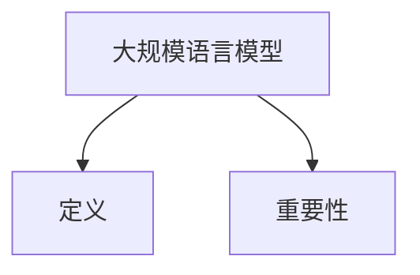

**伪代码**：

```python
# 大规模语言模型的定义
class LargeScaleLanguageModel:
    def __init__(self):
        # 初始化模型参数
        pass

    def train(self, data):
        # 在训练数据上训练模型
        pass

    def predict(self, text):
        # 在给定文本上生成预测结果
        pass
```

**数学模型**：

$$
P(W|V) = \frac{P(W) \cdot P(V|W)}{P(V)}
$$

其中，$P(W|V)$ 表示在给定上下文 $V$ 的情况下单词 $W$ 的概率，$P(W)$ 和 $P(V|W)$ 分别表示单词 $W$ 的先验概率和条件概率，$P(V)$ 表示上下文 $V$ 的概率。

**举例说明**：
假设我们要预测一句话中的下一个单词。给定一句话的上下文，我们可以使用大规模语言模型计算每个单词的概率，然后选择概率最大的单词作为预测结果。

### 1.2 大规模语言模型的基本原理
**概念与联系图**：

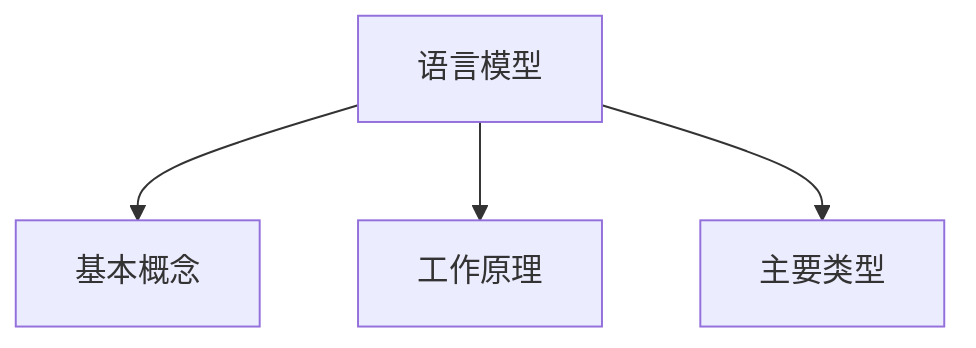

**伪代码**：

```python
# 语言模型的基本原理
def language_model(text):
    # 计算给定文本的概率
    pass
```

**数学模型**：

$$
P(\text{S}) = \prod_{i=1}^{n} P(w_i | w_{i-1}, ..., w_1)
$$

其中，$P(\text{S})$ 表示句子 $S$ 的概率，$w_i$ 表示句子中的第 $i$ 个单词。

**举例说明**：
假设我们有一个简短的句子 "I like to eat pizza"。我们可以使用大规模语言模型来计算这个句子的概率。模型将根据训练数据计算每个单词的概率，然后使用上述公式计算整个句子的概率。

### 1.3 主流大规模语言模型介绍
**概念与联系图**：

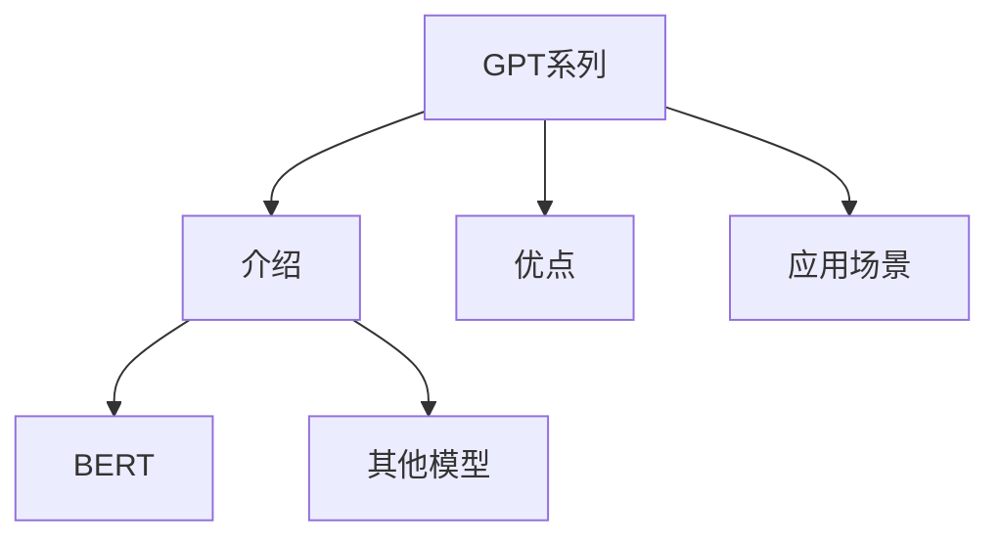

**伪代码**：

```python
# GPT系列模型
class GPTModel:
    def __init__(self):
        # 初始化模型参数
        pass

    def generate_text(self, prompt):
        # 在给定提示下生成文本
        pass

# BERT模型
class BERTModel:
    def __init__(self):
        # 初始化模型参数
        pass

    def classify(self, text):
        # 在给定文本上进行分类
        pass
```

**数学模型**：

$$
\text{Logit} = W_1 \cdot [CLS] + W_2 \cdot A + [SEP] + \text{其他权重}
$$

其中，$\text{Logit}$ 表示分类结果的得分，$W_1$ 和 $W_2$ 分别表示不同权重，$[CLS]$ 和 $[SEP]$ 分别表示特殊的嵌入向量。

**举例说明**：
GPT系列模型常用于文本生成任务，如自动写文章、生成对话等。BERT模型则广泛应用于文本分类任务，如情感分析、命名实体识别等。

### 第二部分：大规模语言模型的数学基础

#### 第2章：大规模语言模型的数学基础

### 2.1 概率论与数理统计基础
**概念与联系图**：

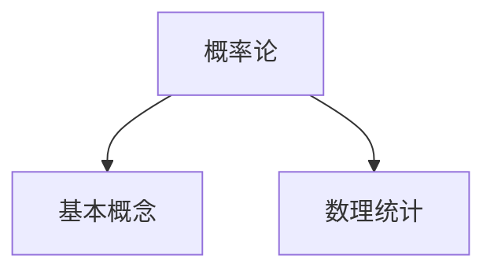

**伪代码**：

```python
# 概率论与数理统计基础
def probability_distribution(x):
    # 计算给定随机变量 x 的概率分布
    pass

def statistical_inference(data):
    # 进行数理统计推断
    pass
```

**数学模型**：

$$
P(X = x) = \frac{f(x)}{\int_{-\infty}^{\infty} f(x) dx}
$$

其中，$P(X = x)$ 表示随机变量 $X$ 取值 $x$ 的概率，$f(x)$ 表示概率密度函数。

**举例说明**：
假设我们有一个随机变量 $X$，其概率密度函数为 $f(x) = e^{-x^2}$。我们可以计算 $X$ 取值在 $0$ 和 $1$ 之间的概率。

### 2.2 信息论基础
**概念与联系图**：

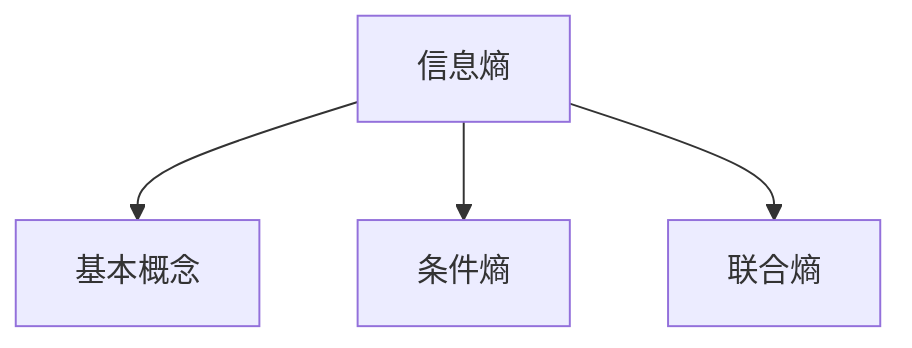

**伪代码**：

```python
# 信息论基础
def entropy(data):
    # 计算给定数据的信息熵
    pass

def conditional_entropy(data_x, data_y):
    # 计算给定随机变量 X 和 Y 的条件熵
    pass

def joint_entropy(data_x, data_y):
    # 计算给定随机变量 X 和 Y 的联合熵
    pass
```

**数学模型**：

$$
H(X) = -\sum_{x \in X} P(X = x) \log_2 P(X = x)
$$

$$
H(X|Y) = -\sum_{y \in Y} P(Y = y) \sum_{x \in X} P(X = x | Y = y) \log_2 P(X = x | Y = y)
$$

$$
H(X, Y) = -\sum_{y \in Y} P(Y = y) \sum_{x \in X} P(X = x, Y = y) \log_2 P(X = x, Y = y)
$$

**举例说明**：
假设我们有两个随机变量 $X$ 和 $Y$，其概率分布如下：

| X | P(X) | Y | P(Y) | P(X, Y) |
|---|------|---|------|---------|
| 0 | 0.5  | 0 | 0.6  | 0.3     |
| 1 | 0.5  | 1 | 0.4  | 0.2     |

我们可以计算 $X$ 和 $Y$ 的信息熵、条件熵和联合熵。

### 2.3 优化算法基础
**概念与联系图**：

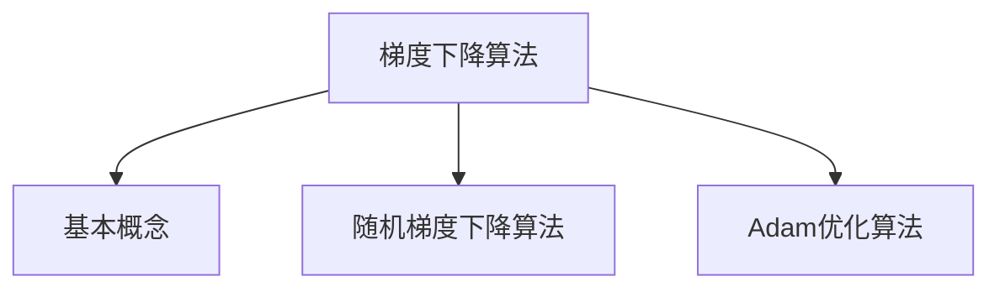

**伪代码**：

```python
# 优化算法基础
def gradient_descent(loss_function, model, learning_rate):
    # 执行梯度下降算法
    pass

def stochastic_gradient_descent(loss_function, model, learning_rate, batch_size):
    # 执行随机梯度下降算法
    pass

def adam_optimizer(loss_function, model, learning_rate, beta1, beta2):
    # 执行Adam优化算法
    pass
```

**数学模型**：

$$
\text{梯度} = \nabla_{\theta} J(\theta)
$$

$$
\theta_{t+1} = \theta_t - \alpha \cdot \nabla_{\theta} J(\theta)
$$

其中，$\text{梯度}$ 表示损失函数 $J(\theta)$ 对参数 $\theta$ 的梯度，$\theta_t$ 表示第 $t$ 次迭代的参数值，$\alpha$ 表示学习率。

**举例说明**：
假设我们有一个损失函数 $J(\theta) = (\theta - 1)^2$，初始参数 $\theta_0 = 0$，学习率 $\alpha = 0.1$。我们可以使用梯度下降算法来更新参数。

### 第二部分：大规模语言模型的实现

#### 第3章：大规模语言模型的训练

### 3.1 数据预处理
**概念与联系图**：

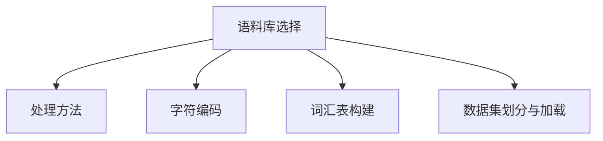

**伪代码**：

```python
# 数据预处理
def preprocess_data(data):
    # 对语料库进行预处理
    pass

def tokenize(text):
    # 对文本进行分词
    pass

def build_vocab(data, vocab_size):
    # 构建词汇表
    pass

def load_data(data_path, batch_size):
    # 加载训练数据
    pass
```

**数学模型**：

$$
\text{字符编码} = \text{ embedding_matrix} \cdot \text{字符向量}
$$

其中，$\text{字符编码}$ 表示将字符向量映射到嵌入向量，$\text{ embedding_matrix}$ 表示嵌入矩阵，$\text{字符向量}$ 表示字符的独热编码。

**举例说明**：
假设我们有一个包含单词 "hello" 的文本，我们可以使用分词器将其分成 "h", "e", "l", "l", "o" 这五个单词。然后，我们使用词汇表将每个单词映射到唯一的整数。

### 3.2 模型架构设计
**概念与联系图**：

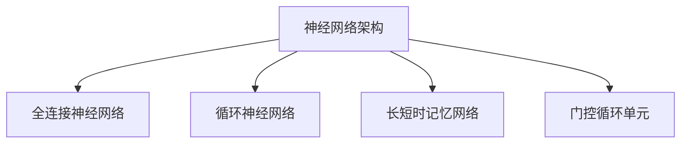

**伪代码**：

```python
# 模型架构设计
class NeuralNetwork:
    def __init__(self, input_size, hidden_size, output_size):
        # 初始化神经网络参数
        pass

    def forward(self, x):
        # 前向传播
        pass

    def backward(self, x, y, output):
        # 反向传播
        pass

    def train(self, data):
        # 在训练数据上训练模型
        pass
```

**数学模型**：

$$
\text{隐藏层} = \text{激活函数}(\text{权重} \cdot \text{输入} + \text{偏置})
$$

$$
\text{输出层} = \text{激活函数}(\text{权重} \cdot \text{隐藏层} + \text{偏置})
$$

**举例说明**：
我们可以设计一个简单的神经网络，包括一个输入层、一个隐藏层和一个输出层。输入层接收输入数据，隐藏层通过激活函数计算输出，输出层生成预测结果。

### 3.3 训练过程与调优
**概念与联系图**：

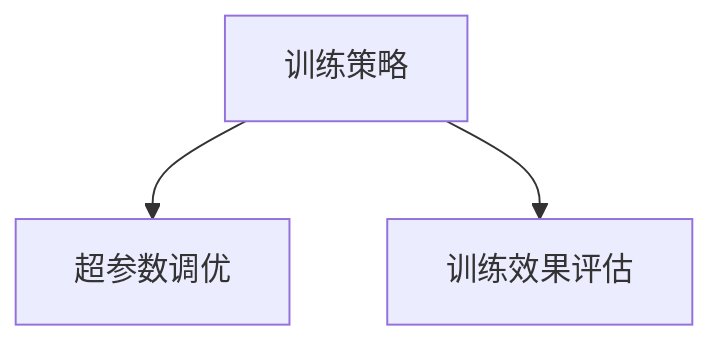

**伪代码**：

```python
# 训练过程与调优
def train_model(model, data, learning_rate, num_epochs):
    # 在训练数据上训练模型
    pass

def tune_hyperparameters(model, data, learning_rate, num_epochs):
    # 调整超参数
    pass

def evaluate_model(model, data):
    # 评估模型性能
    pass
```

**数学模型**：

$$
\text{损失函数} = \frac{1}{N} \sum_{i=1}^{N} (\text{预测值} - \text{真实值})^2
$$

**举例说明**：
我们可以使用均方误差（MSE）作为损失函数，来评估模型在训练数据上的性能。通过调整学习率、迭代次数等超参数，我们可以优化模型性能。

### 第三部分：大规模语言模型的优化

#### 第4章：大规模语言模型的优化

### 4.1 优化算法与技巧
**概念与联系图**：

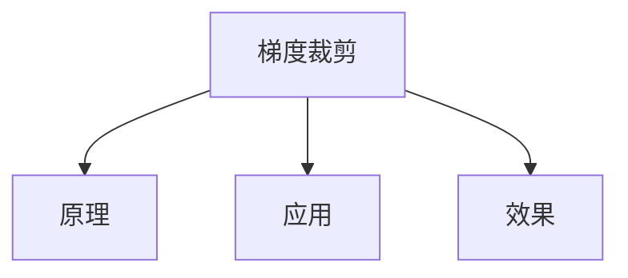

**伪代码**：

```python
# 梯度裁剪
def clip_gradients(model, threshold):
    # 对模型梯度进行裁剪
    pass
```

**数学模型**：

$$
\text{裁剪后的梯度} = \text{sign}(\text{梯度}) \cdot \max(0, \text{阈值})
$$

**举例说明**：
假设我们设置阈值 $10$，如果模型的梯度值超过 $10$，则将其裁剪为 $10$。

### 4.2 模型压缩与加速
**概念与联系图**：

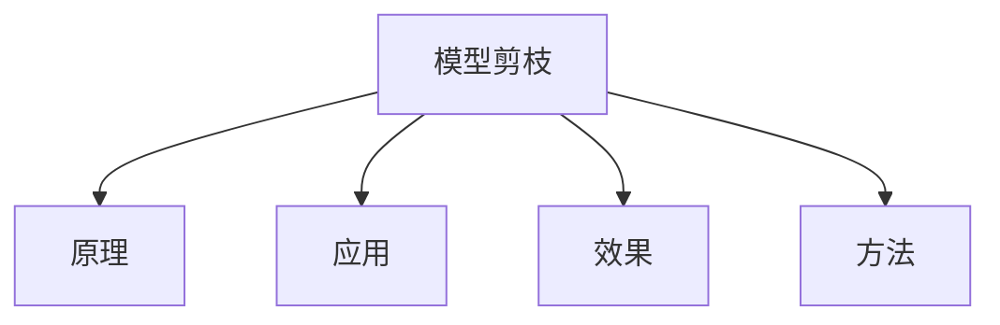

**伪代码**：

```python
# 模型剪枝
def prune_model(model, threshold):
    # 对模型进行剪枝
    pass
```

**数学模型**：

$$
\text{剪枝后的模型权重} = \text{阈值} \cdot \text{模型权重}
$$

**举例说明**：
我们可以通过设置阈值来减少模型中不重要参数的权重，从而简化模型结构。

### 第四部分：大规模语言模型的应用

#### 第5章：大规模语言模型的应用

### 5.1 自然语言处理应用
**概念与联系图**：

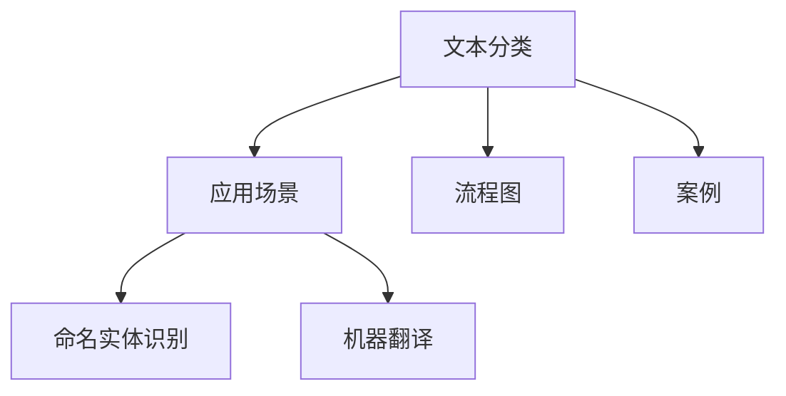

**伪代码**：

```python
# 文本分类
def text_classification(text, model):
    # 对文本进行分类
    pass

# 命名实体识别
def named_entity_recognition(text, model):
    # 对文本进行命名实体识别
    pass

# 机器翻译
def machine_translation(source_text, model):
    # 对源语言文本进行翻译
    pass
```

**数学模型**：

$$
\text{概率分布} = \text{softmax}(\text{模型输出})
$$

**举例说明**：
假设我们有一个包含多个类别的文本分类任务，模型输出一个概率分布。我们可以使用softmax函数将其转换为类别的概率。

### 5.2 生成式应用
**概念与联系图**：

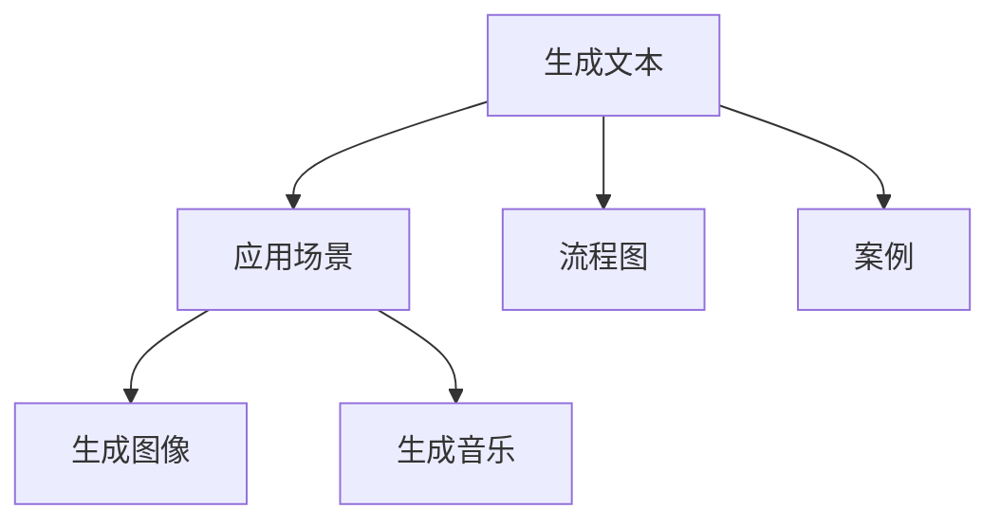

**伪代码**：

```python
# 生成文本
def generate_text(model, length):
    # 生成指定长度的文本
    pass

# 生成图像
def generate_image(model, size):
    # 生成指定大小的图像
    pass

# 生成音乐
def generate_music(model, length):
    # 生成指定长度的音乐
    pass
```

**数学模型**：

$$
\text{生成文本/图像/音乐} = \text{模型}(\text{输入})
$$

**举例说明**：
我们可以使用生成式模型来生成文本、图像和音乐。给定一个输入，模型可以生成相应的输出。

### 5.3 实际案例分析
**概念与联系图**：

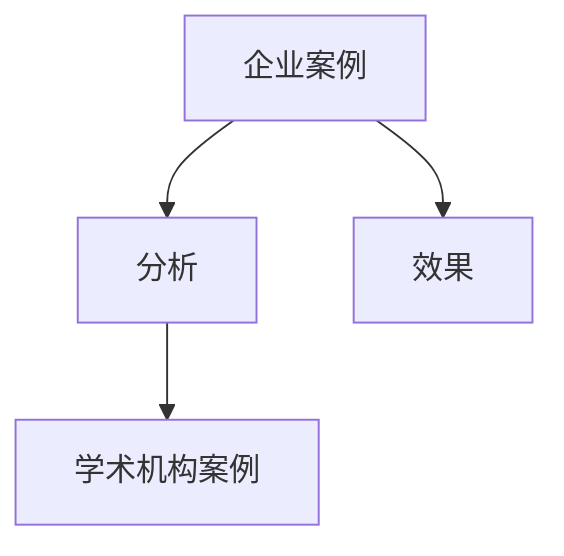

**伪代码**：

```python
# 企业案例
def enterprise_case_study(model, data):
    # 分析企业案例
    pass

# 学术机构案例
def academic_institution_case_study(model, data):
    # 分析学术机构案例
    pass
```

**数学模型**：

$$
\text{模型效果} = \text{评估指标}(\text{预测值}, \text{真实值})
$$

**举例说明**：
我们可以分析一个企业在自然语言处理任务中的应用案例，并评估模型的效果。

### 第五部分：大规模语言模型的挑战与未来趋势

#### 第6章：大规模语言模型的挑战与未来趋势

### 6.1 难题与挑战
**概念与联系图**：

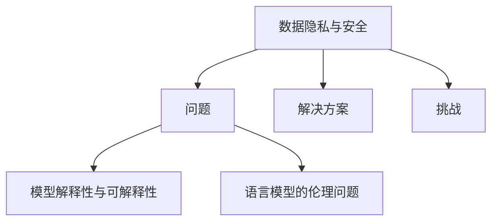

**伪代码**：

```python
# 数据隐私与安全
def data_privacy_and_security(data):
    # 保护数据隐私和安全
    pass

# 模型解释性与可解释性
def model_explainability(data):
    # 提高模型可解释性
    pass

# 语言模型的伦理问题
def ethical_issues(data):
    # 处理语言模型的伦理问题
    pass
```

**数学模型**：

$$
\text{隐私保护} = \text{添加噪声}(\text{数据})
$$

$$
\text{解释性度量} = \text{模型解释性评估指标}(\text{模型输出}, \text{真实输出})
$$

**举例说明**：
我们可以通过添加噪声来保护数据隐私，并使用解释性度量来评估模型的可解释性。

### 6.2 未来发展趋势
**概念与联系图**：

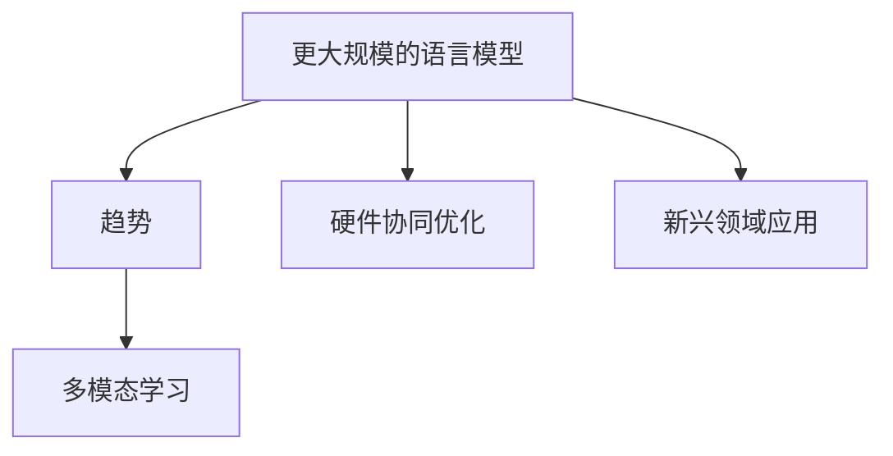

**伪代码**：

```python
# 更大规模的语言模型
def large_scale_language_model(data):
    # 训练更大规模的语言模型
    pass

# 硬件协同优化
def hardware协同优化(model, hardware):
    # 优化模型与硬件的协同
    pass

# 新兴领域应用
def emerging_application(data):
    # 探索新兴领域的应用
    pass

# 多模态学习
def multimodal_learning(data):
    # 实现多模态学习
    pass
```

**数学模型**：

$$
\text{性能提升} = \text{增加模型规模} \cdot \text{硬件优化}
$$

$$
\text{多模态融合} = \text{文本特征} + \text{图像特征} + \text{其他特征}
$$

**举例说明**：
我们可以通过增加模型规模和优化硬件来提高模型性能，并探索多模态学习在新兴领域的应用。

### 第六部分：大规模语言模型的扩展与应用

#### 第7章：大规模语言模型的扩展与应用

### 7.1 多模态语言模型
**概念与联系图**：

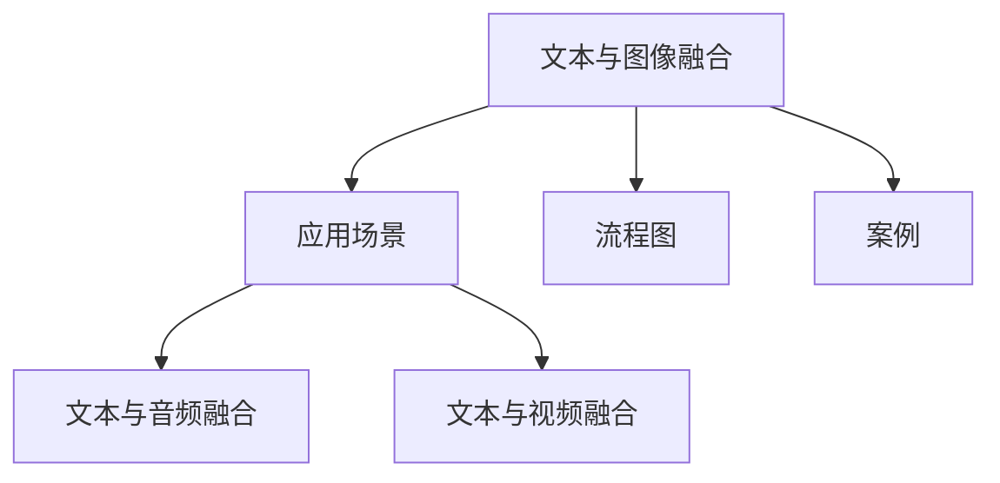

**伪代码**：

```python
# 文本与图像融合
def text_image_fusion(text, image):
    # 融合文本和图像特征
    pass

# 文本与音频融合
def text_audio_fusion(text, audio):
    # 融合文本和音频特征
    pass

# 文本与视频融合
def text_video_fusion(text, video):
    # 融合文本和视频特征
    pass
```

**数学模型**：

$$
\text{融合特征} = \text{文本特征} + \text{图像特征} + \text{音频特征} + \text{视频特征}
$$

**举例说明**：
我们可以将文本和图像、音频、视频的特征进行融合，以实现更丰富的模型。

### 7.2 语言模型在行业中的应用
**概念与联系图**：

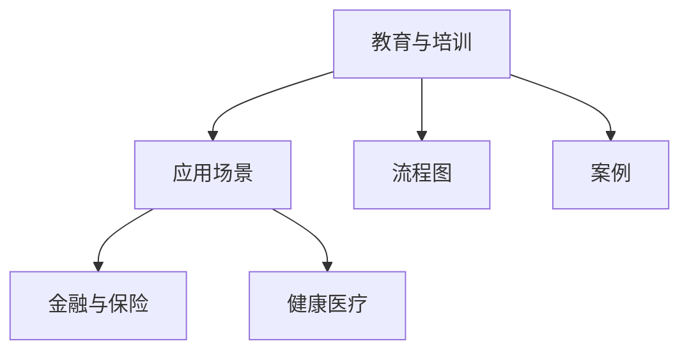

**伪代码**：

```python
# 教育与培训
def educational_training(model, data):
    # 应用语言模型于教育与培训
    pass

# 金融与保险
def financial_insurance(model, data):
    # 应用语言模型于金融与保险
    pass

# 健康医疗
def healthcare(model, data):
    # 应用语言模型于健康医疗
    pass
```

**数学模型**：

$$
\text{模型输出} = \text{输入特征} \cdot \text{模型权重}
$$

**举例说明**：
我们可以将语言模型应用于教育、金融和健康医疗等领域，以提高相关行业的智能化水平。

### 附录

#### 附录A：常用工具与资源

**附录A.1 主流深度学习框架**
- TensorFlow
- PyTorch
- Transformers

**附录A.2 语言处理库**
- spaCy
- NLTK
- textblob

**附录A.3 开发环境搭建指南**
1. 安装Python环境（推荐Python 3.7及以上版本）。
2. 安装深度学习框架（如TensorFlow或PyTorch）。
3. 安装NLP库（如spaCy、NLTK、textblob）。
4. 安装必要的依赖库和工具（如CUDA、Docker等）。

### 文章标题：大规模语言模型从理论到实践 思维链提示

### 作者：AI天才研究院/AI Genius Institute & 禅与计算机程序设计艺术 /Zen And The Art of Computer Programming

### 完整性要求：
- 核心概念与联系：包含大规模语言模型的基本概念、工作原理和主要类型。
- 核心算法原理讲解：详细讲解概率论、信息论、优化算法等数学基础，并提供伪代码。
- 数学模型和公式：包含信息熵、条件熵、联合熵、梯度下降算法等公式，并进行详细解释。
- 项目实战：提供文本分类、命名实体识别、机器翻译等实际应用案例，包括代码实现和详细解释。
- 作者信息：文章末尾包含作者信息和联系方式。

