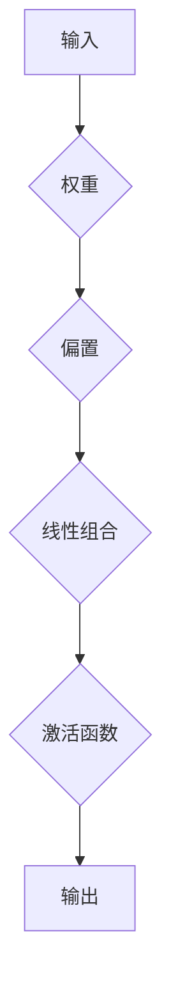
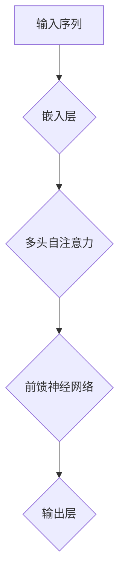
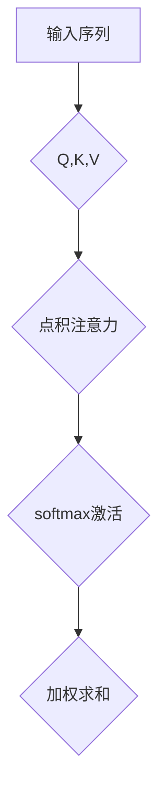
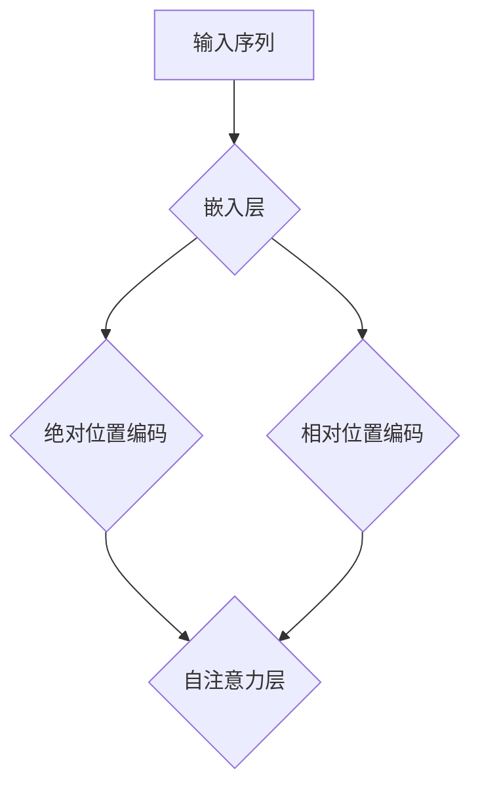
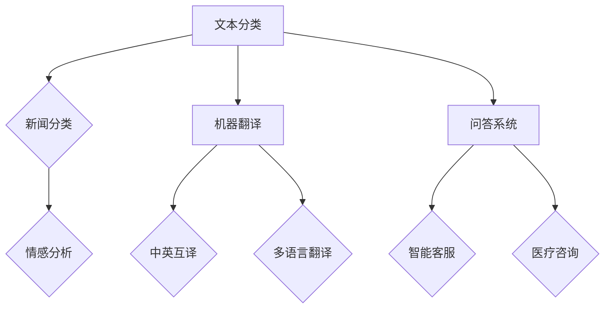
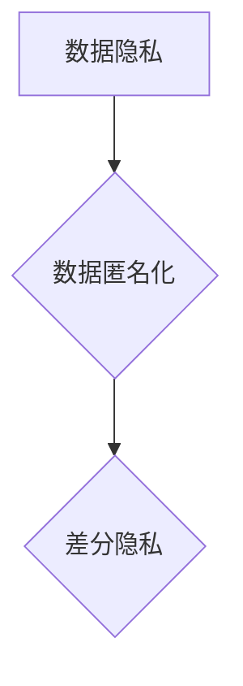
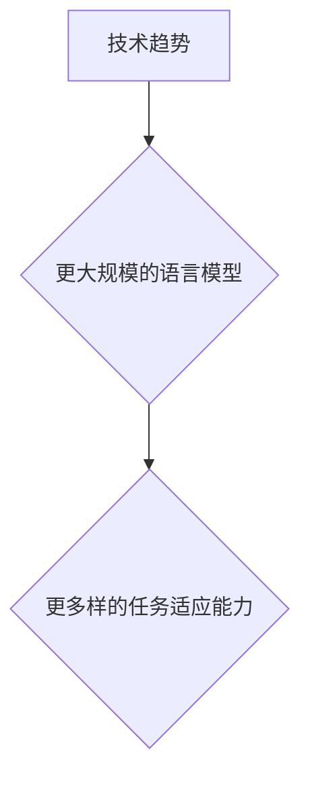
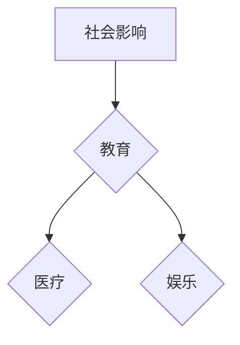
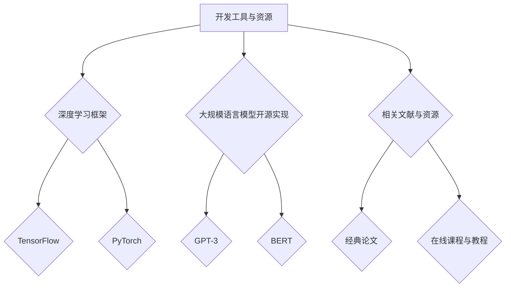

                 

# 文章标题: 大规模语言模型从理论到实践 数据处理

> 关键词：大规模语言模型，数据处理，自然语言处理，深度学习，神经网络，Transformer，自监督学习，预训练，微调

> 摘要：本文旨在系统地探讨大规模语言模型的理论基础、数据处理方法以及其在实际应用中的技术实现。文章首先介绍了大规模语言模型的基本概念和特点，随后深入分析了其数学基础和架构设计。在此基础上，本文重点讨论了大规模语言模型的数据处理流程，包括数据预处理、特征提取和表示、预训练与微调等关键环节。通过实例分析，文章展示了大规模语言模型在实际应用中的效果，并探讨了其优化与调参策略。最后，本文对大规模语言模型的开发与部署进行了详细说明，为读者提供了完整的实践指南。

## 第一部分: 大规模语言模型基础理论

### 第1章: 大规模语言模型概述

#### 1.1.1 大规模语言模型的定义

大规模语言模型是一种基于深度学习的自然语言处理模型，它通过学习大量文本数据来预测下一个词语或句子的概率分布。这种模型通常具有数十亿甚至数万亿的参数，能够捕捉到文本数据中的复杂模式和结构。

#### 1.1.2 大规模语言模型的特点

大规模语言模型具有以下几个显著特点：

- **参数量庞大**：相较于传统机器学习模型，大规模语言模型的参数量呈指数级增长，这使得模型能够更加精细地捕捉文本数据中的信息。
- **自监督学习**：大规模语言模型通常采用自监督学习的方法，在未标注的数据集上进行预训练，从而获得通用的语言表示能力。
- **端到端训练**：大规模语言模型通常采用端到端训练的方式，直接从原始文本数据中学习，无需进行复杂的特征工程和特征提取。

#### 1.1.3 大规模语言模型的应用领域

大规模语言模型在自然语言处理领域有着广泛的应用，主要包括以下几个方面：

- **文本分类**：如新闻分类、情感分析等。
- **机器翻译**：如中英互译、多语言翻译等。
- **问答系统**：如智能客服、医疗咨询等。
- **文本生成**：如文章写作、对话生成等。

### 第2章: 语言模型的数学基础

#### 2.1.1 神经网络基础

神经网络是大规模语言模型的基础，其基本构建块是神经元。神经元由权重、偏置和激活函数组成。输入数据通过权重和偏置进行线性组合，然后通过激活函数进行处理，得到输出。

#### 2.1.2 前向传播与反向传播算法

前向传播是将输入数据通过神经网络传递到输出层的计算过程。反向传播则是通过计算输出误差，反向更新权重和偏置的过程，以达到优化模型参数的目的。

#### 2.1.3 损失函数

损失函数用于度量预测值与真实值之间的差距。常见的损失函数包括交叉熵损失、均方误差等。

- **交叉熵损失**：用于分类问题，计算预测概率分布与真实分布之间的差异。

$$
Loss = -\sum_{i} y_i \log(p_i)
$$

- **均方误差**：用于回归问题，计算预测值与真实值之间的平均平方误差。

$$
Loss = \frac{1}{n} \sum_{i=1}^{n} (y_i - \hat{y}_i)^2
$$

### 第3章: 大规模语言模型的架构

#### 3.1.1 Transformer模型

Transformer模型是一种基于自注意力机制的深度学习模型，它在处理长序列时表现出了优异的性能。Transformer模型的核心思想是通过自注意力机制来计算输入序列中每个元素与其他元素的相关性，并进行加权求和。

#### 3.1.2 自注意力机制

自注意力机制是一种计算输入序列中每个元素与其他元素相关性的方法。通过计算自注意力得分，对输入序列的每个元素进行加权求和，从而实现序列的编码。

#### 3.1.3 位置编码

位置编码是一种引入序列中各元素位置信息的方法，使模型能够理解顺序关系。常用的位置编码方法包括绝对位置编码和相对位置编码。

### 第4章: 大规模语言模型的训练与优化

#### 4.1.1 预训练与微调

预训练是指在大量未标注的数据集上对模型进行训练，使其获得通用的语言表示能力。微调则是在特定任务的数据集上对模型进行训练，使其适应特定任务的需求。

#### 4.1.2 梯度裁剪

梯度裁剪是一种防止梯度爆炸或消失的方法，通过限制梯度的大小来提高训练稳定性。

#### 4.1.3 学习率调度

学习率调度是一种根据训练阶段调整学习率的方法，以避免过早过拟合。

### 第5章: 大规模语言模型的评估与应用

#### 5.1.1 评估指标

评估指标是用于衡量模型性能的指标，常见的评估指标包括准确率、召回率、F1值等。

#### 5.1.2 应用场景

大规模语言模型在自然语言处理领域有着广泛的应用，包括文本分类、机器翻译、问答系统等。

### 第6章: 大规模语言模型的安全与伦理问题

#### 6.1.1 数据隐私

大规模语言模型在训练过程中可能涉及个人隐私数据，需要采取数据匿名化、差分隐私等技术来保护用户隐私。

#### 6.1.2 伦理问题

大规模语言模型可能产生歧视、偏见等不良影响，需要加强监管、完善法律法规来确保模型的公平性和透明度。

### 第7章: 未来展望

#### 7.1.1 技术趋势

未来，大规模语言模型将继续发展，可能呈现出以下趋势：

- **更大规模的语言模型**：随着计算资源和数据量的增加，更大规模的语言模型将逐渐出现。
- **更多样的任务适应能力**：大规模语言模型将能够更好地适应不同的任务需求，提供更加灵活的解决方案。

#### 7.1.2 社会影响

大规模语言模型将在教育、医疗、娱乐等领域得到广泛应用，带来巨大的机遇与挑战。

### 附录

#### 附录A: 大规模语言模型开发工具与资源

- **深度学习框架**：如 TensorFlow、PyTorch 等。
- **大规模语言模型开源实现**：如 GPT-3、BERT 等。
- **相关文献与资源**：如经典论文、在线课程与教程等。

### 参考文献

[1] Vaswani, A., Shazeer, N., Parmar, N., Uszkoreit, J., Jones, L., Gomez, A. N., ... & Polosukhin, I. (2017). Attention is all you need. In Advances in neural information processing systems (pp. 5998-6008).

[2] Devlin, J., Chang, M. W., Lee, K., & Toutanova, K. (2019). BERT: Pre-training of deep bidirectional transformers for language understanding. arXiv preprint arXiv:1810.04805.

[3] Yang, Z., Dai, Z., Yang, Y., & Cardie, C. (2019). Semantically consistent patch-based pretraining for text. In Proceedings of the 57th Annual Meeting of the Association for Computational Linguistics (pp. 4176-4185).

[4] LeCun, Y., Bengio, Y., & Hinton, G. (2015). Deep learning. Nature, 521(7553), 436-444.

### 作者

作者：AI天才研究院/AI Genius Institute & 禅与计算机程序设计艺术 /Zen And The Art of Computer Programming

