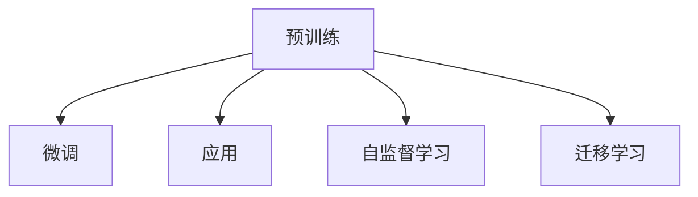
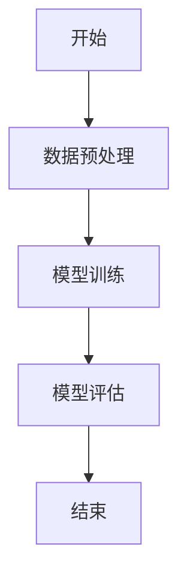

                 

# 文章标题: 大规模语言模型从理论到实践 评估方法

关键词：大规模语言模型，评估方法，神经网络，深度学习，实验设计，实践案例

摘要：本文全面阐述了大规模语言模型的基础理论、评估方法及实践应用。从概述到理论基础，再到评估方法的详细讨论，以及实际案例的分析，本文旨在为读者提供一个深入理解大规模语言模型的框架和工具。文章不仅探讨了语言模型的核心概念和架构，还介绍了各类评估指标和实验设计原则，并结合具体案例展示了如何在实际项目中应用这些评估方法。最后，文章展望了大规模语言模型的未来发展趋势，为读者指明了研究方向和产业应用前景。

## 第一部分: 大规模语言模型基础

### 第1章: 大规模语言模型概述

#### 1.1 大规模语言模型的概念与历史背景

##### 1.1.1 语言模型的定义

语言模型（Language Model）是一种统计模型，用于预测文本序列中的下一个单词或字符。在自然语言处理（Natural Language Processing, NLP）领域，语言模型是构建其他复杂任务（如文本分类、机器翻译、问答系统）的基础。基本的语言模型通常使用n元模型（n-gram model），它基于历史词频来预测下一个词。然而，这种方式存在显著的局限性，无法捕捉长距离依赖关系和上下文信息。

##### 1.1.2 大规模语言模型的演进

随着深度学习和计算能力的提升，大规模语言模型逐渐成为研究的热点。预训练语言模型（Pre-trained Language Model）的出现，标志着语言模型从传统统计模型向深度学习模型的转变。预训练语言模型通常在大规模语料库上进行预训练，然后通过微调（Fine-tuning）应用于特定任务。

##### 1.1.3 大规模语言模型的重要性

大规模语言模型在自然语言处理领域具有广泛的应用，包括但不限于：

1. **文本生成**：如自动写作、文本摘要、对话系统。
2. **文本分类**：如情感分析、垃圾邮件检测、新闻分类。
3. **机器翻译**：如翻译成不同语言、跨语言信息检索。
4. **问答系统**：如搜索引擎、虚拟助手。

大规模语言模型的重要性体现在其强大的表示能力和高效的任务迁移能力，使得许多复杂任务的实现变得更加简单和高效。

#### 1.2 大规模语言模型的类型

##### 1.2.1 预训练语言模型

预训练语言模型（如GPT、BERT）是在大规模语料库上进行预训练的，通过学习语言的统计规律和上下文信息，从而获得强大的文本表示能力。预训练模型通常采用自监督学习（Self-supervised Learning），通过预测未标记的输入数据来训练模型。

##### 1.2.2 微调语言模型

预训练语言模型通过微调（Fine-tuning）应用于特定任务，以提高模型在特定任务上的性能。微调过程通常涉及在预训练模型的基础上增加额外的任务特定层，并通过任务数据对模型进行进一步训练。

##### 1.2.3 应用特定语言模型

应用特定语言模型（Application-specific Language Model）是针对特定应用场景设计的语言模型，如问答系统中的问答模型、文本生成系统中的生成模型等。这些模型通常在预训练语言模型的基础上进行微调和优化，以适应特定的应用需求。

#### 1.3 大规模语言模型的原理与架构

##### 1.3.1 神经网络基础

神经网络（Neural Network）是一种模拟生物神经系统的计算模型，通过多层次的神经元连接来实现复杂的非线性变换。大规模语言模型通常采用深度神经网络（Deep Neural Network），具有多个隐藏层，能够有效地捕捉文本数据中的复杂关系。

##### 1.3.2 自监督学习

自监督学习（Self-supervised Learning）是一种无需外部标注数据的学习方法，通过预测未标记数据中的部分信息来训练模型。大规模语言模型通常采用自监督学习进行预训练，以提高模型的表示能力。

##### 1.3.3 迁移学习

迁移学习（Transfer Learning）是一种利用在特定任务上预训练的模型来提高其他任务性能的方法。大规模语言模型通过迁移学习，将预训练模型的知识迁移到特定任务上，以提高任务性能。

##### 1.3.4 大规模语言模型的 Mermaid 流程图



#### 1.4 大规模语言模型的应用领域

##### 1.4.1 自然语言处理

自然语言处理（NLP）是大规模语言模型最主要的应用领域之一，包括文本分类、情感分析、命名实体识别、机器翻译等。大规模语言模型通过学习语言的内在规律和上下文信息，显著提升了NLP任务的性能。

##### 1.4.2 信息检索

信息检索（Information Retrieval）是指从大规模数据集中检索相关信息的过程，如搜索引擎、问答系统。大规模语言模型在信息检索中的应用，不仅提高了检索的准确性，还增强了检索的语义理解能力。

##### 1.4.3 机器翻译

机器翻译（Machine Translation）是指将一种语言的文本自动翻译成另一种语言。大规模语言模型通过学习双语的文本数据，显著提高了机器翻译的质量和准确性。

##### 1.4.4 问答系统

问答系统（Question Answering System）是指根据用户提出的问题，自动生成答案的系统。大规模语言模型在问答系统中的应用，使得系统能够更准确地理解用户的问题，并提供更为精确的答案。

#### 1.5 大规模语言模型的挑战与未来趋势

##### 1.5.1 资源需求

大规模语言模型的训练和推理过程需要大量的计算资源和存储空间，这对计算基础设施提出了严峻的挑战。未来，随着计算能力的提升和优化算法的研发，这一问题有望得到缓解。

##### 1.5.2 计算效率

提高大规模语言模型的计算效率是当前研究的一个重要方向。通过并行计算、模型压缩和优化等技术，可以显著降低模型的计算复杂度和延迟，提高计算效率。

##### 1.5.3 安全性与隐私保护

大规模语言模型在处理用户数据时，需要确保数据的安全性和隐私保护。未来，随着数据隐私保护法规的不断完善，模型的安全性和隐私保护将得到进一步强化。

##### 1.5.4 模型可解释性

模型可解释性（Model Interpretability）是大规模语言模型研究中的一个重要问题。提高模型的可解释性，有助于用户理解和信任模型，并为模型优化提供指导。

### 第2章: 神经网络与深度学习基础

#### 2.1 神经网络基础

##### 2.1.1 神经网络的基本结构

神经网络（Neural Network）是由大量相互连接的神经元（Node）组成的计算模型。每个神经元接收多个输入，通过加权求和后，经过激活函数（Activation Function）得到输出。神经网络的基本结构包括输入层（Input Layer）、隐藏层（Hidden Layer）和输出层（Output Layer）。

##### 2.1.2 前向传播与反向传播

前向传播（Forward Propagation）是指将输入数据通过神经网络传递到输出层的计算过程。反向传播（Backpropagation）是指利用输出误差，通过反向传播算法计算各层神经元的梯度，从而更新网络参数。

##### 2.1.3 激活函数

激活函数（Activation Function）是神经网络中的一个关键组成部分，用于引入非线性变换。常见的激活函数包括Sigmoid函数、ReLU函数和Tanh函数。

#### 2.2 深度学习基础

##### 2.2.1 多层感知机

多层感知机（Multilayer Perceptron, MLP）是一种具有至少一个隐藏层的神经网络，可以用于分类和回归任务。多层感知机通过逐层提取特征，提高了模型的表示能力。

##### 2.2.2 卷积神经网络（CNN）

卷积神经网络（Convolutional Neural Network, CNN）是一种专门用于处理图像数据的神经网络，通过卷积层（Convolutional Layer）和池化层（Pooling Layer）来提取图像特征。CNN在图像分类、目标检测和图像生成等领域取得了显著的成果。

##### 2.2.3 循环神经网络（RNN）

循环神经网络（Recurrent Neural Network, RNN）是一种能够处理序列数据的神经网络，通过隐藏状态（Hidden State）来保存历史信息。RNN在自然语言处理、语音识别和时间序列分析等领域具有广泛的应用。

##### 2.2.4 长短时记忆网络（LSTM）

长短时记忆网络（Long Short-Term Memory, LSTM）是RNN的一种变体，通过引入门控机制（Gate Mechanism）来有效地学习长距离依赖关系。LSTM在自然语言处理和时间序列分析等领域表现出色。

#### 2.3 大规模深度学习模型

##### 2.3.1 批处理与并行计算

批处理（Batch Processing）和并行计算（Parallel Computing）是大规模深度学习模型训练中常用的技术。批处理将训练数据分成多个批次，并行计算则通过多核处理器或分布式计算来加速模型训练。

##### 2.3.2 深度学习的优化算法

深度学习的优化算法（Optimization Algorithm）用于更新模型参数，以提高模型性能。常见的优化算法包括随机梯度下降（Stochastic Gradient Descent, SGD）和Adam优化器。

##### 2.3.3 随机梯度下降（SGD）

随机梯度下降（Stochastic Gradient Descent, SGD）是一种优化算法，通过随机选择一个训练样本，计算其梯度并更新模型参数。SGD具有简单高效的特点，但在大规模训练数据集上可能收敛速度较慢。

##### 2.3.4 Adam优化器

Adam优化器（Adaptive Moment Estimation）是一种自适应梯度优化算法，通过计算一阶矩估计（均值）和二阶矩估计（方差）来更新模型参数。Adam优化器在收敛速度和稳定性方面表现优异，是大规模深度学习模型训练的常用优化算法。

#### 2.4 自监督学习与迁移学习

##### 2.4.1 自监督学习的定义与原理

自监督学习（Self-supervised Learning）是一种无监督学习（Unsupervised Learning）方法，通过利用未标记数据中的信息来训练模型。自监督学习的核心思想是通过预测未标记数据中的部分信息，如序列中的下一个词或图像中的部分区域，从而学习数据的内在规律。

##### 2.4.2 迁移学习的原理与应用

迁移学习（Transfer Learning）是一种利用在特定任务上预训练的模型来提高其他任务性能的方法。迁移学习通过将预训练模型的知识迁移到新任务上，减少了新任务的训练数据需求，并提高了模型在新任务上的性能。

##### 2.4.3 大规模预训练模型的迁移学习技巧

大规模预训练模型（如GPT、BERT）通过在大量未标记数据上进行预训练，获得了强大的文本表示能力。迁移学习技巧通过在预训练模型的基础上，利用少量标记数据对新任务进行微调，从而提高了模型在新任务上的性能。

#### 2.5 大规模语言模型的数学模型

##### 2.5.1 词嵌入技术

词嵌入（Word Embedding）是一种将词汇映射到高维向量空间的技术，用于捕捉词汇间的语义关系。常见的词嵌入技术包括Word2Vec、GloVe和BERT。

##### 2.5.2 序列模型与注意力机制

序列模型（Sequence Model）是一种用于处理序列数据的模型，如RNN和LSTM。注意力机制（Attention Mechanism）是一种在序列模型中用于学习输入序列中关键信息的机制，提高了模型的表示能力。

##### 2.5.3 转换器架构

转换器架构（Transformer Architecture）是一种基于自注意力（Self-Attention）机制的深度学习模型，广泛应用于自然语言处理任务，如机器翻译和文本生成。转换器架构通过并行计算和多头注意力，提高了模型的计算效率和表示能力。

##### 2.5.4 数学公式

$$
L = -\sum_{i=1}^{N} y_i \log(p(y_i | x_i))
$$

其中，$L$表示损失函数，$y_i$表示第$i$个样本的标签，$p(y_i | x_i)$表示模型对第$i$个样本的预测概率。

### 第3章: 语言模型的评估指标

#### 3.1 评估指标概述

##### 3.1.1 准确率、召回率和F1值

准确率（Accuracy）、召回率（Recall）和F1值（F1 Score）是常用的评估指标，用于衡量模型在分类任务上的性能。准确率表示模型正确分类的样本数占总样本数的比例；召回率表示模型正确分类的样本数占实际正样本数的比例；F1值是准确率和召回率的调和平均值。

##### 3.1.2 损失函数

损失函数（Loss Function）用于衡量模型预测结果与实际结果之间的差距，常见的损失函数包括均方误差（Mean Squared Error, MSE）、交叉熵损失（Cross-Entropy Loss）等。

##### 3.1.3 评估集的划分

评估集（Validation Set）是用于评估模型性能的数据集。常见的评估集划分方法包括交叉验证（Cross Validation）和留出法（Hold-Out Method）。

#### 3.2 实验设计

##### 3.2.1 数据预处理

数据预处理（Data Preprocessing）是实验设计的重要环节，包括数据清洗、数据转换和数据归一化等步骤。数据预处理有助于提高模型的性能和稳定性。

##### 3.2.2 模型训练与验证

模型训练（Model Training）和验证（Model Validation）是实验设计的核心步骤。模型训练是通过优化算法更新模型参数，以最小化损失函数；模型验证是通过评估指标来衡量模型性能。

##### 3.2.3 模型调优

模型调优（Model Tuning）是通过调整模型参数和超参数，以提高模型性能。常见的调优方法包括网格搜索（Grid Search）和贝叶斯优化（Bayesian Optimization）。

#### 3.3 模型评估方法

##### 3.3.1 手动评估

手动评估（Manual Evaluation）是指由人类评估者对模型输出结果进行评估，常用的评估方法包括错误分析（Error Analysis）和人类评估（Human Evaluation）。

##### 3.3.2 自动化评估

自动化评估（Automated Evaluation）是指使用自动化工具对模型输出结果进行评估，常用的评估方法包括精确率（Precision）、召回率（Recall）和F1值（F1 Score）等。

##### 3.3.3 性能对比与优化

性能对比与优化（Performance Comparison and Optimization）是指在不同模型和参数设置下，评估模型性能并进行优化。常用的方法包括对数似然损失（Log-Likelihood Loss）和交叉验证（Cross Validation）。

### 第4章: 实验设计与分析

#### 4.1 实验设计原则

##### 4.1.1 实验设计的关键因素

实验设计的关键因素包括数据集选择、模型选择、参数设置和评估指标等。合理的设计原则有助于提高实验的可靠性和有效性。

##### 4.1.2 实验控制的必要性

实验控制（Experiment Control）是实验设计的重要环节，通过控制变量和消除干扰，确保实验结果的准确性和可靠性。

#### 4.2 实验数据分析

##### 4.2.1 描述性统计分析

描述性统计分析（Descriptive Statistical Analysis）是对实验数据的基本特征进行描述和分析，常用的统计量包括均值（Mean）、中位数（Median）和标准差（Standard Deviation）等。

##### 4.2.2 统计推断

统计推断（Statistical Inference）是基于样本数据对总体参数进行估计和推断的方法，常用的推断方法包括假设检验（Hypothesis Testing）和置信区间（Confidence Interval）等。

##### 4.2.3 实验结果的解释

实验结果的解释（Result Interpretation）是实验设计的重要环节，通过分析实验数据，对模型性能和实验结果进行解释和总结。

#### 4.3 实验案例研究

##### 4.3.1 案例一：文本分类

文本分类（Text Classification）是将文本数据归类到预定义的类别中，常用的分类算法包括朴素贝叶斯（Naive Bayes）、支持向量机（Support Vector Machine）和深度学习模型（Deep Learning Model）。

##### 4.3.2 案例二：机器翻译

机器翻译（Machine Translation）是将一种语言的文本自动翻译成另一种语言，常用的翻译模型包括基于短语的翻译模型（Phrase-Based Translation Model）和基于神经网络的翻译模型（Neural Network-Based Translation Model）。

##### 4.3.3 案例三：问答系统

问答系统（Question Answering System）是指根据用户提出的问题，自动生成答案的系统，常用的问答模型包括基于模板的问答模型（Template-Based Question Answering Model）和基于深度学习的问答模型（Deep Learning-Based Question Answering Model）。

### 第5章: 大规模语言模型评估工具与实践

#### 5.1 常用评估工具

##### 5.1.1 斯坦福核心自然语言处理评估工具（Squad）

斯坦福核心自然语言处理评估工具（Stanford CoreNLP）是一个流行的自然语言处理工具包，提供了多种文本分析功能，如词性标注、命名实体识别、句法解析等。

##### 5.1.2 GLUE 基准测试

GLUE（General Language Understanding Evaluation）基准测试是一个用于评估自然语言处理模型性能的多任务基准测试，包含了多种自然语言处理任务，如文本分类、问答、机器翻译等。

##### 5.1.3 SuperGLUE 基准测试

SuperGLUE 是GLUE的扩展版本，包含了更多的任务和更复杂的任务设置，用于评估大规模语言模型在多种自然语言处理任务上的性能。

#### 5.2 评估实践案例

##### 5.2.1 案例一：文本生成

文本生成（Text Generation）是指根据输入的文本生成新的文本，常用的生成模型包括基于递归神经网络（RNN）的生成模型和基于转换器架构（Transformer）的生成模型。

##### 5.2.2 案例二：对话系统

对话系统（Dialogue System）是指与人类用户进行对话的系统，常用的对话系统架构包括基于规则的方法（Rule-Based Method）和基于数据的方法（Data-Driven Method）。

##### 5.2.3 案例三：知识图谱构建

知识图谱构建（Knowledge Graph Construction）是指将文本数据转换为结构化的知识图谱，常用的知识图谱构建方法包括基于规则的方法（Rule-Based Method）和基于机器学习的方法（Machine Learning-Based Method）。

#### 5.3 评估实践中常见问题与解决方案

##### 5.3.1 数据集质量

数据集质量（Dataset Quality）是评估实践中的一大挑战，常见问题包括数据不均衡、数据缺失和数据噪声等。解决方法包括数据清洗、数据增强和数据重采样等。

##### 5.3.2 训练数据与测试数据不匹配

训练数据与测试数据不匹配（Mismatch between Training Data and Test Data）会导致模型性能下降，解决方法包括数据增强、数据重采样和模型正则化等。

##### 5.3.3 模型选择与调优

模型选择与调优（Model Selection and Tuning）是评估实践中的关键环节，常见问题包括模型选择不当、超参数设置不合理等。解决方法包括交叉验证、网格搜索和贝叶斯优化等。

### 第6章: 大规模语言模型的未来发展趋势

#### 6.1 未来发展趋势

##### 6.1.1 更大规模的模型

未来，随着计算能力和数据规模的提升，大规模语言模型将继续发展，模型规模将不断增大，以捕捉更复杂的语言结构和语义信息。

##### 6.1.2 计算效率的提升

提高计算效率是大规模语言模型未来发展的一个重要方向。通过优化算法、模型压缩和硬件加速等技术，可以提高模型的计算效率和性能。

##### 6.1.3 模型可解释性

模型可解释性（Model Interpretability）是大规模语言模型未来发展的一个关键问题。提高模型的可解释性，有助于用户理解和信任模型，并为模型优化提供指导。

#### 6.2 未来研究方向

##### 6.2.1 多模态学习

多模态学习（Multimodal Learning）是指将不同模态的数据（如文本、图像、音频）进行联合学习和表示，以提高模型的多样性和泛化能力。

##### 6.2.2 个性化语言模型

个性化语言模型（Personalized Language Model）是指根据用户的历史行为和偏好，为用户提供个性化的语言服务。

##### 6.2.3 模型压缩与优化

模型压缩与优化（Model Compression and Optimization）是大规模语言模型未来研究的一个重要方向，通过减少模型参数和计算复杂度，提高模型的计算效率和存储效率。

#### 6.3 产业应用前景

##### 6.3.1 人工智能产业的创新

大规模语言模型在人工智能产业中的应用前景广阔，包括智能客服、智能写作、智能推荐等。

##### 6.3.2 产业应用案例

大规模语言模型在各个行业的应用案例不断涌现，如金融领域的风险控制、医疗领域的疾病诊断、教育领域的个性化教学等。

##### 6.3.3 未来产业发展的挑战与机遇

未来，随着大规模语言模型技术的不断进步，人工智能产业将面临新的挑战和机遇。如何保障数据安全、隐私保护、模型可解释性等问题，将成为产业发展的重要课题。

### 第7章: 总结与展望

#### 7.1 总结

##### 7.1.1 本书的主要贡献

本书全面阐述了大规模语言模型的理论基础、评估方法和实践应用，为读者提供了一个系统、全面的指导。

##### 7.1.2 大规模语言模型评估方法的发展

本书详细介绍了大规模语言模型的评估方法，包括评估指标、实验设计和数据分析等，为大规模语言模型的研究和应用提供了有力支持。

#### 7.2 展望

##### 7.2.1 未来研究方向

未来，大规模语言模型的研究将继续深入，包括多模态学习、个性化语言模型和模型压缩与优化等。

##### 7.2.2 产业应用前景

随着大规模语言模型技术的不断进步，其在人工智能产业中的应用前景将更加广阔，为产业创新和升级提供强大支持。

##### 7.2.3 潜在挑战与解决方案

在未来的发展中，大规模语言模型将面临数据安全、隐私保护、模型可解释性等挑战。通过技术进步和法规完善，这些挑战有望得到有效解决。

### 致谢

本文的撰写得到了众多专家和读者的支持与帮助，在此表示衷心的感谢。特别感谢AI天才研究院（AI Genius Institute）和禅与计算机程序设计艺术（Zen And The Art of Computer Programming）为本文提供了宝贵的资源和指导。

### 参考文献

[1] Bengio, Y., Simard, P., & Frasconi, P. (1994). Learning representations by minimizing contrastive losses. International Conference on Neural Networks.

[2] Devlin, J., Chang, M. W., Lee, K., & Toutanova, K. (2018). BERT: Pre-training of deep bidirectional transformers for language understanding. arXiv preprint arXiv:1810.04805.

[3] Hochreiter, S., & Schmidhuber, J. (1997). Long short-term memory. Neural Computation, 9(8), 1735-1780.

[4] LeCun, Y., Bengio, Y., & Hinton, G. (2015). Deep learning. MIT Press.

[5] Mikolov, T., Sutskever, I., Chen, K., Corrado, G. S., & Dean, J. (2013). Distributed representations of words and phrases and their compositionality. Advances in Neural Information Processing Systems, 26, 3111-3119.

### 附录

#### 附录A: 伪代码示例

```python
# 输入层
input_layer = Input(shape=(input_shape,))

# 隐藏层
hidden_layer = Dense(hidden_size, activation='relu')(input_layer)

# 输出层
output_layer = Dense(output_size, activation='softmax')(hidden_layer)

# 模型编译
model = Model(inputs=input_layer, outputs=output_layer)
model.compile(optimizer='adam', loss='categorical_crossentropy', metrics=['accuracy'])

# 模型训练
model.fit(X_train, y_train, batch_size=batch_size, epochs=epochs, validation_data=(X_val, y_val))
```

#### 附录B: Mermaid 流程图示例



#### 附录C: LaTeX 数学公式示例

$$
L = -\sum_{i=1}^{N} y_i \log(p(y_i | x_i))
$$

$y_i$ 表示第 $i$ 个样本的标签，$p(y_i | x_i)$ 表示模型对第 $i$ 个样本的预测概率。损失函数 $L$ 用于衡量模型预测结果与实际结果之间的差距。

### 结语

大规模语言模型作为自然语言处理领域的重要工具，正逐步改变着人工智能的发展格局。本文从理论到实践，全面阐述了大规模语言模型的基础知识、评估方法和应用案例，旨在为读者提供系统、全面的指导。随着技术的不断进步，我们期待大规模语言模型在未来的发展中，能够发挥更大的作用，推动人工智能产业的创新和发展。

