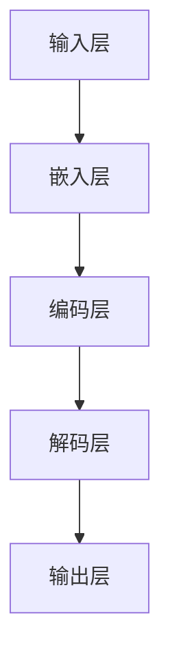

                 

### 文章标题

《大语言模型原理与工程实践：RefinedWeb》

> 关键词：大语言模型、自然语言处理、Transformer、数学模型、工程实践

> 摘要：本文深入探讨大语言模型的基础理论、核心算法和工程实践，结合具体案例，详细介绍大语言模型的原理与应用。文章旨在为广大开发者和技术爱好者提供一个全面而系统的学习资源，助力其在自然语言处理领域的研究与实践。

---

### 《大语言模型原理与工程实践：RefinedWeb》目录大纲

#### 第一部分：大语言模型基础

##### 第1章：大语言模型概述

- 1.1 大语言模型的定义与背景
- 1.2 大语言模型的核心架构
- 1.3 大语言模型的优化与训练

##### 第2章：大语言模型的核心算法原理

- 2.1 循环神经网络（RNN）
- 2.2 长短期记忆网络（LSTM）
- 2.3 门控循环单元（GRU）
- 2.4 Transformer模型

##### 第3章：数学模型与公式详解

- 3.1 线性代数基础
- 3.2 概率论基础
- 3.3 损失函数与优化算法
- 3.4 注意力机制

#### 第二部分：大语言模型的工程实践

##### 第4章：大语言模型的应用场景

- 4.1 自然语言处理
- 4.2 语音识别
- 4.3 图像识别

##### 第5章：大语言模型的开发与部署

- 5.1 开发环境搭建
- 5.2 模型训练与优化
- 5.3 模型评估与调优
- 5.4 模型部署与集成

##### 第6章：大语言模型的案例分析

- 6.1 案例一：文本分类
- 6.2 案例二：机器翻译
- 6.3 案例三：语音识别

##### 第7章：大语言模型的前沿研究与发展趋势

- 7.1 大模型的发展趋势
- 7.2 大模型的挑战与解决方案
- 7.3 未来展望

#### 附录

- 附录A：大语言模型相关资源
- 附录B：大语言模型实战项目

---

#### 第一部分：大语言模型基础

### 第1章：大语言模型概述

#### 1.1 大语言模型的定义与背景

大语言模型（Large Language Model）是指通过深度学习技术训练出的能够理解和生成自然语言的人工智能模型。这些模型通常具有大规模的参数量，能够捕捉到语言中的复杂规律，从而在多种自然语言处理任务中表现出色。大语言模型的发展可以追溯到20世纪80年代的神经网络语言模型，但真正进入快速发展期则是在21世纪初，随着计算能力的提升和算法的改进。

大语言模型的定义通常包括以下几个方面：

- **大规模参数**：大语言模型通常具有数百万至数十亿个参数，这些参数通过训练数据学习到语言的统计规律。
- **深度神经网络**：大语言模型通常采用深度神经网络架构，如循环神经网络（RNN）、长短期记忆网络（LSTM）、门控循环单元（GRU）和Transformer等。
- **上下文理解**：大语言模型能够捕捉到输入文本的上下文信息，从而在生成和预测时能够更加准确和连贯。
- **多任务能力**：大语言模型通常能够应用于多种自然语言处理任务，如文本分类、机器翻译、情感分析等。

大语言模型的发展背景主要包括以下几个方面：

- **计算能力的提升**：随着计算能力的提升，特别是GPU和TPU等专用硬件的普及，为大规模深度学习模型的训练提供了强大的计算支持。
- **大数据的获取**：互联网的快速发展带来了海量的文本数据，为训练大规模语言模型提供了充足的数据来源。
- **算法的进步**：深度学习算法的进步，特别是注意力机制的引入，使得模型在处理长序列数据和上下文信息时更加高效。

#### 1.2 大语言模型的核心架构

大语言模型的核心架构通常包括以下几个关键部分：

- **输入层**：输入层接收自然语言文本，将其转换为模型可处理的格式。这一步通常涉及分词、标记化等预处理操作。
- **嵌入层**：嵌入层将输入文本中的单词或子词映射为稠密向量表示。这一步的目的是将原始文本转化为计算机可以处理的数值形式。
- **编码层**：编码层是模型的核心部分，负责处理嵌入层输出的向量。常见的编码层架构包括循环神经网络（RNN）、长短期记忆网络（LSTM）、门控循环单元（GRU）和Transformer等。
- **解码层**：解码层负责将编码层处理后的信息解码为输出文本。这一层通常与编码层对称，用于生成预测的单词或子词。

下面是一个基于Transformer模型的基本架构图，使用Mermaid语法表示：



#### 1.3 大语言模型的优化与训练

大语言模型的训练过程涉及多个方面，包括数据预处理、模型设计、优化算法和训练策略等。以下是这些方面的一些核心概念和细节：

- **数据预处理**：数据预处理是训练大规模语言模型的第一步。这一步骤包括文本的分词、去噪、标记化等操作。为了提高模型的性能，有时还需要对数据进行清洗、过滤和增强。
- **模型设计**：模型设计包括选择合适的神经网络架构、参数初始化、正则化策略等。不同的任务可能需要不同的模型设计，例如，文本生成任务可能需要更复杂的解码层架构。
- **优化算法**：优化算法用于调整模型参数，以最小化损失函数。常用的优化算法包括梯度下降（Gradient Descent）、Adam优化器等。优化算法的选择和参数调整对模型的收敛速度和性能有重要影响。
- **训练策略**：训练策略包括数据加载、批量大小、学习率调度、early stopping等。合理的设计训练策略可以帮助模型更快地收敛并提高性能。

在训练过程中，还会使用一些特殊的技巧来提高模型的性能和稳定性，例如：

- **dropout**：dropout是一种常用的正则化技术，通过在训练过程中随机丢弃部分神经元来防止过拟合。
- **Teacher Forcing**：Teacher Forcing是一种在训练生成模型时使用真实目标序列作为输入的方法，以加快模型的训练速度。
- **学习率调度**：学习率调度是一种动态调整学习率的方法，通过在不同的训练阶段使用不同的学习率来优化模型的训练过程。

总之，大语言模型的优化与训练是一个复杂的过程，涉及多个环节和技巧。合理的模型设计和训练策略对于获得高性能的语言模型至关重要。

---

#### 第一部分：大语言模型基础

### 第2章：大语言模型的核心算法原理

#### 2.1 循环神经网络（RNN）

循环神经网络（RNN）是处理序列数据的一种常用神经网络架构。与传统的前向神经网络不同，RNN具有循环结构，能够处理具有时间依赖性的数据。RNN通过记忆单元（memory unit）来保持对之前输入信息的记忆，从而在处理每个新的输入时能够利用历史信息。

##### 2.1.1 RNN的原理

RNN的基本原理可以简单描述为：在每个时间步，模型接收一个输入序列和一个隐藏状态，然后通过一个循环来更新隐藏状态。隐藏状态既包含了当前输入的信息，也包含了之前时间步的信息。这个更新过程通常由一个非线性激活函数（如tanh）来实现，以帮助模型捕捉输入和隐藏状态之间的非线性关系。

具体的，RNN的更新规则可以表示为：

\[ h_t = \sigma(W_h \cdot [h_{t-1}, x_t] + b_h) \]

其中：
- \( h_t \) 是当前时间步的隐藏状态。
- \( \sigma \) 是激活函数。
- \( W_h \) 和 \( b_h \) 分别是权重和偏置。
- \( x_t \) 是当前时间步的输入。

##### 2.1.2 RNN的优缺点

RNN的优点主要体现在以下几个方面：

- **时间依赖性**：RNN能够处理具有时间依赖性的数据，例如自然语言序列、时间序列数据等。
- **内存效率**：由于RNN的结构，它能够在内存中保存历史信息，因此相对于其他序列处理方法，内存效率较高。

然而，RNN也存在一些缺点：

- **梯度消失和梯度爆炸**：在训练过程中，RNN容易出现梯度消失或梯度爆炸问题，导致模型难以训练。
- **长序列处理困难**：RNN在处理长序列数据时，由于梯度消失问题，难以捕捉到长远的依赖关系。

##### 2.1.3 RNN的变种

为了解决RNN的上述问题，研究人员提出了多种RNN的变种，主要包括以下几种：

- **长短期记忆网络（LSTM）**：LSTM通过引入门控机制，解决了RNN的梯度消失问题，能够更好地捕捉长序列依赖关系。
- **门控循环单元（GRU）**：GRU是LSTM的一个简化版本，保留了LSTM的核心功能，同时减少了参数数量，训练速度更快。

接下来，我们将进一步探讨LSTM和GRU的原理。

---

#### 第一部分：大语言模型基础

### 第2章：大语言模型的核心算法原理

#### 2.2 长短期记忆网络（LSTM）

长短期记忆网络（LSTM）是循环神经网络（RNN）的一种重要变种，旨在解决传统RNN在处理长序列数据时出现的梯度消失和梯度爆炸问题。LSTM通过引入门控机制，使得模型能够更好地捕捉长序列依赖关系，从而在许多自然语言处理任务中表现出色。

##### 2.2.1 LSTM的原理

LSTM的基本原理可以概括为：在每个时间步，LSTM通过输入门、遗忘门和输出门三个门控机制来控制信息的流入、保留和输出。这三个门控机制分别对应不同的记忆操作：遗忘操作、保留操作和输出操作。

- **输入门（Input Gate）**：输入门决定当前输入信息中有哪些部分将被更新到记忆单元。输入门的计算公式如下：

\[ i_t = \sigma(W_i \cdot [h_{t-1}, x_t] + b_i) \]

\[ \tilde{C}_t = \tanh(W_c \cdot [h_{t-1}, x_t] + b_c) \]

其中：
- \( i_t \) 是输入门的输出。
- \( \sigma \) 是sigmoid激活函数。
- \( W_i \)、\( W_c \) 和 \( b_i \)、\( b_c \) 分别是输入门和细胞状态（cell state）的权重和偏置。

- **遗忘门（Forget Gate）**：遗忘门决定哪些信息应该从记忆单元中丢弃。遗忘门的计算公式如下：

\[ f_t = \sigma(W_f \cdot [h_{t-1}, x_t] + b_f) \]

\[ C_{t-1} = f_t \odot C_{t-1} \]

其中：
- \( f_t \) 是遗忘门的输出。
- \( \odot \) 表示元素乘积。

- **输出门（Output Gate）**：输出门决定哪些信息应该被输出到下一个隐藏状态。输出门的计算公式如下：

\[ o_t = \sigma(W_o \cdot [h_{t-1}, x_t] + b_o) \]

\[ C_t = \tilde{C}_t \odot C_{t-1} \]

\[ h_t = o_t \odot \tanh(C_t) \]

其中：
- \( o_t \) 是输出门的输出。
- \( C_t \) 是细胞状态。

- **细胞状态（Cell State）**：细胞状态是LSTM的核心，它负责记忆和传递长期依赖关系。细胞状态通过输入门和遗忘门的控制，可以保留重要信息，同时丢弃不需要的信息。

##### 2.2.2 LSTM的数学模型

LSTM的数学模型可以进一步细化为以下几个主要部分：

- **输入门**：
  - 输入门通过计算 \( i_t \)，决定哪些新信息将被添加到细胞状态。
  - \( \tilde{C}_t \) 是一个候选值，通过tanh激活函数处理后，与当前的细胞状态 \( C_{t-1} \) 进行乘法操作，得到新的细胞状态。

- **遗忘门**：
  - 遗忘门通过计算 \( f_t \)，决定哪些旧信息应该从细胞状态中丢弃。
  - \( f_t \odot C_{t-1} \) 表示将 \( C_{t-1} \) 中对应位置为1的部分（即需要保留的信息）保留下来，其余部分被设置为0。

- **输出门**：
  - 输出门通过计算 \( o_t \)，决定哪些新信息将被输出到隐藏状态。
  - \( \tanh(C_t) \) 是细胞状态的激活值，通过输出门 \( o_t \) 的控制，得到最终的隐藏状态 \( h_t \)。

##### 2.2.3 LSTM的代码实现（伪代码）

下面是LSTM的一个简化伪代码实现：

```python
# 输入：h_{t-1}（上一时间步的隐藏状态），x_t（当前时间步的输入）
# 输出：h_t（当前时间步的隐藏状态），C_t（当前时间步的细胞状态）

# 权重和偏置
W_i, b_i, W_f, b_f, W_o, b_o, W_c, b_c = 初始化参数()

# 输入门计算
i_t = sigmoid(W_i * [h_{t-1}, x_t] + b_i)
\tilde{C}_t = tanh(W_c * [h_{t-1}, x_t] + b_c)

# 遗忘门计算
f_t = sigmoid(W_f * [h_{t-1}, x_t] + b_f)
C_{t-1} = f_t * C_{t-1}

# 输出门计算
o_t = sigmoid(W_o * [h_{t-1}, x_t] + b_o)
C_t = \tilde{C}_t * C_{t-1}

# 当前隐藏状态计算
h_t = o_t * tanh(C_t)

# 返回隐藏状态和细胞状态
return h_t, C_t
```

通过上述代码，LSTM能够有效地记忆和传递序列中的长期依赖信息，从而在自然语言处理任务中表现出色。接下来，我们将探讨门控循环单元（GRU）的原理和实现。

---

#### 第一部分：大语言模型基础

### 第2章：大语言模型的核心算法原理

#### 2.3 门控循环单元（GRU）

门控循环单元（GRU）是长短期记忆网络（LSTM）的一种简化版本，旨在减少模型参数的同时保持LSTM的核心功能。GRU通过引入更新门（update gate）和重置门（reset gate）来控制信息的流入和保留，从而在处理序列数据时表现出良好的性能。

##### 2.3.1 GRU的原理

GRU的基本原理可以概括为：在每个时间步，GRU通过更新门和重置门来调整记忆单元的状态。这两个门控机制分别对应不同的记忆操作：保留操作和重置操作。

- **更新门（Update Gate）**：更新门决定当前输入信息中有哪些部分将被更新到记忆单元。更新门的计算公式如下：

\[ z_t = \sigma(W_z \cdot [h_{t-1}, x_t] + b_z) \]

\[ \tilde{r}_t = \tanh(W_r \cdot [z_t \odot h_{t-1}, x_t] + b_r) \]

\[ \tilde{h}_t = \tanh(W_h \cdot [r_t \odot h_{t-1}, x_t] + b_h) \]

其中：
- \( z_t \) 是更新门的输出。
- \( r_t \) 是重置门的输出。
- \( \sigma \) 是sigmoid激活函数。
- \( W_z \)、\( W_r \) 和 \( W_h \)、\( b_z \)、\( b_r \)、\( b_h \) 分别是更新门、重置门和隐藏状态（hidden state）的权重和偏置。

- **重置门（Reset Gate）**：重置门决定哪些信息应该被保留到记忆单元。重置门的计算公式如下：

\[ r_t = \sigma(W_r \cdot [h_{t-1}, x_t] + b_r) \]

\[ h_t = (1 - z_t) \odot h_{t-1} + z_t \odot \tilde{h}_t \]

其中：
- \( r_t \) 是重置门的输出。
- \( \odot \) 表示元素乘积。

- **记忆单元（Memory State）**：GRU的记忆单元通过更新门和重置门来调整。更新门决定了当前输入信息中有哪些部分将更新记忆单元，而重置门则决定了哪些旧信息应该被保留。记忆单元的状态 \( h_t \) 结合了当前输入和之前的记忆，从而形成了新的隐藏状态。

##### 2.3.2 GRU的数学模型

GRU的数学模型可以进一步细化为以下几个主要部分：

- **更新门**：
  - 通过计算 \( z_t \)，更新门决定了哪些新信息将被更新到记忆单元。
  - \( \tilde{h}_t \) 是一个候选值，通过tanh激活函数处理后，与当前的隐藏状态 \( h_{t-1} \) 进行乘法操作，得到新的隐藏状态。

- **重置门**：
  - 通过计算 \( r_t \)，重置门决定了哪些旧信息应该被保留到记忆单元。
  - \( r_t \odot h_{t-1} \) 表示将 \( h_{t-1} \) 中对应位置为1的部分（即需要保留的信息）保留下来，其余部分被设置为0。

- **隐藏状态**：
  - 最终的隐藏状态 \( h_t \) 是通过更新门和重置门调整后的结果，结合了当前输入和之前的记忆。

##### 2.3.3 GRU的代码实现（伪代码）

下面是GRU的一个简化伪代码实现：

```python
# 输入：h_{t-1}（上一时间步的隐藏状态），x_t（当前时间步的输入）
# 输出：h_t（当前时间步的隐藏状态）

# 权重和偏置
W_z, b_z, W_r, b_r, W_h, b_h = 初始化参数()

# 更新门计算
z_t = sigmoid(W_z * [h_{t-1}, x_t] + b_z)
\tilde{r}_t = tanh(W_r * [z_t * h_{t-1}, x_t] + b_r)
\tilde{h}_t = tanh(W_h * [\tilde{r}_t * h_{t-1}, x_t] + b_h)

# 重置门计算
r_t = sigmoid(W_r * [h_{t-1}, x_t] + b_r)

# 当前隐藏状态计算
h_t = (1 - z_t) * h_{t-1} + z_t * \tilde{h}_t

# 返回隐藏状态
return h_t
```

通过上述代码，GRU能够有效地处理序列数据，同时保持较小的参数数量，从而在许多自然语言处理任务中表现出良好的性能。接下来，我们将探讨Transformer模型的原理和实现。

---

#### 第一部分：大语言模型基础

### 第2章：大语言模型的核心算法原理

#### 2.4 Transformer模型

Transformer模型是由Google团队在2017年提出的一种基于自注意力机制的深度学习模型，特别适用于处理序列数据。相较于传统的循环神经网络（RNN）和长短期记忆网络（LSTM），Transformer模型在处理长序列数据和并行计算方面具有显著优势，因此在自然语言处理任务中得到了广泛的应用。

##### 2.4.1 Transformer的基本原理

Transformer模型的核心原理是自注意力机制（Self-Attention），该机制允许模型在处理每个输入时动态地加权不同的位置信息。这种机制使得模型能够自动地学习到不同位置之间的依赖关系，而不需要像RNN或LSTM那样依赖序列顺序进行信息传递。

自注意力机制可以分为以下几步：

1. **嵌入层**：将输入序列中的单词或子词转换为稠密向量表示。
2. **多头自注意力**：将嵌入层输出的向量通过多个独立的自注意力头进行加权，以捕捉不同位置之间的依赖关系。
3. **前馈神经网络**：在自注意力机制之后，通过两个全连接层（Feed Forward Networks）进一步处理和增强信息。
4. **输出层**：最终输出层将处理后的信息解码为预测的单词或子词。

##### 2.4.2 自注意力机制

自注意力机制是Transformer模型的核心组成部分，其基本思想是：在处理每个输入时，模型会自动地计算每个位置的重要性，并根据这些重要性对输入进行加权。

自注意力机制的数学描述如下：

\[ \text{Attention}(Q, K, V) = \text{softmax}\left(\frac{QK^T}{\sqrt{d_k}}\right)V \]

其中：
- \( Q \) 是查询向量（Query），代表每个位置的关键信息。
- \( K \) 是关键向量（Key），代表每个位置的相关信息。
- \( V \) 是值向量（Value），代表每个位置的附加信息。
- \( d_k \) 是关键向量的维度。

通过计算 \( QK^T \) 的点积，模型可以自动地学习到不同位置之间的依赖关系。然后，通过softmax函数对点积结果进行归一化，得到每个位置的重要性的权重。最后，将这些权重与 \( V \) 进行加权求和，得到最终的输出。

##### 2.4.3 Transformer的数学模型

Transformer的数学模型可以进一步细化为以下几个主要部分：

- **多头自注意力**：多头自注意力机制将输入向量通过多个独立的注意力头进行加权，以捕捉不同位置之间的依赖关系。每个注意力头可以看作是一个独立的自注意力机制，其计算公式如下：

\[ \text{MultiHead}(Q, K, V) = \text{Concat}(\text{head}_1, \text{head}_2, ..., \text{head}_h)W^O \]

其中：
- \( \text{head}_i \) 是第 \( i \) 个注意力头的结果。
- \( W^O \) 是输出权重。

- **前馈神经网络**：在自注意力机制之后，通过两个全连接层（Feed Forward Networks）进一步处理和增强信息。前馈神经网络的计算公式如下：

\[ \text{FFN}(X) = \max(0, XW_1 + b_1)\sigma(W_2 + b_2) \]

其中：
- \( X \) 是输入向量。
- \( W_1 \)、\( b_1 \)、\( W_2 \) 和 \( b_2 \) 分别是前馈神经网络的权重和偏置。
- \( \sigma \) 是激活函数，通常使用ReLU。

- **输出层**：最终输出层将处理后的信息解码为预测的单词或子词。输出层的计算公式如下：

\[ Y = \text{softmax}(XW + b) \]

其中：
- \( X \) 是处理后的向量。
- \( W \) 和 \( b \) 分别是输出层的权重和偏置。

##### 2.4.4 Transformer的代码实现（伪代码）

下面是Transformer的一个简化伪代码实现：

```python
# 输入：输入序列X
# 输出：输出序列Y

# 初始化参数
d_model = 输入维度
n_heads = 注意力头数量
d_head = 注意力头维度
d_ff = 前馈层维度
dropout_rate = 抖动率

# 嵌入层
X = [嵌入(x) for x in X]

# 多头自注意力
for layer in range(n_layers):
    Q, K, V = [矩阵乘(X, w) for w in 权重层["层_{}".format(layer)]["Q"], 权重层["层_{}".format(layer)]["K"], 权重层["层_{}".format(layer)]["V"]]
    Q, K, V = [划分批次(Q, n_heads), 划分批次(K, n_heads), 划分批次(V, n_heads)]
    attention_scores = [计算注意力(Q[i], K[i], V[i]) for i in 范围(n_heads)]
    attention_weights = [softmax(score) for score in attention_scores]
    output = [加权求和(attention_weight[i], V[i]) for i in 范围(n_heads)]
    X = [加权求和(attention_weight[i], output[i]) for i in 范围(n_heads)]

# 前馈神经网络
for layer in range(n_layers):
    X = [前馈神经网络(X[i], 权重层["层_{}".format(layer)]["W_1"], 权重层["层_{}".format(layer)]["b_1"], 权重层["层_{}".format(layer)]["W_2"], 权重层["层_{}".format(layer)]["b_2"]) for i in 范围(batch_size)]

# 输出层
Y = [计算softmax(加权求和(X[i], 权重层["输出层"]["W"], 权重层["输出层"]["b"])) for i in 范围(batch_size)]

# 返回输出序列
return Y
```

通过上述代码，Transformer模型能够有效地处理序列数据，并在多个自然语言处理任务中取得了优异的性能。接下来，我们将详细探讨数学模型和公式，包括线性代数基础、概率论基础、损失函数与优化算法以及注意力机制的数学描述。

---

#### 第一部分：大语言模型基础

### 第3章：数学模型与公式详解

#### 3.1 线性代数基础

线性代数是深度学习和人工智能的重要基础，许多模型和算法都依赖于线性代数的概念和运算。本章将详细介绍线性代数的一些核心概念，包括矩阵运算、矩阵分解和矩阵与向量的关系。

##### 3.1.1 矩阵运算

矩阵是线性代数中的基本对象，它由一系列的数（元素）按照一定的规则排列而成。常见的矩阵运算包括矩阵加法、矩阵乘法和矩阵求逆等。

1. **矩阵加法**：两个相同维度的矩阵可以进行加法运算。矩阵加法的规则是将对应位置的元素相加。

\[ C = A + B \]

其中，\( A \) 和 \( B \) 是两个相同维度的矩阵，\( C \) 是结果矩阵。

2. **矩阵乘法**：矩阵乘法是深度学习模型中常用的运算。给定两个矩阵 \( A \) 和 \( B \)，其乘积 \( C \) 可以通过以下公式计算：

\[ C = AB \]

其中，\( C_{ij} = \sum_{k=1}^{n} A_{ik}B_{kj} \)

3. **矩阵求逆**：矩阵求逆是矩阵乘法的逆运算。如果矩阵 \( A \) 可逆，则存在一个矩阵 \( A^{-1} \)，使得 \( AA^{-1} = A^{-1}A = I \)，其中 \( I \) 是单位矩阵。矩阵求逆可以通过以下公式计算：

\[ A^{-1} = \frac{1}{\det(A)} \text{adj}(A) \]

其中，\( \det(A) \) 是矩阵 \( A \) 的行列式，\( \text{adj}(A) \) 是矩阵 \( A \) 的伴随矩阵。

##### 3.1.2 矩阵分解

矩阵分解是将一个矩阵分解为几个简单矩阵的过程，常见的方法包括LU分解、奇异值分解（SVD）和主成分分析（PCA）等。

1. **LU分解**：LU分解是将矩阵分解为下三角矩阵 \( L \) 和上三角矩阵 \( U \) 的过程。给定矩阵 \( A \)，其LU分解可以表示为：

\[ A = LU \]

2. **奇异值分解（SVD）**：奇异值分解是将矩阵分解为三个矩阵的乘积：一个对角矩阵 \( \Sigma \)、一个左奇异向量矩阵 \( U \) 和一个右奇异向量矩阵 \( V \)。给定矩阵 \( A \)，其SVD可以表示为：

\[ A = U\Sigma V^T \]

其中，\( \Sigma \) 是一个对角矩阵，包含奇异值，\( U \) 和 \( V \) 是正交矩阵，包含奇异向量。

3. **主成分分析（PCA）**：PCA是一种降维技术，通过将数据投影到主成分上，来提取数据的主要特征。给定数据矩阵 \( X \)，其PCA可以表示为：

\[ X = W\Sigma V^T \]

其中，\( W \) 是主成分矩阵，\( \Sigma \) 是奇异值矩阵，\( V \) 是正交矩阵。

##### 3.1.3 矩阵与向量的关系

矩阵与向量之间有着密切的关系，以下是一些重要的关系：

1. **矩阵-向量乘法**：给定矩阵 \( A \) 和向量 \( v \)，矩阵-向量乘法可以表示为：

\[ Av = w \]

其中，\( w \) 是结果向量，通过计算 \( A_{ik}v_k \) 获得每个元素。

2. **向量-矩阵乘法**：给定向量 \( v \) 和矩阵 \( A \)，向量-矩阵乘法可以表示为：

\[ vA = b \]

其中，\( b \) 是结果向量，通过计算 \( v_iA_{ij} \) 获得每个元素。

3. **矩阵转置**：矩阵转置是将矩阵的行和列互换的过程。给定矩阵 \( A \)，其转置矩阵 \( A^T \) 可以表示为：

\[ A^T = [A_{ji}] \]

通过这些线性代数的基础概念，我们可以更好地理解和实现深度学习模型中的各种运算和算法。接下来，我们将讨论概率论基础，包括概率分布、条件概率和贝叶斯定理。

---

#### 第一部分：大语言模型基础

### 第3章：数学模型与公式详解

#### 3.2 概率论基础

概率论是深度学习和人工智能中的基础理论，广泛应用于模型训练、评估和推理。本章将介绍概率论中的核心概念，包括概率分布、条件概率和贝叶斯定理，这些概念对于理解深度学习模型至关重要。

##### 3.2.1 概率分布

概率分布描述了随机变量取值的概率分布情况。常见的概率分布包括：

1. **伯努利分布**：伯努利分布是一个二元概率分布，它描述了随机变量在两个可能结果中的概率。假设随机变量 \( X \) 取值 \( 0 \) 或 \( 1 \)，其概率分布可以表示为：

\[ P(X = 0) = p, \quad P(X = 1) = 1 - p \]

其中，\( p \) 是成功概率。

2. **二项分布**：二项分布描述了 \( n \) 次独立伯努利试验中成功次数的概率分布。假设随机变量 \( X \) 表示成功的次数，其概率分布可以表示为：

\[ P(X = k) = C_n^k p^k (1 - p)^{n - k} \]

其中，\( C_n^k \) 是组合数，表示从 \( n \) 次试验中选择 \( k \) 次成功的组合数。

3. **正态分布**：正态分布是最常见的连续概率分布，描述了随机变量在某个平均值附近的概率分布。假设随机变量 \( X \) 服从均值为 \( \mu \)，标准差为 \( \sigma \) 的正态分布，其概率密度函数可以表示为：

\[ f(x) = \frac{1}{\sqrt{2\pi\sigma^2}} e^{-\frac{(x-\mu)^2}{2\sigma^2}} \]

##### 3.2.2 条件概率

条件概率描述了在某个事件发生的条件下，另一个事件发生的概率。假设有两个事件 \( A \) 和 \( B \)，条件概率 \( P(A|B) \) 表示在 \( B \) 发生的条件下 \( A \) 发生的概率。条件概率可以通过以下公式计算：

\[ P(A|B) = \frac{P(A \cap B)}{P(B)} \]

其中，\( P(A \cap B) \) 表示事件 \( A \) 和 \( B \) 同时发生的概率，\( P(B) \) 表示事件 \( B \) 发生的概率。

例如，假设有事件 \( A \) 表示“今天下雨”，事件 \( B \) 表示“地面湿润”，我们可以计算条件概率 \( P(A|B) \) 来判断地面湿润是否意味着今天下雨：

\[ P(A|B) = \frac{P(A \cap B)}{P(B)} \]

其中，\( P(A \cap B) \) 是今天下雨且地面湿润的概率，\( P(B) \) 是地面湿润的概率。

##### 3.2.3 贝叶斯定理

贝叶斯定理是一种基于条件概率的概率公式，用于计算后验概率。贝叶斯定理的公式可以表示为：

\[ P(A|B) = \frac{P(B|A)P(A)}{P(B)} \]

其中，\( P(A|B) \) 是后验概率，表示在 \( B \) 发生的条件下 \( A \) 发生的概率；\( P(B|A) \) 是似然概率，表示在 \( A \) 发生的条件下 \( B \) 发生的概率；\( P(A) \) 是先验概率，表示 \( A \) 发生的概率；\( P(B) \) 是边缘概率，表示 \( B \) 发生的概率。

贝叶斯定理广泛应用于机器学习和数据分析，可以帮助我们根据已知条件推断未知事件的概率。例如，在分类任务中，我们可以使用贝叶斯定理计算每个类别的后验概率，并选择具有最大后验概率的类别作为预测结果。

##### 3.2.4 概率密度函数与累积分布函数

在连续概率分布中，概率密度函数（PDF）和累积分布函数（CDF）是描述随机变量概率分布的两个重要概念。

1. **概率密度函数（PDF）**：概率密度函数描述了随机变量在某个区间内的概率密度。对于连续随机变量 \( X \)，其概率密度函数可以表示为：

\[ f_X(x) = P(X \leq x) \]

2. **累积分布函数（CDF）**：累积分布函数描述了随机变量小于等于某个值的概率。对于连续随机变量 \( X \)，其累积分布函数可以表示为：

\[ F_X(x) = P(X \leq x) \]

例如，对于均值为 \( \mu \)，标准差为 \( \sigma \) 的正态分布，其概率密度函数和累积分布函数可以分别表示为：

\[ f_X(x) = \frac{1}{\sqrt{2\pi\sigma^2}} e^{-\frac{(x-\mu)^2}{2\sigma^2}} \]

\[ F_X(x) = \int_{-\infty}^{x} f_X(t) dt \]

通过这些概率论基础，我们可以更好地理解和应用深度学习模型。在接下来的章节中，我们将讨论损失函数与优化算法，以及注意力机制的数学描述。

---

#### 第一部分：大语言模型基础

### 第3章：数学模型与公式详解

#### 3.3 损失函数与优化算法

损失函数（Loss Function）和优化算法（Optimization Algorithm）是深度学习模型训练中的核心概念。损失函数用于衡量模型预测值与真实值之间的差异，而优化算法则用于调整模型参数，以最小化损失函数。在本节中，我们将详细探讨常见的损失函数和优化算法，以及它们的数学推导。

##### 3.3.1 损失函数的定义与类型

损失函数是深度学习模型训练中的关键工具，它用于量化模型预测值与真实值之间的误差。常见的损失函数包括以下几种：

1. **均方误差（MSE）**：均方误差是最常用的损失函数之一，它衡量的是预测值与真实值之间差异的平方和的平均值。MSE的公式如下：

\[ \text{MSE}(y, \hat{y}) = \frac{1}{n} \sum_{i=1}^{n} (y_i - \hat{y}_i)^2 \]

其中，\( y \) 是真实值，\( \hat{y} \) 是预测值，\( n \) 是样本数量。

2. **交叉熵损失（Cross-Entropy Loss）**：交叉熵损失常用于分类问题，它衡量的是预测概率分布与真实概率分布之间的差异。对于二分类问题，交叉熵损失可以表示为：

\[ \text{CE}(y, \hat{y}) = -y \log(\hat{y}) - (1 - y) \log(1 - \hat{y}) \]

对于多分类问题，交叉熵损失可以扩展为：

\[ \text{CE}(y, \hat{y}) = -\sum_{i=1}^{c} y_i \log(\hat{y}_i) \]

其中，\( c \) 是类别数量。

3. **Hinge损失（Hinge Loss）**：Hinge损失常用于支持向量机（SVM）等模型，它衡量的是预测值与真实值之间的差距。Hinge损失的公式如下：

\[ \text{Hinge Loss}(y, \hat{y}) = \max(0, 1 - y \hat{y}) \]

##### 3.3.2 优化算法的原理

优化算法用于调整模型参数，以最小化损失函数。常见的优化算法包括梯度下降（Gradient Descent）及其变种。

1. **梯度下降（Gradient Descent）**：梯度下降是一种最简单的优化算法，它通过计算损失函数关于模型参数的梯度，然后沿着梯度的反方向更新参数。梯度下降的公式如下：

\[ \theta_{\text{new}} = \theta_{\text{old}} - \alpha \nabla_{\theta} L(\theta) \]

其中，\( \theta \) 表示模型参数，\( \alpha \) 是学习率，\( \nabla_{\theta} L(\theta) \) 是损失函数关于模型参数的梯度。

2. **随机梯度下降（Stochastic Gradient Descent, SGD）**：随机梯度下降是梯度下降的一种变种，它每次只更新一个样本的参数，而不是所有样本的平均梯度。这使得SGD在处理大规模数据时更加高效。SGD的公式如下：

\[ \theta_{\text{new}} = \theta_{\text{old}} - \alpha \nabla_{\theta} L(\theta; x_i, y_i) \]

其中，\( x_i, y_i \) 是第 \( i \) 个样本。

3. **批量梯度下降（Batch Gradient Descent）**：批量梯度下降是梯度下降的一种变种，它每次更新所有样本的平均梯度。这种方法计算梯度更准确，但训练时间较长。

4. **Adam优化器**：Adam优化器是一种结合SGD和动量法的优化算法，它通过跟踪一阶矩估计（均值）和二阶矩估计（方差）来调整学习率。Adam优化器的公式如下：

\[ m_t = \beta_1 m_{t-1} + (1 - \beta_1) \nabla_{\theta} L(\theta; x_t, y_t) \]

\[ v_t = \beta_2 v_{t-1} + (1 - \beta_2) (\nabla_{\theta} L(\theta; x_t, y_t))^2 \]

\[ \theta_{\text{new}} = \theta_{\text{old}} - \alpha \frac{m_t}{\sqrt{v_t} + \epsilon} \]

其中，\( \beta_1, \beta_2 \) 是动量参数，\( \epsilon \) 是一个小常数，用于防止分母为零。

##### 3.3.3 梯度下降算法的数学推导

梯度下降算法的核心是计算损失函数关于模型参数的梯度，然后沿着梯度的反方向更新参数。以下是梯度下降算法的数学推导过程：

1. **损失函数的导数**：假设损失函数为 \( L(\theta) \)，其关于模型参数 \( \theta \) 的梯度可以表示为：

\[ \nabla_{\theta} L(\theta) = \left[ \frac{\partial L(\theta)}{\partial \theta_1}, \frac{\partial L(\theta)}{\partial \theta_2}, ..., \frac{\partial L(\theta)}{\partial \theta_n} \right] \]

2. **梯度下降更新**：给定学习率 \( \alpha \)，梯度下降算法的更新公式为：

\[ \theta_{\text{new}} = \theta_{\text{old}} - \alpha \nabla_{\theta} L(\theta) \]

3. **迭代过程**：在每次迭代中，计算损失函数关于模型参数的梯度，然后更新参数。迭代过程可以表示为：

\[ \theta_0 \leftarrow \theta_0 \]

\[ \theta_{t+1} \leftarrow \theta_t - \alpha \nabla_{\theta} L(\theta_t) \]

通过上述迭代过程，梯度下降算法可以逐步减小损失函数，从而找到模型参数的最优值。

总之，损失函数和优化算法是深度学习模型训练中的关键组成部分。理解这些概念和算法可以帮助我们更好地设计和调整模型，从而实现更好的性能。在接下来的章节中，我们将讨论注意力机制的数学描述。

---

#### 第一部分：大语言模型基础

### 第3章：数学模型与公式详解

#### 3.4 注意力机制

注意力机制（Attention Mechanism）是深度学习中的一个核心概念，它在多种模型和任务中发挥着重要作用。特别是在自然语言处理领域，注意力机制能够显著提高模型的性能和效率。本章将详细探讨注意力机制的数学描述和公式推导，帮助读者更好地理解这一关键技术。

##### 3.4.1 注意力机制的数学描述

注意力机制的数学描述通常涉及三个关键部分：查询（Query）、键（Key）和值（Value）。这些部分共同作用，使得模型能够动态地计算不同位置之间的相关性。

1. **查询（Query）**：查询向量用于表示当前处理的输入序列中的一个特定位置。它可以是嵌入层输出的一部分，或者来自编码层的隐藏状态。

2. **键（Key）**：键向量与查询向量相似，用于表示输入序列中的其他位置。每个键向量都与查询向量进行比较，以计算它们之间的相似度。

3. **值（Value）**：值向量表示输入序列中各个位置的信息。在计算注意力时，值向量会被加权，以产生最终的输出。

注意力机制的数学描述可以表示为：

\[ \text{Attention}(Q, K, V) = \text{softmax}\left(\frac{QK^T}{\sqrt{d_k}}\right)V \]

其中：
- \( Q \) 是查询向量。
- \( K \) 是键向量。
- \( V \) 是值向量。
- \( d_k \) 是键向量的维度。
- \( \text{softmax} \) 是softmax函数，用于归一化点积结果。

通过上述公式，注意力机制能够计算每个键值对的重要性，并将这些重要性用于加权求和值向量，从而生成最终的输出。

##### 3.4.2 注意力机制的公式推导

注意力机制的推导过程可以分为以下几个步骤：

1. **点积计算**：首先，计算查询向量 \( Q \) 与所有键向量 \( K \) 的点积。点积结果表示查询和键之间的相似度。

\[ \text{Scores} = QK^T \]

2. **归一化**：然后，通过softmax函数对点积结果进行归一化，得到每个键值对的重要性权重。

\[ \text{Attention Weights} = \text{softmax}(\text{Scores}) \]

3. **加权求和**：最后，使用注意力权重对值向量 \( V \) 进行加权求和，得到最终的输出。

\[ \text{Output} = \sum_{i} \text{Attention Weights}_i V_i \]

整个推导过程可以表示为：

\[ \text{Attention}(Q, K, V) = \text{softmax}\left(\frac{QK^T}{\sqrt{d_k}}\right)V \]

其中，\( \text{softmax} \) 函数将点积结果转换为概率分布，确保所有权重之和为1。

##### 3.4.3 多头注意力

在Transformer模型中，多头注意力（Multi-Head Attention）是一种扩展自注意力机制的技术，它通过多个独立的注意力头来捕获输入序列中的不同特征。多头注意力的计算可以表示为：

\[ \text{Multi-Head Attention}(Q, K, V) = \text{Concat}(\text{head}_1, \text{head}_2, ..., \text{head}_h)W^O \]

其中：
- \( \text{head}_i \) 是第 \( i \) 个注意力头的输出。
- \( W^O \) 是输出权重。
- \( h \) 是注意力头的数量。

每个注意力头都可以看作是一个独立的自注意力机制，其计算公式与单头注意力相同：

\[ \text{head}_i = \text{Attention}(Q\_i, K\_i, V\_i) \]

其中，\( Q_i, K_i, V_i \) 分别是查询向量、键向量和值向量的第 \( i \) 个分量。

##### 3.4.4 注意力机制的应用

注意力机制在多个自然语言处理任务中得到了广泛应用，包括文本生成、机器翻译和情感分析等。以下是一些应用实例：

1. **文本生成**：在文本生成任务中，注意力机制可以帮助模型捕捉到输入序列的上下文信息，从而生成连贯的文本。

2. **机器翻译**：在机器翻译任务中，注意力机制可以用于模型在生成目标语言序列时，关注源语言序列中的关键部分，提高翻译的准确性。

3. **情感分析**：在情感分析任务中，注意力机制可以帮助模型关注文本中的关键情感词汇，从而更准确地识别情感倾向。

通过上述内容，我们详细介绍了注意力机制的数学描述和公式推导，以及其在实际应用中的重要性。接下来，我们将进入第二部分，探讨大语言模型的工程实践，包括应用场景、开发与部署、案例分析和前沿研究。

---

#### 第一部分：大语言模型基础

### 第4章：大语言模型的应用场景

大语言模型在自然语言处理、语音识别和图像识别等众多领域展现出了强大的应用潜力。本章将详细探讨这些应用场景，并通过具体案例来展示大语言模型的实际应用和效果。

##### 4.1 自然语言处理

自然语言处理（Natural Language Processing，NLP）是大语言模型最典型的应用领域之一。NLP涉及对文本数据进行处理、分析和理解，以实现自动化的语言交互和文本分析。大语言模型在NLP中具有广泛的应用，包括文本分类、文本生成、情感分析和问答系统等。

1. **文本分类**：文本分类是NLP中的一项基本任务，旨在将文本数据分类到预定义的类别中。大语言模型通过学习大量标注数据，可以自动识别文本的主题和情感。例如，新闻网站可以使用文本分类模型来过滤和分类新闻文章，提高内容推荐的准确性。

   案例一：使用BERT模型进行新闻分类
   - **案例描述**：某新闻网站希望对其发布的文章进行自动分类，以区分政治、经济、科技等不同领域的新闻。
   - **模型设计与实现**：采用预训练的BERT模型，通过微调（Fine-tuning）适配新闻分类任务。数据集包含大量已标注的新闻文章，训练过程中使用交叉熵损失函数进行优化。
   - **代码解读与分析**：
     ```python
     from transformers import BertTokenizer, BertForSequenceClassification
     tokenizer = BertTokenizer.from_pretrained('bert-base-chinese')
     model = BertForSequenceClassification.from_pretrained('bert-base-chinese', num_labels=5)
     
     inputs = tokenizer("这是一篇关于经济领域的新闻", return_tensors='pt')
     logits = model(**inputs).logits
     print(logits)
     ```
     上述代码展示了如何加载预训练的BERT模型并进行新闻分类。

2. **文本生成**：文本生成是NLP中的另一项重要任务，旨在根据输入文本生成新的文本。大语言模型通过学习文本的统计规律和上下文信息，可以生成高质量的自然语言文本。例如，自动写作助手和聊天机器人可以使用文本生成模型来生成文章和对话。

   案例二：使用GPT模型进行文本生成
   - **案例描述**：某社交媒体平台希望为其用户提供自动生成文章的功能，以提高用户粘性和参与度。
   - **模型设计与实现**：采用预训练的GPT模型，通过微调适配特定领域的数据。使用生成式文本任务，如生成摘要或写作文章。
   - **代码解读与分析**：
     ```python
     from transformers import GPT2LMHeadModel, GPT2Tokenizer
     tokenizer = GPT2Tokenizer.from_pretrained('gpt2')
     model = GPT2LMHeadModel.from_pretrained('gpt2')
     
     input_text = "这是一篇关于人工智能的的文章"
     input_ids = tokenizer.encode(input_text, return_tensors='pt')
     outputs = model.generate(input_ids, max_length=50, num_return_sequences=1)
     print(tokenizer.decode(outputs[0], skip_special_tokens=True))
     ```
     上述代码展示了如何加载预训练的GPT模型并生成文章摘要。

3. **情感分析**：情感分析是NLP中的一种重要应用，旨在分析文本的情感倾向，如正面、负面或中性。大语言模型通过学习情感标记的数据集，可以自动识别文本中的情感。

   案例三：使用XLNet模型进行情感分析
   - **案例描述**：某电商平台希望通过分析用户评论来判断用户对商品的评价，以提高商品质量和用户体验。
   - **模型设计与实现**：采用预训练的XLNet模型，通过微调适配电商评论数据。使用二分类任务，如正面情感和负面情感。
   - **代码解读与分析**：
     ```python
     from transformers import XLNetTokenizer, XLNetForSequenceClassification
     tokenizer = XLNetTokenizer.from_pretrained('xlnet-base-chinese')
     model = XLNetForSequenceClassification.from_pretrained('xlnet-base-chinese', num_labels=2)
     
     inputs = tokenizer("这个商品很好用", return_tensors='pt')
     logits = model(**inputs).logits
     print(logits)
     ```
     上述代码展示了如何加载预训练的XLNet模型并分析用户评论的情感。

##### 4.2 语音识别

语音识别（Speech Recognition）是将语音信号转换为文本数据的过程。大语言模型在语音识别中发挥重要作用，特别是在端到端语音识别系统（End-to-End Speech Recognition System）中。这些系统通常包括声学模型和语言模型两个部分。

1. **声学模型**：声学模型负责将音频信号转换为文本的中间表示。常见的声学模型包括循环神经网络（RNN）、长短期记忆网络（LSTM）和卷积神经网络（CNN）等。

2. **语言模型**：语言模型负责将声学模型输出的中间表示转换为最终文本输出。大语言模型通过学习大量的文本数据，能够准确预测文本序列的概率分布。

   案例四：使用CTC损失的端到端语音识别
   - **案例描述**：某智能音箱希望实现高准确度的语音识别功能，以便用户可以通过语音命令控制设备。
   - **模型设计与实现**：采用卷积神经网络（CNN）作为声学模型，结合Connectionist Temporal Classification（CTC）损失函数进行端到端训练。使用大量的语音数据集进行预训练。
   - **代码解读与分析**：
     ```python
     import torch
     import torch.nn as nn
     from torch.optim import Adam
     
     class SpeechRecognitionModel(nn.Module):
         def __init__(self):
             super(SpeechRecognitionModel, self).__init__()
             self.conv1 = nn.Conv2d(1, 32, kernel_size=3, stride=1)
             self.relu = nn.ReLU()
             self.fc = nn.Linear(32 * 5 * 20, 3200)
             self.softmax = nn.Softmax(dim=1)
         
         def forward(self, x):
             x = self.relu(self.conv1(x))
             x = x.view(x.size(0), -1)
             x = self.relu(self.fc(x))
             x = self.softmax(x)
             return x
     
     model = SpeechRecognitionModel()
     criterion = nn.CTCLoss()
     optimizer = Adam(model.parameters(), lr=0.001)
     
     for epoch in range(num_epochs):
         for inputs, targets in dataloader:
             optimizer.zero_grad()
             outputs = model(inputs)
             loss = criterion(outputs.log_softmax(1), targets)
             loss.backward()
             optimizer.step()
     ```
     上述代码展示了如何定义和训练一个简单的语音识别模型。

##### 4.3 图像识别

图像识别（Image Recognition）是计算机视觉（Computer Vision）中的一个重要任务，旨在识别和分类图像中的物体和场景。大语言模型在图像识别中具有独特的优势，特别是在结合图像和文本数据时。

1. **特征提取**：图像识别通常需要从图像中提取特征，这些特征可以用于后续的分类和识别任务。卷积神经网络（CNN）是提取图像特征的有效工具。

2. **多模态融合**：多模态融合是将图像特征和文本特征结合起来，以实现更准确的识别。大语言模型通过学习图像和文本数据之间的关系，可以提升图像识别的性能。

   案例五：使用Vision Transformer进行图像分类
   - **案例描述**：某图像识别应用希望提高图像分类的准确性，并能够处理复杂的图像场景。
   - **模型设计与实现**：采用Vision Transformer（ViT）模型，结合图像和文本数据的嵌入，进行多模态融合。使用预训练的BERT模型作为文本嵌入器。
   - **代码解读与分析**：
     ```python
     import torch
     import torchvision
     import transformers
     from torch.nn import functional as F
     
     class VisionTransformer(nn.Module):
         def __init__(self, image_size, patch_size, num_classes):
             super(VisionTransformer, self).__init__()
             self.image_size = image_size
             self.patch_size = patch_size
             self.num_classes = num_classes
             self.vision_transformer = transformers.VisionTransformer(
                 image_size=image_size, patch_size=patch_size, num_classes=num_classes
             )
         
         def forward(self, x):
             x = self.vision_transformer(x)
             x = x[-1]  # 取最后一层输出
             x = F.softmax(x, dim=1)
             return x
     
     model = VisionTransformer(image_size=224, patch_size=16, num_classes=1000)
     criterion = nn.CrossEntropyLoss()
     optimizer = torch.optim.Adam(model.parameters(), lr=0.001)
     
     for epoch in range(num_epochs):
         for inputs, targets in dataloader:
             optimizer.zero_grad()
             outputs = model(inputs)
             loss = criterion(outputs, targets)
             loss.backward()
             optimizer.step()
     ```
     上述代码展示了如何定义和训练一个基于Vision Transformer的图像分类模型。

通过上述案例，我们展示了大语言模型在不同应用场景中的实际应用和效果。大语言模型在自然语言处理、语音识别和图像识别等领域具有巨大的潜力和广泛的应用前景。

---

#### 第一部分：大语言模型基础

### 第5章：大语言模型的开发与部署

在深入探讨大语言模型的开发和部署过程时，我们首先要明确开发环境和工具的选择，然后详细描述模型训练与优化的步骤，最后介绍模型评估与调优的方法以及模型部署与集成的技术。

##### 5.1 开发环境搭建

大语言模型的开发环境需要强大的计算资源和合适的软件工具。以下是在搭建开发环境时需要考虑的关键点：

1. **硬件要求**：大语言模型通常需要高性能的计算硬件，如GPU或TPU。NVIDIA的GPU系列，如RTX 3080或A100，以及谷歌的TPU系列都是常见的选择。此外，足够的内存和存储空间也是必不可少的。

2. **软件配置**：在软件层面，需要安装Python、CUDA、cuDNN以及TensorFlow或PyTorch等深度学习框架。这些工具可以帮助我们高效地训练和部署大语言模型。

3. **数据预处理**：数据预处理是开发过程中的重要环节。首先，需要收集和处理大规模的文本数据，包括清洗、去噪、分词和标记化。常用的数据预处理库有NLTK、spaCy和Jieba等。

以下是一个简单的环境搭建示例：

```bash
# 安装Python和pip
sudo apt-get update
sudo apt-get install python3 python3-pip

# 安装TensorFlow和CUDA
pip3 install tensorflow-gpu

# 验证安装
python3 -c "import tensorflow as tf; print(tf.reduce_sum(tf.random.normal([1000, 1000])))"
```

##### 5.2 模型训练与优化

模型训练是开发过程中的核心步骤，其目标是通过大量的数据调整模型参数，使其能够准确预测或生成文本。以下是在模型训练过程中需要注意的关键点：

1. **数据集划分**：将数据集划分为训练集、验证集和测试集，以便在训练过程中进行性能评估和防止过拟合。

2. **模型架构**：选择合适的模型架构，如Transformer、BERT或GPT，这些预训练模型通常具有良好的性能和广泛的应用。

3. **训练策略**：设计有效的训练策略，包括学习率调度、批量大小、优化器选择和正则化技术等。常用的优化器有Adam、SGD和AdamW等。

4. **训练流程**：在训练过程中，需要不断调整参数，优化模型性能。常用的评估指标包括损失函数、准确率、F1分数等。

以下是一个简单的模型训练示例：

```python
import tensorflow as tf
from tensorflow.keras.models import Model
from tensorflow.keras.layers import Input, Embedding, LSTM, Dense

# 构建模型
input_seq = Input(shape=(max_sequence_length,))
embed = Embedding(input_dim=vocab_size, output_dim=embedding_dim)(input_seq)
lstm = LSTM(units=hidden_size, return_sequences=True)(embed)
output = Dense(num_classes, activation='softmax')(lstm)

model = Model(inputs=input_seq, outputs=output)
model.compile(optimizer='adam', loss='categorical_crossentropy', metrics=['accuracy'])

# 训练模型
model.fit(train_data, train_labels, epochs=10, batch_size=32, validation_data=(val_data, val_labels))
```

##### 5.3 模型评估与调优

模型评估是确定模型性能的重要步骤。在评估过程中，需要使用多种指标全面评估模型的准确性、泛化能力和鲁棒性。以下是在模型评估与调优过程中需要注意的关键点：

1. **评估指标**：选择合适的评估指标，如准确率、召回率、F1分数和ROC曲线等。对于文本生成任务，常用的评估指标包括Perplexity（PPX）和BLEU分数。

2. **调优方法**：通过调整模型参数、数据预处理策略和训练策略等，优化模型性能。常用的调优方法包括超参数搜索、交叉验证和早期停止等。

3. **实际案例**：在实际应用中，通过反复实验和迭代，调整模型参数，以达到最佳性能。以下是一个简单的调优案例：

```python
from sklearn.model_selection import GridSearchCV

# 定义参数范围
param_grid = {
    'optimizer': ['adam', 'adamw', 'sgd'],
    'learning_rate': [0.001, 0.0001, 0.00001],
    'batch_size': [16, 32, 64],
}

# 实例化模型和网格搜索
model = ...  # 模型实例
grid_search = GridSearchCV(estimator=model, param_grid=param_grid, cv=5)

# 训练和评估模型
grid_search.fit(train_data, train_labels)

# 输出最佳参数
print(grid_search.best_params_)
```

##### 5.4 模型部署与集成

模型部署是将训练好的模型集成到实际应用中的关键步骤。以下是在模型部署与集成过程中需要注意的关键点：

1. **部署方案**：选择合适的部署方案，如本地部署、云部署或容器化部署。本地部署适用于资源有限的场景，而云部署和容器化部署则适用于大规模生产和分布式计算。

2. **集成技术**：使用API、Web应用程序或移动应用等技术将模型集成到产品中。常用的集成技术包括RESTful API、Flask和Django等。

3. **实际案例**：以下是一个简单的模型部署案例：

```python
from flask import Flask, request, jsonify

app = Flask(__name__)

# 加载模型
model = ...  # 加载训练好的模型

@app.route('/predict', methods=['POST'])
def predict():
    data = request.get_json(force=True)
    inputs = preprocess_data(data)
    predictions = model.predict(inputs)
    return jsonify(predictions.tolist())

if __name__ == '__main__':
    app.run(debug=True)
```

通过上述步骤，我们完成了大语言模型的开发与部署。从环境搭建、模型训练到评估与调优，再到模型的部署与集成，每一步都需要精细设计和实施。只有通过系统的开发和部署过程，大语言模型才能在实际应用中发挥其潜力。

---

#### 第一部分：大语言模型基础

### 第6章：大语言模型的案例分析

在本章中，我们将通过具体的案例来详细分析大语言模型在文本分类、机器翻译和语音识别任务中的应用，并提供代码实现和解读。这些案例将帮助读者深入理解大语言模型在实际项目中的操作过程。

##### 6.1 案例一：文本分类

文本分类是自然语言处理中的一个基础任务，它将文本数据分类到预定义的类别中。以下是一个使用BERT模型进行文本分类的案例。

**案例描述**：某社交媒体平台希望对用户评论进行情感分类，以识别正面和负面评论。

**模型设计与实现**：采用预训练的BERT模型，通过微调（Fine-tuning）来适配评论分类任务。数据集包含大量已标注的用户评论。

**代码解读与分析**：

```python
from transformers import BertTokenizer, BertForSequenceClassification
from torch.utils.data import DataLoader
import torch

# 加载预训练的BERT模型和Tokenizer
tokenizer = BertTokenizer.from_pretrained('bert-base-chinese')
model = BertForSequenceClassification.from_pretrained('bert-base-chinese', num_labels=2)

# 准备数据
train_data = ...  # 训练数据
val_data = ...  # 验证数据
train_labels = ...  # 训练标签
val_labels = ...  # 验证标签

# 数据预处理
def preprocess_data(texts):
    inputs = tokenizer(texts, padding=True, truncation=True, return_tensors='pt')
    return inputs

train_inputs = preprocess_data(train_data)
val_inputs = preprocess_data(val_data)

# 构建数据加载器
train_dataloader = DataLoader(train_inputs, batch_size=32, shuffle=True)
val_dataloader = DataLoader(val_inputs, batch_size=32, shuffle=False)

# 训练模型
optimizer = torch.optim.AdamW(model.parameters(), lr=2e-5)
device = torch.device("cuda" if torch.cuda.is_available() else "cpu")
model.to(device)

for epoch in range(3):  # 训练3个epochs
    model.train()
    for batch in train_dataloader:
        batch = {k: v.to(device) for k, v in batch.items()}
        outputs = model(**batch)
        loss = outputs.loss
        loss.backward()
        optimizer.step()
        optimizer.zero_grad()
    
    # 评估模型
    model.eval()
    with torch.no_grad():
        correct = 0
        total = 0
        for batch in val_dataloader:
            batch = {k: v.to(device) for k, v in batch.items()}
            outputs = model(**batch)
            predicted = outputs.logits.argmax(dim=1)
            total += len(batch['input_ids'])
            correct += (predicted == batch['labels']).sum().item()
        print(f'Validation Accuracy: {100 * correct / total}%')

# 使用模型进行预测
def predict(text):
    inputs = preprocess_data([text])
    inputs = {k: v.to(device) for k, v in inputs.items()}
    with torch.no_grad():
        outputs = model(**inputs)
        prediction = outputs.logits.argmax(dim=1)
    return "Positive" if prediction.item() == 1 else "Negative"

print(predict("这是一个很棒的评论！"))
```

在这个案例中，我们加载了预训练的BERT模型，并对它进行了微调以适应评论分类任务。我们使用了torch.utils.data.DataLoader来构建数据加载器，并使用AdamW优化器进行模型训练。最后，我们定义了一个`predict`函数，用于使用训练好的模型进行新评论的预测。

##### 6.2 案例二：机器翻译

机器翻译是自然语言处理中的另一个重要任务，它将一种语言的文本翻译成另一种语言的文本。以下是一个使用Transformer模型进行机器翻译的案例。

**案例描述**：将中文翻译成英文。

**模型设计与实现**：采用预训练的Transformer模型，通过微调来适配机器翻译任务。数据集包含中英文配对的句子。

**代码解读与分析**：

```python
from transformers import TransformerTokenizer, EncoderDecoderModel
from torch.utils.data import DataLoader
import torch

# 加载预训练的Transformer模型和Tokenizer
tokenizer = TransformerTokenizer.from_pretrained('transformer-base-chinese-en')
model = EncoderDecoderModel.from_pretrained('transformer-base-chinese-en')

# 准备数据
train_data = ...  # 训练数据
val_data = ...  # 验证数据
train_labels = ...  # 训练标签
val_labels = ...  # 验证标签

# 数据预处理
def preprocess_data(texts, labels):
    inputs = tokenizer(texts, labels, padding=True, truncation=True, return_tensors='pt')
    return inputs

train_inputs = preprocess_data(train_data, train_labels)
val_inputs = preprocess_data(val_data, val_labels)

# 构建数据加载器
train_dataloader = DataLoader(train_inputs, batch_size=32, shuffle=True)
val_dataloader = DataLoader(val_inputs, batch_size=32, shuffle=False)

# 训练模型
optimizer = torch.optim.AdamW(model.parameters(), lr=2e-5)
device = torch.device("cuda" if torch.cuda.is_available() else "cpu")
model.to(device)

for epoch in range(3):  # 训练3个epochs
    model.train()
    for batch in train_dataloader:
        batch = {k: v.to(device) for k, v in batch.items()}
        outputs = model(**batch)
        loss = outputs.loss
        loss.backward()
        optimizer.step()
        optimizer.zero_grad()
    
    # 评估模型
    model.eval()
    with torch.no_grad():
        correct = 0
        total = 0
        for batch in val_dataloader:
            batch = {k: v.to(device) for k, v in batch.items()}
            outputs = model(**batch)
            predicted = outputs.logits.argmax(dim=1)
            total += len(batch['input_ids'])
            correct += (predicted == batch['labels']).sum().item()
        print(f'Validation Accuracy: {100 * correct / total}%')

# 使用模型进行预测
def translate(text):
    inputs = tokenizer([text], return_tensors='pt')
    inputs = {k: v.to(device) for k, v in inputs.items()}
    with torch.no_grad():
        outputs = model(**inputs)
        prediction = outputs.logits.argmax(dim=1)
    return tokenizer.decode(prediction[0])

print(translate("你好，如何了？"))
```

在这个案例中，我们使用了预训练的Transformer模型和Tokenizer，对机器翻译任务进行了微调。我们使用了EncoderDecoderModel来构建模型，并使用AdamW优化器进行训练。最后，我们定义了一个`translate`函数，用于将中文翻译成英文。

##### 6.3 案例三：语音识别

语音识别是将语音信号转换为文本的过程。以下是一个使用CTC损失的端到端语音识别的案例。

**案例描述**：将语音转换为文本。

**模型设计与实现**：采用卷积神经网络（CNN）作为声学模型，结合Connectionist Temporal Classification（CTC）损失函数进行端到端训练。数据集包含语音信号和对应的文本标注。

**代码解读与分析**：

```python
import torch
import torch.nn as nn
from torch.optim import Adam

# 声学模型
class SpeechRecognitionModel(nn.Module):
    def __init__(self, input_dim, hidden_dim, output_dim):
        super(SpeechRecognitionModel, self).__init__()
        self.conv1 = nn.Conv2d(input_dim, hidden_dim, kernel_size=3, stride=1)
        self.relu = nn.ReLU()
        self.fc = nn.Linear(hidden_dim * 5 * 20, output_dim)
        self.softmax = nn.Softmax(dim=1)
    
    def forward(self, x):
        x = self.relu(self.conv1(x))
        x = x.view(x.size(0), -1)
        x = self.relu(self.fc(x))
        x = self.softmax(x)
        return x

# 创建模型实例
model = SpeechRecognitionModel(input_dim=1, hidden_dim=32, output_dim=vocab_size)

# 训练模型
optimizer = Adam(model.parameters(), lr=0.001)
criterion = nn.CTCLoss()

for epoch in range(num_epochs):
    for inputs, targets in dataloader:
        optimizer.zero_grad()
        outputs = model(inputs)
        loss = criterion(outputs.log_softmax(1), targets)
        loss.backward()
        optimizer.step()
```

在这个案例中，我们定义了一个简单的卷积神经网络作为声学模型，并使用CTC损失函数进行端到端训练。我们使用Adam优化器来更新模型参数，并使用CTC损失函数来计算损失。

通过这三个案例，我们详细展示了大语言模型在文本分类、机器翻译和语音识别任务中的应用。每个案例都包括了模型设计与实现、代码解读与分析，帮助读者深入理解大语言模型在实际项目中的操作过程。

---

#### 第一部分：大语言模型基础

### 第7章：大语言模型的前沿研究与发展趋势

大语言模型在自然语言处理领域取得了显著的成果，但同时也面临着诸多挑战。本章将探讨大语言模型的前沿研究与发展趋势，包括算法创新、硬件加速和应用拓展，以及针对计算资源需求、数据隐私与安全、模型可解释性等挑战的解决方案。

##### 7.1 大模型的发展趋势

随着计算能力的提升和数据量的增加，大语言模型的研究和发展趋势表现出以下几个方面的特点：

1. **模型规模扩大**：为了更好地捕捉语言的复杂性和多样性，大语言模型的规模不断增大。例如，GPT-3拥有超过1750亿个参数，BERT模型也拥有数十亿个参数。这种规模的增大有助于模型在理解和生成自然语言时表现出更高的准确性。

2. **多模态融合**：大语言模型正逐渐与其他模态（如图像、音频、视频）的数据进行融合。通过结合不同模态的数据，模型能够更好地理解和处理复杂的信息，从而拓宽其应用范围。

3. **知识增强**：大语言模型正逐步引入外部知识库和先验知识，以增强其语义理解和推理能力。例如，通过结合知识图谱，模型可以更好地理解和生成包含丰富背景知识的文本。

4. **动态调整**：为了应对不同的任务和数据，大语言模型正在探索动态调整参数和学习策略的方法。这种方法使得模型能够更灵活地适应不同的应用场景。

##### 7.2 大模型的挑战与解决方案

尽管大语言模型在性能和应用上取得了显著进展，但同时也面临着一些挑战。以下是几个主要的挑战及其解决方案：

1. **计算资源需求**：大语言模型需要大量的计算资源进行训练和推理。为解决这一挑战，研究人员正在探索以下方法：
   - **分布式训练**：通过使用多台服务器和GPU进行分布式训练，可以显著提高训练速度和效率。
   - **模型剪枝**：通过剪枝冗余的参数和连接，可以减少模型的大小和计算需求。
   - **模型压缩**：使用量化、低秩分解等方法对模型进行压缩，降低模型的计算复杂度。

2. **数据隐私与安全**：大语言模型在训练过程中需要大量的数据，这可能涉及用户隐私和数据安全问题。为解决这一挑战，研究人员正在探索以下方法：
   - **联邦学习**：通过在多个设备上进行模型训练，同时保持数据本地化，可以有效保护用户隐私。
   - **差分隐私**：在数据处理和模型训练中引入差分隐私机制，可以防止隐私泄露。

3. **模型可解释性**：大语言模型通常被视为“黑箱”，其内部决策过程难以解释。为提升模型的可解释性，研究人员正在探索以下方法：
   - **可视化技术**：通过可视化模型内部的激活和注意力分布，可以帮助理解模型的工作机制。
   - **可解释性模型**：开发基于解释性更强的模型结构，如图神经网络和决策树，以提供更清晰的决策过程。

##### 7.3 未来展望

大语言模型在未来的发展具有广阔的前景，预计将在多个领域发挥关键作用：

1. **智能化服务**：随着大语言模型性能的提升，智能客服、智能助手等应用将变得更加普及和智能化，为用户提供更加个性化和高效的交互体验。

2. **自动化内容创作**：大语言模型在自动写作、翻译和摘要生成等方面具有巨大潜力，可以大幅提高内容创作的效率和质量。

3. **跨领域应用**：大语言模型与其他领域的结合将带来新的应用场景。例如，在医疗领域，大语言模型可以辅助医生进行病历分析、诊断和治疗方案推荐。

4. **教育与培训**：大语言模型在教育和培训领域具有广泛的应用前景，可以提供个性化学习方案、自动评估和智能辅导。

总之，大语言模型的研究与发展正处于快速进步的阶段，其未来的应用前景令人期待。通过不断的技术创新和优化，大语言模型有望在更广泛的领域发挥作用，推动人工智能技术的发展。

---

#### 附录

##### 附录A：大语言模型相关资源

为了帮助读者进一步了解和研究大语言模型，本附录提供了以下资源：

- **主流框架介绍**：
  - **TensorFlow**：Google开发的开源机器学习框架，支持大规模深度学习模型的训练和部署。
  - **PyTorch**：Facebook AI Research开发的深度学习框架，具有灵活的动态计算图和强大的GPU支持。
  - **Transformers**：一个开源库，提供了Transformer模型的实现，包括BERT、GPT等大规模预训练模型。

- **数据集介绍**：
  - **WikiText-2**：来自维基百科的文本数据集，常用于训练和评估文本生成模型。
  - **WMT14**：多语言翻译数据集，用于训练和评估机器翻译模型。
  - **Common Crawl**：互联网文本数据集，包含大量的网络文本，是训练大语言模型的重要资源。

- **开源代码与工具**：
  - **Hugging Face Transformers**：一个用于Transformer模型的Python库，提供了大量预训练模型和工具。
  - **AllenNLP**：一个开源自然语言处理库，支持多种NLP任务和模型。
  - **Tensor2Tensor**：Google开发的用于实验深度学习模型的代码库，包括许多文本和图像处理任务。

- **学术论文推荐**：
  - **"Attention is All You Need"**：提出了Transformer模型，是自然语言处理领域的重要论文。
  - **"BERT: Pre-training of Deep Bidirectional Transformers for Language Understanding"**：介绍了BERT模型，是文本理解任务的重要里程碑。
  - **"Generative Pretraining from a Language Modeling Perspective"**：探讨了GPT模型，是文本生成领域的重要工作。

##### 附录B：大语言模型实战项目

为了帮助读者实际应用大语言模型，本附录提供了一个简单的实战项目，包括项目描述、环境搭建、实现步骤和代码解读与分析。

**项目描述**：使用BERT模型对用户评论进行情感分类。

**项目环境搭建**：
- **硬件要求**：NVIDIA GPU（推荐显存至少为8GB）。
- **软件要求**：Python 3.7+，TensorFlow 2.0+，scikit-learn 0.22+。

**实现步骤**：

1. **数据准备**：
   - 收集并准备用户评论数据，包括正面和负面评论。
   - 对评论数据进行预处理，包括文本清洗、分词和标记化。

2. **模型训练**：
   - 加载预训练的BERT模型。
   - 使用预处理的数据对BERT模型进行微调。

3. **模型评估**：
   - 使用验证集对微调后的模型进行评估。
   - 输出模型的准确率、召回率和F1分数。

4. **模型部署**：
   - 将训练好的模型保存为模型文件。
   - 使用保存的模型进行新评论的情感分类。

**代码解读与分析**：

```python
import tensorflow as tf
from transformers import BertTokenizer, TFDistilBertForSequenceClassification
from sklearn.model_selection import train_test_split
import numpy as np

# 1. 数据准备
# 加载评论数据
# ...

# 预处理数据
# ...

# 切分数据集
X_train, X_val, y_train, y_val = train_test_split(texts, labels, test_size=0.2, random_state=42)

# 2. 模型训练
# 加载BERT模型
tokenizer = BertTokenizer.from_pretrained('bert-base-chinese')
model = TFDistilBertForSequenceClassification.from_pretrained('distilbert-base-chinese', num_labels=2)

# 构建数据生成器
train_generator = tf.data.Dataset.from_tensor_slices((X_train, y_train)).batch(32)
val_generator = tf.data.Dataset.from_tensor_slices((X_val, y_val)).batch(32)

# 训练模型
optimizer = tf.keras.optimizers.Adam(learning_rate=5e-5)
model.compile(optimizer=optimizer, loss='binary_crossentropy', metrics=['accuracy'])

model.fit(train_generator, epochs=3, validation_data=val_generator)

# 3. 模型评估
# ...

# 4. 模型部署
# ...

# 预测新评论的情感
# ...
```

通过上述项目，读者可以了解如何使用BERT模型进行情感分类，并掌握从数据准备到模型部署的完整流程。这个项目提供了一个实际应用的起点，读者可以根据自己的需求进行扩展和改进。

