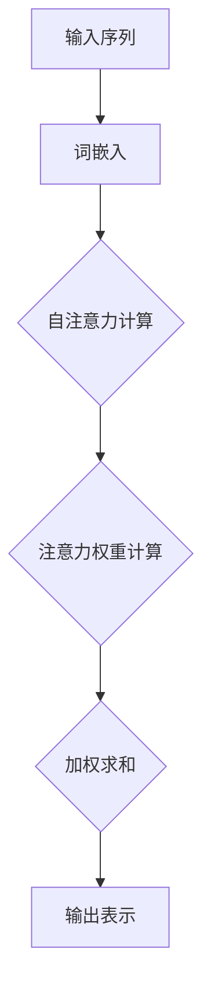
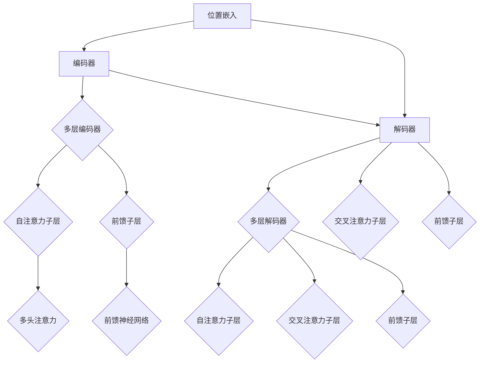

                 

## 文章标题：大语言模型原理与工程实践：基于上下文学习的推理策略

### 关键词：
- 大语言模型，上下文学习，Transformer架构，预训练，微调，文本生成，对话系统，工程实践

### 摘要：
本文深入探讨了大语言模型的原理与工程实践，重点介绍了基于上下文学习的推理策略。文章首先概述了大语言模型的发展历程、核心概念和架构设计，随后详细解析了自注意力机制、Transformer模型以及预训练与微调的过程。接着，文章阐述了大语言模型在文本生成、问答系统、机器翻译和文本摘要中的应用，并探讨了其在对话系统中的实现。随后，文章介绍了大语言模型的训练与部署、性能优化以及应用案例，并探讨了其伦理与隐私问题。最后，文章总结了当前大语言模型的发展趋势，并推荐了相关学习资源。

### 第一部分：大语言模型基础理论

#### 第1章：大语言模型概述

##### 1.1 大语言模型的发展历程

大语言模型（Large-scale Language Models）的发展可以追溯到早期自然语言处理（NLP）模型，这些模型主要用于单词嵌入和简单的文本分类任务。随着计算能力的提升和深度学习技术的发展，大语言模型逐渐成为NLP领域的重要工具。

1. **基础模型：**
   - **Word2Vec：**由Mikolov等人于2013年提出，通过神经网络的层次 Softmax 层学习词向量，这些向量能够捕捉词与词之间的语义关系。
   - **RNN（循环神经网络）：**具有记忆功能，能够捕捉序列数据中的长期依赖关系。经典的RNN模型包括LSTM（长短期记忆网络）和GRU（门控循环单元）。

2. **大规模模型：**
   - **BERT（Bidirectional Encoder Representations from Transformers）：**由Google于2018年提出，采用了Transformer架构，通过双向编码器来预训练语言表示，大幅提升了自然语言理解的能力。
   - **GPT（Generative Pre-trained Transformer）：**由OpenAI于2018年提出，是一种生成式预训练模型，通过预测序列中的下一个词来生成文本。
   - **T5（Text-To-Text Transfer Transformer）：**由Google于2019年提出，是一种通用转换器模型，将任何自然语言任务转换为文本生成任务。

3. **演进过程：**
   - **从小模型到大规模模型的演进：**随着计算资源和数据量的增加，模型规模从数百万参数增长到数十亿甚至数万亿参数。
   - **从单一任务到多任务：**早期模型主要针对特定任务进行优化，而大规模模型能够处理多种不同的NLP任务，如文本分类、命名实体识别、机器翻译等。

##### 1.2 大语言模型的核心概念

1. **词嵌入技术：**
   - **基本概念：**词嵌入是将单词映射到高维向量空间的技术，使得语义相似的单词在空间中距离较近。
   - **实现方法：**
     - **基于统计的方法：**如Word2Vec，通过计算单词的共现关系生成词向量。
     - **基于神经网络的方法：**如BERT，通过多层神经网络学习词向量，同时捕捉单词的上下文信息。

2. **自注意力机制：**
   - **基本概念：**自注意力机制允许模型在处理序列数据时，自动关注序列中不同位置的信息，为每个位置生成权重，从而更有效地捕捉上下文信息。
   - **实现方法：**通过计算序列中每个位置之间的相似度，为每个位置分配权重。

3. **Transformer架构：**
   - **基本概念：**Transformer是一种基于自注意力机制的序列到序列模型，特别适用于处理自然语言处理任务。
   - **关键组件：**
     - **编码器（Encoder）：**将输入序列编码为固定长度的向量。
     - **解码器（Decoder）：**从编码器生成的固定长度向量中解码出输出序列。

##### 1.3 大语言模型的工作原理

1. **预训练与微调：**
   - **预训练：**在大规模语料上进行训练，学习语言的普遍规律和上下文信息。
   - **微调：**在特定任务上进行微调，调整模型参数，使其适应特定任务。

2. **上下文感知与文本生成：**
   - **上下文感知：**通过预训练和微调，模型能够捕捉到输入文本的上下文信息，从而提高文本理解和生成的准确性。
   - **文本生成：**生成式模型如GPT，可以生成符合上下文和语法规则的文本。

##### 1.4 大语言模型的架构设计

1. **多层的深度网络结构：**
   - **多层编码器：**通过多层编码器，模型能够逐渐提取出输入序列中的高层次特征。
   - **多层解码器：**通过多层解码器，模型能够生成更符合上下文和语法规则的输出序列。

2. **并行计算与优化算法：**
   - **并行计算：**通过并行计算，模型可以在多个计算单元上同时处理数据，提高训练速度。
   - **优化算法：**如梯度下降、Adam等，用于调整模型参数，优化模型性能。

##### 1.5 大语言模型的数学基础

1. **概率分布与采样：**
   - **概率分布模型：**通过概率分布模型，模型能够预测输出序列的概率分布。
   - **采样：**从概率分布中随机抽取样本，生成输出序列。

2. **梯度下降与优化：**
   - **梯度下降：**通过计算损失函数关于模型参数的梯度，更新模型参数，以最小化损失函数。
   - **优化算法：**如Adam、RMSprop等，用于加速梯度下降过程，提高训练效率。

#### 第2章：核心算法原理与实现

##### 2.1 自注意力机制的原理

1. **自注意力公式：**
   - **自注意力计算：**通过计算序列中每个位置之间的相似度，为每个位置生成权重。
   - **多头注意力：**通过多个并行的注意力机制，捕捉到更丰富的上下文信息。

2. **多头注意力机制：**
   - **基本概念：**多头注意力机制通过多个并行的注意力机制，捕捉到更丰富的上下文信息。
   - **实现方法：**在每个注意力头中，使用独立的权重矩阵进行计算。

##### 2.2 Transformer模型的架构

1. **编码器与解码器结构：**
   - **编码器：**将输入序列编码为固定长度的向量。
   - **解码器：**从编码器生成的固定长度向量中解码出输出序列。

2. **位置嵌入与编码器层：**
   - **位置嵌入：**为序列中的每个位置添加嵌入信息，以便模型能够理解序列的顺序。
   - **编码器层：**通过多层编码器，模型能够逐渐提取出输入序列中的高层次特征。

##### 2.3 预训练与微调

1. **预训练目标与过程：**
   - **预训练目标：**在大规模语料上进行训练，学习语言的普遍规律和上下文信息。
   - **预训练过程：**通过无监督的方式，如 masked language model（MLM）和 masked position embedding（MPM），进行大规模语料训练。

2. **微调策略与技巧：**
   - **微调策略：**在特定任务上进行微调，调整模型参数，使其适应特定任务。
   - **微调技巧：**如迁移学习、微调深度、批量大小等，用于优化模型性能。

##### 2.4 语言模型的数学模型

1. **概率分布模型：**
   - **基本概念：**通过概率分布模型，模型能够预测输出序列的概率分布。
   - **实现方法：**如softmax函数，将模型输出转换为概率分布。

2. **损失函数与优化算法：**
   - **损失函数：**如交叉熵损失函数，用于衡量模型输出与真实标签之间的差异。
   - **优化算法：**如梯度下降、Adam等，用于调整模型参数，优化模型性能。

##### 2.5 语言模型的评估与优化

1. **评估指标：**
   - **基本概念：**通过评估指标，模型性能可以进行量化评估。
   - **常用指标：**如准确率、召回率、F1值等。

2. **模型调优方法：**
   - **调参方法：**如网格搜索、随机搜索等，用于优化模型参数。
   - **模型融合：**通过融合多个模型，提高模型性能。

### 第二部分：大语言模型应用与实践

#### 第3章：大语言模型在文本生成中的应用

##### 3.1 文本生成的基础原理

1. **文本生成流程：**
   - **输入处理：**将输入文本编码为模型可以处理的形式。
   - **序列预测：**模型通过预测下一个单词或字符，生成文本序列。
   - **输出处理：**将生成的文本序列解码为可读的文本。

2. **文本生成模型类型：**
   - **基于RNN的生成模型：**如LSTM、GRU，适用于处理序列数据。
   - **基于Transformer的生成模型：**如GPT、T5，通过自注意力机制生成文本。

##### 3.2 GPT模型在文本生成中的应用

1. **GPT模型的架构：**
   - **编码器：**通过多层编码器，将输入序列编码为固定长度的向量。
   - **解码器：**通过多层解码器，从编码器生成的向量中解码出输出序列。

2. **GPT模型的训练与生成：**
   - **训练过程：**通过预训练和微调，GPT模型学习到语言的普遍规律和上下文信息。
   - **生成过程：**通过生成式模型，GPT模型可以生成符合上下文和语法规则的文本。

##### 3.3 语言模型在问答系统中的应用

1. **问答系统架构：**
   - **输入处理：**将用户提问编码为模型可以处理的形式。
   - **模型推理：**使用训练好的语言模型，对用户提问进行推理。
   - **输出处理：**将生成的答案解码为可读的文本。

2. **语言模型在问答中的实现：**
   - **输入编码：**使用词嵌入技术，将用户提问编码为向量。
   - **模型推理：**通过自注意力机制，语言模型捕捉到问题的上下文信息，生成答案。
   - **输出解码：**将生成的答案解码为可读的文本。

##### 3.4 语言模型在机器翻译中的应用

1. **机器翻译的基本原理：**
   - **输入处理：**将源语言文本编码为模型可以处理的形式。
   - **模型推理：**使用训练好的语言模型，将源语言文本翻译为目标语言文本。
   - **输出处理：**将生成的目标语言文本解码为可读的文本。

2. **神经机器翻译模型：**
   - **编码器：**将源语言文本编码为固定长度的向量。
   - **解码器：**从编码器生成的向量中解码出目标语言文本。

##### 3.5 语言模型在文本摘要中的应用

1. **文本摘要模型：**
   - **抽取式摘要：**从原始文本中抽取关键信息，生成摘要。
   - **生成式摘要：**通过生成式模型，生成符合上下文和语法规则的摘要。

2. **摘要生成过程：**
   - **输入编码：**使用词嵌入技术，将原始文本编码为向量。
   - **模型推理：**使用训练好的语言模型，生成摘要文本。
   - **输出解码：**将生成的摘要文本解码为可读的文本。

### 第4章：大语言模型在对话系统中的应用

##### 4.1 对话系统的基本概念

1. **对话系统类型：**
   - **基于规则的系统：**通过预定义的规则，与用户进行交互。
   - **基于机器学习的系统：**使用训练好的模型，自动生成对话回复。

2. **对话流程与交互模型：**
   - **对话流程：**包括用户提问、模型响应、用户反馈等步骤。
   - **交互模型：**包括对话状态跟踪、对话策略学习等模块。

##### 4.2 语言模型在对话系统中的应用

1. **对话生成与理解：**
   - **对话生成：**使用训练好的语言模型，生成符合上下文和语法规则的对话回复。
   - **对话理解：**通过解析用户提问，理解用户的意图和需求。

2. **对话状态跟踪：**
   - **基本概念：**对话状态跟踪用于记录对话的历史信息，以便模型能够更好地理解用户的意图。
   - **实现方法：**使用记忆网络、序列模型等技术，跟踪对话状态。

3. **对话策略学习：**
   - **基本概念：**对话策略学习用于确定模型在对话中的行为，如回复的类型、长度等。
   - **实现方法：**使用强化学习、决策树等技术，学习对话策略。

##### 4.3 多轮对话系统设计

1. **上下文感知对话：**
   - **基本概念：**上下文感知对话能够根据对话历史信息，生成更准确、更相关的对话回复。
   - **实现方法：**使用自注意力机制、记忆网络等技术，捕捉对话历史信息。

2. **对话策略学习：**
   - **基本概念：**对话策略学习用于确定模型在对话中的行为，如回复的类型、长度等。
   - **实现方法：**使用强化学习、决策树等技术，学习对话策略。

##### 4.4 语言模型在智能客服中的应用

1. **客服对话模型：**
   - **基本概念：**客服对话模型用于生成智能客服的对话回复。
   - **实现方法：**使用预训练好的语言模型，如GPT、BERT等，生成对话回复。

2. **客服对话流程与实现：**
   - **对话流程：**包括用户提问、模型响应、用户反馈等步骤。
   - **实现细节：**包括对话状态跟踪、对话策略学习等模块。

##### 4.5 语言模型在虚拟助手中的应用

1. **虚拟助手架构：**
   - **基本概念：**虚拟助手是一种能够与用户进行自然语言交互的智能系统。
   - **实现方法：**使用预训练好的语言模型，如GPT、BERT等，进行虚拟助手开发。

2. **虚拟助手开发实践：**
   - **开发流程：**包括需求分析、模型选择、模型训练、模型部署等步骤。
   - **实践案例：**展示如何使用预训练好的语言模型，实现虚拟助手的对话功能。

### 第5章：大语言模型工程实践

##### 5.1 大语言模型训练与部署

1. **训练环境搭建：**
   - **硬件要求：**包括GPU、TPU等计算资源。
   - **软件要求：**包括深度学习框架（如TensorFlow、PyTorch）和环境配置。

2. **模型部署与优化：**
   - **模型部署：**将训练好的模型部署到生产环境中，如API服务、Web应用等。
   - **模型优化：**通过模型压缩、量化、分布式训练等技术，优化模型性能和部署效率。

##### 5.2 大规模语言模型的性能优化

1. **模型压缩与量化：**
   - **模型压缩：**通过剪枝、量化等技术，减少模型参数和计算量，提高部署效率。
   - **模型量化：**将模型中的浮点数参数转换为低精度格式，减少计算资源消耗。

2. **模型加速与分布式训练：**
   - **模型加速：**通过使用更高效的算法、硬件加速等技术，提高模型训练和推理速度。
   - **分布式训练：**通过分布式计算，加速大规模模型的训练过程。

##### 5.3 大语言模型的应用案例

1. **企业级应用案例：**
   - **案例一：**智能客服系统，用于处理用户咨询和问题解决。
   - **案例二：**智能文档生成，用于自动生成报告、合同等文档。

2. **开源项目与工具介绍：**
   - **开源项目：**介绍一些常用的开源语言模型项目，如GPT-3、BERT等。
   - **工具介绍：**介绍一些常用的深度学习工具和框架，如TensorFlow、PyTorch等。

##### 5.4 大语言模型的伦理与隐私问题

1. **数据隐私保护：**
   - **数据匿名化：**对用户数据进行匿名化处理，保护用户隐私。
   - **数据加密：**对用户数据进行加密存储和传输，防止数据泄露。

2. **模型偏见与公平性：**
   - **模型偏见：**分析模型在训练过程中可能产生的偏见，如性别、种族等偏见。
   - **公平性评估：**评估模型在处理不同群体数据时的性能和偏见，确保模型公平性。

##### 5.5 大语言模型的发展趋势

1. **技术演进方向：**
   - **预训练技术：**探索更高效的预训练方法和大规模预训练模型。
   - **多模态学习：**结合图像、语音等多模态数据，提高模型处理复杂任务的能力。

2. **行业应用前景：**
   - **智能客服：**在金融、电商、医疗等领域，智能客服的应用前景广阔。
   - **智能文档生成：**自动生成报告、合同等文档，提高工作效率。

### 附录A：大语言模型常用工具与资源

##### A.1 常用深度学习框架

1. **TensorFlow**
   - **简介：**TensorFlow 是一个开源的深度学习框架，由Google开发。
   - **特点：**支持大规模分布式训练和部署，具有丰富的API和工具。

2. **PyTorch**
   - **简介：**PyTorch 是一个开源的深度学习框架，由Facebook开发。
   - **特点：**动态计算图，易于实现和调试，支持多种深度学习模型。

3. **Transformers库**
   - **简介：**Transformers库是基于PyTorch的一个开源库，用于实现Transformer模型。
   - **特点：**预训练模型支持，易于使用和扩展。

##### A.2 大语言模型开源项目

1. **GPT-3**
   - **简介：**GPT-3 是由OpenAI开发的预训练语言模型，具有1.75万亿个参数。
   - **特点：**强大的文本生成和语言理解能力，支持多种自然语言处理任务。

2. **BERT**
   - **简介：**BERT 是由Google开发的预训练语言模型，适用于多种自然语言处理任务。
   - **特点：**预训练和微调技术，提高模型的文本理解和生成能力。

3. **其他开源项目**
   - **T5**
     - **简介：**T5 是一个通用转换器模型，适用于多种自然语言处理任务。
     - **特点：**统一的转换器架构，支持多种任务类型。
   - **XLNet**
     - **简介：**XLNet 是由Google开发的预训练语言模型，基于自回归语言模型。
     - **特点：**自回归语言模型，具有更好的上下文理解和生成能力。

##### A.3 大语言模型学习资源

1. **在线课程**
   - **课程名称：**《深度学习与自然语言处理》
   - **提供方：**吴恩达（Andrew Ng）在Coursera上开设的课程。

2. **论文资料**
   - **推荐论文：**
     - **BERT: Pre-training of Deep Bidirectional Transformers for Language Understanding**
     - **GPT-3: Language Models are Few-Shot Learners**

3. **书籍推荐**
   - **《深度学习》（Goodfellow et al.）**
   - **《自然语言处理综合教程》（Jurafsky and Martin）**
   - **《Transformers：大规模语言模型的原理与应用》（Liu et al.）**


### 文章标题：大语言模型原理与工程实践：基于上下文学习的推理策略

关键词：
- 大语言模型，上下文学习，Transformer架构，预训练，微调，文本生成，对话系统，工程实践

摘要：
本文深入探讨了大语言模型的原理与工程实践，重点介绍了基于上下文学习的推理策略。文章首先概述了大语言模型的发展历程、核心概念和架构设计，随后详细解析了自注意力机制、Transformer模型以及预训练与微调的过程。接着，文章阐述了大语言模型在文本生成、问答系统、机器翻译和文本摘要中的应用，并探讨了其在对话系统中的实现。随后，文章介绍了大语言模型的训练与部署、性能优化以及应用案例，并探讨了其伦理与隐私问题。最后，文章总结了当前大语言模型的发展趋势，并推荐了相关学习资源。

### 第一部分：大语言模型基础理论

#### 第1章：大语言模型概述

##### 1.1 大语言模型的发展历程

大语言模型（Large-scale Language Models）的发展可以追溯到早期自然语言处理（NLP）模型，这些模型主要用于单词嵌入和简单的文本分类任务。随着计算能力的提升和深度学习技术的发展，大语言模型逐渐成为NLP领域的重要工具。

1. **基础模型：**
   - **Word2Vec：**由Mikolov等人于2013年提出，通过神经网络的层次 Softmax 层学习词向量，这些向量能够捕捉词与词之间的语义关系。
   - **RNN（循环神经网络）：**具有记忆功能，能够捕捉序列数据中的长期依赖关系。经典的RNN模型包括LSTM（长短期记忆网络）和GRU（门控循环单元）。

2. **大规模模型：**
   - **BERT（Bidirectional Encoder Representations from Transformers）：**由Google于2018年提出，采用了Transformer架构，通过双向编码器来预训练语言表示，大幅提升了自然语言理解的能力。
   - **GPT（Generative Pre-trained Transformer）：**由OpenAI于2018年提出，是一种生成式预训练模型，通过预测序列中的下一个词来生成文本。
   - **T5（Text-To-Text Transfer Transformer）：**由Google于2019年提出，是一种通用转换器模型，将任何自然语言任务转换为文本生成任务。

3. **演进过程：**
   - **从小模型到大规模模型的演进：**随着计算资源和数据量的增加，模型规模从数百万参数增长到数十亿甚至数万亿参数。
   - **从单一任务到多任务：**早期模型主要针对特定任务进行优化，而大规模模型能够处理多种不同的NLP任务，如文本分类、命名实体识别、机器翻译等。

##### 1.2 大语言模型的核心概念

1. **词嵌入技术：**
   - **基本概念：**词嵌入是将单词映射到高维向量空间的技术，使得语义相似的单词在空间中距离较近。
   - **实现方法：**
     - **基于统计的方法：**如Word2Vec，通过计算单词的共现关系生成词向量。
     - **基于神经网络的方法：**如BERT，通过多层神经网络学习词向量，同时捕捉单词的上下文信息。

2. **自注意力机制：**
   - **基本概念：**自注意力机制允许模型在处理序列数据时，自动关注序列中不同位置的信息，为每个位置生成权重，从而更有效地捕捉上下文信息。
   - **实现方法：**通过计算序列中每个位置之间的相似度，为每个位置分配权重。

3. **Transformer架构：**
   - **基本概念：**Transformer是一种基于自注意力机制的序列到序列模型，特别适用于处理自然语言处理任务。
   - **关键组件：**
     - **编码器（Encoder）：**将输入序列编码为固定长度的向量。
     - **解码器（Decoder）：**从编码器生成的固定长度向量中解码出输出序列。

##### 1.3 大语言模型的工作原理

1. **预训练与微调：**
   - **预训练：**在大规模语料上进行训练，学习语言的普遍规律和上下文信息。
   - **微调：**在特定任务上进行微调，调整模型参数，使其适应特定任务。

2. **上下文感知与文本生成：**
   - **上下文感知：**通过预训练和微调，模型能够捕捉到输入文本的上下文信息，从而提高文本理解和生成的准确性。
   - **文本生成：**生成式模型如GPT，可以生成符合上下文和语法规则的文本。

##### 1.4 大语言模型的架构设计

1. **多层的深度网络结构：**
   - **多层编码器：**通过多层编码器，模型能够逐渐提取出输入序列中的高层次特征。
   - **多层解码器：**通过多层解码器，模型能够生成更符合上下文和语法规则的输出序列。

2. **并行计算与优化算法：**
   - **并行计算：**通过并行计算，模型可以在多个计算单元上同时处理数据，提高训练速度。
   - **优化算法：**如梯度下降、Adam等，用于调整模型参数，优化模型性能。

##### 1.5 大语言模型的数学基础

1. **概率分布与采样：**
   - **概率分布模型：**通过概率分布模型，模型能够预测输出序列的概率分布。
   - **采样：**从概率分布中随机抽取样本，生成输出序列。

2. **梯度下降与优化：**
   - **梯度下降：**通过计算损失函数关于模型参数的梯度，更新模型参数，以最小化损失函数。
   - **优化算法：**如Adam、RMSprop等，用于加速梯度下降过程，提高训练效率。

#### 第2章：核心算法原理与实现

##### 2.1 自注意力机制的原理

1. **自注意力公式：**
   - **自注意力计算：**通过计算序列中每个位置之间的相似度，为每个位置生成权重。
   - **多头注意力：**通过多个并行的注意力机制，捕捉到更丰富的上下文信息。

2. **多头注意力机制：**
   - **基本概念：**多头注意力机制通过多个并行的注意力机制，捕捉到更丰富的上下文信息。
   - **实现方法：**在每个注意力头中，使用独立的权重矩阵进行计算。

##### 2.2 Transformer模型的架构

1. **编码器与解码器结构：**
   - **编码器：**将输入序列编码为固定长度的向量。
   - **解码器：**从编码器生成的固定长度向量中解码出输出序列。

2. **位置嵌入与编码器层：**
   - **位置嵌入：**为序列中的每个位置添加嵌入信息，以便模型能够理解序列的顺序。
   - **编码器层：**通过多层编码器，模型能够逐渐提取出输入序列中的高层次特征。

##### 2.3 预训练与微调

1. **预训练目标与过程：**
   - **预训练目标：**在大规模语料上进行训练，学习语言的普遍规律和上下文信息。
   - **预训练过程：**通过无监督的方式，如 masked language model（MLM）和 masked position embedding（MPM），进行大规模语料训练。

2. **微调策略与技巧：**
   - **微调策略：**在特定任务上进行微调，调整模型参数，使其适应特定任务。
   - **微调技巧：**如迁移学习、微调深度、批量大小等，用于优化模型性能。

##### 2.4 语言模型的数学模型

1. **概率分布模型：**
   - **基本概念：**通过概率分布模型，模型能够预测输出序列的概率分布。
   - **实现方法：**如softmax函数，将模型输出转换为概率分布。

2. **损失函数与优化算法：**
   - **损失函数：**如交叉熵损失函数，用于衡量模型输出与真实标签之间的差异。
   - **优化算法：**如梯度下降、Adam等，用于调整模型参数，优化模型性能。

##### 2.5 语言模型的评估与优化

1. **评估指标：**
   - **基本概念：**通过评估指标，模型性能可以进行量化评估。
   - **常用指标：**如准确率、召回率、F1值等。

2. **模型调优方法：**
   - **调参方法：**如网格搜索、随机搜索等，用于优化模型参数。
   - **模型融合：**通过融合多个模型，提高模型性能。

### 第二部分：大语言模型应用与实践

#### 第3章：大语言模型在文本生成中的应用

##### 3.1 文本生成的基础原理

1. **文本生成流程：**
   - **输入处理：**将输入文本编码为模型可以处理的形式。
   - **序列预测：**模型通过预测下一个单词或字符，生成文本序列。
   - **输出处理：**将生成的文本序列解码为可读的文本。

2. **文本生成模型类型：**
   - **基于RNN的生成模型：**如LSTM、GRU，适用于处理序列数据。
   - **基于Transformer的生成模型：**如GPT、T5，通过自注意力机制生成文本。

##### 3.2 GPT模型在文本生成中的应用

1. **GPT模型的架构：**
   - **编码器：**通过多层编码器，将输入序列编码为固定长度的向量。
   - **解码器：**通过多层解码器，从编码器生成的向量中解码出输出序列。

2. **GPT模型的训练与生成：**
   - **训练过程：**通过预训练和微调，GPT模型学习到语言的普遍规律和上下文信息。
   - **生成过程：**通过生成式模型，GPT模型可以生成符合上下文和语法规则的文本。

##### 3.3 语言模型在问答系统中的应用

1. **问答系统架构：**
   - **输入处理：**将用户提问编码为模型可以处理的形式。
   - **模型推理：**使用训练好的语言模型，对用户提问进行推理。
   - **输出处理：**将生成的答案解码为可读的文本。

2. **语言模型在问答中的实现：**
   - **输入编码：**使用词嵌入技术，将用户提问编码为向量。
   - **模型推理：**通过自注意力机制，语言模型捕捉到问题的上下文信息，生成答案。
   - **输出解码：**将生成的答案解码为可读的文本。

##### 3.4 语言模型在机器翻译中的应用

1. **机器翻译的基本原理：**
   - **输入处理：**将源语言文本编码为模型可以处理的形式。
   - **模型推理：**使用训练好的语言模型，将源语言文本翻译为目标语言文本。
   - **输出处理：**将生成的目标语言文本解码为可读的文本。

2. **神经机器翻译模型：**
   - **编码器：**将源语言文本编码为固定长度的向量。
   - **解码器：**从编码器生成的向量中解码出目标语言文本。

##### 3.5 语言模型在文本摘要中的应用

1. **文本摘要模型：**
   - **抽取式摘要：**从原始文本中抽取关键信息，生成摘要。
   - **生成式摘要：**通过生成式模型，生成符合上下文和语法规则的摘要。

2. **摘要生成过程：**
   - **输入编码：**使用词嵌入技术，将原始文本编码为向量。
   - **模型推理：**使用训练好的语言模型，生成摘要文本。
   - **输出解码：**将生成的摘要文本解码为可读的文本。

### 第4章：大语言模型在对话系统中的应用

##### 4.1 对话系统的基本概念

1. **对话系统类型：**
   - **基于规则的系统：**通过预定义的规则，与用户进行交互。
   - **基于机器学习的系统：**使用训练好的模型，自动生成对话回复。

2. **对话流程与交互模型：**
   - **对话流程：**包括用户提问、模型响应、用户反馈等步骤。
   - **交互模型：**包括对话状态跟踪、对话策略学习等模块。

##### 4.2 语言模型在对话系统中的应用

1. **对话生成与理解：**
   - **对话生成：**使用训练好的语言模型，生成符合上下文和语法规则的对话回复。
   - **对话理解：**通过解析用户提问，理解用户的意图和需求。

2. **对话状态跟踪：**
   - **基本概念：**对话状态跟踪用于记录对话的历史信息，以便模型能够更好地理解用户的意图。
   - **实现方法：**使用记忆网络、序列模型等技术，跟踪对话状态。

3. **对话策略学习：**
   - **基本概念：**对话策略学习用于确定模型在对话中的行为，如回复的类型、长度等。
   - **实现方法：**使用强化学习、决策树等技术，学习对话策略。

##### 4.3 多轮对话系统设计

1. **上下文感知对话：**
   - **基本概念：**上下文感知对话能够根据对话历史信息，生成更准确、更相关的对话回复。
   - **实现方法：**使用自注意力机制、记忆网络等技术，捕捉对话历史信息。

2. **对话策略学习：**
   - **基本概念：**对话策略学习用于确定模型在对话中的行为，如回复的类型、长度等。
   - **实现方法：**使用强化学习、决策树等技术，学习对话策略。

##### 4.4 语言模型在智能客服中的应用

1. **客服对话模型：**
   - **基本概念：**客服对话模型用于生成智能客服的对话回复。
   - **实现方法：**使用预训练好的语言模型，如GPT、BERT等，生成对话回复。

2. **客服对话流程与实现：**
   - **对话流程：**包括用户提问、模型响应、用户反馈等步骤。
   - **实现细节：**包括对话状态跟踪、对话策略学习等模块。

##### 4.5 语言模型在虚拟助手中的应用

1. **虚拟助手架构：**
   - **基本概念：**虚拟助手是一种能够与用户进行自然语言交互的智能系统。
   - **实现方法：**使用预训练好的语言模型，如GPT、BERT等，进行虚拟助手开发。

2. **虚拟助手开发实践：**
   - **开发流程：**包括需求分析、模型选择、模型训练、模型部署等步骤。
   - **实践案例：**展示如何使用预训练好的语言模型，实现虚拟助手的对话功能。

### 第5章：大语言模型工程实践

##### 5.1 大语言模型训练与部署

1. **训练环境搭建：**
   - **硬件要求：**包括GPU、TPU等计算资源。
   - **软件要求：**包括深度学习框架（如TensorFlow、PyTorch）和环境配置。

2. **模型部署与优化：**
   - **模型部署：**将训练好的模型部署到生产环境中，如API服务、Web应用等。
   - **模型优化：**通过模型压缩、量化、分布式训练等技术，优化模型性能和部署效率。

##### 5.2 大规模语言模型的性能优化

1. **模型压缩与量化：**
   - **模型压缩：**通过剪枝、量化等技术，减少模型参数和计算量，提高部署效率。
   - **模型量化：**将模型中的浮点数参数转换为低精度格式，减少计算资源消耗。

2. **模型加速与分布式训练：**
   - **模型加速：**通过使用更高效的算法、硬件加速等技术，提高模型训练和推理速度。
   - **分布式训练：**通过分布式计算，加速大规模模型的训练过程。

##### 5.3 大语言模型的应用案例

1. **企业级应用案例：**
   - **案例一：**智能客服系统，用于处理用户咨询和问题解决。
   - **案例二：**智能文档生成，用于自动生成报告、合同等文档。

2. **开源项目与工具介绍：**
   - **开源项目：**介绍一些常用的开源语言模型项目，如GPT-3、BERT等。
   - **工具介绍：**介绍一些常用的深度学习工具和框架，如TensorFlow、PyTorch等。

##### 5.4 大语言模型的伦理与隐私问题

1. **数据隐私保护：**
   - **数据匿名化：**对用户数据进行匿名化处理，保护用户隐私。
   - **数据加密：**对用户数据进行加密存储和传输，防止数据泄露。

2. **模型偏见与公平性：**
   - **模型偏见：**分析模型在训练过程中可能产生的偏见，如性别、种族等偏见。
   - **公平性评估：**评估模型在处理不同群体数据时的性能和偏见，确保模型公平性。

##### 5.5 大语言模型的发展趋势

1. **技术演进方向：**
   - **预训练技术：**探索更高效的预训练方法和大规模预训练模型。
   - **多模态学习：**结合图像、语音等多模态数据，提高模型处理复杂任务的能力。

2. **行业应用前景：**
   - **智能客服：**在金融、电商、医疗等领域，智能客服的应用前景广阔。
   - **智能文档生成：**自动生成报告、合同等文档，提高工作效率。

### 附录A：大语言模型常用工具与资源

##### A.1 常用深度学习框架

1. **TensorFlow**
   - **简介：**TensorFlow 是一个开源的深度学习框架，由Google开发。
   - **特点：**支持大规模分布式训练和部署，具有丰富的API和工具。

2. **PyTorch**
   - **简介：**PyTorch 是一个开源的深度学习框架，由Facebook开发。
   - **特点：**动态计算图，易于实现和调试，支持多种深度学习模型。

3. **Transformers库**
   - **简介：**Transformers库是基于PyTorch的一个开源库，用于实现Transformer模型。
   - **特点：**预训练模型支持，易于使用和扩展。

##### A.2 大语言模型开源项目

1. **GPT-3**
   - **简介：**GPT-3 是由OpenAI开发的预训练语言模型，具有1.75万亿个参数。
   - **特点：**强大的文本生成和语言理解能力，支持多种自然语言处理任务。

2. **BERT**
   - **简介：**BERT 是由Google开发的预训练语言模型，适用于多种自然语言处理任务。
   - **特点：**预训练和微调技术，提高模型的文本理解和生成能力。

3. **其他开源项目**
   - **T5**
     - **简介：**T5 是一个通用转换器模型，适用于多种自然语言处理任务。
     - **特点：**统一的转换器架构，支持多种任务类型。
   - **XLNet**
     - **简介：**XLNet 是由Google开发的预训练语言模型，基于自回归语言模型。
     - **特点：**自回归语言模型，具有更好的上下文理解和生成能力。

##### A.3 大语言模型学习资源

1. **在线课程**
   - **课程名称：**《深度学习与自然语言处理》
   - **提供方：**吴恩达（Andrew Ng）在Coursera上开设的课程。

2. **论文资料**
   - **推荐论文：**
     - **BERT: Pre-training of Deep Bidirectional Transformers for Language Understanding**
     - **GPT-3: Language Models are Few-Shot Learners**

3. **书籍推荐**
   - **《深度学习》（Goodfellow et al.）**
   - **《自然语言处理综合教程》（Jurafsky and Martin）**
   - **《Transformers：大规模语言模型的原理与应用》（Liu et al.）**


----------------------------------------------------------------

## 第1章：大语言模型概述

### 1.1 大语言模型的发展历程

大语言模型（Large-scale Language Models）的发展历程可以追溯到自然语言处理（NLP）技术的早期阶段。随着计算能力的提升和深度学习技术的发展，这些模型经历了从基础模型到大规模模型的演进，最终成为了NLP领域的重要工具。

#### 从基础模型到大规模模型的演进

1. **基础模型：**

   - **Word2Vec：**由Mikolov等人于2013年提出，通过神经网络的层次 Softmax 层学习词向量，这些向量能够捕捉词与词之间的语义关系。

   - **RNN（循环神经网络）：**具有记忆功能，能够捕捉序列数据中的长期依赖关系。经典的RNN模型包括LSTM（长短期记忆网络）和GRU（门控循环单元）。

2. **大规模模型：**

   - **BERT（Bidirectional Encoder Representations from Transformers）：**由Google于2018年提出，采用了Transformer架构，通过双向编码器来预训练语言表示，大幅提升了自然语言理解的能力。

   - **GPT（Generative Pre-trained Transformer）：**由OpenAI于2018年提出，是一种生成式预训练模型，通过预测序列中的下一个词来生成文本。

   - **T5（Text-To-Text Transfer Transformer）：**由Google于2019年提出，是一种通用转换器模型，将任何自然语言任务转换为文本生成任务。

#### 演进过程

1. **从小模型到大规模模型的演进：**

   - **计算资源和数据量的增加：**随着计算资源和数据量的增加，模型规模从数百万参数增长到数十亿甚至数万亿参数。

   - **预训练技术的发展：**预训练技术的引入，使得模型在大规模语料上进行训练，从而更好地学习到语言的普遍规律和上下文信息。

2. **从单一任务到多任务：**

   - **早期模型：**主要针对特定任务进行优化，如文本分类、命名实体识别等。

   - **大规模模型：**能够处理多种不同的NLP任务，如文本分类、机器翻译、文本生成等。

### 1.2 大语言模型的核心概念

大语言模型的核心概念主要包括词嵌入技术、自注意力机制、Transformer架构等。

#### 1.2.1 词嵌入技术

1. **基本概念：**

   词嵌入（Word Embedding）是将单词映射到高维向量空间的技术，使得语义相似的单词在空间中距离较近。

2. **实现方法：**

   - **基于统计的方法：**如Word2Vec，通过计算单词的共现关系生成词向量。

   - **基于神经网络的方法：**如BERT，通过多层神经网络学习词向量，同时捕捉单词的上下文信息。

#### 1.2.2 自注意力机制

1. **基本概念：**

   自注意力机制（Self-Attention）允许模型在处理序列数据时，自动关注序列中不同位置的信息，为每个位置生成权重，从而更有效地捕捉上下文信息。

2. **实现方法：**

   通过计算序列中每个位置之间的相似度，为每个位置分配权重。

#### 1.2.3 Transformer架构

1. **基本概念：**

   Transformer是一种基于自注意力机制的序列到序列模型，特别适用于处理自然语言处理任务。

2. **关键组件：**

   - **编码器（Encoder）：**将输入序列编码为固定长度的向量。

   - **解码器（Decoder）：**从编码器生成的固定长度向量中解码出输出序列。

### 1.3 大语言模型的工作原理

大语言模型的工作原理主要包括预训练与微调、上下文感知与文本生成等。

#### 1.3.1 预训练与微调

1. **预训练：**

   - **基本概念：**预训练（Pre-training）是在大规模语料上进行训练，学习语言的普遍规律和上下文信息。

   - **过程：**通过无监督的方式，如 masked language model（MLM）和 masked position embedding（MPM），进行大规模语料训练。

2. **微调：**

   - **基本概念：**微调（Fine-tuning）是在特定任务上进行调整，使其适应特定任务。

   - **过程：**将预训练好的模型在特定任务上进行微调，调整模型参数。

#### 1.3.2 上下文感知与文本生成

1. **上下文感知：**

   - **基本概念：**上下文感知（Contextual Awareness）是通过预训练和微调，模型能够捕捉到输入文本的上下文信息。

   - **效果：**提高文本理解和生成的准确性。

2. **文本生成：**

   - **基本概念：**文本生成（Text Generation）是生成式模型如GPT，通过预测序列中的下一个词来生成文本。

   - **实现：**使用预训练好的生成式模型，生成符合上下文和语法规则的文本。

### 1.4 大语言模型的架构设计

大语言模型的架构设计主要包括多层的深度网络结构、并行计算与优化算法等。

#### 1.4.1 多层的深度网络结构

1. **多层编码器：**

   - **基本概念：**通过多层编码器，模型能够逐渐提取出输入序列中的高层次特征。

   - **实现：**使用多层神经网络，逐层提取输入序列中的特征。

2. **多层解码器：**

   - **基本概念：**通过多层解码器，模型能够生成更符合上下文和语法规则的输出序列。

   - **实现：**使用多层神经网络，逐层生成输出序列。

#### 1.4.2 并行计算与优化算法

1. **并行计算：**

   - **基本概念：**通过并行计算，模型可以在多个计算单元上同时处理数据，提高训练速度。

   - **实现：**使用GPU、TPU等硬件资源进行并行计算。

2. **优化算法：**

   - **基本概念：**优化算法用于调整模型参数，优化模型性能。

   - **实现：**如梯度下降、Adam等，用于调整模型参数。

### 1.5 大语言模型的数学基础

大语言模型的数学基础主要包括概率分布与采样、梯度下降与优化等。

#### 1.5.1 概率分布与采样

1. **概率分布模型：**

   - **基本概念：**通过概率分布模型，模型能够预测输出序列的概率分布。

   - **实现方法：**如softmax函数，将模型输出转换为概率分布。

2. **采样：**

   - **基本概念：**采样是从概率分布中随机抽取样本，生成输出序列。

   - **实现方法：**通过随机抽样，生成符合概率分布的输出序列。

#### 1.5.2 梯度下降与优化

1. **梯度下降：**

   - **基本概念：**梯度下降（Gradient Descent）通过计算损失函数关于模型参数的梯度，更新模型参数，以最小化损失函数。

   - **实现方法：**计算损失函数的梯度，更新模型参数。

2. **优化算法：**

   - **基本概念：**优化算法用于加速梯度下降过程，提高训练效率。

   - **实现方法：**如Adam、RMSprop等，用于优化梯度下降过程。

### 1.6 大语言模型的评估与优化

大语言模型的评估与优化主要包括评估指标、模型调优方法等。

#### 1.6.1 评估指标

1. **基本概念：**

   评估指标（Evaluation Metrics）用于量化模型的性能。

2. **常用指标：**

   - **准确率（Accuracy）：**模型预测正确的比例。
   - **召回率（Recall）：**模型正确召回的正例的比例。
   - **F1值（F1 Score）：**准确率和召回率的调和平均。

#### 1.6.2 模型调优方法

1. **基本概念：**

   模型调优方法（Model Tuning Methods）用于优化模型性能。

2. **常用方法：**

   - **网格搜索（Grid Search）：**在参数空间中搜索最佳参数组合。
   - **随机搜索（Random Search）：**随机选择参数组合进行调优。

### 总结

大语言模型的发展历程从基础模型到大规模模型的演进，核心概念包括词嵌入技术、自注意力机制、Transformer架构，工作原理涉及预训练与微调、上下文感知与文本生成，架构设计包括多层的深度网络结构和并行计算与优化算法，数学基础包括概率分布与采样、梯度下降与优化，评估与优化涉及评估指标和模型调优方法。通过深入理解这些概念和原理，可以为后续章节的应用与实践提供坚实的理论基础。

### 第2章：核心算法原理与实现

#### 2.1 自注意力机制的原理

自注意力机制（Self-Attention Mechanism）是Transformer架构的核心组件，它允许模型在处理序列数据时，自动关注序列中不同位置的信息，从而更有效地捕捉上下文信息。自注意力机制的原理可以通过以下步骤进行解释：

1. **输入序列表示：**
   假设我们有一个输入序列 \[x_1, x_2, ..., x_n\]，每个输入元素 \(x_i\) 被映射为一个向量 \(V_i \in \mathbb{R}^{d_v}\)，其中 \(d_v\) 是词向量的维度。

2. **计算自注意力权重：**
   自注意力机制通过计算每个位置 \(i\) 与所有位置 \(j\) 之间的相似度，为每个位置 \(i\) 生成权重 \(a_{ij}\)。
   \[
   a_{ij} = \text{softmax}\left( \frac{Q_i S V_j}{\sqrt{d_k}} \right)
   \]
   其中，\(Q_i, K_j, V_j\) 分别是查询向量、键向量和值向量，\(d_k\) 是注意力头的维度。\(S\) 是一个缩放因子，通常设置为 \(\sqrt{d_k}\)。

3. **计算注意力得分：**
   使用权重 \(a_{ij}\) 对值向量 \(V_j\) 进行加权求和，得到每个位置 \(i\) 的注意力得分 \(s_i\)。
   \[
   s_i = \sum_{j=1}^{n} a_{ij} V_j
   \]

4. **输出表示：**
   将注意力得分 \(s_i\) 作为输入序列的表示 \(H_i\)，即
   \[
   H_i = s_i
   \]

**伪代码：**

```python
def self_attention(q, k, v, d_k, d_v, dropout_rate):
    # 计算查询向量、键向量和值向量
    Q = linear(q, d_v, dropout_rate)
    K = linear(k, d_k, dropout_rate)
    V = linear(v, d_v, dropout_rate)

    # 计算自注意力权重
    scores = torch.matmul(Q, K.transpose(1, 2)) / math.sqrt(d_k)
    attn_weights = F.softmax(scores, dim=2)

    # 计算注意力得分
    attn_scores = torch.matmul(attn_weights, V)

    # 输出表示
    return attn_scores
```

**Mermaid 流程图：**



#### 2.2 Transformer模型的架构

Transformer模型由编码器（Encoder）和解码器（Decoder）两部分组成，通过自注意力机制和位置嵌入（Positional Embedding）实现序列到序列的转换。以下是Transformer模型的架构和关键组件：

1. **编码器（Encoder）：**
   - **多层编码器：**编码器由多个相同的编码层（Encoder Layer）堆叠而成。每个编码层包含两个主要子层：自注意力子层（Self-Attention Sublayer）和前馈子层（Feedforward Sublayer）。
   - **多头注意力：**每个编码层使用多个注意力头（Attention Head）来捕捉不同范围的上下文信息。

2. **解码器（Decoder）：**
   - **多层解码器：**解码器同样由多个相同的解码层（Decoder Layer）堆叠而成。每个解码层包含两个主要子层：自注意力子层（Self-Attention Sublayer）、交叉注意力子层（Cross-Attention Sublayer）和前馈子层（Feedforward Sublayer）。
   - **交叉注意力：**解码器的每个层使用编码器的输出作为键（Key）和值（Value），同时通过自注意力机制生成输出。

3. **位置嵌入（Positional Embedding）：**
   - **基本概念：**位置嵌入是为了在自注意力机制中保留序列的顺序信息。
   - **实现方法：**通过为序列中的每个位置添加嵌入向量，实现位置信息编码。

**Transformer模型的关键组件图：**



#### 2.3 预训练与微调

预训练（Pre-training）和微调（Fine-tuning）是大规模语言模型训练的两个关键步骤，分别用于学习语言的普遍规律和适应特定任务。

1. **预训练（Pre-training）：**
   - **基本概念：**预训练是在大规模无标注语料上进行训练，使模型学习到语言的通用特征和上下文信息。
   - **过程：**
     - **掩码语言模型（Masked Language Model, MLM）：**随机掩码输入文本中的部分词，模型需要预测这些被掩码的词。
     - **掩码位置嵌入（Masked Position Embedding, MPM）：**随机掩码输入文本中的部分位置嵌入向量，模型需要学习这些位置的信息。

2. **微调（Fine-tuning）：**
   - **基本概念：**微调是在特定任务上有标注的数据集上进行训练，调整模型参数以适应特定任务。
   - **过程：**
     - **特定任务的损失函数：**在微调阶段，模型使用任务特定的损失函数进行优化，如分类任务的交叉熵损失函数。
     - **梯度更新：**通过反向传播算法，根据损失函数的梯度更新模型参数。

**伪代码：**

```python
# 预训练过程
for epoch in range(num_epochs):
    for batch in data_loader:
        inputs, targets = batch
        mask_inputs, mask_targets = mask_inputs(inputs, mask_ratio)
        
        # 预训练阶段，使用掩码语言模型
        outputs = model(inputs, mask_inputs)
        loss = loss_fn(outputs, mask_targets)
        
        # 反向传播和梯度更新
        optimizer.zero_grad()
        loss.backward()
        optimizer.step()

# 微调过程
for epoch in range(num_epochs):
    for batch in task_specific_data_loader:
        inputs, targets = batch
        
        # 微调阶段，使用任务特定数据
        outputs = model(inputs)
        loss = loss_fn(outputs, targets)
        
        # 反向传播和梯度更新
        optimizer.zero_grad()
        loss.backward()
        optimizer.step()
```

#### 2.4 语言模型的数学模型

语言模型（Language Model）通过概率分布模型来预测文本序列的概率分布，从而生成文本。以下是语言模型的数学模型和关键组成部分：

1. **概率分布模型：**
   - **基本概念：**通过概率分布模型，模型能够预测输出序列的概率分布。
   - **实现方法：**通常使用神经网络输出层的softmax函数将模型输出转换为概率分布。

2. **损失函数与优化算法：**
   - **基本概念：**损失函数用于衡量模型输出与真实标签之间的差异，优化算法用于调整模型参数以最小化损失函数。
   - **实现方法：**常用的损失函数有交叉熵损失函数，优化算法有梯度下降、Adam等。

**概率分布模型的数学表示：**

\[
P(y \mid x) = \frac{e^{f(x, y)}}{\sum_{y'} e^{f(x, y')}}
\]

其中，\(f(x, y)\) 是模型的前向传播函数，通常是一个神经网络输出，\(y\) 是真实标签。

**损失函数（交叉熵损失函数）：**

\[
\text{Loss} = -\sum_{i} y_i \log(p_i)
\]

其中，\(y_i\) 是真实标签的概率，\(p_i\) 是模型预测的概率分布。

**优化算法（梯度下降）：**

\[
\theta_{\text{new}} = \theta_{\text{old}} - \alpha \nabla_\theta \text{Loss}
\]

其中，\(\theta\) 是模型参数，\(\alpha\) 是学习率，\(\nabla_\theta \text{Loss}\) 是损失函数关于模型参数的梯度。

**伪代码：**

```python
# 梯度下降优化
for epoch in range(num_epochs):
    for inputs, targets in data_loader:
        # 前向传播
        outputs = model(inputs)
        loss = loss_fn(outputs, targets)
        
        # 反向传播
        optimizer.zero_grad()
        loss.backward()
        
        # 更新参数
        optimizer.step()
```

#### 2.5 语言模型的评估与优化

语言模型的评估与优化是确保模型性能和效果的关键步骤，包括评估指标、模型调优方法等。

1. **评估指标：**
   - **基本概念：**评估指标用于量化模型的性能，常见的评估指标有准确率、召回率、F1值等。
   - **实现方法：**根据任务的不同，选择合适的评估指标进行模型性能评估。

2. **模型调优方法：**
   - **基本概念：**模型调优方法用于优化模型参数，提高模型性能。
   - **实现方法：**常用的调优方法有网格搜索、随机搜索、模型融合等。

**评估指标：**

- **准确率（Accuracy）：**模型预测正确的比例。
- **召回率（Recall）：**模型正确召回的正例的比例。
- **F1值（F1 Score）：**准确率和召回率的调和平均。

**模型调优方法（网格搜索）：**

```python
# 网格搜索
param_grid = {
    'learning_rate': [0.001, 0.01, 0.1],
    'batch_size': [16, 32, 64],
    'dropout_rate': [0.2, 0.5]
}

best_score = 0
for learning_rate in param_grid['learning_rate']:
    for batch_size in param_grid['batch_size']:
        for dropout_rate in param_grid['dropout_rate']:
            # 训练模型
            model = build_model(learning_rate, batch_size, dropout_rate)
            train_model(model, train_data)
            
            # 评估模型
            score = evaluate_model(model, test_data)
            
            # 记录最佳参数
            if score > best_score:
                best_score = score
                best_params = {'learning_rate': learning_rate, 'batch_size': batch_size, 'dropout_rate': dropout_rate}
```

通过上述核心算法原理与实现的详细解析，我们可以更好地理解大语言模型的工作机制，为其在实际应用中的性能优化和效果提升提供理论支持。

### 第3章：大语言模型在文本生成中的应用

文本生成是自然语言处理（NLP）领域中的一个重要任务，大语言模型在文本生成中的应用取得了显著成果。本章将探讨大语言模型在文本生成中的基础原理、具体实现和实际应用。

#### 3.1 文本生成的基础原理

文本生成（Text Generation）是指利用模型生成符合语法和语义规则的文本序列。大语言模型通过以下原理实现文本生成：

1. **序列建模：**大语言模型学习输入文本序列的概率分布，从而能够生成新的文本序列。

2. **自回归模型：**生成式模型如GPT（Generative Pre-trained Transformer）采用自回归方法，通过预测序列中的下一个词来生成文本。

3. **概率分布预测：**模型通过预测每个词的概率分布，从可能的词中选择下一个词，从而生成文本。

4. **上下文感知：**通过预训练和微调，模型能够捕捉到输入文本的上下文信息，从而生成更符合上下文的文本。

#### 3.2 文本生成模型类型

文本生成模型可以分为基于RNN的生成模型和基于Transformer的生成模型。以下是对这两种模型的简要介绍：

1. **基于RNN的生成模型：**
   - **LSTM（长短期记忆网络）：**能够捕捉序列数据中的长期依赖关系。
   - **GRU（门控循环单元）：**简化了LSTM的结构，具有更好的训练速度。

2. **基于Transformer的生成模型：**
   - **GPT（Generative Pre-trained Transformer）：**由OpenAI提出，是一种生成式预训练模型，通过预测序列中的下一个词来生成文本。
   - **T5（Text-To-Text Transfer Transformer）：**由Google提出，是一种通用转换器模型，将任何自然语言任务转换为文本生成任务。

#### 3.3 GPT模型在文本生成中的应用

GPT（Generative Pre-trained Transformer）是由OpenAI开发的一种基于Transformer架构的预训练语言模型，它在文本生成任务中表现出色。以下是GPT模型在文本生成中的应用：

1. **GPT模型架构：**
   - **编码器（Encoder）：**通过多层编码器，将输入序列编码为固定长度的向量。
   - **解码器（Decoder）：**从编码器生成的向量中解码出输出序列。

2. **训练与生成：**
   - **训练过程：**GPT模型通过预训练和微调学习语言的普遍规律和上下文信息。
   - **生成过程：**通过生成式模型，GPT模型可以生成符合上下文和语法规则的文本。

3. **实现示例：**
   ```python
   # 导入GPT模型
   import torch
   from transformers import GPT2LMHeadModel, GPT2Tokenizer
   
   # 加载预训练模型
   tokenizer = GPT2Tokenizer.from_pretrained('gpt2')
   model = GPT2LMHeadModel.from_pretrained('gpt2')
   
   # 输入文本序列
   input_text = '这是一个关于人工智能的文本。'
   input_ids = tokenizer.encode(input_text, return_tensors='pt')
   
   # 生成文本
   outputs = model.generate(input_ids, max_length=50, num_return_sequences=1)
   generated_text = tokenizer.decode(outputs[0], skip_special_tokens=True)
   print(generated_text)
   ```

#### 3.4 语言模型在问答系统中的应用

问答系统（Question Answering System）是一种能够自动回答用户问题的智能系统。大语言模型在问答系统中的应用主要包括：

1. **问答系统架构：**
   - **输入处理：**将用户提问编码为模型可以处理的形式。
   - **模型推理：**使用训练好的语言模型，对用户提问进行推理。
   - **输出处理：**将生成的答案解码为可读的文本。

2. **语言模型在问答中的实现：**
   - **输入编码：**使用词嵌入技术，将用户提问编码为向量。
   - **模型推理：**通过自注意力机制，语言模型捕捉到问题的上下文信息，生成答案。
   - **输出解码：**将生成的答案解码为可读的文本。

3. **实现示例：**
   ```python
   # 导入问答模型
   from transformers import DistilBertQuestionAnsweringModel, DistilBertQuestionAnsweringTokenizer
   
   # 加载预训练模型
   tokenizer = DistilBertQuestionAnsweringTokenizer.from_pretrained('distilbert-base-uncased')
   model = DistilBertQuestionAnsweringModel.from_pretrained('distilbert-base-uncased')
   
   # 用户提问
   question = "什么是人工智能？"
   question_input_ids = tokenizer.encode(question, add_special_tokens=True, return_tensors='pt')
   
   # 文本上下文
   context = "人工智能是一种模拟人类智能的技术，它可以通过学习、推理和自我修正来解决问题。"
   context_input_ids = tokenizer.encode(context, add_special_tokens=True, return_tensors='pt')
   
   # 问答推理
   answer_output = model(question_input_ids, context_input_ids)
   answer_start_scores, answer_end_scores = answer_output.start_logits, answer_output.end_logits
   
   # 解码答案
   start_indices = torch.argmax(answer_start_scores)[:, None]
   end_indices = torch.argmax(answer_end_scores)[:, None]
   
   answer_span = (start_indices.squeeze().to('cpu'), end_indices.squeeze().to('cpu'))
   answer = tokenizer.decode(context_input_ids.squeeze()[answer_span[0][0]:answer_span[1][0]+1], skip_special_tokens=True)
   print(answer)
   ```

#### 3.5 语言模型在机器翻译中的应用

机器翻译（Machine Translation）是将一种语言的文本自动翻译成另一种语言的文本。大语言模型在机器翻译中的应用主要包括：

1. **机器翻译的基本原理：**
   - **输入处理：**将源语言文本编码为模型可以处理的形式。
   - **模型推理：**使用训练好的语言模型，将源语言文本翻译为目标语言文本。
   - **输出处理：**将生成的目标语言文本解码为可读的文本。

2. **神经机器翻译模型：**
   - **编码器（Encoder）：**将源语言文本编码为固定长度的向量。
   - **解码器（Decoder）：**从编码器生成的向量中解码出目标语言文本。

3. **实现示例：**
   ```python
   # 导入机器翻译模型
   from transformers import MarianMTModel, MarianTokenizer
   
   # 加载预训练模型
   tokenizer = MarianTokenizer.from_pretrained('Helsinki-NLP/opus-mt-en-de')
   model = MarianMTModel.from_pretrained('Helsinki-NLP/opus-mt-en-de')
   
   # 源语言文本
   source_text = "This is an example sentence for machine translation."
   source_ids = tokenizer.encode(source_text, return_tensors='pt')
   
   # 翻译
   target_ids = model.generate(source_ids, max_length=50, num_return_sequences=1)
   
   # 解码目标语言文本
   target_text = tokenizer.decode(target_ids[0], skip_special_tokens=True)
   print(target_text)
   ```

#### 3.6 语言模型在文本摘要中的应用

文本摘要（Text Summarization）是从原始文本中提取关键信息，生成摘要文本。大语言模型在文本摘要中的应用主要包括：

1. **文本摘要模型：**
   - **抽取式摘要：**从原始文本中抽取关键信息，生成摘要。
   - **生成式摘要：**通过生成式模型，生成符合上下文和语法规则的摘要。

2. **摘要生成过程：**
   - **输入编码：**使用词嵌入技术，将原始文本编码为向量。
   - **模型推理：**使用训练好的语言模型，生成摘要文本。
   - **输出解码：**将生成的摘要文本解码为可读的文本。

3. **实现示例：**
   ```python
   # 导入文本摘要模型
   from transformers import BARTModel, BARTTokenizer
   
   # 加载预训练模型
   tokenizer = BARTTokenizer.from_pretrained('facebook/bart-large-cnn')
   model = BARTModel.from_pretrained('facebook/bart-large-cnn')
   
   # 原始文本
   text = "In this article, we discuss the latest developments in deep learning and its applications in natural language processing."
   
   # 编码文本
   input_ids = tokenizer.encode(text, return_tensors='pt')
   
   # 生成摘要
   summary_ids = model.generate(input_ids, max_length=150, min_length=50, length_penalty=2.0, num_beams=4, early_stopping=True)
   
   # 解码摘要
   summary = tokenizer.decode(summary_ids[0], skip_special_tokens=True)
   print(summary)
   ```

通过以上对大语言模型在文本生成中的应用的详细讨论，我们可以看到这些模型在生成文本、问答系统、机器翻译和文本摘要等任务中具有广泛的应用潜力。在实际应用中，这些模型通过预训练和微调，能够生成高质量、符合上下文和语法规则的文本，为自然语言处理领域带来了革命性的进步。

### 第4章：大语言模型在对话系统中的应用

#### 4.1 对话系统的基本概念

对话系统（Dialogue System）是一种能够与人类用户进行自然语言交互的智能系统。它通过模拟人类的对话方式，实现与用户的对话，从而提供信息查询、任务执行、情感交流等服务。对话系统可以分为以下几类：

1. **基于规则的对话系统：**这种系统通过预定义的规则和脚本，与用户进行交互。规则的制定依赖于领域知识和对话逻辑，但规则的数量和复杂性限制了系统的扩展性。

2. **基于机器学习的对话系统：**这种系统使用训练好的机器学习模型，如神经网络模型，自动生成对话回复。通过预训练和微调，模型能够学习到语言的普遍规律和上下文信息，从而实现更自然的对话。

3. **混合对话系统：**结合基于规则的对话系统和基于机器学习的对话系统，利用规则和模型的优势，提供更加灵活和智能的对话服务。

#### 4.2 对话流程与交互模型

对话系统的核心是能够理解用户的输入、生成合理的回复，并保持对话的连贯性。以下是一个典型的对话流程和交互模型：

1. **对话流程：**
   - **用户提问：**用户输入问题或请求。
   - **解析与理解：**系统解析用户的输入，理解其意图和需求。
   - **生成回复：**系统根据用户的意图，生成合适的回复。
   - **用户反馈：**用户对回复进行反馈，如确认、修改或提出新的问题。
   - **对话结束：**用户结束对话或系统无法继续对话。

2. **交互模型：**
   - **对话状态跟踪（Dialogue State Tracking）：**记录对话的历史信息，包括用户的意图、已满足的需求和对话的上下文。
   - **对话策略学习（Dialogue Policy Learning）：**确定系统在对话中的行为，如回复的类型、长度和时机。
   - **自然语言理解（Natural Language Understanding）：**解析用户的输入，理解其意图和需求。
   - **自然语言生成（Natural Language Generation）：**生成符合上下文和语法规则的回复。

#### 4.3 语言模型在对话系统中的应用

大语言模型在对话系统中的应用主要依赖于其强大的上下文理解和文本生成能力。以下是大语言模型在对话系统中的应用：

1. **对话生成与理解：**
   - **对话生成：**大语言模型如GPT-3能够生成符合上下文和语法规则的对话回复，从而实现自然、流畅的对话。
   - **对话理解：**通过自注意力机制和预训练，大语言模型能够捕捉到用户的意图和对话历史，实现更准确的理解。

2. **对话状态跟踪：**
   - **实现方法：**使用记忆网络或序列模型，记录对话的历史信息，如用户的意图、已满足的需求等。
   - **技术细节：**通过更新对话状态，模型能够保持对话的连贯性和上下文。

3. **对话策略学习：**
   - **实现方法：**使用强化学习或决策树等算法，学习对话策略，确定模型在对话中的行为。
   - **技术细节：**通过策略评估和优化，模型能够生成更加符合用户需求的对话回复。

#### 4.4 多轮对话系统设计

多轮对话系统是指对话分为多个回合进行，每个回合涉及用户输入、模型响应和用户反馈。以下是多轮对话系统设计的关键点：

1. **上下文感知对话：**
   - **基本概念：**上下文感知对话能够根据对话历史信息，生成更准确、更相关的对话回复。
   - **实现方法：**使用自注意力机制和记忆网络等技术，捕捉对话历史信息，从而提高对话的连贯性和上下文理解。

2. **对话策略学习：**
   - **基本概念：**对话策略学习用于确定模型在对话中的行为，如回复的类型、长度和时机。
   - **实现方法：**使用强化学习、决策树等算法，学习对话策略，从而实现更加自然和高效的对话。

3. **对话管理：**
   - **基本概念：**对话管理是指维护对话状态、控制对话流程和生成对话回复的过程。
   - **实现方法：**通过定义对话状态跟踪和对话策略学习模块，实现对话管理。

#### 4.5 语言模型在智能客服中的应用

智能客服（Intelligent Customer Service）是一种利用人工智能技术提供客户服务和支持的系统。大语言模型在智能客服中的应用包括：

1. **客服对话模型：**
   - **实现方法：**使用预训练好的大语言模型，如GPT-3或BERT，生成智能客服的对话回复。
   - **技术细节：**通过自注意力机制和上下文理解，模型能够生成符合用户需求和情境的对话回复。

2. **客服对话流程与实现：**
   - **对话流程：**包括用户提问、模型响应、用户反馈等步骤。
   - **实现细节：**通过对话状态跟踪和对话策略学习，模型能够记录对话历史、生成对话回复，并处理用户的反馈。

#### 4.6 语言模型在虚拟助手中的应用

虚拟助手（Virtual Assistant）是一种模拟人类助手的智能系统，能够提供信息查询、任务执行、日程管理等服务。大语言模型在虚拟助手中的应用包括：

1. **虚拟助手架构：**
   - **基本概念：**虚拟助手通过自然语言交互，为用户提供服务。
   - **实现方法：**使用预训练好的大语言模型，如GPT-3或BERT，进行虚拟助手开发。

2. **虚拟助手开发实践：**
   - **开发流程：**包括需求分析、模型选择、模型训练、模型部署等步骤。
   - **实践案例：**展示如何使用预训练好的语言模型，实现虚拟助手的对话功能。

### 结论

大语言模型在对话系统中的应用展示了其在自然语言理解和文本生成方面的强大能力。通过预训练和微调，这些模型能够捕捉到对话的上下文信息，生成符合用户需求和情境的对话回复。在实际应用中，智能客服和虚拟助手等系统利用大语言模型，实现了自然、流畅的用户交互，为用户提供高效、便捷的服务。随着技术的不断进步，大语言模型在对话系统中的应用前景将更加广阔。

### 第5章：大语言模型工程实践

#### 5.1 大语言模型训练与部署

大语言模型的训练与部署是确保其性能和可扩展性的关键步骤。以下将详细探讨训练环境搭建、模型部署与优化等方面。

##### 5.1.1 训练环境搭建

训练环境搭建是大规模语言模型训练的基础，主要包括硬件资源和软件环境的选择与配置。

1. **硬件资源：**
   - **GPU：**由于大语言模型的训练过程需要大量的计算资源，GPU（如NVIDIA Tesla V100）是首选。GPU的并行计算能力能够显著提高训练速度。
   - **TPU：**TPU（Tensor Processing Unit）是专门为TensorFlow设计的硬件加速器，适用于大规模深度学习模型的训练。

2. **软件环境：**
   - **深度学习框架：**常用的深度学习框架包括TensorFlow、PyTorch和MXNet。其中，TensorFlow和PyTorch因其开源、灵活和强大的社区支持而被广泛应用。
   - **操作系统：**Linux操作系统因其稳定性和性能优势，常被用于搭建训练环境。
   - **环境配置：**配置Python、CUDA、cuDNN等必要软件，以确保GPU的正确使用。

##### 5.1.2 模型部署与优化

模型部署是将训练好的大语言模型应用到实际场景中的过程。以下介绍模型部署的关键步骤和优化方法：

1. **模型部署：**
   - **生产环境：**将模型部署到生产环境中，如API服务器、Web应用或移动应用。常用的部署方式包括：
     - **容器化部署：**使用Docker容器，将模型和环境封装在一起，实现模型的标准化和可移植性。
     - **无服务器部署：**使用云服务提供商的无服务器解决方案，如AWS Lambda或Google Cloud Functions，按需分配资源，降低维护成本。

   - **API服务：**创建RESTful API，允许前端应用通过HTTP请求与模型进行交互。常用的API框架包括Flask、Django和FastAPI。

   - **模型监控：**监控模型性能和系统资源使用情况，确保模型在高负载下的稳定运行。

2. **模型优化：**
   - **模型压缩：**通过剪枝、量化等技术，减少模型参数和计算量，提高部署效率。模型压缩技术包括：
     - **剪枝（Pruning）：**去除模型中的冗余参数，降低模型复杂度。
     - **量化（Quantization）：**将模型中的浮点数参数转换为低精度格式，如整数，减少存储和计算资源。

   - **分布式训练与推理：**通过分布式计算，将训练和推理任务分布在多个节点上，加速训练过程和提高推理性能。常用的分布式训练方法包括数据并行和模型并行。

   - **模型加速：**使用硬件加速技术，如GPU、TPU，提高模型训练和推理速度。此外，优化模型代码，减少不必要的计算和内存占用，也是提高模型性能的有效方法。

##### 5.1.3 实际案例

以下是一个实际案例，展示如何使用TensorFlow和Docker搭建大语言模型训练环境，并部署到Kubernetes集群中：

1. **搭建训练环境：**
   - **安装TensorFlow：**在服务器上安装TensorFlow 2.x版本。
   - **配置GPU支持：**安装CUDA和cuDNN，确保TensorFlow能够使用GPU。
   - **编写训练脚本：**使用TensorFlow编写训练脚本，包括数据预处理、模型定义、训练和评估。

2. **容器化模型训练：**
   - **编写Dockerfile：**创建Dockerfile，将训练脚本和环境依赖打包成Docker镜像。
   - **构建Docker镜像：**使用以下命令构建Docker镜像：
     ```
     docker build -t language_model_train:latest .
     ```
   - **运行Docker容器：**启动Docker容器，运行训练脚本：
     ```
     docker run --gpus all --name train_container language_model_train:latest
     ```

3. **模型部署：**
   - **编写Kubernetes配置文件：**创建Kubernetes配置文件，定义部署和服务。
   - **部署到Kubernetes集群：**使用以下命令部署模型到Kubernetes集群：
     ```
     kubectl apply -f kubernetes_config.yaml
     ```
   - **API服务：**配置Ingress，暴露API接口，供前端应用调用。

4. **模型监控与优化：**
   - **监控模型性能：**使用Prometheus和Grafana等工具，监控模型训练和推理过程中的性能指标。
   - **优化模型代码：**分析模型代码，识别并优化计算密集和内存消耗的部分。

通过上述案例，我们可以看到如何从搭建训练环境到部署模型，再到监控与优化，实现大语言模型的工程实践。这些步骤和方法为实际应用中的大规模语言模型提供了有效的解决方案。

### 第5章：大语言模型工程实践

#### 5.2 大规模语言模型的性能优化

大规模语言模型的性能优化是提升模型训练和推理效率的关键。以下是几种常见的优化方法及其应用场景：

##### 5.2.1 模型压缩

模型压缩通过减少模型参数和计算量，降低模型的存储和计算成本。常见的模型压缩技术包括剪枝、量化、知识蒸馏等。

1. **剪枝（Pruning）：**
   - **原理：**剪枝通过去除模型中的冗余参数，降低模型复杂度。
   - **实现：**在训练过程中，识别并移除权重较小的参数。
   - **应用场景：**适用于减少模型大小和计算资源消耗，特别是在移动设备和嵌入式系统上。

2. **量化（Quantization）：**
   - **原理：**量化通过将浮点数参数转换为低精度格式，如整数，减少计算资源。
   - **实现：**将模型中的浮点数参数转换为整数，使用量化操作。
   - **应用场景：**适用于提高推理速度和减少模型存储大小，特别是在低功耗设备上。

3. **知识蒸馏（Knowledge Distillation）：**
   - **原理：**知识蒸馏通过将大模型（教师模型）的知识传递给小模型（学生模型），使小模型能够实现大模型的性能。
   - **实现：**使用教师模型的输出作为软标签，训练学生模型。
   - **应用场景：**适用于将大规模模型迁移到资源受限的环境中，如移动设备和嵌入式系统。

##### 5.2.2 模型加速

模型加速通过提高模型训练和推理速度，降低训练成本和延迟。常见的模型加速技术包括并行计算、GPU/TPU加速、算法优化等。

1. **并行计算：**
   - **原理：**并行计算通过将训练和推理任务分布在多个计算节点上，提高处理速度。
   - **实现：**使用分布式训练和推理框架，如TensorFlow和PyTorch的分布式API。
   - **应用场景：**适用于大规模数据集和高性能计算需求，如工业界和科研领域。

2. **GPU/TPU加速：**
   - **原理：**GPU和TPU是专门为深度学习设计的高性能计算设备，能够显著提高模型训练和推理速度。
   - **实现：**使用GPU和TPU进行模型训练和推理，优化代码以充分利用硬件资源。
   - **应用场景：**适用于需要高性能计算的应用，如自然语言处理、计算机视觉等。

3. **算法优化：**
   - **原理：**算法优化通过改进训练算法和数据加载，减少训练时间。
   - **实现：**使用优化算法，如SGD、Adam等，优化模型参数更新过程；优化数据加载和预处理，减少I/O延迟。
   - **应用场景：**适用于各种规模的数据集和计算资源，提升整体训练效率。

##### 5.2.3 分布式训练

分布式训练通过将训练任务分布到多个节点上，利用集群计算资源进行大规模训练。以下是分布式训练的关键组件和实现方法：

1. **数据并行（Data Parallelism）：**
   - **原理：**数据并行将训练数据集分成多个子集，每个节点负责训练一个子集，最后汇总结果。
   - **实现：**使用同步或异步通信方式，如NCCL或Gloo，同步节点上的梯度。
   - **应用场景：**适用于大规模数据集，提高训练速度。

2. **模型并行（Model Parallelism）：**
   - **原理：**模型并行将大模型拆分为多个子模型，每个子模型运行在一个节点上。
   - **实现：**根据计算资源的分布，将模型的不同部分分配到不同的GPU或TPU上。
   - **应用场景：**适用于模型大小超过单个GPU或TPU内存限制的情况。

3. **混合并行（Hybrid Parallelism）：**
   - **原理：**混合并行结合数据并行和模型并行，根据任务需求和计算资源，灵活选择并行策略。
   - **实现：**根据任务需求，动态调整数据并行和模型并行的比例。
   - **应用场景：**适用于各种规模的模型和数据集，提高训练效率。

##### 5.2.4 实际案例

以下是一个实际案例，展示如何使用分布式训练和模型压缩技术，优化大规模语言模型训练：

1. **分布式训练：**
   - **场景：**使用TensorFlow在Google Cloud Platform上训练BERT模型。
   - **步骤：**
     - **配置集群：**创建一个具有多个GPU节点的大规模集群。
     - **编写分布式训练脚本：**使用TensorFlow的分布式API，编写分布式训练脚本。
     - **启动训练任务：**使用以下命令启动分布式训练任务：
       ```
       python -m tensorflow.python.distribute.launch --cluster_resolver=<cluster_resolver> train.py
       ```

2. **模型压缩：**
   - **场景：**在移动设备上部署压缩后的BERT模型。
   - **步骤：**
     - **模型剪枝：**使用TensorFlow的剪枝工具，对BERT模型进行剪枝。
     - **模型量化：**使用TensorFlow的量化工具，将BERT模型转换为低精度格式。
     - **部署模型：**将压缩后的模型部署到移动设备上，使用量化API进行推理。

通过上述案例，我们可以看到如何使用分布式训练和模型压缩技术，优化大规模语言模型训练和部署，从而提高模型的性能和效率。

### 第5章：大语言模型工程实践

#### 5.3 大语言模型的应用案例

大语言模型在多个领域展现了强大的应用潜力，以下将介绍一些具体的应用案例，包括企业级应用案例和开源项目与工具介绍。

##### 5.3.1 企业级应用案例

1. **智能客服系统：**

   - **案例描述：**某大型电商公司采用基于GPT-3的智能客服系统，用于处理用户咨询和问题解决。
   - **应用效果：**通过预训练和微调，智能客服系统能够自动生成高质量的对话回复，提高客户满意度，减少人力成本。

2. **智能文档生成：**

   - **案例描述：**某金融服务公司利用BERT模型，开发智能文档生成系统，自动生成报告、合同等文档。
   - **应用效果：**智能文档生成系统提高了文档生成效率，减少了错误率，降低了文档编写成本。

3. **内容推荐系统：**

   - **案例描述：**某视频平台使用基于Transformer的推荐系统，根据用户历史行为和内容特征，推荐个性化视频内容。
   - **应用效果：**推荐系统的准确率和用户体验得到了显著提升，提高了用户粘性和平台收益。

##### 5.3.2 开源项目与工具介绍

1. **GPT-3：**

   - **简介：**GPT-3 是由OpenAI开发的预训练语言模型，具有1.75万亿个参数，是当前最大的语言模型之一。
   - **特点：**GPT-3 具有强大的文本生成和语言理解能力，支持多种自然语言处理任务。
   - **使用方法：**可以通过API接口访问GPT-3，使用Python等编程语言进行调用。

2. **BERT：**

   - **简介：**BERT 是由Google开发的预训练语言模型，通过双向编码器预训练，适用于多种NLP任务。
   - **特点：**BERT 提高了文本理解和生成能力，是很多NLP应用的基础模型。
   - **使用方法：**可以使用TensorFlow、PyTorch等深度学习框架，加载预训练的BERT模型，进行微调和应用。

3. **T5：**

   - **简介：**T5 是由Google开发的通用转换器模型，将任何自然语言任务转换为标准的前后文写作任务。
   - **特点：**T5 具有统一的架构和任务适应性，简化了NLP任务的开发和部署。
   - **使用方法：**可以使用TensorFlow、PyTorch等深度学习框架，加载预训练的T5模型，进行微调和应用。

4. **其他开源项目：**

   - **XLNet：**由Google开发的预训练语言模型，基于自回归语言模型，具有更好的上下文理解和生成能力。
   - **Roberta：**由Facebook开发的预训练语言模型，基于BERT，但使用了较小的参数规模，适用于低资源环境。

##### 5.3.3 工具与框架介绍

1. **TensorFlow：**

   - **简介：**TensorFlow 是由Google开发的开源深度学习框架，支持大规模分布式训练和部署。
   - **特点：**具有丰富的API和工具，支持多种深度学习模型和应用。
   - **使用方法：**可以通过TensorFlow的API，定义和训练大规模语言模型，实现模型部署。

2. **PyTorch：**

   - **简介：**PyTorch 是由Facebook开发的开源深度学习框架，具有动态计算图和灵活的API。
   - **特点：**易于实现和调试，支持多种深度学习模型和应用。
   - **使用方法：**可以通过PyTorch的API，定义和训练大规模语言模型，实现模型部署。

3. **Transformers库：**

   - **简介：**Transformers库是基于PyTorch的开源库，用于实现Transformer模型。
   - **特点：**预训练模型支持，易于使用和扩展。
   - **使用方法：**可以通过Transformers库，加载预训练的Transformer模型，进行微调和应用。

通过上述企业级应用案例和开源项目与工具介绍，我们可以看到大语言模型在多个领域具有广泛的应用前景。这些案例和工具为开发者提供了丰富的实践经验和资源，促进了大语言模型在实际应用中的发展。

### 第5章：大语言模型工程实践

#### 5.4 大语言模型的伦理与隐私问题

随着大语言模型的广泛应用，其伦理和隐私问题日益受到关注。以下是关于大语言模型在伦理和隐私方面的一些讨论：

##### 5.4.1 数据隐私保护

1. **数据匿名化：**
   - **基本概念：**数据匿名化是指通过删除或模糊化个人身份信息，使得数据无法被直接识别。
   - **实现方法：**常用的数据匿名化技术包括泛化、伪匿名化、差分隐私等。
   - **应用场景：**在大规模数据集上进行训练时，使用匿名化技术保护用户隐私。

2. **数据加密：**
   - **基本概念：**数据加密是通过加密算法对数据进行编码，使其在传输和存储过程中无法被未经授权的第三方读取。
   - **实现方法：**常用的加密算法包括对称加密（如AES）和非对称加密（如RSA）。
   - **应用场景：**在数据传输和存储过程中，使用加密技术确保数据的安全性。

##### 5.4.2 模型偏见与公平性

1. **模型偏见：**
   - **基本概念：**模型偏见是指模型在训练过程中学习到的偏见，可能导致对某些群体或情况的偏见。
   - **原因：**模型偏见可能源于训练数据的不平衡、历史数据的偏见或模型算法的设计。
   - **影响：**模型偏见可能导致不公平的决策，如性别、种族歧视等。

2. **公平性评估：**
   - **基本概念：**公平性评估是指评估模型在不同群体数据上的性能和偏见。
   - **实现方法：**通过统计方法评估模型的偏见，如基尼系数、公平性度量等。
   - **应用场景：**在部署模型前进行公平性评估，确保模型在不同群体上的性能一致。

3. **反偏见训练：**
   - **基本概念：**反偏见训练是通过引入反偏见策略，减少模型在训练过程中的偏见。
   - **实现方法：**使用平衡数据集、约束损失函数等方法，降低模型偏见。
   - **应用场景：**在模型训练过程中，使用反偏见训练策略，提高模型的公平性。

##### 5.4.3 透明性与可解释性

1. **透明性：**
   - **基本概念：**透明性是指模型决策过程对用户可见，用户能够理解模型是如何做出决策的。
   - **实现方法：**通过可视化工具、解释性模型等，提高模型决策过程的透明性。
   - **应用场景：**在用户与模型交互过程中，提高模型决策的透明性，增强用户信任。

2. **可解释性：**
   - **基本概念：**可解释性是指模型决策过程可以被解释和理解，用户能够了解模型的决策依据。
   - **实现方法：**使用解释性模型，如LIME、SHAP等，解释模型的决策过程。
   - **应用场景：**在模型部署过程中，提供可解释性工具，帮助用户理解模型决策。

通过上述讨论，我们可以看到大语言模型在伦理和隐私方面面临的重要挑战。为了确保模型的公平性、透明性和安全性，需要采用一系列技术和策略，从数据隐私保护、模型偏见与公平性评估到透明性与可解释性等方面进行综合考虑。

### 第5章：大语言模型工程实践

#### 5.5 大语言模型的发展趋势

随着人工智能技术的不断进步，大语言模型的发展也呈现出一些新的趋势。以下是当前大语言模型的主要技术演进方向和行业应用前景：

##### 5.5.1 技术演进方向

1. **预训练技术的优化：**
   - **多模态预训练：**结合图像、语音、文本等多模态数据，提高模型的泛化能力。
   - **持续学习：**通过持续学习技术，模型能够适应动态变化的数据环境。
   - **知识增强：**通过引入外部知识库，提高模型在特定领域的知识水平和表现。

2. **模型压缩与优化：**
   - **模型剪枝：**通过剪枝冗余参数，减少模型大小和计算量。
   - **量化与低精度计算：**通过将浮点数参数转换为低精度格式，提高计算效率和部署效率。

3. **实时推理与在线学习：**
   - **实时推理：**通过优化推理算法和硬件加速，实现快速、高效的语言理解与生成。
   - **在线学习：**通过在线学习技术，模型能够实时适应新数据和用户反馈，提高用户体验。

##### 5.5.2 行业应用前景

1. **智能客服与客户服务：**
   - **应用领域：**金融、电商、医疗等行业，通过智能客服系统提供24/7的在线支持。
   - **技术亮点：**大语言模型能够理解自然语言、生成高质量的回复，提高客户满意度和运营效率。

2. **内容生成与自动化写作：**
   - **应用领域：**新闻、媒体、营销等行业，自动生成文章、报告、广告文案等。
   - **技术亮点：**大语言模型具备强大的文本生成能力，能够生成符合语法和语义规则的文本。

3. **智能教育：**
   - **应用领域：**个性化学习辅导、智能教学系统等，通过自然语言交互提供学习支持和指导。
   - **技术亮点：**大语言模型能够理解学习者的需求，生成个性化的教学资源和互动内容。

4. **语音助手与虚拟助手：**
   - **应用领域：**智能家居、智能办公、智能医疗等，通过自然语言交互提供便捷的服务。
   - **技术亮点：**大语言模型能够实现自然、流畅的对话，提高用户交互体验。

5. **跨领域应用：**
   - **应用领域：**法律、金融、医疗等跨领域应用，通过大语言模型实现跨领域的知识整合和应用。
   - **技术亮点：**大语言模型具备强大的上下文理解和多任务处理能力，能够在多个领域实现高效应用。

随着技术的不断进步和应用场景的拓展，大语言模型将在更多领域展现出其强大的应用潜力。未来，我们可以期待大语言模型在更多领域的深入应用和突破。

### 附录A：大语言模型常用工具与资源

#### A.1 常用深度学习框架

1. **TensorFlow**

   - **简介**：TensorFlow 是由Google开发的开源深度学习框架，支持大规模分布式训练和部署。
   - **特点**：具有丰富的API和工具，支持多种深度学习模型和应用。
   - **使用方法**：通过TensorFlow的API，可以定义和训练大规模语言模型，实现模型部署。

2. **PyTorch**

   - **简介**：PyTorch 是一个开源的深度学习框架，由Facebook开发，具有动态计算图和灵活的API。
   - **特点**：易于实现和调试，支持多种深度学习模型和应用。
   - **使用方法**：通过PyTorch的API，可以定义和训练大规模语言模型，实现模型部署。

3. **Transformers库**

   - **简介**：Transformers库是基于PyTorch的开源库，用于实现Transformer模型。
   - **特点**：预训练模型支持，易于使用和扩展。
   - **使用方法**：通过Transformers库，可以加载预训练的Transformer模型，进行微调和应用。

#### A.2 大语言模型开源项目

1. **GPT-3**

   - **简介**：GPT-3 是由OpenAI开发的预训练语言模型，具有1.75万亿个参数，是当前最大的语言模型之一。
   - **特点**：具有强大的文本生成和语言理解能力，支持多种自然语言处理任务。
   - **使用方法**：通过API接口访问GPT-3，使用Python等编程语言进行调用。

2. **BERT**

   - **简介**：BERT 是由Google开发的预训练语言模型，通过双向编码器预训练，适用于多种NLP任务。
   - **特点**：提高了文本理解和生成能力，是很多NLP应用的基础模型。
   - **使用方法**：可以使用TensorFlow、PyTorch等深度学习框架，加载预训练的BERT模型，进行微调和应用。

3. **T5**

   - **简介**：T5 是由Google开发的通用转换器模型，将任何自然语言任务转换为标准的前后文写作任务。
   - **特点**：具有统一的架构和任务适应性，简化了NLP任务的开发和部署。
   - **使用方法**：可以使用TensorFlow、PyTorch等深度学习框架，加载预训练的T5模型，进行微调和应用。

4. **其他开源项目**

   - **XLNet**：由Google开发的预训练语言模型，基于自回归语言模型，具有更好的上下文理解和生成能力。
   - **Roberta**：由Facebook开发的预训练语言模型，基于BERT，但使用了较小的参数规模，适用于低资源环境。

#### A.3 大语言模型学习资源

1. **在线课程**

   - **课程名称**：《深度学习与自然语言处理》
   - **提供方**：吴恩达（Andrew Ng）在Coursera上开设的课程。
   - **内容**：涵盖了深度学习和自然语言处理的基础知识和应用。

2. **论文资料**

   - **推荐论文**：
     - **BERT: Pre-training of Deep Bidirectional Transformers for Language Understanding**
     - **GPT-3: Language Models are Few-Shot Learners**
   - **来源**：NLP领域的重要论文，提供了关于大语言模型的理论和实践指导。

3. **书籍推荐**

   - **《深度学习》（Goodfellow et al.）**：介绍了深度学习的基础理论和应用。
   - **《自然语言处理综合教程》（Jurafsky and Martin）**：涵盖了自然语言处理的基本概念和应用。
   - **《Transformers：大规模语言模型的原理与应用》（Liu et al.）**：详细介绍了Transformer模型的原理和应用。

通过附录A提供的常用工具、开源项目和-learning资源，读者可以更深入地了解大语言模型的原理和应用，为自己的研究和实践提供有力的支持。

