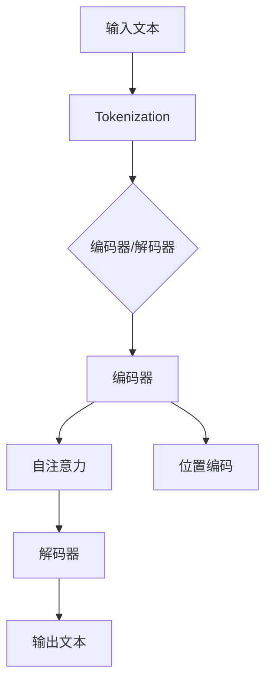

                 

# 大语言模型原理与工程实践：大语言模型的涌现能力

> 关键词：大语言模型、Transformer、NLP、预训练、应用实例

> 摘要：本文将深入探讨大语言模型的基本原理、工程实践，以及其在不同应用场景中的涌现能力。通过一步步的分析推理，我们将揭示大语言模型的内在机制，并讨论其在实际开发中的应用。

## 第1章: 大语言模型概述

### 1.1 大语言模型的定义与背景

大语言模型（Large Language Models）是指具有数十亿至千亿参数规模的神经网络模型，用于理解和生成自然语言。这种模型的兴起可以追溯到神经网络和深度学习技术的快速发展，特别是在自然语言处理（NLP）领域。

大语言模型的发展历程可以分为以下几个阶段：

1. **词袋模型（Bag of Words）**：早期的语言模型采用词袋模型，将文本表示为词汇的集合，这种方法忽略了词汇的顺序，因此捕捉不到语言的结构性特征。
2. **n-gram模型**：n-gram模型通过计算连续n个词的联合概率来生成文本，这种方法考虑了词汇的顺序，但无法捕捉长距离的依赖关系。
3. **循环神经网络（RNN）**：RNN引入了序列记忆机制，能够处理变长的序列数据，并在语音识别和语言建模方面取得了显著进展。
4. **长短期记忆网络（LSTM）**：LSTM是对RNN的改进，能够更好地处理长距离依赖问题，但仍然存在计算复杂度和梯度消失的问题。
5. **Transformer与自注意力机制**：Transformer模型引入了自注意力机制，通过并行计算解决了RNN的序列依赖问题，并在BERT和GPT等模型中得到了广泛应用。
6. **大规模预训练模型**：随着计算资源和数据集的增大，大规模预训练模型如GPT-2、GPT-3、T5等相继出现，这些模型具有数十亿至千亿参数规模，能够在多种NLP任务中取得卓越性能。

大语言模型的重要性体现在以下几个方面：

1. **文本生成与摘要**：大语言模型能够生成高质量的文本，应用于文本摘要、自动写作、对话系统等。
2. **机器翻译**：大语言模型在机器翻译领域表现出色，能够实现高效、准确的跨语言翻译。
3. **问答系统**：大语言模型能够理解自然语言问题，并给出相关、准确的回答，应用于智能客服、教育辅导等。
4. **代码生成**：大语言模型能够根据自然语言描述生成代码，应用于代码自动生成、编程助手等。

### 1.2 大语言模型的核心原理

为了深入理解大语言模型，我们首先需要了解其基本架构。以下是Mermaid流程图，展示了大语言模型的基本架构：



在编码器和解码器之间，我们使用自注意力机制来处理序列依赖。自注意力机制通过计算输入序列中每个词与其他词的相似度，从而生成上下文信息。具体来说，自注意力机制包括以下步骤：

1. **计算query、key、value**：对于每个词，计算其在query、key、value三个空间中的表示。
2. **计算注意力分数**：使用query和key的相似度作为注意力分数，计算输入序列中每个词的注意力权重。
3. **加权求和**：将注意力权重与value相乘，并求和，得到每个词的上下文表示。

以下是自注意力机制的数学公式：

$$
\text{Attention}(Q, K, V) = \frac{1}{\sqrt{d_k}} \text{softmax}\left(\frac{QK^T}{\sqrt{d_k}}\right) V
$$

其中，$Q$、$K$、$V$ 分别代表query、key、value三个矩阵，$d_k$ 代表key的维度。

除了自注意力机制，大语言模型还包括位置编码（Positional Encoding），用于引入序列信息。位置编码通常使用正弦和余弦函数，将位置信息编码到词的嵌入中。以下是位置编码的数学公式：

$$
\text{PositionalEncoding}(d_{model}, position) = \sin\left(\frac{position}{10000^{2i/d_{model}}}\right) \text{ or } \cos\left(\frac{position}{10000^{2i/d_{model}}}\right)
$$

其中，$d_{model}$ 代表模型维度，$position$ 代表词的位置。

在大语言模型中，编码器和解码器通常包含多个自注意力层和前馈神经网络（Feedforward Neural Network）。以下是Transformer算法的伪代码：

```
function Transformer(inputs, sequence_length, d_model):
    # Embeddings and positional encoding
    embeddings = Embeddings(d_model, vocabulary_size) + PositionalEncoding(d_model, sequence_length)
    inputs = embeddings(inputs)

    # Encoder
    for layer in range(num_layers):
        inputs = EncoderLayer(inputs, d_model, num_heads, dff)

    # Decoder
    for layer in range(num_layers):
        inputs = DecoderLayer(inputs, d_model, num_heads, dff)

    # Final linear projection
    outputs = Linear(d_model, vocabulary_size)(inputs)
    return outputs
```

### 1.3 数学模型与数学公式

在自注意力机制中，关键的计算包括查询（query）、键（key）和值（value）的生成。以下是自注意力的数学公式：

$$
\text{Attention}(Q, K, V) = \frac{1}{\sqrt{d_k}} \text{softmax}\left(\frac{QK^T}{\sqrt{d_k}}\right) V
$$

其中，$Q$、$K$、$V$ 分别代表query、key、value三个矩阵，$d_k$ 代表key的维度。

位置编码用于引入序列信息，以下是一个简单的位置编码公式：

$$
\text{PositionalEncoding}(d_{model}, position) = \sin\left(\frac{position}{10000^{2i/d_{model}}}\right) \text{ or } \cos\left(\frac{position}{10000^{2i/d_{model}}}\right)
$$

其中，$d_{model}$ 代表模型维度，$position$ 代表词的位置。

在Transformer模型中，每个编码器和解码器层包含多个自注意力层和前馈神经网络。以下是Transformer模型的简化伪代码：

```
function EncoderLayer(inputs, d_model, num_heads, dff):
    # Multi-head self-attention
    attention = MultiHeadAttention(inputs, d_model, num_heads)

    # Residual connection and layer normalization
    outputs = add(inputs, attention)
    outputs = LayerNorm(d_model)(outputs)

    # Feedforward neural network
    outputs = FFN(d_model, dff)(outputs)

    # Residual connection and layer normalization
    outputs = add(outputs, inputs)
    outputs = LayerNorm(d_model)(outputs)
    return outputs

function DecoderLayer(inputs, d_model, num_heads, dff):
    # Masked multi-head self-attention
    attention = MaskedMultiHeadAttention(inputs, d_model, num_heads)

    # Residual connection and layer normalization
    outputs = add(inputs, attention)
    outputs = LayerNorm(d_model)(outputs)

    # Encoder-decoder attention
    attention = MultiHeadAttention(inputs, d_model, num_heads)

    # Residual connection and layer normalization
    outputs = add(outputs, attention)
    outputs = LayerNorm(d_model)(outputs)

    # Feedforward neural network
    outputs = FFN(d_model, dff)(outputs)

    # Residual connection and layer normalization
    outputs = add(outputs, inputs)
    outputs = LayerNorm(d_model)(outputs)
    return outputs
```

### 1.4 大语言模型的关键算法原理

Transformer模型是现代大语言模型的核心算法，其关键在于自注意力机制（Self-Attention）和多头注意力（Multi-Head Attention）。

自注意力机制允许模型在处理序列数据时，对序列中的每个元素赋予不同的权重，从而捕捉到序列之间的复杂依赖关系。具体来说，自注意力机制通过以下步骤实现：

1. **计算查询（Query）、键（Key）和值（Value）**：每个序列元素都会被映射到这三个空间中的一个，从而生成对应的向量。
2. **计算注意力分数**：通过点积操作，计算查询和键之间的相似度，得到注意力分数。
3. **应用Softmax函数**：对注意力分数进行归一化处理，得到每个元素的概率分布。
4. **加权求和**：将概率分布与值相乘，并求和，得到序列的加权表示。

以下是自注意力机制的伪代码：

```
function SelfAttention(inputs, d_model):
    # Calculate query, key, value
    query, key, value = MultiHead(inputs, d_model)

    # Compute attention scores
    attention_scores = dot(query, key.T) / sqrt(d_k)

    # Apply softmax function
    attention_weights = softmax(attention_scores)

    # Weighted sum
    attention_output = dot(attention_weights, value)
    return attention_output
```

多头注意力（Multi-Head Attention）是对自注意力机制的扩展，通过将输入序列分成多个部分，每个部分独立进行自注意力计算，从而增加模型的容量。具体来说，多头注意力包括以下步骤：

1. **划分输入**：将输入序列划分为多个子序列。
2. **独立计算自注意力**：对每个子序列独立进行自注意力计算。
3. **合并输出**：将所有子序列的输出进行合并，得到最终的注意力输出。

以下是多头注意力的伪代码：

```
function MultiHeadAttention(inputs, d_model, num_heads):
    # Split inputs into multiple heads
    head_size = d_model / num_heads
    queries, keys, values = split(inputs, num_heads, head_size)

    # Compute attention for each head
    attention_heads = [SelfAttention(queries, keys, values) for _ in range(num_heads)]

    # Concatenate attention heads
    attention_output = concatenate(attention_heads)
    return attention_output
```

### 1.5 大语言模型的应用场景

大语言模型在自然语言处理（NLP）领域具有广泛的应用，以下是一些主要的应用场景：

1. **文本生成**：大语言模型能够生成高质量的文本，应用于自动写作、文本摘要、对话系统等。例如，GPT-2和GPT-3模型能够生成连贯、自然的文本。
2. **机器翻译**：大语言模型在机器翻译领域表现出色，能够实现高效、准确的跨语言翻译。例如，Transformer模型和BERT模型在机器翻译任务中取得了领先性能。
3. **问答系统**：大语言模型能够理解自然语言问题，并给出相关、准确的回答。例如，BERT和GPT模型被广泛应用于智能客服、教育辅导等领域。
4. **代码生成**：大语言模型能够根据自然语言描述生成代码，应用于代码自动生成、编程助手等。例如，TabNine和GitHub Copilot等工具基于大语言模型实现了代码生成功能。

## 第2章: 语言处理基础技术

### 2.1 自然语言处理（NLP）简介

自然语言处理（NLP）是计算机科学和人工智能领域的一个重要分支，旨在使计算机能够理解、解释和生成自然语言。NLP的基本任务包括文本分类、情感分析、命名实体识别、机器翻译等。以下是对NLP基本任务的简要介绍：

1. **文本分类**：文本分类是将文本数据按照特定的类别进行分类的过程。常见的应用场景包括垃圾邮件过滤、新闻分类、社交媒体情感分析等。
2. **情感分析**：情感分析是判断文本中表达的情感倾向，如正面、负面或中性。情感分析广泛应用于消费者反馈分析、社交媒体监控、市场调研等。
3. **命名实体识别**：命名实体识别是识别文本中的特定实体，如人名、地名、组织名等。命名实体识别是信息抽取和知识图谱构建的重要基础。
4. **机器翻译**：机器翻译是将一种自然语言文本翻译成另一种自然语言的过程。机器翻译在跨语言沟通、国际商业、多语言文档处理等领域具有重要意义。

在NLP任务中，词嵌入（Word Embedding）技术扮演着重要角色。词嵌入是将词汇映射到高维向量空间的技术，通过向量表示词汇的语义和语法信息。常见的词嵌入技术包括：

1. **Word2Vec**：Word2Vec是一种基于神经网络的语言模型，通过训练生成词向量，使词向量能够捕捉词汇的语义和语法关系。
2. **GloVe**：GloVe（Global Vectors for Word Representation）是一种基于矩阵分解的语言模型，通过优化词汇共现矩阵来生成词向量。
3. **BERT**：BERT（Bidirectional Encoder Representations from Transformers）是一种基于Transformer的语言模型，通过双向编码器生成词向量，捕捉词汇的前后文关系。

序列标注（Sequence Labeling）与分类任务密切相关，包括以下几种常见类型：

1. **实体识别（Named Entity Recognition, NER）**：实体识别是识别文本中的特定实体，如人名、地名、组织名等。
2. **词性标注（Part-of-Speech Tagging, POS）**：词性标注是识别文本中每个词的词性，如名词、动词、形容词等。
3. **情感极性标注（Sentiment Analysis）**：情感极性标注是判断文本中的情感倾向，如正面、负面或中性。

序列标注任务通常采用CRF（Conditional Random Fields）或LSTM（Long Short-Term Memory）等模型进行建模。以下是一个简单的序列标注任务示例：

给定一个句子“我喜欢吃苹果”，我们需要将其标注为“（我/人名）喜欢（吃/动词）苹果（/名词）/。”。以下是一个基于LSTM的序列标注任务示例：

```
class SequenceLabelingModel(nn.Module):
    def __init__(self, embedding_dim, hidden_dim, vocab_size, label_size):
        super(SequenceLabelingModel, self).__init__()
        self.embedding = nn.Embedding(vocab_size, embedding_dim)
        self.lstm = nn.LSTM(embedding_dim, hidden_dim, batch_first=True)
        self.fc = nn.Linear(hidden_dim, label_size)

    def forward(self, inputs, labels=None):
        embedded = self.embedding(inputs)
        outputs, _ = self.lstm(embedded)
        logits = self.fc(outputs)
        if labels is not None:
            loss = F.cross_entropy(logits, labels)
            return loss
        return logits
```

### 2.2 序列模型与注意力机制

在自然语言处理中，序列模型（Sequential Models）是一种用于处理变长序列数据的模型，常见的序列模型包括循环神经网络（RNN）、长短期记忆网络（LSTM）和门控循环单元（GRU）。这些模型通过引入序列记忆机制，能够捕捉序列中的长距离依赖关系。

1. **循环神经网络（RNN）**：RNN是第一个用于处理序列数据的神经网络模型，通过在时间步间传递隐藏状态，实现序列信息的记忆。然而，RNN存在梯度消失和梯度爆炸的问题，导致难以学习长距离依赖。
2. **长短期记忆网络（LSTM）**：LSTM是对RNN的改进，引入了门控机制，能够有效地解决梯度消失问题。LSTM通过遗忘门、输入门和输出门，控制信息的保留和更新，从而捕捉长距离依赖。
3. **门控循环单元（GRU）**：GRU是LSTM的简化版本，通过合并输入门和遗忘门，降低了模型的复杂度。GRU在保留记忆方面表现出与LSTM相似的性能，但训练速度更快。

注意力机制（Attention Mechanism）是一种用于捕捉序列中关键信息的技术，通过为序列中的每个元素分配不同的权重，实现对关键信息的聚焦。注意力机制在机器翻译、文本摘要、问答系统等领域取得了显著的性能提升。

注意力机制可以分为以下几种类型：

1. **自注意力（Self-Attention）**：自注意力机制是对序列中的每个元素进行加权求和，捕捉序列中的全局依赖关系。自注意力机制是Transformer模型的核心组成部分。
2. **编码器-解码器注意力（Encoder-Decoder Attention）**：编码器-解码器注意力机制是在编码器和解码器之间传递注意力权重，捕捉序列之间的依赖关系。编码器-解码器注意力机制是传统的机器翻译模型（如Seq2Seq）的核心组成部分。
3. **多头注意力（Multi-Head Attention）**：多头注意力机制是将自注意力机制扩展到多个头（即多个独立的自注意力层），增加模型的容量和表达能力。多头注意力机制是Transformer模型的关键组成部分。

以下是一个基于多头注意力的编码器-解码器模型的简化伪代码：

```
class Encoder(nn.Module):
    def __init__(self, input_dim, hidden_dim, num_heads):
        super(Encoder, self).__init__()
        self.embedding = nn.Embedding(input_dim, hidden_dim)
        self.attention = MultiHeadAttention(hidden_dim, num_heads)
        self.fc = nn.Linear(hidden_dim, output_dim)

    def forward(self, inputs):
        embedded = self.embedding(inputs)
        attention_output = self.attention(embedded, embedded, embedded)
        outputs = self.fc(attention_output)
        return outputs

class Decoder(nn.Module):
    def __init__(self, input_dim, hidden_dim, output_dim, num_heads):
        super(Decoder, self).__init__()
        self.embedding = nn.Embedding(input_dim, hidden_dim)
        self.attention = MultiHeadAttention(hidden_dim, num_heads)
        self.decoder_attention = MultiHeadAttention(hidden_dim, num_heads)
        self.fc = nn.Linear(hidden_dim, output_dim)

    def forward(self, inputs, encoder_outputs):
        embedded = self.embedding(inputs)
        encoder_attention_output = self.attention(embedded, encoder_outputs, encoder_outputs)
        decoder_attention_output = self.decoder_attention(embedded, encoder_attention_output, encoder_attention_output)
        outputs = self.fc(decoder_attention_output)
        return outputs
```

### 2.3 转换器架构详解

转换器（Transformer）是一种基于自注意力机制的序列到序列模型，广泛应用于机器翻译、文本摘要、问答系统等领域。转换器模型的核心思想是并行处理序列数据，通过多头注意力机制捕捉序列中的依赖关系。

转换器架构主要由编码器（Encoder）和解码器（Decoder）两部分组成。编码器将输入序列编码为固定长度的向量，解码器则根据编码器的输出生成输出序列。

1. **编码器（Encoder）**：编码器包含多个编码层（Encoder Layer），每个编码层由多头自注意力机制（Multi-Head Self-Attention）和前馈神经网络（Feedforward Neural Network）组成。编码层的输出经过层归一化（Layer Normalization）和残差连接（Residual Connection），增强模型的稳定性。

   ```mermaid
   graph TD
       A[Input] --> B[Embedding Layer]
       B --> C[Encoder Layer 1]
       C --> D[Encoder Layer 2]
       D --> E[Encoder Layer 3]
       E --> F[Encoder Output]
   ```

   编码器的伪代码如下：

   ```python
   class Encoder(nn.Module):
       def __init__(self, d_model, nhead, num_layers, dim_feedforward):
           super(Encoder, self).__init__()
           self.layers = nn.ModuleList([EncoderLayer(d_model, nhead, dim_feedforward) for _ in range(num_layers)])
           self.norm = nn.LayerNorm(d_model)

       def forward(self, src):
           output = src
           for layer in self.layers:
               output = layer(output)
           return self.norm(output)
   ```

2. **解码器（Decoder）**：解码器包含多个解码层（Decoder Layer），每个解码层由多头自注意力机制、编码器-解码器注意力机制和前馈神经网络组成。解码层的输出经过层归一化和残差连接。

   ```mermaid
   graph TD
       A[Input] --> B[Embedding Layer]
       B --> C[Decoder Layer 1]
       C --> D[Decoder Layer 2]
       D --> E[Decoder Layer 3]
       E --> F[Decoder Output]
   ```

   解码器的伪代码如下：

   ```python
   class Decoder(nn.Module):
       def __init__(self, d_model, nhead, num_layers, dim_feedforward):
           super(Decoder, self).__init__()
           self.layers = nn.ModuleList([DecoderLayer(d_model, nhead, dim_feedforward) for _ in range(num_layers)])
           self.norm = nn.LayerNorm(d_model)

       def forward(self, tgt, memory):
           output = tgt
           for layer in self.layers:
               output = layer(output, memory)
           return self.norm(output)
   ```

3. **多头注意力（Multi-Head Attention）**：多头注意力机制是转换器的关键组成部分，通过将输入序列分成多个部分，独立进行自注意力计算，从而增加模型的容量和表达能力。

   多头注意力的伪代码如下：

   ```python
   class MultiHeadAttention(nn.Module):
       def __init__(self, d_model, nhead):
           super(MultiHeadAttention, self).__init__()
           self.d_model = d_model
           self.nhead = nhead
           self.head_size = d_model // nhead
           self.query_linear = nn.Linear(d_model, d_model)
           self.key_linear = nn.Linear(d_model, d_model)
           self.value_linear = nn.Linear(d_model, d_model)
           self.out_linear = nn.Linear(nhead * self.head_size, d_model)

       def forward(self, query, key, value):
           query = self.query_linear(query)
           key = self.key_linear(key)
           value = self.value_linear(value)
           attention_scores = torch.matmul(query, key.transpose(0, 1)) / math.sqrt(self.head_size)
           attention_weights = F.softmax(attention_scores, dim=1)
           attention_output = torch.matmul(attention_weights, value)
           attention_output = self.out_linear(attention_output)
           return attention_output
   ```

4. **前馈神经网络（Feedforward Neural Network）**：前馈神经网络是对输入序列进行非线性变换的模块，通常包含两个线性层，中间加入ReLU激活函数。

   前馈神经网络的伪代码如下：

   ```python
   class Feedforward(nn.Module):
       def __init__(self, d_model, dim_feedforward):
           super(Feedforward, self).__init__()
           self.linear1 = nn.Linear(d_model, dim_feedforward)
           self.linear2 = nn.Linear(dim_feedforward, d_model)
           self.relu = nn.ReLU()

       def forward(self, x):
           x = self.relu(self.linear1(x))
           x = self.linear2(x)
           return x
   ```

5. **编码器-解码器注意力（Encoder-Decoder Attention）**：编码器-解码器注意力机制是解码器中的一个关键模块，通过将编码器的输出作为输入，计算编码器和解码器之间的依赖关系。

   编码器-解码器注意力的伪代码如下：

   ```python
   class EncoderDecoderAttention(nn.Module):
       def __init__(self, d_model, nhead):
           super(EncoderDecoderAttention, self).__init__()
           self.d_model = d_model
           self.nhead = nhead
           self.head_size = d_model // nhead
           self.query_linear = nn.Linear(d_model, d_model)
           self.key_linear = nn.Linear(d_model, d_model)
           self.value_linear = nn.Linear(d_model, d_model)
           self.out_linear = nn.Linear(nhead * self.head_size, d_model)

       def forward(self, query, key, value):
           query = self.query_linear(query)
           key = self.key_linear(key)
           value = self.value_linear(value)
           attention_scores = torch.matmul(query, key.transpose(0, 1)) / math.sqrt(self.head_size)
           attention_weights = F.softmax(attention_scores, dim=1)
           attention_output = torch.matmul(attention_weights, value)
           attention_output = self.out_linear(attention_output)
           return attention_output
   ```

通过编码器和解码器之间的交互，转换器模型能够捕捉输入序列中的长距离依赖关系，实现高效的序列处理。

### 2.4 预训练与微调技术

预训练与微调技术是当前自然语言处理领域的关键技术，特别是对于大规模语言模型如BERT、GPT等。预训练（Pre-training）是指在大规模语料库上对模型进行训练，使其获得通用语言表示能力；微调（Fine-tuning）则是在预训练的基础上，针对特定任务进行细粒度调整，以提高任务性能。

#### 预训练的概念

预训练是一种通过在大规模语料库上训练模型，使其获得通用语言表示能力的方法。预训练的目标是使模型能够理解和生成自然语言，从而在多种任务上表现出色。预训练的过程可以分为以下步骤：

1. **数据收集**：收集大规模的文本数据，如维基百科、新闻、社交媒体等。
2. **数据预处理**：对文本数据进行清洗、分词、去停用词等预处理操作。
3. **模型初始化**：初始化预训练模型，通常采用预训练框架如BERT、GPT等。
4. **预训练过程**：在预训练模型上运行训练算法，如随机梯度下降（SGD）或Adam优化器，通过反向传播更新模型参数。
5. **模型评估**：在预训练过程中，定期评估模型在验证集上的性能，以避免过拟合。

#### 自监督学习

自监督学习（Self-supervised Learning）是一种预训练技术，通过利用未标注的数据进行训练，从而提高模型的性能。自监督学习的核心思想是利用数据中的潜在信息，为每个数据点生成一个监督信号，然后训练模型预测这个监督信号。

在自然语言处理中，自监督学习的方法包括：

1. **掩码语言模型（Masked Language Model, MLM）**：在输入文本中随机掩码一定比例的单词，然后训练模型预测这些掩码的单词。
2. **序列分类（Sequence Classification）**：将输入文本的每个子序列作为输入，训练模型预测子序列的类别。
3. **下一个句子预测（Next Sentence Prediction, NSP）**：给定两个连续的句子，训练模型预测第二个句子是否是第一个句子的下一个句子。

#### 迁移学习

迁移学习（Transfer Learning）是一种将一个任务学到的知识应用于另一个任务的方法。在自然语言处理中，迁移学习通常是指将预训练模型应用于特定任务，通过微调（Fine-tuning）来提高任务性能。

迁移学习的过程可以分为以下步骤：

1. **预训练模型**：在大规模语料库上预训练一个通用语言模型，如BERT、GPT等。
2. **任务定义**：定义具体的任务，如文本分类、情感分析、命名实体识别等。
3. **微调过程**：将预训练模型应用于特定任务，通过在少量标注数据上训练，更新模型参数。
4. **模型评估**：在测试集上评估微调模型的性能，以确定模型的泛化能力。

#### 微调技术

微调（Fine-tuning）是迁移学习的关键步骤，通过在特定任务上调整预训练模型的参数，使其适应特定任务。微调技术包括以下方面：

1. **学习率调整**：在微调过程中，通常采用较小的学习率，以避免模型参数的剧烈变化。
2. **梯度裁剪**：为了防止梯度爆炸和消失，可以对梯度进行裁剪。
3. **批次归一化**：在微调过程中，可以关闭批次归一化，以避免模型参数的剧烈变化。
4. **数据增强**：通过数据增强技术，如随机掩码、随机切分、随机填充等，增加模型的鲁棒性。

通过预训练与微调技术，大规模语言模型能够在大规模语料库上获得通用语言表示能力，并在特定任务上表现出色。这些技术不仅提高了模型的性能，还为自然语言处理领域带来了新的突破。

### 第3章: 大语言模型的训练与优化

#### 3.1 训练数据集的选取与预处理

在大规模语言模型的训练过程中，数据集的选取与预处理是至关重要的环节。选择合适的数据集和进行有效的预处理能够显著提升模型的训练效果和最终性能。以下是训练数据集的选取与预处理方法的详细讨论。

#### 数据集的收集与清洗

1. **数据收集**：大规模语言模型的训练数据通常来源于互联网上的大量文本资源，如维基百科、新闻文章、社交媒体帖子、书籍等。此外，还可以使用专门的语料库和开源数据集，如Common Crawl、Wikipedia、Gutenberg等。

2. **数据清洗**：收集到的数据通常包含噪声、冗余信息和格式不一致等问题。因此，数据清洗是预处理过程中的重要步骤。具体方法包括：

   - **去除停用词**：停用词是指在自然语言处理中普遍认为对文本内容贡献较小的词，如“的”、“和”、“是”等。去除停用词可以减少数据噪声，提高模型训练效果。
   - **去除特殊字符和标点符号**：特殊字符和标点符号可能对模型训练产生干扰，因此通常在预处理过程中将其去除。
   - **统一文本格式**：将不同来源的文本统一成相同的格式，如统一使用半角字符、统一换行符等。

#### 数据预处理方法

1. **分词**：分词是将文本拆分成词（Token）的过程。对于中文文本，通常使用分词工具如jieba进行分词；对于英文文本，可以使用经典的分词工具如spaCy或NLTK。

2. **词向量化**：词向量化是将文本中的词映射到高维向量空间的技术。常用的词向量化方法包括Word2Vec、GloVe、BERT等。通过词向量化，文本数据可以转化为计算机可处理的数值形式，便于模型训练。

3. **词嵌入**：词嵌入是将词映射到固定维度的向量表示。词嵌入不仅能够表示词的语义信息，还可以通过计算词向量之间的距离来衡量词与词之间的相关性。常见的词嵌入方法包括Word2Vec、GloVe和BERT等。

4. **文本清洗**：除了去除停用词和特殊字符外，文本清洗还包括去除HTML标签、统一文本编码、去除重复文本等。

5. **数据增强**：数据增强是通过变换原始数据来生成更多样化的数据集，从而提高模型泛化能力。常见的数据增强方法包括随机掩码、同义词替换、文本切分等。

#### 数据增强技术

1. **随机掩码（Random Masking）**：随机掩码是在输入文本中随机选择一部分词进行掩码，然后训练模型预测这些掩码的词。这种方法能够提高模型对上下文信息的理解能力。

2. **同义词替换（Synonym Replacement）**：同义词替换是将文本中的某些词替换为它们的同义词。这种方法能够增强模型对词义的泛化能力。

3. **文本切分（Text Splitting）**：文本切分是将文本拆分成更小的子序列，然后训练模型预测子序列的类别或标签。这种方法能够增强模型对序列信息的学习。

4. **噪声注入（Noise Injection）**：噪声注入是在输入文本中添加随机噪声，如随机字符、随机词替换等。这种方法能够提高模型对噪声数据的鲁棒性。

通过选择合适的数据集和进行有效的预处理，能够为大规模语言模型的训练提供高质量的数据，从而提高模型的性能和泛化能力。

### 3.2 训练策略与优化算法

大规模语言模型的训练是一个复杂的过程，涉及到多种训练策略和优化算法。以下将详细介绍常见的训练策略与优化算法，包括梯度下降（Gradient Descent）、Adam优化器、批处理大小（Batch Size）、学习率（Learning Rate）等。

#### 梯度下降算法

梯度下降是一种最基本的优化算法，用于最小化损失函数。在机器学习中，梯度下降算法通过计算损失函数关于模型参数的梯度，然后沿着梯度方向更新模型参数，以逐步减小损失函数。

1. **批量梯度下降（Batch Gradient Descent）**：批量梯度下降在每次更新模型参数时使用整个训练集的梯度。这种方法能够确保模型参数更新的方向和大小都是全局最优的，但训练过程较慢，因为需要等待整个训练集的梯度计算完毕。

2. **随机梯度下降（Stochastic Gradient Descent, SGD）**：随机梯度下降在每次更新模型参数时仅使用一个训练样本的梯度。这种方法能够显著提高训练速度，但可能会导致模型参数更新的方向和大小波动较大。

3. **小批量梯度下降（Mini-batch Gradient Descent）**：小批量梯度下降在每次更新模型参数时使用一部分训练样本的梯度。这种方法结合了批量梯度下降和随机梯度下降的优点，通过选择合适的批量大小，能够在保证训练速度的同时提高模型的稳定性和收敛速度。

#### Adam优化器

Adam优化器是一种结合了SGD和Adagrad优点的自适应优化算法。Adam优化器在训练过程中动态调整学习率，能够更好地适应不同的训练阶段。

1. **一阶矩估计（First-Moment Estimation）**：Adam优化器通过计算梯度的一阶矩（均值）来估计模型的更新方向。
2. **二阶矩估计（Second-Moment Estimation）**：Adam优化器通过计算梯度二阶矩（方差）来估计模型的更新速率。
3. **自适应学习率**：Adam优化器根据一阶矩估计和二阶矩估计动态调整学习率，从而在训练过程中保持稳定的收敛速度。

#### 批处理大小（Batch Size）

批处理大小是指在每次梯度更新时使用的训练样本数量。合适的批处理大小能够提高模型的训练效果和收敛速度。

1. **小批处理**：小批处理（如32或64个样本）能够减少每次梯度更新的方差，提高模型的稳定性和收敛速度。
2. **大批处理**：大批处理（如1024或2048个样本）能够减少训练迭代次数，提高训练速度。

#### 学习率（Learning Rate）

学习率是梯度下降算法中一个重要的超参数，决定了模型参数更新的步长。合适的学习率能够加速模型的收敛速度，而学习率过大或过小都可能影响训练效果。

1. **初始学习率**：初始学习率通常设置为较小的值（如$10^{-3}$或$10^{-4}$），以避免模型参数更新的剧烈波动。
2. **学习率衰减**：在训练过程中，学习率通常会随着时间的推移逐渐减小，以避免模型在训练后期过拟合。

#### 训练技巧

1. **Dropout**：Dropout是一种正则化技术，通过随机丢弃一部分神经元，减少模型过拟合的风险。
2. **正则化**：正则化包括L1和L2正则化，通过在损失函数中添加正则化项，控制模型参数的范数，减少过拟合。
3. **数据增强**：数据增强通过变换原始数据生成更多样化的训练样本，提高模型的泛化能力。

通过选择合适的训练策略和优化算法，能够有效地提高大规模语言模型的训练效果和收敛速度。

### 3.3 大规模训练的挑战与解决方案

大规模训练大语言模型面临着一系列挑战，包括计算资源需求、数据并行与模型并行等。以下将详细讨论这些挑战及其解决方案。

#### GPU与TPU的使用

1. **GPU**：GPU（Graphics Processing Unit）是一种用于图形渲染的处理器，近年来在机器学习领域得到了广泛应用。GPU具有高并行计算能力，适用于大规模矩阵运算和向量计算。在训练大语言模型时，可以使用多GPU并行训练来加速模型训练过程。

2. **TPU**：TPU（Tensor Processing Unit）是谷歌专门为深度学习任务设计的硬件加速器。TPU具有高度优化的张量计算能力，适用于大规模深度学习模型的训练。与GPU相比，TPU在训练深度神经网络时具有更高的计算效率。

3. **GPU与TPU的配合**：在实际应用中，可以将GPU和TPU相结合，充分发挥两者的优势。例如，在模型训练初期使用GPU进行大规模数据预处理和训练，然后在模型收敛后期使用TPU进行模型微调和优化。

#### 数据并行与模型并行

1. **数据并行（Data Parallelism）**：数据并行是一种并行训练方法，通过将训练数据集划分为多个子集，分别在不同的GPU或TPU上进行训练。数据并行可以显著提高训练速度，但可能会导致模型参数更新不同步，需要使用同步策略如全局同步或异步同步。

2. **模型并行（Model Parallelism）**：模型并行是一种将模型划分为多个部分，分别在不同的GPU或TPU上进行训练的方法。模型并行可以处理较大的模型，但需要解决跨设备通信和数据传输问题。

3. **数据并行与模型并行的结合**：在实际应用中，可以将数据并行和模型并行相结合，最大化利用计算资源。例如，可以将模型的不同部分分布在多个GPU或TPU上，同时将训练数据划分为多个子集，分别在不同的设备上进行训练。

#### 模型压缩与量化

1. **模型压缩（Model Compression）**：模型压缩是通过减小模型参数数量和维度来减小模型大小的方法。常见的方法包括剪枝（Pruning）、量化（Quantization）和蒸馏（Distillation）。模型压缩可以提高模型训练效率和部署效率。

2. **量化（Quantization）**：量化是一种将模型参数从高精度浮点数转换为低精度整数的技巧。量化可以显著减少模型大小和存储需求，同时提高模型推理速度。常见的量化方法包括全精度量化（Full Precision Quantization）和低精度量化（Low Precision Quantization）。

3. **蒸馏（Distillation）**：蒸馏是一种将大模型的知识传递给小模型的方法。在大模型训练过程中，可以将小模型的参数更新反馈到大模型中，从而提高小模型的性能。蒸馏可以用于减少模型大小和提高模型推理效率。

通过使用GPU、TPU等计算资源，结合数据并行和模型并行，以及模型压缩与量化技术，可以有效地应对大规模训练大语言模型面临的挑战，提高训练效率和应用部署效果。

### 3.4 模型评估与调优

在训练大语言模型时，模型评估与调优是确保模型性能的重要环节。以下将详细讨论模型评估的方法、评价指标以及调优技巧。

#### 评价指标

1. **Perplexity（困惑度）**：Perplexity是评估语言模型性能的一个常用指标，表示模型在预测下一个词时的不确定性。Perplexity的计算公式为：

   $$
   \text{Perplexity} = \exp\left(\frac{1}{N}\sum_{i=1}^{N} -\log p(y_i|x_1, x_2, ..., x_{i-1})\right)
   $$

   其中，$N$ 是序列长度，$p(y_i|x_1, x_2, ..., x_{i-1})$ 是模型在给定前一个词序列后预测当前词的概率。Perplexity值越小，表示模型性能越好。

2. **BLEU Score（BLEU分数）**：BLEU分数是一种常用于机器翻译性能评估的指标，通过比较机器翻译结果与人工翻译结果的重叠度来评估翻译质量。BLEU分数的计算公式为：

   $$
   \text{BLEU Score} = \frac{1}{n}\sum_{i=1}^{n} b_i \cdot f_1 \cdot f_2 \cdot ... \cdot f_n
   $$

   其中，$n$ 是评估指标的数量，$b_i$ 是第$i$个评估指标的计算结果，$f_1, f_2, ..., f_n$ 是各个评估指标的具体计算方法。BLEU分数值越大，表示翻译质量越好。

3. **Accuracy（准确率）**：准确率是分类任务中评估模型性能的常用指标，表示模型正确预测的样本数量与总样本数量的比例。准确率的计算公式为：

   $$
   \text{Accuracy} = \frac{\text{正确预测的样本数量}}{\text{总样本数量}}
   $$

   准确率越高，表示模型分类效果越好。

4. **F1 Score（F1分数）**：F1分数是综合考虑准确率和召回率的指标，用于评估二分类任务。F1分数的计算公式为：

   $$
   \text{F1 Score} = 2 \cdot \frac{\text{准确率} \cdot \text{召回率}}{\text{准确率} + \text{召回率}}
   $$

   F1分数同时考虑了模型的准确率和召回率，能够更全面地评估模型性能。

#### 评估方法

1. **验证集评估**：在模型训练过程中，将数据集划分为训练集和验证集。训练集用于模型训练，验证集用于模型评估。通过在验证集上评估模型性能，可以及时发现过拟合或欠拟合等问题，并进行模型调优。

2. **测试集评估**：在模型训练完成后，使用未参与训练的测试集对模型进行最终评估。测试集评估可以更真实地反映模型在未知数据上的性能，从而衡量模型的泛化能力。

3. **交叉验证**：交叉验证是一种常用的评估方法，通过多次划分训练集和验证集，对模型进行多次评估。交叉验证能够提高评估结果的稳定性，减少评估误差。

#### 调优技巧

1. **超参数搜索**：超参数搜索是调优模型的重要方法，通过遍历或随机搜索超参数空间，找到最优的超参数组合。常用的超参数包括学习率、批量大小、隐藏层神经元数量、正则化参数等。

2. **模型集成**：模型集成是将多个模型集成在一起，通过投票或加权平均等方法得到最终预测结果。模型集成可以显著提高模型的性能和稳定性。

3. **数据增强**：数据增强是通过变换原始数据生成更多样化的训练样本，提高模型的泛化能力。常见的数据增强方法包括随机掩码、同义词替换、文本切分等。

4. **迁移学习**：迁移学习是将预训练模型应用于特定任务，通过微调模型参数来提高任务性能。迁移学习可以减少训练数据需求，提高模型泛化能力。

通过合理的模型评估与调优技巧，可以确保大规模语言模型在实际应用中达到最佳性能。

### 第4章: 大语言模型的应用实例

#### 4.1 文本生成应用

文本生成是大规模语言模型最典型的应用之一，能够生成连贯、自然的文本。以下将介绍几种常见的文本生成应用，包括文本摘要、对话系统和自动写作等。

##### 文本摘要

文本摘要是将长文本转化为简洁、准确的摘要的过程。常见的文本摘要方法包括抽取式摘要和生成式摘要。

1. **抽取式摘要**：抽取式摘要从原始文本中提取关键句子或段落，形成摘要。这种方法通常使用规则或机器学习模型进行句子重要性评分，然后选取得分较高的句子作为摘要。

2. **生成式摘要**：生成式摘要通过训练大规模语言模型，直接生成摘要文本。这种方法通常使用预训练模型如GPT-2、GPT-3等，通过输入原始文本，模型自动生成摘要文本。

以下是一个基于GPT-2的文本摘要示例：

```python
from transformers import AutoTokenizer, AutoModel

# 加载预训练模型
tokenizer = AutoTokenizer.from_pretrained("gpt2")
model = AutoModel.from_pretrained("gpt2")

# 输入文本
text = "苹果公司将于本周发布新款iPhone。预计新机将采用更先进的处理器和相机技术，同时取消3.5毫米耳机接口。"

# 分词并编码
input_ids = tokenizer.encode(text, return_tensors="pt")

# 生成摘要
generated_ids = model.generate(input_ids, max_length=50, num_return_sequences=1)

# 解码输出
generated_text = tokenizer.decode(generated_ids[0], skip_special_tokens=True)
print(generated_text)
```

##### 对话系统

对话系统是通过自然语言交互为用户提供服务的系统。常见的对话系统包括聊天机器人、虚拟助手和智能客服等。

1. **规则基对话系统**：规则基对话系统通过定义一系列规则来处理用户输入，根据规则生成回复。这种方法适用于简单的对话场景，但难以应对复杂和多变的对话需求。

2. **基于大规模语言模型的对话系统**：基于大规模语言模型的对话系统通过训练预训练模型，使其能够理解自然语言并生成合适的回复。这种方法能够生成更自然、更连贯的对话。

以下是一个基于GPT-3的对话系统示例：

```python
import openai

# 设置OpenAI API密钥
openai.api_key = "your_api_key"

# 发送请求
response = openai.Completion.create(
    engine="text-davinci-003",
    prompt="你好，我是人工智能助手，请问有什么可以帮助您的？",
    max_tokens=50,
    n=1,
    stop=None,
    temperature=0.5
)

# 输出回复
print(response.choices[0].text.strip())
```

##### 自动写作

自动写作是利用大规模语言模型生成文章、报告、诗歌等文本内容。常见的自动写作应用包括自动写作助手、内容生成平台和创意写作等。

1. **基于模板的自动写作**：基于模板的自动写作通过预定义的模板和参数，自动生成文本内容。这种方法适用于格式化文本生成，如报告、邮件等。

2. **基于生成模型的自动写作**：基于生成模型的自动写作通过训练大规模语言模型，直接生成文本内容。这种方法能够生成更加灵活和创意的文本。

以下是一个基于GPT-3的自动写作示例：

```python
import openai

# 设置OpenAI API密钥
openai.api_key = "your_api_key"

# 发送请求
response = openai.Completion.create(
    engine="text-davinci-003",
    prompt="请写一篇关于人工智能的1000字文章。",
    max_tokens=1000,
    n=1,
    stop=None,
    temperature=0.5
)

# 输出文章
print(response.choices[0].text.strip())
```

通过文本生成应用，大规模语言模型能够为用户提供便捷、自然的文本生成服务，广泛应用于各种领域。

#### 4.2 机器翻译应用

机器翻译是大规模语言模型的另一个重要应用领域，通过将一种自然语言文本翻译成另一种自然语言，实现跨语言沟通和信息共享。以下将介绍机器翻译的基本原理、常见模型以及实际应用案例。

##### 基本原理

机器翻译的基本原理是基于大规模语言模型学习源语言和目标语言之间的对应关系，从而生成目标语言的翻译文本。具体来说，机器翻译包括以下几个步骤：

1. **文本预处理**：对源语言和目标语言文本进行预处理，包括分词、去除停用词、统一文本格式等。
2. **编码**：将预处理后的文本编码为向量表示，通常使用预训练的语言模型生成词向量。
3. **翻译模型**：训练翻译模型，将源语言文本的编码映射到目标语言文本的编码。常见的翻译模型包括基于神经网络的编码器-解码器（Encoder-Decoder）模型和基于注意力机制的Transformer模型。
4. **解码**：将翻译模型生成的目标语言编码解码为自然语言文本。

##### 常见模型

1. **编码器-解码器模型**：编码器-解码器模型是机器翻译的早期模型，通过编码器将源语言文本编码为固定长度的向量，解码器根据编码器输出生成目标语言文本。这种模型通常使用循环神经网络（RNN）或长短期记忆网络（LSTM）构建。

2. **Transformer模型**：Transformer模型是近年来在机器翻译领域取得突破性进展的模型，基于自注意力机制，能够在并行计算和长距离依赖建模方面具有优势。Transformer模型通过多头注意力机制捕捉源语言和目标语言之间的依赖关系，生成高质量的翻译结果。

3. **BERT模型**：BERT（Bidirectional Encoder Representations from Transformers）是一种基于Transformer的双向编码器模型，通过在预训练过程中学习双向语言表示，能够生成高质量的翻译结果。BERT模型在机器翻译任务中表现出色，是当前机器翻译领域的领先模型。

##### 翻译流程与优化

1. **翻译流程**：机器翻译的基本流程包括文本预处理、编码、翻译和解码。具体步骤如下：

   - **文本预处理**：对源语言和目标语言文本进行预处理，包括分词、去除停用词、统一文本格式等。
   - **编码**：使用预训练的语言模型，将预处理后的文本编码为向量表示。
   - **翻译**：训练翻译模型，将源语言编码映射到目标语言编码。翻译模型可以使用编码器-解码器模型或Transformer模型。
   - **解码**：将翻译模型生成的目标语言编码解码为自然语言文本。

2. **优化方法**：为了提高机器翻译的质量，可以采用以下优化方法：

   - **注意力机制优化**：注意力机制是机器翻译模型的关键组成部分，通过优化注意力机制，可以改善翻译结果。常见的注意力优化方法包括双向注意力、多头注意力等。
   - **上下文信息增强**：通过引入上下文信息，可以增强翻译模型对源语言和目标语言之间关系的理解。常见的上下文信息增强方法包括句子级上下文、段落级上下文等。
   - **翻译记忆库**：翻译记忆库是存储已翻译文本的数据库，通过将新文本与翻译记忆库中的文本进行匹配，可以提高翻译结果的质量。常见的翻译记忆库包括GIZA++、OpenMT等。
   - **多模型集成**：通过集成多个翻译模型，可以改善翻译结果的质量和多样性。常见的多模型集成方法包括投票、加权平均等。

##### 实际案例

1. **谷歌翻译**：谷歌翻译是当前最流行的在线翻译服务之一，基于Transformer模型和大规模语言模型进行翻译。谷歌翻译提供多种语言之间的翻译，支持文本翻译、语音翻译和图像翻译等。

2. **微软翻译**：微软翻译是微软公司开发的在线翻译服务，基于BERT模型和大规模语言模型进行翻译。微软翻译支持多种语言之间的翻译，并提供语音翻译、文档翻译等功能。

3. **DeepL翻译**：DeepL翻译是一种先进的在线翻译服务，基于神经网络翻译（NMT）技术进行翻译。DeepL翻译采用双向编码器模型和自注意力机制，生成高质量的翻译结果。DeepL翻译支持多种语言之间的翻译，并提供在线文本翻译和文档翻译等服务。

通过机器翻译应用，大规模语言模型能够实现高效、准确的跨语言翻译，为全球用户带来便捷的沟通和交流体验。

#### 4.3 问答系统应用

问答系统（Question Answering System）是一种人工智能系统，旨在回答用户提出的问题。大语言模型在问答系统中的应用表现出色，能够实现高效、准确的问题回答。以下将介绍问答系统的基本原理、架构以及实际应用案例。

##### 基本原理

问答系统的工作原理通常包括以下步骤：

1. **问题理解**：首先，问答系统需要对用户提出的问题进行理解，提取关键信息。这通常涉及自然语言处理（NLP）技术，如分词、词性标注、命名实体识别等。

2. **答案检索**：在理解了问题之后，问答系统需要在知识库或语料库中检索相关的答案。常见的检索方法包括基于关键词的检索、基于语义的检索等。

3. **答案生成**：最后，问答系统需要根据检索到的信息生成答案。这通常通过大语言模型实现，如GPT、BERT等。大语言模型能够根据问题的上下文和知识库中的信息，生成相关、准确的答案。

##### 问答系统架构

问答系统通常包括以下几个主要组件：

1. **问题处理器**：问题处理器负责对用户提出的问题进行解析和预处理，提取关键信息，如关键词、实体等。

2. **知识库**：知识库是问答系统的基础，用于存储大量的问答对或知识信息。知识库可以采用结构化数据存储（如数据库）或非结构化数据存储（如文档库）。

3. **答案生成器**：答案生成器是基于大语言模型的组件，负责生成问题的答案。答案生成器通常采用预训练的模型，如GPT、BERT等，通过输入问题和相关知识，生成相关、准确的答案。

4. **用户界面**：用户界面是问答系统与用户交互的接口，用于接收用户的问题，展示答案，并提供反馈。

##### 实际案例

1. **谷歌搜索**：谷歌搜索是一个典型的问答系统，用户可以通过搜索引擎提出问题，谷歌搜索会根据用户的查询，在互联网上检索相关网页，并返回最相关的搜索结果。虽然谷歌搜索主要提供网页搜索结果，但也可以看作是一种基于文本的问答系统。

2. **Socratic**：Socratic是谷歌开发的一款教育应用，旨在为学生提供解答数学、科学等问题的服务。Socratic通过自然语言处理技术理解学生的问题，然后在Google Books等知识库中检索相关信息，生成详细的答案。

3. **IBM Watson Assistant**：IBM Watson Assistant是一款商业智能问答系统，能够理解自然语言问题，并生成相关、准确的答案。Watson Assistant广泛应用于客服、客户服务、内部员工支持等领域，帮助企业和组织提供高效、智能的问答服务。

通过问答系统应用，大规模语言模型能够实现智能问答，为用户提供便捷、准确的信息服务。

#### 4.4 代码生成应用

代码生成是大规模语言模型在编程领域的应用，通过自然语言描述生成相应的代码。这一应用为开发人员提供了强大的辅助工具，使得编程变得更加高效和智能化。以下将介绍代码生成的基本原理、流程以及实际应用案例。

##### 基本原理

代码生成的基本原理是通过大规模语言模型学习自然语言与代码之间的映射关系。具体来说，代码生成包括以下几个步骤：

1. **自然语言描述理解**：首先，模型需要理解用户提供的自然语言描述。这通常涉及自然语言处理（NLP）技术，如分词、词性标注、命名实体识别等，以提取关键信息。

2. **代码生成**：在理解了自然语言描述后，模型需要根据描述生成相应的代码。这通常通过预训练的代码生成模型实现，如基于Transformer的模型或GPT模型。

3. **代码优化与验证**：生成的代码通常需要进一步优化和验证，以确保其正确性和可执行性。这包括代码风格检查、语法错误修正、性能优化等。

##### 代码生成流程

代码生成流程通常包括以下几个步骤：

1. **输入自然语言描述**：用户通过自然语言描述其需要生成的代码功能，例如：“编写一个函数，实现两个数的加法运算。”

2. **预处理自然语言**：对输入的自然语言描述进行预处理，包括分词、词性标注、命名实体识别等，以提取关键信息和结构。

3. **编码自然语言描述**：将预处理后的自然语言描述编码为向量表示，通常使用预训练的语言模型生成词向量。

4. **生成代码**：使用预训练的代码生成模型，根据自然语言描述的向量表示生成相应的代码。这通常通过序列到序列（Seq2Seq）模型或生成式模型实现。

5. **代码优化与验证**：对生成的代码进行优化和验证，确保其正确性和可执行性。

以下是一个简单的代码生成示例：

```python
from transformers import AutoTokenizer, AutoModel

# 加载预训练模型
tokenizer = AutoTokenizer.from_pretrained("code-generate")
model = AutoModel.from_pretrained("code-generate")

# 输入自然语言描述
description = "编写一个函数，实现两个数的加法运算。"

# 分词并编码
input_ids = tokenizer.encode(description, return_tensors="pt")

# 生成代码
generated_ids = model.generate(input_ids, max_length=100, num_return_sequences=1)

# 解码输出
generated_code = tokenizer.decode(generated_ids[0], skip_special_tokens=True)
print(generated_code)
```

##### 实际应用案例

1. **TabNine**：TabNine是一款智能代码补全工具，基于大规模语言模型，通过分析用户代码编写习惯，提供智能的代码补全建议。TabNine广泛应用于各种编程语言，如Python、JavaScript、TypeScript等，显著提高了代码编写效率。

2. **GitHub Copilot**：GitHub Copilot是由GitHub和OpenAI合作开发的一款AI编程助手，通过分析GitHub上的开源代码库，提供与用户编写代码相似的建议和补全。GitHub Copilot可以自动生成函数实现、代码片段等，为开发人员提供强大的辅助功能。

3. **GitHub Code Search**：GitHub Code Search是基于大规模语言模型的代码搜索工具，通过分析GitHub上的代码库，提供高效的代码搜索和浏览体验。GitHub Code Search可以帮助开发人员快速找到相关代码片段和实现，节省开发时间。

通过代码生成应用，大规模语言模型能够为开发人员提供智能化的编程辅助，提升开发效率和代码质量。

### 第5章: 大语言模型的安全性挑战与隐私保护

#### 5.1 大语言模型的安全风险

随着大语言模型的广泛应用，其安全风险也逐渐显现。以下是一些常见的安全风险及其潜在影响：

1. **模型欺骗（Model Inversion Attack）**：攻击者通过获取模型生成的文本，尝试推断模型背后的训练数据。如果成功，攻击者可以获取敏感信息，如用户隐私数据、商业机密等。

2. **数据泄露（Data Leakage）**：由于大语言模型依赖于大量训练数据，如果数据集包含敏感信息，如个人身份信息、医疗记录等，数据泄露可能对用户隐私造成严重威胁。

3. **非法使用（Misuse of Model）**：大语言模型可能被用于生成虚假信息、网络钓鱼、网络诈骗等非法活动。例如，攻击者可以利用模型生成逼真的诈骗邮件，欺骗用户点击恶意链接。

#### 5.2 安全性解决方案

为了应对大语言模型的安全风险，可以采取以下安全性解决方案：

1. **数据加密（Data Encryption）**：对训练数据和模型参数进行加密，确保数据在传输和存储过程中不被窃取或篡改。常见的加密算法包括AES、RSA等。

2. **权限控制（Access Control）**：实施严格的访问控制策略，确保只有授权用户可以访问敏感数据和模型。可以使用基于角色的访问控制（RBAC）或基于属性的访问控制（ABAC）来管理访问权限。

3. **风险评估与监控（Risk Assessment and Monitoring）**：定期进行风险评估，识别潜在的安全漏洞和威胁。同时，建立监控机制，实时监测模型和数据的异常行为，如异常访问、数据篡改等。

#### 5.3 隐私保护方法

隐私保护是大语言模型应用中不可忽视的重要方面。以下是一些常见的隐私保护方法：

1. **数据匿名化（Data Anonymization）**：通过数据匿名化技术，如泛化、掩码、匿名化等，将敏感信息转换为不可识别的形式，从而保护用户隐私。

2. **隐私计算（Privacy Computing）**：利用隐私计算技术，如差分隐私、同态加密、联邦学习等，在数据处理和分析过程中保护用户隐私。这些技术允许在保持数据隐私的前提下，进行模型训练和推断。

3. **数据共享与合规（Data Sharing and Compliance）**：制定明确的数据共享政策，确保数据共享过程符合法律法规和道德标准。在数据共享时，采取必要的安全措施，如数据加密、访问控制等，以保护用户隐私。

通过数据加密、权限控制、风险评估与监控等安全性解决方案，以及数据匿名化、隐私计算和数据共享与合规等隐私保护方法，可以有效地应对大语言模型应用中的安全挑战和隐私保护问题。

### 第6章: 大语言模型的未来发展趋势

#### 6.1 未来的技术突破

大语言模型在未来有望取得一系列技术突破，为自然语言处理领域带来新的机遇和挑战。

1. **更大规模的模型**：随着计算资源和数据集的增大，未来将出现更大规模的模型。这些模型将拥有数十亿至千亿参数，能够捕捉更复杂的语言结构，从而提高模型的性能和泛化能力。例如，OpenAI的GPT-4已经展示了惊人的表现，未来可能会有更多超大规模模型涌现。

2. **更高效的训练算法**：为了应对更大规模模型的训练需求，未来将出现更高效的训练算法。这些算法可能包括新型优化器、并行训练技术、分布式训练策略等，以提高训练速度和降低训练成本。

3. **新的模型架构**：随着深度学习技术的不断发展，新的模型架构将持续涌现。例如，量子神经网络（Quantum Neural Networks）和图神经网络（Graph Neural Networks）等新型架构可能在自然语言处理领域取得突破。

#### 6.2 应用领域的拓展

大语言模型的应用领域将持续拓展，涵盖更多实际场景，为人类生活带来更多便利。

1. **智能客服**：智能客服是大规模语言模型的重要应用领域之一。未来，智能客服系统将更加智能化，能够通过自然语言交互解决用户问题，提供个性化的服务。

2. **自动写作与内容生成**：大语言模型在自动写作和内容生成领域具有巨大潜力。未来，这些模型将能够生成更高质量的文本，应用于新闻写作、创意写作、广告文案等。

3. **法律与医疗领域的应用**：在大语言模型的支持下，法律和医疗领域将实现更智能化的应用。例如，通过自然语言处理技术，可以实现智能合同审核、医疗诊断支持等。

#### 6.3 社会影响与伦理挑战

大语言模型的广泛应用不仅带来技术进步，也引发了一系列社会影响和伦理挑战。

1. **数据伦理**：大语言模型依赖大量训练数据，如何处理数据隐私和伦理问题成为关键挑战。未来需要制定更严格的数据伦理规范，确保数据收集和使用过程的透明性和合规性。

2. **模型偏见**：大语言模型在训练过程中可能学习到训练数据中的偏见，从而在应用中表现出偏见。未来需要研究如何消除模型偏见，提高模型的公平性和公正性。

3. **法律责任**：随着大语言模型的广泛应用，如何界定其法律责任成为重要议题。未来需要明确模型开发者和使用者的责任，确保模型应用过程中的法律合规性。

通过未来的技术突破、应用领域的拓展以及社会影响与伦理挑战的应对，大语言模型将在自然语言处理领域发挥更大的作用，为人类带来更多便利和创新。

### 第7章: 大语言模型开发工具与资源

#### 7.1 开发工具介绍

在大语言模型开发过程中，选择合适的工具是至关重要的。以下介绍几种主流的深度学习框架和工具。

1. **TensorFlow**：TensorFlow是由谷歌开发的一款开源深度学习框架，具有丰富的预训练模型和工具库。TensorFlow支持Python和C++ API，适用于各种规模的机器学习和深度学习任务。

2. **PyTorch**：PyTorch是由Facebook AI Research开发的一款开源深度学习框架，提供动态计算图和自动微分功能。PyTorch具有直观的编程接口，易于理解和调试，适用于研究和开发。

3. **JAX**：JAX是由谷歌开发的一款高级数值计算库，提供自动微分和高级数组编程功能。JAX适用于高性能计算和机器学习应用，支持Python和Haskell编程语言。

#### 7.2 资源推荐

为了更好地开发和优化大语言模型，以下推荐一些实用的资源。

1. **开源数据集**：开源数据集是训练大语言模型的重要资源。常用的开源数据集包括维基百科、Common Crawl、OpenSubtitles等。这些数据集可以在各种开源平台上获取，如Kaggle、UCI机器学习库等。

2. **论文与报告**：阅读最新的学术论文和技术报告是了解大语言模型最新进展的重要途径。可以关注顶级会议和期刊，如NeurIPS、ICML、ACL、JMLR等，以及相关机构和研究组的官方网站。

3. **在线课程与教程**：在线课程和教程是学习大语言模型和相关技术的重要资源。推荐的一些在线课程包括斯坦福大学的深度学习课程、Google AI的机器学习课程等。此外，还有许多优秀的博客和教程，如Hugging Face的Transformers教程、fast.ai的深度学习课程等。

#### 7.3 实践项目

以下是一个简单的大语言模型实践项目，包括开发环境搭建、源代码实现和代码解读与分析。

##### 开发环境搭建

1. 安装Python 3.8及以上版本。
2. 安装TensorFlow 2.7 或 PyTorch 1.9。
3. 安装必要的依赖库，如NumPy、Pandas、Scikit-learn等。

##### 源代码实现

以下是一个简单的GPT模型训练和文本生成示例，使用Hugging Face的Transformers库。

```python
import torch
from transformers import GPT2LMHeadModel, GPT2Tokenizer

# 加载预训练模型
tokenizer = GPT2Tokenizer.from_pretrained("gpt2")
model = GPT2LMHeadModel.from_pretrained("gpt2")

# 输入文本
text_input = "我是人工智能助手，请问有什么可以帮助您的？"

# 分词并编码
input_ids = tokenizer.encode(text_input, return_tensors="pt")

# 生成文本
outputs = model.generate(input_ids, max_length=50, num_return_sequences=1)

# 解码输出
generated_text = tokenizer.decode(outputs[0], skip_special_tokens=True)
print(generated_text)
```

##### 代码解读与分析

1. **加载预训练模型**：使用Hugging Face的Transformers库加载预训练的GPT-2模型。

2. **分词并编码**：将输入文本分词并编码为输入ID，以便模型处理。

3. **生成文本**：使用模型生成文本，指定最大文本长度和生成文本数量。

4. **解码输出**：将生成的文本解码为自然语言，并过滤特殊字符。

通过这个简单的实践项目，可以了解大语言模型的基本开发流程和实现方法。

## 附录

### 附录 A: 大语言模型开发工具与资源

#### A.1 主流深度学习框架对比

以下是几种主流深度学习框架的对比：

1. **TensorFlow**：
   - **官方支持**：Python和C++ API。
   - **预训练模型**：丰富的预训练模型和工具库。
   - **适用场景**：各种规模的机器学习和深度学习任务。

2. **PyTorch**：
   - **官方支持**：Python API。
   - **动态计算图**：提供动态计算图和自动微分功能。
   - **适用场景**：研究和开发，特别是图像和视觉任务。

3. **JAX**：
   - **官方支持**：Python和Haskell API。
   - **自动微分**：提供自动微分和高级数组编程功能。
   - **适用场景**：高性能计算和机器学习应用。

#### A.2 大规模预训练模型开源项目

以下是几个大规模预训练模型的开源项目：

1. **BERT**：由Google AI开发，用于文本理解和生成。
2. **GPT**：由OpenAI开发，用于文本生成和摘要。
3. **T5**：由Google AI开发，用于文本处理任务。

#### A.3 实用资源与在线工具

以下是一些实用的资源和在线工具：

1. **Hugging Face Model Hub**：提供大量的预训练模型和工具。
2. **OpenAI GPT-3 Playground**：在线体验GPT-3模型。
3. **Keras Hub**：提供预训练的Keras模型。

通过这些工具和资源，开发者可以更好地搭建和优化大语言模型，从而在自然语言处理领域实现更多的创新和应用。

---

**Mermaid 流程图示例：**


**数学公式与伪代码示例：**

**自注意力公式：**

$$
\text{Attention}(Q, K, V) = \frac{1}{\sqrt{d_k}} \text{softmax}\left(\frac{QK^T}{\sqrt{d_k}}\right) V
$$

**位置编码公式：**

$$
\text{PositionalEncoding}(d_{model}, position) = \sin\left(\frac{position}{10000^{2i/d_{model}}}\right) \text{ or } \cos\left(\frac{position}{10000^{2i/d_{model}}}\right)
$$

**Transformer算法伪代码：**

```python
function Transformer(inputs, sequence_length, d_model):
    # Embeddings and positional encoding
    embeddings = Embeddings(d_model, vocabulary_size) + PositionalEncoding(d_model, sequence_length)
    inputs = embeddings(inputs)

    # Encoder
    for layer in range(num_layers):
        inputs = EncoderLayer(inputs, d_model, num_heads, dff)

    # Decoder
    for layer in range(num_layers):
        inputs = DecoderLayer(inputs, d_model, num_heads, dff)

    # Final linear projection
    outputs = Linear(d_model, vocabulary_size)(inputs)
    return outputs
```

通过这些示例，读者可以更好地理解和应用大语言模型的原理与工程实践。希望本文能为开发者提供有价值的参考和启示。作者：AI天才研究院/AI Genius Institute & 禅与计算机程序设计艺术 /Zen And The Art of Computer Programming

